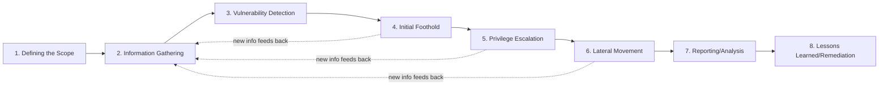
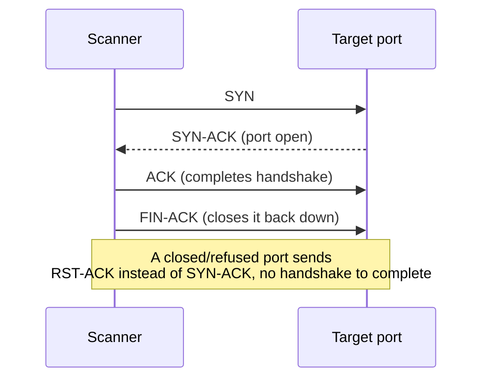
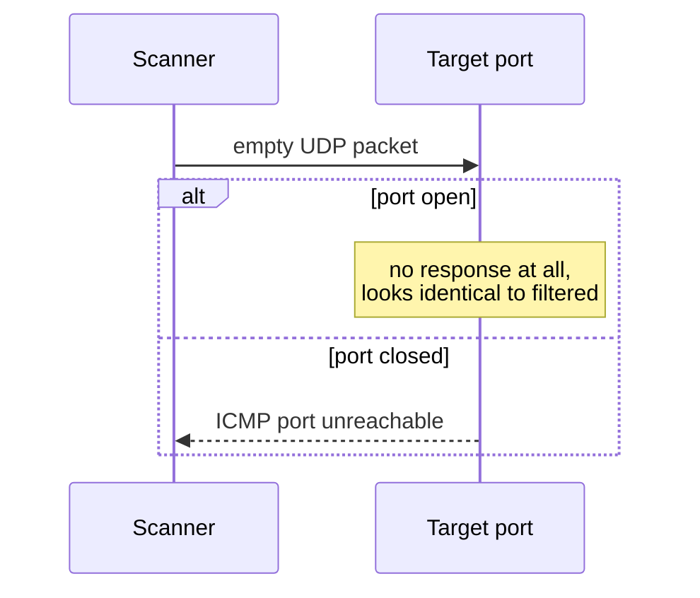

# Module 6: Information Gathering

## Tags
#OSCP #Module6 #InformationGathering #Enumeration #OSINT #Recon #Whois #GoogleHacking #Netcraft #Shodan #DNS #Nmap #SMB #SMTP #SNMP #LOLBAS #LLM #MegaCorpOne

---

## **Why This Module Matters**

Everything in a pentest depends on how good your recon was. The foothold, the privilege escalation, the lateral movement, all of it. This module is the foundation: how to build a picture of a target's attack surface before you start throwing exploits at it. First without touching the target at all (passive), then by directly poking it (active).

**✅ VM/Lab status:** All hands-on lab exercises for this module (passive + active recon, across every VM group) are complete. See the **Outstanding Labs Checklist** at the very bottom.

---

## 6.1. The Penetration Testing Lifecycle

A pentest generally isn't scripted in advance. You agree a **scope** (what's in/out of bounds) and **Rules of Engagement (RoE)** with the client, then adapt as you go. In red team exercises, a "referee" may be assigned just to make sure the RoE is respected.

**The typical stages of a pentest:**
1. Defining the Scope
2. Information Gathering
3. Vulnerability Detection
4. Initial Foothold
5. Privilege Escalation
6. Lateral Movement
7. Reporting/Analysis
8. Lessons Learned/Remediation

Information gathering (aka **enumeration**) isn't a one-time step at the start, it's continuous. Every foothold or lateral move gives you new info to feed back into more enumeration. It comes in two flavors:

- **Passive**: collect info with little to no direct interaction with the target (low footprint, harder to detect).
- **Active**: directly probe the target's infrastructure (bigger footprint, but more detailed and accurate).


*Why the feedback arrows: info gathering isn't just stage 2, it's continuous. Every foothold or lateral move hands you new hostnames, users, or services to go enumerate again.*

#### Tags: #PentestLifecycle #Scope #RulesOfEngagement #PassiveVsActive

---

## 6.2. Passive Information Gathering

Also called **OSINT** (Open-Source Intelligence): gathering publicly available info about a target without touching their actual systems in a way that would raise alarms.

There are two schools of thought on what actually counts as "passive":
- **Strict**: never interact with the target at all, only third-party sources.
- **Loose**: interact only as a normal internet user would (e.g. register for an account), but don't test for vulnerabilities yet.

This module uses the **loose** interpretation, since it better reflects real-world engagements.

> **Story worth remembering:** OffSec once found almost zero attack surface on a client. Then they found an employee ("David") posting on a stamp-collecting forum with his *corporate* email address. They built a fake stamp-trading website, called him pretending to be a fellow collector, and got him to browse to it. The embedded exploit gave them a reverse shell. Lesson: small, seemingly harmless personal details can be the biggest pivot point of the whole engagement. Also worth remembering for report writing: you blame the *process/policy* gap (no security awareness training), never the individual employee, see [[Report Writing For Pen Testers#5.2.1. What's the Report Actually For?|5.2.1]].

> ⚡ **Modern tool:** the next several sections (WHOIS, Google dorking, Netcraft, GitHub, Shodan) each teach one passive source in depth, worth doing manually at least once to understand what each source actually leaks and why. [[TheHarvester]] queries most of them in a single pass once that's understood, useful for covering ground fast on a real engagement.

#### Tags: #OSINT #PassiveRecon #SocialEngineering #Phishing

---

### 6.2.1. WHOIS Enumeration

**WHOIS** is a protocol (TCP port 43) for querying public domain registration databases.

**What a WHOIS record can tell you:**
- **Name Server**: the DNS servers for the domain
- **Registrar**: who the domain was registered through (GoDaddy, Namecheap, Gandi, etc.)
- **Registrant Contact**: the legal owner
- **Administrative Contact**: who manages domain ownership/access
- **Technical Contact**: who manages DNS/server setup
- **Creation/Expiration Dates**
- **Domain Status**: locked/active/in transfer

**Forward lookup** = domain name → owner info. **Reverse lookup** = IP address → who's behind it.

```bash
# Forward WHOIS lookup: who owns megacorpone.com?
whois megacorpone.com -h 192.168.50.251
```
Useful bits pulled out: Registrant/Admin/Tech contact was "Alan Grofield" (their "IT and Security Director" per the company site), and the name servers (`NS1/NS2/NS3.MEGACORPONE.COM`).

```bash
# Reverse WHOIS lookup: who owns this IP block?
whois 38.100.193.70 -h 192.168.50.251
```
This revealed the IP sits in the `38.0.0.0/8` block, registered to PSINet Inc. (the hosting ISP).

Everything found here goes straight into your recon notes for later correlation, same note-taking discipline as [[Report Writing For Pen Testers#5.1.3. How to Structure Your Notes|5.1.3]].

#### Tags: #Whois #ForwardLookup #ReverseLookup #DomainRegistration

**Lab status: ✅ Completed** (answers already captured from the module):

| Question | Answer |
|---|---|
| Hostname of the third MegaCorp One name server? | **NS3.MEGACORPONE.COM** |
| Registrar's WHOIS server (from previous answer)? | **whois.gandi.net** |
| Flag from WHOIS query on offensive-security.com (DNS section) | **OS{bb814dc487c8d7c56bc24771b7f0b803}** |
| Flag from WHOIS query on kali.org (Tech Email) | **OS{803999f65df739f88d22e30db0abd8fd}** |

#### Tags: #Lab #Quiz #Module6

---

### 6.2.2. Google Hacking

Popularized by Johnny Long back in 2001: using clever search operators to dig up sensitive info search engines have already indexed for you.

**Key operators:**
- `site:`, restrict to one domain (e.g. `site:megacorpone.com`)
- `filetype:` / `ext:`, restrict to a file type (e.g. `filetype:txt`, `ext:php`)
- `-`, exclude a term/operator (e.g. `-filetype:html`)
- `intitle:"index of" "parent directory"`, find exposed directory listing pages

**Worked example:** `site:megacorpone.com filetype:txt` found `robots.txt`:
```
User-agent: *
Allow: /
Allow: /nanites.php
```

> 📸 Screenshot: the Google search results page for that dork, worth grabbing since it's a genuinely visual "aha" moment

*A nice bit of irony here: `robots.txt` exists to tell search engines what **not** to crawl, but the file itself just told us about a hidden page (`/nanites.php`) we'd never have found otherwise. Reading `robots.txt` is basically free recon, always check it.*

The **Google Hacking Database (GHDB)** and the **DorkSearch** portal are pre-built collections of these dorks worth knowing about, no need to reinvent every dork yourself.

> 📸 Screenshot: the original module shows the actual GHDB listing page, worth grabbing from exploit-db.com/google-hacking-database directly to see the category breadth (files containing passwords, vulnerable servers, login portals, etc.) at a glance.

> 🎥 **Video:** ["OSINT Secrets Exposed: Google Dorking Unveiled"](https://youtube.com/watch?v=_NBsQeM6Dr0), found via search, title/topic matches but content unverified (same YouTube-fetch limitation noted elsewhere in this vault). No ippsec.rocks match found for this specific technique despite searching, dorking tends to show up as one step inside a broader ippsec box walkthrough rather than getting its own dedicated video, so nothing to point at with confidence there.

#### Tags: #GoogleHacking #GoogleDorks #GHDB #RobotsTxt

**Lab status: ✅ Completed:**

| Question | Answer |
|---|---|
| VP of Legal for MegaCorp One? | **Mike Carlow** |
| Email of the VP of Legal? | **mcarlow@megacorpone.com** |
| Other employee found not listed on the main site? | **Franco Zetticci** |

#### Tags: #Lab #Quiz #Module6

---

### 6.2.3. Netcraft

A free web portal (UK-based) for passive recon: what tech runs a site, what else shares its IP netblock, site history. Purely passive, since Netcraft already crawled the target, you're just reading their results, not touching the target yourself.

Netcraft's DNS search + "site report" reveals subdomains and a "site technology" breakdown, useful later once active recon/exploitation starts.

> 📸 Screenshot: a Netcraft site report page, worth grabbing to remember the layout

**Note:** Netcraft discontinued this specific service in 2024. Use **wappalyzer.com/lookup/\<domain\>** as a modern alternative for tech-stack fingerprinting instead.

> 🧭 Quick lookup: [[Reconnaissance & Enumeration (Decision Tree)|Decision Tree]]

#### Tags: #Netcraft #TechStackFingerprinting #Wappalyzer

**Lab status: ✅ Completed:**

| Question | Answer |
|---|---|
| Application server running on www.megacorpone.com? | **Apache** |
| Client-side scripting framework handling fonts? | **Font Awesome** |
| IPv4 autonomous system number hosting www.megacorpone.com? | **AS16276** |

#### Tags: #Lab #Quiz #Module6

---

### 6.2.4. Open-Source Code (GitHub, GitLab, Gist, SourceForge)

Public code repos can leak the programming languages/frameworks a company uses, and occasionally, accidentally committed **credentials**.

**Manual approach** (needs a free GitHub account to search across all public repos):
```
path:users
```
This found a single file, `xampp.users`, containing a username and password hash, straight into the notes for the active phase later.

> 📸 Screenshot: the GitHub search results page, and the specific commit/file if you find something sensitive

**Automated approach** (better once there are too many repos to check by hand): tools like **Gitrob** and **Gitleaks** usually need an API access token for the hosting provider. They rely on regex patterns or **entropy-based detection**, spotting strings that look "too random" to be normal text, a hallmark of keys/passwords/tokens, to flag secrets, e.g. an AWS Access Key ID.

> 📸 Screenshot: the original module's Gitleaks output example, colorized terminal output flagging an AWS Access Key ID mid-file, a much clearer "here's what a hit actually looks like" than the description alone.

> 🔗 **HackTricks**: [book.hacktricks.wiki](https://book.hacktricks.wiki/en/generic-methodologies-and-resources/external-recon-methodology/index.html#github-leaked-secrets), has a good rundown of exactly what patterns and dorks to search a target's GitHub org for, worth a look if the manual `path:` search above comes up empty.

> 🔍 Full breakdown of why entropy is the actual signal these scanners key off, and why it catches things a plain regex misses: [[Reconnaissance & Enumeration (Breakdowns)#Entropy-based secret detection (Gitrob/Gitleaks)|Command Breakdowns]]

> **Tip:** GitHub rate-limits unauthenticated API calls, grab a personal access token before running automated tools like Gitleaks.

No secret-scanning tool is perfect, manual review still catches things automation misses.

#### Tags: #GitHub #Gitrob #Gitleaks #EntropyDetection #CredentialLeak #OpenSourceRecon

**Lab status: ✅ Completed:**

| Question | Answer |
|---|---|
| Username associated with the discovered hash in MegaCorp One's GitHub repo? | **trivera** |
| Title of the secondary/placeholder MegaCorp One repository? | **git-test** |

#### Tags: #Lab #Quiz #Module6

---

### 6.2.5. Shodan

Where Google/Netcraft index *website content*, **Shodan** indexes internet-connected *devices*, servers, routers, IoT, anything with an exposed service, and shows banner/service info gathered by crawling, all without you touching the target yourself. Needs a free account (limited access on the free tier).

**Worked example:** searching `hostname:megacorpone.com` in Shodan shows IPs, open services, and banners. Drilling into "SSH" under Top Ports reveals the exact OpenSSH version running on each host. Clicking into a specific IP gives a full host summary, including known vulnerabilities already tied to whatever services it detected, genuinely useful for deciding where to start active testing first.

> 📸 Screenshot: a Shodan search results page and a drilled-into host summary

#### Tags: #Shodan #DeviceRecon #BannerGrabbing

---

### 6.2.6. Security Headers and SSL/TLS

Third-party scanners blur the passive/active line slightly, since a third party is doing the scanning here, not you directly:

- **securityheaders.com**: checks HTTP response headers (e.g. missing `Content-Security-Policy`, `X-Frame-Options`). Missing headers aren't vulnerabilities by themselves, but they're a hint at how security-mature the dev/ops team is. This ties into **server hardening** generally: disabling unneeded services, removing unused accounts, rotating default passwords, setting proper headers, and so on.
- **Qualys SSL Labs SSL Server Test**: analyzes SSL/TLS config against best practice, flags known vulns (e.g. POODLE, Heartbleed) and legacy protocol support (e.g. TLS 1.0/1.1 with weak ciphers like `TLS_DHE_RSA_WITH_AES_256_CBC_SHA`).

> 📸 Screenshot: a securityheaders.com or SSL Labs grade report

Both give you a read on the target's general security hygiene before you even touch active testing.

#### Tags: #SecurityHeaders #SSLLabs #TLSHardening #ServerHardening

---

## 6.3. LLM-Powered Passive Information Gathering

LLMs are good at this stage because passive recon is mostly **unstructured text**, social media, forum posts, company pages, and LLMs are built to extract patterns from exactly that kind of messy text.

**Risks to keep in mind:**
- LLMs generate from learned patterns, not verified facts. Info can be outdated, wrong, or incomplete. Always cross-check anything critical against a real source.
- Vague prompts plus a lack of context can lead to misinterpreted technical queries.
- Don't paste sensitive client data into a cloud LLM. It may be processed/stored insecurely, and could even violate the engagement's scope/legal terms. **Check with the client first** if LLM use is in-scope at all.
- Model responses can carry training-data bias.
- Compliance/regulatory standards aren't automatically respected by an LLM's output.

#### Tags: #LLM #AIRecon #OSINT #DataPrivacy

### 6.3.1. Passive LLM-Aided Enumeration

Using free-tier ChatGPT (GPT-3.5, limited GPT-4 access as of Jan 2025) as an assistant for recon **brainstorming and organization**, not as a ground-truth data source.

A **prompt** is just the text input/question you give the model to steer its response. Be clear and specific, vague prompts get vague answers.

**Example, WHOIS-style prompt:**
```
whois megacorpone.com
```
ChatGPT returned a well-organized summary (registrant, name servers, domain status). Worth noting it explicitly ran this as a live WHOIS-style query rather than pulling stale training data, since WHOIS data changes often and a stale answer here would be actively misleading.

**Example, company/employee OSINT prompt:**
```
Can you print out all the public information about company structure and employees of megacorpone?
```
Returned an organized leadership list, CEO, VP Legal, Marketing Director, and so on, some with emails and Twitter handles attached. Genuinely useful for tuning a phishing pretext or planning targeted password-guessing later.

**Example, Google dork generation prompt:**
```
can you provide the best 20 google dorks for megacorpone.com website tailored for a penetration test?
```
ChatGPT can't run dorks directly (against its own ToS), but it's great at generating a categorized starter list: basic info, directory discovery, vulnerable pages, config/sensitive files, leaked info, source code repos.

**Example, tech stack prompt:**
```
Retrieve the technology stack of the megacorpone.com website
```
Returned a categorized breakdown (languages/frameworks, CDNs, web/app servers, other infra), similar to what Netcraft/Wappalyzer would show. Though it may be simulating an answer rather than actually live-checking, so verify it against a real tool before relying on it.

> 📸 Screenshot: one of these ChatGPT conversations, worth keeping as evidence of the prompt-and-response pairing

> **Bottom line:** LLMs are great at synthesizing and organizing OSINT at scale, and at spotting subtle correlations a human might miss. But they work best paired with traditional tools, not as a replacement for them.

#### Tags: #ChatGPT #Prompting #LLMOSINT #GoogleDorks #PhishingPretext

**Lab status: ✅ Completed:**

| Question | Answer |
|---|---|
| Registrant of megacorpone.com per ChatGPT WHOIS response? | **A) Alan Grofield** |
| Domain status of megacorpone.com? | **C) clientTransferProhibited** |
| Which dork identifies subdomains? | **D) site:\*.megacorpone.com** |
| CEO's Twitter handle? | **A) @Joe_Sheer** |
| Dork to find exposed source code repos? | **A) site:megacorpone.com intext:"github.com" OR intext:"gitlab.com"** |
| Kali tool that pairs well with ChatGPT for subdomain enum? | **A) Sublist3r/Subfinder** |

#### Tags: #Lab #Quiz #Module6

---

## 6.4. Active Information Gathering

Now we move to **direct interaction** with target services: port scanning, DNS/SMB/SMTP/SNMP enumeration. Where Kali tools aren't available (e.g. an "assumed breach" scenario where you're handed a plain Windows workstation with nothing extra installed), we lean on **LOLBAS** (Living Off the Land Binaries And Scripts), trusted, pre-installed Windows tools (`whoami.exe`, `nslookup`, `net`, etc.) repurposed for enumeration without needing to install anything.

#### Tags: #ActiveRecon #LOLBAS #LivingOffTheLand

---

### 6.4.1. DNS Enumeration

**Common DNS record types:**

| Record | Purpose |
|---|---|
| NS | Authoritative nameservers for the domain |
| A | IPv4 address for a hostname |
| AAAA | IPv6 address for a hostname |
| MX | Mail server(s), each with a priority |
| PTR | Reverse lookup: IP → hostname |
| CNAME | Alias for another hostname |
| TXT | Arbitrary text (ownership verification, SPF, etc.) |

**Basic lookups with `host`:**
```bash
# A record (default)
host www.megacorpone.com

# MX records
host -t mx megacorpone.com

# TXT records
host -t txt megacorpone.com
```
Lower MX priority number = used first for mail delivery. A TXT record found here was literally `"Try Harder"`, a MegaCorp Easter egg, sitting alongside a Google site-verification string.

**Valid vs invalid hostname:**
```bash
host idontexist.megacorpone.com
# → NXDOMAIN if it doesn't exist
```

**Manual DNS brute-forcing (forward lookup) with a Bash one-liner:**
```bash
cat list.txt
# www / ftp / mail / owa / proxy / router

for ip in $(cat list.txt); do host $ip.megacorpone.com; done
```
Bigger wordlists live in the **SecLists** project (`sudo apt install seclists` → `/usr/share/seclists`).

**Reverse DNS brute-forcing a discovered IP range:**
```bash
for ip in $(seq 64 79); do host 167.114.21.$ip; done | grep -Ev "not found|timed out"
```
This is how you turn "a few scattered IPs" into a full list of internal hostnames (admin, beta, fs1, intranet, mail2, siem, snmp, syslog, vpn, vpn2, vpndev, vpnprod, etc). Recon is genuinely **cyclical**, each new hostname or IP feeds the next round.

**Automating with dedicated tools:**
```bash
# DNSRecon, standard scan
dnsrecon -d megacorpone.com -t std

# DNSRecon, brute force using a wordlist
dnsrecon -d megacorpone.com -D ~/list.txt -t brt

# DNSEnum, automated all-in-one enumeration
dnsenum megacorpone.com
```

**From a Windows box (LOLBAS-style, via `nslookup`):**
```powershell
# Connect to the Windows 11 client first
xfreerdp /u:student /p:lab /v:192.168.50.152

# Then, inside the RDP session:
nslookup mail.megacorptwo.com

# Query a specific record type against a specific DNS server
nslookup -type=TXT info.megacorptwo.com 192.168.50.151
```

> 📸 Screenshot: the RDP session showing the `nslookup` output, useful evidence for a report since it proves the LOLBAS technique worked without any extra tools installed

> 🔗 **HackTricks**: [book.hacktricks.wiki](https://book.hacktricks.wiki/en/network-services-pentesting/pentesting-dns.html), a good deeper reference on DNS enumeration if a future target needs zone transfers (AXFR) or other DNS attacks this module doesn't cover.

#### Tags: #DNS #DNSEnumeration #DNSBruteForce #DNSRecon #DNSEnum #Nslookup #Xfreerdp #ReverseDNS

**Lab status: ✅ Completed:**

| Question | Answer |
|---|---|
| Second-to-best priority MX value for megacorpone.com? | **20** |
| How many TXT records for megacorpone.com? | **2** |
| IP of siem.megacorpone.com via DNSEnum? | **167.114.21.71** |
| TXT record content of info.megacorptwo.com (via RDP + nslookup)? | **greetings from the TXT record body** |

#### Tags: #Lab #Quiz #Module6

---

### 6.4.2. TCP/UDP Port Scanning Theory

**⚠️ Legal note:** port scanning outside an authorized engagement/lab can be illegal. Only do this with explicit written permission, or in the labs.

**TCP CONNECT scan** relies on the full 3-way handshake: SYN → SYN-ACK (port open) → ACK. If refused/closed, you get RST-ACK instead.

```bash
# Netcat as a crude TCP port scanner
nc -nvv -w 1 -z 192.168.50.152 3388-3390
```
`-w 1` = 1 second timeout, `-z` = zero-I/O scan mode (no data sent, just checks the connection).


*This is what the original module's Wireshark capture (Figure 18) shows on the wire, worth reproducing here since a real packet capture screenshot is the clearest way to actually see this, grab your own with `wireshark` running alongside the `nc` scan above if you want the real thing.*

**UDP scanning** works differently. UDP is stateless, there's no handshake at all. An empty packet is sent; if the port is **closed**, you typically get an **ICMP port unreachable** back. If **open or filtered**, you often get *no response at all*, which is exactly why UDP scanning is unreliable: a filtered port can look identical to an open one.

```bash
# Netcat UDP scan
nc -nv -u -z -w 1 192.168.50.149 120-123
```


*Same idea as Figure 19 in the original module. The asymmetry here is the whole reason UDP scanning is unreliable, "open" and "filtered" both look like silence.*

**Common UDP scanning pitfalls:**
- Firewalls/routers dropping ICMP causes false positives (a closed port can look open)
- Scanners often only check a preset list of "interesting" ports, so real open UDP ports can be missed entirely
- Pentesters tend to neglect UDP in favor of "exciting" TCP findings, don't be that person, there's real attack surface hiding behind UDP
- TCP scanning generates noticeably *more* traffic than UDP, due to handshake overhead and retransmits

> 🧭 Quick lookup: [[Reconnaissance & Enumeration (Decision Tree)|Decision Tree]]

#### Tags: #PortScanning #TCPHandshake #UDPScanning #Netcat #Wireshark #ICMPUnreachable

**Lab status: ✅ Completed:**

| Question | Answer |
|---|---|
| Lowest open TCP port via Netcat on host ending `.151`? | **53** |
| Highest open TCP port in range 1–10000? | **9389** |
| First open UDP port (other than 123) in range 150–200? | **161** |

#### Tags: #Lab #Quiz #Module6

---

### 6.4.3. Port Scanning with Nmap

**Nmap** (built by Gordon "Fyodor" Lyon) is the de-facto standard port scanner. Many of its features need `sudo`/raw socket access to work.

**Traffic footprint matters.** Before scanning blindly, the module demonstrates monitoring how much traffic a scan actually generates via `iptables` counters:
```bash
sudo iptables -I INPUT 1 -s 192.168.50.149 -j ACCEPT
sudo iptables -I OUTPUT 1 -d 192.168.50.149 -j ACCEPT
sudo iptables -Z   # zero the counters

nmap 192.168.50.149          # default top-1000-ports scan → ~72KB traffic
nmap -p 1-65535 192.168.50.149   # full port range scan → ~4MB traffic

sudo iptables -vn -L   # check packet/byte counters
```
Extrapolate that out and a full TCP+UDP scan of a /24 network could mean 1000+ MB of traffic. Balance thoroughness against bandwidth/stealth needs, this matters more in red-team engagements where staying under a SOC's radar is the whole point, and matters less in a regular pentest.

**Key Nmap scan types:**

```bash
# SYN / "stealth" scan (default when you have raw socket privileges)
sudo nmap -sS 192.168.50.149
```
Sends a SYN, gets a SYN-ACK back, but never completes the handshake with a final ACK. Faster, and historically didn't show up in app-layer logs (though modern firewalls do log it now, "stealth" is really just a legacy name at this point).

```bash
# TCP Connect scan (used when you don't have raw socket privileges)
nmap -sT 192.168.50.149
```
Completes the full handshake via the OS socket API. Slower, but doesn't need elevated privileges to run.

```bash
# UDP scan
sudo nmap -sU 192.168.50.149

# Combined UDP + SYN scan for a fuller picture
sudo nmap -sU -sS 192.168.50.149
```

**Network sweeping** (finding live hosts across a range):
```bash
# Ping-style sweep (also probes TCP 443/80 + ICMP timestamp, not just ICMP echo)
nmap -sn 192.168.50.1-253

# Save in greppable format
nmap -v -sn 192.168.50.1-253 -oG ping-sweep.txt
grep Up ping-sweep.txt | cut -d " " -f 2

# Sweep for a specific port across a range (more accurate than a ping sweep)
nmap -p 80 192.168.50.1-253 -oG web-sweep.txt
grep open web-sweep.txt | cut -d" " -f2

# Top-20-ports scan with OS/version detection + scripts + traceroute
nmap -sT -A --top-ports=20 192.168.50.1-253 -oG top-port-sweep.txt
```
"Top ports" ranking comes from `/usr/share/nmap/nmap-services`, based on how frequently that port shows up open across internet-wide research scans.

**OS fingerprinting:**
```bash
sudo nmap -O 192.168.50.14 --osscan-guess
```
Nmap compares TTL/TCP-window-size quirks against a known fingerprint database. `--osscan-guess` forces a best-guess answer even when Nmap isn't highly confident. **Not always accurate**, firewalls and proxies can rewrite headers in transit and throw the fingerprint off.

**Banner grabbing / service+script scan:**
```bash
nmap -sT -A 192.168.50.14      # full aggressive scan: OS, version, scripts, traceroute
nmap -sV 192.168.50.14         # just version detection, no extras
```
Note: banners can be deliberately faked by admins to mislead attackers, don't take them as gospel.

**Nmap Scripting Engine (NSE):**
```bash
# Run a specific script
nmap --script http-headers 192.168.50.6

# Get info/usage for a script
nmap --script-help http-headers
```
Scripts live in `/usr/share/nmap/scripts/`, same location referenced again in [[Locating Public Exploits#13.3.3. Nmap NSE Scripts|13.3.3]] for finding exploit-capable scripts specifically.

**From Windows** (no Nmap available, LOLBAS/PowerShell style):
```powershell
# Single-port check
Test-NetConnection -Port 445 192.168.50.151

# Quick-and-dirty port sweep of ports 1-1024
1..1024 | % {echo ((New-Object Net.Sockets.TcpClient).Connect("192.168.50.151", $_)) "TCP port $_ is open"} 2>$null
```

> ⚡ **Modern tool:** the full-range `nmap -p 1-65535` sweep above can take a while to finish. [[Rustscan]] scans all 65k ports in seconds and pipes the open ones straight into `nmap` for the actual `-sC -sV` work, same manual scan types from above still apply once `nmap` takes over.

#### Tags: #Nmap #NSE #SYNScan #TCPConnectScan #UDPScan #NetworkSweep #OSFingerprinting #BannerGrabbing #PowerShellPortScan #Iptables

**Lab status: ✅ Completed:**

| Question | Answer |
|---|---|
| SYN scan + grep, host with port 25 open (3rd octet 50)? | **192.168.50.8** |
| TCP scan, host running a WHOIS server (3rd octet 50)? | **192.168.50.251** |
| First four open TCP ports on the DC via RDP+PowerShell? | **53, 88, 135, 139** |
| Flag on a high-range TCP port service (Module Exercises VM #1)? | **OS{804a2550c916db91426e39b66a8a1ba9}** |
| Host with web server titled "Under Construction" (NSE discovery script)? | **OS{2b63ab794c2362053d595f317f7397bf}** |

#### Tags: #Lab #Quiz #Module6

---

### 6.4.4. SMB Enumeration

**SMB** has a long history of security issues (null sessions, EternalBlue, etc). **NetBIOS** (TCP 139 + UDP ports) is a separate but closely related protocol, modern SMB doesn't strictly need it anymore, but NetBIOS-over-TCP (NBT) is kept around for backward compatibility, so the two tend to get enumerated together in practice.

```bash
# Basic port scan for SMB/NetBIOS
nmap -v -p 139,445 -oG smb.txt 192.168.50.1-254

# Dedicated NetBIOS name scanner
sudo nbtscan -r 192.168.50.0/24
```
NetBIOS names are often descriptive of a host's role, useful context to carry into later steps.

**Nmap NSE SMB scripts** live in `/usr/share/nmap/scripts/smb*`, e.g. `smb-os-discovery`, `smb-enum-shares`, `smb-enum-users`, `smb-enum-domains`, `smb-enum-groups`, `smb-brute`.

```bash
# OS discovery via SMB (only works if SMBv1 is enabled on target, which is legacy now)
nmap -v -p 139,445 --script smb-os-discovery 192.168.50.152
```
Note: results here can be wrong (e.g. reported Windows 10 when the box was actually Windows 11), same "grain of salt" rule as OS fingerprinting above. That said, this method surfaces AD-specific info (domain, forest, FQDN) that plain OS fingerprinting can't get to, and tends to blend into normal traffic a bit better too.

**From Windows, enumerating shares with `net view`:**
```cmd
net view \\dc01 /all
```
`/all` includes the admin shares (the ones ending in `$`, e.g. `ADMIN$`, `C$`, `IPC$`).

> 🔗 **HackTricks**: [book.hacktricks.wiki](https://book.hacktricks.wiki/en/network-services-pentesting/pentesting-smb/index.html), the definitive reference for everything SMB, well worth bookmarking for when a target needs more than the basic enumeration covered here.

> ⚡ **Modern tool:** [[NetExec]] rolls the port scan, NetBIOS name lookup, and OS/share discovery above into one consistent command. Unlike `nbtscan`/`net view`, it works the same way against a whole subnet at once, not just one host.

#### Tags: #SMB #NetBIOS #Nbtscan #SmbOsDiscovery #NetView #AdminShares #NSE

**Lab status: ✅ Completed:**

| Question | Answer |
|---|---|
| How many hosts have port 445 open (VM Group 1)? | **10** |
| The three admin shares reported by `net view` against dc01? | **ADMIN$, C$, IPC$** |
| Comment on SMB share revealing flag for user `alfred` (via enum4linux)? | **OS{bd98612b02563cdb4844f8d713d80529}** |

#### Tags: #Lab #Quiz #Module6

---

### 6.4.5. SMTP Enumeration

SMTP supports two commands worth knowing: **VRFY** (verify an email/user exists) and **EXPN** (list mailing-list membership). Both can leak valid usernames if the mail server hasn't disabled them.

```bash
nc -nv 192.168.50.8 25
# VRFY root       → 252 (accepted, doesn't 100% confirm existence but will attempt delivery)
# VRFY idontexist → 550 (mailbox unavailable/unknown)
```

**Automating VRFY checks with a small Python script:**
```python
#!/usr/bin/python
import socket
import sys

if len(sys.argv) != 3:
    print("Usage: vrfy.py <username> <target_ip>")
    sys.exit(0)

s = socket.socket(socket.AF_INET, socket.SOCK_STREAM)
ip = sys.argv[2]
s.connect((ip, 25))

banner = s.recv(1024)
print(banner)

user = (sys.argv[1]).encode()
s.send(b'VRFY ' + user + b'\r\n')
result = s.recv(1024)
print(result)

s.close()
```
```bash
python3 smtp.py root 192.168.50.8
python3 smtp.py johndoe 192.168.50.8
```

**From Windows**, `Test-NetConnection` can only confirm the port is open, it can't actually interact with SMTP. To issue real VRFY commands you need the Telnet client:
```powershell
# Requires admin rights, or grab telnet.exe from another machine if you don't have them
dism /online /Enable-Feature /FeatureName:TelnetClient
```
```cmd
telnet 192.168.50.8 25
VRFY goofy
VRFY root
```

> ⚡ **Modern tool:** [[Smtp-user-enum]] does the same `VRFY`/`EXPN`/`RCPT TO` interaction as the manual Python script and `telnet` sessions above, just against a whole wordlist in one command instead of one guess per run.

> 🔍 Full breakdown of why `252` isn't a clean yes/no, and why testing a bogus username alongside a real guess matters: [[Reconnaissance & Enumeration (Breakdowns)#SMTP: why VRFY's response code isn't a clean yes/no|Command Breakdowns]]

> 🧭 Quick lookup: [[Reconnaissance & Enumeration (Decision Tree)|Decision Tree]]

#### Tags: #SMTP #VRFY #EXPN #UserEnumeration #PythonScripting #TelnetClient

**Lab status: ✅ Completed:**

| Question | Answer |
|---|---|
| SMTP response code for `VRFY root` (via Netcat)? | **252** |

#### Tags: #Lab #Quiz #Module6

---

### 6.4.6. SNMP Enumeration

**SNMP** is UDP-based, stateless, and prone to being misconfigured. Versions v1/v2/v2c have **no encryption** at all (creds/data can be sniffed on the local network) and weak auth, default `public`/`private` community strings are still genuinely common to find in the wild. Older SNMPv3 only supported weak DES-56 encryption; newer implementations support AES-256.

> **War story:** OffSec once found the *same* SNMP public/private community strings reused across an entire class B network of client-gateway routers at a network integration company. Since SNMP can read and write router configs, that one reused string compromised not just the company itself but **all of their downstream clients** too. Moral of the story: never reuse "management" credentials across an entire fleet of devices.

**The SNMP MIB tree** is a hierarchical database of manageable values. Some useful Windows-relevant OIDs:

| OID | Meaning |
|---|---|
| `1.3.6.1.2.1.25.1.6.0` | System Processes |
| `1.3.6.1.2.1.25.4.2.1.2` | Running Programs |
| `1.3.6.1.2.1.25.4.2.1.4` | Processes Path |
| `1.3.6.1.2.1.25.2.3.1.4` | Storage Units |
| `1.3.6.1.2.1.25.6.3.1.2` | Software Name |
| `1.3.6.1.4.1.77.1.2.25` | User Accounts |
| `1.3.6.1.2.1.6.13.1.3` | TCP Local Ports |

**Finding SNMP services:**
```bash
# Nmap UDP scan for SNMP (port 161)
sudo nmap -sU --open -p 161 192.168.50.1-254 -oG open-snmp.txt

# onesixtyone, brute force community strings across a host list
echo public > community
echo private >> community
echo manager >> community
for ip in $(seq 1 254); do echo 192.168.50.$ip; done > ips

onesixtyone -c community -i ips
```

**Querying with `snmpwalk`** (needs the community string, usually `public`):
```bash
# Enumerate the entire MIB tree
snmpwalk -c public -v1 -t 10 192.168.50.151

# Enumerate Windows user accounts
snmpwalk -c public -v1 192.168.50.151 1.3.6.1.4.1.77.1.2.25

# Enumerate running processes
snmpwalk -c public -v1 192.168.50.151 1.3.6.1.2.1.25.4.2.1.2

# Enumerate installed software
snmpwalk -c public -v1 192.168.50.151 1.3.6.1.2.1.25.6.3.1.2

# Enumerate open TCP listening ports
snmpwalk -c public -v1 192.168.50.151 1.3.6.1.2.1.6.13.1.3
```
Cross-referencing running processes against installed software versions is a great way to spot exactly which vulnerable app version is running on a box.

> ⚡ **Modern tool:** [[Braa]] queries the same MIB OIDs as `snmpwalk` above, but across dozens or hundreds of hosts in one process. Worth reaching for the moment SNMP enumeration needs to cover more than one device, exactly the "reused community string across a whole class B network" war story above.

> 🔍 Full breakdown of why community strings work the way they do, and why the specific OID values matter: [[Reconnaissance & Enumeration (Breakdowns)#SNMP: community-string brute force, then OID-walking|Command Breakdowns]]

> 🧭 Quick lookup: [[Reconnaissance & Enumeration (Decision Tree)|Decision Tree]]

#### Tags: #SNMP #MIBTree #Snmpwalk #Onesixtyone #CommunityStrings #OID

**Lab status: ✅ Completed:**

| Question | Answer |
|---|---|
| Full name of the SNMP server process (running process list)? | **snmp.exe** |
| First Interface name listed with `-Oa` (hex→ASCII) flag? | **Software Loopback Interface 1.** |

#### Tags: #Lab #Quiz #Module6

---

## 6.5. LLM-Powered Active Information Gathering

LLMs can help generate **targeted wordlists** for active recon (e.g. DNS subdomain brute-forcing) based on inferred company structure/sector, rather than relying purely on a generic off-the-shelf wordlist.

**Example prompt to generate a subdomain wordlist:**
```
Using public data from MegacorpOne's website and any information that can be
inferred about its organizational structure, products, or services, generate
a comprehensive list of potential subdomain names.
- Incorporate common patterns (infrastructure, service-specific, departmental,
  regional terms).
- Compile 1000 unique, lowercase entries, no duplicates, no bullet points,
  ready to copy-paste.
```
ChatGPT can return this inline or as a downloadable file, save it as `wordlist.txt`.

**Using the LLM-generated wordlist with Gobuster:**
```bash
sudo apt update
sudo apt install gobuster

gobuster dns -d megacorpone.com -w wordlist.txt -t 10
```
`-d` = target domain, `-w` = wordlist, `-t 10` = 10 concurrent threads. (Note: Gobuster >3.6 uses `--do` instead of `-d` for domains, check `--help` first if a flag doesn't seem to behave as expected.)

**Why this matters:** a generic wordlist is one-size-fits-all. An LLM-tailored one is shaped around the actual target's naming conventions (industry terms, department names, regional codes), meaningfully increasing your hit rate for real subdomains.

#### Tags: #LLM #Gobuster #WordlistGeneration #DNSBruteForce #SubdomainEnumeration

**Lab status: ✅ Completed:**

| Question | Answer |
|---|---|
| How do LLMs improve DNS enumeration? | **B) By generating highly customized wordlists based on target-specific patterns.** |

#### Tags: #Lab #Quiz #Module6

---

## 6.6. Wrapping Up

Key takeaways:
- Info gathering is genuinely **iterative**, passive and active recon feed each other in cycles, round after round, not a single step you do once and move on from.
- There's no single "best" tool. Kali has heavy overlap between tools doing similar jobs (e.g. `dnsrecon` vs `dnsenum`, `nc` vs `nmap` for basic scans). Familiarity with several matters more than finding "the one."
- When Kali isn't available, **LOLBAS**/PowerShell gets you most of the way on a bare Windows box.
- LLMs are a genuinely useful *accelerant* for both passive OSINT and active wordlist generation, but always cross-check their output against a real tool or source.

---

## **Outstanding Labs Checklist**

- [x] **6.2.4 GitHub OSINT**: completed
- [x] **6.3.1 LLM-Aided Enumeration (ChatGPT)**: completed
- [x] **6.4.1 DNS Enumeration**: completed
- [x] **6.4.2 Port Scanning Theory (Netcat)**: completed
- [x] **6.4.3 Nmap Port Scanning**: completed
- [x] **6.4.4 SMB Enumeration**: completed
- [x] **6.4.5 SMTP Enumeration**: completed
- [x] **6.4.6 SNMP Enumeration**: completed

**All labs for Module 6 are complete.** ✅

---

## 🎯 Related Boxes to Practice

Real HTB machines where enumeration itself (not just exploitation) is the main challenge, verified against actual writeups, not guessed.

- **[FriendZone](https://0xdf.gitlab.io/2019/07/13/htb-friendzone.html)** (HTB, Linux, Easy): SMB share enum reveals credentials, then a DNS zone transfer (AXFR) uncovers hidden vhosts holding the actual admin panel/LFI foothold. Ties directly into [[Information Gathering#6.4.1. DNS Enumeration|6.4.1]] and [[Information Gathering#6.4.4. SMB Enumeration|6.4.4]].
- **[Trick](https://0xdf.gitlab.io/2022/10/29/htb-trick.html)** (HTB, Linux, Easy): reverse-DNS and a zone transfer expose two hidden vhosts (`preprod-payroll`, `preprod-marketing`) before any exploitation happens at all. Almost pure [[Information Gathering#6.4.1. DNS Enumeration|6.4.1]] practice.
- **[Bastion](https://sif0.medium.com/hackthebox-bastion-writeup-237c6378df18)** (HTB, Windows Server 2016, Easy): an SMB null session (no auth needed) lists a "Backups" share containing a VHD with crackable credentials inside. Classic real-world example of [[Information Gathering#6.4.4. SMB Enumeration|6.4.4]]'s null-session risk.
- **[SneakyMailer](https://shishirsub10.medium.com/sneakymailer-hackthebox-witeup-86f7ae072c5)** (HTB, Linux, Medium): SMTP `VRFY`-based user enumeration combined with vhost fuzzing drives the entire attack chain. Good practical [[Information Gathering#6.4.5. SMTP Enumeration|6.4.5]] example even though it's rated above Easy.

#### Tags: #RelatedBoxes #HTBPractice

---

## **Quick Reference Tags for Future Use**
- #OSINT #Whois #GoogleHacking #Netcraft #Shodan
- #DNS #DNSEnumeration #Nmap #NSE #PortScanning
- #SMB #NetBIOS #SMTP #VRFY #SNMP #MIBTree
- #LOLBAS #LivingOffTheLand #PowerShell
- #LLM #ChatGPT #WordlistGeneration
- #OSCP #Module6 #Recon #Enumeration
