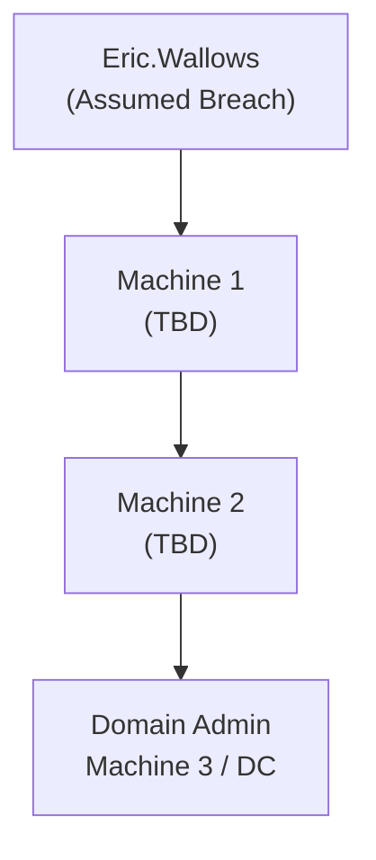

# CL4: AD Chain Write-Up

Part of [[CL4 Overview]]. Three domain-joined machines forming one AD engagement. Goal: Domain Admin on Machine 3 (the DC or highest-privilege target).

Points: 10 (Machine 1) + 10 (Machine 2) + 20 (Machine 3 / DA) = 40 total.

---

## Assumed Breach Entry Point

```
Username: Eric.Wallows
Password: EricLikesRunning800
```

Start here. Enumerate what Eric.Wallows can see/access before anything else.

```bash
# What groups is Eric in?
net user Eric.Wallows /domain

# SMB access check across all AD machines
nxc smb <AD_subnet> -u Eric.Wallows -p EricLikesRunning800

# BloodHound collection from Eric's perspective
bloodhound-python -u Eric.Wallows -p EricLikesRunning800 -d <DOMAIN> -ns <DC_IP> -c All
```

> 📸 Screenshot: BloodHound graph showing Eric.Wallows and outbound paths

---

## Machine 1 — (10 pts)

**Hostname:** ?  **IP:** ?  **OS:** ?

### Recon


### Foothold


### PrivEsc / Lateral Movement


### Flags

```
local.txt: 
```

> 📸 Screenshot: shell as low-priv user + cat local.txt

---

## Machine 2 — (10 pts)

**Hostname:** ?  **IP:** ?  **OS:** ?

### Recon


### Foothold / Lateral Movement


### PrivEsc


### Flags

```
local.txt: 
```

> 📸 Screenshot: shell on Machine 2 + cat local.txt

---

## Machine 3 — Domain Admin (20 pts)

**Hostname:** ?  **IP:** ?  **OS:** ?  (DC?)

### Path to DA


### DCSync / DA Confirmation

```bash
# Confirm DA
whoami /all

# DCSync if domain admin
impacket-secretsdump <DOMAIN>/<user>:<pass>@<DC_IP>
```

> 📸 Screenshot: whoami showing domain admin group membership
> 📸 Screenshot: secretsdump or mimikatz output

### Flags

```
proof.txt: 
```

> 📸 Screenshot: shell on DC + cat proof.txt

---

## Full AD Attack Chain

*Complete this Mermaid diagram at the end.*



---

## Key Credentials Found

| Username | Password / Hash | Where Found | Works On |
|---|---|---|---|
| Eric.Wallows | EricLikesRunning800 | Assumed breach | — |
| | | | |

---

## RUNBOOK Stage Notes Updated

*Check boxes as you update the stage note files.*

- [ ] [[AD - Initial Enum]] — box_sources updated
- [ ] [[AD - BloodHound]] — box_sources updated
- [ ] *(add whichever stages you used)*
## Why this matters for OSCP

Challenge labs combine separate techniques, so this page helps you practise routing from discovery to proof under time pressure.

## Relevant RUNBOOK V2 stages

- [[RUNBOOK V2/Index]]
- [[RUNBOOK V2/AD - Service Scan]]
- [[RUNBOOK V2/AD - Credential Validation]]
- [[RUNBOOK V2/AD - BloodHound]]

## Related modules

- [[MODULES/28. Trying Harder - The Challenge Labs]] -- challenge-lab practice and review
- [[MODULES/27. Assembling the Pieces]] -- combining attack paths
## External Resources

- https://book.hacktricks.wiki/en/generic-methodologies-and-resources/index.html
- https://www.revshells.com/
