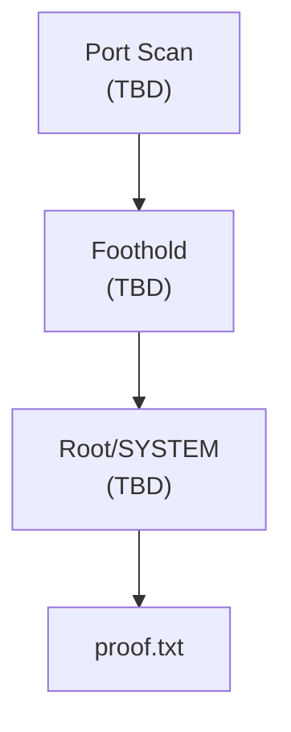

# CL4: Standalone 2 Write-Up

Part of [[CL4 Overview]]. 20 points. No dependencies on other machines or the AD set.

**Hostname:** ?  **IP:** ?  **OS:** ?  **Difficulty feel:** ?

**The gist:** *(one sentence summary of the kill chain once done)*

---

## 1. Recon: Port Scan

```bash
nmap -p- --min-rate 10000 -oA nmap/CL4-S2_allports <IP>
```

| Port | Service | Version |
|---|---|---|
| | | |

```bash
nmap -sC -sV -p <ports> -oA nmap/CL4-S2_services <IP>
```

> 📸 Screenshot: nmap full port scan output
> 📸 Screenshot: nmap service scan output

---

## 2. Service Enumeration

*Enumerate each interesting service. Add/remove sections as needed.*

---

## 3. Foothold


> 📸 Screenshot: initial shell — whoami + hostname + id

---

## 4. Local Enumeration

```bash
# Linux
id; whoami; uname -a; cat /etc/passwd | grep -v nologin
find / -perm -4000 2>/dev/null
sudo -l

# Windows
whoami /all
systeminfo
Get-LocalUser
```

---

## 5. Privilege Escalation


> 📸 Screenshot: shell as root/SYSTEM — whoami + id

---

## 6. Flags

```bash
# Linux
cat /root/proof.txt
cat /home/*/local.txt 2>/dev/null

# Windows
type C:\Users\Administrator\Desktop\proof.txt
type C:\Users\*\Desktop\local.txt 2>/dev/null
```

```
local.txt:  [paste hash]
proof.txt:  [paste hash]
```

> 📸 Screenshot: cat proof.txt with IP visible (ifconfig/ipconfig in same terminal)

---

## Attack Chain



---

## RUNBOOK Stage Notes Updated

- [ ] *(list each stage note file used and confirm box_sources updated)*
