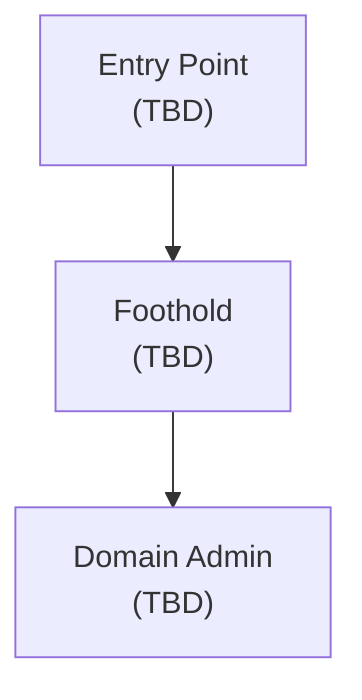

# CL4: OSCP Mock 1 — Engagement Overview

Part of [[CHALLENGE LABS|Challenge Labs]]. Six machines total: 3 standalone + 3 AD-joined. Same structure as the real OSCP+ exam.

---

## Assumed Breach Credentials

```
Username: Eric.Wallows
Password: EricLikesRunning800
```

Use these to start the AD chain. You're handed an initial foothold on one domain machine — your job is to move through the chain to DA.

---

## Scoring Tracker

| Target | Points | local.txt | proof.txt | Done? |
|---|---|---|---|---|
| Standalone 1 | 20 | ⬜ | ⬜ | ⬜ |
| Standalone 2 | 20 | ⬜ | ⬜ | ⬜ |
| Standalone 3 | 20 | ⬜ | ⬜ | ⬜ |
| AD Machine 1 | 10 | ⬜ | — | ⬜ |
| AD Machine 2 | 10 | ⬜ | — | ⬜ |
| AD Machine 3 (DA) | 20 | — | ⬜ | ⬜ |
| **Total** | **100** | | | |
| **Needed to pass** | **70** | | | |

---

## Machine Inventory

*Fill this in after initial discovery scan.*

| Hostname | IP | OS | Role | Notes |
|---|---|---|---|---|
| ? | ? | ? | Standalone 1 | |
| ? | ? | ? | Standalone 2 | |
| ? | ? | ? | Standalone 3 | |
| ? | ? | ? | AD Machine 1 | |
| ? | ? | ? | AD Machine 2 | |
| ? | ? | ? | AD Machine 3 (DC?) | |

---

## Attack Plan

Initial approach:
1. Broad nmap sweep across the entire subnet to find all 6 machines
2. Service fingerprint everything before committing to any single target
3. Run the 3 standalones in parallel with AD initial recon (standalones are independent)
4. AD chain: start with assumed breach creds, enumerate from Eric.Wallows outward

> 🔍 Worth remembering generally: IP order means nothing. Find the lowest-hanging fruit across all machines before diving deep on one. One early standalone can stack points while AD is being figured out.

> 🔧 Technique: no dependencies between standalones and the AD set. Treat them as 4 separate mini-engagements: 3 isolated boxes + 1 AD chain.

---

## Discovery Scan

*Paste your results here.*

```bash
# Initial sweep — adjust subnet to match your CL4 network
nmap -p- --min-rate 5000 -oA nmap/CL4_allports <subnet>
```

> 📸 Screenshot: initial nmap sweep showing all live hosts

---

## Attack Chain Summary

*Fill in as you progress. Aim to have a complete Mermaid chain here at the end.*



---

## Exam Report

Draft report in SysReptor: [cloud.sysreptor.com](https://cloud.sysreptor.com)

> 🔧 Technique: treat CL4 as a live exam report practice run. For each machine: document the finding, the steps to reproduce, and the impact. The exam gives you 24 hours to write the report after hacking ends.

---

## Files

- [[CL4 - Standalone 1]] — standalone machine write-up
- [[CL4 - Standalone 2]] — standalone machine write-up
- [[CL4 - Standalone 3]] — standalone machine write-up
- [[CL4 - AD Chain]] — AD chain (all 3 domain machines)
## Why this matters for OSCP

Challenge labs combine separate techniques, so this page helps you practise routing from discovery to proof under time pressure.

## Relevant RUNBOOK V2 stages

- [[RUNBOOK V2/Index]]
- [[RUNBOOK V2/AD - Service Scan]]
- [[RUNBOOK V2/AD - Credential Validation]]
- [[RUNBOOK V2/AD - BloodHound]]

## Related modules

- [[MODULES/28. Trying Harder - The Challenge Labs]] -- challenge-lab practice and review
- [[MODULES/27. Assembling the Pieces]] -- combining attack paths
## External Resources

- https://book.hacktricks.wiki/en/generic-methodologies-and-resources/index.html
- https://www.revshells.com/
