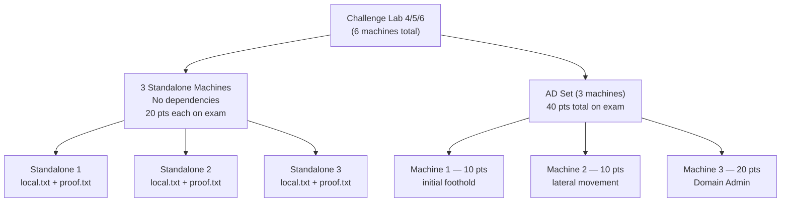
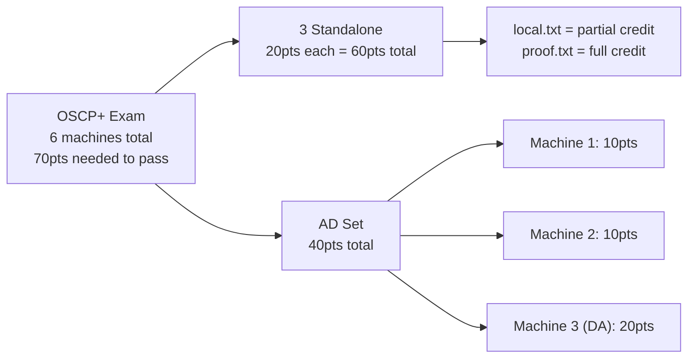

# Trying Harder: The Challenge Labs

Part of [[MODULES|PEN200 Modules]]. Module 28 — the final module. No new techniques. This is the orientation guide for the Challenge Labs and the OSCP+ exam itself.

---

## Outstanding Sections

- [x] 28.1 — PWK Challenge Lab Overview
- [x] 28.2 — Challenge Lab Details
- [x] 28.3 — The OSCP Exam Information
- [x] 28.4 — Wrapping Up

> No hands-on labs in this module. All content is orientation/reference.

---

## 28.1 PWK Challenge Lab Overview

### 28.1.1 Do This First

Before touching any Challenge Lab, make sure:
1. All PWK Capstone exercises done (every module's hands-on labs)
2. [[27. Assembling the Pieces|M27 Assembling the Pieces]] fully complete

The capstones build individual technique reps. M27 builds the chaining mindset. The Challenge Labs assume both.

---

### 28.1.2 Challenge Labs 0-3 (Scenarios)

Scenario-based labs. Each has a story, a set of networked machines, multiple subnets, and an Active Directory domain. Goal is Domain Admin + as many machines as possible.

Difficulty increases from CL0 to CL3. CL3 is beyond OSCP scope. If exam prep is the priority, do CL4-6 before returning to CL3.

**Assumed Breach credentials (CL0 and CL7-10):**
```
Username: Eric.Wallows
Password: EricLikesRunning800
```

| Lab | Name | Summary |
|---|---|---|
| CL0 | SECURA | 3-machine env. ManageEngine exploit, pivot through internal services, insecure GPO permissions for DA. Assumed Breach. |
| CL1 | MEDTECH | IoT healthcare startup. AD security posture assessment. Find vulns and misconfigs. |
| CL2 | RELIA | Industrial company. External perimeter breach through to DA. Real-world style. |
| CL3 | SKYLARK | Aerospace corp post-APT. Lots of pivoting, tunneling, post-exploitation info gathering. **Beyond OSCP scope.** |

> 🔧 Technique: CL3 says to complete CL4-6 before CL3 if your main goal is the exam. Heavy pivoting + tunneling required (the [[19. Port Redirection and SSH Tunneling|M19]] and [[20. Tunneling Through Deep Packet Inspection|M20]] toolkit at full intensity).

All machines have `local.txt`, `proof.txt`, or both. Hashes are randomised and reset on every revert.

---

### 28.1.3 Challenge Labs 4-6 (Mock OSCP Exams)

These are the closest thing to the actual exam. Each lab has 6 machines:
- 3 standalone (no AD dependencies, no lateral movement required)
- 3 AD-joined (form one AD chain)

**Assumed Breach credentials (CL4-6):**
```
Username: Eric.Wallows
Password: EricLikesRunning800
```



> 🔍 Worth remembering generally: there are NO dependencies between the AD set and the standalones. Each standalone is fully self-contained. The exam (and CL4-6) is really four isolated mini-environments: 1 AD chain + 3 individual boxes.

Offsec recommends avoiding Student Mentors and peers for CL4-6 specifics, to preserve the self-assessment value. Try spending an initial 24 hours to see how far you get, then step back and analyse gaps.

> 🔁 Similar to: [[27. Assembling the Pieces#Full Attack Chain|M27 BEYOND chain]] — same skill set, same structure, different network.

---

### 28.1.4 Challenge Labs 7-10 (Advanced Scenarios)

Beyond OSCP scope. PEN-300 level difficulty. Do these after passing the exam or if you want to push further.

**Assumed Breach credentials (CL7-10):**
```
Username: Eric.Wallows
Password: EricLikesRunning800
```

| Lab | Name | Key Techniques |
|---|---|---|
| CL7 | ZEUS | SMB share enum, credential dumping, password reset, read specific documents |
| CL8 | POSEIDON | ASREPRoasting, SeImpersonate abuse, cleartext password leak, ACL abuse, Backup Operators, Parent-Child Trust |
| CL9 | FEAST | Cloud initial access, SQL service lateral movement, ACL abuse, Overpass-the-Hash |
| CL10 | LASER | SMB share enum, user behaviour exploit, hash relay (NTLM relay), ACL abuse for DA |

> 🔁 Similar to: [[Active Directory Enumeration & Attacks (HTB Supplementary)|AD HTB Supplementary]] — ACL abuse, ASREPRoasting, PtH chains all covered there.

---

## 28.2 Challenge Lab Details

### Client-Side Simulations

Internal VPN networks contain simulated clients doing corporate user activity. They repeat their actions on a cycle. Most common interval: 3 minutes. Subtle hints in the lab point to where they are. Post-exploitation enum often reveals their activity.

> 🔧 Technique: if a client-side attack isn't firing, check you're listening correctly and wait a full 3-minute cycle before assuming it failed.

> 🔁 Similar to: [[12. Client-Side Attacks|M12 Client-Side Attacks]] and [[11. Phishing Basics|M11 Phishing Basics]] — swaks delivery, library files, LNK shortcuts.

---

### Machine Dependencies

Some machines can't be exploited without credentials or access gathered elsewhere on the same network. Student Mentors won't confirm dependencies — figuring that out is part of the skill.

Key rules:
- No dependencies BETWEEN challenges (CL1 info is useless in CL2)
- In CL4-6: no dependencies between the AD set and the standalones
- In CL4-6: no dependencies between individual standalones

---

### Non-Intentionally Vulnerable Machines

CL0-3 contain a small number of machines that aren't intentionally hackable through normal exploit vectors. They exist because real networks have unhackable machines. Every machine is still reachable after DA. Every machine has at least a `local.txt` or `proof.txt`.

> 🔍 Worth remembering generally: the OSCP exam and CL4-6 do NOT have unhackable machines. On the exam, every machine has an exploit path AND a privilege escalation path.

---

### IP Address Ordering

IP order means nothing. Don't start with the lowest IP assuming it's easiest or first. One of the most important skills: scanning the whole network and identifying the lowest-hanging fruit. Start with full broad enumeration, not sequential targeting.

> 🔁 Similar to: [[06. Information Gathering|M06 Information Gathering]] — broad initial nmap sweeps, service fingerprinting to find attack surface.

---

### Routers and NAT

Every challenge has multiple subnets (at least 1 external, 1+ internal). Internal subnets are not directly routable from your initial position. Pivoting and tunneling are required. Brute force and DoS are heavily discouraged (they'll take down the firewall for everyone).

Some machines have software firewalls and won't respond to ICMP. No ICMP response doesn't mean the host is down.

> 🔁 Similar to: [[19. Port Redirection and SSH Tunneling|M19]], [[20. Tunneling Through Deep Packet Inspection|M20]], [[21. The Metasploit Framework#Meterpreter autoroute|M21 autoroute]] — the full pivoting toolkit.

---

### Passwords

Don't burn hours cracking everything. If you've tried all Kali wordlists plus context-gathered info and still nothing: pivot to a different attack vector. With decent hardware, every intended password-cracking vector should crack in under 10 minutes with the right wordlist and rule.

> 🔁 Similar to: [[16. Password Attacks|M16]] — `rockyou-30000.rule` is your go-to rule set. Hash type → mode → wordlist selection.

---

## 28.3 The OSCP Exam

### Exam Structure

Same structure as CL4-6. Private VPN lab. 70 points needed to pass.



> 🔍 Worth remembering generally: passing score is 70/100. You can fail to get DA and still pass if you clean up all 3 standalones (60pts) plus at least one AD machine (10pts).

### Timing

| Phase | Time |
|---|---|
| Hacking | 23 hours 45 minutes |
| Report writing | Additional 24 hours after exam ends |

Be present 15 minutes before start for identity verification and VPN pack download.

### Metasploit on Exam

Metasploit is **limited** on the exam. The exam guide has the full rules, but the short version: you can use it fully on one machine only. Use manual techniques everywhere else.

> 🔧 Technique: during CL4-6 practice, experiment with going Metasploit-free to build the manual muscle memory. The course encourages using MSF freely in CL0-3 to learn it properly first.

> 🔁 Similar to: [[21. The Metasploit Framework|M21]] — knows when MSF is and isn't the right tool. Manual equivalents covered in the relevant technique modules.

### Scheduling

- Book early: slots fill up, first-come-first-served
- Recommended: schedule for a 48-hour window with minimal commitments
- Retakes available if needed

---

## 28.4 Wrapping Up

The knowledge is there. The technique reps are done. The Challenge Labs are where it becomes instinct.

Key mindset:
- **Enumerate broadly before going deep.** Know your attack surface before committing to a vector.
- **Information from one machine unlocks another.** Read everything you find.
- **Don't fixate.** If stuck after genuine effort, step back and ask what simple thing hasn't been tried.
- **Take good notes.** The exam report matters as much as the flags.
- **Try Harder is not brute force.** It's creative application of known techniques.

> 🔍 Worth remembering generally: at 23h45m you stop hacking and the report clock starts. The report is graded on quality and reproducibility — screenshots, exact commands, full walkthrough. A great technical run with a weak report can still fail.

> 🔁 Similar to: [[27. Assembling the Pieces|M27]] — the BEYOND chain is the template. External recon → foothold → internal enum → credentials → lateral movement → DA.
## External Resources

- [HackTricks - Pentesting Index](https://hacktricks.wiki/en/index.html)
- [PayloadsAllTheThings - Methodology and Resources](https://github.com/swisskyrepo/PayloadsAllTheThings/tree/master/Methodology%20and%20Resources)
- [GTFOBins](https://gtfobins.github.io/) for Unix binary abuse where applicable
- [RevShells](https://www.revshells.com/) for shell payloads where applicable
- [CyberChef](https://gchq.github.io/CyberChef/) for encoding and decoding
- [ippsec.rocks](https://ippsec.rocks/) for practical walkthrough searches
## RUNBOOK V2 Stages

- [[RUNBOOK V2/Start Here]]
- [[RUNBOOK V2/Port Triage]]
- [[RUNBOOK V2/Linux - Service Scan]]

## Hub Docs

- [[METHODOLOGY CHEAT SHEET/METHODOLOGY CHEAT SHEET]]
- [[COMMAND APPENDIX/COMMAND APPENDIX]]
- [[DECISION TREE/DECISION TREE]]
- [[COMMAND BREAKDOWNS/COMMAND BREAKDOWNS]]

## Related Boxes

- [[OSCP/BOXES/WRITE UPS/Linux/clamAV|clamAV]] -- reconnaissance and exploit workflow
- [[OSCP/BOXES/WRITE UPS/AD/Forest|Forest]] -- enumeration and privilege escalation
## Why this matters for OSCP

This page matters because it turns a repeatable assessment task into a clear, reviewable habit for the OSCP exam.
