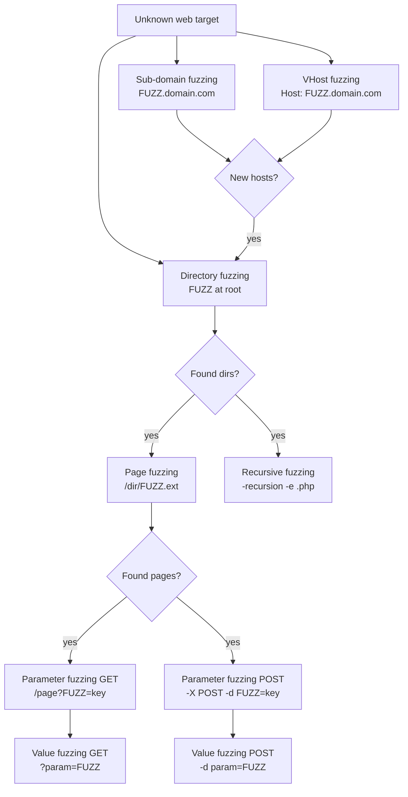
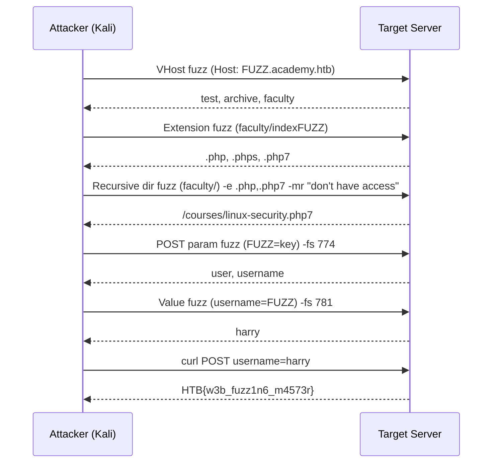

# Attacking Web Applications with Ffuf (HTB Supplementary)

#Ffuf #WebFuzzing #DirectoryFuzzing #VHostFuzzing #ParameterFuzzing #Wordlists #SecLists #BruteForce #Recon #WebApplications #HTBSupplementary

**HTB Attacking Web Applications with Ffuf module**, a dedicated tool-deep-dive not covered as its own module in the Offsec curriculum. Ffuf (Fuzz Faster U Fool) is the go-to web fuzzer for OSCP: directory/page discovery, virtual host enumeration, and parameter/value brute-forcing. The Offsec modules reference dirb and gobuster in passing, but ffuf covers all the same ground and adds recursive scanning, multi-extension fuzzing, and powerful response filtering in one tool.

> 🔁 Cross-refs: [[Information Gathering - Web Edition (HTB Supplementary)#IGWE.1. Virtual Host (vHost) Enumeration|IGWE.1 vHost with gobuster]] | [[Common Web Application Attacks]] | [[Introduction to Web Application Attacks]] | [[Footprinting (HTB Supplementary)#FP.7. MySQL|FP.7 web-facing services]]

---

## Outstanding Sections

- [x] FF.1. Directory Fuzzing
- [x] FF.2. Page Fuzzing
- [x] FF.3. Recursive Fuzzing
- [x] FF.4. Sub-domain Fuzzing
- [x] FF.5. VHost Fuzzing and Filtering Results
- [x] FF.6. Parameter Fuzzing (GET)
- [x] FF.7. Value Fuzzing (POST)
- [x] FF.8. Skills Assessment. Web Fuzzing

---

## How Ffuf Works

Ffuf replaces the `FUZZ` keyword in a URL, header, or POST body with each line from a wordlist, sends the request, and reports back which responses look different from the noise. That's the whole model: wordlist in, interesting responses out.

**SecLists paths** (HTB Pwnbox uses `/opt/useful/SecLists/`, Kali uses `/usr/share/seclists/`):
```bash
# On Kali — adjust paths if on Pwnbox
SECLISTS=/usr/share/seclists
```

**Core ffuf flags reference:**
| Flag | What it does |
|------|-------------|
| `-w wordlist:KEYWORD` | Wordlist path. `:KEYWORD` lets you name the placeholder if you're using multiple wordlists (defaults to `FUZZ`). |
| `-u URL` | Target URL. Put `FUZZ` (or your keyword) wherever you're injecting. |
| `-e .php,.html` | Append extensions to each wordlist word (for page fuzzing). |
| `-recursion` | Recurse into directories that are found. |
| `-recursion-depth N` | Max recursion depth (1 = only one level deep). |
| `-H 'Name: Value'` | Add a custom header. Put `FUZZ` in the value for header fuzzing. |
| `-X POST` | Use POST instead of GET. |
| `-d 'body'` | POST body data. Put `FUZZ` in the value you're fuzzing. |
| `-fs N` | Filter responses by size (exclude responses of exactly N bytes). |
| `-fw N` | Filter by word count. |
| `-fl N` | Filter by line count. |
| `-fc N` | Filter by HTTP status code. |
| `-mr "regex"` | Only show responses whose body matches this regex. Useful when you know what the valid response looks like. |
| `-ac` | Auto-calibrate filtering: ffuf sends a few canary requests and automatically determines the baseline response to filter out. Saves the two-step "note the noise size, then re-run with -fs" workflow. |
| `-s` | Silent mode (no banner, just results). |
| `-t N` | Threads. Default 40, push to 100 for faster scans (be mindful of rate limiting). |
| `-v` | Verbose output (shows full URLs in results, handy for recursive scans). |
| `-o output.json -of json` | Save results to file. Useful for long scans you want to review. |

> 🔍 Worth remembering generally: the two-step filtering workflow is always the same. First run without a filter to see what noise responses look like (they'll flood the output at a consistent size/word/line count). Then re-run with `-fs SIZE` (or `-fw WORDS`, `-fl LINES`) to suppress the noise and only see genuine hits. Or skip both steps with `-ac`.



---

## FF.1. Directory Fuzzing

The first thing to try on any web target. Finds directories (and by extension, hidden areas of the site) by placing `FUZZ` in the URL path and running through a wordlist.

```bash
# Basic directory fuzz — no extension, just dir names
ffuf -w /usr/share/seclists/Discovery/Web-Content/directory-list-2.3-small.txt:FUZZ \
     -u 'http://TARGET:PORT/FUZZ'

# Silent mode (cleaner output for piping/logging)
ffuf -s \
     -w /usr/share/seclists/Discovery/Web-Content/directory-list-2.3-small.txt:FUZZ \
     -u 'http://TARGET:PORT/FUZZ'
```

**What to look for:** status 200/301/302 responses with a non-trivial body size. A 200 with size 0 means the directory exists but has no default index (still follow it up). A 301 means it redirected you to `/dir/`, add the trailing slash to your URL and fuzz inside it.

**Example output:**
```
forum                   [Status: 200, Size: 899, Words: 298, Lines: 47]
blog                    [Status: 200, Size: 899, Words: 298, Lines: 47]
```

> 📸 Screenshot: ffuf directory fuzz output showing found dirs with their status codes and sizes

**Wordlist choice matters:**
- `directory-list-2.3-small.txt` (~87K words), fast, good for quick passes
- `directory-list-2.3-medium.txt` (~220K words), thorough, use when small misses things
- `raft-large-directories.txt` — alternative wordlist, covers different naming conventions

> 🔁 Similar to: [[Information Gathering - Web Edition (HTB Supplementary)#IGWE.1. Virtual Host (vHost) Enumeration|gobuster dir mode]], same concept, different tool. Ffuf is faster and more flexible; gobuster's output is slightly easier to read.

**Q1 Answer:** `forum` (second directory found alongside `blog`)

#### Tags: #DirectoryFuzzing #Ffuf #WebRecon

---

## FF.2. Page Fuzzing

Once you've found a directory, enumerate the actual pages inside it. The trick is appending a file extension to `FUZZ` so you're looking for `FUZZ.php`, `FUZZ.html`, etc.

**Step 1: Figure out what extensions the server uses (extension fuzzing):**
```bash
# Fuzz extensions on the index page to see what the server responds to
ffuf -w /usr/share/seclists/Discovery/Web-Content/web-extensions.txt:FUZZ \
     -u 'http://TARGET:PORT/blog/indexFUZZ'
```
The `web-extensions.txt` wordlist contains common extensions like `.php`, `.html`, `.asp`, `.aspx`, `.txt`, `.bak`, `.old`, etc. Anything that returns 200 or 403 (not 404) is a valid extension on this server.

**Step 2: Fuzz page names with the discovered extension:**
```bash
# Fuzz page names with .php extension
ffuf -s \
     -w /usr/share/seclists/Discovery/Web-Content/directory-list-2.3-small.txt:FUZZ \
     -u 'http://TARGET:PORT/blog/FUZZ.php'
```

**Example output:**
```
index                   [Status: 200, Size: 0, Words: 1, Lines: 1]
home                    [Status: 200, Size: 899, Words: 268, Lines: 50]
```

Then visit each non-empty page. `/blog/home.php` in this case contains the flag.

> 📸 Screenshot: browser showing /blog/home.php with flag HTB{bru73_f0r_c0mm0n_p455w0rd5}

> 🔧 Technique: a 200 response with Size: 0 is not necessarily empty in all cases (could be a redirect or dynamic page). Always visit the page directly to confirm. A 403 on a `.phps` extension means the extension is recognized but the server refuses to serve source files directly, still worth noting as it confirms PHP source is present.

**Q1 Answer:** `HTB{bru73_f0r_c0mm0n_p455w0rd5}` (found at `/blog/home.php`)

#### Tags: #PageFuzzing #ExtensionFuzzing #Ffuf

---

## FF.3. Recursive Fuzzing

Rather than manually fuzzing each directory you find, recursive mode does it automatically: when ffuf discovers a directory, it queues a new fuzzing job inside that directory.

```bash
# Recursive fuzz from root, 1 level deep, checking both dir names and .php pages
ffuf -s \
     -w /usr/share/seclists/Discovery/Web-Content/directory-list-2.3-small.txt:FUZZ \
     -u 'http://TARGET:PORT/FUZZ' \
     -recursion \
     -recursion-depth 1 \
     -e '.php'
```

**What `-e '.php'` does:** for every wordlist entry, ffuf sends two requests: one for `WORD` (bare directory) and one for `WORD.php`. So `forum` generates requests for `/forum` and `/forum.php`. This is why recursive + extension fuzzing in one pass finds both directories and the PHP pages inside them.

**Example output (truncated):**
```
forum                   [Status: 301, ...]
blog                    [Status: 301, ...]

[INFO] Starting queued job: http://TARGET:PORT/forum/FUZZ
flag.php                [Status: 200, Size: 774, ...]
index.php               [Status: 200, Size: 0, ...]
```

The `.php` in `/forum/flag.php` contains the flag.

> 📸 Screenshot: ffuf recursive output showing the queued subjob for /forum/ and the flag.php hit

> 🔍 Worth remembering generally: `-recursion-depth 1` means "recurse one level below the starting URL." So if you start at `/`, it will fuzz `/dir/` but NOT `/dir/subdir/`. Set `-recursion-depth 2` or higher for deeper coverage, but be aware the scan time grows exponentially. For most OSCP targets, depth 1 is sufficient.

> 🔧 Technique: recursive ffuf can get very noisy if the target has many directories. If it's taking too long, cancel it, note the interesting directories from the initial pass, and manually target each one with a fresh non-recursive fuzz. The module's skills assessment demonstrates exactly this speedup.

**Q1 Answer:** `HTB{fuzz1n6_7h3_w3b!}` (found at `/forum/flag.php`)

#### Tags: #RecursiveFuzzing #Ffuf

---

## FF.4. Sub-domain Fuzzing

A sub-domain fuzz replaces the `FUZZ` keyword in the hostname part of the URL, testing whether sub-domains exist in public DNS. This is true DNS resolution (not Host-header injection, that's VHost fuzzing in the next section).

```bash
# Fuzz public subdomains — these need to resolve in real DNS
ffuf -s \
     -w /usr/share/seclists/Discovery/DNS/subdomains-top1million-5000.txt:FUZZ \
     -u 'http://FUZZ.inlanefreight.com/'
```

**What you're sending:** HTTP requests to `FUZZ.inlanefreight.com` where FUZZ is each wordlist entry. If the sub-domain exists in real DNS, you'll get a response; if not, the connection fails or returns NXDOMAIN.

**Example output:**
```
www        [Status: 200, Size: 22266, ...]
blog       [Status: 200, Size: 12000, ...]
support    [Status: 200, Size: 8000, ...]
customer   [Status: 200, Size: 9000, ...]
```

The question asks for a "customer sub-domain portal," so `customer.inlanefreight.com` is the answer.

> 🔍 Worth remembering generally: sub-domain fuzzing (DNS resolution) and VHost fuzzing (Host header injection) are different techniques that complement each other. Sub-domain fuzzing finds publicly registered sub-domains. VHost fuzzing finds virtual hosts that exist on a specific IP but may not be in public DNS. Always do both on a target.

> 🔁 Similar to: [[Information Gathering - Web Edition (HTB Supplementary)#IGWE.1. Virtual Host (vHost) Enumeration|gobuster vhost with --append-domain]], gobuster's `dns` mode is equivalent to this ffuf sub-domain fuzz; gobuster's `vhost` mode is equivalent to the next section's VHost fuzzing.

**External resource:** [HackTricks. Subdomain Fuzzing](https://github.com/HackTricks-wiki/hacktricks/blob/master/network-services-pentesting/pentesting-web/web-vulnerabilities-methodology.md) | [PayloadsAllTheThings. Web Recon](https://github.com/swisskyrepo/PayloadsAllTheThings)

**Q1 Answer:** `customer.inlanefreight.com`

#### Tags: #SubdomainFuzzing #DNSEnum #Ffuf

---

## FF.5. VHost Fuzzing and Filtering Results

VHost (virtual host) fuzzing sends requests to a fixed IP but changes the `Host:` header value each time. This discovers virtual hosts that exist on the server but might not be publicly registered in DNS. It's the essential step after finding a web server IP on an internal network or a shared-hosting target.

**Step 1: Add the base domain to /etc/hosts:**
```bash
sudo sh -c 'echo "TARGET_IP academy.htb" >> /etc/hosts'
```

**Step 2: Run without filtering first to identify the noise response size:**
```bash
# This will flood with results — you need to see what the error responses look like
ffuf -w /usr/share/seclists/Discovery/DNS/subdomains-top1million-5000.txt:FUZZ \
     -u http://academy.htb:PORT/ \
     -H 'Host: FUZZ.academy.htb'
```

In the output, most entries return the same size (e.g., 986 bytes), that's the default "catch-all" response for unknown vhosts. Note that size.

**Step 3: Re-run filtering out the catch-all size:**
```bash
# -fs 986 suppresses all responses of size 986
ffuf -s \
     -w /usr/share/seclists/Discovery/DNS/subdomains-top1million-5000.txt:FUZZ \
     -u http://academy.htb:PORT/ \
     -H 'Host: FUZZ.academy.htb' \
     -fs 986
```

**Shortcut: auto-calibrate with `-ac`** (skips the manual two-step):
```bash
ffuf -s \
     -w /usr/share/seclists/Discovery/DNS/subdomains-top1million-5000.txt:FUZZ \
     -u http://academy.htb:PORT/ \
     -H 'Host: FUZZ.academy.htb' \
     -ac
```
`-ac` sends calibration requests, determines the baseline response automatically, and applies the filter for you. Saves time when you're not sure which response attribute to filter on (size vs. words vs. lines).

**Example output after filtering:**
```
admin                   [Status: 200, Size: 1201, ...]
test                    [Status: 200, Size: 0, ...]
```

Since `admin` was already mentioned in the module section, the new finding is `test.academy.htb`.

**After finding new vhosts, add them all to /etc/hosts:**
```bash
sudo bash -c 'echo "TARGET_IP test.academy.htb admin.academy.htb" >> /etc/hosts'
```

> 📸 Screenshot: ffuf vhost fuzz with -fs filter showing admin and test as the genuine hits vs. the flood of same-size responses before filtering

> 🔍 Worth remembering generally: you can also filter by `-fw` (word count) or `-fl` (line count) instead of `-fs` (size). If the noise responses all have the same word count, `-fw N` is cleaner than `-fs N` because size can vary slightly due to dynamic content. Pick whichever attribute is most stable in the noise responses.

> 🔧 Technique: if `-ac` isn't filtering correctly (it miscalibrated), fall back to manual. Run without a filter, pick the most common size in the output, then use `-fs`.

**Q1 Answer:** `test.academy.htb`

#### Tags: #VHostFuzzing #Ffuf #HostHeader #FilteringResults

---

## FF.6. Parameter Fuzzing (GET)

Once you've found a page (e.g., an admin panel at `/admin/admin.php`), it might accept GET parameters that aren't visible in the normal UI. Fuzzing the parameter name reveals them.

**Step 1: Add the vhost to /etc/hosts if not already done:**
```bash
sudo sh -c 'echo "TARGET_IP admin.academy.htb" >> /etc/hosts'
```

**Step 2: Run without filter to identify error response size:**
```bash
# Sends requests like /admin.php?page=key, /admin.php?id=key, etc.
ffuf -w /usr/share/seclists/Discovery/Web-Content/burp-parameter-names.txt:FUZZ \
     -u 'http://admin.academy.htb:PORT/admin/admin.php?FUZZ=key'
```
Most responses will be the same size (e.g., 798 bytes). That's the "invalid parameter" response.

**Step 3: Filter and re-run:**
```bash
ffuf -w /usr/share/seclists/Discovery/Web-Content/burp-parameter-names.txt:FUZZ \
     -u 'http://admin.academy.htb:PORT/admin/admin.php?FUZZ=key' \
     -fs 798
```

**Example output after filtering:**
```
user                    [Status: 200, Size: 783, ...]
```

The server responds differently when the parameter is `user`, this is the valid parameter.

> 📸 Screenshot: ffuf GET parameter fuzz output with -fs applied, showing only the `user` hit

> 🔍 Worth remembering generally: the value you use for fuzzing (`key` in this example) is a dummy. You're not looking for a valid value here, just a valid parameter name. The page's response changes when it recognizes the parameter name, regardless of whether the value makes sense. Once you have the parameter, you fuzz the value separately.

> 🔧 Technique: `burp-parameter-names.txt` is the go-to wordlist for parameter fuzzing (2588 common parameter names from real-world web apps). For a more thorough sweep, `raft-large-parameters.txt` in SecLists is bigger.

**Q1 Answer:** `user`

#### Tags: #ParameterFuzzing #GET #Ffuf

---

## FF.7. Value Fuzzing (POST)

The counterpart to parameter fuzzing: once you know the parameter name, fuzz its value to find what the server accepts. This example also shows POST-method fuzzing (same idea as GET but with `-X POST` and `-d` for the body).

**Step 1: Build a numeric wordlist (1–1000):**
```bash
for i in $(seq 1 1000); do echo $i >> ids.txt; done
```

**Step 2: First pass to identify noise response size:**
```bash
ffuf -w ids.txt:FUZZ \
     -u 'http://admin.academy.htb:PORT/admin/admin.php' \
     -X POST \
     -d 'id=FUZZ' \
     -H 'Content-Type: application/x-www-form-urlencoded'
```
All invalid IDs return the same size (e.g., 768 bytes).

**Step 3: Filter and find the valid value:**
```bash
ffuf -s \
     -w ids.txt:FUZZ \
     -u 'http://admin.academy.htb:PORT/admin/admin.php' \
     -X POST \
     -d 'id=FUZZ' \
     -H 'Content-Type: application/x-www-form-urlencoded' \
     -fs 768
```

**Example output:**
```
73                      [Status: 200, Size: 787, ...]
```

The valid ID is 73. Now curl it to get the flag:
```bash
curl -s 'http://admin.academy.htb:PORT/admin/admin.php' \
     -X POST \
     -d 'id=73' | grep 'HTB'
```

**Output:**
```html
<div class='center'><p>HTB{p4r4m373r_fuzz1n6_15_k3y!}</p></div>
```

> 📸 Screenshot: curl POST output showing the flag inside the HTML response

> 🔧 Technique: always include `Content-Type: application/x-www-form-urlencoded` when sending POST form data. Without it, the server may not parse the `id=FUZZ` body correctly and you'll get false results. For JSON APIs, use `Content-Type: application/json` and format the body as `{"id":"FUZZ"}`.

> 🔍 Worth remembering generally: the same technique works for username/password brute-forcing against login forms, fuzz `password=FUZZ` with a rockyou wordlist, filter out the "wrong credentials" response size. It's essentially the same as Hydra's HTTP-POST-FORM mode but via ffuf.

**Q1 Answer:** `HTB{p4r4m373r_fuzz1n6_15_k3y!}` (POST id=73)

#### Tags: #ValueFuzzing #POST #Ffuf #BruteForce

---

## FF.8. Skills Assessment — Web Fuzzing

The full chain: start from an IP, find vhosts, find extensions, find pages, find parameters, find values. Five questions chained together.

### Q1: Find all sub-domains of *.academy.htb

**VHost fuzz with auto-calibrate:**
```bash
# First pass (no filter) — note the noise size (985 in this example)
ffuf -w /usr/share/seclists/Discovery/DNS/subdomains-top1million-5000.txt:FUZZ \
     -u http://TARGET_IP:PORT \
     -H 'Host: FUZZ.academy.htb'

# Second pass with filter
ffuf -w /usr/share/seclists/Discovery/DNS/subdomains-top1million-5000.txt:FUZZ \
     -u http://TARGET_IP:PORT \
     -H 'Host: FUZZ.academy.htb' \
     -fs 985

# Or use -ac to skip the manual step entirely
ffuf -w /usr/share/seclists/Discovery/DNS/subdomains-top1million-5000.txt:FUZZ \
     -u http://TARGET_IP:PORT \
     -H 'Host: FUZZ.academy.htb' \
     -ac
```

**Result:** three vhosts: `test`, `archive`, `faculty`

Add all three to /etc/hosts immediately:
```bash
sudo bash -c 'echo "TARGET_IP test.academy.htb archive.academy.htb faculty.academy.htb" >> /etc/hosts'
```

**Q1 Answer:** `archive, test, faculty`

---

### Q2: What extensions do the domains accept?

Extension-fuzz the index page on each vhost to see what extensions get a non-404 response:
```bash
# Test vhost
ffuf -w /usr/share/seclists/Discovery/Web-Content/web-extensions.txt:FUZZ \
     -u http://test.academy.htb:PORT/indexFUZZ

# Archive vhost
ffuf -w /usr/share/seclists/Discovery/Web-Content/web-extensions.txt:FUZZ \
     -u http://archive.academy.htb:PORT/indexFUZZ

# Faculty vhost
ffuf -w /usr/share/seclists/Discovery/Web-Content/web-extensions.txt:FUZZ \
     -u http://faculty.academy.htb:PORT/indexFUZZ
```

**Results by vhost:**
| VHost | Extensions |
|-------|-----------|
| test | `.php` (200), `.phps` (403) |
| archive | `.php` (200), `.phps` (403) |
| faculty | `.php` (200), `.phps` (403), `.php7` (200) |

Note: 403 on `.phps` still counts as "accepted" (server recognizes the extension), but 404 means "doesn't exist."

**Q2 Answer:** `.php, .php7, .phps`

---

### Q3: Find the page that says "You don't have access!"

Recursive fuzz `faculty.academy.htb` with all three extensions, filtering for the specific message using `-mr`:
```bash
# Option 1: full recursive scan (slower)
ffuf -w /usr/share/seclists/Discovery/Web-Content/directory-list-2.3-small.txt:FUZZ \
     -u http://faculty.academy.htb:PORT/FUZZ \
     -recursion \
     -recursion-depth 1 \
     -e .php,.phps,.php7 \
     -fs 287 \
     -mr "You don't have access!" \
     -t 100
```

When ffuf reports `[INFO] Adding a new job to the queue: http://faculty.academy.htb:PORT/courses/FUZZ`, you've found the directory. Cancel (`Ctrl+C`) and target it directly:

```bash
# Option 2: targeted directory fuzz (faster once you know /courses/ exists)
ffuf -w /usr/share/seclists/Discovery/Web-Content/directory-list-2.3-small.txt:FUZZ \
     -u http://faculty.academy.htb:PORT/courses/FUZZ \
     -e .php,.phps,.php7 \
     -fs 287 \
     -mr "You don't have access!" \
     -t 100
```

**Result:** `linux-security.php7` inside `/courses/`

> 📸 Screenshot: ffuf output showing linux-security.php7 as the match for "You don't have access!"

> 🔧 Technique: `-mr` (match regex) is powerful here because you know exactly what the valid response contains. You skip the two-step "note the noise size" workflow entirely, ffuf just shows you the pages whose body contains your target string. Works great for flag hunting, error message hunting, and login bypass testing.

**Q3 Answer:** `http://faculty.academy.htb:PORT/courses/linux-security.php7`

---

### Q4: Find all POST parameters the page accepts

POST parameter fuzz against the page found in Q3:
```bash
# First pass — see noise size (774 in this example)
ffuf -w /usr/share/seclists/Discovery/Web-Content/burp-parameter-names.txt:FUZZ \
     -u http://faculty.academy.htb:PORT/courses/linux-security.php7 \
     -X POST \
     -d 'FUZZ=key' \
     -H 'Content-Type: application/x-www-form-urlencoded'

# Second pass — filter noise, crank threads
ffuf -w /usr/share/seclists/Discovery/Web-Content/burp-parameter-names.txt:FUZZ \
     -u http://faculty.academy.htb:PORT/courses/linux-security.php7 \
     -X POST \
     -d 'FUZZ=key' \
     -H 'Content-Type: application/x-www-form-urlencoded' \
     -fs 774 \
     -t 100
```

**Result:** two valid parameters, `user` (size 780) and `username` (size 781), they return slightly different sizes, which is interesting. Both are accepted but may return different content.

**Q4 Answer:** `user username`

---

### Q5: Fuzz the parameter values to get the flag

Value fuzz the `username` parameter against a names wordlist:
```bash
# First pass — note noise size (781)
ffuf -w /usr/share/seclists/Usernames/Names/names.txt:FUZZ \
     -u http://faculty.academy.htb:PORT/courses/linux-security.php7 \
     -X POST \
     -d 'username=FUZZ' \
     -H 'Content-Type: application/x-www-form-urlencoded'

# Second pass — filter, then find the valid username
ffuf -w /usr/share/seclists/Usernames/Names/names.txt:FUZZ \
     -u http://faculty.academy.htb:PORT/courses/linux-security.php7 \
     -X POST \
     -d 'username=FUZZ' \
     -H 'Content-Type: application/x-www-form-urlencoded' \
     -fs 781 \
     -t 100
```

**Result:** `harry` is the valid username (returns size 773 vs. noise size 781).

Curl it to get the flag:
```bash
curl -s http://faculty.academy.htb:PORT/courses/linux-security.php7 \
     -X POST \
     -d 'username=harry' | grep -oP 'HTB\{.*?\}'
```

**Output:** `HTB{w3b_fuzz1n6_m4573r}`

> 📸 Screenshot: curl output with HTB flag extracted from the HTML response

**Full attack chain (Mermaid):**


**Q5 Answer:** `HTB{w3b_fuzz1n6_m4573r}`

#### Tags: #SkillsAssessment #WebFuzzing #Ffuf #VHostFuzzing #ParameterFuzzing #ValueFuzzing

---

## All Q&A Answers

| Section | Q# | Answer |
|---------|-----|--------|
| Directory Fuzzing | 1 | `forum` |
| Page Fuzzing | 1 | `HTB{bru73_f0r_c0mm0n_p455w0rd5}` |
| Recursive Fuzzing | 1 | `HTB{fuzz1n6_7h3_w3b!}` |
| Sub-domain Fuzzing | 1 | `customer.inlanefreight.com` |
| Filtering Results | 1 | `test.academy.htb` |
| Parameter Fuzzing - GET | 1 | `user` |
| Value Fuzzing | 1 | `HTB{p4r4m373r_fuzz1n6_15_k3y!}` |
| Skills Assessment | 1 | `archive, test, faculty` |
| Skills Assessment | 2 | `.php, .php7, .phps` |
| Skills Assessment | 3 | `http://faculty.academy.htb:PORT/courses/linux-security.php7` |
| Skills Assessment | 4 | `user username` |
| Skills Assessment | 5 | `HTB{w3b_fuzz1n6_m4573r}` |

---

## External Resources

- [HackTricks. Brute Force / Web Fuzzing](https://github.com/HackTricks-wiki/hacktricks/blob/master/generic-methodologies-and-resources/brute-force.md)
- [PayloadsAllTheThings. Web Fuzzing](https://github.com/swisskyrepo/PayloadsAllTheThings/tree/master/Methodology%20and%20Resources)
- [SecLists GitHub](https://github.com/danielmiessler/SecLists), the wordlist collection ffuf runs against
- [ippsec.rocks](https://ippsec.rocks/?#), search "ffuf" for HTB videos using this tool in real box workflows

---

## Module Summary

Ffuf is a single-tool fuzzer that covers: directory enumeration, page/extension discovery, recursive scanning, sub-domain and vhost discovery, GET/POST parameter brute-forcing, and value fuzzing. The core workflow is always the same: fuzz, see what the noise looks like, filter noise with `-fs`/`-fw`/`-fl` or use `-ac`, collect genuine hits. The `-mr` regex match is the power move when you know what a valid response body looks like. Every OSCP web target should get a ffuf directory and vhost sweep as a first step.

**Tools covered:** ffuf, curl
**Key wordlists:** `directory-list-2.3-small.txt`, `subdomains-top1million-5000.txt`, `web-extensions.txt`, `burp-parameter-names.txt`, `Names/names.txt`


---

## HTB Module Quick Reference

Commands formatted for use with the [[Pre-Engagement Kali Setup]] variable block.

```bash
# ============================================================
# DIRECTORY & PAGE FUZZING
# ============================================================
# Directory fuzzing — map the site structure
ffuf -w /usr/share/seclists/Discovery/Web-Content/directory-list-2.3-medium.txt:FUZZ \
  -u http://$BoxIP:$WebPort/FUZZ

# Extension fuzzing — identify what filetypes the server executes
ffuf -w /usr/share/seclists/Discovery/Web-Content/web-extensions.txt:FUZZ \
  -u http://$BoxIP:$WebPort/indexFUZZ

# Page fuzzing — fuzz for PHP pages under a specific directory
ffuf -w /usr/share/seclists/Discovery/Web-Content/directory-list-2.3-medium.txt:FUZZ \
  -u http://$BoxIP:$WebPort/blog/FUZZ.php

# Recursive fuzzing — automatically follows discovered directories (-e adds extension)
ffuf -w /usr/share/seclists/Discovery/Web-Content/directory-list-2.3-medium.txt:FUZZ \
  -u http://$BoxIP:$WebPort/FUZZ \
  -recursion -recursion-depth 1 -e .php -v

# ============================================================
# SUBDOMAIN & VHOST FUZZING
# ============================================================
# Subdomain fuzzing (DNS-based, no Host header manipulation)
ffuf -w /usr/share/seclists/Discovery/DNS/subdomains-top1million-5000.txt:FUZZ \
  -u https://FUZZ.$BoxName/

# VHost fuzzing — filter by baseline response size (-fs <bytes>)
ffuf -w /usr/share/seclists/Discovery/DNS/subdomains-top1million-5000.txt:FUZZ \
  -u http://$BoxName:$WebPort/ \
  -H "Host: FUZZ.$BoxName" \
  -fs <baseline_size>   # run once first without -fs to get the baseline

# ============================================================
# PARAMETER & VALUE FUZZING
# ============================================================
# GET parameter name fuzzing
ffuf -w /usr/share/seclists/Discovery/Web-Content/burp-parameter-names.txt:FUZZ \
  -u "http://$BoxName:$WebPort/admin/admin.php?FUZZ=key" \
  -fs <baseline_size>

# POST parameter name fuzzing
ffuf -w /usr/share/seclists/Discovery/Web-Content/burp-parameter-names.txt:FUZZ \
  -u "http://$BoxName:$WebPort/admin/admin.php" \
  -X POST -d "FUZZ=key" \
  -H "Content-Type: application/x-www-form-urlencoded" \
  -fs <baseline_size>

# Value fuzzing against a known parameter (e.g. id=1..1000)
for i in $(seq 1 1000); do echo $i >> ids.txt; done   # generate numeric wordlist first
ffuf -w ids.txt:FUZZ \
  -u "http://$BoxName:$WebPort/admin/admin.php" \
  -X POST -d "id=FUZZ" \
  -H "Content-Type: application/x-www-form-urlencoded" \
  -fs <baseline_size>

# ============================================================
# KEY WORDLISTS
# ============================================================
# /usr/share/seclists/Discovery/Web-Content/directory-list-2.3-small.txt   — dirs/pages (fast)
# /usr/share/seclists/Discovery/Web-Content/directory-list-2.3-medium.txt  — dirs/pages (thorough)
# /usr/share/seclists/Discovery/Web-Content/web-extensions.txt             — extension fuzzing
# /usr/share/seclists/Discovery/DNS/subdomains-top1million-5000.txt        — subdomains
# /usr/share/seclists/Discovery/Web-Content/burp-parameter-names.txt       — parameter names

# ============================================================
# FILTERING & MATCHING
# ============================================================
# -fs <size>    — filter by response size (remove baseline noise)
# -fw <words>   — filter by word count
# -fl <lines>   — filter by line count
# -ac           — auto-calibrate (auto-detects noise without needing -fs)
# -mr "regex"   — only show responses matching a regex (e.g. -mr "admin")
```
