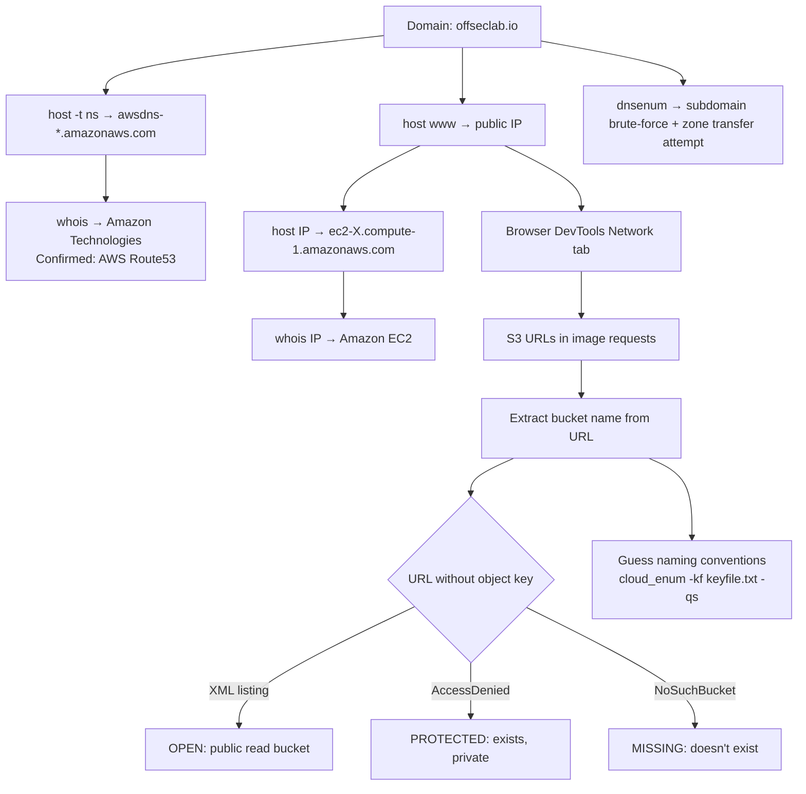
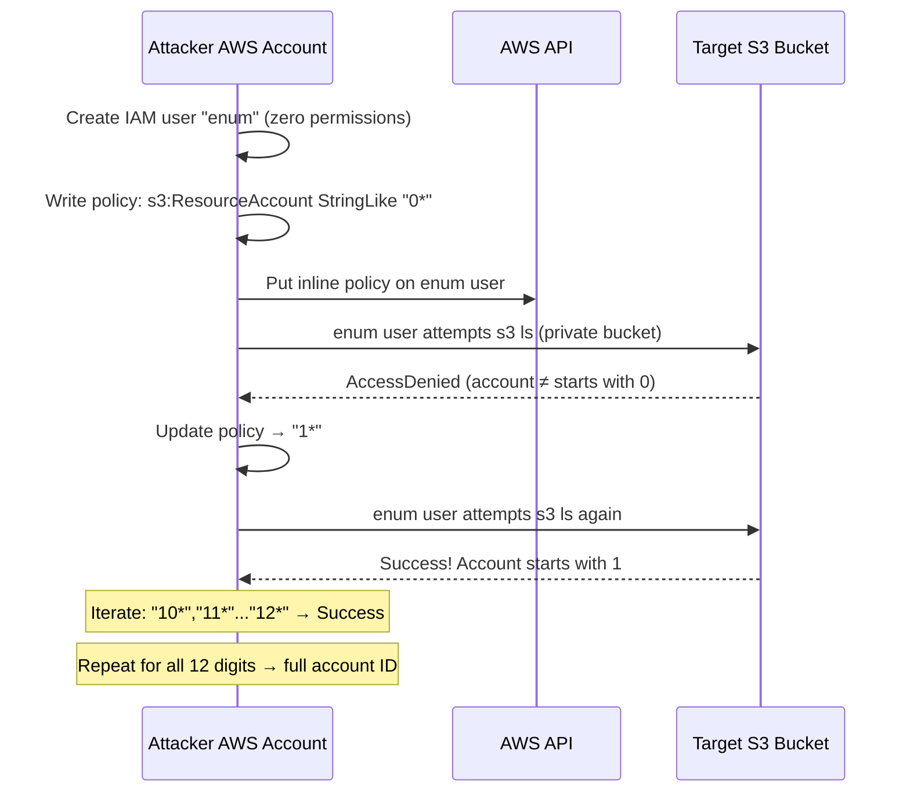
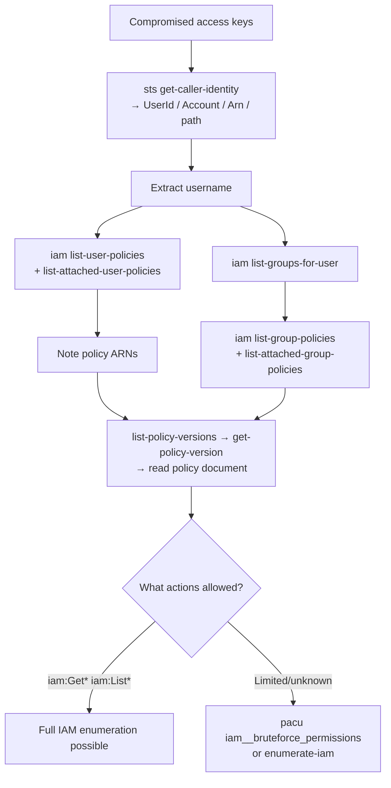
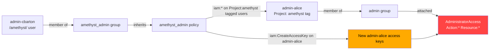

# Module 25: Enumerating AWS Cloud Infrastructure

#AWS #Cloud #IAM #S3 #Reconnaissance #Enumeration #CloudEnum #Pacu #Route53 #EC2 #dnsenum #JMESPath #PrivilegeEscalation #ABAC

**Related:** [[Information Gathering]] | [[Vulnerability Scanning]] | [[Password Attacks]] | [[Active Directory Introduction and Enumeration]]

---

## Outstanding Sections

- [x] 25.1 About the Public Cloud Labs
- [x] 25.2.2 Domain and Subdomain Reconnaissance
- [x] 25.2.3 Service-specific Domains
- [x] 25.3.1 Preparing the Lab (AWS CLI Setup)
- [x] 25.3.2 Publicly Shared Resources
- [x] 25.3.3 Obtaining Account IDs from S3 Buckets
- [x] 25.3.4 Enumerating IAM Users in Other Accounts
- [x] 25.4.2 Examining Compromised Credentials
- [x] 25.4.3 Scoping IAM Permissions
- [x] 25.5.1 Manual vs Automated Enumeration
- [x] 25.5.2 Enumerating IAM Resources
- [x] 25.5.3 JMESPath
- [x] 25.5.4 Automated Enumeration with Pacu
- [x] 25.5.5 Extracting Insights from Enumeration Data

*Hands-on cloud labs tracked inline with 🚩 callouts.*

---

## 25.1 About the Public Cloud Labs

This module uses OffSec's Public Cloud Labs. These are different from the usual VPN-based VM labs. No VPN needed. You interact directly with AWS over the internet.

Key caveats:
- **Progress is not saved.** Restarting the lab resets everything to baseline. Each restart gives a new DNS public IP, new credential access keys, new random bucket suffixes.
- Labs auto-timeout after an hour of inactivity (can extend up to 10 hours).
- **Do not connect to VPN while working in the cloud labs.** VPN will interfere with DNS resolution.
- AWS labs are not accessible via In-Browser Kali.

When restarting a lab session, note down any random values (bucket names, access keys, account IDs) as they all change on restart.

---

## 25.2 Reconnaissance of Cloud Resources on the Internet

The goal here is passive/semi-passive external recon: what can you learn about a target's cloud footprint without touching the CSP API at all?

### 25.2.1 Accessing the Lab (Cloud DNS Setup)

Each lab session gives you a custom public DNS IP. You need to add it to `/etc/resolv.conf` so your Kali machine uses the lab's DNS server first.

```bash
# Check current DNS config
cat /etc/resolv.conf

# Add lab DNS server at the top (use your actual lab IP)
sudo nano /etc/resolv.conf
# Add: nameserver <lab_dns_ip>  (above the existing nameserver line)

# Test it's working (specify DNS server explicitly first)
host www.offseclab.io <lab_dns_ip>

# Then test without specifying (should match)
host www.offseclab.io
```

**What success looks like:** Both commands return the same IP (e.g. `52.70.117.69`).

After the lab session, reset DNS by restarting NetworkManager:

```bash
sudo systemctl restart NetworkManager
cat /etc/resolv.conf   # should revert to original nameserver
```

> 🔧 Technique: NetworkManager overwrites `/etc/resolv.conf` on restart/reboot. Changes made directly to the file are not permanent. This is actually convenient for cleanup.

> 📸 Screenshot: `/etc/resolv.conf` before and after adding the lab DNS entry

### 25.2.2 Domain and Subdomain Reconnaissance

Starting point: you know the domain name (`offseclab.io`). No other info. Work outward from there.

**Step 1: Get authoritative name servers**

```bash
host -t ns offseclab.io
```

Expected output: `ns-XXXX.awsdns-00.co.uk` / `awsdns-00.net` / `awsdns-00.com` / `awsdns-00.org`

The `awsdns` naming screams AWS Route53. Validate with whois:

```bash
whois awsdns-00.com | grep "Registrant Organization"
# Output: Registrant Organization: Amazon Technologies, Inc.
```

**Step 2: Get the public IP of the website**

```bash
host www.offseclab.io
# Returns: www.offseclab.io has address 52.70.117.69
```

**Step 3: Reverse DNS + whois on the IP**

```bash
host 52.70.117.69
# Returns: 69.117.70.52.in-addr.arpa domain name pointer ec2-52-70-117-69.compute-1.amazonaws.com

whois 52.70.117.69 | grep "OrgName"
# Returns: OrgName: Amazon Technologies Inc.
```

Two things from the reverse DNS result:
1. The domain `amazonaws.com` confirms AWS hosting.
2. The prefix `ec2-` tells you this is an EC2 instance (virtual machine).

**Step 4: Automated subdomain enumeration with dnsenum**

```bash
dnsenum offseclab.io --threads 100
```

What it does: confirms NS records and main IP, tries zone transfers (AXFR), brute-forces subdomains against `/usr/share/dnsenum/dns.txt`.

Zone transfers will fail on AWS Route53 (`AXFR record query failed: corrupt packet`) — that's expected. The brute-force portion discovers subdomains like `mail.offseclab.io` and `www.offseclab.io`.

> 📸 Screenshot: dnsenum output showing NS records, zone transfer failures, and discovered subdomains

**What we've learned at this point:**
- Domain managed by AWS Route53
- Website hosted on an EC2 instance (public IP belongs to AWS)
- Multiple subdomains resolve to the same EC2 IP (virtual hosting)

**Quiz answers (25.2.2):**
1. **A) `host -t ns offseclab.io`**
2. **C) Amazon Route 53**
3. 🚩 Find proof in DNS records: `host -t txt offseclab.io` (or MX/CNAME records) against the live lab DNS.

> 🚩 Hands-on, cloud lab required: Q3 — query DNS TXT/MX records on the live lab DNS for the proof value. ⬜ Pending

### 25.2.3 Service-specific Domains

CSPs use predictable domain naming patterns for their services. AWS uses:

| Service | Domain Pattern |
|---------|----------------|
| S3 | `s3.amazonaws.com/bucket-name/object-key` |
| EC2 | `ec2-IP.compute-1.amazonaws.com` (PTR records) |
| CloudFront | `*.cloudfront.net` |

**Finding S3 buckets from website assets:**

Browse the site in Firefox. Open Developer Tools (`F12`), go to Network tab, reload the page. Watch for requests going to `s3.amazonaws.com`. Click on one to see the full URL.

Example URL: `http://s3.amazonaws.com/offseclab-assets-public-axevtewi/sites/www/images/saphire.jpg`

Breaking it down:
- `s3.amazonaws.com` — AWS S3 service domain
- `offseclab-assets-public-axevtewi` — **bucket name**
- `sites/www/images/saphire.jpg` — **object key** (path to the file inside the bucket)

> 📸 Screenshot: Firefox Network tab showing S3 requests with full URLs visible

**Testing bucket listing:**

Remove the object key from the URL, leaving just `http://s3.amazonaws.com/bucket-name/`. Browse to it:

- **XML response listing files** → bucket is publicly readable (misconfiguration!)
- **`AccessDenied`** → bucket exists but is private (good config)
- **`NoSuchBucket`** → bucket doesn't exist

**Enumerating related buckets by guessing naming conventions:**

The bucket name `offseclab-assets-public-axevtewi` suggests a pattern: `[org]-[type]-[env]-[random_suffix]`. The random suffix is the same across buckets (common shortcut, poor practice). Try:

```bash
# Manual browser test
http://s3.amazonaws.com/offseclab-assets-private-axevtewi/   # → AccessDenied = exists, private
http://s3.amazonaws.com/offseclab-assets-dev-axevtewi/       # → NoSuchBucket = doesn't exist
```

**Automated enumeration with cloud_enum:**

```bash
sudo apt install cloud-enum   # tool name is cloud_enum (underscore)
cloud_enum --help
```

Quick scan against a known bucket (no mutation wordlist):

```bash
cloud_enum -k offseclab-assets-public-axevtewi --quickscan --disable-azure --disable-gcp
```

Generate a keyword file and scan multiple bucket name guesses:

```bash
# Build the keyfile
for key in "public" "private" "dev" "prod" "development" "production"; do
    echo "offseclab-assets-$key-axevtewi"
done | tee /tmp/keyfile.txt

# Scan all keywords
cloud_enum -kf /tmp/keyfile.txt -qs --disable-azure --disable-gcp
```

Output distinguishes: `OPEN S3 BUCKET` (publicly readable + files listed) vs `Protected S3 Bucket` (exists, access denied).

> 🔍 Worth remembering generally: cloud_enum supports AWS, Azure, and GCP in one run. The `-k` flag takes a single keyword, `-kf` takes a file. The `--quickscan` / `-qs` flag disables the built-in mutations wordlist. Without quickscan, it appends words from `/usr/lib/cloud-enum/enum_tools/fuzz.txt` to your keyword automatically.

**CSP service domain cheat sheet:**

| AWS | Azure | GCP |
|-----|-------|-----|
| `s3.amazonaws.com` | `web.core.windows.net` | `appspot.com` |
| `awsapps.com` | `file.core.windows.net` | `storage.googleapis.com` |
| | `blob.core.windows.net` | |
| | `azurewebsites.net` | |
| | `cloudapp.net` | |

> 🔁 Similar to: [[Information Gathering#DNS Enumeration]] — same recursive mindset, different naming conventions

**External resource:** [PayloadsAllTheThings — Cloud AWS](https://github.com/swisskyrepo/PayloadsAllTheThings/blob/master/Methodology%20and%20Resources/Cloud%20-%20AWS%20Pentest.md) for broader cloud attack techniques.

**Quiz answers (25.2.3):**
1. **B) The bucket is publicly accessible and lists its contents**
2. **B) s3.amazonaws.com**
3. 🚩 Find other S3 buckets using gemstone names as keywords (ruby, sapphire, amethyst, etc.) following the pattern `offseclab-[gemstone]-[random_suffix]`. Look for `proof.txt` in a bucket object.

> 🚩 Hands-on, cloud lab required: Q3 — find gemstone-themed buckets and retrieve proof.txt. Use `cloud_enum -kf /tmp/gemstones.txt -qs --disable-azure --disable-gcp` where the keyfile contains variations like `offseclab-ruby-XXXXXXXX`, `offseclab-amethyst-XXXXXXXX` etc. ⬜ Pending



---

## 25.3 Reconnaissance via Cloud Service Provider's API

Shift from external recon to API-based recon. You create a free AWS account to get credentials and use the public CSP API to query information about the target's account. The key insight: many API features designed for legitimate cross-account use can be abused to leak internal details.

### 25.3.1 Preparing the Lab: Configure AWS CLI

Install AWS CLI:

```bash
sudo apt install -y awscli
```

Configure a named profile with the lab's attacker credentials:

```bash
aws configure --profile attacker
# AWS Access Key ID []: AKIA...
# AWS Secret Access Key []: ...
# Default region name []: us-east-1
# Default output format []: json
```

Test the profile works:

```bash
aws --profile attacker sts get-caller-identity
# Returns: UserId, Account, Arn
```

**Why named profiles?** During a lab you'll collect credentials for multiple IAM users. Named profiles let you switch between them cleanly by just changing `--profile`.

Always include `--profile <name>` in every command throughout the module.

> 📸 Screenshot: `sts get-caller-identity` output showing UserId, Account, and Arn

### 25.3.2 Publicly Shared Resources

Some AWS resources can be shared publicly or cross-account: AMIs (virtual machine images), EBS snapshots (disk snapshots), RDS snapshots. These are meant for internal sharing but sometimes contain sensitive data.

**Enumerate public AMIs with keyword filter:**

```bash
# All AMIs owned by AWS (slow, 30-60 seconds)
aws --profile attacker ec2 describe-images --owners amazon --executable-users all

# Filter by description keyword
aws --profile attacker ec2 describe-images --executable-users all \
  --filters "Name=description,Values=*Offseclab*"

# Filter by name keyword (more likely to hit)
aws --profile attacker ec2 describe-images --executable-users all \
  --filters "Name=name,Values=*Offseclab*"
```

Filter syntax: `--filters "Name=attribute,Values=value1,value2"`. Wildcards (`*`) supported.

Finding a target's AMI leaks their **AWS Account ID** (shown in `OwnerId` and `ImageLocation` fields).

**Enumerate public EBS snapshots:**

```bash
aws --profile attacker ec2 describe-snapshots \
  --filters "Name=description,Values=*offseclab*"
```

> 🔍 Worth remembering generally: `--executable-users all` ensures publicly shared resources from all accounts are included in the results. Without it, you might only see resources in your own account.

**Quiz answers (25.3.2):**
1. **B) To facilitate internal operations and resource sharing**
2. **C) To list all images owned by AWS**
3. 🚩 Use the account ID discovered from the AMI to search for a publicly shared 1GB EBS snapshot. Get its description.

> 🚩 Hands-on, cloud lab required: Q3 — `aws --profile attacker ec2 describe-snapshots --owner-ids <account_id>` then find the 1GB snapshot (VolumeSize: 1) and copy its description. ⬜ Pending

### 25.3.3 Obtaining Account IDs from S3 Buckets

**The technique:** Abuse the IAM policy `Condition` field (`s3:ResourceAccount StringLike`) to binary-search the account ID one digit at a time. If the condition matches, the action succeeds. If not, it fails. No trace left in the target's CloudTrail.

**Prerequisites:**
- An attacker-controlled AWS account with IAM permissions
- A publicly readable S3 bucket or object belonging to the target

**Step-by-step:**

```bash
# 1. Get the target's public bucket name from the website
curl -s www.offseclab.io | grep -o -P 'offseclab-assets-public-\w{8}'
# Example output: offseclab-assets-public-kaykoour

# 2. Confirm you can list it as the attacker
aws --profile attacker s3 ls offseclab-assets-public-kaykoour

# 3. Create a new IAM user with no permissions
aws --profile attacker iam create-user --user-name enum
aws --profile attacker iam create-access-key --user-name enum
# Note the AccessKeyId and SecretAccessKey

# 4. Configure the enum user profile
aws configure --profile enum
# Enter the enum user's keys

# 5. Verify the enum user can't access the bucket yet
aws --profile enum s3 ls offseclab-assets-private-kaykoour
# Expected: AccessDenied
```

**Policy document (test if account starts with "0"):**

```json
{
    "Version": "2012-10-17",
    "Statement": [
        {
            "Sid": "AllowResourceAccount",
            "Effect": "Allow",
            "Action": ["s3:ListBucket", "s3:GetObject"],
            "Resource": "*",
            "Condition": {
                "StringLike": {"s3:ResourceAccount": ["0*"]}
            }
        }
    ]
}
```

```bash
# 6. Apply the policy to enum user
nano policy-s3-read.json   # paste the policy above
aws --profile attacker iam put-user-policy \
  --user-name enum \
  --policy-name s3-read \
  --policy-document file://policy-s3-read.json

# 7. Test (wait 10-15 seconds for policy to activate)
aws --profile enum s3 ls offseclab-assets-private-kaykoour
# AccessDenied = account doesn't start with "0"
# Success = account starts with "0" → first digit found!

# 8. Change "0*" to "1*", re-apply, test again... repeat 0-9
# Then iterate "10*", "11*", "12*"... until you find the second digit
# Continue until all 12 digits are confirmed
```

> 🔍 Worth remembering generally: This technique is documented by Nick Frichette and implemented in the tool `s3-account-search` (uses IAM roles instead of users but same principle). Events are logged in the **attacker's** account, not the target's. Zero forensic trace on the target side.

**How it works conceptually:**



> 🔁 Similar to: [[Common Web Application Attacks#Blind techniques]] — binary search via true/false oracle, same concept different target

**Quiz answers (25.3.3):**
1. **B) To obtain the target's AWS account ID from a publicly-shared S3 bucket or object.**
2. **C) By retrieving it from the URL of any image on the website using the `curl` command.**
3. **C) `aws s3 ls`**

### 25.3.4 Enumerating IAM Users in Other Accounts

**The technique:** When you set a `Principal` in a resource-based policy (like an S3 bucket policy), AWS validates that the IAM identity in the Principal actually exists. If it doesn't, you get `MalformedPolicy: Invalid principal in policy`. This becomes an oracle for user/role existence.

**Step 1: Create a bucket in your attacker account**

```bash
aws --profile attacker s3 mb s3://offseclab-dummy-bucket-$RANDOM-$RANDOM-$RANDOM
```

**Step 2: Write a policy granting access to a specific user ARN**

```json
{
    "Version": "2012-10-17",
    "Statement": [
        {
            "Sid": "AllowUserToListBucket",
            "Effect": "Allow",
            "Resource": "arn:aws:s3:::offseclab-dummy-bucket-XXXXX",
            "Principal": {
                "AWS": ["arn:aws:iam::123456789012:user/cloudadmin"]
            },
            "Action": "s3:ListBucket"
        }
    ]
}
```

**Step 3: Apply the policy and watch for errors**

```bash
# If cloudadmin EXISTS: no error returned
aws --profile attacker s3api put-bucket-policy \
  --bucket offseclab-dummy-bucket-XXXXX \
  --policy file://grant-s3-bucket-read.json

# If user does NOT exist: error
# An error occurred (MalformedPolicy): Invalid principal in policy
```

**Automating with pacu:**

```bash
sudo apt install pacu
pacu   # starts interactive mode

# Create a session
# When prompted: offseclab

# Import attacker credentials
import_keys attacker

# Create a role wordlist
echo -n "lab_admin
security_auditor
content_creator
student_access
lab_builder
instructor" > /tmp/role-names.txt

# Run the role enumeration module
run iam__enum_roles --word-list /tmp/role-names.txt --account-id 123456789012
```

pacu's `iam__enum_roles` module:
- Creates a temporary role in your attacker account
- Tries to update the trust policy to include the target ARN
- Validates existence, cleans up
- Also attempts `sts:AssumeRole` if the role can be assumed (bonus: gives you temporary creds!)

Also available: `iam__enum_users` for IAM users.

> 🔍 Worth remembering generally: These events only appear in the **attacker's** CloudTrail logs. The target's account sees nothing at all, even if you successfully enumerate their roles. This technique is completely invisible to the target.

**Quiz answers (25.3.4):**

> 🚩 Hands-on, cloud lab required: Q1 — Build a wordlist of gemstone-prefixed role names (ruby-lab_admin, ruby-security_auditor... amethyst-content_editor, etc.) and run `pacu iam__enum_roles`. Find the role that can be assumed. ⬜ Pending

> 🚩 Hands-on, cloud lab required: Q2 — Assume the role found above (`aws --profile <role_profile> ec2 describe-vpcs`) and find the Tag Key named `proof` on one of the VPCs. ⬜ Pending

---

## 25.4 Initial IAM Reconnaissance

You've got compromised credentials. Now what? First, figure out exactly what you have: who is this user, what account, what permissions. Then scope what you can do without triggering alerts.

### 25.4.1 Accessing the Lab

This section uses three IAM users:
- **target** — the compromised credentials you're working with
- **challenge** — limited permissions, used to simulate an external attacker
- **monitor** — CloudTrail read access to watch what gets logged

Configure each as a named profile in AWS CLI.

### 25.4.2 Examining Compromised Credentials

**Technique 1: `sts get-caller-identity` (noisy but reliable)**

```bash
aws --profile target sts get-caller-identity
```

Returns:
- `UserId` — unique identifier for the IAM user
- `Account` — the 12-digit AWS account ID
- `Arn` — full ARN including username and path (e.g. `arn:aws:iam::123456789012:user/support/clouddesk-plove`)

Path info in the ARN (`/support/`) tells you the likely purpose of the account. Username conventions (`clouddesk`) give hints about the role.

**This action is always logged in CloudTrail.** No permissions required (can't be denied, even with an explicit deny policy). Defenders should alert on this.

**Technique 2: `sts get-access-key-info` (stealthier)**

Run this from your own external account (simulated with the `challenge` profile). Logs appear in your account, not the target's:

```bash
aws --profile challenge sts get-access-key-info --access-key-id AKIA<target_access_key_id>
# Returns: Account ID only
```

Use case: confirm whether a set of found credentials belongs to the target scope without touching the target's logs.

**Technique 3: Lambda invoke error (stealthy, data event)**

```bash
aws --profile target lambda invoke \
  --function-name arn:aws:lambda:us-east-1:123456789012:function:nonexistent-function \
  outfile
```

This fails with `AccessDeniedException`, but the error message contains the full ARN of the calling identity. Crucially, Lambda invocations are **data events** — not logged in CloudTrail event history by default. Only logged if trails are explicitly configured to capture data events.

> 🔧 Technique: CloudTrail distinguishes "event history" (management events, visible in the console by default) from "trails" (optionally captures data events and insights). Data events include: S3 object-level operations, Lambda invocations, DynamoDB item-level activity. If the target hasn't set up trails, these don't appear anywhere in their logs.

**Running in a different region to reduce footprint:**

CloudTrail is regional. If you run `sts get-caller-identity --region us-east-2`, it logs in us-east-2 not us-east-1. An admin only watching us-east-1 won't see it. Best practice for defenders is to aggregate all regions via a trail.

```bash
aws --profile target sts get-caller-identity --region us-east-2
```

> 📸 Screenshot: CloudTrail event history in us-east-1 (empty) vs us-east-2 (shows GetCallerIdentity event)

**Quiz answers (25.4.2):**
1. **`get-caller-identity`**
2. **`get-access-key-info`**
3. **`--region`**

### 25.4.3 Scoping IAM Permissions

With the identity identified (`clouddesk-plove`, path `/support/`), now determine what it can do.

**Check inline and managed policies on the user:**

```bash
# Inline policies (directly attached, not reusable)
aws --profile target iam list-user-policies --user-name clouddesk-plove

# Managed policies (reusable, can be AWS-provided or custom)
aws --profile target iam list-attached-user-policies --user-name clouddesk-plove
```

**Check which groups the user belongs to (inherited policies):**

```bash
aws --profile target iam list-groups-for-user --user-name clouddesk-plove
# Returns: group names, ARNs, paths
```

**Check policies on those groups:**

```bash
aws --profile target iam list-group-policies --group-name support          # inline
aws --profile target iam list-attached-group-policies --group-name support  # managed
```

**Read the policy document:**

```bash
# First get the current version
aws --profile target iam list-policy-versions \
  --policy-arn "arn:aws:iam::aws:policy/job-function/SupportUser"
# Note the IsDefaultVersion: true version ID (e.g. "v8")

# Then read the document
aws --profile target iam get-policy-version \
  --policy-arn arn:aws:iam::aws:policy/job-function/SupportUser \
  --version-id v8
```

**SupportUser policy grants:** Read-only access across many AWS services. Key IAM permissions: `iam:GenerateCredentialReport`, `iam:GenerateServiceLastAccessedDetails`, `iam:Get*`, `iam:List*`. This is significant — read-only IAM access means you can enumerate the entire account's identity configuration.

**Two policy types in AWS IAM:**
- **Inline policies** — embedded directly in one identity, can't be reused
- **Managed policies** — standalone, attachable to multiple identities
  - **AWS Managed** — provided by AWS (e.g. `AdministratorAccess`, `SupportUser`)
  - **Customer Managed** — created by the account owner

**Inheritance chain:** User → Groups → Policies. A user gets the union of all policies attached to themselves plus all their groups.

> 🔍 Worth remembering generally: AWS Managed Job Function policies (like SupportUser, PowerUserAccess, DatabaseAdministrator) are convenient but often overly broad. They should be paired with restrictive deny policies for fine-grained control. Finding one attached to a compromised account is a good sign for the attacker.

**If no IAM read permissions:** Use `pacu iam__bruteforce_permissions` or `enumerate-iam` to probe what the account can do by running commands and watching for success vs AccessDenied. This generates a lot of log noise — avoid in stealth engagements.

**Quiz answers (25.4.3):**
1. **B) `list-user-policies`**
2. **C) It allows all actions that match the specified prefix**
3. 🚩 Use the challenge profile to scope EC2 permissions. Run permitted describe actions. Find the resource with a Tag Key named `proof`.

> 🚩 Hands-on, cloud lab required: Q3 — configure `--profile challenge`, run `aws --profile challenge ec2 describe-*` commands (describe-instances, describe-security-groups, describe-vpcs, etc.) to find which ones succeed. Look for a `proof` Tag Key. ⬜ Pending



---

## 25.5 IAM Resources Enumeration

You've scoped your permissions. Now enumerate everything you can access. With `iam:Get*` and `iam:List*` this is extensive.

### 25.5.1 Manual vs Automated Enumeration

**Manual:** Fewer API calls, less log noise, requires knowing the right commands. Better for stealth. Starts with `get-account-authorization-details` (single call, complete IAM snapshot).

**Automated (pacu, enumerate-iam, awsenum):** Faster, more thorough, but generates many `AccessDenied` events that may trigger alerts. Fine for non-stealth assessments.

Choose based on engagement requirements. Always understand what the tool is doing under the hood.

### 25.5.2 Enumerating IAM Resources

**Start with the account summary (metadata, not detailed but useful):**

```bash
aws --profile target iam get-account-summary | tee account-summary.json
```

Key fields to note:
- `Users` — total IAM users in the account
- `Roles` — total IAM roles
- `Groups` — total groups
- `Policies` — total customer managed policies
- `MFADevices` and `MFADevicesInUse` — both 0 = no users have MFA enabled (critical finding)
- `AccountMFAEnabled: 0` — root account has no MFA (critical finding)

**List all identities:**

```bash
aws --profile target iam list-users | tee users.json
aws --profile target iam list-groups | tee groups.json
aws --profile target iam list-roles | tee roles.json

# Customer-managed policies only, only attached ones
aws --profile target iam list-policies --scope Local --only-attached | tee policies.json
```

**The efficient single-call approach (get-account-authorization-details):**

```bash
# One call gets everything: users, groups, roles, AND their policy documents
aws --profile target iam get-account-authorization-details \
  --filter User Group LocalManagedPolicy Role | tee account-authorization-details.json
```

Filter options: `User`, `Role`, `Group`, `LocalManagedPolicy`, `AWSManagedPolicy`. Omit `AWSManagedPolicy` to keep output manageable (AWS provides those docs externally).

> 🔍 Worth remembering generally: `get-account-authorization-details` generates far fewer API calls than enumerating each identity and policy separately. It's the single most valuable IAM enumeration command. Requires `iam:GetAccountAuthorizationDetails` permission — often granted by `iam:Get*` wildcard policies.

**Interesting discovery in the lab:** The `deny_challenges_access` policy was explicitly denying list-policy-versions for itself on the target user, but `get-account-authorization-details` still returned its full document content. Permitted actions on a broader scope can sometimes expose data that more targeted actions deny.

**Quiz answers (25.5.2):**
1. **`get-account-summary`**
2. **`Credential`** (valid filter values: User, Group, Role, AWSManagedPolicy, LocalManagedPolicy)
3. 🚩 Find the group that `dev-ballen` belongs to, including the path. Format: `/path/group_name`.

> 🚩 Hands-on, cloud lab required: Q3 — `aws --profile target iam get-account-authorization-details --filter User --query "UserDetailList[?UserName=='dev-ballen'].GroupList"` ⬜ Pending

### 25.5.3 Processing API Response Data with JMESPath

AWS CLI's `--query` flag uses JMESPath to filter and reshape JSON output **client-side**. The `--filter` flag (for services like `describe-images`) runs **server-side**.

**Basic expressions:**

```bash
# Get all usernames
aws --profile target iam get-account-authorization-details \
  --filter User \
  --query "UserDetailList[].UserName"

# Select first user, get specific fields as array
--query "UserDetailList[0].[UserName,Path,GroupList]"

# Select first user, get specific fields as object with custom key names
--query "UserDetailList[0].{Name: UserName,Path: Path,Groups: GroupList}"

# Filter by condition: contains() function
--query "UserDetailList[?contains(UserName, 'admin')].{Name: UserName}"

# Filter by exact match
--query "UserDetailList[?Path=='/admin/'].UserName"

# Combined filter and multi-source selection
--query "{
    Users: UserDetailList[?Path=='/admin/'].UserName,
    Groups: GroupDetailList[?Path=='/admin/'].{Name: GroupName}
}"
```

**Syntax reference:**
- `Array[]` — select all objects in an array
- `Array[0]` — select first object
- `Array[?condition]` — filter projection (select where condition is true)
- `contains(key, 'value')` — true if value is substring of key
- `{key1: source1, key2: source2}` — build a new object
- `[key1, key2]` — build a new array

**Tip:** Save full API output to a file first, then use the external `jp` tool to query it without generating more API calls.

> 🔁 Similar to: [[SQL Injection Attacks#Data extraction]] — structured query language to extract specific fields from a structured data source. Same mental model.

**Quiz answers (25.5.3):**
1. **B) `--filter`** (server-side)
2. **C) All UserName values from the UserDetailList array**
3. **`?contains(UserName, 'admin') && contains(Path, 'admin')`**

### 25.5.4 Running Automated Enumeration with Pacu

```bash
sudo apt install pacu
pacu   # interactive mode

# First time: name your session
# Prompt: What would you like to name this new session? → enumlab

# Import credentials from AWS CLI profile
import_keys target

# List available modules
ls

# Get info about a module
help iam__enum_users_roles_policies_groups

# Run IAM enumeration
run iam__enum_users_roles_policies_groups

# View collected data
services    # lists which services have data stored
data IAM    # dump all IAM data collected this session
```

The `iam__enum_users_roles_policies_groups` module runs `get-account-authorization-details` under the hood and stores results in pacu's local SQLite database. It records: name, ARN, and path for each identity.

**Other useful pacu modules:**
- `iam__enum_roles` — enumerate roles in a target account (no creds in target needed)
- `iam__enum_users` — enumerate users in a target account
- `iam__bruteforce_permissions` — test all IAM actions to scope permissions (noisy)
- `iam__get_credential_report` — generate and download the full credential report
- `aws__enum_account` — broad account enumeration

> 🔍 Worth remembering generally: Pacu stores data in `~/.local/share/pacu/sqlite.db`. If you restart pacu and activate an existing session (`--activate-session <name>`), you can pick up where you left off. Use `swap_keys` to switch between stored key sets within a session.

**Quiz answers (25.5.4):**
1. **B) `--services`**
2. **`swap_keys`**

### 25.5.5 Extracting Insights from Enumeration Data

Goal in this section: identify privilege escalation paths using only read-only IAM data.

**Scenario:** You want to escalate from `clouddesk-plove` to Administrator.

**Step 1: Identify high-value target users**

```bash
aws --profile target iam get-account-authorization-details \
  --filter User Group \
  --query "UserDetailList[?contains(UserName, 'admin')]"
```

`admin-alice` stands out: `/admin/` path, member of both `admin` and `amethyst_admin` groups, tagged `Project: amethyst`.

Indicators of a high-privilege user:
- Username or path contains "admin"
- Member of a group with "admin" in the name
- Tagged with project names (ABAC indicator — might have broad access to project resources)

**Step 2: Check the `admin` group's policy**

```bash
aws --profile target iam get-account-authorization-details \
  --filter User Group \
  --query "GroupDetailList[?GroupName=='admin']"
```

`admin` group has `AdministratorAccess` (`arn:aws:iam::aws:policy/AdministratorAccess`):

```json
{
    "Effect": "Allow",
    "Action": "*",
    "Resource": "*"
}
```

This is full admin. Any member of `admin` = effective administrator.

**Step 3: Find the dangerous path via `amethyst_admin` policy**

```bash
aws --profile target iam get-account-authorization-details \
  --filter LocalManagedPolicy \
  --query "Policies[?PolicyName=='amethyst_admin']"
```

Key statement in the policy:

```json
{
    "Action": "iam:*",
    "Condition": {
        "StringEquals": {
            "aws:ResourceTag/Project": "amethyst"
        }
    },
    "Effect": "Allow",
    "Resource": "arn:aws:iam::*:user/*",
    "Sid": "AllowAllIAMActionsInGroupMembers"
}
```

Translation: **any member of `amethyst_admin` can run any IAM action on any IAM user tagged `Project: amethyst`.**

Since `admin-alice` is tagged `Project: amethyst`, any `amethyst_admin` member can create new access keys for `admin-alice` via `iam:CreateAccessKey`. That means instant Administrator credentials.

**The privilege escalation path:**



**What this means for the attacker:**
1. Obtain credentials for `admin-cbarton` (social engineering, password spray, credential hunting)
2. Use `admin-cbarton`'s access to run `iam create-access-key --user-name admin-alice`
3. Configure those new keys as a profile
4. Full AdministratorAccess

**Root cause of the vulnerability:** The `amethyst_admin` policy restricts access to the `amethyst` project tag/path, but `admin-alice` (a full admin) was tagged with the project name — nullifying the intended boundary.

**ABAC (Attribute-Based Access Control):** Using resource attributes (tags) to control access. Common in cloud environments. Can create unexpected privilege escalation paths when tags are assigned inconsistently across privilege levels.

**Useful tools for visualizing attack paths:**
- **Awspx** — graph-based tool showing effective access relationships within AWS (the Figure 13 attack path visualization comes from this)
- **Cloudmapper** — visual representations of AWS configurations
- **IAMSPY / PMapper** — privilege escalation path analysis

> 🔁 Similar to: [[Active Directory Introduction and Enumeration#ACL abuse]] — same concept: enumerating permissions to find an indirect path to higher privileges via a chain of allowed actions.

**External resources:**
- [HackTricks — AWS IAM Privilege Escalation (GitHub)](https://github.com/HackTricks-wiki/hacktricks/blob/master/pentesting-cloud/aws-security/aws-privilege-escalation/)
- [PayloadsAllTheThings — AWS Pentest](https://github.com/swisskyrepo/PayloadsAllTheThings/blob/master/Methodology%20and%20Resources/Cloud%20-%20AWS%20Pentest.md)

**Quiz answers (25.5.5):**
1. **C) The user is a member of the 'admin' group**
2. **B) Attribute-Based Access Control (ABAC)**
3. 🚩 Analyse the `get-account-authorization-details` output to find another user (not `admin-cbarton`) in a group whose policy allows dangerous IAM actions enabling privilege escalation.

> 🚩 Hands-on, cloud lab required: Q3 — Query the policy documents of all groups, look for statements with `iam:*` or `iam:CreateAccessKey` on admin-tagged or admin-path users. Write the username of the escalation entry point. ⬜ Pending

---

## 25.6 Module Summary

**External recon (no auth needed):**
- NS records → identify CSP (AWS = Route53 `awsdns-*.com`)
- Reverse DNS → identify service type (`ec2-*.compute-1.amazonaws.com`)
- Browser DevTools → find S3 bucket names in asset URLs
- S3 URL manipulation (remove object key) → test bucket ACL
- `dnsenum` / `cloud_enum` → subdomain and bucket enumeration
- Naming conventions → guess related bucket names

**API recon (attacker has their own AWS account):**
- `ec2 describe-images --filters "Name=name,Values=*target*"` → find public AMIs → leaks account ID
- IAM policy `s3:ResourceAccount StringLike` condition → binary-search account ID via S3 access oracle
- `s3api put-bucket-policy` with Principal ARN → test if IAM user/role exists (MalformedPolicy = doesn't exist, no error = exists)
- `pacu iam__enum_roles / iam__enum_users` — automated version + tries to assume found roles

**Post-compromise IAM recon:**
- `sts get-caller-identity` → who am I? (always logged)
- `sts get-access-key-info` → which account owns this key? (logs in caller's account)
- Lambda invoke nonexistent → identity leak via error, not logged as event history
- `--region us-east-X` → log events in non-default regions to evade region-specific monitoring
- `list-groups-for-user` → `list-attached-group-policies` → `get-policy-version` → scope access
- `get-account-authorization-details` → single call, full IAM snapshot, least log noise

**JMESPath quick reference:**
```
--query "Array[].Key"                               # all values
--query "Array[0].Key"                              # first object
--query "Array[?Key=='value'].OtherKey"             # filter exact match
--query "Array[?contains(Key,'substring')]"         # filter substring
--query "{NewKey: Array[?condition].Key}"           # build new object
```

**Finding privilege escalation paths:**
1. `get-account-authorization-details` → full IAM dump
2. Find users tagged with project names that are also members of high-priv groups
3. Find policies with `iam:*` scoped by tag → any group member can escalate to tagged high-priv users
4. Visualize with Awspx / PMapper

---

## Related Boxes

**Directly relevant techniques:**
- **HTB Bucket** — S3 bucket enumeration + DynamoDB enumeration in a cloud-simulated environment; core techniques from 25.2.3 apply directly
- **HTB Sink** — LocalStack-based AWS emulation (S3, DynamoDB, Secrets Manager); IAM-style credential hunting; closest to 25.3/25.5 workflow
- **HTB Orca** — AWS-focused box, IAM enumeration techniques

**Adjacent workflow:**
- **HTB Bashed** — web enumeration → foothold, same recursive recon mindset as cloud modules (25.2.2 external recon phase)
- Any AD box using BloodHound → same "enumerate then map attack paths" workflow as 25.5.5

*Note: Public cloud boxes on HTB are newer and fewer than traditional Linux/Windows boxes. HTB Bucket and Sink are the most direct matches. AWS-specific techniques from this module are most commonly tested via OSCP's own cloud labs rather than third-party HTB machines.*
