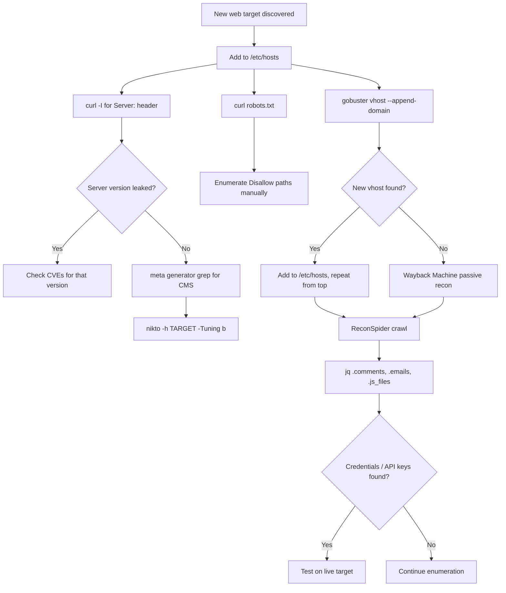

# Information Gathering - Web Edition (HTB Supplementary)

#InformationGathering #WebRecon #VirtualHosts #Vhost #gobuster #Fingerprinting #curl #nikto #Wappalyzer #WebCrawling #scrapy #WebArchives #WaybackMachine #robots #HTBSupplementary

**HTB Information Gathering - Web Edition module** — supplementary to Offsec Module 6 (Information Gathering). The Offsec module covers WHOIS, Google dorking, DNS, SMB, SMTP, and SNMP. This module adds the web-specific recon layer: virtual host discovery, web server fingerprinting, web crawling for embedded secrets, and passive recon via archived snapshots. Almost no overlap with the existing module note.

> 🔁 Cross-refs: [[Information Gathering#6.2.1. WHOIS Enumeration|6.2.1 WHOIS]], [[Information Gathering#6.4.1. DNS Enumeration|6.4.1 DNS]], [[Footprinting (HTB Supplementary)#FP.4. DNS: AXFR Zone Transfer|FP.4 AXFR]]

---

## IGWE.1. Virtual Host (vHost) Enumeration

**Virtual hosting** lets a single web server serve multiple websites from the same IP address by routing requests based on the `Host:` header the client sends. From a recon perspective, there may be additional subdomains/vhosts on a target IP that don't appear in public DNS and won't resolve unless you add them to `/etc/hosts` yourself.

**Add target to /etc/hosts first** (every vhost technique below requires this):
```bash
sudo sh -c "echo 'TARGET_IP domain.htb' >> /etc/hosts"

# Adding multiple domains at once to the same IP
sudo sh -c "echo 'TARGET_IP inlanefreight.htb web1337.inlanefreight.htb' >> /etc/hosts"
```
The `/etc/hosts` file takes precedence over DNS, so any domain you add here resolves locally to the IP you specify, without needing a real DNS record.

---

**gobuster vhost mode** — brute-forces virtual host names by sending requests with the `Host:` header set to each wordlist entry:
```bash
gobuster vhost \
  -u http://inlanefreight.htb:PORT \
  -w /usr/share/seclists/Discovery/DNS/subdomains-top1million-20000.txt \
  --append-domain

# Bigger wordlist for more thorough coverage
gobuster vhost \
  -u http://inlanefreight.htb:PORT \
  -w /usr/share/seclists/Discovery/DNS/subdomains-top1million-110000.txt \
  -t 60 \
  --append-domain
```

Key flags:
| Flag | What it does |
|------|-------------|
| `--append-domain` | Appends the base domain to each wordlist word (so `web` becomes `web.inlanefreight.htb`). Without this, gobuster sends bare words in the Host header and gets no hits. Required for vhost mode. |
| `-t 60` | 60 threads — speeds up the scan significantly. Default is 10. |
| `--exclude-length N` | Filter out false-positive responses by excluding a specific response length. |

> 📸 Screenshot: gobuster vhost output showing new subdomains (Status: 200) alongside the ports + response sizes

**Chaining: enumerate vhosts of a discovered vhost** (second-level fuzzing):
```bash
# Found web1337.inlanefreight.htb — now fuzz it for its own subdomains
gobuster vhost \
  -u http://web1337.inlanefreight.htb:PORT \
  -w /usr/share/seclists/Discovery/DNS/subdomains-top1million-110000.txt \
  -t 60 \
  --append-domain

# This finds: dev.web1337.inlanefreight.htb
```
Always chain vhost discovery. A first pass finds first-level vhosts; each discovered vhost is a candidate for further fuzzing.

> 🔍 Worth remembering generally: gobuster `vhost` mode is different from `dir` mode. `dir` enumerates paths on a single host; `vhost` sends different `Host:` headers to the same IP to discover alternate virtual servers. Use `vhost` when you suspect multiple sites on the same IP; use `dir` to enumerate pages/directories within a known site.

> 🔧 Technique: if gobuster returns a large number of hits with the same response size, you're probably hitting a default catch-all response. Add `--exclude-length SIZE` with that size to suppress the noise. The remaining hits with different sizes are the real vhosts.

> 🔁 Similar to: [[Information Gathering#6.4.1. DNS Enumeration|6.4.1 subdomain brute-forcing with dnsenum]] — similar concept but at the vhost level, targeting the web server's Host routing rather than DNS

#### Tags: #VirtualHosts #gobuster #vhostEnum #hosts #HostHeader

---

## IGWE.2. Web Server Fingerprinting

The goal is to identify the exact software, version, and OS running the web server before hitting it with exploitation attempts. Four methods, each catches different things.

---

**Method 1: curl -I (HTTP response headers)**

The `Server:` header in an HTTP response often leaks the software name and version:
```bash
curl -I http://TARGET

# Example output:
# HTTP/1.1 200 OK
# Server: Apache/2.4.41 (Ubuntu)    ← exact version + OS
# Server: nginx/1.26.1               ← or nginx, no OS disclosed
```
`-I` sends a HEAD request (headers only, no body). Faster than a GET and just as useful for fingerprinting.

> 🔍 Worth remembering generally: not all servers disclose their version. Apache can be configured with `ServerTokens Prod` to show only `Apache` without the version. nginx by default shows `nginx/VERSION`. IIS shows `Microsoft-IIS/X.X`. If the header is stripped, move to method 2 or 3.

---

**Method 2: meta generator grep (CMS detection)**

Many CMSs embed a `<meta name="generator">` tag in their HTML that identifies the software:
```bash
curl -s http://TARGET/ | grep '<meta name="generator"'

# Example output:
# <meta name="generator" content="Joomla! - Open Source Content Management" />
# <meta name="generator" content="WordPress 6.5.3" />
```
`-s` = silent mode (suppresses progress output). Works well for quick CMS ID without installing anything.

> 🔧 Technique: some CMSs only render the generator tag on specific pages, not the homepage. If the homepage returns nothing, try `/index.php`, `/wp-login.php` (WordPress), `/administrator/` (Joomla), or the login page, which tend to include more CMS-specific markup.

---

**Method 3: nikto (automated vulnerability + fingerprinting scan)**

nikto scans for outdated software, misconfigurations, and known-bad files. The `-Tuning b` flag restricts it to "interesting files" only (outdated software, insecure files):
```bash
nikto -h http://TARGET
nikto -h http://TARGET -Tuning b
```

nikto also reports the OS alongside the Apache/nginx version in its output:
```
+ Server: Apache/2.4.41 (Ubuntu)
```

Full `-Tuning` options (can combine, e.g. `-Tuning abc`):

| Code | Category |
|------|----------|
| `0` | File Upload |
| `1` | Interesting File / Seen in Logs |
| `2` | Misconfiguration / Default File |
| `3` | Information Disclosure |
| `4` | Injection (XSS/Script/HTML) |
| `5` | Remote File Retrieval - Inside Web Root |
| `6` | Denial of Service |
| `7` | Remote File Retrieval - Server Wide |
| `8` | Command Execution / Remote Shell |
| `9` | SQL Injection |
| `a` | Authentication Bypass |
| `b` | Software Identification |
| `c` | Remote Source Inclusion |

> 🔧 Technique: nikto is noisy and will show up in access logs. On a real engagement, run it only after you've confirmed the scope and have permission for active scanning. For CTFs/OSCP labs, go ahead.

---

**Method 4: Wappalyzer (browser extension, passive)**

Wappalyzer fingerprints technologies by analysing page responses in the browser (JavaScript frameworks, analytics tools, CMS, server software, CDN). Install as a browser extension, then just browse to the target and it populates automatically.

Useful when you want passive fingerprinting without making noisy scanner requests. It cross-checks multiple signals (HTML, headers, cookies, JavaScript) simultaneously in one pass.

> 📸 Screenshot: Wappalyzer extension panel showing detected technologies for a target site (CMS name, server software, JS framework, etc.)

#### Tags: #Fingerprinting #curl #nikto #Wappalyzer #ServerHeader #MetaGenerator #CMS

---

## IGWE.3. Web Crawling with scrapy / ReconSpider

Web crawlers follow links and harvest content from a site automatically. The HTB module uses a custom scrapy spider called **ReconSpider** that saves its findings in a structured `results.json` rather than raw HTML dumps, making it easy to grep for specific finding types.

**Install and set up:**
```bash
# Install scrapy
pip3 install scrapy --break-system-packages

# Download and unzip ReconSpider
wget https://academy.hackthebox.com/storage/modules/279/ReconSpider.zip
unzip ReconSpider.zip
# → ReconSpider.py extracted to current directory
```

**Run against a target:**
```bash
python3 ReconSpider.py http://TARGET
python3 ReconSpider.py http://dev.web1337.inlanefreight.htb:PORT
```
Output is saved to `results.json` in the current directory, overwriting any previous run.

**Parse results.json with jq:**
```bash
# See all top-level keys
cat results.json | jq 'keys'

# Extract HTML comments (often contain TODO notes, API keys, dev emails, internal paths)
cat results.json | jq '.comments'

# Extract email addresses
cat results.json | jq '.emails'

# External links the crawler found
cat results.json | jq '.external_links'

# Internal links (all paths on the target)
cat results.json | jq '.internal_links'

# JavaScript files (check these for hardcoded keys, API endpoints, internal hostnames)
cat results.json | jq '.js_files'
```

**The high-value fields:**

| Field | What to look for |
|-------|-----------------|
| `.comments` | `<!-- TODO: change API key to X -->`, dev notes, internal paths, email addresses in comments |
| `.emails` | Internal email addresses (often reveal internal domain structure, usernames for spraying) |
| `.js_files` | Paths to JavaScript files — check them manually for hardcoded tokens or API endpoints |
| `.external_links` | Links to S3 buckets, CDN domains, partner sites that may be in scope |
| `.internal_links` | All discovered paths — look for `/admin`, `/api`, `/dev`, `/backup` patterns |

> 📸 Screenshot: `cat results.json | jq '.comments'` output showing a `<!-- Remember to change API key to ba988b835be... -->` comment buried in the crawl output

> 🔍 Worth remembering generally: HTML comments are stripped from rendered pages in a browser, so they're invisible to users and often missed by developers in code review. Crawlers and `curl -s ... | grep '<!--'` catch them. They're one of the most reliable places to find hardcoded credentials and dev notes on web targets.

```bash
# Quick one-liner to grep for credential-looking comments without jq
curl -s http://TARGET/ | grep -i '<!--' | grep -iE 'password|key|api|secret|token|todo|change'
```

> 🔧 Technique: if the target requires authentication, the spider won't access protected pages. Run it first against the public-facing surface, note any login pages, then crawl authenticated sections with a tool like Burp Spider that can handle sessions.

> 🔁 Similar to: [[Information Gathering#6.2.4. Open-Source Code (GitHub, GitLab, Gist, SourceForge)|6.2.4 GitHub secret hunting]] — same "accidental disclosure" pattern, different surface

#### Tags: #WebCrawling #scrapy #ReconSpider #HTMLComments #jq #EmailHarvesting

---

## IGWE.4. Web Archives (Wayback Machine)

The **Internet Archive Wayback Machine** (https://web.archive.org) stores periodic snapshots of websites going back to 1996. Useful for finding content that's been removed, old redirect destinations, historical API keys in comments, old admin panels, and technology changes over time.

**Basic workflow:**
1. Browse to https://web.archive.org
2. Enter the target domain in the search bar
3. Select a date from the Calendar view (blue/green circles = snapshots available that day)
4. Click a snapshot to load the archived version

**What to look for:**

| Pattern | What it reveals |
|---------|----------------|
| Old redirects | facebook.com once redirected to a third-party site — if that same domain is re-registerable, potential takeover |
| Removed pages | Old `/admin`, `/backup`, or API endpoint pages that no longer 404 on the live site |
| Historical comments | Old source code visible in archive — check for hardcoded credentials that were "removed" later |
| Technology changes | See when WordPress was replaced with custom CMS — implies old WP vulns may still exist on dev/staging |
| Old subdomains | Referenced in archived pages but since removed from DNS |

> 🔍 Worth remembering generally: removing content from a live site does not remove it from the Wayback Machine. If credentials were ever hardcoded in a comment and that page was crawled, they're in the archive. This is why "we already removed it" is not an acceptable risk response in a pentest debrief.

**Searching archived content:**
```bash
# Wayback CDX API — list all crawl timestamps for a domain in JSON
curl "https://web.archive.org/cdx/search/cdx?url=*.example.com/*&output=json&fl=original,timestamp&collapse=urlkey" | head -50

# Search for specific file types in archive
curl "https://web.archive.org/cdx/search/cdx?url=example.com/&output=json&matchType=prefix&fl=original" | grep ".php"
```

> 📸 Screenshot: Wayback Machine calendar view for a target domain showing snapshot availability + the archived page with different/removed content versus the live version

> 🔧 Technique: the Wayback Machine CDX API is more useful for programmatic searches across many snapshots than the web UI. Point it at a wildcard (`*.domain.com/*`) to find all archived URLs across all subdomains — useful for finding hidden subdomains that existed historically.

#### Tags: #WaybackMachine #WebArchives #PassiveRecon #HistoricalContent #CDX

---

## IGWE.5. robots.txt as a Recon Source

The **robots.txt** file tells crawlers what not to index. From a recon perspective, `Disallow:` entries are a roadmap to hidden or sensitive endpoints that the site owner specifically wanted to hide from search engines.

```bash
# Always check robots.txt early
curl http://TARGET/robots.txt
curl http://VHOST:PORT/robots.txt
```

Classic pattern:
```
User-agent: *
Allow: /index.html
Disallow: /admin_h1dd3n        ← investigate this
Disallow: /api/internal        ← investigate this
Disallow: /backup              ← investigate this
```

> 🔍 Worth remembering generally: `Disallow` in robots.txt is not a security control. It's a polite request to well-behaved crawlers. Any human or malicious bot will happily browse to a `Disallow`-ed path. It's purely advisory.

> 🔧 Technique: after curling robots.txt, build a checklist of every `Disallow` entry and hit each one manually with `curl -I` first (HEAD request) to see if it returns 200, 301, 403, or 404 before making a full GET. A 301 redirect to a different path is especially interesting.

```bash
# Quick: extract all Disallow entries from robots.txt
curl -s http://TARGET/robots.txt | grep "Disallow" | awk '{print $2}'
```

> 🔁 Similar to: [[Information Gathering#6.4.3. Nmap Scanning|6.4.3 NSE http-enum + curl robots.txt]] — the same workflow: NSE finds the file, curl reads it, you follow the disallowed paths manually

#### Tags: #RobotsTxt #Disallow #HiddenEndpoints #WebRecon

---

## IGWE.6. Web Recon Decision Flow



---

## IGWE.7. HTB Skills Assessment Walkthrough

Full chain from the Skills Assessment (useful as a repeatable methodology template):

1. `whois inlanefreight.com | grep IANA` — IANA Registrar ID
2. `sudo sh -c "echo 'TARGET_IP inlanefreight.htb' >> /etc/hosts"`
3. `curl -I http://inlanefreight.htb:PORT` — Server header reveals nginx version
4. `gobuster vhost -u http://inlanefreight.htb:PORT -w subdomains-top1million-110000.txt -t 60 --append-domain` — finds `web1337.inlanefreight.htb`
5. Add `web1337.inlanefreight.htb` to `/etc/hosts`
6. `curl http://web1337.inlanefreight.htb:PORT/robots.txt` — Disallow: `/admin_h1dd3n`
7. `curl http://web1337.inlanefreight.htb:PORT/admin_h1dd3n/` — API key in page HTML
8. `gobuster vhost -u http://web1337.inlanefreight.htb:PORT ... --append-domain` — finds `dev.web1337.inlanefreight.htb`
9. Add `dev.web1337.inlanefreight.htb` to `/etc/hosts`
10. `python3 ReconSpider.py http://dev.web1337.inlanefreight.htb:PORT`
11. `cat results.json | jq '.emails'` — internal email address
12. `cat results.json | jq '.comments'` — comment with new API key

**Skills Assessment answers:**

| Question | Answer |
|---|---|
| IANA ID of registrar for inlanefreight.com? | **468** |
| HTTP server software on inlanefreight.htb? | **nginx** |
| API key in hidden admin directory? | **e963d863ee0e82ba7080fbf558ca0d3f** |
| Email address found by crawling? | **1337testing@inlanefreight.htb** |
| New API key found in page comment? | **ba988b835be4aa97d068941dc852ff33** |

Other module question answers:

| Section | Question | Answer |
|---|---|---|
| WHOIS | PayPal IANA ID | **292** |
| WHOIS | Tesla admin email | **admin@dnstinations.com** |
| DNS | IP for inlanefreight.com | **134.209.24.248** |
| DNS | PTR for 134.209.24.248 | **inlanefreight.com** |
| DNS | Facebook MX record | **smtpin.vvv.facebook.com.** |
| Subdomain brute-force | Missing subdomain (inlanefreight.com) | **my.inlanefreight.com** |
| Zone Transfers | DNS records from AXFR | **22** |
| Zone Transfers | IP for ftp.admin.inlanefreight.htb | **10.10.34.2** |
| Zone Transfers | Largest IP in 10.10.200 range | **10.10.200.14** |
| Virtual Hosts | vhost prefixed "web" | **web17611.inlanefreight.htb** |
| Virtual Hosts | vhost prefixed "vm" | **vm5.inlanefreight.htb** |
| Virtual Hosts | vhost prefixed "br" | **browse.inlanefreight.htb** |
| Virtual Hosts | vhost prefixed "a" | **admin.inlanefreight.htb** |
| Virtual Hosts | vhost prefixed "su" | **support.inlanefreight.htb** |
| Fingerprinting | Apache version on app.inlanefreight.local | **2.4.41** |
| Fingerprinting | CMS on app.inlanefreight.local | **Joomla** |
| Fingerprinting | OS on dev.inlanefreight.local | **Ubuntu** |
| Creepy Crawlies | Future reports location (from comment) | **inlanefreight-comp133.s3.amazonaws.htb** |
| Web Archives | HTB Pen Testing Labs count (Aug 8 2018) | **74** |
| Web Archives | HTB members (Jun 10 2017) | **3054** |
| Web Archives | facebook.com redirect (Mar 2002) | **http://site.aboutface.com/** |
| Web Archives | PayPal "beam money" product (Oct 1999) | **Palm 0rganizer** |
| Web Archives | Google prototype address (Nov 1998) | **http://google.stanford.edu/** |
| Web Archives | IANA last updated date (Mar 2000) | **17-December-99** |
| Web Archives | Wikipedia English articles (Feb 9 2003) | **104155** |

---

## Outstanding Sections

- [x] IGWE.1. Virtual Host Enumeration
- [x] IGWE.2. Web Server Fingerprinting
- [x] IGWE.3. Web Crawling (scrapy/ReconSpider)
- [x] IGWE.4. Web Archives (Wayback Machine)
- [x] IGWE.5. robots.txt as Recon Source
- [x] IGWE.6. Decision Flow
- [x] IGWE.7. Skills Assessment Answers
- All section questions answered — no hands-on VM labs in this module (all exercises ran against live internet or spawned web targets, not Offsec VMs)

---

## Related Boxes

- **[FriendZone](https://0xdf.gitlab.io/2019/07/13/htb-friendzone.html)** (HTB, Linux, Easy): SMB reveals credentials, DNS zone transfer uncovers hidden vhosts. The vhost-to-foothold chain directly maps to IGWE.1 + [[Footprinting (HTB Supplementary)#FP.4. DNS: AXFR Zone Transfer|FP.4 AXFR]].
- **[Trick](https://0xdf.gitlab.io/2022/10/29/htb-trick.html)** (HTB, Linux, Easy): reverse DNS + zone transfer expose hidden vhosts (`preprod-payroll`, `preprod-marketing`). Almost pure IGWE.1 vhost recon workflow.
- **[Forge](https://0xdf.gitlab.io/2021/12/18/htb-forge.html)** (HTB, Linux, Medium): vhost enumeration reveals an internal admin portal. IGWE.1 vhost enum + IGWE.2 fingerprinting combo.
- **[Devvortex](https://0xdf.gitlab.io/2024/03/30/htb-devvortex.html)** (HTB, Linux, Easy): vhost enum finds a Joomla subdomain; Joomla version fingerprinting leads directly to an authenticated RCE. Direct IGWE.1 + IGWE.2 (Joomla detection) combo.
