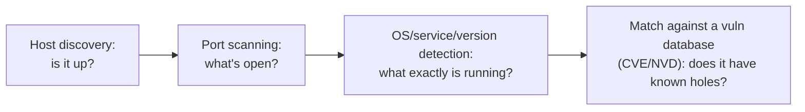

# Module 7: Vulnerability Scanning

## Tags
#OSCP #Module7 #VulnerabilityScanning #Nessus #OpenVAS #Greenbone #Nmap #CVE #CVSS #FalsePositive #FalseNegative

---

## **Why This Module Matters**
You've mapped the attack surface in Module 6. Next question: which of these services and versions actually have known holes? That's what vulnerability scanning answers. Fast, automated, a good baseline before you go hunting manually.

This module covers the theory first, then two concrete tools. **Nessus** (commercial, heavyweight) and **Nmap** (the NSE vuln scripts you already know from Module 6).

> **⚠️ Exam-relevant, verified against OffSec's own [OSCP+ Exam Guide](https://help.offsec.com/hc/en-us/articles/360040165632-OSCP-Exam-Guide):** Nessus (along with other mass vulnerability scanners like NeXpose, OpenVAS, Canvas, Core Impact, SAINT) is **prohibited on the actual OSCP exam**. The point of the exam is to test manual identification and exploitation, not automated scanning. Nmap and the NSE are explicitly allowed. Worth internalizing everything Nessus teaches here as a **real-world workflow skill**, genuinely useful on actual client engagements, but 7.3's Nmap/NSE approach is the one that carries directly into exam day.

**⚠️ Status:** 7.1 (theory) fully done. 7.2 (Nessus) written up, 7.2.1 to 7.2.5 done — only the plugin-filter lab (7.2.6) still needs VM #1 and the IIS web server VM spun up. 7.3 (Nmap NSE) and 7.4 (wrap-up) fully done. **HTB supplementary added 2026-08-17:** 7.3b OpenVAS (full UI navigation + scan creation + results workflow + skills assessment answers) and 7.3c Nessus HTB skills assessment answers (Windows_basic_authed scan Q&A).

---

## 7.1. Vulnerability Scanning Theory

**Attack vector** vs **attack surface**. Worth keeping these straight:
- **Attack vector** = a specific path or method an attacker uses to get in (e.g. an unpatched SMB bug).
- **Attack surface** = the *entire collection* of exposed entry points an attacker could try.

Two broad scanner types:
- **Web application scanners** look at HTTP-based attack surface (covered elsewhere in the course).
- **Network scanners** look at hosts, ports, and services across a network. This module's focus.

#### Tags: #AttackVector #AttackSurface #NetworkScanners

---

### 7.1.1. How Vulnerability Scanners Work

**The core workflow. Every scanner does some version of this:**
1. **Host discovery.** Is the target even up and reachable?
2. **Port scanning.** Which ports and services are open?
3. **OS, service, and version detection.** What exactly is running?
4. **Matching against a vulnerability database.** Does this software/version have known holes?



**Vulnerability databases:**
- **CVE** (Common Vulnerabilities and Exposures) names and lists specific vulnerabilities.
- **NVD** (National Vulnerability Database) builds on CVE, adding severity scores and deeper analysis.

Many commercial scanners go a step further and try to **verify** a finding by partially or fully exploiting it. That reduces missed vulns, but it can crash or destabilize the target. Something to weigh carefully on production systems.

**CVSS (Common Vulnerability Scoring System)**. A CVE tells you *what* the vulnerability is. CVSS tells you *how bad* it is. Scored 0 to 10, with severity labels attached (versions: CVSS v2, v3, and the newer v4, which improves accuracy around things like how easy the attack is to carry out and how far damage can spread downstream beyond the initially affected system vs v3.1). NIST hosts CVSS v3 and v4 calculators online if you need to score something yourself.

| Severity | CVSS v3.x / v4.0 |
|---|---|
| None | 0.0 |
| Low | 0.1 - 3.9 |
| Medium | 4.0 - 6.9 |
| High | 7.0 - 8.9 |
| Critical | 9.0 - 10.0 |

> 📸 Screenshot: the original module's Figure 1 is NIST's own CVSS ratings chart, comparing v2/v3/v4 severity bands side by side. The table above covers v3/v4 (they share the same bands), grab the actual NIST figure from the module if the v2 comparison specifically matters.

**Scan result accuracy. Two error types to know cold:**
- **False positive.** The scanner reports a vuln that *isn't actually there*. Causes: wrong service/version detection, a config that makes it unexploitable, or a security patch that was **backported** onto an old version string. Backporting means taking a fix from a newer software version and quietly applying it to an older one, without bumping the version number. So the scanner sees an old version number, assumes it's still vulnerable, and flags it, even though the fix is already in place.
- **False negative.** A *real* vulnerability the scanner *misses entirely*. Worse than a false positive, since you don't even know to go check manually.

**Manual vs automated scanning. The tradeoff:**
- Manual is slow and resource-intensive, but it catches complex/logical vulnerabilities automation can't.
- Automated is fast, scales across many hosts, and is good for baselining and catching low-hanging fruit under time pressure. But you need to actually understand the tool to configure it right and know where it falls short.

#### Tags: #ScannerWorkflow #CVE #CVSS #FalsePositive #FalseNegative #NVD

**Lab status: ✅ Completed:**

| Question | Answer |
|---|---|
| Scanner flags a Linux vuln on a Windows target (vuln only affects Linux). False positive or negative? | **False positive** |
| Scanner detects the wrong (non-vulnerable) FTP version, but the real running version IS vulnerable. False positive or negative? | **False negative** |

#### Tags: #Lab #Quiz #Module7

---

### 7.1.2. Types of Vulnerability Scans

Two axes to classify a scan by: **where it runs from** and **what access level it uses**.

**Where it runs from:**
- **External scan.** Targets reachable from the internet (web apps, DMZ systems, public-facing services). The client usually hands you a target IP list, but sometimes asks you to *discover* what's externally exposed yourself, since companies often don't have a full accurate picture of their own public footprint.
- **Internal scan.** Done via VPN access or on-site, to map the internal network's security posture. In other words, what can an attacker do once they're past the perimeter?

**What access level it uses:**
- **Unauthenticated scan.** No credentials. Finds vulnerabilities in *remotely accessible* services only, mapping open ports and matching against vuln DBs. Blind to local-only issues (missing patches, local misconfig) since there's no way to log in and check. Example: you can't tell if a Windows box is patched against HiveNightmare (a 2021 vulnerability that lets a local low-privileged user read sensitive credential files they're not supposed to see) from the outside. That requires actually logging in.
- **Authenticated scan.** The scanner logs in with valid (usually privileged) credentials, giving full visibility into installed packages, missing patches, and local config issues.

These two axes are independent, any combination is a real, valid scan type:

|  | **External** | **Internal** |
|---|---|---|
| **Unauthenticated** | attacker's view of the internet-facing perimeter | attacker's view after breaching the perimeter, no creds yet |
| **Authenticated** | rare in practice, external services don't usually hand out local logins | full local visibility, what most "internal vuln assessment" engagements actually mean |

*Worth noticing: the two labs from 7.2 sit in different quadrants. The 7.2.3/7.2.4 Basic Network Scan is internal+unauthenticated (VPN'd into the lab, no creds supplied). The 7.2.5 Credentialed Patch Audit is internal+authenticated, same network position, but now with SSH creds in hand.*

#### Tags: #ExternalScan #InternalScan #AuthenticatedScan #UnauthenticatedScan #HiveNightmare

**Lab status: ✅ Completed:**

| Question | Answer |
|---|---|
| Need to confirm all patches are installed on a Linux system. Authenticated or unauthenticated? | **Authenticated** |
| Analyzing a server's internet-facing perimeter from an attacker's perspective. Authenticated or unauthenticated? | **Unauthenticated** |

#### Tags: #Lab #Quiz #Module7

---

### 7.1.3. Things to Consider in a Vulnerability Scan

**Scanning duration** varies a lot by scan type and target count. External scans over the internet can be slow due to hops and intermediate systems. Plan around this for large IP lists.

**Target visibility.** Don't just fire off an IP without checking you can actually reach it:
- External: a client's international infrastructure might geo-restrict access. You may only reach systems in your own country.
- Internal: your network position matters (subnet placement). Firewalls, IPS, and routers can silently mess with scan traffic. For example, an intermediate device dropping the ICMP packets used in host discovery, causing the scanner to wrongly mark a live host as "down."

**Rate limiting.** Networks and devices can throttle your scan traffic (thresholds on throughput, packet count, connection count). If host discovery or service detection probes get rate-limited, the scanner can miss live hosts and services entirely. Fix: configure delays, timeouts, and cap parallel connections in the scanner.

**Network and system impact:**
- Scanning many targets in parallel can saturate the network, making it unusable for others. Dial back parallelism/speed if needed.
- Scans, even against healthy systems, can trigger crashes or service disruption. Be cautious on production targets, especially with exploit-verification features enabled.

#### Tags: #ScanDuration #TargetVisibility #RateLimiting #NetworkImpact #ProductionCaution

**Lab status: ✅ Completed:**

| Question | Answer |
|---|---|
| True/False: a vulnerability scan can never impact target stability? | **False** |
| True/False: rate limiting can cause a scanner to flag a live target as offline? | **True** |

#### Tags: #Lab #Quiz #Module7

---

## 7.2. Vulnerability Scanning with Nessus

**Nessus** is one of the most widely used commercial vulnerability scanners. 67,000+ CVEs across 168,000+ plugins. Editions: **Essentials** (free, up to 5 IP scans), **Essentials Plus** (up to 20 IPs, more reporting), **Professional** (full commercial).

> **⚠️ License quirk to plan around:** Essentials is capped at 5 host scans. This module uses exactly 5 target IPs, so **stay on a single VPN connection** for the whole module. Reconnecting can change your lab IP's third octet and push you over the 5-scan limit. (Host-*discovery*-only scans don't count against the 5-host cap, per the Nessus welcome popup. Only actual vulnerability scans do.)

#### Tags: #Nessus #NessusEssentials #LicenseLimit

---

### 7.2.1. Installing Nessus

**Before you start:** you'll need an internet connection and a real, deliverable business-style email (used to get your activation code). 2 CPU / 4GB RAM is enough for lab purposes.

**Step 1: Go to the Tenable Nessus download page in your browser**
*Look for the download options list. Pick **Linux - Debian - amd64** if your Kali VM is standard x64. Pick **Linux - Ubuntu - aarch64** only if your Kali VM is ARM-based.*

**Step 2: Click the Checksum button and copy the SHA256 checksum**
*This copies just the checksum string to your clipboard, not the filename. You'll need to type the filename yourself in the next step.*

**Step 3: Open a terminal and go to your Downloads folder**
```bash
cd ~/Downloads
```
*Nothing will print. That's normal, it just moves you into the folder.*

**Step 4: Confirm the .deb file actually downloaded**
```bash
ls
```
*You should see a file like `Nessus-10.5.0-debian10_amd64.deb` in the list. If you don't see it, the download hasn't finished. Wait for it or restart the download before continuing.*

**Step 5: Save the checksum and filename into a checksum file**
```bash
echo "<paste-the-checksum-here> Nessus-10.5.0-debian10_amd64.deb" > sha256sum_nessus
```
*Replace `<paste-the-checksum-here>` with what you copied in Step 2, and make sure the filename matches exactly what `ls` showed you in Step 4. No output expected, this just creates a small text file.*

**Step 6: Verify the checksum matches**
```bash
sha256sum -c sha256sum_nessus
```
*You should see:*
```
Nessus-10.5.0-debian10_amd64.deb: OK
```
*If it says **FAILED** instead of **OK**, stop here. Do not install. Delete the `.deb` and re-download it. A failed checksum means the file is corrupted or wasn't fully downloaded.*

**Step 7: Install the package**
```bash
sudo apt install ./Nessus-10.5.0-debian10_amd64.deb
```
*This will print a lot of output. Near the end, look for a line telling you the service name and a URL like `https://kali:8834/`. That confirms the install worked.*

**Step 8: Start the Nessus service**
```bash
sudo systemctl start nessusd.service
```
*No output on success, that's normal. If it fails, run `sudo systemctl status nessusd.service` next and read the error shown.*

**Step 9: Open the Nessus web interface**
*In a browser, go to `https://127.0.0.1:8834`. You'll get a certificate warning, this is expected since Nessus uses a self-signed certificate. Click **Advanced...**, then **Accept the Risk and Continue**. The page may take a minute to load while Nessus finishes initializing. That's normal, don't refresh repeatedly.*

**Step 10: Click through the pre-installation settings screen**
*Click **Continue**. The defaults are fine, no changes needed here.*

**Step 11: Choose the Nessus product**
*Click **Register for Nessus Essentials**, then **Continue**.*

**Step 12: Fill in the activation request form**
*Enter your name and a real, deliverable business-style email. This is where Tenable sends your activation code. Click **Register**.*

**Step 13: Check your email for the activation code**
*Check your inbox (and spam folder) for an email from Tenable containing your activation code. Copy the code.*

**Step 14: Enter the activation code**
*Paste the code into the activation field in Nessus and continue. If it's rejected as invalid, see the troubleshooting box below before retrying.*

**Step 15: Create your local Nessus login account**
*This is the username/password you'll use to log into the Nessus web UI from now on. It's separate from your Kali OS login. Use `admin` and a strong password, and make sure you don't lose it.*

**Step 16: Wait for Nessus to download and compile plugins**
*This can take up to ~30 minutes depending on your connection speed. A progress bar will show. This is normal, don't close the browser tab or interrupt it.*

**Step 17: Close the "Welcome to Nessus Essentials" popup**
*Once it appears, you're fully installed and logged in. Click Close.*

> **🛠️ Since you've had install/activation trouble with Nessus before, check these if something stalls:**
> - **Activation email never arrives, or the code is rejected.** Confirm you used a real, deliverable business-style email (disposable/free addresses can get silently rejected). Check spam. If you're retrying with a code that was issued before, request a **brand-new** code from Tenable's site instead of reusing an old one.
> - **Plugin download/compile (Step 16) hangs for way longer than 30 minutes.** This needs a stable connection the whole time. A dropped connection mid-way can leave it stuck. Run `sudo systemctl status nessusd.service` to check the service is still alive, and check logs at `/opt/nessus/var/nessus/logs/`. If genuinely stuck, `sudo systemctl restart nessusd.service` and let it retry.
> - **Browser never loads `:8834` at all.** Don't assume it's a network/firewall problem first. Run `sudo systemctl status nessusd.service`. If it says `active (running)`, just wait another minute. Nessus can take a bit after starting before it actually answers on that port.
> - **Error says `nessusd.service could not be found`.** This means the install in Step 7 silently failed. Go back and re-run the checksum check (Step 6). A checksum mismatch or missed dependency is the usual cause. Reinstall rather than troubleshooting the service on its own.
> - **Nessus was already installed from a previous session, and now shows "license expired" when you log in or try to launch a scan.** This is expected, not a bug. Nessus Essentials is a genuine **30-day license**, not indefinite. There's no "renew" button in the UI. Fix, without reinstalling anything:
>   1. Go to `https://www.tenable.com/products/nessus/nessus-essentials` in a browser.
>   2. Find the **Essentials** column specifically and click its **"Register now"** button. This should pop up an in-page **name + email** form. (If it instead sends you to a Tenable account login/signup, that's the wrong path. A Tenable Community account is a dead end here and won't give you a code. Look for the direct product-page form instead.)
>   3. Submit the form, then check your email for a message containing an actual activation code (format `XXXX-XXXX-XXXX-XXXX-XXXX`). Not another login link.
>   4. Apply it to the existing install:
>      ```bash
>      sudo /opt/nessus/sbin/nessuscli fetch --register XXXX-XXXX-XXXX-XXXX-XXXX
>      ```
>      *You should see "Your Activation Code has been registered properly" followed by the plugin feed downloading/unpacking to 100% and "Nessus Plugins: Complete."*
>   5. Restart the service: `sudo systemctl restart nessusd.service`
>   6. Reload `https://127.0.0.1:8834`, log in with your existing admin account (unchanged), and confirm Settings → About shows a fresh, active license.
>   - **Planning ahead:** if you leave more than ~30 days between OSCP/Nessus sessions, expect to repeat this exact process again. It's normal, not a new problem each time.

> 🎥 **Video:** ["Getting Started with Nessus Essentials, From Installation to Your First Vulnerability Scan"](https://www.youtube.com/watch?v=DALkrjJpTas), found via search, title/topic matches this section closely but full content wasn't verified (YouTube pages don't fetch cleanly for automated review). A second candidate, ["Nessus Tutorial for Beginners: Install & Scan Guide"](https://www.youtube.com/watch?v=UaYfj6uv2kI), also turned up but wasn't checked at all. Worth 5 minutes to confirm either matches this exact install flow (checksum verification, activation email, plugin compile wait) before leaning on it.

> 📋 Generalized copy-pasteable commands for this technique: [[Reconnaissance & Enumeration#Nessus (Install & CLI)|Command Appendix]]
> 🧭 Quick lookup: [[Reconnaissance & Enumeration (Decision Tree)|Decision Tree]]

#### Tags: #NessusInstall #Checksum #ActivationCode #NessusPlugins #InstallTroubleshooting

**Lab status: ✅ Completed:**

| Question | Answer |
|---|---|
| Command to start nessusd after install (unprivileged account, i.e. via sudo)? | **`sudo systemctl start nessusd.service`** |

#### Tags: #Lab #Quiz #Module7

---

### 7.2.2. Nessus Components

A quick tour of the UI before we scan anything.

**Step 1: Look at the top of the dashboard**
*You'll see two tabs: **Scans** and **Settings**.*

**Step 2: Click into Settings**
*This is where you'd configure an SMTP server (to email scan results), plus an **Advanced** menu covering UI, scan, log, security, and performance options.*

**Step 3: Click Settings → About**
*This shows your license info and how many licensed hosts you have left. Useful for keeping track of the Essentials 5-host cap mentioned above.*

**Step 4: Click the Scans tab, then Policies (under Resources)**
*A **policy** is just a saved set of scan config options you can reuse later as a starting template. Nothing to configure yet, just note where it lives.*

**Step 5: Click Scan Templates**
*You'll see templates grouped into 3 categories:*
- **Discovery.** `Host Discovery` (builds a list of live hosts and their open ports) and `Ping-Only Discovery`.
- **Compliance** *(Professional edition only, you won't have this on Essentials).* Compliance-framework checks.
- **Vulnerabilities.** Templates for specific critical vulns (e.g. PrintNightmare, Zerologon), scanning areas (Web App Tests, Malware Scans), and 3 general-purpose ones:
  - **Basic Network Scan.** Full scan, most settings pre-filled, broad coverage. Nessus's recommended default.
  - **Advanced Scan.** Nothing pre-filled, full manual control.
  - **Advanced Dynamic Scan.** Also nothing pre-filled, but instead of manually picking plugins you set a **dynamic plugin filter** (e.g. "every plugin that covers CVE-2021-3156").

*One concept worth understanding now, since it comes up later: a **Nessus Plugin** is a small program (written in NASL, Nessus's own scripting language, basically a purpose-built language for writing vulnerability checks) that contains the detection logic for one vulnerability. Plugins are grouped into **plugin families** by use case, e.g. "Ubuntu Local Security Checks."*

#### Tags: #NessusTemplates #NessusPlugins #NASL #PluginFamily #ScanPolicy

**Lab status: ✅ Completed:**

| Question | Answer |
|---|---|
| Third template category alongside Discovery and Compliance? | **Vulnerability** |
| Default concurrent web users allowed (Settings → Advanced)? | **1024** |

#### Tags: #Lab #Quiz #Module7

---

### 7.2.3. Performing a Vulnerability Scan

**Goal for this walkthrough:** an unauthenticated scan of 4 target machines, restricted to ports 80 and 443 only, with host discovery turned off.

**Step 1: Click New Scan**
*This opens the template picker.*

**Step 2: Click Basic Network Scan**
*This opens the scan configuration screen. You'll see 5 tabs across the top: **BASIC, DISCOVERY, ASSESSMENT, REPORT, ADVANCED**.*

**Step 3: On the Basic tab, enter a scan name**
*Type something descriptive, e.g. `Basic Vulnerability Scan`.*

**Step 4: On the same tab, enter your target IPs**
*Type the 4 target IPs into the Targets field, comma-separated. (Nessus also accepts a single IP, an IP range, or an FQDN. Just comma-separated IPs for this example.)*

**Step 5: Click the Discovery tab**
*You'll see a dropdown currently set to a default option.*

**Step 6: Change that dropdown to Custom**
*This is required. Without it, you can't restrict which ports get scanned.*

**Step 7: Find the new Port Scanning section that appears**
*Set **Port scan range** to `80,443`.*

**Step 8: Enable "Consider unscanned ports as closed"**
*This tells Nessus to treat every port outside 80/443 as closed, rather than "unknown." Keeps the scan focused and the results unambiguous.*

**Step 9: Click into Host Discovery (still under the Discovery tab)**
*Find the toggle labeled **Ping the remote host** and switch it **OFF**. We already know these hosts are up, so this saves time and generates less noise.*

**Step 10: Skip the Credentials tab entirely**
*Leaving it empty means this scan runs **unauthenticated**. Surface-level only, may include some false positives, and won't see anything local-only on the target.*

**Step 11: Leave the Assessment tab on its defaults**
*This keeps credential brute-forcing disabled. Note: even with defaults, scanning multiple hosts at once still generates a lot of network traffic and will be noisy.*

**Step 12: Click the small arrow next to Save, then click Launch**
*This starts the scan immediately, rather than just saving the config for later.*

**Step 13: Watch the status in My Scans**
*It'll show **Running** at first, then change to **Completed** once done. Don't disconnect your VPN or shut down the lab in the meantime. You'll reuse this exact scan's results in the next section.*
![[Pasted image 20260729144719.png]]
#### Tags: #NessusScanConfig #BasicNetworkScan #UnauthenticatedScan #PortScanRange #HostDiscoveryToggle

**Lab status: ✅ Completed:**

| Question | Answer |
|---|---|
| Only enabled checkbox in the REPORT → Output section? | **Allow users to edit scan results** |

#### Tags: #Lab #Quiz #Module7

---

### 7.2.4. Analyzing the Results

**Step 1: Click on your completed scan in My Scans**
*This opens the results dashboard for that scan. You'll see 4 tabs: **Vulnerabilities, Remediations, Notes, History**.*
![[Pasted image 20260729144752.png]]
**Step 2: Look at the Vulnerabilities tab (Hosts view)**
*This lists every host that was scanned, plus a visual severity breakdown. The right-hand panel shows summary stats and a chart of vulnerability severity distribution across all targets.*
![[Pasted image 20260729145027.png]]
**Step 3: Click on one specific host in the list**
*This opens the per-host vulnerability list for just that machine.*

**Step 4: Look for any entries marked MIXED under Severity**
*A **MIXED** severity means it's a **grouped finding**. Several related vulnerabilities bundled together (e.g. "Apache HTTP Server (Multiple Issues)"). The Count column tells you how many individual findings are inside.*
![[Pasted image 20260729145052.png]]
**Step 5: Click on a grouped (MIXED) finding to expand it**
*This shows you the individual vulnerabilities that were grouped together.*

**Step 6: Click on one specific vulnerability inside that group**
*This opens the full detail view: risk rating, exploit status, and reference links for further research.*

> **🛠️ Course material out of date vs. current Nessus. Reading "Exploit Code Maturity" and similar CVSS Temporal fields:**
> The OSCP course text points to a **"VPR Key Drivers"** panel (Tenable's proprietary Vulnerability Priority Rating) on the right-hand side of a finding's detail page for fields like "Exploit Code Maturity." **This panel may not exist at all** in current Nessus, confirmed missing on Nessus Essentials as of 2026. Don't waste time hunting for it if it's not there.
>
> Instead, get the same information by decoding the **CVSS v3.0 Temporal Vector** shown under Risk Information. "Temporal" just means time-related, these values can change as the situation evolves (e.g. a new exploit gets released, or a patch ships), unlike the base CVSS score which stays fixed. Example:
> ```
> CVSS v3.0 Temporal Vector: CVSS:3.0/E:F/RL:O/RC:C
> ```
> This vector has 3 parts, each a separate risk attribute:
> - **E** = **Exploit Code Maturity**. `U` = Unproven (no working exploit publicly exists yet), `P` = Proof-of-Concept (someone's shown it's exploitable but hasn't packaged it), `F` = Functional (a working exploit exists and can be used), `H` = High (reliable exploit, widely available)
> - **RL** = Remediation Level. `O` = Official Fix (vendor released a patch), `T` = Temporary Fix, `W` = Workaround, `U` = Unavailable (no fix exists yet)
> - **RC** = Report Confidence. `U` = Unknown, `R` = Reasonable, `C` = Confirmed
>
> So `E:F` in the example above means **Exploit Code Maturity: Functional**.
>
> **Also watch out:** Nessus groups multiple similar CVEs under one plugin family. Make sure you're looking at the plugin whose **title and "Solution" field actually match the question's version range** (e.g. a question asking about "2.4.49 < 2.4.51" matches a plugin whose Solution says "Upgrade to ... 2.4.51 or later," CVE-2021-42013, not a different plugin covering a narrower range like CVE-2021-41773, even though both are Apache path-traversal findings in the same scan).

> 🔍 Full breakdown of all three Temporal Vector fields, not just `E`: [[Reconnaissance & Enumeration (Breakdowns)#Decoding a Nessus CVSS v3.0 Temporal Vector|Command Breakdowns]]

**Step 7: Go back and click the Remediations tab**
*This lists Nessus's suggested fix for each finding, pulled straight from the plugin that detected it.*

**Step 8: Click the History tab**
*This lists every past run of this exact scan configuration. Useful later for comparing results over time. Since this is your first run, you'll only see one entry.*

**Step 9: (For later, when you need to change settings) Click Configure at the top**
*This lets you edit the existing scan, add IPs, change ports, etc, without creating a brand-new scan. Re-running an *existing* scan config this way does **not** eat into your remaining Essentials 5-host limit the same way starting a fresh scan does.*

**Extra walkthrough. Building a Web Application Sitemap (port 9999, crawl for a flag):**

A Sitemap is Nessus crawling the target's web pages and listing every linkable page/path it found. Handy for spotting hidden pages like an exposed flag file.

1. Go to **My Scans** and click **Configure** on your existing scan.
2. Click the **Discovery** tab → **Port Scanning** → change **Port scan range** to `9999`.
3. Click the **Assessment** tab, change its dropdown to **Custom**.
4. Click into the **Web Applications** section that appears.
5. Enable **Scan web applications**. This makes Nessus actually crawl the site instead of just fingerprinting it.
6. Click the arrow next to **Save**, then **Launch**. Web crawling takes a bit longer than a plain port scan, that's normal.
7. Once **Completed**, click into the scan, then into the host that responded on port 9999.
8. Look for an **Info**-severity finding named **"Web Application Sitemap"** and click into it.
9. Read the list of crawled URLs in the **Output** section. It's just a page list (e.g. `/`, `/admin.html`, `/support.html`), not their content.
10. Any suspiciously named page (like `/flag.html`) is worth opening directly in a browser or checking Nessus's attached sitemap output for. That's where the actual flag text lives, not in the URL list itself.

> **Worked result:** on `192.168.230.13:9999`, the sitemap listed `/`, `/admin.html`, `/flag.html`, `/support.html`. Retrieving `/flag.html` gave the flag: `OS{08364838807077512c3895e626f5bb56}`.

**Extra walkthrough. VM #5, `win.ini` directory traversal (Basic Network Scan, all ports):**

🔁 **Similar to:** this is the same *directory traversal* vulnerability class as the [[Vulnerability Scanning#7.2.4. Analyzing the Results|Apache 2.4.49 < 2.4.51 Path Traversal finding earlier in this section]] (CVE-2021-42013). Both let you walk out of a web root using `../` sequences to read an arbitrary file. The difference here is the target is Windows, so the PoC file is `C:\Windows\win.ini` instead of `/etc/passwd`, and the vulnerable plugin is generic (not tied to one product) rather than Apache-specific. Also see [[Common Web Application Attacks#9.1.2. Identifying and Exploiting Directory Traversals|9.1.2]] for the same bug class exploited manually (browser/curl) rather than via an automated scanner.

**Step 1: Configure the scan correctly first**
*Two settings matter here, and skipping either can make this finding not show up at all:*
- **Discovery → Port Scanning → Port scan range** must be set to `all` (not the default common-ports list). The vulnerable web service was running on a non-standard high port (`27498` in this run), so a default/common port range misses it entirely.
- **Assessment → Perform thorough tests** should be enabled. Some generic file-read PoC plugins only fire with thorough tests on.

**Step 2: Launch the scan and wait for Completed**
*A full 1-65535 port scan with thorough tests takes noticeably longer than the earlier default scans in this module. Budget extra time.*

**Step 3: Find the finding**
*Severity sort alone isn't reliable here, this plugin doesn't always rate as High. Use the Vulnerabilities tab's search/filter box and search `traversal` to jump straight to it.*

**Step 4: Open "Web Server Directory Traversal Arbitrary File Access"**
*Note this plugin is generic. Per its own description, it doesn't target a specific product, it just tries a battery of `../` encodings and flags anything that returns `/etc/passwd` or `win.ini` content.*

**What we found:**
```
Nessus was able to retrieve the remote host's 'win.ini' file using the
following URLs:
  - http://192.168.220.9:27498/../../../../../../../../../../../../windows/win.ini
  - ../../../../../../../../../../../../windows/win.ini *
  - ..\..\..\..\..\..\..\..\..\..\windows\win.ini *
  - http://192.168.220.9:27498/..\..\..\..\..\..\..\..\..\..\windows\win.ini
  - http://192.168.220.9:27498/././././././../../../../../windows/win.ini
  - http://192.168.220.9:27498/nessus\..\..\..\..\..\..\windows\win.ini
  - http://192.168.220.9:27498/scripts/fake.cgi?arg=/dir/../../../../../../../../../../../windows/win.ini

Contents:
[fonts]
[extensions]
[mci extensions]
[files]
[Mail]
MAPI=1
; OS{900033357d272b982486de732e757896}{}
```
Flag: **`OS{900033357d272b982486de732e757896}`**, embedded as a comment line inside the retrieved `win.ini`.

> 📸 Screenshot: Nessus finding detail page showing the "Web Server Directory Traversal Arbitrary File Access" plugin output with the win.ini contents and flag visible.

> 🔗 **HackTricks** has a broader directory/path traversal cheat sheet (encodings, filter bypasses, OS-specific target files). Worth a look if a future box's traversal doesn't respond to the basic `../` payloads above.
> 🔗 **PayloadsAllTheThings** keeps a maintained list of traversal payload variations (double-encoding, null-byte tricks, etc). Useful when a generic Nessus-style payload set like the one above doesn't land.

> 🧭 Quick lookup: [[Reconnaissance & Enumeration (Decision Tree)|Decision Tree]]

#### Tags: #NessusResults #GroupedFindings #Remediations #ScanHistory #ReconfigureScan #WebApplicationSitemap #DirectoryTraversal #WinIni #AllPortsScan #ThoroughTests

**Lab status: ✅ Completed:**

| Question | Answer |
|---|---|
| "Exploit Code Maturity" value for the Apache 2.4.49 < 2.4.51 Path Traversal finding? | **Functional** (decoded from CVSS v3.0 Temporal Vector `E:F` on Plugin #155600 / CVE-2021-42013, see troubleshooting note above) |
| Jetty version found under grouped "HTTP (Multiple Issues)" after adding port 8080 to the scan? | **9.4.43** |
| Flag found on a page via Nessus's Web Application Sitemap crawl (port 9999 scan, Assessment → Custom → Web Applications → Scan web applications)? | **OS{08364838807077512c3895e626f5bb56}** (found in `flag.html`, listed in the crawled sitemap alongside `admin.html`/`support.html`) |
| Flag embedded in `C:\Windows\win.ini` content, retrieved via a directory-traversal vuln (Basic Network Scan, all ports, on VM #5)? | **OS{900033357d272b982486de732e757896}** (plugin "Web Server Directory Traversal Arbitrary File Access", required all-ports range + thorough tests enabled, see walkthrough above) |

#### Tags: #Lab #Quiz #Module7

---

### 7.2.5. Performing an Authenticated Vulnerability Scan

**Heads up before starting:** authenticated scans need real login credentials for the target, and they generate a lot of *local* noise on the target too (log entries, possible AV alerts), not just network traffic.

**Step 1: Click New Scan**

**Step 2: Click Credentialed Patch Audit**
*Note this is a different template from Basic Network Scan. It only runs local security checks (missing OS patches + outdated/vulnerable local apps), and skips the external-perspective vulnerability checks entirely.*

**Step 3: Enter a scan name**

**Step 4: Set the Target to the DESKTOP machine's IP**

**Step 5: Click the Credentials tab**

**Step 5b: (Optional) See all available auth mechanisms**
*The Credentials tab defaults to showing just the **Host** category. Click the **CATEGORIES** dropdown and select **All** to see every supported authentication mechanism (database, plaintext, misc, etc). Full list in Tenable's docs.*

**Step 6: Under the Host category, click SSH**

**Step 7: Set Authentication method to password**

**Step 8: Enter the username**
*Type `offsec`.*

**Step 9: Enter the password**
*Type `lab`.*

**Step 10: Set "Elevate privileges with" to sudo**

**Step 11: Enter the sudo user and password**
*Sudo user: `root`. Password: `lab`.*

**Step 12: Click the small arrow next to Save, then click Launch**

**Step 13: Wait for the scan to complete, then open its results**

**Step 14: Click the gear/wheel icon on the Vulnerabilities page**
*Select **Disable Groups**. This switches from MIXED-severity bundled findings to every individual finding listed separately. Easier to scan through for authenticated results.*

**Step 15: Look through the findings**
*Expect to see the **Ubuntu Local Security Checks** plugin family (missing OS patches) plus vulnerable *locally installed* apps like Firefox or cURL. None of which an unauthenticated scan could ever have shown you.*

**Which auth mechanism to use, by target OS:**
- **Linux / macOS** uses SSH (what we're using here).
- **Windows** usually uses SMB or WMI instead (both support local or domain accounts). SSH is technically possible on Windows too, but SMB/WMI is the norm.

**Things that can silently break an authenticated scan (check these if results look empty or incomplete, especially against Windows targets):**
- A **firewall** on the target blocking the scanner's connection.
- **AV software** on the target flagging/killing the scan connection. May need a temporary AV exception, or to disable it for the test.
- **UAC (User Account Control)** (Windows only). This is Windows' built-in feature that asks "do you want to allow this app to make changes?" before any admin-level action runs. It can interfere with a credentialed scan unless Nessus is allowed through it or it's temporarily disabled. Check Tenable's docs before your first authenticated Windows scan.

> **🛠️ Troubleshooting hit during VM #1. Scan completed but showed 0 hosts / 0 vulnerabilities:**
> First suspect was Nessus's ping-based host discovery wrongly marking the target down (🔁 **similar to** the ICMP-filtering/rate-limiting scenario covered back in **7.1.3 Things to Consider in a Vulnerability Scan**, a live host getting marked "down" because discovery probes get dropped). Turning off **Discovery → Host Discovery → Ping the remote host** was tried first, but the real cause turned out to be simpler. The lab instance itself had actually died and needed reverting from the control panel.
>
> Lesson: before touching Nessus discovery settings, confirm basic reachability first.
> ```bash
> ping -c 4 <target-ip>
> ssh offsec@<target-ip>
> ```
> A `ssh` attempt is the more reliable check, since some lab targets legitimately block ICMP while SSH still works fine. If *both* fail, suspect the instance itself before suspecting Nessus config.

#### Tags: #AuthenticatedScan #CredentialedPatchAudit #SSHCredentials #UAC #AVInterference #DisableGroups #HostDiscoveryTroubleshooting

**Lab status: ✅ Completed:**

| Question | Answer |
|---|---|
| USN (Ubuntu Security Notice) number for the Critical "Patch Report" finding related to Heimdal? | **USN-5800-1** (Plugin #170001, CVSS v3.0 Base 9.8, covers CVE-2021-44758, CVE-2022-3437, CVE-2022-42898, CVE-2022-44640 in Heimdal's Kerberos/SPNEGO/DES handling) |
| Kernel version of DESKTOP, from the `uname -a` output in the SSH OS-identification finding? | **5.4.0-1234-aws** (full line: `Linux DESKTOP 5.4.0-1234-aws #1 SMP x86_64 GNU/Linux`) |

#### Tags: #Lab #Quiz #Module7

---

### 7.2.6. Working with Nessus Plugins

**Goal for this walkthrough:** check whether a Linux target (VM #1) is vulnerable to **CVE-2021-3156** ("Baron Samedit," a heap overflow in the sudo command, meaning a bug where an attacker can feed sudo more data than it has space for, causing it to run arbitrary code, in this case giving a normal user full root access), using a filtered scan instead of a full one.

**Step 1: Click New Scan**

**Step 2: Click Advanced Dynamic Scan**
*This template lets you filter down to specific plugins instead of running everything.*

**Step 3: Enter a scan name and target, same as before**

**Step 4: Click the Credentials tab and enter the same SSH + sudo details as in 7.2.5**
*(Username `offsec` / password `lab`, sudo user `root` / password `lab`.) This scan is also authenticated.*

**Step 5: Click the Dynamic Plugins tab**

**Step 6: Set the left dropdown to CVE**

**Step 7: Set the middle dropdown to a matching condition**
*(e.g. "is equal to")*

**Step 8: Type the CVE number in the right-hand field**
*Type `CVE-2021-3156`.*

**Step 9: Click Preview Plugins**
*This can take a few minutes, don't assume it's stuck. Just wait for the list to populate.*

**Step 10 (optional): Click the + button to add a second filter**
*If you want to narrow further, e.g. set the new filter's left dropdown to `Plugin Family` and its right dropdown to `Ubuntu Local Security Checks`. If the right-hand dropdown shows no options for you here, just remove this second filter and continue with only the CVE filter from Step 8.*

**Step 11: Click Preview Plugins again**
*Look through the matched plugin(s). You'll see the affected versions, patch number, and Plugin ID.*

**Step 12: Close the preview and click the small arrow next to Save, then click Launch**

**Step 13: Once complete, click the Vulnerabilities tab**
*A **HIGH**-severity finding here confirms the target is flagged as vulnerable to CVE-2021-3156.*

> **Important caveat, called out explicitly in the module:** this finding is based purely on the **reported version number**. Nessus did **not** actually try to exploit the vulnerability to confirm it. Dynamic plugin filters are great for quickly *scoping* a scan to one CVE, but you still need to manually verify the result before treating it as confirmed on a real engagement.

#### Tags: #AdvancedDynamicScan #DynamicPluginFilter #CVE20213156 #BaronSamedit #ManualVerification

**Lab status: 🔲 Not yet completed (needs VM #1 + IIS web server VM spun up):**

| Question | Status |
|---|---|
| Patch Pub Date for the CVE-2021-3156 finding (format: Month DD, YYYY)? | Pending |
| Flag in the disclosed path from an Advanced Dynamic Scan filtered to Plugin ID 11714 against the IIS web server (remember: Nessus shows `{`/`}` as Unicode hex, need to substitute back)? | Pending |

#### Tags: #Lab #Quiz #Module7 #Pending #VMRequired

---

## 7.3. Vulnerability Scanning with Nmap

Nessus is powerful but heavyweight. It's not always installed, licensed, or fast enough for the moment. The **Nmap Scripting Engine (NSE)** is the lightweight alternative. Instead of a full automated assessment, NSE lets you run *targeted* vulnerability checks straight from the command line, using the Nmap you already know.

#### Tags: #Nmap #NSE #LightweightScanning

---

### 7.3.1. NSE Vulnerability Scripts

**What NSE scripts are:** small add-on scripts that extend Nmap beyond plain port/version scanning, into vulnerability detection, brute forcing, network discovery, and more. Each script is tagged with one or more **categories** (e.g. a script can be both `safe` and `vuln`, or both `intrusive` and `vuln`).

**Why the category matters. Check before you run anything:**
- **safe.** Won't affect target stability.
- **intrusive.** Could crash the target service or system.

Never run an NSE script or category without knowing what it's tagged as. Check via the NSE Documentation online, or locally in the scripts directory.

**Step 1: Go to the NSE scripts directory**
```bash
cd /usr/share/nmap/scripts/
```
*This folder holds every installed NSE script (`.nse` files) plus `script.db`, an index file listing each script and its categories.*

**Step 2: List every script in the `vuln` category**
```bash
cat script.db | grep "\"vuln\""
```
*You should see a long list of entries like:*
```
Entry { filename = "afp-path-vuln.nse", categories = { "exploit", "intrusive", "vuln", } }
Entry { filename = "distcc-cve2004-2687.nse", categories = { "exploit", "intrusive", "vuln", } }
...
```
*Each line shows a script's filename plus all its assigned categories. This is how you'd sanity-check "is this safe or intrusive?" before running it.*

**The `--script` parameter. What you can pass it:**
- A single category name (e.g. `vuln`)
- A boolean expression combining categories/script names
- A comma-separated list of categories
- A full or wildcard script name from `script.db`
- An absolute path to a specific `.nse` file

**The `vulners` script. The modern go-to:** many of the "standard" NSE vuln scripts are outdated. The `vulners` script (categories: `safe`, `vuln`, `external`) instead cross-references whatever service version Nmap detects against the live **Vulners** vulnerability database, giving current CVEs, CVSS scores, and links, including proof-of-concept exploits (working demonstrations that a vulnerability is real and exploitable, usually shared by security researchers) it marks with `*EXPLOIT*`. It only works if Nmap successfully identifies the service version first (hence `-sV` below).

**Step 3: Run all `vuln`-category scripts against a target port**
```bash
sudo nmap -sV -p 443 --script "vuln" 192.168.50.13
```
*Expect output like:*
```
PORT    STATE SERVICE VERSION
443/tcp open  http    Apache httpd 2.4.49 ((Unix))
| vulners:
|   cpe:/a:apache:http_server:2.4.49:
        https://vulners.com/githubexploit/DF57E8F1-FE21-5EB9-8FC7-5F2EA267B09D    *EXPLOIT*
|         CVE-2021-41773    4.3    https://vulners.com/cve/CVE-2021-41773
```
*The `vulners` block is the interesting part. It mapped the detected Apache 2.4.49 to CVE-2021-41773, with a CVSS score and a link, plus flagged a public exploit.*

🔁 **Similar to:** this is the **same Apache path-traversal vulnerability family** already found via Nessus back in [[Vulnerability Scanning#7.2.4. Analyzing the Results|7.2.4]]. That finding was CVE-2021-42013, which is the *follow-up* CVE for an incomplete patch to *this* original CVE-2021-41773. Same bug lineage, two different tools finding related CVEs on the same Apache version.

> **Lab. VM #1:** ran the `vuln` category scan above. The redacted module output only showed CVE-2021-41773, but multiple other 2021 CVEs were also present in the full results.
> **Answer:** **CVE-2021-41524** (one of the other CVEs found alongside CVE-2021-41773 in the `vulners` output).

> 🎥 **Video:** ["How to Use Nmap Scripts for Penetration Testing"](https://www.youtube.com/watch?v=038uGW0ZrpQ), found via search, general NSE usage rather than `vulners`-specific, content not verified. Flagged as a starting point, not confirmed to cover the `vulners` script specifically, worth checking before treating as settled.

#### Tags: #NSEScriptCategories #ScriptDB #VulnersScript #CVE202141773 #CVE202141524

**Lab status: ✅ Completed:**

| Question | Answer |
|---|---|
| Another 2021 CVE found (besides CVE-2021-41773) when running the `vuln` category against VM #1? | **CVE-2021-41524** |

#### Tags: #Lab #Quiz #Module7

---

### 7.3.2. Working with NSE Scripts

The `vulners` script is great for a broad sweep, but it dumps a lot of information. Sometimes you just want to check for **one specific CVE** across a network, without wading through everything else. For that, you look for (or write) a dedicated NSE script targeting that exact vulnerability.

**Step 1: Search for an existing script for your target CVE**
Search `<CVE-number> nse` in a search engine (e.g. `CVE-2021-41773 nse`).
*You should find results including GitHub repos hosting a ready-made `.nse` script for that specific CVE.*

**Step 2: Download the script and rename it to match Nmap's naming convention**
Save it into Nmap's scripts folder using the pattern `http-vuln-cveYYYY-NNNNN.nse`:
```bash
sudo cp /home/kali/Downloads/http-vuln-cve-2021-41773.nse /usr/share/nmap/scripts/http-vuln-cve2021-41773.nse
```
*No output expected. This just copies the file into place.*

**Step 3: Re-index Nmap's script database**
```bash
sudo nmap --script-updatedb
```
*You should see:*
```
NSE: Updating rule database.
NSE: Script Database updated successfully.
```
*Until you run this, Nmap won't know your newly-added script exists.*

**Step 4: Run the custom script against the target**
```bash
sudo nmap -sV -p 443 --script "http-vuln-cve2021-41773" 192.168.50.124
```
*Look for a `VULNERABLE` state in the output, plus a "Check results" section containing a proof-of-concept traversal URL, e.g.:*
```
| http-vuln-cve2021-41773:
|   VULNERABLE:
|   Path traversal and file disclosure vulnerability in Apache HTTP Server 2.4.49
|     State: VULNERABLE
|     Check results:
|         Verify arbitrary file read: https://192.168.50.124:443/cgi-bin/.%2e/%2e%2e/%2e%2e/%2e%2e/etc/passwd
```

> **⚠️ Security caution, called out explicitly in the module:** NSE scripts are code you download from the internet and run with `sudo`. The category system (safe/intrusive/etc) tells you about *stability* impact, but says nothing about whether a script might be outright malicious. Always review a script's source before running it. Same due-diligence you'd apply to any exploit code pulled from GitHub/searchsploit.

**Two complementary approaches, worth remembering as a pair:**
- **`vulners`** gives broad, version-based CVE coverage for whatever service Nmap detects. Good for a first pass.
- **A dedicated CVE-specific script** (like `http-vuln-cve2021-41773`) gives narrow, confirmatory validation of one specific vulnerability. Good for verifying a single finding (from Nessus, `vulners`, or anywhere else) quickly.

> **Lab (capstone). VM #1:** took the `Verify arbitrary file read` URL from the script's Check results, and used it directly as a `curl` target (swapping `https` for `http`, keeping port 443) to retrieve `/etc/passwd`:
> ```bash
> curl http://192.168.50.124:443/cgi-bin/.%2e/%2e%2e/%2e%2e/%2e%2e/etc/passwd
> ```
> *The response is the raw contents of `/etc/passwd`. The last username in the file, wrapped in `OS{}`, is the flag.*
> **Answer:** **OS{e5cba3ce34bf02eb5268619e171e156c}**

🔁 **Similar to:** this "confirm the automated finding by manually pulling the disclosed URL" step is the exact same pattern as reading `win.ini` straight out of the **Nessus** plugin output back in [[Vulnerability Scanning#7.2.4. Analyzing the Results|7.2.4]] (VM #5). There Nessus's own probe already fetched and displayed the file. Here Nmap's script only *confirms* the vulnerability exists and hands you the URL, and you do the actual file retrieval yourself with `curl`. Good example of automated detection vs. manual verification. Also see [[Common Web Application Attacks#9.1.2. Identifying and Exploiting Directory Traversals|9.1.2]] for the manual/browser-driven version of this same technique.

> 🔗 See **HackTricks** / **PayloadsAllTheThings** for broader path-traversal payload variations if a future target's traversal URL needs more than a straightforward `../` sequence.

#### Tags: #CustomNSEScript #ScriptUpdateDB #CVE202141773 #ManualVerification #CurlExploit

**Lab status: ✅ Completed:**

| Question | Answer |
|---|---|
| Last username in `/etc/passwd`, retrieved via `curl` against the disclosed traversal URL from the custom NSE script? | **OS{e5cba3ce34bf02eb5268619e171e156c}** |

#### Tags: #Lab #Quiz #Module7

---

## 7.3b. Vulnerability Scanning with OpenVAS (HTB Supplementary)

> 🔖 *HTB Vulnerability Assessment module supplementary content — not covered in the Offsec Module 7 text*

**OpenVAS** (Open Vulnerability Assessment System) is the open-source alternative to Nessus. It's maintained by Greenbone and uses the same NVT (Network Vulnerability Test) plugin architecture. Like Nessus, it's on the OSCP exam prohibited list — but it's worth knowing for real-world engagements where you don't have a Nessus license.

Key difference from Nessus: the web UI is the **Greenbone Security Assistant (GSA)**, typically on port 8080 or 443. Setup is more involved (PostgreSQL backend, GVM daemon stack), but Kali ships a pre-configured OpenVAS image and HTB spins up pre-configured targets.

```bash
# Access the GSA web UI
https://TARGET:8080
# Click Advanced > Accept the Risk and Continue (self-signed cert)
# Default HTB lab creds: htb-student:HTB_@cademy_student!
```

---

### 7.3b.1. OpenVAS UI Navigation

The GSA top nav has two main areas: **Scans** and **Assets**.

**Scans:**

| Menu item | What it shows |
|-----------|---------------|
| Scans > Tasks | All scan jobs — create, launch, schedule |
| Scans > Reports | Completed scan reports (raw + filtered) |
| Scans > Results | Individual vulnerability hits across all scans |
| Scans > Vulnerabilities | Aggregated vuln list — the main browse/filter view |
| Scans > Notes | Analyst annotations on findings |

**Assets:**

| Menu item | What it shows |
|-----------|---------------|
| Assets > Hosts | All scanned IPs: hostname, OS, last seen, severity breakdown |
| Assets > Operating Systems | Detected OS types across all scanned hosts |

**Configuration (for scan setup):**

| Menu item | What it shows |
|-----------|---------------|
| Configuration > Targets | Define target IPs/FQDNs, port lists, credentials |
| Configuration > Credentials | Stored SSH/SMB/SNMP auth credentials for authenticated scans |
| Configuration > Scan Configs | Built-in scan profiles (Full and fast, Full and deep, etc.) |
| Configuration > Port Lists | Named port ranges for use in targets |

---

### 7.3b.2. Creating and Running a Scan

**Step 1: Define a Target**
*Configuration > Targets > New Target icon (star). Enter a name, the host IP or range, and an optional port list. If doing an authenticated scan, attach a credential set here.*

**Step 2: (Authenticated scans only) Create a Credential**
*Configuration > Credentials > New Credential. Enter SSH username + password (or SSH key). This gets attached to the Target in Step 1.*

**Step 3: Create a Task**
*Scans > Tasks > New Task icon. Set:*
- *Name*
- *Scan Config: "Full and fast" is the standard starting point*
- *Target: select the target from Step 1*
- *Scanner: OpenVAS Default Scanner*

**Step 4: Launch the Task**
*Click the play button (triangle icon) on the task row. OpenVAS shows progress as a percentage.*

**Step 5: View Results**
*Scans > Reports > click the completed report. Or go to Scans > Vulnerabilities for a cross-report aggregate view.*

---

### 7.3b.3. Working with Scan Results

**Filtering Scans > Vulnerabilities:**
The filter box accepts free-text search by technology name. Type the term and click **Update Filter**:
```
FTP   → shows Anonymous FTP Login Reporting, FTP Brute Force, etc.
HTTP  → shows HTTP cleartext transmission, HTTP TRACE, etc.
SMB   → shows SMB enumeration findings
```

> 📸 Screenshot: Scans > Vulnerabilities filtered to "FTP" showing vulnerability list with severity ratings

**Assets > Operating Systems:**
Lists each detected OS with a severity breakdown bar (Critical/High/Medium/Low). Click an OS to see which hosts are running it.

**Assets > Hosts:**
Lists each scanned host by IP with hostname (if resolved), OS, and last scan date. Click a host for its full vulnerability profile.

> 🔍 Worth remembering generally: OpenVAS's Assets section gives you a "fleet view" of what was discovered across all scans, not just one report at a time. After a multi-target scan, going to Assets > Hosts is faster than drilling into individual reports for host enumeration.

> 🔧 Technique: OpenVAS scan configs control the depth/speed tradeoff. "Full and fast" skips some checks for speed. "Full and deep" runs everything including noisy checks that can crash vulnerable services. On a pentest, start with "Full and fast" and only go deeper on specific targets of interest.

#### Tags: #OpenVAS #Greenbone #GreenBoneSecurityAssistant #NVT #ScanConfig #AuthenticatedScan

**HTB Vulnerability Assessment Skills Assessment answers (OpenVAS):**

| Question | Answer |
|---|---|
| OS type on the Linux host? | **Ubuntu** (Assets > Operating Systems) |
| FTP vulnerability name on the Linux host? | **Anonymous FTP Login Reporting** (Scans > Vulnerabilities, filter: FTP) |
| IP of the Linux host targeted for the scan? | **172.16.16.160** (Assets > Hosts) |
| Vulnerability associated with the HTTP server? | **Cleartext Transmission of Sensitive Information via HTTP** (Scans > Vulnerabilities, filter: HTTP) |

#### Tags: #Lab #Quiz #Module7

---

## 7.3c. HTB Nessus Skills Assessment Answers

> 🔖 *From HTB Vulnerability Assessment module — Windows authenticated scan pre-populated in the Nessus instance as "Windows_basic_authed"*

Techniques used are the same as 7.2.4 (results analysis + plugin ID filter). The target is a Windows host, scanned with Windows authentication (SMB/WMI rather than the SSH creds used in 7.2.5). Navigation path: Nessus at :8834 > click the pre-existing scan > Vulnerabilities tab.

**SMB shares discovery:** Vulnerabilities tab > search `SMB Shares` > click "Windows Microsoft SMB Shares Enumeration" > shares listed in the plugin output. Shares visible: ADMIN$, C$, IPC$, wsus.

**Plugin ID filter:** Vulnerabilities tab > Filter > change criterion to `Plugin ID` > enter the number > Apply.

| Question | Answer |
|---|---|
| Accessible SMB share name (one word)? | **wsus** (Windows Microsoft SMB Shares Enumeration plugin output) |
| Target IP for the authenticated scan? | **172.16.16.100** (Hosts tab) |
| Plugin ID of the highest-criticality vulnerability? | **156032** (Apache Log4j Unsupported Version Detection) |
| Name of vulnerability with Plugin ID 26925? | **VNC Server Unauthenticated Access** |
| Port the VNC server is running on? | **5900** (TCP, from the Plugin ID 26925 output section) |

#### Tags: #Lab #Quiz #Module7 #Nessus #Windows #SMB #VNC #Log4j

---

## 7.4. Wrapping Up

Three takeaways from this module, worth carrying forward into every future engagement:

1. **Scan type and positioning determine what you can see.** External vs. internal, and unauthenticated vs. authenticated, each reveals a different layer of the attack surface. None of them alone gives the full picture.
2. **Nessus provides depth.** Structured reporting and plugin-based coverage across 168,000+ plugins. Well suited to full engagements where you have the time and license for it.
3. **Nmap + NSE offers lightweight, targeted validation.** Perfect when a full scanner isn't available, or when you just need to quickly confirm one specific finding rather than run a whole assessment.

**The one rule that ties all of it together:** automated results are a *starting point*, never the final word. Scanners produce false positives, miss locally-exploitable issues entirely (false negatives), and can fail silently when network conditions or AV/firewalls interfere. Manual verification, like the `curl` step in 7.3.2, is what turns "the scanner says so" into "I confirmed it myself."

> ⚡ **Modern tool:** before pointing either Nessus or NSE at a target, [[Rustscan]] finds the open ports in seconds instead of minutes, worth using ahead of both scan types in this module rather than waiting on a slow full-range `nmap -p-` first.

#### Tags: #VulnerabilityScanningSummary #ManualVerification #ScanPositioning

---

## 🎯 Related Boxes to Practice

Real HTB machines where a straightforward Nessus scan or Nmap NSE vuln script would directly flag the exploitable vulnerability, verified against actual writeups (not guessed).

- **[Blue](https://0xdf.gitlab.io/2021/05/11/htb-blue.html)** (HTB, Windows, Easy): MS17-010 / EternalBlue (CVE-2017-0144). Flagged directly by `smb-vuln-ms17-010.nse` (the `vuln` category from [[Vulnerability Scanning#7.3.1. NSE Vulnerability Scripts|7.3.1]]) or any Nessus SMB check.
- **[Legacy](https://0xdf.gitlab.io/2019/02/21/htb-legacy.html)** (HTB, Windows XP, Easy): vulnerable to both MS08-067 and MS17-010, same NSE/Nessus SMB-vuln detection story as Blue, arguably even more "textbook."
- **[Grandpa](https://www.hackthebox.com/machines/grandpa)** (HTB, Windows, Easy): IIS 6.0 WebDAV buffer overflow (CVE-2017-7269). Version-based scanners (Nessus, or Nmap's `vulners` script from [[Vulnerability Scanning#7.3.1. NSE Vulnerability Scripts|7.3.1]]) flag this straight from the IIS banner.
- **ApacheCGI** (HTB, difficulty/OS not independently confirmed): built specifically around CVE-2021-41773, the exact Apache path-traversal CVE from [[Vulnerability Scanning#7.2.4. Analyzing the Results|7.2.4]] and [[Vulnerability Scanning#7.3.2. Working with NSE Scripts|7.3.2]]. **Caveat:** confirmed as a real HTB-released machine via HTB's own blog post, but it links to an **HTB Enterprise dedicated-lab** deployment, not the standard public Machines catalog, so a regular HTB account may not be able to access it the same way. Worth double-checking availability before planning around it.

#### Tags: #RelatedBoxes #HTBPractice

---

## **Outstanding Sections**
- [x] **7.1 Vulnerability Scanning Theory**: done
- [x] **7.2 Vulnerability Scanning with Nessus (written up)**: install/components/basic-scan/results-analysis/authenticated-scan labs (7.2.1 to 7.2.5) done. **Plugin-filter lab (7.2.6) still pending**, needs VM #1 and the IIS web server VM spun up
- [x] **7.3 Vulnerability Scanning with Nmap (NSE)**: done, both labs (7.3.1, 7.3.2) completed
- [x] **7.3b OpenVAS (HTB Supplementary)**: done — UI navigation, scan creation workflow, results filtering, Skills Assessment answers
- [x] **7.3c Nessus HTB Skills Assessment Answers**: done — Windows authenticated scan Q&A
- [x] **7.4 Wrapping Up**: done
